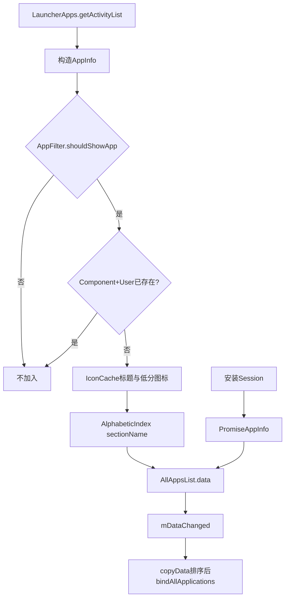
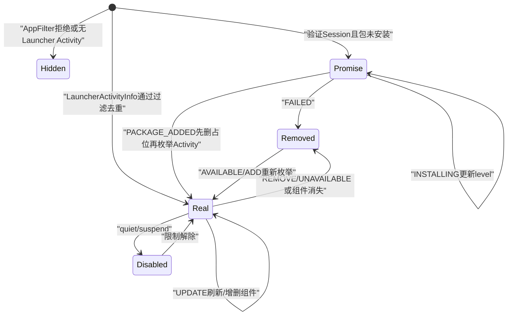

# 第507章 Android AllAppsList：应用Activity库存、AppFilter、组件去重、Promise App、更新删除和变更通知链

> 源码基线：Android 11 / API 30 / `android-11.0.0_r48`。本章直接写入正式学习目录，只在macOS只读分析源码，不编译。核心文件：`model/AllAppsList.java`、`model/data/AppInfo.java`、`PromiseAppInfo.java`、`LoaderTask.java`、`PackageUpdatedTask.java`和`BaseModelUpdateTask.java`。

## 1. 本章解决什么问题

All Apps抽屉里“一款App一项”准确吗？同包多个Launcher Activity怎样表示？隐藏App在哪过滤？安装中Promise App如何进入和消失？为什么修改了列表却可能不回调UI？本章逐个回答。

## 2. 一句话定位

AllAppsList是以`ComponentName+UserHandle`去重的可启动Activity库存，它负责过滤、标题图标与字母分区、安装占位、包事件增删改和变更标记；BaseModelUpdateTask再按change flag把排序快照绑定给UI。

## 3. 它不是已安装包清单

一个包可声明多个`ACTION_MAIN+CATEGORY_LAUNCHER` Activity，于是AllApps可有多个AppInfo；没有Launcher Activity的已安装包不会自然出现在这里。

## 4. 总体数据链



## 5. data是公开ArrayList

初始容量42只是减少常见扩容，并非数量限制。字段public意味着调用者能遍历甚至修改，正确性依赖MODEL_EXECUTOR和代码约定。

## 6. AllAppsList没有synchronized方法

与BgDataModel不同，它自身不普遍加锁。Loader和ModelUpdateTask通常在串行MODEL_EXECUTOR访问；个别任务显式`synchronized(apps)`是局部协议。

## 7. 一项AppInfo代表什么

AppInfo主要保存componentName、user、启动Intent、标题、图标、sectionName和运行时状态；container固定为`CONTAINER_ALL_APPS`。

## 8. AppInfo不对应favorites行

All Apps库存来自PackageManager/LauncherApps，通常没有数据库ID。拖到首页时`makeWorkspaceItem()`才生成WorkspaceItemInfo并由ModelWriter分配favorites ID。

## 9. 启动Intent是显式MAIN

`makeLaunchIntent`设置ACTION_MAIN、CATEGORY_LAUNCHER、目标Component，以及NEW_TASK和RESET_TASK_IF_NEEDED标志。

## 10. 去重键包含用户

`findAppInfo(component,user)`同时比较ComponentName和UserHandle。个人与工作资料相同组件可各有一项。

## 11. 同包不同Activity不去重

Component不同就能同时存在；“按包名去重”是错误理解。

## 12. AppFilter是加入前的业务门

普通`add`先调用`mAppFilter.shouldShowApp(component)`。默认实现返回true，但ResourceBasedOverride允许产品替换隐藏规则。

## 13. AppFilter不是系统可用性判断

LauncherApps已经给出可启动Activity；Filter是Launcher产品展示政策。被Filter隐藏不等于包被禁用或用户无启动权限。

## 14. 过滤发生在图标加载之前

隐藏项直接return，不访问IconCache，不设置mDataChanged，降低无用工作。

## 15. 重复项也直接return

已存在同Component+User时，普通add不更新标题图标。包更新应走`updatePackage`，不能靠重复add刷新。

## 16. 普通add取得低分图标

`getTitleAndIcon(..., true)`允许All Apps库存先使用低分辨率缓存；后续IconCache UpdateHandler再批量刷新。

## 17. sectionName来自当前Locale索引

AlphabeticIndexCompat按标题计算字母分区。它不是简单取第一个UTF-16字符，对中文与多语言可能产生本地化bucket。

## 18. add成功才标changed

data.add后`mDataChanged=true`。被Filter或重复挡住时不触发后续全量All Apps绑定。

## 19. mDataChanged是脏位不是版本号

它只表示“上次reset后至少发生过一次变化”，不记录变化次数、项目集合或代际。

## 20. getAndReset具有消费语义

读取旧值后立即置false；若调用者消费后没有真正安排UI回调，这次脏信号不会自动恢复。

## 21. 普通加入时序

```mermaid
sequenceDiagram
    participant T as "MODEL_EXECUTOR任务"
    participant L as "AllAppsList"
    participant F as "AppFilter"
    participant I as "IconCache/Index"
    participant B as "BaseModelUpdateTask"
    participant U as "主线程Callbacks"
    T->>L: "add(AppInfo,LauncherActivityInfo)"
    L->>F: "shouldShowApp(component)"
    L->>L: "findAppInfo(component,user)"
    L->>I: "加载标题图标并算section"
    L->>L: "data.add; changed=true"
    T->>B: "bindApplicationsIfNeeded"
    B->>L: "getAndResetChangeFlag"
    B->>L: "copyData + getFlags"
    B->>U: "bindAllApplications快照"
```

## 22. Loader全量加载先clear

`loadAllApps`调用clear，再按profile枚举LauncherActivityInfo并add。clear把data清空且把changed设false。

## 23. clear不把“列表变空”标为变化

因为全量Loader随后无条件调用LoaderResults.bindAllApps；若单独调用clear却依赖change flag，则UI不会自动获知。

## 24. clear重建字母索引

Locale可能变化，因此重新用`LocaleList.getDefault()`构造AlphabeticIndexCompat。旧AppInfo sectionName也随data一起丢弃。

## 25. clear不重置mFlags

权限和quiet mode bits保留，Loader随后逐项setFlags覆盖相关bit。

## 26. setFlags无论实际变化都置脏

enabled为true就OR、false就AND NOT，之后无条件`mDataChanged=true`。重复设置相同值也会触发一次绑定机会。

## 27. 三个flags

分别表示Shortcut Host权限、任一profile quiet mode、Launcher能否修改quiet mode。它们与每个AppInfo的disabled位是不同粒度。

## 28. hasShortcutHostPermission读同一flags

Loader第三阶段据此决定是否查询Deep Shortcuts。All Apps展示能力位会影响另一个库存的加载。

## 29. getFlags只是返回int

没有复制或锁；调用线程要遵守Model执行协议。

## 30. Loader末尾为何reset change flag

全量Loader会直接bindAllApps，不需要BaseModelUpdateTask再因逐项add触发第二次绑定，所以调用`getAndResetChangeFlag()`吃掉构建期间脏位。

## 31. copyData才建立输出顺序

内部data保持加入顺序；copyData转数组后按`COMPONENT_KEY_COMPARATOR`排序。

## 32. 这个排序不是字母排序

Comparator先比较`user.hashCode()`差，再比较ComponentName。UI侧AllAppsStore/适配器还会按标题和section做实际展示排序。

## 33. user hash相减存在理论边界

比较器直接做整数减法，理论上可能溢出；Android UserHandle hash取值受控，r48没有使用Integer.compare。

## 34. copyData是浅快照

数组容器新建，AppInfo对象仍共享。后台稍后修改level、图标或flags，已排队回调引用也可能看到新字段。

## 35. addPackage按包枚举Activity

它调用LauncherApps.getActivityList(package,user)，为每个结果构造AppInfo并走普通add，因此应用Filter与组件去重。

## 36. 空Activity列表不报错

循环零次，不设置changed。一个刚安装但无Launcher入口的包不会出现在抽屉。

## 37. removePackage反向遍历

从size-1到0删除，避免ArrayList删除导致后续索引移动而漏项。

## 38. removePackage按包+用户删除全部组件

同包两个Launcher Activity会全部移除；其他user的同包项保留。

## 39. removeApp是统一删除点

它data.remove(index)，标changed，并调用当前remove listener。ArrayList合法index下removed不会为null，null检查仍保留。

## 40. remove listener不是常驻多播

只有一个Consumer字段，默认NO_OP；`trackRemoves`临时替换，返回SafeCloseable用于恢复NO_OP。

## 41. 嵌套trackRemoves不安全

第二次会覆盖第一次listener，任一close都设NO_OP而不是恢复前一个Consumer。当前源码只在局部try-with-resources单层使用。

## 42. updatePackage先取得当前匹配集

LauncherApps按package+user返回现有可启动Activity；size>0走差分更新，size==0走整包移除。

## 43. 差分第一步删消失组件

反向扫描data中同包同user项，若其Component不在matches就removeApp。

## 44. 日志“Changing shortcut target”容易误导

AllAppsList这里只删除AppInfo，没有修改Workspace Shortcut target；PackageUpdatedTask后续才处理Workspace项。

## 45. 差分第二步增改现有组件

逐个LauncherActivityInfo查findAppInfo；没有就普通add，已有就刷新标题/图标、sectionName并置changed。

## 46. 更新现有项不重新走AppFilter

若产品Filter运行期规则变化，updatePackage找到已有AppInfo后不会再shouldShowApp；新增组件才走Filter。通常规则稳定，动态Filter需额外重载。

## 47. matches为空时清IconCache单项

对每个data项先`mIconCache.remove(component,user)`再removeApp。PackageUpdatedTask的OP_REMOVE还会在外层removeIconsForPkg清整包缓存。

## 48. updateIconsAndLabels只刷新指定包集合

按user和package HashSet匹配，调用IconCache.updateTitleAndIcon并重算section，每个命中都置changed。

## 49. 它不重新查询Launcher Activity列表

适合图标/标签缓存变化，不发现新增或消失Component；组件结构变化应走updatePackage。

## 50. updateDisabledFlags使用Matcher

ItemInfoMatcher可按包、用户等匹配；FlagOp对runtimeStatusFlags增加、移除或组合bit。

## 51. 即使FlagOp结果不变也置脏

每个matcher命中项都会`mDataChanged=true`，没有比较旧新int。

## 52. disabled不等于从列表移除

quiet、suspended、not available等状态通常保留AppInfo，让UI展示禁用态；真正包移除才removePackage。

## 53. AppInfo构造记录quiet状态

用户quiet时加`FLAG_DISABLED_QUIET_USER`；PackageUpdatedTask在profile可用性变化时批量更新。

## 54. AppInfo还记录suspended

`updateRuntimeFlagsForActivityTarget`读取ApplicationInfo并加SUSPENDED，同时写SYSTEM_YES或SYSTEM_NO。

## 55. adaptive icon位有用户限制

目标SDK至少O、当前运行用户等于Activity用户时才加ADAPTIVE_ICON；非主profile图标带badge，不被视为完全相同的adaptive icon。

## 56. AppInfo copy会复制Intent

copy构造调用super并new Intent，trim title，复制component/user/runtime flags；sectionName在这段构造中未显式复制，应结合父类字段确认使用场景。

## 57. makeWorkspaceItem生成另一种对象

AppInfo不会直接塞进favorites；转换成WorkspaceItemInfo后才带首页容器、位置和数据库语义。

## 58. Promise App是什么

它是安装尚未完成时在All Apps出现的AppInfo子类，包含进度level和market Intent能力。

## 59. addPromiseApp先检查包是否已安装

PackageManagerHelper.getApplicationInfo返回非null就不加占位，避免已安装应用同时出现Promise项。

## 60. Promise构造使用Session component

Intent同样是MAIN/LAUNCHER显式组件，组件来自PackageInstallInfo，而不是LauncherApps当前Activity列表。

## 61. Promise也从IconCache取标题图标

根据`info.usingLowResIcon()`决定分辨率，再计算字母section。

## 62. Promise加入没有调用AppFilter

源码直接data.add，不经过`shouldShowApp`。产品隐藏规则若也应覆盖安装占位，需要额外处理。

## 63. Promise加入没有组件去重

它也不调用findAppInfo。重复Session事件或不同Session映射同Component，理论上可加入重复Promise项；上层SessionHelper验证与事件协议承担约束。

## 64. Promise user字段来自哪里

PromiseAppInfo构造本身没有显式设置user；需看ItemInfo默认值。在r48 ItemInfo默认user是`Process.myUserHandle()`，这与后续更新只查主用户相呼应。

## 65. Promise转Workspace会加两个状态

设置安装进度、AUTOINSTALL_ICON和RESTORE_STARTED，表示用户手动拖到首页后不应因暂未安装而被Loader自动删除。

## 66. market Intent用于安装页

占位点击可由PackageManagerHelper构造市场Intent；能否解析取决于设备市场应用。

## 67. updatePromiseInstallInfo固定主用户

方法先`UserHandle user=Process.myUserHandle()`，不使用`installInfo.user`来匹配。这是r48多用户Promise All Apps的限制。

## 68. 更新匹配包名而非完整component

要求target component包名等于installInfo.packageName、AppInfo.user为主用户且对象是PromiseAppInfo。

## 69. INSTALLING只更新level

找到后设置progress并return该对象；没有设置mDataChanged，因为专门回调`bindPromiseAppProgressUpdated`负责局部UI刷新。

## 70. FAILED调用removeApp

移除会设置changed并通知remove listener；方法随后继续循环，但data缩短且i递增，若存在相邻重复Promise可能跳过一个。

## 71. FAILED最终返回null

失败分支不return removed对象，所以PackageInstallStateChangedTask不会发progress局部回调，而通过`bindApplicationsIfNeeded`发全量列表。

## 72. Promise更新与普通包事件分工

安装成功通常由PACKAGE_ADDED处理：若Promise功能开启，PackageUpdatedTask先removePackage占位，再addPackage真实Activity。

## 73. Instant App是成功例外

PackageInstallStateChangedTask对STATUS_INSTALLED检查Instant App，主动调用onPackageAdded，因为这类安装可能没有普通package-add事件。

## 74. 安装任务显式锁apps

它在`synchronized(apps)`内更新Promise、安排局部回调并调用bindApplicationsIfNeeded；AllAppsList本身的方法没有内建锁。

## 75. 绑定时change flag已被消费

bindApplicationsIfNeeded先reset，再copyData/getFlags并schedule回调。schedule失败或Callbacks代际淘汰不会恢复flag。

## 76. PackageUpdatedTask通常串行执行

由LauncherModel enqueue到MODEL_EXECUTOR；它没有统一`synchronized(apps)`，依赖执行器串行，与安装任务的显式锁形成不完全一致的风格。

## 77. OP_ADD的处理

先更新包IconCache；Promise功能开启时removePackage清占位；再addPackage枚举真实Launcher Activity。

## 78. removePackage也会删真实同包项

OP_ADD前的清理按包+user删除所有All Apps项，不只instanceof Promise；正常PACKAGE_ADDED时该user尚不应有真实旧项，重复事件则会先删再重建。

## 79. OP_UPDATE使用trackRemoves

临时listener收集因组件消失被removeApp的ComponentName，供后续Workspace修复/删除逻辑判断。

## 80. OP_UPDATE还清Widget预览缓存

每个包调用WidgetCache.removePackage，避免Widget preview/信息沿用旧APK内容；它不是AllAppsList内部职责。

## 81. OP_REMOVE与UNAVAILABLE共享移除

REMOVE先清整包IconCache后贯穿UNAVAILABLE，二者都从AllApps与WidgetCache移除；之后Workspace item通常加NOT_AVAILABLE或被后续匹配删除。

## 82. UNAVAILABLE不等于卸载

外置存储暂不可用等场景仍可恢复，Workspace用disabled位保留；All Apps暂时移除入口。

## 83. SUSPEND/UNSUSPEND不移除项

只用FlagOp修改匹配AppInfo和WorkspaceItemInfo的SUSPENDED位，保持位置和组件身份。

## 84. USER_AVAILABILITY_CHANGE按User匹配

重新构建UserManagerState，给该user所有AppInfo加/去QUIET_USER，并更新全局“是否任一profile quiet”flag。

## 85. “int操作原子”注释边界

代码说setFlags无需同步因为int操作原子；但read-modify-write与mDataChanged组合并非通用并发事务。正确性仍主要依赖MODEL_EXECUTOR串行。

## 86. bindApplicationsIfNeeded在包任务中只调一次

多个package批量处理累积一个脏位，最后生成一份数组快照，避免每包全量绑定。

## 87. 全量绑定不是差量Adapter操作

Callbacks收到完整AppInfo[]和flags；UI侧AllAppsStore再比较/替换。remove listener只服务模型任务收集，不直接通知View。

## 88. copyData按组件稳定化快照

无论包事件到达顺序如何，输出数组先按User/Component排序，降低绑定结果受内部插入顺序影响。

## 89. 标题section与输出排序分离

sectionName用于UI字母索引，copyData comparator不使用title。Locale变化需全量clear/reload才能系统性重算所有section。

## 90. 图标更新可能二次绑定

Loader先用缓存构建并bind All Apps，再由IconCacheUpdateHandler发现变化，通过onPackageIconsUpdated和CacheDataUpdatedTask刷新标题图标并触发新绑定。

## 91. Filter变化没有监听器

AppFilter实例在LauncherModel构造时注入；AllAppsList不订阅Filter规则。产品若动态隐藏，需要主动forceReload或模型任务。

## 92. Component启停走updatePackage

matches差分会移除被disable/删除的Activity，加入新enable Activity；包仍安装不代表组件集合不变。

## 93. 同包多个入口共享IconCache包更新

PackageUpdatedTask先按包刷新缓存，AllAppsList再逐Component取标题图标。

## 94. mRemoveListener只对removeApp生效

clear直接`data.clear()`不会逐项通知；调用者不能用trackRemoves观察全量重载清空。

## 95. addPromiseApp也不触发listener

listener只关心移除，新增需要change flag和绑定快照表达。

## 96. Promise失败重复项风险

失败循环从前向后且删除当前index，若异常存在相邻同包Promise，下一项左移后i++可能被跳过。这再次说明上层必须避免重复占位。

## 97. 普通removePackage不会跳项

它反向遍历，因此即便同包有多个Activity或重复异常项也会全部删除。

## 98. updatePackage移除也反向遍历

差分删除旧组件安全；新增/更新遍历matches，普通add再防Component+User重复。

## 99. Promise与真实App类型差异

PromiseAppInfo继承AppInfo，所以多数UI可统一展示；但安装进度、market Intent、Workspace转换状态仅子类提供。

## 100. Promise level不是持久化真值

它来自Session事件的进程内字段；进程重启后Loader通过当前已验证Session重新构造。

## 101. AllApps flags也不是永久存储

每次Loader从当前权限与UserManager状态计算，不写SharedPreferences或数据库。

## 102. AppInfo runtime flags是投影

suspended、quiet、system/adaptive等来自当前系统事实，不是favorites schema字段。

## 103. data可能在绑定后继续变

copyData只冻结成员数组，AppInfo共享；局部Promise progress回调正是有意修改同一个对象。

## 104. UI应尊重Callbacks代际

BaseModelUpdateTask的scheduleCallbackTask会检查当前Callbacks；LoaderResults还用lastBindId淘汰旧全量绑定。AllAppsList自身不保存UI代际。

## 105. 诊断重复图标的顺序

先比较user+component，判断是合法多Activity还是同键重复；再看对象是否Promise、Session是否重复，以及是否绕过普通add直接改data。

## 106. 诊断缺失图标的顺序

先查LauncherApps activity list，再查AppFilter，再看profile/user和quiet/unavailable事件，最后确认change flag是否被消费却未成功绑定。

## 107. 诊断旧标题图标

确认收到OP_UPDATE或CacheDataUpdatedTask、IconCache是否刷新、sectionName是否重算，以及最新AppInfo[]是否到达当前Callbacks。

## 108. 诊断安装占位残留

检查PACKAGE_ADDED是否触发、OP_ADD是否执行removePackage+addPackage、Promise user是否主用户，以及Session失败前向删除是否遇到异常重复项。

## 109. 状态与故障图



## 110. 推荐静态验证矩阵

用“同包双Activity、同Component双User、Filter隐藏、主用户Promise、工作资料Session、组件改名、quiet/suspend”七组场景，记录data、changed、flags、remove listener和最终Callbacks。

## 111. 推荐的不变量

普通真实App不应出现重复Component+User；所有真实项都应通过AppFilter；Promise重复由上层避免；一次批量任务只在最终需要时消费change flag并生成完整快照。

## 112. macOS只读练习一：手算普通add

执行`sed -n '80,180p' packages/apps/Launcher3/src/com/android/launcher3/model/AllAppsList.java`，依次加入同包Activity A、Activity B、重复A、不同User的A和Filter拒绝C，写出data与mDataChanged变化。

## 113. macOS只读练习二：推演updatePackage

旧库存为A/B，新LauncherApps matches为B/C。逐行推演反向删除A、更新B、添加C、remove listener、IconCache、sectionName和最终copyData，说明Workspace为何还需PackageUpdatedTask后半段。

## 114. macOS只读练习三：推演Promise

阅读PromiseAppInfo和PackageInstallStateChangedTask，推演主用户INSTALLING→FAILED与INSTALLING→PACKAGE_ADDED；再把user换成工作资料，指出固定`Process.myUserHandle()`匹配带来的边界。

## 115. macOS只读练习四：验证脏位

执行`rg -n "mDataChanged|getAndResetChangeFlag|bindApplicationsIfNeeded|setFlags" packages/apps/Launcher3/src/com/android/launcher3/model`。列出add、remove、update、flags、clear、progress更新哪些置脏，哪些用专门局部回调。

## 116. 易错点一：All Apps不是包列表

它是Launcher Activity列表，同包多入口合法；唯一性键是Component+User。

## 117. 易错点二：sectionName不决定copyData顺序

section按本地化标题计算，模型输出数组却按User/Component排序，最终视觉排序在UI层完成。

## 118. 易错点三：Promise不走普通add门

它不经过AppFilter或findAppInfo，且更新只匹配主用户；不能把普通App不变量无条件套给安装占位。

## 119. 易错点四：changed不等于UI已更新

脏位必须被bindApplicationsIfNeeded消费并成功执行当前Callbacks；它不是事件日志、版本号或渲染完成信号。

## 120. 本章总结与下一章

AllAppsList以Component+User管理真实可启动Activity，用Filter、IconCache、section和运行状态形成展示投影，通过change flag批量绑定；Promise App则是更宽松的Session占位旁路。下一章进入ModelWriter，分析内存对象、favorites写任务、container迁移、延迟删除与失败不回滚边界。
