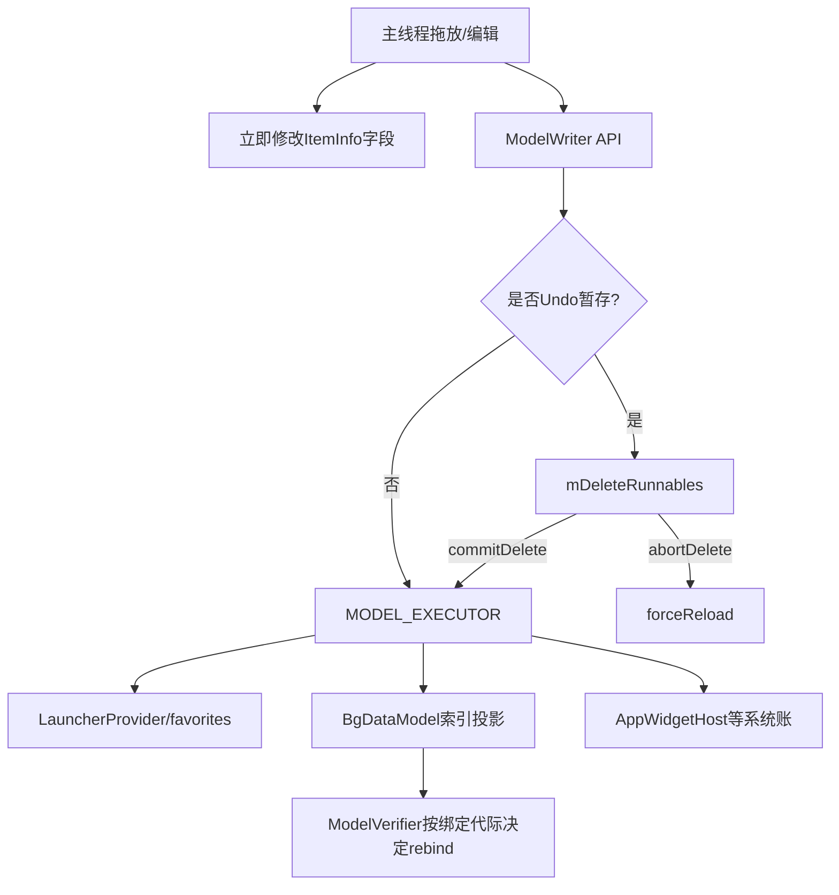
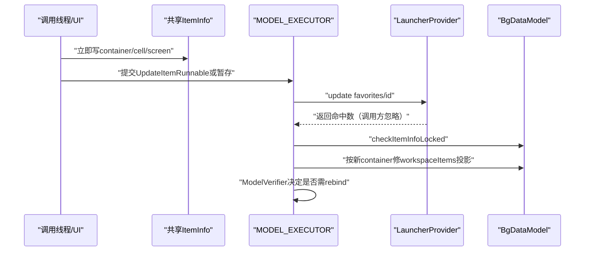
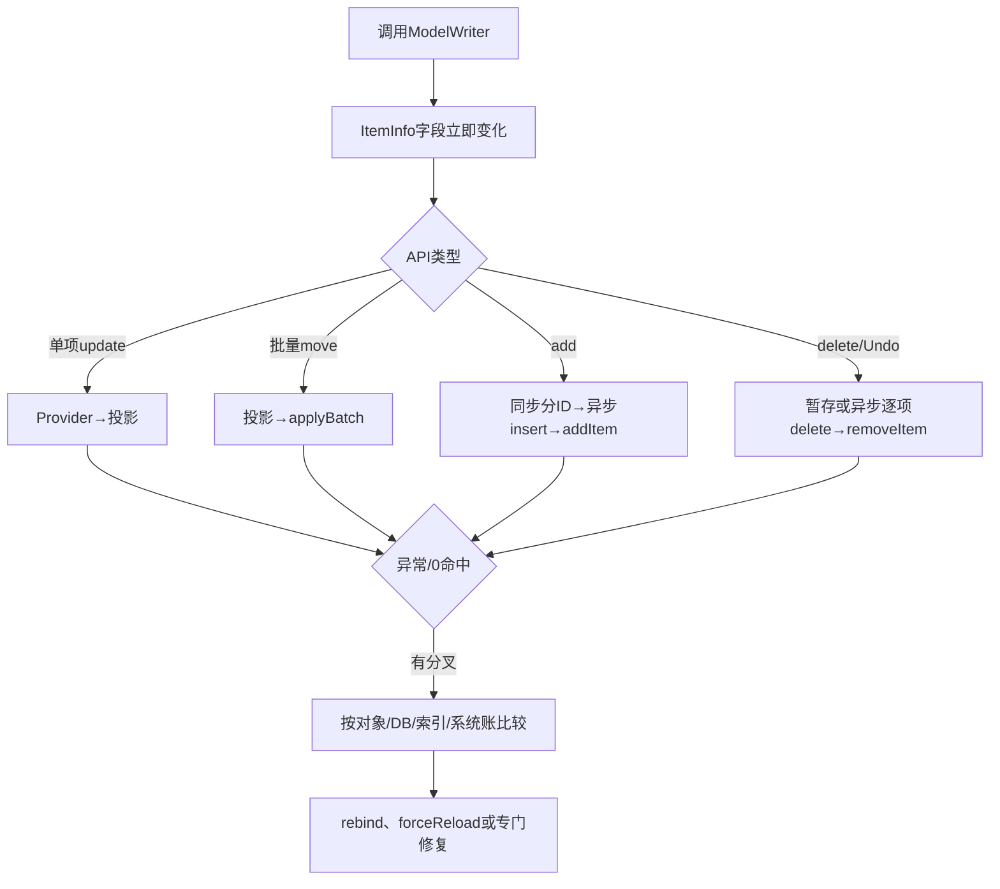

# 第508章 Android ModelWriter：对象先改、异步数据库写、Container投影、延迟删除、Undo和失败一致性链

> 源码基线：Android 11 / API 30 / `android-11.0.0_r48`。文档直接写入正式目录；只在macOS复读本地源码，不编译。核心文件：`model/ModelWriter.java`、`BgDataModel.java`、`LauncherProvider.java`、`ContentWriter.java`，并结合Workspace、Folder和DeleteDropTarget调用点。

## 1. 本章解决什么问题

拖动图标时是先改View、内存还是数据库？批量移动失败会回滚吗？Undo删除为何要forceReload？Widget ID与favorites谁先删？ModelVerifier到底验证数据还是绑定时序？本章逐条还原。

## 2. 一句话定位

ModelWriter是UI对象与LauncherModel持久化之间的异步写协调器：调用线程先修改ItemInfo并分配ID，再向MODEL_EXECUTOR投Provider操作，随后维护BgDataModel投影；删除可暂存供Undo，但各账之间没有统一事务。

## 3. 先分四份账

四份账是UI/View树、共享ItemInfo及BgDataModel索引、favorites SQLite、AppWidgetHost/ShortcutManager等系统账。ModelWriter只协调部分顺序，不能原子提交全部。

## 4. 总体写入图

## 5. ModelWriter不是全局单例

Launcher从LauncherModel取得Writer，构造参数包含当前vertical hotseat方向和是否验证变化；BaseModelUpdateTask也可取得Writer。不同实例各有自己的Undo队列。

## 6. mHasVerticalHotseat是构造快照

它决定Hotseat canonical screenId换算。设备配置改变后Launcher通常重建相关对象；旧Writer不会自动更新这个boolean。

## 7. mVerifyChanges控制ModelVerifier

Launcher正式Writer传true，后台任务创建的Writer可能按调用者配置。关闭只跳过绑定代际复核，不跳过数据库与内存写。

## 8. mUiHandler固定主Looper

ModelVerifier最终把判断post到主线程；它不直接在MODEL_EXECUTOR调用Launcher callbacks。

## 9. updateItemInfoProps先改对象

container、cellX、cellY在调用API时立即写入ItemInfo；非Hotseat再写传入screenId。这个动作发生在数据库Runnable排队之前。

## 10. Hotseat screenId使用canonical位置

横向Hotseat用cellX；vertical bar用`numHotseatIcons-cellY-1`。数据库不直接保存当前视觉方向的二维坐标含义。

## 11. screenId参数在Hotseat会被忽略

调用者传入screenId不成为最终值；canonical槽位由方向和cell决定。

## 12. addOrMove以NO_ID分支

item.id等于ItemInfo.NO_ID说明尚未持久化，走add；否则走move。它不查询数据库确认该ID真的存在。

## 13. ID存在不等于行存在

若对象有陈旧ID而favorites行已丢失，move发update可能命中0行；Provider返回count但UpdateItemRunnable没有检查。

## 14. checkItemInfoLocked比较对象身份

itemsIdMap已有同ID不同对象时通常抛RuntimeException，防止两个Java对象分别代表同一数据库行。

## 15. 生产环境有宽松等价例外

非debug且非Studio、双方都是WorkspaceItemInfo时，标题、Intent过滤等价、ID/type/container/位置/span都同即可return，不强求同一引用。

## 16. 宽松比较不含全部字段

rank、user、status、bitmap等不在这段相等条件中，所以“for all intents and purposes”只覆盖实现列出的字段。

## 17. title.toString存在空值假设

宽松分支直接对modelItem.title与item.title调用toString；正常WorkspaceItem标题应已初始化，异常null可能在一致性检查自身触发NPE。

## 18. 调用栈在排队前捕获

Add和Update runnable保存创建时StackTrace，异步发现对象不一致时把异常栈改回原调用位置，便于定位谁提交了错误对象。

## 19. moveItemInDatabase的步骤

先改对象位置，再创建UpdateItemRunnable，Writer Supplier只写container/cell/rank/screen，最后经`enqueueDeleteRunnable`处理。

## 20. move为什么也走Delete队列

这个公用队列实际是“Undo窗口期间延后执行的写任务”，名字偏窄。prepareToUndo开启时，move也可能暂存到commit/abort。

## 21. 单项移动时序

## 22. Supplier延迟生成ContentValues

UpdateItemRunnable执行时才调用mWriter.get。Supplier捕获可变item，所以rank等字段若在排队后又变化，写入值可能不是API调用瞬间快照。

## 23. mItemId却在构造时快照

URI使用构造时保存的ID；即使item.id后来改变，更新仍发给旧ID，但Writer可读取对象的新字段，形成混合时点。

## 24. 单项Update先数据库后索引

ContentResolver.update返回后才调用updateItemArrays。若update抛异常，后者不执行；但ItemInfo字段早在调用线程已变。

## 25. Update不检查受影响行数

命中0行仍继续修BgDataModel投影。内存可认为移动成功，而数据库没有该行。

## 26. Provider内部同进程update不forceReload

LauncherProvider只对外部PID写入forceReload；ModelWriter负责本进程内存更新，避免每次操作全量Loader。

## 27. moveItems批量API假设cell已更新

注释说明每个ItemInfo的cellX/cellY由调用者预先写好；方法再统一写container与screen canonical值。

## 28. 批量值在调用时快照

每项生成独立ContentValues保存container/cell/rank/screen；与单项Supplier不同，后续对象字段变化不会改变这些values。

## 29. 批量也走Undo队列

整个UpdateItemsRunnable作为一个Runnable暂存，但内部数据库使用applyBatch。

## 30. 批量先修内存再applyBatch

run构造每条ContentProviderOperation时立即调用updateItemArrays，循环结束才进入try调用ContentResolver.applyBatch。

## 31. 这与单项顺序相反

单项是DB→投影；批量是投影→DB batch。不能概括成ModelWriter始终“先数据库后内存”。

## 32. applyBatch异常被吞掉

catch Exception只`printStackTrace()`，不forceReload、不恢复对象/投影，也不向调用者报告失败。

## 33. Provider batch本身有SQLite事务

LauncherProvider.applyBatch包住数据库Transaction；batch SQL要么整体成功要么回滚。但ModelWriter此前的Java对象和投影不在该事务中。

## 34. 批量失败形成明显分叉

UI对象与workspaceItems已按新位置，SQLite仍是旧值；下次forceReload或进程重启才会重新以DB为准。

## 35. 批量ops为空也会applyBatch

items为空时构造空列表并调用Provider；没有专门early return。

## 36. modifyItem还更新span

先改container/cell/screen，再立即改spanX/spanY，随后直接`MODEL_EXECUTOR.execute`单项Update。

## 37. modify不经过Undo暂存

与move不同，它绕过enqueueDeleteRunnable。Undo窗口不会延迟resize写入。

## 38. updateItemInDatabase写完整对象

Runnable执行时调用`item.onAddToDatabase(ContentWriter)`，让具体子类序列化全部相关字段。

## 39. update也不经过Undo队列

标题、Folder option、恢复状态等更新立即排MODEL_EXECUTOR，即使mPreparingToUndo为true。

## 40. 完整update同样延迟取字段

onAddToDatabase在Runnable执行时调用，可能看到排队后发生的新变化；它是一种合并写效果，也可能模糊每次调用边界。

## 41. addItem先改位置再取ID

updateItemInfoProps后，通过Provider call `METHOD_NEW_ITEM_ID`同步取得ID并立即写到对象。

## 42. ID分配发生在调用线程

ContentResolver.call可能进入Provider并打开数据库；真正insert仍排到MODEL_EXECUTOR。对象在两者之间处于“有持久化ID、尚无数据库行”的状态。

## 43. ID预留不是数据库行事务

Provider只增加Helper内存max ID并返回；进程在insert前结束会留下ID空洞。主键不要求连续，空洞可接受。

## 44. Add在执行时序列化

注释明确后台写时某些属性可能已在后台更新，因此Runnable中才调用onAddToDatabase。

## 45. insert后才加入BgDataModel

正常路径`cr.insert`返回，再锁BgDataModel、检查同ID对象、addItem(newItem=true)并verify。

## 46. insert返回值未检查

若Provider以null表示失败但不抛异常，代码仍加入内存；r48 Provider正常dbInsertAndCheck返回URI，异常通常抛出。

## 47. insert抛异常时不会add

Runnable没有catch，MODEL_EXECUTOR如何记录未捕获异常由执行器决定；对象仍保留已分配ID与新位置，UI可能已显示。

## 48. Add不经Undo队列

新增始终直接execute；DeleteDropTarget Undo主要围绕删除，不提供“撤销新增”的持久化缓冲。

## 49. addItem(newItem=true)有系统副作用

若是首个Deep Shortcut引用，会pin系统Shortcut；这发生在数据库insert之后，但仍不与SQLite同事务。

## 50. 新Folder child关系由UI维护

BgDataModel.addItem(newItem=true)遇非顶层item不会自动加入Folder.contents，只在Folder缺失时记错误。拖放代码必须已修改FolderInfo。

## 51. 删除API先记录诊断栈

FileLog输出目标包集合并附new Exception，便于追踪删除来源；无target component写空字符串。

## 52. matcher版本何时取快照

`matcher.filterItemInfos(mBgDataModel.itemsIdMap)`在调用线程立即生成Collection，然后交给通用删除；执行前模型变化不会重新匹配。

## 53. 普通删除逐项执行

一个Runnable内对每项：按ID URI delete数据库，再BgDataModel.removeItem，再verify。

## 54. 删除不检查count

数据库已无行时仍从内存移除；这可帮助收敛幽灵内存项，也可能掩盖持久化分叉。

## 55. 中途异常没有整体事务

Collection多个item逐个Provider.delete；第N项抛异常时，前N-1项已提交，后续未执行。它不是批量原子删除。

## 56. Provider每次delete使backup失效

首个成功delete可drop GridBackup/Hotseat restore表；后续失败也不能恢复已失效备份。

## 57. Folder级联删除分两次Provider操作

先按container删除child rows并移除内存contents，再按Folder ID删除父行并移除Folder。

## 58. Folder级联也无跨操作事务

child delete成功而父delete失败，会留下空Folder行；反向异常点也可能形成内存/DB差异。

## 59. info.contents在中途clear

先BgDataModel.removeItem(contents)，再`info.contents.clear()`；之后才删父行。异常恢复需要从DB重载而非靠原对象contents。

## 60. removeItem(contents)可能触发unpin

Deep Shortcut child删除会递减引用并可能调用系统pinShortcuts，进一步扩展跨账范围。

## 61. deleteWidgetInfo先安排Host删除

host非null、非custom、且ID已分配时，先enqueue `deleteAppWidgetId`，之后调用deleteItemFromDatabase再enqueue DB/模型删除。

## 62. 注释说Host调用返回前写盘

这只描述AppWidgetHost服务端持久化语义，不代表接下来的favorites delete必然成功。

## 63. 两个Widget删除任务不是一个Runnable

正常模式下分别execute到同一串行MODEL_EXECUTOR，顺序通常保持；Undo模式下分别进入mDeleteRunnables，commit时也逐个post。

## 64. Host先删失败的后果

若Host ID释放成功而DB delete失败，favorites留下指向无效ID的Widget，Loader下次需按restore/provider状态处理。

## 65. custom widget不删除Host ID

它不是系统AppWidgetHost分配实例，只删除favorites与模型对象。

## 66. Undo删除状态只有两个字段

`mPreparingToUndo`加Runnable列表，没有token、generation、嵌套层级或超时。

## 67. prepareToUndoDelete只在false时初始化

已经Preparing时重复调用无操作，不创建嵌套事务。

## 68. 遗留队列检查只在Studio抛错

首次prepare发现列表非空，Studio build抛IllegalStateException；其他构建直接clear，静默丢弃旧未提交任务。

## 69. prepare本身不改UI

DeleteDropTarget通常已让View/Folder对象进入删除交互状态；ModelWriter只决定持久化Runnable何时执行。

## 70. enqueueDeleteRunnable是总门

Preparing时append；否则直接投MODEL_EXECUTOR。受它控制的不仅delete，也包括move与批量move。

## 71. commitDelete先关闭Preparing

然后按列表顺序逐个execute，最后clear。新并发调用在flag关闭后会直接post，可能与commit循环交错；常规调用来自主线程避免该竞态。

## 72. commit不是数据库commit

它只把暂存Runnable投队列，不等待执行完成，更不把多个任务包成SQLite事务。

## 73. commit返回不等于删除完成

UI Snackbar结束后方法可返回，而MODEL_EXECUTOR仍在执行Host、Provider和内存清理。

## 74. abort只丢Runnable

设置Preparing=false并clear列表，没有执行数据库回滚，因为这些暂存任务尚未运行。

## 75. abort为什么forceReload

拖出Folder等UI操作已经改变Folder内部状态；简单rebind会使用被破坏的内存对象，所以从数据库全量重载恢复。

## 76. forceReload也是异步收敛

abort返回时旧View/对象未必已经恢复；LauncherModel停止旧Loader并安排新加载，最终以数据库为准。

## 77. Undo不能撤销已绕过队列的写

modify、update、add直接execute，不受Preparing控制。业务必须确保Undo窗口内需要撤销的操作都走受控API。

## 78. Undo期间对象早已变化

move调用先updateItemInfoProps再暂存Runnable。abort依赖forceReload把对象重新构建，而非将旧坐标保存在ModelWriter中。

## 79. UpdateItemRunnable用ID URI

`Favorites.getContentUri(mItemId)`形成单行URI；Provider SqlArguments把ID加入where。

## 80. ContentWriter还会加modified时间

提交ContentResolver时ContentWriter/Provider路径根据实现写业务值与modified；读具体字段时应查看两层谁负责时间戳。

## 81. updateItemArrays只维护workspaceItems

方法不移动FolderInfo.contents，注释明确Folder/Workspace.onDrop等调用点负责；也不修改appWidgets列表或itemsIdMap key。

## 82. 非顶层container只做存在性日志

若目标Folder ID不在folders，记录错误但继续。数据库与ItemInfo仍可指向不存在Folder。

## 83. modelItem从itemsIdMap再取

check之后按itemId取得当前模型对象；若null，else分支执行`workspaceItems.remove(null)`，通常无效果。

## 84. 对象已提前改成新container

modelItem通常就是item，所以updateItemArrays检查的是新container，无法从此处知道旧container。

## 85. 新顶层只加入四种类型

Application、Shortcut、Deep Shortcut、Folder若不在workspaceItems则add；Widget不加入，因为由appWidgets绑定。

## 86. 新非顶层从workspaceItems移除

如果App从Desktop移入Folder，投影移除；Folder.contents应已由UI加入。

## 87. contains按对象equals检查

通常防同一模型对象重复加入；同ID不同对象的幽灵问题仍由checkItemInfoLocked处理。

## 88. 更新完成不会主动Callbacks局部绑定

ModelWriter假定UI交互已经把View移到目标位置；它主要持久化并校验模型，不对每次move重新bind。

## 89. ModelVerifier不是内容校验器

它不遍历比较DB、itemsIdMap、workspaceItems；名字虽叫Verifier，核心是检测写任务排队期间是否发生了模型bind代际变化。

## 90. startId在提交API时捕获

每个操作创建ModelVerifier，读取当时`lastBindId`。

## 91. executeId在后台写后捕获

verifyModel被调用时再读lastBindId，然后post主线程。

## 92. currentId在主线程执行时捕获

若currentId大于executeId，说明写后已有更新绑定，旧Verifier无需处理。

## 93. executeId等于startId也不处理

表示任务从提交到执行期间没有发生bind；UI交互本身应已正确反映变化。

## 94. 只有夹在中间的bind触发rebind

若提交后、后台执行前发生过bind，而执行后到主线程检查前没有更新bind，就调用LauncherModel.rebindCallbacks。

## 95. rebind使用当前内存模型

它不强制重查数据库；与abortDelete使用forceReload不同。

## 96. 无Callbacks或verify关闭直接return

后台数据库/内存操作照常完成，只是不做代际补绑定。

## 97. lastBindId读取未统一加锁

字段是public int，Verifier直接读；主路径线程模型与主/模型Executor顺序承担可见性假设，r48未声明volatile。

## 98. 单项Update失败的三层状态

对象字段已新、workspaceItems投影可能仍旧、SQLite仍旧；如果Provider抛异常，updateItemArrays不运行。

## 99. 批量Update失败的三层状态

对象字段新、workspaceItems投影新、SQLite整体旧；异常被catch后没有自动reload。

## 100. Add失败的三层状态

对象已有新ID和位置，数据库可能无行，BgDataModel是否加入取决于insert是抛异常还是无异常返回null。

## 101. Delete失败的三层状态

若Provider抛异常，后续内存remove不执行；UI可能已移除View。若Provider零命中但不抛，内存仍删除。

## 102. Widget删除再多一份Host状态

两个异步任务任一失败都能留下DB、内存、View和Host四账分叉。

## 103. 重启为何常能“修好”

Loader以favorites为持久化主输入重新建BgDataModel，并校验Widget/provider/位置；但Host或系统Shortcut外部副作用未必能仅靠DB恢复。

## 104. Provider外部reload不救本进程写

ModelWriter调用来自同PID，LauncherProvider不会forceReload；设计假设Writer正确维护共享模型。

## 105. 排障先确认API类型

move、moveItems、modify、full update、add、delete、folder delete、widget delete的顺序和失败策略不同，不能只搜到一个ContentResolver调用就类推全部。

## 106. 再确认是否处于Undo窗口

Preparing会延迟move/delete/Widget Host任务，却不延迟modify/update/add；时序日志必须标出prepare、commit或abort。

## 107. 然后比较四个完成点

对象字段已改、Runnable已入队、Provider操作返回、BgDataModel投影更新是四个完成点；UI像素和ModelVerifier rebind还在其外。

## 108. 诊断批量移动重点

查applyBatch异常日志，同时打印favorites旧坐标与ItemInfo/workspaceItems新投影；这是r48最明显的内存先行失败窗口。

## 109. 写入与失败图

## 110. 推荐测试矩阵

覆盖单项update抛异常/零命中、batch第二项失败、insert null/throw、Folder父删除失败、Widget Host成功DB失败、Undo commit/abort，以及提交间lastBindId变化。

## 111. 推荐源码阅读顺序

先看调用点何时改View与Folder.contents，再进ModelWriter看对象字段和队列，接着看LauncherProvider返回/异常，最后检查BgDataModel和ModelVerifier；否则容易把UI已动误当DB已写。

## 112. macOS只读练习一：对比单项与批量

执行`sed -n '145,230p' packages/apps/Launcher3/src/com/android/launcher3/model/ModelWriter.java`和`sed -n '360,430p' .../ModelWriter.java`，画出move、moveItems、modify的对象、ContentValues、DB、投影顺序。

## 113. macOS只读练习二：推演Undo

阅读prepare/enqueue/commit/abort，假设依次暂存Widget Host删除、Widget DB删除、另一个item move；分别推演commit与abort，说明为什么commit不是原子事务、abort为何必须forceReload。

## 114. macOS只读练习三：推演Folder删除

给Folder 10两个child，其中一个Deep Shortcut。逐步写出child rows、pinned count、contents、父row、folders/workspaceItems/itemsIdMap的变化，并在每一步插入异常观察残留。

## 115. macOS只读练习四：手算ModelVerifier

分别取`startId/executeId/currentId`为5/5/5、5/6/6、5/6/7，判断是否rebind；再解释这个检查为何不能证明Provider更新命中一行或数据库等于内存。

## 116. 易错点一：ModelWriter不是“数据库成功再改模型”

对象总是先改；单项和批量的DB/投影先后还相反。必须按具体API讨论。

## 117. 易错点二：Undo队列不只装delete

move与批量move也走enqueueDeleteRunnable；modify、update、add却绕过它。

## 118. 易错点三：applyBatch事务不覆盖Java内存

Provider能回滚SQL操作，但批量任务在调用applyBatch前已修改共享对象和workspaceItems投影。

## 119. 易错点四：ModelVerifier不验证DB内容

它只补救写任务与模型绑定代际交叉，不检查行数、字段、Folder关系或Host账。

## 120. 本章总结与下一章

ModelWriter以对象先改、MODEL_EXECUTOR异步写和显式投影维护连接UI与favorites；单项、批量、新增、删除和Undo各有不同顺序，失败后依赖rebind/forceReload收敛而非统一回滚。下一章进入LoaderResults，专讲当前页优先、六项分块、Widget逐个绑定、ViewOnDrawExecutor和旧绑定代际淘汰。
