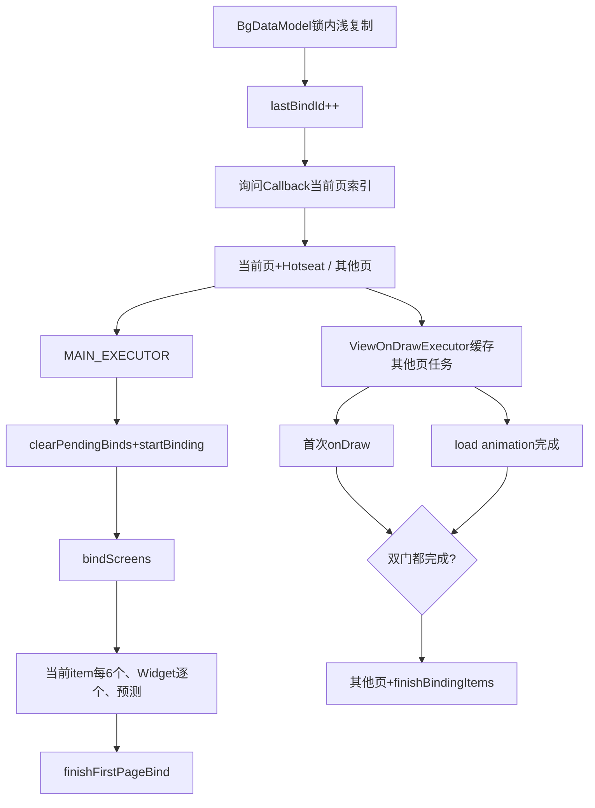
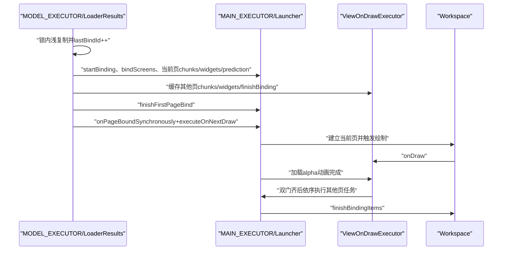
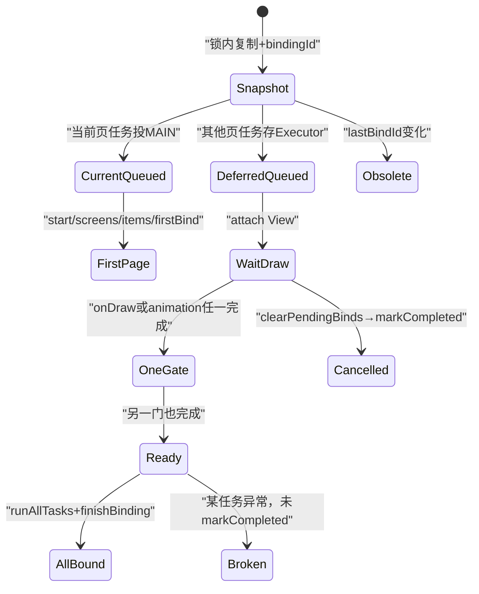

# 第509章 Android LoaderResults：当前页优先、分块绑定、ViewOnDraw双门、旧代际淘汰和首屏完成链

> 源码基线：Android 11 / API 30 / `android-11.0.0_r48`。文档直接写入`/Users/ninebot/StudyNotes/Android源码学习`；只读源码、不编译。核心文件：`model/BaseLoaderResults.java`、产品source set中的`LoaderResults.java`、`ModelUtils.java`、`ViewOnDrawExecutor.java`和`Launcher.java`Callbacks实现。

## 1. 本章解决什么问题

为什么当前页先出现？六个图标一批有什么意义？Widget为何逐个绑？其余页面究竟等first draw还是动画？连续reload怎样阻止旧任务覆盖新UI？`finishFirstPageBind`与`finishBindingItems`分别完成什么？

## 2. 一句话定位

LoaderResults把后台模型复制成浅快照并分配bindingId，优先把当前页与Hotseat分块投主线程；其余页面进入ViewOnDrawExecutor，必须同时经过首次绘制和加载淡入动画两道门，旧代际任务则在执行前比较lastBindId并跳过。

## 3. 它不负责加载数据

LoaderTask生产BgDataModel/AllAppsList，LoaderResults只选择快照、顺序和Callbacks。名字“Results”表达从后台库存到展示端的交接层。

## 4. 绑定全景

## 5. Base与产品LoaderResults分工

Base实现Workspace与All Apps绑定；普通`src_shortcuts_overrides`子类补Deep Shortcut和Widgets；Go子类这两方法为空。最终行为取决于构建source set。

## 6. LoaderResults持有Callbacks快照

构造时传入数组，后续绑定不会重新读取LauncherModel当前Callbacks列表。对象移除后，任务还需靠clear/代际与Callback自身生命周期避免误操作。

## 7. UI Executor通常是MAIN_EXECUTOR

测试可注入其他LooperExecutor；生产普通构造使用主Looper。

## 8. bindWorkspace先创建三个新容器

workspaceItems、appWidgets和orderedScreenIds均为新集合，为绑定冻结本轮成员关系。

## 9. 复制发生在BgDataModel锁内

三份集合与lastBindId一起取得，避免成员集合跨不同模型时点。

## 10. 这是浅复制

ItemInfo和LauncherAppWidgetInfo对象不克隆；后台字段变化仍可能被已排队任务观察。

## 11. 每次Workspace绑定递增lastBindId

然后把新值保存为本Results的mMyBindingId。它是单调int代际，不是数据库版本。

## 12. int溢出未专门处理

极长期连续绑定理论上可回绕；实际进程生命周期内次数远低于上限。

## 13. 一个Callbacks对应一个WorkspaceBinder

每个展示端独立询问优先页并生成任务，但共享同一浅快照和bindingId。

## 14. bindAllApps复制排序数组

AllAppsList.copyData返回AppInfo[]浅快照和flags，再用Base级executeCallbacksTask一次遍历全部Callbacks。

## 15. bindDeepShortcuts复制HashMap

普通版本在BgDataModel锁内new HashMap，主线程得到计数快照；Go版本不回调。

## 16. bindWidgets先生成Widget行列表

普通版本调用WidgetsModel.getWidgetsList后投Callbacks；元素是否深拷贝取决于WidgetsModel实现，外层ArrayList是新列表。

## 17. Base级Callback任务先验代际

Runnable真正执行时比较`mMyBindingId != lastBindId`，旧则记录日志并return。

## 18. 旧任务不是从队列移除

它仍占一次Looper调度，只是不调用Callbacks。日志“skipping obsolete data-bind”说明这种软淘汰。

## 19. Base任务会遍历整个旧Callbacks数组

一旦代际相同，就对构造时每个Callback执行；没有逐Callback存活检查。

## 20. WorkspaceBinder任务只服务单个Callback

它也比较bindingId，但通过自身mCallbacks直接调用，不遍历数组。

## 21. Workspace绑定时序

## 22. getPageToBindSynchronously返回页索引

它不是screenId。Launcher优先使用mPageToBindSynchronously，否则Workspace当前页，Workspace尚未创建时返回0。

## 23. 页索引需映射orderedScreenIds

只有index落在数组范围内，才取`orderedScreenIds.get(index)`成为currentScreenId。

## 24. 负值表示无有效优先页

PagedView.INVALID_PAGE通常为负；此时validFirstPage=false，所有页面都直接走主Executor，不创建ViewOnDraw延迟。

## 25. 越过末尾也转INVALID_PAGE

代码只检查`currScreen >= size`；调用者返回其他负数也会自然成为无效页。

## 26. 空screen但有Hotseat的情况

collectWorkspaceScreens通常会补FIRST_SCREEN_ID；注释仍保留“可能没有Workspace screen”的防御分支。

## 27. filterCurrentWorkspaceItems先清null

它原地遍历传入浅快照，把null移除。不会修改BgDataModel原ArrayList。

## 28. 然后按container排序

特殊container为负，Hotseat -101通常在Desktop -100之前，Folder child的正ID在父顶层对象之后。

## 29. 所有Hotseat都归当前集合

不管优先screenId是什么，Hotseat item都加入currentScreenItems，因为Hotseat始终与当前Workspace页一起可见。

## 30. Desktop只按screenId分流

与currentScreenId相同进入当前，否则进入其他。

## 31. itemsOnScreen记录可见容器ID

当前Desktop或Hotseat item加入时把自身ID放进Set；后续container指向这些ID的child可被判为间接在当前屏。

## 32. 正常workspaceItems不含Folder child

BgDataModel已经把child放在FolderInfo.contents，因此Base绑定常见输入主要是顶层对象；ModelUtils仍写成可复用的间接容器算法。

## 33. container排序是间接判断前提

父顶层对象必须先被处理，后续child才能在itemsOnScreen发现父ID。Launcher不支持任意嵌套Folder，算法不承诺通用图拓扑排序。

## 34. currentScreenId无效时Hotseat仍当前

Desktop都进入other，Hotseat仍进入current；但validFirstPage=false时两个集合最终都用同一mainExecutor，优先差异只影响投递先后。

## 35. Widgets也用同一filter

Widget只能顶层Desktop/Hotseat；非法container通常已由Loader删除。

## 36. 空间排序在分流之后

current与other分别调用sortWorkspaceItemsSpatially，确保每组内部绑定顺序稳定。

## 37. 不同container按整数排序

Hotseat -101排Desktop -100之前；因此Hotseat item通常先进入bind chunks。

## 38. Desktop位置公式

`screenId*每屏格数 + cellY*列数 + cellX`，实现先screen、再从上到下、从左到右。

## 39. Hotseat按screenId排序

screenId是canonical rank，不直接按当前orientation cellX/cellY。

## 40. 意外container在Studio抛异常

生产非Studio默认比较返回0，保留原相对关系的不确定性，不主动修数据。

## 41. 第一条主线程任务做两件事

先Callback.clearPendingBinds，再startBinding。即使LauncherModel.startLoader此前已投过clear，这里仍再次清理。

## 42. clearPendingBinds终止旧OnDraw执行器

Launcher若mPendingExecutor非null，调用markCompleted清任务/监听、置null，并静默解除AllApps Store defer flag。

## 43. markCompleted不是执行剩余任务

它直接clear mTasks，因此旧其他页绑定被放弃，等待新bindingId任务重建。

## 44. startBinding关闭依附旧图标的浮层

除REBind-safe完整Widget Sheet外，关闭弹层，避免其锚点View即将被删除。

## 45. startBinding把Workspace设为loading

并取消拖拽、清drop targets、移除所有Workspace screens、清AppWidgetHost views、重置Hotseat布局。

## 46. startBinding是破坏性UI重建起点

此时旧页面已清，但新item还在后续Runnables；不能把它当“首页绑定完成”。

## 47. bindScreens先建页面容器

QSB开启时确保FIRST_SCREEN_ID在数组首位；该方法会原地修改传入IntArray。

## 48. shared screen数组的边界

orderedScreenIds被各WorkspaceBinder共享；第一个Launcher Callback可能重排它，后续Callback看到已改变数组。普通场景Callbacks通常只有一个。

## 49. QSB关闭且数组空时加额外空屏

不把ID写回数组，而调用Workspace.addExtraEmptyScreen建立UI空页。

## 50. FIRST_SCREEN的特殊View可能已存在

bindAddScreens在QSB开启且screenId为FIRST时不插入，因为该屏始终绑定。

## 51. 页面建立后解锁壁纸偏移

请求下一次layout解除默认页锁，让实际页面数参与wallpaper offset计算。

## 52. 当前普通item每六个一批

ITEMS_CHUNK=6，subList交给bindItems。分批减少单个主线程任务时长并给消息队列调度机会。

## 53. 六不是帧预算保证

单个图标inflate成本、设备性能和同帧其他任务不同；常量只是经验批量大小。

## 54. subList依赖快照列表不再结构修改

列表是Binder私有ArrayList，分组后未再变；若并发结构修改会有视图失效风险，但正常代码不这么做。

## 55. Widget严格一次一个

每个Widget用singletonList调用bindItems，控制昂贵HostView创建的单任务粒度。

## 56. 一个Widget任务仍可能很重

远端provider、inflate和restore状态都会影响成本；逐个只是隔离，不保证不卡顿。

## 57. 预测只填Hotseat缺口

getMissingHotseatRanks扫描current items中container==HOTSEAT的screenId，返回0..len-1未占槽位。

## 58. 缺口算法不看Widget

Hotseat正常不放Widget；传入currentWorkspaceItems足够。

## 59. 预测候选再浅复制

`new ArrayList<>(cachedPredictedItems)`冻结成员列表，AppInfo仍共享。

## 60. 当前页有效才创建延迟Executor

否则deferredExecutor直接等于mainExecutor，所有其他页任务按队列顺序立即执行。

## 61. finishFirstPageBind总投主线程

有效页传ViewOnDrawExecutor，无效页传null；Launcher据此决定是否把alpha动画完成通知给延迟门。

## 62. 其他页任务先被缓存

调用`deferredExecutor.execute`时ViewOnDrawExecutor只把Runnable加入mTasks，不立即运行。

## 63. finishBindingItems也在缓存末尾

因此有效当前页场景下，Workspace仍保持loading、安装队列仍冻结，直到双门后所有其他页任务执行到末尾。

## 64. executeOnNextDraw反而最后投主队列

Base先填完延迟任务，再投`onPageBoundSynchronously`和`executeOnNextDraw`，让Launcher持有并attach该Executor。

## 65. onPageBoundSynchronously记录页面

Launcher设mSynchronouslyBoundPage、切当前页，并把一次性mPageToBindSynchronously重置INVALID。

## 66. executeOnNextDraw先清旧pending

再保存新mPendingExecutor。连续绑定时旧任务被markCompleted，MODEL_EXECUTOR优先级也恢复。

## 67. AllApps更新可能延迟到下一draw

若当前Launcher不在ALL_APPS状态，AllAppsStore开启DEFER_UPDATES_NEXT_DRAW，并把解除任务追加到延迟Executor末尾。

## 68. 解除任务的相对顺序

它在其他页item、Widget和finishBindingItems之后追加；双门开启后按mTasks顺序执行。

## 69. 主Launcher attach到Workspace

`executor.attachTo(this)`内部选择launcher.getWorkspace，并要求waitForLoadAnimation=true。

## 70. Secondary Display不同

它attach到DragLayer且waitForLoadAnimation=false；finishFirstPageBind立即调用onLoadAnimationCompleted，很多Callbacks还是空实现。

## 71. ViewOnDrawExecutor同时实现四种接口

Executor收任务，OnDrawListener收首绘，Runnable由View.post执行，OnAttachStateChangeListener处理稍后attach到window。

## 72. execute只追加任务

没有post到线程，也没有检查completed；正常所有任务在attach/完成前加入。

## 73. execute还降低MODEL_EXECUTOR优先级

每次加入延迟任务都把模型线程设BACKGROUND，意图在首屏展示期间减少后台争抢。

## 74. 优先级是执行器线程级状态

不是仅影响这个Runnable；直到markCompleted才恢复DEFAULT。若Executor长期不完成，后续模型任务也可能保持后台优先级。

## 75. attach保存View与清理回调

添加attach state listener；View已attach时立刻注册OnDrawListener，否则等onViewAttachedToWindow。

## 76. onViewDetached为空

View detach不会自动complete或移除任务；重新attach会再注册observer，只要mCompleted为false。

## 77. onDraw只开第一道门

设置mFirstDrawCompleted=true，然后`mAttachedView.post(this)`；不在绘制回调中直接执行大量绑定。

## 78. 多次onDraw可多次post run

完成前OnDrawListener仍在，每帧都可能post；run用`!mCompleted`保证最终只执行一次任务集。

## 79. onLoadAnimationCompleted开第二道门

设置boolean并通过View.post(this)重新检查；两门顺序不固定。

## 80. 双门缺一不可

run只在loadAnimationCompleted、firstDrawCompleted且未completed时调用runAllTasks。

## 81. Launcher加载动画是什么

finishFirstPageBind检查DragLayer的launcher load alpha；小于1就动画到1，并在onAnimationEnd通知Executor；本来就是1则立即通知。

## 82. alpha动画结束不等于first draw

它只满足动画门；Workspace仍必须至少触发一次onDraw。

## 83. first draw也不等于其他页开始

若load alpha动画未结束，run继续等待第二门。

## 84. runAllTasks在主线程执行

onDraw/onAnimation都通过attachedView.post调run，随后逐个Runnable直接run；这些延迟绑定不回MODEL_EXECUTOR。

## 85. 任务按加入顺序执行

其他普通item chunks、其他Widgets、finishBindingItems、AllApps解除defer依次运行。

## 86. runAllTasks没有try/finally

任一Runnable抛异常会中断循环，后面的任务与`markCompleted()`都不执行。

## 87. 异常可能遗留多份状态

OnDraw/attach listener、mPendingExecutor引用、剩余任务和MODEL_EXECUTOR后台优先级都可能未清理；Activity崩溃重建可能最终消除，但源码本身无局部finally兜底。

## 88. markCompleted的正常清理

清任务、置completed、移除OnDraw与attach listener、调用onClearCallback，并恢复MODEL_EXECUTOR默认优先级。

## 89. markCompleted可用于取消

Launcher.clearPendingBinds直接调用它；此时未执行任务也被清除，属于放弃旧绑定。

## 90. onClearCallback按对象身份清引用

Launcher.clearPendingExecutor仅当当前mPendingExecutor就是传入对象才置null，避免旧Executor清掉更新Executor。

## 91. finishBindingItems恢复剩余页状态

Workspace恢复instance state，并把workspaceLoading设false。

## 92. 它还处理延迟Activity result

加载期间暂存的result在此回放，然后清pending字段。

## 93. 安装快捷方式队列在此flush

`disableAndFlushInstallQueue(FLAG_LOADER_RUNNING)`说明Loader读完DB并不够，UI全量绑定末尾才接纳加载期间排队的新增图标。

## 94. 它重新设置当前页

使用pageBoundFirst并override previous page，避免把无用户交互的恢复记录成页面切换。

## 95. pageBoundFirst可能INVALID

无有效优先页时传负值，具体Workspace.setCurrentPage会执行其边界处理；不能直接当screenId。

## 96. 最后设置Folder View缓存大小

按IDP Folder行列缓存一页应用View并缓存2个Folder page，服务后续打开Folder性能。

## 97. finishBindingItems不是像素Fence

它在主线程执行完绑定逻辑，但layout/draw/composition仍可能在后续帧；“加载状态false”不是Surface已呈现证明。

## 98. finishFirstPageBind也不是全量完成

它只处理load alpha与通知双门；其他页和install queue flush尚未执行。

## 99. LoaderTask waitForIdle的位置

bindWorkspace只是投递这些任务，随后LoaderTask用LooperIdleLock等主队列idle；有效页的其他页任务受draw/animation控制，不等价于普通MessageQueue已无消息。

## 100. Idle可能早于延迟任务执行

ViewOnDrawExecutor任务尚未post成独立Message时只存在mTasks，主队列可出现idle；LoaderTask因此可能继续All Apps阶段，而其他Workspace页仍未绑定。

## 101. bindingId覆盖所有库存回调

同一Results后续bindAllApps/DeepShortcuts/Widgets使用mMyBindingId；新Workspace bind递增后，旧Results这些任务也会跳过。

## 102. 只调用非Workspace bind的边界

若某Results从未bindWorkspace，mMyBindingId保持默认0；生产Loader和快速重绑定都先bindWorkspace，测试/新调用者需遵守这一隐含顺序。

## 103. 多Callbacks共享代际

任一新bindWorkspace递增全局lastBindId，会使此前所有Callback的旧任务失效，不按Callback独立分代。

## 104. screen数组会被Launcher修改

bindScreens为QSB调整IntArray，且WorkspaceBinder后续并不再用screen数组做分流（分流已提前完成）；多Callbacks才更需要注意共享可变数组。

## 105. 当前页优先优化旋转

注释特别提到rotation：先恢复用户正在看的页面，第一帧后再填其他页，降低空白时间。

## 106. 诊断首屏空白

检查getPage index、orderedScreenIds、startBinding是否清空、current chunks是否因bindingId跳过、bindItems是否异常，以及alpha/onDraw前首屏是否实际创建。

## 107. 诊断其他页长期不出现

检查mPendingExecutor、firstDraw与loadAnimation两个boolean、View attach、runAllTasks异常、markCompleted是否被新reload提前调用。

## 108. 诊断重复旧图标

确认旧任务是否代际相同、lastBindId是否递增、Callback是否绕过executeCallbacksTask直接操作View，以及clearPendingBinds是否清掉旧Executor。

## 109. 状态机

## 110. 推荐测试矩阵

覆盖有效/无效当前页、空screen、Hotseat-only、7个图标、2个Widget、QSB开关、draw先/animation先、连续两次reload、多Callbacks和延迟任务抛异常。

## 111. 推荐完成点记录

至少区分：快照生成、当前任务入队、startBinding清旧View、当前页finish、first draw、animation结束、其他页runAllTasks、finishBindingItems、下一帧呈现。

## 112. macOS只读练习一：手算分流排序

阅读ModelUtils，给screen 0/1各两个图标、Hotseat两项和一个Folder，当前页索引指screen 1；写出current/other集合及空间排序，并解释Hotseat为何总在current。

## 113. macOS只读练习二：手算任务队列

当前页7个普通item+2个Widget，其他页8个普通item+1个Widget。列出MAIN_EXECUTOR与ViewOnDrawExecutor各有多少bindItems任务及顺序，指出finishFirstPage与finishBinding位置。

## 114. macOS只读练习三：推演双门

分别模拟onDraw先到、alpha animation先到、View未attach、连续reload取消。记录mFirstDrawCompleted、mLoadAnimationCompleted、mCompleted、pending引用与模型线程优先级。

## 115. macOS只读练习四：推演旧代际

Results A id=10已投当前与延迟任务，Results B把lastBindId改11。逐项判断A的MAIN任务、已存延迟任务和markCompleted清理路径，解释软跳过与物理取消的区别。

## 116. 易错点一：当前页包含Hotseat

filter把所有Hotseat项都归current，当前页不是仅screenId相等的Desktop集合。

## 117. 易错点二：first draw不是唯一门

主Launcher还等待加载alpha动画；Secondary Display配置则不同。

## 118. 易错点三：MessageQueue idle不等于其他页完成

延迟任务仍可能只存在ViewOnDrawExecutor.mTasks中，尚未成为主队列消息。

## 119. 易错点四：finishBinding不是屏幕呈现

它关闭loading并flush业务队列，layout/draw、RenderThread与SurfaceFlinger呈现仍是后续链路。

## 120. 本章总结与下一章

LoaderResults通过浅快照、bindingId、当前页分流、六项/单Widget粒度和ViewOnDraw双门优化首屏，同时用软淘汰与markCompleted取消旧绑定；正常完成仍分多个层次。下一章进入Launcher Activity生命周期，追onCreate到Callbacks注册、startBinding、恢复状态、首次绘制和onResume交互门。
