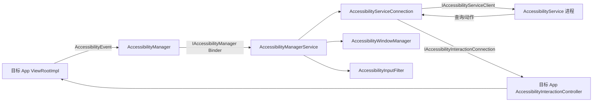
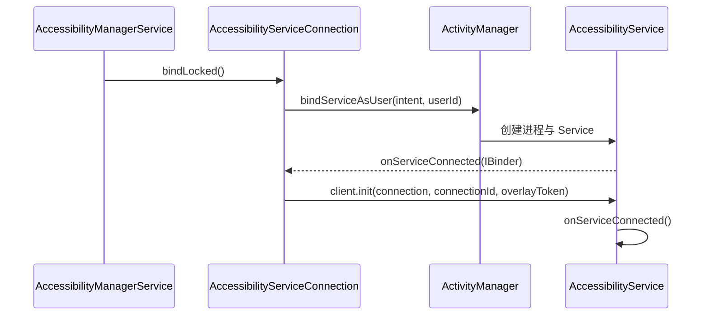
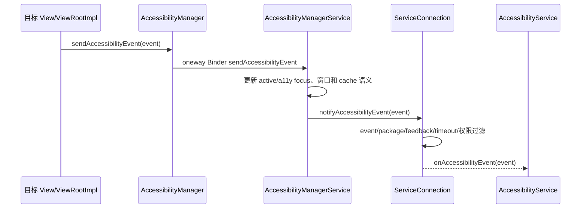
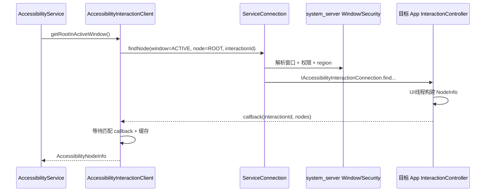
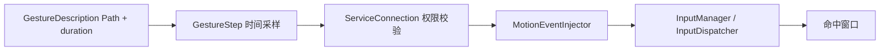

# 51 AccessibilityManagerService、AccessibilityService 与无障碍事件分发

> 源码版本：Android 11 / API 30 / `android-11.0.0_r48`  
> 学习方式：macOS 只读源码，不要求编译。  
> 本章目标：理解无障碍服务从安装、用户启用、系统绑定，到接收事件、查询节点、执行动作和注入手势的完整链路，并掌握其中的权限、窗口和性能边界。

---

## 1. 一句话理解无障碍系统

Android 无障碍系统把应用 UI 转换为一套可跨进程观察和操作的语义模型，使读屏、开关控制、放大、语音控制等辅助技术能够理解界面。

它不只是“监听点击”：

```text
UI 状态变化 → AccessibilityEvent
服务主动查询 → AccessibilityNodeInfo 树
服务执行操作 → View.performAccessibilityAction
服务注入手势 → MotionEventInjector → 输入系统
```

这四条链路相互关联，但不是同一回事。

---

## 2. 为什么无障碍权限如此敏感

被用户启用的无障碍服务可能具备：

- 感知前台应用和窗口变化；
- 读取可访问节点的文本、描述和状态；
- 查找按钮、输入框等节点；
- 代表用户点击、滚动、输入或执行全局动作；
- 观察/过滤按键；
- 注入触摸手势；
- 绘制 accessibility overlay。

这足以辅助残障用户，也可能被恶意服务用于窃取信息或诱导操作。因此 Android 通过用户明确启用、service metadata、capability、系统安全策略、敏感窗口过滤和用户边界共同限制。

---

## 3. 整体架构



进程边界：

- 目标应用：产生事件、构建节点、执行 View 动作；
- `system_server`：AMS、安全策略、窗口映射、连接、输入过滤；
- 无障碍服务 App：接收事件并发起查询/动作；
- WMS/InputManager：提供窗口和输入系统能力。

---

## 4. 核心类地图

```text
frameworks/base/services/accessibility/java/com/android/server/accessibility/
  AccessibilityManagerService.java
  AccessibilityUserState.java
  AccessibilityServiceConnection.java
  AbstractAccessibilityServiceConnection.java
  AccessibilitySecurityPolicy.java
  AccessibilityWindowManager.java
  AccessibilityInputFilter.java
  MotionEventInjector.java
  KeyEventDispatcher.java
  SystemActionPerformer.java
```

客户端：

```text
frameworks/base/core/java/android/accessibilityservice/AccessibilityService.java
frameworks/base/core/java/android/accessibilityservice/AccessibilityServiceInfo.java
frameworks/base/core/java/android/view/accessibility/AccessibilityManager.java
frameworks/base/core/java/android/view/accessibility/AccessibilityEvent.java
frameworks/base/core/java/android/view/accessibility/AccessibilityNodeInfo.java
frameworks/base/core/java/android/view/accessibility/AccessibilityInteractionClient.java
```

---

## 5. 无障碍服务如何声明

Manifest 中通常声明：

```xml
<service
    android:name=".MyAccessibilityService"
    android:permission="android.permission.BIND_ACCESSIBILITY_SERVICE"
    android:exported="true">
    <intent-filter>
        <action android:name="android.accessibilityservice.AccessibilityService" />
    </intent-filter>
    <meta-data
        android:name="android.accessibilityservice"
        android:resource="@xml/accessibility_service_config" />
</service>
```

`BIND_ACCESSIBILITY_SERVICE` 是 signature 级绑定权限，防止普通 App 随意 bind。真正绑定者是系统。

配置 XML 可声明事件类型、package filter、反馈类型、timeout、flags 和 capabilities。

---

## 6. 安装、启用、绑定是三种状态

```text
installed：PMS 能发现 service
enabled：用户在设置中明确启用该 ComponentName
bound：AMS 当前已成功 bind 并建立连接
```

安装不等于启用；启用后若进程崩溃、用户切换或服务连接失败，也可能暂时未绑定。

`AccessibilityUserState` 按 userId 保存：

- installed services；
- enabled service components；
- bound service connections；
- binding services；
- touch exploration、magnification、shortcut 等用户配置。

---

## 7. 服务发现与启用来源

AMS 通过 PackageManager 查询带有 AccessibilityService action 且满足绑定权限的服务，用 `AccessibilityServiceInfo` 解析 metadata。

用户启用列表通常来自安全设置项：

```text
Settings.Secure.ENABLED_ACCESSIBILITY_SERVICES
Settings.Secure.ACCESSIBILITY_ENABLED
```

AMS 监听设置、包变化和用户切换，重新计算当前用户状态。不能只改内存列表，否则重启后丢失；也不应只信 Settings 字符串，必须重新对照已安装服务与权限。

---

## 8. 绑定主链

`AccessibilityServiceConnection.bindLocked()` 大致执行：

1. 构造显式 Intent；
2. 以对应 userId 调用 `bindServiceAsUser()`；
3. 设置 binding 标记；
4. 服务进程由 AMS 启动；
5. `onServiceConnected()` 得到 `IAccessibilityServiceClient` Binder；
6. 分配 connectionId；
7. 把 `IAccessibilityServiceConnection` 回传服务；
8. 调用客户端 `init()`；
9. 加入 bound services 并更新输入过滤/窗口跟踪。



---

## 9. connectionId 有什么用

服务端为每个连接分配 connectionId。服务进程中的 `AccessibilityInteractionClient` 维护：

```text
connectionId → IAccessibilityServiceConnection
```

`AccessibilityNodeInfo` 内部也携带 connectionId、windowId 和 sourceNodeId。后续 `node.performAction()` 才知道请求应通过哪条系统连接、作用于哪个窗口和节点。

NodeInfo 不是对 View 的直接 Java 引用，而是可跨进程使用的快照与远程定位信息。

---

## 10. 服务配置的四类过滤

### eventTypes

服务关心的事件类型，如 clicked、focused、text changed、window changed。

### packageNames

仅接收指定包事件；为空通常表示不限定包。

### feedbackType

spoken、haptic、audible、visual、generic 等服务反馈类型。

### notificationTimeout

相同类型事件的最小通知间隔，可用于合并高频事件。

此外 flags/capabilities 决定是否能取窗口内容、检索交互窗口、请求触摸探索、过滤按键、执行手势等。

---

## 11. capability 与 flag 不同

Capability 通常来自 service metadata，表示安装时声明并经用户授权页面展示的敏感能力，例如：

- retrieve window content；
- request touch exploration；
- request filter key events；
- control magnification；
- perform gestures；
- take screenshot（后续版本能力更丰富）。

Flag 是运行配置行为。服务不能仅在运行时调用 `setServiceInfo()` 就凭空获得未在 metadata 声明的 capability。

---

## 12. AccessibilityEvent 从哪里产生

View、ViewRootImpl 或窗口状态变化时调用类似：

```text
View.sendAccessibilityEvent()
→ ViewParent.requestSendAccessibilityEvent()
→ ViewRootImpl
→ AccessibilityManager.sendAccessibilityEvent()
→ IAccessibilityManager.sendAccessibilityEvent(...)
```

事件包含：

- eventType；
- packageName/className；
- text/contentDescription；
- windowId/source node；
- contentChangeTypes；
- action、itemCount、scroll 信息等。

它是“发生了什么”的通知，不保证带完整节点树。

---

## 13. 事件分发主链



`IAccessibilityManager.sendAccessibilityEvent` 是 oneway，减少目标应用因慢服务而直接阻塞。但 system_server 和服务端仍需控制事件风暴、对象复制和队列积压。

---

## 14. 一个事件会发给所有服务吗

不会。每个 `AbstractAccessibilityServiceConnection` 会判断：

- 服务是否绑定且可用；
- eventType 是否订阅；
- package 是否匹配；
- feedbackType/默认服务规则；
- 是否属于当前用户或允许 profile；
- 安全策略是否允许分发；
- 服务是否有 window content capability；
- notificationTimeout 是否要求延迟/合并；
- 是否是 service 自己不应获得的特例。

因此目标 App 成功发送事件，不代表特定服务一定能收到。

---

## 15. notificationTimeout 怎样合并事件

对于某些高频事件，连接会按 event type 保存待发送事件，并在 Handler 上延迟。新事件到达时替换或合并旧事件，最终只通知一次。

这类似 debounce：

```text
连续滚动/文本变化事件
→ notificationTimeout 窗口内合并
→ 降低 Binder 与服务回调压力
```

它会牺牲部分中间状态的实时性，服务不应假定自己看到了每一次细粒度变化。

---

## 16. Event 与 NodeInfo 的区别

| 对象 | 核心作用 | 生命周期 |
|---|---|---|
| AccessibilityEvent | 通知“发生了什么” | 短暂事件快照 |
| AccessibilityNodeInfo | 描述“某个语义节点现在是什么” | 查询返回的节点快照 |
| AccessibilityWindowInfo | 描述“有哪些窗口及层级” | 窗口快照 |

事件的 `getSource()` 会利用其中的 connectionId/windowId/nodeId，再主动查询当前节点。事件到达与查询之间 UI 可能已变化，所以 source 可能为 null 或内容已不同。

---

## 17. 节点树不是 View 树的完整复制

AccessibilityNodeInfo 是为辅助技术构建的语义树：

- 某些 View 会合并/隐藏子节点；
- `importantForAccessibility` 影响暴露；
- TextView/Button 等填充 role、text、actions；
- 自定义 View 应实现 `onInitializeAccessibilityNodeInfo()`；
- 虚拟控件通过 `AccessibilityNodeProvider` 暴露 virtual node；
- Compose/WebView 等可建立自己的语义/虚拟层级。

所以节点数、父子关系不必等于实际 View 对象树。

---

## 18. Window、Node 与 View 如何定位

跨进程定位常用三元组：

```text
connectionId：哪条无障碍服务连接
windowId：哪个可访问窗口
accessibilityNodeId：哪个真实/虚拟节点
```

nodeId 通常编码 accessibility view ID 和 virtual descendant ID。系统在目标应用侧解析它，再找到 View 或让 `AccessibilityNodeProvider` 处理虚拟节点。

它不是资源 `R.id`。按 viewIdResourceName 查询是另一种查询方式，并要求相应 flag/信息可用。

---

## 19. 窗口模型

`AccessibilityWindowManager` 从 WMS 获得窗口变化并构造 `AccessibilityWindowInfo`，维护：

- top focused window；
- active window；
- accessibility focused window；
- 每 display 的窗口列表；
- window token、windowId 与 interaction connection 映射；
- PIP 与 action replacer；
- 窗口层级、region、type、parent/child。

三个 focus 不同：

```text
input focus：键盘输入目标
active window：用户当前交互语境
accessibility focus：读屏当前浏览的节点/窗口
```

---

## 20. 为什么读取窗口内容需要 capability

服务若没有 `CAPABILITY_CAN_RETRIEVE_WINDOW_CONTENT`，只能得到受限事件信息，不能任意查询完整节点树。

即便有 capability，还要经过 `AccessibilitySecurityPolicy`：

- 调用连接身份是否有效；
- 目标窗口是否允许检索；
- userId 是否匹配；
- windowId 是否有效；
- 是否属于可报告的窗口；
- 特殊窗口是否应隐藏或替换 action。

这是高风险数据访问，不能只靠客户端 API 注释保护。

---

## 21. 查询根节点完整链路

服务调用：

```java
AccessibilityNodeInfo root = getRootInActiveWindow();
```

链路：



请求和结果通过 interactionId 配对，因为 Binder callback 是异步的。

---

## 22. AccessibilityInteractionClient 为什么看起来同步

服务 API 返回 `AccessibilityNodeInfo`，看似同步；底层实际是：

1. 发起异步 Binder 查询；
2. 带唯一 interactionId；
3. 目标 App 回调结果；
4. 客户端等待有限时间；
5. 收到匹配结果后返回；
6. 超时返回 null/空结果。

这与前面 Keystore promise 模式相似：同步外观包裹异步跨进程协议。

---

## 23. 目标 App 如何构建节点

`ViewRootImpl` 注册 `IAccessibilityInteractionConnection`，请求进入目标进程的 `AccessibilityInteractionController`。

它通常把工作安排到 View 所在 UI 线程，然后：

- 根据 nodeId 找 View；
- 检查 View 是否显示/可访问；
- 调用 `createAccessibilityNodeInfo()`；
- 运行 accessibility delegate；
- 如有 provider，查询虚拟节点；
- 应用屏幕坐标、magnification、region 等变换；
- 通过 callback 返回 sealed NodeInfo。

慢 UI 线程会直接导致无障碍查询慢或超时。

---

## 24. AccessibilityCache

服务进程的 `AccessibilityInteractionClient` 维护 `AccessibilityCache`：

- 按 windowId/nodeId 缓存节点；
- 缓存窗口列表；
- 根据 window/content/focus/scroll 事件清理或局部刷新；
- 减少频繁 Binder 查询。

缓存中的 NodeInfo 是快照，不是实时对象。UI 更新、窗口切换或连接断开后可能失效；不要长期持有并假定永远可操作。

---

## 25. 为什么 NodeInfo 要 sealed

目标应用构建完 NodeInfo 后将其 seal，使远端服务不能随意修改系统提供的节点属性。服务可以读属性、调用公开 action，但不能篡改 nodeId、windowId 后冒充别的节点。

Parcelable 复制保证了它不是跨进程共享的可变 View 状态。

---

## 26. 执行节点动作主链

服务调用：

```java
node.performAction(AccessibilityNodeInfo.ACTION_CLICK);
```

链路：

```text
AccessibilityNodeInfo
→ AccessibilityInteractionClient
→ IAccessibilityServiceConnection.performAccessibilityAction
→ DPMS?（不是）Accessibility ServiceConnection 安全检查
→ 目标窗口 IAccessibilityInteractionConnection
→ AccessibilityInteractionController
→ View.performAccessibilityAction / NodeProvider.performAction
→ callback 返回成功或失败
```

动作执行的是语义操作，不一定生成真实触摸坐标事件。例如 Button 的 ACTION_CLICK 可能直接调用点击语义。

---

## 27. Node action 与 dispatchGesture 不同

### Node action

```text
“请这个语义节点执行 CLICK/SCROLL/SET_TEXT”
```

目标应用的 View/Provider 执行，通常更稳定、更语义化。

### dispatchGesture

```text
“请在屏幕坐标上注入一段触摸轨迹”
```

通过 system_server 的 `MotionEventInjector` 进入输入链路，更接近真实触摸，会受 display、时序、窗口遮挡和界面变化影响。

能用节点动作时通常应优先用节点动作。

---

## 28. 手势注入主链

服务必须声明 canPerformGestures capability。调用 `dispatchGesture()` 后：

```text
GestureDescription
→ 采样为 GestureStep 序列
→ IAccessibilityServiceConnection.dispatchGesture
→ 校验 capability、连接、display
→ MotionEventInjector.injectEvents
→ InputManager/InputDispatcher
→ 当前目标窗口
→ 回调 onCompleted/onCancelled
```



如果新手势替换旧手势、服务断开、display 消失或注入失败，回调可能是 cancelled。

---

## 29. Key Event filtering

声明 `CAPABILITY_CAN_REQUEST_FILTER_KEY_EVENTS` 并启用相应 flag 的服务可接收部分按键事件。

链路大致为：

```text
InputFilter/KeyboardInterceptor
→ KeyEventDispatcher
→ 服务 onKeyEvent
→ 服务返回 handled/unhandled
→ 继续或拦截原始分发
```

系统设置超时，防止服务不响应导致所有按键永久卡住。多个服务的处理和最终一致性由 dispatcher 协调。

这与 AccessibilityEvent 完全不同：前者在输入分发路径上，后者是 UI 语义通知。

---

## 30. Touch Exploration

触摸探索使盲人用户能用手指移动来探索屏幕，系统将原始触摸转换成 hover、accessibility focus 和手势语义。

`AccessibilityInputFilter` 组成 transformation chain，例如：

- `TouchExplorer`；
- magnification gesture handler；
- autoclick；
- motion event injector；
- keyboard interceptor。

原始 MotionEvent 可能被观察、转换、延迟或重新分发，因此开启 TalkBack 后触摸手势体验会发生系统性变化。

---

## 31. Global Action

服务可请求 `performGlobalAction()`，例如 BACK、HOME、RECENTS、NOTIFICATIONS、QUICK_SETTINGS、POWER_DIALOG、LOCK_SCREEN、TAKE_SCREENSHOT（依版本）。

`SystemActionPerformer` 将动作下沉给 StatusBar、WindowManager、PowerManager 或其他系统组件。

Global action 不是在某个 Node 上执行，也不要求目标 App 暴露相应 View。

---

## 32. Accessibility Focus

Accessibility focus 是辅助技术的浏览焦点，与 input focus 分开：

- input focus：输入法/键盘输入到哪个控件；
- accessibility focus：读屏当前朗读/操作哪个语义节点。

系统通常全局维护一个 accessibility focused node/window。事件会驱动缓存和焦点状态更新。服务执行 `ACTION_ACCESSIBILITY_FOCUS` 不等于把光标放进 EditText。

---

## 33. 多窗口与多显示屏

服务启用 `FLAG_RETRIEVE_INTERACTIVE_WINDOWS` 后可获取交互窗口列表。Android 11 已按 display 管理窗口：

- 每 display 有层级列表；
- active/focused window 可能不同；
- PIP 有特殊 action 替换；
- accessibility overlay 是独立窗口类型；
- region 用于判断窗口是否被遮挡及节点可见范围。

只调用 `getRootInActiveWindow()` 可能看不到非 active 窗口，需要先 `getWindowsOnAllDisplays()` 再选窗口。

---

## 34. Accessibility Overlay

无障碍服务可用 `TYPE_ACCESSIBILITY_OVERLAY` 绘制辅助界面。它比普通 overlay 更受系统信任，可用于放大控件、辅助菜单或扫描选择。

但 overlay 仍由 WMS 管理：

- 使用系统提供的 window token；
- 受 display、layer、touch region 和用户边界控制；
- 服务断开时应移除；
- 不应遮挡或仿冒安全 UI。

它不等于拥有任意系统窗口权限。

---

## 35. 密码和敏感窗口能否读取

不能简单回答“都能”或“都不能”：

- password EditText 通常将事件/节点标为 password；
- 系统可能隐藏实际字符或只暴露长度/掩码；
- 安全窗口、系统确认界面、用户切换和隐私策略可能进一步过滤；
- 某些普通文本仍可能包含高度敏感信息；
- 恶意服务可结合事件、节点和操作实施社会工程攻击。

因此启用第三方服务必须建立在用户理解和信任上，平台安全策略只是降低风险，不是把能力变成零风险。

---

## 36. 多用户边界

Accessibility 配置按 userId 保存。切换前台用户时 AMS 会：

- 切换 `AccessibilityUserState`；
- 解绑旧用户服务；
- 读取新用户 enabled 列表；
- 绑定新用户服务；
- 清理 connection/cache/window 状态；
- 重新配置 input filter。

普通无障碍服务不会因为另一用户启用了它，就自动跨用户读取所有窗口。Managed Profile 与父用户的可见性还受平台和 profile 策略约束。

---

## 37. Binder 死亡与重连

服务进程死亡后：

- connection 收到 Binder death/service disconnected；
- 从 bound services 移除；
- 清理 connectionId 与 client cache；
- 更新 touch exploration、key filtering、magnification 等功能；
- 若仍启用，按系统策略重新 bind；
- 正在进行的 gesture/action callback 可能失败或取消。

目标窗口的 interaction connection 死亡时，窗口映射和 Node 查询也会失效。

---

## 38. 事件对象为什么要 recycle

AccessibilityEvent、Record、NodeInfo 在 Android 11 源码中大量使用对象池以降低高频分配。跨线程/延迟发送时必须 `obtain()` 复制，使用完成后 recycle。

若过早 recycle，异步 Handler 可能读到已清空或复用对象；若从不 recycle，会加大 GC 压力。源码注释中特别防范 Binder 线程与事件回收竞态。

应用开发者应遵循该 API 版本的所有权约定，不要长期保存事件对象。

---

## 39. 性能风险

无障碍链路常见性能问题：

- View 频繁发送 content changed；
- 服务订阅 `TYPES_ALL_MASK` 且不设 package filter；
- notificationTimeout 为 0；
- 每个 event 都遍历整棵节点树；
- 目标 App UI 线程构建复杂虚拟节点过慢；
- 服务主线程执行网络/数据库；
- 节点查询逐个串行 Binder 往返；
- 忽略 cache，反复查询相同窗口。

事件回调应快速筛选，把耗时工作异步化，并对界面变化和 stale node 做容错。

---

## 40. ANR 与超时边界

事件分发为 oneway，慢服务不应直接阻塞目标 App，但会积压自己的 Binder/主线程队列。节点查询需要目标 App UI 线程构建结果，目标 UI 卡住会导致查询超时。Key filtering 和手势注入也有各自 timeout/取消机制。

排查“无障碍卡顿”要区分：

```text
目标 App UI 线程慢
system_server accessibility lock/handler 慢
无障碍服务主线程慢
InputDispatcher/手势注入慢
Binder 往返或事件量过大
```

---

## 41. 自定义 View 为什么读屏不可用

如果自定义 View 只在 Canvas 画文字和按钮，却不提供语义，节点树中可能只出现一个空节点。

应考虑：

- `contentDescription`；
- importantForAccessibility；
- className、text、stateDescription；
- clickable/checkable/selected/enabled；
- 支持的 actions；
- collection/item info；
- traversal order；
- 虚拟子元素的 `AccessibilityNodeProvider`；
- 状态变化时发送正确 event/contentChangeTypes。

无障碍不是测试工具专用接口，而是 UI 语义契约。

---

## 42. UiAutomation 与 AccessibilityService

Instrumentation 测试中的 `UiAutomation` 复用大量无障碍基础设施，但由 `UiAutomationManager` 建立特殊连接：

- 由受信 instrumentation 注册；
- 可设置特殊 flags；
- 生命周期绑定测试；
- 权限与普通第三方服务不同；
- 测试结束必须注销。

不要用 UiAutomator 测试能力推断普通 AccessibilityService 在生产设备上一定拥有相同权限。

---

## 43. 常见故障定位表

| 现象 | 优先检查 |
|---|---|
| 服务已安装但不连接 | 用户是否启用、绑定权限、metadata、当前 user、进程崩溃 |
| `onAccessibilityEvent` 不触发 | eventTypes、packageNames、feedback、timeout、安全过滤 |
| event 有但 `getSource()` 为 null | 无 retrieve capability、窗口变化、节点已消失、超时 |
| `getRootInActiveWindow()` 为 null | active window、connectionId、窗口权限、目标 UI 卡住 |
| 找不到自定义控件 | View 未暴露语义或虚拟 node provider |
| `performAction` 返回 false | node stale、action 不支持、目标窗口变化、View 拒绝 |
| `dispatchGesture` 取消 | capability、display、另一手势、服务断开、注入失败 |
| TalkBack 开启后触摸不同 | TouchExplorer 转换链，通常是设计行为 |
| 切用户后服务状态异常 | AccessibilityUserState、解绑/重绑、Settings per-user |

---

## 44. 分层排障路线

### 第一层：发现与连接

```text
PMS 能否解析 service → enabled setting → binding → connectionId/init
```

### 第二层：事件

```text
目标 View 是否发送 → AMS 是否收到 → service filter 是否匹配 → callback 是否及时
```

### 第三层：窗口

```text
windowId 是否注册 → active/focused/a11y focused → security policy 是否允许
```

### 第四层：节点

```text
interaction connection → 目标 UI 线程 → real/virtual node → callback/timeout/cache
```

### 第五层：动作或输入

```text
node action → View/Provider
gesture → MotionEventInjector/InputDispatcher
key filter → KeyEventDispatcher
global action → SystemActionPerformer
```

---

## 45. 推荐源码阅读顺序

1. `AccessibilityServiceInfo`：看配置与 capability；
2. `AccessibilityService`：看服务 API 与 client wrapper；
3. `AccessibilityUserState`：看 per-user 状态；
4. AMS 的 installed/enabled/bound 更新流程；
5. `AccessibilityServiceConnection.bindLocked()`；
6. AMS `sendAccessibilityEvent()`；
7. `AbstractAccessibilityServiceConnection.notifyAccessibilityEvent()`；
8. `AccessibilityInteractionClient`：看查询同步外观；
9. `AbstractAccessibilityServiceConnection.find.../perform...`；
10. 目标 App `AccessibilityInteractionController`；
11. `AccessibilityWindowManager`；
12. `AccessibilityInputFilter/MotionEventInjector`。

---

## 46. 八组只读练习

### 练习一：追服务绑定

从 enabled setting 追到 `bindServiceAsUser`、client.init 和 connectionId 注册。

### 练习二：追一次点击事件

从 `View.sendAccessibilityEvent(TYPE_VIEW_CLICKED)` 追到服务 `onAccessibilityEvent()`。

### 练习三：列过滤矩阵

记录 event type、package、feedback、timeout、user 和 security policy 六层过滤。

### 练习四：追根节点查询

从 `getRootInActiveWindow()` 追到目标 App UI 线程和 callback interactionId。

### 练习五：追虚拟节点

选择一个 `AccessibilityNodeProvider`，说明 virtual descendant ID 如何解析。

### 练习六：追 ACTION_CLICK

从 `NodeInfo.performAction()` 追到目标 View/Provider，标出安全检查。

### 练习七：追手势注入

从 `dispatchGesture()` 追 GestureStep、MotionEventInjector、InputDispatcher 和完成回调。

### 练习八：追用户切换

记录旧用户服务解绑、新用户设置加载、重绑、cache/input filter 更新。

---

## 47. 初学者最容易误解的十二点

1. AccessibilityEvent 是变化通知，不是完整 UI 树。
2. AccessibilityNodeInfo 是快照/远程定位，不是 View 引用。
3. 无障碍节点树不必等于 View 树。
4. window focus、active window、accessibility focus 不同。
5. 服务已安装不等于已启用，已启用不等于当前已绑定。
6. flag 不能凭空获得未声明的 capability。
7. `getSource()` 会再次跨进程查询，可能返回 null。
8. Node action 是语义动作，不一定生成触摸事件。
9. `dispatchGesture` 才是屏幕坐标级输入注入。
10. Key filtering 位于输入链，不是 AccessibilityEvent 分发。
11. 节点缓存可能过期，不能长期持有 NodeInfo。
12. UiAutomation 的测试特权不等于普通服务能力。

---

## 48. 本章心智模型

把无障碍系统记成四条总线：

```text
事件总线：View → AccessibilityEvent → AMS → Service
查询总线：Service → Node query → 目标 App UI线程 → callback
动作总线：Service → node action → View/NodeProvider
输入总线：Service/InputFilter → gesture/key transformation → InputDispatcher
```

再用四个 ID 定位问题：

```text
userId：哪一个 Android 用户
connectionId：哪一个服务连接
windowId：哪一个窗口
nodeId：哪一个真实或虚拟语义节点
```

---

## 49. 本章总结

Android 11 无障碍体系是跨进程 UI 语义基础设施。目标应用通过 Event 报告变化，并通过 interaction connection 按需构建 NodeInfo；system_server 负责用户状态、服务绑定、窗口映射、权限过滤和输入转换；无障碍服务基于连接进行观察和受控操作。

完整主链可以概括为：

```text
PMS 发现 AccessibilityService
→ 用户明确启用
→ AMS 为当前 user 建立 ServiceConnection
→ client.init 注册 connectionId
→ View 事件经 AccessibilityManager 进入 AMS
→ 按 service info 与安全策略过滤后回调服务
→ 服务用 windowId/nodeId 主动查询目标 App 语义节点
→ AccessibilityInteractionController 在 UI 线程构建 NodeInfo
→ 服务可执行 Node action、Global action 或经 MotionEventInjector 注入手势
```

真正应该记住的是：**事件告诉服务“可能发生了变化”，节点查询提供当前语义快照，节点动作和手势注入则是两种完全不同的操作路径。**

---

## 50. 下一章预告

下一章进入输入法体系：

> **第 52 章：InputMethodManagerService、InputMethodService 与软键盘显示链路**

它会解释输入焦点如何触发输入法绑定、EditorInfo 和 InputConnection 如何跨进程工作、IME 窗口如何显示，以及文本提交、组合态、Insets 和输入法切换的完整链路。
