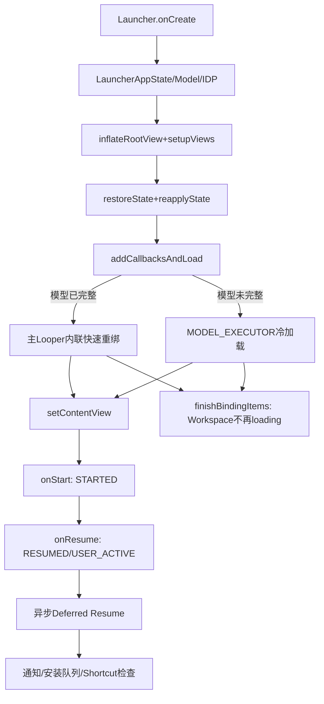
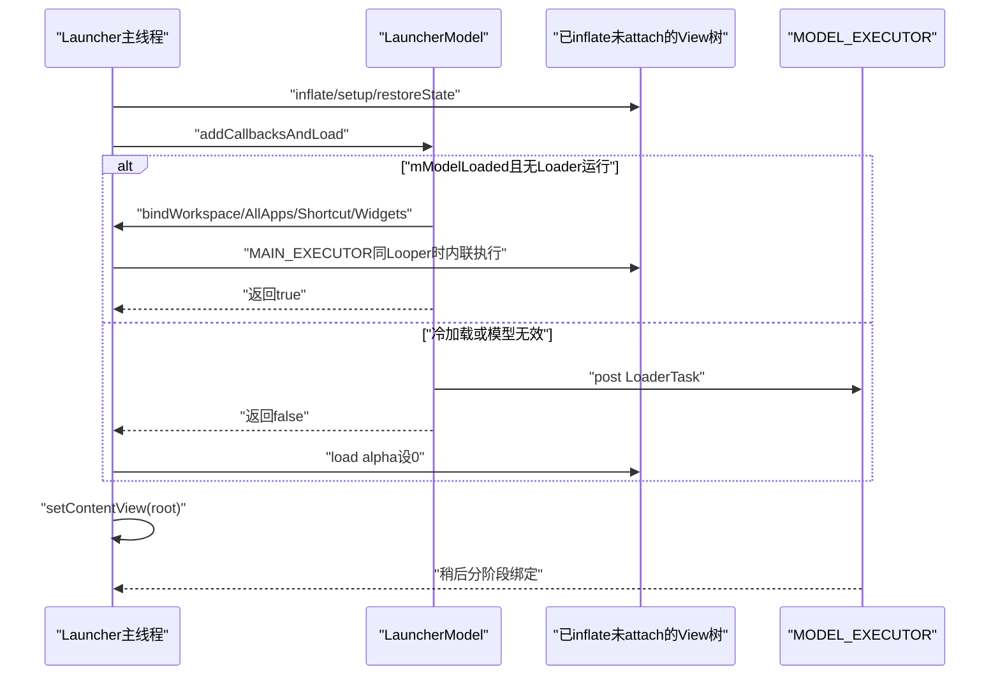
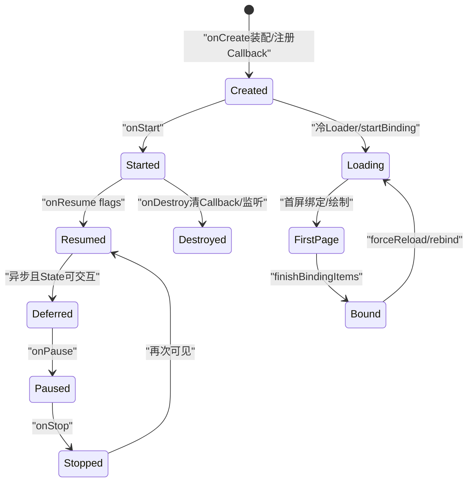

# 第510章 Android Launcher生命周期：onCreate快速重绑、冷加载、ActivityFlags、Deferred Resume和首次可交互链

> 源码基线：Android 11 / API 30 / `android-11.0.0_r48`。正文直接写入正式学习目录，只读源码、不编译。核心文件：`Launcher.java`、`BaseActivity.java`、`StatefulActivity.java`、`LauncherModel.java`、`BaseLoaderResults.java`和`LauncherAppWidgetHost.java`。

## 1. 本章解决什么问题

Launcher onCreate返回是否代表首页可用？快速重绑为何能在setContentView前发生？onResume与真正可交互有什么差别？Workspace loading、LauncherState和Activity生命周期如何交叉？旋转、HOME Intent与Widget监听又怎样影响时序？

## 2. 一句话定位

Launcher在onCreate先装配进程共享模型、DeviceProfile、View树和状态机，再恢复状态并注册Model Callback；已有模型可在主线程内联快速重绑，冷模型则后台加载。Activity flags、Deferred Resume、LauncherState和Workspace loading分别控制可见性、交互与数据完整性。

## 3. 先分四套状态

Activity有started/resumed/focus等flags；StateManager有NORMAL/ALL_APPS/OVERVIEW等状态；Loader有model loaded/bindingId；Launcher还有mWorkspaceLoading。四套状态相关但不能互相替代。

## 4. 生命周期总图

## 5. onCreate先开启Trace

TraceHelper以UI事件标记整段Launcher创建。它的结束点在onCreate后半，不代表首帧或Loader完成。

## 6. StrictMode只在调试开关启用

会检测主线程磁盘/网络和泄漏对象，VM泄漏可penaltyDeath。普通产品构建不能假定这些检测开启。

## 7. super.onCreate先建立Activity基础

调用链进入StatefulActivity、BaseDraggingActivity、BaseActivity和Activity；具体父类职责分散，Launcher随后才装配自身对象。

## 8. LauncherAppState是进程共享入口

`getInstance(this)`确保主线程单例存在，取得LauncherModel、IDP和IconCache。Activity重建通常复用这些进程对象。

## 9. mOldConfig保存创建时配置

后续onConfigurationChanged用`newConfig.diff(mOldConfig)`判断方向和屏幕大小等变化。

## 10. initDeviceProfile很早执行

根据IDP和当前窗口/多窗口计算DeviceProfile，同时创建带vertical hotseat快照的ModelWriter。

## 11. IDP监听注册需在destroy移除

onCreate `addOnChangeListener(this)`，onDestroy成对remove；配置变化可能触发rebind。

## 12. 控制器在View前构造

DragController、AllAppsTransitionController和StateManager先创建，StateManager初始NORMAL。

## 13. AppWidgetHost在inflate前创建

构造时提供widget removed回调，随后直接`startListening()`，这早于onStart/onResume。

## 14. Widget startListening允许Binder size例外

若异常是RemoteViews传输过大，Host认为监听关系可能已建立，吞掉特定错误并靠后续bind填Widget；其他异常转RuntimeException。

## 15. inflateRootView只膨胀根树

`setupViews()`再find dragLayer/workspace/overview/hotseat并连接Controller。此时View尚未通过setContentView附到Window。

## 16. PopupDataProvider在View后创建

以updateNotificationDots为回调，为通知角标与Popup数据做准备。

## 17. Remote Animation注册也在onCreate

AppTransitionManager创建并注册远程动画；onDestroy注销。

## 18. ActivityTracker可提前处理内部状态

`handleCreate(this)`用于Quickstep/内部状态恢复；返回true表示它已经设置合适状态。

## 19. internalStateHandled会移除Bundle state

若savedInstanceState非null，删除RUNTIME_STATE，避免常规restoreState覆盖内部处理结果；Bundle其他字段仍可恢复。

## 20. restoreState早于模型绑定

先恢复LauncherState、pending request/result和Widget面板，再reapply StateManager；Workspace item尚未必存在。

## 21. onCreate双路径时序

## 22. restoreState的ordinal没有显式边界检查

直接用`LauncherState.values()[stateOrdinal]`；Bundle通常由本应用生成，损坏或跨版本非法值可能抛数组越界。

## 23. shouldDisableRestore控制状态恢复

某些LauncherState不适合从实例状态恢复；UI mode配置变化的forceRestore可覆盖这项限制。

## 24. forceRestore比较NonConfig配置

仅在存在last non-config instance且UI_MODE发生差异时成立，常见于主题/夜间模式重建。

## 25. State恢复不动画

`goToState(state,false)`先把视图投影到目标状态，再由后续reapplyState补属性。

## 26. PendingRequestArgs也在此恢复

`setWaitingForResult`重建正在添加Widget/Shortcut等外部Activity结果的上下文。

## 27. PendingActivityResult可跨重建保留

若结果在Workspace加载时到达，保存后在finishBindingItems处理。

## 28. Widget Sheet层级也可恢复

Bundle有RUNTIME_STATE_WIDGET_PANEL时立即show WidgetsFullSheet并restoreHierarchyState；这发生在Workspace模型绑定前。

## 29. mPageToBindSynchronously来自Bundle页面索引

只在savedInstanceState中读取RUNTIME_STATE_CURRENT_SCREEN，缺省INVALID_PAGE。注释主要针对前台旋转/配置变化。

## 30. 它是page index不是screenId

LoaderResults稍后用orderedScreenIds.get(index)映射真实页面ID。

## 31. addCallbacksAndLoad是核心分叉

先把Launcher加入Callbacks，再调用startLoader；返回true代表已有模型可走快速重绑当前页。

## 32. 快速重绑可能内联执行

LooperExecutor.execute发现调用线程就是主Looper会直接`runnable.run()`，不是一律post。

## 33. 所以绑定可发生在setContentView前

View树已inflate/setup，可被startBinding清理并重新加item，但尚未attach到Window。后续setContentView才建立窗口内容。

## 34. 冷加载不会阻塞onCreate等数据库

LauncherModel把LoaderTask post到MODEL_EXECUTOR，onCreate继续设置alpha与Window内容。

## 35. addCallbacksAndLoad返回false不等于失败

通常只是模型未完整，需要异步加载；真正加载失败会在Loader内部清库/取消或异常处理。

## 36. 冷加载时load alpha设0

仅当internalStateHandled为false。首屏绑定后finishFirstPageBind把alpha动画到1。

## 37. 内部状态已处理时不强制alpha 0

避免Quickstep等内部过渡状态被普通Launcher淡入逻辑覆盖。

## 38. setContentView在模型分叉之后

这是理解快速路径的关键；普通Activity教程常把setContentView放最前，Launcher不是。

## 39. dispatchInsets被主动调用

让刚设内容的根View应用当前Insets，不完全等待系统下一轮分发。

## 40. Screen-off Receiver在onCreate注册

onDestroy注销。进程Activity存活期间用于处理灭屏状态。

## 41. SystemUiController设置基础Window外观

依据主题属性决定workspace深色文字相关系统栏状态。

## 42. LauncherCallbacks是另一扩展接口

非BgDataModel.Callbacks；若非null调用其onCreate。两个“Callbacks”不要混淆。

## 43. Overlay先用默认实现

随后PluginManager监听OverlayPlugin，连接时可切换真实OverlayManager。

## 44. Plugin切换会延迟生命周期回调

旧Manager收onActivityDestroyed，新Manager建立后若root已attach则onAttachedToWindow，并设置mDeferOverlayCallbacks等待状态收敛。

## 45. RotationHelper最后initialize

它在之前已参与DeviceProfile/状态对象，真正监听/策略初始化位于onCreate后段。

## 46. UserCache监听强制回NORMAL

用户信息变化时StateManager goToState(NORMAL)；SafeCloseable在onDestroy关闭。

## 47. onCreate结束不等于View已绘制

setContentView只把树交给Window；measure/layout/draw、异步Loader与ViewOnDraw其余页仍在后面。

## 48. BaseActivity用bit记录生命周期

STARTED、RESUMED、DEFERRED_RESUMED、WINDOW_FOCUSED、USER_ACTIVE、USER_WILL_BE_ACTIVE和TRANSITION_ACTIVE可组合。

## 49. onStart先加STARTED再super

BaseActivity如此实现；Launcher.onStart先调super，因此返回时flag已设置。

## 50. Launcher onStart通知Overlay

若未defer，调用onActivityStarted；并让WidgetHost`setListenIfResumed(true)`。

## 51. setListenIfResumed不一定立即listen

只有Host FLAG_RESUMED已设置才start；否则记意图等待StateManager把Host设resumed。

## 52. 但Host可能从onCreate一直在listen

Launcher已直接startListening；`setResumed(false)`注释明确不会停止已监听Host。onStop的setListenIfResumed(false)才stop。

## 53. Widget Host resumed由LauncherState控制

`onStateSetEnd`仅当state==NORMAL调用setResumed(true)，不是简单等同Activity onResume。

## 54. Activity resumed且All Apps可使Host非resumed

Host是否延迟start与Launcher交互状态相关，Activity生命周期只是另一层门。

## 55. BaseActivity onResume先加flags

加RESUMED和USER_ACTIVE、去USER_WILL_BE_ACTIVE，然后调用super.onResume。

## 56. StatefulActivity onResume再post deferred check

调用链返回后移除旧callback，用异步Handler消息安排handleDeferredResume。

## 57. 注释称“resumed一帧”是近似语义

实现是`postAsyncCallback`，不是Choreographer frame callback或Surface present fence；主要避免刚resume又立刻pause的瞬间执行重工作。

## 58. Deferred Resume还有State门

要求hasBeenResumed且当前LauncherState没有FLAG_NON_INTERACTIVE，否则只记mDeferredResumePending。

## 59. 状态后来可触发pending处理

StatefulActivity/StateManager协作在交互状态恢复时重新处理；不能把一次Handler未通过当永久遗漏。

## 60. onDeferredResumed执行真实恢复工作

Launcher记录resume、开始用户事件session、通知AppLaunchTracker返回HOME、flush暂停期间安装队列、检查Shortcut权限、注册NotificationListener并显示DiscoveryBounce。

## 61. DEFERRED_RESUMED在回调后设置

若onDeferredResumed中抛异常，flag不会写入。成功完成后才addActivityFlags。

## 62. onResume callbacks早于Overlay回调

Launcher.onResume在super之后先复制mOnResumeCallbacks、clear原列表，再逆序执行，之后才处理Overlay resume。

## 63. Resume callback逆序执行

最后添加的最先执行；这不是普通FIFO队列。

## 64. 执行前先clear支持重新入队

Callback内部addOnResumeCallback会进入新列表，留到下次resume，不在本轮循环重复。

## 65. 延迟Activity启动使用Resume callback

`startActivitySafely`若Launcher尚未resumed，加入回调并返回true；这表示请求已接受延迟，不表示目标Activity已启动。

## 66. hasBeenResumed只看RESUMED bit

不要求window focus、USER_ACTIVE、DEFERRED_RESUMED或Workspace加载完成。

## 67. 启动成功后图标保持pressed

BubbleTextView setStayPressed(true)并把自身作为OnResumeCallback，用户返回Launcher时解除状态。

## 68. onPause先冻结安装队列

Launcher在super.onPause之前enable `FLAG_ACTIVITY_PAUSED`，避免离开期间直接修改首页。

## 69. super.onPause清RESUMED与DEFERRED flags

BaseActivity执行；回到Launcher后再取消drag、重置touch时间、隐藏DropTargetBar和通知Overlay paused。

## 70. onUserLeaveHint单独清USER_ACTIVE

RESUMED与用户活跃不是同义；系统遮挡、转场阶段可出现不同组合。

## 71. Window focus也独立记bit

onWindowFocusChanged加/去WINDOW_FOCUSED；获取焦点不证明Workspace已绑定。

## 72. onStop清STARTED与USER_ACTIVE

BaseActivity还清force invisible并系统UI状态；StatefulActivity随后若非配置变化把StateManager移到rest state。

## 73. Launcher onStop处理Overlay与Widget

通知Overlay stopped、记录事件、`setListenIfResumed(false)`停止Host监听，并移除NotificationListener。

## 74. onTrimMemory在StatefulActivity stop显式调用

即使系统没马上发，也用TRIM_MEMORY_UI_HIDDEN清UI隐藏时缓存。

## 75. 睡眠期间UI变化会检测

若stop前user active，保存state/child count，post后比较稳定状态、alpha和child数，异常时onUiChangedWhileSleeping。

## 76. LauncherState转场再加TRANSITION_ACTIVE

onStateSetStart关闭按state要求的Popup，SPRING_LOADED还冻结安装队列、锁旋转和调整Workspace裁剪。

## 77. onStateSetEnd清TRANSITION_ACTIVE

发送窗口状态无障碍事件；NORMAL时flush drag-and-drop安装队列并解除旋转锁。

## 78. r48有一个疑似super调用笔误

Launcher.onStateSetEnd调用`super.onStateSetStart(state)`而非super.onStateSetEnd；父类这两个默认均为空，但派生层语义上值得审计。

## 79. mWorkspaceLoading初值true

声明时即true，不依赖Loader是否已经开始。

## 80. startBinding再次设true

全量重绑清旧Workspace时禁止拖拽，避免用户抓住即将被remove的View。

## 81. finishBindingItems才设false

当前页有效时它在ViewOnDrawExecutor的其他页任务末尾，因此首屏已显示时仍可能保持loading。

## 82. isDraggingEnabled只看Workspace loading

不直接看mModelLoaded；这是UI拖拽门，不是全局Activity交互门。

## 83. isWorkspaceLocked还看PendingRequest

`mWorkspaceLoading || mPendingRequestArgs != null`，外部Widget/Shortcut流程未结束也锁Workspace。

## 84. ActivityResult在loading时延迟

handleActivityResult保存mPendingActivityResult并return；finishBindingItems再回放。

## 85. 只保存一个Pending result

字段不是队列；异常多结果并发可能后写覆盖前写，业务流程通常限制一次pending request。

## 86. finishBinding回放前先关loading

源码先`setWorkspaceLoading(false)`，再handleActivityResult，使结果处理可以正常修改已绑定Workspace。

## 87. 实例状态保存当前next page

只有Workspace有child时写RUNTIME_STATE_CURRENT_SCREEN，值是页面索引。

## 88. 保存LauncherState ordinal

跨版本枚举顺序变化会有兼容风险；同APK配置重建是主要使用场景。

## 89. onSave会主动关闭部分浮层

非REBIND_SAFE Folder/Shortcut容器关闭并结束ActionMode，所以保存状态本身会改变当前UI。

## 90. Pending request/result都写Bundle

支持配置变化期间外部添加流程延续。

## 91. onRestoreInstanceState只恢复已同步页child状态

调用Workspace.restoreInstanceStateForChild(mSynchronouslyBoundPage)，其余页稍后绑定再恢复。

## 92. HOME onNewIntent不是Activity重建

singleTask/现有Launcher收到MAIN Intent时，基于focus、BROUGHT_TO_FRONT和当前State决定回NORMAL、重置All Apps或移动默认页。

## 93. alreadyOnHome要求Window focus

并且Intent不带BROUGHT_TO_FRONT；started/resumed alone不够。

## 94. HOME会关闭浮层并隐藏键盘

是否动画依据isStarted；还通知LauncherCallbacks、Overlay并处理手势导航contract。

## 95. shouldMoveToDefaultScreen条件严格

已经HOME、当前NORMAL、无顶层FloatingView且Workspace未处理触摸，才post移动默认页。

## 96. ACTION_ALL_APPS直接请求ALL_APPS状态

动画参数使用alreadyOnHome；不是另起Activity。

## 97. onEnterAnimationComplete是另一个完成点

清Rotation transition request并关闭TYPE_ICON_SURFACE浮层；它与Loader finish、first draw、Deferred Resume不同。

## 98. onDestroy先移Callbacks

LauncherModel.removeCallbacks(this)可能停止Loader并为剩余Callbacks重绑，防销毁Activity继续收模型回调。

## 99. onDestroy完整清理

注销Receiver、Folder listeners、Plugin、IDP listener、remote animations、User监听，停止WidgetHost并clearPendingBinds。

## 100. Widget stopListening NPE被特判

Launcher onDestroy捕获NullPointerException并记录，继续其他清理；其他RuntimeException未在这层捕获。

## 101. clearPendingBinds恢复模型线程优先级

若还有ViewOnDrawExecutor，会markCompleted清监听/任务并把MODEL_EXECUTOR恢复默认优先级。

## 102. Activity销毁不销毁LauncherAppState

进程共享Model/IconCache继续存在；下一Activity可走快速重绑。

## 103. 快速重绑不重新query favorites

复用已完整BgDataModel/AllAppsList；若事件监听漏更新，快速路径会复现陈旧库存，forceReload才重查。

## 104. 冷启动完成点至少六个

onCreate return、onStart、onResume、Deferred Resume、当前页first draw、finishBindingItems/mModelLoaded分别表达不同事实。

## 105. mModelLoaded可能晚于UI首屏

Loader最后在Widgets/IconCache之后commit，而Workspace第一阶段已可见。

## 106. 也可能快速路径先完整模型后attach

进程模型已loaded，onCreate内联绑未attach View，随后setContentView和绘制；“模型完成”和“像素出现”的先后可与冷路径相反。

## 107. 诊断不能点击/拖动

检查mWorkspaceLoading、pending request、Activity flags、LauncherState NON_INTERACTIVE/transition、DragController状态和目标View enabled，不只看onResume日志。

## 108. 诊断Widget不更新

检查Host LISTENING/LISTEN_IF_RESUMED/RESUMED三bit、Activity onStart/onStop、LauncherState NORMAL，以及RemoteViews Binder size异常。

## 109. 状态交叉图

## 110. 推荐时间线字段

记录Activity flags、LauncherState、mWorkspaceLoading、mModelLoaded、bindingId、pendingExecutor双门、Window focus和Host flags；只记生命周期方法名无法还原交互状态。

## 111. 推荐场景矩阵

覆盖进程冷启动、Activity旋转但进程存活、HOME Intent复用、从All Apps返回、Widget配置期间旋转、锁屏灭亮、Quickstep内部状态处理和连续forceReload。

## 112. macOS只读练习一：对比冷/快路径

阅读Launcher.onCreate、LauncherModel.startLoader和LooperExecutor.execute，分别列出模型是否查询DB、绑定是否内联、load alpha、setContentView、first draw与mModelLoaded顺序。

## 113. macOS只读练习二：手算Activity flags

从onStart→onResume→windowFocus→Deferred Resume→onUserLeaveHint→onPause→onStop逐步写bit集合，再说明哪一步允许startActivitySafely立即执行、哪一步允许拖Workspace。

## 114. macOS只读练习三：推演Widget Host

从onCreate startListening开始，依次经过onStart、State NORMAL、ALL_APPS、onStop和onDestroy，记录LISTENING/LISTEN_IF_RESUMED/RESUMED；解释Activity resumed为何不必等于Host resumed。

## 115. macOS只读练习四：区分完成点

为onCreate返回、addCallbacksAndLoad返回true/false、Deferred Resume、finishFirstPageBind、first draw、finishBindingItems、LoaderTransaction.commit和Surface呈现各写一句可证明/不可证明的事实。

## 116. 易错点一：onResume不等于真正稳定交互

Deferred Resume、LauncherState非交互门、Workspace loading、pending请求和Window focus仍可能阻止部分行为。

## 117. 易错点二：setContentView不是绑定起点

快速模型路径可在它之前内联操作已inflate的View树；冷路径则在之后异步绑定。

## 118. 易错点三：Workspace loading不等于Model loading

前者是UI重建/拖拽门，后者覆盖All Apps、Shortcut、Widget等完整Loader阶段。

## 119. 易错点四：NORMAL不等于Activity resumed

LauncherState与Activity生命周期独立；停止时可保留/移向rest state，resume时也可能处于ALL_APPS或过渡态。

## 120. 本章总结与下一章

Launcher通过onCreate双加载路径、Activity flags、Deferred Resume、StateManager与Workspace loading把进程模型、View绑定和交互逐步接通；任何单一回调都不是“Launcher完全就绪”。下一章进入LauncherState与StateManager，分析NORMAL/ALL_APPS/OVERVIEW状态值、转换请求、动画原子性、取消与完成回调。
