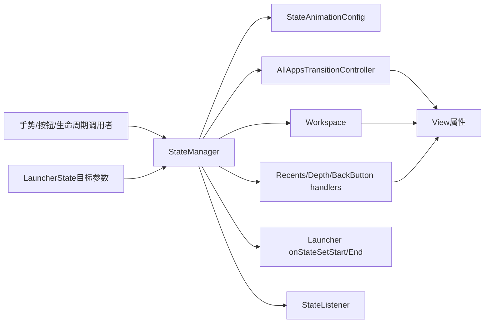
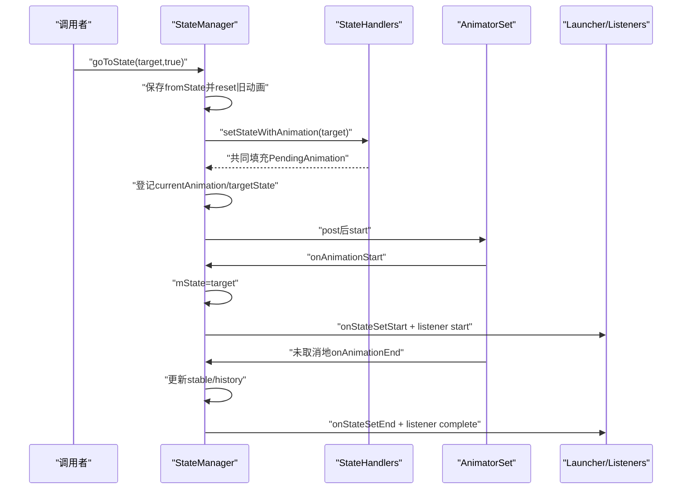
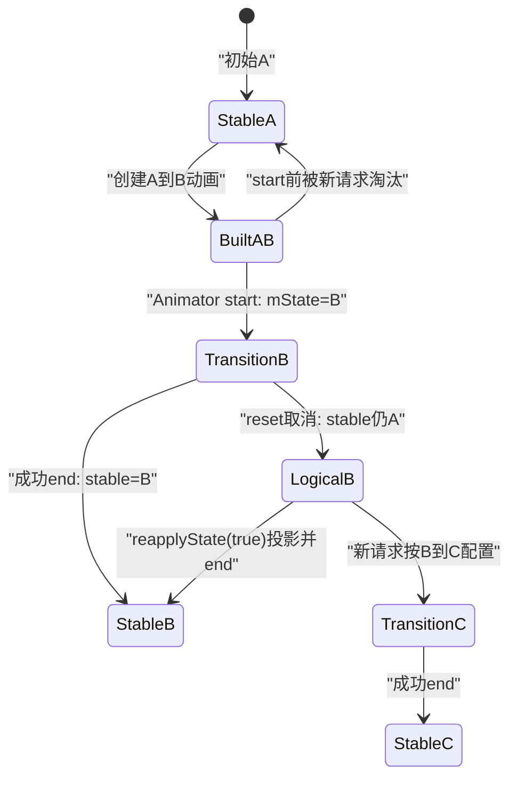

# 第511章 Android LauncherState与StateManager：状态请求、动画转换、取消、稳定态和完成回调链

> 源码基线：Android 11 / API 30 / `android-11.0.0_r48`。正文直接写入正式学习目录，只读源码、不编译。核心文件：`LauncherState.java`、`StateManager.java`、`BaseState.java`、`StatefulActivity.java`、`Launcher.java`、`AllAppsState.java`和Quickstep的`OverviewState.java`。

## 1. 本章解决什么问题

点击HOME、上滑进入All Apps、进入最近任务时，谁决定Workspace缩放、Hotseat显隐和Overview位置？一个“状态”何时只是请求，何时已成为逻辑状态，何时才算稳定完成？动画中途再来一个请求、手势取消或Activity停止，又会怎样收口？

## 2. 一句话定位

`LauncherState`是目标UI的只读参数表，`StateHandler`把目标参数投影到各块View，`StateManager`负责请求去重、动画装配、取消、历史与回调；三者组合才是一套Launcher状态机。

## 3. 先记住五个不同事实

“调用了goToState”“mState已改”“Animator已结束”“mCurrentStableState已改”“屏幕像素已呈现”不是同一时刻。分析日志时必须给“完成”补上主语。

## 4. 核心对象关系



## 5. BaseState是最小协议

它只要求状态提供动画时长、历史态计算和flag查询。`shouldDisableRestore()`只是对`FLAG_DISABLE_RESTORE`的便捷封装。

## 6. 两个基础flag占最低位

`FLAG_NON_INTERACTIVE=1<<0`表示该状态不适合交互，`FLAG_DISABLE_RESTORE=1<<1`表示Activity重建时不应恢复它。

## 7. Launcher扩展flag从bit 2开始

`BaseState.getFlag(index)`返回`1 << (index + 2)`，避免Launcher自己的多页、不可访问、可拖拽等flag撞上基础两位。

## 8. LauncherState不是View快照

它不保存每个View当前alpha/translation，也不保存动画进度；它按需计算“到这个状态时应该是什么值”。当前像素仍在具体View和Animator里。

## 9. LauncherState也不是Java enum

它是抽象类加九个静态实例。这样不同状态可覆写缩放、深度、可见元素、返回行为和动画时长。

## 10. ordinal承担固定身份

构造函数把实例放进长度为9的`sAllStates[id]`。`values()`返回数组副本，主要用于保存/恢复ordinal和测试语义。

## 11. ordinal不是UI层级的万能排序值

注释说状态按UI layer递增，但业务判断多数仍用实例身份或flag；不要用`ordinal > ...`自行推导可见性或返回关系。

## 12. 九个状态的角色

包括NORMAL、SPRING_LOADED、ALL_APPS、HINT_STATE、OVERVIEW、OVERVIEW_PEEK、OVERVIEW_MODAL_TASK、QUICK_SWITCH和BACKGROUND_APP。产品所选source set会决定Overview的具体实现。

## 13. source set差异必须先辨认

普通`src_ui_overrides`的Overview很薄；Launcher3QuickStep会选`quickstep/recents_ui_overrides`实现，后者计算Task尺寸、Overview按钮、深度和背景应用状态。

## 14. NORMAL是基准态

它允许Workspace图标拖动、隐藏返回键、带System UI scrim，并禁用重建恢复。它的`getTransitionDuration()`返回0只是占位。

## 15. 回NORMAL为何仍有动画

`StateManager`发现目标是base state时，使用`fromState.getTransitionDuration()`。因此ALL_APPS→NORMAL通常沿用ALL_APPS的320ms，而不是NORMAL的0ms。

## 16. ALL_APPS是参数集合

它给出320ms、vertical progress 0、深度1、Workspace页alpha 0，以及All Apps header/content可见。

## 17. ALL_APPS不等于“某个View visible”

Workspace、Hotseat、All Apps、Scrim等多个Handler共同解释同一个状态；只查AppsView visibility会漏掉平移、缩放和可访问性。

## 18. OVERVIEW也是组合目标

Quickstep实现依据Recents Task尺寸计算Workspace scale/translation，给Overview scrim 0.5、depth 1，并动态决定按钮、搜索框或Hotseat元素。

## 19. BACKGROUND_APP明确非交互

它包含`FLAG_NON_INTERACTIVE`，表示Launcher处于应用背后的手势中间态；StatefulActivity的Deferred Resume会被这道门挡住。

## 20. QUICK_SWITCH继承BACKGROUND_APP

它保留非交互语义，把Workspace按手势范围平移，并返回`NONE`作为可见元素，用于从Launcher快速切到任务。

## 21. state flag是策略信号

例如`FLAG_CLOSE_POPUPS`让Launcher在转换开始关闭浮层，`FLAG_MULTI_PAGE`影响页指示器和裁剪，`FLAG_WORKSPACE_INACCESSIBLE`供可访问性/交互逻辑判断。

## 22. visible element是位掩码

HOTSEAT图标、搜索框、All Apps头部/内容、纵向手势指示器和Overview按钮可组合返回；它不是单选枚举。

## 23. APPS_VIEW_ITEM_MASK是集合便捷值

它合并Hotseat Search Box与All Apps三类内容，供控制器一次判断Apps容器相关元素，并不包含所有Launcher UI。

## 24. ScaleAndTranslation是目标值容器

Workspace、Hotseat和QSB都可返回scale、translationX、translationY；对象可被子类继续修改，因此不要把它当不可变值对象。

## 25. PageAlphaProvider按页计算

NORMAL/HINT在特定DeviceProfile下只保留中心页；ALL_APPS/OVERVIEW可让Workspace页alpha为0。插值器也随provider一起返回。

## 26. getDepth会先处理多窗口

多窗口模式强制返回0，否则调用状态自己的`getDepthUnchecked()`。所以“Overview一定blur/zoom”为1不是跨窗口形态真理。

## 27. getDescription服务无障碍

NORMAL通常返回当前Workspace页描述，ALL_APPS返回AppsView描述，OVERVIEW返回“最近使用的应用”资源字符串。

## 28. onBackPressed由状态参与决策

通用实现从StateManager取`lastState`并返回；Overview若有running task，优先重新启动该任务，不一定回NORMAL。

## 29. history不是浏览器式完整栈

StateManager只保存`mLastStableState`一个入口，不保存任意长度路径。LauncherState默认历史直接归NORMAL。

## 30. ALL_APPS保留一个特殊历史

若前一稳定态是OVERVIEW，ALL_APPS的history返回OVERVIEW；其他来源返回NORMAL。

## 31. StateManager初始化三态相同

构造时`mState`、`mLastStableState`和`mCurrentStableState`都指向base state，即Launcher的NORMAL。

## 32. mState是当前逻辑目标态

动画真正start时就会被赋为目标状态；因此动画只走了10%，`isInState(target)`也可能已经为true。

源码把赋值放在start回调，而不是请求入口：

```java
private void onStateTransitionStart(STATE_TYPE state) {
    mState = state;
    mActivity.onStateSetStart(mState);
}
```

## 33. mCurrentStableState是成功收口态

只有`onStateTransitionEnd()`才更新它。它能区分“逻辑上正去ALL_APPS”和“ALL_APPS转换已正常结束”。

## 34. mLastStableState是返回入口

每次稳定态变化时，它由新状态的`getHistoryForState(oldStable)`计算，不是简单无条件保存oldStable。

## 35. mRestState是停止时的临时归宿

若未设置则回base state；回到base state成功结束时会清空自定义rest state。

## 36. mConfig既是配置也是在途账

内部`AnimationState`继承StateAnimationConfig，又保存currentAnimation、playbackController、targetState和changeId。

## 37. StateHandler是View投影接口

它只有立即`setState(state)`与`setStateWithAnimation(toState,config,builder)`两条路；StateManager不直接知道Workspace每个属性。

## 38. Handler数组是惰性创建

首次`getStateHandlers()`才调用Activity的`createStateHandlers()`并缓存，后续状态转换复用同一组对象。

## 39. 普通Launcher至少两个Handler

基础Launcher返回AllAppsTransitionController和Workspace。Quickstep再加入DepthController、RecentsViewStateController和BackButtonAlphaHandler。

## 40. Handler共同写入一个PendingAnimation

每个Handler把自己的Animator、frame callback或结束逻辑加入builder，最后统一build成AnimatorSet。

## 41. 请求入口默认自行决定动画

`goToState(state)`调用`shouldAnimateStateChange()`；Activity必须started且未force invisible才建议动画。

## 42. 全局动画设置有最终否决权

即使调用者传`animated=true`，还会与`Utilities.areAnimationsEnabled(activity)`相与；系统/测试禁动画时进入立即路径。

## 43. 同一稳定态请求直接完成

若Activity已在目标态且没有currentAnimation，StateManager立即运行onCompleteRunnable，不再通知start/end，也不重投影View。

## 44. 同一普通动画目标会合并

若当前非手势动画正去同一目标且仍要求动画，只把新的完成Runnable作为success listener挂到现有Animator上。

## 45. 手势控制动画不会走上述合并

`mConfig.userControlled`为true时，即使mState等于目标，也会继续取消/重建逻辑，因为手势进度和结算不能当普通定时动画复用。

## 46. 新请求先捕获fromState

代码先保存当前`mState`，再`mConfig.reset()`取消旧动画。这个fromState主要用于选择回base的时长和配置插值器。

## 47. reset做了什么

它把duration/flags/interpolator等复制回默认值、targetState置空，取消playback或Animator，清引用并让changeId加一。

关键代码只处理动画账，没有给外层`mState`赋值：

```java
if (playbackController != null) {
    playbackController.getAnimationPlayer().cancel();
    playbackController.dispatchOnCancel();
} else if (currentAnimation != null) {
    currentAnimation.setDuration(0);
    currentAnimation.cancel();
}
changeId++;
```

## 48. reset没有做什么

它没有修改`StateManager.mState`、`mCurrentStableState`或View属性，也不会让被取消动画的success回调执行。

## 49. 这里存在过时注释

`goToState()`注释称reset会把mState恢复到mCurrentStableState，但r48实现无这句赋值。读源码应以可执行代码为准，并把注释当需要验证的假设。

## 50. 普通动画完整时序



## 51. Animator为什么post后才start

`goToStateAnimated()`完成builder后把`StartAnimRunnable`投到主Handler，给当前调用栈中的布局/属性准备留出边界。

## 52. post还提供旧代际淘汰

StartAnimRunnable先比较`mConfig.currentAnimation == mAnim`；在它执行前若又有请求reset，旧Animator不会start。

## 53. mState在Animator start才修改

动画对象已创建、已登记为currentAnimation，但主Handler尚未执行start时，getState仍可能返回fromState。

## 54. onStateTransitionStart顺序

先写`mState=target`，再调用Activity.onStateSetStart，最后倒序通知StateListener。

## 55. Handler已在start回调前声明目标属性

`setStateWithAnimation()`发生于建Animator阶段；它可能读取/准备View属性。业务start回调不是所有准备工作的最早边界。

## 56. 立即路径没有Animator

它先取消共享state element动画，再调用transition start，各Handler立即setState，最后transition end并执行完成Runnable。

## 57. 立即路径仍有完整状态回调

`animated=false`不代表无start/end语义；只是两者在同一调用栈内紧邻发生，通常没有中间帧。

## 58. 延迟请求不预建Animator

delay大于0时只post一个Runnable，等待到期才读取可能已变化的View属性并创建动画。

## 59. changeId淘汰延迟旧请求

记录startChangeId，到期时必须仍相等。任何reset都会递增changeId，使旧延迟请求安静失效。

## 60. 延迟期间mState通常仍是旧态

真正Animator start前不会调用transition start。调用`goToState(target,delay)`不等于立即进入target。

## 61. NORMAL转换时长取fromState

因为base state可从多态返回，代码假定播放反向过渡，采用来源状态duration。

## 62. 非NORMAL转换时长取目标态

例如去ALL_APPS读ALL_APPS时长，去OVERVIEW读OVERVIEW时长。它是框架约定，不是任意状态对的独立时长矩阵。

## 63. prepareForAtomicAnimation先配置细节

AtomicAnimationFactory可按from/to设置各动画类型插值器，并给将显示但当前隐藏的View准备起始值。

## 64. PendingAnimation是汇流器

StateManager建立统一duration，Handlers把属性动画加入，最后附状态监听并build AnimatorSet。

## 65. animComponents可以让某些Handler不参与

`createAnimationToNewWorkspaceInternal()`只有`getAnimComponents()!=0`才调用Handlers，但仍给builder添加状态监听并登记动画。

## 66. StateAnimationConfig区分原子与非原子组件

PLAY_NON_ATOMIC、PLAY_ATOMIC_OVERVIEW_SCALE、PLAY_ATOMIC_OVERVIEW_PEEK可组合；SKIP_OVERVIEW与SKIP_DEPTH_CONTROLLER是额外跳过flag。

## 67. 原子不是数据库事务意义

这里表示某组视觉属性一起播放或与手势动画拆分，不能推导失败回滚、跨View一致提交或Surface原子呈现。

## 68. 每类属性可有独立插值器

vertical progress、Workspace scale/translate/fade、Hotseat、Overview、All Apps、scrim、modal和depth共16类索引。

## 69. 未配置插值器使用fallback

Handler调用`getInterpolator(animId,fallback)`，所以最终曲线由Factory配置与Handler默认值共同决定。

## 70. createAtomicAnimation是独立工具

它准备配置、遍历Handler、返回AnimatorSet，但本身不把该Animator登记为StateManager当前动画，也不自动更新mState。

## 71. 调用者需区分“创建”与“接管”

只调用createAtomicAnimation并start，不会获得StateManager取消/稳定态/Activity回调管理；需要时还要用setCurrentAnimation等API接线。

## 72. 手势动画返回PlaybackController

`createAnimationToNewWorkspace(state,config)`先置`userControlled=true`、reset旧账、复制config、构建动画并创建播放控制器。

## 73. 手势目标也登记targetState

内部builder调用`mConfig.setAnimation(animation,state)`；但mState要等目标Animator收到start回调才切换。

## 74. 手势可由外部控制fraction

AnimatorPlaybackController把时间动画变成可拖动播放头；StateManager只保存它并在后续reset时发cancel。

## 75. reset手势路径有两步取消语义

先取消animationPlayer，再显式`dispatchOnCancel()`；普通Animator则先把duration设0再cancel。

## 76. duration设0不等于成功结束

随后调用的是cancel；AnimationSuccessListener收到cancel会标记mCancelled，onAnimationEnd时不会调用success。

## 77. success listener保护完成Runnable

普通onCompleteRunnable用`AnimationSuccessListener.forRunnable()`包装，动画取消时不执行，避免把“被替代”误报成成功到达。

## 78. 状态完成监听同样只认成功

`createStateAnimationListener`继承AnimationSuccessListener；被取消时不会走`onStateTransitionEnd(target)`。

## 79. 取消后mState可能仍是已取消目标

若旧动画已经start，mState早已改为旧target；reset只清动画账，不回写稳定态。此时`mState != mCurrentStableState`是合法中间结果。

## 80. 新动画fromState因此可能是逻辑目标

动画中途从A去B、又请求C时，代码捕获的fromState是B，不是旧稳定A；View实际属性则可能停在A与B之间。

## 81. 新Handler一般从当前View值建动画

这有助于视觉连续，但Factory的fromState/toState策略按B→C选择；调试插值器异常时要同时记录逻辑from和实际属性。

## 82. cancelAnimation只是reset

公开API不主动`reapplyState()`，也不主动补发transition end。调用者若需要明确视觉收口必须使用合适的上层路径。

## 83. reapplyState(false)不会打断动画

只要currentAnimation非null，就不遍历Handler；因此Insets变化调用reapply也可能等动画结束，除非要求cancel。

## 84. reapplyState(true)的特殊收口

先取消共享element动画与当前转换，然后因currentAnimation已空，对`mState`调用所有Handler.setState。

## 85. 它会把目标逻辑态稳定化

若调用前确有动画，投影结束后还调用`onStateTransitionEnd(mState)`。因此不是恢复旧stable，而是把当前mState目标立即做成stable。

## 86. reapplyState(false)无动画时只重投影

它调用Handlers.setState(mState)，但wasInAnimation为false，不重复Activity end与Listener complete。

## 87. LauncherRootView的Insets路径会强制取消

根View尺寸/Insets变化可调用`reapplyState(true)`，从而中断转换并收口目标；这解释旋转或窗口变化时动画为何突然完成。

## 88. setCurrentAnimation有三种用途

可登记纯自定义Animator、登记“去某个状态”的自定义Animator，或登记外部PlaybackController；是否自动状态回调取决于重载。

## 89. 带toState重载会接状态监听

它先cancel旧动画，再登记新Animator，并附createStateAnimationListener，因此start/end可更新mState与stable。

## 90. 不带toState重载只管理在途占用

`setCurrentAnimation(anim, childAnimations...)`最终以targetState=null登记，不会自动改变LauncherState。

## 91. childAnimations用于避免自相取消

若新外层Animator包含当前StateManager管理的动画或Playback target，先clear引用而不cancel该child，再接管外层。

## 92. 替换不相关自定义动画会补收口

若旧currentAnimation仍在，代码cancel后reapplyState，并显式`onStateTransitionEnd(mState)`清理临时属性；这条路径要警惕重复语义。

## 93. 取消与稳定态状态图



## 94. isInStableState有三重条件

要求mState==state、mCurrentStableState==state，并且targetState为空或也等于state；它比Activity.isInState严格。

## 95. isInState只比较mState

`StatefulActivity.isInState(state)`直接比较StateManager.getState，所以动画start后即为true，不能作为视觉稳定证据。

## 96. currentAnimation为空也不必然像素已呈现

Animator end和Handler属性写入发生在UI线程，但Surface提交、合成与屏幕显示还有帧流水线；StateManager没有Surface fence。

## 97. onStateTransitionEnd先更新历史

若目标不同于current stable，先算lastStable并更新currentStable，再调用Activity.onStateSetEnd。

## 98. 回base会清rest state

Activity end之后，若目标是base state则`setRestState(null)`，然后倒序通知StateListeners完成。

## 99. StateListener按倒序通知

start和complete都从list末尾向前遍历。若监听器在回调中修改列表，普通ArrayList仍有重入/跳项风险，接口没有快照保护。

## 100. Activity start回调做业务门控

Launcher添加TRANSITION_ACTIVE flag，按状态关闭Popup，SPRING_LOADED时锁旋转/暂停安装快捷方式写入，并调整页指示器。

## 101. Activity end回调解除临时状态

Launcher更新WidgetHost resumed、Workspace裁剪、结束ActionMode、移除TRANSITION_ACTIVE，发送无障碍窗口事件；NORMAL还冲刷安装队列并解旋转锁。

## 102. r48有一处疑似复制错误

`Launcher.onStateSetEnd()`调用的是`super.onStateSetStart(state)`而不是`super.onStateSetEnd(state)`。当前父类end为空，因此眼下效果有限，但继承语义不准确，升级对比时应复查。

```java
@Override
public void onStateSetEnd(LauncherState state) {
    super.onStateSetStart(state);
    getAppWidgetHost().setResumed(state == LauncherState.NORMAL);
    // ...
}
```

## 103. 这处错误可能重复Deferred Resume检查

父类start会在pending时调用handleDeferredResume；Launcher transition start已调用过一次，end又误调start可再尝试。它不是通用“end已调用父类end”的证据。

## 104. moveToRestState尊重用户手势

如果当前动画存在且userControlled，直接返回，不在Activity onStop时打断用户正在操作的手势。

## 105. 只有disable restore状态才移动

`mState.shouldDisableRestore()`为true才goToState(rest)，随后把lastStable重置为base。可恢复态会保留。

## 106. onStop调用rest有生命周期条件

StatefulActivity仅在不是配置变化时调用moveToRestState，避免旋转重建随意改变临时状态。

## 107. shouldAnimateStateChange不是稳定性判断

它只检查Activity非force invisible且started；不检查当前state、窗口焦点、Workspace loading或Surface是否可见。

## 108. dump是重要诊断入口

它输出lastStable、currentStable、mState、restState和currentAnimation是否非空，可快速识别“逻辑目标已变但稳定态未变”。

## 109. 推荐再记录target与userControlled

r48 dump没输出mConfig.targetState、changeId、userControlled和Animator started/fraction；复杂手势问题需要在临时诊断日志中补这些字段。

## 110. 诊断状态卡住的顺序

先看mState/currentStable/currentAnimation，再看Animator是否cancel、Handler是否写同一属性、Activity TRANSITION_ACTIVE、View attach/layout、最后看Surface帧，不要只盯StateListener complete。

## 111. 推荐测试矩阵

覆盖NORMAL↔ALL_APPS、NORMAL↔OVERVIEW、动画start前第二请求、动画中第二请求、手势取消/完成、禁动画、延迟请求被替换、Insets强制reapply、onStop rest和配置变化。

## 112. macOS只读练习一：手算三套状态

阅读StateManager的goToStateAnimated与listener。假设NORMAL稳定后请求ALL_APPS，分别写出“建好未start、start后50%、成功end”三个时刻的mState、mCurrentStableState、targetState和currentAnimation。

## 113. macOS只读练习二：推演中途改目标

假设NORMAL→ALL_APPS动画已start，40%时请求OVERVIEW。沿代码逐句记录fromState、reset、success回调、changeId、mState和stable；说明为何源码注释“恢复stable”与r48代码不一致。

## 114. macOS只读练习三：比较取消API

对比cancelAnimation、reapplyState(true)、setCurrentAnimation(anim,toState)和setCurrentAnimation(anim,children)。列出每条路径是否取消旧动画、重投影Handler、发start/end、更新stable及执行旧完成Runnable。

## 115. macOS只读练习四：建立状态参数表

阅读NORMAL、AllAppsState、OverviewState、BackgroundAppState和QuickSwitchState，整理duration、flags、visible elements、vertical progress、depth与history；注明普通和Quickstep source set差异。

## 116. 易错点一：mState不等于稳定态

动画start就切mState，成功end才切currentStable；取消后两者还能长期不同，必须结合currentAnimation与target判断。

## 117. 易错点二：cancel不等于回滚

reset不恢复mState，也不恢复View旧值；reapply(true)甚至会把当前目标直接收口为stable。

## 118. 易错点三：状态类不执行动画

LauncherState只给目标参数，StateHandler才把参数变为属性动画，AtomicAnimationFactory配置曲线，StateManager管理生命周期。

## 119. 易错点四：完成回调不等于屏幕已显示

它只证明Animator未被cancel并走到end、状态账已更新；下一帧提交、Surface合成和用户眼中的像素仍是后续层。

## 120. 本章总结与下一章

Launcher状态机的核心是“声明目标—多Handler投影—Animator在途账—成功收口稳定态”。掌握mState、currentStable、targetState和View实际属性四层，才能解释请求合并、中途取消与手势接管。下一章专门拆StateAnimationConfig、AtomicAnimationFactory、PendingAnimation和属性插值器如何构造一场可控转换。
