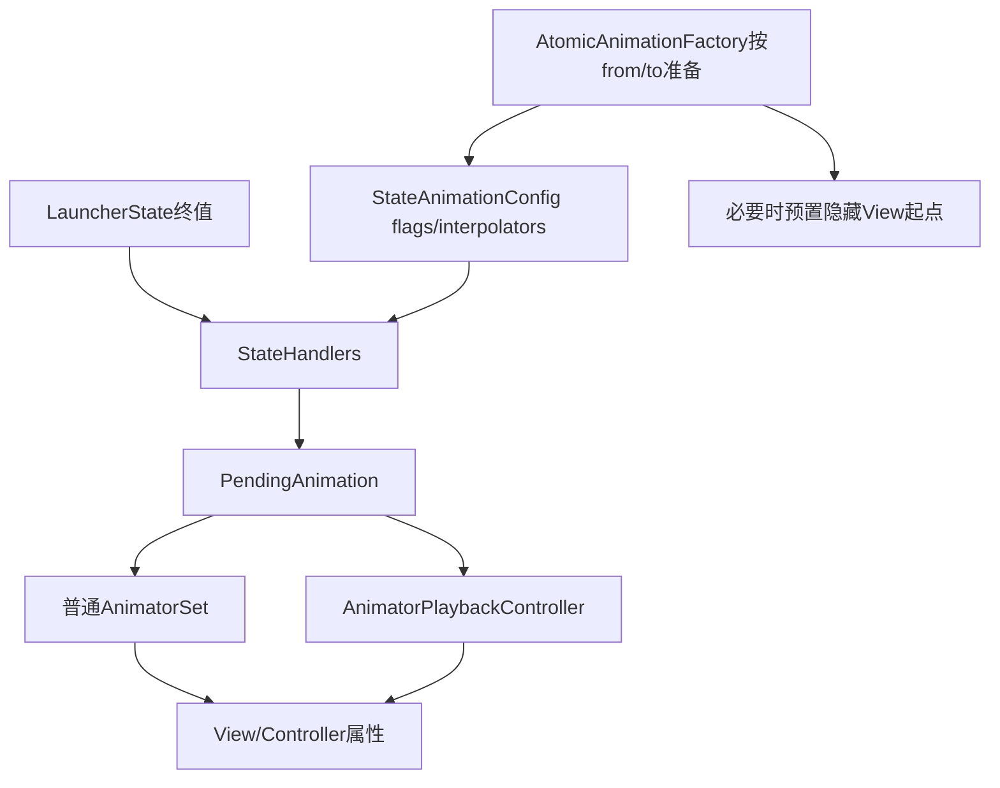
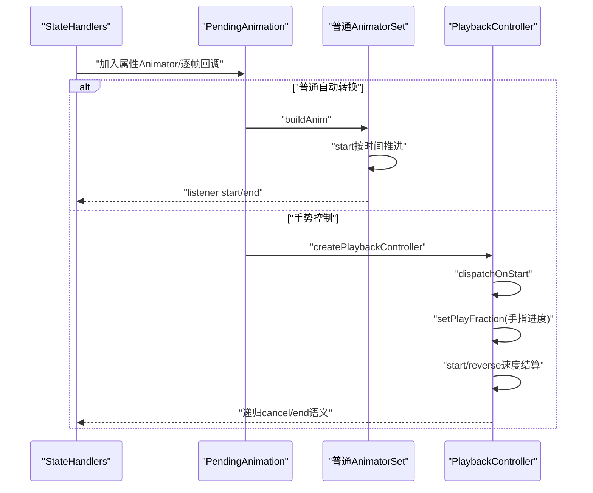
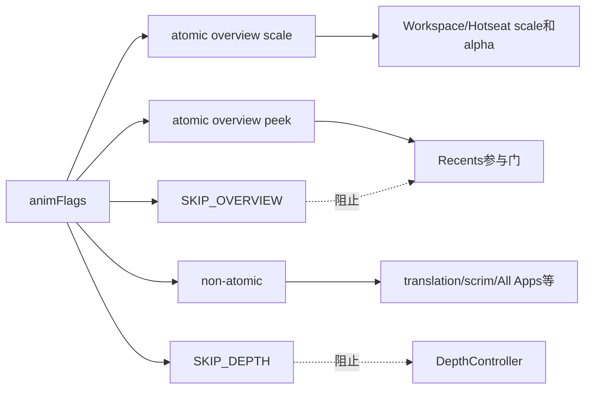

# 第512章 Android StateAnimationConfig与PendingAnimation：AtomicAnimationFactory、属性插值器装配和手势播放链

> 源码基线：Android 11 / API 30 / `android-11.0.0_r48`。直接写入正式笔记目录，只读源码、不编译。核心文件：`StateAnimationConfig.java`、`PendingAnimation.java`、`PropertySetter.java`、`AnimatorPlaybackController.java`、`QuickstepAtomicAnimationFactory.java`、`WorkspaceStateTransitionAnimation.java`和`AllAppsTransitionController.java`。

## 1. 本章解决什么问题

StateManager决定“去哪个状态”，但Workspace为何缩放、All Apps为何上移、Overview为何先显后动？同一手势怎样同时控制多个Animator？所谓atomic究竟原子在哪里？

## 2. 一句话定位

Config描述播放哪些组件及其曲线，Factory按状态对改写配置和起点，Handlers把目标属性加入PendingAnimation，后者既能build普通AnimatorSet，也能生成手势PlaybackController。

## 3. 四层不要混在一起

LauncherState提供终值，StateAnimationConfig提供播放策略，PropertySetter决定立即写还是建动画，PendingAnimation保存实际Animator；任何一层都不能单独解释完整视觉。

## 4. 装配总图



## 5. Config首先保存duration

它是统一意图时长，PendingAnimation.add会把加入的Animator设为该时长；物理动画可能另行计算并反过来拉长配置。

## 6. userControlled表示手动播放

手势创建路径会置true，Handlers可据此选择LINEAR，让手指位移与属性进度直接对应。

## 7. animFlags同时装两类信息

低位的PLAY_*决定参与组件，SKIP_OVERVIEW和SKIP_DEPTH_CONTROLLER则指示某些Handler跳过。

## 8. ANIM_ALL_COMPONENTS不是所有flag

它只合并PLAY_NON_ATOMIC、PLAY_ATOMIC_OVERVIEW_SCALE与PLAY_ATOMIC_OVERVIEW_PEEK，不含两个SKIP位。

## 9. getAnimComponents会遮掉SKIP位

实现为`animFlags & ANIM_ALL_COMPONENTS`，用于判断是否还有视觉组件参与，而非返回原始flags。

## 10. atomic不是事务

这里表示可与主手势拆开、一次播放的一组Overview相关属性；没有失败回滚、数据库一致性或Surface原子提交含义。

## 11. NON_ATOMIC也能手势控制

源码注释明确atomic组件不只用于自动动画，三类组件都可并入user-controlled transition。

## 12. 两种Overview atomic模式

PLAY_ATOMIC_OVERVIEW_SCALE与PLAY_ATOMIC_OVERVIEW_PEEK对应不同手势模型；注释约束每种gesture model恰选其中一种。

## 13. onlyPlayAtomicComponent是精确相等

只有getAnimComponents恰为某一个atomic bit才返回true；atomic bit再加NON_ATOMIC就不是“only”。

## 14. playAtomicOverviewScaleComponent只查一位

只要scale bit存在就true，即使同时含NON_ATOMIC；Workspace据此决定是否处理scale与page alpha。

## 15. 16类AnimType是曲线槽位

包含All Apps progress、Workspace、Hotseat、Overview、scrim、header、modal、depth和actions alpha等。

## 16. AnimType不是参与开关

给ANIM_DEPTH设置插值器不代表Depth必播放；是否加入仍由Handler、终值差异、SKIP flag和Surface条件决定。

## 17. 插值器数组初始全null

Handler用`getInterpolator(type,fallback)`读取，Factory未覆盖时落回各Handler默认曲线。

## 18. copyTo是逐字段复制

duration、animFlags、userControlled和16个Interpolator引用都会复制；Interpolator本身不深拷贝。

## 19. copyTo不会清额外子类字段

AnimationState的currentAnimation、targetState和playbackController由其reset/setAnimation单独管理，不属于Config.copyTo合同。

## 20. Config只是可变参数包

QuickstepFactory会覆写duration和曲线，调用者传入后不能假定其内容保持原样。

## 21. PropertySetter统一即时与动画路径

Handler面对同一接口写属性：NO_ANIM直接set，PendingAnimation则创建ObjectAnimator并加入集合。

## 22. NO_ANIM是匿名默认实现

默认setFloat/setInt立即调用Property，setViewAlpha还同步调用AlphaUpdateListener更新visibility。

## 23. setViewAlpha不只是alpha

它会让0/非0与visibility协同；直接对View.setAlpha不能自动获得同样的可见性管理。

## 24. PendingAnimation覆盖三个setter

它针对View alpha、FloatProperty和IntProperty创建动画，并保留调用者给的Interpolator。

## 25. 相同终值会跳过Animator

setFloat、setInt与setViewAlpha在当前值已等于目标时直接return，减少空动画和属性写入。

## 26. Float直接比较有边界

实现使用`property.get(target) == value`，没有epsilon；细微浮点差仍会创建动画。

## 27. setViewAlpha会附AlphaUpdateListener

因此动画跨过0时能维护View visibility，避免完全透明View仍参与部分绘制/交互语义。

## 28. add会统一设置duration

无论调用者Animator原时长如何，`add(a)`经内部路径把它设为PendingAnimation的mDuration。

## 29. 物理Animator仍可携带SpringProperty

add记录每个子Animator及SpringProperty，PlaybackController结算时可按速度把特定组件映射成弹簧。

## 30. AnimatorSet用play并行汇合

每次`mAnim.play(a.setDuration(mDuration))`，没有在PendingAnimation层表达顺序播放。

## 31. PlaybackController不支持child startDelay

类注释明确不支持子动画start delay或sequential playback；需要分段效果应使用插值器clamp而不是依赖顺序Set。

## 32. clampToProgress模拟时间窗口

例如把某曲线限制在0到0.9，让它在总进度前90%完成；INSTANT与FINAL_FRAME分别把变化推到开头或末尾。

## 33. addFloat可显式给起终值

它不像setFloat从属性当前值隐式起步，适合Factory已经算出确定from/to的场景。

## 34. addOnFrameCallback共享progress animator

多个逐帧Runnable登记到一个ValueAnimator，避免为每个callback再建一个独立时间轴。

## 35. progress animator最后才加入

buildAnim时才add mProgressAnimator，注释意图是让frame callback在其他动画update之后运行。

## 36. 这个顺序依赖AnimatorSet更新秩序

它改善同一帧读取属性的时机，但不是Surface已提交保证；callback仍处UI动画阶段。

## 37. buildAnim会补dummy

若没有任何AnimHolder，就加入0→1 ValueAnimator，保证总duration与start/end监听仍能发生。

## 38. 空动画也会等待duration

因此“所有属性已是终值”不等于立即完成；若走动画路径，dummy仍可能让状态转换按时长收口。

## 39. buildAnim返回同一mAnim

不是每次新建AnimatorSet；重复build会得到同一对象，并可能已追加progress/dummy。

## 40. 关键源码：空集合占位

```java
if (mAnimHolders.isEmpty()) {
    add(ValueAnimator.ofFloat(0, 1).setDuration(mDuration));
}
return mAnim;
```

## 41. addListener直接挂根AnimatorSet

StateManager的状态监听、Handler的success清理都通过它共享根动画生命周期。

## 42. addEndListener是另一套机制

它放入mEndListeners，只有显式`finish(isSuccess,logAction)`才调用，不随Animator自动end。

## 43. 不要混淆Animator listener与EndListener

前者由平台Animator事件触发，后者是手势调用者主动结算的业务回调。

## 44. finish调用后清EndListeners

同一批结束回调只消费一次；后续再次finish不会重放已清列表。

## 45. createPlaybackController仍先build

它把根AnimatorSet、总duration与收集的Holder交给AnimatorPlaybackController。

## 46. Controller用独立ValueAnimator驱动fraction

`mAnimationPlayer`只跑0到1；每帧再把fraction映射给实际child Animator的play time。

## 47. 手指拖动可直接setPlayFraction

输入fraction先bound到0..1，再逐Holder设置progress；目标Animator被cancel后则不再应用。

## 48. dispatchOnStart是手动监听事件

手势目标AnimatorSet通常不按普通方式start，调用者必须递归派发start，StateManager才能收到逻辑转换开始。

## 49. dispatchOnCancel也递归派发

它遍历根和子Animator监听器；因此手势取消语义不是简单调用根Animator.cancel。

## 50. 普通动画与手势时序



## 51. Controller.start从当前进度向1

它按剩余fraction缩短duration，reverse则从当前位置向0，均使用独立player。

## 52. startWithVelocity可替换局部映射

对允许在目标端弹簧的Holder，它计算SpringAnimationBuilder参数，并让该Holder按物理时间读取进度。

## 53. 不同Holder可有不同结算曲线

一个全局player驱动，但弹簧Holder的mapper与普通Holder不同，视觉上可同时结束又不完全同速。

## 54. springDuration取最大值

若任一弹簧预计更久，全局player被拉长；其他动画通过clamp映射在原计划区间完成。

## 55. forceFinishIfCloseToEnd用95%阈值

只有player正在运行且animatedFraction超过0.95才end；它看player行程，不必等同目标属性的感知完成度。

## 56. pause内部调用cancel player

先reset Holder属性setter，再取消player；pause命名不能理解成平台Animator可无损续播的普通暂停。

## 57. targetCancelled会阻止属性继续写

目标Animator收到cancel后置true，后续setPlayFraction只更新mCurrentFraction，不再触碰children。

## 58. mCurrentFraction保存原始输入

getProgressFraction返回它，getInterpolatedProgress再经根Animator interpolator；两者数值语义不同。

## 59. EndAction只保留一个

`setEndAction`覆盖旧值，不是listener列表；多方设置时后者会取代前者。

## 60. StateManager reset取消两层

先cancel animationPlayer，再dispatch目标cancel；这让player结束逻辑与目标监听器都看到取消。

## 61. AtomicAnimationFactory基础类只管理槽位

构造时按sharedElementAnimCount建立Animator数组，基础create方法对未知index抛RuntimeException。

## 62. 槽位用于互斥共享属性动画

State element Animator与状态转换可能写同一属性；StateManager新建同index前先cancel旧对象。

## 63. 结束监听把槽位置null

但没有比较“结束的是否仍是当前引用”；正常先cancel旧再写新时，旧cancel同步end通常先清，仍应警惕自定义Animator异步回调。

## 64. cancelAll只cancel不立即清数组

依赖Animator onEnd监听清引用；自定义Animator若违反平台正常回调合同，槽位可能残留。

## 65. Recents Factory占两个基础槽

INDEX_RECENTS_FADE_ANIM控制CONTENT_ALPHA，INDEX_RECENTS_TRANSLATE_X_ANIM控制相邻页偏移弹簧。

## 66. 子类靠NEXT_INDEX续编号

Quickstep再增加SHELF与PAUSE_TO_OVERVIEW两个槽，避免父子Factory index碰撞。

## 67. extraAnims参数不含父类两个

RecentsAtomicAnimationFactory构造会自己相加；传错数量可能数组越界，而编译期类型不能防止。

## 68. Recents横移弹簧按页面scale定阈值

minimumVisibleChange使用`1 / pageOffsetScale`，再设damping 0.8、stiffness 250。

## 69. Shelf动画同时驱动All Apps progress

Quickstep先用AllAppsTransitionController创建progress动画，并在需要显示Hotseat时增加同时间轴ValueAnimator。

## 70. values只有终值时补当前起点

Hotseat配套动画若只收到一个value，会补`aatc.getProgress()`；主ObjectAnimator是否补起点则依平台Property Animator规则。

## 71. Hotseat只在阈值后更新

progress达到Overview progress或Activity逻辑态为BACKGROUND_APP时，才按shiftRange计算translation。

## 72. 两个Animator被放进局部AnimatorSet

hotseatAnim duration取springAnim duration，二者并行返回，再由StateManager登记到共享slot。

## 73. PAUSE_TO_OVERVIEW固定300ms

Factory创建新Config，给vertical progress和All Apps fade设曲线，必要时也给Hotseat scale/translate设置overshoot。

## 74. 它从currentStable而非mState建原子动画

调用`createAtomicAnimation(currentStable,OVERVIEW,config)`，避免用手势中途逻辑target作为Factory来源。

## 75. createAtomicAnimation不登记状态转换

上一章强调过：它返回视觉AnimatorSet，不自动更新mState/stable；手势控制器负责整体语义接线。

## 76. prepareForAtomicAnimation是状态对策略表

Quickstep按OVERVIEW→NORMAL、PEEK↔NORMAL、NORMAL/HINT→OVERVIEW、HINT→NORMAL分别配置曲线和起始值。

## 77. OVERVIEW→NORMAL的Workspace scale减速

Workspace scale用DEACCEL、Workspace/All Apps fade用ACCEL、Overview scale限制到前90%。

## 78. 导航模式改变Overview fade

无按键模式用FINAL_FRAME，其他模式用DEACCEL_1_7；同一状态对在不同导航模式下并非同动画。

## 79. 隐藏Workspace会预置0.92 scale

Factory先检查Workspace及当前Cell内容是否真的可见，只有不可见时才改起点，避免用户看到跳变。

## 80. Hotseat/QSB也有相同保护

仅在自身不可见时预置0.92；Overview Actions特性开启时还处理Apps容器中的QSB scale。

## 81. Factory会直接改View

prepare不是纯配置函数，它可能在Animator创建前同步setScale；异常或动画随后被淘汰时需靠后续状态投影收口。

## 82. NORMAL→OVERVIEW按导航模式分叉

无按键模式Workspace scale/translate偏加速、Overview fade瞬时；按钮模式使用overshoot并可能预置Recents scale 1.33。

## 83. Recents起点同样只在不可见时预置

若Overview已visible且content alpha非0，Factory不强行跳到1.33，保护连续转换。

## 84. translation overshoot受Shelf特性影响

开启Overview Actions且移除Shelf时用OVERSHOOT_1_2，否则用更强的OVERSHOOT_1_7。

## 85. HINT→NORMAL可能拉长duration

Factory构建一次Workspace spring测duration并缓存，config.duration取原值与物理时长最大值。

## 86. 缓存与设备参数有关

注释说物理时长可能因设备而异，所以按Factory实例首次计算；运行中资源变化是否重新算，r48没有显式失效逻辑。

## 87. 关键源码：Factory可改时长

```java
if (mHintToNormalDuration == -1) {
    ValueAnimator va = getSpringScaleAnimator(...);
    mHintToNormalDuration = (int) va.getDuration();
}
config.duration = Math.max(config.duration, mHintToNormalDuration);
```

## 88. Workspace Handler从State读取三组终值

分别读取Workspace、Hotseat和QSB的ScaleAndTranslation，并遍历每个CellLayout计算page alpha。

## 89. mNewScale供外部查询最终scale

它在装配时立刻更新，不代表Workspace当前scale已经动画到终点。

## 90. atomic scale组件处理缩放与alpha

playAtomicOverviewScaleComponent为true时，Workspace/Hotseat/QSB scale、Hotseat/page indicator alpha与每页内容alpha加入。

## 91. only atomic会提前return

完成上述alpha/scale后，不再处理translation和scrim，避免与另一条user-controlled非原子动画争写。

## 92. 非atomic路径仍可能处理平移

若没有atomic scale bit，translation默认LINEAR；有scale bit且同时含其他组件时可读取ANIM_WORKSPACE_TRANSLATE曲线。

## 93. 组件拆分图



## 94. Pivot需要对齐Workspace

Hotseat与QSB是Workspace兄弟View，缩放前手算pivot坐标，才能看起来围绕同一中心缩放。

## 95. pivot计算读取当前translation

如果其他Animator也在改translation，装配时的pivot可能基于中间值；并发写属性是排查跳动的重要方向。

## 96. HINT→NORMAL scale使用真正Spring

当setter是PendingAnimation且from HINT、to NORMAL，Workspace/Hotseat/QSB加入SpringAnimationBuilder结果，而非普通ObjectAnimator。

## 97. Page背景与内容alpha分组件

非only-atomic时可更新Cell scrim drawable alpha；atomic scale存在时才更新shortcuts/widgets alpha。

## 98. Workspace scrim最终走线性

SCRIM_PROGRESS取状态workspace scrim alpha，SYSUI_PROGRESS取FLAG_HAS_SYS_UI_SCRIM，二者在此固定LINEAR。

## 99. AllApps progress是一条主属性

`mProgress * mShiftRange`决定容器translationY，同时同步Scrim progress和可选搜索Plugin进度。

## 100. progress 0与1含义相反直觉

0表示All Apps拉到顶部可见，1表示下移到Workspace；阅读手势fraction时不要直接把1理解成All Apps完全打开。

## 101. 目标progress相同走fail-fast

若不只播放atomic组件，仍更新alphas；随后立即调用onProgressAnimationEnd，不向builder加入progress Animator。

## 102. only atomic时All Apps progress直接跳过

注释明确All Apps transition没有自己的atomic component，因此早退，防止与主手势冲突。

## 103. userControlled时默认LINEAR

非手势去Overview则可借ANIM_OVERVIEW_SCALE fallback，其他目标默认FAST_OUT_SLOW_IN。

## 104. progress animator名为spring但实为ObjectAnimator

`createSpringAnimation()`在r48只返回ObjectAnimator；物理感主要来自外层插值器/Playback结算，方法名容易误导。

## 105. progress end清理只在成功时执行

监听器是AnimationSuccessListener，cancel不调用onProgressAnimationEnd；后续reapply或新转换需负责终值清理。

## 106. All Apps容器alpha用INSTANT/FINAL_FRAME

目标有任意Apps项时开头显示容器，目标无Apps项时末帧才隐藏，避免内容动画过程中父容器提前消失。

## 107. 内部内容alpha独立控制

Content、scrollbar、header extra、search UI、drag handle分别依据visibleElements，父容器alpha不能替代这些通道。

## 108. Recents Handler有双重参与门

必须存在PEEK或SCALE atomic flag，且没有SKIP_OVERVIEW，才进入动画装配。

## 109. Recents逐帧加载可见Task数据

进入overview时addOnFrameCallback(loadVisibleTaskData)，它在属性动画update后运行，但可能每帧触发数据判断。

## 110. 离开Overview成功后reset visuals

resetTaskVisuals作为AnimationSuccessListener，只在未取消的根动画end执行。

## 111. Depth还有Surface与多窗口门

mSurface为空、only atomic、SKIP_DEPTH、或多窗口动画期间忽略状态变化时，都不把depth Animator加入builder。

## 112. macOS只读练习一：画属性归属表

阅读Workspace、AllApps、Recents和Depth四个Handler，列出每个ANIM_*槽位由谁读取、默认Interpolator、目标属性和跳过条件。

## 113. macOS只读练习二：推演空动画

假设所有属性已等于目标，但StateManager仍创建300ms转换。沿PendingAnimation说明为何会有dummy、start/end何时触发、状态何时stable，以及像素是否发生变化。

## 114. macOS只读练习三：对比普通与手势播放

从同一PendingAnimation分别调用buildAnim().start和createPlaybackController，记录谁推进时间、谁派发start/cancel、child startDelay限制、完成与EndListener的差异。

## 115. macOS只读练习四：手算NORMAL到OVERVIEW

按无按键和三按键两种模式阅读QuickstepAtomicAnimationFactory，整理Workspace/Overview/Depth/fade/translate曲线、预置scale条件和最终duration来源。

## 116. 易错点一：Config插值器不等于Animator存在

Handler仍可能因终值相同、flag跳过、Surface为空或only atomic而不创建属性动画。

## 117. 易错点二：Pending不等于尚未build

它是动画汇流器名称；build后仍返回内部同一AnimatorSet，EndListener还需显式finish。

## 118. 易错点三：prepare不是纯函数

Quickstep Factory会同步预置View scale和修改duration，动画未start前界面对象就可能已变化。

## 119. 易错点四：动画end不是像素fence

逐帧callback、属性终值与listener完成都在UI动画语义层，Wallpaper zoom、Surface blur及屏幕合成还有独立提交链。

## 120. 本章总结与下一章

Launcher用Config选择组件和曲线，用Factory针对状态对预置策略，用Handlers生成属性Animator，再由PendingAnimation统一支持定时或手势播放。下一章进入InvariantDeviceProfile，理解网格选型、显示尺寸、图标规格和数据库迁移配置从哪里来。
