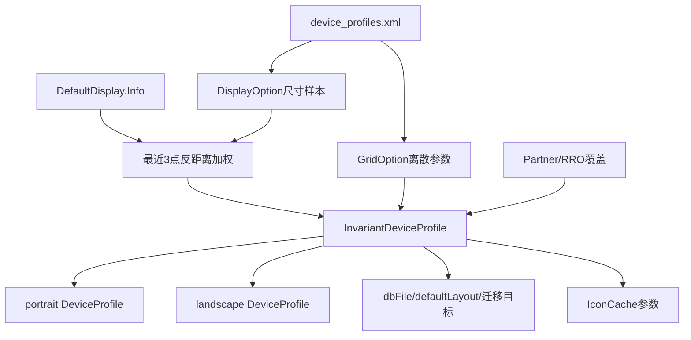
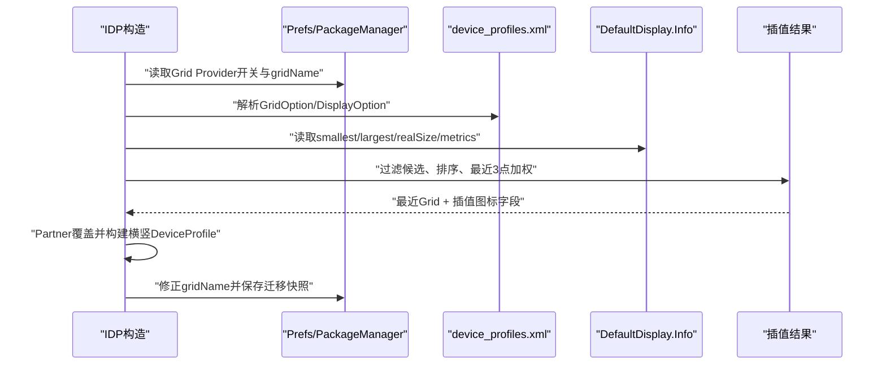
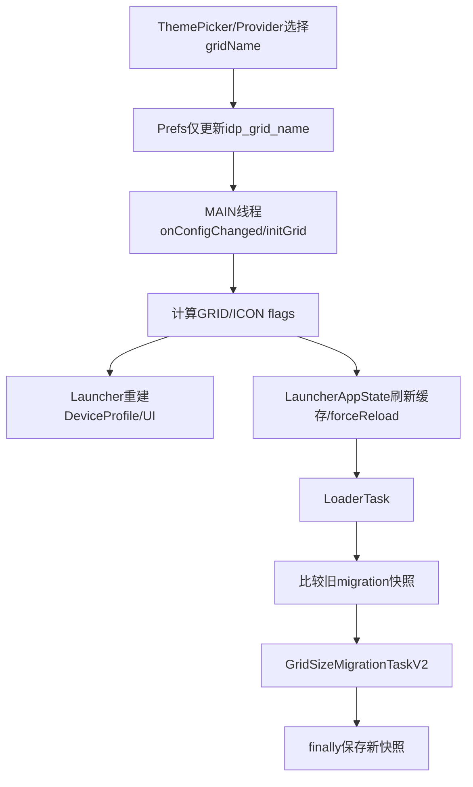

# 第513章 Android InvariantDeviceProfile：网格选型、显示尺寸、图标规格、配置监听和迁移快照链

> 源码基线：Android 11 / API 30 / `android-11.0.0_r48`。直接写入正式笔记目录，只读源码、不编译。核心文件：`InvariantDeviceProfile.java`、`device_profiles.xml`、`ConfigMonitor.java`、`GridCustomizationsProvider.java`、`LauncherAppState.java`和`GridSizeMigrationTaskV2.java`。

## 1. 本章解决什么问题

Launcher为何在不同屏幕上选择3×3、4×4或5×5？图标大小是取某个预设还是算出来的？用户切网格后，内存参数、图标缓存、数据库和Activity怎样逐步收敛？

## 2. 一句话定位

InvariantDeviceProfile（IDP）把“与当前方向无关的网格与图标基准”集中起来：离散选择最近GridOption，对显示尺寸做插值，再生成横竖屏DeviceProfile，并通过监听通知模型与界面重建。

## 3. IDP的“不变”是相对方向而言

行列、Hotseat数量、图标基准和数据库文件在横竖屏间共享；具体可用宽高、padding、Cell尺寸仍由portrait/landscape DeviceProfile分别计算。

## 4. 输入输出总图



## 5. INSTANCE保证主线程初始化

它使用MainThreadInitializedObject；后台首次get会转主线程创建并等待，构造和后续监听默认依赖UI线程语义。

## 6. IDP不是纯数据DTO

生产构造函数还注册ConfigMonitor与OverlayMonitor、写SharedPreferences，并在变化时直接通知监听器。

## 7. 测试空构造不建立有效配置

无参构造只为测试开放，字段保持默认0/null；不能把它当生产可用IDP。

## 8. 显式gridName构造不注册Monitor

它用于预览/验证特定网格，注释明确“按设计不应有monitor”，避免临时对象监听系统变化。

## 9. Display构造服务第二屏

它先确保默认IDP已初始化，再分别对默认屏和目标Display插值，保留默认GridOption与主图标尺寸，按目标屏生成DeviceProfile。

## 10. 原始profile变量只用于触发初始化

`originalProfile = INSTANCE.get(context)`后没有读取其字段；其作用是保证主配置对象与相关初始化已经发生。

## 11. XML先分GridOption

每个`grid-option`定义name、Workspace行列、Folder行列、Hotseat、All Apps列、数据库文件和默认布局。

## 12. 一个Grid可有多个DisplayOption

每个display-option提供minWidthDps、minHeightDps、图标/文字尺寸和canBeDefault，代表同一网格在不同屏幕尺寸上的样本。

## 13. XML里的display name未被算法读取

r48构造DisplayOption没有读取其name属性；“Nexus 5”等名称是文档标签，不参与匹配。

## 14. 标准资源有三类Grid

本基线Launcher3资源提供3_by_3、4_by_4和5_by_5；不同产品可通过资源覆盖替换，不能把这三套当所有设备固定事实。

## 15. Go资源只提供4_by_4

Launcher3 Go source set的device_profiles.xml只有Go Device样本，图标60dp、文字14sp，数据库launcher.db。

## 16. 资源选择发生在构建期

运行时`R.xml.device_profiles`只看到最终合并/覆盖后的资源，不会同时遍历普通版和Go版两份文件。

## 17. Grid默认值会回落到Workspace规格

未写Hotseat数量则取numColumns，Folder行列分别取Workspace行列，All Apps列也默认numColumns。

## 18. demo布局默认复用defaultLayout

只有XML显式给demoModeLayoutId才分离；否则演示模式布局与默认布局相同。

## 19. extraAttrs保留扩展属性

Themes.createValueMap把标准styleable之外可用的值保存在SparseArray，消费者可通过getAttrValue读取。

## 20. 网格选择开关看Provider组件

`isGridOptionsEnabled()`不是简单FeatureFlag，而是检查GridCustomizationsProvider组件在PackageManager中的启用状态。

## 21. 关闭网格选项时gridName为null

getCurrentGridName直接返回null，随后只从canBeDefault样本中选择最合适配置。

## 22. 开启时gridName来自普通Prefs

key为`idp_grid_name`；缺省仍是null，算法会走默认样本集合。

## 23. 指定名字先过滤样本

只保留`option.grid.name == gridName`的所有DisplayOption；该网格内仍可依据屏幕尺寸插值图标。

## 24. 无匹配不会立即报错

getPredefinedDeviceProfiles会回退到所有canBeDefault样本。生产init随后返回实际选中Grid名称并修正Prefs。

## 25. 所有默认样本为空才崩溃

此时抛`RuntimeException("No display option with canBeDefault=true")`，属于资源配置错误。

## 26. 显式grid构造会严格校验

即使内部回退得到默认Grid，只要返回名称不等于请求名称，就抛IllegalArgumentException("Unknown grid name")。

## 27. 屏幕匹配使用两个dp维度

width取smallestSize两边较小像素转dp，height取largestSize两边较小像素转dp，保证用于匹配的width小于height。

## 28. 这不是简单realSize

smallest/largest可用尺寸考虑方向和系统区域；realSize主要在后面生成横竖屏Profile和壁纸尺寸时使用。

## 29. 距离是二维欧氏距离

样本点为(minWidthDps,minHeightDps)，设备点与之计算hypot，再把列表按距离升序排序。

## 30. 排序会修改传入列表

profiles每次从XML新建，所以主路径没有共享顺序副作用；测试若复用同一ArrayList需注意已重排。

## 31. 精确命中直接返回原DisplayOption

距离严格等于0就返回该样本，不做加权，也不复制对象。

## 32. 非精确命中最多取最近3点

KNEARESTNEIGHBOR固定为3；候选少于3则只用实际数量。

## 33. 权重是距离的负五次方

`100000 / d^5`让近点占比迅速增大；常量100000用于避免极端远距权重小到float难以表达。

## 34. 最终会除以权重总和

每个样本的尺寸字段先乘权重累加，再整体乘`1/weights`，得到加权平均。

## 35. 关键源码：离散Grid与连续尺寸分离

```java
GridOption closestOption = points.get(0).grid;
DisplayOption out = new DisplayOption(closestOption);
for (int i = 0; i < points.size() && i < 3; i++) {
    float w = weight(...);
    out.add(new DisplayOption().add(points.get(i)).multiply(w));
}
return out.multiply(1.0f / weights);
```

## 36. GridOption只取最近点

out绑定`points.get(0).grid`，所以行列、DB和布局是离散选择，不参与加权。

## 37. 图标字段可跨Grid混合

未指定gridName时最近3个默认样本可能属于不同Grid；iconSize等连续字段会混合，但最终Grid仍取第1名。

## 38. 指定Grid时只在网格内部混合

过滤后所有DisplayOption共享一个GridOption，此时插值只调节同一行列方案的视觉尺寸。

## 39. 被插值的有五个字段

iconSize、landscapeIconSize、allAppsIconSize、iconTextSize、allAppsIconTextSize；行列与minWidth/minHeight不累加。

## 40. 最接近不等于图标尺寸完全照抄

只有精确命中才返回该点；否则即使第1名很近，另外两点仍以较小权重影响结果。

## 41. initGrid先落离散参数

rows、columns、folder、hotseat、All Apps列、dbFile及两个布局ID全部来自closestProfile。

## 42. 再落连续视觉参数

iconSize、landscapeIconSize、iconTextSize等来自插值后的DisplayOption。

## 43. iconShape来自系统资源/RRO

通过系统`config_icon_mask`资源ID读取path；ID获取失败记录错误并返回空字符串。

## 44. iconBitmapSize由dp转px

`ResourceUtils.pxFromDp(iconSize,displayInfo.metrics)`使用显示density得到缓存位图边长。

## 45. fillResIconDpi是资源加载密度桶

它不是设备真实density，而是选择能让应用常见48dp图标解码尺寸不小于所需bitmap的最小合适标准bucket。

## 46. 密度桶从高到低扫描

初值XXXHIGH；每遇到expectedSize仍大于等于requiredSize就继续降，最后得到满足尺寸的最低标准密度。

## 47. requiredSize过大时仍封顶XXXHIGH

如果连XXXHIGH的48dp资源都小于需求，循环不会找到更高bucket，仍返回XXXHIGH，后续可能需要缩放。

## 48. All Apps尺寸受网格开关影响

网格选项启用时使用独立插值值；关闭时强制等于Workspace iconSize/iconTextSize。

## 49. landscapeIconSize是独立基准

DisplayOption可省略，此时默认等于iconSize；DeviceProfile后续决定在具体布局是否使用它。

## 50. 核心选型时序



## 51. Partner覆盖发生在bitmap计算之后

init先算iconBitmapSize和fillResIconDpi，再调用Partner.applyInvariantDeviceProfileOverrides。r48的Partner实现可修改Workspace行列和iconSize，却不会重算这两个衍生字段，因此Partner icon dp与缓存bitmap规格可能来自不同阶段。

## 52. 源码注释对Partner支持范围不一致

调用处注释说rows、columns、iconSize，方法注释却说All Apps行/列；实际`Partner.java`读取`grid_num_rows`、`grid_num_columns`和`grid_icon_size_dp`并改Workspace字段，说明方法注释已经过时。

## 53. IDP随后构建两个DeviceProfile

Builder共享IDP与DisplayInfo，sizeRange来自smallest/largest；landscape用largeSide×smallSide，portrait反过来。

## 54. 横竖Profile不是旋转同一对象

两次build产生独立对象，各自计算可用空间、padding、Cell与Hotseat布局。

## 55. getDeviceProfile只看Configuration方向

LANDSCAPE返回landscapeProfile，其他包括未定义方向都返回portraitProfile。

## 56. 多窗口会另建DeviceProfile

Launcher的initDeviceProfile还可能基于当前窗口尺寸构建副本；IDP内两份只是标准全屏横竖基准。

## 57. 壁纸尺寸分平板与手机公式

smallestScreenWidthDp≥720时按宽高比线性公式预留视差；否则宽取`max(smallSide*2,largeSide)`。

## 58. 壁纸公式使用realSize

系统栏可用区变化不会直接改变smallSide/largeSide的real screen边界。

## 59. Widget默认padding也在IDP缓存

以当前包名与IDP类ComponentName调用AppWidgetHostView.getDefaultPaddingForWidget。

## 60. 第二Display保留默认Grid

目标屏插值结果先add到以defaultDisplayOption.grid构建的result，所以数据库网格与默认屏一致。

## 61. 第二Display主图标也沿用默认屏

result.iconSize和landscapeIconSize显式覆盖回默认屏值，避免同一Launcher库存产生不同主图标缓存规格。

## 62. 第二Display的All Apps取较小值

allAppsIconSize取默认屏与目标屏插值值的min，降低目标屏空间不足风险。

## 63. 第二Display文字字段并非全部沿用默认

result先add(myDisplayOption)，只显式覆盖部分字段；iconTextSize和allAppsIconTextSize仍来自目标屏结果。

## 64. ConfigMonitor保存创建时基线

它记录fontScale、densityDpi、displayId、realSize、smallestSize和largestSize，并监听配置广播与DisplayInfo变化。

## 65. 方向交换realSize不算真正变屏

如果新realSize等于旧点的x/y交换，Monitor不触发size changed，避免普通旋转重建IDP。

## 66. available size变化仍会触发

smallest/largest任一不同就notify，即便realSize没变，例如系统窗口区域或显示策略改变。

## 67. fontScale或density变化触发

配置广播只检查这两项；其他变化主要由DisplayInfo或OverlayMonitor覆盖。

## 68. notifyChange只消费一次

同步块中把mCallback先置null，再post到MAIN_EXECUTOR；同一个Monitor后续重复事件不会再次调旧callback。

## 69. apply会替换新Monitor

IDP处理完变化后unregister旧对象并创建新ConfigMonitor，重新记录最新基线。

## 70. APPLY_CONFIG_AT_RUNTIME控制首次策略

开启时Monitor回调onConfigChanged；关闭时回调killProcess，让Launcher依靠进程重启重新初始化。

## 71. OverlayMonitor监听android overlay变化

它对`android.intent.action.OVERLAY_CHANGED`加android包过滤，收到后直接onConfigChanged，用于系统/RRO图标形状等变化。

## 72. OverlayMonitor没有显式unregister

它随进程级IDP生存；当前类没有终止清理路径，符合单例进程寿命假设。

## 73. onConfigChanged先做浅快照

私有复制构造复制比较需要的网格与图标字段，但不复制横竖DeviceProfile、壁纸、Monitor和listeners。

## 74. 随后原地重建同一个IDP

不是用新对象替换INSTANCE；持有IDP引用的消费者看到字段逐步被改写，最终靠listener得到完成通知。

## 75. changeFlags只有两类

GRID覆盖Workspace/Folder行列与Hotseat数量；ICON_PARAMS覆盖iconSize、iconBitmapSize和iconShapePath。

## 76. 一些变化不进入flag比较

dbFile、默认布局、All Apps列、文字尺寸、landscapeIconSize、allAppsIconSize等没有单独比较位。

## 77. apply即使flags为0也通知

所有IDP listeners都会被调用；由消费者自行决定忽略还是整体重建。

## 78. LauncherAppState会忽略0

其onIdpChanged开头`if (changeFlags == 0) return`，有非0变化则最终forceReload模型。

## 79. Icon变化先刷新三类缓存

清LauncherIcons池、更新IconCache的density/bitmap size并刷新Widget preview cache，然后forceReload。

## 80. Launcher Activity不按flag过滤

它收到任何IDP通知都会initDeviceProfile、dispatch、reapply UI、重建TouchControllers并rebind callbacks。

## 81. Listener顺序不是事务

普通ArrayList正序遍历，各消费者逐个执行；中间异常没有隔离，后续listener可能收不到通知。

## 82. Listener重入也无快照保护

回调中增删mChangeListeners可能影响遍历或触发ConcurrentModificationException，合同隐含监听器应谨慎。

## 83. 图标mask后台校验走另一入口

verifyConfigChangedInBackground比较device prefs中的path；首次只保存，发生变化则保存新值并`apply(ICON_PARAMS)`。

## 84. 该入口不先initGrid

它直接通知ICON_PARAMS，依赖当前IDP字段已正确；主要用于Launcher死亡期间ThemePicker改mask的检测。

## 85. mask变化的两个Prefs空间要分清

grid和迁移快照用Utilities.getPrefs，icon path使用getDevicePrefs；不是同一个key集合。

## 86. setCurrentGrid先异步apply偏好

SharedPreferences.apply不等待磁盘完成，但同进程缓存立即可读；随后把onConfigChanged交给MAIN_EXECUTOR。

## 87. Provider会先验证Grid名称

GridCustomizationsProvider遍历parseAllGridOptions找name，非法值返回0，不调用setCurrentGrid。

## 88. Provider写操作仍需权限边界

预览call明确检查BIND_WALLPAPER；默认网格query/update的暴露与权限还应结合Manifest provider声明一起审查。

## 89. 配置更新是多阶段收敛

Prefs gridName、IDP字段、DeviceProfile/View、IconCache、Model reload和favorites迁移分别完成，不存在一个跨层事务。

## 90. 构造会保存迁移来源快照

生产IDP init后把当前columns×rows与Hotseat数写入migration keys，供GridSizeMigrationTask判断来源与目标是否不同。

## 91. setCurrentGrid本身不更新迁移快照

这很关键：它只改gridName，保留旧行列快照，随后Loader才能发现需要迁移。

## 92. needsToMigrate只比两项

比较`columns,rows`字符串与Hotseat count；Folder、All Apps列、图标、DB名变化不直接构成这个判定。

## 93. 网格变更传播图



## 94. 迁移通常发生在Loader数据库阶段

IDP只给目标规格和变化通知，不搬favorites行；具体Table复制、摆放和事务属于GridSizeMigrationTaskV2。

## 95. V2可区分预览与真实迁移

预览传显式IDP并操作PREVIEW_TABLE；真实迁移取LauncherAppState IDP，切当前DB helper并用TMP_TABLE作来源。

## 96. 真实迁移先让Provider准备数据库

通过LauncherSettings.Settings.call更新当前open helper；失败直接返回false，不进入迁移事务。

## 97. 表内迁移使用SQLiteTransaction

加载源/目标库存、计算diff、迁移Hotseat和Workspace，成功后删TMP表并commit。

## 98. migration finally无论成功失败都存新快照

r48明确避免再次运行；因此失败后下次启动通常不会仅凭相同规格自动重试，这一边界第504章也已讨论。

## 99. 构造写快照存在崩溃窗口思考

正常setCurrentGrid在存活进程内先保留旧快照并立即触发reload；若变化后进程在迁移前退出，下次IDP构造会按当前网格重写快照，需结合产品调用时序评估恢复策略。

## 100. gridName与migration keys是两份账

前者表达当前目标配置，后者表达数据库上次已处理规格；把二者同时提前改成新值会让迁移判定失去差异。

## 101. dbFile让不同Grid可用不同库

标准3×3、4×4、5×5对应不同文件名；V2迁移先切helper再复制表，不能只盯同一SQLite文件。

## 102. 默认布局跟随最近Grid

新库为空或迁移失败触发默认布局时使用IDP.defaultLayoutId，来源是离散GridOption而非插值结果。

## 103. 资源覆盖可能同时改变DB身份

RRO/产品替换device_profiles不仅是视觉变化，还可能改变dbFile和默认布局；CHANGE_FLAG_GRID未显式比较这两项。

## 104. onConfigChanged不是并发安全事务

类注释只说明相关变量在UI线程写；后台读取者应通过既有Executor/模型快照合同，不能任意跨线程读取半更新字段。

## 105. IconShape.init只在path变化调用

iconSize或bitmap size改变会置ICON_PARAMS，但不重新初始化形状算法；只有mask path字符串不同才调用。

## 106. 字符串比较假设iconShapePath非null

getIconShapePath失败返回空串而非null，使`.equals`仍安全；资源getString自身异常则另当别论。

## 107. change flag代表检测结果不是全部差异

消费者不能用“ICON flag没置”证明所有图标文字参数没变，也不能用GRID flag没置证明dbFile没变。

## 108. 推荐日志字段

记录gridName、closest Grid、候选3点及权重、smallest/largest dp、rows×columns、hotseat、dbFile、icon dp/px/density、changeFlags和migration prefs。

## 109. 诊断图标忽大忽小

先确认最终资源XML/source set和grid filter，再看DisplayInfo metrics、三近邻权重、Partner覆盖、DeviceProfile缩放及IconCache是否收到ICON_PARAMS。

## 110. 诊断换网格丢图标

对比gridName与migration旧快照，检查Provider helper切换、TMP/favorites表、迁移返回值和finally快照；不要把IDP通知完成当数据库已搬完。

## 111. 推荐场景矩阵

覆盖首次默认网格、合法/非法切换、3×3↔5×5、同尺寸不同dbFile、fontScale/density变化、Overlay mask变化、旋转、分屏、第二Display、迁移中进程退出。

## 112. macOS只读练习一：手算三近邻

从device_profiles.xml任选3个display-option，假设一个非精确设备点，计算二维距离、`100000/d^5`权重和iconSize加权值，再指出最终rows/columns来自哪一点。

## 113. macOS只读练习二：对比普通与Go资源

阅读两份device_profiles.xml，列出Grid、Folder、Hotseat、dbFile、默认布局、icon dp和文字大小；说明运行时为何只看到构建选中的最终资源。

## 114. macOS只读练习三：推演一次网格切换

从Provider.update→setCurrentGrid→onConfigChanged→listeners→forceReload→needsToMigrate→finally保存快照，逐步记录gridName、IDP行列、数据库规格和两个migration key。

## 115. macOS只读练习四：审计变化覆盖面

把IDP所有可变字段与onConfigChanged比较条件做表，标出GRID、ICON、无flag三类，再说明Launcher与LauncherAppState收到flags=0时行为为何不同。

## 116. 易错点一：IDP不是选最近整套Profile

Grid是最近点的离散结果，五个图标/文字字段却可由最近3点连续混合。

## 117. 易错点二：IDP变化不等于数据库迁移完成

它先更新内存和通知消费者；真正favorites迁移在Loader/Provider事务中另行执行。

## 118. 易错点三：方向变化不一定重建IDP

普通宽高交换被ConfigMonitor忽略，Launcher选择另一份DeviceProfile即可；可用尺寸/density等实质变化才需重算。

## 119. 易错点四：changeFlags不是完整diff

只有特定网格拓扑和图标字段参与比较，文字、All Apps列、dbFile等变化可能以flags=0通知。

## 120. 本章总结与下一章

IDP用资源候选、显示信息、离散网格和连续插值建立方向无关基准，再通过Monitor、listeners与迁移快照推动多层收敛。下一章深入DeviceProfile，分析Insets、可用空间、Cell/Hotseat尺寸、横屏竖栏和多窗口布局计算。
