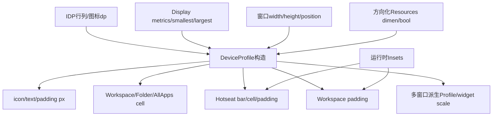
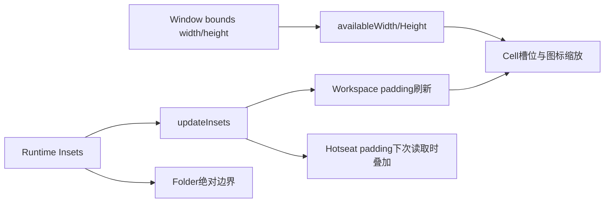
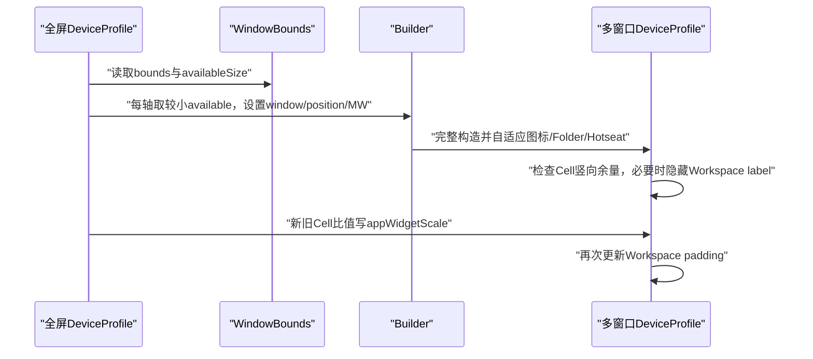

# 第514章 Android DeviceProfile：窗口尺寸、Insets、Workspace Cell、Hotseat、竖栏和多窗口布局计算链

> 源码基线：Android 11 / API 30 / `android-11.0.0_r48`。直接写入正式笔记目录，只读源码、不编译。核心文件：`DeviceProfile.java`、`InvariantDeviceProfile.java`、`DefaultDisplay.java`、`WindowBounds.java`以及Launcher的DeviceProfile切换调用点。

## 1. 本章解决什么问题

IDP给出5×5和图标56dp后，Launcher怎样算出当前窗口里的Cell、Hotseat、Folder和All Apps像素？状态栏/导航栏、横屏侧边Hotseat、超长手机和分屏又如何改变结果？

## 2. 一句话定位

DeviceProfile把IDP的方向无关基准与当前窗口尺寸、可用范围、方向、资源和Insets结合，产出一套可直接给View测量布局使用的像素参数。

## 3. IDP与DP的边界

IDP回答“网格与基准规格是什么”，DeviceProfile回答“这个窗口里具体多少像素、怎么摆”。同一IDP可对应横屏、竖屏、分屏和第二Display的多个DP。

## 4. 尺寸计算总图



## 5. 构造器输入很多但职责清晰

它接收Context、IDP、Display Info、min/max可用尺寸、窗口宽高、方向、多窗口标志、是否横屏转置Hotseat以及窗口坐标。

## 6. widthPx/heightPx是窗口边界尺寸

它们直接来自Builder.setSize，不等于Display realSize，也不保证已扣除系统装饰。

## 7. availableWidth/Height来自size range

横屏取maxSize.x与minSize.y，竖屏取minSize.x与maxSize.y，用方向范围表达扣除系统区域后的可布局尺寸。

## 8. windowX/windowY保留非全屏位置

全屏通常为0,0；分屏/自由窗可记录窗口在Display上的左上角，供跨坐标系逻辑使用。

## 9. isLandscape只由宽高判断

Builder.setSize使用`width > height`；正方形窗口会被当作非landscape，而不是读取Configuration.orientation。

## 10. isMultiWindowMode是显式输入

窗口变小不自动等于多窗口，Builder必须setMultiWindowMode；若调用者漏传，标签隐藏等分支会不同。

## 11. 平板分类来自Display smallestSize

把Info.smallestSize较小边转dp，≥600为tablet，≥720为large tablet；不是按当前窗口宽度分类。

## 12. 分屏不会把平板变手机

因为分类仍看物理Display基线，平板上的窄分屏依然isTablet；空间适配由multi-window Profile另做。

## 13. isPhone表达非tablet

实现为`!isTablet && !isLargeTablet`，后半条件在阈值关系上冗余但语义明确。

## 14. aspectRatio用窗口长边除短边

不依赖方向；≥2.0被视为tall device，主要影响非竖栏Phone的Hotseat高度。

## 15. transposeLayout决定横屏Hotseat形态

它来自`hotseat_transpose_layout_with_orientation`资源，也可由Builder覆盖。

## 16. isVerticalBarLayout有双条件

只有isLandscape且transpose为true，Hotseat才移到侧边；横屏并不天然等于竖栏布局。

## 17. 资源Context会强制一个方向

竖栏布局使用LANDSCAPE配置资源，否则使用PORTRAIT配置资源；因此“横屏但底部Hotseat”仍读取portrait定向dimen。

## 18. density也被校准到Display Info

getContext复制Configuration并写`info.metrics.densityDpi`，避免Context当前density与目标Display不一致。

## 19. edgeMargin是多个区域的基准

Workspace顶部/左右、Folder边界、Drop Target与Hotseat间距都可能使用`dynamic_grid_edge_margin`。

## 20. desired Workspace左右margin在竖栏为0

侧边Hotseat已经占用横向区域；非竖栏才使用edgeMargin作为期望左右边距。

## 21. Tablet portrait放大CellLayout横向内边距

非竖栏且tablet时乘4，以让图标间距更均匀；其他形态乘1。

## 22. 横屏CellLayout padding分配不同

isLandscape时左右padding置0、bottom取cell layout padding；否则左右取倍率结果、bottom为0。

## 23. Page Indicator有高度和重叠量

Workspace底padding使用Hotseat高度+Indicator高度−overlap，避免简单累加造成多余空白。

## 24. Hotseat初始尺寸从IDP icon dp算

竖栏加两侧padding；底栏加extra vertical size、top和bottom padding。

## 25. Tall device先减少一部分底padding来源

它不加`bottom_non_tall_padding`，但仍加通用bottom padding；稍后还可能把多余Cell空间加入Hotseat。

## 26. 竖栏start/end不是固定左右

start指靠导航栏一侧，end指靠Workspace一侧；seascape旋转后物理左右会交换。

## 27. 第一次updateAvailableDimensions从scale 1开始

先按完整图标规格计算所有相关字段，再检查Workspace总高度是否放得下。

## 28. 放不下只按高度缩放

usedHeight=`cellHeightPx*numRows`，maxHeight=`availableHeight-totalWorkspacePadding.y`；超出时用两者比值重算。

## 29. Workspace宽度不会触发同类图标缩放

Cell宽由可用宽度除列数，代码没有用Workspace icon宽度反推scale；产品资源假定列数与横向空间合理。

## 30. updateIconSize牵动整套参数

除Workspace icon/text/padding/cell外，还更新All Apps、Hotseat、Spring Loaded shrink、Folder icon与offset。

## 31. Workspace图标基准按布局选

竖栏用IDP.landscapeIconSize，其他布局用IDP.iconSize；横屏底栏仍用普通iconSize。

## 32. dp与sp使用Display metrics转换

icon用pxFromDp，文字用pxFromSp，因此density和fontScale变化对二者影响不同。

## 33. iconSize至少保留1px

`Math.max(1,...)`保护图标，但文字和drawable padding没有同样下限；异常负scale属于配置假设外情形。

## 34. Cell内容高度是三项相加

iconSize + drawablePadding + text实际高度；text实际高度通过Utilities.calculateTextHeight计算，不直接等于textSizePx。

## 35. Cell实际槽位由getCellSize决定

先扣Workspace padding、CellLayout padding，再分别整除列数/行数；它和内容cellHeightPx不是同一个概念。

## 36. Drawable padding可能被压小

若内容padding大于Cell上下剩余一半，且非竖栏、非多窗口，则缩短内容高度并把padding改成可容纳值。

## 37. 竖栏与多窗口跳过这次压缩

两者后续可能直接隐藏Workspace label，避免在这里仅调padding造成不同策略叠加。

## 38. cellWidthPx不是网格槽宽

它只设为iconSize+drawablePadding，常用于内容与Tablet padding估算；真正槽宽是`getCellSize().x`。

## 39. 关键源码：高度不足时二次计算

```java
updateIconSize(1f, res);
float usedHeight = cellHeightPx * inv.numRows;
int maxHeight = availableHeightPx - getTotalWorkspacePadding().y;
if (usedHeight > maxHeight) {
    updateIconSize(maxHeight / usedHeight, res);
}
```

## 40. getTotalWorkspacePadding有副作用

每次先调用updateWorkspacePadding再返回新Point；它不是只读getter，依赖的Hotseat/Cell字段改变后会顺带刷新Rect。

## 41. All Apps有两种规格模式

若All Apps列数不同于Workspace，使用IDP独立icon/text且不跟随Workspace高度scale；列数相同则复用已缩放Workspace规格。

## 42. 独立All Apps高度用经验公式

icon + textSize + 4×drawablePadding，使用textSize近似而非calculateTextHeight；后续autoResize公式又不同。

## 43. All Apps cellWidth也不是列槽宽

只等于iconSize+padding；Recycler布局还会依据容器宽度和列数分配实际位置。

## 44. 竖栏永远隐藏Workspace文字

updateIconSize计算完All Apps后调用adjustToHideWorkspaceLabels，把Workspace text/padding清0、cellHeight变iconSize。

## 45. 隐藏Workspace文字不等于隐藏All Apps文字

adjust方法会重算All Apps cell，但保留allAppsIconTextSizePx；两套标签策略分离。

## 46. autoResizeAllAppsCells在竖栏加更多上下padding

topBottomPadding先在竖栏乘2，最终公式又乘2；再加公式中单独的一份padding，竖栏总padding贡献为5倍原值，非竖栏为3倍。

## 47. Hotseat cell高度只等于iconSize

它不把Workspace文字或drawable padding计入；Hotseat通常不显示图标label。

## 48. 竖栏Hotseat宽度会随缩放重算

用缩放后的iconSize+side paddings覆盖构造早期以IDP dp算出的bar size。

## 49. 底栏Hotseat不会在updateIconSize重算基础高度

底栏bar size在构造早期计算，后续图标因空间缩小可能变小，但bar仍保留原基准空间。

## 50. Spring Loaded shrink有空间上限

底栏取资源百分比与`1-minRequiredHeight/expectedWorkspaceHeight`的较小值，保证Drop Target和底部空间尽量放得下。

## 51. 竖栏直接使用资源百分比

不做上述垂直空间推导，因为Drop Target与Hotseat布局轴已经不同。

## 52. Folder icon先正规化成圆形视觉尺寸

IconNormalizer.getNormalizedCircleSize基于Workspace iconSize，offsetY让较小Folder icon在原图标框中垂直居中。

## 53. Folder child初始仍用IDP普通iconSize

它不直接复用可能缩小的Workspace iconSize；Folder有自己的宽高容纳检查与scale。

## 54. Folder同时检查宽高

扣Workspace总padding、底部label面板和双边margin后，分别算scaleX/scaleY，取较小值。

## 55. 只有scale小于1才缩Folder

空间富余不会把Folder child放大超过IDP基准。

## 56. Folder drawable padding从剩余高度三分之一得出

并用Math.max(0)保护；这不是XML中Workspace drawable padding的简单复制。

## 57. Tall Phone还有第二次available计算

首次完成后，以槽高减图标、两倍padding和Indicator得到extraSpace，加入Hotseat size与bottom padding，再重算图标与Folder。

## 58. 注释说增加但代码没clamp 0

合法tall配置通常产生正余量；若得到负值，r48仍会缩小Hotseat/bottom padding，源码没有`Math.max(0,extraSpace)`。

## 59. Tablet不走Tall Phone调优

条件同时要求非竖栏、isPhone和tall；Tablet由自己的Workspace padding公式分配富余空间。

## 60. 最后才计算Workspace padding与DotRenderer

Dot大小依最终iconSize；All Apps icon相同时复用Workspace DotRenderer，否则单独创建。

## 61. Dot shape来自全局IconShape

IDP mask变化会重建/通知，新的DeviceProfile用当前shape path；旧Renderer不会自行读取新path。

## 62. Phone底栏Workspace padding较直观

左右为desired margin、顶部edgeMargin、底部为Hotseat+Indicator−overlap。

## 63. 竖栏padding为Hotseat让位

顶部0、底部edgeMargin；正常landscape右侧留hotseatBarSize，seascape则左侧留出。

## 64. 竖栏另一侧仍留start padding

非Hotseat侧不是永远0，使用hotseatBarSidePaddingStartPx保持导航/Indicator相关间距。

## 65. Tablet横向padding有14%封顶

MAX_HORIZONTAL_PADDING_PERCENT=0.14表示左右总预算最多屏宽14%，最终各取一半。

## 66. Tablet公式使用widthPx/heightPx

而非availableWidth/Height；系统Insets如何进入最终布局还要结合RootView分发与CellLayout测量，不能只看该Rect。

## 67. Tablet纵向富余再上下平分

先扣edge、底栏、两倍rows×cellHeight及Hotseat padding，剩余非负空间一半加到top、一半加到bottom。

## 68. Tablet横向估算公式值得原样核对

它从width减`columns*cellWidth + (columns-1)*cellWidth`，即近似按图标内容与间隔同宽估算，不是简单`width-columns*cellWidth`。

## 69. Insets在构造时初始为0

真正窗口Insets稍后通过updateInsets写入，并立即更新Workspace padding。



## 70. updateInsets不重算available尺寸或图标scale

它只保存Rect并更新padding；设计假设availableWidth/Height已经表达系统装饰后的空间，Insets更多用于实际边缘定位。

## 71. getInsets返回内部可变Rect

调用者若直接修改它不会触发updateWorkspacePadding；规范用法应调用updateInsets而非篡改返回对象。

## 72. 非竖栏Hotseat padding显式叠加Insets

左右加入对应Inset，底部加入nav inset与CellLayout bottom padding，顶部使用Hotseat top padding。

## 73. Hotseat横向Adjustment对齐Workspace槽

比较`width/Workspace列数`与`width/Hotseat数`的半差，再叠加Workspace padding和CellLayout padding。

## 74. Hotseat adjustment可以为负

Hotseat cell若比Workspace cell更宽，差的一半为负；后续边距仍可能因Workspace/Insets保持非负，但代码不单独clamp。

## 75. 竖栏Hotseat padding按seascape翻转

导航栏侧叠加start padding与对应Inset，Workspace侧使用end padding。

## 76. mHotseatPadding是复用对象

每次getHotseatLayoutPadding都会改同一Rect并返回；持有者不能假定后续调用不会改变它。

## 77. updateIsSeascape只在竖栏生效

rotation==270时为true，改变才返回true；普通portrait/底栏landscape不会更新该字段。

## 78. seascape变化不会在方法内刷新padding

它只改boolean并返回changed，调用者需据返回值触发布局/Insets重投影。

## 79. Folder绝对边界使用Inset坐标

返回Rect在窗口绝对坐标中限制Folder：竖栏避开侧边Hotseat，底栏避开顶部Drop Target与底部Hotseat/Indicator。

## 80. getAbsoluteOpenFolderBounds不是Folder实际尺寸

它只是允许容纳的边界；Folder自身根据内容、Cell尺寸和动画选择最终矩形。

## 81. calculateCellWidth/Height是整数除法

余数不会在这里分摊，CellLayout可能在后续布局中处理剩余像素或留在边缘。

## 82. shouldFadeAdjacentWorkspaceScreens是形态政策

竖栏或large tablet返回true，LauncherState据此在NORMAL/HINT只让中心页alpha为1。

## 83. getCellHeight按容器返回内容高度

Workspace、Folder、Hotseat分别返回不同字段；未知Container返回0而不是抛异常。

## 84. toBuilder使用当前available作为固定range

minSize=maxSize=(availableWidth,availableHeight)，保留窗口宽高、位置和multi-window标志。

## 85. copy是重新计算而非字段克隆

它通过Builder重新跑构造器，所以资源、IconShape和IDP当前字段可能让副本与原对象不同。

## 86. 多窗口先取更小available尺寸

每轴使用原Profile available与WindowBounds.availableSize的min，确保系统decor不会因某一来源更大而被重新纳入。

## 87. 多窗口窗口尺寸取bounds宽高

available用于Cell空间，width/height与position来自窗口bounds，继续保留两套尺寸语义。

## 88. 多窗口Profile完整重跑构造

包括资源选择、图标缩放、Folder、Hotseat、Workspace padding和DotRenderer，不是只改两个宽高字段。

## 89. 多窗口可能隐藏Workspace label

计算槽内竖向余量；若小于`profile.iconDrawablePadding*2`，调用adjustToHideWorkspaceLabels。

## 90. 这里混用了原Profile padding

余量表达式中的`iconDrawablePaddingPx`未加`profile.`，取调用对象的原值；比较右侧才用新Profile padding，属于r48值得注意的跨Profile字段混用。

## 91. 隐藏标签后还要重算Widget scale

先完成profile Cell最终尺寸，再用新Cell/原全屏Cell分别计算X/Y比例。

## 92. Widget按全屏Cell测量再缩放绘制

appWidgetScale让Widget保持invariant span测量语义，同时在多窗口Cellspan里居中缩放。

## 93. X/Y scale可不同

窗口宽高压缩比例不一致时Widget非等比缩放；PointF分别保存两轴。

## 94. 多窗口处理时序



## 95. getFullScreenProfile回到IDP标准对象

按当前isLandscape返回inv.landscapeProfile或portraitProfile，不是把多窗口对象反向放大计算。

## 96. 多窗口DP与全屏DP共享IDP引用

网格切换时旧DP的inv字段会原地变化，但其已计算像素字段不会自动同步；Activity需接IDP通知替换DP。

## 97. DeviceProfile大多字段final但并非不可变

Insets、Workspace padding、Hotseat padding、seascape、图标/Cell字段和appWidgetScale仍可修改。

## 98. adjustToHideWorkspaceLabels会原地改多字段

textSize、drawablePadding、cellHeight及All Apps cell均变化；调用后旧测量缓存需要重新布局。

## 99. updateInsets只是一类增量更新

方向、窗口bounds、IDP、density等变化通常应建立新DeviceProfile，不应试图只靠updateInsets修补。

## 100. DeviceProfile切换由Activity分发

Launcher收到IDP/Configuration变化后initDeviceProfile、dispatchDeviceProfileChanged、reapplyUi并重建TouchControllers。

## 101. OnDeviceProfileChangeListener用于一次性操作

接口注释说普通layout/measure听Insets已足够；需重建列数、插件或控制器等一次性动作才监听DP替换。

## 102. Insets与DP替换是不同信号

前者修改现有对象边缘数据，后者更换整套像素规格；消费者只监听一种可能漏掉另一种变化。

## 103. 竖栏布局影响状态动画目标

LauncherState的visible elements、Workspace scale和Hotseat translation都会查询isVerticalBarLayout，因此DP不仅服务静态布局。

## 104. All Apps控制器也依赖DP

DeviceProfile变化会重设vertical layout、shift range和Hotseat/PageIndicator translation，状态动画与测量需共同收敛。

## 105. 诊断图标重叠先分内容与槽位

记录iconSize/cellHeight内容尺寸，以及getCellSize槽尺寸、Workspace padding和CellLayout padding；只看一个cellWidth字段很容易误判。

## 106. 诊断底部间距先分四项

Hotseat bar、Hotseat bottom padding、Page Indicator及overlap、navigation inset分别检查，避免重复扣除或漏加。

## 107. 诊断横屏左右颠倒

检查transpose flag、rotation 270、mIsSeascape更新返回值、Insets左右和Hotseat layout padding，而不只看Configuration orientation。

## 108. 诊断分屏Widget模糊/拉伸

记录原/新Cell尺寸、appWidgetScale X/Y、WindowBounds available/bounds与RemoteViews测量，确认是预期缩放还是重复缩放。

## 109. 推荐日志快照

输出window坐标/尺寸、available尺寸、Insets、方向/MW/tablet/tall/vertical/seascape、各padding、Cell slot/content、Hotseat、Folder和Widget scale。

## 110. 推荐对照矩阵

覆盖手机短屏/长屏、Tablet/large Tablet、portrait、landscape底栏、landscape竖栏、rotation90/270、手势/三键导航、分屏窄窗和第二Display。

## 111. 完成点仍需分层

新DP构造完成只证明参数可用；dispatch完成、View requestLayout、measure/layout/draw和Surface呈现仍是后续不同阶段。

## 112. macOS只读练习一：手算Workspace Cell

任选一套IDP和假设窗口/available尺寸，依次计算Hotseat初值、Workspace padding、槽宽高、内容高度与高度scale；分别列出整除余数和padding来源。

## 113. macOS只读练习二：对比三种横屏

对比transpose=false的横屏底栏、rotation90竖栏、rotation270 seascape竖栏，画出Workspace/Hotseat位置并手算左右padding与Insets叠加。

## 114. macOS只读练习三：推演多窗口

从全屏DP与一个WindowBounds开始，算mwSize、新Profile Cell、标签隐藏条件和Widget scale X/Y；指出代码中原/新iconDrawablePadding混用位置。

## 115. macOS只读练习四：建立字段字典

把width/height、available、Insets、workspacePadding、cellWidthPx、getCellSize、hotseatBarSize和appWidgetScale逐项写出生产者、消费者及是否可变。

## 116. 易错点一：available尺寸不等于window尺寸

前者用于可布局空间，后者表达窗口边界与aspect；分屏和系统装饰下二者尤其不能互换。

## 117. 易错点二：cellWidthPx不等于网格槽宽

它是图标内容估算；真正每格空间由getCellSize扣除多层padding后整除行列数。

## 118. 易错点三：Insets更新不重算所有尺寸

updateInsets只刷新padding，图标scale和available尺寸依赖新建DP或调用者提前提供正确size range。

## 119. 易错点四：多窗口不是全屏DP等比缩小

它完整重跑布局、可隐藏Workspace标签，并给Widget独立X/Y scale。

## 120. 本章总结与下一章

DeviceProfile是一套从窗口事实到可布局像素的派生模型：先选形态与资源，再算内容、槽位、Hotseat/Folder，最后叠加Insets和多窗口修正。下一章进入Workspace与CellLayout，追页面创建、屏幕ID映射、View放置、占位和测量布局。
