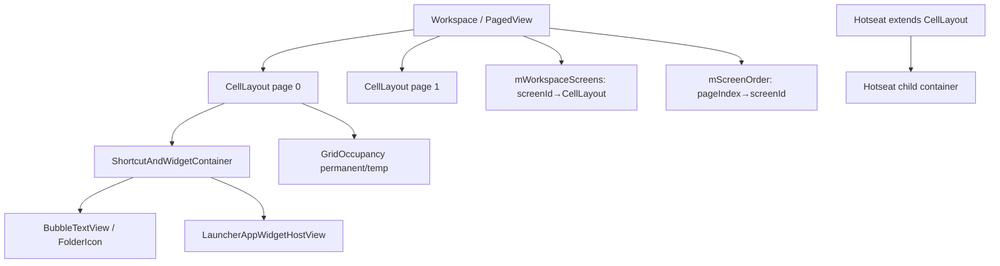
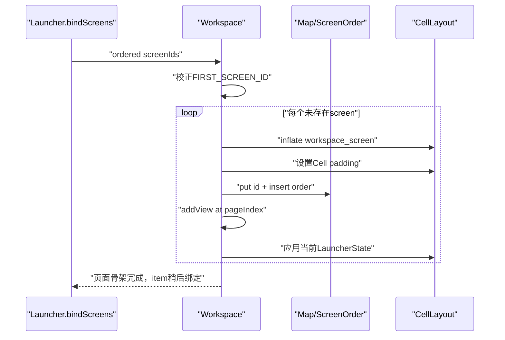
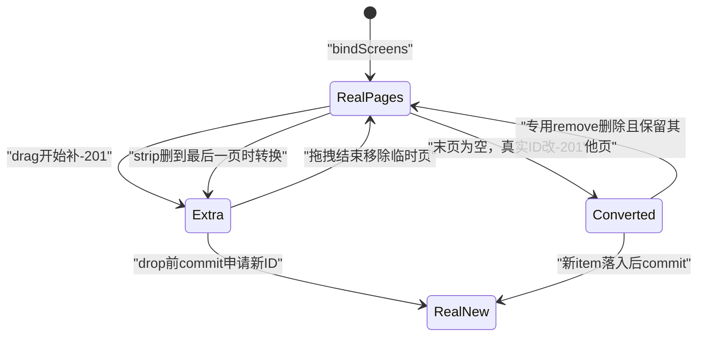

# 第515章 Android Workspace与CellLayout：页面、screenId映射、View放置、占位和测量布局链

> 源码基线：Android 11 / API 30 / `android-11.0.0_r48`。直接写入正式笔记目录，只读源码、不编译。核心文件：`Workspace.java`、`WorkspaceLayoutManager.java`、`CellLayout.java`、`ShortcutAndWidgetContainer.java`、`Hotseat.java`和`ItemInfo.java`。

## 1. 本章解决什么问题

数据库中的screenId怎样变成左右页面？ItemInfo的cellX/cellY/span怎样变为View像素？为何同一个图标同时存在ItemInfo、LayoutParams和occupancy三份位置账？空白拖拽页又怎样转成真实页面？

## 2. 一句话定位

Workspace管理“多页及其顺序”，每个CellLayout管理“一页网格及占位”，ShortcutAndWidgetContainer管理“页内View测量布局”；ItemInfo负责持久化语义，三层不能互相替代。

## 3. 先分五种坐标

screenId是持久页面身份，pageIndex是Workspace子View位置，cellX/cellY是网格坐标，LayoutParams.x/y是页内像素，View在屏幕上的位置还要叠加页面滚动与窗口坐标。

## 4. 对象层级图



## 5. Workspace本质是PagedView

它的直接child只能是CellLayout；`onViewAdded`遇到其他类型立即抛IllegalArgumentException。

## 6. CellLayout不是图标的直接父View

它内部只有ShortcutAndWidgetContainer，图标、FolderIcon与Widget都加入这个容器。

## 7. 两层ViewGroup各司其职

CellLayout负责网格、占位、拖拽重排和背景；内层Container负责逐child测量、padding、像素layout和Widget缩放。

## 8. 页面有三份同步结构

Workspace child顺序供PagedView滑动，mScreenOrder保存pageIndex到screenId，mWorkspaceScreens保存screenId到CellLayout。

## 9. mWorkspaceScreens不是页面顺序表

它是IntSparseArrayMap，key索引顺序可能按数值排序；持久/视觉顺序必须看mScreenOrder或child index。

## 10. screenId不是pageIndex

screenId可为0、Provider生成的任意正ID或临时-201；页面删除/插入后pageIndex会变而screenId可保持。

## 11. FIRST_SCREEN_ID固定为0

启用QSB_ON_FIRST_SCREEN时它承载不可重排QSB，并被强制放在orderedScreenIds开头。

## 12. EXTRA_EMPTY_SCREEN_ID固定为-201

它只代表拖拽期间最右侧临时空页，不能写进ItemInfo数据库。

## 13. ItemInfo有双重防线

WorkspaceLayoutManager拒绝往-201添加child，ItemInfo.onAddToDatabase也在screenId为-201时抛异常。

## 14. QSB第一屏是条件能力

`bindAndInitFirstWorkspaceScreen()`在FeatureFlag关闭时直接return，所以“第一屏始终存在”的注释要结合开关阅读。

## 15. 第一屏QSB占第一行

LayoutParams为(0,0,countX,1)，canReorder=false，并通过addViewToCellLayout标记整行占用。

## 16. QSB View可以跨重绑复用

removeAllWorkspaceScreens先从旧父View移除QSB，清页后再把同一对象加入新第一屏，避免重复inflate。

## 17. 全量清屏先关闭LayoutTransition

否则页面消失动画与重新设置scroll/添加页面竞争，可能出现错位或闪烁。

## 18. 清屏还移除Folder listeners

随后removeAllViews、清mScreenOrder和Map、取消DeferredWidgetRefresh，最后重建条件第一屏。

## 19. AppWidgetHost View库存由Launcher另清

Launcher.startBinding同时调用Workspace清页与AppWidgetHost.clearViews；Workspace本身不拥有Host的跨页面账。

## 20. bindScreens会原地调整输入IntArray

若QSB启用且0不在首位，先removeValue再add(0,0)；这是共享可变数组边界，第509章已提醒多Callbacks需注意。

## 21. 无QSB且没有screen时创建临时空页

此时不虚构持久screenId，而是addExtraEmptyScreen，待真正放入item时再commit。

## 22. bindAddScreens跳过已建第一屏

QSB开启时screenId 0已经由removeAllWorkspaceScreens阶段建立，其他ID依序插到extra empty之前。

## 23. 插页必须同时更新三份结构

inflate CellLayout、设Cell padding、Map put、mScreenOrder insert、Workspace addView，最后应用当前LauncherState页alpha。

## 24. 重复screenId直接崩溃

insertNewWorkspaceScreen先containsKey检查并抛RuntimeException，避免Map覆盖但child/order留下重复页。

## 25. insertIndex由调用者负责有效

常规绑定取mScreenOrder中extra位置或末尾；底层没有自行修正越界index。

## 26. 新页立即继承当前State

StateTransitionAnimation.applyChildState按插入index设置背景与page alpha，避免在ALL_APPS/OVERVIEW中突然显示新Workspace页。

## 27. setInsets会遍历所有Map values

它给每页更新CellLayout padding；这里顺序不重要，所以使用Map遍历不会破坏页面语义。

## 28. pageSpacing取决于相邻页是否淡出

竖栏/large tablet用edgeMargin；普通portrait取左右Inset与Workspace padding较大者，防止邻页露出。

## 29. 页面映射API各有方向

getScreenWithId查Map，getIdForScreen反查value，getPageIndexForScreenId查child index，getScreenIdForPageIndex查mScreenOrder。

## 30. 反查CellLayout是线性搜索

`indexOfValue(layout)`遍历Map；它不依据Workspace child index自动推导。

## 31. getScreenOrder返回内部可变对象

没有copy；调用者若随意修改会让Map、child与order失配，合同依赖内部受控使用。

## 32. 页面创建时序



## 33. 页面骨架完成不代表Item已加入

LoaderResults先bindScreens，再分批bindItems；页面可以存在但容器仍为空。

## 34. Workspace loading期间禁止删空页

此时空可能只是item尚未绑定，strip会造成screen丢失并让后续item找不到目标页。

## 35. 临时空页为拖拽兜底

开始普通拖拽会在末尾补EXTRA页，确保总有可放置空间。

## 36. 特定无障碍拖拽不补页

非Workspace来源的accessible drag不支持任意跨源拖放，使用直接“添加到主屏”动作。

## 37. 最后一项来自最终页时不补页

拖走后该最终页自身会变空，可继续承担落点，避免多出另一个空页。

## 38. 外部Widget拖拽会寻找可重排页

从当前页向右调用hasReorderSolution；最远临时空页保证理论上至少找到一个。

## 39. hasExtraEmptyScreen有双条件

不仅Map含-201，还要求Workspace childCount>1；仅剩一个临时空页时返回false，以保留至少一页的语义。

## 40. convertFinalScreen会复用View身份

末页无child且无drop pending时，只把Map/order key从真实ID改成-201，不remove/reinflate CellLayout。

## 41. 转换不会删除数据库screen行

Launcher favorites没有独立screens表；screen顺序由item集合推导，空真实ID可被内存临时身份取代。

## 42. removeExtra可延迟执行

delay>0时post再次调用；在等待期间Workspace状态可能变化，实际执行会重新检查loading并转换末页。

## 43. loading时onComplete也不会执行

方法开头直接return；调用者不能把onComplete当“无论如何”回调。

## 44. commit把-201变成Provider新ID

先从Map/order移除临时ID，Binder/Provider call申请新screen ID，再用新ID放回并返回。

## 45. commit不移动CellLayout child

临时页通常已在末尾，方法只改身份账；View仍是同一个对象、同一个child位置。

## 46. commit没有显式空页前置检查

它假定Map里存在-201；若违规调用，取出的CellLayout可能为null并污染Map，调用方必须满足合同。

## 47. commit不是数据库事务提交

名字表示提交临时screen身份；真正拖入Item的favorites写入由ModelWriter另行异步完成。

## 48. stripEmptyScreens先处理滚动过渡

若page transition进行中，只置mStripScreensOnPageStopMoving，等停止后再删，防止滑动中的child index突变。

## 49. 空页判断只看childCount

`getShortcutsAndWidgets().getChildCount()==0`；dropPending仅在convertFinalScreen路径检查，strip主循环没有同样判断。

## 50. FIRST页保护受QSB flag控制

QSB开启时仅id>0的空页候选删除，因此0和负的EXTRA不会由此分支删除；EXTRA通常由专用remove流程处理。

## 51. 至少保留一个页面

若删除到最后一个，就不remove View，而是把该CellLayout重新登记为EXTRA_EMPTY_SCREEN_ID。

## 52. 删除当前页之前的页面要修page index

pageShift累计被删且位于currentPage左侧的页，最后setCurrentPage(currentPage-pageShift)。

## 53. `pageShift >= 0`恒成立

变量从0只递增，末尾if判断没有实际过滤效果，是r48冗余条件。

## 54. LayoutTransition只动画删页

启用DISAPPEARING与CHANGE_DISAPPEARING，禁用APPEARING；fade在前半，页面平移在后半，避免空邻页覆盖。

## 55. screenId与临时页状态图



## 56. addInScreenFromBind修正Hotseat坐标

Hotseat ItemInfo.screenId存的是rank/order，绑定时用getCellX/YFromOrder换成当前方向的网格坐标。

## 57. 竖Hotseat rank方向从底向上

x恒0，y=`countY-(rank+1)`；底栏则x=rank、y=0。

## 58. ItemInfo的Hotseat cellX/Y不是绑定权威

绑定使用screenId rank重算；旋转后无需改数据库rank即可换横/竖坐标。

## 59. Desktop目标screen不存在会跳过View

记录错误、打印Throwable栈并return，不删除数据库Item，也不自动创建页面。

## 60. EXTRA screen检查覆盖所有container

screenId等于-201就抛RuntimeException，即使container是Hotseat；合法Hotseat rank不应碰到该保留值。

## 61. Folder标题随容器变化

Hotseat中隐藏，Workspace页中显示；同一个FolderIcon重新parent时会更新显示策略。

## 62. LayoutParams可能复用

child已有CellLayout.LayoutParams就原地覆盖cellX/Y/span，否则新建。

## 63. 双span都负才解锁Grid

条件是`spanX < 0 && spanY < 0`；只有一轴负不会设置isLockedToGrid=false。

## 64. 负span还会被CellLayout扩成整轴

addViewToCellLayout把cellHSpan<0改为countX、cellVSpan<0改为countY；QSB使用正的完整span，不走此快捷方式。

## 65. child Tag必须是ItemInfo

addInScreen强转tag并调用getViewId；缺tag或类型不符会异常，不是可选元数据。

## 66. View ID直接来自ItemInfo ID

注释假定动态ID小于0x00FFFFFF且与aapt高字节ID隔离；实现返回id，没有运行时冲突扫描。

## 67. Folder对象本身不占Workspace格

markCellsAsOccupied为`!(child instanceof Folder)`；可见的FolderIcon会占格，展开的Folder容器不应污染页面occupancy。

## 68. add失败不回滚模型

只Log“Failed to add”，TODO也承认越界View是否应从LauncherModel删除尚未处理。

## 69. add成功后统一交互接线

关闭系统haptic、设置Workspace长按监听；实现DropTarget的child还注册给DragController。

## 70. CellLayout构造从当前DP定网格

countX/countY取IDP Workspace行列，并创建同尺寸mOccupied与mTmpOccupied。

## 71. Hotseat reset会改Grid尺寸

竖栏设1×numHotseat，底栏设numHotseat×1，并先removeAllViewsInLayout清旧child/occupancy。

## 72. mOccupied是永久账

表示当前正式布局占位；findCellForSpan、isRegionVacant与常规添加使用它。

## 73. mTmpOccupied是重排试算账

拖拽reorder先从永久账copy，尝试push/临时位置，确认后才提交，避免每次hover立即破坏正式占位。

## 74. addView只校验左上角

要求cellX/cellY落在网格内；并未在这里校验`cellX+spanX`完整越界，也不检查与已有mOccupied冲突。

```java
if (lp.cellX >= 0 && lp.cellX <= mCountX - 1
        && lp.cellY >= 0 && lp.cellY <= mCountY - 1) {
    mShortcutsAndWidgets.addView(child, index, lp);
    if (markCells) markCellsAsOccupiedForView(child);
    return true;
}
```

## 75. 越界span的占位会被截断

GridOccupancy.markCells循环以countX/countY为上限，View LayoutParams却保留完整span，可能出现View尺寸超界而occupancy只标网格内部分。

## 76. 重叠添加也会成功

markCells只是把对应boolean置true，看不出原先已true；所以Loader清洗与放置验证是防止叠图的重要上游。

## 77. remove操作必须经过CellLayout

各remove重载先mark unoccupied再从内层Container移除；直接操作ShortcutAndWidgetContainer会留下幽灵占位。

## 78. Workspace删除Item特别提醒这一点

源码注释明确不能直接从CellLayoutChildren移除，否则不会重新标空。

## 79. mark occupied要求正确parent

View为空或parent不是本Cell的ShortcutAndWidgetContainer就return，防止跨页对象误改occupancy。

## 80. mark unoccupied同样依赖当前parent

若先remove/reparent再调用，旧页不会清格；顺序是数据一致性的组成部分。

## 81. findVacantCell按行优先扫描

外层y、内层x，从顶部开始找第一个能容纳完整span且全false的矩形，不按视觉距离优化。

## 82. findNearestArea是另一类算法

拖拽根据像素触点与欧氏距离找附近候选，不能用findCellForSpan的“第一个空位”解释拖拽落点。

## 83. isOccupied只检查上界不检查负数

`x<countX && y<countY`对负数也为true，随后数组访问会抛ArrayIndexOutOfBounds，而非方法自定义RuntimeException。

## 84. pointToCellExact会夹紧结果

像素转整数格后clamp到0..count-1；边缘外触点仍映射到最近边界Cell。

## 85. cellToRect只做线性换算

padding + cell×cellSize，不检查occupancy或span合法性。

## 86. CellLayout measure拒绝UNSPECIFIED

除非设置了fixed width/height，否则任一MeasureSpec为UNSPECIFIED就抛RuntimeException。

## 87. Cell尺寸按可用子区域整除

先扣CellLayout padding，再用DeviceProfile.calculateCellWidth/Height除count，结果写给内层Container。

## 88. 整除余数在layout时居中

getUnusedHorizontalSpace计算剩余几像素，左右各ceil一半收缩Container；奇数余数可能产生一像素非对称。

## 89. fixed size改变内层测量结果

有mFixedWidth/Height时Container精确测该尺寸，CellLayout自身也以Container尺寸作为measured dimension。

## 90. CellLayout背景边界包含Drawable内padding

layout时把背景bounds向外扩，和图标Container的实际left/top/right/bottom不是完全相同矩形。

## 91. Container总是精确吃满给定区域

onMeasure直接使用spec size作为自身尺寸，再逐一精确测量非GONE child。

## 92. LayoutParams.setup把格坐标变像素

选择正式或tmpCell，按RTL可反转X，再计算width/height/x/y并扣Margins。

## 93. RTL反转以完整span为单位

`colCount-cellX-cellHSpan`，多格Widget会整体镜像，不只是反转左上角。

## 94. 临时坐标由useTmpCoords开关

重排预览写tmpCellX/Y而不必立即改ItemInfo；正式落点才更新cellX/Y。

## 95. 非Grid锁定View保留自由像素参数

setup只在isLockedToGrid时计算；这类特殊View由其他代码维护x/y/width/height。

## 96. Widget多窗口按scale反推测量尺寸

LayoutParams width=`span*cellWidth/cellScaleX`，让Widget以接近全屏尺寸测量，稍后再缩放到当前Cellspan。

## 97. 普通图标内容在Cell中垂直居中

paddingY取`(lp.height-contentHeight)/2`非负值；Workspace横padding用workspaceCellPaddingX，Folder/Hotseat用edgeMargin一半。

## 98. child MeasureSpec固定为EXACTLY

View不能在此按intrinsic size自行缩小；内容内部再利用padding、drawable bounds等布局。

## 99. Widget layout时取较小轴scale

`setScaleToFit(min(scaleX,scaleY))`保持等比外观，同时translationForCentering分别按X/Y缺口居中。

## 100. 非等轴Widget scale有两层语义

测量尺寸按各轴除scale，绘制却取较小统一scale；居中translation补偿两轴区域差异。

## 101. dropped标记触发壁纸命令

child首次layout后清flag，计算Container屏幕坐标与child中心，向WallpaperManager发送COMMAND_DROP。

## 102. 壁纸命令不证明屏幕已呈现

它发生在layout回调，不是draw或Surface提交fence。

## 103. alpha为0时Container拦截触摸

ACTION_DOWN且自身alpha==0就return true，避免不可见Workspace页child响应。

## 104. Workspace modal状态还控制焦点与触摸

非NORMAL阻断descendant focus；非当前页在非modal时也会消费触摸，防止邻页图标误操作。

## 105. mapOverItems包含Hotseat

它构造Workspace所有page再追加Hotseat的CellLayout数组，逐child读取tag执行Operator。

## 106. map顺序是页面child顺序再Hotseat

不是mWorkspaceScreens key顺序；Operator返回true会立即停止整个遍历。

## 107. null layout被容忍

源码TODO称可能存在尚未加载的竞态，mapOverCellLayout遇null返回false并继续，而不是等待页面完成。

## 108. Folder内部Item不在普通页Container

部分更新先map Workspace/Hotseat，再显式找到open Folder并iterate；只扫Workspace child会漏Folder contents。

## 109. 推荐诊断六份账

记录ItemInfo container/screen/cell/span、mScreenOrder、Map key→View、Workspace child index、LayoutParams正式/tmp像素和两份occupancy。

## 110. 诊断“图标不见了”

先看目标screen是否创建、addInScreen是否跳过/失败、child是否在内层Container、alpha/state，再看page scroll与draw；数据库存在不等于View已加入。

## 111. 推荐场景矩阵

覆盖冷绑定多页、QSB开关、空Workspace、拖拽补页/取消/commit、删到最后一页、Hotseat横竖旋转、RTL、多格Widget、越界/重叠坏数据和分屏Widget。

## 112. macOS只读练习一：建立页面三账

假设screenId顺序为[0,42,7]，插入临时-201、删除42并commit临时页为100。逐步写Workspace child、mScreenOrder和Map，说明为何Map遍历不能代表页面顺序。

## 113. macOS只读练习二：手算View像素

给定4×5网格、CellLayout padding与尺寸、RTL开关、Item的cell/span/margin，沿measure、LayoutParams.setup和Container.layoutChild算出最终x/y/width/height。

## 114. macOS只读练习三：推演占位不一致

分别模拟完整span越界、两个View重叠、先从Container remove再mark unoccupied，记录View树与mOccupied差异，并指出上游Loader/GridOccupancy应在哪里阻止。

## 115. macOS只读练习四：对比Widget多窗口

给定appWidgetScale X/Y不相等，计算LayoutParams测量宽高、setScaleToFit值和centering translation，说明测量区域与最终视觉区域为何不同。

## 116. 易错点一：screenId不是页面下标

页面插删会改变index，持久Item仍靠screenId定位；临时-201更不能落库。

## 117. 易错点二：Map不是顺序权威

Map服务身份查找，mScreenOrder与child顺序服务视觉分页，三份结构必须同步更新。

## 118. 易错点三：View加入成功不等于数据合法

add只校验左上角，越界span和重叠可能进入View树；occupancy也不会记录重叠计数。

## 119. 易错点四：CellLayout不是Item直接父容器

直接操作ShortcutAndWidgetContainer虽能改变View树，却可能绕过CellLayout的occupancy与DropTarget清理。

## 120. 本章总结与下一章

Workspace用页面身份/顺序双索引组织CellLayout，CellLayout用永久/临时occupancy管理格子，Container再把LayoutParams投影为像素。下一章进入Workspace拖拽与CellLayout重排，分析目标格搜索、Folder判定、临时挪位、落库和失败回退。
