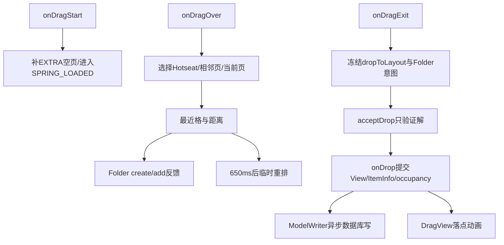
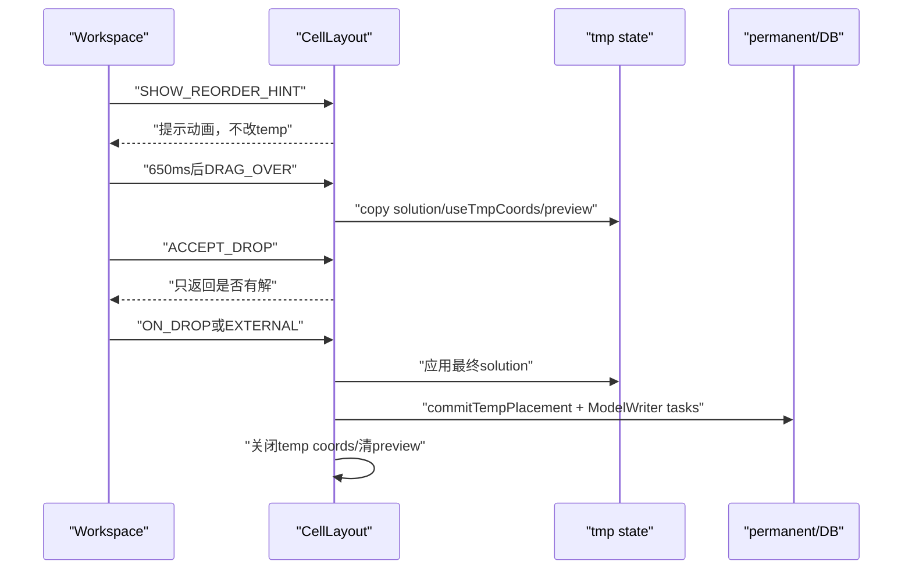
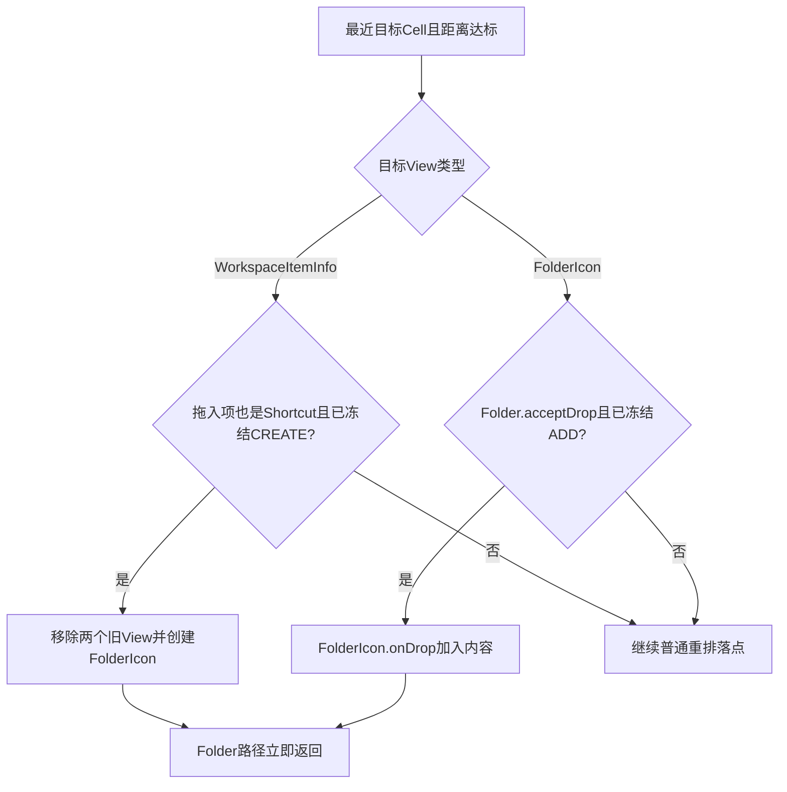

# 第516章 Android Workspace拖拽：目标页/格搜索、Folder判定、临时重排、落库和失败回退链

> 源码基线：Android 11 / API 30 / `android-11.0.0_r48`。直接写入正式笔记目录，只读源码、不编译。核心文件：`Workspace.java`、`CellLayout.java`、`DragController.java`、`FolderIcon.java`和`ModelWriter.java`。

## 1. 本章解决什么问题

手指拖着图标经过Hotseat和相邻页时，谁选择目标页和格子？何时提示新建Folder，何时挪开邻居？松手后View、ItemInfo、occupancy和数据库按什么顺序改变？没有空位或取消又怎样恢复？

## 2. 一句话定位

Workspace负责跨页面、Folder政策与最终业务落点，CellLayout负责单页候选/重排解，DragLayer负责视觉动画，ModelWriter负责异步持久化；一次drop会依次跨过这四层。

## 3. 先分内部与外部拖拽

内部dragSource是Workspace且mDragInfo非null，已有真实View与原位置；All Apps、Widget tray等外部拖拽通常只有ItemInfo/预览，成功后才创建或配置最终View。

## 4. 总链路图



## 5. 拖拽开始先释放原占位

内部拖拽若mDragInfo.cell存在，原CellLayout.markCellsAsUnoccupiedForView，允许算法把原格视为空位。

## 6. View此时通常仍在原parent

释放occupancy不等于remove View；命中检测会通过dragView参数忽略正在拖的child。

## 7. 开始时补临时空页

除特定无障碍跨源拖拽外，Workspace确保末尾有EXTRA_EMPTY_SCREEN，以提供兜底空间。

## 8. 外部Widget会预找可重排页面

从当前页向右调用hasReorderSolution；Widget不能进Folder，空临时页保证理论上能容纳合规span。

## 9. 所有正常拖拽进入SPRING_LOADED

Workspace缩小显示更多页面；但State转换未达到门槛时暂不允许drop。

## 10. drop门包含状态进度

必须不是切换中，或mTransitionProgress>0.25，同时当前LauncherState允许Workspace图标拖动。

## 11. 0.25不是动画完成

它只是允许drop的阈值；`isFinishedSwitchingState`另用0.5判断是否足以允许重排等行为。

## 12. DragObject.visualCenter比原始触点更重要

目标格按DragView视觉中心计算，d.x/d.y还用于Hotseat和相邻页命中辅助。

## 13. 坐标必须映射到目标CellLayout

Workspace页只减child left/top；Hotseat则经DragLayer在不同后代坐标系间转换。

## 14. Hotseat优先级最高

非Widget且点落在Hotseat矩形时选Hotseat；Widget被明确排除，因为Hotseat不接受Widget。

## 15. 相邻页只在分页未过渡时检查

先按RTL方向检查左邻，再检查右邻，最后才回当前nextPage。

## 16. verifyInsidePage会修改临时坐标数组

调用者每次重新设置mTempTouchCoordinates；不能把一次转换后的值直接复用于另一页。

## 17. 换目标页会回退旧临时重排

setCurrentDropLayout先对旧CellLayout调用revertTempState和onDragExit，再进入新页。

## 18. 换页还清四类反馈

取消reorder alarm、Folder create背景、Folder add hover和旧targetCell，避免上一页状态泄漏。

## 19. Hotseat取消SpringLoaded翻页Alarm

进入普通Workspace页则把目标页交给SpringLoadedDragController，停留后可自动切页。

## 20. onDragOver先校验Item span

任一span<0直接抛RuntimeException；生产非Studio若dragInfo为null则安静return。

## 21. minSpan只在两轴都有效时采用

只有minSpanX>0且minSpanY>0才覆盖原span，避免单轴半有效配置。

## 22. 最近格第一步忽略占位

findNearestArea先按视觉中心找到几何上最近的目标，用于Folder命中和决定重排方向。

## 23. 距离门决定Folder反馈

Phone阈值约0.55×iconSize，Tablet约0.75×iconSize；超过就退出create/add Folder模式。

## 24. 这不是View边界命中

距离是视觉中心到Cell中心的欧氏距离，图标实际drawable大小与透明区域不直接参与。

## 25. Folder创建要求目标是普通Shortcut

dropOverView tag必须是WorkspaceItemInfo，且不能是Hotseat prediction容器；拖入项类型须为应用、Shortcut或Deep Shortcut。

## 26. 不能把图标拖到自己上建Folder

内部拖拽若dropOverView就是mDragInfo.cell，willCreate返回false。

## 27. 临时被挪动的目标也不能建Folder

若目标LayoutParams.useTmpCoords且tmp位置不同于正式位置，Folder create/add均拒绝，避免对视觉与正式账不一致的View操作。

## 28. 创建Folder反馈不等于允许松手

onDragOver把mDragMode设CREATE_FOLDER并播放PreviewBackground；onDragExit才把它冻结为mCreateUserFolderOnDrop。

## 29. 加入Folder由FolderIcon自己验容量/类型

willAdd只在目标为FolderIcon且`fi.acceptDrop(dragInfo)`为true时成立。

## 30. Folder hover调用onDragEnter/Exit

Workspace保存mDragOverFolderIcon；离开或模式切换时cleanupAddToFolder负责退出视觉状态。

## 31. targetCell变化先回NONE

setCurrentDropOverCell发现x/y变化就清drag mode，随后当前格重新计算Folder或reorder反馈。

## 32. occupied与Folder模式互斥重排

当CREATE/ADD Folder或最近格未占用时，Workspace会revertTempState，不保留邻居挪位预览。

## 33. 被占格先显示reorder hint

条件满足时立即MODE_SHOW_REORDER_HINT，只播放轻微提示，不修改正式/临时布局账。

## 34. 真正临时重排等650ms

REORDER_TIMEOUT到期，ReorderAlarmListener重新求最近格并调用MODE_DRAG_OVER。

## 35. Alarm保存了center副本引用但执行重读成员

构造参数dragViewCenter被保存，onAlarm实际调用却用当前mDragViewVisualCenter；拖动期间最新位置会影响求解。

## 36. 重排成功进入DRAG_MODE_REORDER

失败则revertTempState；两种情况都会调用visualizeDropLocation，失败结果可能含-1坐标/span。

## 37. acceptDrop主要处理外部源

内部拖拽直接继续；外部必须有dropToLayout、状态允许，并预演Folder或MODE_ACCEPT_DROP重排解。

## 38. dropToLayout在onDragExit冻结

退出Workspace DropTarget时先保存当时mDragTargetLayout，再清当前反馈；accept/onDrop使用冻结结果。

## 39. accept的Folder判断受冻结布尔值控制

必须mCreateUserFolderOnDrop或mAddToExistingFolderOnDrop已经由exit设置，不能仅凭当前几何条件临时创建。

## 40. MODE_ACCEPT_DROP不提交重排

CellLayout只求解并返回cell/span，不copy temp、不动画、不写occupancy/DB。

## 41. accept成功可先commit临时页

若dropToLayout身份为-201，调用commitExtraEmptyScreen申请真实screenId；onDrop随后才能持久化Item。

## 42. accept返回true不等于drop完成

它只证明当前合同允许；真正View重parent、Folder创建、数据库任务和动画都在后续。

## 43. CellLayout重排有两套候选

findReorderSolution允许推挪邻居并可缩Widget；findConfigurationNoShuffle只找空矩形、不动已有View。

## 44. 最终比较候选面积

有shuffle解且其area≥no-shuffle area时选shuffle，否则若no-shuffle有效选它；倾向保留更大span。

## 45. shuffle求解先复制正式状态

ItemConfiguration保存每个View的CellAndSpan，mOccupied复制到mTmpOccupied，所有尝试在副本上进行。

## 46. 重排尝试顺序分层

先尝试推动相交Views，再整体搬动相交块，最后逐个寻找临时位置；任一步成功即可形成解。

## 47. Widget缩小采用X/Y交替递归

失败时在不低于minSpan的前提下减X，再减Y并交替，直至找到解或耗尽。

## 48. 方向向量是离散-1/0/1

根据拖入中心与目标区域的delta角度，cos/sin绝对值>0.5的轴取sign。

## 49. deltaX为0时仍依赖浮点除法

`atan(deltaY/deltaX)`会得到无穷/NaN语义，后续sin/cos可能产生0方向；没有显式零除异常，因为是float。

## 50. preview方向会跨阶段复用

ON_DROP/EXTERNAL/ACCEPT若mPreviousReorderDirection有效就沿用，防止松手像素轻微变化导致最终解不同于预览。

## 51. 真正drop后重置previous direction

MODE_ON_DROP与ON_DROP_EXTERNAL把两轴改回INVALID；MODE_ACCEPT_DROP不会清。

## 52. 五种performReorder模式

SHOW_HINT只提示，DRAG_OVER写临时预览，ON_DROP提交内部drop，ON_DROP_EXTERNAL提交外部drop，ACCEPT只验证。

## 53. 模式时序图



## 54. copySolutionToTempState跳过dragView

邻居写tmpCell与mTmpOccupied；拖入项的目标区域单独用solution本身标记。

## 55. animateItemsToSolution默认写mTmpOccupied

DESTRUCTIVE_REORDER在r48为false，因此hover不会直接覆盖mOccupied。

## 56. useTmpCoords让LayoutParams显示临时格

Container.measure/layout读取tmpCellX/Y，ItemInfo与正式cellX/Y暂时不变。

## 57. itemPlacementDirty是回退门

只有临时方案已应用才置true；换页、Folder模式或失败时revert据此把tmp恢复为正式坐标。

## 58. revert会动画回原位

逐child把tmpCell重置cell并调用animateChildToPosition，不写数据库。

## 59. commitTempPlacement先复制占位

mTmpOccupied覆盖mOccupied，然后遍历所有邻居把tmp坐标同步到LayoutParams和ItemInfo。

## 60. Hotseat commit的screenId设-1

container为HOTSEAT并把screenId参数设-1；ModelWriter不会保存这个-1，而是根据横Hotseat的cellX或竖Hotseat反算cellY，写入方向无关rank。

## 61. 只有字段变化才投数据库任务

比较Info cell/span与临时/LP值，不变就只同步内存，不调用modifyItemInDatabase。

## 62. All Apps按钮Tag可为null

commitTempPlacement专门null check，跳过其ItemInfo/DB更新，但occupancy和View仍参与布局。

## 63. 提交不是跨邻居事务

循环为每个被挪Item分别调用ModelWriter，后者异步写Provider；部分任务失败可能留下内存/数据库差异。

## 64. 关键源码：临时转正式再逐项写

```java
mTmpOccupied.copyTo(mOccupied);
for (int i = 0; i < childCount; i++) {
    View child = mShortcutsAndWidgets.getChildAt(i);
    LayoutParams lp = (LayoutParams) child.getLayoutParams();
    ItemInfo info = (ItemInfo) child.getTag();
    // 比较后同步 tmp → 正式坐标，变化项调用 modifyItemInDatabase()
}
```

## 65. 内部onDrop先给Folder优先权

重新计算最近格/距离，createUserFolderIfNecessary或addToExistingFolderIfNecessary任一成功即返回并退出Spring Loaded。



## 66. create Folder会先移除两个旧View

内部源从原Cell移除，目标Shortcut也从target移除，再通过Launcher.addFolder创建FolderIcon。

## 67. 两个Shortcut cell坐标先置-1

它们变成Folder contents，不再直接占Workspace cell；FolderInfo/ModelWriter的后续方法负责container/rank持久化。

## 68. Folder动画与业务接线分开

有DragObject走performCreateAnimation，无动画则prepare并add两项；最后调用folderCreatedFromItem收口模型关系。

## 69. 加入已有Folder先由FolderIcon.onDrop处理

随后内部源才从旧CellLayout remove；FolderIcon承担FolderInfo、动画及内部数据库更新语义。

## 70. Folder路径不会继续普通Cell落点

成功后Workspace立即返回，不执行performReorder和普通modifyItemInDatabase。

## 71. 普通内部drop计算container/screen

目标为Hotseat则container HOTSEAT，否则DESKTOP；screenId取目标CellLayout身份，除非旧mTargetCell无效时暂用原screen。

## 72. 快速状态切换会保护原布局

未达到finished阈值、非原格且目标区域不空时，直接把target设-1，避免用户快速拖动意外洗牌。

## 73. 正常内部drop用MODE_ON_DROP

可改变邻居、缩Widget，并在CellLayout内部commit临时邻居位置。

## 74. Widget span变化立即改ItemInfo

若resultSpan不同，先改item.span并更新AppWidgetHostView size ranges；数据库在后面的modifyItem写入。

## 75. 跨页/Hotseat需要reparent

先从旧CellLayout.removeView清旧occupancy，再addInScreen到目标并重新注册占位/长按/DropTarget。

## 76. Studio与产品对null parent策略不同

旧parent找不到时Studio抛NPE，产品继续addInScreen，可能掩盖View树异常。

## 77. LayoutParams与ItemInfo在落点同步

cell/tmp/span、isLockedToGrid更新；邻居已由commitTempPlacement同步。

## 78. 主拖入Item另投一次modify任务

ModelWriter.modifyItemInDatabase更新container、screen、cell、span；它与邻居逐项任务没有统一事务。

## 79. 没有解会回原格

若不是防洗牌分支则Toast无空间；然后target取当前LP正式cell，并重新mark原View占位。

## 80. 回原格不需要数据库写

ItemInfo未被普通落点路径修改，视觉DragView只动画回已存在的cell。

## 81. droppedOnOriginalCell分普通与转换中

原container/screen/cell都相同才true；转换中还走专门动画，让页面与图标同时回NORMAL。

## 82. DragView是否画过改变清理路径

hasDrawn时做目标动画；未画过则取消延迟清理并直接让真实cell VISIBLE。

## 83. Widget落点有不同动画类型

span变化用INTO_POSITION_AND_RESIZE，否则常用INTO_POSITION_AND_DISAPPEAR。

## 84. 普通图标跨页动画固定300ms

需要snapScreen时用ADJACENT_SCREEN_DROP_DURATION，否则duration=-1交由默认策略。

## 85. parent.onDropChild最终重占格

设置lp.dropped、requestLayout并mark mOccupied；下一次layout还会发Wallpaper COMMAND_DROP。

## 86. ResizeFrame显示是延后Runnable

只对可resize Widget、非Hotseat、非accessible drag；退出状态完成且不在page transition时显示。

## 87. 状态回NORMAL也有延迟

普通drop使用SPRING_LOADED_EXIT_DELAY，并把Resize runnable作为状态成功完成回调。

## 88. 完成日志早于数据库确认

LAUNCHER_ITEM_DROP_COMPLETED在UI落点流程记录，ModelWriter/Provider任务可能仍排队。

## 89. 外部PendingAdd走配置工作流

Shortcut/Widget pending先求位置和动画，onAnimationComplete才defer空页移除并调用Launcher.addPendingItem。

## 90. 配置型Widget保留DragView

needsConfigure时动画选择INTO_POSITION_AND_REMAIN，等待外部配置Activity返回，而非立刻生成最终Widget。

## 91. Pending Widget可按解缩span

MODE_ON_DROP_EXTERNAL返回resultSpan后更新ItemInfo和已boundWidget的size ranges。

## 92. Pending流程完成点更多

位置预留、落点动画、配置Activity结果、Widget ID绑定、ModelWriter写入、View加入分别是不同阶段。

## 93. All Apps应用先复制WorkspaceItem

AppInfo.makeWorkspaceItem后替换d.dragInfo，再inflate/createShortcut，避免把AllApps库存对象直接改container/cell。

## 94. 外部普通Item可创建/加入Folder

创建好临时View后先试Folder；成功则return，不再把这个View作为独立Workspace child加入。

## 95. 外部普通落点先写模型再加View

注释说明addOrMoveItemInDatabase先更新info的container等字段，随后addInScreen才能拿到正确Tag语义。

## 96. “先写数据库”实际是先提交异步任务

ModelWriter会同步修改对象/预留ID并投MODEL_EXECUTOR；不能据调用顺序断言SQLite已经成功。

## 97. 外部无touchXY使用first vacant

这是非拖拽程序化添加路径；findCellForSpan按行优先，不做视觉最近距离。

## 98. 外部View加入后立即measureChild

保证DragView目标动画能读取最终尺寸/位置，不必等完整父树下一次measure。

## 99. accept与onDrop之间状态仍可变化

两者没有跨方法锁或事务；代码依靠单主线程事件序列与冻结dropToLayout降低竞态。

## 100. onDragExit不等于取消

它可能只是DropTarget协议在松手前的退出步骤，必须保存目标与Folder意图供accept/onDrop使用。

## 101. onDragEnd才清拖拽全局引用

若未defer，移除extra empty screen；再清mDragInfo、outline provider、drag source internal与layer状态。

## 102. Pending配置会defer空页移除

防止等待外部Activity期间预留页面被strip，导致返回后screenId/Cell目标失效。

## 103. Folder/重排反馈都有清理函数

setDragMode集中处理进入/离开模式，减少同时存在Folder背景、Folder hover和reorder alarm的组合。

## 104. NONE模式不总取消reorder Alarm

cleanupReorder(false)保留pending alarm，注释认为每次target cell微变就取消会显得迟钝；换模式/换页才可强制cancel。

## 105. 临时动画不是权威位置

ReorderPreviewAnimation使用translation/scale提示，正式格仍在LP cell；排查抖动要同时看preview offset和tmp coords。

## 106. 失败回退不是数据库回滚

hover阶段尚未写DB，所以revert只恢复临时View账；若已进入commitTempPlacement，后续Provider失败需靠Model reload修复。

## 107. 推荐记录的时间线

drag mode、target layout/screen、visual center映射、targetCell/distance、Alarm、resultSpan、useTmp/dirty、occupancy、ItemInfo、ModelWriter任务和动画完成分别打点。

## 108. 诊断错误建Folder

检查distance阈值、target View临时坐标、mCreateUserFolderOnDrop冻结时机、prediction container与hasntMoved，而不只看松手像素。

## 109. 诊断邻居移动后没落库

检查MODE是否ON_DROP/EXTERNAL、commitTempPlacement的requiresDbUpdate、ModelWriter队列/Provider异常及bindingId reload，不只看动画结束。

## 110. 诊断图标回原位

区分没有解、状态切换防洗牌、drop cancelled、Folder拒绝和Model reload纠偏；每条路径的Toast/日志/DB副作用不同。

## 111. 推荐场景矩阵

覆盖同页空格/占格、跨页、Hotseat满、内部/AllApps/Pending Widget、Folder create/add拒绝、650ms前后松手、状态动画中drop、Widget缩span及Provider写失败。

## 112. macOS只读练习一：推演hover状态机

从空格移动到Shortcut、Folder、占用普通格和另一页，逐步写mDragMode、Folder背景、FolderIcon hover、reorder Alarm、tmp coords与revert调用。

## 113. macOS只读练习二：比较五种Reorder模式

对SHOW_HINT、DRAG_OVER、ACCEPT、ON_DROP、ON_DROP_EXTERNAL列出是否求解、写tmp、动画邻居、commit occupancy、修改ItemInfo、投数据库和清direction。

## 114. macOS只读练习三：手算Widget缩放解

给定4×5 occupancy、Widget原3×2/min2×1及触点，按X/Y交替缩span，比较shuffle与no-shuffle area，说明最终resultSpan如何进入Widget size ranges。

## 115. macOS只读练习四：区分完成点

分别为acceptDrop true、onDrop返回、onDropChild、DragView动画end、状态回NORMAL、ModelWriter任务、Provider成功及Surface显示写可证明/不可证明事实。

## 116. 易错点一：最近格不等于可用格

第一步只给几何目标与Folder语义，performReorder才求占位可行解。

## 117. 易错点二：临时重排不等于数据已改

DRAG_OVER使用tmp coords与mTmpOccupied；ON_DROP commit后才改ItemInfo并投持久化任务。

## 118. 易错点三：accept成功不等于drop成功

它只预演可行性并可能commit临时screen ID，后续仍有View、Folder、Widget配置和数据库阶段。

## 119. 易错点四：UI完成日志不等于SQLite成功

ModelWriter跨线程异步写且邻居逐项提交，视觉落稳不能作为持久化fence。

## 120. 本章总结与下一章

Workspace把跨页/Folders政策与CellLayout可行解组合，用tmp账提供可回退预览，再在drop时分批同步View、occupancy、ItemInfo与数据库任务。下一章进入FolderInfo、FolderIcon与Folder View，分析创建、内容rank、分页、开合动画和数据库一致性。
