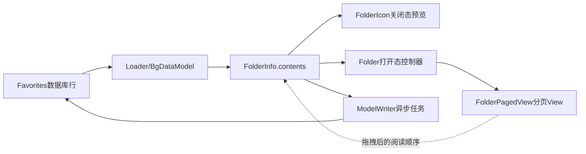
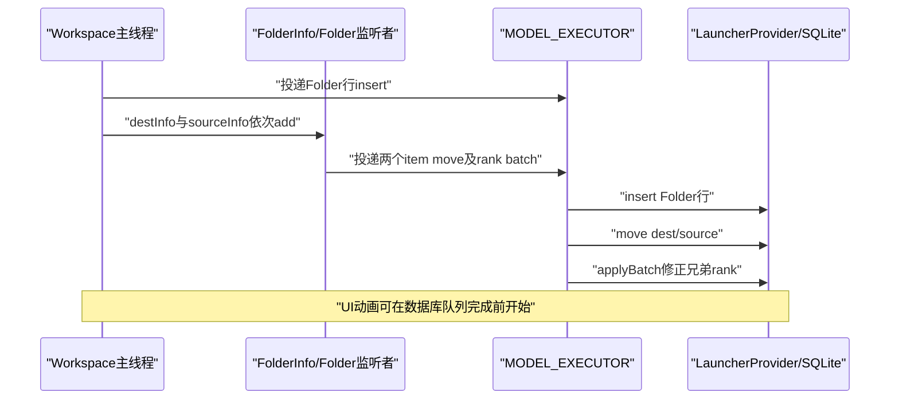

# 第517章 Android FolderInfo、FolderIcon与Folder：创建、内容rank、分页、开合动画和数据库一致性链

> 源码基线：Android 11 / API 30 / `android-11.0.0_r48`。直接面向 `packages/apps/Launcher3` 的真实实现，只读源码、不编译。核心文件：`model/data/FolderInfo.java`、`folder/FolderIcon.java`、`folder/Folder.java`、`folder/FolderPagedView.java`、`folder/FolderGridOrganizer.java`、`folder/FolderAnimationManager.java`、`Workspace.java`、`Launcher.java` 和 `ModelWriter.java`。

## 1. 本章解决什么问题

桌面上看起来只是一个“装着若干图标的文件夹”，源码里却同时存在数据对象、关闭态图标、打开态浮层、分页容器、预览绘制和数据库行。它们谁是权威？创建、打开、排序、拖入、拖出、关闭和解体时又怎样保持一致？

## 2. 一句话定位

`FolderInfo` 保存文件夹及有序内容，`FolderIcon` 表示桌面关闭态和四图标预览，`Folder` 管理打开态、拖拽和生命周期，`FolderPagedView` 把有序内容投影成分页网格，`ModelWriter` 最终把文件夹行与子项位置异步写入 Favorites 数据库。

## 3. 先建立“四本账”

第一本是 `FolderInfo.contents` 的对象顺序；第二本是每个 `WorkspaceItemInfo` 的 `rank/cellX/cellY/container`；第三本是 `FolderPagedView` 中真实 View 的父子关系和页内位置；第四本是 Favorites 表里的持久化列。FolderIcon 的预览还是由前三本账计算出的第五种“视觉投影”，不能反过来当权威。

## 4. 总体关系图



图中箭头不是一个原子事务。主线程可能已经更新对象和 View，而数据库任务仍在 `MODEL_EXECUTOR` 排队，所以调试时必须记录每一本账的时间点。

## 5. FolderInfo是数据核心但不是数据库本身

`FolderInfo` 继承 `ItemInfo`，自己的那一行代表“文件夹容器”；`contents` 则引用属于该文件夹的 `WorkspaceItemInfo`。它是当前 Launcher 模型里的内存对象，不是一次读取数据库时临时拼出的只读 DTO。

## 6. 子项归属靠container指向Folder id

Favorites 表没有“contents 数组”列。子图标通过 `container = folderInfo.id` 表达归属，`screen` 在文件夹内部固定使用 0，而 `rank/cellX/cellY` 表达顺序和网格位置。

## 7. contents顺序具有业务语义

文件夹第几个图标、哪几个进入关闭态预览、打开后在哪一页，最终都依赖 `contents` 的顺序。`cellX/cellY` 是这个顺序在当前网格规格下的派生坐标，不应独立当作唯一排序依据。

## 8. FolderInfo.add会夹紧rank

调用方给出的 rank 会被限制到 `0..contents.size()`，然后在该索引插入。负数会变成 0，过大的值会变成尾部；这避免 `ArrayList.add(index)` 越界，但也可能掩盖上游 rank 计算错误。

## 9. add事件分两轮通知

插入后先向所有监听者发送 `onAdd(item, rank)`，再由 `itemsChanged(animate)` 发送 `onItemsChanged`。监听者因此可能先做增量工作，再做通用的焦点、预览或布局刷新。

## 10. remove明确不负责数据库

源码注释直接写着 `Remove ... Does not change the DB`。`FolderInfo.remove` 只从 `contents` 删除并通知监听者；真正的移动、删除或失败恢复必须由更高层在正确业务时机调用 ModelWriter。

## 11. Listener不是事务总线

Listener 只是同一进程内的同步回调。它没有回滚、去重或“所有监听者都成功才提交”的语义；某个监听者已经改完 UI，并不证明后续数据库任务成功。

## 12. 创建Folder从Workspace政策开始

第516章的 `createUserFolderIfNecessary` 先确认距离门、目标是普通 `WorkspaceItemInfo`、拖入项也是 Shortcut 类，并且 `mCreateUserFolderOnDrop` 已在退出 DropTarget 时冻结。Folder 类本身并不决定“两图标是否应该建文件夹”。

## 13. 旧两个View先离开CellLayout

内部拖拽的源 View 会从原父布局移除，目标 Shortcut View 也从目标 CellLayout 移除，随后同一个格子放入新的 FolderIcon。这样可以避免普通 Shortcut 与 FolderIcon 同时占据一个 Cell。

## 14. Launcher.addFolder的关键源码

```java
public FolderIcon addFolder(CellLayout layout, int container, int screenId,
        int cellX, int cellY) {
    FolderInfo folderInfo = new FolderInfo();
    getModelWriter().addItemToDatabase(
            folderInfo, container, screenId, cellX, cellY);
    FolderIcon icon = FolderIcon.inflateFolderAndIcon(
            R.layout.folder_icon, this, layout, folderInfo);
    mWorkspace.addInScreen(icon, folderInfo);
    return icon;
}
```

顺序是先申请 id 并投递数据库插入，再构造 Folder/FolderIcon，再把关闭态 View 放回 Workspace；“先调用写库方法”不等于此刻 SQLite 已插入完成。

## 15. 新item id是同步取得的

`addItemToDatabase` 先通过 LauncherProvider 的 `METHOD_NEW_ITEM_ID` 同步取得 id，再把真正的 `insert` 投给 `MODEL_EXECUTOR`。因此后续两个子项可以立刻把 `container` 指向有效 folder id，即使 folder 行还在后台队列中。

## 16. 文件夹创建不是一条SQLite事务

Folder 行的 insert、目标图标 move、源图标 move 是多个 ModelWriter 任务。串行 MODEL_EXECUTOR 通常保证提交顺序，但它们没有被包装成同一个 `applyBatch`；进程在任务之间退出时，数据库可能短暂处于中间状态。



## 17. inflateFolderAndIcon一次创建两个View对象

它先从 `user_folder_icon_normalized` inflate 打开态 `Folder`，再从 `folder_icon` inflate 关闭态 `FolderIcon`。FolderIcon 常驻 Workspace，Folder 只有打开时才挂到 DragLayer。

## 18. 两个View共享同一个FolderInfo

`folder.bind(folderInfo)` 和 `icon.mInfo = folderInfo` 指向同一对象。它们不是各自复制内容，因此主线程改变 contents 后两个视图都能通过监听刷新；同时也要求调用方避免把“相等但不是同一实例”的对象混入 ModelWriter。

## 19. Listener注册顺序值得记录

`inflateIcon` 先把 FolderIcon 注册到 FolderInfo，随后 `Folder.bind` 再注册 Folder。一次 add 通常先触发 Icon 的圆点/描述更新，再触发 Folder 的 rank、数据库和打开态 View 更新；业务正确性不应偷偷依赖这个顺序。

## 20. bind先对旧数据排序

Folder.bind 对 contents 使用 `ITEM_POS_COMPARATOR`：优先 rank，其次 cellY，最后 cellX。它处理加载所得的旧记录或不完整 rank，使内存先形成稳定的阅读顺序。

## 21. comparator只用于bind修复

日常拖拽过程主要直接维护 contents 的数组顺序，不会每次都重新按 cell 排序。若错误地在任意时机调用全量 sort，可能把正在拖拽形成的新顺序又按旧 cell 坐标打乱。

## 22. bind会主动规范化数据库

排序后立刻执行 `updateItemLocationsInDatabaseBatch(true)`。它用当前网格重新计算每个子项的 rank/cell，只收集发生变化的项，再批量更新数据库；所以“仅打开绑定”也可能产生修复性写入。

## 23. bind参数true只抑制名称建议

`isBind=true` 不会禁止位置修复，只会跳过重新计算文件夹名称建议。不要把它理解成完全只读的 bind。

## 24. bind最后异步检查退化Folder

FolderIcon.post 一个主线程任务，若加载后子项只剩 0 或 1 个，就调用 `replaceFolderWithFinalItem`。post 让 inflate/bind 和当前 Workspace 装配先结束，避免在半构造状态立刻拆掉自己。

## 25. 关闭态只绑定预览不绑定全部子View

Launcher 正常停在桌面时，FolderIcon 根据 contents 绘制最多四个预览图标，但 FolderPagedView 可以没有任何子 View。这样大量文件夹不会常驻完整的每项 BubbleTextView 和 CellLayout 页面。

## 26. 打开时才bindItems

`Folder.animateOpen` 调用 `mContent.bindItems(items)`。FolderPagedView 为每个非 null ItemInfo 创建 BubbleTextView，然后 `arrangeChildren` 建页、放格和建立占位。

## 27. ViewCache参与回收

关闭且不处于拖拽时，`unbindItems` 把 `folder_application` 和 `folder_page` 放回 ViewCache。下次打开可能复用旧 View 实例，所以调试泄漏或残留属性时应检查 recycle 前后是否把可见性等状态复位。

## 28. mViewsBound是重要状态门

`createAndAddViewForRank` 在未绑定时只创建 View 而不挂页；`rearrangeChildren` 在未绑定时直接返回。contents 正确但打开态 View 暂不存在，是关闭文件夹的正常状态，不是丢图标。

## 29. FolderGridOrganizer把数量变成网格

它从 InvariantDeviceProfile 取得最大列数、最大行数和每页最大容量。`setContentSize` 会尽量形成 `countY <= countX`、接近平方且不超过上限的网格。

## 30. 小Folder的网格会收缩

例如最大规格为 3×3 时，两个、三个或四个图标不必始终占满 3×3。网格尺寸变化会影响 Folder 宽高、页内 cell 坐标和开合动画终点。

## 31. 多页时固定最大网格

只要数量达到或超过 `mMaxItemsPerPage`，Organizer 直接采用最大列×最大行。之后 rank 通过除法切页，避免不同页面出现不同列数。

## 32. rank到页码的公式

`page = rank / maxItemsPerPage`，`pagePos = rank % maxItemsPerPage`，再计算 `x = pagePos % countX`、`y = pagePos / countX`。这里 rank 是跨页连续编号，cellX/cellY 只是页内坐标。

## 33. getPosForRank复用同一个Point

`FolderGridOrganizer` 返回内部字段 `mPoint`，调用方应立即读取或复制，不能长期保存返回对象并期待它不变。下一次调用会覆盖同一个 Point 的 x/y。

## 34. arrangeChildren是全量重新投影

它先从所有已有页面 removeAllViews，再根据给定的有序 View 列表逐个放回，页面不足就创建，页面过多就回收。这里不是“只移动发生变化的一个 View”。

## 35. 全量投影不等于重新创建所有View

已有 View 先被摘下再挂到新页；只有缺页时创建 CellLayout，或新 Item 需要 BubbleTextView。区分“重新排 parent”与“重新 inflate”有助于判断动画、焦点和 drawable callback 问题。

## 36. CellLayout仍维护占位

每个 Folder 页面也是 CellLayout，`addViewToCellLayout(..., markCells=true)` 会维护自己的 occupancy。但文件夹项目全是 1×1，排序权威仍然是 rank，而不是像 Workspace Widget 那样求任意 span 的放置解。

## 37. RTL同时有视觉翻转和rank修正

Folder 页设置 `setInvertIfRtl(true)`；拖拽求最近格后，`findNearestArea` 还会把 x 转为 `countX - x - 1` 再换算 rank。少做其中一层会导致 RTL 下视觉位置和逻辑 rank 相反。

## 38. null占位只服务外部拖拽

鼠标或手指悬停 FolderIcon 800ms 打开时，`beginExternalDrag` 复制 contents，在尾部添加 null，表示一个暂时空 rank。`createNewView(null)` 返回 null，但 arrangeChildren 仍推进 position/rank，从而真正留出空格。

## 39. null不会进入FolderInfo.contents

它只存在于传给 animateOpen 的临时 List；mInfo.contents 保持真实项目集合。若把 null 写回 contents，名称建议、预览和数据库遍历都会出现异常。

## 40. 阅读顺序缓存是惰性重建

`getIconsInReadingOrder` 只有在 `mItemsInvalidated` 为 true 时才遍历每页每格重建 `mItemsInReadingOrder`。任何直接改 View parent/格子而忘记置脏，都会让后续拖拽拿到旧顺序。

## 41. iterateOverItems按页、行、列读取

FolderPagedView 从第0页开始，页内先 y 后 x 遍历。这与 LTR 的 rank 布局一致；RTL 由 CellLayout 的反转和 rank 计算处理，数据数组本身不会为 RTL 倒序保存。

## 42. updateItemLocations统一修正三列

对 contents 中第 i 个项目，`updateRankAndPos(item, i)` 同时更新 `rank=i` 和对应的 `cellX/cellY`。只手改 rank 不改 cell，或只移动 View 不改 rank，都只是半完成状态。

## 43. 批量规范化的关键源码

```java
for (int i = 0; i < mInfo.contents.size(); i++) {
    WorkspaceItemInfo item = mInfo.contents.get(i);
    if (verifier.updateRankAndPos(item, i)) {
        items.add(item);
    }
}
if (!items.isEmpty()) {
    mLauncher.getModelWriter().moveItemsInDatabase(items, mInfo.id, 0);
}
```

它只写真正变化的项，减少无效 update；同时把所有子项的 container 统一设为 folder id、screen 统一设为 0。

## 44. moveItemsInDatabase使用Provider批处理

ModelWriter 为每个项目生成 update operation，LauncherProvider 的 `applyBatch` 明确包裹 `SQLiteTransaction`。因此这一批 rank/cell 更新在数据库层要么一起提交，要么事务不提交。

## 45. 事务边界只覆盖这一批update

它不包含 FolderInfo.contents 的主线程修改、View 重排、Folder 行创建、子项首次移入或 Folder 解体。说“Folder操作是原子的”仍然不准确，只能说某一次 `moveItemsInDatabase` 的 Provider 操作有事务。

## 46. r48批处理失败有特殊不一致窗口

`UpdateItemsRunnable` 在调用 `applyBatch` 前就逐项执行 `updateItemArrays`，异常只 `printStackTrace`。若 applyBatch 失败，内存 ItemInfo/BgDataModel 可能已呈现新位置，而 SQLite 没提交；后续 reload 才可能把旧数据库状态重新加载回来。

## 47. FolderIcon是关闭态DropTarget入口

它本身没有实现 DropTarget 接口，但 Workspace 识别目标 View 为 FolderIcon 后调用它的 `acceptDrop/onDragEnter/onDrop`。打开态 Folder 才是真正注册到 DragController 的 DropTarget。

## 48. 关闭态acceptDrop没有容量上限

它只接受 application、shortcut、deep shortcut，拒绝 FolderInfo 自己、已打开或已 destroyed 的 Folder。r48 这条链没有“九个满了”一类固定容量门，多出的项目进入下一页。

## 49. Folder不能套Folder

FolderInfo 的 itemType 不在 accept 列表里，Widget 也不在。UI 上把一个 Folder 拖到另一个 Folder 或把 Widget 塞进去，会在类型门直接被拒绝。

## 50. hover有800ms自动打开

FolderIcon.onDragEnter 播放接受态背景，并设置 `ON_OPEN_DELAY=800ms`。Alarm 到期调用 `Folder.beginExternalDrag`，于是用户可以继续把图标拖到 Folder 内部的具体 rank。

## 51. 离开FolderIcon会取消打开Alarm

`FolderIcon.onDragExit` 同时让背景回到 rest 并 cancel mOpenAlarm。若排查“偶尔自己打开”，要记录 enter/exit、Alarm pending 和目标 View 是否因临时重排发生过切换。

## 52. 直接松手默认追加到尾部

未先打开 Folder 时，`FolderIcon.onDrop` 默认使用 `mInfo.contents.size()` 作为插入 rank。拖出失败再返回 FolderIcon 时例外，使用原 item.rank 恢复原位置。

## 53. All Apps项目必须复制

`AppInfo` 不是可直接持久化到 Workspace 的那一个对象，所以先 `makeWorkspaceItem`；来自跨窗口 BaseItemDragListener 的 WorkspaceItemInfo 也复制。来自普通 Workspace/Folder 的项目则可复用原对象。

## 54. onDrop先把cell设为-1

FolderIcon 先把 item.cellX/cellY 置为 -1，随后 `FolderInfo.add` 触发 Folder.onAdd，Organizer 才根据最终 rank 写回正确页内坐标。看到短暂 -1 是进入 Folder 的中间态。

## 55. FolderIcon与Folder监听者分工

FolderIcon.onAdd/onRemove 聚合通知圆点、更新无障碍描述；Folder.onAdd 才规范化 rank/cell、调用 ModelWriter 并在打开态创建 View。`onItemsChanged` 又分别刷新关闭态预览和打开态焦点。

## 56. add回调可能引发两类数据库任务

Folder.onAdd 先对新项 `addOrMoveItemInDatabase`，随后 `updateItemLocationsInDatabaseBatch` 修正受插入影响的其他项。前者把项目移进 container，后者批量移动 rank 被挤后的兄弟项。

## 57. FolderInfo.add本身不设置container

真正让 item.container 变成 folder id 的是 Folder.onAdd 中的 ModelWriter。若没有 Folder listener，单独调用 contents.add 或 FolderInfo.add 只会改变内存集合，不会完整建立数据库归属。

## 58. FolderIcon预览最多取四个

`MAX_NUM_ITEMS_IN_PREVIEW` 决定关闭态可见项目数。小 Folder 默认直接取前四个；内容变多后，Organizer 选择第一页面左上 2×2 的项目，保证开合动画的起点与网格对应。

## 59. 预览不是前四rank的永恒规则

当网格扩展、分页或左上象限规则生效时，预览选择取决于 rank 对应的行列。不能用 `contents.subList(0, 4)` 替代 `previewItemsForPage`。

## 60. Preview更新会比较旧集合与新集合

放入 rank 超过四的项目也可能改变预览，例如插入导致旧项顺延。FolderIcon 先计算 old/new preview，再决定是否需要隐藏某个预览位和播放换位动画。

## 61. drop动画与数据添加时机不同

项目可能已经加入 contents 并投递数据库，但 DragView 仍在飞向 FolderIcon，真实 BubbleTextView 又被 `hideItem` 暂时设为 INVISIBLE。视觉上“还没进去”不代表数据还没改。

## 62. 最终显示至少受两段时间影响

开启名称建议时，先在 MODEL_EXECUTOR 计算建议，再调用 View.postDelayed 等待 400ms drop 动画，最后 showItem、恢复预览并可能自动命名。模型线程繁忙会让真实显示晚于固定 400ms。

## 63. 名称建议不会覆盖手工名称

`setLabelSuggestion` 只在 LabelState 为 UNLABELED 时接受第一候选。用户把标题清成空字符串后状态是 EMPTY，不再符合自动命名条件。

## 64. null标题与空标题语义不同

null 表示从未命名、允许自动建议；`""` 表示用户明确留空、不允许自动命名。`setTitle` 还会忽略“从 null 改为空”的假触摸，保留 UNLABELED。

## 65. 手工名称由option位辅助判断

非空标题本身无法区分“系统建议”还是“用户输入”，所以 `FLAG_MANUAL_FOLDER_NAME` 记录来源。若新标题命中建议列表则清此位，否则置位。

## 66. suggestedFolderNames不是持久化真相

它是运行期候选信息，不随 FolderInfo 的 title/options 一起完整写入 Favorites。重启后可能重新计算，因此日志和 UI 不应假设候选数组永远存在。

## 67. 名称建议计算读取共享contents

r48 把 `mInfo.contents` 直接交给 MODEL_EXECUTOR 的名称提供者，主线程随后仍可能继续拖拽修改。这里不是不可变快照；诊断极端时序下的过时候选时，要记录任务投递和完成时的内容版本。

## 68. 打开Folder前会关闭另一个Folder

`animateOpen` 先调用 `getOpen`，若已有不同 Folder 则 close(true)。DragLayer 正常只保留一个打开的 Folder 浮层，避免多个 DropTarget 和焦点窗口重叠。

## 69. Folder打开后挂在DragLayer

若还没有 parent，Folder 被 add 到 DragLayer，并注册为 DragController DropTarget。FolderIcon 仍在 Workspace 原格，但会隐藏图标绘制并留下占位背景。

## 70. FolderIcon被隐藏不等于从Workspace删除

打开动画开始时 `setIconVisible(false)` 只控制 FolderIcon 内部背景/预览绘制，`drawLeaveBehindIfExists` 还把其 LayoutParams 标记为不可重排。原 CellLayout 占位继续存在。

## 71. 开启动画的关键源码

```java
mContent.bindItems(items);
centerAboutIcon();
mIsOpen = true;
dragLayer.addView(this);
mDragController.addDropTarget(this);

AnimatorSet anim =
        new FolderAnimationManager(this, true).getAnimator();
anim.addListener(new AnimatorListenerAdapter() {
    public void onAnimationStart(Animator a) {
        mFolderIcon.setIconVisible(false);
        mFolderIcon.drawLeaveBehindIfExists();
    }
    public void onAnimationEnd(Animator a) {
        mState = STATE_OPEN;
    }
});
startAnimation(anim);
```

真正的“打开完成”至少要区分 mIsOpen 已为 true、Folder 已挂 DragLayer、动画 start、mState 变 OPEN 和下一帧像素已经显示。

## 72. Folder状态有四个值

`STATE_NONE` 是未初始化语义，`STATE_SMALL` 是关闭态，`STATE_ANIMATING` 表示开合动画中，`STATE_OPEN` 表示打开动画结束。`isDropEnabled` 明确在 ANIMATING 时返回 false。

## 73. mIsOpen与mState不是同一时间更新

animateOpen 在动画之前就把 mIsOpen 设为 true，mState 要到动画 end 才变 OPEN。只查 isOpen 会把“正在展开”误当作已可稳定交互。

## 74. FolderAnimationManager只动画Folder本体

源码注释说明先隐藏 FolderIcon、立即显示 Folder，再让 Folder 的位置、缩放、裁剪、背景色、子图标和文字从关闭态预览几何过渡到展开态。它不是把 FolderIcon 这个 View 自身放大。

## 75. 动画起点来自真实FolderIcon坐标

DragLayer 计算 FolderIcon 相对自己的 Rect 和缩放，再结合 PreviewBackground 半径、padding、预览图标缩放，得到 Folder 的 translation 和 reveal startRect。Workspace 当前 transform 不同会改变几何映射。

## 76. 开合动画不是简单scale

AnimatorSet 同时包含 Folder translationX/Y、content/footer scale、背景颜色、形状 reveal、FolderIcon 标题淡出、Folder 标题淡入、footer 位移、elevation 以及预览项目各自的位移/缩放。

## 77. 大Folder使用不同插值器

内容超过预览上限时，预览项目开和关使用专用 interpolator，并带 delay 调整，让左上预览图标与其余网格项目在视觉上对齐。排查某几个图标节奏不同不能只看总 duration。

## 78. 动画结束会强制归一属性

listener 把 Folder translation、content/footer scale、文字 alpha 和各图标 translation/scale 恢复到终值，并恢复 clipChildren/clipToPadding。取消 Animator 通常也会触发 end 回调，所以重入时序要同时看取消方和新动画。

## 79. 多页首次打开还有footer二段动画

页数大于1且没有 `FLAG_MULTI_PAGE_ANIMATION` 时，Folder 名称先从居中位置移回一侧，PageIndicator 再播放进入动画。普通打开结束后写 option；拖拽打开则等真实 drop 再置位。

## 80. FLAG_MULTI_PAGE_ANIMATION可被清回false

拖出后项目数回到单页容量以内，`onDropCompleted` 清除此 option，让以后再次扩成多页时重新播放首次多页动画。它记录的不是“这个 Folder 历史上永远播放过”。

## 81. 关闭请求先处理名称编辑

`handleClose` 先把 mIsOpen=false，若正在编辑则 dispatchBackKey，把标题写回 ModelWriter，再恢复 FolderIcon leave-behind，最后决定播放关闭动画还是立即 closeComplete。

## 82. closeComplete才真正摘掉浮层

动画结束后 Folder 从 DragLayer remove，取消 DropTarget 注册，FolderIcon 恢复可见、预览、标题、圆点和可重排状态。动画开始并不等于打开态资源已经解绑。

## 83. 正常关闭会回到第一页

closeComplete 最后把状态设 SMALL，并把 FolderPagedView currentPage 设为0；FolderIcon 的关闭预览可根据刚关闭的页播放相应过渡，但下次普通点击仍从第0页打开。

## 84. 大于一个项目时通常unbind

若未拖拽且项目数仍大于1，关闭完成会回收打开态页面和图标 View。FolderInfo.contents 与 FolderIcon 预览仍存在，所以下次打开重新 bind 不会丢失数据。

## 85. 拖拽期间不能急着unbind

Folder 内拖出或外部拖入时，关闭可能发生在 drop result 之前。代码保留 View 和一组 `mDeleteFolderOnDropCompleted/mSuppressFolderDeletion` 标志，等 DragController 明确 success/failure 后再决定解体或恢复。

## 86. Folder内部拖拽先制造空rank

长按某个 BubbleTextView 时保存其 item.rank 为 `mEmptyCellRank`；onDragStart 摘掉 View，并从 FolderInfo.contents 移除项目。此时数据库尚未删除或移动，等待最终 drop 统一处理。

## 87. SuppressInfoChanges只移除Folder监听者

内部拖出时临时移除 Folder 自己的 listener，避免 onRemove 又重复 rearrange；FolderIcon listener 仍会看到 contents 变化并更新关闭态预览。它不是屏蔽所有监听者。

## 88. 250ms后才实时重排

onDragOver 计算 mTargetRank，目标改变就重启 `REORDER_DELAY=250ms` Alarm。到期调用 `realTimeReorder(empty, target)`，让空位沿阅读顺序移动，避免触点轻微晃动就频繁换位。

## 89. 实时重排首先改View位置

`FolderPagedView.realTimeReorder` 在当前页用 CellLayout 动画邻居，跨页边界的 View 可能立即移到相邻页。它尚未直接重排 FolderInfo.contents；真正 drop 时通过 remove后add到新 rank 形成最终数组顺序。

## 90. pending动画必须先完成

再次重排或最终 drop 前调用 `completePendingPageChanges`，cancel ViewPropertyAnimator 并手动运行记录的 endAction。否则 View 可能还挂在旧页，后续按格查找会拿到错误对象。

## 91. 边缘翻页是三段Alarm

靠近左右边缘先显示 7% scroll hint，500ms 后真正翻页，再暂停到 page snap 时长加150ms，随后重新 onDragOver。期间 reorder Alarm 被取消，避免在不可见页继续挪位。

```mermaid
stateDiagram-v2
    [*] --> "空位rank已建立"
    "空位rank已建立" --> "等待250ms重排": "目标rank变化"
    "等待250ms重排" --> "View实时换位": "ReorderAlarm"
    "等待250ms重排" --> "显示7%翻页提示": "进入页边缘"
    "显示7%翻页提示" --> "执行翻页": "500ms Alarm"
    "执行翻页" --> "暂停命中": "等待snap+150ms"
    "暂停命中" --> "重新计算目标rank": "再次onDragOver"
    "View实时换位" --> "最终drop"
    "重新计算目标rank" --> "最终drop"
    "最终drop" --> "contents插入并批量写库"
```

## 92. 无障碍drop会主动兑现Alarm

无障碍操作可能 onDragEnter 后立刻 onDrop，没有等待250ms。`prepareAccessibilityDrop` 若发现 reorder Alarm pending，就同步执行 listener，保证目标 rank 与视觉提示一致。

## 93. 打开态drop区分外部和内部

外部拖入要创建 BubbleTextView，并用 addOrMove 把 item container 改成 folder id；内部重排复用 mCurrentDragView。两条路径最后都把 View 放到 mEmptyCellRank、arrange，并向 contents 插回项目。

## 94. 外部写库发生在contents.add之前

Folder.onDrop 的 external 分支先调用 ModelWriter 更新 ItemInfo，再用 `SuppressInfoChanges` 执行 `mInfo.add`。内存 item 的 container/cell 可能已更新，而 contents listener 被部分抑制，这是刻意避免重复 UI/DB 工作的时序。

## 95. 内部drop由onDropCompleted补数据库

如果 dragSource 就是当前 Folder，onDrop 不立即批量写位置；最终 `onDropCompleted` 统一执行 `updateItemLocationsInDatabaseBatch(false)`。这样连续实时重排不会产生大量数据库写。

## 96. drop到别处成功仍要规范化剩余项

项目离开 Folder 后，后面的 rank 都可能前移。无论目标是 Workspace、别的 Folder 还是删除区，onDropCompleted 最后都批量保存剩余项目的新 rank/cell。

## 97. drop失败会把原对象插回原rank

失败分支找到旧 mCurrentDragView 或新建 View，把 item.rank 夹紧后插回阅读顺序，再经 FolderIcon.onDrop 的 `itemReturnedOnFailedDrop=true` 恢复 contents、预览动画和数据库归属。

## 98. 失败恢复不是数据库回滚

因为内部拖拽开始时通常没有立刻改数据库，失败更多是“重建主线程对象/View并再次规范化”；若其他路径已经投递过 move，它仍靠新的异步任务覆盖，而不是撤销先前事务。

## 99. 拖出期间Folder解体会延后

关闭时若 contents 只剩0或1但 drag仍在进行，代码设置 `mDeleteFolderOnDropCompleted=true`。只有 drop成功、没有经 FolderIcon 加回自己且目标不是本 Folder，才真正 replace。

## 100. notifyDrop避免同Folder误删

当拖出的项目又丢到自己的关闭态 FolderIcon，`notifyDrop` 设置 `mItemAddedBackToSelfViaIcon`。onDropCompleted 检查此位，避免把刚加回项目的 Folder 当成只剩一个而解体两次。

## 101. Folder退化为一个Shortcut的关键源码

```java
if (itemCount == 1) {
    finalItem = mInfo.contents.remove(0);
    newIcon = mLauncher.createShortcut(cellLayout, finalItem);
    mLauncher.getModelWriter().addOrMoveItemInDatabase(
            finalItem, mInfo.container, mInfo.screenId,
            mInfo.cellX, mInfo.cellY);
}
mLauncher.removeItem(mFolderIcon, mInfo, true);
if (newIcon != null) {
    mLauncher.getWorkspace().addInScreenFromBind(newIcon, mInfo);
}
```

先把最后一项移动到 Folder 原来的 Workspace/Hotseat 格，再删除 Folder 行，最后放入新 Shortcut View；空 Folder 则跳过 finalItem，直接删除。

## 102. 解体动画期间mDestroyed已为true

`replaceFolderWithFinalItem` 启动 FolderIcon 的反向首项动画后，方法末尾立刻置 `mDestroyed=true`，真正 onComplete 可能稍后才移动/删除。acceptDrop 因此会立刻拒绝新项目，防止解体途中再次写入。

## 103. 解体的数据库操作也不是单事务

最后项目的 move 与 Folder 的 delete 是两个 ModelWriter 操作。它们通常按 MODEL_EXECUTOR 顺序执行，但不是同一个 LauncherProvider transaction；崩溃恢复要依赖 Loader 对孤儿/退化 Folder 的清理。

## 104. 直接remove(0)不会通知Listener

解体代码直接从 contents 删除最后项，而不是 FolderInfo.remove。此时 UI 即将销毁，避免无意义的 onRemove/rearrange；但如果复制这段写法到普通编辑路径，就会造成预览和圆点不刷新。

## 105. FolderIcon删除要移除DropTarget关系

移除 Workspace View 和数据库行之外，还要从 DragController 移除可能的 DropTarget，并移除 FolderInfo listeners。只 delete 数据库而保留 View 会产生可点击但模型不存在的“幽灵 Folder”。

## 106. SQLite成功仍不是屏幕完成fence

Provider update/insert 成功只能证明持久化完成；ViewPropertyAnimator、DragLayer 动画、主线程下一帧绘制和 SurfaceFlinger 合成都在别的时间线上。反过来，屏幕已稳定也不能证明异步数据库已提交。

## 107. 推荐的一致性快照

一次问题复现至少记录：Folder id及父 container/screen/cell、contents 对象id顺序、每项 id/rank/cell/container、FolderPagedView每页 child tag、FolderIcon preview ids、mViewsBound/mState/mIsOpen/drag flags、MODEL_EXECUTOR任务和 Favorites 查询结果。

## 108. 排查“重启后顺序变了”

重点比较 drop 前后 contents 顺序、updateItemLocations 收集项、applyBatch异常、数据库 rank/cell，以及下一次 bind 的 comparator结果。不要只截一张关闭态四宫格预览图。

## 109. 排查“Folder里少一个图标”

先区分 contents 真少、View未bind、null临时空位、View被 hideItem、pending page endAction未完成、只在别页、预览没选中和数据库归属错误。这七种现象肉眼都可能像“少了”。

## 110. 排查“拖出失败却Folder消失”

检查 mDeleteFolderOnDropCompleted、mSuppressFolderDeletion、mItemAddedBackToSelfViaIcon、target是否等于this、onExit Alarm 是否被兑现，以及 replaceFolderWithFinalItem 是否重复进入。

## 111. 推荐场景矩阵

覆盖2/4/5/单页上限/上限+1个项目，LTR/RTL，关闭态直接drop与800ms打开后drop，同Folder重排、跨页重排、拖出成功/失败/加回自己、名称null/空/手工/建议、开合动画中操作、Provider applyBatch失败和只剩0/1项解体。

## 112. macOS只读练习一：手算rank与分页

从 `InvariantDeviceProfile.numFolderColumns/Rows` 找当前最大网格，分别给2、4、9、10个项目手算 countX/countY、page、cellX/cellY和关闭态preview ids；再解释RTL为什么只改变视觉/命中换算，不改变数据库rank顺序。

## 113. macOS只读练习二：画四本账时间线

只读跟踪“Workspace图标A拖到图标B建Folder”：列出目标/源View移除、Folder id申请、Folder行insert任务、FolderInfo.add、两个item move、预览动画、真实View显示和SQLite提交；标出哪些步骤不在同一事务。

## 114. macOS只读练习三：推演拖出失败

从 Folder.startDrag 开始记录 mEmptyCellRank、contents、reading-order View、数据库旧行、closeComplete标志、onDropCompleted(false)、FolderIcon.onDrop(true)和最终batch。要求分别写出每一步“已改变”和“尚未证明”的事实。

## 115. macOS只读练习四：审计退化Folder

模拟 Folder 先有2项，拖走1项并关闭；比较 drop成功到Workspace、drop失败、加回自己的FolderIcon三条路径。检查何时置 mDestroyed、何时移动最后项、何时删Folder、何时恢复View，以及中途进程退出可能留下什么数据库状态。

## 116. 易错点一：rank不是screenId

Folder 子项的 `screenId` 固定写0，页码由 rank 除以每页容量计算。把 pageNo 写进 screenId 会破坏 ModelWriter 和 Loader 对 Folder container 的约定。

## 117. 易错点二：预览不是contents本体

FolderIcon只绘制经 Organizer 选择的最多四项，并可能在动画期隐藏/换位；预览缺少某项不等于 contents 或数据库缺少它。

## 118. 易错点三：关闭态没有子View很正常

FolderPagedView在正常关闭后会 unbind。排查前先看 `areViewsBound`，不要因为 iterateOverItems 返回空就断言 FolderInfo.contents 丢失。

## 119. 易错点四：Listener通知不是持久化事务

FolderInfo.add/remove 先同步改内存并回调 UI，ModelWriter 再异步写数据库；批量update虽有SQLite事务，也没有覆盖完整创建、拖拽或解体业务。

## 120. 本章总结与下一章

Folder 的稳定性来自“有序 contents → rank/cell规范化 → 打开态分页和关闭态预览投影 → ModelWriter持久化”的反复收敛，而不是一次全局原子提交。下一章继续精读 `PreviewItemManager`、`ClippedFolderIconLayoutRule`、`PreviewBackground` 与通知圆点聚合，解释四宫格预览的绘制参数、动画换位、裁剪和失效刷新链。
