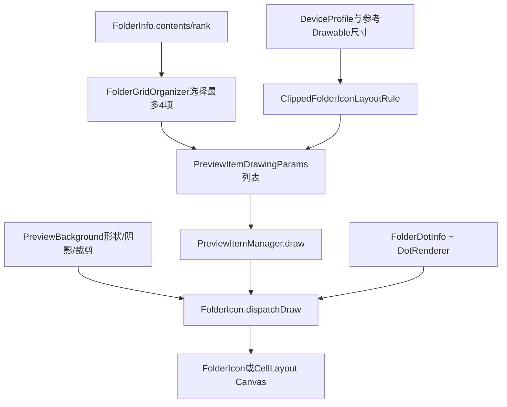
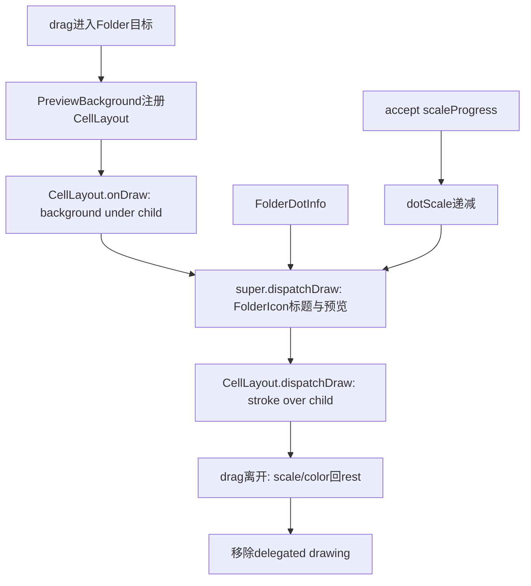

# 第518章 Android FolderIcon预览：绘制参数、布局规则、换位动画、背景裁剪和通知圆点聚合链

> 源码基线：Android 11 / API 30 / `android-11.0.0_r48`。直接阅读 `packages/apps/Launcher3`，只读源码、不编译。核心文件：`folder/PreviewItemManager.java`、`folder/ClippedFolderIconLayoutRule.java`、`folder/PreviewItemDrawingParams.java`、`folder/FolderPreviewItemAnim.java`、`folder/PreviewBackground.java`、`folder/FolderIcon.java`、`dot/FolderDotInfo.java`、`dot/DotInfo.java`、`CellLayout.java` 与 `dragndrop/FolderAdaptiveIcon.java`。

## 1. 本章解决什么问题

关闭的 FolderIcon 为什么能在一个图标大小的区域里画出最多四个应用？增加、删除或拖入项目时，旧图标怎样退出、新图标怎样进入？背景为何有时由 FolderIcon 画、有时跑到 CellLayout 里画？通知圆点又怎样把整个 Folder 的消息聚合成一个点？

## 2. 一句话定位

`FolderGridOrganizer` 先选“哪些项目进入预览”，`ClippedFolderIconLayoutRule` 计算“每个项目画在哪里、多大”，`PreviewItemManager` 持有 Drawable和动画参数并执行 Canvas 绘制，`PreviewBackground` 提供形状、裁剪、阴影和接受态反馈，`FolderDotInfo` 只聚合通知存在性与数量。

## 3. 先分五层而不是只看FolderIcon

数据层是 `WorkspaceItemInfo`；选项层是 preview item 列表；几何层是 `transX/transY/scale`；绘制层是 Drawable、Canvas、Path；动效层是参数 Animator、背景 Animator 和 dot Animator。FolderIcon 只是把这些层装配到一次 `dispatchDraw` 中。

## 4. 关闭态绘制总链路



图里没有“把打开态 BubbleTextView 缩小后直接塞进 FolderIcon”这一步；关闭态主要绘制独立 Drawable。

## 5. folder_icon.xml本身很简单

根节点是 FolderIcon，唯一声明的子 View 是用于标题的 `DoubleShadowBubbleTextView`。四宫格预览不是 XML 里的四个 ImageView，也不是 FolderPagedView 的四个 child。

## 6. 预览项目是Drawable参数对象

每个 `PreviewItemDrawingParams` 保存位置、缩放、overlayAlpha、当前动画、hidden、Drawable 和 WorkspaceItemInfo。Manager 遍历这些轻量对象，把 Drawable 画到 FolderIcon Canvas。

## 7. FolderIcon构造时装配三个核心对象

`init()` 创建 `ClippedFolderIconLayoutRule`、`PreviewItemManager` 和圆点绘制参数。真正的预览尺寸还不能在构造时确定，因为 FolderIcon 尚未测量，也没有参考 Drawable。

## 8. Manager缓存三个尺寸输入

`mIntrinsicIconSize`、`mTotalWidth` 和 `mPrevTopPadding` 用于判断几何是否需要重算。只有参考图标固有尺寸、FolderIcon测量宽度或顶部 padding 改变时，才重新 setup background、init rule 和全量更新预览。

## 9. mIconSize和mIntrinsicIconSize不是同一量

`mIconSize` 来自 `DeviceProfile.folderChildIconSizePx`，用于给新 Drawable 设置 bounds；`mIntrinsicIconSize` 来自参考 Drawable 的 intrinsicWidth，用于归一化 Canvas。混用两者会导致二次缩放错误。

## 10. 第一张参考Drawable从内容中产生

普通绑定时 `buildParamsForPage(false)` 第一次 setDrawable 后把它保存为 `mReferenceDrawable`。创建 Folder 时则通过目标 Shortcut TextView 顶部 compound drawable 提前取得参考图标。

## 11. 没有参考Drawable就无法recompute

`recomputePreviewDrawingParams` 在 mReferenceDrawable 为 null 时不做事。这通常只发生在尚无可绘内容或初始化很早的阶段；直接调用 getFinalIconParams 还会依赖参考 Drawable，不能脱离正常装配顺序使用。

## 12. 背景尺寸来自DeviceProfile

`PreviewBackground.setup` 把 `previewSize` 设为 `folderIconSizePx`，不是 FolderIcon 的完整 View 宽度。FolderIcon 还要给标题、cell padding 和触摸区域留空间。

## 13. 背景在View中水平居中

`basePreviewOffsetX=(availableSpaceX-previewSize)/2`，Y 则是 topPadding 加 `folderIconOffsetYPx`。Manager 先在 previewSize 局部坐标中计算项目，再整体平移到 base offset。

## 14. folderIconSizePx通常是归一化圆尺寸

DeviceProfile 用 `IconNormalizer.getNormalizedCircleSize(iconSizePx)` 计算它，并用两者差值的一半得到 Y offset。因此普通应用图标尺寸、Folder背景外接尺寸和 Folder子项 Drawable bounds并不必然相同。

## 15. 一份DrawingParams就是一帧的几何账

`transX/transY` 表示 Drawable 左上角在预览局部坐标中的平移，`scale` 表示在归一化 intrinsic size 基础上的缩放。它不是 View LayoutParams，也不参与 CellLayout occupancy。

## 16. LayoutRule.init建立基准比例

Rule 保存可用正方形边长、参考图标固有尺寸、RTL，并计算 `baselineIconScale=availableSpace/intrinsicIconSize`。后续0.48、0.53、0.58这些系数都还要乘这个基准比例。

## 17. 两项、三项、四项使用三档scale

两项及以下使用0.58，三项使用0.53，四项及以上使用0.48，再乘 baselineIconScale。数字是相对预览区域的设计系数，不是最终 Canvas 的绝对缩放。

## 18. 一项预览也按“两项布局”计算

`getPosition` 会把 item count 至少提升到2。因此只有一个项目的短暂创建/解体状态不会把图标画在正中心，而是沿用两项布局的第0位置，便于首项动画连续过渡。

## 19. Folder通常不会长期停在一项

第517章看到，0或1项 Folder 会被替换成普通 Shortcut。这里支持一项主要是为了创建、销毁、加载清理和动画中间态，不代表产品允许稳定单项 Folder。

## 20. 预览几何用圆周模型生成

Rule 把若干项目放在一个抽象圆周上，再把圆心坐标减去半个缩放后图标尺寸，得到 Drawable 左上角。最终看起来像2×2，但计算不是简单的等宽 GridLayout。

## 21. 起始角会根据RTL改变

LTR 从 π 开始并顺时针，RTL 从0开始并逆时针。这样 index 仍按阅读顺序递增，视觉布局则镜像，不需要把 FolderInfo.contents 反向保存。

## 22. 三项和四项还会旋转起点

三项额外偏移 π/6，四项偏移 π/4，使构图在正方形里更对称。只把两个项目位置复制成四宫格左上角，无法复现 AOSP 的视觉中心。

## 23. 四项时交换逻辑index 2和3

圆周天然顺序与“先上行后下行”的阅读顺序不一致，所以源码把第三、第四项交换后再求角度。这个交换只影响几何，不改变 contents 或 rank。

## 24. 半径会随数量轻微膨胀

基础 `mRadius=1.33×availableSpace/2`，从2项到4项最多再放大15%。坐标公式随后又除以2，所以实际图标中心轨道半径不是 mRadius 本身；变量名不能直接当屏幕像素半径理解。

## 25. 位置公式的关键源码

```java
float radius = mRadius * (1 + MAX_RADIUS_DILATION
        * (curNumItems - 2) / (4 - 2));
double theta = theta0
        + index * (2 * Math.PI / curNumItems) * direction;
float half = (mIconSize * scaleForItem(curNumItems)) / 2;
result[0] = mAvailableSpace / 2
        + (float) (radius * Math.cos(theta) / 2) - half;
result[1] = mAvailableSpace / 2
        + (float) (-radius * Math.sin(theta) / 2) - half;
```

Y 分量取负是因为数学坐标向上为正，而 Canvas 坐标向下为正。

## 26. ENTER和EXIT是虚拟index

`ENTER_INDEX=-3`、`EXIT_INDEX=-2` 不对应 contents rank。它们把项目放到2×2网格外的第3列：进入项从第1行外侧滑入，退出项从第0行外侧滑出。

## 27. RTL下虚拟位置自然镜像

`getGridPosition` 先用四项的0和3位置求 dx/dy，再扩到 col=2；RTL时 dx方向随布局变化，因此进入/退出侧也会镜像，而不是另写一套常量。

## 28. index大于等于4会落到中心

预览外项目的目标位置被设为预览中心。FolderIcon drop动画用 `Math.min(4,index)` 计算落点，所以第五项及以后会飞向中心并最终透明消失，而不是飞向不可见的第5格。

## 29. overlayAlpha在r48没有实际效果

Rule始终把它设为0，`drawPreviewItem` 也没有读取这个字段。它是遗留/预留状态，阅读源码时不要凭字段名推断当前版本存在蒙层动画。

## 30. Manager绘制的关键源码

```java
canvas.translate(bg.basePreviewOffsetX, bg.basePreviewOffsetY);
for (int i = params.size() - 1; i >= 0; i--) {
    PreviewItemDrawingParams p = params.get(i);
    if (!p.hidden) {
        canvas.save();
        canvas.translate(p.transX, p.transY);
        canvas.scale(p.scale, p.scale);
        p.drawable.draw(canvas);
        canvas.restore();
    }
}
canvas.translate(-bg.basePreviewOffsetX, -bg.basePreviewOffsetY);
```

真实源码还会根据 Drawable bounds 再做一次归一化，并用成对 translate 把 Canvas 恢复。

## 31. 列表从后向前画

最后一个参数最先画，第0项最后画，因此第0项处于最上层。moveOut临时参数被插到列表头，也会最后绘制，避免退出图标被新预览项目盖住。

## 32. hidden只跳过绘制

`hidePreviewItem` 不会删除参数、Drawable或ItemInfo，只让 draw 循环暂时略过。Drop DragView飞入时，真实预览项被隐藏，400ms后再恢复，以免同时看到两份图标。

## 33. Drawable bounds会再次归一化

setDrawable把 bounds 设为 `folderChildIconSizePx`，draw时又按 `intrinsicIconSize/bounds.width` 缩放。最终参数 scale是在统一 intrinsic坐标上生效，兼容不同 Drawable bounds。

## 34. PreviewItem本身没有alpha动画

FolderPreviewItemAnim只插值scale、transX、transY。Drop DragView的 alpha 在 DragLayer动画中处理；预览 item进出靠移动到边缘/中心、裁剪和hidden形成消失效果。

## 35. ClipPath是不可见部分消失的关键

FolderIcon在画预览前用 `canvas.clipPath(mBackground.getClipPath())`。ENTER/EXIT位于形状外的部分自然被截掉，所以即使没有参数alpha，也能看起来从Folder边界进入或离开。

## 36. dispatchDraw先调用super

`super.dispatchDraw` 先绘制 FolderIcon XML 子 View，也就是标题；随后才画背景、预览、stroke和dot。标题与图标区域通常不重叠，但它们确实属于同一个 ViewGroup 绘制 pass。

## 37. background可见性是总门

`mBackgroundIsVisible=false` 时，dispatchDraw在 super之后立即返回：标题仍能由super绘制，但背景、预览、边框和dot都不画。打开 Folder 时正是利用这点隐藏关闭态图形。

## 38. 预览项目选择仍由FolderGridOrganizer负责

Manager不直接取 contents 前四个，而是通过 FolderIcon.getPreviewItemsOnPage 调用 Organizer。项目较多时选择该页左上2×2，保证关闭预览与打开页的对应关系。

## 39. mCurrentPreviewItems是业务比较快照

FolderIcon另存第一页面当前预览 ItemInfo 列表，用于 drop 前后比较 moveIn/moveOut。它和 Manager 的 DrawingParams 列表相关但不是同一个对象集合。

## 40. buildParamsForPage先调整列表长度

预览项目减少就从尾部删参数，增加就补0位置、0缩放的新参数。然后逐项重新绑定 Drawable/ItemInfo，并选择立即计算终态或创建动画。

## 41. 缩短列表不会显式cancel被删动画

r48从尾部 remove DrawingParams 前没有先 cancel 其 anim，也没有清旧 Drawable callback。被移除参数上的 Animator 理论上仍可跑到结束并持续invalidate，只是不会再被draw；通常时长很短，但这是生命周期边界。

## 42. setDrawable每次创建新Drawable

普通项目调用 `FastBitmapDrawable.newIcon`，Promise安装项目调用 `newPendingIcon`。它不是永久复用打开态 BubbleTextView 的 compound drawable。

## 43. Promise图标会复制安装进度

PreloadIconDrawable创建后立刻 `setLevel(item.getInstallProgress())`。Workspace收到Shortcut更新时会按ItemInfo Predicate重建匹配的预览Drawable，从而刷新进度环。

## 44. Drawable callback指向FolderIcon

`setCallback(mIcon)` 让 Drawable 的 `invalidateSelf` 能请求 FolderIcon 重绘。源码把打开Folder视为callback交还点之一；FolderPagedView.verifyVisibleHighResIcons会把打开态图标所持Drawable的callback重新指回对应BubbleTextView。

## 45. verifyDrawable只显式检查firstPageParams

FolderIcon覆盖 verifyDrawable并让 Manager遍历第一页面参数，包括临时moveOut参数；它没有检查 `mCurrentPageParams`。非首页关闭的短暂滑动期主要由slide Animator逐帧invalidate，Drawable自身更新不完全依赖callback。

## 46. Shortcut更新走Predicate局部刷新

Workspace.updateShortcuts遍历 FolderIcon，传入 `updates::contains`。Manager只给匹配ItemInfo的新/旧临时参数重建 Drawable，避免每次图标缓存变化都重做整个Folder。

## 47. contents变化走全量updatePreviewItems

FolderInfo.onItemsChanged会触发 FolderIcon全量重建第一页面参数、更新mCurrentPreviewItems、invalidate和requestLayout。add/remove的单独回调主要处理圆点和无障碍描述。

## 48. animate=false直接写终态

`buildParamsForPage(...,false)` 调用 LayoutRule把参数瞬间改到新几何，常用于初始绑定、关闭页快照和drop分类前的基线建立。

## 49. animate=true为每项创建参数Animator

它用相同index、旧itemCount到相同index、新itemCount构造动画。因此即便项目顺序没变，只要2项变3项或3项变4项，所有预览项也会平滑调整scale和圆周位置。

## 50. FolderPreviewItemAnim只动画三元组

终态数组顺序是 `[scale, transX, transY]`，ObjectAnimator配合 FloatArrayEvaluator插值；每帧直接写回同一个 DrawingParams，再调用 Manager.onParamsChanged使 FolderIcon invalidate。

## 51. scratch对象依赖主线程串行假设

类使用静态 `sTmpParams` 和 `sTempParamsArray` 避免分配，并没有同步。Launcher动画与预览装配通常都在主线程；若把构造/属性求值挪到并发线程，这些静态缓存会互相覆盖。

## 52. 相同终态使用精确float数组比较

`hasEqualFinalState` 调用 Arrays.equals，没有epsilon。由于终态通常由相同输入和确定公式重复计算，精确相等可工作；若输入来自略有舍入差异的外部浮点，动画可能被不必要地替换。

## 53. cancel也会进入onAnimationEnd

Android Animator取消时会走cancel并随后走end；本类没有 `onAnimationCancel` 标志。因此 onCompleteRunnable在取消时也会执行，params.anim也会清空。对Folder解体动画来说，“取消”不天然表示“不执行销毁完成逻辑”。

## 54. DrawingParams.update存在r48可疑条件

注释说“若新终态不同则取消动画”，合理语义应是三项都相同才保留；实际源码只要任意一项相同就直接return。

```java
if (anim != null) {
    if (anim.finalState[1] == transX
            || anim.finalState[2] == transY
            || anim.finalState[0] == scale) {
        return;
    }
    anim.cancel();
}
```

这是源码事实；结合注释推断，`||` 很可能使“仅X相同、Y/scale已变”的更新被忽略。本文不修改AOSP，只把它列为r48审计点。

## 55. 这个条件为何不容易暴露

大量布局变化会同时改变scale和两个平移，或上层先重建参数/动画；而且动画只有几百毫秒。只有终态部分分量恰好相等时，才可能留下旧动画继续跑向不完整目标。

## 56. onDrop先比较old/new预览集合

FolderIcon在添加项目过程中保留旧预览，重新计算新预览，再交给 Manager分类。只有预览成员或位置真的变化，才需要额外的moveIn/moveOut动画。

## 57. moveIn不包含本次dropped项目

刚拖入的项目由 DragLayer DragView负责飞入，Manager只处理“因为排序变化而从预览外补进来的其他项目”。否则 dropped 会同时出现两套进入动画。

## 58. 已有项目换index走old到new

同一个 WorkspaceItemInfo 在 old/new都存在但索引改变时，以 oldIndex为起点、newIndex为终点创建 FolderPreviewItemAnim。contains/indexOf默认依赖对象equals，常见路径是同一模型对象。

## 59. moveOut使用EXIT_INDEX

old有而new没有的预览项目新建一份 DrawingParams，从旧索引飞向虚拟退出格，并插入参数列表头。它可能让列表超过4项；动画结束只清anim引用，不立刻移除这个已在裁剪外的参数，下一次build才会调整长度并重新绑定。

## 60. hidePreviewItem会补偿临时参数前缀

它把调用方预览index加上 `max(params.size-4,0)`，跳过列表头的退出动画参数。没有这个偏移，隐藏dropped项时可能误把moveOut项隐藏。

## 61. 动画状态图

```mermaid
stateDiagram-v2
    [*] --> "旧预览快照"
    "旧预览快照" --> "计算新预览"
    "计算新预览" --> "moveIn": "新有旧无且不是dropped"
    "计算新预览" --> "reposition": "新旧都有但index变化"
    "计算新预览" --> "moveOut": "旧有新无"
    "moveIn" --> "ENTER_INDEX到新index"
    "reposition" --> "oldIndex到newIndex"
    "moveOut" --> "oldIndex到EXIT_INDEX"
    "ENTER_INDEX到新index" --> "DrawingParams逐帧更新"
    "oldIndex到newIndex" --> "DrawingParams逐帧更新"
    "oldIndex到EXIT_INDEX" --> "DrawingParams逐帧更新"
    "DrawingParams逐帧更新" --> "FolderIcon invalidate/draw"
```

## 62. dropped DragView和真实预览要错峰

FolderIcon先隐藏对应 DrawingParams，DragLayer动画终点按预览中心与scale计算；400ms后解除hidden，并在打开态项目View存在时showItem。数据添加、预览参数、可选的打开态View和DragView是并行时间线。

## 63. 创建Folder的首项动画是350ms

目标Shortcut Drawable从普通Workspace icon参数 `index=-1` 过渡到“两项预览”的index0，第二个拖入项由400ms drop动画进入。源码还强制检查INITIAL duration必须小于DROP_IN duration。

## 64. 解体首项反向动画是200ms

Folder只剩一个项目时，index0从“两项预览”几何变回普通Workspace icon大小和中心，onComplete随后移动ItemInfo、删除Folder并添加Shortcut View。

## 65. index=-1代表普通桌面Icon参数

`getFinalIconParams` 使用 Workspace `iconSizePx` 和参考Drawable intrinsicWidth计算scale，并把图标居中放进 previewSize。它是动画虚拟状态，不是数组负索引访问。

## 66. getLocalCenterForIndex会把大index夹到4

前四项用实际预览格，第五项及以后用Rule的“中心”分支。再加background base offset和半个缩放图标尺寸，得到DragLayer动画的局部中心。

## 67. 非首页关闭还要切回首页预览

用户在第2页或更后页面关闭Folder时，开合动画先对应当前页项目；closeComplete随后调用 PreviewItemManager.onFolderClose，让当前页预览滑出、第一页预览滑入，最终桌面仍显示第一页。

## 68. currentPageParams只用于这段临时切页

第0页长期参数保存在mFirstPageParams；当前关闭页参数单独构建到mCurrentPageParams，动画结束后clear。它不是Folder分页数据的第二份持久化副本。

## 69. 滑动使用固定100ms延迟和300ms时长

`mCurrentPageItemsTransX` 从0到200，当前页向右移；第一页的平移是 `-200+current`，所以从左侧进入并在终点回到0。

## 70. 200是原始px而不是dp

常量名明确是 `ITEM_SLIDE_IN_OUT_DISTANCE_PX`。不同density设备的物理距离不完全一致，但通常已经足以把小Folder预览移出裁剪形状。

## 71. 这段滑动没有RTL或页方向分支

无论当前页编号、实际翻页方向和RTL，都是当前预览向正X、第一页从负X进入。这是r48的固定视觉策略，不应误写成“按最近页面方向返回”。

## 72. mShouldSlideInFirstPage在end后不清false

end listener只clear当前页参数。flag继续为true时，current列表为空，mCurrentPageItemsTransX已是200，第一页平移仍计算为0，所以结果正确；下一次关闭第0页才显式设false。

## 73. 背景不是固定圆形Drawable

PreviewBackground调用当前 `IconShape` 的 drawShape/addToPath。不同形状配置可产生圆角方形等轮廓；`getRadius` 只是以 previewSize/2 表达形状外接参数。

## 74. setup同时读取三种主题色

`folderFillColor`、`folderIconBorderColor` 和 `folderDotColor` 分别服务背景、描边与通知圆点。换主题后若对象未重新setup，就不能只改Canvas Paint期待所有缓存自动刷新。

## 75. 普通背景alpha是160

getBgColor把主题填充色alpha设为 `BG_OPACITY=160`，接受态colorMultiplier从1增到1.5后理论值240，但被 `MAX_BG_OPACITY=225` 截断。

## 76. 接受态同时放大和加深

drag进入FolderIcon时，背景在100ms内变到1.20倍、颜色倍率1.5。它不仅是scale动画，所以只观察bounds会漏掉颜色反馈。

## 77. scaleProgress供dot同步消失

`(mScale-1)/(1.2-1)` 把背景scale映射到0..1。FolderIcon画dot时用 `max(0,dotScale-scaleProgress)`，背景进入接受态越深，圆点越接近0。

## 78. 现有Folder的背景会委托给CellLayout

animateToAccept把 PreviewBackground注册到所在CellLayout并记录cellX/cellY。FolderIcon自己就跳过background/stroke，避免同一个背景画两次。

## 79. 委托绘制的上下层顺序



## 80. isClipping决定stroke画在谁上面

true时background在child下、stroke在child上；Workspace创建新Folder的临时背景把它设为false，使background和stroke都在目标Shortcut下方，避免边框遮住尚未被替换的图标。

## 81. invalidate会通知两个宿主

PreviewBackground既可invalidate FolderIcon delegate，也可invalidate drawingDelegate CellLayout。接受态动画画在父Canvas里，如果只刷新FolderIcon而不刷新CellLayout，背景scale不会逐帧变化。

## 82. 硬件阴影用saveLayer和DST_OUT挖空

先用RadialGradient画一层阴影，再以当前IconShape和DST_OUT去掉中心部分，使阴影只留在背景外侧。底下已画好的填充背景不会被这一临时layer一起抹掉。

## 83. 软件Canvas使用clipPath DIFFERENCE

非硬件加速时直接把Shape内部排除后drawPaint。两条实现目标相同但栅格化路径不同，截图像素边缘可能略有差异。

## 84. stroke宽度固定为1dp

setup用displayMetrics.density得到像素宽度，draw时再内缩1px并把半径减1。这里“1dp的stroke”和“1px的inset”是两个不同单位的实现细节。

## 85. leave-behind使用独立PreviewBackground

打开Folder时CellLayout的 `mFolderLeaveBehind` 临时设scale=0.5，画固定浅色小形状，再恢复原scale。它不是正在隐藏的FolderIcon mBackground本体。

## 86. animateToRest会先保存delegate

新动画创建前cancel旧Animator会触发旧onAnimationEnd，可能clear delegate。源码先保存 CellLayout和cell坐标，再在新动画onStart重新delegate，专门防止取消造成背景突然丢失。

## 87. delegateDrawing假设切换前会正确清理

若同一PreviewBackground直接从CellLayout A委托到B，方法会向B add但不会先从A remove。正常Workspace流程会cleanup或使用新背景对象；自定义调用者必须遵守这个生命周期假设。

## 88. 创建Folder会把临时背景交给新FolderIcon

Workspace不是重新生成一份静止背景，而是 `fi.setFolderBackground(mFolderCreateBg)`，并给旧对象换上FolderIcon invalidation delegate。这样接受态scale、颜色和绘制连续性可以延续到创建动画。

## 89. DotInfo记录通知key与count

普通DotInfo保存 `NotificationKeyData` 列表，并累加每个key的count，查询时最多返回999。它能回答“哪些通知key属于该应用”，也能给数字计数。

## 90. FolderDotInfo只复用类型不复用key列表

子类另存 `mNumNotifications`，覆盖getNotificationCount并新增hasDot，但不向父类mNotificationKeys或mTotalCount填数据。因此把FolderDotInfo当普通DotInfo调用 `getNotificationKeys` 会得到空列表，继承的toString也仍打印父类计数0。

## 91. Folder统计key个数而不是业务count总和

`addDotInfo` 加的是 `dotToAdd.getNotificationKeys().size()`，每个通知key算1；不会把NotificationKeyData.count相加。一个摘要key内部count=20，在Folder圆点聚合中仍贡献1。

## 92. 999饱和会丢失可逆性

每次add/subtract后都夹到0..999。若真实总量先超过999再移除一部分，无法从已截断的999恢复准确余量；例如800+800截成999，再减800只剩199，而实际另一项仍有800。UI只画有/无点，所以现实影响有限。

## 93. FolderIcon inflate会全量建立DotInfo

它遍历FolderInfo.contents，对每个子项调用 ActivityContext.getDotInfoForItem并聚合。这是初始基线，避免只等待后续通知变化才出现圆点。

## 94. 通知变化时Workspace会按Folder重算

只要Folder任一contents命中 updatedDots Predicate，就新建FolderDotInfo并遍历全部子项，再调用setDotInfo。相比增量改一个包，这种全量重算可纠正此前通知内容变化。

## 95. add/remove项目走增量圆点更新

FolderInfo listener的onAdd/onRemove分别对新/旧项目的当前DotInfo做加减。这里动画只关心hasDot从false到true或true到false，数量在非零之间变化不会重播dot scale。

## 96. setDotInfo先比较布尔状态再替换对象

`updateDotScale(mDotInfo.hasDot(),dotInfo.hasDot())` 后才赋新对象。mDotInfo构造时已初始化非null；这段没有用通知count大小决定scale。

## 97. dot scale Animator使用平台默认时长

`ObjectAnimator.ofFloat` 没有显式setDuration，因而采用ValueAnimator默认时长（通常300ms）。背景接受态是100ms，两者不是同一AnimatorSet，只在draw公式中组合。

## 98. dot bounds按Folder背景重新缩放

先用普通workspace iconSize取得BubbleTextView iconBounds，再按 `previewSize/iconBounds.width` 围绕中心缩放，最后交给DeviceProfile的workspace DotRenderer。

## 99. dot颜色来自Folder主题属性

`mDotParams.color=mBackground.getDotColor()`，不是直接复用子应用图标或普通Shortcut的dot颜色。背景被主题替换时圆点颜色也随PreviewBackground配置。

## 100. accept状态会让dot临时缩到0

即便Folder仍有通知，drag进入时scaleProgress达到1，draw参数scale变0；离开rest后背景progress回0，dot重新显现。这只是视觉隐藏，不会改mDotInfo。

## 101. forceHideDot是更高优先级门

true时直接不draw；恢复false且hasDot时从0到1播放动画。它不会删除通知数据，常用于其它整体动画避免圆点和图标内容冲突。

## 102. Folder圆点不显示数字

虽然FolderDotInfo有getNotificationCount，`drawDot` 只调用DotRenderer画形状，没有绘制文本。999上限主要服务数据接口和一致性约束，用户在FolderIcon上只看到有或无。

## 103. 拖拽Folder会生成FolderAdaptiveIcon快照

后台调用入口先切到MAIN_EXECUTOR，在UI线程读取FolderIcon几何并生成背景、前景预览和badge位图，避免与真实FolderIcon draw pass并发读取Manager参数。

## 104. AdaptiveIcon把三层分开

背景是纯ColorDrawable；前景是PreviewItemManager画出的项目位图；badge包含阴影、stroke和dot；mask来自PreviewBackground ClipPath。这样系统拖拽缩放仍能按AdaptiveIcon层次处理。

## 105. create入口禁止在UI线程直接等待

方法先 `assertNonUiThread`，随后submit主线程并 `get()`。若从UI线程调用会形成自等待风险，因此前置断言不是普通调试提示，而是线程契约。

## 106. ConstantState配置位使用AND值得警惕

r48 `getChangingConfigurations` 把background、foreground、badge三者的配置位用按位AND组合。Android Drawable通常用OR汇总任一层依赖；这里可能低报只有单层持有的配置变化，是本章另一个源码审计点。

## 107. 排查“预览项目错位”

按顺序记录previewSize、base offsets、reference intrinsic、folderChildIcon bounds、baseline scale、item count、RTL、index和最终params；不要只看FolderInfo rank或直接改Canvas translate。

## 108. 排查“预览不刷新”

检查内容是否被Organizer选中、Predicate是否命中同一ItemInfo、setDrawable callback、verifyDrawable、hidden、mBackgroundIsVisible、mReferenceDrawable以及FolderIcon/CellLayout谁负责当前背景invalidate。

## 109. 排查“换位动画卡住”

记录old/new item对象列表、moveIn/moveOut/reposition分类、临时params前缀、p.anim终态、cancel/end回调和 `PreviewItemDrawingParams.update` 的OR条件，确认不是仍朝旧终态运行。

## 110. 排查“Folder有通知却没圆点”

区分PopupDataProvider无DotInfo、Folder未命中Workspace更新Predicate、FolderDotInfo饱和加减误差、mForceHideDot、mDotScale动画、accept scaleProgress和background可见总门。

## 111. 推荐场景矩阵

覆盖1/2/3/4/5项、LTR/RTL、Promise与普通Drawable、插入头/尾/预览外、moveIn/out、动画中再次更新、从非首页关闭、创建/解体、硬件/软件Canvas、0/1/多通知key、forceHide与drag accept、AdaptiveIcon快照。

## 112. macOS只读练习一：手算预览坐标

给定previewSize、intrinsicWidth和LTR/RTL，分别对2、3、4项计算baseline scale、theta、radius、transX/transY；验证四项index2/3交换后仍符合阅读顺序，再计算ENTER/EXIT虚拟格。

## 113. macOS只读练习二：推演一次插入换位

构造old preview [A,B,C,D]、在rank0插入X后的new preview，列出dropped、moveIn、moveOut、reposition及参数列表顺序；说明为何moveOut插头、反向draw以及hidePreviewItem偏移共同保证遮挡正确。

## 114. macOS只读练习三：审计背景绘制层

只读跟踪普通Folder、创建Folder反馈、加入现有Folder反馈和打开Folder leave-behind四个场景，分别写明背景/预览/stroke/dot由FolderIcon还是CellLayout画、isClipping值、Canvas坐标平移和invalidate对象。

## 115. macOS只读练习四：验证圆点边界

从DotInfo的key列表和count出发，手算FolderDotInfo对多个子项的聚合、通知更新全量重算、add/remove增量路径与999饱和反例；再解释为什么最终视觉仍只有一个无数字圆点。

## 116. 易错点一：预览不是四个子View

关闭态主要是Drawable加DrawingParams直接画Canvas；打开态BubbleTextView、FolderPagedView布局和关闭态预览不能用同一套View层级调试方法。

## 117. 易错点二：scale不是单一比例

最终大小同时受folderChild drawable bounds、reference intrinsic归一化、baselineIconScale、2/3/4项档位和外层Canvas变换影响，单看0.48不能推出屏幕尺寸。

## 118. 易错点三：动画结束不等于参数对象已删除

cancel也执行end，mShouldSlideInFirstPage可能保持true，moveOut参数在end后仍可留在裁剪外等待下次build复用/缩表，被直接删出列表的旧动画也可能继续到end；要看列表成员、anim引用和draw门而不只看Animator状态。

## 119. 易错点四：FolderDotInfo不是普通DotInfo合集

它不保存继承的notification key列表，只累计子项key数量并饱和到999；getNotificationKeys、业务count总和与hasDot是三种不同语义。

## 120. 本章总结与下一章

FolderIcon预览是一条“选项 → 几何参数 → Drawable → ClipPath/背景 → Canvas”的轻量绘制流水线，换位靠三元参数动画，圆点则是独立聚合与视觉门。下一章进入 `BubbleTextView`，分析Workspace/Folder/All Apps图标绑定、FastBitmapDrawable状态、Promise进度、标题布局、通知圆点和长按触摸链。
