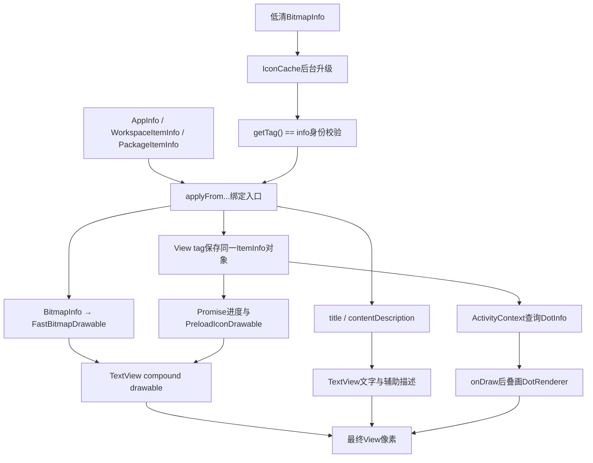
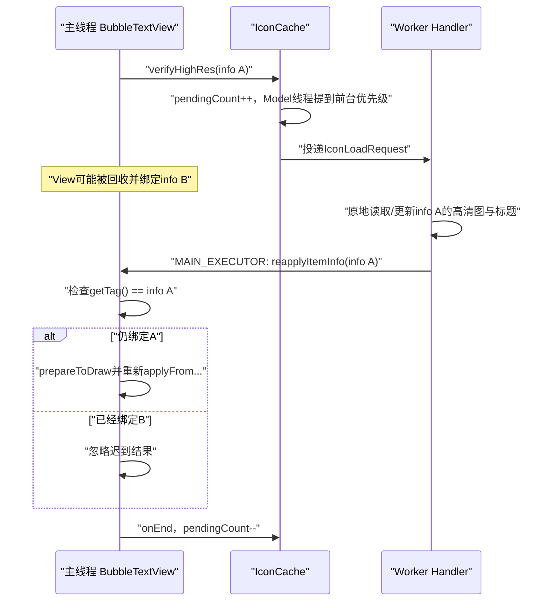
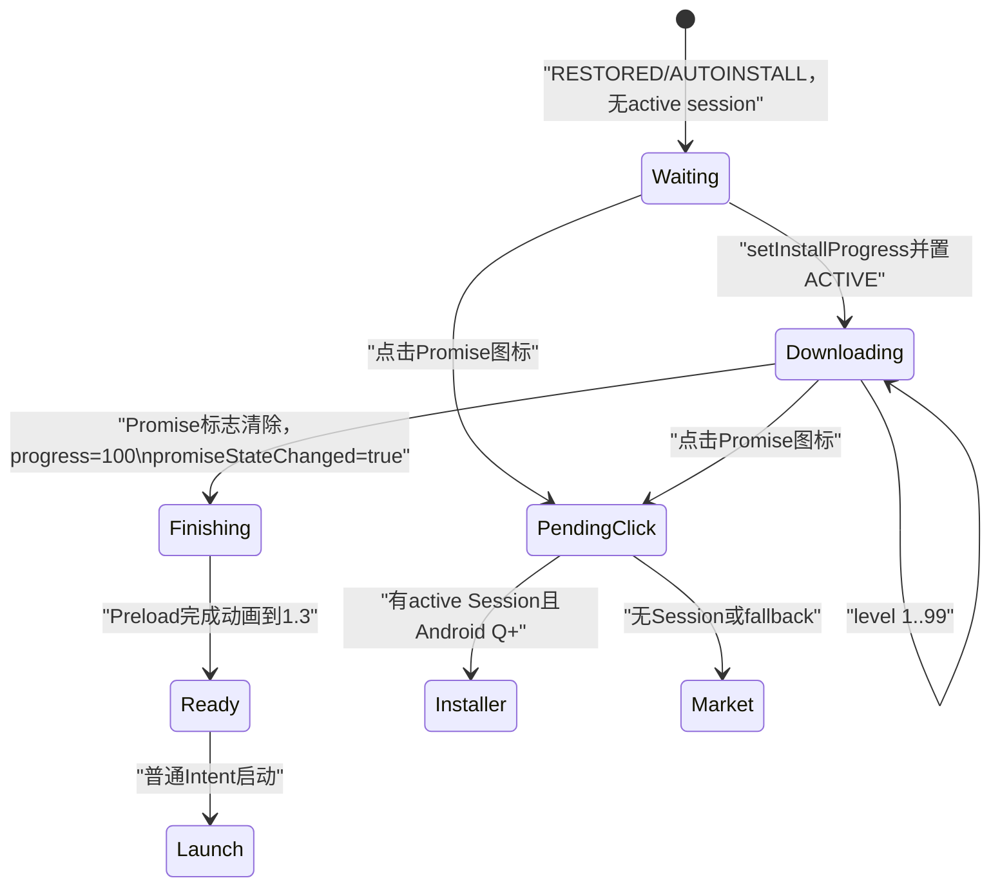

# 第519章 Android BubbleTextView：图标绑定、FastBitmapDrawable状态、Promise进度、标题布局、通知圆点和长按触摸链

> 源码基线：Android 11 / API 30 / `android-11.0.0_r48`。直接阅读 `packages/apps/Launcher3` 与 `frameworks/libs/systemui/iconloaderlib`，只读源码、不编译。核心文件：`BubbleTextView.java`、`FastBitmapDrawable.java`、`graphics/PreloadIconDrawable.java`、`CheckLongPressHelper.java`、`icons/IconCache.java`、`icons/DotRenderer.java`、`dot/DotInfo.java`、`model/data/ItemInfoWithIcon.java`、`model/data/WorkspaceItemInfo.java`、`touch/ItemClickHandler.java` 及相关布局资源。

## 1. 本章解决什么问题

Launcher桌面、All Apps和Folder中的应用图标看起来都像“图片加一行文字”，但同一个View还要处理低清图升级、安装进度、禁用滤镜、按压缩放、通知圆点、标题显隐、辅助功能和长按。若只把它当普通TextView，异步回绑串位、Promise完成态残留和拖拽快照带圆点等问题都很难解释。

## 2. 一句话定位

`BubbleTextView` 是把 `ItemInfoWithIcon` 投影成“可点击图标View”的装配点：TextView负责标题和compound drawable，`FastBitmapDrawable`负责图标像素与状态，`PreloadIconDrawable`在外层增加安装进度，`DotRenderer`额外叠画通知圆点，`CheckLongPressHelper`补充Launcher自己的长按时序。

## 3. 先分六本账

阅读时把数据对象、当前tag、真实`mIcon`、TextView当前compound drawable、通知`mDotInfo`和异步`mIconLoadRequest`分开。它们常指向同一业务项目，却不是同一生命周期；例如隐藏图标只换compound drawable，`mIcon`和tag仍保留。

## 4. 从数据到像素的总链路



## 5. 它继承TextView而不是自定义ViewGroup

类直接继承`TextView`，图标放在compound drawable的top或start位置，标题仍走TextView测量和绘制。通知圆点才在`super.onDraw()`之后自行画Canvas，因此它没有一个独立的ImageView子节点。

## 6. 类注释里的“文字气泡”是历史痕迹

注释仍说它要在文字后画bubble，但r48主体没有实现通用文字背景绘制；Workspace常用的`DoubleShadowBubbleTextView`主要增加阴影能力。阅读当前行为应以方法和布局为准，不能把旧注释当作现有绘制步骤。

## 7. 同一基类服务多种场景

`app_icon.xml`使用`DoubleShadowBubbleTextView`，`all_apps_icon.xml`和`folder_application.xml`直接使用BubbleTextView，深层快捷方式和Widget列表标题也通过横向图标模式复用它。所谓“应用图标View”其实也是Launcher的通用图标标签组件。

## 8. iconDisplay共有五个XML取值

属性枚举包含workspace=0、all_apps=1、folder=2、widget_section=3和shortcut_popup=4。Java只给前三种分别选择DeviceProfile规格；后两种走默认workspace图标尺寸，再由`iconSizeOverride`通常覆盖。

## 9. 三种主要display读取三套规格

Workspace使用`iconTextSizePx/iconDrawablePaddingPx/iconSizePx`，All Apps使用对应的allApps字段，Folder使用folderChild字段。它们都来自DeviceProfile，但不能假定数值相同。

## 10. 未识别display不是非法状态

构造函数的else分支明确服务widget selection和shortcut popup，只选择workspace默认图标尺寸，不主动设置文字大小和drawable padding。那些场景依赖XML style和显式属性补齐外观。

## 11. iconSizeOverride最后生效

`mIconSize`先选择display默认值，再用`getDimensionPixelSize`读取override。后续Drawable bounds、图标几何和部分拖拽区域围绕这个最终尺寸工作，而不是重新读取DeviceProfile默认值。

## 12. ActivityContext是能力入口

构造时用`ActivityContext.lookupContext(context)`取得宿主，而不是把Context强转为Launcher。通知数据、DeviceProfile、辅助功能代理和父级失效都从这个抽象入口获取，因此BubbleTextView也能出现在非Launcher ActivityContext场景。

## 13. 构造后的显示规格基本固定

`mDisplay`、`mLayoutHorizontal`和`mIconSize`都是final。DeviceProfile变化通常通过重建/重新inflate相关View体现；单纯替换ActivityContext里的Profile不会让已有BubbleTextView自动重算这些final字段。

## 14. 标题默认END截断，聚焦时MARQUEE

构造时`setEllipsize(END)`；获得焦点切到MARQUEE，失焦再回END。注释点出失焦禁用跑马灯还可避免更新文字引发额外重布局，键盘/遥控焦点与普通触摸展示因此可能不同。

## 15. 辅助功能代理有意拒绝外部覆盖

覆写的`setAccessibilityDelegate`只接受`LauncherAccessibilityDelegate`，RecyclerView等组件传入其它delegate会被静默忽略。这是针对b/129745295的保护，不是“从不设置辅助代理”。

## 16. reset只是圆点和背景的局部复位

`reset()`清DotInfo、dot颜色/动画/scale、force-hide和background，但不清tag、标题、contentDescription、`mIcon`、图标加载请求、stay-pressed或长按回调。All Apps回收后会紧接新绑定覆盖关键字段；若把reset当完整销毁接口单独调用，会留下旧状态。

## 17. 三个公开绑定入口各有侧重点

Workspace入口还处理Promise和dot；Application入口立即验证高清图、支持`PromiseAppInfo.level`并处理dot；Package入口绑定图标标题后立即验证高清图，但该方法本身不应用dot。三者最终复用`applyIconAndLabel`。

## 18. Workspace绑定不在方法内自动verifyHighRes

`applyFromWorkspaceItem`没有调用`verifyHighRes()`。Workspace/Folder的加载时机由外部绑定流程安排，例如FolderPagedView在特定阶段显式验证；不能由这一方法推断低清图永远不会升级。

## 19. Application绑定先设置tag再验证

`applyFromApplicationInfo`先创建图标标题，再`super.setTag(info)`，然后调用`verifyHighRes`。异步请求依赖tag身份做回绑保护，所以这一步顺序是正确性的组成部分。

## 20. PackageItemInfo没有通知点步骤

Widget列表分组等场景使用PackageItemInfo，通常只需要包图标和标题。若产品希望它显示通知点，必须另行定义item到DotInfo的语义，不能只期待`applyFromPackageItemInfo`自动完成。

## 21. 公共绑定首先总是创建新Drawable

`applyIconAndLabel`调用`FastBitmapDrawable.newIcon(context, info)`，设置基于BitmapInfo主色的柔和dot颜色，再调用`setIcon`和`setText`。重复绑定同一info通常也会产生一个新的Drawable状态对象，而Bitmap本身可以共享。

## 22. BitmapInfo不只是Bitmap

它还携带代表色、低清标志以及可选Factory语义。`newIcon`根据Factory、low-res或普通位图分别创建自定义Drawable、`PlaceHolderIconDrawable`或普通FastBitmapDrawable，所以看到字段名`bitmap`不能只理解成裸Bitmap。

## 23. 禁用状态从数据投影到Drawable

`newIcon(context, ItemInfoWithIcon)`创建后调用`drawable.setIsDisabled(info.isDisabled())`。`isDisabled`检查runtimeStatusFlags的多种禁用位，视觉滤镜和点击是否允许则分别由Drawable与ItemClickHandler处理，不能只看灰色外观决定业务可点性。

## 24. contentDescription为空时存在复用边界

公共绑定只在`info.contentDescription != null`时调用setContentDescription；而`reset()`也不清旧描述。正常模型通常提供描述，但若自定义ItemInfo给出null，回收View可能暂留前一项目的辅助描述，这是r48值得补防的边界。

## 25. Workspace的tag必须先于Promise计算

Workspace入口先`setTag(info)`，随后`applyPromiseState`从`getTag()`取回WorkspaceItemInfo。若颠倒顺序，复用View可能按旧tag计算安装状态，甚至给新图标套上旧项目的进度。

## 26. 绑定关键源码

```java
public void applyFromWorkspaceItem(WorkspaceItemInfo info,
        boolean promiseStateChanged) {
    applyIconAndLabel(info);
    setTag(info);
    if (promiseStateChanged || info.hasPromiseIconUi()) {
        applyPromiseState(promiseStateChanged);
    }
    applyDotState(info, false);
}

private void applyIconAndLabel(ItemInfoWithIcon info) {
    FastBitmapDrawable iconDrawable = newIcon(getContext(), info);
    mDotParams.color = IconPalette.getMutedColor(info.bitmap.color, 0.54f);
    setIcon(iconDrawable);
    setText(info.title);
    // 省略辅助描述分支
}
```

这里的`promiseStateChanged`只控制是否播放完成动效；只要仍有Promise UI，即便false也会设置当前进度。

## 27. tag同时是业务身份与异步代际门

BubbleTextView没有单独的bindGeneration整数，而是要求回调携带的`info`对象与当前tag引用完全相同。它比较`==`而不是内容相等，因此模型若复制出一个等价对象，旧请求也不会误绑到新对象。

## 28. verifyHighRes先取消旧请求

每次验证都先对已有`mIconLoadRequest.cancel()`并清引用，再检查当前tag是否是ItemInfoWithIcon且使用低清图。这样可减少无意义工作，但取消并不构成唯一安全保证。

## 29. 低清升级由IconCache原地更新info

后台任务对同一个AppInfo/WorkspaceItemInfo/PackageItemInfo调用`getTitleAndIcon(..., false)`，直接更新其title、bitmap等字段，再把同一对象送回主线程。它不是返回一个独立不可变Result。

## 30. 异步高清图回绑时序



## 31. pending计数还会改变模型线程优先级

第一个后台图标请求把MODEL_EXECUTOR线程优先级设为foreground；所有请求结束后恢复background。它优化可见图标延迟，但也意味着遗漏onEnd会影响后续模型任务调度。

## 32. HandlerRunnable.cancel不是线程中断

cancel只从Handler移除尚未运行的callback，标记canceled并调用onEnd；源码TODO还承认若Handler已经在运行，存在onEnd被调用两次的风险，不过`mEnded`当前会阻止endRunnable重复执行。它不会中止已经进入`run()`的图标查询。

## 33. IconLoadRequest.run没有检查isCanceled

r48匿名run实现无论cancel标志如何都会完成查询，并把回调投到MAIN_EXECUTOR。若任务已开始后才cancel，仍可能回调；所以“取消旧请求”主要节省未开始的任务，身份门才负责最终防串位。

## 34. MAIN_EXECUTOR负责重新触碰View

后台阶段修改数据对象，`caller.reapplyItemInfo(info)`被显式切回MAIN_EXECUTOR。不能在自定义IconCache逻辑中直接从worker调用TextView方法，否则会破坏View线程约束。

## 35. reapplyItemInfo只认对象身份

入口第一句语义是`if (getTag() == info)`。View已绑定B时，A的迟到回调只完成请求计数，不改图标；仍绑定A时才清`mIconLoadRequest`并重新选择具体绑定方法。

## 36. “同业务键”不等于“同一次绑定”

即便A和B代表相同package/user/component，只要对象实例不同，A回调不会覆盖B。这比比较包名更稳健，因为同组件的新模型对象可能已有更新的Promise、禁用或通知上下文。

## 37. mDisableRelayout用于替图优化

高清回绑前把它设true，普通setIcon内部也会在已有`mIcon`时短暂设true。覆写的`requestLayout`在该标志为true时吞掉请求，因为新旧图标bounds都固定为`mIconSize`，通常只需重绘。

## 38. reapplyItemInfo缺少try/finally

它在末尾才把`mDisableRelayout=false`。若`prepareToDraw`或某个apply方法异常，标志可能永久留true，使后续真实布局请求被忽略；正常AOSP路径假定这些操作不抛异常，自定义Drawable/数据扩展时应补finally。

## 39. prepareToDraw是RenderThread预热提示

Android N以后Bitmap的`prepareToDraw()`可提前上传/准备像素，降低下一帧第一次绘制开销。它不是Canvas draw，也不是“图标已经显示完成”的fence。

## 40. Workspace高清回绑额外失效父级

重新apply WorkspaceItemInfo后调用`mActivity.invalidateParent(info)`；AppInfo和PackageItemInfo没有这一步。原因是Workspace项目可能还参与FolderIcon等父级预览，更新独立BubbleTextView不足以刷新所有派生像素。

## 41. setIcon先改compound，后改mIcon

如果图标可见，方法先调用`applyCompoundDrawables(icon)`，再令`mIcon=icon`。因此`applyCompoundDrawables`检查的`mIcon != null`是“之前是否已有图标”，正好决定替换时能否抑制relayout。

## 42. 低清图使用PlaceHolderIconDrawable

`FastBitmapDrawable.newIcon`遇到`BitmapInfo.isLowRes()`不直接创建普通FastBitmapDrawable，而是Placeholder子类。BubbleTextView只依赖共同父类接口，高清回调后会整体换成新的真实Drawable。

## 43. FastBitmapDrawable只保存像素与轻量状态

核心字段是Bitmap、代表色、Paint、scale、alpha、pressed和disabled。它不知道标题、通知、ItemInfo容器或点击Intent，职责比BubbleTextView小得多。

## 44. draw只在scale不为1时包一层Canvas变换

缩放中心是Drawable bounds中心，然后调用`drawInternal`把Bitmap拉伸到bounds。PreloadIconDrawable覆写`drawInternal`即可在相同外层按压缩放下加入轨道与内部图标缩放。

## 45. pressed状态驱动1.1倍动画

`onStateChange`扫描`state_pressed`：按下以ACCEL在200ms内到1.1，释放且可见时以DEACCEL回1。动画改的是Drawable自身scale，不是BubbleTextView的View scale。

## 46. 不可见时释放会立即归一

若从pressed变为未pressed时Drawable不可见，源码不启动回弹动画，直接把mScale设1并invalidate。这样被隐藏/离屏的图标不会带着中间缩放再次出现。

## 47. getAnimatedScale名称容易误导

动画对象为空时它固定返回1，而`getScale()`才返回实际mScale。若外部用`setScale(0.9)`手动设置且没有Animator，`getAnimatedScale()`仍是1；该方法表达“当前按压动画尺度”，不是通用实际尺度。

## 48. setScale会取消按压Animator

拖拽快照前`resetIconScale()`调用它，清掉可能在途的按压反馈并强制为1。否则用户长按开始拖动时，DragView位图可能被采样成1.1倍。

## 49. 禁用滤镜是去饱和加提亮灰化

饱和度被降到0，RGB先乘0.5再加约127.5偏移，矩阵alpha项使用主题`disabledIconAlpha`。视觉灰色是ColorMatrix结果，不代表原Bitmap被修改。

## 50. 静态禁用滤镜存在主题复用边界

`sDisabledFColorFilter`是进程静态单例，却在第一次创建时读取某个Drawable实例的`mDisabledAlpha`。若不同Context/主题给出不同disabledIconAlpha，后续实例仍复用首个滤镜，这是r48潜在的跨主题陈旧状态。

## 51. setColorFilter被有意实现为空操作

外部调用Drawable标准`setColorFilter`不会改变FastBitmapDrawable，只有内部`updateFilter`直接操作Paint。通用图片框架若尝试给它着色会无效，不能把标准Drawable契约想当然套上。

## 52. ConstantState只复制三项

新Drawable共享Bitmap，并复制iconColor与disabled布尔值；alpha、scale、pressed、disabledAlpha和在途Animator不会继承。ConstantState代表可重建基础内容，不是运行时动画快照。

## 53. Drawable状态的三层缩放

从外到内依次是BubbleTextView的View scale（例如重排bounce）、FastBitmapDrawable的`mScale`（按压1→1.1）和PreloadIconDrawable的`mIconScale`（安装态0.6→1），最后才是Bitmap像素。三者可能相乘；排查图标大小不应只记录View的`scaleX`。

## 54. ACTION_DOWN落在padding区会整段拒绝

`shouldIgnoreTouchDown`用上下左右padding形成有效矩形。Down在外部时`onTouchEvent`直接false，后续事件也不会由该View持续消费，避免cell空白区域触发图标。

## 55. 有longClickable时始终保持事件流

BubbleTextView先调用`super.onTouchEvent(event)`，再交给LongPressHelper，最后无条件返回true。即便super对当前事件返回false，它仍要求父分发继续把后续MOVE/UP送来，以便自定义长按正确取消。

## 56. 这里不能用super返回值判断是否消费

长按可用时返回值被主动覆盖；不可长按时才原样返回super结果。因此调试触摸时要先检查`isLongClickable()`和Down位置，而不是只在TextView源码里找消费结论。

## 57. 默认长按时间是系统值的75%

`DEFAULT_LONG_PRESS_TIMEOUT_FACTOR=0.75f`，post延迟为`ViewConfiguration.getLongPressTimeout()*factor`。产品可通过BubbleTextView暴露的方法改变factor；负数或极端值没有本地钳位，调用者需保证合理。

## 58. 手写笔副键可立即触发

Down时若tool type为STYLUS且secondary button已按下，Helper在投递延时任务后立即尝试长按；MOVE期间按钮后来按下也能触发，但前提是待检查任务尚未被取消。

## 59. MOVE越界使用touch slop

它调用`Utilities.pointInView(view,x,y,mSlop)`，允许手指在边缘外小幅漂移；超过slop后取消pending callback。之后即使移回View也不会重新post，这是单向取消。

## 60. triggerLongPress有四道状态门

View必须仍有parent、持有window focus、本手势尚未成功长按，并满足“View当前未pressed或Helper配置了显式listener”。BubbleTextView构造Helper时没有显式listener，因此这一pressed条件应按运行时View状态核对，不能简单改写成“只要时间到了必触发”。

## 61. 只有handled=true才记成功

显式listener返回true或`performLongClick()`返回true后，Helper才清View pressed并令`mHasPerformedLongPress=true`。返回false不会被标成已执行，但本次callback仍被clear，也不会自动重试第二次。

## 62. UP、CANCEL和外部cancel都清任务

BubbleTextView覆写`cancelLongPress`，同时调用父类和Helper取消；Helper在UP/CANCEL也会取消。回收或父级拦截触摸时若不走正常UP，这个显式桥接能减少延迟Runnable作用于旧手势。

## 63. cancelLongPress会把成功标记也清false

`cancelLongPress()`不仅移除callback，还重置`mHasPerformedLongPress`。所以该布尔值只适合在当前手势尚未收口的窗口查询，不是历史统计。

## 64. 键盘抬键专门抑制pressed闪烁

`onKeyUp`临时令`mIgnorePressedStateChange=true`，调用TextView逻辑后再恢复并刷新DrawableState。键盘事件会立即传播pressed变化，源码用这层门避免点击处理尚未执行时图标先闪回普通尺寸。

## 65. stayPressed跨启动动画维持按压态

`mStayPressed`会在`onCreateDrawableState`额外合入pressed state。Launcher resume时清除它，确保Activity启动期间锁住的反馈不会在返回桌面后一直放大。

## 66. onVisibilityAggregated同步Drawable可见性

View聚合可见状态变化时调用`mIcon.setVisible(isVisible,false)`。这影响释放按压时选择动画还是直接归一，也避免不可见Drawable继续做无意义状态动画。

## 67. 标题颜色拆成基色和独立alpha

`mTextColor`保存调用者设置的基色，`mTextAlpha`保存Launcher动画透明度，真正传给TextView的是两者合成值。这避免开关标题时丢失主题色。

## 68. ColorStateList在半透明时会被压成单色

当textAlpha恰为1，`setTextColor(ColorStateList)`把完整状态列表交给父类；否则只用defaultColor计算一个int颜色。标题处于淡入淡出中时，pressed/focused等ColorState变化不会完整保留。

## 69. alpha为0使用真正透明色

源码不只把原颜色alpha乘0，而是直接返回`Color.TRANSPARENT`，注释说明这是为了避免高对比度模式仍画文字阴影。视觉隐藏必须同时考虑shadow，而不仅是字形填充。

## 70. Hotseat和预测Hotseat默认隐藏标题

`shouldTextBeVisible`只检查container是否为`CONTAINER_HOTSEAT`或`CONTAINER_HOTSEAT_PREDICTION`。它没有检查当前View是否实际位于Hotseat层级，语义来源是ItemInfo容器账。

## 71. FolderIcon标题要看父FolderInfo

当BubbleTextView的parent是FolderIcon时，方法读取父View的tag，而不是标题TextView自己的tag。FolderIcon内部标题子View未必绑定普通Shortcut ItemInfo，用父级FolderInfo才能正确判断它是否位于Hotseat。

## 72. setTextVisibility没有改View.visibility

它只把文字alpha设0或1，图标、点击区域、layout占位和辅助节点仍在。Popup预拖拽需要“图标显示但标题隐藏”时正是利用这一点。

## 73. createTextAlphaAnimator仍受容器门约束

即便传`fadeIn=true`，若`shouldTextBeVisible()`为false，目标alpha仍是0。关闭Popup不能把Hotseat标题误淡入出来。

## 74. 垂直居中是在onMeasure里改top padding

图标高度、compound padding和`ceil(fontMetrics.bottom-top)`组成内容高度，再用父测量规格中的height计算顶部padding。之后才交给TextView正常measure。

## 75. 高度不足时top padding可能为负

公式没有`max(0,...)`钳位。若父给定高度小于图标+文字内容，计算结果可为负；正常All Apps cell规格会保证空间，定制布局时需验证MeasureSpec。

## 76. 居中逻辑不对称修改bottom padding

它保留原bottom，只重写top，因此严格说是让内容起点按目标高度移动，而不是同时均分上下padding。反复measure会根据当前左右/bottom和新高度重算top，不会在旧top上累加。

## 77. getIconBounds是逻辑几何而非Drawable.getBounds

top取View paddingTop，left用`(viewWidth-iconSize)/2`，再形成固定正方形。横向layout也仍使用这个静态方法时要确认调用场景；普通圆点主要服务垂直Workspace/All Apps/Folder图标。

## 78. layoutHorizontal改变compound位置

横向时把Drawable放start，纵向时放top。它使用`setCompoundDrawablesRelative`处理RTL的start镜像；纵向仍用绝对top，无左右方向问题。

## 79. applyCompoundDrawables假定替换尺寸相同

每次先把bounds设为`mIconSize×mIconSize`，旧`mIcon`非null时吞掉setCompoundDrawables触发的requestLayout。若子类偷偷给新图标采用不同视觉外扩但仍报告同bounds，TextView布局不会为外扩重新留空间。

## 80. setIcon会同步初始Drawable可见状态

保存新mIcon后，根据windowVisibility和`isShown()`调用setVisible。新绑定到离屏/隐藏View的Drawable不会误以为自己可见；之后聚合可见回调继续维护。

## 81. setIconVisible(false)保留真实mIcon

它先重置真实FastBitmapDrawable的scale，然后把一个透明ColorDrawable设为compound drawable。`getIcon()`仍返回原Drawable，Promise、动画和FloatingIconView可以继续引用它；恢复时再把原mIcon放回。

## 82. 图标隐藏关键源码

```java
public void setIconVisible(boolean visible) {
    mIsIconVisible = visible;
    if (!mIsIconVisible) {
        resetIconScale();
    }
    Drawable icon = visible ? mIcon : new ColorDrawable(Color.TRANSPARENT);
    applyCompoundDrawables(icon);
}

private void setIcon(Drawable icon) {
    if (mIsIconVisible) {
        applyCompoundDrawables(icon);
    }
    mIcon = icon;
    if (mIcon != null) {
        mIcon.setVisible(getWindowVisibility() == VISIBLE && isShown(), false);
    }
}
```

隐藏期间发生重新绑定时，新的真实mIcon会更新但不会立刻装进TextView；恢复可见时会显示最新图标。

## 83. mIsIconVisible与View visibility是两层门

前者只控制compound drawable替身，文字仍可见；`View.INVISIBLE`则整个View不画且不参与命中。Popup预拖拽根据手指位置选择“只藏图标”或“图标文字全藏”。

## 84. DotInfo表达某项目当前通知集合

它保存NotificationKeyData列表和累计count，对相同key更新count，对删除key减count，查询数量最多返回999。BubbleTextView判断有没有点却只看`mDotInfo != null`，不是count是否大于0。

## 85. applyDotState先要求mIcon属于FastBitmapDrawable

透明替身不影响，因为真实mIcon仍保留；但若子类直接把mIcon换成非FastBitmapDrawable，dot数据、renderer和辅助描述都不会在该方法更新。这是类型门，不是仅绘制门。

## 86. All Apps使用独立DotRenderer规格

display等于ALL_APPS时选`mDotRendererAllApps`，其余包括Folder都选Workspace renderer。不同DeviceProfile图标尺寸需要不同预计算dot位置，不能拿同一renderer随意缩放复用。

## 87. dot颜色来源于图标代表色

绑定时用`IconPalette.getMutedColor(info.bitmap.color,0.54f)`写入DrawParams。DotRenderer画shadow bitmap后再以该色画实心圆，因此不同应用圆点可与图标色协调。

## 88. 只有有无状态异或才播放增删动画

`wasDotted ^ isDotted`且animate为true、View已shown时才animate。通知数量从1变2仍有dot，不会重播scale；隐藏View或初次静态绑定直接设置0/1。

## 89. dot动画没有显式duration

`ObjectAnimator.ofFloat`只设置Property和数值，未调用setDuration，因此使用平台ValueAnimator默认时长，通常为300ms。不能把FastBitmapDrawable的200ms按压时长套到圆点。

## 90. forceHide只屏蔽绘制，不删通知

设true只invalidate；设回false且仍有DotInfo时，强制从0到1播放出现动画。内部`mDotParams.scale`在隐藏期间可以仍是1，所以绘制总门必须同时看forceHide。

## 91. onDraw先画TextView再叠圆点

`super.onDraw`已经画背景、compound drawable、文字等，随后`drawDotIfNecessary`把圆点画在最上层。`drawWithoutDot`给需要复用本体绘制但排除圆点的调用者使用。

## 92. 圆点bounds还会做形状归一化缩放

先取得逻辑iconBounds，再围绕中心按`IconShape.getNormalizationScale()`缩放，目的是让圆点位置贴合归一化图标轮廓，而不只是原始mIconSize正方形角。

## 93. TextView滚动量需要反向补偿

TextView绘制compound drawable时内部坐标可能受scrollX/scrollY影响，圆点额外Canvas绘制前先translate正scroll，再画，再translate回来。缺这一步时MARQUEE或内部滚动会让圆点与图标错位。

## 94. DotRenderer位置来自IconShape路径

构造时以指向左上/右上的小三角与图标shape Path求交，取路径起点并归一化成0..1位置。圆点不是简单固定在bounds的(1,0)角，因此圆形、圆角方形等shape能得到更自然锚点。

## 95. DotRenderer还会防止阴影被Canvas裁掉

它读取当前clipBounds，根据左右对齐和顶部边界算offsetX/Y，把带shadow的bitmap整体移回可见区。随后在圆心处按`params.scale`缩放，scale=0时视觉消失但数据仍在。

## 96. 通知辅助描述有优先级

若ItemInfo禁用，先输出disabled label，即使有dot也不加通知数量；否则有dot时使用plural资源拼内容描述与count；无dot恢复原描述。这里视觉点和TalkBack文本由同一次applyDotState收口。

## 97. Promise UI由两个恢复标志定义

`WorkspaceItemInfo.isPromise()`要求RESTORED_ICON或AUTOINSTALL_ICON之一，`hasPromiseIconUi()`还排除SUPPORTS_WEB_UI。`FLAG_INSTALL_SESSION_ACTIVE`只表示已有活跃安装进度，不单独让普通项目变Promise。

## 98. applyPromiseState把状态压成0—100

仍是Promise且session active时取真实installProgress；Promise但无active session时取0，表示等待；已经不再Promise时取100。随后只有`promiseStateChanged=true`才尝试播放完成放大淡出动画。

## 99. Promise从模型到点击的完整链



## 100. applyProgressLevel负责视觉和辅助描述两本账

level>=100恢复原contentDescription；0<level<100显示“正在下载+百分比”；level<=0显示等待下载。之后才复用或创建PreloadIconDrawable，mIcon为null时只改描述并返回null。

## 101. 首次进入Promise会整体替换Drawable

若当前mIcon不是PreloadIconDrawable，就以当前ItemInfo新建Pending Drawable、setLevel并`setIcon`；已经是Preload则原地更新level，避免每个进度回调重建轨道和Animator。

## 102. level变化是否动画取决于bounds

Preload的`onLevelChange`把整数乘0.01；只有`getBounds().width()>0`才对增长进度做动画。尚未绑定bounds时直接跳目标，防止无尺寸Drawable创建无意义Animator。

## 103. 进度与完成动效使用同一内部标尺

0..1代表下载比例；1..1.3代表完成阶段。增长时duration为内部差值×500ms，所以20%进到60%约200ms，完成1到1.3约150ms；回退进度被强制不动画。

## 104. 三段视觉状态必须分开

progress<=0时图标0.6倍、禁用并显示轨道shadow；0<progress<1时仍0.6倍且绘制进度段；1到1.3恢复项目真实disabled状态、轨道alpha渐隐并把图标放大到1；完成后`mRanFinishAnimation`使drawInternal只画普通图标。

## 105. setLevel(100)不等于完成态已收口

level=100只把内部进度设到1，`mRanFinishAnimation`仍可能false，Drawable仍走进度绘制分支。只有`maybePerformFinishedAnimation()`到1.3并在Animator end中置true，之后才完全退化为普通图标绘制。

## 106. 取消完成Animator也会触发end边界

ObjectAnimator.cancel通常先发cancel再发end，而源码只监听onAnimationEnd并直接令`mRanFinishAnimation=true`。若完成动画中途被后续更新取消，可能提前被标为完成；正常安装进度单调且完成后不再回退，降低了实际触发概率。

## 107. 进度Path对回退/改bounds存在审计点

0<progress<1时`PathMeasure.getSegment`向`mScaledProgressPath`追加，却未先reset；progress<=0重置的是`mScaledTrackPath`而非progress path。正常单调增长时长段覆盖短段视觉通常不明显，但进度回退或bounds变化可能残留旧几何，这是依据r48实现推导的潜在缺口。

## 108. Preload阴影缓存按尺寸和shape复用

静态SparseArray key用`(width<<16)|height`，缓存值以WeakReference持有Path与Bitmap，并额外比较shape Path。宽高超过16位或key碰撞理论上可能互相覆盖，但Launcher图标尺寸远小于该范围；弱引用允许内存紧张时回收。

## 109. Promise点击不会直接启动占位Intent

ItemClickHandler看到BubbleTextView且`hasPromiseIconUi()`时，提取包名进入pending item逻辑：下载已开始就优先打开Installer Session详情，失败或无Session再打开市场；未开始会弹框让用户搜索市场或清理废弃Promise。

## 110. 拖拽区域有两套图标尺寸语义

`getWorkspaceVisualDragBounds`总用workspace iconSize；`getSourceVisualDragBounds`按display选择，All Apps用allApps尺寸，但Workspace和Folder都回到workspace iconSize，而不是folderChildIconSize。这反映拖拽目标视觉规范，不能等同于当前compound drawable bounds。

## 111. prepareDrawDragView的恢复责任很特殊

它重置真实图标按压scale并`setForceHideDot(true)`，返回的SafeCloseable却是空操作。DragPreviewProvider的try-with-resources不会自动恢复dot；后续拖拽/Popup/FloatingIcon生命周期必须显式调用`setForceHideDot(false)`。PredictedAppIcon覆写close只恢复自己的ring标志，也沿用父类这一圆点语义。

## 112. macOS只读练习一：手推一次回收串位

只读列出All Apps View先绑定低清info A、发起请求、被回收后reset并绑定B、A worker已开始、B再发请求、A/B主线程回调的所有tag、mIcon、compound drawable和request字段。分别推演A在cancel前未开始、已经开始、回调早于/晚于B三种顺序，说明身份比较如何阻止串位以及reset为何不是主保护。

## 113. macOS只读练习二：手算三层缩放与标题布局

任选DeviceProfile中的workspace/allApps/folder图标、文字和padding数值，计算centerVertically的cellHeight/topPadding、逻辑iconBounds和dot归一化bounds；再令View reorder scale=0.95、pressed scale=1.1、Promise iconScale=0.6，计算最终相对Bitmap尺度，并验证三者属于不同对象。

## 114. macOS只读练习三：推演Promise状态机

构造等待0%、下载1%→40%→100%、Promise标志清除且promiseStateChanged true、完成动画中被一次90%更新取消的序列。逐步记录contentDescription、Drawable类型、level、internalProgress、trackAlpha、iconScale、disabled和mRanFinishAnimation，并指出哪些是正常产品序列、哪些是故障注入边界。

## 115. macOS只读练习四：审计触摸与圆点

分别从padding内外Down、轻微/越slop MOVE、手写笔副键、长按listener返回false、Popup强制隐藏dot、通知count 1→2→0出发，记录BubbleTextView返回值、pending Runnable、pressed Drawable scale、DotInfo、dotScale、forceHide和辅助描述，验证“视觉不可见”不等于“数据已删除”。

## 116. 易错点一：reset不是完整回收清理

它没有取消IconLoadRequest也没有清tag/文字/描述/真实图标。正确理解是“重置All Apps绑定间容易残留的圆点与背景状态”，完整安全依赖随后绑定覆盖字段、verifyHighRes取消请求以及回调身份门共同完成。

## 117. 易错点二：透明compound drawable不等于mIcon为空

`setIconVisible(false)`保留真实mIcon，`getIcon()`、applyProgressLevel和applyDotState仍围绕它工作。调试“看不见图标”时应同时检查mIsIconVisible、compound drawable、View visibility、Drawable alpha和真实mIcon可见状态。

## 118. 易错点三：进度100不等于普通图标

数据progress、Drawable level、internalProgress和mRanFinishAnimation是四个状态。100只把下载段推到1，完成动画再从1走到1.3，Animator end才切普通draw分支；页面离屏、取消或状态changed参数都可能改变收口方式。

## 119. 源码审计时优先看这些薄弱边界

关注null contentDescription在复用View残留、reset不取消加载、HandlerRunnable开始后取消仍回调、reapply缺finally、静态disabled滤镜跨主题、Preload progress Path未清、完成Animator取消即end、prepareDrawDragView不恢复dot，以及Folder拖拽源bounds使用workspace尺寸。它们多是正常时序假设，不应全部直接定性为线上bug。

## 120. 本章总结与下一章

BubbleTextView的核心不是“画一张图”，而是用tag把模型身份、Drawable状态、异步请求、Promise、dot、文字与手势临时聚合，并在View复用中防止旧结果覆盖新项目。下一章进入All Apps界面，精读`AllAppsContainerView`、`AlphabeticalAppsList`、`AllAppsGridAdapter`与`AllAppsRecyclerView`如何把应用库存变成分段列表、搜索结果、滚动位置和可复用BubbleTextView。
