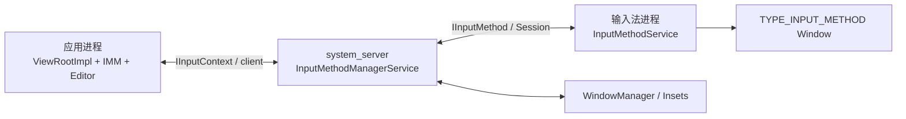
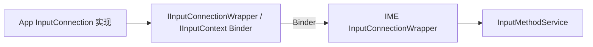
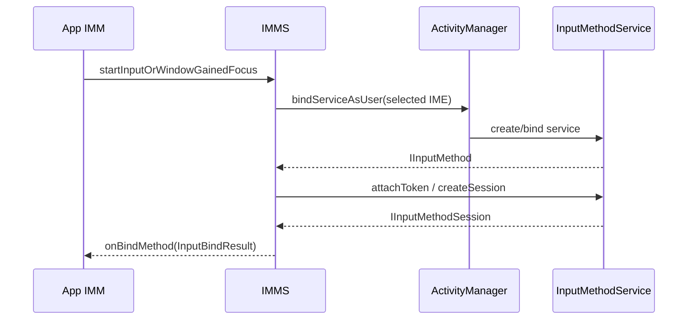
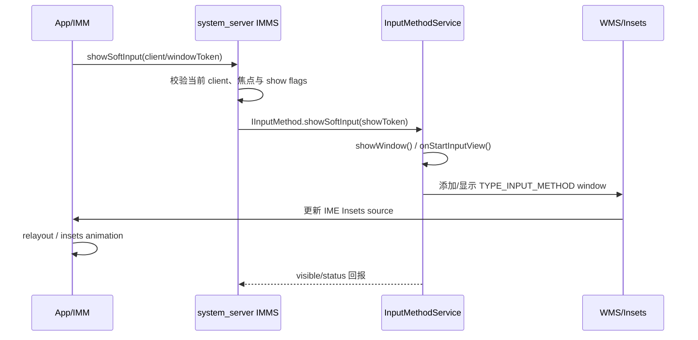
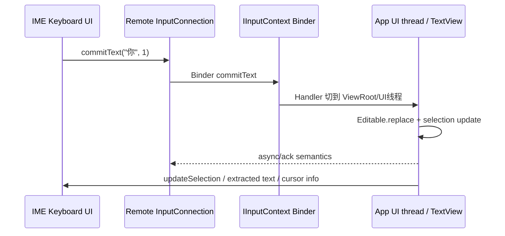

# 52 InputMethodManagerService、InputMethodService 与软键盘显示链路

> 源码版本：Android 11 / API 30 / `android-11.0.0_r48`  
> 学习方式：macOS 只读源码，不要求编译。  
> 本章目标：理解一个 EditText 获得焦点后，应用、system_server 与输入法进程如何建立输入连接、显示 IME 窗口，并把候选文字提交回编辑器。

---

## 1. 先看完整答案

点击输入框后，并不是 EditText 自己创建软键盘：

```text
View 获得输入焦点
→ ViewRootImpl/InputMethodManager 检查 served view
→ View.onCreateInputConnection() 产生 EditorInfo + InputConnection
→ IMMS 验证窗口焦点与调用身份
→ 选择并绑定当前 InputMethodService
→ 创建 IInputMethodSession
→ IME 收到 startInput(EditorInfo, remote InputConnection)
→ 系统决定是否 showSoftInput
→ InputMethodService 创建/显示 IME Window
→ 用户点击键盘
→ IME 调用 InputConnection.commitText()
→ 请求跨 Binder 回到应用 UI 线程
→ Editable 更新、光标变化，再通知 IME
```

这条链同时包含焦点、服务绑定、输入会话、文本协议、窗口显示和 Insets 六套机制。

---

## 2. 三个主要进程



- 应用进程：拥有真实 TextView、Editable 和 InputConnection 实现；
- system_server：验证焦点、选择 IME、绑定服务、管理 client/session/token/可见性；
- IME 进程：绘制键盘、组合输入、候选栏并通过 InputConnection 编辑文本。

---

## 3. 核心源码入口

### system_server

```text
frameworks/base/services/core/java/com/android/server/inputmethod/InputMethodManagerService.java
frameworks/base/services/core/java/com/android/server/inputmethod/InputMethodUtils.java
frameworks/base/services/core/java/com/android/server/inputmethod/InputMethodSubtypeSwitchingController.java
```

### 应用侧

```text
frameworks/base/core/java/android/view/inputmethod/InputMethodManager.java
frameworks/base/core/java/android/view/inputmethod/InputConnection.java
frameworks/base/core/java/android/view/inputmethod/BaseInputConnection.java
frameworks/base/core/java/android/view/inputmethod/EditorInfo.java
frameworks/base/core/java/com/android/internal/view/IInputConnectionWrapper.java
```

### 输入法侧

```text
frameworks/base/core/java/android/inputmethodservice/InputMethodService.java
frameworks/base/core/java/android/inputmethodservice/IInputMethodWrapper.java
frameworks/base/core/java/android/inputmethodservice/IInputMethodSessionWrapper.java
frameworks/base/core/java/android/inputmethodservice/SoftInputWindow.java
```

---

## 4. 五个容易混淆的对象

| 对象 | 所在端 | 作用 |
|---|---|---|
| `InputMethodManager` | 应用进程 | 跟踪 served View，与 IMMS 通信 |
| `InputMethodManagerService` | system_server | 全局协调、选择、绑定、安全和显示决策 |
| `InputMethodService` | IME 进程 | 键盘 UI 与输入法逻辑 |
| `InputConnection` | 编辑器语义在应用侧实现 | 让 IME 查询和修改文本 |
| `InputMethodSession` | IME 为某 client 建立 | 接收 selection、cursor、app private command 等会话事件 |

`InputConnection` 和 `InputMethodSession` 方向相反：前者让 IME 操作 App，后者让 App/系统通知 IME。

---

## 5. 输入法如何声明与发现

IME App 声明 Service：

```xml
<service
    android:name=".MyImeService"
    android:permission="android.permission.BIND_INPUT_METHOD"
    android:exported="true">
    <intent-filter>
        <action android:name="android.view.InputMethod" />
    </intent-filter>
    <meta-data
        android:name="android.view.im"
        android:resource="@xml/method" />
</service>
```

IMMS 经 PMS 查询 `android.view.InputMethod` 服务，用 `InputMethodInfo` 解析 subtype、settings activity、supportsSwitchingToNextInputMethod 等信息。

`BIND_INPUT_METHOD` 防止普通 App 冒充系统绑定者。已安装、已启用、当前选中、已经绑定是四个不同状态。

---

## 6. Input Method 与 Subtype

InputMethod 表示输入法服务，例如某键盘 App。Subtype 表示其语言/模式，例如：

```text
中文拼音键盘
英文 QWERTY
语音输入
手写模式
```

系统按用户保存 enabled IMEs、selected IME、selected subtype 和历史。切 subtype 不一定重启整个 IME 进程，但会触发配置和输入视图更新。

---

## 7. 四种状态不能合并

### 输入焦点

哪个 View 接收键盘输入。

### 窗口焦点

哪个 Window 是 WMS 认可的输入目标。

### 输入连接已建立

IMM/IMMS/IME 当前针对哪个 EditorInfo 与 InputConnection 工作。

### IME 可见

键盘窗口是否显示并参与 Insets。

可能出现：输入框有焦点但 IME 隐藏；IME 已绑定但没有 active editor；窗口刚切换而旧输入连接尚在清理。

---

## 8. served View 与 next served View

应用侧 IMM 维护类似：

- `mServedView`：当前向输入法提供服务的 View；
- `mNextServedView`：焦点变化后计划成为 served 的 View；
- `mServedInputConnectionWrapper`；
- `mCurrentTextBoxAttribute`；
- 当前 method session 与 bind sequence。

View focus 变化常先更新 next served，再由 `checkFocus()`/主线程消息完成切换。这样可把焦点变更与 startInput 串行化，减少旧 View 和新 View 竞态。

---

## 9. 从焦点到 `onCreateInputConnection()`

一个 View 成为文本编辑目标时：

1. WMS 确认应用窗口获得焦点；
2. ViewRootImpl 通知 IMM；
3. IMM 在 ViewRoot 的 Handler/UI 线程执行 `startInputInner()`；
4. 创建空 `EditorInfo`；
5. 调用 `servedView.onCreateInputConnection(editorInfo)`；
6. 包装返回的 InputConnection；
7. 调用 IMMS `startInputOrWindowGainedFocus()`。

为什么必须 UI 线程？因为真实编辑器、selection 和 Editable 属于 View 线程，不能让 Binder 线程直接并发修改。

---

## 10. EditorInfo 是什么

`EditorInfo` 是编辑器给 IME 的“字段说明书”：

- `inputType`：文本、数字、电话、密码及 flags；
- `imeOptions`：Done、Next、Search、NoFullscreen 等；
- packageName、fieldId、fieldName；
- initial selection；
- hintText、label；
- privateImeOptions；
- contentMimeTypes；
- surrounding text（版本/API 支持范围内）。

它是快照。字段内容或焦点变化后，通常需要 restartInput 或新一轮 startInput 才得到新配置。

---

## 11. InputConnection 是什么

它是 IME 操作编辑器的语义接口：

```text
getTextBeforeCursor / getTextAfterCursor
getSelectedText
setSelection
setComposingText / finishComposingText
commitText
deleteSurroundingText
performEditorAction
sendKeyEvent
commitContent
```

IME 不应假设目标是 EditText。WebView、自定义编辑器和远程/虚拟编辑器都可提供自己的实现。

---

## 12. InputConnection 为什么不是直接对象引用

IME 在另一个进程，无法持有应用 View。应用的 InputConnection 被 `IInputConnectionWrapper` 包装为 Binder `IInputContext`；IME 侧再由 `InputConnectionWrapper` 还原为 Java 接口外观。



Wrapper 负责线程切换、方法兼容、连接失活判断和异步回调。

---

## 13. `startInputOrWindowGainedFocus()` 为什么合并两个入口

焦点事件和编辑器重启可能几乎同时发生。IMMS 需要在一个受锁保护的入口中统一判断：

- calling client 是否注册；
- client UID/PID/display 是否匹配；
- windowToken 是否有焦点；
- softInputMode/window flags；
- EditorInfo.packageName 是否属于 calling UID；
- 这是仅窗口获得焦点，还是要真正 startInput；
- 当前 IME 是否已绑定；
- 是否需要创建新 session；
- 是否自动显示/隐藏。

这避免任何后台 App 只靠传一个 window token 就控制键盘或连接别人的编辑器。

---

## 14. `EditorInfo.packageName` 为什么要校验

应用可自行填写 EditorInfo。如果不校验，它可谎称编辑器属于另一个包，影响 IME 的安全决策、日志或 package-specific behavior。

IMMS 通过 PMS/UID 检查 packageName 是否属于 Binder calling UID，不匹配时返回 `INVALID_PACKAGE_NAME` 类 `InputBindResult`。

这里再次体现：Parcelable 字段是请求数据，不是身份凭证。

---

## 15. Client 注册

每个应用进程的 IMM 会向 IMMS `addClient()`，提供：

- `IInputMethodClient` callback；
- `IInputContext`；
- uid、pid、displayId 等服务端记录。

IMMS 保存 ClientState，用于：

- 校验后续调用来源；
- 回调 bind/unbind/setActive；
- 管理当前 session；
- client Binder 死亡时清理；
- 防止跨 display/跨 client 窃取输入连接。

---

## 16. IME 服务绑定主链

当前选中 IME 尚未连接时，IMMS：

1. 根据 selected method ID 找 `InputMethodInfo`；
2. 构造显式 Intent；
3. `bindServiceAsUser()`；
4. 创建/更新 method token；
5. 服务进程启动，`IInputMethodWrapper` 暴露 Binder；
6. `onServiceConnected()` 保存 `IInputMethod`；
7. 调用 `initializeInternal()`/attach token；
8. 请求 IME 为当前 client 创建 session。



---

## 17. method token 是什么

IMMS 创建 Binder token，并注册给 WMS。IME 用它创建 `TYPE_INPUT_METHOD` 窗口，证明自己是当前被系统授权的输入法。

普通 App 即使声明同样窗口类型，没有有效 token 也不能添加 IME 窗口。

切换/解绑输入法时，旧 token 和窗口能力会被撤销，防止旧 IME 继续显示系统级键盘窗口。

---

## 18. InputMethodSession 的作用

IME 为 client 创建 session，经 `IInputMethodSession` 返回 system_server/app。它处理：

- `updateSelection()`；
- `updateCursor()` / `updateCursorAnchorInfo()`；
- `displayCompletions()`；
- `appPrivateCommand()`；
- `viewClicked()`；
- `finishInput()`；
- toggle/show/hide 等会话事件。

Session 可以 enabled、disabled、revoked。新 client 激活时旧 session 会禁用，避免两个编辑器同时驱动同一 IME 状态。

---

## 19. InputBindResult 包含什么

IMMS 对 startInput 返回/回调的结果通常包含：

- result code；
- `IInputMethodSession`；
- InputChannel；
- 当前 IME id；
- sequence number；
- matrix/辅助信息。

如果 IME 尚在绑定，可能先返回等待状态，稍后经 `IInputMethodClient.onBindMethod()` 异步完成。

sequence 用于丢弃旧绑定结果：焦点已切到新 View 后，迟到的旧 session 不能覆盖当前状态。

---

## 20. `startInput` 与 `restartInput` 区别

### startInput

通常由新 editor/focus 建立输入。

### restartInput(view)

编辑器仍可能是同一个 View，但其输入语义已大幅变化，需要重新调用 `onCreateInputConnection()` 并把新的 EditorInfo/InputConnection 交给 IME。

适用场景：

- inputType/imeOptions 改变；
- 编辑器内部模型整体替换；
- InputConnection 实现失效；
- WebView/自定义编辑器上下文切换。

普通文本每次变化不应 restartInput，否则会清组合态、重建连接并造成键盘闪烁。

---

## 21. IME 侧 startInput 生命周期

`IInputMethodWrapper` 把 Binder 请求切到 IME 主线程，并构造远程 `InputConnectionWrapper`。`InputMethodService.doStartInput()` 更新：

```text
mStartedInputConnection
mInputEditorInfo
```

然后调用：

```text
onStartInput(EditorInfo, restarting)
```

若输入视图已显示，还会调用：

```text
onStartInputView(EditorInfo, restarting)
```

前者表示开始为编辑器输入；后者表示键盘输入 View 开始服务该编辑器。键盘隐藏时可能只有前者。

---

## 22. InputMethodService 的 UI 组成

典型区域：

- input view：主键盘；
- candidates view：候选词；
- extract view：横屏全屏编辑模式；
- fullscreen area；
- `SoftInputWindow`：承载这些 View 的 Dialog/Window。

常见回调：

```text
onCreateInputView()
onCreateCandidatesView()
onStartInput()
onStartInputView()
onFinishInputView()
onFinishInput()
onWindowShown()/onWindowHidden()
```

创建 View 与每次开始输入不同，IME 应复用 UI，并根据 EditorInfo 更新布局。

---

## 23. Show 请求的三条来源

### App 主动请求

```java
imm.showSoftInput(view, flags);
```

### Window/focus 自动策略

`windowSoftInputMode`、forward navigation、新 editor、硬件键盘状态等使 IMMS 自动决定显示。

### IME 自己请求

```java
requestShowSelf(flags);
```

三者最终都需要 IMMS 验证当前 client/editor/token，IME 不能绕过系统任意覆盖其他窗口。

---

## 24. 为什么 `showSoftInput()` 经常返回 true 却没显示

返回值通常更接近“请求被接受/发送”，不是“键盘 Surface 已经出现在屏幕”。失败或延迟原因包括：

- View 尚未连接 Window；
- View 不是当前 served editor；
- Window 未获 WMS focus；
- 调用发生在焦点提交前；
- 硬件键盘/策略决定不显示；
- 当前 IME 尚在绑定；
- 用户/显示屏不匹配；
- hide 请求或窗口切换覆盖了 show；
- Insets animation 尚未完成。

“请求成功”和“可见完成”必须分开观察。

---

## 25. 显示键盘完整链路



Android 11 正处于从传统 adjustResize/adjustPan 走向 Insets source consumer/control 的过渡阶段，因此源码里会同时看到旧新路径。

---

## 26. 显式、隐式与强制显示标志

显示状态会记录请求强度：

- 隐式显示：焦点/导航自然触发，可被 `HIDE_IMPLICIT_ONLY` 隐藏；
- 显式显示：App/用户明确请求；
- forced：历史兼容语义，更难被普通隐式 hide 清除。

IMMS 用诸如 `mShowRequested`、`mShowExplicitlyRequested`、`mShowForced` 追踪原因。只看 IME Window 当前 visible，无法解释下一次 hide 为什么被忽略。

---

## 27. Hide 主链

App 调用：

```java
imm.hideSoftInputFromWindow(windowToken, flags)
```

IMMS 验证 token/client 与 hide flags，调用当前 `IInputMethod.hideSoftInput()`；IME 执行 `hideWindow()`，结束 input view，WMS 更新 IME Insets 可见性，App 窗口重新布局。

隐藏键盘通常不立即销毁 IME 服务，也不一定 finishInput。输入连接可继续存在，以便快速再次显示。

---

## 28. 绑定、输入、显示的正交关系

| 状态 | 例子 |
|---|---|
| 已绑定、无输入 | IME 进程保活，但当前没有 editor |
| 已绑定、已输入、隐藏 | 输入框仍焦点，硬件键盘输入或用户收起软键盘 |
| 已绑定、已输入、显示 | 正常软键盘输入 |
| 正在绑定、输入待定 | App 已提交 editor，等待 IME service/session |

所以排查“键盘没显示”不能只问“IME 服务连上了吗”。

---

## 29. 输入一个字符的回程链路

用户在 IME 点击“你”：



输入法通常不向应用伪造 KeyEvent，而应优先使用 InputConnection 的语义 API。

---

## 30. Composing Text 是什么

中文拼音输入 `ni` 时，编辑器中可能显示带下划线的组合文本：

```text
setComposingText("ni")
setComposingRegion(...)
finishComposingText()
commitText("你")
```

Composing 表示尚在 IME 编辑中的临时范围。候选改变时可反复替换，而不作为多个最终字符提交。

焦点切换、restartInput、finishInput 或编辑器不当修改 selection 都可能打断组合态。

---

## 31. `newCursorPosition` 容易误解

`commitText(text, newCursorPosition)` 第二个参数不是绝对光标位置，而是相对新插入文本边界的偏移：正值相对文本末尾，非正值相对文本开头，具体计算遵循 InputConnection 契约。

自定义 InputConnection 若把它当绝对 index，会出现光标跳动、重复文本和候选错位。

---

## 32. Editor Action

EditorInfo 可声明：

```text
IME_ACTION_DONE
IME_ACTION_NEXT
IME_ACTION_SEARCH
IME_ACTION_SEND
IME_ACTION_GO
```

IME action 键调用：

```java
inputConnection.performEditorAction(actionId);
```

TextView 再触发 `OnEditorActionListener` 或默认焦点/提交行为。

它不同于发送 Enter KeyEvent；多行文本、`IME_FLAG_NO_ENTER_ACTION` 和应用监听器会决定最终行为。

---

## 33. selection 如何反馈给 IME

App 文本或选择变化后，IMM 通过当前 `IInputMethodSession.updateSelection()` 通知 IME：

```text
oldSelStart/oldSelEnd
newSelStart/newSelEnd
candidatesStart/candidatesEnd
```

IME 用它判断用户是否移动光标、组合区是否仍有效、候选是否应重算。

为了避免回环和无效 Binder，IMM 缓存上次 selection/cursor 状态，只在变化且 session active 时发送。

---

## 34. CursorAnchorInfo

需要候选窗跟随光标或手写定位时，IME 请求 cursor updates。App 通过 IMM 发送 `CursorAnchorInfo`：

- selection；
- composing text；
- character bounds；
- insertion marker；
- editor 到屏幕坐标矩阵；
- visible/invisible region flags。

跨窗口移动、缩放、滚动后矩阵必须更新，否则候选浮窗会错位。

---

## 35. InputChannel 的用途

InputBindResult 中可带 InputChannel，用于 App 与 IME session 之间高效传递某些输入事件。它不是 InputConnection 文本协议的替代品。

```text
InputConnection：查询/编辑文本的语义命令
InputChannel：输入事件传输通道
```

大量普通文字输入应走 commit/composing API，而不是逐键模拟硬件按键。

---

## 36. IME Window 为什么特殊

`SoftInputWindow` 使用 `TYPE_INPUT_METHOD`，由 method token 授权。WMS 会把 IME 与当前输入目标关联，并控制：

- Z-order；
- 焦点/可触摸属性；
- target window；
- display；
- Insets source；
- 切换和动画；
- 导航栏配合。

IME Window 通常不夺走应用的输入焦点，否则编辑器失焦会立即终止输入；它以特殊窗口语义显示在目标应用之上/旁边。

---

## 37. `adjustResize`、`adjustPan` 与 Insets

传统 `windowSoftInputMode`：

- `adjustResize`：减小应用可用内容区；
- `adjustPan`：平移窗口保证编辑器可见；
- `adjustNothing`：不自动调整。

新 Insets 模型中 IME 作为一种 Insets source，App 可监听 `WindowInsets.Type.ime()` 并控制动画。Android 11 同时保留兼容逻辑，所以实际行为还受 targetSdk、窗口 flags、edge-to-edge 与 `ViewRootImpl.sNewInsetsMode` 影响。

---

## 38. IME 的 `onComputeInsets()`

InputMethodService 可报告：

- contentTopInsets；
- visibleTopInsets；
- touchableInsets；
- touchableRegion。

这决定 IME 窗口哪部分被视为内容、可见和可触摸。例如悬浮候选栏可只让实际键盘区域拦截触摸，其他区域让事件落到背后的应用。

它与“IME 给 App 造成的 WindowInsets”相关但不是完全相同的 API 层。

---

## 39. 全屏 Extract Mode

在小屏/横屏时，IME 可进入 fullscreen extract mode，把编辑器文本提取到 IME 自己的 `ExtractEditText` 中。

IME 调用 `getExtractedText()` 并监听更新；用户在 extract view 编辑，再通过 InputConnection 回写真实 App。

App 可通过 `IME_FLAG_NO_EXTRACT_UI` 请求不使用，但最终还受 IME 和设备布局策略影响。

---

## 40. `commitContent()` 与 URI 权限

IME 可提交图片等富内容：

```text
InputContentInfo(contentUri, description, linkUri)
→ InputConnection.commitContent()
```

因为 content URI 属于 IME/Provider，目标 App 需要临时读取权限。IMMS 提供 token handler，在当前 IME、目标 package/user 和 content URI 之间授予受控临时权限。

EditorInfo 的 `contentMimeTypes` 表示编辑器接受哪些类型。IME 不应向不支持的 editor 强塞内容。

---

## 41. 密码字段的边界

EditorInfo 会告诉 IME 当前是 password 类型，以便关闭个性化学习、建议或全屏提取。系统也限制某些 surrounding text 暴露。

但第三方 IME 本质上参与用户输入，理论上能看到用户按下的字符。因此选择 IME 是高度信任决策；系统会对新 IME 显示风险提示，设备策略也可限制允许输入法。

应用不能仅靠 `inputType=password` 防御恶意输入法，应结合服务端认证、避免记录敏感内容并使用安全 UI/硬件确认等措施。

---

## 42. 硬件键盘存在时

输入连接仍可能建立，IME 进程也可能绑定，但软键盘是否显示取决于用户“物理键盘连接时显示屏幕键盘”设置和 IMMS 策略。

硬件 KeyEvent 通常由 InputDispatcher 直接到应用窗口；IME 可通过 session/输入通道参与部分处理，但文本编辑器仍用 InputConnection 与 IME 同步状态。

“键盘不显示”可能完全是正常硬件键盘策略。

---

## 43. 多用户与多显示屏

输入法设置按用户保存。用户切换时 IMMS：

- 重建 enabled/selected IME 列表；
- 解绑旧用户 IME；
- 清旧 client/session/show 状态；
- 为新用户选择合法 IME；
- 更新 subtype 与 Settings observer。

每个 client 有 displayId。IMMS/WMS 校验 editor window、IME display 和 fallback display，防止一个 display 的 client 控制另一个 display 的输入目标。

---

## 44. Binder 死亡与竞态

### App client 死亡

移除 ClientState、finish input、禁用 session，必要时隐藏 IME。

### IME 进程死亡

清除 method/session，撤销 token/窗口，重新绑定当前 selected IME。

### 焦点快速变化

sequence、served/next served、window token 和当前 client 校验共同丢弃迟到请求。

### 旧 InputConnection

Wrapper 标记 inactive；后续 commit/query 返回失败或默认值，不能继续编辑新字段。

---

## 45. 常见“键盘不弹”排障表

| 现象 | 优先检查 |
|---|---|
| `showSoftInput()` 无效果 | View attached/focused、window focus、served view、调用时机 |
| 只在第二次点击弹出 | 第一次请求发生在焦点/窗口提交之前 |
| IME 显示但不能输入 | InputConnection null/失活、session/sequence 不匹配 |
| 自定义编辑器不弹键盘 | `onCheckIsTextEditor()`、`onCreateInputConnection()`、EditorInfo |
| 输入字符但光标乱跳 | composing/selection/newCursorPosition 实现错误 |
| 横屏进入全屏输入 | extract mode 与 IME_FLAG_NO_EXTRACT_UI |
| 硬件键盘时不显示 | show-with-hard-keyboard 设置和策略 |
| 切窗口后提交到旧输入框 | stale InputConnection、restart/finish input 竞态 |
| 布局被键盘遮挡 | softInputMode、edge-to-edge、IME Insets consumption |

---

## 46. 分层排障路线

### 第一层：View

```text
isAttachedToWindow / hasFocus / onCheckIsTextEditor / InputConnection / EditorInfo
```

### 第二层：应用 IMM

```text
mServedView / mNextServedView / current EditorInfo / bind sequence / session
```

### 第三层：IMMS

```text
focused window/client / selected IME / binding / show flags / token / user/display
```

### 第四层：IME

```text
onStartInput / onStartInputView / current connection / showWindow / SoftInputWindow
```

### 第五层：WMS/Insets

```text
IME window added/visible / target window / Insets source/control / animation
```

### 第六层：回程输入

```text
commit/composing → IInputContext → App UI thread → Editable → updateSelection
```

---

## 47. 推荐源码阅读顺序

1. `InputConnection`：理解文本协议；
2. `EditorInfo`：理解编辑器描述；
3. `InputMethodManager` 的 focus/startInput；
4. `IInputMethodManager.aidl`；
5. IMMS `addClient()`；
6. `startInputOrWindowGainedFocus()`；
7. IME service bind 与 session 创建；
8. `IInputMethodWrapper.startInput()`；
9. `InputMethodService.doStartInput()`；
10. show/hide 及 SoftInputWindow；
11. `IInputConnectionWrapper` 的 commitText；
12. WMS IME target 与 Insets 路径。

---

## 48. 八组只读练习

### 练习一：画双向接口图

区分 IInputContext/InputConnection 与 IInputMethodSession 的调用方向。

### 练习二：追点击 EditText

从 View focus 追到 `onCreateInputConnection()` 和 IMMS startInput。

### 练习三：追 IME 绑定

记录 selected IME、bindService、method token、createSession、InputBindResult。

### 练习四：追键盘显示

从 `showSoftInput()` 追 show flags、IME showWindow、WMS Window 和 Insets。

### 练习五：追 commitText

从 IME 按键追到 App UI 线程 Editable 更新和 selection 回报。

### 练习六：追 composing

以拼音 `ni → 你` 记录 composing region、candidate 与 commit 的变化。

### 练习七：追 restartInput

说明为什么修改 inputType 后需要 restart，以及为何普通文字变化不应 restart。

### 练习八：追焦点竞态

快速切换两个 EditText，找出 sequence/window token/served view 如何拒绝迟到结果。

---

## 49. 初学者最容易误解的十二点

1. EditText 不创建软键盘，IME 是独立 Service/Window。
2. View focus、window focus、input connection 和 IME visible 是四种状态。
3. InputConnection 在 App 实现，IME 通过 Binder wrapper 使用。
4. InputMethodSession 是 IME 为 client 建立的反向会话。
5. EditorInfo 是快照，不是持续自动同步对象。
6. startInput 不等于 showSoftInput。
7. IME 已绑定不等于键盘已显示。
8. hide 键盘通常不销毁输入连接或 IME 进程。
9. commitText 是语义编辑，不等于发送 KeyEvent。
10. composing text 不是最终已提交文本。
11. IME Window Insets 与 InputMethodService.onComputeInsets 不是同一层概念。
12. `showSoftInput()` 请求被接受不代表画面已完成显示。

---

## 50. 本章心智模型

把 IME 系统拆成四条线：

```text
焦点线：View focus → window focus → served view
连接线：EditorInfo + InputConnection → IMMS → IME session
显示线：show policy → IME Window → WMS/Insets → App relayout
文本线：IME composing/commit → App Editable → selection/cursor 回报
```

每次排查再写出五个当前对象：

```text
focused window
served View
current ClientState
selected/bound IME
active InputMethodSession + InputConnection
```

---

## 51. 本章总结

Android 11 输入法系统是一个双向跨进程协议：应用通过 EditorInfo 描述编辑器，并通过 InputConnection 暴露语义编辑能力；IME 通过 InputMethodSession 接收选择和光标变化；IMMS 负责把当前焦点窗口、client、selected IME、session 和显示请求安全地连接起来。

完整主链可以概括为：

```text
View 获得焦点
→ IMM 在 UI 线程创建 EditorInfo/InputConnection
→ IMMS 验证 window/client/package/user/display
→ 绑定 selected InputMethodService 并授权 method token
→ 创建 session，回传 InputBindResult
→ IME onStartInput 接收远程 InputConnection
→ show 请求使 SoftInputWindow 成为 WMS 的 IME Window/Insets source
→ IME 使用 composing/commit API 跨 Binder 编辑应用文本
→ App selection/cursor 状态经 session 回传 IME
```

真正应该记住的是：**“输入已经连接”和“软键盘已经可见”是两件事；InputConnection 才是 IME 与编辑器之间最核心的文本语义协议。**

---

## 52. 下一章预告

下一章进入剪贴板体系：

> **第 53 章：ClipboardService、ClipData、跨应用复制粘贴与隐私控制**

它会解释剪贴板如何按用户保存、ClipData/URI 权限如何传递、前后台读取为何受限制、监听器如何通知，以及复制富文本和跨 profile 粘贴的安全边界。
