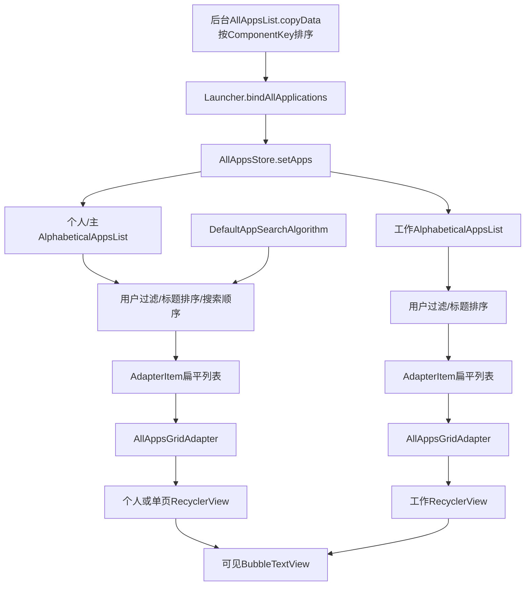
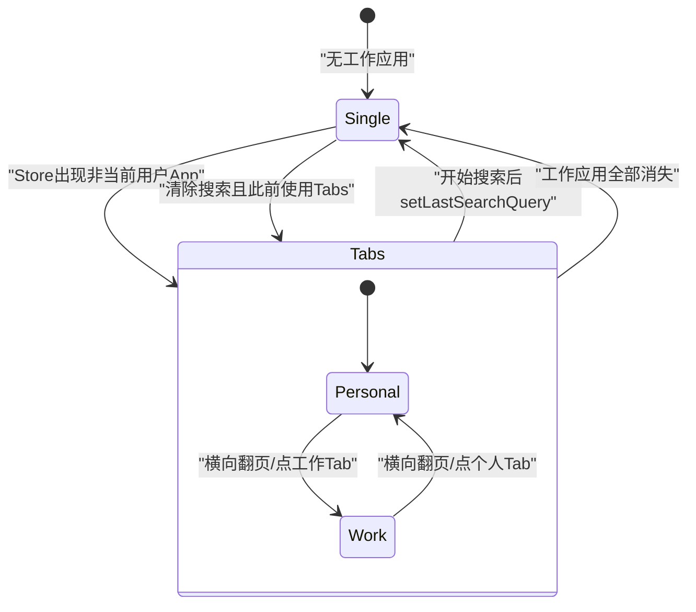
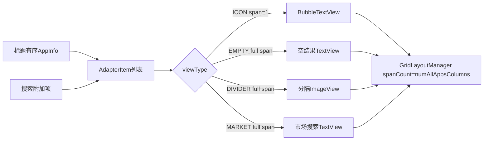

# 第520章 Android All Apps：容器、字母列表、Grid Adapter、RecyclerView复用、搜索和滚动链

> 源码基线：Android 11 / API 30 / `android-11.0.0_r48`。直接阅读 `packages/apps/Launcher3`，只读源码、不编译。核心文件：`allapps/AllAppsStore.java`、`AllAppsContainerView.java`、`LauncherAllAppsContainerView.java`、`AlphabeticalAppsList.java`、`AllAppsGridAdapter.java`、`AllAppsRecyclerView.java`、`AllAppsFastScrollHelper.java`、`AllAppsPagedView.java`、`allapps/search/AppsSearchContainerLayout.java`、`AllAppsSearchBarController.java`、`DefaultAppSearchAlgorithm.java` 及相关布局资源。

## 1. 本章解决什么问题

第507章已经看到后台AllAppsList怎样维护应用Activity库存，本章继续追这份库存进入主线程后怎样变成个人/工作列表、RecyclerView格子、字母快滚和搜索结果。重点不是“RecyclerView怎么用”，而是同一批AppInfo为何要经过多次排序、过滤和派生索引，以及这些账不一致时会出现什么现象。

## 2. 一句话定位

`AllAppsStore`保存UI侧权威AppInfo数组，`AlphabeticalAppsList`把它按当前用户过滤/搜索并展开为AdapterItem，`AllAppsGridAdapter`负责View类型和BubbleTextView绑定，`AllAppsRecyclerView`负责虚拟化、滚动几何和快滚，`AllAppsContainerView`在单列表与个人/工作双页之间装配整棵View树。

## 3. 先分七本账

依次区分Store的ComponentKey有序数组、Alphabetical的标题有序mApps、搜索顺序mSearchResults、扁平mAdapterItems、GridLayoutManager的真实span、RecyclerView的可见ViewHolder和滚动高度缓存。它们可以同时存在且排序依据不同，不能拿adapter position反推Store数组下标。

## 4. 数据进入All Apps的总链路



## 5. 后台数组先按ComponentKey排序

`AllAppsList.copyData()`做浅数组副本并用`AppInfo.COMPONENT_KEY_COMPARATOR`排序，Launcher主线程再原样交给AllAppsStore。Store的`getApp(ComponentKey)`依赖这一排序做binarySearch，所以Store层不能随意改成标题序。

## 6. AllAppsStore不复制传入数组

`setApps`直接令`mApps=apps`并保存flags。数组对象来自后台浅副本，数组槽独立，但每个AppInfo仍是共享对象；后续Promise进度等可在同一对象上更新可见View。

## 7. Store排序与屏幕排序不同

ComponentKey顺序服务快速精确查找；AlphabeticalAppsList随后把AppInfo放进ArrayList并按`AppInfoComparator`标题排序。二次排序不是浪费，而是分别服务索引和呈现。

## 8. 模型flags与应用数组一起提交

`mModelFlags`包含quiet mode、快捷方式权限和切换工作资料权限等UI状态。它与apps不是事务对象，只是在同一次`setApps(apps,flags)`赋值后统一notify；监听器回调看到的是新数组和新flags。

## 9. Store监听器使用CopyOnWriteArrayList

回调期间增加/删除监听器不会触发ConcurrentModificationException，遍历看到的是快照。代价是修改监听列表会复制数组，但应用库存更新远多于监听器结构变化，适合这里的读多写少模式。

## 10. defer updates有两个独立bit

`DEFER_UPDATES_NEXT_DRAW`服务Launcher绑定首屏，`DEFER_UPDATES_TEST`服务测试。任一bit存在时notify只置`mUpdatePending=true`，直到所有bit清零才真正通知一次，实现多次库存更新合并。

## 11. silent disable会留下pending语义

`disableDeferUpdatesSilently`只清bit，不消费`mUpdatePending`。Launcher清理旧ViewOnDrawExecutor时用它避免过期绑定突然刷新；之后若没有新的notify/普通disable，pending布尔仍可保留到未来一次流程，这是有意跳过回调而非“已经完成更新”。

## 12. NEXT_DRAW不是Choreographer像素fence

Launcher在非ALL_APPS状态开启defer，并把disable任务挂到ViewOnDrawExecutor。它保证All Apps数据重组推迟到首屏绑定任务释放点附近，不证明RecyclerView已measure/layout/draw，更不是屏幕帧已合成。

## 13. Store还登记当前图标容器

个人和工作RecyclerView会被register，Store更新通知点或Promise进度时遍历容器的直接child，找到BubbleTextView后原地更新。这里操作的是已attach的可见/缓存child，不会预先修改尚未创建的ViewHolder。

## 14. 图标增量更新只看直接child

`updateAllIcons`不递归View树；AllApps RecyclerView的itemView恰好就是BubbleTextView，所以可命中。若定制Adapter在外面再包一层FrameLayout，这条更新链会静默漏掉，必须同步修改遍历。

## 15. Promise进度使用对象身份匹配

`updatePromiseAppProgress`只在`child.getTag()==app`时调用applyProgressLevel，与第519章高清回绑一样利用同一AppInfo对象防串位。构造一个业务内容相同的新PromiseAppInfo不会命中旧View。

## 16. 通知点匹配使用PackageUserKey

每个可见child从tag取ItemInfo，用复用的mTempKey提取package/user，再交给updatedDots Predicate。它不是按AppInfo对象身份，因此同一包同一用户的多个Launcher Activity都可一起更新圆点。

## 17. AllAppsContainerView持有两个长期AdapterHolder

MAIN和WORK的AlphabeticalAppsList、Adapter、LayoutManager在Container构造时就创建；是否显示双Tab只决定把哪些Holder接到新RecyclerView。数据派生对象的生命周期长于具体RecyclerView View树。

## 18. 个人匹配器只认当前Process用户

`mPersonalMatcher=ItemInfoMatcher.ofUser(Process.myUserHandle())`，工作匹配器是它的逻辑not。后者实际上收纳所有非当前用户项目，不验证该用户一定是managed profile；常规Launcher环境通常只有预期工作资料。

## 19. AlphabeticalAppsList的mIsWork没有参与算法

构造函数保存`mIsWork`，但r48类内没有其它读取。真正过滤个人/工作的是AdapterHolder.setup传入的ItemInfoMatcher；只把构造参数改为true不会自动得到工作应用列表。

## 20. 每个Alphabetical列表都直接监听Store

MAIN和WORK在各自构造时注册OnUpdateListener，Container随后也注册一个监听器，搜索框attach后再注册。CopyOnWrite列表按加入顺序回调，因而一次setApps会先重建两份列表，再让Container决定是否切换Tab结构，最后可能刷新搜索。

## 21. Container通过扫描决定是否显示Tab

`onAppsUpdated`遍历Store数组，只要有一个AppInfo命中work matcher就`rebindAdapters(true)`；没有则使用单列表。它不依据FLAG_QUIET_MODE_ENABLED判断是否存在工作资料，暂停的工作应用仍可让Tab保留。

## 22. 单列表与双Tab使用两份不同XML树

单页是`all_apps_rv_layout`中的一个AllAppsRecyclerView；双页是AllAppsPagedView，内部include两份相同RecyclerView。Header和Search仍在Container外层，不随页面一起复制。

## 23. rebind会真正移除旧Recycler容器

`replaceRVContainer`先把旧RecyclerView的LayoutManager设null，再remove旧View，inflate另一套布局并插回原index。它不是只切visibility，因此旧child、滚动位置和RecyclerView本地状态都会离开View树。

## 24. Holder中的Adapter和LayoutManager会跨View树复用

新RecyclerView重新接同一个AlphabeticalAppsList、Adapter和GridLayoutManager。先把旧View的LayoutManager设null是必要交接，否则同一LayoutManager不能同时属于两个RecyclerView。

## 25. 图标容器注册也跟着切换

replace之后，Holder字段还暂时指向旧RecyclerView，所以源码先unregister旧容器；setup再覆盖为新RecyclerView，最后register新容器。调换这几步可能让Store继续扫描已经detach的child或重复登记。

## 26. rebindAdapters用mUsingTabs避免重复重建

showTabs与当前值相同且force=false时直接返回。`onFinishInflate`传force=true完成首次装配；普通应用更新若工作资料存在性没变，不会摧毁RecyclerView滚动状态。

## 27. DeviceProfile变化只重建ViewHolder

每个现存RecyclerView执行`swapAdapter(sameAdapter,true)`并清RecycledViewPool，数据列表不重算。这样新inflate的all_apps_icon读取新DeviceProfile尺寸，但AlphabeticalAppsList和RecyclerView构造时保存的final列数字段仍不在这里更新。

## 28. 重复setAdapter会累计自定义Observer的边界

AllAppsRecyclerView覆写setAdapter，每次都向Adapter注册一个匿名AdapterDataObserver，却没有保存并注销旧observer。正常新RecyclerView的setup只调用一次，AndroidX的`swapAdapter`也有独立实现；但自定义流程若在同一RecyclerView反复调用公开setAdapter，可能在Adapter上累积清缓存回调，并让旧关系被observer引用。

## 29. AdapterHolder.setup一次装配九项关系

它先更新用户filter，再设置edge effect、AppsList、LayoutManager、Adapter、fixed-size、关闭item动画、增加焦点装饰、设置padding和工作overlay。排查空列表时要确认是filter结果为空，还是RecyclerView尚未setup，而不能只看Store数组。

## 30. 单页、双页和搜索切换时序



搜索时的Single是同一个Container换入单RecyclerView，不是创建第二个All Apps页面。

## 31. 搜索开始后先得到结果再隐藏Tabs

AppsSearchContainerLayout在`onSearchResult`里先`mApps.setOrderedFilter(apps)`和通知结果变化，随后才调用Container.setLastSearchQuery；后者给两个Adapter更新市场文案，并在原来有Tabs时rebind成单列表。

## 32. 首次查询的个人/工作范围存在时序边界

Tabs状态下DefaultSearchAlgorithm持有MAIN的mApps引用，此时通常只有个人应用。首个字符先在这份个人列表计算；setOrderedFilter后MAIN因hasFilter绕过用户filter并变成全Store，且rebind单页设filter=null，下一次字符搜索才可能覆盖工作应用。因此r48首轮与后续轮的搜索范围可能不同，这是按回调顺序推导的边界。

## 33. 清搜索时再切回Tabs

SearchController先把MAIN orderedFilter设null并按当前单页filter重建，然后Container.onClearSearchResult看到`mSearchModeWhileUsingTabs`才rebind双页，setup分别恢复personal/work matcher。短暂的全量单页状态通常在同一主线程调用链内完成。

## 34. reset会同时滚回两份列表顶部

无论当前激活哪一页，Container.reset遍历两个Holder的RecyclerView并scrollToTop，再重置Header和Search。切Tab调用reset，因此从工作页切回个人页也会把两页历史滚动位置一起清掉。

## 35. onTabChanged还会重新绑定快滚条

Header切换active侧，目标RecyclerView调用bindFastScrollbar，随后reset搜索和滚动。WorkModeSwitch只有处于工作页且具备相关模型权限flag时才显示。

## 36. AllAppsPagedView只接管明显横向手势

它要求水平量大于垂直量；角度超过60°不开始翻页，30°到60°逐步增大touch slop，低于30°正常处理。越过任一方向touch slop还会取消当前页图标长按，减少横划与拖拽冲突。

## 37. 工作暂停先盖overlay，后清列表

quiet mode开启时给RecyclerView设置辅助描述，临时启用DefaultItemAnimator，把全屏paused overlay淡入；动画end才把工作Alphabetical filter换成恒false并关闭item动画。淡入期间底下应用数据仍在，只是被overlay遮住。

## 38. 恢复工作资料先填列表，后淡出overlay

quiet mode关闭时先恢复原mInfoMatcher，让item重新出现，再把overlay alpha动画到0；end清item animator和ViewOverlay。这样不会先露出空白页面再等待数据。

## 39. overlay动画没有代际或显式cancel

快速暂停→恢复→暂停时，旧`withEndAction`仍可能晚到并执行“filter恒false”或“clear overlays”。源码只用mWorkDisabled避免同值重复调用，没有给动画结果绑定generation；定制异步切换时需验证过期end action。

## 40. mWorkDisabled在调度动画后立即改值

它代表最后接受的quiet mode状态，不代表overlay动画已结束或filter已经收口。调试时至少同时记录mWorkDisabled、overlay是否在ViewOverlay、alpha、item animator和当前ItemInfoMatcher。

## 41. auto-sized overlay测量存在宽高不一致

onSizeChanged把overlay按`w×w`的EXACTLY规格measure，却调用`layout(0,0,w,h)`。标准work_apps_paused根布局match-parent通常仍能覆盖视觉区域，但当RecyclerView非正方形或自定义child依赖measuredHeight时，这个r48实现值得检查。

## 42. Insets分成Container外边距和Recycler padding

左右系统inset写到Container MarginLayoutParams；每个Recycler左右padding取workspace margin+cell padding，bottom加入系统inset。竖栏布局还给Container自身设置workspace左右padding，不能把所有空白都归因于同一个Rect。

## 43. 工作开关会额外增加底部可滚空间

工作Holder的bottom padding在存在WorkModeSwitch时再加两倍footer padding、底部inset和文字高度。注意基础padding.bottom已经等于insets.bottom，公式内又含一次insets.bottom，因此最终工作页底部会包含两份底部inset贡献。

## 44. vertical fading edge方法实际只操作MAIN

每个Holder都保存传入布尔值，但`applyVerticalFadingEdgeEnabled`内部固定访问`mAH[MAIN].recyclerView`，并只在非Tabs时开启。循环调用两个Holder最终仍只是重复设置主列表，工作页不单独启用，这是r48明确行为。

## 45. 导航栏scrim在所有child之后绘制

dispatchApplyWindowInsets在Q+取tappableElementInsets.bottom，旧版取stable bottom；Container.dispatchDraw先画全部child，再在底部画主题色矩形。它是视觉遮罩，不会改变Recycler可滚范围，范围由setInsets的padding另算。

## 46. 快滚触摸由Container转交独立handler

DOWN命中当前Recycler的scrollbar后保存mTouchHandler，后续Intercept和Touch都把同一事件序列及父坐标offset交给它。未命中时Container本身不消费，普通纵向滚动继续由RecyclerView处理。

## 47. Launcher子类还加ALL_APPS状态门

LauncherAllAppsContainerView在非ALL_APPS状态直接清touch handler并拒绝拦截/触摸，因为搜索框在Overview等状态仍可能可见。只看View.isShown不足以判断快滚条能否操作。

## 48. shouldContainerScroll服务外层状态拖动

事件在搜索框内时允许外层Container移动；命中可见scroll thumb时不允许；否则询问当前Recycler是否已经到顶、能否把手势交给外层状态切换。它决定“All Apps列表滚动”与“整体下拉回桌面”的所有权。

## 49. AlphabeticalAppsList每次更新都从Store重建

它清mApps，遍历Store数组应用item filter，再按标题排序，之后全量重建filteredApps、fast sections和AdapterItems。没有针对单包的增量insert/remove，所以Adapter最终调用notifyDataSetChanged。

## 50. 普通状态下ItemInfoMatcher决定个人/工作

matcher为null收全部，非null只收matches的AppInfo。MAIN/WORK的列表对象都观察同一Store，但setup时的matcher不同，于是派生出两份独立标题序列表。

## 51. 搜索状态会绕过当前ItemFilter

过滤条件是`mItemFilter==null || matches || hasFilter()`。只要mSearchResults非null，mApps先收Store全部应用；最终显示哪些仍由ordered ComponentKey列表决定。这让隐藏Tabs后的统一搜索成为可能，也造成第32节的首轮范围时序。

## 52. 简体中文会按section二次分组重排

普通标题排序后，源码把同sectionName应用放入以LabelComparator排序的TreeMap，再按section顺序拼回mApps；每个section内部保留第一次标题排序的相对顺序。仅当Locale精确等于`Locale.SIMPLIFIED_CHINESE`才走此分支。

## 53. sectionName必须非null

refill中直接执行`sectionName.equals(lastSectionName)`，没有空保护。标准IconCache/AppInfo构造会填sectionName；自定义AppInfo若遗漏，会在主线程刷新列表时NPE。

## 54. AdapterItem是扁平展示账

每项至少保存position和viewType；应用项再保存sectionName、rowIndex、rowAppIndex、AppInfo和忽略非应用项后的appIndex。它不是RecyclerView.ViewHolder，也没有持有View。

## 55. r48没有单独字母标题AdapterItem

类注释说item可为section或app，但实际工厂只有icon、empty search、all-apps divider和market search。字母section只存在FastScrollSectionInfo中，不以标题行占用Grid。

## 56. 搜索结果严格按ComponentKey列表顺序

`getFiltersAppInfos`逐个key调用Store.getApp，找到就追加，不再按标题排序。因此SearchAlgorithm可以决定相关性次序；不存在的key被静默跳过，重复key会重复加入同一AppInfo并生成重复图标项。

## 57. setOrderedFilter比较引用和内容两层变化

传入对象与当前引用相同时完全不刷新，即使调用者原地修改了ArrayList；不同对象但内容equals时仍替换引用并onAppsUpdated，只是返回false。返回值表达“内容是否不同”，不是“本次是否重建Adapter”。

## 58. 搜索附加项固定在图标之后

有filter时，无结果追加empty-search，有结果追加divider；两种情况最后都追加market-search。市场Intent不可解析时Adapter把market TextView设GONE，但AdapterItem仍在列表和滚动高度计算中。

## 59. rowIndex只对icon递增

每遇到一行首icon就rowIndex++，同一行rowAppIndex从0增加；divider会把`numAppsInSection`清0，使之后若再有icon从新行开始。empty/market既不是icon也不是divider，不改变row账。

## 60. 三处列数并不统一

AlphabeticalAppsList和AllAppsRecyclerView保存`IDP.numColumns`，而AllAppsGridAdapter的spanCount使用`IDP.numAllAppsColumns`。当产品把All Apps列数配置得不同于Workspace列数时，真实排版、rowIndex、回收池容量和滚动高度估算可能不一致，这是r48重要边界。

```java
// AlphabeticalAppsList
mNumAppsPerRow = mLauncher.getDeviceProfile().inv.numColumns;

// AllAppsRecyclerView
mNumAppsPerRow = LauncherAppState.getIDP(context).numColumns;

// AllAppsGridAdapter
setAppsPerRow(mLauncher.getDeviceProfile().inv.numAllAppsColumns);
```

前两处生成“逻辑行/高度账”，最后一处才决定Grid真实span。

## 61. mNumAppsPerRow还是final快照

Alphabetical列表和Recycler在构造时读取列数，DeviceProfile变化只swap Adapter并清pool，不修改这些final字段。若运行期网格切换未重建整个Container，对行与滚动的旧估算可能保留。

## 62. 每个新section不强制换行

sectionName变化只创建FastScrollSectionInfo，不插divider、也不清`numAppsInSection`；B section第一个应用可接在A section最后一行。快滚到B时GridLayoutManager最终会把包含它的整行对齐顶部。

## 63. 当前快滚fraction按section数量均分

常量固定选择`DISTRIBUTE_BY_NUM_SECTIONS`，N个section的触摸起点依次为0、1/N、2/N……，不按每段应用/行数量分配。只有另一个未启用分支才按rowIndex和rowAppIndex计算。

## 64. 空列表不会因1/0抛Java异常

`1f / mFastScrollerSections.size()`在size=0时得到正Infinity而非整数除零异常，随后循环为空；rowCount为0时Recycler快滚入口会先返回空字符串，不访问sections.get(0)。

## 65. rebuild最后只发notifyDataSetChanged

Adapter没有stable IDs，也没有DiffUtil。所有可见item都可能重新bind，Recycler缓存滚动位置由onChanged清空；优点是逻辑简单，代价是更新动画和局部复用信息较少。

## 66. Adapter扁平化和Grid布局关系



## 67. viewType使用bit而不是连续枚举

ICON、EMPTY、MARKET、DIVIDER分别是不同bit，mask方法用按位与识别icon/divider。当前每个item只有单bit，但设计允许用mask聚合同族类型。

## 68. 非icon一律占满整行

GridSpanSizer对icon返回1，其它返回mAppsPerRow。注释称“section breaks”，实际empty、divider和market都走full span；未来新增类型若忘记归类也会默认占整行。

## 69. Adapter的真实spanCount来自numAllAppsColumns

构造时`setAppsPerRow(inv.numAllAppsColumns)`并传给GridLayoutManager。该值为0会使GridLayoutManager.setSpanCount抛IllegalArgumentException，正常IDP资源必须保证至少1。

## 70. 创建icon ViewHolder时一次设置交互

inflate `all_apps_icon`，安装Launcher点击、All Apps长按、焦点监听，并把长按factor改回1.0；因此All Apps使用完整系统长按时间，而BubbleTextView默认0.75主要服务其它场景。

## 71. All Apps cell高度由代码覆盖LayoutParams

XML高度是wrap_content，但onCreate把height设为DeviceProfile.allAppsCellHeightPx。BubbleTextView的centerVertically再在measure中计算top padding，使图标+标题位于这块固定cell内。

## 72. onBind先reset再绑定AppInfo

icon holder调用第519章的局部reset，然后`applyFromApplicationInfo`重新创建Drawable、标题、tag、高清验证和dot。apply入口会取消旧IconLoadRequest，所以虽然reset本身不取消，正常All Apps重绑链仍能清旧请求。

## 73. Adapter没有onViewRecycled清理

离屏holder进入pool时仍可能保留tag、mIcon和请求，直到下一次onBind覆盖。迟到高清回调会先检查tag身份；同一holder尚未重绑且仍指向旧AppInfo时，回调更新离屏View虽浪费一点工作，但不会串到新应用。

## 74. onFailedToRecycleView强制返回true

即使RecyclerView因暂态属性认为item不可回收，Adapter仍允许进入pool，并依赖下一次bind的reset/覆盖。快滚Helper把当前section首项设为不可回收，通常要到fast scroll completed后才恢复；两者交互需结合RecyclerView调用时机看。

## 75. 空结果文字的gravity随状态变化

真正“搜索无匹配”时居中；若只是其它非标准空状态则START|CENTER_VERTICAL。mEmptySearchMessage初值是loading，搜索query后替换成包含query的no-results文案。

## 76. Market ViewHolder的点击读取可变字段

listener执行时访问Adapter当前`mMarketSearchIntent`，不是在create时捕获某次Intent。每次query更新字段后，复用旧ViewHolder也会打开新query；Intent为null时bind把View设GONE。

## 77. GONE的market item仍在Adapter账中

getItemCount不因Intent null移除它，Grid仍有对应position。测量高度可能为0，但辅助功能和额外行统计仍会把它当非icon项处理，数据存在与像素可见要分开。

## 78. 点击市场使用SEARCH日志容器

调用`startActivitySafely(view,intent,null,CONTAINER_SEARCH)`，ItemInfo传null。它是外部搜索动作，不应按某个应用图标点击记账。

## 79. Adapter持有的market Intent不会在clear时置null

清搜索会移除附加AdapterItem，因此旧Intent暂时不可点；下一次`setLastSearchQuery`会覆盖。自定义流程若在未更新query时手工插入market item，可能复用旧搜索词。

## 80. 辅助功能要从Grid行中剔除非应用项

AppsGridLayoutManager把event.itemCount改为filtered app数，并调整from/to index、总行数和单item rowIndex，目标是让TalkBack只报告应用集合，不把divider和市场按钮算作应用行。

## 81. getRowsNotForAccessibility中的Math.max可疑

源码把`adapterPosition`改为`Math.max(adapterPosition, items.size()-1)`。对任何正常position都会提升到最后一项，于是每次都统计全列表非icon行；若position本就越界还可能循环访问越界。按方法注释语义更像应使用min，这是r48明确的源码审计点。

```java
private int getRowsNotForAccessibility(int adapterPosition) {
    List<AdapterItem> items = mApps.getAdapterItems();
    adapterPosition = Math.max(adapterPosition, items.size() - 1);
    int extraRows = 0;
    for (int i = 0; i <= adapterPosition; i++) {
        if (!isViewType(items.get(i).viewType, VIEW_TYPE_MASK_ICON)) {
            extraRows++;
        }
    }
    return extraRows;
}
```

## 82. 可疑统计会影响多处辅助坐标

fromIndex、toIndex、rowCount和每个CollectionItemInfo都复用该方法，可能得到被过度减小甚至负值的行号；部分调用又用`Math.max(0,...)`钳from/to，但item rowIndex没有钳位。

## 83. AllAppsRecyclerView只保存Alphabetical引用

`setApps`不触发刷新，它只是让Recycler知道AdapterItem、row数和sections，以便滚动计算。真正的数据通知来自Alphabetical对Adapter的notifyDataSetChanged。

## 84. 回收池容量按图标尺寸粗估

approxRows=`ceil(availableHeight/allAppsIconSize)`，再乘`IDP.numColumns`设置icon最大缓存数。cell还包含标题和padding，使用iconSize通常会高估行数，偏向多留holder而不是频繁inflate。

## 85. Recycler列数也用了numColumns

它不读取LayoutManager spanCount，因此与第60节一样，在numAllAppsColumns不同的产品上，pool容量与row滚动算法按Workspace列数估算，真实Grid按All Apps列数排版。

## 86. onSizeChanged会清高度类型缓存

updatePoolSize清mViewHeights并只预填ICON高度；adapter position→累计Y的mCachedScrollPositions却没有在这里显式清。尺寸变化若没有伴随adapter onChanged，旧position滚动Y可能继续保留，这是另一个r48缓存失效边界。

## 87. empty background不是Adapter item背景

无结果时RecyclerView自己持有AllAppsBackgroundDrawable，在onDraw先画，再让children绘制；TextView empty message仍是独立full-span item。Drawable设置callback并通过verifyDrawable纳入失效。

## 88. 搜索结果变化总是scrollToTop

无论query更细还是应用库存刷新，`onSearchResultsChanged`先滚顶；无结果让背景150ms淡入，有结果时则立即alpha=0，避免背景与图标重叠。清搜索只有setOrderedFilter内容变化时才调用这一通知。

## 89. 搜索期间明确禁用快滚

`supportsFastScrolling`返回`!mApps.hasFilter()`，因为结果顺序由SearchAlgorithm决定，不再代表字母section。FastScroller Sections仍可能被重建，但UI不应让用户拖thumb进入这条映射。

## 90. touch fraction选择不超过它的最后section

从sections[0]开始，依次查看touchFraction，遇到大于手指比例就停止；因此区间映射到前一个section，1附近映射最后section。入口先确认rowCount非0，间接保证至少有icon section。

## 91. 快滚不是瞬间scrollToPosition

AllAppsFastScrollHelper启动LinearSmoothScroller，snap preference为START。相同目标position时直接返回，避免手指在同section内抖动反复创建Scroller。

## 92. 旧Scroller靠目标position淘汰

每个MyScroller记自己的target；onStart/onStop若它不等于Helper当前目标，就不再选中旧holder。源码不显式cancel上一Scroller，而让LayoutManager的新smooth scroll和目标校验收口。

## 93. 到达目标会激活并临时禁止回收

onStop找到目标ViewHolder，把上一个holder取消activated并恢复recyclable，再把当前设activated且`setIsRecyclable(false)`。这给用户字母定位反馈，也防止高亮item立即被回收。

## 94. fast-scroll completed才清选中

用户松开thumb后Recycler回调Helper，把target设NO_POSITION、清activated并恢复可回收。若完成回调遗漏，holder可能长期保持不可回收；排查pool异常应检查这条手势收尾。

## 95. scrollbar thumb有attached与detached两种账

快速拖动时thumb可脱离列表真实scroll位置；用户随后普通滚动且方向朝追赶点时，源码按两端剩余距离调整thumb，直到两者相等再reattach。反方向滚动只保持thumb，不强行跳回。

## 96. 当前scrollY通过第一个child反推

取得child0的adapter position和decoratedTop，累计其之前完整行/非icon高度，再减当前offset并加paddingTop。child0未必是adapter position最小的可见child这一Recycler实现假设需结合LayoutManager装饰顺序理解。

## 97. icon高度每行只加一次

遇icon且rowAppIndex==0才增加allAppsCellHeight；若目标item与正在遍历item同row，会提前break。算法完全信任Alphabetical预计算的rowIndex/rowAppIndex，所以列数不一致会直接污染scrollbar。

## 98. 非icon高度可能临时创建并绑定Holder

目标前的divider/empty/market不在屏幕时，滚动计算会调用Adapter.createViewHolder、onBind、UNSPECIFIED measure，再放入RecycledViewPool。计算高度因此可能执行listener装配和bind可见性等View副作用。

## 99. 非icon测量高度没有写回mViewHeights

源码只把结果加到局部y，没有`mViewHeights.put`；但最终target position的累计y会进mCachedScrollPositions。不同target首次计算仍可能重复创建/测量相同非icon类型，属于小型性能边界。

## 100. scroll位置缓存只覆写onChanged

setAdapter注册的Observer只实现onChanged，没有覆盖itemRangeInserted/Removed/Changed/Moved。当前Alphabetical固定notifyDataSetChanged会命中；若以后改用细粒度Adapter通知，缓存不会自动清，需要同步扩展Observer。

## 101. total scroll height用虚拟position=itemCount

`getCurrentScrollY(itemCount,0)`令posItem为null并遍历全部AdapterItem，得到内容总高；再加top padding、减Recycler高度、加bottom padding。结果<=0时隐藏scrollbar thumb。

## 102. padding参与内容起点和可滚终点

getCurrentScrollY外层加paddingTop，available height又加top/bottom。FloatingHeader通过把maxTranslation写入Recycler top padding给列表留头部空间，所以头部折叠和列表滚动几何彼此耦合。

## 103. SearchAlgorithm持有的是可变mApps列表引用

AppsSearchContainer初始化时传`new DefaultAppSearchAlgorithm(mApps.getApps())`，不是数组副本；Alphabetical更新会clear并填充同一个ArrayList，搜索算法下一次查询自然看到新库存，无需重建Algorithm。

## 104. 默认搜索计算同步，结果回调异步一拍

`doSearch`立即在调用线程遍历所有AppInfo，得到ComponentKey列表后才post到创建Handler的Looper。默认Controller在主线程调用，所以耗时搜索仍占主线程，只是UI回调延后一条消息。

## 105. cancel(false)在默认实现中什么也不删

快速输入时旧query和新query回调都保留，通常因同一Handler FIFO先旧后新，最终状态正确但会多次全量notify/scrollToTop。清空query使用cancel(true)才remove所有pending callback；替换异步SearchAlgorithm时还需自带query/generation校验。

## 106. Store更新会刷新当前非空搜索

搜索框attach后监听AllAppsStore，onAppsUpdated调用Controller.refreshSearchResult；query非空时重新搜索。这样Play Store持续更新应用时结果能变化，但也会与Store→Alphabetical→Container多监听器回调叠加。

## 107. 搜索只在单词边界尝试前缀

Default算法不是任意substring：空格后、数字边界、大小写驼峰、符号等位置才调用Collator前缀比较。例如“Play Store”可从Store起点匹配，普通单词中间字符通常不匹配。

## 108. toLowerCase没有显式Locale

query调用`toLowerCase()`使用默认Locale，而title不先统一小写，最终依赖PRIMARY强度Collator忽略大小写/音调。土耳其语I等区域可能受默认大小写规则与Collator组合影响，测试不能只覆盖英文。

## 109. Unicode扫描混用codePoint和UTF-16下标

循环i每次加1，却对`codePointAt(i)`取类型并用`substring(i,i+queryLength)`切UTF-16单元；代理对字符可能在下一轮落到low surrogate。应用名含emoji或补充平面文字时，边界判断和长度比较可能不符合用户感知字符。

## 110. Search Result为null会保留旧画面

AppsSearchContainerLayout只有`apps != null`才setOrderedFilter；算法失败回null时不清旧结果、不更新query文案，也不通知Recycler。接口注释允许null表示失败，因此产品若接远端搜索需定义失败UI。

## 111. 推荐排查矩阵

覆盖无/有工作资料、quiet on/off快速切换、单/双Tab重建、不同numColumns/numAllAppsColumns、简体中文section、0/1/多section、搜索0/1/多结果、市场有/无handler、连续输入/清空、通知与Promise更新、DeviceProfile变化、快滚目标频繁变化和TalkBack行号。

## 112. macOS只读练习一：从Store手算AdapterItem

构造跨两个用户、标题乱序、section分别A/B/C的AppInfo数组，先按ComponentKey排序模拟Store，再按标题和personal/work matcher重建两份mApps，最后列出每个AdapterItem的position、appIndex、rowIndex、rowAppIndex及FastScroll touchFraction；分别用numColumns=4和numAllAppsColumns=5观察错位。

## 113. macOS只读练习二：推演Tabs搜索时序

从个人P1/P2、工作W1、双Tab开始，逐行跟踪输入第一个字符、Default同步计算、Handler回调、setOrderedFilter、hasFilter绕过matcher、setLastSearchQuery换单页、输入第二字符和clearSearch。记录MAIN mApps、mFilteredApps、mSearchResults、mItemFilter、mUsingTabs和RecyclerView实例。

## 114. macOS只读练习三：手算scrollY和thumb

给定5列Grid、但row账按4列，混入divider和GONE market项，按源码计算目标position前的累计高度、内容总高、availableScrollHeight、attached thumb比例；再推演thumb detached后dy同向/反向两种追赶公式，标出可能的除零边界由哪些前置条件避免。

## 115. macOS只读练习四：审计复用与辅助功能

手推BubbleTextView A低清请求在途、holder进pool、重绑B、A/B回调与Store通知点增量更新；随后对包含divider/market的列表调用`getRowsNotForAccessibility`，比较r48 Math.max结果与按注释应有结果，列出itemCount、from/to、rowCount和item rowIndex。

## 116. 易错点一：AllAppsStore不是屏幕标题序列表

Store必须保持ComponentKey排序供binarySearch；屏幕标题序、用户filter、搜索相关性序和Grid行号都在AlphabeticalAppsList派生。直接对Store数组做标题排序会先破坏getApp，再间接让搜索key解析丢项。

## 117. 易错点二：有两个Holder不代表总有两个RecyclerView

MAIN/WORK数据对象长期存在，但单页模式WORK.recyclerView会设null；搜索还会临时从双页换成单页。更新可见View、处理padding或读取active列表时都要判当前View树，而不是只判Holder数组长度。

## 118. 易错点三：Adapter position不是应用序号或Grid行号

搜索附加项占position却没有appIndex，多个icon共享rowIndex，section可在行中间开始，非icon占满整行。日志、辅助功能、快滚和滚动缓存分别需要正确字段，不能混用一个整数。

## 119. r48最值得复审的实现边界

重点包括三处列数字段不统一、Accessibility的Math.max、DeviceProfile变化不清position滚动缓存、重复setAdapter observer、工作overlay无代际、overlay按w×w测量、首次Tab搜索范围变化、orderedFilter同引用不刷新、非icon高度不缓存，以及Unicode搜索的UTF-16扫描。

## 120. 本章总结与下一章

All Apps是一条“ComponentKey有序库存→标题/用户/搜索派生→扁平AdapterItem→Grid span→可见BubbleTextView→滚动高度与快滚反馈”的多账流水线，Container还会按工作资料和搜索动态替换RecyclerView树。下一章继续精读FloatingHeaderView、PredictionRowView、AllAppsPagedView、WorkModeSwitch与工作资料教育流程，理解浮动头部、预测行、个人/工作分页和quiet mode如何协作。
