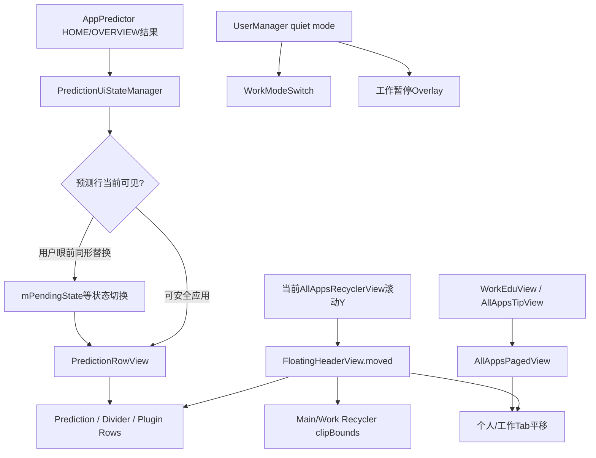
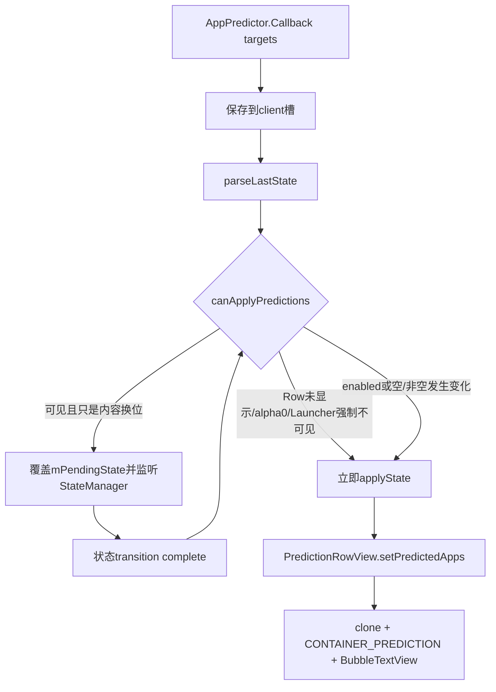
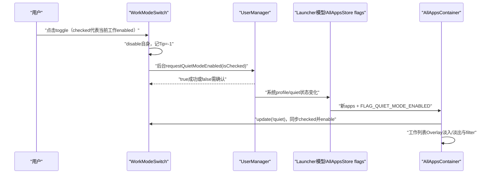

# 第521章 Android All Apps：浮动头部、预测行、个人/工作分页、工作模式开关和教育引导链

> 源码基线：Android 11 / API 30 / `android-11.0.0_r48`。直接阅读 `packages/apps/Launcher3`，只读源码、不编译。核心文件：`allapps/FloatingHeaderView.java`、`FloatingHeaderRow.java`、`PluginHeaderRow.java`、`AllAppsPagedView.java`、`PersonalWorkSlidingTabStrip.java`、`WorkModeSwitch.java`、`views/WorkEduView.java`，以及Quickstep覆盖中的`appprediction/PredictionRowView.java`、`PredictionUiStateManager.java`、`ComponentKeyMapper.java`、`AppsDividerView.java`和`AllAppsTipView.java`。

## 1. 本章解决什么问题

All Apps顶部的预测应用、分隔线、个人/工作Tab为何能随列表向上折叠，却又不属于RecyclerView的AdapterItem？预测结果为什么在用户眼前通常不立即换位？工作资料开关怎样把checked状态翻译成quiet mode请求？首次教育弹层、预测箭头提示和访问次数标签又分别由谁记进度？

## 2. 一句话定位

`FloatingHeaderView`把多个`FloatingHeaderRow`与Tab叠在RecyclerView顶部，通过平移和clip形成“浮动后折叠”；`PredictionUiStateManager`决定何时把预测数据投到`PredictionRowView`；`AllAppsPagedView`与TabStrip处理个人/工作横向分页；`WorkModeSwitch`和`WorkEduView`分别处理quiet mode操作与新手教育。

## 3. 先分八本账

区分Header全部Row数组、可折叠总高度、当前Recycler滚动Y、每个Row自身translation/alpha、预测服务原始列表、待应用/当前PredictionState、工作资料quiet事实和三套SharedPreferences教育进度。它们之间有回调，但没有一个统一状态机对象。

## 4. 顶部区域的总体关系



## 5. FloatingHeaderRow是行为接口

每个Row要报告expected height、当前是否应该画、是否拥有值得布局的内容，并接收setup、Insets、内容可见性和垂直滚动。Header不需要知道预测或插件内部结构，只累加高度并广播状态。

## 6. shouldDraw和hasVisibleContent不是同义词

`shouldDraw`服务Row之间的相对布局/分隔判断，`hasVisibleContent`更早用于判断Header是否值得显示提示。例如AppsDivider可以画线却返回hasVisibleContent=false；Prediction有数据时两者才都为真。

## 7. fixed rows只在inflate结束扫描一次

Header遍历自己的直接child，把实现FloatingHeaderRow的View收进mFixedRows。Quickstep的`floating_header_content.xml`通过merge放入PredictionRowView和AppsDividerView；之后XML固定Row不能动态增删。

## 8. 插件Row在运行期插到Tab之前

AllAppsRow插件连接后先`plugin.setup(parent)`取得View，Header把它加到mTabLayout前，并用PluginHeaderRow包装进Map和mAllRows。固定Row顺序保持，所有插件按ArrayMap当前values顺序追加到固定Row之后。

## 9. 插件高度变化会重新给Recycler留padding

插件调用OnHeightUpdatedListener后，Header重算mMaxTranslation；数值改变就调用父Container.setupHeader，把新max写到两份Recycler的top padding。高度变化不是只requestLayout插件自身。

## 10. 插件断开路径假定一定已登记

`onPluginDisconnected`直接从Map取row后访问`row.mView`，没有null保护。正常PluginManager保证connect/disconnect成对；重复或未知disconnect会NPE，这是调用协议假设。

## 11. setup会把同一Header接到新Recycler树

第520章单页/双页rebind后，Header给全部Row调用setup，更新总高度和Tab显隐，再设置Main/Work Recycler引用、当前active页并reset。Header对象本身不随Recycler容器替换。

## 12. 旧Recycler的scroll listener没有移除

`setupRV(old,updated)`只在对象变化且updated非null时向新View add listener，却未从old remove。旧Recycler通常已从View树移除，不再滚动，但它仍持有Header listener；多次单/双页切换可能形成旧View到Header的引用链。

## 13. mMaxTranslation只累加Row expected height

Tab高度不进入这一本账；双Tab布局本身在all_apps_tabs XML中通过margin/header padding占空间。Header折叠距离主要代表预测、divider和插件等“额外头部内容”。

## 14. tabsHidden时getMaxTranslation有两个补偿分支

没有任何Row高度时返回search bar bottom padding；有Row时返回mMaxTranslation+Header paddingTop；Tabs显示时只返回mMaxTranslation。Container用这个返回值而非裸字段设置Recycler top padding。

## 15. mCurrentRV决定跟随哪页滚动

setMainActive在个人/工作页间选择Main或Work Recycler。Scroll listener收到非current RV事件会忽略，所以后台页的独立滚动不会推动当前Header。

## 16. setMainActive只换引用，不同步当前滚动位置

Container.onTabChanged紧接着调用reset，把两页滚顶并将Header归零，掩盖了切页时的滚动差异。若自定义产品取消reset，单纯换current可能让Header暂时保持上一页translation。

## 17. moved把滚动Y映射成展开/折叠状态

Header监听器取`current=-Recycler.getCurrentScrollY()`，列表向上滚时current变负。moved结合mSnappedScrolledY计算translation，限制展开最多0、折叠最多`-mMaxTranslation`，并记录headerCollapsed。

## 18. 完全折叠后还会维护snap锚点

headerCollapsed时，继续向负方向滚且仍在可snap范围会更新mSnappedScrolledY；反向滚动满足条件才退出collapsed。它不是简单`translation=-scrollY`，而是带吸附历史以避免列表很深时Header突然出现。

## 19. applyVerticalMove同时改三类像素

它把Header translation钳到`[-max,0]`，把未钳值/rolled-out状态发给每个Row，把Tab设同一translation，再把Recycler clip.top设为`max+translation`。Header展开时列表顶部被裁到max，折叠后clip.top逐渐回0。

## 20. Row收到的是uncapped translation

Header字段被钳住，但普通情况下Row获得原始uncapped值，让Row自行决定内部视觉；若整体collapsed或超出上限再多一个headerTopPadding，Header强制给Row`scroll=0,isScrolledOut=true`，彻底隐藏。

## 21. setCollapsed是布局模式，不是滚动结果

设true后updateExpectedHeight直接让max=0，并触发父Header setup；applyVerticalMove也把全部Row视为scrolled out。它服务搜索/状态动画暂时移除Header extras，不等同于用户滚动折叠的mHeaderCollapsed。

## 22. reset会归零Header并把当前列表滚顶

非动画路径立刻translation=0、apply；动画路径从当前值到0持续150ms。无论哪条，随后清headerCollapsed、把snap设`-max`并调用mCurrentRV.scrollToTop。

## 23. reset动画会重复add同一个UpdateListener

每次animate=true都执行`mAnimator.addUpdateListener(this)`，源码从不remove。ValueAnimator通常允许Listener列表累积，反复切Tab/reset后同一帧可能多次调用onAnimationUpdate；像素结果相同但增加回调成本，是r48审计点。

## 24. scroll事件会取消reset Animator

用户在150ms归位期间滚动当前Recycler，listener先cancel Animator再按真实scrollY执行moved。cancel不会把Header强制推到动画终点，手势从当下translation接管。

## 25. Header可把触摸转发给Recycler

状态动画允许`mAllowTouchForwarding`时，Header把事件坐标换算到current Recycler，先询问其onIntercept；一旦决定转发，后续onTouch继续给Recycler。这样触摸落在Header空白/透明区域也可滚列表。

## 26. intercept坐标恢复缺少finally

onIntercept先offset event，调用Recycler，再手工offset回来；若Recycler拦截逻辑抛异常，MotionEvent坐标不会恢复。onTouch路径反而使用try/finally，两个实现的异常安全不一致。

## 27. setContentVisibility把状态动画拆给每个Row

两个布尔分别表示Header extra和All Apps内容是否可见，另带headerFade/allAppsFade曲线。Header还据hasAllAppsContent决定是否允许触摸转发，并动画Tab alpha；具体Row可以让文字、整体alpha和overview位移使用不同组合。

## 28. findFixedRowByType名字比实现更窄

方法实际遍历mAllRows，不仅mFixedRows，并用`row.getTypeClass()==type`精确比较而非isAssignableFrom。若多个插件都返回PluginHeaderRow.class，只会取得第一个；Prediction调用则依赖Quickstep资源一定含该固定Row。

## 29. AppsDivider只在Tabs隐藏时出现

双Tab状态直接DividerType.NONE，因为Tab本身已分隔顶部内容与列表；单页/搜索状态才统计自己之前有多少个shouldDraw Row，决定不画、画线或画“All apps”文字。

## 30. Divider的sectionCount不是字母section数

它遍历mRows直到自己，统计前面Prediction/Plugin等FloatingHeaderRow的shouldDraw数量。一个预测Row可算一节，多个Plugin也分别算；与AlphabeticalAppsList的A/B/C字母section无关。

## 31. Divider三态规则并非“有内容就画线”

若前面有内容且前20次访问标签开关为true，优先画ALL_APPS_LABEL；标签关闭后只有sectionCount恰为1才画LINE，0或大于1都NONE。多个Header Row时不画单线是当前设计选择。

## 32. “前20次”在离开All Apps后才收口

每次状态transition complete到ALL_APPS就把visited count加1；到其它状态时才比较阈值、切mShowAllAppsLabel并更新Divider。第20次进入期间标签仍可见，离开后才关闭并移除StateListener。

## 33. 标签StaticLayout会长期缓存

首次需要时按当时资源文字、字号和Paint创建mAllAppsLabelLayout，类内没有在Configuration变化时清。若同一View跨Locale/字体尺度热变更未重建，文字布局可能陈旧。

## 34. PluginHeaderRow的能力很简化

它固定shouldDraw/hasVisibleContent为true，不接Insets/setup；滚出时把View设INVISIBLE，未滚出时恢复VISIBLE并translationY=scroll；内容动画只看hasAllAppsContent alpha。插件自身要在AllAppsRow接口内处理更多业务。

## 35. 预测链比PredictionRow多一层Manager

AppPredictor回调先进入PredictionUiStateManager，按HOME/OVERVIEW client保存原始AppTarget，再解析为ComponentKeyMapper和PredictionState。Manager决定立即或延后；PredictionRow只负责把已经批准的数据解析成可画图标。

## 36. 两个client各保留一份服务结果

HOME和OVERVIEW数组互不覆盖，switchClient只改active client并重新dispatch。Overview进入/退出时可换另一组预测，但“预测服务是否总体有有效结果”使用两份列表的OR。

## 37. 预测更新的可见性门



## 38. 显隐变化优先立即应用

若enabled布尔变化，或旧/新apps的“是否为空”不同，canApply直接true，即便Row在用户眼前。这避免空Row高度迟迟不收口；只有“非空列表换成另一非空列表”通常延后，防止图标当面跳位。

## 39. 可见且同形更新会保留最新pending

第一次pending时注册一个StateListener，后续新预测只覆盖mPendingState而不重复注册。状态转换完成后若已安全则应用最新一份，而不是逐个播放中间预测。

## 40. 垂直栏布局对可见更新更保守

只要AppsView shown，vertical bar直接canApply=false；普通布局在Overview/Background App且AllApps progress>1时可认为预测已滑出屏幕并应用。阈值1没有加导航栏delta，源码注释承认是简化。

## 41. Row detach会把pending写入current但不画

PredictionRow onDetached调用Manager.setTargetAppsView(null)。方法若有pending会applyState并清pending；由于mAppsView已null，只更新mCurrentState。下次attach setTarget时再把current投到新Row，正好得到最新数据。

## 42. 有效结果偏好值存在固定写true缺口

`updatePredictionStateAfterCallback`检测validResults与旧状态不同后更新内存布尔，却无论变true还是false都把`LAST_PREDICTION_ENABLED_STATE`写true。空结果关闭预测后，重启前持久状态仍可能被当成enabled，直到新回调纠正。

```java
if (validResults != mGettingValidPredictionResults) {
    mGettingValidPredictionResults = validResults;
    Utilities.getDevicePrefs(mContext).edit()
            .putBoolean(LAST_PREDICTION_ENABLED_STATE, true)
            .apply();
}
```

## 43. enabled与当前active列表非空也不是一回事

validResults对HOME/OVERVIEW所有槽做OR；若非active client有结果而active槽为空，PredictionState.isEnabled仍true但apps为空，PredictionRow最终隐藏。enabled更接近“预测功能近期有效”，不是“这一行现在有图标”。

## 44. 初始状态从持久布尔和空槽组合出来

构造时所有client列表初始化为空，enabled从DevicePrefs读，随后parseLastState。默认true时会得到“enabled=true但apps空”的current state；服务回调到达后才形成真实列表。

## 45. PredictionUiStateManager的最大数用了numColumns

Manager初始和IDP变化都保存`profile.numColumns`，用来限制DynamicItemCache依赖预取；PredictionRow自身使用`numAllAppsColumns`决定一行child数。产品两者不同时，预取上限和可展示槽位可能不一致，延续第520章列数边界。

## 46. parseLastState还会提前更新动态依赖

AppTarget若是ShortcutInfo生成ShortcutKey，否则用package/class/user生成ComponentKeyMapper；parse末尾调用updateDependencies，dispatch/apply或setTarget还可能再次调用。预取是UI投影前的准备，不等于图标已经解析成功。

## 47. ComponentKeyMapper有三层解析顺序

先在AllAppsStore按ComponentKey找普通AppInfo；class等于Instant App marker时查DynamicItemCache instant app；否则查shortcut info。服务可以预测普通应用、Instant App占位或Deep Shortcut。

## 48. PredictionRow在attach时建立三条关系

把自己所属AppsView设为Manager target、把自身LinearLayout注册为AllAppsStore icon container、并schedule首次预测提示。detach时解除前两条，但提示StateListener不由Row直接持有或取消。

## 49. Store为空时暂时解析成空预测

`processPredictedAppComponents`看到Store apps length=0就返回空；Manager同时作为Store listener，库存绑定后dispatch current/pending state，Row会再次解析，不需要AppPredictor重发。

## 50. setPredictedApps先替换key账再替换对象账

它清mPredictedAppComponents并复制新mapper，再清mPredictedApps、解析并clone，最后apply views。外部拿到`getPredictedApps()`的是内部可变ArrayList视图，不是不可变快照。

## 51. 每个预测对象都会clone

普通AppInfo或WorkspaceItemInfo解析后复制一份，再把container设为CONTAINER_PREDICTION。这样点击/日志能识别预测来源，又不污染AllAppsStore权威AppInfo的container。

## 52. 无法解析的mapper会被跳过

Studio build打印错误，生产版本静默；循环按“成功解析数量达到列数”才break，所以前几个坏目标不会占槽，后面的有效目标可以补上。

## 53. child数量始终等于预测列数

apply发现childCount不等时先从index0移除多余，再inflate补齐BubbleTextView；每个child宽0、weight1、高allAppsCellHeight。设备配置变化会removeAllViews后完整重建。

## 54. 部分预测使用INVISIBLE保留空槽

有2个预测但一行5槽时，前2个VISIBLE，剩余3个INVISIBLE，保持等宽位置；预测数为0时所有child GONE，Row自身也切GONE、expected height归0。

## 55. 每次apply都会reset所有child

可见child按AppInfo或WorkspaceItemInfo走第519章绑定；不可见child只reset后设visibility，不清tag/mIcon等完整状态。它们不画不点，但真实旧字段仍可能保留到下次覆盖。

## 56. enabled显隐变化会调用Launcher.reapplyUi

当predictionCount从0变非0或反向时，先改mPredictionsEnabled，调用`reapplyUi(false)`，再updateVisibility，最后通知Header高度。reapply发生时View.visibility可能仍是旧值，但Row的hasVisibleContent已读新布尔；这是有意/脆弱的错峰顺序。

## 57. apply末尾无条件通知Header高度

即使预测数量、enabled和expected height都未变，也调用mParent.onHeightUpdated；Header会比较old/new max，只在数值改变时让Container.setupHeader，减少真正View树重设。

## 58. PredictionRow还注册DeviceProfile监听

onDeviceProfileChanged更新numAllAppsColumns、清child并重建；类中没有在detach或销毁时remove listener，依赖Launcher与Row共同Activity生命周期。若Row被永久替换而Launcher仍活着，可能形成监听引用。

## 59. 预测行也是Store icon container

其直接child就是BubbleTextView，AllAppsStore通知点和Promise进度遍历可命中。由于绑定对象是clone，Promise增量按对象身份可能不匹配Store原对象；普通通知点按package/user仍可更新。

## 60. 文字alpha避免父子双重变淡

TEXT_ALPHA Property保存“最后请求值”；若整个Row alpha<1且请求文字alpha>0，就把child文字恢复到完整主题alpha，让最终视觉只被父Row alpha乘一次。请求0仍保持真正隐藏。

## 61. setAlpha会主动重算所有child文字色

覆写先设置Row alpha，再重新调用setTextAlpha(last)。因此父alpha跨过1时，child文字能在“请求alpha”和“完整alpha”两种策略之间切换，不会停在旧色。

## 62. scroll与Overview动画是两套位移因子

translationY=`(1-overviewFactor)*scrollTranslation`；overviewFactor到1时Row不再跟随Header scroll位移。alpha还乘contentAlphaFactor和scrolledOut/overview末20%的插值结果。

## 63. ALPHA_FACTOR只在Overview最后20%起作用

factor在t<0.8恒0，0.8→1线性增到1。Row已scrolledOut时endAlpha从0在最后20%恢复到1，用于Overview/Header过渡中平滑接管，而不是普通列表滚动淡入。

## 64. setContentVisibility同时动画三项

文字是否有alpha取决于hasHeaderExtra&&hasAllAppsContent；overviewFactor只在有Header extra但无AllApps content时到1；contentAlphaFactor只看hasHeaderExtra。三个Property用不同interpolator组合出All Apps与Overview共享预测内容的转场。

## 65. FloatingHeader滚动与Prediction内部动画叠加

顺序可以记成：Header uncapped scroll写入`mScrollTranslation`，Overview factor与它共同计算translationY；scrolledOut和Overview factor共同得到endAlpha，再与contentAlphaFactor相乘成为Row alpha；最后父alpha小于1时，child文字恢复完整alpha避免被重复变淡。

## 66. 预测日志有两层容器

child身份匹配mPredictedApps对象引用后写predictedRank，再加入PREDICTION父容器；随后依据Launcher当前ALL_APPS或OVERVIEW再加ALLAPPS/TASKSWITCHER容器。未知状态时第二个parent的containerType保持默认。

## 67. 静态fillInPredictedRank使用负rank编码

CONTAINER_PREDICTION项目找到key后写`0-rank`，第0名仍0、第1名为-1；非预测容器则交HotseatPredictionController编码布局。日志字段不是单纯非负数组下标。

## 68. 预测UI专用测试只覆盖三个主场景

AppPredictionsUITests验证首次更新立即显示、可见All Apps时非空→非空更新延后到Home、空结果隐藏Row。它没有覆盖client快速切换、列数不一致、pending在detach收口、偏好固定true、动态Shortcut/Instant解析或多个状态转换竞态。

## 69. AllAppsTip在PredictionRow每次attach时schedule

只要SharedPreferences尚未seen，就向StateManager增加匿名listener；到ALL_APPS transition complete时尝试展示ArrowTip。展示成功才remove自身，提示关闭时才写seen并记录日志。

## 70. 提示未展示时listener不会退出

预测Header无内容、已有其它浮层、不在ALL_APPS、已seen、Demo用户或测试环境都会返回false，匿名listener继续保留。Row反复attach还可能增加多个listener；其中一个展示提示后，其余因“已有浮层/seen”失败并长期残留，是r48明显生命周期边界。

## 71. TabStrip自己画底线和选中矩形

两个Button只提供文字/点击与selected状态；PersonalWorkSlidingTabStrip在onDraw画横向divider，再按mIndicatorLeft/Right画accent矩形。它实现PageIndicator接收PagedView滚动量。

## 72. indicator用一个“左侧Tab”作为滑轨基准

LTR取child0，RTL取child1；left=`base.left+base.width*scrollOffset`，right加一个tab宽。两Tab等宽时scrollOffset 0→1让矩形平移一格。

## 73. setScroll没有totalScroll为0保护

直接`currentScroll/totalScroll`；布局早期若total=0会产生NaN/Infinity，后续转int可落到异常位置。正常两页PagedView的mMaxScroll建立后才持续回调，降低触发概率。

## 74. active marker变化才通知Container

setActiveMarker总更新文字selected；只有activePage与mLastActivePage不同才把indicator直接定位到0/1并调用onTabChanged。首次MAIN等于默认0不回调，所以Container在setup双页后显式再调用一次onTabChanged。

## 75. AllAppsPagedView按角度阻止纵向误翻页

小于30°按普通touch slop，30°—60°以平方根曲线把门槛最高放大到5倍，超过60°完全不启动横翻；canScroll还要求absHScroll>absVScroll。

## 76. 任一方向越过slop会取消当前页长按

即使角度最终大于60°而不横向翻页，只要X或Y位移过slop就`cancelCurrentPageLongPress()`。这让纵向列表滚动也能及时取消图标长按。

## 77. WorkModeSwitch故意屏蔽标准setChecked

公开`setChecked`覆写为空，只有业务`update`调用`super.setChecked`真正改变UI，并同步公司图标与enabled。外部数据绑定直接setChecked不会生效，这是防止框架点击自动翻转与系统事实脱节。

## 78. toggle传的是当前checked而非取反

checked=true表示工作模式当前开启，用户点击的目标是开启quiet mode，所以调用`requestQuietModeEnabled(true)`；checked=false表示当前暂停，点击则请求quiet=false。源码用当前工作enabled状态恰好作为目标quiet状态。

```java
@Override
public void setChecked(boolean checked) { }

@Override
public void toggle() {
    Utilities.getPrefs(getContext()).edit()
            .putInt(KEY_WORK_TIP_COUNTER, -1).apply();
    trySetQuietModeEnabledToAllProfilesAsync(isChecked());
}

public void update(boolean isChecked) {
    super.setChecked(isChecked);
    setEnabled(true);
}
```

## 79. quiet请求放入AsyncTask

onPreExecute把Switch禁用；后台从UserCache遍历profile，跳过当前用户，对其余用户调用UserManager.requestQuietModeEnabled；返回值false被OR成showConfirm，主线程只在需要确认时主动重新enable。

## 80. 成功路径依赖模型回调重新enable

若所有系统请求返回true，onPost不恢复enabled；等quiet mode事实进入Launcher模型、AllAppsContainer.resetWorkProfile调用`update(!quiet)`时才重新启用。这样避免系统状态尚未回传时用户连续点多次。

## 81. “所有Profiles”没有managed类型过滤

代码只排除Process.myUserHandle，UserCache返回的其它profile都会收到quiet请求。常规用户组里它们是工作资料；多profile/定制系统应确认不误作用于其它类型。

## 82. 后台请求没有异常兜底

SecurityException或UserManager异常没有catch，可能使AsyncTask失败且Switch保持disabled。WeakReference只避免Task强持View，不提供失败恢复或请求代际。

## 83. 快速多Task没有generation

UI禁用通常阻止第二次正常点击，但测试/代码可直接调用toggle启动多个AsyncTask；后回调、模型事实和View生命周期没有request id，最终以UserManager事实与最近模型更新收口。

## 84. 水平/垂直移动过slop会主动CANCEL Switch

Work页横翻或纵滚时，Switch把原MotionEvent action临时改成CANCEL交给super，再恢复action并返回false，让父级有机会接管。它也会取消Switch自己的pressed/click状态。

## 85. WorkModeSwitch的Insets使用增量累加

计算新旧bottom差，再在当前paddingBottom上加delta；重复同一Insets不会继续增长，变化和回退也可逆。它与后面WorkEduView的覆盖式差值实现不同。

## 86. setWorkTabVisible动画没有显式ViewPropertyAnimator.cancel

源码只`clearAnimation()`，它针对旧Animation API；随后调用`animate().alpha(...)`。ViewPropertyAnimator同属性新动画通常会接管旧动画，但旧withEndAction在快速显隐中是否执行应实测，源码没有generation校验。

## 87. WORK_TIP_THRESHOLD=2实际第三次打开显示

初值2：第一次写1，第二次写0，第三次进入时看到0才show并写-1。注释“第N次”容易让人误以为第二次；真正公式是初值递减到0后的下一次。

## 88. 用户亲自操作开关后永久停用该Tip

toggle先把counter写-1，无论quiet请求成功、需要确认或失败，后续showTipIfNeeded都直接返回。提示进度记的是“用户尝试过”，不是系统状态成功。

## 89. 工作资料开关与Overlay闭环



## 90. Switch显示还受权限flag总门

Container只在工作Tab且Store具有`FLAG_HAS_SHORTCUT_PERMISSION | FLAG_QUIET_MODE_CHANGE_PERMISSION`任一bit时显示。`hasModelFlag(mask)`语义是任一位非0，不要求两个权限同时具备。

## 91. WorkEdu有三步持久状态

0未开始、1已看个人页、2已看工作页。mNextWorkEduStep初值1；首次弹层关闭就写1，点Proceed切工作文案后改成2，第二次关闭写2。

## 92. 完整教育先等待进入ALL_APPS完成

showEduFlowIfNeeded移除旧listener，检查legacy seen与step0，然后注册一次StateListener；真正transition complete到ALL_APPS才inflate、show并强制PagedView回个人页，随后移除该匿名listener。

## 93. Personal→Work由按钮同时驱动页面和文案

首次Proceed先snapToPage(WORK)，再将按钮改为accept，淡出个人文案并在动画成功后换工作文案/淡入，同时把下一持久step设2和按钮listener改为close。

## 94. 中途离开会保存step1

WorkEdu自身监听后续Launcher状态；任何transition complete都会close。用户未点Proceed就回Home，handleClose写当前mNextWorkEduStep=1。下次直接进入Work Tab时`showWorkEduIfNeeded`只展示工作文案。

## 95. handleClose参数被忽略

覆写`handleClose(boolean animate)`无论传true/false都调用`handleClose(true,200)`。所以状态变化触发的`close(false)`仍播放200ms关闭动画，方法签名表达的“无动画关闭”在r48失效。

## 96. 进度在关闭动画开始时就apply写入

SharedPreferences不是等onCloseComplete才提交。进程在动画中退出也可能已记录教育step；反过来apply异步落盘仍存在极小的进程终止窗口。

## 97. 工作文案淡出成功才真正换字

使用AnimationSuccessListener，动画取消时不执行onAnimationSuccess；但mNextWorkEduStep和按钮close listener已同步切到step2。若淡出被取消后直接关闭，可能记录已看工作教育而屏幕未换成工作文案。

## 98. content最小行数通过post晚一拍固定

onFinishInflate后post读取当时lineCount，避免换文案时弹层高度缩小。极快点击Proceed或首帧布局未完成时，post可能读到0或已经切换后的行数，属于布局时序边界。

## 99. 非双页环境仍可推进文字步骤

只有contentView instanceof AllAppsPagedView才保存mAllAppsPagedView；为null时Proceed不会切页面，但仍goToWorkTab并最终记step2。正常WorkEdu仅在有工作Tab时触发，防御分支没有显式中止。

## 100. WorkEdu Insets用差值直接覆盖padding

它计算new-old left/right/bottom delta，却把delta直接传给setPadding/Wrapper.setPaddingRelative，而不像WorkModeSwitch在当前padding上累加。第二次传相同Insets时delta=0，会清掉先前inset padding；这是r48明显的重复调用边界。

## 101. StateListener在close complete才移除

handleClose启动动画后仍注册，动画期间另一次state complete可再次close；AbstractSlideInView通常用open/running状态防重复，但WorkEdu本身没有额外generation。onCloseComplete才从StateManager解除。

## 102. legacy教育布尔会整体跳过新流程

`showed_bottom_user_education=true`时完整个人/工作教育和工作单页补课都不出现，无论新step整数是否0。迁移优先相信旧版本“已经教育过”。

## 103. LauncherAllAppsContainerView管理教育listener引用

进入个人Tab时调用showEduFlowIfNeeded并保存mWorkTabListener；setupHeader发现不再使用Tabs时移除它。进入Work Tab则立即调用showWorkEduIfNeeded，二者路径不同。

## 104. Tab与教育状态不是强事务

页面snap、文案动画、SharedPreferences apply和Launcher状态分别完成。测试应区分“当前页已Work”“工作文案已替换”“弹层已关闭”“step已写盘”四个完成点。

## 105. Divider标签和两种Tip各有独立偏好键

visited count控制“All apps”标签；`launcher.all_apps_tip_seen`控制预测箭头；`worked_tip_counter`控制工作开关提示；WorkEdu还有新step与legacy seen。清一个键不会重置其它教育UI。

## 106. Header插件、预测和教育会互相成为展示门

AllAppsTip要求Header hasVisibleContent且没有onboarding/discovery浮层；插件固定hasVisibleContent=true，即使Prediction为空也能满足Header内容门，而提示定位仍强取PredictionRow位置。Quickstep固定Row存在，但插件可能改变用户看到提示时的上下文。

## 107. 推荐监听器生命周期矩阵

记录Header对每个旧/新Recycler的scroll listener、Header对PluginManager、PredictionRow对DeviceProfile/Store/Manager、Manager对IDP/Store/StateManager、Divider对StateManager、AllAppsTip匿名listener、WorkEdu自身和触发listener。attach/detach与任务完成并不都自动成对移除。

## 108. 推荐竞态矩阵

覆盖预测非空→非空/空、Row可见/alpha0/detach、HOME/OVERVIEW快切、单页/双页rebind、Header reset动画中滚动、插件高度变化、quiet快速反转、Switch Task异常、Edu文案淡出中回Home和多个AllAppsTip listener同帧响应。

## 109. 排查“Header遮住第一行”

同时记录每个Row expectedHeight/visibility、裸mMaxTranslation与getMaxTranslation、Recycler paddingTop、Header translation、clip.top、Tab translation、current Recycler scrollY及tabsHidden；不要只调整Recycler top padding。

## 110. 排查“预测图标突然换位或不更新”

记录active client两份AppTarget、mGettingValidPredictionResults、current/pending state、canApply每个门、Row shown/alpha、AllApps progress、Store是否已有App、mapper解析、clone列表、predictionCount和Header高度回调。

## 111. 排查“工作开关卡住”

区分Switch enabled/checked、AsyncTask是否在途、每个profile请求返回、是否进入确认、UserManager真实quiet、Store flags回调、Overlay alpha/filter/endAction和权限flag。checked是工作enabled，传给系统却是目标quiet，命名方向尤其容易看反。

## 112. macOS只读练习一：手算Header折叠

设Prediction高100、Divider高20、插件高40、Header topPadding16，分别对tabsHidden true/false、scrollY 0/50/160/300和反向滚动推演mTranslationY、mSnappedScrolledY、mHeaderCollapsed、每个Row参数、Tab translation、clip.top及Recycler paddingTop。

## 113. macOS只读练习二：推演预测延迟

从HOME两项预测开始，分别在All Apps可见时收到三项、空项、切OVERVIEW client、Row alpha0、Row detach和Store为空/重新绑定。逐步记录service slots、enabled偏好、current/pending、StateListener、mapper clone和实际BubbleTextView，并验证固定写true的重启反例。

## 114. macOS只读练习三：验证工作quiet闭环

从checked=true开始点击，推演Switch disable、Tip=-1、两个非当前profile分别返回true/false、确认流程、系统quiet广播、Store flag、update(!quiet)、Overlay filter和再次点击；再注入AsyncTask异常，说明为何UI可能一直disabled。

## 115. macOS只读练习四：审计教育与监听器

构造PredictionRow三次attach、Header无预测/已有WorkEdu/提示未seen的状态，统计AllAppsTip匿名listener；再走WorkEdu首次显示、Home中断、Work Tab补课、文案动画取消、重复setInsets和close(false)，记录四个Preferences键、页面、文案、padding与listener移除时点。

## 116. 易错点一：FloatingHeader不是RecyclerView首个item

预测、Divider和插件是Recycler外的View，靠Recycler top padding与clip制造连续视觉；Adapter position、Recycler滚动Y和Header translation三者要一起调试。

## 117. 易错点二：预测服务回调不等于预测Row立即更新

服务结果先进入client槽和PredictionState，可见的非空→非空更新通常只覆盖pending，等状态切换安全后应用；而空/非空显隐变化又可立即应用，不能用一个“都延迟”规则概括。

## 118. 易错点三：Switch checked与quiet方向相反

checked表示工作应用可用，requestQuietModeEnabled参数表示要不要暂停；toggle传当前checked正是把当前工作状态翻译成目标quiet状态，并非漏写逻辑取反。

## 119. r48最值得复审的边界

包括旧Recycler scroll listener不移除、reset重复add Animator listener、intercept坐标无finally、预测偏好固定写true、numColumns/numAllAppsColumns不一、PredictionRow设备监听不移除、AllAppsTip失败listener常驻、Tab totalScroll零、Work Task异常不恢复、Tip第三次显示、WorkEdu忽略animate及Insets差值覆盖。

## 120. 本章总结与下一章

All Apps顶部是一套独立于Adapter的浮动组合层：Header把Row高度、滚动和裁剪汇总；Prediction Manager用可见性门控制数据换位；个人/工作分页与quiet开关通过系统profile事实回流；教育UI则用多份偏好分阶段记忆。下一章进入`AllAppsTransitionController`与手势状态投影，分析从Workspace上滑到All Apps时progress、位移、alpha、Header/Search可见性、系统UI和弹簧过滚怎样统一到一条动画链。
