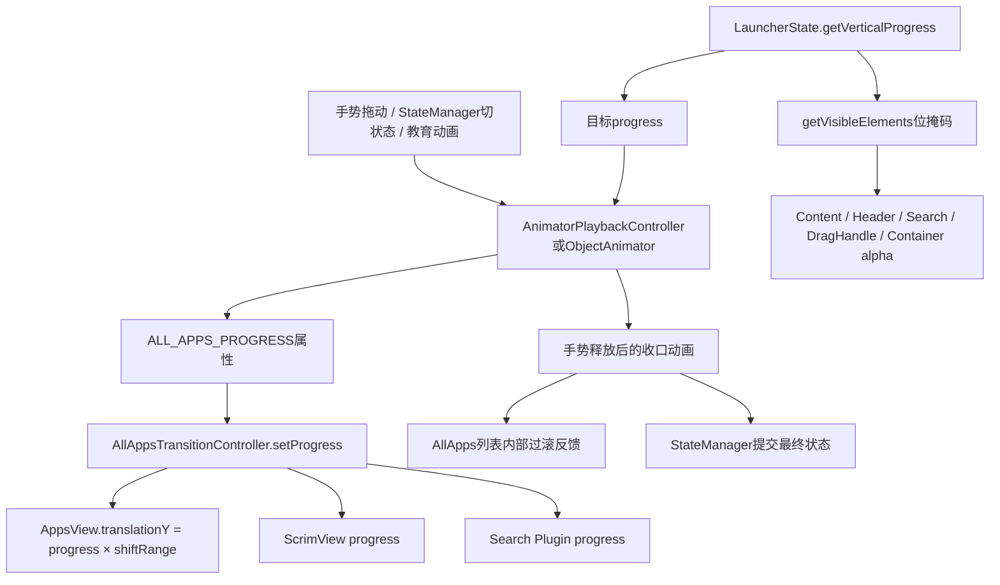
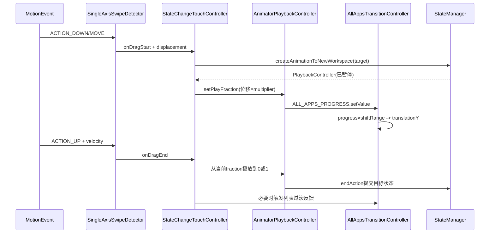
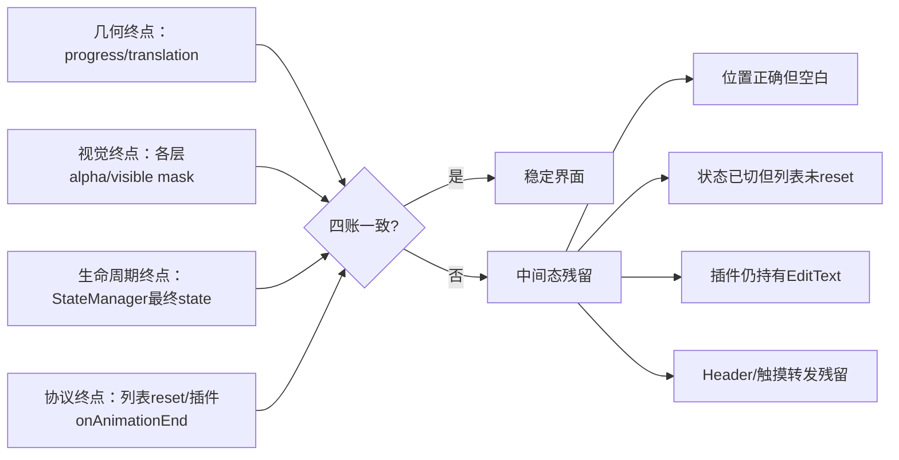

# 第522章 Android All Apps：TransitionController、手势 progress、状态位移、Alpha、Header/Search可见性和弹簧过滚链

> 源码基线：Android 11 / API 30 / `android-11.0.0_r48`。直接阅读 `packages/apps/Launcher3`，只读源码、不编译。核心文件：`allapps/AllAppsTransitionController.java`、`touch/AllAppsSwipeController.java`、`touch/AbstractStateChangeTouchController.java`、`LauncherState.java`、Quickstep中的`PortraitStatesTouchController.java`、`OverviewState.java`、`BackgroundAppState.java`、`uioverrides/states/AllAppsState.java`，以及`AllAppsContainerView.java`、`DiscoveryBounce.java`和`AllAppsEduView.java`。

## 1. 本章解决什么问题

从桌面上滑时，手指移动怎样变成All Apps整层的Y位移？为什么源码里的`progress=0`反而表示All Apps已经完全展开？状态切换动画与手势拖动为什么能共用同一条动画？Header、搜索框、滚动条、手势提示条和整个容器的alpha又为什么不是一起变化？

## 2. 一句话定位

`AllAppsTransitionController`是All Apps状态的“像素投影器”：它把`LauncherState`给出的垂直progress投影成容器translationY和Scrim进度，再按visible-elements位掩码投影各子区域alpha；手势控制器并不直接移动View，而是播放/倒放同一套StateManager动画。

## 3. 先分七本账

阅读时至少分开：状态目标progress、控制器当前progress、像素移动范围shiftRange、用户控制动画fraction、可见元素bit mask、各子View alpha，以及列表内部的过滚弹簧。名字里都可能出现“progress/animation”，但它们的单位、所有者和完成条件不同。

## 4. 总体数据流



## 5. Controller本身不是手势识别器

类注释说它处理direct manipulation，但它没有分析MotionEvent、速度或滑动阈值。MotionEvent先由`AllAppsSwipeController`或`PortraitStatesTouchController`处理，公共的`AbstractStateChangeTouchController`计算播放进度，最后才通过状态动画写入本Controller。

## 6. 全部垂直运动收敛到一个FloatProperty

静态`ALL_APPS_PROGRESS`的getter读`mProgress`，setter调用`setProgress`。因此普通ObjectAnimator、StateManager的PendingAnimation和XML教育动画都能把同一对象当成可动画属性，而不用分别知道AppsView、Scrim和插件。

## 7. progress方向最反直觉

源码约定`progress=0`表示All Apps拉到顶部、已经显示；`progress=1`表示容器被推到下面、桌面显示。用户向上拉时，数值从1减到0；向下返回桌面时，数值从0增到1。

## 8. 唯一核心公式

`shiftCurrent = progress × shiftRange`，随后写给`mAppsView.setTranslationY(shiftCurrent)`。若shiftRange为2400px，progress分别为1、0.6、0时，容器Y位移分别是2400、1440、0px。

## 9. progress不是屏幕绝对Y坐标

公式得到的是相对View布局位置的translationY，不是`getTop()`、屏幕坐标或触点Y。View原始布局top仍由Layout负责，渲染与命中计算再叠加translation。

## 10. `[0,1]`注释不是完整运行时约束

字段注释和`setProgress` Javadoc都写0到1，但setter没有clamp。Quickstep的`BackgroundAppState`会在Overview progress上继续加`shelfTrackingDistance/shiftRange`，常量`ALL_APPS_PROGRESS_OFF_SCREEN`也大于1；因此审计实际行为要看调用者，不能把注释当校验器。

## 11. progress大于1意味着什么

大于1时公式仍成立，AppsView会比普通Workspace终点继续向下移。它常用于让All Apps在后台应用/Overview相关状态中真正离屏，不表示动画损坏；只有无限值、NaN或与状态契约不符才是异常。

## 12. AllAppsState的目标值固定为0

Quickstep版和基础覆盖版`AllAppsState.getVerticalProgress()`都返回0。两版在可见元素、Workspace视差和Overview行为上不同，但“展开All Apps的垂直终点”一致。

## 13. LauncherState默认目标值为1

基类默认`getVerticalProgress()`返回1，所以NORMAL等没有覆盖的方法自然把All Apps放回下方。理解这一默认值后，很多状态类无需显式写“隐藏All Apps”。

## 14. Overview可能只露出一部分All Apps shelf

Quickstep `OverviewState`在Header extra不可见时沿用1；Header存在可见内容时返回`1 - defaultSwipeHeight/shiftRange`。结果介于0与1，让Overview底部提前露出一小段All Apps区域，为继续上滑建立连续手感。

## 15. BackgroundAppState可能把它推到1以下之外

非垂直栏布局中，BackgroundAppState在Overview目标上加shelf tracking distance除以shiftRange，所以可能超过1；垂直栏布局走不同视觉方案。状态的progress是设计参数，而不是强制归一化比例。

## 16. 状态、动画fraction和progress不能混写

动画fraction通常表示“从fromState走到toState多少”，始终围绕0到1播放；垂直progress是该动画插值后的属性值，方向可能是1到0、0到1或Overview到All Apps。看到`0.7`必须先问它属于哪一本账。

## 17. 至少有三类合法写入者

一是StateManager立即或动画切状态；二是手势PlaybackController按位移设置fraction；三是DiscoveryBounce、AllAppsEdu等引导动画临时驱动progress。它们应依赖生命周期与StateManager互斥，而不是依靠setter识别“谁拥有控制权”。

## 18. setupViews晚于构造

构造函数只保存Launcher、用DeviceProfile高度初始化shiftRange、把progress设为1并注册Profile监听；`mAppsView`和`mScrimView`由后续`setupViews`注入。正常Launcher初始化顺序保证在真正setProgress前完成注入。

## 19. 初始化顺序是隐含协议

`setProgress`、`onDeviceProfileChanged`和`setAlphas`都没有对AppsView/Scrim做完整null保护。若测试或定制启动流程在`setupViews`前触发这些入口会NPE；这不是Controller能够独立new后随意使用的通用组件。

## 20. FloatProperty只是统一入口，不保存动画

Property对象不拥有起止值、时长或取消状态；这些都属于ObjectAnimator/PendingAnimation/PlaybackController。它只是让动画框架以类型安全方式调用`getProgress/setProgress`。

## 21. setProgress真正做的三件事

```java
public void setProgress(float progress) {
    mProgress = progress;
    mScrimView.setProgress(progress);
    float shiftCurrent = progress * mShiftRange;

    mAppsView.setTranslationY(shiftCurrent);
    if (mPlugin != null) {
        mPlugin.setProgress(progress);
    }
}
```

它更新当前逻辑值、把值发给Scrim，再计算AppsView像素位移；Search Plugin存在时也收到同一progress。这里没有改Header alpha、搜索框alpha或StateManager当前状态。

## 22. setter没有clamp也没有去重

即使新值与旧值相同，它仍重写Scrim、translation和插件；即使值越界也照样下发。好处是shiftRange变化后再次写同一progress可以重投影，代价是上游必须保证值合理。

## 23. Scrim收到的是逻辑值而非像素

Scrim自己根据progress、设备布局和状态计算遮罩视觉；Controller没有把`shiftCurrent`传过去。于是遮罩算法不必反推屏幕高度，也能在range重算后保持同一状态语义。

## 24. AllApps整个容器先平移

translation施加到`AllAppsContainerView`根上，Recycler、Header、Search等子区域跟随整层移动；它们内部alpha和Header折叠再叠加。不要把“整层进场”与第521章“列表滚动导致Header内部折叠”画成同一坐标。

## 25. 插件拿progress后自行解释

插件setup时拿到shiftRange，拖动时再拿progress。Controller不知道插件是否平移、缩放或改搜索内容；这是一条跨模块契约，原生AppsView translation不会因为插件存在而停止。

## 26. 搜索UI可以缩短shiftRange

`setScrollRangeDelta(delta)`保存delta，并令`shiftRange = deviceHeight - delta`。通常搜索布局/Insets变化用它校正有效滑动距离，而不是修改各状态的progress目标。

## 27. range改变不会立即重算translation

方法注释明确“不更新UI”：它更新字段并让Scrim `reInitUi()`，却不再次调用`setProgress`。因此相同mProgress对应的新像素Y要等下一次属性写入才生效；配置流程若停在中间，可能短暂保留旧translation。

## 28. DeviceProfile变化会沿用旧delta

`onDeviceProfileChanged`先更新是否vertical bar，再调用`setScrollRangeDelta(mScrollRangeDelta)`，用新设备高度减旧delta。delta本身是否仍适合新搜索布局，依赖搜索/Insets链随后重新报告。

## 29. 垂直栏布局还强制清三项视觉

进入vertical bar时，它把AppsView的MultiValueAlpha第0通道设为1，并把Hotseat和Workspace PageIndicator的translationY归0。这说明侧边Hotseat布局不沿用手机竖屏那套“整体上推/淡出”投影。

## 30. 离开垂直栏不会在同一方法里反向恢复

`if (mIsVerticalLayout)`没有else。离开时预期由后续状态重投影设置正确alpha/translation；若定制配置流程没有完整重新应用LauncherState，可能短暂带着垂直栏终值。

## 31. StateHandler把状态与像素解耦

StateManager只问每个StateHandler：“切到这个LauncherState时你该怎样投影？”Workspace、Overview、Depth和All Apps各自处理自己的属性。一个LauncherState因此可同时决定页面缩放、模糊深度、All Apps位置和可见元素，却不直接操作View。

## 32. setState是立即收敛路径

它依次把progress设成状态目标、用无动画setter应用alpha，最后调用进度结束收尾。常用于无动画切换、初始化或动画取消后强制状态一致。

## 33. 立即路径也有“动画结束”语义

虽然没有Animator，`setState`仍调用`onProgressAnimationEnd`，因为重置列表和通知插件依赖“属性已经到终点”而非Animator对象存在。

## 34. setStateWithAnimation先比较当前与目标

若`Float.compare(mProgress,targetProgress)==0`，它不再创建垂直属性Animator；非atomic-only时仍应用alpha，然后直接执行结束收尾。这避免位置没变时遗漏显隐变化。

## 35. 位置相同不代表状态相同

两个LauncherState可以给出相同vertical progress却有不同visible-elements。例如Overview配置差异可能只改Header/按钮。早返回分支仍调用`setAlphas`正是为覆盖这种情况。

## 36. atomic-only配置会跳过本控制器

源码认为All Apps transition没有atomic component，所以当配置只播放atomic部分时直接return。若progress本来已经等于目标，则前一个分支会先调用结束收尾；这两个早返回的副作用并不完全相同。

## 37. 用户控制动画默认用LINEAR

手势位移需要“手移动多少，属性就跟多少”，因此`config.userControlled`时基础插值器选LINEAR。否则切到Overview可能借用Overview scale插值器，普通程序动画默认FAST_OUT_SLOW_IN。

## 38. ANIM_VERTICAL_PROGRESS可以覆盖默认曲线

配置若为该动画通道提供专用Interpolator，最终以它为准。Portrait手势控制器正是借此让不同状态对之间的垂直进度、All Apps淡入、Overview淡出采用不同曲线。

## 39. 多个动画通道共享时长但曲线可不同

PendingAnimation把vertical progress、内容alpha、Header alpha、Overview等属性放进同一时序；每个通道用StateAnimationConfig的key取Interpolator。用户看到的是合成结果，不是单个ObjectAnimator独自完成整次切换。

## 40. createSpringAnimation名字会误导

实现只是`ObjectAnimator.ofFloat(this, ALL_APPS_PROGRESS, progressValues)`，没有SpringForce、stiffness、dampingRatio或初速度。它之所以保留spring命名更像历史接口，而非当前r48实现事实。

## 41. 位置收口依赖外部时长与插值器

该ObjectAnimator本身在创建处没有setDuration；加入PendingAnimation后由builder整体时序管理。判断动画快慢要继续追StateManager创建的config和手势释放时对animation player的重设。

## 42. 成功监听器不是普通onEnd

`AnimationSuccessListener.forRunnable`只在动画未被取消的成功结束执行`onProgressAnimationEnd`。普通`AnimatorListenerAdapter.onAnimationEnd`在cancel后也可能到达，二者语义不能互换。

## 43. cancel不保证执行本地收尾

若progress动画取消，成功Runnable不执行；随后应由StateManager新动画或`setState`把界面收敛。单独取消Animator却不再投影状态，可能留下中间translation、未reset列表或插件文本搜索状态。

## 44. PendingAnimation是组装阶段

`setStateWithAnimation`不是立刻start；它把Animator和alpha属性操作加进builder。StateManager收集多个StateHandler后统一创建PlaybackController，手势才能暂停、按fraction拖动、反向或续播整组动画。

## 45. 当前状态在拖动中通常尚未提交

用户从NORMAL拖到一半时，AppsView像素已变化，但StateManager仍保留起始/过渡管理信息；只有结算成功的end action才把目标作为最终状态。不要用`isInState(ALL_APPS)`代替读取当前动画progress。

## 46. 手势到状态收口的完整链



## 47. 拦截门先保护All Apps列表滚动

位于ALL_APPS状态时，只有`AppsView.shouldContainerScroll(ev)`认为列表不能继续自己滚动，外层状态手势才接管向下返回。否则用户在应用列表中上下滚动不会误把整个All Apps拖走。

## 48. 打开的浮层也会挡住状态手势

基础AllAppsSwipeController拒绝存在开放FloatingView；Portrait版本明确排除可访问浮层和All Apps教育浮层。触摸优先级属于入口协议，而不是setProgress内部处理。

## 49. 动画进行中允许二次接管

控制器常在`mCurrentAnimation!=null`时允许重新拦截，使用户能在未收口前反向拖。Portrait版本还比较触点是否位于当前All Apps边界下方，避免抢走上方Overview任务卡的交互。

## 50. targetState由起点和方向共同决定

NORMAL向上可到ALL_APPS，也可能在Quickstep连接且允许时先到OVERVIEW；ALL_APPS向下可回NORMAL或StateManager lastState；OVERVIEW向上是否到ALL_APPS还受overview-actions/remove-shelf配置控制。

## 51. 同一手势控制器可跨多个状态段

Portrait版本覆盖NORMAL↔OVERVIEW↔ALL_APPS。拖动越过当前动画0/1边界时，公共控制器可重新初始化下一段，因此一次长拖并非永远只播放一个起止状态。

## 52. initCurrentAnimation先在像素域计算距离

它读取from/to各自vertical progress并乘shiftRange，得到startVerticalShift/endVerticalShift；`totalShift=end-start`。返回的progress multiplier是`1/totalShift`，把后续触摸像素位移换成动画fraction。

## 53. multiplier符号编码方向

NORMAL progress 1到ALL_APPS 0时totalShift为负，所以向上的负位移乘负数得到正fraction。源码无需到处写“向上取反”，状态目标差已经把方向编码进去。

## 54. maxAccuracy等于两倍range不是实际动画时长

`config.duration=(long)(2*range)`主要给PlaybackController提供足够细的时间轴/精度，单位虽是毫秒却由手势直接设置fraction；释放时又会按速度和剩余距离改Animator duration。不能把它当用户一定等待的时长。

## 55. totalShift为0有fallback

若两个状态vertical progress相同，Portrait控制器用状态ordinal符号乘Overview默认滑动高度，避免`1/0`。这种转场的主要视觉可能是Overview/Workspace通道，而非All Apps实际位移。

## 56. onDragStart还通知搜索插件

公共控制器确定目标涉及ALL_APPS或NORMAL后调用AllAppsController.onDragStart。向All Apps拖时启用文本搜索、把EditText交给插件，再以1或0告诉插件拖动方向；这发生在最终状态确定之前。

## 57. MOVE写的是整组动画fraction

公共`onDrag`把`displacement - startDisplacement`乘progressMultiplier，加起始fraction后交给PlaybackController。于是Workspace缩放、Overview淡出、All Apps位移和alpha同步响应，不是只调用Controller.setProgress。

## 58. fraction不应简单等同于垂直progress

NORMAL→ALL_APPS时fraction从0到1，而All Apps progress从1到0；OVERVIEW→ALL_APPS则从Overview目标到0；Interpolator还可能让属性值非线性。因此日志只打印一个“progress”很容易误判方向。

## 59. 越界拖动会尝试切换下一段

当计算fraction到达或越过0/1，控制器根据方向和是否有相邻状态重新初始化，并调整位移起点。这样状态链可连续，但每一段仍有自己的from/to、multiplier和动画配置。

## 60. fling优先看速度方向

释放被判定为fling时，目标主要由velocity与multiplier的符号决定；即使位置尚未过半，足够快的方向也可完成或回退。若不是fling，再按位置阈值决定。

## 61. 非fling阈值并非一律0.5

面向ALL_APPS时使用`MIN_PROGRESS_TO_ALL_APPS`专用阈值，其他转场通常用0.5；判断还基于PlaybackController的interpolated progress。手指几何移动过半不一定等于视觉属性恰好过半。

## 62. 释放判断会预估下一帧

公共控制器用当前progress加`progressVelocity × 单帧时间`估计下一帧位置，减少手指抬起后动画方向突然跳变。它仍是近似预测，不是物理积分器。

## 63. 结算duration由剩余距离和速度共同决定

BaseSwipeDetector计算完成动画时长，受最大/最小时长和blocked-fling倍数等约束；然后Animator从当前fraction走到目标0或1。用户控制阶段线性，释放阶段可以改Interpolator与duration。

## 64. 状态提交绑定在整组动画end action

`mCurrentAnimation.setEndAction(() -> onSwipeInteractionCompleted(...))`，成功收口后StateManager才最终`goToState(target,false)`并清手势状态。Controller本地的progress成功监听与StateManager提交是两条相关但不同的完成账。

## 65. 回到fromState属于取消交互，不等于cancel Animator

释放后目标若是fromState，代码会派发controller的cancel语义/日志并把动画播放回0；它仍可以正常播放成功结束。真正调用Animator.cancel则可能跳过AnimationSuccessListener收尾。

## 66. 真正的列表弹簧不在createSpringAnimation里

当fling目标为ALL_APPS且`UNSTABLE_SPRINGS`关闭，公共控制器调用`AppsView.addSpringFromFlingUpdateListener(anim,velocity)`。这条路径把收口后段的速度转成Search/Recycler区域的SpringRelativeLayout过滚反馈。

## 67. 过滚从收口动画55%后触发

监听器等Animator fraction达到0.55才调用`finishWithShiftAndVelocity`，并用布尔保证一次。它不是手指刚抬起就弹，也不是每一帧重复启动弹簧。

## 68. 速度还乘固定比例135

容器把传入velocity乘135后交给弹簧实现，另外给固定方向/shift参数。这个数是体验调参，不是由shiftRange公式推导；更换速度单位或手势检测器时不能盲目复用。

## 69. Feature Flag切换的是两种实验路径

`UNSTABLE_SPRINGS`关闭时走上述稳定列表弹簧；打开时Portrait控制器在部分Overview手势里使用overshoot interpolator和“第二次触摸快速完成”等实验逻辑。不能仅凭变量名推断当前构建一定启用哪一套。

## 70. Alpha投影先解可见元素位掩码

```java
int visibleElements = state.getVisibleElements(mLauncher);
boolean hasHeaderExtra =
        (visibleElements & ALL_APPS_HEADER_EXTRA) != 0;
boolean hasAllAppsContent =
        (visibleElements & ALL_APPS_CONTENT) != 0;
boolean hasAnyVisibleItem =
        (visibleElements & APPS_VIEW_ITEM_MASK) != 0;
```

三项含义不同：额外Header Row、主要All Apps内容，以及AppsView范围内是否有任一应显示元素。后续每个子区域使用不同布尔和Interpolator。

## 71. APPS_VIEW_ITEM_MASK是集合不是单一位

它组合Hotseat Search Box、All Apps Header、Header Extra和Content等位。只要其中一个存在，根AppsView就应该保持可见，即使主Recycler内容alpha为0。

## 72. 原生content和scrollbar同进退

无搜索插件时，Apps content view与scrollbar都按`hasAllAppsContent`在`ANIM_ALL_APPS_FADE`曲线上变alpha。Header则进一步收到header-extra/content两个布尔，自行区分预测行、Tab和触摸转发。

## 73. Header Extra与Header不是同一个bit

AllAppsState Quickstep版同时给`ALL_APPS_HEADER`与`ALL_APPS_HEADER_EXTRA`；Overview可能只根据预测Row是否有内容给extra。搜索框/Header壳仍可能存在，而预测/Divider/插件Row采用另一显隐策略。

## 74. 搜索UI单独读取完整mask

`SearchUiManager.setContentVisibility(visibleElements,...)`获得所有bit，而非单个hasContent。不同搜索实现可以判断Hotseat search与All Apps header等来源，Controller无需写死搜索View层级。

## 75. Drag Handle alpha属于ScrimView

`VERTICAL_SWIPE_INDICATOR`存在时，把Scrim的`DRAG_HANDLE_ALPHA`设255，否则0。它在视觉上位于All Apps入口附近，但状态所有者和属性承载者是Scrim，不是FloatingHeader。

## 76. 根容器显示用INSTANT，隐藏用FINAL_FRAME

目标状态需要任一Apps item时，根AppsView alpha在动画开头立刻变1，让内部内容有机会淡入；目标完全不需要它时，根alpha直到最后一帧才变0，让内部淡出不被父alpha提前截断。

## 77. 父alpha与子alpha叠乘

根alpha、content alpha、Header Row alpha、BubbleTextView自身alpha会共同影响最终像素。调试“图标怎么不见了”要逐层检查，而不是只看`mAppsView.getAlpha()`。

## 78. 位置和alpha由两条属性动画并行驱动

setProgress只管整层translation、Scrim和插件progress；setAlphas按目标状态组装显隐动画。位置已经到位而content仍在淡入，或content先可见而整层尚在移动，都是设计允许的中间态。

## 79. Overview→All Apps内容在前8%快速出现

Portrait配置把`ANIM_ALL_APPS_FADE`夹在0到0.08的ACCEL区间，后面保持完全可见；这样继续上滑时All Apps内容很早建立，而Recents仍保留到接近末段。

## 80. Recents在最后12%才主要淡出

`ANIM_OVERVIEW_FADE`使用0.88到1区间的DEACCEL。两个内容层有长时间重叠，靠位置、遮罩、缩放和层级共同构成连续过渡，并非严格先隐藏A再显示B。

## 81. 反向转场会镜像淡入淡出窗口

ALL_APPS→OVERVIEW时All Apps fade集中在末段对应区间，Overview fade集中在早段；源码用`1-threshold`计算。反向播放不只是把同一个alpha Animator倒放，配置也明确表达方向。

## 82. NORMAL↔ALL_APPS也用8%内容窗口

直接从Workspace进入时All Apps内容在开始8%迅速出现，返回Workspace时到最后8%才消失；根容器的INSTANT/FINAL_FRAME再保证父层不会裁掉这段淡变。

## 83. AllAppsState可见位在不同源码集有差异

Quickstep版返回Header、Header Extra、Content；基础`src_ui_overrides`版返回Header和Content，没有extra。阅读产品行为要先确认构建选择了哪套source set，不能把同名类两份实现混合成一个运行结果。

## 84. Plugin分支替换的是内容投影

插件连接时，Controller让plugin content按hasContent变alpha，并把原生content和scrollbar固定到0。根AppsView仍移动，SearchUiManager仍收mask，插件并没有替换整个AllAppsContainerView。

## 85. Plugin分支没有刷新FloatingHeader内容可见性

原生分支调用`FloatingHeaderView.setContentVisibility`，插件分支没有。切入插件后，旧Header Row alpha/触摸转发可能保持上次状态，依赖插件布局遮挡或后续生命周期；这是r48值得验证的状态残留边界。

## 86. 根alpha写法与MultiValueAlpha要分清

AllAppsContainerView内部创建MultiValueAlpha通道，但`setAlphas`通过PropertySetter写根View alpha；DeviceProfile垂直栏路径又直接写第0通道。二者最终都影响View alpha，定制代码应继续追MultiValueAlpha合成规则，不能假设两个值互不干扰。

## 87. onProgressAnimationEnd只在精确1时reset

结束方法用`Float.compare(mProgress,1f)==0`，成立才`mAppsView.reset(false)`。reset会把All Apps列表/Header/搜索相关滚动恢复，确保下次从顶部进入；停在0.999999不会触发。

## 88. reset依据数值而非状态名字

任何最终progress精确为1的状态都会触发reset，不一定只叫NORMAL；反过来若定制NORMAL目标不是1也不会reset。这里的TODO也承认终态逻辑更适合放进LauncherState。

## 89. reset发生在成功位置收口后

用户向下拖到Workspace途中，列表内部仍保留原滚动；只有位置动画成功到1才reset。若中途反向回All Apps，用户仍能看到之前的列表位置，体验更连续。

## 90. 插件连接会动态添加一棵content View

Controller inflate `all_apps_content_layout`并add到AppsView，初始alpha=0，再调用plugin.setup(parent,launcher,shiftRange)。插件内容和原生content同时存在于树中，只由alpha选择谁显示。

## 91. 插件只在setup时拿一次range

后续DeviceProfile或搜索delta改变shiftRange时，Controller会更新自身并reInit Scrim，却没有再次调用plugin.setup或独立通知新range。插件若缓存像素range，旋转/Insets变化后可能与原生translation口径不同。

## 92. 插件断开清View但不清mPluginContent引用

disconnect把mPlugin设null并removeView(mPluginContent)，字段仍指向已移除View；正常下一次connect会覆盖。方法也没验证回调参数是否就是当前插件，依赖PluginManager不发送乱序旧disconnect。

## 93. 断开后原生alpha不会当场恢复

remove插件View后没有立即调用setAlphas；原生content此前被压到alpha0，需等待下一次状态投影才能恢复。插件管理器/状态机通常会触发后续布局，但定制热插拔应显式验证空白窗口。

## 94. 向All Apps拖动会启用文本搜索

插件存在且`toAllApps=true`时，Controller让SearchUiManager启用text search，拿到EditText交给插件；向下离开只调用plugin.onDragStart(0)，不会在起始瞬间清EditText。

## 95. 精确回到1才关闭插件文本搜索

成功结束后总会`plugin.onAnimationEnd(mProgress)`；仅当progress精确1时禁用text search并`plugin.setEditText(null)`。All Apps终点0仍保留搜索输入能力。

## 96. 取消动画可能延后插件清理

因为通知在AnimationSuccessListener里，cancel不会运行`updatePluginAnimationEnd`。正常新状态投影最终会补上；若外部只cancel而不收敛，插件可能继续持有EditText或认为拖动尚未结束。

## 97. DiscoveryBounce是另一个progress写入者

它加载XML animator，用`VerticalProgressWrapper`围绕当前Controller progress加delta做轻微上下弹动，引导用户发现All Apps。关闭时重新读取StateManager当前state目标并调用setProgress恢复。

## 98. Wrapper用delta保持XML动画的统一坐标

`getProgress()`返回controller progress加delta，`setProgress(x)`写回`x-delta`。Overview和NORMAL起始progress不同，wrapper可让同一XML关键帧相对当前基准运动，而不是为每个状态复制资源。

## 99. Discovery延迟任务会重新检查资格

它把开启动作延迟约450ms，回调没有作为字段统一取消，但真正执行时检查Launcher是否仍可显示、状态是否允许、提示次数等。状态变化也会关闭已打开View，降低过期引导抢占手势的概率。

## 100. AllAppsEdu只播放完整转场的一小段

教育View创建到ALL_APPS的State animation，却只把PlaybackController fraction推到约0.15（横屏约0.35）再退回，同时显式设置All Apps alpha；结束强制回NORMAL并关闭。它演示了“动画fraction局部播放”不等于状态真正提交。

## 101. 多写入者必须靠生命周期交接

DiscoveryBounce监听状态转换和触摸后关闭，AllAppsEdu作为FloatingView阻止普通状态手势，StateManager取消旧动画再启动新动画。setter本身没有owner token；若新增引导忘记这些门，两个Animator会在主线程交替写最后值，产生抖动。

## 102. 一次转场要同时对齐四个终点



## 103. 这些核心调用都在Launcher进程

AllAppsTransitionController、StateManager、MotionEvent控制器、AppsView和Animator运行在Launcher应用进程；本章主链没有跨SystemServer Binder。Quickstep的SystemUiProxy等入口可能跨进程，但不负责每帧translation写入。

## 104. 每帧属性更新应在主线程

MotionEvent、ValueAnimator和View属性操作按Android UI模型运行在Launcher主线程。源码没有给mProgress、mPlugin或View字段加锁，正确性依赖串行Looper；后台插件回调也应由PluginManager约定切到合适线程。

## 105. 没有Binder不等于没有异步边界

Animator帧、postDelayed教育任务、DeviceProfile回调、插件连接和StateManager end action在不同消息时点发生。竞态表现更多是“旧回调晚到覆盖新投影”，而非多线程数据竞争。

## 106. 调试先打印五元组

建议同一行记录`fromState/toState`、Playback fraction、AllApps progress、shiftRange/translationY、AppsView/content/header alpha。只看MotionEvent dy或只看StateManager state，无法定位错误发生在手势换算、属性插值还是显隐投影。

## 107. 再记录完成原因

区分正常end、回退到fromState、Animator cancel、配置变化重投影和立即setState；同时记录是否执行AppsView.reset及plugin.onAnimationEnd。许多“偶现下次进入列表位置不对”其实是完成协议没走完。

## 108. 推荐的源码阅读顺序

先读LauncherState三个progress目标，再读Controller的setProgress/setAlphas；随后读具体SwipeController的拦截与target选择，再读AbstractStateChange的drag/end；最后读AllAppsContainer spring、DiscoveryBounce和Edu。按数据流读比从某个大类顺序翻文件更容易闭环。

## 109. 不要把Scrim、Header与AppsView当一个层

Scrim承担背景遮罩和drag handle；AppsView根承担整层translation/父alpha；FloatingHeader承担预测行、Tab、clip与内部滚动折叠。三者可同时改变，且坐标基准不同。

## 110. 不要用方法名替代实现证据

`createSpringAnimation`不是物理弹簧，`setScrollRangeDelta`不立即更新UI，`onProgressAnimationEnd`也只在成功路径或立即投影中到达。源码学习最重要的习惯是继续读方法体和调用者。

## 111. 本章无需编译也能验证

用`rg`定位所有`ALL_APPS_PROGRESS`、`getVerticalProgress`、`setAlphas`和`addSpringFromFlingUpdateListener`引用；用`sed/nl`上下文确认调用顺序；再手算几个状态目标即可验证大多数结论。macOS只读练习不执行Gradle、不生成out目录。

## 112. macOS只读练习一：手算位置

在源码根目录执行`rg -n "getVerticalProgress|setProgress\(|mShiftRange" packages/apps/Launcher3`，找出NORMAL、OVERVIEW、ALL_APPS三个目标。假设range=2400、Overview progress=0.9，写出三态translationY，并说明NORMAL→ALL_APPS时progress和动画fraction各自增减方向。

## 113. macOS只读练习二：追一条直接上滑

依次只读`AllAppsSwipeController`、`AbstractStateChangeTouchController`、`AllAppsTransitionController`。画出ACTION_DOWN、drag start、create animation、setPlayFraction、属性setter、ACTION_UP、end action七步，并在每步标出当前状态是否已经提交。

## 114. macOS只读练习三：制作可见性表

读取`LauncherState.java`、两份`AllAppsState.java`和Quickstep `OverviewState.java`，列出`ALL_APPS_HEADER`、`HEADER_EXTRA`、`CONTENT`、`VERTICAL_SWIPE_INDICATOR`在NORMAL/OVERVIEW/ALL_APPS的存在情况，再推导content、Header、drag handle和根AppsView目标alpha。

## 115. macOS只读练习四：证明两种“弹簧”不同

执行`rg -n -C 6 "createSpringAnimation|addSpringFromFlingUpdateListener|finishWithShiftAndVelocity" packages/apps/Launcher3`。分别记录类、返回类型、触发时点、是否接收velocity、是否有物理弹簧参数，最后用一句话解释为什么不能把两条链合并描述。

## 116. 易错点一：0不是隐藏，1才是下拉

这是最常见的方向错误。记忆时不要背“完成度”，而背几何：progress乘range就是向下translation；越大越往下，0自然回到布局原位并显示All Apps。

## 117. 易错点二：StateManager状态不是每帧像素真相

用户控制动画期间最终state尚未提交，但属性已经处于中间值；取消、反向和跨段重初始化也会改变from/to。需要同时观察动画controller与AllApps progress。

## 118. 易错点三：Alpha不是一个总开关

根容器、原生content、scrollbar、Header rows、Search UI、drag handle和插件content分别投影。父层INSTANT/FINAL_FRAME只是保证淡变窗口，不能替代子层状态。

## 119. 复读后的准确性修正

初稿容易写成“progress永远0到1”“createSpringAnimation提供弹簧”“动画结束总会reset”“插件完全替代All Apps”。按调用者反查后修正为：值可越界；该方法是ObjectAnimator；仅成功且精确到1才reset；插件只替换内容alpha，根容器、Scrim、搜索和状态链仍由Launcher掌管。

## 120. 本章总结与下一章

All Apps转场的核心是把LauncherState目标投到一个可动画progress，再由它驱动整层Y位移、Scrim和插件；手势通过PlaybackController操纵整组状态动画，visible-elements独立决定多层alpha，释放后还要分别完成状态提交、列表reset与插件协议。下一章继续拆`ScrimView`、`ShelfScrimView`、`SystemUiController`和`DepthController`，看遮罩颜色、系统栏图标、壁纸缩放与模糊深度如何随Launcher状态共同收敛。
