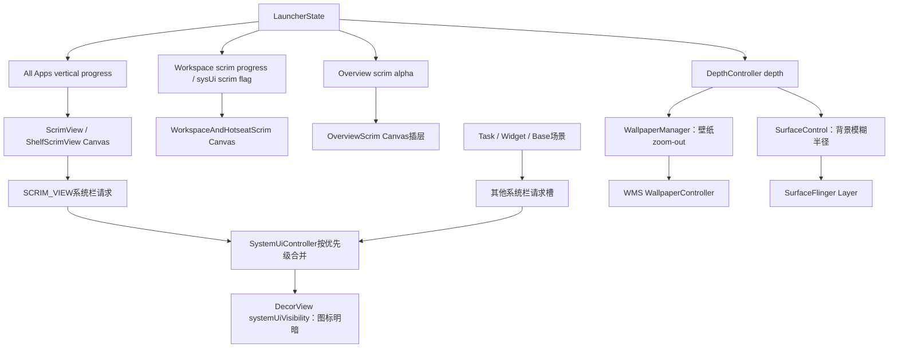
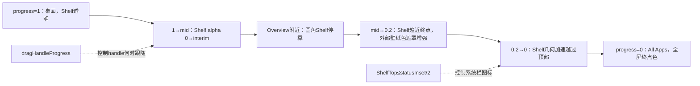
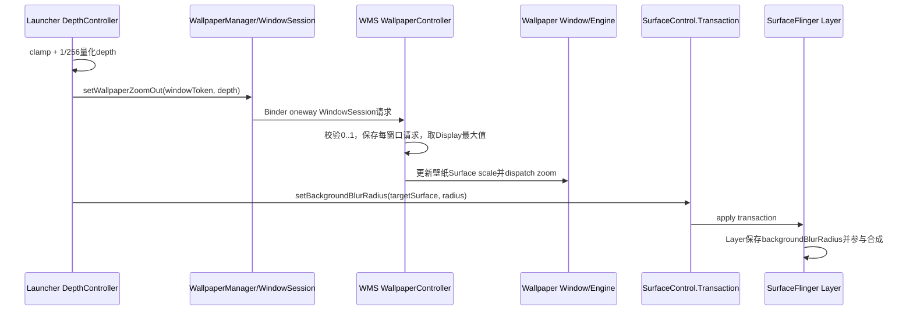

# 第523章 Android Launcher视觉深度：ScrimView、Shelf Scrim、SystemUiController、壁纸缩放和背景模糊链

> 源码基线：Android 11 / API 30 / `android-11.0.0_r48`。直接阅读`packages/apps/Launcher3`、`frameworks/base`和`frameworks/native`，只读源码、不编译。核心文件：`views/ScrimView.java`、Quickstep `views/ShelfScrimView.java`、`graphics/Scrim.java`、`WorkspaceAndHotseatScrim.java`、`OverviewScrim.java`、`util/SystemUiController.java`、Quickstep `statehandlers/DepthController.java`，以及`WallpaperManager.java`、WMS `WallpaperController.java`、SystemUI shared `BlurUtils.java`和SurfaceFlinger `Layer.cpp`。

## 1. 本章解决什么问题

进入All Apps或Overview时，屏幕“变暗/变亮”的像素究竟由哪一个对象画？为什么Shelf既会向上移动又会覆盖剩余屏幕？状态栏和导航栏图标为什么会切成黑色或白色？壁纸缩放、Launcher背景模糊与普通半透明遮罩又分别在哪一层完成？

## 2. 一句话定位

Launcher用多套Scrim在Canvas里画颜色和渐变，用`SystemUiController`合并多个场景对系统栏图标明暗的请求，用`DepthController`把LauncherState的depth投给壁纸zoom和SurfaceControl背景模糊；它们同时营造“深度”，却是三条不同的渲染/协议链。

## 3. 先分九本账

至少区分All Apps progress、Shelf top几何、Shelf/remaining-screen两种颜色、Workspace scrim progress、Overview scrim progress与multiplier、系统栏四个优先槽、LauncherState depth、壁纸每窗口zoom请求，以及目标Surface blur radius。把它们统称alpha会丢失所有权和完成点。

## 4. 总体视觉分层



## 5. 项目里有两个不同的Scrim概念

`com.android.launcher3.views.ScrimView`是真正的View，主要承载All Apps背景、Shelf和drag handle；`com.android.launcher3.graphics.Scrim`不是View，而是被DragLayer在指定绘制位置调用的辅助对象，派生出Workspace/Hotseat与Overview两套遮罩。类名相近但继承树完全不同。

## 6. ScrimView的基础职责

基础实现读取壁纸提取色和主题`allAppsScrimColor`，根据All Apps progress合成当前平面颜色，画drag handle，还根据遮罩是否到达状态栏区域向SystemUiController发图标明暗请求。

## 7. ScrimView不负责All Apps内容alpha

上一章的`AllAppsTransitionController.setAlphas`控制Recycler/Header/Search等内容；本类的`setProgress`主要控制背景Canvas和系统栏请求。内容可见、背景覆盖与整个AppsView平移是三本账。

## 8. 壁纸色来自WallpaperColorInfo

Quickstep版直接监听`WallpaperManager.OnColorsChangedListener`，用`TonalCompat.extractDarkColors`生成main/secondary和dark-text信息；基础source override使用兼容WallpaperManager与ColorExtractionAlgorithm。构建只选其中一版，不能把两套提取算法同时算入运行时。

## 9. 颜色回调被投到主Looper

Quickstep实现注册Listener时显式传`new Handler(Looper.getMainLooper())`。Scrim在attach时加入自身listener并立即读取当前颜色，detach时移除；后续壁纸变化在主线程更新颜色并invalidate。

## 10. WallpaperColorInfo是进程内共享对象

它由`MainThreadInitializedObject`懒初始化，Launcher内多个Scrim共享同一份颜色提取结果和listener列表。它不是每个View各自去Binder查询一次的临时对象。

## 11. listener通知先复制数组

Quickstep版把ArrayList复制到临时数组再遍历，避免回调期间Activity销毁/监听移除导致ConcurrentModification。但它复用可能大于当前列表的旧数组并遍历整个数组：`toArray`只保证紧随有效数据的一项置null，更后的尾部可能保留旧listener；逐项null判断不一定阻止这些陈旧回调，这是r48边界。基础版在size变化时改用精确长度数组，没有同样的尾部形态。

## 12. Scrim终点色是两次合成

`mEndScrim`来自主题，`mScrimColor`来自壁纸；先把壁纸色alpha限制为`mMaxScrimAlpha×255`，再用`compositeColors(endScrim, translucentWallpaperColor)`求`mEndFlatColor`。参数顺序让主题色处于前景；stock样式的All Apps色通常为全不透明，此时结果就是主题色，只有主题前景含透明度时壁纸提取色才影响合成终点。

## 13. 基础ScrimView最大壁纸参与alpha为0.7

构造把`mMaxScrimAlpha=0.7f`。最终`mEndFlatColorAlpha`取合成结果自身alpha，后续All Apps progress再在0到这个alpha之间缩放；一般模型包含主题色、壁纸色和progress，但stock不透明主题色会遮住壁纸色贡献。

## 14. progress方向延续上一章

Scrim收到All Apps vertical progress：1表示All Apps在下方，0表示到顶。背景alpha因此使用`1-progress`，而不是progress；越接近0，遮罩越完整。

## 15. 基础颜色公式

```java
protected void updateColors() {
    mCurrentFlatColor = mProgress >= 1 ? 0 : setColorAlphaBound(
            mEndFlatColor,
            Math.round((1 - mProgress) * mEndFlatColorAlpha));
}
```

progress大于等于1时直接透明；小于1时线性增大终点色alpha。setter没有clamp，因此progress<0会请求超过终点的alpha，但`setColorAlphaBound`会把通道限制在合法范围。

## 16. setProgress只在值变化时工作

新旧float用`!=`比较；变化后停止drag-handle教育动画、重算颜色、系统栏请求、handle alpha并invalidate。重复写同值不会重刷，这与上一章AllApps Controller每次都下发View translation的行为不同。

## 17. NaN会持续被判为变化

Java中NaN与自身`!=`为true，所以若错误调用者传NaN，每次都会重算和invalidate；颜色映射的转换结果也可能异常。正常LauncherState/Animator不应生成NaN，setter没有主动防御。

## 18. 平面Scrim只在progress≤0.1时接管系统栏

`updateSysUiColors`把`mProgress<=0.1f`作为force-change门。注释提“覆盖状态栏一半”，但代码阈值是归一化经验值，没有按status bar像素高度计算；真正Shelf子类会用几何top判断。

## 19. isLight参数描述背景，不是图标颜色

当终点Scrim不暗时传`isLight=true`，SystemUiController设置Android的LIGHT_STATUS/NAV标志；这些标志表示系统栏背景明亮、应使用深色图标。口语说“light flags”时不要误写成白色图标。

## 20. 未到阈值时清除本槽请求

Controller调用`updateUiState(UI_STATE_SCRIM_VIEW,0)`，不是强制恢复某个固定图标色。0表示该槽不表态，最终结果继续由Base、Widget或Overview等其他槽决定。

## 21. ShelfScrimView只在Quickstep源集中替换基础表现

它继承ScrimView，在竖屏/横向Hotseat条件下决定画圆角Shelf还是普通全屏颜色。注释中的“transposed layout”对应vertical-bar布局，此时回退到父类flat color。

## 22. reInitUi是几何与状态的汇合点

AllApps shiftRange变化会调用Scrim `reInitUi`。Shelf版在这里读取DeviceProfile、导航模式、Overview可见元素、Insets、Hotseat padding和主题interim alpha，重新计算全部阈值后再统一更新颜色、系统栏和handle。

## 23. flat/shelf模式由vertical bar决定

`mDrawingFlatColor=dp.isVerticalBarLayout()`。侧边Hotseat下没有底部向上推的圆角Shelf，直接使用父类平面背景；普通布局才计算mShelfTop、radius和remaining-screen颜色。

## 24. midProgress代表Overview视觉中点

若Overview显示`ALL_APPS_HEADER_EXTRA`，mMidProgress直接取Overview vertical progress，mMidAlpha取主题interim值。这样NORMAL→OVERVIEW先形成半透明Shelf，OVERVIEW→ALL_APPS再从中间alpha走到完整终点。

## 25. 没有Header Extra时存在两个分支

若开启Overview actions且remove-shelf配置为真，仍以`OverviewState.getDefaultVerticalProgress`和interim alpha快速区分从导航栏上滑；否则mMidProgress=1、mMidAlpha=0，相当于没有独立Overview shelf停靠视觉。

## 26. dragHandleProgress按Hotseat占用反推

有Header Extra时，它取Hotseat尺寸与默认滑动高度的较小者，除以shiftRange后从1减去；progress低于该值才让handle随Shelf上移。无Header Extra时设为1，进入手势后更早开始移动。

## 27. Shelf top有两段公式

progress≥0.2时`top=shiftRange×progress+topOffset`，基本跟手；低于0.2时用mapRange从阈值top加速赶到`-radius`，使圆角边缘在All Apps完全展开时越过屏幕顶部，避免留下缝隙。

## 28. 0.2是catch-up阈值而非动画完成阈值

它只改变Shelf top的几何映射，不决定StateManager是否完成、内容是否全显或系统栏是否切色。多个阈值处于同一次手势中，必须标注所属属性。

## 29. mTopOffset从状态栏Insets推导

`topOffset=insets.top-dragHandleHeight`。Shelf几何不是简单等于AppsView translationY；它对齐handle与状态栏覆盖时点，允许系统栏图标在圆角背景真正到达后再切换。

## 30. Shelf颜色也分前后两段

progress在mid到1之间时，shelf alpha从0到interim；progress在0到mid之间时，从interim到主题终点alpha。由于progress实际从1下降到0，源码注释反复提醒Interpolator方向是反的。

## 31. 剩余屏幕颜色只在后半段出现

progress低于mid后，圆角Shelf之外的区域才以壁纸main color从透明增至Overview最大Scrim alpha；这能让Shelf内部用主题All Apps色，圆角外仍保持与壁纸协调的遮罩。

## 32. Shelf阶段图



## 33. progress≥1仍可能画peek Shelf

正常分支把两种颜色清0；但无按钮导航、State为BACKGROUND_APP或QUICK_SWITCH且ShelfPeekAnim正peeking时，会把Shelf设为interim alpha。它是手势预览例外，证明progress=1不能单独决定全部像素。

## 34. 导航模式会替换颜色曲线

NO_BUTTON使用ACCEL_2/ACCEL，让Shelf在到Overview前更快出现，并按FeatureFlag判断two-zone模型；其他导航使用ACCEL和后半段clamp曲线。导航模式监听在attach注册、detach移除。

## 35. Shelf系统栏门使用真实几何

非flat模式判断`mShelfTop <= topInset/2`。只有背景顶部越过状态栏一半才由SCRIM_VIEW槽请求图标反色，比父类固定progress 0.1更能适应不同高度/range。

## 36. drawBackground先判断最便宜路径

flat模式直接drawColor；Shelf alpha为0就return；progress≤0时直接全屏draw shelfColor。只有圆角中间态才构造/绘制remaining path与roundRect。

## 37. remaining path用差集形成圆角之外区域

先建立全屏Rect，再减去一个底部超出屏幕的RoundRect，得到Shelf外的上方/圆角角落区域；绘制时按当前shelfTop平移Path。源码看起来想复用这个形状，但下一节会看到缓存标志没有闭环。

## 38. Path缓存标志从未变成true

`mRemainingScreenPathValid`在onSizeChanged和reInitUi置false，构建Path后却从未被赋值为true；全文件也没有任何true写入。因此只要remaining-screen颜色非零，圆角中间态每帧都会reset、add和`Path.op(DIFFERENCE)`。字段命名表达了缓存意图，实现却缺少完成写，这是r48可直接确认的性能缺口。

## 39. 底部额外加10像素是抗舍入补偿

RoundRect bottom使用`height+radius+10`，注释说明避免圆角舍入留下残像。这不是DeviceProfile维度或导航栏高度，只是绘制安全余量。

## 40. drag handle是ScrimView自己的Drawable

它不是AllAppsContainer子View。Scrim根据DeviceProfile把bounds放在Hotseat/侧边栏附近，扩大mHitRect作为触摸与ExploreByTouch虚拟节点区域，再按Shelf offset临时translate Canvas绘制。

## 41. Drag handle alpha由外部visible-elements写入

第522章Controller把Scrim的`DRAG_HANDLE_ALPHA`设255或0；Scrim只把该值写给当前Drawable。Drawable是否存在还受vertical bar、Accessibility和Shelf onboarding条件控制，所以alpha255不保证屏幕一定有handle。

## 42. two-zone onboarding可以强制显示handle

Shelf覆盖`shouldDragHandleBeVisible`：two-zone模型且ALL_APPS_COUNT未达到最大值时显示，或者父类认为vertical bar/Accessibility需要显示。教育完成后可能移除Drawable，但状态alpha账仍保留。

## 43. 点handle会播放三次bounce

基础动画总bounce 300ms加200ms间隔、repeatCount=2，即总共3次。Drawable暂时从字段移到ViewOverlay，bounds先向上一个自身高度再回到底部；完成后移出overlay并按当前可见条件复用或丢弃。

## 44. stop用end而非cancel

progress变化或新触摸调用`mDragHandleAnim.end()`，会直接到终点并触发onAnimationEnd清overlay/恢复字段。这里需要完成listener做资源交接，所以不用cancel跳过终态。

## 45. Scrim还是All Apps的无障碍入口

ExploreByTouchHelper暴露虚拟drag-handle节点，CLICK会记录ALL_APPS_BUTTON并让StateManager进入ALL_APPS；NORMAL时还提供壁纸、Widget、设置三个自定义Action。它不只是纯绘制View。

## 46. Accessibility开启与关闭都可能隐藏整个Scrim语义树

启用时注册StateListener：进入ALL_APPS后把Scrim设`NO_HIDE_DESCENDANTS`，其他状态AUTO；关闭时直接设NO_HIDE_DESCENDANTS。虚拟handle只在需要无障碍入口的阶段参与探索。

## 47. 打开Widget时临时隐藏虚拟节点

执行WIDGETS action先保存importance并隐藏Scrim后代，Widget sheet创建失败就立刻恢复；成功则在sheet detach时恢复并移除listener，避免两个无障碍层同时暴露。

## 48. graphics.Scrim是轻量Canvas代理

它保存root View、壁纸色、scrimProgress和alpha；attach监听壁纸变化，`draw(canvas)`以main color和alpha直接铺色，`invalidate()`实际调用root.invalidate。它没有Measure、Touch或Accessibility生命周期。

## 49. Workspace与Overview Scrim由不同StateHandler控制

WorkspaceStateTransitionAnimation读取`getWorkspaceScrimAlpha`和`FLAG_HAS_SYS_UI_SCRIM`；BaseRecentsViewStateController读取`getOverviewScrimAlpha`。同一个LauncherState可给两条链不同值，例如Hint State的Overview scrim为0.4但Workspace scrim沿用0。

## 50. Workspace Scrim在所有DragLayer children下面画

DragLayer.dispatchDraw开头先`mWorkspaceScrim.draw(canvas)`，再绘制Focus indicator和children。它像铺在壁纸/根背景上方、Launcher所有子View下方的底色，不会把图标本身整体盖暗。

## 51. SpringLoaded的Workspace遮罩为0.3

拖拽进入SpringLoadedState时`getWorkspaceScrimAlpha()`返回0.3，同时depth=0.5、Workspace缩小。三条视觉共同产生“可放置模式”，不能把图标缩放误归因于Scrim。

## 52. Workspace Scrim会给当前拖拽页挖洞

有`currentDragOverlappingLayout`且不是Hotseat时，先把该CellLayout映射到DragLayer坐标，再用Region DIFFERENCE clip后画遮罩。当前目标页保持亮，其他区域变暗。

## 53. Region.Op属于旧式Canvas裁剪路径

源码直接用`canvas.clipRect(rect,Region.Op.DIFFERENCE)`并save/restore。它描述绘制区域，不更改CellLayout层级、alpha或触摸命中。

## 54. WorkspaceAndHotseat还画系统栏渐变Scrim

它额外维护顶部Drawable和底部ALPHA_8 mask，为状态栏/传统导航按钮附近增加对比度。这里的“SysUi Scrim”是Launcher自己画的渐变，不是SystemUiController的图标flag，名称很容易混。

## 55. sysUiProgress与animMultiplier相乘

`factor = mSysUiProgress × mSysUiAnimMultiplier`；顶部Drawable alpha为255×factor，底部mask最多100×factor。State flag决定progress，解锁动画可临时把multiplier从0拉回1。

## 56. 顶部和底部是否画由Insets决定

顶部需要允许sysui scrim、主题Drawable存在且top inset>0；底部还要求非vertical bar、mask存在并检测到下方tappable element inset。手势导航没有传统可点按钮时通常不画底部mask。

## 57. Android Q后用tappableElementInsets识别导航按钮

它不是简单检查navigationBars inset，因为手势条也占空间；`getTappableElementInsets().bottom>0`更贴合是否存在需要对比度背景的可点导航控件。拿不到RootWindowInsets时兼容返回true。

## 58. 旧Keyguard路径在下一帧淡入sysui渐变

FeatureFlag关闭时监听SCREEN_OFF/USER_PRESENT；screen off把`mAnimateScrimOnNextDraw`置true，下一次真正draw先把multiplier归0，再延迟窗口transition background fade时长并播放600ms到1。USER_PRESENT可取消尚未开始的意图。

## 59. 这个完成点仍只是Canvas动画

ObjectAnimator更新Drawable/Paint alpha并invalidate；onEnd不证明帧已被SurfaceFlinger latch或屏幕显示。后续View traversal、buffer queue和present fence仍是另一条链。

## 60. OverviewScrim选择插入层而非总在底部

DragLayer绘制每个child前，如果child等于`getScrimmedView()`就先画Overview Scrim；若没有合适View，则在所有children之后画。这样可以让任务卡在Scrim之上，同时把Workspace/Hotseat压在下面。

## 61. stableScrimmedView依赖Overview是否显示Hotseat icons

Insets变化时，如果Overview visible-elements含HOTSEAT_ICONS，稳定插入点设为Hotseat，否则设为OverviewPanel。它依据状态布局选择层级，不依据当前alpha。

## 62. 不可见插入点会向更高Z child寻找

`updateCurrentScrimmedView`从stable view索引开始，若其INVISIBLE/GONE便向后找第一个VISIBLE child；越界时`getChildAt`返回null，dispatchDraw末尾把Scrim画在最上方。临时浮层可能因此也被压暗。

## 63. Overview Scrim有独立multiplier

最终alpha是`baseScrimAlpha × mScrimMultiplier`。StateHandler通常把multiplier恢复1，某些NavBar-to-Home手势临时设0.5等值，因此state alpha与交互减弱系数可独立动画。

## 64. state progress仍直接换算0到255

graphics.Scrim把progress乘255取整，没有clamp。正常`getOverviewScrimAlpha`在0到1；外部若让progress>1，`setColorAlphaBound`在真正draw时限制颜色alpha，但内部mScrimAlpha仍可能超过255。

## 65. OverviewState的默认Scrim为0.5

Quickstep OverviewState返回0.5，Hint State返回0.4，基类返回0。值只描述Overview Scrim这一层；Shelf mid alpha、Workspace scrim和Depth由其他状态接口/主题决定。

## 66. SystemUiController维护四个优先槽

从低到高依次是BASE_WINDOW、SCRIM_VIEW、WIDGET_BOTTOM_SHEET、OVERVIEW。每个槽保存对nav/status的LIGHT/DARK明确请求或0；任何槽更新后，从当前Decor flags开始按顺序重算。

## 67. 后遍历槽只覆盖自己声明的栏

一个flags可只含`FLAG_DARK_NAV`，不提status；合并函数先处理nav，再处理status。Widget sheet正只覆盖nav，使状态栏继续继承Scrim或Base请求。

## 68. 合并实现的核心

```java
int newFlags = oldFlags;
for (int stateFlag : mStates) {
    newFlags = getSysUiVisibilityFlags(stateFlag, newFlags);
}
if (newFlags != oldFlags) {
    mWindow.getDecorView().setSystemUiVisibility(newFlags);
}
```

优先级不是挑“数组最后一个非0槽”整体替换，而是nav/status两个维度逐槽覆盖；0让当前位保持不变。

## 69. LIGHT与DARK成对表示明确决策

LIGHT_NAV会置`SYSTEM_UI_FLAG_LIGHT_NAVIGATION_BAR`，DARK_NAV会清它；LIGHT_STATUS置LIGHT_STATUS_BAR，DARK_STATUS清它。如果同一槽同时错误设置LIGHT和DARK，if/else优先LIGHT，源码没有拒绝冲突组合。

## 70. Base槽来自Workspace主题

Launcher.onCreate读取`isWorkspaceDarkText`，传boolean更新BASE_WINDOW。壁纸/主题认为Workspace适合深色文字时，也请求系统栏使用深色图标，成为其他临时槽清0后的回退基线。

## 71. Widget槽只改变导航栏图标

BaseWidgetSheet根据sheet暗/亮仅发送DARK_NAV或LIGHT_NAV，关闭时清0。因此打开sheet不会无条件重设status icon；这正是按栏合并而非全局bool的价值。

## 72. Overview槽可临时匹配目标App

Task启动动画跨过阈值后，RecentsView读取任务缩略图保存的status/nav flags写到最高优先Overview槽，让全屏App接管前图标先匹配目标；Activity onPause/onStop清0，避免返回Launcher时残留。

## 73. SystemUiController不直接修改系统栏背景色

它只读写DecorView `systemUiVisibility`里的light icon位。实际背景可能来自透明Window、Launcher Scrim、Widget sheet或系统导航栏Surface；“导航栏变黑”不能只归因于这里。

## 74. 它也保留不相关的Decor flags

重算从oldFlags开始，只置/清LIGHT_NAV/LIGHT_STATUS两bit；layout fullscreen、immersive等其他bit保留。外部并发修改同一Decor flags仍需按View系统时序重新协调。

## 75. Depth是另一组LauncherState接口

`LauncherState.getDepth`文档明确：0为完全zoom-in且无blur，1为zoom-out并有blur；MultiWindow模式无论具体State都强制返回0。NORMAL默认0，Hint 0.15，SpringLoaded 0.5，Overview/AllApps/BackgroundApp在Quickstep中为1。

## 76. DepthController字段注释与权威接口相反

Controller的mDepth注释写“0 fully zoomed out、1 zoomed in”，但LauncherState文档、WallpaperManager API、blur半径公式和状态返回值共同证明实际是0无深度、1最大zoom-out/blur。应记录为r48注释反向，而不是跟着错误注释解释行为。

## 77. StateHandler只在有目标Surface时投影

`setState`和`setStateWithAnimation`先检查mSurface；没有Surface就return。动画配置若atomic-only、SKIP_DEPTH_CONTROLLER或多窗口专用动画进行中也跳过，避免两套写入者争夺depth。

## 78. Surface在Activity started后的首次draw获取

BaseQuickstepLauncher监听STARTED flag，DepthController向DragLayer ViewTreeObserver加OnDrawListener；第一次draw时用View构造`SurfaceControlCompat`，随后post移除listener。它等待Root Surface真正可用，而不是在Launcher构造阶段猜句柄。

## 79. post移除避免在draw回调中改监听表

onDraw内部先setSurface，再`view.post(removeOnDrawListener)`。如果post前又发生多次draw，监听可能多次创建wrapper并setSurface；通常同一Looper下一消息很快移除，这是时序假设而非一次性原子标志。

## 80. Activity停止会丢弃Surface引用

`setActivityStarted(false)`移除draw listener并`setSurface(null)`。Controller不拥有Launcher Surface生命周期，不会release underlying SurfaceControl；它只停止把后续depth事务发到旧目标。

## 81. App启动动画可以临时改模糊目标

`setSurfaceToApp(target)`把mSurface换成RemoteAnimationTarget leash，让depth作用于最低不透明opening app Layer；目标为空时重新依据Launcher是否started恢复Launcher Surface获取流程。

## 82. setSurface会把当前depth重投影到新目标

新surface非null就调用`setDepth(mDepth)`；null则按注释尝试`setDepth(0)`。这使目标切换理论上保持视觉连续，但setDepth的去重和有效性门带来重要边界。

## 83. 同值去重可能不把blur写到新Surface

`setSurface(newTarget)`后调用`setDepth(mDepth)`，而setDepth在比较量化后值与mDepth相同就立即return。因此仅换Surface但depth未变时，不会向新Surface发送当前blur，也不会重发壁纸zoom；这是r48实现缺口，除非紧接着Animator给出不同值。

## 84. 清Surface时supportsBlur门会阻止逻辑归零

若设备支持blur，setSurface先把mSurface设null，再调用setDepth(0)；setDepth看到Surface为空便在更新mDepth前return。结果注释声称“reset ratio”，实际mDepth可能保留旧值，壁纸zoom也不归0。它有利于稍后恢复连续值还是缺陷，需要按生命周期验证，不能写成必然归零。

## 85. depth先clamp再量化到1/256

输入限制在0到1，随后`depthI=(int)(depth×256)`并除以256。频繁细小Animator更新会被去重，减少Wallpaper Binder和Surface事务；代价是属性轨迹呈最多257个离散档位且使用向下截断。

## 86. NaN在boundToRange后仍可能传播

若Utilities实现基于Math.max/min，NaN可能保持NaN；强转int得到0并量化成0，具体要结合Java转换规则。正常State值固定，定制Animator仍应避免NaN，不要依赖量化做输入校验。

## 87. Blur支持门由三项共同决定

SystemUI shared `BlurUtils.supportsBlursOnWindows()`要求只读属性`ro.surface_flinger.supports_background_blur=true`、持久属性未禁用blur、且`ActivityManager.isHighEndGfx()`。代码中的静态字段在类加载时读取，运行期改属性未必让本进程立即刷新。

## 88. 支持blur且Surface无效时整个setDepth提前返回

条件不仅跳过blur事务，而是在更新mDepth、初始化WallpaperManager和设置壁纸zoom之前return。因此“即使设备不能模糊也总能缩壁纸”只在supportsBlur=false时成立；supportsBlur=true但Surface暂不可用会连zoom一起延后。

## 89. ensureDependencies是首次有效写时懒初始化

它读取`max_depth_blur_radius`并创建WallpaperManagerCompat，还为RootView安装attach listener。构造DepthController本身不会访问这些资源或系统服务。

## 90. attach listener只补发壁纸zoom

若此前window token无效，RootView下次attach时用当前mDepth调用WallpaperManager；它不会在这里重新获取/验证mSurface或补发blur事务。两条视觉链的恢复能力不对称。

## 91. 壁纸请求需要Launcher窗口token

token非null才调用`WallpaperManager.setWallpaperZoomOut(token,mDepth)`。这个token标识“哪个非壁纸窗口提出请求”，不是壁纸Window token，也不是SurfaceControl handle。

## 92. Blur半径通常线性映射

普通情况下`blur=(int)(mDepth×mMaxBlurRadius)`，经TransactionCompat最终调用SurfaceControl.Transaction.setBackgroundBlurRadius并apply。该blur使目标Layer下方内容模糊，不是把目标自身buffer做Bitmap blur。

## 93. All Apps完全显示时有省电特例

若Launcher当前State为ALL_APPS且mDepth精确1，blur强制为0，因为All Apps已有实色背景，看不到后方模糊；壁纸zoom仍写1。这样可以退出昂贵GPU composition，同时保持状态depth语义。

## 94. 特例依赖当前State与量化值同时命中

外部仅把DEPTH动画到1但StateManager尚不认为在ALL_APPS时仍使用最大blur；状态为ALL_APPS但depth停在255/256也不走0。它不是“所有接近终点”优化。

## 95. Depth跨进程/渲染链



## 96. Framework与WMS各校验一次zoom

WallpaperManager拒绝小于0或大于1；Session还用Float.compare并显式拒绝NaN，然后在WMS global lock内通过window token找到WindowState。Depth自身先clamp，形成三层契约保护。

## 97. WMS按Display取所有窗口请求的最大值

WallpaperController遍历非壁纸WindowState，把最大的`mWallpaperZoomOut`作为`mLastWallpaperZoomOut`。例如Launcher请求0.6、通知Shade请求0.8，壁纸采用0.8，避免较浅场景把更深场景的视觉拉回。

## 98. 单个窗口值变化才标记重算

`setWallpaperZoomOut`比较WindowState旧值，变化后置`mShouldUpdateZoom=true`并更新offset；真正compute时从0重新扫描最大值再清flag。全目录搜索显示r48只有这个setter会把flag置true，WindowState移除路径没有对称置位；若最大请求窗口未先写回0就被移除，后续compute看到flag=false可能继续保留旧max，直到另一窗口改变zoom触发重算。

## 99. zoom到Surface scale的公式方向

WMS用`lerp(1,maxWallpaperScale,1-zoom)`：zoom=1得到scale1，即完整缩出；zoom=0得到maxScale，壁纸被放大裁切，视觉上zoom-in。它再次证明DepthController字段注释方向写反。

## 100. Wallpaper还可选择只收zoom而不缩Surface

每个壁纸Window有`mShouldScaleWallpaper`；false时Surface scale固定1，但Window仍接收mWallpaperZoomOut并可通过WallpaperService Engine `onZoomChanged`自行响应。请求值和系统实际缩放是两本账。

## 101. setWallpaperZoomOut调用不是屏幕完成点

WindowSession AIDL为oneway，Launcher返回只代表事务已发；WMS更新WindowState/Surface和壁纸客户端回调仍异步，之后还要SurfaceFlinger合成与present。逐帧depth Animator不等待每一笔ACK。

## 102. Blur事务也不等待像素呈现

`Transaction.apply()`把Layer状态提交给SurfaceFlinger；SF接受backgroundBlurRadius后标记traversal，真正RenderEngine/HWC组合和屏幕present在后续合成周期。没有为每个depth档位建立完成回调。

## 103. SF能力门会再次过滤blur字段

SurfaceFlinger处理transaction时还检查`!mDisableBlurs && mSupportsBlur`，再把radius写进Layer。Launcher的BlurUtils门与SF真实门原则上同源，但属性/进程时点不一致时，发送成功也不保证SF采用。

## 104. Layer语义是“模糊它下面的内容”

Layer.h注释写非零backgroundBlurRadius使该Layer以下内容模糊。目标Layer必须有合适alpha/区域和合成路径；仅设置半径不等价于给整块屏幕套高斯滤镜。

## 105. 不支持blur时Depth仍更新壁纸zoom

supportsBlur=false会跳过Surface有效性门与blur transaction，但mDepth、dependencies和Wallpaper zoom仍更新。因此低端设备仍可保留一部分深度感，只少了背景模糊。

## 106. MultiWindow把所有State depth目标强制为0

LauncherState final `getDepth(context,isMultiWindow)`先判断multiwindow并返回0，不调用具体State的unchecked值。小窗中避免对共享/受限背景施加全屏式zoom和blur。

## 107. MultiWindow变化单独播放300ms DEPTH动画

Controller先置`mIgnoreStateChangesDuringMultiWindowAnimation=true`，再从当前值动画到“同一当前State在新multiwindow条件下”的depth；期间StateHandler普通投影return，避免配置重建与状态动画抢写。

## 108. autoCancel与普通onEnd存在代际边界

动画`setAutoCancel(true)`，但listener无generation且只在onAnimationEnd清ignore；若相反的multiwindow变化很快启动新ObjectAnimator，旧动画被cancel后通常也会收到onEnd，可能在新动画仍运行时提前把ignore设false。这是r48可验证的竞态窗口。

## 109. 无独立onCancel意味着取消也当完成

listener不检查canceled。它保证flag通常不会永久卡true，却不能区分旧代际取消和当前代际成功；定制修复应以Animator身份/generation判断，而非简单加onCancel也清flag。

## 110. App启动时Surface目标交接也有完成竞态

Remote animation把Depth surface切到opening app leash并播放到BACKGROUND_APP depth，普通Animator listener在onEnd恢复Launcher surface；cancel同样可能到onEnd。若新远程动画复用同Controller，没有代际校验可能让旧listener过早改回目标。

## 111. 本章主线程与跨进程边界

Scrim Canvas、SystemUiController、State Animator和Depth属性运行在Launcher主线程；Wallpaper zoom跨Binder进入system_server/WMS再到Wallpaper；Surface transaction跨到SurfaceFlinger。颜色监听也回主Looper，但实际壁纸提色和合成完成不由Launcher帧同步等待。

## 112. macOS只读练习一：列出三套Scrim

执行`rg -n "getWorkspaceScrimAlpha|getOverviewScrimAlpha|setProgress\(" packages/apps/Launcher3`，分别画出All Apps Shelf、Workspace/Hotseat、Overview三套输入、承载对象、绘制位置和终点alpha。特别标记哪个是真View、哪个是graphics helper。

## 113. macOS只读练习二：手算Shelf

假设shiftRange=2400、topOffset=40、midProgress=0.85、catch-up=0.2，分别计算progress=1、0.85、0.5、0.2时的mShelfTop；progress=0的mapRange终点写成`-radius`。再说明系统栏切色门为什么不能只用progress=0.1代替。

## 114. macOS只读练习三：手算系统栏优先级

给四槽依次填：Base=LIGHT_NAV|LIGHT_STATUS、Scrim=DARK_NAV|DARK_STATUS、Widget=LIGHT_NAV、Overview=0。按SystemUiController循环逐位计算最终nav/status图标；随后清Widget槽再算一次，验证0是“不表态”而不是“强制dark”。

## 115. macOS只读练习四：追Depth到系统

依次只读DepthController、WallpaperManager、Session、WallpaperController、TransactionCompat和SurfaceFlinger Layer。假设depth=0.503、maxBlur=100、maxWallpaperScale=1.1，先做1/256量化，再计算blur整数与zoom对应scale，并列出Binder返回、Transaction apply、SF采用、硬件present四个不同完成点。

## 116. 易错点一：Scrim不是一张总遮罩

All Apps Shelf、Workspace底色、Overview插层和系统栏渐变各有独立进度、颜色、Z位置与用途。看到屏幕变暗，应先确认由哪一层Canvas画出。

## 117. 易错点二：Light System UI不是白图标

Android LIGHT_STATUS/NAV标志用于浅背景，效果通常是深色图标；DARK请求是清light flag、回到浅色/白色图标。变量名描述bar appearance而非图标RGB。

## 118. 易错点三：Depth不是普通View alpha

它同时驱动每窗口壁纸zoom请求和目标Surface下方blur，二者经过WMS/SF异步收敛；All Apps终点甚至保留zoom=1却把blur半径优化为0。

## 119. 复读后的准确性修正

初稿容易把ScrimView与graphics.Scrim合并、把SystemUiController写成设置导航栏颜色、照抄Depth字段反向注释、认为Shelf Path已缓存或setSurface必补发当前blur。逐调用者复核后修正为：多Scrim分层绘制；Controller只合并图标明暗bit；depth=1是zoom-out/深度最大；Path valid从未置true；Quickstep颜色listener临时数组和WMS最大zoom移除都存在陈旧状态边界；同值去重还会让新Surface补发缺失，supportsBlur且surface=null会阻止逻辑归零。

## 120. 本章总结与下一章

Launcher的“深度感”是Canvas遮罩、系统栏图标决策、壁纸zoom和Surface背景模糊的合成结果：Shelf按All Apps progress分段移动/着色，Workspace与Overview Scrim按各自State接口插入不同Z层，SystemUiController逐栏合并四个优先槽，Depth再跨WMS与SurfaceFlinger异步收敛。下一章进入Quickstep `RecentsView`与`TaskView`，继续追任务模型、页面复用、快照/live tile、滚动吸附和点击启动链。
