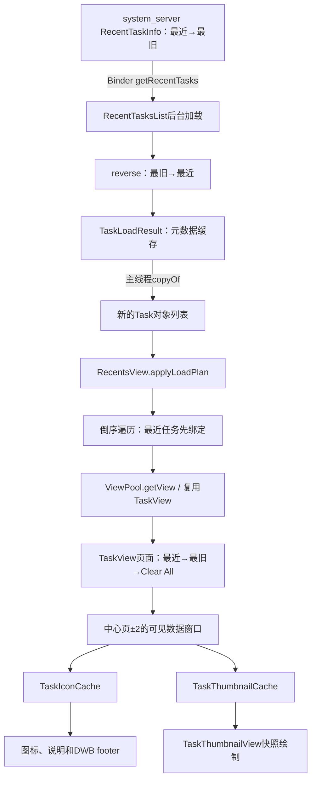
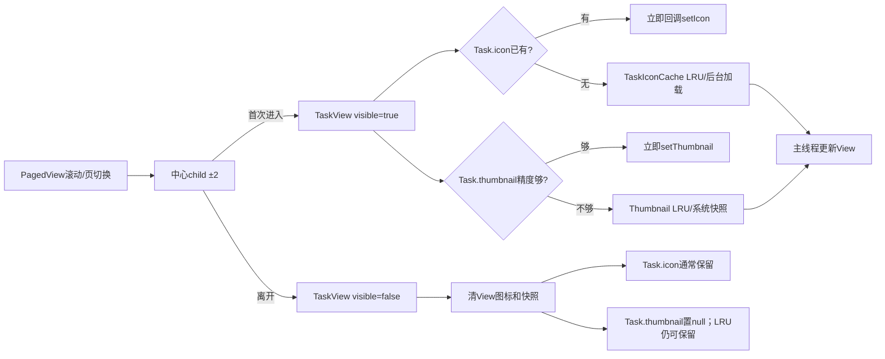
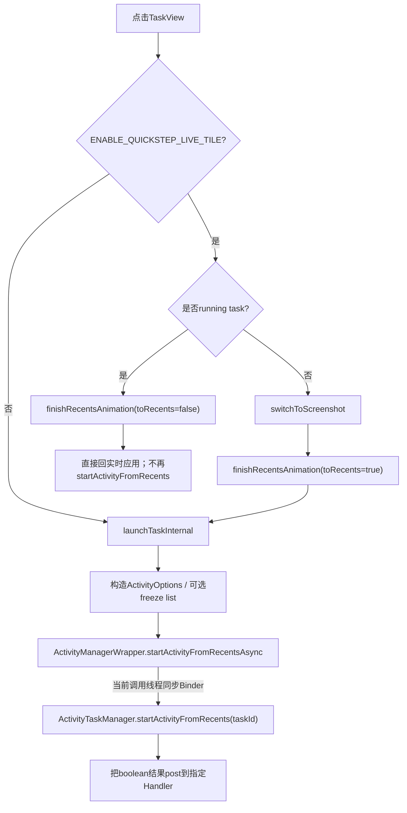

# 第524章 Android Quickstep最近任务：RecentsView、TaskView、任务列表缓存、ViewPool、页面吸附、快照和启动链

> 源码基线：Android 11 / API 30 / `android-11.0.0_r48`。本章直接阅读`packages/apps/Launcher3`、`frameworks/base/packages/SystemUI/shared`和`frameworks/libs/systemui`，只读源码、不编译。核心文件：`RecentsModel.java`、`RecentTasksList.java`、`TaskThumbnailCache.java`、`TaskIconCache.java`、`TaskKeyLruCache.java`、`RecentsView.java`、`TaskView.java`、`TaskThumbnailView.java`、`ViewPool.java`、`PagedView.java`和`ActivityManagerWrapper.java`。

## 1. 本章解决什么问题

进入最近任务界面时，那一张张任务卡片从哪里来？为什么只给屏幕附近的卡片加载图标和快照？低清快照什么时候升级成高清？滑动停止后为什么会自动吸附到某一页？点击卡片时，是重新启动应用、把旧任务移到前台，还是只结束一场Recents动画？

## 2. 一句话定位

`RecentTasksList`把系统RecentTaskInfo变成轻量`Task`列表，`RecentsView`把列表投影为可复用的`TaskView`页面，`TaskIconCache`和`TaskThumbnailCache`按可见区异步补齐图标与快照，`PagedView`负责滚动结算，最后`TaskView`根据普通截图模式或Live Tile模式选择不同的任务启动路径。

## 3. 先把七本账分开

阅读时至少要区分：系统里的最近任务事实、`RecentTasksList`缓存的任务元数据、回调得到的新`Task`对象、屏幕上的`TaskView`实例、`Task`持有的图标/缩略图字段、两个LRU缓存，以及当前正在滚动/即将吸附的页码。它们的生命周期并不相同。

## 4. 四个固定问题先回答

Launcher3/Quickstep代码运行在Launcher进程；列表查询、启动任务和获取快照最终跨Binder进入system_server；`RecentTasksList`列表查询主要在`UI_HELPER_EXECUTOR`，图标和缩略图共用名为`TaskThumbnailIconCache`的后台Looper；View绑定、回调落地和页面滚动都回到主线程。

## 5. 本章源码地图

模型入口看`quickstep/src/com/android/quickstep/RecentsModel.java`；列表看`RecentTasksList.java`；视觉缓存看`TaskIconCache.java`和`TaskThumbnailCache.java`；UI主链看Quickstep override中的`views/RecentsView.java`、`TaskView.java`和`TaskThumbnailView.java`；通用复用和滚动分别看Launcher3的`ViewPool.java`与`PagedView.java`。

## 6. 三种“任务”不能混叫

`ActivityManager.RecentTaskInfo`是system_server返回的系统任务信息；SystemUI shared中的`Task`是Launcher侧模型对象；`TaskView`才是屏幕上的View。一个系统任务在一次列表刷新中可能得到新的`Task`对象，而一个旧`TaskView`也可能从池中取出后改绑另一个任务。

## 7. 从系统列表到页面的总链



## 8. RecentsModel是进程内总入口

`RecentsModel.INSTANCE`是`MainThreadInitializedObject`，第一次在主线程按Context创建。它不直接画页面，而是持有`RecentTasksList`、`TaskIconCache`、`TaskThumbnailCache`，并把任务栈、快照和包图标变化分发给UI监听者。

## 9. 为什么模型是单例

最近任务页可能由Launcher内嵌Overview、独立RecentsActivity或手势处理器触发。单例让这些入口共用列表和视觉缓存，避免每个`RecentsView`各建一套LRU与后台线程；但监听的注册/移除仍由具体View在attach/detach时负责。

## 10. 列表线程与视觉线程不是同一条

`RecentTasksList`把查询投给`UI_HELPER_EXECUTOR`；`RecentsModel`另外创建`TaskThumbnailIconCache` Looper，图标和缩略图的Handler都绑定到它。于是“列出有哪些任务”和“给这些任务补视觉数据”可以分开排队。

## 11. 系统任务列表从哪里来

`loadTasksInBackground()`调用`ActivityManagerWrapper.getRecentTasks(numTasks, currentUserId)`。这是Launcher侧封装，最终跨Binder从系统任务管理服务取得`RecentTaskInfo`；返回对象已经包含taskId、baseIntent、用户、窗口模式、最后活动时间、TaskDescription等元数据。

## 12. 第一次反转：模型为什么存最旧到最近

系统原始列表是most-recent到least-recent。`RecentTasksList`立即`Collections.reverse(rawTasks)`，内部`TaskLoadResult`因而是最旧→最近。这是历史TaskStack/布局消费习惯，不代表页面最终也把最旧任务放在第一张。

## 13. TaskKey是任务身份的骨架

`Task.TaskKey`包含`id`、`windowingMode`、`baseIntent`、`userId`、`lastActiveTime`、`displayId`和`sourceComponent`。其中窗口模式与最后活动时间会参与缓存新鲜度判断；`id`是LRU Map的直接键，也是UI寻找TaskView最常用的字段。

## 14. Task先装元数据，视觉字段稍后补

完整加载调用`Task.from(taskKey, rawTask, isLocked)`，得到颜色、是否支持分屏、锁定状态、TaskDescription与topActivity；此时`icon`和`thumbnail`通常仍为空。这个“先有卡片骨架，再补图片”的设计正是可见区加载能够成立的前提。

## 15. keysOnly和完整Task是两种请求

`findTaskWithId()`只需确认任务是否仍存在，因此请求`loadKeysOnly=true`，每项只是`new Task(taskKey)`；Overview真正展示时请求完整Task。完整结果可以服务只要Key的请求，keys-only结果却不能反过来满足完整请求。

## 16. TaskLoadResult不只是ArrayList

内部类`TaskLoadResult`继承`ArrayList<Task>`，额外记录`mId`和`mKeysOnly`。有效条件是ID等于本次requestId，并且缓存精度足够：`!mKeysOnly || loadKeysOnly`。

## 17. changeId是“版本戳”，不是请求序号生成器

每次任务栈变化、Recent列表变化、任务移除、进入/退出画中画都会使`mChangeId++`。同一版本内的多次`getTasks()`会拿到相同ID；它表达“系统列表版本”，而不是每个调用独占一个编号。

```java
public synchronized int getTasks(boolean loadKeysOnly,
        Consumer<ArrayList<Task>> callback) {
    final int requestLoadId = mChangeId;
    if (mResultsUi.isValidForRequest(requestLoadId, loadKeysOnly)) {
        ArrayList<Task> result = copyOf(mResultsUi);
        mMainThreadExecutor.post(() -> callback.accept(result));
        return requestLoadId;
    }
    // 未命中时转后台加载……
}
```

## 18. UI缓存命中也不立即回调

命中`mResultsUi`时会先同步复制列表，再把callback `post`到下一帧。这样调用者一定能先拿到返回的changeId并保存到`mTaskListChangeId`，随后才处理列表回调，避免同步回调抢跑。

## 19. 未命中时的后台链

`UI_HELPER_EXECUTOR`先检查`mResultsBg`是否能满足requestLoadId与精度；不能就跨Binder重载。之后把结果投回主线程，赋给`mResultsUi`，复制成新ArrayList，再调用UI callback。

## 20. copyOf复制了什么，没复制什么

它新建每个`Task`，复制key引用、颜色、dockable、locked、TaskDescription和topActivity，却不复制icon、thumbnail与titleDescription。注意是“新Task、共享同一个TaskKey引用”，并非完整深拷贝；视觉字段自然要按本轮可见页重新取。

## 21. 失效时两级缓存怎样清

`invalidateLoadedTasks()`立刻把主线程结果设为INVALID并增加changeId，同时把清理`mResultsBg`的动作投到`UI_HELPER_EXECUTOR`。后台清理与查询在同一Executor上排队，从而避免随意并发改后台缓存。

## 22. r48的陈旧结果边界

一次旧加载开始后，changeId可能已增加；它回主线程时没有再次比较`requestLoadId`，仍会赋值`mResultsUi`并调用callback。下一次查询会因ID不匹配而拒绝该缓存，但当前`RecentsView.applyLoadPlan()`也没有收到ID参数进行二次拦截，因此窄窗口内可能短暂应用旧列表。

## 23. RecentsModel为什么又注册一个TaskStackChangeListener

`RecentTasksList`的监听器负责让“有哪些任务”失效；`RecentsModel`自己的监听器负责快照预加载、实时快照更新和视觉缓存移除。两个监听者都接收系统任务事件，但职责不同，不是无意义重复注册。

## 24. RecentsView是PagedView，不是RecyclerView

最近任务的每张卡片是`RecentsView`的子View页面，底层继承`PagedView`来处理滚动和吸附。它虽然使用对象池，但不是RecyclerView那套LayoutManager/ViewHolder协议；不要把All Apps章的RecyclerView生命周期直接搬过来。

## 25. applyLoadPlan遇到动画先延后

若`mPendingAnimation`非空，方法给动画增加end listener，结束后再应用tasks。这能避免 dismiss/launch等结构动画中途重排子View；但多个列表回调都可能各加一个listener，r48没有只保留“最后一份计划”的代际字段。

## 26. 空列表路径

tasks为null或空时删除全部TaskView和ClearAllButton，再更新空状态。绘制阶段会显示空任务图标与`recents_empty_message`；这不是把一个“空TaskView”放进列表。

## 27. 先让View数量对齐任务数

所需数量变化时，代码先临时移除Clear All；任务不够就从`mTaskViewPool.getView()`取，过多就从尾部remove，最后再把Clear All加回去。`onViewRemoved()`会把被移除的TaskView回收到池中。

## 28. ViewPool的容量参数

RecentsView创建`ViewPool<>(context, this, R.layout.task, 20, 10)`：最多保存20个回收View，并尝试预热10个。容量20是池容量，不是最近任务只允许20个；池空时仍会现场inflate新View。

## 29. 预热为何在非Looper线程inflate

`ViewPool`克隆一份LayoutInflater，在名为`ViewPool-init`的普通Thread中inflate，再用构造时主线程Handler逐个加入池。源码注释特意让这个线程没有Looper，从而尽早暴露View构造函数偷偷`new Handler()`的错误依赖。

## 30. getView是LIFO取回

池内数组用`mCurrentSize`作为栈顶，取View时先减一再返回；空池才同步inflate。因此最近回收的View通常最先复用。预热尚未投回主线程时，首次请求也可能走同步inflate，这只是时序差异。

## 31. recycle先清理，再看池是否已满

`recycle()`总是先调用`view.onRecycle()`，随后`addToPool()`；即使池已满而丢弃这个View，清理仍已发生。资源释放不能依赖“成功放进池”这个结果。

## 32. TaskView.onRecycle清了哪些东西

它重置位移/缩放/alpha，清快照、关闭overlay，并调用`onTaskListVisibilityChanged(false)`取消请求、清屏幕图标且把`mTask.thumbnail=null`。它没有把`mTask`字段立刻置空，也没有把`mTask.icon`置空；下一次`bind()`会替换Task引用。

## 33. 第二次反转：页面最终仍是最近优先

模型数组是最旧→最近；`applyLoadPlan()`却从末尾向前遍历，并把第一个页面绑定数组末尾。因此TaskView逻辑页序是最近→最旧，最后才是Clear All。只看`Collections.reverse()`就断言首屏是最旧任务，会漏掉第二次倒序。

## 34. bind只是骨架绑定

`TaskView.bind()`先取消旧加载，把`mTask`换成新对象，令`TaskThumbnailView.bind(task)`清overlay并设置背景色，再更新旋转状态。它不会在这里同步读取图标/快照；可见区机制稍后触发视觉加载。

## 35. 可见数据窗口不是严格“屏幕内”

`loadVisibleTaskData()`找离屏幕中心最近的页，以它为中心向前后各扩2个child index，即最多五页的预取窗口。这样手指刚滑到相邻页时图片大概率已经就绪，代价是比真正可见区域多保留少量数据。

```java
int centerPageIndex = getPageNearestToCenterOfScreen();
int lower = Math.max(0, centerPageIndex - 2);
int upper = Math.min(centerPageIndex + 2, getChildCount() - 1);

boolean visible = lower <= indexOfChild(taskView)
        && indexOfChild(taskView) <= upper;
taskView.onTaskListVisibilityChanged(visible);
```

## 36. 为什么上下界按child index算

PagedView的页面集合还包含Clear All以及可能插入的非Task child，吸附中心也是child index。加载循环只遍历TaskView，但判断使用其真实`indexOfChild`，从而与滚动几何保持一致。

## 37. mHasVisibleTaskData按taskId记账

SparseBooleanArray记录哪些taskId已经进入数据窗口，防止每一帧滚动都重复发请求。Task列表重绑前会先`unloadVisibleTaskData()`清账，因此旧View/新Task映射不会直接沿用旧可见标记。

## 38. 离开窗口时主动卸载View数据

任务移出窗口会调用`onTaskListVisibilityChanged(false)`并删除标记；整体离开Overview、重新应用任务计划或reset时也会统一卸载。这是在View层降低图片驻留和异步回调风险，不等于清空全局LRU。

## 39. 滚动期间每帧都会检查窗口

`computeScrollHelper()`在Scroller继续运动或手指仍在处理触摸时更新曲线并调用`loadVisibleTaskData()`。因为SparseBooleanArray去重，通常只有跨越预取边界的那一刻才真正触发加载/卸载。

## 40. 两个入口门槛

若`mOverviewStateEnabled`为false，或`mTaskListChangeId==-1`表示任务计划尚未加载，方法直接返回。否则旧页面可能在Launcher已离开Overview后继续请求图片，或在TaskView还不代表新列表时加载错对象。

## 41. 可见页、Task字段和两级缓存的关系



## 42. 图标与缩略图实际串行排队

两个Cache各有一个Handler，但Handler绑定同一个`TaskThumbnailIconCache` Looper。因此二者的后台`run()`不会同时在两条线程执行，而是在同一消息队列串行；这降低并发复杂度，也意味着一次慢图标查询会推迟队列后的快照请求。

## 43. TaskKeyLruCache怎样实现LRU

底层是`LinkedHashMap<Integer, Entry<V>>`，开启`accessOrder=true`，超过maxSize时移除最久未访问项。所有公开读写方法都`synchronized`，允许主线程、缓存Looper和任务监听回调安全共享。

## 44. 命中不仅比较taskId

Map先按`key.id`找到Entry，然后要求旧Key的`windowingMode`和`lastActiveTime`与新Key一致；不一致就移除并当作miss。它没有在这一步比较userId、displayId或component，设计前提是活动任务ID足以定位当前任务。

## 45. dummy TaskKey为什么也能删缓存

任务移除时`RecentsModel`只知道taskId，于是构造其他字段近乎为空的dummy key。`TaskKeyLruCache.remove()`只执行`mMap.remove(key.id)`，所以不需要完整Intent或窗口模式；若误调用`getAndInvalidateIfModified(dummy)`则不会是同样语义。

## 46. 图标加载的优先级

`TaskIconCache.getCacheEntry()`先尝试TaskDescription自带图标；没有则查询任务组件的ActivityInfo并通过IconProvider取Activity图标；Activity已不存在时退到按用户缓存的默认图标。这是“任务自定义→Activity→默认”的降级链。

## 47. TaskDescription图标属于任务快照语义

应用可以给当前任务设置TaskDescription图标，它比清单中的Activity图标更贴近任务实例。源码通过`TaskDescriptionCompat.getIcon(desc, userId)`读取；TODO说明r48尚未实现TaskDescription的icon resource加载路径。

## 48. ActivityInfo也服务无障碍说明

即使已经从TaskDescription拿到Bitmap，低内存Recents或无障碍开启时仍可能查询ActivityInfo，用`getBadgedContentDescription()`生成工作资料等用户徽标语义的说明文本。

## 49. 默认图标按userId缓存

`mDefaultIcons`是SparseArray，按用户生成并复用`BitmapInfo`，访问时同步。不同用户需要不同badge，不能全进程只用一个默认Drawable。

## 50. 图标被包进统一自适应容器

`LauncherIcons`关闭颜色提取，使用TaskDescription主色作为wrapper背景，并传Android O版本号强制进入adaptive icon容器，再叠加用户/instant app标记。最终TaskView拿到的是`FastBitmapDrawable`一类统一外观对象。

## 51. titleDescription不是普通应用标题

本链主要加载用于无障碍/低内存模式的`contentDescription`，默认值是空串；普通任务标题仍可由TaskUtils根据Task/Package信息按需取得。不要看到`titleDescription`就把它等同卡片上必定显示的标题TextView。

## 52. 图标请求的正常异步时序

主线程发现`task.icon==null`，将`IconLoadRequest`投给共享缓存Looper；后台查LRU或PackageManager并创建图标，检查未取消后投到MAIN_EXECUTOR；主线程写`task.icon`和`task.titleDescription`，再由TaskView设置Icon与DWB footer。

## 53. r48图标取消存在窄竞态

`IconLoadRequest`只在后台计算结束、投递MAIN_EXECUTOR之前检查`isCanceled()`。若旧TaskView在“已投主线程、尚未执行”之间被重新bind，取消不能阻止已排队lambda；回调也没有比较当前`mTask`身份，理论上可把旧任务图标短暂画到复用View。缩略图请求在主线程lambda内再检查一次，窗口更小。

## 54. 包图标变化如何刷新

IconProvider回调先把“删除匹配package/user LRU条目”的任务投到缓存Looper，随后立即通知RecentsView，并不等待删除完成。每个匹配Task把`task.icon=null`；若该View当前有drawable则重新走visible加载，其新请求也排入同一个Looper，通常位于先入队的删除之后；离屏View等下次进入窗口再取。

## 55. 离屏时图标字段与View图标不同

`visible=false`调用`setIcon(null)`清的是IconView；源码没有把`mTask.icon`清空。因此再次可见时`TaskIconCache.updateIconInBackground()`可能因Task字段已有图标而立即回调，不必查LRU。快照路径则会显式清`mTask.thumbnail`。

## 56. ThumbnailCache保存的是ThumbnailData

缓存值不只是Bitmap，还包含reducedResolution、insets、orientation、rotation、systemUiVisibility、isTranslucent等绘制信息。只缓存裸Bitmap会丢掉裁剪、旋转与系统栏明暗所需的上下文。

## 57. 高低清状态是全局策略

`HighResLoadingState`维护`forceHighRes`、`visible`、`flingingFast`和最终enabled。这里的visible是全局加载策略位，不等于某个TaskView的`View.VISIBLE`；每个TaskView不自己判断滚动速度，而是读取共享状态，状态翻转时RecentsView统一“戳一下”所有当前可见任务。

## 58. enabled公式要准确记

公式是`forceHighRes || (visible && !flingingFast)`。设备不支持低清快照时始终请求高清；普通设备只有Overview被认为可见且没有快速fling时才允许高清。它不是“停止滚动就永远高清”。

## 59. visible由谁设true和false

手势确认将进入Overview、Launcher或独立Recents的进入动画完成时会设true；`TRIM_MEMORY_UI_HIDDEN`设false。BaseQuickstepLauncher甚至在回到Home的进入动画完成后将它设true，目的是为下次Overview准备高清数据，所以不能把该字段机械理解成“Overview此刻正在屏幕上”；RecentsView自身只监听状态并更新flingingFast，不在attach时直接设true。

## 60. 快速fling为何降级

`computeScrollHelper()`比较Scroller当前速度与`recents_fast_fling_velocity`；过快时设flingingFast=true，现有低清快照足够维持滑动流畅。速度降下后状态重新enabled，可见页收到回调并尝试升级高清。

## 61. 设备是否支持低清怎样判断

代码从系统资源查`config_lowResTaskSnapshotScale`：资源存在且float大于0表示支持低清；资源不存在时默认支持。scale为0或负值会令`forceHighRes=true`，此设备不应发低清请求。

## 62. 已有快照怎样判断“精度够”

当前要低清时，低清或高清都能用；当前要高清时，只有`reducedResolution==false`才够。已有低清但策略刚切高清，会继续查缓存/系统；已有高清不会为了“匹配低清请求”而降级重取。

## 63. LRU命中也检查精度

先用TaskKey校验窗口模式与最后活动时间，再检查缓存ThumbnailData精度。缓存只有低清而当前要高清时不会回调这份低清作为最终结果，而是继续请求系统并在完成后覆盖缓存。

## 64. 真正取快照跨了进程

缓存miss会在共享后台Looper调用`ActivityManagerWrapper.getTaskThumbnail(taskId, lowResolution)`，最终从系统任务快照服务取`ThumbnailData`。返回后投主线程，未取消才写LRU、写Task字段并刷新View。

## 65. 正在显示的任务可被系统快照事件直推

`onTaskSnapshotChanged()`先只更新“已经存在”的LRU项，再倒序通知视觉监听者。RecentsView若正在处理任务栈且找到对应TaskView，立即`setThumbnail`并返回Task；RecentsModel再把该Task的thumbnail字段同步成新snapshot。

## 66. 后台预加载何时工作

配置`config_enableTaskSnapshotPreloading`开启且HighResLoadingState的`visible`为true时，任务栈后台变化会取最多cacheSize个TaskKey，再预取低清快照。这里看的是visible字段，不是最终high-res enabled，所以快速fling期间仍可能低清预热。

## 67. 为什么跳过running task

当前正在运行的应用画面还在变化，系统此刻保存的snapshot很可能在用户下次进入Overview前就过期。预加载循环跳过runningTaskId，把缓存预算给更稳定的后台任务。

## 68. updateThumbnailInCache名字和注释会误导

方法注释写“Synchronously fetches”，实现却调用`updateThumbnailInBackground(task.key, true, ...)`投Handler。它只要求从主线程发起，并在回调中写临时Task；真正取图不是同步。读源码时实现优先于过时注释。

## 69. 缩略图取消为何相对稳妥

`ThumbnailLoadRequest`即使后台Binder已经返回，MAIN_EXECUTOR lambda仍先检查`isCanceled()`；取消后既不写缓存，也不调TaskView callback。它无法取消已经发生的系统取图成本，但能阻止旧结果污染新绑定的View。

## 70. TaskView进入窗口时同时发两类请求

`onTaskListVisibilityChanged(true)`先取消旧handle，再让ThumbnailCache更新快照、IconCache更新图标。图标回调还初始化DigitalWellBeingToast，并在Live Tile且为running task时更新Live Tile图标。

## 71. 离开窗口究竟清了什么

TaskThumbnailView收到`setThumbnail(null, null)`，IconView清drawable，`mTask.thumbnail=null`，两个pending request被取消。全局LRU仍可能保存数据，因此回到窗口通常是缓存命中而不是再次Binder查询。

## 72. 高清开关变化为何再次传visible=true

RecentsView遍历`mHasVisibleTaskData`，对每个已可见TaskView再次调用`onTaskListVisibilityChanged(true)`。方法先取消旧请求；已有高清/策略已满足会立即返回，只有低清不够时才真正发升级请求。

## 73. TaskThumbnailView.bind先决定兜底底色

bind会reset overlay，保存Task，把`task.colorBackground`强制补不透明alpha后写入mPaint和mBackgroundPaint。即使快照尚未到、任务被锁或图片透明，卡片也有稳定底色而不是露出未初始化像素。

## 74. setThumbnail的refreshNow语义

常规调用refreshNow=true，立刻重建shader/matrix并invalidate；Live Tile抓取“备用截图”时可传false，只把新ThumbnailData存起来而暂不改变当前画面。false不是丢弃数据，而是延迟把数据投到Canvas。

## 75. refresh把Bitmap变成Shader

有效快照先`prepareToDraw()`，再创建`BitmapShader`并设为CLAMP，更新缩略图矩阵；无有效Bitmap则清shader、数据和overlay。CLAMP可在采样边缘避免透明/脏边，但正确裁剪仍依赖位置矩阵。

## 76. PreviewPositionHelper负责裁剪、旋转和缩放

它综合快照尺寸、ThumbnailData、View尺寸、DeviceProfile与当前Recents旋转，计算BitmapShader local matrix以及底部clip。TaskThumbnailView本身只按结果绘制，不应该用简单centerCrop替代整套方向处理。

## 77. 锁定任务为什么不画真实快照

`drawBackgroundOnly`在task为空、`task.isLocked`、无shader或无ThumbnailData时为true，只画圆角背景后return。即使内存里碰巧还有Bitmap，用户资料锁定也是更高优先级的隐私门。

## 78. Live Tile为何把快照区域CLEAR

功能开启、当前卡片是running task且`showScreenshot()==false`时，Canvas先用CLEAR画圆角区域，再画dim层。这样静态TaskView不覆盖其后的实时Surface；它不是每帧把应用内容拷成Bitmap。

## 79. 系统栏图标标志也来自快照

`getSysUiStatusNavFlags()`读取ThumbnailData中的旧应用`systemUiVisibility`，转换成SystemUiController的LIGHT/DARK状态栏和导航栏请求。任务卡片放大全屏到约85%后，Overview动画才切到目标应用相应的图标明暗。

## 80. overlay更新为什么post

缩略图矩阵可能在`onSizeChanged()`布局期间更新，而TaskOverlay的初始化可能反过来修改子View。源码`post(this::updateOverlay)`把副作用推迟到当前布局之后，避免在layout栈中重入修改层级。

## 81. TaskView也是页面滚动回调对象

它实现`RecentsView.PageCallbacks`。RecentsView每次计算曲线时把共享ScrollState传给每个页面，TaskView据离屏插值调整快照dim、卡片curve scale和footer alpha。

## 82. 离中心越远，卡片越暗且略缩小

`linearInterpolation`先经余弦曲线，dim最大乘`MAX_PAGE_SCRIM_ALPHA=0.4`，scale最多缩小约`EDGE_SCALE_DOWN_FACTOR=0.03`。footer更快淡出：`1-2*linearInterpolation`再限制到0..1。

## 83. 页面几何由PagedView统一计算

TaskView测量与RecentsView padding确定卡片中心；`getScrollForPage(index)`给每页目标scroll；RecentsView在layout后还计算全屏scale/pivot以及相邻页offset。`currentPage`只是已稳定页，`nextPage`可表示Scroller正在前往的页。

## 84. “离屏幕中心最近”是几何判断

PagedView计算屏幕中心=`scroll+容器主轴尺寸/2`，逐child比较child中心与屏幕中心的绝对距离，取最小项。它不只用`scroll/pageWidth`取整，因此能适应不等宽、间距、旋转方向处理。

## 85. 手指释放后的结算优先考虑fling

非自由滚动分支会综合位移是否显著、速度是否达到fling、速度方向与位移方向；fling优先于大位移。反向fling且已经拖过一定比例时还能选择回原页，否则前进/后退一页或吸附最近中心页。

## 86. 速度会影响吸附时长和弹簧实现

`snapToPageWithVelocity()`用距离和速度估算duration，并设置最小吸附速度。Quickstep Springs开关开启且页发生变化时，交给Scroller的`startScrollSpring`；否则走普通`startScroll`。这里的spring是页面Scroller实现，不是TaskThumbnailCache。

## 87. Recents开启free scroll后的fling略不同

RecentsView构造调用`setEnableFreeScroll(true)`。自由滚动分支允许Scroller在min/max范围内fling，按预测finalPos选择最近页，再把最终位置修到页面或边界；超出两端则springBack。手势动画开始时会暂时关闭free scroll，结束后恢复。

## 88. 键盘吸附有三套边界

Tab以`getTaskViewCount()`限制在任务页，Alt+Tab允许循环；左右方向键以`getPageCount()`移动，因此可到Clear All；Delete删除当前TaskView。`snapToPageRelative()`以`getNextPage()`为起点，吸附后请求目标child焦点。

## 89. RTL不要手写“左就是减一”

Recents用OrientationHandler取得RTL设置，并为容器/child做特定layoutDirection修正；DPAD左右的delta也根据`mIsRtl`反转。任务的新旧逻辑顺序与屏幕物理左右方向是两层概念。

## 90. Clear All是真页面但不是TaskView

它被加在任务子View之后，参与PagedView child数量、中心页和吸附；任务加载循环会跳过它，`getTaskViewCount()`也主动减掉它。读`getChildCount()`和`getTaskViewCount()`时必须确认当前算法要的是页面数还是任务数。

## 91. 上滑刚开始可能先造临时running卡片

若系统告知的runningTaskId尚不在旧列表，`showCurrentTask()`从池中取一个TaskView插入首个任务位置，用RunningTaskInfo构建`mTmpRunningTask`并立即measure/layout，让快速切换立刻有几何目标；随后才异步重载正式列表。

## 92. 临时任务用对象身份跳过视觉加载

可见区代码判断`task == mTmpRunningTask`而非只比ID，临时卡片正在参与手势动画时不发普通图标/快照请求。正式列表重绑得到另一个Task对象后，这个身份条件自然失效。

## 93. running task的截图显示是状态开关

手势开始会隐藏running tile并关闭截图，手势结束再显示卡片、开启live tile绘制；若FeatureFlag没开则强制显示静态截图。`mRunningTaskId`、tile alpha与showScreenshot是三本账，不能只看其中一个判断用户看到了什么。

## 94. 点击入口先判断是不是Live Tile当前任务

TaskView构造时注册OnClickListener：无Task就返回；开启Live Tile且点的是running task，启动`createLaunchAnimationForRunningTask()`；其他情况调用`launchTask(true)`。统计日志在分支之后记录任务组件和child位置。

## 95. 点击任务的三条主路径



## 96. Live Tile点当前任务不需要重新启动

当前应用本来就在RecentsAnimation target中，只是Launcher正在接管动画。代码`finishRecentsAnimation(false /* toRecents */)`把动画结束到应用侧，然后回调true；没有再次调用`startActivityFromRecents(taskId)`。

## 97. Live Tile点其他任务为何先切截图

r48注释说明WindowManager在清理RecentsAnimation同时启动另一任务时动画不可靠。于是先把实时Surface切成Screenshot，再以`toRecents=true`结束原动画，完成后才走普通任务启动，减少Surface所有权交接时的画面跳变。

## 98. 普通animate=true做了什么

`mActivity.getActivityLaunchOptions(this)`创建带Launcher启动动画语义的ActivityOptions；可选设置freeze recent list，随后按TaskKey调用wrapper。这里的animate表示给系统提供启动动画Options，不等于本方法自己在Java里逐帧放大TaskView。

## 99. ActivityOptions是跨边界的动画契约

Options最终`toBundle()`随Binder请求交给ActivityTaskManager。它可携带远程/自定义动画、launch windowing mode与冻结Recent列表等；Launcher侧View动画和系统窗口动画要靠这个契约在边界处接上。

## 100. startActivityFromRecentsAsync这个名字不够准确

`ActivityManagerWrapper`没有把Binder调用投到后台线程：它在调用者当前线程直接执行`startActivityFromRecents(taskId, options)`，捕获boolean，再把结果callback post到给定Handler。Async主要体现在结果投递，不代表启动Binder本身异步。

```java
boolean result = false;
try {
    result = startActivityFromRecents(taskKey.id, finalOptions);
} catch (Exception e) {
    // Fall through
}
final boolean finalResult = result;
if (resultCallback != null) {
    resultCallbackHandler.post(() -> resultCallback.accept(finalResult));
}
```

## 101. 真正的进程边界在ActivityTaskManager

wrapper最终调用`ActivityTaskManager.getService().startActivityFromRecents(taskId, optsBundle)`。Launcher只提交taskId与Options，system_server负责校验任务、调整栈/窗口、恢复Activity和组织窗口过渡；TaskView不会自己new Activity实例。

## 102. animate=false的成功回调为何更绕

代码构造入/出动画均为0的custom animation，并把“动画真正开始”的callback作为成功信号。wrapper若立即返回失败则马上post false；若Binder返回成功，wrapper的true被忽略，等系统触发animation-start callback才向上层报告true。

## 103. animate=true的result代表请求结果

animate=true直接把业务callback交给wrapper，因此收到的是`startActivityFromRecents`调用成功与否，不是目标应用首帧已经绘制或动画全部完成。把这个boolean叫“应用启动完成”会夸大保证。

## 104. freezeTaskList只冻结Recent列表变化

`ActivityOptionsCompat.setFreezeRecentTasksList(opts)`用于某些快速切换/启动时暂时稳定Recent顺序，避免启动动作立即洗牌干扰动画。它不是冻结应用画面，也不等于停止TaskStackChangeListener。

## 105. 分屏主任务有特殊窗口模式修正

若TaskKey记录为`WINDOWING_MODE_SPLIT_SCREEN_PRIMARY`，wrapper会把Options中的目标窗口模式明确设为`WINDOWING_MODE_SPLIT_SCREEN_SECONDARY`。相邻注释把期望描述为“launch them in the fullscreen stack”，但r48这一行的直接实现值确实是SECONDARY；学习时应把代码事实与注释意图并列记录，不自行把二者抹平成同一个窗口模式。

## 106. onTaskLaunched是乐观通知

`launchTaskInternal()`发出wrapper请求后立刻调用`getRecentsView().onTaskLaunched(mTask)`，它发生在异步result callback之前。子类若覆盖这个hook，不能据此断言系统启动必然成功。

## 107. RecentsView还提供显式卡片放大动画

`createTaskLaunchAnimation()`把中心卡或相邻卡投向全屏，更新Recents scale、fullscreen progress、depth与相邻页位移。它注册的PendingAnimation成功监听会调用`tv.launchTask(false, callback, handler)`；Live Tile running-task入口又给PlaybackController设置了一个end action，先`pendingAnimation.finish(...)`再直接`launchTask(false)`。因此正常意图是“动画到终点后结束到应用”，但r48具体调用形态还要结合第117节的重复调用边界阅读。

## 108. 85%时切系统栏，成功阈值还负责触觉

显式放大动画的progress超过`UPDATE_SYSUI_FLAGS_THRESHOLD=0.85`后，Overview的系统栏请求改成目标快照记录的flags；每次跨过`SUCCESS_TRANSITION_PROGRESS`边界都会触发虚拟键触觉并更新布尔状态，包含动画往回跨越该边界的情况。

## 109. 失败路径要恢复UI而非假装成功

默认`launchTask()`结果为false会`notifyTaskLaunchFailed()`显示Toast并记录日志；显式动画失败还调用`onTaskLaunchAnimationEnd(false)`。但`onTaskLaunched()`已提前发生，新增业务逻辑时要明确哪个hook是“已发请求”、哪个callback才是“请求结果”。

## 110. 内存压力怎样影响缓存

`TRIM_MEMORY_UI_HIDDEN`只把HighRes visible设false，让后续不再追高清；`TRIM_MEMORY_RUNNING_CRITICAL`才同时evict缩略图和图标LRU。离开一张卡片的可见窗口也不会直接清全局cache，这三种清理粒度不同。

## 111. 把整条正常时序再讲一遍

进入Overview后请求当前changeId的完整Task列表；后台从system_server拿RecentTaskInfo，模型反转并缓存，主线程copy后交给RecentsView；View数量通过池补齐并倒序bind；中心附近五页发图标/快照请求，低速时升级高清；PagedView滚动结算到中心页；点击后按Live Tile身份处理RecentsAnimation，或携ActivityOptions跨Binder把现有task带回前台。

## 112. macOS只读练习一：验证“两次反转”

在源码根目录执行：

```bash
rg -n "Collections.reverse|for \(int i = requiredTaskCount - 1|pageIndex =" \
  packages/apps/Launcher3/quickstep/src/com/android/quickstep/RecentTasksList.java \
  packages/apps/Launcher3/quickstep/recents_ui_overrides/src/com/android/quickstep/views/RecentsView.java
```

先写出raw、TaskLoadResult、TaskView页面三者各自的新旧顺序，再对照第12、33节；不要运行或改源码。

## 113. macOS只读练习二：画出线程切换点

执行：

```bash
rg -n "UI_HELPER_EXECUTOR|TaskThumbnailIconCache|mBackgroundHandler|MAIN_EXECUTOR" \
  packages/apps/Launcher3/quickstep/src/com/android/quickstep/{RecentsModel,RecentTasksList,TaskIconCache,TaskThumbnailCache}.java
```

把每次`execute/post`前后的线程写成“主线程→哪个Looper→主线程”，并确认图标与缩略图是不是两条后台线程。

## 114. macOS只读练习三：验证可见窗口与卸载差异

执行：

```bash
rg -n "centerPageIndex|mHasVisibleTaskData|onTaskListVisibilityChanged|mTask.thumbnail = null" \
  packages/apps/Launcher3/quickstep/recents_ui_overrides/src/com/android/quickstep/views/{RecentsView,TaskView}.java
```

回答：View图标、Task.icon、View快照、Task.thumbnail、LRU快照五者在visible=false后各自是否仍保留。

## 115. macOS只读练习四：验证“Async”是否真切线程

执行：

```bash
sed -n '310,380p' \
  frameworks/base/packages/SystemUI/shared/src/com/android/systemui/shared/system/ActivityManagerWrapper.java
rg -n "launchTaskInternal|startActivityFromRecentsAsync|finishRecentsAnimation" \
  packages/apps/Launcher3/quickstep/recents_ui_overrides/src/com/android/quickstep/views/TaskView.java
```

标出Binder调用发生在哪一行、boolean在哪里产生、callback在哪里post，并分别写出Live Tile running/non-running两种路径是否调用Binder启动。

## 116. 最容易误解的十句话

“RecentsView是RecyclerView”“reverse后第一页就是最旧任务”“ViewPool限制任务总数20”“bind会同步加载图片”“离屏就清全局缓存”“停止fling就必定高清”“Async启动一定在后台线程”“result=true表示应用首帧完成”“Live Tile点击都要startActivityFromRecents”“Clear All不参与页面滚动”都不准确。遇到这些说法，应回到对应字段所有者和完成点核对。

## 117. r48源码审计：值得警惕但不要夸大的边界

旧列表加载可在changeId变化后仍回调并被apply；动画期间可累积多个待应用计划；图标请求在投MAIN后取消缺少第二次身份/取消校验；`updateThumbnailInCache`同步注释与实现相反；`HandlerRunnable.cancel()`源码TODO明确承认与正在执行的run并发时可能两次走到onEnd，`mEnded/mCanceled`本身也未同步，不过本章两个Request传入的endRunnable均为null；TaskKey LRU只按id定位并只复核窗口模式/lastActiveTime。另一个更隐蔽的形态是`createLaunchAnimationForRunningTask()`的end action调用`finish()`后，PendingAnimation成功监听已调用一次`launchTask(false)`，end action随后又调用一次，缺少显式once门，理论上会重复请求结束running-task的RecentsAnimation。这些都是r48具体边界，不等于每次都会成为用户可见故障。

## 118. 阅读这条链的检查清单

先问现在拿的是RecentTaskInfo、Task、TaskKey还是TaskView；再问代码在主线程、UI_HELPER还是共享缓存Looper；随后确认可见标记按taskId还是View身份；最后分别检查任务列表版本、视觉请求取消、LRU新鲜度、当前页/下一页和Binder回调的完成语义。

## 119. 本章小结

最近任务页的核心不是“一次性把所有应用截图画出来”，而是元数据列表、页面View、视觉缓存和系统任务四层协作：列表用changeId判版本，ViewPool降低inflate成本，可见窗口控制加载预算，高低清状态随速度切换，PagedView决定吸附页，TaskView再把点击翻译成RecentsAnimation结束或system_server任务恢复。

## 120. 下一章怎么接

下一章继续追Quickstep手势总控：`TouchInteractionService`、`OverviewCommandHelper`、`OtherActivityInputConsumer`、`BaseSwipeUpHandlerV2`与RecentsAnimation启动/接管链。重点回答一次底部上滑怎样从InputConsumer变成Launcher状态动画，并把本章的running TaskView、Live Tile和系统RecentsAnimation真正接起来。
