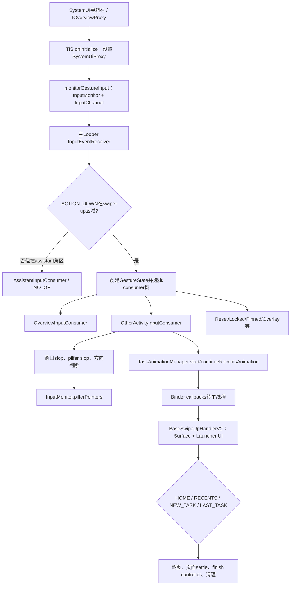
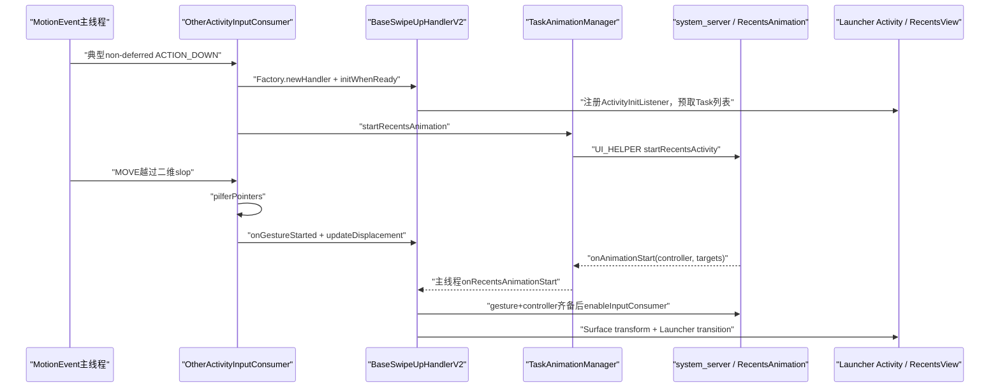
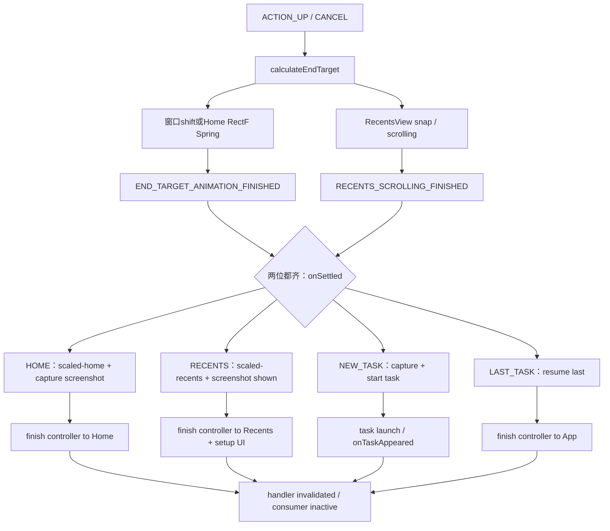

# 第525章 Android Quickstep手势总控：TouchInteractionService、InputConsumer选择、OtherActivityInputConsumer上滑和RecentsAnimation接管链

> 源码基线：Android 11 / API 30 / `android-11.0.0_r48`。直接阅读`packages/apps/Launcher3/quickstep`、Launcher3通用动画/分页代码和`frameworks/base/packages/SystemUI/shared`，只读源码、不编译。核心文件：`TouchInteractionService.java`、`RecentsAnimationDeviceState.java`、`RotationTouchHelper.java`、`InputConsumer.java`、`OtherActivityInputConsumer.java`、`DelegateInputConsumer.java`、`OverviewInputConsumer.java`、`BaseSwipeUpHandler.java`、`BaseSwipeUpHandlerV2.java`、`SwipeUpAnimationLogic.java`、`TaskAnimationManager.java`、`GestureState.java`、`RecentsAnimationCallbacks.java`、`RecentsAnimationController.java`、`InputConsumerProxy.java`与`OverviewCommandHelper.java`。

## 1. 本章解决什么问题

手指从底部导航区按下后，谁先收到事件？为什么有时回Home、有时停在Overview、有时横向切到另一应用？`pilferPointers()`究竟抢了什么？RecentsAnimation为何可能在手势尚未越过阈值时就启动？ACTION_UP到了以后，为何整次交互还没有结束？

## 2. 一句话定位

SystemUI把导航手势输入监控和系统状态交给Launcher进程中的`TouchInteractionService`；TIS按设备/窗口状态组装`InputConsumer`树，普通应用上的底部手势由`OtherActivityInputConsumer`判阈值并抢占触摸，再由`BaseSwipeUpHandlerV2`把位移、RecentsAnimation targets、Launcher UI和四种结束目标通过多状态门汇合。

## 3. 先分清三种“所有权”

输入流所有权由InputMonitor与`pilferPointers()`决定；应用窗口Surface的动画控制权由RecentsAnimationController/targets决定；Launcher自身页面和状态动画由Activity、RecentsView及AnimatorPlaybackController决定。三者会互相等待，却不是同一个开关。

## 4. 四个固定问题先回答

TIS、InputConsumer和SwipeHandler都在Launcher进程；SystemUI通过IOverviewProxy Binder通知状态，Launcher再通过SystemUiProxy/ActivityTaskManager跨回system_server/SystemUI；InputEventReceiver绑定主Looper，消费者选择、位移和多数状态回调在主线程；启动/结束RecentsAnimation等Binder工作常投`UI_HELPER_EXECUTOR`。

## 5. 本章源码阅读顺序

先看TIS怎样建立InputMonitor和选consumer，再看`RecentsAnimationDeviceState`的系统门；随后精读`OtherActivityInputConsumer`从DOWN、MOVE到UP；然后追`TaskAnimationManager→RecentsAnimationCallbacks→BaseSwipeUpHandlerV2`；最后用`GestureState`与MultiStateCallback理解四种收口。

## 6. IOverviewProxy和InputMonitor是两个入口

IOverviewProxy承载SystemUI发来的初始化、Overview命令、assistant可用性、SystemUI state flags和导航区域；真正连续的MotionEvent不再靠旧`onMotionEvent()` Binder方法，而是由SystemUI创建的InputMonitor/InputChannel进入Launcher的InputEventReceiver。

## 7. 从按下到结束目标的总链



## 8. TouchInteractionService为什么是Service

它不是某个Launcher Activity的触摸监听器，而是由SystemUI长期绑定的导航手势端点。即使Home Activity暂未创建，TIS也能维护设备状态、接收输入、启动Overview Activity，并在Activity准备后把动画接上。

## 9. Direct Boot阶段只初始化必要对象

`onCreate()`先建Choreographer、ActivityManagerWrapper、RecentsAnimationDeviceState和RotationTouchHelper，并等待用户解锁；`TaskAnimationManager`、OverviewComponentObserver、OverviewCommandHelper、插件与Recents输入consumer要到`onUserUnlocked()`才创建。

## 10. SystemUI初始化回调运行在Binder线程

`IOverviewProxy.Stub.onInitialize()`先从Bundle取`ISystemUiProxy`，再投MAIN_EXECUTOR设置代理、初始化InputMonitor和预加载Overview。`sIsInitialized=true`却在Binder线程调用末尾立即写入，不等主线程三个动作真正完成；这个静态位表示“收到初始化”，不是“输入通道已全部可用”。

## 11. initInputMonitor的创建门槛

每次导航模式变化或SystemUI重新初始化，先dispose旧Receiver/Monitor；三键导航或SystemUiProxy非active时直接返回。其余情况调用`monitorGestureInput("swipe-up", displayId)`取得InputMonitor，再创建绑定主Looper与主Choreographer的InputReceiver。

## 12. 连续MotionEvent为什么在主线程

`getInputReceiver(Looper.getMainLooper(), mMainChoreographer, this::onInputEvent)`明确把InputChannel事件送到主Looper。这样View、Animator与状态机不用额外加锁，但每个MOVE中的同步工作都占Launcher主线程帧预算。

## 13. 旧IOverviewProxy.onMotionEvent只recycle

Stub中保留的deprecated `onMotionEvent(MotionEvent ev)`不处理手势，只`ev.recycle()`。若只从旧Quickstep文档追这个Binder API，会误以为Android 11的事件在此处分发；真实主链已经迁到InputMonitor。

## 14. ACTION_DOWN先做导航区域判断

TIS先让RotationTouchHelper按需要变换事件，再检查当前位置是否属于当前/被冻结旋转下的swipe-up区域。只有命中这个区域才替换正式`mConsumer`；完全手势导航下，区域外的底角事件仍可能临时交给AssistantInputConsumer。

## 15. RotationTouchHelper不是只算一个Rect

它维护当前显示旋转、应用旋转、task-list frozen、多套有效导航区域和OrientationTouchTransformer。快速切换横竖屏应用时可以同时保留多个起始区域，并把MotionEvent坐标转换到统一手势方向。

## 16. 负坐标会先被修成零

`setOrientationTransformIfNeeded()`针对r48已知负坐标问题，把x/y各限制到不小于0，再执行orientation transform。这是直接修改传入MotionEvent，后续消费者看到的是变换后的坐标，而非InputReader原始屏幕坐标。

## 17. mConsumer和mUncheckedConsumer职责不同

`mConsumer`是本次正式底部手势的consumer树，也决定ACTION_UP后是否可立即reset；`mUncheckedConsumer`是当前事件实际投递对象。区域外assistant手势只替换unchecked consumer而故意保留mConsumer，避免打断一场尚在settle的QuickSwitch。

## 18. 切consumer前为何先复制GestureState

旧consumer的`onConsumerAboutToBeSwitched()`可能通过onConsumerInactive把TIS当前状态reset成DEFAULT。代码因此先构造`prevGestureState`，再创建new state，通知旧consumer，最后根据previous/new两份状态选新consumer。

```java
GestureState prevGestureState = new GestureState(mGestureState);
GestureState newGestureState = createGestureState(mGestureState);
mConsumer.onConsumerAboutToBeSwitched();
mGestureState = newGestureState;
mConsumer = newConsumer(prevGestureState, mGestureState, event);
```

## 19. 这个“复制”是浅复制

`GestureState(GestureState other)`复用同一个MultiStateCallback与`previouslyAppearedTaskIds` Set，也复用Intent/ActivityInterface引用；它只复制字段引用和值。目的是在交接中保存同一场动画历史，不是制造完全独立快照。

## 20. 新GestureState怎样确定running task

若TaskAnimationManager认为RecentsAnimation正在运行，就沿用previous state的running task、lastStartedTaskId和appeared task集合；否则通过ActivityManagerWrapper同步查询当前running task。查询被`TraceHelper.allowIpcs`显式标记，因为它可能在主线程跨Binder。

## 21. 第一层门：用户是否解锁

未解锁但SystemUI状态允许手势时，只在有running task且全手势导航下创建DeviceLockedInputConsumer；否则走ResetGestureInputConsumer。TIS的`onInputEvent()`本身也在user未解锁时直接返回，因此正常InputMonitor事件不会走完整已解锁链。

## 22. canStartSystemGesture的真实公式

导航栏可见，或task list被冻结；通知面板与Quick Settings都未展开；并且HOME_DISABLED与OVERVIEW_DISABLED不能同时置位。最后一项使用OR：只禁Home或只禁Overview仍可能允许某类系统手势，两者都禁才阻止base consumer。

## 23. 续接动画可以绕过新的系统状态门

`canStartSystemGesture || previousGestureState.isRecentsAnimationRunning()`才决定是否创建base。已在合法状态启动的RecentsAnimation允许下一次QuickSwitch继续，即使此刻某些SystemUI flags改变，避免半途把共享动画强制Reset。

## 24. ResetGestureInputConsumer不是纯NO_OP

它收到ACTION_DOWN时若已有RecentsAnimation，会调用`finishRunningRecentsAnimation(false /* toHome */)`，把动画结束回应用。它的职责是“当前手势不处理，但先清上次悬挂动画”，因此类型单独叫RESET_GESTURE。

## 25. newBaseConsumer的判断顺序

先处理锁屏上方Activity；再处理Home上方sharesheet/排除assistant；无running task就Reset；Launcher已resumed、前一动画正去Launcher或强制Overview时选Overview consumer；Live Tile模式也选Overview；命中blocked activity就Reset；最后才是OtherActivityInputConsumer。

## 26. OverviewInputConsumer把事件代理给DragLayer

Launcher Activity已有焦点时，它把屏幕坐标offset到DragLayer局部坐标，并调用`proxyTouchEvent()`。第一次被DragLayer处理后才记录targetHandled、关闭overlay/系统窗口并pilfer；如果本来就在Activity bounds内，部分额外动作会跳过。

## 27. Launcher存在但没有窗口焦点的路径

`OverviewWithoutFocusInputConsumer`使用TriggerSwipeUpTouchTracker识别上滑，越过拦截点后pilfer，成功时直接`startActivity(homeIntent)`。它无法像有焦点DragLayer那样把完整事件树交给现有Launcher View。

## 28. 普通前台应用为何选OtherActivityInputConsumer

此时Launcher未resumed、没有Live Tile Overview正在接管、Activity也不在blocked名单。consumer需要一边监听仍发给应用的触摸，一边尽早启动RecentsAnimation并准备Launcher，所以它是本章最复杂的桥接对象。

## 29. gesture_blocking_activities是组件名单

DeviceState从资源数组解析ComponentName，并用runningTaskInfo.topActivity匹配。命中后base退到Reset；assistant也复用同一blocked判断。它不是包级通配规则，导出的package列表主要用于诊断。

## 30. consumer树是“先base、再包裹、再替换”

全手势模式先用Assistant包装base，再可能用Overscroll包装；Bubbles展开或全局电源菜单显示时直接替换成SysUiOverlay；Screen Pinning再次替换；最后Accessibility若可用则包在最外层。后写的替换会丢掉早先包装树。

## 31. Assistant包装如何抢过delegate

AssistantInputConsumer先观察底角斜滑；一旦角度与slop有效，`DelegateInputConsumer.setActive()`会pilfer并向delegate发送一份ACTION_CANCEL。若角度无效或delegate已不允许父级拦截，就转为DELEGATE_ACTIVE，把后续事件留给原base。

## 32. Overscroll插件优先级更高

Quick Capture开关开启且有active插件时，OverscrollInputConsumer包在Assistant/base之外。源码注释明确它优先于assistant与base；但随后SysUiOverlay或ScreenPinned仍可整体替换这棵树。

## 33. Bubbles和Global Actions使用替换语义

这两个SystemUI浮层显示时，底部上滑的目标是先关闭浮层，而不是一路回Home。TIS把base直接换成SysUiOverlayInputConsumer，所以原OtherActivity/Overview consumer不再同时收到这次事件。

## 34. Screen Pinning限制更强

全手势模式把base换成ScreenPinnedInputConsumer，只允许后续Accessibility再包裹；非全手势下则直接Reset。固定屏幕时不能借普通Quickstep路径切走受固定应用。

## 35. Accessibility是最外层仲裁者

只要A11Y button clickable flag存在，AccessibilityInputConsumer包装当前最终base。它可以根据无障碍手势成为active，也可把事件继续委托；`getType()`因此常是多个bit的OR，而不是一个枚举值。

## 36. InputConsumer type本来就是bit mask

接口为NO_OP、OVERVIEW、OTHER_ACTIVITY等定义`1<<n`，delegate consumer把自己的type与delegate type做OR；`getName()`逐bit拼接。日志中的`TYPE_ACCESSIBILITY:TYPE_OTHER_ACTIVITY`代表层级组合，不是发生了类型冲突。

## 37. DelegateInputConsumer有三态

INACTIVE表示还在观察；ACTIVE表示包装者已经抢到手势；DELEGATE_ACTIVE表示决定让下层完成。`getActiveConsumerInHierarchy()`和`allowInterceptByParent()`根据这三态递归返回真正活动对象。

## 38. pilferPointers的准确含义

InputMonitor起初只是观察系统手势通道；`pilferPointers()`让该monitor抢占当前pointer stream，系统会取消其他窗口对这串触摸的继续处理。它不创建RecentsAnimation，也不等于把Launcher Activity窗口设为焦点。

## 39. detached consumer为何重要

OtherActivityInputConsumer返回`isConsumerDetachedFromGesture=true`：ACTION_UP只结束手指跟踪，窗口settle、截图、finish controller可能仍在运行。它完成后主动回调TIS `onConsumerInactive()`，届时才reset consumer与GestureState。

## 40. TIS为何在分发前计算cleanUpConsumer

ACTION_UP/CANCEL到来时先读取正式mConsumer层级是否detached，再把事件交给unchecked consumer。非detached树分发后立即reset；detached树保留。提前计算可避免consumer在处理UP时改变层级状态，导致清理判断前后不一致。

## 41. OtherActivity构造先判断是否续接

`continuingPreviousGesture = TaskAnimationManager.isRecentsAnimationRunning()`。续接时忽略defer标记，window/pilfer slop初始都视为已通过，horizontal exclusion也不再禁横滑；新手势才按ActivityInterface与deferred region决定是否推迟启动。

## 42. deferred和non-deferred差在哪

non-deferred在ACTION_DOWN就创建SwipeHandler并请求RecentsAnimation，为Launcher首帧争取时间，但尚不pilfer；deferred直到二维pilfer阈值通过才启动动画。deferred适合某些导航UI/Activity希望先确认用户意图的区域。

## 43. 本类其实有两个slop

window move slop判断主轴`abs(displacement)>touchSlop`，决定何时开始把应用窗口随手移动；pilfer input slop判断二维距离平方，决定何时认定显式系统手势、抢指针并通知handler。两个布尔可以错峰变true。

## 44. 2和9乘的是平方，不是距离

全手势模式写`mSquaredTouchSlop=2*touchSlop²`，有效距离是`√2*touchSlop`；双键模式是`9*touchSlop²`，有效距离是`3*touchSlop`。若touchSlop=10px，门槛约14.1px与30px，不是20px与90px。

```java
float slopMultiplier = mDeviceState.isFullyGesturalNavMode() ? 2 : 9;
mTouchSlop = ViewConfiguration.get(this).getScaledTouchSlop();
mSquaredTouchSlop = slopMultiplier * mTouchSlop * mTouchSlop;

boolean passedSlop = squaredHypot(displacementX, displacementY)
        >= mSquaredTouchSlop;
```

## 45. non-deferred的ACTION_DOWN已经启动动画请求

DOWN保存active pointer和起点后立刻`startTouchTrackingForWindowAnimation(eventTime)`。这会创建handler、注册ActivityInitListener并让TaskAnimationManager调用startRecentsActivity；用户仍可能只是轻点，尚未越过pilfer门。

## 46. CachedEventDispatcher解决“View还没准备好”

OtherActivity从一开始就把事件送进dispatcher；RecentsView dispatcher尚为空时，它用`MotionEvent.obtain()`缓存，并尝试合并MOVE。等handler能提供consumer后先重放缓存，再发送一个`ACTION_MOVE_ALLOW_EASY_FLING`合成事件，最后继续当前原始事件。

## 47. EDGE_NAV_BAR是事件来源提示

代理给RecentsView前临时OR上`Utilities.EDGE_NAV_BAR`，dispatch后恢复原edgeFlags。Launcher View可据此知道触摸来自导航边缘；CachedEventDispatcher缓存的是修改标志期间取得的副本。

## 48. 多指DOWN为何可能强制取消

在尚未pilfer前出现第二指，若该pointer不在有效swipe-up区域，`forceCancelGesture()`临时把原事件action改成CANCEL、执行finish，再恢复原action。已经pilfer后不走这项区域取消逻辑。

## 49. active pointer抬起时保持位移连续

若ACTION_POINTER_UP的是active pointer，代码选择另一指，并反算新的downPos，使“新指当前位置－新起点”等于旧累计位移。否则换指瞬间会把应用窗口跳回零。每次pointer up还会清VelocityTracker和MotionPauseDetector历史。

## 50. displacement已统一导航栏方向

底栏使用`currentY-downY`，上滑为负；右侧导航栏使用`currentX-downX`，向内通常为负；左侧则用`downX-currentX`，仍把向内统一成负值。handler因此可用同一`updateDisplacement()`公式。

## 51. window slop通过时先消掉起步跳变

第一次超过主轴touchSlop时设置`mStartDisplacement=min(displacement,-touchSlop)`，之后给handler的是`displacement-startDisplacement`。典型上滑刚过阈值时从接近0开始，而不是突然把完整手指位移一次性投到窗口。

## 52. pilfer slop通过时才叫“gesture started”

二维距离达门槛后，若是deferred先创建动画/handler；再确保window slop已通过，调用`notifyGestureStarted()`。此前即使RecentsAnimation请求已发出，也只能叫“预备动画”，不能说用户系统手势已经成立。

## 53. exclusion region只禁止横向QuickSwitch

TIS在ACTION_DOWN是否落入app-requested exclusion Region，结果传为disableHorizontalSwipe。达到pilfer门后，只有`abs(dx)>abs(dy)`才强制取消；纵向上滑仍允许。续接已有动画时该限制被关闭。

## 54. isLikelyToStartNewTask怎样估计

一般用`horizontalDist>upDist`判断横切意图；续接手势尚未通过本轮slop时也先假设true，避免Recents attachment错误移走。这个值影响MotionPause是否允许以及RecentsView是否附着应用窗口，但不是最终NEW_TASK判决。

## 55. MotionPause是Overview意图的重要信号

全手势模式只有上滑距离超过`motion_pause_detector_min_displacement_from_app`且不像新任务时才允许pause。检测到pause后handler把Shelf设PEEK、切换Overview预测；最终慢速松手时PEEK会优先得到RECENTS。

## 56. notifyGestureStarted完成五件事

记录日志、确认handler存在、调用InputMonitor pilfer、关闭Launcher overlay、以RECENTS原因关闭系统窗口，最后调用handler.onGestureStarted。真正的窗口controller可能已回调，也可能稍后才回调，所以handler用状态门等待两者齐备。

## 57. closeSystemWindows不是结束前台应用

它用于收起通知/对话框等系统窗口，reason是`recentapps`；不会把running Activity本身finish。应用窗口接下来由RecentsAnimation leash变换，任务栈最终去向仍由结束目标决定。

## 58. pilfer与enableInputConsumer是两件事

前者在本地InputMonitor上抢当前触摸串；后者在RecentsAnimationController到达且gesture started后，投后台调用`hideCurrentInputMethod()`和`setInputConsumerEnabled(true)`，让系统动画侧的输入consumer生效。二者作用层与时机不同。

## 59. OtherActivity到SwipeHandler的启动链



## 60. handler factory由Home/Overview是否同组件决定

默认Launcher同时承担Home与Overview时创建`LauncherSwipeHandlerV2`；分离的fallback Recents实现创建`FallbackSwipeHandler`。OtherActivity只依赖BaseSwipeUpHandler接口，不把两套Activity实现硬编码进手势识别。

## 61. initWhenReady先预热任务计划

BaseSwipeUpHandler先`RecentsModel.getTasks(null)`让列表后台加载，再注册ActivityInitListener并使用Overview Intent启动/等待Activity。null callback仍会让RecentTasksList填缓存，为第524章的applyLoadPlan缩短后续等待。

## 62. TaskAnimationManager发起系统动画

它创建RecentsAnimationCallbacks，依次加入自身内部listener、GestureState与具体handler，然后在UI_HELPER执行`ActivityManagerWrapper.startRecentsActivity(intent,...callbacks...)`，并立刻给GestureState置`STATE_RECENTS_ANIMATION_INITIALIZED`。

## 63. initialized不等于started

INITIALIZED表示请求已发；system_server稍后通过Binder返回controller、app targets、wallpaper targets与insets，Callbacks再投主线程，GestureState才置STARTED。窗口变换必须允许这两个事件与手势slop以任意顺序到达。

## 64. RecentsAnimationTargets是什么

app target包含正在动画的任务Surface leash、taskId、窗口模式与几何；wallpaper target承载壁纸Surface；homeContentInsets/minimizedHomeBounds影响DeviceProfile与分屏。Launcher变换的是这些远程Surface，不是把应用View搬进自己View树。

## 65. Binder callbacks统一转主线程

`RecentsAnimationCallbacks.onAnimationStart/onAnimationCanceled/onTaskAppeared`都从Binder线程用`postAsyncCallback(MAIN_EXECUTOR)`再遍历listener快照。TaskAnimationManager、GestureState、handler因此在主线程按同一顺序更新各自账本。

## 66. TaskAnimationManager保存跨手势共享事实

它持有当前controller、callbacks、targets、last GestureState和last appeared target。新QuickSwitch续接时移除旧GestureState listener、换入新state并把INITIALIZED|STARTED和last appeared信息直接补齐，无需重启系统动画。

## 67. controller与gesture started汇合后才启用系统输入

BaseSwipeUpHandlerV2注册`STATE_APP_CONTROLLER_RECEIVED | STATE_GESTURE_STARTED`回调。controller先到就等slop，slop先过就等controller；两位都齐才调用`enableInputConsumer()`。这正是MultiStateCallback解决乱序的典型场景。

## 68. 续接动画为何立即notifyGestureStarted

OtherActivity发现manager已有controller后调用continueRecentsAnimation、给新handler加listener并补发当前controller/targets，随后直接`notifyGestureStarted(true)`。它不重新等待本轮slop，以保持连续横滑切任务的手感。

## 69. 没越过window slop的UP为何延迟取消100ms

non-deferred可能在DOWN已请求系统动画，但用户轻点就UP。代码先解除listener并完成consumer，再postDelayed取消RecentsAnimation；100ms是对SystemUI可能比Launcher更晚处理UP/启动Activity的竞态规避，不是点击识别超时。

## 70. ACTION_UP如何计算主轴速度

VelocityTracker以1000为单位得到px/s的x/y；右侧栏取velocityX，左侧取负velocityX，底栏取velocityY，仍保证朝屏幕内为负。随后补发最后一次位移，并把主轴速度、二维速度和downPos交给handler。

## 71. 手指结束不等于interaction结束

finishTouchTracking立即recycle VelocityTracker并清MotionPause，但真正的onComplete要等handler的结束动画/任务启动收口后调用`mGestureEndCallback`。这期间TIS保留detached consumer，下一次手势还可能续接它的RecentsAnimation。

## 72. BaseSwipeUpHandlerV2有两套状态机

handler自己的MultiStateCallback记录Launcher present/started/drawn、controller、gesture、截图、缩放和清理；GestureState另记RecentsAnimation initialized/started/ended、end target动画和Recents滚动。两套状态通过回调组合，不能把同名“finished”混为一位。

## 73. Launcher PRESENT、STARTED、DRAWN各指什么

PRESENT在ActivityInit拿到实例后置位；STARTED来自Activity已经/随后进入start；DRAWN在Launcher原本可见时直接置位，否则等DragLayer第一次onDraw。只有实例存在不代表第一帧已提交，也不代表动画controller已返回。

## 74. 手势与controller谁先到都能工作

PRESENT+GESTURE_STARTED初始化Recents UI；DRAWN+GESTURE_STARTED创建Launcher动画controller；CONTROLLER+GESTURE_STARTED启用系统input consumer；PRESENT+DRAWN+CONTROLLER+CAPTURE才切截图。代码不依赖单一固定时序。

## 75. RecentsView在手势开始做什么

`onGestureAnimationStart(runningTask)`必要时插临时TaskView，锁定running task页，关闭free scroll与live tile drawing，隐藏running tile/缩小图标，并异步载入正式列表。它延续第524章的页面模型，而非SwipeHandler另造一套卡片。

## 76. 手指位移怎样变成mCurrentShift

SwipeUpAnimationLogic先把统一的负向上滑位移取反为正，限制在`mTransitionDragLength*mDragLengthFactor`，再除以transition length。shift 0是原应用，shift 1是Overview几何；全手势还可继续拖到大于1的resistance区。

## 77. 一次shift会投影多条视觉链

`updateFinalShift()`更新Live Tile crop/radius、0.7阈值、系统栏归属、远程应用Surface matrix/crop/alpha，以及Launcher transition controller progress。shift是共享输入，不代表这些输出使用相同插值或同一完成点。

## 78. 系统栏切换阈值方向容易读反

方法参数注释0=app、1=overview，却判断`windowProgress > 1-UPDATE_SYSUI_FLAGS_THRESHOLD`；常量0.85使阈值为0.15。越过后要求动画target置于Launcher系统栏flags之后并最小化分屏；QuickSwitch到中心其他任务时还可用该任务快照flags。

## 79. Live Tile每帧更新的不是Bitmap

Feature开启且targets存在时，LiveTileOverlay接收TaskViewSimulator当前crop与corner radius；Surface leash仍承载实时应用。到需要交接/结束时才可能截图，避免把每个MOVE都变成昂贵snapshot请求。

## 80. onGestureEnded怎样认定fling

必须`mGestureStarted==true`且主轴速度绝对值超过`quickstep_fling_threshold_velocity`。未越过pilfer门的轻点即使VelocityTracker数字很大，也不被handler当有效fling；日志方向则比较x/y绝对速度决定上下左右。

## 81. 四种GestureEndTarget的语义

HOME与RECENTS属于Launcher目标；NEW_TASK与LAST_TASK属于App目标。除HOME外，后三者都标记`recentsAttachedToAppWindow=true`；LAST_TASK表示结束controller恢复当前/最后出现任务，NEW_TASK表示需从Recents页启动不同task。

## 82. 全手势非fling的目标很反直觉

已motion pause使Shelf PEEK就到RECENTS；已横切到其他页就NEW_TASK；否则shift低于0.7回LAST_TASK，达到0.7反而到HOME。全手势“慢拉住进入Overview”依赖motion pause，不是单靠过0.7松手。

## 83. MIN_PROGRESS_FOR_OVERVIEW名字不能代替决策表

常量0.7在双键模式确实帮助判RECENTS，也控制阈值触觉；但全手势慢速无pause时过阈值去HOME。它更像“应用窗口已缩到Overview尺度”的视觉阈值，不保证end target名为RECENTS。

## 84. 双键模式非fling更接近传统Overview

达到0.7且gesture started就RECENTS；否则若页面已切换则NEW_TASK，没有则LAST_TASK。双键模式没有全手势“过阈值直接HOME”的规则。

## 85. fling优先看方向与更快轴

上滑主轴速度为负。全手势上滑且横向速度没有主导时HOME；若横向切页意图主导且Shelf未peek则NEW_TASK；其他上滑在RECENTS/NEW_TASK间选择；向应用方向fling则切页时NEW_TASK，否则LAST_TASK。

```java
boolean isSwipeUp = endVelocity < 0;
boolean willGoToNewTaskOnSwipeUp = goingToNewTask
        && Math.abs(velocity.x) > Math.abs(endVelocity);

if (fullyGestural && isSwipeUp && !willGoToNewTaskOnSwipeUp) {
    endTarget = HOME;
} else if (fullyGestural && isSwipeUp && !mIsShelfPeeking) {
    endTarget = NEW_TASK;
}
```

## 86. Overview disabled后的最后修正

若计算结果是RECENTS或LAST_TASK且SystemUI标记overview disabled，方法统一返回LAST_TASK；HOME和NEW_TASK不在这项重写中。代码并非简单“overview disabled就禁止所有导航手势”。

## 87. settle动画时长怎样算

非fling按剩余shift距离乘350ms和缩放因子，上限350ms；fling用下一帧预测startShift和距离/速度估算，某些双键RECENTS用OvershootParams，HOME至少120ms。最终还要与RecentsView自己的页面Scroller时长取较大值。

## 88. 为什么要同时等待窗口动画和页面滚动

用户可能一边上滑一边横切，应用Surface已缩到终点时RecentsView仍在snap。GestureState只有同时具备`STATE_END_TARGET_ANIMATION_FINISHED`和`STATE_RECENTS_SCROLLING_FINISHED`才调用onSettled；PagedView本来没在transition时，callback会立即执行。

## 89. 四目标的多状态收口



## 90. onSettled只是把目标翻译成下一组状态

它先快速结束Recents attachment动画，再按target设置scaled/capture/start/resume位；后续MultiStateCallback组合继续执行截图、finish controller或任务启动。没有一个巨大if一次做完全部副作用。

## 91. LAST_TASK怎样恢复

等`STATE_RESUME_LAST_TASK|STATE_APP_CONTROLLER_RECEIVED`后直接`controller.finish(false /* toRecents */)`，记录日志并reset handler。false表示完成回应用侧，不是“Recents失败”。

## 92. NEW_TASK为什么还要等截图

状态门要求START_NEW_TASK与SCREENSHOT_CAPTURED同时存在，避免启动其他任务时实时target/旧截图交接出空帧。非Live Tile由TaskView启动目标task并等待onTaskAppeared；已出现过的任务还有专门重启边界。

## 93. HOME使用独立RectFSpringAnim

HOME不再让普通Launcher transition controller控制shift，而把当前应用crop映射到Launcher空间的图标/Hotseat目标Rect，用位置/尺寸/圆角spring收拢，同时驱动Home Activity动画与目标alpha。

## 94. RECENTS完成后仍保留可交互页面

完成到Recents会切/确认截图、finish controller toRecents、通知ActivityInterface和SystemUI Overview shown，调用RecentsView.onSwipeUpAnimationSuccess恢复图标与向下启动能力，再reset手势handler但不销毁Overview UI。

## 95. screenshot capture的Live Tile与普通分支不同

Live Tile分支可同步`screenshotTask()`并以`refreshNow=false`塞给TaskView备用，然后立即置SCREENSHOT_CAPTURED；普通分支若更新了可见TaskView，会用`ViewUtils.postDraw`等下一Launcher帧真正画出新图再置位。

## 96. onTaskAppeared是NEW_TASK的重要完成证据

TaskAnimationManager保存最新appeared target并移除旧target；handler只有在尚未invalidated、已START_NEW_TASK且taskId等于lastStartedTaskId时才reset并返回true，BaseSwipeUpHandler随后finish controller toApp并报告启动成功。

## 97. InputConsumerProxy处理动画期间进入Launcher的输入

结束目标属于Launcher时handler调用proxy.enable，把RecentsAnimation专用InputConsumerController事件转给懒创建的OverviewInputConsumer。它与TIS的全局InputMonitor是另一条输入入口，用于应用窗口/动画尚在交接时让Launcher页面可响应。

## 98. proxy销毁会等当前触摸串结束

`destroy()`发现`mTouchInProgress`就只记destroyPending，直到ACTION_UP/CANCEL再真正移除InputListener。强拆listener会让Launcher接到DOWN却永远收不到UP，因此这里显式延迟。

## 99. consumer切换怎样清旧handler

OtherActivity移除自身RecentsAnimation listener并调用handler.onConsumerAboutToBeSwitched；若旧end target存在且不是去Launcher，handler取消当前shift动画，否则reset。invalidated状态最终销毁InputConsumerProxy、结束窗口动画、注销Activity listener与TaskStack listener，并回调TIS inactive。

## 100. OverviewCommandHelper是“按键命令链”，不是触摸链

SystemUI的Overview toggle/show/hide从IOverviewProxy Binder线程进入Helper，再投主线程运行RecentsActivityCommand。它可复用同一RecentsView与任务模型，但没有OtherActivity的slop、pilfer或VelocityTracker。

## 101. Overview Toggle在页面已显示时做什么

RecentsActivityCommand构造就预取Task列表；run时若当前已有visible RecentsView，调用`showNextTask()`切到下一任务；若距上次toggle小于doubleTapTimeout则忽略；否则尝试切现有Activity到Recents，失败才启动Overview Intent与远程动画。

## 102. Show/Hide与Alt-Tab焦点

ShowRecentsCommand在已可见时视为已处理；新切入完成后，若来自Alt-Tab，会给next TaskView/首任务/RecentsView请求焦点以接后续键盘。HideRecentsCommand在当前页是任务时启动它，落在Clear All等非任务页则回Home。

## 103. AppToOverviewAnimationProvider接命令式窗口动画

命令链创建ActivityInitListener与RemoteAnimationProvider，Activity准备后切预测client到OVERVIEW；System返回app/wallpaper targets时构建AnimatorSet，动画end再执行transition complete。它是原子toggle动画，不是手指逐帧控制的SwipeHandler。

## 104. 整条链的线程切换表

IOverviewProxy方法从Binder线程进入；SystemUI flags/初始化多数投主线程；InputMonitor事件直接在主线程；start/finish RecentsActivity与controller部分操作投UI_HELPER；系统动画回调从Binder线程再post主线程；Surface transaction应用可能同步排队到渲染/系统合成，但决策状态仍由Launcher主线程维护。

## 105. r48边界：exclusion Region的“原子赋值”不等于可见性保证

SystemGestureExclusion listener在Binder线程直接`mExclusionRegion=region`，注释只说引用赋值是atomic；字段并非volatile，也无锁。不会读到半个引用，但Java内存模型下主线程何时观察到新引用没有严格同步保证，实际通常靠消息/系统时序工作。

## 106. r48边界：动画请求尚未返回controller时可被覆盖

TaskAnimationManager用`mController!=null`判断running。若第一请求已创建callbacks并投system、controller尚未回，第二次start不会被视为running，`finishRunningRecentsAnimation()`也无事可做，随后覆盖manager字段；旧callbacks回来的内部listener只检查`mCallbacks==null`而不核对callback代际，存在旧start写入新manager账本的理论窗口。

## 107. r48边界：finish通知早于后台Binder完成

`RecentsAnimationController.finishController()`先在主线程调用`mOnFinishedListener.accept(this)`，再投UI_HELPER执行真正`mController.finish()`；只有显式callback才在后台finish返回后投主线程。因此`onRecentsAnimationFinished`监听语义更接近“Launcher已请求finish”，不能统一解释成system_server已经完成过渡。

## 108. MultiStateCallback是单调OR，复用要重建实例

`setState()`只OR位，runOnce回调执行后从队列移除；它不会自动开始“下一代手势”。Launcher因旋转重建Activity时，handler新建MultiStateCallback并只搬运非Launcher UI位；否则旧PRESENT/DRAWN位会错误满足新Activity门。

## 109. 最容易误解的十句话

“SystemUI逐MOVE Binder给Launcher”“启动RecentsAnimation就已经抢触摸”“2/9是距离倍率”“pilfer会创建Launcher窗口”“UP就立刻销毁consumer”“shift 0.7必定进Overview”“RECENTS和HOME完成方式相同”“controller回调一定先于gesture slop”“finished callback一定晚于Binder finish”“Overview按钮命令也走OtherActivityInputConsumer”都不准确。

## 110. 一张故障树怎样定位上滑无效

先查InputMonitor是否创建、DOWN是否命中RotationTouchHelper区域；再查canStartSystemGesture和blocked/locked/pinned/overlay选择；随后查pilfer slop、横向exclusion、多指cancel；再查startRecentsActivity回调、Launcher PRESENT/DRAWN/controller三位；最后查end target、页面scroll完成、截图门与finish callback。

## 111. 把正常上滑到Overview时序再讲一遍

SystemUI绑定TIS并建立InputMonitor；底部DOWN进入主线程，TIS建立新GestureState并选OtherActivity；non-deferred立即请求系统RecentsAnimation，MOVE越过二维门后pilfer并通知gesture started；Launcher Activity出现/首帧绘制，controller/targets回主线程；位移持续投影到应用Surface和Launcher UI；用户停顿令Shelf PEEK，松手计算RECENTS；窗口settle与页面snap都完成后截图、finish toRecents、恢复Overview交互并使consumer inactive。

## 112. macOS只读练习一：列出consumer选择矩阵

在源码根目录执行：

```bash
sed -n '558,735p' \
  packages/apps/Launcher3/quickstep/recents_ui_overrides/src/com/android/quickstep/TouchInteractionService.java
```

按“未解锁、Launcher有焦点、Launcher无焦点、其他应用、blocked、Bubble、Pinning、Accessibility”八种输入写出最终外层consumer和base是否被保留。

## 113. macOS只读练习二：手算两个slop

执行：

```bash
rg -n "QUICKSTEP_TOUCH_SLOP|mSquaredTouchSlop|mPassedWindowMoveSlop|mPassedPilferInputSlop" \
  packages/apps/Launcher3/quickstep/recents_ui_overrides/src/com/android/quickstep/inputconsumers/OtherActivityInputConsumer.java
```

假设touchSlop=12px，分别算全手势/双键二维门槛，并判断`dy=-13, dx=0`时window move与pilfer两位是否通过。

## 114. macOS只读练习三：验证三个输入开关

执行：

```bash
rg -n "pilferPointers|enableInputConsumer|InputConsumerProxy|setInputConsumerEnabled" \
  packages/apps/Launcher3/quickstep/recents_ui_overrides/src/com/android/quickstep \
  packages/apps/Launcher3/quickstep/src/com/android/quickstep
```

分别写明InputMonitor pilfer、RecentsAnimationController enable和InputConsumerProxy enable的调用时机、事件来源与接收者。

## 115. macOS只读练习四：手算四个结束目标

执行：

```bash
sed -n '758,905p' \
  packages/apps/Launcher3/quickstep/recents_ui_overrides/src/com/android/quickstep/BaseSwipeUpHandlerV2.java
```

推演四例：全手势慢拉0.8无pause、慢拉0.5有pause、上滑fling且横速更大并已换页、向下fling未换页；再把overview disabled代入做最后修正。

## 116. 复读后专门修正的表达

本章没有把InputMonitor监控写成已抢占，把RecentsAnimation requested写成controller received，把`mSquaredTouchSlop`倍率写成距离倍率，也没有用MIN_PROGRESS_FOR_OVERVIEW名称替代真实决策表；同时把OverviewCommandHelper单列为按键命令链，避免与手指输入混线。

## 117. r48源码审计小结

重点边界包括：GestureState所谓clone共享callback与Set；exclusion Region跨Binder线程仅靠普通引用；non-deferred轻点已发动画请求需100ms延迟cancel；该轻点清理先切handler、外层又显式调用finish，可能形成两次`onInteractionGestureFinished()`尝试，虽然TIS的active-consumer身份检查通常使第二次无实际reset；start请求在controller到来前缺少generation隔离；RecentsAnimationCallbacks的cancelled字段也未同步；finish listener早于后台Binder完成；Live Tile的若干启动分支不消费传入result callback，且上一章已看到running-task显式动画可能重复`launchTask(false)`。这些是实现审计结果，不能简化成“Quickstep一定会失败”。

## 118. 阅读这条链的检查清单

每看到一个状态先问：属于TIS consumer、GestureState、handler MultiState还是system controller；每看到“start/finish”再问是请求、Binder返回、listener通知还是首帧；每看到输入拦截再区分monitor、pilfer、controller enable与proxy；最后确认当前是全手势、双键、续接动画、Live Tile还是fallback Recents。

## 119. 本章小结

Quickstep流畅的根本是提前与并行：DOWN可提前请求系统窗口动画，MOVE过门才抢触摸，Activity创建、首帧、controller和手势成立用状态位乱序汇合，位移同时投影Surface与Launcher UI，UP后再把窗口settle、页面scroll、截图和任务完成组合收口。理解这些独立账，才能解释“看见动画”与“输入已接管”为何常不同时发生。

## 120. 下一章怎么接

下一章深入RecentsAnimation的系统侧：从`ActivityManagerWrapper.startRecentsActivity`进入ActivityTaskManager/WindowManager，追RecentsAnimation启动、RemoteAnimationTarget leash、任务列表冻结、cancel/finish、截图与Surface释放。这样把本章Launcher控制器背后的system_server实现补完整。
