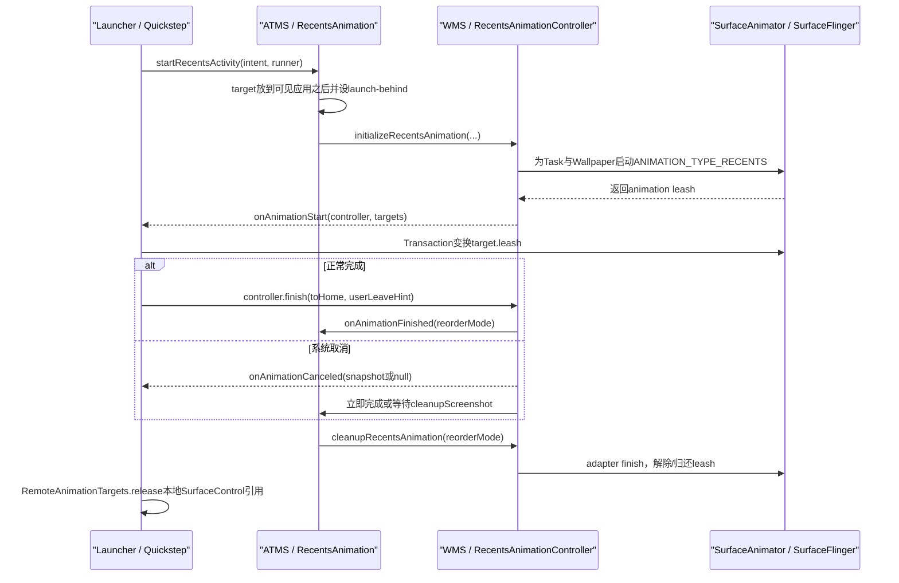
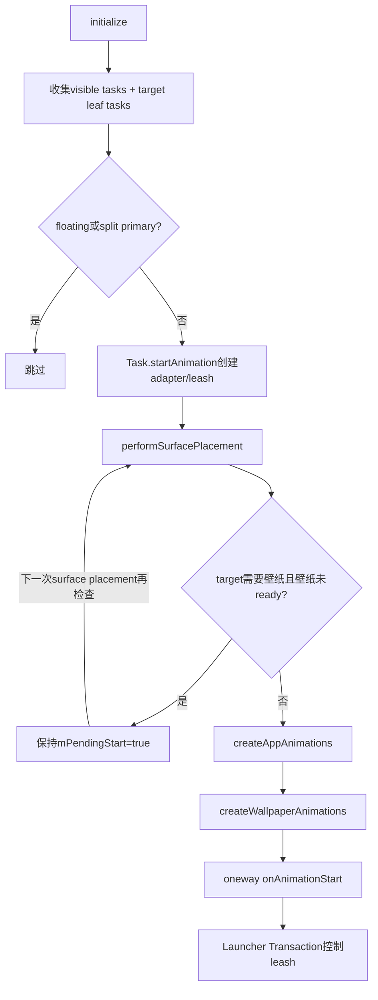
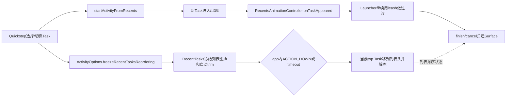

# 第526章 Android RecentsAnimation系统侧：ActivityTaskManager目标、Leash、任务冻结、取消完成、截图与Surface释放链

> 源码基线：Android 11 / API 30 / `android-11.0.0_r48`。本章直接阅读`frameworks/base/services/core/java/com/android/server/wm`、`frameworks/base/core/java/android/view`、`frameworks/base/packages/SystemUI/shared`与`packages/apps/Launcher3/quickstep`，只读源码、不编译。核心文件：`ActivityTaskManagerService.java`、`RecentsAnimation.java`、`RecentsAnimationController.java`、`WindowManagerService.java`、`Task.java`、`SurfaceAnimator.java`、`TaskScreenshotAnimatable.java`、`RecentTasks.java`、`InputMonitor.java`、`IRecentsAnimationRunner.aidl`、`IRecentsAnimationController.aidl`、`RemoteAnimationTarget.java`及Launcher侧同名包装类。

## 1. 本章解决什么问题

Launcher请求RecentsAnimation以后，system_server究竟选了哪些Task？`RemoteAnimationTarget.leash`为什么能让Launcher移动应用画面，却不把应用窗口所有权交给Launcher？Home为何先被放在应用后面？完成、取消、延迟取消和“用截图取消”有什么不同？最近任务列表的freeze又是不是RecentsAnimation自动完成的？

## 2. 一句话定位

`RecentsAnimation`负责Activity/Task层级的准备与最终重排，`RecentsAnimationController`负责WMS侧Task/Wallpaper动画适配器、leash、Binder控制接口和清理；Launcher只持有可变换Surface的远程句柄，真正的Activity生命周期、Task顺序与Surface归还始终由system_server收口。

## 3. 先分清四个同名对象

system_server中的`RecentsAnimation`是一次手势的Activity层协调器；system_server中的`RecentsAnimationController`是WMS动画控制器；SystemUI shared中的`RecentsAnimationControllerCompat`只是AIDL包装；Launcher quickstep中的`RecentsAnimationController`再加UI_HELPER线程、targets释放和本地完成监听。只看类名很容易把四层揉成一层。

## 4. 进程、线程和锁先定下来

Quickstep/Launcher在Launcher进程，ATMS/WMS在system_server；`startRecentsActivity()`是Launcher发往ATMS的同步Binder调用，`IRecentsAnimationRunner`被声明为`oneway`，system_server回调Launcher时不等待Launcher处理完；`IRecentsAnimationController`不是oneway，Launcher因此把finish、输入接管与截图清理放到`UI_HELPER_EXECUTOR`，避免阻塞Launcher主线程。

## 5. 本章源码阅读顺序

先从`ActivityManagerWrapper→ATMS→RecentsAnimation`看目标Activity如何放到后面，再从`WMS.initializeRecentsAnimation→RecentsAnimationController`看Task、Wallpaper和leash；随后读三种reorder、延迟取消与截图替身；最后单独读`RecentTasks`冻结和Launcher的Surface句柄释放。

## 6. 从Launcher到Surface归还的总链



## 7. Launcher侧入口只是包装，不替系统作决定

`ActivityManagerWrapper.startRecentsActivity()`把Launcher监听器包成`IRecentsAnimationRunner.Stub`，再调用`ActivityTaskManager.getService().startRecentsActivity()`。它把系统的`RemoteAnimationTarget[]`转换为Compat数组，但不在这里选择Task、创建leash或决定最终Task顺序。

## 8. runner回调为何是oneway

`IRecentsAnimationRunner.aidl`整体标记`oneway`，`onAnimationStart`、`onAnimationCanceled`和`onTaskAppeared`都是异步Binder事务。WMS只负责把消息排进Launcher Binder线程池；“方法返回”不代表Launcher主线程已经建立SwipeHandler，更不代表第一帧Transaction已经提交。

## 9. controller调用为何不是oneway

`IRecentsAnimationController`的`finish()`、`setInputConsumerEnabled()`、`cleanupScreenshot()`等是普通Binder方法。Launcher的quickstep包装因此在UI_HELPER线程执行；其回调再投MAIN线程。这也意味着Launcher本地先触发`mOnFinishedListener`，系统Task层级可能稍后才真正完成。

## 10. ATMS入口有特权门

`ActivityTaskManagerService.startRecentsActivity()`调用`enforceCallerIsRecentsOrHasPermission(MANAGE_ACTIVITY_STACKS)`。普通第三方应用即使能构造AIDL参数，也不能借此拿到其他应用Task的Surface控制权；合法调用者必须是系统登记的Recents组件或持有栈管理权限。

## 11. Binder身份为什么要清除

ATMS先保存calling pid/uid并找出`WindowProcessController caller`，随后`Binder.clearCallingIdentity()`，以system_server身份做Activity/Window操作，finally恢复。权限判断发生在清身份之前；清身份不是绕过入口权限，而是避免后续内部操作继续背负Launcher UID。

## 12. target到底是HOME还是RECENTS

`RecentsAnimation`构造时比较Intent component与系统登记的Recents component：相等则`ACTIVITY_TYPE_RECENTS`，否则`ACTIVITY_TYPE_HOME`。所以同一套系统侧机制既能驱动独立Recents Activity，也能驱动Quickstep中由Home/Launcher承载Overview的方案。

## 13. runner为null代表预加载，不是空动画

ATMS看到`recentsAnimationRunner == null`就调用`preloadRecentsActivity()`；有runner才调用`startRecentsActivity()`。预加载只想提前建立ActivityRecord、进程、配置和部分View准备条件，不创建RemoteAnimationTarget，也不会把Surface控制器交给Launcher。

## 14. 已存在Activity的预加载行为

若目标Activity已经requested visible或是top running，预加载立即返回；若已附着进程但不可见，则调用`ensureActivityConfiguration(..., ignoreVisibility=true)`。它解决旋转/资源配置陈旧问题，不会强行resume目标Activity。

## 15. 不存在Activity时怎样预加载

系统通过`startRecentsActivityInBackground()`创建记录：ActivityOptions指定HOME/RECENTS类型、`setAvoidMoveToFront()`，Intent加入`NEW_TASK|NO_ANIMATION`。注释明确，目标仍不可见时创建ActivityRecord并不等价于已经真正启动客户端。

## 16. 预加载为何最终进入STOPPING

目标未附着进程时，系统用`startSpecificActivity(..., andResume=false)`启动；随后若不在STOPPING/STOPPED，调用`addToStopping(scheduleIdle=true, idleDelayed=true)`。它给客户端一次非stopped traversal机会以提前measure，但不把预加载Activity留在前台。

## 17. 正式启动先寻找精确目标Activity

`getTargetActivity()`不只是取HOME stack栈顶：它在目标stack里找当前user且base Intent component与目标Intent component相同的Task，再取其top non-finishing Activity。多用户、多Launcher共存时，这两个条件避免误拿另一个用户或另一个Home实现。

## 18. 已有目标却没有“上方stack”为何取消

已有目标stack时，系统保存`getStackAbove(targetStack)`作为恢复锚点；如果上面没有stack，说明没有一层正在显示的应用可被揭开/缩放，直接对runner回调`onAnimationCanceled(null)`并返回。此时动画甚至未初始化，不能期待controller回调。

## 19. 启动提示与caller状态的准确时机

目标尚未requested visible时发送launch power hint，ActivityMetrics记录launching；若ATMS能找到调用者进程，则`mCaller.setRunningRecentsAnimation(true)`。这些是性能/调度和进程状态信号，不是Surface动画已开始的证明。

## 20. deferWindowLayout保护哪段原子准备

系统在移动stack、创建/查找目标、设置launch-behind、取消旧动画、初始化新控制器、更新可见性期间调用`deferWindowLayout()`，finally `continueWindowLayout()`。它减少中间层级被单独布局/提交的机会，但Java异常仍会向上抛出，不是事务回滚机制。

## 21. 已有目标stack先放到最底层可见应用之后

`moveStackBehindBottomMostVisibleStack(targetStack)`让Home/Recents处在受控应用后面。手势开始时前台应用仍遮住它，Launcher再通过缩小、平移或改变alpha的app leash逐步露出后面的Home/Overview，避免先把Home真正置顶再伪装回应用。

## 22. 一个Home stack里有多个Task怎么办

第三方Launcher与默认Launcher可在同一目标stack留下多个Task。若匹配到的目标Activity所属Task不是target stack顶Task，代码先`positionChildAtTop(task)`；这里改变的是目标stack内部Task顺序，尚未把整个target stack移到所有应用之上。

## 23. 没有目标Activity时正式路径会先创建

系统同样以avoid-move-to-front方式后台启动目标，再取得target stack/activity并把stack放到可见应用后面；随后准备并执行`TRANSIT_NONE`。这次无常规Activity切换动画，接下来的可视过渡由RecentsAnimation leash驱动。

## 24. `setAvoidMoveToFront()`为何关键

普通startActivity会把Home/Recents直接移到顶层，使原应用先失去前台位置；avoid-move-to-front让系统创建目标但保留当前应用层级。Recents手势需要的是“目标在后面已可画，前景仍由远程动画控制”，不是普通页面跳转。

## 25. launch-behind不是普通visible标志

系统把目标Activity的`mLaunchTaskBehind=true`并记到`mLaunchedTargetActivity`，随后`ensureActivitiesVisible()`使它在不成为top-resumed Activity的情况下具备可见Surface。结束时必须恢复false，否则后台Home/Recents会持续参与可见性与生命周期判断。

## 26. Intent extras采用替换语义

r48在目标已存在时执行`targetActivity.intent.replaceExtras(mTargetIntent)`，注释还留有“是否应发送new intent”的TODO。它更新记录中extras，却不能简单等同于Activity客户端收到了标准`onNewIntent()`回调；学习时应按源码实际边界描述。

## 27. 新动画开始前为何同步取消旧动画

`RecentsAnimation`先调用WMS `cancelRecentsAnimation(REORDER_MOVE_TO_ORIGINAL_POSITION)`，再初始化新controller。这样WMS全局只保留一个`mRecentsAnimationController`，旧动画先归还Task并恢复原位置；它不是按gesture id并行保存多场动画。

## 28. 初始化时传入的六类信息

WMS获得目标Activity type、远程runner、Activity层回调、displayId、`RecentTasks.getRecentTaskIds()`结果和精确target Activity。前四项建立控制关系，recent ids决定`isNotInRecents`，target Activity决定opening模式、壁纸、contentInsets与fixed rotation。

## 29. Activity层到WMS层的关键交接源码

```java
targetActivity.mLaunchTaskBehind = true;
mLaunchedTargetActivity = targetActivity;
targetActivity.intent.replaceExtras(mTargetIntent);

mWindowManager.cancelRecentsAnimation(REORDER_MOVE_TO_ORIGINAL_POSITION,
        "startRecentsActivity");
mWindowManager.initializeRecentsAnimation(mTargetActivityType, recentsAnimationRunner,
        this, mDefaultTaskDisplayArea.getDisplayId(),
        mStackSupervisor.mRecentTasks.getRecentTaskIds(), targetActivity);

mService.mRootWindowContainer.ensureActivitiesVisible(null, 0, PRESERVE_WINDOWS);
```

这段顺序说明：先让目标具备launch-behind语义并创建leash，再刷新Activity可见性；不能把`ensureActivitiesVisible()`误当作创建RemoteAnimationTarget的入口。

## 30. WMS controller初始化的第一步

`WindowManagerService.initializeRecentsAnimation()`创建新的`RecentsAnimationController`，保存到唯一字段，更新AppTransition booster，再调用`initialize()`。构造器只保存service、runner、callback与display；真正选Task、linkToDeath、处理壁纸都在initialize中。

## 31. 初始候选来自“当前可见Task”

`mDisplayContent.getDefaultTaskDisplayArea().getVisibleTasks()`得到默认TaskDisplayArea里当前可见Task。不可见普通后台Task不会仅因出现在最近任务列表就自动获得leash；Overview卡片可继续显示它们的静态快照。

## 32. target stack的所有leaf Task会被补进候选

controller取得HOME/RECENTS target stack后，`forAllLeafTasks(..., traverseTopToBottom=true)`把其leaf Task加入候选。这样目标Home/Recents即使刚被放在应用后方，也仍能成为opening target，而不会被“当前可见Task”筛掉。

## 33. 补目标Task时显式去重

PooledConsumer内部只有`!outList.contains(t)`才add；若target Task已经在visibleTasks，就不会创建两个TaskAnimationAdapter。这里按Task对象身份去重，不按taskId另建Map。

## 34. floating Task为什么跳过

`WindowConfiguration.tasksAreFloating()`为true的Task不加入初始Recents targets，典型浮动窗口不会被当作普通全屏卡片一起缩放。它是否仍显示、由谁处理取决于对应窗口模式自己的策略，不能推导为“Recents会关闭浮窗”。

## 35. split primary被显式跳过

初始化代码还跳过`WINDOWING_MODE_SPLIT_SCREEN_PRIMARY`，但没有用同一条件跳过secondary。这个不对称是r48源码事实；不要把它概括为“所有分屏Task都不会动画”。后续minimizedHomeBounds也专门考虑目标处于split secondary的情况。

## 36. recentTaskIds不是所有内存Task id

`RecentTasks.getRecentTaskIds()`只把通过`isVisibleRecentTask()`且位于可见范围的Task置true。controller传`!recentTaskIds.get(taskId)`给adapter，最终成为`RemoteAnimationTarget.isNotInRecents`；字段表示是否呈现在Recents UI，不表示Task当前窗口是否可见。

## 37. 每个候选Task怎样挂上动画适配器

`addAnimation()`创建`TaskAnimationAdapter`，调用`task.startAnimation(pendingTransaction, adapter, ..., ANIMATION_TYPE_RECENTS)`并commit，然后放入`mPendingAnimations`。SurfaceAnimator会建立动画leash并把它传回adapter的`startAnimation()`。

## 38. leash到底是什么

leash是Surface树中的临时父SurfaceControl：真实Task Surface被reparent到它下面，Launcher只变换这个父节点，就能整体移动Task内多个Window。Launcher获得的是句柄，不会直接改ActivityRecord、WindowState或Task z-order；清理时SurfaceAnimator把真实Surface归回系统层级。

## 39. adapter先恢复位置和裁剪

`TaskAnimationAdapter.startAnimation()`在交给远端前把leash position设为Task相对父容器的`localBounds.left/top`，crop设为从(0,0)开始的本地尺寸，再保存leash和finish callback。Launcher第一笔Transaction尚未到来时，画面因此维持原位置和裁剪。

## 40. 没有任何pending animation会怎样

若所有候选都因floating、split primary等条件被过滤，controller调用`cancelAnimation(REORDER_MOVE_TO_ORIGINAL_POSITION, "initialize-noVisibleTasks")`。runner收到null snapshot取消，Activity层随后恢复目标位置；不会发送一个空的`onAnimationStart()`让Launcher自行猜测。

## 41. linkToDeath建立什么保险

有pending target后，controller对runner Binder调用`linkToDeath`。Launcher进程死亡会触发`binderDied()`，系统以MOVE_TO_ORIGINAL_POSITION取消，并销毁`INPUT_CONSUMER_RECENTS_ANIMATION`，避免无主leash和抢占输入的consumer残留。

## 42. target Activity与壁纸关系在initialize中固定

controller保存`mTargetActivityRecord`；若它`windowsCanBeWallpaperTarget()`，就标记`FINISH_LAYOUT_REDO_WALLPAPER`并请求layout。Home常允许壁纸透出，因此启动RemoteAnimation前必须让WallpaperController算出正确target与Surface状态。

## 43. minimizedHomeBounds名字容易误导

初始化保存的是root home Task当前bounds；真正回调runner时，仅当目标Activity处于split-screen secondary才把这份Rect作为`minimizedHomeBounds`传出，否则传null。它不是每次都代表一块“最小化后实时计算的新区域”。

## 44. performSurfacePlacement是取得leash的关键推进点

完成候选和壁纸标记后，controller调用`mWindowPlacerLocked.performSurfacePlacement()`。SurfaceAnimator创建/挂接leash、Window状态和Wallpaper布局在surface placement中推进；controller随后仍可能保持pending-start，等待壁纸真正ready。

## 45. fixed rotation和StatusBar也加入会话

系统调用`FixedRotationTransitionListener.onStartRecentsAnimation(targetActivity)`，并通知`StatusBarManagerInternal.onRecentsAnimationStateChanged(true)`。这解释了横竖屏目标可以借固定旋转变换过渡，也解释了Recents运行状态不只存在于Launcher本地。

## 46. target、leash与runner开始时序



## 47. `checkAnimationReady()`的真实门

每次RootWindowContainer完成surface changes后调用controller检查：如果目标不会覆盖/显示壁纸，可以立即start；否则必须同时存在wallpaper target且`wallpaperTransitionReady()`。所以pending-start主要等的是壁纸条件，不是一个固定睡眠时间。

## 48. 为什么不能先回调再等壁纸

Launcher一旦拿到app leash就可能马上缩小前景应用，露出后面的Home壁纸。若壁纸Surface尚未ready，第一帧会露出黑色、旧壁纸或错误旋转。系统因此先准备完整可合成的底层画面，再把控制权交给远端。

## 49. startAnimation有两道幂等门

`!mPendingStart || mCanceled`时直接返回；创建targets成功后先把`mPendingStart=false`，再回调runner。重复surface placement不会重复发送start；已经取消的会话也不会因为壁纸后来ready而“复活”。

## 50. appTargets数组顺序不是可靠z-order协议

`createAppAnimations()`从`mPendingAnimations.size()-1`向0遍历并收集target。数组顺序受候选收集与逆序影响；`RemoteAnimationTarget.prefixOrderIndex`才是保留原Surface树层级次序的专用字段，动画端不应把数组下标当作稳定z值。

## 51. 没有主窗口的Task会在开始前移除

adapter用Task top visible Activity的`findMainWindow()`创建target；mainWindow为null就返回null，controller调用`removeAnimation(adapter)`。如果所有target都因此消失，再以`startAnimation-noAppWindows`取消。Task存在不等于已有可动画Window Surface。

## 52. MODE_OPENING与MODE_CLOSING怎么定

只比较top visible Activity的activity type是否等于目标HOME/RECENTS type：相等为`MODE_OPENING`，其余为`MODE_CLOSING`。这里的opening/closing描述本次过渡角色，不表示Activity此刻刚创建或正在执行`onStart()`/`onStop()`。

```java
final ActivityRecord topApp = mTask.getTopVisibleActivity();
final WindowState mainWindow = topApp != null ? topApp.findMainWindow() : null;
if (mainWindow == null) {
    return null;
}
final int mode = topApp.getActivityType() == mTargetActivityType
        ? MODE_OPENING : MODE_CLOSING;
mTarget = new RemoteAnimationTarget(mTask.mTaskId, mode, mCapturedLeash,
        !topApp.fillsParent(), mainWindow.mWinAnimator.mLastClipRect,
        insets, mTask.getPrefixOrderIndex(), new Point(mBounds.left, mBounds.top),
        mLocalBounds, mBounds, mTask.getWindowConfiguration(),
        mIsRecentTaskInvisible, null, null);
```

## 53. RemoteAnimationTarget最重要的字段

`taskId`关联最近任务；`leash`供Transaction变换；`mode`区分目标与前景应用；`localBounds`相对父容器，`screenSpaceBounds`是屏幕坐标；`contentInsets`帮助避开系统栏；`prefixOrderIndex`保存层级；`windowConfiguration`带activity/windowing mode；`isNotInRecents`提示卡片可见性。

## 54. 三套坐标不要混用

`position`使用`mBounds.left/top`，是已废弃的屏幕空间起点；`localBounds`先复制Task bounds，再offset到Task relative position；`screenSpaceBounds`仍是Task屏幕bounds。Launcher在父容器上动画应优先使用localBounds，直接混入screen坐标会在分屏/嵌套Task下产生偏移。

## 55. contentInsets包含letterbox补偿

创建target时先取mainWindow content insets，再用`InsetUtils.addInsets()`加上ActivityRecord的letterbox insets。因而这个Rect不只是状态栏高度；横竖比不匹配形成的黑边也会影响可用于内容变换/截图裁剪的区域。

## 56. prefixOrderIndex为何比“第几个target”可靠

它来自Task在WindowContainer树中的prefix order，专门供远端保留原始z层级。Launcher可在需要boost当前卡片时主动覆盖层级，但若只是还原系统顺序，应根据prefixOrderIndex，而不是依赖Binder数组排列。

## 57. `isNotInRecents`不等于不可动画

一个当前可见Task可能因excluded、超出最近列表可见范围等原因不呈现在Overview卡片，却仍必须随手势退场，所以系统仍给它leash并标`isNotInRecents=true`。Launcher常需要动画它，但不为它长期保留普通TaskView。

## 58. Wallpaper target如何创建

app targets有效后，`WallpaperAnimationAdapter.startWallpaperAnimations()`为可用WallpaperWindowToken建立适配器和leash，返回独立的wallpaperTargets数组。Wallpaper target不是伪造的Task target，也没有taskId语义，Launcher要分别维护和释放。

## 59. 单个壁纸adapter取消不会取消整场Recents

Wallpaper adapter的finish callback只从`mPendingWallpaperAnimations`移除自己；测试还明确验证Task动画继续运行。相比之下，任意TaskAnimationAdapter的`onAnimationCancelled()`会以MOVE_TO_ORIGINAL_POSITION取消整场动画，因为核心应用画面已失去控制连续性。

## 60. minimizedHomeBounds何时非null

条件是目标Activity存在且`inSplitScreenSecondaryWindowingMode()`；值来自初始化时root home task bounds。普通全屏Quickstep下它是null，不能用null推断“系统没找到Home”，也不能把非null推断成当前动画必然包含两个app target。

## 61. homeContentInsets有降级路径

若target Activity已有mainWindow，取其contentInsets；否则调用WMS `getStableInsets(displayId)`。因此onAnimationStart可以在Home Window尚未创建时仍给出可用安全区域，但降级值只代表display stable insets，不包含某个具体窗口的全部个性化布局信息。

## 62. 回调start以后系统并未放弃监管

runner收到controller、apps、wallpapers、insets后可操作leash，但WMS仍保存pending adapters、监听stack order、runner死亡和input windows；ATMS仍保存launch-behind目标与恢复锚点。所谓“远程驱动”是远程提供每帧变换，不是把系统窗口管理器退出链路。

## 63. r48的RemoteException边界

`startAnimation()`捕获`mRunner.onAnimationStart()`的RemoteException只记录日志，没有在catch中立即调用cancel/cleanup。正常Binder死亡通常由DeathRecipient补救，但从源码严格说，“回调发送失败”和“本方法同步完成清理”不是同一件事。

## 64. 动画中出现新Task怎样通知Launcher

Task在Recents运行期间进入`applyAnimationUnchecked(enter=true)`时，若WMS存在controller，就调用`addTaskToTargets()`；controller为它建立隐藏起始adapter/target，并通过oneway `runner.onTaskAppeared(target)`通知。这是动态增量，不会重新发送整套onAnimationStart数组。

## 65. 新target为何用hidden=true

`createTaskRemoteAnimation()`调用`addAnimation(..., hidden=true, finishedCallback)`，让新Task先受leash与远端控制，避免系统常规enter动画和Launcher动画同时抢画面。它还把taskId记进`mPendingNewTaskTargets`，finish前会专门清掉这些增量target。

## 66. removeTask不是任意删除Task

controller的`removeTask(taskId)`只在目标存在且`target.mTask.isOnTop()`时移除动画adapter，并返回true；它停止控制target，不等于从RecentTasks数据库或Activity task stack删除Task。非top时返回false是为了避免真实窗口显现与移除动画之间闪烁。

## 67. 正常finish先移除所有new task targets

Binder `finish()`在WMS锁内倒序遍历`mPendingNewTaskTargets`调用`removeTaskInternal()`，随后释放锁，再通知Activity层callback。初始targets留给统一cleanup；动态targets先尝试脱离，避免它们在最终重排中残留额外控制状态。

## 68. Recents input consumer是另一条WMS集成线

Launcher调用`setInputConsumerEnabled(true)`后，controller只把开关置true并请求InputMonitor重算窗口；InputMonitor遍历Window时，仅对“不是target Home/Recents且属于正在动画Task”的Activity应用Recents input consumer。Surface控制权和触摸路由仍是两个独立机制。

## 69. input consumer可触区域取自target主窗口bounds

`updateInputConsumerForApp()`找到`mTargetActivityRecord.findMainWindow()`，把它的bounds写入consumer touchableRegion，并转移当前hasFocus。虽然consumer覆盖的是前景受控app输入，它的区域参考却是正在后方显露的目标Home/Recents主窗口。

## 70. system bar flags由谁影响可以动态切换

`setAnimationTargetsBehindSystemBars(behind)`遍历pending Task；对activity type不等于目标类型的Task调用`setCanAffectSystemUiFlags(behind)`，再requestTraversal。它决定前景动画target还是Home提供系统栏外观，不是把Surface实际reparent到状态栏层级。

## 71. 隐藏IME与启用输入consumer是连续但不同调用

Launcher quickstep的`enableInputConsumer()`在UI_HELPER任务中先`hideCurrentInputMethod()`，再`setInputConsumerEnabled(true)`。前者通过InputMethodManagerInternal收起键盘，后者更新InputMonitor；即使IME隐藏失败，也不能据此断言input consumer没有启用。

## 72. 主动`screenshotTask(taskId)`只允许当前targets

controller在pending adapters中按taskId查找，调用TaskSnapshotController立即snapshot、标记skip-closing snapshot，再从内存取非低清snapshot。若动画已取消、taskId不在当前targets或snapshot失败，返回null；它不是任意系统Task截图API。

## 73. r48的多用户截图细节值得警惕

`screenshotTask()`取snapshot时写死`userId=0`，而延迟取消的`screenshotRecentTask()`使用`task.mUserId`。这两个路径在非owner用户上语义并不一致；讲解源码应如实指出r48实现边界，不能泛化成“所有用户都按Task用户取图”。

## 74. 最近任务freeze不是初始化RecentsAnimation自动调用

本章容易出现的最大误解是：WMS创建leash时并没有调用`setFreezeTaskListReordering()`。freeze来自启动某个Task时附带的`ActivityOptions.setFreezeRecentTasksReordering()`，它服务于QuickSwitch/卡片启动期间保持列表视觉顺序，与Surface动画controller是相邻但独立的状态机。

## 75. Launcher在哪儿请求freeze

`TaskView.launchTaskInternal(..., freezeTaskList=true)`给ActivityOptions调用`ActivityOptionsCompat.setFreezeRecentTasksList(opts)`，再走`startActivityFromRecentsAsync()`。是否freeze由上层启动场景传入；点击/切换Task并非所有路径无条件冻结。

## 76. system_server再次校验请求者身份

`ActivityStackSupervisor.startActivityFromRecents()`只有在options请求freeze且`mRecentTasks.isCallerRecents(callingUid)`时才设置冻结；通用ActivityStarter路径也要求launchedFromUid是Recents。普通应用不能仅靠伪造ActivityOptions长期冻结系统最近任务顺序。

## 77. freeze期间“启动Task”不会立刻移到列表头

RecentTasks `add()`发现Task已在recent列表且不是affiliated task时，只有`!mFreezeTaskListReordering`才remove旧位置并add(0)。冻结期间它仍通知持久化，但内存列表视觉次序暂不因快速切换每一步来回跳动。

## 78. freeze还暂停两类trim

`trimInactiveRecentTasks()`冻结时直接返回；`findRemoveIndexForAddTask()`也返回-1，延后因新增Task触发的替换/裁剪。它不是让RecentTasks完全只读：显式remove等路径仍可能改集合，freeze主要针对重排与自动trim。

## 79. 解冻有触摸和超时两条出口

RecentTasks注册PointerEventListener；冻结后若ACTION_DOWN落在app window内，就以当前focused stack的top Task提交顺序。另有每次freeze都会重置的timeout runnable；超时同样把当前top Task移到index 0、恢复trim并发送task stack/frozen通知。

## 80. Surface动画与任务列表冻结的并行关系



## 81. 三个reorder mode先背准

`REORDER_KEEP_IN_PLACE=0`保持当前stack位置；`REORDER_MOVE_TO_TOP=1`把目标Home/Recents放到顶；`REORDER_MOVE_TO_ORIGINAL_POSITION=2`把目标放回开始前保存的位置。这是Activity层最终收口策略，不是三种Surface动画曲线。

## 82. Launcher正常finish只能直接选择两种

`IRecentsAnimationController.finish(moveHomeToTop, sendUserLeaveHint)`把true映射MOVE_TO_TOP，把false映射MOVE_TO_ORIGINAL_POSITION。正常runner finish不会直接传KEEP_IN_PLACE；KEEP主要由系统侧取消/stack-order变化等路径使用。

## 83. 外部cancel API的布尔语义与finish不同

ATMS `cancelRecentsAnimation(restoreHomeStackPosition)`中，true映射MOVE_TO_ORIGINAL_POSITION，false映射KEEP_IN_PLACE。参数名说“restore Home stack position”，不是“cancel后去Home”；若把它与finish的`moveHomeToTop`当同一个布尔，会把方向完全讲反。

## 84. finish为什么在回调前释放WMS锁

controller先在WMS锁内检查mCanceled并处理new targets，然后退出synchronized才调用`mCallbacks.onAnimationFinished()`；源码注释明确callback自行同步，不能持WM锁调用。Activity层会进入ATMS global lock并做复杂stack/visibility操作，提前释放降低锁嵌套风险。

## 85. Activity层finish先做会话级清理

`RecentsAnimation.finishAnimation()`注销stack-order listener，取得当前controller，结束power hint、按MOVE_TO_TOP停止app switches、清除caller running标记，然后进入`inSurfaceTransaction()`。controller已经不存在时会直接返回，因此回调必须与当前唯一WMS会话对应。

## 86. WMS为何先把controller字段置null

`cleanupRecentsAnimation()`先保存局部controller并令`mRecentsAnimationController=null`，再调用其`cleanupAnimation()`。这样adapter finish callback或surface placement引发的新查询不会继续把正在拆除的controller视为active，也为下一场动画建立清晰的全局边界。

## 87. cleanupAnimation具体清什么

它倒序remove全部Task adapters和Wallpaper adapters，移除failsafe、注销app-transition listener、unlink runner death、清runner引用、标记canceled、取消残余截图animator、重算input windows、收尾fixed rotation，并通知StatusBar Recents状态为false。

## 88. removeAnimation不是简单从ArrayList删除

它先恢复Task可影响SystemUI flags，再调用adapter捕获的`OnAnimationFinishedCallback`，最后从pending列表移除。这个callback让SurfaceAnimator完成动画、撤销leash/reparent；若只删Java列表，真实Surface树仍可能挂在临时父节点下。

## 89. 系统归还leash与Launcher release是两回事

system_server的adapter finish改变服务端Surface树与动画所有权；Launcher的`RemoteAnimationTargets.release()`调用每个Compat target的`SurfaceControl.release()`，释放本进程native句柄引用。Android文档明确release本地引用不会必然从屏幕移除Surface；真正移除/重挂由服务端Transaction完成。

## 90. MOVE_TO_TOP怎样真正去Home/Overview

系统先把target加入NoAnimActivities；若需要user-leave hint，调用`targetStack.moveTaskToFront(...)`并设置`mUserLeaving=true`，否则直接`targetStack.moveToFront()`。随后准备TRANSIT_NONE、刷新可见性、resume focused stacks并执行transition。

## 91. sendUserLeaveHint为何影响PiP

源码注释说明，设置`mUserLeaving=true`允许之前的应用在pause时进入Picture-in-Picture。它不决定是否去Home，去Home由reorder mode决定；同样MOVE_TO_TOP可以选择发或不发user-leave hint。

## 92. MOVE_TO_ORIGINAL_POSITION怎样回应用

目标Activity原本就存在时，系统用开始时保存的`mRestoreTargetBehindStack`，调用`moveStackBehindStack(targetStack, restoreAnchor)`把Home/Recents放回原锚点之后，再刷新可见性与focused stack。若目标是本次才创建，restore anchor为null，此调用按`TaskDisplayArea`源码直接不移动，target仍保持启动准备时放到可见应用后方的位置；两种情况都由真实层级接管画面，不再依赖Launcher的leash变换。

## 93. KEEP_IN_PLACE为什么提前return

它不再移动stack；恢复launch-behind后，若不是截图延迟取消且target stack不focused，就立即`ensureActivitiesVisible()`隐藏视觉上应消失的目标，然后return，跳过后面的TRANSIT_NONE重排逻辑。KEEP表示接受当前层级事实，不等于“什么清理都不做”。

## 94. 三种结果都会恢复launch-behind

只要还能在target stack中找到原`mLaunchedTargetActivity`，系统都先设`mLaunchTaskBehind=false`。即使动画过程中另一个Launcher Task被移到top，也优先找原始Activity，避免把launch-behind留在错误对象上。

## 95. 为什么清理包在surface transaction中

adapter解除leash、stack重排、visibility更新与app transition应尽量在同一Surface事务边界提交，减少中间帧。finally若Root仍需layout，强制`performSurfacePlacement()`，处理显示配置变化导致之前placement被跳过的情况。

## 96. defer-cancel只是“请求策略”

Launcher停在Overview后调用`setDeferCancelUntilNextTransition(true, true)`，controller只记录`mRequestDeferCancelUntilNextTransition`与截图选择；它不会当场截图或取消。要等后续可见stack-order change满足条件，才设置cancel-on-next-transition。

## 97. 哪类stack-order change触发延迟取消

`RecentsAnimation.onStackOrderChanged()`先忽略已离开display或不可见stack；若新top Task不在当前动画targets，或新top Activity正是target Home/Recents，并且请求了defer，就准备TRANSIT_NONE并调用`setCancelOnNextTransitionStart()`。

## 98. 为什么再等下一次AppTransition开始

controller注册的AppTransitionListener在transition starting或cancelled时执行`continueDeferredCancel()`，注销自己并调用`cancelAnimationWithScreenshot(...)`。如果stack顺序一变就立即拆leash，新任务的常规transition与Launcher最后一帧之间可能出现闪烁；等transition边界能让两套动画衔接。

## 99. 截图取消的核心源码

```java
mCanceled = true;
final Task task = mPendingAnimations.get(0).mTask;
final TaskSnapshot taskSnapshot = screenshotRecentTask(task, reorderMode);
mRunner.onAnimationCanceled(taskSnapshot);
if (taskSnapshot == null) {
    mCallbacks.onAnimationFinished(reorderMode, false);
}

// screenshotRecentTask():
mRecentScreenshotAnimator = new SurfaceAnimator(animatable,
        (type, anim) -> mCallbacks.onAnimationFinished(reorderMode, false), mService);
mRecentScreenshotAnimator.transferAnimation(task.mSurfaceAnimator);
```

关键点是先把会话标为canceled，再把原Task的animation leash转给截图animatable；snapshot非null时不会马上finish，而是等Launcher用完截图。

## 100. `transferAnimation()`如何保持同一根leash

新的TaskScreenshotAnimatable创建`RecentTaskScreenshotSurface`并装入GraphicBuffer；SurfaceAnimator从真实Task animator接走原leash，把截图Surface reparent进这根leash，并把leash重新挂到Task动画父层。Launcher手里的SurfaceControl句柄仍指向同一leash，因此下一transition不会因换父句柄突然跳帧。

## 101. onAnimationCanceled携带snapshot代表什么

runner AIDL约定：snapshot为null时leash立即失效/进入清理；非null时Task内容已由截图替身维持，runner仍可短暂控制leash，并且必须最终调用`cleanupScreenshot()`。这个回调不是“给Overview卡片缓存一张普通缩略图”那么简单，而是取消过渡的生命周期协议。

## 102. cleanupScreenshot才是截图路径的完成按钮

controller收到cleanup后取消`mRecentScreenshotAnimator`；SurfaceAnimator触发animatable的`onAnimationLeashLost()`移除截图Surface，同时触发保存的finish callback，最终以KEEP_IN_PLACE进入Activity层收口。Launcher的TaskAnimationManager在收到非null canceledThumbnail并清会话时主动调用它。

## 103. 截图失败时不会无限等Launcher

若TaskSnapshotController返回null，controller仍给runner发送`onAnimationCanceled(null)`，随后立即`onAnimationFinished(KEEP_IN_PLACE, false)`。因此“截图取消”是尽力而为的无闪烁优化，不是完成动画的硬依赖。

## 104. `get(0)`揭示一条实现前提

r48截图取消直接取`mPendingAnimations.get(0)`，没有空列表检查。正常时能进入该路径意味着至少仍有受控Task；若未来路径在列表清空后仍触发截图取消会越界。这是隐含不变量，不应把实现讲成对任意空状态都健壮。

## 105. 无截图取消会立即收口

普通`cancelAnimation(reorderMode, screenshot=false)`先通知runner `onAnimationCanceled(null)`，紧接着调用Activity层finish；runner callback又是oneway，所以Launcher可能稍后才处理取消，而system_server已经开始拆adapter。Launcher必须把null取消视为“不要再操作旧leash”。

## 106. failsafe的目的与目的地

WMS policy触发animation failsafe后，controller安排1秒延时任务；若Launcher曾`setWillFinishToHome(true)`，超时用MOVE_TO_TOP，否则MOVE_TO_ORIGINAL_POSITION。这个1秒是failsafe runnable自身延迟，不等于从Recents启动起固定1秒强制结束。

## 107. runner死亡比普通超时清得更多

`binderDied()`先按原位置取消，再在WMS锁内显式destroy Recents animation input consumer。普通finish会通过input windows更新停用路由；进程死亡还要销毁其关联consumer资源，避免死客户端留下InputChannel端点。

## 108. controller没有公开gesture generation id

WMS只保存一个当前controller字段，新动画通过“先取消旧、再覆盖字段”串行化；runner callback本身没有携带generation。Launcher侧依靠TaskAnimationManager当前callbacks/controller身份清理迟到事件，读源码时要警惕旧oneway callback与新会话的时间交叠。

## 109. start新动画与旧动画清理的顺序风险

旧controller取消会同步进入Activity层stack恢复与Surface清理，然后才初始化新controller；这保证服务端结构有序，但也增加启动调用耗时。不能把`startRecentsActivity()`理解为“只投一个异步请求立即返回”，其Binder主干包含同步system_server工作。

## 110. 六种结束场景对照

正常回Home：MOVE_TO_TOP；正常回原应用：MOVE_TO_ORIGINAL_POSITION；显式cancel并恢复Home位置：MOVE_TO_ORIGINAL_POSITION；cancel但接受当前层级：KEEP_IN_PLACE；deferred screenshot取消：先KEEP+截图，cleanup后finish；runner死亡：MOVE_TO_ORIGINAL_POSITION并销毁input consumer。真正判断时先找入口，再看reorder mode，不能只看“cancel/finish”字样。

## 111. 不编译时最有效的调试阅读路线

先grep `startRecentsActivity`确定target type；再看`mPendingAnimations`的add/remove；查`createRemoteAnimationTarget`确认bounds与mode；沿`onAnimationFinished(reorderMode)`追Task重排；若是闪烁问题，重点看`setCancelOnNextTransitionStart→screenshotRecentTask→cleanupScreenshot`；若卡片顺序跳动，转去RecentTasks freeze而不是继续盯Surface。

## 112. macOS只读练习一：画出入口与回调

在源码根目录执行`rg -n "startRecentsActivity|onAnimationStart|onAnimationCanceled" frameworks/base/packages/SystemUI/shared/src/com/android/systemui/shared/system/ActivityManagerWrapper.java frameworks/base/services/core/java/com/android/server/wm/{ActivityTaskManagerService.java,RecentsAnimation.java,RecentsAnimationController.java}`。只记录每个方法所在进程、调用方向和是否oneway，不改文件。

## 113. macOS只读练习二：验证target筛选

执行`sed -n '355,590p' frameworks/base/services/core/java/com/android/server/wm/RecentsAnimationController.java`，手工列出visible Task、target stack leaf Task、floating、split primary、无mainWindow五类对象的结果，并标注`isNotInRecents`来自哪一个SparseBooleanArray。

## 114. macOS只读练习三：核对三种reorder

执行`sed -n '270,410p' frameworks/base/services/core/java/com/android/server/wm/RecentsAnimation.java`与`sed -n '590,760p' frameworks/base/services/core/java/com/android/server/wm/RecentsAnimationController.java`。分别回答MOVE_TO_TOP、ORIGINAL、KEEP是否移动stack、何时恢复launch-behind、是否执行后续TRANSIT_NONE。

## 115. macOS只读练习四：证明freeze是独立链

执行`rg -n "setFreezeRecentTasksList|setFreezeTaskListReordering|resetFreezeTaskListReordering" packages/apps/Launcher3/quickstep frameworks/base/packages/SystemUI/shared/src frameworks/base/services/core/java/com/android/server/wm`，从TaskView的ActivityOptions一路追到RecentTasks的触摸/timeout解冻；确认RecentsAnimationController初始化代码没有直接调用freeze。

## 116. 本章最常见的六个误解

leash不是应用窗口所有权；onAnimationStart返回不代表Launcher已处理；Home launch-behind不是top-resumed；finish(false)不是KEEP而是ORIGINAL；snapshot取消不是普通缩略图回调；RecentTasks freeze不是创建RecentsAnimation时自动发生。能把这六条分清，system侧主链就不会串线。

## 117. r48实现边界集中复盘

当前实现只从默认TaskDisplayArea收集并有多显示TODO；split primary被跳过而secondary并非同样处理；主动截图写死userId 0；start callback RemoteException只日志；截图取消依赖pending列表非空；runner回调无generation。这些是阅读该版本必须保留的限定，不代表所有Android版本的通用设计。

## 118. 复读后的因果检查

若问“为什么应用能缩小”，答案是Task Surface挂到leash且Launcher提交Transaction；若问“为什么Home可被露出”，答案是目标stack在后方加launch-behind并刷新可见性；若问“为什么最后不会停在假位置”，答案是adapter finish归还Surface并由reorder mode提交真实Task层级；三个答案缺一都不完整。

## 119. 本章结论

RecentsAnimation是一场跨进程但由system_server兜底的临时Surface托管：ATMS准备目标与真实层级，WMS选择可动画Task、建立leash和输入/壁纸/fixed-rotation契约，Launcher驱动每帧；finish/cancel最终必须拆leash、恢复launch-behind并重排Task。截图替身解决跨transition连续性，RecentTasks freeze则独立保证卡片顺序稳定。

## 120. 下一章预告

第527章将从`TaskSnapshotController`继续深入：系统何时捕获TaskSnapshot、内存/磁盘缓存怎样分层、真实比例与低清图怎样选择、secure layer如何防泄漏，以及Launcher的ThumbnailData/TaskThumbnailView如何把buffer、insets、rotation和矩阵变成Recents卡片。
