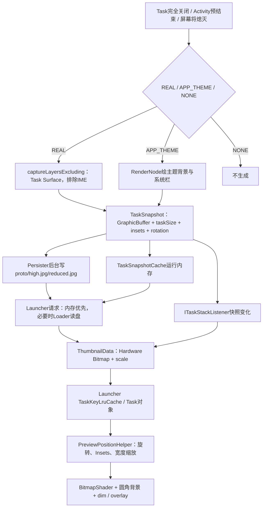
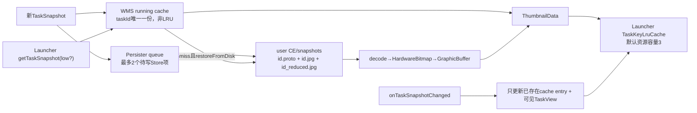
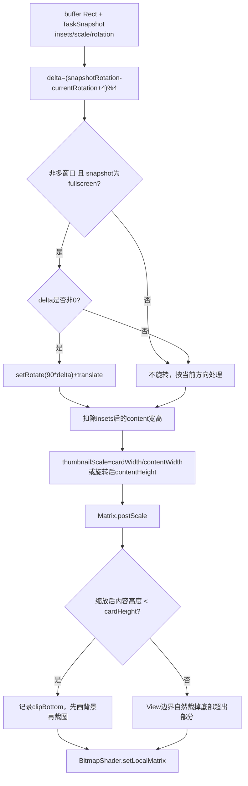

# 第527章 Android TaskSnapshot完整链：快照捕获、安全降级、内存/磁盘缓存、低清图与Launcher矩阵显示

> 源码基线：Android 11 / API 30 / `android-11.0.0_r48`。本章直接阅读`frameworks/base/services/core/java/com/android/server/wm`、`frameworks/base/core/java/android/app`、`frameworks/base/packages/SystemUI/shared`与`packages/apps/Launcher3/quickstep`，只读源码、不编译。核心文件：`TaskSnapshotController.java`、`TaskSnapshotCache.java`、`TaskSnapshotPersister.java`、`TaskSnapshotLoader.java`、`TaskSnapshotSurface.java`、`ActivityManager.java`中的`TaskSnapshot`、`ActivityRecord.java`、`ThumbnailData.java`、`TaskThumbnailCache.java`、`TaskThumbnailView.java`、`RecentsModel.java`和`TaskStackChangeListeners.java`。

## 1. 本章解决什么问题

最近任务卡片上的画面何时截取？`FLAG_SECURE`为什么不会把真实内容写进快照？高/低清图是在截图时各截一次，还是落盘时缩放？Launcher拿到GraphicBuffer后怎样变成BitmapShader？横竖屏、分屏、Insets和卡片比例不一致时，矩阵又怎样旋转、裁剪并补背景？

## 2. 一句话定位

system_server在Task即将完全不可见等时机捕获Task Surface，安全窗口改为只画主题色的假快照；最新对象进入WMS运行缓存并异步写入用户CE目录，Launcher按可见/快速滑动策略跨Binder取高低清TaskSnapshot，转换成ThumbnailData后用BitmapShader与PreviewPositionHelper矩阵投影到TaskView。

## 3. 先把五本账分开

真实Task尺寸是`taskSize`；GraphicBuffer像素尺寸可能按high-res scale缩小；`contentInsets`仍按Task/窗口坐标保存；磁盘上还有high JPEG与reduced JPEG；Launcher TaskThumbnailView最后又按卡片宽度建立显示矩阵。把任何两种“尺寸/scale”当成同一份都会算错。

## 4. 进程、线程和锁先定下来

捕获、运行缓存和Task层事件在system_server并要求WMS global lock；TaskSnapshotPersister有独立后台线程做CE磁盘I/O；Launcher的TaskThumbnailCache在共享后台Looper同步发Binder取图，再把结果投主线程；TaskThumbnailView的shader、Matrix和绘制都在Launcher主线程。

## 5. 本章源码阅读顺序

先追TaskSnapshotController的触发与三种mode，再看SurfaceControl捕获、TaskSnapshot元数据和安全降级；随后读Cache/Persister/Loader三层；接着追TaskStackListener与Launcher缓存；最后逐行手算PreviewPositionHelper的rotation、insets、scale、clip和background。

## 6. 从Task关闭到卡片像素的总链



## 7. 最常见的捕获入口是App Transition开始

`TaskSnapshotController.onTransitionStarting(displayContent)`取得`displayContent.mClosingApps`并交给`handleClosingApps()`。它不是每个Activity调用`onStop()`就无条件截图；系统先根据整个Task是否真正不可见筛选。

## 8. 非标准transition的可见性变化也会触发

`notifyAppVisibilityChanged(activity, visible)`只在`visible=false`时把单个Activity包装成closing set，再走同一筛选。例如某些不经过常规AppTransition的隐藏动作仍可更新快照，但最终仍要通过Task不可见检查。

## 9. finishing Activity会抢在隐藏前预截一次

`ActivityRecord.finishIfPossible()`对处于RESUMED的Activity准备close transition后，先用`TaskSnapshotController.snapshotTasks(task)`，再把Task加入skip集合，最后才`setVisibility(false)`。这样快照保留关闭前最后画面，不受隐藏或后续configuration change污染。

## 10. skip集合为何紧跟预截

同一close transition稍后还会处理closingApps；若不skip，就可能在窗口已隐藏或层级已变化后覆盖刚得到的新鲜快照。`addSkipClosingAppSnapshotTasks()`只跳过“下一次closing set处理”，调用者必须先主动截图，不能把skip理解为永久禁用。

## 11. skip集合何时清空

普通`handleClosingApps()`完成closing Task筛选和snapshot后调用`mSkipClosingAppSnapshotTasks.clear()`。它是一次性抑制账，不按task设置长期标志；不过TV/Wear/IoT的disable门在clear之前直接return，r48在这些设备上不会经此处清集合，这是源码边界而不是通用“一定清空”。

## 12. 屏幕熄灭前也要主动拍

屏幕真正off后`prepareTaskSnapshot()`会拒绝捕获，所以`screenTurningOff()`先把工作post到Handler，在WMS锁内收集所有visible Task并snapshot，finally才调用`ScreenOffListener.onScreenOff()`继续熄屏流程。

## 13. Home快照只有一个特殊临时用途

若当前用户Keyguard secure，熄屏路径允许对HOME调用`snapshotTask()`；这个snapshot只进运行缓存，不持久化、不发snapshot changed通知。解锁直达Home时可用它作starting window，使用一次后ActivityRecord会从运行缓存移除。

## 14. TV、Wear、IoT的“禁用”范围要说准确

`shouldDisableSnapshots()`在Leanback、Embedded、Watch设备返回true，`handleClosingApps()`和`screenTurningOff()`会跳过。但`snapshotTasks()`本身没有再次检查，其他显式调用者仍可能进入；因此它是这些自动入口的门，不是类内所有API绝对不可用的总开关。

## 15. closing Activity不等于closing Task

`getClosingTasks()`只在`task != null && !task.isVisible()`且不在skip集合时加入。若同一Task里下一个Activity正打开，Task仍visible，就不截图；这避免把正在过渡中的上一个Activity画面误当成整个Task最终快照。

## 16. snapshot mode有三种

`SNAPSHOT_MODE_REAL`捕获真实Surface；`SNAPSHOT_MODE_APP_THEME`只画TaskDescription背景和系统栏；`SNAPSHOT_MODE_NONE`完全跳过。模式先决定“能否/应该记录什么内容”，高低分辨率是后续另一维度。

## 17. 哪些Activity type允许普通快照

只有standard/undefined Task和assistant Task进入REAL或APP_THEME；其他activity type返回NONE。HOME正常关闭不会持久化，前述安全熄屏路径是特例；这里判断的是activity type，不是fullscreen/freeform/pinned等windowing mode。

## 18. `FLAG_SECURE`会转为主题快照

controller看top-most Activity的`shouldUseAppThemeSnapshot()`；它在Activity主动`setDisablePreviewScreenshots(true)`，或其任意Window `isSecureLocked()`时返回true。于是系统不调用真实Task layer捕获，而改画无业务内容的theme snapshot。

## 19. Device Policy也属于secure判断

`WindowState.isSecureLocked()`不仅检查`LayoutParams.FLAG_SECURE`，还查询DevicePolicyCache是否允许该user进行screen capture。因此工作资料政策可以在应用没显式设置FLAG_SECURE时同样触发APP_THEME模式。

## 20. 安全降级不是返回null

APP_THEME仍生成可缓存、可持久化、可跨Binder传给Launcher的TaskSnapshot，只是`isRealSnapshot=false`。Overview能显示应用背景色和系统栏装饰，既避免空白卡片，也不包含输入框、聊天内容等真实像素。

## 21. theme snapshot具体画了什么

系统取TaskDescription backgroundColor并强制alpha 255，创建按`taskBounds * highResScale`大小的RenderNode，Canvas先填纯色，再用`SystemBarBackgroundPainter`画状态栏/导航栏区域，最后转成HardwareBitmap和GraphicBuffer。

## 22. theme snapshot为何固定为不透明

构造TaskSnapshot时显式写`isTranslucent=false`，注释说明背景色已经强制不透明。即使原Activity透明或显示壁纸，安全替代图也不会通过alpha泄露后方真实Surface。

## 23. REAL捕获前先过五个状态门

屏幕必须on；Task里必须找到Surface showing、mainWindow存在且至少一个Window shown且lastAlpha>0的Activity；该Activity不能已commit reparent到animation leash；mainWindow必须存在；Activity不能处于fixed rotation transform。任一失败都返回null。

## 24. 为什么动画leash状态下拒绝普通截图

Activity已提交到animation leash时，Task Surface树正处于临时变换/重挂阶段，捕获可能得到缩放、位移或不完整内容。controller选择不拍而不是把过渡中间帧持久化为以后卡片。

## 25. `findAppTokenForSnapshot()`不一定取机械栈顶

过渡中可能出现trampoline Activity；方法用Task.getActivity predicate寻找具备可展示Surface和主窗口的Activity，并进一步要求至少一个WindowAnimator shown且alpha>0。它找的是“当前可捕获内容提供者”，不只是children最后一项。

## 26. fixed rotation为什么直接跳过

fixed rotation期间Activity配置方向与Task/display容器方向暂时不同；此时保存rotation、taskSize与buffer的对应关系会不稳定。r48宁可保留旧快照，也不写入一张元数据和像素方向可能互相矛盾的新图。

## 27. Builder先收集哪些元数据

REAL路径写入当前毫秒id、top Activity component、contentInsets、orientation、display rotation、windowingMode、top fullscreen opaque window的systemUiVisibility、pixelFormat、isTranslucent和原始Task size；GraphicBuffer与ColorSpace等实际capture成功后再补。

## 28. snapshot id不是task版本号计数器

`setId(System.currentTimeMillis())`只用墙钟毫秒值；不同Task或同一Task极快连续捕获可能得到相同id，系统也没有在这里检查单调性。它适合作为近似内容标识，不应被当作全局唯一事务序列。

## 29. contentInsets取content与stable逐边最小值

`getInsets()`对left/top/right/bottom分别取`min(contentInsets, stableInsets)`，再加letterbox insets。源码TODO还指出这些Insets相对window frame，而理想值应相对Task bounds；分屏/嵌套布局时这个坐标近似值得保留。

## 30. 这不是Rect交集

逐边min得到的是四个“边厚度”的最小值，不是对两个坐标Rect做`intersect()`。例如content top=80、stable top=60，保存60；Launcher随后再与当前DeviceProfile Insets做一次限制，形成第二层适配。

## 31. pixel format的设计选择

若调用者传UNKNOWN，且overlay开启16-bit、Activity fillsParent、又不是“透明窗口并显示壁纸”，builder选RGB_565；否则RGBA_8888。`isTranslucent`则要求最终format有alpha，且Activity不fillsParent或mainWindow本身非opaque。

## 32. r48里format参数实际上被丢了

`TaskSnapshotController`把builder pixelFormat传给`SurfaceControl.captureLayersExcluding()`，但r48这个Java方法最后调用native时硬编码`PixelFormat.RGBA_8888`，没有使用形参`format`。因此REAL路径的RGB_565选择在这一层没有真正传下去；磁盘Loader的decode config仍会参考16-bit配置。

## 33. isTranslucent是元数据，不保证磁盘alpha存在

内存GraphicBuffer可带alpha，TaskSnapshot也保存isTranslucent；但Persister统一压成JPEG，JPEG没有alpha通道。Loader会按proto恢复isTranslucent标志，却不能从JPEG重新获得原透明像素，这两个事实必须分开。

## 34. REAL截图抓的是Task layer子树

`captureLayersExcluding(task.getSurfaceControl(), crop, highResScale, pixelFormat, excludes)`从Task Surface作为root捕获其children，不是整块Display截图。系统栏通常不在Task子树中，靠contentInsets/systemUiVisibility元数据和背景绘制配合。

## 35. IME被显式排除

若DisplayContent当前有`mInputMethodWindow`，其SurfaceControl放进exclude数组；否则传空数组。即使键盘视觉上覆盖应用，TaskSnapshot也不把用户正在输入的IME画面固化到卡片。

## 36. source crop怎样构造

系统取Task bounds后`offsetTo(0,0)`，所以crop宽高等于Task原始尺寸，但坐标以Task Surface本地原点开始。捕获完成后`outTaskSize`仍记录未缩放的crop宽高，buffer像素则乘highRes scale。

## 37. 1像素图也视为失败

截图返回null、GraphicBuffer null，或width/height不大于1时，`createTaskSnapshot()`返回null。这样避免把Surface尚未准备好时的占位小buffer放进缓存；snapshotTasks外层还再次拒绝0尺寸并destroy。

## 38. REAL捕获主干源码

```java
task.getBounds(mTmpRect);
mTmpRect.offsetTo(0, 0);

final WindowState imeWindow = task.getDisplayContent().mInputMethodWindow;
SurfaceControl[] excludeLayers = imeWindow != null
        ? new SurfaceControl[] { imeWindow.getSurfaceControl() }
        : new SurfaceControl[0];

final SurfaceControl.ScreenshotGraphicBuffer screenshotBuffer =
        SurfaceControl.captureLayersExcluding(task.getSurfaceControl(), mTmpRect,
                scaleFraction, pixelFormat, excludeLayers);
if (outTaskSize != null) {
    outTaskSize.x = mTmpRect.width();
    outTaskSize.y = mTmpRect.height();
}
```

这里同时展示了三个关键点：Task本地crop、IME排除、原Task尺寸与缩放buffer分账。

## 39. 成功后按“缓存→持久化→通知”处理

非null且尺寸有效的snapshot先`mCache.putSnapshot(task, snapshot)`；普通Task再enqueue持久化，并调用`task.onSnapshotChanged(snapshot)`。运行缓存立即可读，磁盘写尚未完成，Listener通知也不代表JPEG已经落盘。

## 40. 无效0尺寸buffer会被主动destroy

snapshotTasks取得TaskSnapshot后若buffer width或height为0，调用`buffer.destroy()`并记录错误，不缓存、不持久化。这个destroy是GraphicBuffer资源释放，与Launcher后来对SurfaceControl leash的release不是同一类对象。

## 41. Home临时快照故意不持久化和通知

`snapshotHome=true`时仍put运行缓存，但跳过Persister与`task.onSnapshotChanged()`。因此Launcher不会通过TaskStackListener收到这张解锁专用Home图，CE目录也不留下它。

## 42. TaskSnapshot本身包含什么

它是Parcelable：id、topActivityComponent、GraphicBuffer、ColorSpace、orientation、rotation、原Task size、contentInsets、lowResolution、realSnapshot、windowingMode、systemUiVisibility和translucent。它没有Task标题、图标、lastActiveTime或Launcher卡片矩形。

## 43. Builder生成的一定标为高分辨率

`TaskSnapshot.Builder.build()`硬编码`isLowResolution=false`；Controller直接捕获的对象即便highResScale小于1，也仍叫“高分辨率版本”。lowResolution是“相对持久化high文件的reduced版本”标志，不等于像素一定与Task 1:1。

## 44. 三个scale不要混淆

资源`highResTaskSnapshotScale`控制capture buffer相对Task尺寸；Persister的`lowResScale/highResScale`控制从high buffer再缩多少；Launcher的ThumbnailData.scale是`bufferWidth/taskSize.x`；TaskThumbnailView还会再算`canvasWidth/contentBitmapWidth`作为显示scale。

## 45. 安全、类型与状态的选择树

安全优先级可以这样读：先由入口决定是否允许处理；Task activity type不是standard/undefined/assistant就NONE；允许类型中，top Activity禁预览或存在secure/策略禁截Window就APP_THEME；其余才尝试REAL；REAL任一可见性、leash、rotation或buffer门失败时返回null，不会自动再降级画theme。

## 46. WMS运行缓存不是Bitmap LruCache

`TaskSnapshotCache`用两个ArrayMap：`taskId→CacheEntry(snapshot, topApp)`与`topApp→taskId`。它没有max size、access order和低清/高清双份条目；职责是保存当前运行Task最近一次系统快照，并在Activity/进程/Task消失时精确移除。

## 47. 为什么还要维护topApp反向表

ActivityRecord被remove或进程died时，事件只带Activity对象；反向表能找到当时以它为topApp缓存的taskId。新snapshot覆盖同Task时先移除旧entry.topApp映射，再登记当前top Activity。

## 48. 运行缓存的生命周期不等于RecentTasks生命周期

app removed、app died、task removed、显式removeRunningEntry或clearRunningCache都会清内存；清运行缓存不会删除磁盘JPEG/proto。反过来，从Recents删除Task会同时清运行entry并enqueue磁盘文件删除。

## 49. putSnapshot按taskId覆盖而不destroy旧buffer

源码替换Map引用，没有显式destroy旧TaskSnapshot GraphicBuffer；后续依赖Java/native引用生命周期释放。它保证新读取得最新对象，但不是显式资源池复用。

## 50. getSnapshot先在锁内查运行缓存

命中就直接返回同一个TaskSnapshot，不检查调用者请求的userId与lowResolution。Task id在系统模型中承担身份，running entry只有一份；这也造成低清请求在内存命中时会拿到高版本。

## 51. “请求低清”不保证返回低清

只要running cache有snapshot，就无视`isLowResolution`返回builder创建的`isLowResolution=false`对象。低清优化主要发生在内存未命中、允许restoreFromDisk并启用reduced文件时。

## 52. 读磁盘前必须释放WMS锁

Controller和Cache注释都强调：`restoreFromDisk=true`时不能持WindowManager global lock。ATMS先在锁内查Task和userId，退出锁后才`task.getSnapshot()`；慢I/O不能阻塞窗口布局、输入和Activity状态机。

## 53. 磁盘load结果不会回填WMS运行缓存

`tryRestoreFromDisk()`只返回`mLoader.loadTask(...)`结果，没有`putSnapshot()`。同一Task若系统运行缓存一直空，重复外部请求可能重复读proto/JPEG；Launcher自己的TaskKeyLruCache才负责客户端侧复用。

## 54. 外部取图也有权限门

ATMS `getTaskSnapshot()`要求调用者是系统登记的Recents，或持有`READ_FRAME_BUFFER`。校验后清Binder身份，再按taskId找stack/recent Task。普通应用不能遍历taskId读取其他应用画面；secure内容还在生成阶段被theme降级。

## 55. ActivityManagerWrapper保证返回非null ThumbnailData

Binder成功且snapshot非null时构造`new ThumbnailData(snapshot)`；失败或null时返回默认`new ThumbnailData()`。Launcher调用者不需要判ThumbnailData引用为null，但仍必须检查其`thumbnail`字段。

## 56. 新快照还会主动推送给Launcher

普通snapshot成功后，Task调用TaskChangeNotificationController；local listeners立即遍历，remote listeners经system_server Handler发`ITaskStackListener.onTaskSnapshotChanged(taskId, snapshot)`。这条push链与Launcher按需getTaskSnapshot的pull链并存。

## 57. SystemUI shared再切一次线程

`TaskStackChangeListeners`的Binder Stub只把TaskSnapshot放进自己的Handler消息；Handler收到后创建ThumbnailData并倒序通知listeners。RecentsModel的`onTaskSnapshotChanged()`因此运行在其注册的主Looper环境，不直接在Binder线程改TaskView。

## 58. ThumbnailData怎样零拷贝式包装

正常buffer带`USAGE_GPU_SAMPLED_IMAGE`时，使用`Bitmap.wrapHardwareBuffer(buffer, colorSpace)`得到Hardware Bitmap；它不把整张图读回Java heap软件像素。随后复制Insets/方向/rotation/模式等元数据，并计算scale。

## 59. GPU sampled usage缺失时为何造黑图

r48为已知崩溃做防护：buffer为null或缺GPU采样usage时，按snapshot.taskSize创建ARGB_8888软件Bitmap并填黑。它仍复制原snapshot其他元数据，所以`isRealSnapshot`可能为true但实际thumbnail是黑色fallback。

## 60. Launcher scale只用宽度推导

`scale = thumbnail.width / taskSize.x`，源码TODO承认应该直接传task size并假设宽高等比缩放。若异常buffer发生非等比缩放、taskSize.x为0或wrapHardwareBuffer返回null，r48这里缺少完整防御。

## 61. 默认ThumbnailData代表“没有图”

默认对象的thumbnail=null、orientation/rotation undefined、Insets空、scale=1、isRealSnapshot=true、isTranslucent=false、windowingMode undefined、snapshotId=0。`isRealSnapshot=true`不能单独证明有图，必须先检查thumbnail。

## 62. 内存、磁盘与Launcher三层缓存关系



## 63. Persister何时真正启动

TaskSnapshotController构造时只创建Thread对象，`systemReady()`才调用`mPersister.start()`。线程名`TaskSnapshotPersister`，优先级为BACKGROUND，持续从队列取Store/Delete/RemoveObsolete item。

## 64. 文件为什么位于用户CE目录

目录解析器使用`Environment.getDataSystemCeDirectory(userId)/snapshots`。CE表示credential encrypted，用户未解锁前不可写/不可读完整数据；不同user有独立目录，Task id必须与userId一起定位磁盘文件。

## 65. Android R的一份快照最多三个文件

`<taskId>.proto`保存元数据，`<taskId>.jpg`保存high版本，启用低清时还有`<taskId>_reduced.jpg`。默认AOSP high scale=1.0、low scale=0.5、16-bit=false，但设备overlay可修改，学习时不能把默认值当所有ROM常量。

## 66. lowResScaleFactor为什么是low/high

Persister拿到的buffer已经按highResScale捕获；要得到相对原Task为lowResScale的图，应再乘`low/high`。例如high=.8、low=.4，已有buffer乘.5，最终就是Task的.4。

## 67. Store队列深度只允许保留最新两项

每个Store item还进入`mStoreQueueItems`；size大于`MAX_STORE_QUEUE_DEPTH=2`时，从最老Store开始同时移出写队列。快速切换多个Task时旧截图可能尚未写盘就被丢弃，以延迟和时效优先于完整历史。

## 68. 用户未解锁的Store会轮转等待

`StoreWriteQueueItem.isReady()`检查`UserManagerInternal.isUserUnlocked(userId)`；未ready就把item加回队尾并sleep 100ms。队列仍受Store深度限制，因此锁定期间连续快照可能淘汰更早待写项。

## 69. Delete和RemoveObsolete不计入Store深度

深度清理只操作`mStoreQueueItems`，不会丢Delete或RemoveObsolete item。测试专门验证Store 1、2可被purge，而夹在队列中的obsolete清理仍执行；不要把“总队列最多2项”当成事实。

## 70. proto原子、整份快照却不是单事务

```java
final AtomicFile atomicFile = new AtomicFile(getProtoFile(mTaskId, mUserId));
FileOutputStream fos = null;
try {
    fos = atomicFile.startWrite();
    fos.write(TaskSnapshotProto.toByteArray(proto));
    atomicFile.finishWrite(fos);
} catch (IOException e) {
    atomicFile.failWrite(fos);
    return false;
}

FileOutputStream image = new FileOutputStream(
        getHighResolutionBitmapFile(mTaskId, mUserId));
swBitmap.compress(JPEG, 95, image);
image.close();
```

只有proto单文件使用AtomicFile；high/low JPEG是普通覆盖写，三者没有共同commit点。

## 71. 为什么失败后还要delete三件套

Store item先写proto再写buffer，只要任一步返回false就`deleteSnapshot(taskId,userId)`删proto/high/low，避免正常异常路径留下混搭版本。但若进程在两个写步骤之间崩溃，finally式清理来不及执行，仍可能残留半套文件。

## 72. JPEG质量95不等于无损

高低图都用JPEG QUALITY=95，文字细边和渐变仍可能有压缩损失；透明像素也不能保留alpha。内存running snapshot通常保持原GraphicBuffer质量，磁盘恢复图与刚捕获图不是逐像素相同对象。

## 73. 写buffer会经历硬件到软件再压缩

先`Bitmap.wrapHardwareBuffer()`，再copy成ARGB_8888 software Bitmap，JPEG压缩；启用low-res时从这张software high图用双线性filter缩小。磁盘路径有GPU/GraphicBuffer→软件像素→JPEG的成本，所以绝不能持WMS锁执行。

## 74. low-res不是再次抓Surface

它由high snapshot software Bitmap调用`Bitmap.createScaledBitmap()`生成，不会回到SurfaceFlinger再截一帧。high和low因此代表同一捕获时刻，只在采样和JPEG编码上不同。

## 75. obsolete清理如何避免误删刚排队的新图

Persister维护`mPersistedTaskIdsSinceLastRemoveObsolete`；执行RemoveObsolete时重新复制这份集合。文件若不在调用方persistent ids，却是清理请求之后新persist的Task id，也会保留，解决异步队列时间差。

## 76. 从RecentTasks删除会同时清两层

`notifyTaskRemovedFromRecents()`先从WMS运行缓存移除，再enqueue DeleteWriteQueueItem删除三种磁盘文件。Launcher收到onTaskRemoved还会按dummy TaskKey从自己的thumbnail/icon cache删除；三层清理不是一条共享Map操作。

## 77. Loader先读proto再选JPEG

proto不存在立即返回null；解析后根据low request和legacy配置选择high或reduced文件，文件不存在也返回null。它不会在R格式下“请求high但high缺失时自动拿low”作为普通降级。

## 78. 解码配置与isTranslucent分开

当overlay启用16-bit且proto标记非translucent，BitmapFactory preferred config用RGB_565，否则ARGB_8888；JPEG解码后再copy为不可变HARDWARE Bitmap、创建GraphicBuffer handle。proto的isTranslucent最后原样放回TaskSnapshot。

## 79. 磁盘load不会复用JPEG软件Bitmap

Loader decode得到软件Bitmap后复制为Hardware Bitmap，立即recycle软件Bitmap，再从Hardware Bitmap取得GraphicBuffer。返回给Binder/Launcher的仍是GraphicBuffer协议，不是把文件路径或普通byte[]交给UI。

## 80. Android R用taskWidth判断旧格式

R proto写taskWidth/taskHeight；若taskWidth==0，Loader视为pre-R legacy，再结合legacyScale、low-ram设备和high文件是否存在推导O/P/Q历史比例。正常R快照不再从bitmap尺寸猜原Task size。

## 81. low request还会被系统能力开关屏蔽

TaskSnapshotController只把`isLowResolution && persister.enableLowResSnapshots()`传给cache/loader。设备把low scale设0时，Launcher即使请求low也读取high，并返回`isLowResolution=false`。

## 82. legacy强制reduced的标志边界

P/Q low-ram旧格式可能无high文件，Loader即使收到high请求也强制选`_reduced.jpg`；但构造TaskSnapshot的lowResolution字段仍直接使用原`loadLowResolutionBitmap`参数。于是“实际读了reduced文件”与`isLowResolution()`在这条兼容路径可能不一致。

## 83. TaskSnapshot还被复用于启动占位窗

Activity切回已有进程/Activity时，可用内存snapshot创建`TYPE_APPLICATION_STARTING`窗口，先显示上次画面直到真实Window drawn。它与Overview卡片共享数据，但生命周期、裁剪和系统栏绘制由`TaskSnapshotSurface`负责。

## 84. starting window只查运行缓存

`ActivityRecord.addStartingWindow()`调用getSnapshot时明确`restoreFromDisk=false, isLowResolution=false`，因此不会为启动占位同步读CE JPEG。system_server重启后只有磁盘文件而运行缓存空时，这条路径不会现场恢复旧图。

## 85. snapshot rotation不兼容就改用Splash/None

task switch且允许snapshot时，`isSnapshotCompatible()`至少要求snapshot rotation等于目标Activity预计rotation；不兼容的非Home改Splash，Home则None。它没有要求snapshot id最新或component完全相同。

## 86. StartingSurface尺寸不匹配会加child Surface

buffer与window frame同尺寸时直接attach buffer；不同时建立与buffer同尺寸的child SurfaceControl，在父窗口里crop/position/matrix缩放，并用父Canvas补背景和系统栏。它的矩阵算法与Launcher PreviewPositionHelper不是同一实现。

## 87. mismatch占位至少显示450ms

非Home且size mismatch的snapshot surface若展示不足450ms，remove会延迟到最短时间，避免刚出现就闪走；Home为尽快解锁显示最新内容不受此最短时间限制。orientation变化则会尽快remove旧snapshot。

## 88. Launcher缓存容量与WMS缓存完全独立

TaskThumbnailCache用`TaskKeyLruCache<ThumbnailData>`，AOSP quickstep默认`recentsThumbnailCacheSize=3`。它按最近访问淘汰，容量只影响Launcher客户端；WMS running cache没有这个3项限制。

## 89. 高分加载开关的精确公式

`forceHigh || (visible && !flingingFast)`；设备不支持low文件时forceHigh=true。这里visible表示Overview整体加载策略，不是某个TaskThumbnailView的View.VISIBLE；高速甩动时先用low，停下再请求high。

## 90. 已有Task.thumbnail何时还要升级

若thumbnail非null，且它不是reduced，或当前正请求low，就直接回调；只有“已有reduced且当前允许high”才继续加载升级。请求low时返回已有high，不会为了匹配请求主动降质。

## 91. Launcher LRU怎样判断同taskId已变

Map主键只有taskId，但`getAndInvalidateIfModified()`还比较windowingMode与lastActiveTime；不一致就remove。它不比较userId、snapshotId、rotation或component，依赖taskId身份和两项活动元数据拦截复用陈旧图。

## 92. 后台任务里仍有同步Binder

ThumbnailLoadRequest运行在`mBackgroundHandler`所属Looper，内部同步调用ActivityManagerWrapper.getTaskThumbnail；system_server可能读磁盘后才返回。所谓“异步加载”是相对Launcher主线程异步，Binder调用本身仍同步等待结果。

## 93. cancel只能阻止主线程应用结果

请求已开始后，HandlerRunnable cancel不能中断正在执行的system_server磁盘读取；结果投MAIN时检查`isCanceled()`并跳过cache/callback。它节省View串位，不一定节省已经发生的I/O和Binder成本。

## 94. 预加载会跳过running task

RecentsModel在task-stack background通知中，只有配置允许且HighResLoadingState visible才预加载最近若干Task；它查询当前runningTaskId并跳过，因为应用仍在变化，此时抓到的snapshot预计在下次Overview前已过时。

## 95. push更新不一定新增Launcher cache项

`onTaskSnapshotChanged()`调用`updateIfAlreadyInCache(taskId,snapshot)`，只有LRU已有entry才替换，不会新put；同时遍历可见ThumbnailChangeListener，RecentsView找到对应TaskView才更新Task对象和View。不可见且未缓存的Task只等以后pull。

## 96. TaskThumbnailView绑定与取图分两步

`bind(task)`只重置overlay、保存Task并设背景色；Task真正进入可见数据窗口时，TaskView才请求thumbnail并`setThumbnail()`。离开窗口会清View和`task.thumbnail`引用，但Launcher LRU仍可保留，回来可快速取回。

## 97. refresh把Bitmap变成CLAMP shader

有效ThumbnailData先`bitmap.prepareToDraw()`，创建`BitmapShader(TileMode.CLAMP, CLAMP)`，设置到Paint，再计算local Matrix。CLAMP会在采样越界时延伸边缘像素，因此View还要用clipBottom和背景层避免短图把最后一行无限拉满。

## 98. 哪些情况只画背景

Task为null、`task.isLocked`、shader缺失或ThumbnailData缺失时只画TaskDescription背景色；Managed Profile锁定状态来自RecentTasksList按user调用KeyguardManager.isDeviceLocked，不仅依赖snapshot的isRealSnapshot。

## 99. `isRealSnapshot()`是双门

View方法返回`thumbnailData.isRealSnapshot && !task.isLocked`。安全theme snapshot为false；即便数据是真实snapshot，只要资料用户当前locked，UI仍把它当不可展示真实内容，并在draw阶段只画背景。

## 100. Launcher矩阵计算总图



## 101. rotation delta方向要按源码算

`delta = thumbnailRotation - currentRotation`，负数加4，取0/1/2/3个90度单位；`setRotate(90*delta)`注释为counter-clockwise，再按不同delta补translate。不是简单比较orientation的portrait/landscape布尔。

## 102. 未旋转时Insets还会受当前设备限制

delta=0时，snapshot Insets与当前DeviceProfile Insets逐边取min；delta非0则直接使用snapshot Insets。这样同方向下避免旧snapshot系统栏边距大于当前窗口可用边距，旋转时则保留与旧像素方向对应的原Insets。

## 103. insets为何要乘ThumbnailData.scale

snapshot Insets按Task/窗口坐标保存，buffer可能按high或low scale缩小；先乘`thumbnailData.scale`才转成bitmap像素。随后整个Bitmap还要乘thumbnailScale映射到卡片坐标，两个乘法属于不同坐标边界。

```java
final float thumbnailWidth = thumbnailPosition.width()
        - (thumbnailInsets.left + thumbnailInsets.right) * thumbnailData.scale;
final float thumbnailHeight = thumbnailPosition.height()
        - (thumbnailInsets.top + thumbnailInsets.bottom) * thumbnailData.scale;

final boolean supportsRotation = !dp.isMultiWindowMode
        && thumbnailData.windowingMode == WINDOWING_MODE_FULLSCREEN;
final boolean orientationDifferent = isOrientationChange(deltaRotate)
        && supportsRotation;
final float thumbnailScale = orientationDifferent
        ? canvasWidth / thumbnailHeight
        : canvasWidth / thumbnailWidth;
mMatrix.postScale(thumbnailScale, thumbnailScale);
```

这段里`thumbnailData.scale`先做Task坐标→bitmap坐标，`thumbnailScale`后做bitmap坐标→View坐标。

## 104. 只有fullscreen且非多窗口才允许旋转旧图

`windowingModeSupportsRotation = !dp.isMultiWindowMode && snapshot.windowingMode==FULLSCREEN`。分屏/多窗口中Task bounds本身已表达布局，强行把旧buffer旋转到当前display方向可能破坏窗口局部坐标，所以代码选择不旋转。

## 105. 180度会旋转但不交换宽高

`isOrientationChange()`只对90/270为true，决定宽高互换；`isRotated = delta>0`使180仍进入setThumbnailRotation，设置180度矩阵和双轴translate。把“orientation相同”误写成“不旋转”会漏掉倒置场景。

## 106. 卡片始终先按内容宽度适配

普通方向`thumbnailScale=canvasWidth/thumbnailWidth`，90/270则用canvasWidth/thumbnailHeight。它不以“完整塞进卡片”的min(widthScale,heightScale)为目标：宽度填满后，过高内容由View裁掉，过矮内容用背景补底。

## 107. clipBottom解决短图边缘拉伸

缩放后有效内容高度小于card height时记录`mClipBottom`；draw先画整块背景，再clip到0..clipBottom绘shader。否则CLAMP shader会把buffer最底一行像素延伸到卡片底部，形成明显色带。

## 108. getScaledInsets反算可见bitmap区域

它把显示Matrix求逆，将View Rect映回bitmap空间，再用bitmap四边减去投影Rect得到实际裁掉的Insets，供截图/overlay动作使用。r48忽略`Matrix.invert()`返回值；canvasWidth=0导致scale 0、矩阵不可逆时，结果没有显式失败分支。

## 109. overlay拿到的是同一显示矩阵

`updateOverlay()`把Task、ThumbnailData、PreviewPositionHelper.mMatrix和orientationChanged交给TaskOverlay。截图操作按钮若要把用户看到的卡片区域映射回原Bitmap，必须复用这套矩阵/裁剪语义，而不是仅用View宽高比例。

## 110. r48边界集中复盘

REAL capture的format形参被SurfaceControl硬编码RGBA覆盖；TaskSnapshot id可能同毫秒重复；Insets坐标有源码TODO；WMS磁盘load不回填运行cache；内存命中忽略low请求；三文件非原子；JPEG丢alpha；legacy强制reduced却可能标high；ThumbnailData只按宽度算scale；Matrix逆失败被忽略。

## 111. 不编译时的定位路线

画面过旧先看capture触发和skip集合；黑卡先分secure/profile locked/buffer usage fallback；低清不升级看HighResLoadingState与Task.thumbnail；重启后读不到看CE、proto/JPEG和restoreFromDisk；旋转裁错看snapshot rotation、windowingMode、DeviceProfile multiwindow、Insets两次scale与clipBottom。

## 112. macOS只读练习一：验证捕获与安全模式

执行`rg -n "handleClosingApps|snapshotTasks|prepareTaskSnapshot|getSnapshotMode|shouldUseAppThemeSnapshot|isSecureLocked" frameworks/base/services/core/java/com/android/server/wm/{TaskSnapshotController.java,ActivityRecord.java,WindowState.java}`。画出REAL、APP_THEME、NONE的门，并指出REAL失败后是否自动回退theme。

## 113. macOS只读练习二：核对三层存储

执行`sed -n '1,220p' frameworks/base/services/core/java/com/android/server/wm/TaskSnapshotCache.java`、`sed -n '1,430p' frameworks/base/services/core/java/com/android/server/wm/TaskSnapshotPersister.java`和`sed -n '120,260p' frameworks/base/services/core/java/com/android/server/wm/TaskSnapshotLoader.java`。列出运行cache、proto、high JPEG、low JPEG各自的key、线程、清理入口和是否回填。

## 114. macOS只读练习三：手算分辨率

假设Task 1200×2400、high scale=.8、low scale=.4、snapshot Insets top=100。根据Persister与ThumbnailData源码算high buffer、low buffer、`mLowResScaleFactor`和两份ThumbnailData.scale，并分别把top inset换成bitmap像素；只写推导，不运行或修改源码。

## 115. macOS只读练习四：手算Launcher矩阵

执行`sed -n '470,650p' packages/apps/Launcher3/quickstep/recents_ui_overrides/src/com/android/quickstep/views/TaskThumbnailView.java`。选择delta=0与delta=1各一组buffer/card/Insets数值，依次算bounded Insets、content宽高、thumbnailScale、Matrix先旋转/平移后缩放以及是否产生clipBottom。

## 116. 本章最常见的七个误解

snapshot不是普通View截图；secure不是返回null而是theme图；low图不是另截一帧；high标志不保证1:1像素；WMS cache不是3项LRU；Launcher拿到low请求可能仍得到high；BitmapShader CLAMP不会自动帮你正确补短图。七条分别对应七层真实代码。

## 117. 一个完整数值例子

Task为1200×2400，high=.8时REAL buffer约960×1920，Insets top=100仍存100；ThumbnailData.scale=.8，bitmap top inset为80。若low=.4，Persister从high图再乘.5得到480×960，Loader返回scale=.4、top inset转bitmap为40；若卡片宽300且有效bitmap宽480，显示scale=.625，最终top裁移约25个卡片像素。

## 118. 复读后的因果检查

“为什么安全”要回答mode在capture前改theme；“为什么快”要回答GraphicBuffer运行缓存、Hardware Bitmap与low disk版本；“为什么不变形”要回答taskSize/insets/scale/rotation元数据和Matrix；“为什么仍可能旧/黑/裁错”要回答capture门、异步三层缓存与r48实现边界。

## 119. 本章结论

TaskSnapshot不是一张孤立Bitmap，而是带原Task几何、方向、安全属性和系统栏状态的跨进程画面协议。system_server决定何时与拍什么、以内存和CE文件保存；Launcher决定何时取高低版本，并把Task坐标逐级换算成bitmap和卡片坐标。真正读懂它，必须同时追像素、元数据、线程、缓存和安全五条线。

## 120. 下一章预告

第528章开始进入Settings源码：先从`SettingsHomepageActivity`、`SettingsActivity`、`DashboardFragment`、SettingsLib的Controller/Preference与XML资源建立工程地图，解释一个设置项如何从Dashboard category被发现、创建、绑定、搜索索引，再落到具体系统服务读写。
