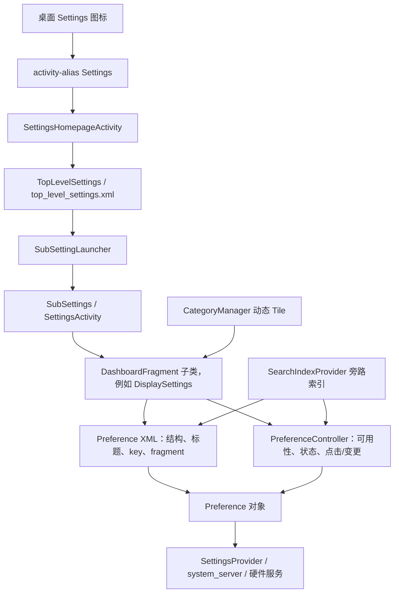
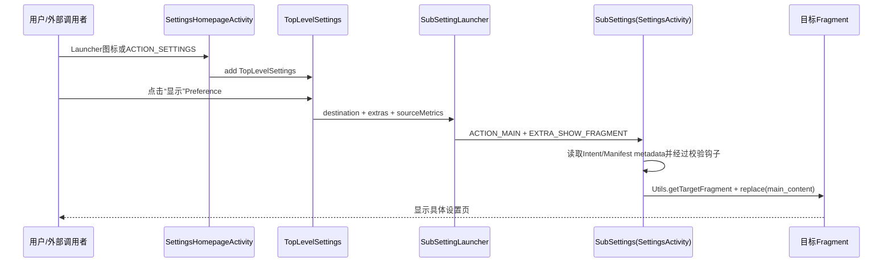
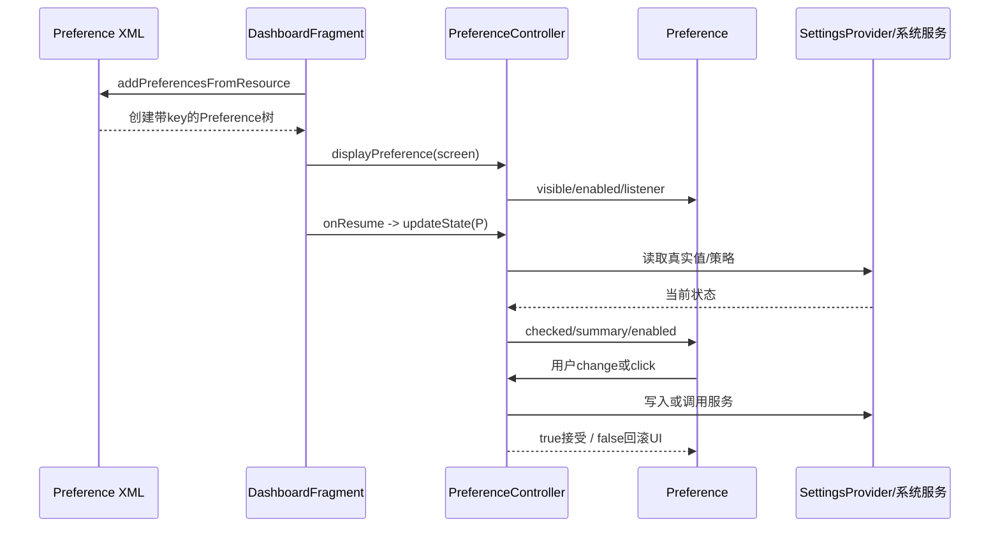

# 第528章 Android Settings工程主链：HomepageActivity、SettingsActivity、DashboardFragment、PreferenceController、XML、动态Tile和搜索索引

> 源码基线：Android 11 / API 30 / `android-11.0.0_r48`。本章直接阅读`packages/apps/Settings`与`frameworks/base/packages/SettingsLib`，只读源码、不编译。核心文件：`AndroidManifest.xml`、`SettingsHomepageActivity.java`、`TopLevelSettings.java`、`SettingsBaseActivity.java`、`SettingsActivity.java`、`Settings.java`、`DashboardFragment.java`、`DashboardFeatureProviderImpl.java`、`PreferenceControllerListHelper.java`、`BasePreferenceController.java`、`AbstractPreferenceController.java`、`SubSettingLauncher.java`、`BaseSearchIndexProvider.java`、`SettingsSearchIndexablesProvider.java`、`DisplaySettings.java`、`display_settings.xml`与`TimeoutPreferenceController.java`。

## 1. 本章解决什么问题

点击桌面“设置”图标后，究竟是哪个Activity出现？首页的一排入口是Activity、Fragment还是Preference？进入“显示”后，XML和Java Controller各负责什么？为什么同一个设置项既能出现在页面，也能被搜索、Slice或其他入口复用？本章要把这些看似分散的类串成一条可以逐步验证的工程主链。

## 2. 一句话定位

Settings不是“一个Activity里写满开关”，而是由Activity提供窗口与导航容器、DashboardFragment组织Preference页面、XML声明静态结构、PreferenceController决定可用性和实时状态、Dashboard Tile注入外部/动态入口、SearchIndexProvider在页面之外重建可搜索数据的一套分层系统。

## 3. 先把六种对象分账

Activity负责窗口、标题栏、Intent和Fragment事务；Fragment代表一页设置；Preference是页内一行可视控件；Controller连接Preference与系统真实状态；Tile是由Manifest/CategoryManager发现的动态入口描述；SearchIndexProvider则把XML和Controller转换成索引数据。它们会互相引用，但不是同一种对象。

## 4. 进程、线程与权限先定下来

本章绝大多数代码运行在`com.android.settings`应用进程。Activity、Fragment、Preference创建和Controller的普通`updateState()`在主线程；动态Tile的Provider读取会投后台线程再回主线程；真正读写`Settings.System`会经ContentResolver访问系统Provider；某些硬件、用户、策略状态还会跨Binder查询system_server服务。

## 5. 推荐源码阅读顺序

先从Manifest找桌面入口和`FRAGMENT_CLASS`映射，再读两个Activity宿主；随后读`DashboardFragment`怎样合并XML与代码Controller；再以“显示→屏幕超时”为具体例子追一次读写；最后看动态Tile、FeatureFactory与搜索索引。这样每读一个抽象层，都能找到上游入口和下游落点。

## 6. 从桌面图标到真实设置值的总图



## 7. 桌面入口其实是activity-alias

Manifest中的`activity-alias android:name="Settings"`声明`MAIN`和`LAUNCHER`，但`targetActivity`指向`.homepage.SettingsHomepageActivity`。因此桌面看到的组件身份可叫Settings，真正实例化的Java类却是SettingsHomepageActivity；不要只按Launcher组件名去找同名Activity实现。

## 8. `ACTION_SETTINGS`也落到首页Activity

SettingsHomepageActivity自己的intent-filter处理`android.settings.SETTINGS`，使用`singleTask`、独立`taskAffinity="com.android.settings.root"`和首页主题。桌面别名与外部标准Action最终都可进入同一首页宿主，只是Intent的component/action来源不同。

## 9. 首页Activity与普通SettingsActivity不是继承关系

SettingsHomepageActivity直接继承`FragmentActivity`；用于子页面的SettingsActivity则继承SettingsBaseActivity。前者为新版首页定制搜索栏、头像和上下文卡片；后者为大量传统/子设置页提供通用Toolbar、标题、Fragment校验和切换。二者不是“同一个Activity的两种模式”。

## 10. 首页布局是多个容器的组合

`settings_homepage_container.xml`包含CoordinatorLayout、搜索AppBar、可滚动首页容器、`contextual_cards_content`和`main_content`。Activity给homepage container增加“搜索栏高度+两倍margin”的顶部padding，并让外层容器先获得焦点，防止内部RecyclerView初次聚焦时把页面自动滚走。

## 11. 搜索框由FeatureProvider初始化

首页不自己实现搜索数据库，而是调用`FeatureFactory.getFactory(this).getSearchFeatureProvider().initSearchToolbar(...)`绑定Toolbar。这里的Provider负责“入口UI如何启动搜索”，后文的SearchIndexablesProvider负责“有哪些数据能被搜到”，两者处于同一功能域但职责不同。

## 12. 头像和遮罩防护被注册成Lifecycle observer

`AvatarViewMixin`随着Activity生命周期更新账号头像；`HideNonSystemOverlayMixin`在敏感页面可见期间限制非系统Overlay。它们不是Activity手写一组`onResume/onPause`转发，而是作为observer挂到Lifecycle上，从而把横切职责从宿主代码中抽离。

## 13. 上下文卡片只在非低内存设备创建

ActivityManager报告low-RAM时不添加ContextualCardsFragment，但TopLevelSettings始终加入`main_content`。所以“低内存设备首页为空”不成立；被裁掉的是额外上下文推荐区域，不是设置分类主列表。

## 14. TopLevelSettings的静态页面骨架来自XML

`TopLevelSettings.getPreferenceScreenResId()`返回`R.xml.top_level_settings`。XML行主要提供key、标题、摘要、图标、顺序、目标Fragment，个别行再声明Controller：

```xml
<Preference
    android:key="top_level_display"
    android:title="@string/display_settings"
    android:summary="@string/summary_placeholder"
    android:icon="@drawable/ic_homepage_display"
    android:order="-80"
    android:fragment="com.android.settings.DisplaySettings"
    settings:controller="com.android.settings.display.TopLevelDisplayPreferenceController" />
```

这段XML创建的是“显示”入口行；它不直接读取亮度、夜间模式或屏幕超时值。

## 15. XML负责声明，不等于XML拥有业务逻辑

`android:fragment`告诉Preference点击后默认要去哪里，`settings:controller`告诉框架可反射创建哪个Controller，`android:summary`可能只是占位符。硬件是否支持、当前摘要是什么、是否应隐藏，仍由Controller在运行时判断。

## 16. `key`是Preference与Controller之间最重要的契约

DashboardFragment不会按标题或控件位置匹配Controller，而是调用`screen.findPreference(controller.getPreferenceKey())`。key写错会出现“XML上有一行、Controller也创建了，但状态始终不更新”；重复key又会让过滤和索引行为变得含糊，因此key比类名更接近设置项的业务主键。

## 17. TopLevelSettings本身也是DashboardFragment

它复用DashboardFragment的XML膨胀、Controller合并、动态Tile和点击分发能力，只额外关闭ActionBar里的搜索图标、设置首页metrics类别、处理Support controller，并把Preference的Fragment点击转成SubSettingLauncher。首页并非完全独立的UI框架。

## 18. 首页为什么实现OnPreferenceStartFragmentCallback

PreferenceFragmentCompat发现某行声明`android:fragment`后，会优先询问宿主回调如何打开。TopLevelSettings接管这个回调，从当前Preference提取fragment、extras和来源metrics类别，然后创建新的SubSettings Activity，而不是把目标Fragment替换进首页Activity的`main_content`。

## 19. `SubSettingLauncher`是受约束的Intent Builder

它收集目标Fragment类名、参数、标题、来源metrics、flags、user和可选result listener，最终固定把Intent指向`SubSettings.class`并写入`SettingsActivity.EXTRA_SHOW_FRAGMENT`。一次launcher对象只能`launch()`一次，防止同一请求被意外复用和重复启动。

## 20. 启动前有两个必填校验

`toIntent()`要求destination非空，source metrics category不能保持负的哨兵值。标题可以是资源ID、资源所属包或直接文本；直接文本适合用户生成内容，但locale变化后无法自动重新解析，因此普通固定标题应优先传资源。

## 21. 首页、外部Action和页内点击的汇合点



## 22. SettingsBaseActivity先提供统一外壳

SettingsBaseActivity继承FragmentActivity，安装`settings_base_layout`与Toolbar，并把子类传入的内容View放到`R.id.content_frame`。这是一层“宿主模板”：子类以为自己在`setContentView()`，实际内容被嵌入统一壳体，所以返回键、标题栏和内容区布局可以保持一致。

## 23. `setContentView()`重写改变了布局语义

首次`super.setContentView(settings_base_layout)`建立外壳；后续子内容通过LayoutInflater生成并add到content frame。读布局问题时必须先看Activity是否重写`setContentView`，否则会误以为子布局直接占满DecorView。

## 24. 普通设置页也安装Overlay防护

SettingsBaseActivity在创建时把HideNonSystemOverlayMixin加入Lifecycle。它与首页的同名observer分别绑定各自Activity生命周期；从首页进入SubSettings后不是“沿用首页对象”，而是新宿主重新建立防护。

## 25. Lock Task模式有额外退出门

如果设备处于屏幕固定/Lock Task且Settings不是顶部运行任务，SettingsBaseActivity会结束自身，避免通过某些外部入口逃出被固定的应用。源码用`getRunningTasks(1).get(0)`判断顶部任务，r48隐含列表非空前提，阅读时要把它视为实现边界而不是永远安全的集合访问模板。

## 26. 包变化会触发分类刷新

onResume注册PACKAGE_ADDED/REMOVED/CHANGED/REPLACED receiver，onPause注销。收到变化后启动CategoriesUpdateTask重载CategoryManager数据，因为可注入的Dashboard Tile来自已安装包/组件元数据，应用安装、卸载或组件enable状态改变都可能改变页面入口。

## 27. 分类刷新不是每个Fragment自行扫描Manifest

SettingsBaseActivity通过CategoryManager统一reload，再计算旧/新Tile差异，最后通知CategoryListener。DashboardFragment只订阅自己category key相关变化并刷新页面。这将“发现全局Tile”和“重画当前页”分开，避免每个页面重复做整包扫描。

## 28. `setTileEnabled()`还有临时黑名单

Activity可改变Manifest组件enabled状态，并用静态`sTileBlacklist`立即压住被禁用的Tile，避免PackageManager/CategoryManager视图更新错峰时闪现。r48不会在一次reload后自动清除此集合：禁用时加入，对同一组件执行enable时才移除。组件状态、分类缓存和页面Preference并非同一时刻原子更新，这份集合是进程内的补充过滤账。

## 29. SettingsActivity的核心角色是Fragment路由器

它读取`EXTRA_SHOW_FRAGMENT`、arguments、标题、是否subsetting、UI options等，然后在通用内容容器中展示目标Fragment。大量设置入口看上去是不同Activity，实际常常由同一个SettingsActivity逻辑承载不同Fragment。

## 30. `Settings.java`里的大量嵌套Activity为何几乎是空类

例如`Settings.DisplaySettingsActivity extends SettingsActivity {}`没有业务方法。它们的价值是提供稳定ComponentName、Manifest intent-filter、label/icon和metadata；真正页面类由`com.android.settings.FRAGMENT_CLASS`映射到`DisplaySettings`。

## 31. Manifest metadata是“空Activity→Fragment”的路由表

`Settings$DisplaySettingsActivity`可处理`android.settings.DISPLAY_SETTINGS`，metadata写`com.android.settings.DisplaySettings`。外部只需启动标准Action/Activity组件，SettingsActivity再读取metadata选择Fragment；这使公开入口身份与内部页面实现解耦。

## 32. SettingsActivity还会重写别名式Intent

当启动component不是实际SettingsActivity类时，`getIntent()`构造一个新的Intent，把Manifest解析出的Fragment类写进`EXTRA_SHOW_FRAGMENT`，同时把原Intent放入fragment arguments。目标Fragment因此仍可读取原action、data和extras，而宿主得到统一路由格式。

## 33. Fragment切换前必须经过宿主的校验钩子

SettingsActivity的核心切换逻辑先调用`isValidFragment()`，基类实现会检查`SettingsGateway.ENTRY_FRAGMENTS`，再通过Utils创建目标并replace内容区：

```java
if (validate && !isValidFragment(fragmentName)) {
    throw new IllegalArgumentException("Invalid fragment for this activity: "
            + fragmentName);
}
Fragment f = Utils.getTargetFragment(this, fragmentName, args);
FragmentTransaction transaction = getSupportFragmentManager().beginTransaction();
transaction.replace(R.id.main_content, f);
transaction.commitAllowingStateLoss();
getSupportFragmentManager().executePendingTransactions();
```

这里的校验是公开Settings入口的Fragment注入防线。需要注意，`SubSettings`覆写`isValidFragment()`并直接返回true；它在Manifest里没有intent-filter，供Settings内部的SubSettingLauncher下钻使用。不能把“基类有白名单”错误推广成每个子类都执行同一张表，也不能把SubSettings暴露成可接收任意外部类名的公共入口。

## 34. `commitAllowingStateLoss()`不是业务事务提交

它只允许FragmentManager在状态已保存后仍提交UI事务，避免特定启动/恢复时序抛异常；它不保证页面数据写入，也不代表Controller改变系统设置成功。紧接着`executePendingTransactions()`让初次页面事务尽快落地，便于后续标题和UI初始化。

## 35. 没有显式目标时会回退到TopLevelSettings

SettingsActivity的`launchSettingFragment()`在目标为空时使用TopLevelSettings。这是通用宿主的兜底路径，但正常桌面首页并不靠SettingsActivity展示TopLevelSettings，而是SettingsHomepageActivity直接添加它；两个入口最终UI近似，宿主结构却不同。

## 36. 标题有多种来源和优先级

Intent可携带直接标题或资源ID/包名，Manifest Activity本身还有label，Fragment也可设置breadcrumb。排查“标题不对”时要顺着启动请求、metadata和Fragment事务看最终选取，不能只改Preference XML的title。

## 37. `EXTRA_SHOW_FRAGMENT_AS_SUBSETTING`影响外观语义

宿主根据该标志决定是否按子设置页展示，例如返回导航和标题行为。SubSettings天然用于下钻页面，但仍由同一SettingsActivity基类代码读取extra完成布局，不是每个Fragment自行画一套导航栏。

## 38. 到这里可以区分三类Activity

SettingsHomepageActivity是首页专用宿主；SubSettings是由SubSettingLauncher固定启动的下钻宿主；`Settings$XxxActivity`空壳类是公开Action/组件入口，通过Manifest metadata选择Fragment。三者都能通往设置页面，但启动契约不同。

## 39. DashboardFragment是一页设置的编排器

它继承SettingsPreferenceFragment，并实现分类变化监听、搜索Indexable标记、展开按钮统计和UI blocker回调。它不应该包办每个设置值，而是负责收集Controller、创建Preference树、把两者匹配、注入动态Tile并在生命周期节点刷新。

## 40. `onAttach()`先组装Controller集合

顺序是：取得OEM抑制的动态Tile key；取得DashboardFeatureProvider；调用子类`createPreferenceControllers(context)`获取代码Controller；从XML反射Controller；过滤重复key；合并集合；绑定部分生命周期；设置metrics类别；再加入动态Tile占位Controller。

## 41. 代码Controller适合需要显式依赖的对象

DisplaySettings在`buildPreferenceControllers()`里显式new CameraGesture、NightDisplay、Timeout、Brightness等Controller。这样可传入Lifecycle、特殊key或测试替身，也能复用同一builder给页面和搜索。代价是开发者必须维护构造清单。

## 42. XML Controller适合简单声明式绑定

`settings:controller="完整类名"`由PreferenceControllerListHelper解析。它先尝试`(Context)`构造器，失败再读取XML key和`forWork`，尝试`(Context, String)`构造器。两种签名都不符合时只记录警告并跳过，该Preference仍可能被XML创建但没有预期Controller。

## 43. 反射失败不会在所有情况立刻崩页面

BasePreferenceController.createInstance本身把反射异常包装成IllegalStateException；Helper捕获第一次异常再尝试另一签名，第二次失败则log并continue。因此错误Controller类名常表现为“控件还在但状态/可用性不对”，需要主动看日志而不是只等崩溃。

## 44. 去重依据是Preference key，不是Controller类

`filterControllers(inputXml, filterCode)`先收集代码Controller的非null key，再剔除XML中相同key的Controller。它不比较具体class；同一类控制不同key可以同时存在，不同类控制同一key则代码创建者优先。

## 45. 合并后的遍历顺序不应被当成页面顺序

页面显示顺序由Preference XML的order/声明顺序及动态Tile order决定，Controller列表只是业务处理集合。`mPreferenceControllers`又按具体Class映射到List；不要依据Controller迭代先后推断屏幕行顺序。

## 46. 生命周期绑定有一个容易误读的非对称

DashboardFragment只自动把“XML创建且去重后保留”的LifecycleObserver加入settings Lifecycle。代码创建的Controller若需生命周期，通常在构造时显式接收`getSettingsLifecycle()`，或由页面自己注册；不能笼统说所有Controller都会被DashboardFragment自动观察。

## 47. Metrics类别被注入BasePreferenceController

页面的`getMetricsCategory()`会写进每个BasePreferenceController，Toggle等基类随后可记录开关点击来源。与此同时，onCreatePreferences还把同一CATEGORY写入每个匹配Preference的extras，供通用下钻/工作资料启动链继续传递来源。

## 48. `use(SomeController.class)`为何可能警告

内部Map允许同一具体Class对应多个Controller，例如同类实例控制不同key。`use()`发现多个只返回第一个并log警告。因此它适合页面明确知道该类只有一个实例的场景，不是按class唯一性的强类型依赖注入容器。

## 49. `onCreatePreferences()`先检查UI blocker再重建整页

可用且实现UiBlocker的Controller被登记key并接收listener；随后`refreshAllPreferences()`删除旧Preference、重新膨胀XML、注入动态Tile、报告fully drawn，最后根据blocker完成情况统一调整可见性。

## 50. `refreshAllPreferences()`为何先removeAll

分类变化可能让动态Tile新增、删除或改绑，配置恢复也可能要求重建PreferenceScreen。源码不长期缓存旧Preference树，而是先清空再从资源建立新树。这意味着Controller应按key查找当前Preference，不应永久保存旧Preference引用。

## 51. 静态资源行先于动态Tile加入

`displayResourceTiles()`调用`addPreferencesFromResource(resId)`，给PreferenceScreen设置展开按钮监听，再让所有Controller执行`displayPreference(screen)`；之后`refreshDashboardTiles()`才根据category注入Tile。占位Controller的order为动态项提供插入基准。

## 52. AbstractPreferenceController的首次显示规则

`displayPreference()`按key查行：available则`setVisible(true)`，不可用则`setVisible(false)`；如果Controller实现OnPreferenceChangeListener，还把listener挂到Preference。这里主要决定“显示与监听”，实时checked/summary通常留到`updateState()`。

## 53. 不可用通常是隐藏，不是从树里删除

SettingsLib使用Preference的visible属性，Preference对象仍可能存在于树中。这样后续条件变化可以重新显示；但搜索是否隐藏由另一条non-indexable key链决定，不能因为页面setVisible(false)就假设搜索数据库自动同步。

## 54. `DISABLED_DEPENDENT_SETTING`是可见但默认禁用

BasePreferenceController将它视为`isAvailable()==true`，因此行保留；`displayPreference()`额外`setEnabled(false)`。子类应在依赖满足时主动启用。它不同于CONDITIONALLY_UNAVAILABLE，后者在当前条件下直接不可用/隐藏。

## 55. 六种AvailabilityStatus要按语义选择

AVAILABLE可显示可搜索；AVAILABLE_UNSEARCHABLE可显示但必须从搜索排除；CONDITIONALLY_UNAVAILABLE表示当前条件不满足且可在未来变化；UNSUPPORTED_ON_DEVICE表示硬件/平台不支持；DISABLED_FOR_USER表示当前用户不能操作；DISABLED_DEPENDENT_SETTING表示被另一个设置暂时阻断但入口仍保留。

## 56. Work Profile门在基类统一补一层

XML若设置`forWork=true`，Helper用带key构造器创建后调用`setForWork()`寻找managed profile。没有工作资料时`isAvailable()`直接false；存在时点击还会把目标userId写入extras，并用SubSettingLauncher跨user启动。

## 57. `displayPreference()`与`updateState()`不是同一次动作

前者在页面构建阶段配置可见性和change listener；后者在onResume或显式刷新阶段读取真实值、更新checked/summary/enabled。把二者合并理解会导致“为什么首次display没有设置开关值”或“为什么回到页面还能刷新”的困惑。

## 58. 普通状态刷新默认发生在onResume

DashboardFragment遍历所有Controller：先跳过unavailable，再校验非空key，按key找当前Preference，最后调用`controller.updateState(preference)`。从子页面返回、系统设置在外部改变后重新resume，页面就有机会重新读真实状态。

## 59. 点击会先遍历Controller，再交回Preference框架

`onPreferenceTreeClick()`让每个Controller尝试`handlePreferenceTreeClick()`，第一个返回true者消费并记录点击；都不处理才调用super，让`android:fragment`、Intent等默认机制继续。Controller只应消费自己key对应的事件，否则会截断其他行导航。

## 60. 一行Preference从声明到读写的时序



## 61. 用DisplaySettings做一次完整落地

`DisplaySettings extends DashboardFragment`，返回`R.xml.display_settings`和`SettingsEnums.DISPLAY`。它的builder显式创建11个代码Controller；XML又声明Dark UI、自动亮度、壁纸、自动旋转等Controller。DashboardFragment以key过滤重复后合并两路。

## 62. `screen_timeout`展示了代码Controller覆盖XML空缺

XML中的TimeoutListPreference有key、标题、entries、entryValues，却没有`settings:controller`；DisplaySettings代码明确new `TimeoutPreferenceController(context, "screen_timeout")`。如果只搜索XML里的controller属性，会漏掉这条业务逻辑。

## 63. 屏幕超时的真实读写链

Controller在刷新时读取`Settings.System.SCREEN_OFF_TIMEOUT`，选择当前ListPreference值并应用设备策略；用户选择后写回SettingsProvider：

```java
public void updateState(Preference preference) {
    final TimeoutListPreference timeoutListPreference =
            (TimeoutListPreference) preference;
    final long currentTimeout = Settings.System.getLong(mContext.getContentResolver(),
            SCREEN_OFF_TIMEOUT, FALLBACK_SCREEN_TIMEOUT_VALUE);
    timeoutListPreference.setValue(String.valueOf(currentTimeout));
    // 中间还会应用DevicePolicyManager与UserManager限制。
    updateTimeoutPreferenceDescription(timeoutListPreference,
            Long.parseLong(timeoutListPreference.getValue()));
}

public boolean onPreferenceChange(Preference preference, Object newValue) {
    try {
        int value = Integer.parseInt((String) newValue);
        Settings.System.putInt(mContext.getContentResolver(), SCREEN_OFF_TIMEOUT, value);
        updateTimeoutPreferenceDescription((TimeoutListPreference) preference, value);
    } catch (NumberFormatException e) {
        Log.e(TAG, "could not persist screen timeout setting", e);
    }
    return true;
}
```

UI保存的是字符串entryValue，底层系统项是整数毫秒，Controller负责类型转换和摘要更新。

## 64. 刷新屏幕超时还要应用Device Policy

Controller读取DevicePolicyManager的maximumTimeToLock，并让TimeoutListPreference移除超过策略上限的候选；若当前用户受`DISALLOW_CONFIG_SCREEN_TIMEOUT`限制，则把所有候选禁用并显示管理员策略说明。页面状态不是SettingsProvider一个整数就能决定。

## 65. `putInt()`返回值在r48这里被忽略

TimeoutPreferenceController写入后无论ContentResolver实际返回true/false，都返回true让Preference接受新值；只捕获NumberFormatException。这是源码事实和错误反馈边界，不能把“Controller返回true”等同于“底层持久化一定成功”。

## 66. 摘要来自entries与entryValues的精确匹配

`getTimeoutDescription()`逐项把values转long，只有等于当前毫秒值才返回对应人类可读entry。若系统值不是XML候选之一，摘要变为空字符串；它不会自动找最近档位。

## 67. 自动亮度展示XML反射Controller

`auto_brightness_entry`在XML声明AutoBrightnessPreferenceController，但这个Preference本身是进入AutoBrightnessSettings的普通入口而非开关。Controller通过`(Context,String)`反射创建，读取`SCREEN_BRIGHTNESS_MODE`生成“开启/关闭”摘要，并根据config资源决定是否支持。

## 68. TogglePreferenceController只适配可切换Preference类型

其`updateState()`遇到TwoStatePreference/MasterSwitch/TwoStateButton才写checked；遇到普通Preference就只刷新summary。AutoBrightness入口正利用后者，所以它继承Toggle并不意味着当前这一行一定画成Switch。

## 69. `AVAILABLE_UNSEARCHABLE`不等于页面不可见

AutoBrightnessPreferenceController在设备支持时返回AVAILABLE_UNSEARCHABLE：DashboardFragment仍显示入口，BaseSearchIndexProvider却把其key加入non-indexable。这常用于避免父页面入口与真正子页面搜索结果重复。

## 70. 没有Controller的Fragment行也能工作

例如XML中某些Preference仅声明key/title/fragment，Preference框架仍能通过OnPreferenceStartFragmentCallback打开目标页。Controller不是每行必需；只有需要动态可用性、摘要、状态、特殊点击或搜索过滤时才需要。

## 71. 动态Tile是第二条页面内容来源

静态XML属于Settings APK编译时资源；DashboardCategory里的Tile则由CategoryManager扫描Manifest/组件元数据得到，可能来自Settings自身或其他系统包。DashboardFragment把Tile即时转换成Preference并插入同一PreferenceScreen。

## 72. Fragment怎样知道自己属于哪个Category

`getCategoryKey()`查`DashboardFragmentRegistry.PARENT_TO_CATEGORY_KEY_MAP`，以Fragment完整类名映射Category key。若映射缺失，FeatureProvider取不到正确DashboardCategory，静态XML仍可显示，但预期注入项不会出现。

## 73. CategoryManager是动态入口目录，不是Preference缓存

它维护分类与Tile描述，DashboardFeatureProviderImpl负责查询；DashboardFragment仍自行创建/删除Preference View-model对象。包变化时重载的是目录数据，随后当前页面按key做差异更新。

## 74. Tile的内容可以静态也可以Provider动态返回

title、summary、icon可直接来自Manifest metadata/resource，也可通过URI调用ContentProvider动态获取；带switch的Tile还定义读取checked和写入checked的方法。故注入项不只是“外部Activity快捷方式”，也能是实时状态入口。

## 75. Tile类型决定创建哪种Preference

ProviderTile创建SwitchPreference；普通`hasSwitch()` Tile创建MasterSwitchPreference；其余创建基础Preference。选择发生在`createPreference(tile)`，之后统一交给DashboardFeatureProviderImpl绑定数据与点击行为。

## 76. bind过程一次填充六类信息

Provider设置key、title、summary、switch、icon、fragment或click listener以及order。Tile自己有key就用业务key，否则退化成`dashboard_tile_pref_ + component class`；外部包order通常加placeholder基准，本Settings包或默认order则可跳过offset。

## 77. 动态title/summary先放placeholder以稳定高度

若数据来自URI，源码先设置`summary_placeholder`，再后台调用TileUtils取文本，值变化时回主线程设置。这样异步结果回来前行高较稳定，减少列表突然跳动，但占位期间看到的不是最终真实数据。

## 78. DynamicDataObserver只在页面Start期间监听

DashboardFragment把返回的observer按Tile key保存；onStart注册ContentObserver，onStop统一注销。Provider数据变化会回调相应refresh方法。生命周期控制的是监听成本，不代表onStop后Tile数据源停止变化。

## 79. 动态Switch写入采用“暂时禁用→后台调用→回主线程”

用户切换后先禁用switch，后台调用Provider；成功则重新启用，失败则把checked反转回原值并可Toast错误。与TimeoutPreferenceController直接同步返回true相比，这是另一种跨组件异步提交模型。

## 80. Tile启动还要处理多用户选择

如果Tile只属于当前/主资料，直接startActivityForResult；只有一个指定user则asUser启动；有多个user且Intent没明确合法user时弹ProfileSelectDialog。来源metrics在启动前写入Intent，保证跨包跳转仍能记录入口。

## 81. 外部图标可被强制包进AdaptiveIcon

TopLevelSettings由资源决定`shouldForceRoundedIcon()`；若开启且Tile来自其他包，DashboardFeatureProviderImpl用AdaptiveIcon包装Drawable并取Tile背景色。Settings自身图标跳过这层强制包装，避免重复套壳。

## 82. 分类变化只刷新匹配当前category的页面

`onCategoriesChanged(categories)`若参数null表示强制刷新；否则只有集合包含本Fragment category key才重绑Tile。静态XML不会因Tile变化消失，刷新重点是动态注入列表。

## 83. 动态Tile删除时还要注销observer

刷新先复制当前`mDashboardTilePrefKeys`到remove map；遍历新Tile时按key移除保留项，最后剩余key对应旧Preference从screen删除，observer也注销。这里的差分单位是key，不是component对象引用。

## 84. FeatureFactory是Settings的可替换功能总入口

`FeatureFactory.getFactory(context)`从`R.string.config_featureFactory`读取实现类名，ClassLoader反射创建并缓存单例。默认FeatureFactoryImpl再懒加载Dashboard、Search、Metrics、Battery等Provider。OEM可用资源覆盖换工厂实现，而不必修改每个调用点。

## 85. 资源Overlay在这里能改变Java实现

通常Overlay只让人想到颜色和尺寸，但`config_featureFactory`是类名字符串；设备产品覆盖资源后可选择另一FeatureFactory。该实现必须保持抽象接口契约，否则错误会在运行时反射/强转阶段暴露。

## 86. Provider接口隔离了调用者与发现细节

DashboardFragment只依赖`getTilesForCategory()`、`getDashboardKeyForTile()`和`bindPreferenceToTileAndGetObservers()`；它不知道CategoryManager怎样扫描，也不知道动态title URI怎样读取。接口让页面编排保持稳定，具体OEM策略集中在Provider实现。

## 87. 搜索是一条旁路数据管线

搜索不会启动每个Fragment、把Preference真实渲染一遍再抓文字；SearchIndexablesProvider遍历已登记的Indexable页面，调用其静态`SEARCH_INDEX_DATA_PROVIDER`，收集XML资源、raw data、dynamic raw data和non-indexable keys，交给系统搜索索引契约。

## 88. `@SearchIndexable`标记页面可被注册

DisplaySettings带`@SearchIndexable`并公开静态Provider；编译期`IndexableProcessor`据注解生成SearchIndexableResourcesMobile实现，把目标类和其Provider包装成SearchIndexableData集合。源码树里的`stub-src/SearchIndexableResourcesMobile.java`明确标注“不参与编译”，只是IDE占位；不能把空stub误判成“移动端没有索引页面”。

## 89. Provider字段为何必须是静态公开约定

搜索基础设施不应为每次建索引实例化完整Fragment并走生命周期；注解处理器生成的代码直接引用目标类的`SEARCH_INDEX_DATA_PROVIDER`来生成数据，因此字段必须遵守公开静态约定。Provider需能只靠Context构造相同Controller集合，所以DisplaySettings把builder写成static并允许传null Lifecycle。

## 90. BaseSearchIndexProvider先提供XML索引

构造时传`R.xml.display_settings`，`getXmlResourcesToIndex()`就返回SearchIndexableResource。索引器解析XML中的title、summary、keywords、fragment和key，形成静态候选；这仍不是最终结果，因为Controller还会排除当前设备不可用项。

## 91. 搜索会再次合并代码与XML Controller

`getPreferenceControllers(context)`先调用页面覆写的`createPreferenceControllers()`，再从每个XML反射Controller，仍按key过滤重复并合并。这样页面显示与搜索过滤可复用同一Controller规则；若两边builder不一致，就可能发生“页面隐藏但搜索还能搜到”。

## 92. non-indexable key是搜索可见性的负面清单

BaseSearchIndexProvider先收集XML中`searchable=false`的key，再让每个Controller`updateNonIndexableKeys()`。BasePreferenceController在`!isAvailable()`或AVAILABLE_UNSEARCHABLE时添加自己的key，并检查空key和重复项。

## 93. TopLevelSettings为何整页标记不可搜索

它的Provider覆写`isPageSearchEnabled()`返回false，于是BaseSearchIndexProvider把top-level XML所有key加入non-indexable。原因不是首页没内容，而是“显示、网络、电池”等入口已由各自子页面索引；首页再索引会产生重复和层级过浅的结果。

## 94. SettingsSearchIndexablesProvider输出多类Cursor

`queryXmlResources()`输出XML资源；`queryRawData()`输出代码生成的静态raw；`queryDynamicRawData()`还合并动态Controller数据与外部注入Tile；`queryNonIndexableKeys()`输出排除key；另有site map与slice URI配对。搜索数据不是单张“标题表”。

## 95. 动态raw适合索引时刻会变化的条目

BaseSearchIndexProvider遍历Controller的`updateDynamicRawDataToIndex()`，页面可根据已安装服务、用户状态等生成额外候选。它与`updateState(Preference)`不同：前者创建搜索描述对象，后者修改屏幕上的Preference。

## 96. Site Map保存父子页面关系

SettingsSearchIndexablesProvider遍历DashboardCategory：用category key找到parent class，再从Tile metadata的Fragment类或component取得child class和title。搜索结果因此可以显示面包屑/层级，不只知道“点结果启动哪个类”。

## 97. 搜索索引不等于当前页面快照

索引构建可能发生在Fragment从未创建时；Controller只拿application/context读取状态。任何依赖Activity View、已attach Fragment或非null Lifecycle的搜索Controller都会有风险，所以页面与搜索共享builder时必须允许搜索侧的轻量构造方式。

## 98. 点击搜索结果仍会回到统一Fragment路由

索引数据保存class/intent等目标信息，Search UI点击后通过受控的Settings内部跳转展示目标Fragment。公开`Settings$XxxActivity`走SettingsActivity基类白名单；内部SubSettings虽覆写为信任目标类名，但调用入口本身受组件可达性与搜索调用者校验约束。搜索绕过的是“从首页逐级点进去”的UI路径，不应绕过目标页自身用户、管理员和权限检查。

## 99. Metrics在多条路径中持续传递

首页Toolbar初始化带SETTINGS_HOMEPAGE类别；Preference extras保存页面类别；SubSettingLauncher要求source metrics；Tile Intent也写EXTRA_SOURCE_METRICS_CATEGORY；Controller可读取父metrics。统计来源是显式数据流，不是根据当前Activity类名事后猜测。

## 100. 主线程与后台线程的真实边界

普通Controller的`isAvailable/updateState/onPreferenceChange`默认在主线程，开发者不应在其中直接做重I/O；动态Tile的URI title/summary/switch和icon读取显式投后台，再post主线程更新Preference。ContentProvider调用虽然封装在TileUtils里，仍可能跨进程且耗时。

## 101. UiBlocker隐藏页面但不阻塞主线程

实现UiBlocker且available的Controller异步准备数据，完成后调用listener；UiBlockerController等待所有key倒计时，最多等待500ms，然后在主线程重算可见性。等待期间，只要页面存在blocker，`updatePreferenceVisibility()`会把所有能匹配到Controller的Preference统一隐藏，而不只是blocker自己的行。它避免页面先显示半成品再逐行跳变，但不会同步阻塞UI线程。

## 102. r48的“并行Controller”并未把updateState放后台

可选路径把ControllerTask投后台，后台执行`isAvailable()`、key和`findPreference()`，然后`postOnMainThread()`调用`updateState()`；FutureTask在post完成后即可结束，`task.get()`并不等待主线程updateState执行完。它更像并行做前置筛选，而不是允许Controller在后台随意操作Preference。

## 103. 并行路径还有线程安全审视点

`PreferenceScreen.findPreference()`在ControllerTask后台线程执行，而Preference树通常属于主线程UI模型；源码未在这里建立快照或同步保护。即使功能开关默认/页面覆写限制了使用范围，也不应把这段当作通用后台访问View模型范式。

## 104. `reportFullyDrawn()`发生在状态完全稳定之前

refreshAllPreferences在XML和动态Tile加入后就调用Activity.reportFullyDrawn；动态URI内容可能仍在后台，UI blocker也可能尚未结束。该指标表示主体页面结构已建立，不保证所有异步摘要、图标与switch状态都已最终到达。

## 105. 配置变化恢复会提前刷新一次

DashboardFragment在`onCreate(icicle != null)`调用updatePreferenceStates，注释说明编辑对话框可能在onResume之前重建，需要先让Preference状态正确。之后onResume仍会正常再刷新，因此配置恢复路径可能比首次创建多一次状态读取。

## 106. Fragment白名单和Overlay防护解决不同威胁

SettingsActivity基类的SettingsGateway白名单防止公开入口指定任意Fragment类；SubSettings则因内部下钻契约覆写为放行。HideNonSystemOverlayMixin降低点击劫持/遮盖风险。类名校验保护“加载什么代码”，Overlay限制保护“用户看到和点击什么界面”，两者不能相互替代。

## 107. r48 Controller反射的失败反馈较弱

XML类名或构造器错误时Helper最终只log并跳过；页面不一定崩溃。若该行有静态fragment，它仍能点击；若依赖Controller隐藏不支持功能，则错误反而会让本应隐藏的Preference留下。代码审查应同时核对XML类名、构造器、key和availability。

## 108. 重复key过滤可能掩盖配置错误

代码Controller与XML Controller使用同key时，XML实例被静默优先级规则剔除，仅log“already has a controller”。这通常用于渐进迁移或显式代码覆盖，但若两者本来控制不同语义，最终只有代码Controller生效；不要把过滤当成两者逻辑自动合并。

## 109. 动态Tile重绑存在observer代际边界

已有key刷新时源码重新调用`bindPreferenceToTileAndGetObservers()`，却没有使用这次返回的新observer列表替换`mDashboardTilePrefKeys`中的旧列表。若同key对应的动态URI在重载后改变，旧observer可能继续监听旧URI；这是r48实现边界，不能概括成“每次rebind都完整更新监听关系”。

## 110. 动态Switch Provider返回值也有空值假设

`onCheckedChanged()`后台取得Bundle后，主线程直接`result.getBoolean(...)`，没有先判result为null。可靠Provider应遵守SwitchesProvider契约；但跨进程异常或不合规实现可能让这条链出错，因此注入能力同时要求数据提供方严格实现协议。

## 111. 不编译时的定位路线

看到一个设置项，先在XML按key搜索；再搜索同key的Controller构造和`getPreferenceKey()`；确认页面`getPreferenceScreenResId()`与代码builder；追Controller的`updateState`、change/click到SettingsProvider或系统服务；最后查`SEARCH_INDEX_DATA_PROVIDER`和non-indexable逻辑。动态项则从category key反查Manifest Tile。

## 112. macOS只读练习一：画出首页到显示页的路由

在源码根目录执行：

```bash
rg -n 'SettingsHomepageActivity|activity-alias android:name="Settings"|DisplaySettingsActivity|FRAGMENT_CLASS' packages/apps/Settings/AndroidManifest.xml
rg -n 'TopLevelSettings|SubSettingLauncher|EXTRA_SHOW_FRAGMENT' packages/apps/Settings/src/com/android/settings/homepage packages/apps/Settings/src/com/android/settings/core/SubSettingLauncher.java packages/apps/Settings/src/com/android/settings/SettingsActivity.java
```

用纸记录“alias→Homepage→TopLevel→SubSettings→DisplaySettings”，并分别注明每一步由Manifest、Intent extra还是Fragment回调连接。

## 113. macOS只读练习二：核对XML与代码Controller合并

```bash
rg -n 'settings:controller|screen_timeout|auto_brightness_entry' packages/apps/Settings/res/xml/display_settings.xml
rg -n 'buildPreferenceControllers|TimeoutPreferenceController|BrightnessLevelPreferenceController' packages/apps/Settings/src/com/android/settings/DisplaySettings.java
rg -n 'getPreferenceControllersFromXml|filterControllers|createInstance' packages/apps/Settings/src/com/android/settings/core/PreferenceControllerListHelper.java packages/apps/Settings/src/com/android/settings/core/BasePreferenceController.java
```

回答：screen_timeout为何只能在Java builder找到Controller，而auto_brightness_entry为何能从XML反射创建？过滤时比较的是key还是class？

## 114. macOS只读练习三：追踪屏幕超时一次读写

```bash
rg -n 'SCREEN_OFF_TIMEOUT|getLong|putInt|removeUnusableTimeouts|DISALLOW_CONFIG_SCREEN_TIMEOUT' packages/apps/Settings/src/com/android/settings/display/TimeoutPreferenceController.java
rg -n 'screen_timeout_entries|screen_timeout_values' packages/apps/Settings/res packages/apps/Settings/res/values -g '*.xml'
```

任选一个entryValue，换算成秒；再说明页面刷新、用户选择、DevicePolicy上限分别在哪个方法生效。全程只读，不运行Settings、不修改系统值。

## 115. macOS只读练习四：验证搜索为什么会隐藏某项

```bash
rg -n 'SEARCH_INDEX_DATA_PROVIDER|isPageSearchEnabled|createPreferenceControllers' packages/apps/Settings/src/com/android/settings/DisplaySettings.java packages/apps/Settings/src/com/android/settings/homepage/TopLevelSettings.java
rg -n 'getNonIndexableKeys|AVAILABLE_UNSEARCHABLE|updateNonIndexableKeys' packages/apps/Settings/src/com/android/settings/search/BaseSearchIndexProvider.java packages/apps/Settings/src/com/android/settings/core/BasePreferenceController.java packages/apps/Settings/src/com/android/settings/display/AutoBrightnessPreferenceController.java
```

解释TopLevelSettings整页排除与AutoBrightness单key排除的不同原因，并确认“页面可见”与“搜索可见”是两份判断。

## 116. 十个最常见误解集中纠正

Settings桌面入口不是`Settings.java`空类；首页宿主不是SettingsActivity；XML不是业务状态存储；Controller不是每行必需；不可用不总等于disabled；AVAILABLE_UNSEARCHABLE仍可显示；Tile不是普通Preference资源；搜索不会启动所有Fragment；代码Controller不会全部被Dashboard自动绑定Lifecycle；`updateState()`默认仍在主线程。

## 117. 新增一个普通设置项时应检查的清单

确定唯一key和合适Preference类型；选择XML声明还是代码创建Controller；实现准确availability、updateState和change/click；若需要生命周期显式接入；考虑用户/管理员限制；加入搜索Provider并正确排除不可用key；补metrics来源；若公开给外部再配置Activity/Action与Fragment白名单。

## 118. 排查“设置项不见了”的四层地图

先查XML是否被正确页面膨胀；再查Controller availability和work-profile门；接着查DashboardFragment的UI blocker/动态Tile抑制key；最后查Manifest组件是否被SettingsBaseActivity动态disable。若只是搜索不见，则单独查non-indexable keys，别从页面可见性反推。

## 119. 本章结论

Android 11 Settings的稳定主轴是“入口组件→宿主Activity→页面Fragment→Preference树→Controller→真实系统状态”。XML与动态Tile提供两类内容来源，FeatureFactory提供产品替换点，SearchIndexProvider从相同页面/controller规则旁路生成索引。掌握key、category和fragment class三种标识，就能在这个大型工程中快速定位。

## 120. 下一章预告

下一章将继续深挖Settings Search：SearchIndexableResources怎样登记页面，SettingsSearchIndexablesProvider怎样输出XML/raw/dynamic/non-indexable/site-map，搜索数据库如何预索引与增量更新，查询结果怎样排名、去重并跳转回目标Fragment，同时审视索引陈旧和跨用户边界。
