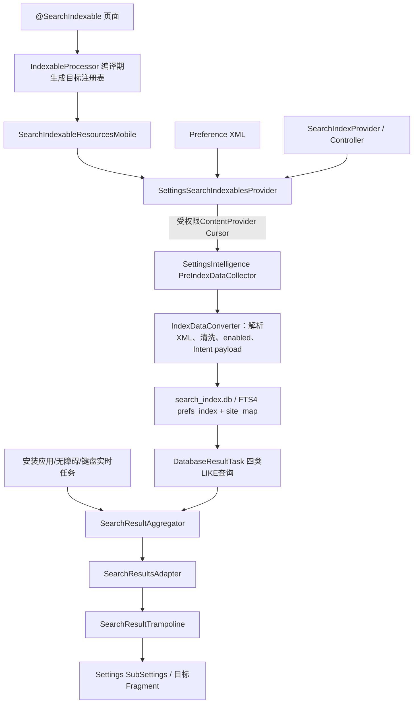
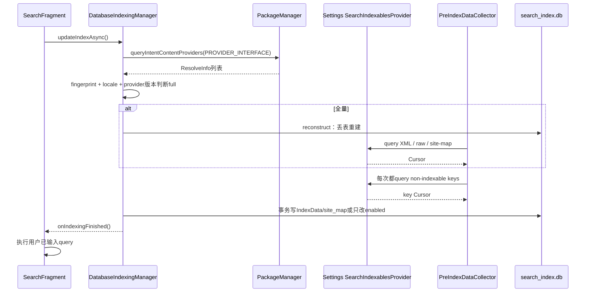
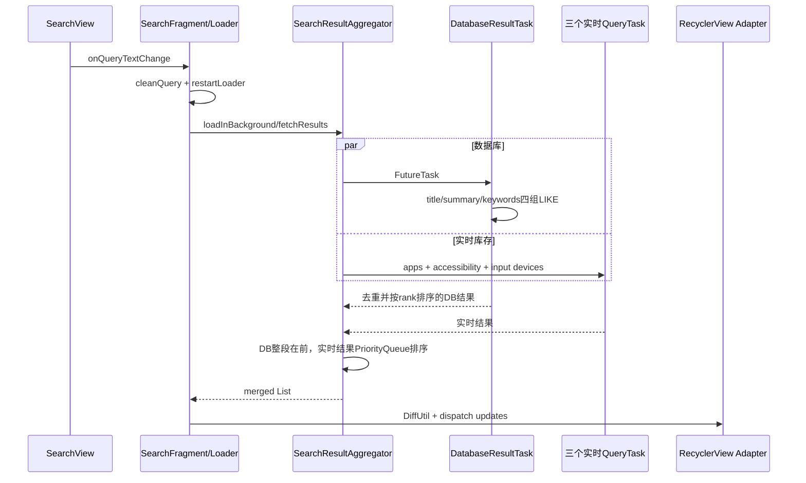

# 第529章 Android Settings Search完整链：注解生成、SearchIndexablesProvider、全量/增量索引、FTS查询、排名去重、面包屑与结果跳转

> 源码基线：Android 11 / API 30 / `android-11.0.0_r48`。本章直接阅读`frameworks/base/core/java/android/provider`、`frameworks/base/packages/SettingsLib/search`、`packages/apps/Settings`和`packages/apps/SettingsIntelligence`，只读源码、不编译。核心文件：`SearchIndexablesProvider.java`、`SearchIndexablesContract.java`、`SearchIndexable.java`、`IndexableProcessor.java`、`SettingsSearchIndexablesProvider.java`、`BaseSearchIndexProvider.java`、`SearchFeatureProviderImpl.java`、`SearchFragment.java`、`DatabaseIndexingManager.java`、`PreIndexDataCollector.java`、`IndexDataConverter.java`、`IndexDatabaseHelper.java`、`DatabaseResultTask.java`、`SearchResultAggregator.java`、`CursorToSearchResultConverter.java`、`SiteMapManager.java`与`SearchResultTrampoline.java`。

## 1. 本章解决什么问题

Settings的搜索候选从哪里来？为什么每个页面只声明一个静态Provider，就能被全局发现？索引是在系统启动时完成，还是打开搜索页才触发？“不可搜索”是删数据库行还是改enabled？标题、摘要、关键字各自怎样匹配和排名？点击结果为何要经过一个无界面的Trampoline？本章逐段回答这些问题。

## 2. 一句话定位

编译期注解处理器把Settings页面和其SearchIndexProvider生成到目标设备注册集合；运行时Settings进程通过受权限保护的SearchIndexablesProvider导出XML、raw、排除key和站点图，SettingsIntelligence进程在搜索页打开时跨进程采集并写入本用户FTS4数据库，查询时再把数据库结果与安装应用、无障碍服务、输入设备等实时结果汇总、排名并通过受校验的Intent跳回Settings子页面。

## 3. 两个APK、两个进程先分开

`com.android.settings`拥有真实设置页面和`SettingsSearchIndexablesProvider`；`com.android.settings.intelligence`拥有SearchActivity、索引SQLite、查询任务与结果列表。前者是数据提供方，后者是索引/搜索客户端。二者靠ContentProvider Cursor和Intent交互，不共享Java对象或数据库文件。

## 4. 再把五种数据形态分账

SearchIndexableData登记“哪个页面配哪个Provider”；SearchIndexableResource只引用一份Preference XML；SearchIndexableRaw直接提供一条标题/摘要/key；PreIndexData按authority暂存跨Provider采集结果；IndexData才是清洗、补Intent、计算enabled后准备写入数据库的一行。

## 5. 线程与进程边界

SettingsSearchIndexablesProvider在Settings进程的Binder线程响应query；SettingsIntelligence用AsyncTask后台执行采集和SQLite事务；搜索Loader在后台调用聚合器，聚合器把多个FutureTask投cached thread pool；RecyclerView、SearchView、Loader回调与点击启动回主线程。Provider内部再调用Controller时，不能假设自己处于页面主线程。

## 6. 编译期登记到用户点击结果的总图



## 7. 搜索入口由Settings显式指向SettingsIntelligence

Settings侧SearchFeatureProviderImpl构造`Settings.ACTION_APP_SEARCH_SETTINGS`，并用配置中的SettingsIntelligence包名限定目标，还把来源pageId编码进`android-app://Settings包/pageId` referrer。首页搜索栏或ActionBar搜索图标都复用这个Provider，不直接打开Settings内部Fragment。

## 8. SearchActivity是独立APK的公开入口

SettingsIntelligence Manifest让SearchActivity处理`android.settings.APP_SEARCH_SETTINGS`和自有Action，Activity只安装`search_main`并添加SearchFragment；汽车设备改用CarSearchFragment和专用主题。搜索UI的生命周期因此不受SettingsHomepageActivity的Fragment栈管理。

## 9. SearchFragment同时编排索引和查询

onCreate创建结果Adapter、历史查询Controller和FeatureProvider，然后无条件调用`updateIndexAsync()`；onCreateView安装RecyclerView与SearchView；用户输入触发Loader；索引完成回调再决定加载历史或执行当前query。它相当于Settings Search的UI编排器。

## 10. 索引不是只在开机时做一次

本源码主链在SearchFragment创建时启动DatabaseIndexingManager。即使数据库已完整，仍会走一次“增量”采集以刷新non-indexable key；只有locale、fingerprint或Provider版本集合变化等条件才重建静态数据。

## 11. 索引未完成时允许输入但暂不查库

`onQueryTextChange()`先保存mQuery；若`isIndexingComplete()`为false就返回，不启动Loader。完成回调后`requery()`把当前query重新送入同一逻辑。用户输入不会丢，但索引阶段也不会让查询线程读一张正在重建的表。

## 12. 空查询显示的是历史而非全部设置

索引完成后，query为空会销毁SEARCH_RESULT Loader、加载最多5条Saved Query并隐藏反馈按钮；非空才记录PERFORM_SEARCH并restart Loader。搜索页没有“空字符串列出全部FTS行”的路径。

## 13. `@SearchIndexable`只保留到源码阶段

注解Retention是SOURCE，它不会留到设备运行时让反射扫描。真正的发现发生在javac注解处理：IndexableProcessor读取带注解的类，生成SearchIndexableResourcesBase/Mobile/TV/Wear/Auto/Arc源码。

## 14. 每个页面还必须提供约定字段

处理器生成的代码直接写`TargetClass.SEARCH_INDEX_DATA_PROVIDER`，不是运行时按字符串反射字段。字段缺失、不可访问或类型不匹配会在编译生成代码时暴露；页面无需被实例化，Provider也就不应依赖已attach Fragment或View。

## 15. 生成注册项的关键源码

```java
builder.addCode(
        "$N(new SearchIndexableData($L.class, $L"
                + ".SEARCH_INDEX_DATA_PROVIDER));\n",
        addIndex, className, className);

final MethodSpec getProviderValues = MethodSpec.methodBuilder("getProviderValues")
        .addAnnotation(Override.class)
        .addModifiers(Modifier.PUBLIC)
        .returns(ParameterizedTypeName.get(
                ClassName.get(Collection.class),
                searchIndexableData))
        .addCode("return $N;\n", providers)
        .build();
```

生成集合同时保存目标类和Provider对象，Settings运行时可直接遍历。

## 16. ALL页面通过基类构造器被各目标继承

forTarget等于ALL时注册语句写入Base构造器；Mobile等生成类extends Base，隐式先执行super，所以同时得到ALL页和本目标页。目标专属页面则写到对应子类构造器。

## 17. 多bit但不等于ALL只进入第一个匹配分支

处理器使用`if MOBILE / else if TV / ...`。例如`ALL & ~ARC`包含Mobile、TV、Wear、Auto，却会在Mobile分支命中后停止，不会复制到四个构造器。对这个r48处理器而言，forTarget不是任意多目标集合的完整展开算法。

## 18. IDE里的空SearchIndexableResourcesMobile不是生产实现

`stub-src`文件明确写“Stub for Intellij, not compiled”。生产类由Processor输出；只阅读stub会错误得出“getProviderValues()抛异常”或“没有页面登记”。源码定位必须同时看Android.bp/注解处理器。

## 19. 生成集合用HashSet且没有稳定遍历顺序

Processor生成`HashSet<SearchIndexableData>`；SearchIndexableData本身未覆写equals/hashCode，实例按对象身份去重。最终页面遍历顺序不应被当作排名或数据库行顺序，后续逻辑必须依赖class/key等稳定标识。

## 20. Settings的索引Provider是SystemApi基类子类

Manifest导出`.search.SettingsSearchIndexablesProvider`，authority为`com.android.settings`，用`android.permission.READ_SEARCH_INDEXABLES`保护并声明`SEARCH_INDEXABLES_PROVIDER` action。普通第三方应用拿不到该signature/system权限，不能随意批量读取设置索引数据。

## 21. framework基类在attachInfo时先做三项自检

SearchIndexablesProvider要求exported=true、grantUriPermissions=true、readPermission恰为READ_SEARCH_INDEXABLES，否则attach时抛SecurityException。它只检查readPermission；SettingsIntelligence收集端之后还会要求read和write两者都等于该权限。

## 22. 六个URI路径由UriMatcher固定路由

标准路径包括XML resource、raw、non-indexable key、site map pair、slice URI pair和dynamic raw。Provider的`query()`忽略调用者传入的projection，按路径调用抽象/可选方法并传null；实现通常返回契约定义的完整列。

## 23. Provider query会把多数实现异常吞成null Cursor

framework基类只让UnsupportedOperationException继续抛出；其他Exception记录日志并返回null。客户端必须把null Cursor当作一次Provider失败，而不能把它与“成功查询、结果0行”混为一谈。

## 24. `queryXmlResources()`输出的是XML引用清单

Settings遍历生成注册表中每个SearchIndexProvider的`getXmlResourcesToIndex()`，补齐缺省className，再写XML resId、页面class、icon、intent action与target package；r48这里把intent target class列固定写成null。它没有在Settings进程解析每一行Preference；真正XML展开留给SettingsIntelligence的IndexDataConverter。

## 25. `queryRawData()`输出页面代码直接生成的行

Provider调用每页`getRawDataToIndex()`，强制把raw.className设为登记目标类，再按SearchIndexablesContract列写MatrixCursor。适合无法从静态XML表达的标题、条目或Intent结果。

## 26. `queryNonIndexableKeys()`是所有页面负面清单的并集

每页BaseSearchIndexProvider从XML的`searchable=false`、整页禁搜和Controller availability收集key；Settings总Provider按页面遍历合并。null与空字符串会被INVALID_KEYS移除，避免污染最终Cursor。

## 27. non-indexable异常按页面隔离

Settings总Provider捕获单个页面Provider的任意Exception，默认只log并继续，避免一个Controller崩溃让整个排除清单丢失；设置`debug.com.android.settings.search.crash_on_error`系统属性时才重新抛，便于开发阶段暴露问题。

## 28. 这种容错有“错误时可能多展示”的代价

某页面计算排除key失败后被跳过，它原本应隐藏的key不会进入清单；旧数据库增量更新可能保留原状态，首次全量转换则可能把该行当enabled。容错保护索引流程可用性，但不是安全策略的替代，敏感目标页仍必须在打开时做权限/用户校验。

## 29. dynamic raw端点合并两类数据

Settings一方面让Controller生成动态raw，另一方面把合格的Dashboard注入Tile转成raw。Settings自身ActivityTile和Homepage category Tile被跳过以减少与子页索引重复；外部/非首页Tile可带title、summary、key和parent class。

## 30. r48客户端并没有消费这个dynamic raw端点

SettingsIntelligence的PreIndexDataCollector只构造XML、raw、non-indexable和site-map URI；在本源码树中搜索不到`DYNAMIC_INDEXABLES_RAW_PATH`的客户端查询。因此Settings实现了端点，不等于这版默认搜索UI会展示其动态行；这是提供能力与实际消费链的断点。

## 31. Slice URI pair也不进入本章默认数据库

Settings Provider可枚举非公开/平台Slice descendants并输出`key→Slice URI`，framework契约支持用内联Slice替代普通Intent结果；但r48 SettingsIntelligence Collector同样没有查询slice URI pair，IndexDataConverter里的inline payload代码也被注释掉，默认结果仍是Intent型。

## 32. Site Map端点服务于面包屑而非匹配文本

Settings遍历DashboardCategory与CustomSiteMapRegistry，输出parent class、child class和可选child title。它不直接返回“网络→Wi-Fi→已保存网络”字符串；SettingsIntelligence要先用索引行补齐类对应页面标题，再写site_map表。

## 33. BaseSearchIndexProvider复用了页面Controller

它合并代码创建与XML反射Controller并按key去重，让`updateNonIndexableKeys()`与页面availability尽量一致。整页`isPageSearchEnabled=false`时直接把XML所有key排除，例如TopLevelSettings防止首页入口与子页结果重复。

## 34. 页面显示和搜索enabled仍是两个时刻的快照

页面onResume实时调用Controller；搜索只有打开搜索页触发索引/增量更新时重新查询non-indexable。硬件、用户或策略状态刚变化时，页面和数据库可能短暂不同步，结果点击后的目标页必须再次判断真实状态。

## 35. 一次全量/增量索引的跨进程序列



## 36. Provider发现来自标准Intent action

DatabaseIndexingManager用`SearchIndexablesContract.PROVIDER_INTERFACE`查询所有ContentProvider ResolveInfo，不写死Settings authority。理论上多个系统包都可贡献设置搜索数据，PreIndexData因此按authority分组。

## 37. 全量判断的核心源码

```java
final Intent intent = new Intent(SearchIndexablesContract.PROVIDER_INTERFACE);
final List<ResolveInfo> providers =
        mContext.getPackageManager().queryIntentContentProviders(intent, 0);

final boolean isFullIndex = IndexDatabaseHelper.isFullIndex(mContext, providers);

if (isFullIndex) {
    rebuildDatabase();
}

PreIndexData indexData = getIndexDataFromProviders(providers, isFullIndex);

updateDatabase(indexData, isFullIndex);
IndexDatabaseHelper.setIndexed(mContext, providers);
```

“不是full”不等于什么都不做：仍采集排除key并校正enabled列。

## 38. 三组标识共同决定是否full

SharedPreferences必须同时存在当前`Build.FINGERPRINT`布尔、当前`Locale.toString()`布尔，并且已记录的`package:versionCode` Provider列表字符串与当前完全相等。任一不符就重建。

## 39. Provider版本字符串对列表顺序敏感

`buildProviderVersionedNames()`按PackageManager返回顺序拼接，没有排序。相同Provider集合若枚举顺序变化，字符串也变化，可能触发一次不必要的full rebuild；这影响性能和搜索历史，但通常不会产生错误结果。

## 40. SQLite onOpen还单独比较Build.VERSION.INCREMENTAL

meta_index保存构建增量版本；打开数据库时若不同，Helper会reconstruct并清索引标志。随后DatabaseIndexingManager再看到标志缺失并rebuild一次，OTA场景存在同一流程两次重建表的可能，虽然后一次仍得到空的新表。

## 41. reconstruct会连搜索历史一起删除

它清`indexing_manager`偏好并drop meta_index、prefs_index、saved_queries、site_map四张表，再bootstrap。语言、OTA、schema或Provider版本触发全量时，最近查询记录也不会保留。

## 42. 收集器只接受“well-known”Provider

authority和package不能为空；read/write permission都必须是READ_SEARCH_INDEXABLES；包还必须通过系统包检查。不符合者整包跳过，不取静态数据也不取排除key。

## 43. 注释说privileged，代码实际只查FLAG_SYSTEM

`isPrivilegedPackage()`判断`ApplicationInfo.FLAG_SYSTEM`，并未检查`PRIVATE_FLAG_PRIVILEGED`。因此这里的“privileged”是注释/概念名，r48实际门是预装system app标志，边界比字面更宽。

## 44. 跨包解析XML必须创建目标包Context

Collector用`createPackageContext(packageName, 0)`，SearchIndexableResource保存该Context，后续才能用正确Resources ID解析对方XML、字符串、数组和图标。资源ID只在所属包的Resources命名空间内有意义。

## 45. PreIndexData保留三本按authority分组的账

`mDataToUpdate`保存XML/raw，`mNonIndexableKeys`保存Set，`mSiteMapPairs`保存类名Pair。authority是数据来源边界；packageName用于资源和图标；key用于行身份。三者不可互换。

## 46. full采静态，incremental只采排除key

`collectIndexableData()`仅在isFullIndex时调用XML/raw/site-map查询，但每次都会取non-indexable。增量不会重解析XML标题、摘要、keywords，也不会新增新静态行；Provider版本变化必须被full检测捕获，才会更新结构和文案。

## 47. Provider版本码是静态变化的代际信号

Settings或其他Provider APK版本变化会改变versioned names并触发full。若产品在不改变versionCode的情况下替换资源/代码，搜索数据库可能看不出静态内容已变；正常发布流程应同步版本。

## 48. “零排除项”不会写入authority Map

Collector只有`keys != null && !keys.isEmpty()`才调用`addNonIndexableKeysForAuthority()`。所以返回成功但0行，与Provider未识别/查询失败，都会表现为Map里没有该authority。

## 49. 这会造成最后一个disabled key难以增量恢复

updateDataInDatabase只在`authorityKeys != null && !contains(key)`时把disabled改回enabled；当某authority从一个排除key变为零排除时，authorityKeys为null，旧行保持disabled，直到下一次full rebuild或再次出现非空集合。这是r48非常具体的增量一致性缺口。

## 50. 空key过滤还受日志级别影响

Collector的条件是`TextUtils.isEmpty(key) && Log.isLoggable(TAG, VERBOSE)`才continue；若空key且VERBOSE未开启，反而会继续`result.add(key)`。Settings自己的总Provider提前清了null/空key，但其他Provider不一定，条件写法仍是边界。

## 51. XML Cursor只搬资源描述，不搬Preference行

每行SearchIndexableResource保存resId、className、icon、intent action/target。真正的PreferenceScreen根节点和子节点稍后在本地解析；Cursor规模因此与页面数近似，而不是设置项总数。

## 52. raw Cursor会搬userId，但后续IndexData丢弃它

Collector读出raw.userId，然而IndexData.Builder和prefs_index schema没有userId字段。SettingsIntelligence数据库本身位于当前用户的应用数据目录，提供进程/Context也按用户运行，但“单行指定userId”没有进入此版查询模型。

## 53. Settings端raw序列化还丢rank与payload列

`createIndexableRawColumnObjects()`只填title至userId，未给数组index 0的rank及14/15的payload type/payload赋值。IndexDataConverter本来也重新建立Intent payload并采用查询时排名，因此Provider raw自带rank/序列化payload不会沿这条链保留。

## 54. summaryOff列在数据库链里基本断开

Collector读summaryOff，但IndexData只保存summaryOn；insertIndexData也不写DATA_SUMMARY_OFF及其normalized列。DatabaseResultTask虽把summaryOff列列入次级匹配，实际由这条默认索引链产生的行通常为null，不能据查询字段名推断off摘要确实可搜。

## 55. Raw转换先要求非空key

`convertRaw()`遇到空key直接跳过；enabled由authority对应non-indexable Set是否包含key决定。它复制标题、summaryOn、entries、keywords、页面class/screen、icon与Intent信息，再由Builder补成Intent payload。

## 56. XML根必须是PreferenceScreen

Converter移动到第一个START_TAG后严格校验节点名，错误则抛RuntimeException；外层只捕获XmlPullParserException、IOException和Resources.NotFoundException，不捕获这个RuntimeException。一个结构错误的XML可能让整次索引任务失败，而不只是跳过该页。

## 57. XML每个带key的可见节点都可能成为索引行

解析器跳过`intent`和`extra`节点；其他子节点读取title、key、keywords、icon、summary和List entries。`tryAddIndexDataToList()`拒绝空key，因此仅有标题但没有key的装饰节点不会进入数据库。

## 58. PreferenceScreen根标题可能单独成为结果

Converter先构造header行；如果任一子项title与headerTitle相同，就认为header不唯一并不再添加根结果，否则把根页也加入。这样避免“显示”页面标题和某个同名入口形成重复。

## 59. XML子Fragment同时贡献Site Map线索

普通节点的`android:fragment`被读为childClassName；IndexDataConverter随后产生`当前页面class/title→子Fragment/title` Pair。Provider额外site-map Pair再补Manifest动态分类关系，两类来源合并后写表。

## 60. 普通字符串标准化会去连字符、音标并转小写

IndexData保留updatedTitle原展示文本，同时生成normalizedTitle：统一非断行hyphen，去`-`，NFD分解后去组合音标并lowercase。摘要也生成normalizedSummaryOn；keywords只把“逗号+空白”替换成空格，并没有走同一套去音标函数。

## 61. 日语使用NFKD并把平假名转全角片假名

locale恰为`Locale.JAPAN.toString()`时，对title/summary做NFKD，再逐char把U+3041—U+3096映射到U+30A1起的片假名区。SearchFeatureProvider清理日语query时调用同一函数，减少字符体系差异。

## 62. 非日语query只trim，不完整复用索引标准化

`cleanQuery()`对普通locale不调用normalizeString，只去首尾空白；SQLite LIKE对ASCII大小写通常不敏感，且查询同时覆盖原文和normalized列，但连字符、组合音标等输入并不拥有完全对称的query清洗保证。

## 63. 没有显式Intent action时生成Trampoline payload

IndexData.Builder发现action为空，就构造`com.android.settings.SEARCH_RESULT_TRAMPOLINE` Intent，写目标Fragment class、Preference key、screen title和来源metrics；有action时则构造direct Intent，可选固定target package/class。

## 64. Payload最终以Parcel字节写入数据库

Builder用ResultPayload包装Intent并marshall为byte[]，prefs_index存payload_type和payload。查询阶段CursorToSearchResultConverter反序列化；当前默认inline switch/list路径被注释，实际主要支持INTENT payload。

## 65. 搜索库有四张表

prefs_index和site_map是FTS4 virtual table；meta_index保存Build incremental；saved_queries保存query与timestamp。prefs_index列含原/标准化标题摘要、entries、keywords、package、authority、class、screen、intent、enabled、key和payload，但没有显式唯一key约束或userId列。

## 66. FTS4不等于查询一定使用MATCH

DatabaseResultTask实际调用SQLiteDatabase.query并构造多列`LIKE ?`条件，而非FTS `MATCH`语法。虚拟表承担存储与潜在全文能力，但这版排名来自Java选择了哪一组LIKE查询，不是SQLite BM25/FTS rank。

## 67. full更新在一个SQLite事务中写索引与Site Map

Manager先转换全部PreIndexData，逐行`replaceOrThrow`写prefs_index，再写site_map；非full才额外遍历enabled/disabled行校正。`setTransactionSuccessful()`后endTransaction，使索引表与site-map在SQLite内共同提交。

## 68. full前已先reconstruct，所以replace不负责去旧行

FTS表没有按data key声明UNIQUE；`replaceOrThrow`并不会神奇地按业务key找旧行。当前full路径先drop/recreate，表为空；incremental路径又没有静态IndexData，因此避免了重复插入。若将来增量直接插静态行，必须重新审视去重策略。

## 69. enabled校正分两遍扫描

第一遍找enabled=1且key出现在对应authority排除Set的行，改0；第二遍找enabled=0且authority Set存在、key已不在其中的行，改1。authority缺失时保守地不重新启用，以免未知Provider失败让不该展示的结果出现。

## 70. 更新WHERE只按key，不带authority

`getKeyWhereClause()`生成`data_key_reference = "key"`。若两个Provider违反“key全局唯一”假设而复用同key，一个authority的排除状态会更新两边所有行；authority虽存入表，却未参与update条件。

## 71. WHERE通过字符串拼接而非selectionArgs

Provider控制的key被直接放进双引号SQL片段，包含引号等特殊字符可能破坏条件。数据源被系统权限和system-app门限制，风险面较小，但这仍不是可复制到普通外部输入的安全SQL写法。

## 72. `setIndexed()`发生在updateDatabase返回之后

成功路径用SharedPreferences.apply记录locale、fingerprint和Provider版本字符串。若SQLite异常抛出，方法不会到达setIndexed；但若`getWritableDatabase()`返回null，updateDatabase只log并return，外层仍会setIndexed，可能把实际未更新的数据库标成已索引。

## 73. `mIsIndexingComplete`只是进程内当前任务标志

IndexingTask.onPreExecute设false，onPostExecute设true并回调Fragment。它不持久化“数据库曾索引完成”；下次进程启动初值仍false，打开搜索页后要走一次索引任务才允许查询。

## 74. 多个IndexingTask没有generation或引用计数

AsyncTask默认串行执行，但多个Fragment/重建请求可让多个onPre先后设false；前一个onPost可在后一个仍排队时设true并回调。源码没有task id检查、取消旧请求或“活动任务数”计数，完成标志表示最近回调时刻，不是严格的全局队列栅栏。

## 75. 从输入字符到结果列表的查询时序



## 76. SearchResultLoader只做后台桥接

它继承AsyncTaskLoader包装类，`loadInBackground()`调用单例SearchResultAggregator。Loader缓存上一次结果、停止时cancelLoad、reset时丢弃；Aggregator内部任务一旦投线程池，取消Loader并不自动逐个cancel这些FutureTask。

## 77. 聚合器把四类任务同时提交

默认FeatureProvider创建Database、InstalledApp、AccessibilityService、InputDevice四个SearchQueryTask，共用`Executors.newCachedThreadPool()`。实时任务不依赖静态索引行，可以发现应用详情、服务和键盘名称。

## 78. `fetchResults()`被synchronized串行化

同一个Aggregator实例一次只处理一个query。旧Loader即便UI已取消，若后台fetch尚未返回，新query可能等待其释放锁；这降低了共享状态竞争，却增加快速连续输入时的尾延迟。

## 79. 每个Future按顺序最多等600ms且超时不取消

四个任务先并发启动，随后按list顺序逐个`get(600ms)`；极端情况下总等待可接近多次600ms。超时/异常的任务结果记为空列表，但Future仍可能继续运行并占cached pool线程。

## 80. DB结果与实时结果不是全局按rank混排

merge先把DatabaseResultTask列表整段add到输出，再把其他任务结果放PriorityQueue逐个poll。因此rank=2的应用结果也不会插到rank=9的数据库结果之前；rank只保证各自区段内部相对顺序。

## 81. 数据库查询分四个等级而非一条SQL

第一组匹配标题首词前缀，base rank 1；第二组匹配标题后续词前缀，rank 3；第三组匹配summary的任一词前缀，rank 7；第四组匹配keywords或entries，rank 9。四个Set按此顺序加入总HashSet。

## 82. 四轮查询的关键源码

```java
final Set<SearchResult> resultSet = new HashSet<>();
resultSet.addAll(firstWordQuery(MATCH_COLUMNS_PRIMARY, BASE_RANKS[0]));
resultSet.addAll(secondaryWordQuery(MATCH_COLUMNS_PRIMARY, BASE_RANKS[1]));
resultSet.addAll(anyWordQuery(MATCH_COLUMNS_SECONDARY, BASE_RANKS[2]));
resultSet.addAll(anyWordQuery(MATCH_COLUMNS_TERTIARY, BASE_RANKS[3]));

List<SearchResult> resultList = new ArrayList<>(resultSet);
Collections.sort(resultList);
return resultList;
```

同key在更早、更强的查询轮次命中后，后续较弱结果被HashSet去重。

## 83. “首词”和“后续词”的LIKE模式不同

首词选择值为`query%`；后续词为`% query%`，只显式把普通空格当词边界；any-word同时尝试这两种。它不是任意子串搜索，所以查询“ifi”不会匹配“WiFi”中间，除非数据里有单独keyword/entry提供该前缀。

## 84. 每轮SQL都要求enabled=1

non-indexable key不会删除原行，而是把enabled置0；查询WHERE统一追加该条件。数据库仍保留标题和payload，便于条件恢复后增量重新启用，不需要重新解析XML。

## 85. 去重身份只有dataKey

SearchResult.equals/hashCode只看dataKey；同key即使title、summary、class或payload不同也视为同一结果。数据库四轮按由强到弱的顺序加入，通常保留较好rank，但跨Provider重复key会直接丢一条，且保留哪条受查询/行迭代影响。

## 86. 静态rank还会被优先key与长标题调整

少量白名单key在base rank<3时提升为TOP_RANK 0；标题长度大于20个UTF-16 code unit时base rank+1。注释说会用breadcrumbs判断偏移，但r48实际`getRank()`没有读取breadcrumbs，这是一处过期说明。

## 87. rank 10会被Builder拒绝成默认42

SearchResult.Builder只接受0—9；关键词base rank 9遇长标题被加到10，setRank忽略它并保留初始42。类似地，实时任务把过大的wordDiff直接传入时也会落到42。BOTTOM_RANK常量为10，但Builder并不接受10，边界并不对齐。

## 88. 相同rank之间没有稳定次级排序

SearchResult.compareTo只返回rank差；数据库结果来源Set是HashSet，转List后Collections.sort无法为相同rank创造稳定字母序。结果顺序可能受hash/插入行顺序影响，不应把同rank显示次序当作产品保证。

## 89. 智能排名默认关闭但留有OEM扩展点

默认FeatureProvider的`getRankerTask()`返回null、smart ranking=false；若产品提供分数，DatabaseResultTask最多等待300ms并用分数TreeSet排序。其Comparator在分数相等时仍返回1而非0，违反比较器对称/相等约定，定制启用时需要重点测试。

## 90. InstalledApp实时结果按应用label前缀匹配

任务枚举已安装应用，跳过非用户原因禁用的应用；SearchQueryUtils匹配任一词前缀，差值<6给rank 2，否则3，目标Intent为`ACTION_APPLICATION_DETAILS_SETTINGS package:`。它不依赖prefs_index，因此新装应用无需full rebuild即可被搜到。

## 91. 无障碍与输入设备结果也即时构造

无障碍任务枚举AccessibilityServiceInfo；输入任务枚举物理全键盘和IME/subtype。它们用component或设备名作dataKey，构造Settings Trampoline Intent并查询SiteMap面包屑。库存来自当前运行时，而非Provider static raw。

## 92. SearchQueryUtils的“差值”是整条名称长度差

它逐词寻找query前缀，成功返回`resultName.length - query.length`，即便命中后面的词也用整串长度。该值既表示相似度又可能远大于9，直接传Builder时触发前述42 rank退化。

## 93. 数据库query与实时query的分词规则并不完全相同

数据库LIKE只把普通空格模式显式作为后续词边界；SearchQueryUtils会越过任意Character whitespace，并继续跳过非字母数字字符寻找下一词。相同文本在静态索引和动态库存中可能有不同命中行为。

## 94. SiteMapManager首次查询时把整表缓存进内存

buildBreadCrumb同步init，读取site_map到mPairs，之后mInitialized=true不再读库。构建路径从当前class/title反查parent，把父标题不断插到列表头；找不到上级就返回部分路径。

## 95. Site Map缓存没有索引代际失效

若同一SettingsIntelligence进程稍后full rebuild并改变site_map，已初始化的SiteMapManager仍保留旧mPairs；源码没有clear/reload。普通首次打开是先索引后查询，通常正确，但进程内再次重建存在陈旧边界。

## 96. 面包屑反查要求class和title同时匹配

`lookUpParent()`比较childClass与childTitle；类相同但本地化标题/动态标题不一致就断链。循环也没有visited set，错误Provider若形成父子环会导致无限追溯，协议隐含site map必须无环。

## 97. Cursor转换会反序列化payload并加载外包图标

每行按package创建带Settings主题的package context，按icon resource ID取Drawable并缓存Context；payload按type unmarshall；随后加title、summary、breadcrumbs、rank、icon和dataKey构成SearchResult。

## 98. 一条坏payload可能让整个DB任务失败

反序列化只捕获BadParcelableException并返回null；SearchResult.Builder要求payload非null，否则抛IllegalStateException。Cursor循环没有逐行catch，因此异常会让Future以ExecutionException结束，Aggregator把整个Database任务结果置空，而不是只跳过坏行。

## 99. 普通结果点击先记录，再检查Intent是否可解析

IntentSearchViewHolder调用Fragment记录rank、数量、query并保存查询历史，然后从payload取Intent，用PackageManager.queryIntentActivities检查；有目标才`startActivityForResult`，否则只log。统计“点击”可能存在而页面没有真正启动。

## 100. Trampoline用calling Activity验证调用者

Settings的SearchResultTrampoline是exported且NoDisplay，但onCreate要求`getCallingActivity()`非null，并只接受Settings、配置的SettingsIntelligence或OEM签名白名单包。因为ViewHolder用startActivityForResult启动，calling component能被校验；普通startActivity会因caller null被拒绝。

## 101. Trampoline把Preference key重新包装进Fragment arguments

它读取`EXTRA_FRAGMENT_ARG_KEY`和tab，创建Bundle写入`EXTRA_SHOW_FRAGMENT_ARGUMENTS`，再把Intent component改为内部SubSettings并加`FLAG_ACTIVITY_FORWARD_RESULT`。目标Fragment可据key滚动/高亮具体Preference，外层调用者的result接收关系也被转发。

## 102. SubSettings放行className依赖前一层入口安全

上一章确认SubSettings覆写isValidFragment直接true。搜索链依靠Trampoline的calling package校验、SubSettings非公开组件和Settings内部构造的目标class来限制来源；不能只截取“SubSettings不校验”就断言任意应用可注入Fragment。

## 103. 显式action结果可以绕过Trampoline走直接Intent

IndexData里若有intentAction，就构建action+key，可选固定component。ViewHolder仍先检查可解析性并startActivityForResult，但不会自动把key改装成SubSettings arguments；目标Activity必须自己理解这个Intent契约。

## 104. Adapter把dataKey hash当Recycler stableId

`setHasStableIds(true)`后`getItemId()`返回SearchResult.hashCode，也就是String key的32位hash再扩成long。不同字符串可能hash碰撞；RecyclerView stable ID的“唯一”强于Java hash，极端碰撞会让复用/动画身份不可靠。

## 105. DiffUtil把内容相同也只比较key

`areItemsTheSame()`和`areContentsTheSame()`都调用SearchResult.equals，而equals只看dataKey。若同key的title、summary、icon、breadcrumb或payload变化，DiffUtil会认为内容没变，可能不重新bind该ViewHolder。这是r48明确的UI陈旧边界。

## 106. 旧查询后台工作不一定随Loader销毁停止

AsyncTaskLoader cancel只管理自己的load任务；Aggregator提交的子Future超时也不cancel，并且fetchResults同步锁串行。快速输入时UI能切换Loader身份，但旧线程仍可能消耗I/O/CPU，甚至推迟新query进入聚合器。

## 107. Saved Query与索引共用同一SQLite文件

提交query或点击结果会删除同文query后重新插入，按rowId保留约64条；空搜索页只展示rowId倒序最近5条。它不是浏览历史表，只有提交和结果点击这些显式动作会保存。

## 108. “最多64条”按rowId差值清理而非实际count

Recorder计算`lastInsertedRowId - 64`并删除更小rowId。重复删除/插入让rowId继续增长，但规则仍保留最近编号窗口；数据库reconstruct后rowId和全部历史一起重置。

## 109. 搜索链至少有四个不同完成点

SQLite事务提交表示静态索引一致；SharedPreferences apply表示full代际标志已请求持久化；`mIsIndexingComplete=true`表示当前AsyncTask onPost；Recycler Adapter收到Loader结果才表示列表模型更新；这些都不等于目标Fragment已打开或首帧完成。

## 110. r48边界集中复盘

dynamic raw/slice端点无人消费；零排除项无法增量重新启用最后的disabled行；userId、raw rank/payload与summaryOff在转换中丢失；key更新不带authority且拼SQL；索引完成无代际；聚合超时不cancel；DB与实时结果不全局混排；rank 10退化42；SiteMap不失效；Diff内容只看key。

## 111. 不编译时的定位路线

先从页面`SEARCH_INDEX_DATA_PROVIDER`确认XML/raw/non-indexable；再看IndexableProcessor生成登记；沿SettingsSearchIndexablesProvider确定导出Cursor；到PreIndexDataCollector确认客户端实际查询哪些端点；查IndexDataConverter和prefs_index字段；最后用DatabaseResultTask、Cursor converter和Trampoline追查询与点击。

## 112. macOS只读练习一：证明注册表来自编译期生成

```bash
rg -n '@SearchIndexable|SEARCH_INDEX_DATA_PROVIDER' packages/apps/Settings/src/com/android/settings/DisplaySettings.java packages/apps/Settings/src/com/android/settings/homepage/TopLevelSettings.java
rg -n 'getElementsAnnotatedWith|SearchIndexableData|SearchIndexableResourcesMobile|mRanOnce' frameworks/base/packages/SettingsLib/search/processor-src/com/android/settingslib/search/IndexableProcessor.java
sed -n '1,60p' frameworks/base/packages/SettingsLib/search/stub-src/com/android/settingslib/search/SearchIndexableResourcesMobile.java
```

解释为什么stub抛异常不会进入生产APK，并手算`ALL & ~ARC`在r48 else-if链里会进入哪个目标构造器。

## 113. macOS只读练习二：对照Provider能力与客户端消费

```bash
rg -n 'queryXmlResources|queryRawData|queryDynamicRawData|queryNonIndexableKeys|querySiteMapPairs|querySliceUriPairs' packages/apps/Settings/src/com/android/settings/search/SettingsSearchIndexablesProvider.java
rg -n 'buildUriFor|addIndexablesFromRemoteProvider|collectIndexableData' packages/apps/SettingsIntelligence/src/com/android/settings/intelligence/search/indexing/PreIndexDataCollector.java
rg -n 'DYNAMIC_INDEXABLES_RAW_PATH|SLICE_URI_PAIRS_PATH' packages/apps/SettingsIntelligence frameworks/base/core/java/android/provider -g '*.java'
```

列出Settings提供的六类端点，再圈出SettingsIntelligence r48实际查询的四类，说明“实现端点”和“默认UI消费”为什么不能画等号。

## 114. macOS只读练习三：推演一次排除key增量恢复

```bash
rg -n 'isFullIndex|updateDataInDatabase|getKeyWhereClause|setIndexed' packages/apps/SettingsIntelligence/src/com/android/settings/intelligence/search/indexing/DatabaseIndexingManager.java packages/apps/SettingsIntelligence/src/com/android/settings/intelligence/search/indexing/IndexDatabaseHelper.java
rg -n 'keys != null|addNonIndexableKeysForAuthority|authorityKeys != null' packages/apps/SettingsIntelligence/src/com/android/settings/intelligence/search/indexing/PreIndexDataCollector.java packages/apps/SettingsIntelligence/src/com/android/settings/intelligence/search/indexing/DatabaseIndexingManager.java
```

假设authority A昨天返回`{k1}`、今天返回空集合，逐行推演k1的enabled是否会从0恢复为1，并指出下一次什么事件能修复。

## 115. macOS只读练习四：手算查询排名和最终区段

```bash
rg -n 'BASE_RANKS|firstWordQuery|secondaryWordQuery|anyWordQuery|getDynamicRankedResults' packages/apps/SettingsIntelligence/src/com/android/settings/intelligence/search/query/DatabaseResultTask.java
rg -n 'mergeSearchResults|SHORT_CHECK_TASK_TIMEOUT_MS|DatabaseResultTask.QUERY_WORKER_ID' packages/apps/SettingsIntelligence/src/com/android/settings/intelligence/search/SearchResultAggregator.java
rg -n 'setRank|LONG_TITLE_LENGTH|prioritySettings|compareTo' packages/apps/SettingsIntelligence/src/com/android/settings/intelligence/search/SearchResult.java packages/apps/SettingsIntelligence/src/com/android/settings/intelligence/search/query/CursorToSearchResultConverter.java
```

分别给出标题首词、标题后续词、摘要、keyword命中的base rank；再解释为什么实时应用rank 2仍可能排在数据库rank 9之后，以及长标题keyword结果为何可能变成42。

## 116. 十二个最常见误解集中纠正

搜索注册不是运行时反射注解；空stub不是生产类；Provider有端点不等于客户端消费；增量不重解析XML；non-indexable不是删行；FTS4不等于使用MATCH/BM25；rank不是Provider raw rank；同rank无稳定字母序；实时结果不与DB全局混排；Loader取消不等于子Future取消；SubSettings放行不等于公开注入；索引完成不等于列表或目标页首帧完成。

## 117. 给新Settings页面补搜索能力的检查清单

添加`@SearchIndexable`正确target；提供public static `SEARCH_INDEX_DATA_PROVIDER`；XML每个候选有稳定唯一key和可解析title；页面/搜索复用同一Controller构建；正确返回non-indexable；为无XML内容提供raw；配置页面class/child fragment/site map；确保结果Intent经过受控入口；用Provider测试验证Cursor列与目标页可达。

## 118. 排查“页面有、搜索没有”的故障树

先查类是否被注解生成到Mobile集合；Provider的XML/raw Cursor是否包含它；key是否为空或在non-indexable；full代际是否因version/locale正确触发；IndexData是否因空title/key跳过；prefs_index enabled是否仍为0；query是否只匹配词前缀；payload能否反序列化；最后查Adapter Diff是否因同key拒绝刷新。

## 119. 本章结论

Android 11 Settings Search是一套“编译期登记、运行时Provider导出、独立APK建库、查询时静态+实时聚合、受控Intent回跳”的跨进程系统。理解authority、key、class和index generation四种身份，再区分full静态内容与incremental enabled状态，才能准确解释结果缺失、陈旧、重复、排序异常或点击无响应。

## 120. 下一章预告

下一章将阅读Settings Slices完整链：Controller怎样声明Slice能力，SettingsSliceProvider怎样建索引与按URI路由，SliceData/数据库怎样关联Preference key，开关与Intent Slice如何跨进程展示和写入，以及权限、缓存、广播更新与inline搜索能力之间的边界。
