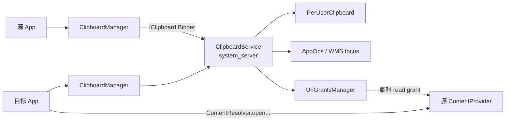
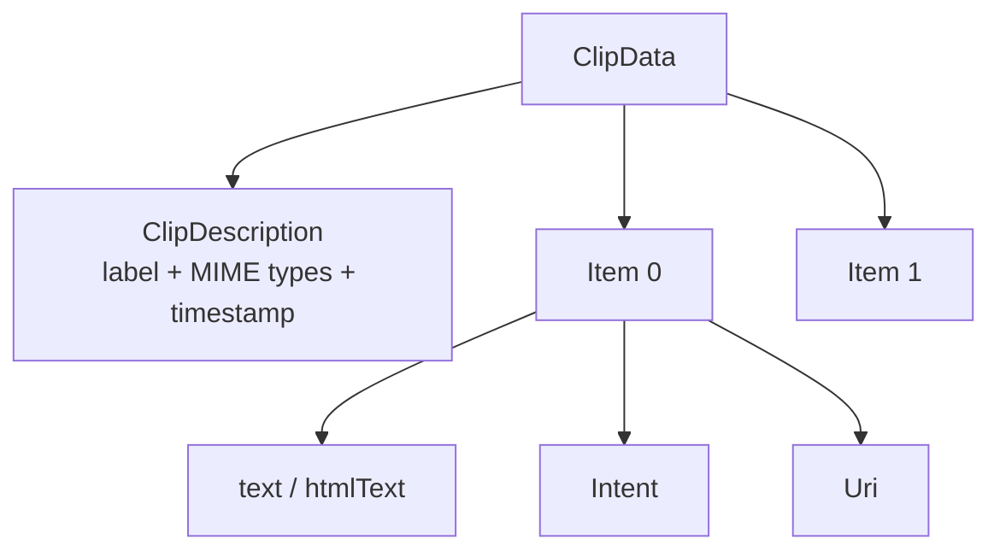
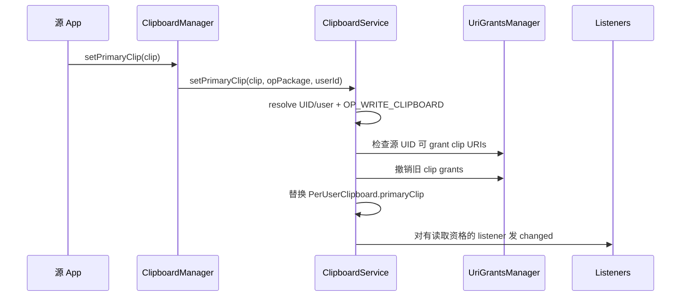
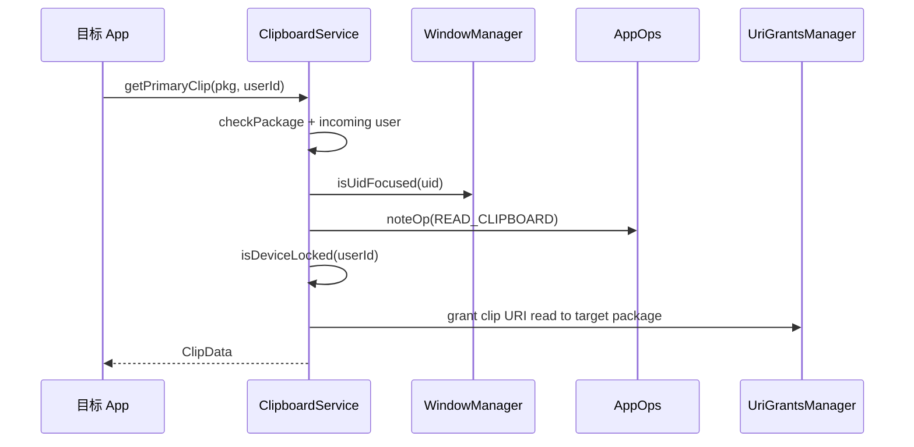
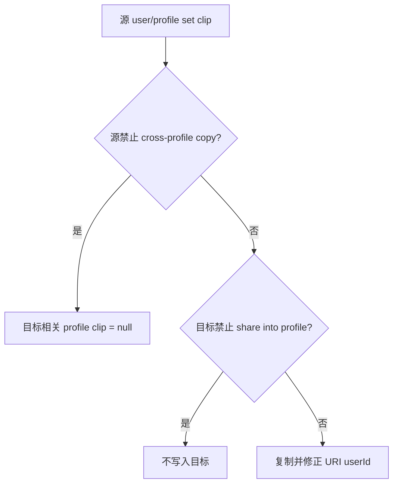

# 53 ClipboardService、ClipData、跨应用复制粘贴与隐私控制

> 源码版本：Android 11 / API 30 / `android-11.0.0_r48`  
> 学习方式：macOS 只读源码，不要求编译。  
> 本章目标：理解剪贴板如何按用户保存、哪些应用能读写、`content://` URI 的临时权限怎样授予和撤销，以及工作资料复制粘贴为什么必须同时考虑方向与用户限制。

---

## 1. 先看完整答案

复制一张图片并粘贴到另一个 App，不只是传递一个 URI 字符串：

```text
源 App 构造 ClipData(text/html/intent/uri)
→ ClipboardManager Binder 调用
→ ClipboardService 校验 package/UID、AppOps 与 URI 所有权
→ 按 userId 保存 primary clip，并撤销旧 clip 的 URI grants
→ 通知当前有读取资格的 listener
→ 目标 App 在前台调用 getPrimaryClip()
→ ClipboardService 再次检查焦点、特殊角色、设备锁定和 AppOps
→ 为目标包临时授予 clip 中 content URI 的只读权限
→ 返回 ClipData
→ 目标 App 经 ContentResolver 打开真实数据
```

剪贴板保存的是描述和小型数据；大型内容通常仍在 ContentProvider 中。

---

## 2. 整体架构



核心源码：

```text
frameworks/base/core/java/android/content/ClipboardManager.java
frameworks/base/core/java/android/content/IClipboard.aidl
frameworks/base/core/java/android/content/ClipData.java
frameworks/base/core/java/android/content/ClipDescription.java
frameworks/base/services/core/java/com/android/server/clipboard/ClipboardService.java
```

---

## 3. 四个概念先分清

### ClipboardManager

应用侧系统服务包装器，自动传 calling package 和 context userId。

### ClipboardService

运行在 `system_server`，管理访问控制、每用户 primary clip、listeners 和 URI grants。

### ClipData

剪贴板负载，可包含多个 Item，每个 Item 可带 text、HTML、Intent、URI。

### ClipDescription

描述整个 clip 的 label、MIME types、extras 和 timestamp，不等于实际 Item 内容。

---

## 4. Primary Clip 是什么

Android 公共剪贴板主要暴露一个“当前主剪贴板”：

```text
setPrimaryClip()
getPrimaryClip()
clearPrimaryClip()
hasPrimaryClip()
getPrimaryClipDescription()
```

新复制内容会替换旧 primary clip。系统不是通用剪贴板历史数据库；键盘或厂商 UI 若提供历史，是额外产品功能，需自行承担隐私与持久化风险。

---

## 5. ClipData 的结构



一个 Item 可以同时包含多种表示。接收方应按自己支持的类型选择，而不是只取 `getText()`。

常用工厂：

```java
ClipData.newPlainText(label, text);
ClipData.newHtmlText(label, text, htmlText);
ClipData.newUri(resolver, label, uri);
ClipData.newIntent(label, intent);
```

---

## 6. MIME types 属于描述层

`ClipDescription` 保存整个 clip 可提供的 MIME types，例如：

```text
text/plain
text/html
text/uri-list
application/custom
image/png
```

对 URI，`newUri()` 可向 ContentResolver 查询 Provider 的真实 MIME type，并加入 `text/uri-list`。接收方可先用 `hasMimeType()` 判断是否支持，再决定读取 Item。

MIME type 是协商信息，不是安全授权。声明 `image/png` 不代表调用者自动有权读取 URI。

---

## 7. 为什么大内容应该用 content URI

ClipData 是 Parcelable，要跨 Binder 传输。若直接塞入巨大文本/Bitmap，可能：

- 超出 Binder transaction 限制；
- 造成多次内存复制；
- 阻塞 system_server 和应用；
- 增加 GC 与 OOM 风险。

正确模式：

```text
ClipData 里放 content:// URI + MIME type
真实文件/流留在 ContentProvider
读取者粘贴时按需打开流
```

Android 11 的 ClipData 注释也提醒大型 HTML 应改用 content URI。

---

## 8. 剪贴板按用户保存

ClipboardService 内部：

```java
SparseArray<PerUserClipboard> mClipboards;
```

每个 userId 一份 `PerUserClipboard`，包含：

- `primaryClip`；
- `primaryClipUid`；
- `primaryClipListeners`；
- 已获得 URI 权限的 `activePermissionOwners`。

用户停止/清理时 `onCleanupUser()` 移除对应内存状态。

普通 user 0 和 user 10 默认不是同一个剪贴板命名空间。

---

## 9. calling userId 不能直接相信

`IClipboard` 方法接收 userId 和 callingPackage，但 Binder 调用者可以伪造参数。服务端通过 `ActivityManagerInternal.handleIncomingUser()` 等逻辑计算：

```text
intendingUserId
intendingUid
```

它综合真实 Binder UID、请求 userId、跨用户权限和 package ownership。

随后 `mAppOps.checkPackage(uid, callingPackage)` 再确认包名确实属于该 UID。字符串包名永远不是身份凭证。

---

## 10. 写剪贴板主链

应用：

```java
clipboardManager.setPrimaryClip(
        ClipData.newPlainText("label", "hello"));
```

源码链路：



空 clip 或 itemCount 为 0 会被拒绝；清空使用 `clearPrimaryClip()`。

---

## 11. 为什么写入前检查 URI owner

恶意 App 可能构造：

```text
content://victim.private.provider/secret
```

如果系统不检查，就可能借 ClipboardService 的系统身份把 victim URI 授权给第三方，形成 confused deputy。

`checkDataOwnerLocked()` 遍历所有 Item：

- `item.getUri()`；
- `item.getIntent().getData()`；

再调用 UriGrantsManager 检查 sourceUid 是否有资格授予只读权限。无权 grant 会抛出 SecurityException。

---

## 12. 写剪贴板是否要求前台

Android 11 源码中 `OP_WRITE_CLIPBOARD` 分支允许无焦点写入，但最后仍检查 AppOps。

```text
写入：不要求 focused，受 package/UID + AppOps 控制
读取：通常要求 focused 或属于明确例外角色
```

这是版本相关行为。后续 Android 版本可能继续收紧或增加通知；阅读当前工程时以 Android 11 源码为准。

---

## 13. 读取剪贴板主链

```java
ClipData clip = clipboardManager.getPrimaryClip();
```

服务端执行：

1. 解析 intending UID/user；
2. 校验 package belongs to UID；
3. `clipboardAccessAllowed(OP_READ_CLIPBOARD)`；
4. 检查目标用户设备是否 locked；
5. `addActiveOwnerLocked(uid, pkg)` 授予 URI 权限；
6. 返回当前 user 的 primaryClip。



---

## 14. 谁可以读取

Android 11 的普通规则是应用 UID 处于焦点。例外包括：

- 拥有 `READ_CLIPBOARD_IN_BACKGROUND` 的受信组件；
- 当前用户的默认 IME；
- 同时满足内部系统窗口和跨用户权限等条件的系统 UI；
- 当前用户的 Content Capture Service；
- Augmented Autofill Service；
- shell 测试能力（权限路径）。

最后仍要通过 `OP_READ_CLIPBOARD` AppOps。

“进程活着”或“有前台 Service”不等于 WMS 认可的 focused UID。

---

## 15. 为什么默认 IME 是例外

用户通常通过键盘候选栏主动粘贴，IME 自己的窗口/焦点模型特殊，不一定满足普通 App `isUidFocused()` 判断。因此当前默认 IME 被显式允许读取当前用户剪贴板。

这也说明输入法是高度敏感角色：它不仅观察输入，还可能访问剪贴板。系统只允许当前选中的默认 IME，而不是所有已安装键盘。

---

## 16. 设备锁定时为什么返回 null

`getPrimaryClip()`、description、hasPrimaryClip 在 `isDeviceLocked(userId)` 时拒绝读取，避免锁屏前复制的敏感数据被锁屏后的后台组件读取。

这里检查的是目标 Android user 的锁定状态。多用户设备中不能只查询“屏幕是否亮”或 user 0 的状态。

写入和内存中 clip 是否存在，与当前是否允许读取仍是不同状态。

---

## 17. `getPrimaryClipDescription()` 也受限制

即使只读取 label/MIME type，也能泄露用户刚复制了图片、密码文本或某 App 内容。因此 description、`hasPrimaryClip()`、`hasClipboardText()` 同样执行 read access 与 device locked 检查。

这些方法调用 access check 时可能用 `checkOp` 而非 `noteOp`，减少仅查询元信息产生的 AppOps 使用记录，但并不会跳过授权。

---

## 18. AppOps 的作用

ClipboardService 先判断角色/焦点，再调用：

```text
OP_READ_CLIPBOARD
OP_WRITE_CLIPBOARD
```

AppOps 可返回 allowed、ignored、errored 等模式。只有 allowed 才继续。

职责分层：

```text
package/UID 校验：调用者是谁
focus/role 判断：当前场景是否有资格
AppOps：这个 UID/package 的具体操作当前是否允许
URI grants：返回 URI 后能否打开真实内容
```

---

## 19. ClipData 与 URI 内容是两层数据

假设 clip 是：

```text
ClipData.Item(uri = content://photos/42)
```

读取 `getPrimaryClip()` 只得到 URI 和描述；调用：

```java
contentResolver.openInputStream(uri)
```

才读取真实图片字节。

因此需要两层许可：

1. 有权读取剪贴板，拿到 ClipData；
2. 对 URI Provider 有临时 read grant，能打开数据。

仅知道 URI 字符串不等于能访问 Provider。

---

## 20. URI 临时授权怎样建立

ClipboardService 启动时创建专用 permission owner：

```java
mPermissionOwner = mUgmInternal.newUriPermissionOwner("clipboard");
```

某包第一次成功读取 clip 时，`addActiveOwnerLocked()`：

1. 再次校验 pkg 属于 uid；
2. 遍历所有 Item URI 与 Intent data URI；
3. `grantUriPermissionFromOwner()`；
4. sourceUid 为复制者 UID；
5. targetPkg/targetUser 为读取者；
6. 只授予 `FLAG_GRANT_READ_URI_PERMISSION`；
7. 将包加入 `activePermissionOwners` 避免重复 grant。

---

## 21. 为什么复制时不立即 grant 给所有应用

系统并不知道谁会粘贴，而且全量授权会把数据暴露给所有已安装 App。

因此采用按需授权：

```text
复制时：验证源有权 grant
读取时：确认目标确实有剪贴板读取资格
随后：只给该目标包授予 URI read
```

这符合最小权限，也让同一 clip 可被多个真正读取过的包分别获得权限。

---

## 22. 旧 URI 权限何时撤销

`setPrimaryClipInternal()` 首先：

```text
revokeUris(old clipboard)
activePermissionOwners.clear()
```

然后才替换 primaryClip。清空剪贴板也走同样逻辑。

`revokeUriPermissionFromOwner()` 以 ClipboardService 的 permission owner 批量撤销由剪贴板建立的 grants，不会误删目标 App 从其他渠道获得的独立授权。

“已经把 URI 字符串复制到自己数据库”不保证未来仍能读取；临时 grant 可随 clip 替换而失效。

---

## 23. 如果目标需要长期保存内容怎么办

接收方应在权限仍有效时：

- 把内容复制到自己的私有存储；或
- 使用支持 persistable grant 的文档选择流程，而不是依赖剪贴板临时授权；或
- 让用户在业务协议中显式导入。

剪贴板 URI grant 的设计目标是完成粘贴，不是永久共享能力。

---

## 24. `coerceToText()` 的规则

`ClipData.Item.coerceToText(context)` 大致：

1. 有 text 就直接返回；
2. 有 URI 就尝试以 `text/*` 打开 Provider stream；
3. 若能读，按 UTF-8 转成字符串；
4. 普通 web URI 不能读时可返回 URI 字符串；
5. `content/file/android.resource` 不能安全转换时返回空字符串；
6. 只有 Intent 时转成 intent URI；
7. 都没有则返回空文本。

它可能执行 Provider I/O，不能在性能敏感主线程中对大型 URI 随意调用。

---

## 25. Plain、Styled 与 HTML

Item 可同时包含 plain text 和 htmlText。HTML 非空时必须有 plain text fallback。

```text
getText()：原始 CharSequence
getHtmlText()：显式 HTML
coerceToStyledText()：尽量得到带 Android spans 的文本
coerceToHtmlText()：尽量得到 HTML 表示
```

跨进程时自定义 Span 可能被剥离，只保留平台支持的样式。粘贴方必须对 HTML 做安全渲染，不能把剪贴板 HTML 当可信网页脚本。

---

## 26. Listener 注册不等于总能收到通知

应用可注册 `OnPrimaryClipChangedListener`。客户端第一次 listener 时向服务注册一个 Binder callback，之后在本地 Handler 分发给多个监听器。

ClipboardService 使用 `RemoteCallbackList` 保存每用户 listeners，并为每个 listener 记录 UID/package。

clip 变化时，不是无条件通知所有 listener，而是再次调用 `clipboardAccessAllowed(OP_READ_CLIPBOARD)`。后台普通 App 即使早已注册，也可能收不到变化通知。

---

## 27. 为什么通知时还要重新检查

注册时 App 可能在前台，clip 改变时已退到后台。如果只检查注册瞬间，后台 App 可长期监听用户所有复制行为。

正确的安全时间点是“准备暴露变化信息时”重新判断焦点、角色和 AppOps。

监听通知本身不携带 ClipData；收到通知后再次 `getPrimaryClip()` 仍需重新检查读取权限。

---

## 28. ClipboardManager 的本地 listener

应用侧 `ClipboardManager` 维护本地 listener 列表，并只向 system_server 注册一个 `IOnPrimaryClipChangedListener`。Binder callback 到达后通过 Handler 切到创建 ClipboardManager 的 Looper，再调用：

```java
listener.onPrimaryClipChanged();
```

因此：

- listener 不一定运行在 Binder 线程；
- 回调应快速返回；
- 注册/反注册要成对；
- 回调发生时 clip 可能已再次改变，读取到的是当前值。

---

## 29. 跨 Profile 复制

设置源用户 clip 后，ClipboardService 获取 related profiles，并检查：

```text
源用户：DISALLOW_CROSS_PROFILE_COPY_PASTE
目标 managed profile：DISALLOW_SHARE_INTO_MANAGED_PROFILE
```

若允许，复制 ClipData 到相关 profile 的 `PerUserClipboard`；若源禁止跨 profile copy，则把相关 profile clip 清空，防止粘贴旧内容。



---

## 30. 两个 restriction 的方向不同

### `DISALLOW_CROSS_PROFILE_COPY_PASTE`

从源 profile/user 发出的复制是否允许跨越 profile 边界。

### `DISALLOW_SHARE_INTO_MANAGED_PROFILE`

目标工作资料是否允许外部内容进入。

一个约束“能否出去”，另一个约束“能否进来”。分析时必须写出 sourceUser → targetUser 方向，不能只问“跨 profile 开关开没开”。

---

## 31. 为什么跨用户要深复制 ClipData

源码先：

```java
clip = new ClipData(clip);
```

再逐个复制 Item，然后 `fixUrisLight(sourceUserId)`。

这样做是为了：

- 不与源 clipboard 共享可变对象；
- 在目标副本中补齐/修正 URI 的 userId；
- 不意外改写源用户看到的 URI；
- 保持不同 `PerUserClipboard` 生命周期独立。

Parcelable/对象复制不仅是性能问题，也是隔离和正确性要求。

---

## 32. URI 中为什么会带 userId

跨用户访问 ContentProvider 时，系统必须知道 Provider 属于哪个 user。Android 可在 content URI authority 中编码 userId，内部方法可添加、解析或去掉该信息。

ClipboardService grant 时分别传：

- source user：数据 Provider 所属用户；
- target user：粘贴 App 所属用户。

若混淆，可能打不开数据，更严重时可能把授权指向错误用户实例。

---

## 33. 清空剪贴板与设置空文本不同

```java
clearPrimaryClip();
```

表示 primaryClip 为 null，并撤销旧 URI grants。

```java
setPrimaryClip(ClipData.newPlainText("", ""));
```

仍是一个 itemCount > 0 的有效 clip，只是文本为空。`hasPrimaryClip()` 可能为 true，而 `hasText()` 为 false。

业务逻辑不要用“第一项 text 是否为空”代替 clip 是否存在。

---

## 34. Timestamp 的用途

ClipboardService 写入 clip 时设置 `ClipDescription` timestamp。它可帮助 UI/服务判断内容新旧，但不是可信安全时间戳，也不代表内容将在某个时刻自动过期。

Android 11 AOSP ClipboardService 主要保存在内存中，没有通用的自动过期倒计时。后续系统版本或厂商实现可能增加自动清除策略，不能反推到本版本。

---

## 35. 模拟器 Host Clipboard

Android 11 ClipboardService 在 emulator 上可启动 `HostClipboardMonitor`：

- Android 文本 clip 同步到宿主机；
- 宿主机 clip 变化写入 user 0 clipboard；
- 主要同步第一项 plain text；
- host callback 以 system UID 设置 clip。

这是模拟器便利功能，不是实体设备公共架构。调试“剪贴板莫名变化”时应考虑模拟器宿主同步。

---

## 36. 剪贴板是否持久化

此 Android 11 AOSP 实现的 `mClipboards` 是内存 `SparseArray`，没有在 ClipboardService 中把 primary clip 写入磁盘。

因此 system_server/设备重启后通常丢失。IME、OEM 系统或第三方剪贴板管理器若实现历史持久化，是另一套数据持有者。

不要把“系统剪贴板”与“键盘 App 的剪贴板历史”混为一谈。

---

## 37. 敏感数据风险

用户可能复制：

- 密码和验证码；
- 地址、手机号、身份证；
- 钱包地址；
- 图片和文件 URI；
- 内部业务链接；
- Intent extras。

Android 11 的前台读取限制显著降低后台窃取，但当前前台 App、默认 IME和受信系统角色仍可能读取。应用应避免自动复制秘密、尽快清理临时敏感 clip，并不要把剪贴板当安全存储。

---

## 38. Intent Item 的风险

ClipData.Item 可包含 Intent。粘贴方拿到 Intent 后不应直接无条件启动：

- 检查 action、scheme、component 和 flags；
- 移除/验证危险 extras；
- 避免隐式 Intent 劫持；
- 不继承未经确认的 grant flags；
- 需要用户确认时先展示内容。

ClipboardService 对 Intent data URI 做 owner/grant 检查，但不会替业务 App判断 Intent 的所有语义是否可信。

---

## 39. 为什么 `file://` 不适合跨应用

`file://` 指向源 App 私有路径时，目标 UID 通常没有文件权限；现代 Android 还限制 FileUri 暴露。

应使用：

```text
FileProvider/content provider
+ content:// URI
+ 正确 MIME type
+ ClipboardService 临时 read grant
```

剪贴板 URI 授权逻辑主要针对 `content` scheme；其他 URI 不会自动获得文件系统访问能力。

---

## 40. 锁与跨服务调用

ClipboardService 同时管理共享状态、listeners、AppOps、WMS focus、UserManager 和 UriGrantsManager。源码会在同步区域操作 clipboard，但跨服务时使用 `Binder.clearCallingIdentity()`。

安全顺序：

```text
保留原 Binder 身份解析/校验调用者
→ 必要时 clear identity 代表系统查询 UMS/WMS/UGM
→ finally restore identity
```

先 clear 再校验 package/权限会把恶意调用伪装成 system，必须避免。

---

## 41. 常见故障定位表

| 现象 | 优先检查 |
|---|---|
| 后台读取返回 null | WMS focused UID、默认 IME/特殊角色、AppOps |
| 前台仍读不到 | callingPackage/UID、目标 user、device locked、AppOps |
| 得到 URI 但打不开 | URI owner 检查、grant targetPkg/user、clip 是否已替换 |
| listener 没回调 | 回调时是否仍有 read 权限，而不仅是注册时 |
| hasPrimaryClip 为 true 但没文本 | clip 可为 URI/Intent/空文本 Item |
| 工作资料无法粘贴 | 源/目标两个 restriction 和复制方向 |
| 跨 profile URI 指错数据 | `fixUrisLight`、source/target userId |
| 重启后 clip 消失 | AOSP 服务内存存储，属于预期 |
| 模拟器 clip 被改变 | HostClipboardMonitor 宿主同步 |

---

## 42. 分层排障路线

### 第一层：身份

```text
Binder callingUid → callingPackage ownership → intendingUid/userId
```

### 第二层：剪贴板访问

```text
READ/WRITE → focus/role → device lock → AppOps
```

### 第三层：ClipData

```text
description/MIME → item count → text/html/intent/uri 表示
```

### 第四层：URI

```text
source UID 是否可 grant → clipboard owner grant → target package/user → Provider open
```

### 第五层：多用户

```text
source profile → related profiles → outgoing restriction → incoming restriction → URI user fix
```

### 第六层：生命周期

```text
旧 grant 撤销 → 新 clip → listener 当前资格 → system/user cleanup
```

---

## 43. 推荐源码阅读顺序

1. `ClipData.Item`：看四种表示；
2. `ClipDescription`：看 MIME/label；
3. `ClipboardManager`：看客户端参数；
4. `IClipboard.aidl`：看服务能力；
5. `PerUserClipboard`：看内存模型；
6. `setPrimaryClip()`：看写权限和 URI owner；
7. `setPrimaryClipInternal()`：看替换、跨 profile 和 listener；
8. `getPrimaryClip()`：看读取和 active owner；
9. `clipboardAccessAllowed()`：看 focus/role/AppOps；
10. grant/revoke URI 方法：看真实内容权限生命周期。

---

## 44. 八组只读练习

### 练习一：画 ClipData

构造包含 plain、HTML、Intent 和 content URI 的 Item，标出 description 与实际数据。

### 练习二：追纯文本复制

从 `setPrimaryClip()` 追到 PerUserClipboard 替换和 listener 回调。

### 练习三：追前台读取

从 `getPrimaryClip()` 记录 package、UID、focus、device lock 和 AppOps 五次判断。

### 练习四：追图片 URI

从源 App owner check 追到目标 App grant，再到 ContentProvider open。

### 练习五：追 grant 撤销

让两个包读取同一 clip，再设置新 clip，说明 permission owner 如何统一撤销。

### 练习六：追 listener

证明注册时有资格不代表变化时一定收到，找到二次 access check。

### 练习七：追跨 profile

分别改变 outgoing/incoming restriction，画四种结果矩阵。

### 练习八：追 `coerceToText`

分别输入 text、HTTP URI、content URI 和 Intent，记录结果与潜在 I/O。

---

## 45. 初学者最容易误解的十二点

1. ClipboardManager 是客户端，真正状态在 system_server ClipboardService。
2. ClipData 可以有多个 Item，一个 Item 也可有多种表示。
3. ClipDescription 不是实际剪贴板内容。
4. MIME type 不是读取授权。
5. 拿到 content URI 字符串不等于能打开内容。
6. 读取 clip 和读取 URI Provider 是两层权限。
7. URI grant 在成功读取 clip 时按目标包建立，不在复制时授予所有 App。
8. 替换/清空 clip 会撤销旧剪贴板 grants。
9. 注册 listener 不代表后台可永久监听。
10. hasPrimaryClip 为 true 不代表第一项有非空文本。
11. 跨 profile 必须区分出去和进入两个方向限制。
12. Android 11 AOSP primary clip 是内存状态，不等于键盘/OEM 的持久历史。

---

## 46. 本章心智模型

把剪贴板问题拆成五层：

```text
身份层：谁在调用，属于哪个 user/package？
场景层：前台、默认 IME、系统角色、锁屏、AppOps？
描述层：ClipDescription 与 Item 表示是什么？
内容层：内容内联在 Binder，还是位于 ContentProvider？
能力层：谁获得 URI grant，何时撤销，能否跨 profile？
```

一条 URI clip 的真正数据流：

```text
源 UID 有权 grant content URI
→ ClipboardService 保存 URI
→ 目标包有权读取 clipboard
→ ClipboardService 临时 grant URI
→ 目标 UID 访问源用户 Provider
→ clip 替换后 grant 被撤销
```

---

## 47. 本章总结

Android 11 ClipboardService 是一个按用户隔离、按场景授权的内存数据与能力中介。它不只是保存字符串，还要防止伪造包名、后台窥探、URI confused-deputy、跨用户泄漏和过期授权。

完整主链可以概括为：

```text
源 App 用 ClipboardManager 写 ClipData
→ 服务解析真实 UID/user 并检查 WRITE AppOps
→ 对 content URI 验证源 UID 的 grant 能力
→ 撤销旧 grants，替换 per-user primary clip
→ 按当前 READ 资格通知 listeners
→ 前台/默认 IME等目标读取时再次检查焦点、锁定状态和 AppOps
→ 只向实际读取的目标包授予 URI read
→ 跨 profile 时同时检查出方向和入方向限制并修正 URI userId
```

真正应该记住的是：**ClipData 传递“内容描述或内容引用”，而 ClipboardService 还必须把“谁现在可以获得和使用这个引用”作为独立能力管理。**

---

## 48. 下一章预告

下一章进入 Autofill 体系：

> **第 54 章：AutofillManagerService、AutofillSession 与自动填充数据链路**

它会解释 View 如何形成 AutofillId/AssistStructure、系统如何绑定 AutofillService、Session 如何请求 FillResponse、Dataset 如何展示和填充，以及密码字段、认证 Dataset 和保存流程的隐私边界。
