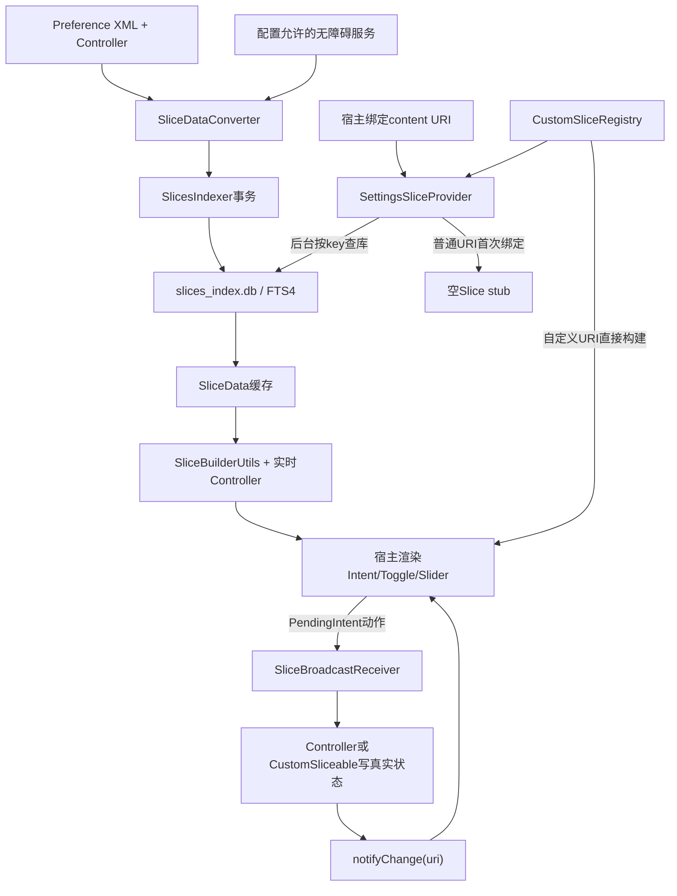
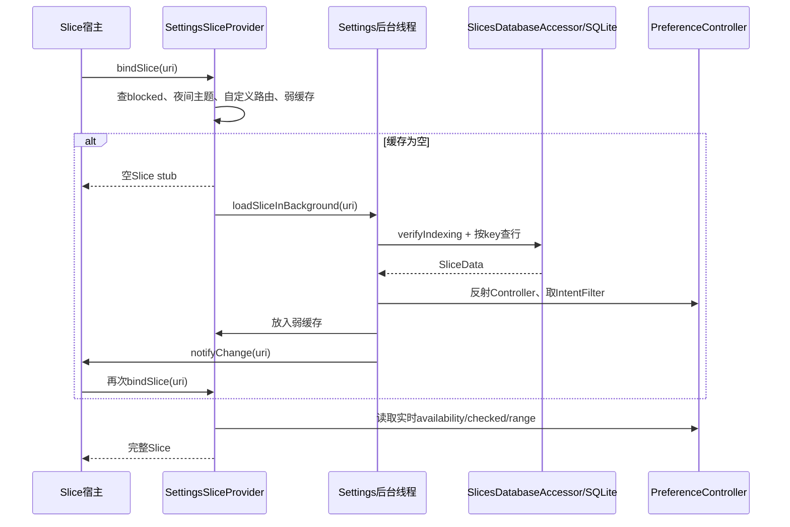
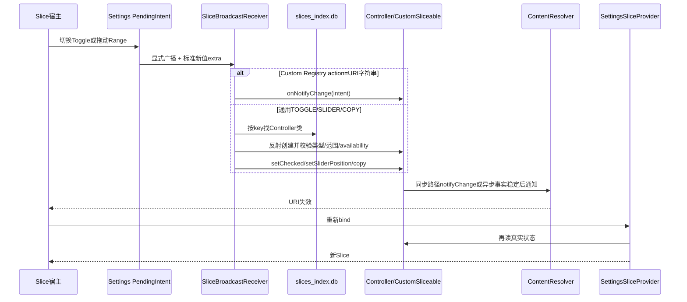

# 第530章 Android Settings Slices完整链：索引数据库、URI路由、SliceProvider、开关滑杆、Intent、权限、缓存、后台Worker与更新

> 源码基线：Android 11 / API 30 / `android-11.0.0_r48`。本章直接阅读`frameworks/base/core/java/android/provider/SettingsSlicesContract.java`、`frameworks/base/packages/SettingsLib`、`frameworks/base/packages/SystemUI`以及`packages/apps/Settings/src/com/android/settings/slices`，只读源码、不编译。核心文件：`Sliceable.java`、`SliceData.java`、`SliceDataConverter.java`、`SlicesIndexer.java`、`SlicesDatabaseHelper.java`、`SlicesDatabaseAccessor.java`、`SettingsSliceProvider.java`、`SliceBuilderUtils.java`、`SliceBroadcastReceiver.java`、`SliceBackgroundWorker.java`、`CustomSliceRegistry.java`与`SliceDeepLinkSpringBoard.java`。

## 1. 本章解决什么问题

Settings为什么能把一个设置项嵌入搜索、助手或系统面板，让用户不进入完整页面就开关Wi-Fi、拖动亮度一类的值？一个Preference怎样变成Slice？第一次绑定为什么经常先得到空壳？点击开关后由谁真正写设置、谁通知宿主重绑？公开Slice、非公开Slice和自定义Slice又有什么区别？本章沿真实代码逐段回答。

## 2. 一句话定位

Android 11 Settings Slices不是把Preference View跨进程搬出去，而是把“可切片Controller的静态元数据”预先写入Settings私有SQLite；宿主用`content://authority/action或intent/key`绑定时，Provider再反射创建Controller、读取实时状态、构建模板化Slice；动作通过受控PendingIntent回到Settings Receiver写值，状态变化再用`notifyChange(uri)`要求宿主重新绑定。

## 3. 先纠正“Slice就是一张卡片”的理解

Slice是带URI身份、结构化文本/图标/范围/动作的远程内容协议，不是Settings进程中的View实例。宿主拿到Slice后按照自己支持的spec渲染；Settings只描述“标题、主动作、Toggle、Range”等语义，不能假定最终像Settings里的Preference一样布局。

## 4. 三条实现链必须分开

普通Slice来自Preference XML、Controller、`slices_index.db`和通用Builder；自定义Slice由`CustomSliceRegistry`把固定URI直接映射到`CustomSliceable`类，不进普通数据库；Wi-Fi Calling、Zen、Bluetooth等少数历史特殊项又是Provider中的显式分支。看到一个URI时，应先判断它属于哪条链，再追代码。

## 5. 进程与线程边界

Provider、Controller、数据库和`SliceBroadcastReceiver`都运行在Settings APK进程；Slice宿主可能是SettingsIntelligence、SystemUI或其他获授权系统应用。Provider绑定来自跨进程调用；普通Slice首次数据加载被投到Settings后台线程，Worker启停被投到主线程，SystemUI还可能代Settings监听系统广播并转发回来。

## 6. 全链路总图



## 7. Framework契约只定义少数平台键

`SettingsSlicesContract`定义平台authority `android.settings.slices`、`action`和`intent`两种路径，以及airplane_mode、battery_saver、bluetooth、location、wifi五个标准key。它是一份跨应用稳定契约，不代表Settings中所有可切片Preference都必须用这个authority。

## 8. Settings Provider同时声明两个authority

Manifest把同一个`SettingsSliceProvider`注册到`com.android.settings.slices;android.settings.slices`。前者供Settings/OEM扩展，后者承载平台约定项。authority是API可见性边界，不是两个不同Provider进程，也不是两套数据库。

## 9. `action`与`intent`表达的是展示能力

`/action/key`意味着允许构建内联开关或滑杆；`/intent/key`意味着只给跳转动作。数据库中的Controller即使原本是SWITCH或SLIDER，只要请求URI路径是`intent`，`SlicesDatabaseAccessor`就会把重建后的`sliceType`强制改成INTENT。它没有改底层设置，只降低本次展示能力。

## 10. Provider导出不等于任意应用可读

Manifest中Provider是`exported=true`且`grantUriPermissions=true`，但`SettingsSliceProvider()`调用父类构造器传入`READ_SEARCH_INDEXABLES`作为自动授权权限。Slice Framework仍会检查调用方对具体URI的Slice权限；没有权限时走权限Slice，而不是直接调用Settings的`onBindSlice()`拿到真实数据。

## 11. `Sliceable`是一组默认拒绝的能力声明

接口默认`isSliceable=false`、`isPublicSlice=false`、`hasAsyncUpdate=false`，IntentFilter、URI和Worker类也默认null。这样一个普通Controller不会仅因继承`BasePreferenceController`就被意外导出；开发者必须明确选择能力，尤其要单独评估安全、隐私和脱离页面后的可理解性。

## 12. `BasePreferenceController`提供默认URI而不自动准入

Base类实现`Sliceable`并把默认URI设为`content://com.android.settings.slices/action/<preferenceKey>`，默认类型是INTENT；但它没有覆写`isSliceable()`，因此仍然默认不被索引。URI生成能力和“允许成为Slice”是两件事。

## 13. Toggle基类默认可切片但默认非公开

`TogglePreferenceController`覆写类型为SWITCH，并让`isSliceable()`返回true、`isPublicSlice()`返回false。于是XML中的大多数Toggle Controller只要当前available就会进入数据库，但普通发现接口不会把它们作为公开URI列给所有获一般Slice权限的宿主。

## 14. Slider基类仍要求子类主动准入

`SliderPreferenceController`只把类型改为SLIDER，没有覆写`isSliceable()`。Android 11 Settings中典型实现`NightDisplayIntensityPreferenceController`自己检查key后返回true，并声明public。不能从“继承Slider”推出“自动进入Slice索引”。

## 15. `CustomSliceable`处理通用Preference表达不了的内容

多行Wi-Fi网络列表、没有对应Preference的卡片、使用SwitchBar等非标准页面控件，可以实现`CustomSliceable`。它要求直接实现`getSlice()`、`getUri()`和`getIntent()`；默认`isSliceable=true`，动作可由`onNotifyChange(Intent)`自行处理。

## 16. 自定义类必须有Context单参数构造器

`CustomSliceable.createInstance()`反射查找`public Xxx(Context)`，传入application context。缺构造器、不可访问或构造失败都会包装为`IllegalStateException`。这说明自定义Slice不能依赖Activity、Fragment或某个已经创建的View。

## 17. Registry按去查询参数后的URI匹配

`CustomSliceRegistry.removeParameterFromUri()`执行`clearQuery()`，再用结果查`ArrayMap<Uri, Class>`。因此同一路径附带不同query parameter仍可落到同一个自定义类；参数可以参与类内部渲染，但不能用来选择另一种注册类型。

## 18. 注册过不等于公开支持

Registry包含Battery Fix、媒体输出、低存储、Dark Theme等许多内部Slice；Provider另有`PUBLICLY_SUPPORTED_CUSTOM_SLICE_URIS`白名单，只列Bluetooth、Flashlight、Location、Mobile Data、Wi-Fi Calling、Wi-Fi和Zen等子集。自定义路由能力与对外发现能力必须分账。

## 19. 普通Slice索引借用搜索页面注册表

`SliceDataConverter.getSliceData()`遍历上一章讲过的`SearchIndexableResourcesMobile`集合。每个登记项给出目标Fragment和SearchIndexProvider，Converter再读取其XML资源。Slice没有维护另一份完整页面名单，因此漏出搜索注册表的Dashboard页面，也不会被这条普通索引链发现。

## 20. XML元数据变成SliceData的关键源码

```java
final BasePreferenceController controller = SliceBuilderUtils
        .getPreferenceController(mContext, controllerClassName, key);
// Only add pre-approved Slices available on the device.
if (!controller.isSliceable() || !controller.isAvailable()) {
    continue;
}

final SliceData xmlSlice = new SliceData.Builder()
        .setKey(key)
        .setUri(controller.getSliceUri())
        .setTitle(title)
        .setSummary(summary)
        .setPreferenceControllerClassName(controllerClassName)
        .setFragmentName(fragmentName)
        .setSliceType(controller.getSliceType())
        .setIsPublicSlice(controller.isPublicSlice())
        .build();
```

这里既读取XML静态文案，也立刻实例化Controller做准入和可用性判断。数据库不是纯静态资源展开，而是“当前设备状态下的一次筛选快照”。

## 21. Converter只消费Provider的XML资源

`getSliceDataFromProvider()`调用`getXmlResourcesToIndex(context, true)`，没有读取Search Provider的raw或dynamic raw，也没有遍历代码创建但未写进XML的Controller。一个设置能搜索，不代表它一定能通过普通Slice索引；必须有可解析XML节点及Controller metadata。

## 22. Preference没有Controller会被跳过

代码中的TODO设想将无Controller行降级为intent-only，但r48实现看到空`METADATA_CONTROLLER`直接continue。仅有`android:key`、标题、fragment而无Controller的Preference不会自动获得“只跳转Slice”。

## 23. XML根必须是PreferenceScreen

Parser先走到首个START_TAG，并严格要求节点名为`PreferenceScreen`。不符合时抛异常；该XML本轮没有产出。它复用了`PreferenceXmlParserUtils.extractMetadata()`读取key、Controller、类型、标题、图标、摘要和不可用副标题，而不是inflate真实Preference View。

## 24. screenTitle来自根节点标题

根PreferenceScreen的title进入每条`SliceData.screenTitle`，用于摘要兜底和目标页面标题。单行title、summary/icon则来自各Preference metadata。这里存的是资源在索引时解析出的字符串，不是资源ID；locale变化必须触发重建才能更新。

## 25. Controller反射优先尝试Context单参

`SliceBuilderUtils.getPreferenceController()`先调用`createInstance(context, className)`；只有收到`IllegalStateException`才回退到`(Context, key)`构造器。Context单参成功时，XML key不会再传入；Controller必须自行持有正确key。失败回退会把构造器内部异常和“没有该构造器”都视为同一类反射失败。

## 26. 索引阶段同时检查Sliceable与Available

只有`controller.isSliceable()`且`controller.isAvailable()`才写入。`isAvailable()`把AVAILABLE、AVAILABLE_UNSEARCHABLE、DISABLED_DEPENDENT_SETTING都视为true；所以依赖项暂时关闭的设置仍可入库，并在绑定时构建“不可操作说明”Slice，而CONDITIONALLY_UNAVAILABLE等状态直接被过滤。

## 27. 可用性是一张可能过期的快照

数据库仅在build fingerprint或locale未标记时重建，不会因SIM插拔、用户限制、硬件临时状态等普通运行态变化自动重新采集行。好在每次真正build还会新建Controller并再次调用`isAvailable()`；已入库项可在绑定时返回null，但索引时未入库的项目不会仅凭状态恢复自动出现。

## 28. 单个XML的异常隔离粒度较粗

`getSliceDataFromXML()`用一个try包住整份解析循环。某个Controller构造、availability或Builder抛通用异常后，会记录指标并结束这份XML后续处理，而不是只跳过当前Preference继续。因此一个坏行可能让同一XML中排在它后面的合法Slice都缺失。

## 29. 无障碍服务有单独的动态采集旁路

Converter还读取已安装AccessibilityService，并只保留`config_settings_slices_accessibility_components`明确列出的component。每项以flatten后的ComponentName作为key，强制SWITCH、内部authority和`AccessibilitySlicePreferenceController`，不是把所有第三方无障碍服务自动暴露出去。

## 30. `SliceData`是静态描述，不保存实时值

字段包括key、title、summary、screenTitle、keywords、icon、fragment、URI、Controller类、sliceType、不可用副标题和public标志。它没有“当前是否勾选”“当前滑杆位置”；这些实时值在每次build时从新Controller读取。

## 31. Builder只强制四个字段

build要求key、title、fragment class和Controller class非空；URI、summary、screenTitle、icon等没有同等校验。正常Converter会设置URI，但`SliceData`类型本身不能保证它非null，调用者仍要遵守更强的隐含契约。

## 32. Java对象判等只看key

`hashCode()`用`mKey.hashCode()`，`equals()`只比较key。两个authority、两个Fragment甚至两个Controller只要key相同，在Java集合里就被视为同一条；但Converter当前返回的是List，没有用这个equals主动去重。

## 33. URI既是身份也是本次绑定上下文

索引写入Controller声明的URI；按URI查询时，Accessor又把“调用方实际请求的URI”放回新`SliceData`。这样同一个key可用`/intent/key`请求并被降级为INTENT，Builder和`notifyChange`也针对宿主正在观察的确切URI工作。

## 34. `SlicesIndexer`只做全量重建

`indexSliceData()`先检查indexed state；需要索引时开启SQLite事务、调用`reconstruct()`丢表重建、转换所有数据、逐行插入、标记build与locale，最后提交。它没有像Settings Search那样的non-indexable增量更新。

## 35. 事务保护的是SQLite表

丢旧表、建新FTS表和所有行插入处在同一数据库事务内，异常会让SQLite回滚。这样宿主不会看到一张只写了一半且已提交的索引表；但SharedPreferences的“已索引”标记使用`apply()`，不属于SQLite事务。

## 36. 数据库是一张FTS4虚表

文件名为`slices_index.db`、版本8，表`slices_index`使用`CREATE VIRTUAL TABLE ... USING fts4`。列虽然包含title、summary、keywords，但Accessor只做`key = ?`普通等值查询和public过滤，并没有用MATCH做全文搜索；采用FTS4更多是历史实现选择。

## 37. 注释里的“key是主键”不是schema事实

`IndexColumns.KEY`注释称其为DB primary key，`SliceData`注释也说key决定相等；然而建表SQL没有`PRIMARY KEY`或UNIQUE约束，FTS4普通列也不会自动唯一。源码阅读时必须以实际DDL为准，不能把Java判等注释外推到SQLite约束。

## 38. `replaceOrThrow()`不保证按key覆盖

Indexer没有提供rowid，表也没有key唯一约束，因此`database.replaceOrThrow()`不能简单理解为“同key替换旧行”。常规路径先reconstruct为空表，通常不会遇到旧行；若一次Converter结果内部重复key，就可能写出多行，随后Accessor因结果数大于1抛异常。

## 39. indexed state由fingerprint与locale共同判断

SharedPreferences分别用`Build.FINGERPRINT`和`Locale.getDefault().toString()`作为boolean key；两者都存在才算已索引。OTA或换语言会触发全量重建。旧fingerprint/locale布尔项不会逐个清理，只有`reconstruct()`先clear整份偏好。

## 40. 运行状态变化不会使索引自动失效

开关值、用户限制、安装/卸载普通应用和Controller availability变化都不参与indexed state。无障碍服务列表也只有在fingerprint/locale失效或数据库被重建时重新采集；这与搜索索引每次打开还能刷新non-indexable不同。

## 41. `apply()`与事务提交不是同一个完成点

`setIndexedState()`在事务标记successful之前调用，并异步apply偏好。正常流程没有问题，但它不提供“数据库commit与偏好落盘原子成功”的保证。讲解时只能说设计意图是提交后视为已索引，不能说两个存储组成一个原子事务。

## 42. Accessor每次查询前都会验证索引

`verifyIndexing()`先`Binder.clearCallingIdentity()`，同步调用FeatureProvider的`indexSliceData(context)`，finally恢复身份。这避免用外部Binder调用方身份执行Settings私有索引；也意味着第一次数据库查询可能承担完整XML遍历和写库成本，所以普通Provider把它放入后台加载。

## 43. 同步索引有进程内单例但无显式互斥

FeatureProvider缓存一个`SlicesIndexer`和Converter实例，Helper也是单例；不过`indexSliceData()`自身没有`synchronized`。多个首次请求理论上可能同时看到未索引并尝试reconstruct。代码依赖实际调用时序和SQLite串行化多于一个明确的“一次性任务代际”。

## 44. URI路径解析保留key中的斜杠

`getPathData()`对path执行`split("/", 3)`；`/action/a/b`得到类型action、key `a/b`，这也是无障碍component等复合key能够工作的原因。测试名称虽写“extraArg_returnsNull”，实际断言正是保留`KEY/KEY`，应相信断言和实现。

## 45. 路径解析没有验证第一段只能是action/intent

只要切成三段，第二段等于`intent`就标记intent-only；其他任何文本都会被当成false，也就是非intent。后续数据库仍按第三段key查。Provider descendants接口会更严格校验前缀，但单条Accessor解析并不是完整URI安全验证器。

## 46. 按key查询严格要求恰好一行

`getIndexedSliceData()`使用selectionArgs做`key = ?`，避免把key直接拼入SQL；0行抛“Invalid Slices key”，大于1行也抛异常。Receiver只拿key再查库，所以key在整张表中事实上必须全局唯一，即使schema没有强制。

## 47. 从数据库重建时丢掉两个存储字段

`SELECT_COLUMNS_ALL`没有`SLICE_URI`和`PUBLIC_SLICE`。按URI构建时URI来自调用参数；按key处理动作时URI为null；Builder也没有恢复`isPublicSlice`，于是默认false。公开性只用于URI枚举，不参与后续模板build和动作写入。

## 48. 公开URI枚举直接按public列过滤

`getSliceUris(authority, isPublicSlice)`先筛`public_slice=1/0`，再解析每行持久化URI并在Java里匹配authority。authority为空时收集两种authority。没有ORDER BY，因此调用者不应依赖返回顺序。

## 49. 数据库中的URI由Controller决定authority

普通Base Controller默认内部authority；需要进入平台稳定契约的Controller可覆写`getSliceUri()`改成`android.settings.slices`。Provider的双authority声明只让两类URI都可路由，不会自动把内部URI复制成平台URI。

## 50. Provider创建时只准备Accessor和缓存

`onCreateSliceProvider()`新建`SlicesDatabaseAccessor`与`WeakHashMap<Uri, SliceData>`并返回true，没有立即索引数据库。索引被推迟到首次普通URI加载或descendants枚举，减少Settings进程仅因Provider创建就做全量工作。

## 51. 普通Slice第一次绑定的时序



## 52. StrictMode放宽只发生在非主线程

`onBindSlice()`保存旧ThreadPolicy；若当前不是主线程，就临时`permitAll()`，finally恢复。主线程不会被Settings这一层覆盖。它是对兼容Slice绑定线程的处理，不等于允许主线程任意数据库I/O；普通查库仍被设计为后台加载。

## 53. blocked key在所有路由之前检查

Provider取URI最后一段，与`Settings.Global.BLOCKED_SLICES`解析集合比对；命中直接返回null，连Custom Registry也不会继续构建。阻断粒度只是lastPathSegment，同key的action/intent以及不同authority都会一起受影响。

## 54. r48的blocked字符串解析存在明显不一致

代码先用逗号分隔的`KeyValueListParser`验证原串必须是`key=value`对，随后却完全不读取parser结果，而把原串按冒号切成key集合。若输入是纯`a:b`会在验证阶段失败并返回空集；若是`name=a:b`又会得到`name=a`与`b`。因此只能描述源码行为，不能宣称任意冒号列表都能正确阻断。

## 55. Provider会随夜间模式重设Theme

第一次bind记录`Utils.isNightMode()`并给Context设置`Theme_SettingsBase`；模式变化后调用`Theme.rebase()`。Slice图标和accent color会读取资源主题，所以即使没有Activity View，Provider Context的Theme仍会影响输出。

## 56. 路由顺序决定谁绕过数据库

先查Custom Registry，再处理Wi-Fi Calling、Zen、Bluetooth、Enhanced 4G和Wi-Fi Calling Preference显式分支，最后才走普通弱缓存/数据库。Registry中的Wi-Fi、Flashlight等永远直接`getSlice()`，不会因为数据库里恰好有同key行而走通用Builder。

## 57. 自定义URI首次绑定不返回通用stub

Registry命中后当前线程立即反射创建类并调用`getSlice()`。自定义类需要自己控制工作量、loading row和Worker缓存；普通链“先空Slice、后台查库、notify后再bind”的策略不会替它自动执行。

## 58. 少数显式分支是历史兼容层

Zen和Bluetooth不在Registry Map中，却由Provider、Pinned逻辑、Receiver和DeepLink分别显式识别；Wi-Fi Calling也由Helper构建。它们与`CustomSliceable`主路径并存，所以新增特殊Slice时只改一个列表常常不够，源码TODO也承认这些URI名单有重复。

## 59. 普通路径先查`mSliceWeakDataCache`

缓存命中后才调用通用Builder；未命中就安排后台load并返回空Slice。缓存保存的是静态`SliceData`，不是最终Slice，所以每次命中仍重新实例化Controller并读取实时值，避免把checked或slider position永久缓存。

## 60. stub是真正的空Slice而非带loading hint的List

`getSliceStub()`直接`new Slice.Builder(uri).build()`；注释说明曾因loading state问题暂不使用ListBuilder。宿主是否显示空白、占位或等待由Slice框架/宿主决定，Settings没有在stub里放标题与进度条。

## 61. 后台加载、缓存与通知的关键源码

```java
final SliceData cachedSliceData = mSliceWeakDataCache.get(sliceUri);
if (cachedSliceData == null) {
    loadSliceInBackground(sliceUri);
    return getSliceStub(sliceUri);
}

if (!getPinnedSlices().contains(sliceUri)) {
    mSliceWeakDataCache.remove(sliceUri);
}
return SliceBuilderUtils.buildSlice(getContext(), cachedSliceData);

// loadSlice(uri)的尾部：
mSliceWeakDataCache.put(uri, sliceData);
getContext().getContentResolver().notifyChange(uri, null);
```

这里的`notifyChange`不携带新Slice；它只告诉观察者“该URI过期了”，宿主必须再bind，第二次才从缓存构建完整内容。

## 62. `loadSlice()`还注册状态广播与Worker

查到SliceData后，它反射Controller并读取`getIntentFilter()`；普通Controller交给`SliceBroadcastRelay`，音量Controller走聚合优化。然后把`startBackgroundWorker(controller, uri)`投到主线程，最后缓存并notify。数据准备、状态监听和持续更新在这一点汇合。

## 63. WeakHashMap表达“可丢弃缓存”而非可靠存储

弱键没有强引用时条目可被GC清除；非Pinned Slice在一次成功build后还会显式remove。因此缓存只跨越“后台查完到宿主下一次bind”这个短窗口，数据库才是可重建的静态事实来源。

## 64. Pinned Slice会保留缓存但仍动态build

`getPinnedSlices().contains(uri)`时不显式移除缓存，后续notify重绑无需重复查库。不过缓存对象只存元数据；Controller每次仍读取实时状态。Pinned表达“宿主持久关注更新”，不是“固定同一份渲染结果”。

## 65. 弱缓存与后台加载没有显式并发保护

`WeakHashMap`不是线程安全集合，Provider可在绑定线程get/remove、后台线程put；连续未命中还可能投递多个相同load。r48没有per-URI in-flight表或generation去重。多数设备调用时序能工作，但代码层不能宣称它具备严格并发一致性。

## 66. Pin自定义Slice时先装监听再启Worker

`onSlicePinned()`对Registry URI创建CustomSliceable，若IntentFilter非null就向SystemUI登记广播转发，然后在主线程启动Worker。它随后return，不走数据库warming。Worker依赖pin生命周期，不应仅在`getSlice()`中临时创建。

## 67. Pin普通Slice会提前warming

普通URI没有单独直接启动Worker，而是调用`loadSliceInBackground()`；load查出Controller后注册filter并post Worker启动。这让pin与首次bind都可能触发加载，但没有合并重复任务的显式机制。

## 68. Unpin同时撤销广播和Worker

先让`VolumeSliceHelper.unregisterUri()`判断是否为音量URI；否则调用`SliceBroadcastRelay.unregisterReceivers()`。再投主线程`stopBackgroundWorker(uri)`，执行worker.unpin、取消待发notify并从Provider的Pinned Map移除。全局Worker实例本身直到Provider shutdown才close并从静态Map清空。

## 69. 为什么要让SystemUI中继广播

Settings进程未必常驻，直接动态注册系统状态广播不稳定。`SliceBroadcastRelay.registerReceiver()`向SystemUI发送“URI、目标Receiver、IntentFilter”，SystemUI为该URI动态监听；收到真实系统广播后，显式转发到Settings的`SliceRelayReceiver`，后者只做`notifyChange(uri)`。

## 70. 中继Receiver有权限边界

Settings Manifest把`SliceRelayReceiver`和`VolumeSliceRelayReceiver`设为exported，但要求`MANAGE_SLICE_PERMISSIONS`；SystemUI持有该系统权限，普通第三方不能直接伪造转发。实际注册消息还被显式限定到`com.android.systemui`包。

## 71. 音量Slice把多个URI合成一次系统监听

多个音量滑杆共享AudioManager广播。`VolumeSliceHelper`只在第一个URI注册时，用虚拟`volume_slices` URI让SystemUI建一个relay，并维护`URI→audioStream` Map；广播回来后只notify匹配stream，无法判断时才notify全部，减少无关重绑。

## 72. Worker解决“列表持续变化”而非所有异步写入

`SliceBackgroundWorker<E>`适合Wi-Fi AP、蓝牙设备、媒体设备等持续数据源。`Sliceable.getBackgroundWorkerClass()`只是声明类；Provider按URI创建全局单例并调用pin/unpin。普通开关的`hasAsyncUpdate()`与Worker是两个概念，前者描述写值完成时机，后者描述Pinned期间的持续数据维护。

## 73. Worker构造器也有固定反射契约

Worker必须有`public Worker(Context, Uri)`。实例保存在静态`LIVE_WORKERS`，键是完整URI；同类不同query URI可得到不同Worker，同URI即使由另一个Sliceable请求也复用原实例。错误类或构造器会抛`IllegalStateException`。

## 74. `getResults()`返回List浅拷贝

Worker缓存`List<E>`，读取时new ArrayList保护列表结构不被调用方增删，但元素E本身仍共享。Wi-Fi Worker为此把每个AccessPoint序列化到Bundle再重建，避免底层Tracker继续原地修改元素导致比较和显示混乱。

## 75. `updateResults()`只在列表语义变化时通知

null与非null互换会notify；两个非null列表调用`areListsTheSame()`，默认是List.equals。子类可覆写补充状态比较。相同结果不会不断唤醒宿主，这是一层内容去抖，不是线程同步或数据库缓存。

## 76. Worker通知按URI节流到300毫秒

静态HandlerThread维护每个URI最后通知uptime；首次变化延迟300ms，距离上次超过300ms立即发，否则排到窗口结束。同一Worker已有待处理消息时直接忽略新请求，但到点build时Controller/Worker读取最新事实，因此多次变化被合并而非逐条回放。

## 77. shutdown与unpin语义不同

unpin调用子类`onSliceUnpinned()`并取消该Worker待通知，却不调用`close()`；Provider shutdown才遍历所有LIVE_WORKERS执行close并clear。子类应在unpin停止可恢复监听，在close释放最终资源，不能把两者当成同一个回调。

## 78. `onGetSliceDescendants()`承担发现而非绑定

它根据输入前缀列出可能的Slice URI：完整URI返回自己；authority根或`/action`、`/intent`前缀返回匹配公开数据库URI；空authority还合并两种authority和公开自定义URI。返回一个URI不代表调用者已经能绑定它，权限仍由Slice Framework处理。

## 79. 完整URI分支并不先验证数据库存在

只要`getPathData()`能解析，descendants就把该URI本身加入并返回，不查key是否真的在DB或Registry。这个API回答“前缀的形状”，不是严格存在性校验；真正普通bind若查不到行，后台load记录日志，宿主只拿到最初stub且不会得到完整结果。

## 80. 非公开枚举使用一个配置专用URI

`config_non_public_slice_query_uri`默认空；OEM可配置特殊查询URI。只有调用`onGetSliceDescendants()`的URI字符串与配置完全相同，Provider才先加入`public_slice=0`的数据库URI，再把查询基准改回同authority根继续加入公开项。

## 81. 私有枚举还要求权限与指定包双重命中

Provider检查Binder UID/PID持有signature|privileged级`READ_SEARCH_INDEXABLES`，并要求UID对应包名等于`config_settingsintelligence_package_name`。这不是“持权限的所有系统应用都能枚举私有Slice”，而是给SettingsIntelligence一类受配置客户端开的窄入口。

## 82. 这里按UID包数组第0项判断

`getPackagesForUid(callingUid)[0]`没有遍历共享UID下全部包，也没有显式null/空数组防护。正常Binder应用UID通常可解析，但共享UID排序可能影响判定；阅读时不能把它描述成对该UID所有包的完备身份校验。

## 83. descendants末尾会给资源白名单包授权

Provider读取`slice_whitelist_package_names`，对每个descendant、每个包调用`SliceManager.grantSlicePermission()`。默认AOSP配置数组为空；OEM可配置。授权发生在枚举公开结果之后，私有特殊路径中加入的URI也位于同一descendants集合内。

## 84. 自动授权和资源白名单是两种机制

父SliceProvider的auto-grant依据调用方持有`READ_SEARCH_INDEXABLES`；`grantWhitelistedPackagePermissions()`则由Settings主动按包名和具体URI授予。二者都受Framework Slice权限存储控制，但触发条件和粒度不同。

## 85. 无权限提示被Settings改成“打开设置”

`onCreatePermissionRequest(uri, callingPackage)`没有弹标准授权对话框，而返回打开`Settings.ACTION_SETTINGS`的PendingIntent，callingPackage参数未参与Intent。权限Slice的按钮因此只是进入Settings首页，并不会在这个回调里直接给调用方授权。

## 86. Provider权限与动作Receiver权限不要混为一谈

读取Slice经Framework做URI权限检查；用户点击内联动作时，宿主持有的是Settings创建的显式PendingIntent。`SliceBroadcastReceiver`在Manifest中`exported=false`，外部不能用普通隐式广播调用，但可以由系统代执行已获得的PendingIntent。权限控制点位于不同阶段。

## 87. 通用Builder每次重新创建Controller

`buildSlice()`根据SliceData中的类名和key反射新Controller，记录`ACTION_SETTINGS_SLICE_REQUESTED`指标，再读取availability、类型和实时值。它不复用Indexer当时的Controller，也不复用页面里的Controller实例。

## 88. unavailable有两种完全不同的结果

若`controller.isAvailable()`为false，Builder直接返回null；若状态恰是`DISABLED_DEPENDENT_SETTING`，由于Base的isAvailable仍为true，Builder构建不可操作说明Slice。前者表示设置当前不应展示，后者表示页面仍可到达但依赖项阻止操作。

## 89. 依赖禁用Slice只保留跳转动作

`buildUnavailableSlice()`用自定义`unavailable_slice_subtitle`或通用disabled说明，放标题、图标、primary deeplink，不加Toggle或InputRange。用户可进入目标页理解依赖关系，但不能在宿主中直接改值。

## 90. 副标题有四级优先级

Controller要求dynamic summary时直接返回`controller.getSummary()`，即使为null/空；否则先用XML summary，过滤空白与placeholder；再用不等于行title的screenTitle；最后空字符串。动态summary是显式接管，不会在无效时继续向下fallback。

## 91. SettingsIntelligence宿主会隐藏通用副标题

Toggle、Intent、Slider、Copy和Unavailable Builder都在`!Utils.isSettingsIntelligence(context)`时才setSubtitle。该辅助方法读取当前Binder calling UID，再取其包数组第0项与配置的SettingsIntelligence包名比较，用来避免搜索场景重复文案；它不是检查Settings自身Context的包名。不能从SliceData里有summary推出每个宿主都一定收到subtitle。

## 92. 图标有安全兜底

icon resource为0时使用Settings默认accent图标；资源创建抛异常也捕获并回退。Slider如果XML显式给icon，就把图标作为title item并把accent设为`COLOR_NOT_TINTED=-1`；这个常量表达“不统一着色”，不是ARGB白色。

## 93. Intent Slice只提供页面跳转

它构建一行title、可选subtitle、keywords和Primary Deeplink。即使底层Controller是Toggle，只要URI是`/intent/key`，Accessor已把类型改为INTENT，宿主就看不到内联开关。

## 94. Toggle Slice读取并显示当前checked

Builder把Controller强转`TogglePreferenceController`，调用`isChecked()`创建toggle SliceAction。主行本身仍有deeplink，尾部开关PendingIntent指向`ACTION_TOGGLE_CHANGED`，并附URI与key。宿主把新状态放到标准`Slice.EXTRA_TOGGLE_STATE`。

## 95. Slider会校验范围并夹住显示值

若`max <= min`直接返回null；当前position低于min或高于max时只把本次展示值clamp到边界，不回写真实存储。输入动作交给Range PendingIntent，Receiver再次验证收到的新值确实落在Controller实时min/max内。

## 96. Copy能力优先于sliceType

Controller的`isCopyableSlice()`为true时，Builder先构建带复制尾部动作的行，不再进入INTENT/SWITCH/SLIDER switch。Receiver最终调用`controller.copy()`；接口提供`setCopyContent()`帮助写剪贴板并Toast，但具体内容仍由Controller决定。

## 97. Primary deeplink把key同时放在参数与data中

`getContentIntent()`构造SubSettings目标，Bundle和Intent extra都写`EXTRA_FRAGMENT_ARG_KEY`；还把一个仅含`/<key>`的相对Uri设为data，用于让多个requestCode同为0的PendingIntent保持身份唯一。data不是Slice的content URI，也不是Provider查询地址。

## 98. PendingIntent身份依赖action与data

通用动作PendingIntent都用requestCode 0、`FLAG_UPDATE_CURRENT`，但action有TOGGLE/SLIDER/COPY差异，data是完整Slice URI；主跳转则以`/<key>`区分。若两条记录错误地复用相同key、action和data，它们的extras可能被后创建者更新，进一步说明key/URI唯一性重要。

## 99. 用户动作与状态刷新的完整时序



## 100. Receiver先按“action是不是注册URI”路由

自定义`getBroadcastIntent()`把`getUri().toString()`直接设为Intent action，并把同一URI设为data。Receiver先用`CustomSliceRegistry.isValidAction(action)`检查，命中就新建自定义类并调用`onNotifyChange()`，不会进入通用switch。

## 101. 通用动作只凭key找Controller

Receiver新建Accessor并调用`getSliceDataFromKey(key)`；这个查询不带authority、URI或Controller类。若数据库有同key多行会抛；若不同authority错误共享key也无法区分。动作Intent中的data主要用于notify目标URI，不参与选择数据库行。

## 102. Toggle写入与通知的关键源码

```java
final TogglePreferenceController toggleController =
        (TogglePreferenceController) controller;
toggleController.setChecked(isChecked);
logSliceValueChange(context, key, isChecked ? 1 : 0);
if (!controller.hasAsyncUpdate()) {
    context.getContentResolver().notifyChange(sliceUri, null /* observer */);
}
```

Receiver验证key、Controller类型和availability后写值。同步Controller立即notify；异步Controller故意不立即notify，必须由其状态广播、Worker或自身回调在真实值稳定后触发更新。

## 103. `setChecked()`返回值被忽略

Toggle接口返回boolean表示底层是否成功更新，但Receiver不检查它，仍记录变更指标，并在同步路径notify。于是一次拒绝/失败写入也可能马上重绑；好处是宿主会从`isChecked()`读回真实值，坏处是指标不能等同于成功提交。

## 104. async不是“Receiver后台执行”

`hasAsyncUpdate=true`只改变是否立刻notify；`setChecked()`仍在Manifest BroadcastReceiver通常使用的Settings主线程回调中被直接调用，并没有被这段代码投到后台。Wi-Fi一类无线状态转换需要时间，过早重绑可能还读到旧值，所以交给后续系统广播或Worker通知。实现者若既不立即notify、也没后续通知链，宿主就会陈旧。

## 105. Slider处理比Toggle更严格

缺key、新值为-1、Controller不是Slider或超出实时min/max都会抛`IllegalArgumentException`；不可用时不写值但仍notify；有效时调用`setSliderPosition()`、记录指标并始终notify。它同样忽略setter返回boolean，也没有`hasAsyncUpdate()`分支。

## 106. Copy成功后通用Receiver不notify

Copy先验证key、Controller实现Sliceable且available，然后调用`copy()`；不可用且非异步时才notify。正常复制不改变设置状态，因而没有必要刷新Slice；Toast与剪贴板反馈由Controller自己提供。

## 107. `notifyChange`只表示“可能过期”

无论Receiver、Relay还是Worker都不把新状态作为参数发给宿主。宿主收到变化后重新bind，Provider再读权威来源。这种拉取式收敛能容忍广播只说明“某类状态变了”，但也要求每个URI和Controller读路径可重复执行且足够快。

## 108. Flashlight展示了自定义直接动作与即时通知

FlashlightSlice直接构建Toggle，动作action是自身URI；`onNotifyChange()`读取标准toggle extra，找后置摄像头并调用`CameraManager.setTorchMode()`，随后立即notify固定URI。这里的“立即”只描述代码调用顺序，不保证摄像头硬件状态已经稳定；它不进数据库，也没有通用Controller类型检查，可用性和异常恢复都由类自己负责。

## 109. Wi-Fi展示了自定义异步动作与Worker协作

WifiSlice切换时只调用`WifiManager.setWifiEnabled(newState)`，明确不立刻notify，因为服务状态还未稳定；Pinned后WifiScanWorker监听WifiTracker/AP和网络能力，变化时经300ms节流notify。`getSlice()`再从Worker快照构建最多三行AP，并从WifiManager读取真实开关状态。

## 110. DeepLink SpringBoard是另一条入口

`settings://com.android.settings.slices?slice=<encoded content URI>`由无界面Activity接收，Manifest要求`MODIFY_PHONE_STATE`。它解析slice参数：Registry走`getIntent()`，Zen/Bluetooth走专用Intent，普通项同步查库后用Builder生成SubSettings Intent；任意异常都退回Settings首页。它打开目标页面，不负责渲染或切换Slice。

## 111. r48关键边界集中复盘

普通索引只读XML；availability只在fingerprint/locale重建时决定入库；key在schema中不唯一却被全链当全局唯一；`replaceOrThrow`不能按key去重；Accessor丢public字段；路径不验证未知类型；首次加载和WeakHashMap无显式并发保护；blocked配置解析不一致；setter结果被忽略；async完全依赖后续通知；私有枚举只认配置URI、权限和指定包。

## 112. macOS只读练习一：证明“可切片”不等于“公开”

```bash
sed -n '1,180p' packages/apps/Settings/src/com/android/settings/slices/Sliceable.java
rg -n 'isSliceable|isPublicSlice|getSliceType|getSliceUri' packages/apps/Settings/src/com/android/settings/core/{BasePreferenceController,TogglePreferenceController,SliderPreferenceController}.java
sed -n '35,70p' packages/apps/Settings/src/com/android/settings/display/NightDisplayIntensityPreferenceController.java
```

画一张四列表：Base、Toggle、Slider、NightDisplayIntensity分别写默认type、sliceable、public、URI authority，说明为什么Slider子类还要自己准入。

## 113. macOS只读练习二：手算一条普通Slice的数据库行

```bash
sed -n '80,245p' packages/apps/Settings/src/com/android/settings/slices/SliceDataConverter.java
sed -n '35,150p' packages/apps/Settings/src/com/android/settings/slices/SlicesIndexer.java
sed -n '55,145p' packages/apps/Settings/src/com/android/settings/slices/SlicesDatabaseHelper.java
```

任选一个XML中的Toggle Preference，找出key、title、summary、icon、Controller和Fragment；再核对Controller的URI/public/availability，写出理论数据库12列。最后指出DDL中哪一列实际没有唯一约束。

## 114. macOS只读练习三：跟踪首次绑定为何要两次

```bash
sed -n '175,330p' packages/apps/Settings/src/com/android/settings/slices/SettingsSliceProvider.java
sed -n '385,490p' packages/apps/Settings/src/com/android/settings/slices/SettingsSliceProvider.java
sed -n '55,210p' packages/apps/Settings/src/com/android/settings/slices/SlicesDatabaseAccessor.java
```

从缓存空开始写出返回stub、后台verify/index/query、注册filter/worker、put cache、notify、再次bind、build的先后顺序，并标出哪些语句在后台、哪些Worker操作被post回主线程。

## 115. macOS只读练习四：对比同步Toggle与异步Wi-Fi

```bash
sed -n '45,235p' packages/apps/Settings/src/com/android/settings/slices/SliceBroadcastReceiver.java
sed -n '300,375p' packages/apps/Settings/src/com/android/settings/wifi/slice/WifiSlice.java
sed -n '50,155p' packages/apps/Settings/src/com/android/settings/wifi/slice/WifiScanWorker.java
```

回答：通用同步Toggle在哪里notify？`hasAsyncUpdate=true`时谁必须补通知？WifiSlice为何刻意不立即notify？WifiScanWorker如何避免AP列表无变化时重复通知？

## 116. 不编译时的推荐定位路线

拿到Slice URI先在`CustomSliceRegistry`搜索完整URI；未命中再看Provider显式特殊分支；仍未命中则取lastPathSegment，在Preference XML找key和Controller，检查`isSliceable/isPublicSlice/getSliceUri/getSliceType`，再沿Converter→Indexer→Accessor→Builder→Receiver追读。状态不刷新时继续找IntentFilter、Relay或Worker。

## 117. 调试思维清单

若首次一直空白：看后台load是否查不到key、索引是否异常、notify是否发出；若控件类型不对：检查URI是intent还是action、数据库slice_type和Controller实际基类；若点后回弹：检查setter返回/真实状态、async通知；若外部发现不到：分清Registry注册、public标志、custom公开名单与Slice URI权限。

## 118. 最容易形成的八个误解

一，所有Controller自动成为Slice；二，所有Slice都进数据库；三，action路径表示某个Intent action字符串；四，`replaceOrThrow`按key去重；五，缓存保存实时checked；六，notify会推送新数据；七，Pinned自动授予权限；八，`hasAsyncUpdate`会把写入移到后台。八条都与r48源码不符。

## 119. 本章最终心智模型

把系统分成五本账：URI决定身份与展示能力；数据库保存普通项静态元数据；Controller/CustomSliceable保存实时读写规则；Slice Framework保存调用方URI权限；notify/Relay/Worker只传播失效信号。任何问题先判断是哪本账不一致，再沿边界定位，远比把它们统称为“Slice缓存问题”准确。

## 120. 下一章预告

第531章将继续阅读Settings权限与应用管理入口，重点追`ManageApplications`、`ApplicationsState`、PackageManager回调、Recycler Session、过滤排序、详情页路由和跨用户/工作资料边界；仍以Android 11 r48源码为准，不做真实编译。
