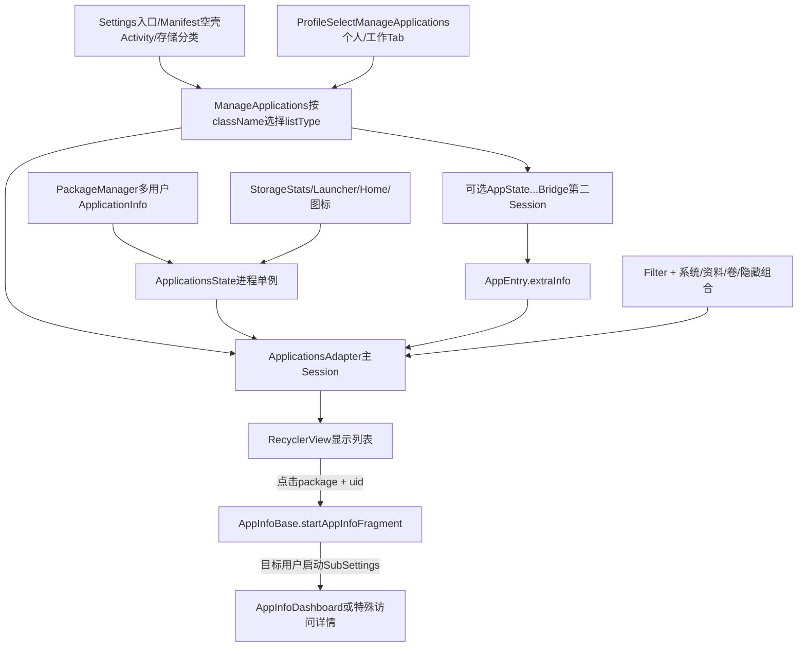
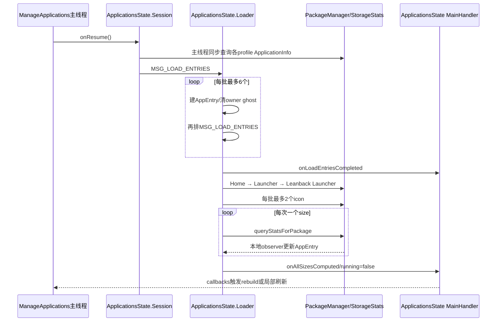
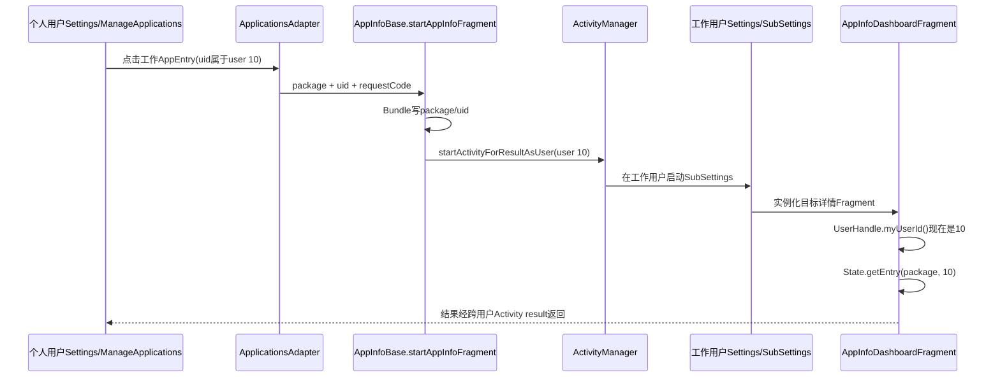

# 第531章 Android Settings应用管理完整链：ManageApplications、ApplicationsState、多用户Session、后台加载、过滤排序、Bridge、搜索与详情路由

> 源码基线：Android 11 / API 30 / `android-11.0.0_r48`。本章直接阅读`frameworks/base/packages/SettingsLib/src/com/android/settingslib/applications`、`packages/apps/Settings/src/com/android/settings/applications/manageapplications`、`packages/apps/Settings/src/com/android/settings/applications`与`packages/apps/Settings/src/com/android/settings/applications/appinfo`，只读源码、不编译。核心文件：`ApplicationsState.java`、`InterestingConfigChanges.java`、`ManageApplications.java`、`AppFilterRegistry.java`、`ApplicationViewHolder.java`、`AppStateBaseBridge.java`、`AppStateNotificationBridge.java`、`ProfileSelectManageApplications.java`、`AppInfoBase.java`、`AppInfoDashboardFragment.java`与`SubSettingLauncher.java`。

## 1. 本章解决什么问题

“应用和通知→查看全部应用”、通知应用列表、特殊访问、存储分类为什么看起来是不同页面，却都落到`ManageApplications`？安装应用怎样跨个人与工作资料汇总？列表为什么先加载AppEntry，再等待额外权限状态？排序、搜索、包增删、大小统计和点击详情分别在哪条线程与哪个用户执行？本章沿源码给出完整答案。

## 2. 一句话定位

`ManageApplications`是一套可配置的应用列表壳；`ApplicationsState`是Settings进程级共享应用事实缓存；每个页面用Session订阅缓存并请求后台加载，再把基础Filter、页面Filter、资料Filter、系统显示Filter和隐藏包Filter逐层AND，异步得到排序结果；特殊访问状态由Bridge写入AppEntry的单个`extraInfo`槽，点击行后按entry UID选择目标用户并进入对应详情Fragment。

## 3. 先把四种对象分账

`ApplicationInfo`是PackageManager返回的某用户包快照；`AppEntry`在其上缓存label、icon、size、launcher/home与extraInfo；`ApplicationsState.Session`表达一个页面对共享状态的订阅；`ApplicationsAdapter`保存当前过滤、排序或搜索后的显示列表。四者生命周期不同，不能都叫“应用列表数据”。

## 4. 同一Fragment承担十多种列表

`LIST_TYPE_MAIN`、NOTIFICATION、STORAGE、USAGE_ACCESS、HIGH_POWER、OVERLAY、WRITE_SETTINGS、MANAGE_SOURCES、GAMES、MOVIES、PHOTOGRAPHY、WIFI_ACCESS和MANAGE_EXTERNAL_STORAGE都复用`ManageApplications`。listType决定标题、默认Filter、Bridge、摘要、开关、排序与点击目标。

## 5. 这不是普通PreferenceScreen

Fragment直接inflate`manage_applications_apps`，创建RecyclerView、Pinned Spinner、LoadingViewController和可选文件统计尾行。列表行由`ApplicationViewHolder`渲染，不是XML Preference逐项创建；因此Dashboard Controller的生命周期和Preference key机制并不管理这里的每个应用。

## 6. 从入口到详情页的总图



## 7. 进程与线程边界

列表、State、Bridge和详情页都属于Settings APK；PackageManager、StorageStats、UsageStats、AppOps等通过Binder访问系统服务。主线程管理Fragment、RecyclerView和Callbacks；`ApplicationsState.Loader` HandlerThread串行建entry、查launcher、载icon、查size和rebuild；Bridge复用同一Looper；AppEntry构造还会把图标预热投到SettingsLib的另一条通用后台线程。

## 8. Manifest空壳Activity只是入口身份

`Settings$ManageApplicationsActivity`、`StorageUseActivity`、`HighPowerApplicationsActivity`、`UsageAccessSettingsActivity`等都是`SettingsActivity`空类，Manifest metadata都指向`ManageApplications`。空壳className既决定外部Intent action，也被Fragment用来辨别应该展示哪一种列表。

## 9. 主应用页可能先变成个人/工作双Tab

`Utils.getTargetFragment()`发现设备有多个user profile、目标是ManageApplications且参数未指定PERSONAL/WORK时，会实例化`ProfileSelectManageApplications`。后者创建两个子ManageApplications，分别在arguments写入资料类型；所以入口Fragment名与屏幕上真正运行的子Fragment可能不同。

## 10. `onCreate()`按className推导listType

优先读取arguments中的`EXTRA_CLASSNAME`，否则取宿主Intent component className。存储页常由内部Launcher明确传一个分类空壳名称；Manifest入口则直接依靠Activity组件名。listType不是Intent action枚举，也不是Fragment类的不同子类。

## 11. listType同时决定默认排序

普通主列表默认按字母；存储、游戏、影视与摄影默认按size；通知列表默认按最近通知。特殊访问列表通常仍按字母。切换通知Spinner的“频繁/最近/已阻止”时，还会把sort mode与Filter一起改变。

## 12. “全部特殊访问”与“单应用特殊访问”是不同入口

无data的USAGE_ACCESS、OVERLAY、WRITE_SETTINGS、UNKNOWN_SOURCES等action进入ManageApplications枚举候选包；带`package:` data的app-specific activity通常直接进入UsageAccessDetails、DrawOverlayDetails等。Android 11对部分SAW Intent特意把带package的旧入口也重定向到全部应用页，不能只看URI断言一定打开单包。

## 13. SAW兼容变更只做上报不恢复旧跳转

Overlay列表收到`package:` data时，`reportIfRestrictedSawIntent()`通过ActivityTaskManager取启动方UID，再向PlatformCompat报告change id 135920175。它没有从data选中对应应用，也没有自动跳详情；这段代码用于兼容行为统计。

## 14. Loading、空态和内容是三套View状态

LoadingViewController管理`loading_container`与`list_container`；Recycler内容为0时，Adapter再在list container内部切Recycler与empty view。加载未完成、加载完成但筛选结果为空、State本身真的没有任何AppEntry是三种不同状态。

## 15. `ApplicationsState`是Application级单例

`getInstance(Application)`在静态锁中只创建一次，持有Application Context、PackageManager、IPackageManager、UserManager、StorageStatsManager、一条永久HandlerThread和跨页面缓存。Fragment销毁只移除Session，不会销毁State或停止Loader线程。

## 16. `mApplications`与`mAppEntries`不是同一集合

`mApplications`保存每个profile查询得到的`ApplicationInfo`，可包含同包多用户记录和owner视角的“未安装占位项”（后文简称owner ghost）；`mAppEntries`保存已懒创建、可显示的对象。后台MSG_LOAD_ENTRIES分批把前者转成后者，列表不能用两个size相等来判断是否完整。

## 17. 多用户主索引是二维Map

`mEntriesMap`结构为`userId → packageName → AppEntry`，同包个人版与工作版是两个对象；`mAppEntries`则把所有profile对象摊平成一条共享List。只用packageName查找会丢用户身份，State API和详情路由都必须同时带userId或uid。

## 18. 构造器先为禁用资料建立空Map

State调用`getProfileIdsWithDisabled(myUserId)`初始化每个同组profile的Map；真正resume也用`getProfiles()`，该API同样包含enabled和disabled profiles。工作资料quiet/disabled不等于从State结构中消失。

## 19. 系统模块名单只在单例构造时采集

`getInstalledModules()`建立`package→isHidden` Map；hidden模块既在resume清单过滤，也在`getEntryLocked()`二次拒绝。非hidden模块仍可显示。这个Map没有普通Package广播刷新路径，设计上把模块属性视作本次Settings进程生命周期内稳定。

## 20. Resume多资料取包与筛选的关键源码

```java
for (UserInfo user : mUm.getProfiles(UserHandle.myUserId())) {
    if (mEntriesMap.indexOfKey(user.id) < 0) {
        mEntriesMap.put(user.id, new HashMap<>());
    }
    ParceledListSlice<ApplicationInfo> list =
            mIpm.getInstalledApplications(
                    user.isAdmin() ? mAdminRetrieveFlags : mRetrieveFlags,
                    user.id);
    mApplications.addAll(list.getList());
}

for (int i = 0; i < mApplications.size(); i++) {
    final ApplicationInfo info = mApplications.get(i);
    if (!info.enabled
            && info.enabledSetting
            != PackageManager.COMPONENT_ENABLED_STATE_DISABLED_USER) {
        mApplications.remove(i--);
        continue;
    }
    if (isHiddenModule(info.packageName)) {
        mApplications.remove(i--);
    }
}
```

查询与显示过滤在两步完成：先跨profile拿包快照，再剔除非用户主动禁用的disabled包和hidden module。

## 21. Session resume会激活整个State

Session首次`onResume()`把自己标为resumed和sessionsChanged，然后先`doPauseLocked()`、再`doResumeIfNeededLocked()`。即使此前另一个Session仍活跃，新Session恢复也会临时注销包广播并重新查询全部profile；它不是只给新页面补一个callback。

## 22. 每个列表通常不止一个Session

Adapter创建主Session；只要列表需要通知、Usage Access、Overlay、写设置等额外事实，对应Bridge构造器又创建第二个Session。两个Session共享State和AppEntry，但各有Callbacks与resume状态；一次页面resume会先后触发多次State resume/reload动作。

## 23. 管理员查询包含`MATCH_ANY_USER`

owner/admin使用`MATCH_ANY_USER + MATCH_DISABLED_COMPONENTS + MATCH_DISABLED_UNTIL_USED_COMPONENTS`，非admin profile不带MATCH_ANY_USER。owner结果可能含“其他用户安装、owner未安装”的ApplicationInfo，其`FLAG_INSTALLED`未置位；后续加载工作记录时会移除对应owner ghost，避免重复显示“不为此用户安装”。

## 24. disabled统计只保留用户主动禁用项

`info.enabled=false`且enabledSetting不是`DISABLED_USER`的包直接从mApplications移除；用户主动禁用的包保留并使`mHaveDisabledApps=true`。`DISABLED_UNTIL_USED`是否显示还会在更后的Filter阶段处理，不能把所有disabled状态当成同一路径。

## 25. Instant与disabled标记是全体profile汇总

resume遍历整份mApplications设置`mHaveInstantApps/mHaveDisabledApps`；Adapter据此动态启用Spinner的Instant、Enabled和Disabled选项。标记不是当前Filter的数量，也不是只针对个人Tab。

## 26. 删除检测不能只比较数量

`anyAppIsRemoved()`为每个user建立已安装package集合，再逐个消费旧列表中的已安装包。这样能发现“删一个又装一个导致总数不变”和工作资料下entry数量天然小于ApplicationInfo数量的情况；发现任一旧包消失就clear全部entry缓存。

## 27. 配置变化也会清空全部entry

`InterestingConfigChanges`关注locale、ui mode、screen layout、assets paths和density。任一变化使label、icon或资源可能不同，于是`clearEntries()`清二维Map与扁平List；没有这些变化时只把现有entry的`sizeStale=true`，复用label/icon。

## 28. 第一次resume必然视作interesting change

InterestingConfigChanges初始Configuration为空、density为0，首次`applyNewConfig()`会命中差异并clear。此时缓存本就通常为空；重要的是后续resume才进入“保留entry、只让size过期”的快路径。

## 29. clear不会重置AppEntry id计数

`mCurId`从1递增，clearEntries只清集合，不把它归1。配置或删除触发全量重建后，同一包得到新AppEntry和新stable id；Recycler不能把重建前后的同包视为同一item身份。

## 30. AppEntry按每批最多6个渐进创建

MSG_LOAD_ENTRIES从头扫描mApplications，遇到尚无entry的项最多创建6个，再给自己排下一条消息。每批都从索引0重扫，已存在项只是跳过；目的是让同一Looper有机会穿插rebuild等工作，而不是一次持锁处理几百个包。

## 31. State后台加载流水线



## 32. Session flags是所有Session按位OR

HOME、ICONS、SIZES、LAUNCHER、LEANBACK由Session flags声明；默认请求除Leanback外全部。BackgroundHandler调用`getCombinedSessionFlags(mSessions)`时遍历的是全部Session而非仅resumed Session，所以一个已pause但未destroy的Session仍会影响加载能力集合。

## 33. 非默认flags可能让running长期停在true

建entry或icon时会把`mRunning=true`并回调；重置为false只写在“请求SIZES且所有size已完成”的分支。若唯一Session只请求ICONS或HOME而不请求SIZES，流水线走到MSG_LOAD_SIZES后什么也不做，r48没有对应running=false收口；在下一次完整resume或出现请求SIZES的Session以前，它可能一直保持true。主列表默认含SIZES，所以常规页面掩盖了这个边界。

## 34. active Session列表只在主线程消息前重建

State用WeakReference保存当前resumed Sessions；`mSessionsChanged`后，下一条MainHandler消息才刷新`mActiveSessions`。回调只发给仍能取到、仍在active列表且匹配目标Session的对象；pause期间完成的rebuild结果不会在将来补发一次。

## 35. Entry构造时同步确保label

`getEntryLocked()`在持有mEntriesMap锁时new AppEntry；构造器立即检查sourceDir文件并`ApplicationInfo.loadLabel()`。这保证字母排序前通常有label，但也意味着资源加载发生在共享Map锁内，其他读取Session可能短暂等待。

## 36. 图标预热走了另一条后台线程

AppEntry构造尾部用`ThreadUtils.postOnBackgroundThread()`预热icon和labelDescription，不是ApplicationsState.Loader。注释要求相关字段操作同步entry，但该lambda直接调用名为`ensureIconLocked/ensureLabelDescriptionLocked`的方法，没有显式`synchronized(entry)`；Adapter正式bind时才经State包装方法加锁。这是r48的跨线程可见性边界。

## 37. `mounted`由sourceDir文件是否存在决定

APK路径不存在时label退回packageName、icon使用“SD不可用”占位并`mounted=false`；以后bind发现文件恢复，ensureIcon可重载真实图标。`apkFile`在AppEntry构造时固定，包更新通常靠PACKAGE_CHANGED remove+add生成新Entry。

## 38. normalizedLabel可能在重新挂载后陈旧

`getNormalizedLabel()`首次把当前label去音标并小写后缓存；`ensureLabel()`以后若从packageName换成真实label，没有清`normalizedLabel`。ManageApplications自己的SearchFilter不用它，但其他SettingsLib调用者若先normalize再挂载，可能继续得到旧搜索文本。

## 39. 工作资料无障碍描述单独缓存

`ensureLabelDescriptionLocked()`用entry UID判断managed profile，工作应用生成“工作：应用名”一类描述，个人应用直接用label。Recycler contentDescription用此字段；屏幕可见标题本身不加工作前缀，身份更多依靠badged icon与Tab。

## 40. Launcher与Home是后补事实

entry刚创建时`hasLauncherEntry/isHomeApp`默认false；MSG_LOAD_HOME_APP与MSG_LOAD_LAUNCHER稍后填充。主列表隐藏系统项时使用`FILTER_DOWNLOADED_AND_LAUNCHER`，因此onLoadEntriesComplete立刻rebuild得到的结果可能在Launcher扫描完成后再次变化。

## 41. Launcher查询显式包含Direct Boot两类组件

每个user调用`queryIntentActivitiesAsUser(ACTION_MAIN+CATEGORY_LAUNCHER)`，flags同时含`MATCH_DIRECT_BOOT_AWARE`和UNAWARE，避免用户锁定时系统自动过滤非direct-boot组件。结果只把已有entry标为launcher，不因此创建新entry。

## 42. Launcher布尔值没有在每轮扫描前清零

扫描只把`hasLauncherEntry=true`、`launcherEntryEnabled |= activity.enabled`，没有先为所有entry恢复false。PACKAGE_CHANGED通常remove/add能清；但仅重新执行MSG_LOAD_LAUNCHER时，已失去Launcher Activity的旧entry可能保留true，直到entry被重建。

## 43. 自动大小统计严格一次一个包

`mCurComputingSizePkg`非null就让MSG_LOAD_SIZES直接return；选中一个unknown或stale entry后记录uuid/pkg/user和start time，再把StorageStats查询post到同一Looper队尾。observer成功更新后清current并排下一个MSG_LOAD_SIZES。

## 44. `SIZE_UNKNOWN`与`SIZE_INVALID`语义不同

-1表示尚未得到结果，-2表示已知计算无效；但r48自动StorageStats失败路径并没有把entry.size设成SIZE_INVALID。ViewHolder只有sizeStr非null才写大小，size==SIZE_INVALID才显示“无法计算”，unknown时不写summary。

## 45. 手动requestSize与自动流水线的cache算法不同

从详情页返回调用`requestSize()`时，legacy.cacheSize取`min(actualCache, cacheQuota)`；自动MSG_LOAD_SIZES直接用全部`stats.getCacheBytes()`。`getTotalInternalSize=code+data-cache`，所以当实际cache超过quota时，两条路径可能给同一AppEntry算出不同size。

## 46. Size observer是Binder Stub但这里直接本地调用

后台lambda拿到StorageStats后直接调用同一个`mStatsObserver.onGetStatsCompleted()`对象，没有发生一次远程Binder transact。observer仍在ApplicationsState.Loader线程执行，持mEntriesMap与entry锁更新多项size字符串，再用MainHandler通知UI。

## 47. 失败可能卡住本轮自动size链

查询失败时调用observer(null,false)，observer开头因`succeeded=false`直接return；它没有清`mCurComputingSizePkg`、没有重排MSG_LOAD_SIZES，也没把running改false。用户Map已被删除时也在清current前return。于是本轮自动size串行器会停在这个包；后续完整resume会把current清空，成功且恰好匹配current的统计回调也可能解开，但当前失败分支自身没有恢复动作。

## 48. Session rebuild始终是异步API

公开`rebuild(filter, comparator[,foreground])`设置`mRebuildAsync=true`并立即返回null；类里保留了同步结果/notifyAll字段和分支，但本r48公开路径不会把它设false。调用者必须等待`onRebuildComplete()`，不能使用返回值。

## 49. 连续rebuild只保留最新Filter与Comparator

同Session每次覆盖`mRebuildFilter/mRebuildComparator`，并可重复加入`mRebuildingSessions`。Handler取出列表后，第一次handle消费最新请求，后续重复项看到`mRebuildRequested=false`返回；它是粗粒度合并，不是为每个筛选请求排独立结果。

## 50. Filter先init再处理快照

Loader调用`filter.init(context)`，让Personal/Work读取当前user、FILTER_NOT_HIDE读取资源数组；然后在mEntriesMap锁下复制mAppEntries，逐个在锁外执行`filterApp()`。Filter应把初始化状态视作本轮私有快照，但Registry中的Filter对象是全局单例，多个Session仍可能交叉改其成员。

## 51. 共享Filter单例存在并发覆盖窗口

`FILTER_PERSONAL`和WORK各把`mCurrentUser`存进静态Filter对象，`FILTER_NOT_HIDE`把资源数组存进静态对象。所有rebuild在同一ApplicationsState.Loader上通常串行，降低了冲突；但Filter也可被其他线程直接调用，类型本身并未声明线程安全。

## 52. Adapter又额外做了一次后台转发

`ApplicationsAdapter.rebuild()`先用`ThreadUtils.postOnBackgroundThread()`，在那条线程上调用`mSession.rebuild(..., foreground=false)`；Session随后只是把真正工作排到ApplicationsState.Loader。它没有在ThreadUtils线程执行过滤，相当于“后台线程A负责投递给后台线程B”。

## 53. 新请求到来会丢弃旧rebuild结果

handle完成过滤与排序后再次检查`mRebuildRequested`；若期间有新请求，旧filteredApps既不写mLastAppList，也不回调。新消息稍后重建。这避免旧Filter结果覆盖新选择，但没有给SearchFilter或Bridge callback使用统一generation。

## 54. 排序时重新持有State总锁

逐项匹配后，Collections.sort在mEntriesMap锁内执行，注释目的是阻止后台size更新影响按size比较。列表可能有数百项，Collator或Comparator都在这段总锁时间内运行；主线程读取State可能等待排序完成。

## 55. Package广播只在至少一个Session活跃时注册

第一个Session resume让State注册PACKAGE_ADDED/REMOVED/CHANGED、external apps available/unavailable、USER_ADDED/REMOVED；最后一个Session pause才注销。State单例存在不代表始终监听包变化，暂停期间依靠下次resume全量查询补齐。

## 56. 外部存储“不可用”分支实际上不刷新

Receiver同时匹配AVAILABLE和UNAVAILABLE，注释说两者都要刷新label/icon/size；实现却只在`avail=true`时逐包`invalidatePackage()`，false分支没有动作。存储移除后的占位图更新可能要等其他刷新或下次resume，不能按注释描述为双向对称。

## 57. PACKAGE_CHANGED采用remove后add

`invalidatePackage()`先移除该user/package的AppEntry与ApplicationInfo，再重新从IPackageManager获取并排加载消息。stable id、icon、label、size和extraInfo全部重建；它不是原地修改一个entry。

## 58. Package广播处理没有检查`EXTRA_REPLACING`

PACKAGE_REMOVED会直接remove，随后升级安装的PACKAGE_ADDED再add，中间可能短暂通知列表缺少该应用。AppInfo详情页自己的remove receiver也未忽略replacing，因此包升级过程中可能把详情任务关闭。

## 59. USER_REMOVED没有重算disabled/instant汇总标记

`removeUser()`移除该user Map、扁平entries与对应ApplicationInfo，并发package-list callback；它不像removePackage那样扫描剩余应用重算`mHaveDisabledApps/mHaveInstantApps`。Spinner选项可能保留到下一次完整resume才纠正。

## 60. 字母比较有三级tie-break

ALPHA_COMPARATOR先用构造时创建的Collator比较label，再比较packageName，最后用uid差值。相同包的不同user通常靠uid稳定排序；size Comparator按降序size，完全相等再回退字母比较。

## 61. Collator不会随配置clear自动重建

ALPHA_COMPARATOR是静态单例，内部Collator在类初始化时按当时locale创建。locale变化会clear AppEntry并重载新label，却不会new Comparator/Collator；同一Settings进程不重启时，排序规则可能仍沿用旧locale。

## 62. `showSystem=false`不是“排除所有系统包”

它追加`FILTER_DOWNLOADED_AND_LAUNCHER`：第三方、updated system、带Launcher入口的system和Home app都保留，只隐藏没有Launcher/Home身份的普通系统组件。主/存储列表还用AND_INSTANT变体把Instant app补回。

## 63. 页面最终Filter是一串AND

基础Spinner Filter先与`mCompositeFilter`合并；showSystem关闭时再AND downloaded/launcher；最终无条件AND `FILTER_NOT_HIDE`。任一层false就排除。CompoundFilter没有短路之外的优先级或OR语法，多个类别需要在某个基础Filter内部实现OR。

## 64. Personal与Work只比较当前userId

PERSONAL接受`entry.userId == ActivityManager.getCurrentUser()`，WORK接受不等于当前user。它们不调用`isManagedProfile()`；同profile组若存在其他非managed用户形态，也会被WORK归类。

## 65. Work-only参数没有精确限制到`mWorkUserId`

Fragment会计算mWorkUserId，用于Music/Photos额外统计的UserHandle；但`setCompositeFilter()`只AND静态`FILTER_WORK`，没有比较entry userId是否等于mWorkUserId。常见设备只有一个工作资料时结果正确，多非当前profile时语义更宽。

## 66. 存储分类还要按volume与category过滤

Storage、Games、Movies、Photography用`VolumeFilter(volumeUuid)`；音乐AND AUDIO，默认应用分类AND OTHER_APPS，游戏/影视/图片分别按ApplicationInfo category。`STORAGE_TYPE_LEGACY`只按卷，不排已分类应用。

## 67. ExtraInfo Bridge把外部事实接到Entry

通知列表读取UsageEvents与NotificationBackend；Usage/Overlay/Write Settings/Unknown Sources/Wi-Fi/All files通常读取permission与AppOps；High Power读取白名单。Bridge在共享Loader上遍历主State的all apps，把结果写到`AppEntry.extraInfo`，再回主线程调用Adapter的`onExtraInfoUpdated()`。

## 68. Adapter与Bridge各自有Session

Bridge resume先排`MSG_LOAD_ALL`，再resume它自己的AppSession；State entry加载完成和package list变化还会再次让Bridge全量加载。Adapter只有同时见到`onLoadEntriesCompleted`与首次Bridge callback，才允许构建最终列表。

## 69. `extraInfo`只有一个Object槽

同一AppEntry没有按feature分开的Map。通知Bridge写NotificationsSentState，PowerBridge写Boolean，AppOps Bridge写PermissionState。多个不同列表/Bridge若在同一Settings进程交错运行，会相互覆盖；每个Filter和ViewHolder必须先做instanceof或理解当前页面拥有该槽。

## 70. Bridge全量结果没有请求代际

BaseBridge的MSG_LOAD_ALL可以因resume、load entries complete和package change重复排队；完成消息只说“extra info updated”，不携带entry版本或请求编号（这就是“没有请求代际”）。基础Bridge与State共用单一Looper，消息通常按队列串行执行，所以不能把它描述成自身必然乱序；准确风险是重复全量扫描、页面无法判断回调属于哪次触发，以及销毁后仍可能收到已排队请求的完成回调。

## 71. pause/release不清Bridge消息

`pause()`只pause其Session，`release()`只destroy Session；BaseBridge没有remove Loader消息或MainHandler callback。已排队的loadAll/forceUpdate仍可能结束并回调旧Adapter，而Adapter持有Fragment/View字段。这是View销毁附近的陈旧回调窗口。

## 72. 首屏rebuild有双门闩

无Bridge页面只等`mHasReceivedLoadEntries`；有Bridge页面还等`mHasReceivedBridgeCallback`。Launcher/home/icon/所有size无需全部完成，列表可先显示，后续callback再rebuild或局部刷新。所谓“加载完成”不是整条State流水线完成。

## 73. Adapter组合Filter与Comparator的关键源码

```java
filterObj = mAppFilter.getFilter();
if (mCompositeFilter != null) {
    filterObj = new CompoundFilter(filterObj, mCompositeFilter);
}
if (!mManageApplications.mShowSystem) {
    filterObj = new CompoundFilter(filterObj,
            LIST_TYPES_WITH_INSTANT.contains(mManageApplications.mListType)
                    ? ApplicationsState.FILTER_DOWNLOADED_AND_LAUNCHER_AND_INSTANT
                    : ApplicationsState.FILTER_DOWNLOADED_AND_LAUNCHER);
}

final AppFilter finalFilterObj = new CompoundFilter(
        filterObj, ApplicationsState.FILTER_NOT_HIDE);
ThreadUtils.postOnBackgroundThread(() ->
        mSession.rebuild(finalFilterObj, comparatorObj, false));
```

这段最适合手算某个应用为何出现：从Spinner开始，逐层验证每个AND条件，而不是只看一个Filter名字。

## 74. size排序使用total还是internal取决于存储形态

外部存储emulated时`mWhichSize=SIZE_TOTAL`并用SIZE_COMPARATOR；非emulated时默认SIZE_INTERNAL与INTERNAL_SIZE_COMPARATOR。代码保留EXTERNAL_SIZE分支，但本段rebuild没有把mWhichSize设为EXTERNAL的路径。

## 75. 通知Filter与排序绑定

Recent Filter要求lastSent非0并按lastSent降序；Frequent要求sentCount非0并按count降序；Blocked Filter看blocked且改回字母排序；All也按字母。UsageEvents窗口固定最近7天，daily是count/7四舍五入，不是只统计有通知的天。

## 76. Spinner选项按FilterType整数排序

`AppFilterItem.compareTo()`比较mFilterType；启用顺序不决定最终UI顺序。默认项先加入，主列表在多profile时补Personal/Work，通知页补Recent/Frequent/Blocked/All，高耗电补“All apps”。只有一个选项时Spinner隐藏且自动选择。

## 77. 保存的Filter靠“选项变成多个”时恢复

onCreate先把mFilter设为listType默认项；saved state只恢复mFilterType字段。FilterSpinnerAdapter每次enable后，若选项数大于1才尝试找到旧Filter并setSelection。若旧类型在当前设备不再可用，就保持当前已选默认项。

## 78. Disabled与Instant选项在第一次结果后动态增删

onRebuildComplete读取State全局标记，调用setHasDisabled/setHasInstant。Spinner选项变化可能自动切换选中项并再次触发rebuild；因此一次entry列表完成后仍可能发生Filter UI和列表的第二轮变化。

## 79. 搜索只在当前已过滤结果上做二次过滤

`mOriginalEntries`保存最近一次Session rebuild结果；SearchFilter遍历它，以label包含query决定mEntries。它不会绕过showSystem、profile、volume或special-access Filter，也不搜索packageName、权限说明或size。

## 80. 搜索大小写转换没有使用State.normalize

每项执行`entry.label.toLowerCase().contains(query.toString().toLowerCase())`，使用默认locale，不去音标，也没有trim。`ApplicationsState.normalize()`虽提供NFD去组合音标逻辑，ManageApplications这里没有调用。

## 81. SearchFilter没有与rebuild共享generation

Android Filter在自己的工作线程执行并稍后publish；与此同时Session rebuild可能把mOriginalEntries换成新List。这里的“generation”指每次搜索/重建递增的编号，用来拒绝旧结果，但r48没有这种编号。因此基于旧mOriginalEntries算出的query结果仍可在重建后覆盖mEntries，直到下一次rebuild主动检查可见SearchView并重新filter当前query；快速输入或包变化时可能出现短暂陈旧窗口。

## 82. Rebuild完成直接`notifyDataSetChanged()`

Adapter没有DiffUtil；每次全量替换mEntries/mOriginalEntries并刷新所有行。若SearchView当前可见且query非空，先短暂设置未搜索列表并notify，再异步filter并第二次notify，UI可能出现瞬时全列表。

## 83. 高耗电白名单会按package去掉多用户重复

仅POWER_WHITELIST两种Filter在onRebuildComplete调用`removeDuplicateIgnoringUser()`。算法假设同package的各用户条目已相邻，只保留第一条；ALPHA排序通常靠label/package/uid实现这一点，但方法自身不先按package分组，也不验证用户优先级。

## 84. stable id来自AppEntry递增id

Adapter声明stable ids，应用行返回entry.id，额外文件行固定-1。Filter/search不改变entry身份；PACKAGE_CHANGED、配置clear或remove+add会生成新id。它不是package hash，也没有把userId编码规则暴露给UI。

## 85. ViewHolder bind在entry锁内补图标与描述

标题、contentDescription、icon、summary、notification switch和disabled appendix都在bind设置；`ensureIcon()`与`ensureLabelDescription()`可能同步做资源工作。后台预热只是优化，Recycler bind仍是最终兜底。

## 86. 未知size可能留下复用行的旧summary

默认列表调用`updateSizeText()`：sizeStr非null才set，SIZE_INVALID才写invalid；若size仍SIZE_UNKNOWN且sizeStr为null，方法不清空summary。Recycler复用一个曾显示其他应用大小的Holder时，r48存在短暂保留旧文本的可能。

## 87. disabled appendix与行可点击性不同

`FLAG_INSTALLED`未置位显示“未安装”，disabled或DISABLED_UNTIL_USED显示“已停用”；但大多数listType行仍enabled并可进详情。只有High Power中系统白名单或默认活动应用会让整行不可点击。

## 88. 通知列表是唯一两目标行

Notification list inflate带Switch的two-target布局；Widget click直接toggle View，再调用NotificationBackend写enable状态并原地更新NotificationsSentState.blocked。应用标题区域仍进入AppNotificationSettings。其他列表创建普通行，`updateSwitch()`没有对应case。

## 89. 滚动中size更新延迟成全量刷新

OnScrollListener空闲时`notifyItemChanged(index)`；滚动时只设一个boolean，回到IDLE后调用`notifyDataSetChanged()`。它不积累具体index集合，多个size变化合并为一次全列表刷新，以减少滚动期间局部布局抖动。

## 90. `onPackageSizeChanged()`的过滤条件写反

源码是`if (info == null && !TextUtils.equals(packageName, info.packageName)) continue`：info为null时右侧反而解引用导致NPE；info非null时整个条件恒false，不会跳过不匹配包。因此一次size callback通常会通知列表中很多无关行，直到遇到mCurrentPkgName才全量rebuild并return。

## 91. Loading完成判断要求State至少一个entry

`appLoaded = receivedLoadEntries && getAllApps().size()!=0`；onRebuildComplete也只在all apps非空时切content。真实Android总有系统应用，所以常规可用；测试/异常环境若State合法地返回0项，页面可能继续显示延迟Loading而不是空态。

## 92. Music/Photos尾行不是AppEntry

特定存储分类创建FileViewHolderController，在另一后台线程查询媒体统计，并把结果作为最后一个`VIEW_TYPE_EXTRA_VIEW`显示。itemCount比applicationCount多1，id固定-1；点击时发现position不在应用范围，转交extra controller。

## 93. 点击先用Recycler实时position防陈旧

Fragment通过`getChildAdapterPosition(view)`取位置；NO_POSITION说明动画/刷新中已失效，直接跳过。应用范围内从当前mEntries取packageName与uid，写mCurrentPkgName/mCurrentUid后按listType选择详情；不能用View上旧tag绕过最新Adapter模型。

## 94. 主列表、工作应用与详情页的跨用户时序



## 95. 跨用户启动的关键源码

```java
args.putString(AppInfoBase.ARG_PACKAGE_NAME, pkg);
args.putInt(AppInfoBase.ARG_PACKAGE_UID, uid);

new SubSettingLauncher(source.getContext())
        .setDestination(fragment.getName())
        .setArguments(args)
        .setUserHandle(new UserHandle(UserHandle.getUserId(uid)))
        .setResultListener(source, request)
        .launch();
```

`SubSettingLauncher`发现目标user不同且需要result，就调用`startActivityForResultAsUser()`；正确用户边界来自Activity启动身份，不是只把uid塞进Bundle。

## 96. listType决定点击哪一种详情

通知→AppNotificationSettings，Usage→UsageAccessDetails，Storage/媒体分类→AppStorageSettings，High Power→HighPowerDetail，Overlay/Write/Unknown Sources/Wi-Fi/All files→各自Details；只有默认MAIN进入`AppInfoDashboardFragment`。列表复用不代表所有点击最终都去同一页。

## 97. AppInfoDashboard在目标用户进程里重新取Entry

`retrieveAppEntry()`设置`mUserId=UserHandle.myUserId()`并调用`State.getEntry(package,myUserId)`，随后PackageManager查询详细PackageInfo。工作应用已在工作用户身份下启动一份Settings/SubSettings实例，所以myUserId正确；若仅在个人用户的Settings实例中给Fragment传一个工作uid却不跨用户启动，它不会按该uid查。

## 98. Dashboard本身没有读取`ARG_PACKAGE_UID`

路由Bundle确实写`uid`，但AppInfoDashboardFragment源码只从args/Intent data取packageName，用户使用myUserId。uid可供其他目标/Controller使用，也用于启动前选择UserHandle；不能说Dashboard靠ARG_PACKAGE_UID选择资料。

## 99. 详情页再次执行真实性与安全检查

缺PackageInfo会`finishAndRemoveTask()`；hidden system module也立即退出。onResume检查`DISALLOW_APPS_CONTROL`的admin与base restriction，按钮Controller据此禁用操作。列表能显示一行不等于详情一定允许卸载、停用或改特殊权限。

## 100. Package remove Receiver会关闭整个详情任务

详情页监听PACKAGE_REMOVED，目标包被移除就先结束子详情再`finishAndRemoveTask()`；overlay包的target被移除则刷新UI。Receiver没有判断`Intent.EXTRA_REPLACING`，所以应用升级产生的remove阶段也可能关闭页面。

## 101. “未为当前用户安装”有专门保持规则

Dashboard第一次refresh记录`mShowUninstalled`。若页面起点就是FLAG_INSTALLED=0，可以继续展示跨用户存在但本用户未装的包；若起点是已安装，后来变未安装则返回false并退出，避免操作已经卸载的对象。

## 102. 卸载所有用户有多重门槛

仅owner user、非系统/非updated system、无active admin、至少两个用户且至少两位用户安装、非instant app时显示。菜单准备还分别处理“卸载更新”与DevicePolicy restriction；这不是根据列表中出现几个重复entry简单决定。

## 103. 详情返回后列表只做针对性刷新

通知/High Power/Overlay/Write Settings从详情返回调用Bridge.forceUpdate(package,uid)；普通与其他列表调用State.requestSize(package,userId)。结果仍通过extra callback或size callback刷新，ManageApplications不会因为任何详情返回都全量重查PackageManager。

## 104. `APP_CHG`是结果标志不是包变更广播

AppInfo详情结束时给调用者Result Intent写`chg`，表示应用状态可能变化；ManageApplications当前`onActivityResult()`主要按requestCode和current包触发bridge/size刷新，并没有读取该boolean决定是否刷新。

## 105. Reset app preferences只在MAIN菜单出现

用户确认后AsyncTask遍历当前Context用户已安装应用：清通知数据、重新启用用户禁用应用；再调用PMS resetApplicationPreferences、AppOps resetAllModes，并把当前前台用户的按流量计费后台拒绝策略改为NONE。它不是删除应用数据或恢复出厂。

## 106. Reset是fire-and-forget且大量异常被吞

对Notification与PMS RemoteException只忽略，没有进度、逐项失败汇总或结束Toast；Dialog点击后任务自行运行。资源白名单包跳过通知清理和重新启用，但后续全局PMS/AppOps reset是否影响它们取决于系统服务实现，不能把白名单理解成所有重置维度都豁免。

## 107. ProfileSelect会同时创建两个子Fragment

ViewPagerAdapter构造时调用`getFragments()`，个人与工作ManageApplications都被创建；FragmentStatePagerAdapter会按页面生命周期管理它们。两个子页共享同一个ApplicationsState单例，却各有Adapter/可能Bridge Session，并分别用PERSONAL/WORK Filter。

## 108. ProfileSelect对personal参数使用原Bundle

work arguments先deepCopy；personal arguments直接引用父Fragment的`getArguments()`并写PERSONAL，因此会修改父Bundle。初始selectedTab在Adapter创建前已读取，通常不受影响；但这是参数所有权不完全隔离的r48细节。

## 109. 页面停止与View销毁是两个清理点

onStop让Adapter pause主/Bridge Session并停止Reset dialog；onDestroyView再destroy Sessions、release Bridge并清root引用。Recycler detach移除scroll listener。但前面已述，Bridge排队消息和State通用后台图标任务没有统一取消代际。

## 110. r48关键边界集中复盘

新Session resume会重载全State；flags合并包含paused Session且无SIZES可能不收running；icon预热跨线程未显式加entry锁；Launcher true不清零；size失败卡住current；Filter为共享单例；Bridge共用一个extraInfo槽且不取消消息；Search无generation；unknown size可能残留复用summary；size callback条件写反；Work Filter不锁定具体workId；Dashboard忽略ARG_UID而依赖跨用户启动。

## 111. 不编译时的推荐定位路线

先由入口Activity/arguments确定listType；查AppFilterRegistry默认Filter和Adapter选择的Bridge；到ApplicationsState看profile清单、entry是否加载及session flags；按Adapter的Filter组合逐层手算；再看Search/Recycler显示；点击问题沿`startApplicationDetailsActivity→AppInfoBase.startAppInfoFragment→SubSettingLauncher`确认目标用户。

## 112. macOS只读练习一：手算个人与工作AppEntry

```bash
sed -n '190,430p' frameworks/base/packages/SettingsLib/src/com/android/settingslib/applications/ApplicationsState.java
sed -n '1080,1215p' frameworks/base/packages/SettingsLib/src/com/android/settingslib/applications/ApplicationsState.java
rg -n 'mEntriesMap|MATCH_ANY_USER|FLAG_INSTALLED|userId != 0' frameworks/base/packages/SettingsLib/src/com/android/settingslib/applications/ApplicationsState.java
```

假设包A个人/工作都安装、包B只在工作安装，画出mApplications、user0/user10 Map和mAppEntries；说明owner ghost何时创建、何时被移除，以及为什么不能只比较两个List的size。

## 113. macOS只读练习二：追一轮Filter与排序

```bash
sed -n '1168,1265p' packages/apps/Settings/src/com/android/settings/applications/manageapplications/ManageApplications.java
sed -n '1670,1975p' frameworks/base/packages/SettingsLib/src/com/android/settingslib/applications/ApplicationsState.java
sed -n '45,225p' packages/apps/Settings/src/com/android/settings/applications/manageapplications/AppFilterRegistry.java
```

分别对“MAIN、showSystem=false、Work Tab”和“STORAGE、音乐、指定volume、按size”写出完整CompoundFilter树，判断system launcher、updated system、instant、其他卷音频各自是否保留。

## 114. macOS只读练习三：证明size失败为何会停

```bash
sed -n '1200,1425p' frameworks/base/packages/SettingsLib/src/com/android/settingslib/applications/ApplicationsState.java
sed -n '1368,1402p' packages/apps/Settings/src/com/android/settings/applications/manageapplications/ManageApplications.java
sed -n '105,165p' packages/apps/Settings/src/com/android/settings/applications/manageapplications/ApplicationViewHolder.java
```

从mCurComputingSizePkg设值开始追成功与失败两条路径：谁清current、谁排下一包、谁发running=false；再指出Adapter size callback条件和unknown summary各自可能造成什么UI现象。

## 115. macOS只读练习四：验证工作应用详情为何读对用户

```bash
sed -n '615,685p' packages/apps/Settings/src/com/android/settings/applications/manageapplications/ManageApplications.java
sed -n '210,245p' packages/apps/Settings/src/com/android/settings/applications/AppInfoBase.java
sed -n '105,190p' packages/apps/Settings/src/com/android/settings/core/SubSettingLauncher.java
sed -n '540,590p' packages/apps/Settings/src/com/android/settings/applications/appinfo/AppInfoDashboardFragment.java
```

标出package、uid、UserHandle分别在哪一步使用；解释为什么Dashboard不读ARG_PACKAGE_UID仍能在user10查到正确Entry，以及若删掉`setUserHandle()`会发生什么。

## 116. 调试“列表里少了某应用”的六步法

先查PMS是否对目标user返回ApplicationInfo；再看disabled/hidden module初筛；确认entry是否完成加载与Launcher/Home后补；逐层手算Spinner、profile、volume、showSystem、NOT_HIDE；确认Bridge extraInfo类型与门闩；最后看Search是否仍在二次过滤。不要一开始就修改Recycler Adapter。

## 117. 现有测试覆盖不能证明整条并发链正确

SettingsLib集成测试主要覆盖分类Filter，RoboTest验证单Session flags和删除检测；ManageApplications测试覆盖菜单、Loading、Search、Spinner和基础bind。它们没有完整覆盖多Bridge同时写extraInfo、Search/rebuild乱序、size失败current不清或工作资料跨用户Activity result，源码审计仍不可省。

## 118. 最容易形成的八个误解

一，ManageApplications只有“全部应用”一种页面；二，ApplicationsState是Fragment私有Loader；三，同包跨用户只需packageName；四，showSystem=false隐藏全部system；五，Work Filter精确等于mWorkUserId；六，onLoadEntriesCompleted表示icon/size/Bridge全完成；七，搜索重新查PackageManager；八，详情靠ARG_UID切换用户。八条都与r48实现不符。

## 119. 本章最终心智模型

把应用管理拆成六本账：PMS的多用户ApplicationInfo事实；State的共享AppEntry缓存；Session的订阅与加载需求；Bridge的页面专属额外事实；Adapter的派生显示List；SubSettingLauncher的用户边界。一个包“存在、被缓存、通过Filter、被搜索命中、可点击、可操作”是六个不同判断。

## 120. 下一章预告

第532章将继续深入`AppInfoDashboardFragment`与各Controller，追应用头部、卸载/停用/强行停止、清数据与缓存、权限/通知/默认打开摘要、DevicePolicy限制、包变更和操作结果收口；仍基于Android 11 r48，只读源码、不实际编译。
