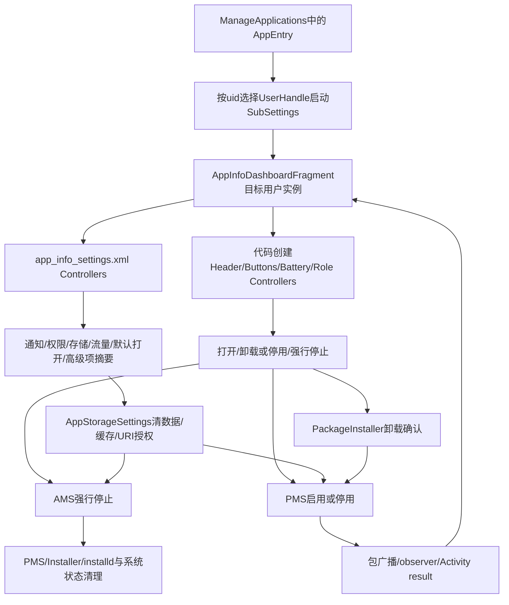
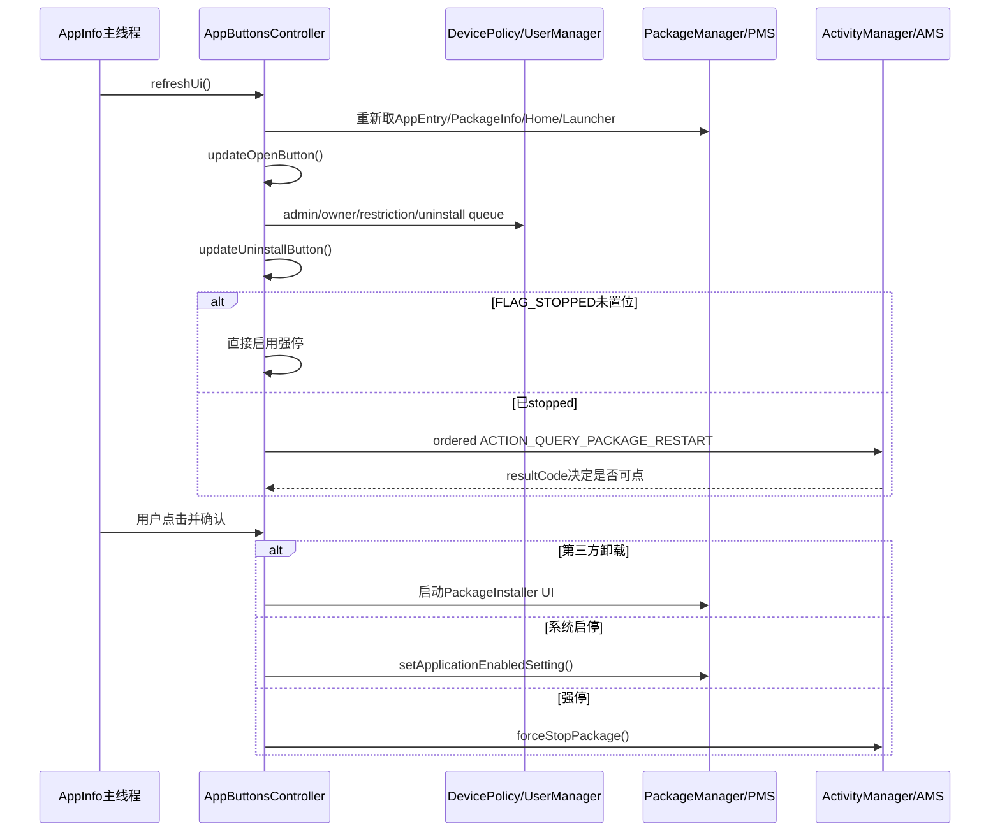
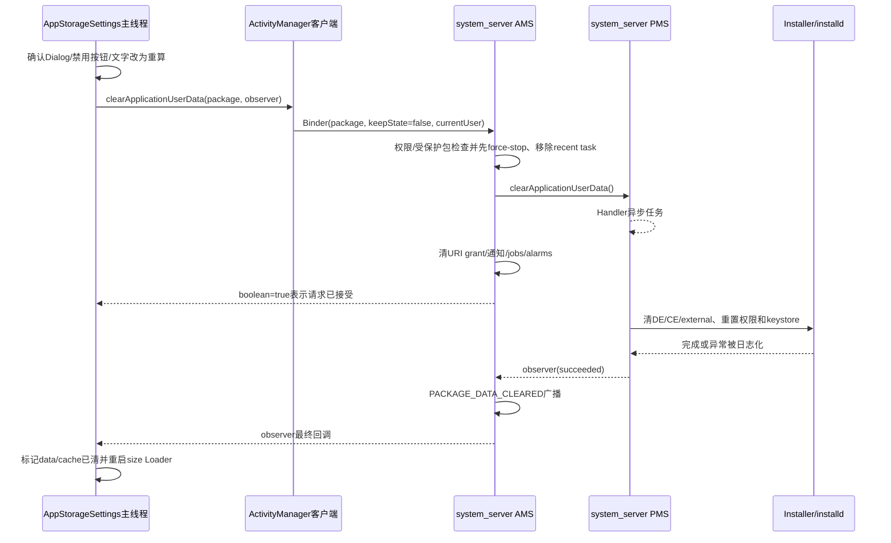

# 第532章 Android Settings应用详情完整链：AppInfoDashboard、Controller、卸载停用强停、清数据缓存、权限通知、默认打开与策略收口

> 源码基线：Android 11 / API 30 / `android-11.0.0_r48`。本章直接阅读`packages/apps/Settings/src/com/android/settings/applications/appinfo`、`packages/apps/Settings/src/com/android/settings/applications`、`frameworks/base/packages/SettingsLib`、`frameworks/base/core/java/android/app`、`frameworks/base/services/core/java/com/android/server/am`与`com/android/server/pm`。核心文件：`AppInfoDashboardFragment.java`、`AppButtonsPreferenceController.java`、`app_info_settings.xml`、`AppStorageSettings.java`、`AppStorageSizesController.java`、`AppLaunchSettings.java`、`ClearDefaultsPreference.java`、`ActivityManagerService.java`与`PackageManagerService.java`。只读源码，不在macOS上编译。

## 1. 本章解决什么问题

点进“应用信息”后，图标、通知、权限、存储和默认打开怎样拼成一页？“打开、卸载/停用、强行停止”三个按钮为什么会因系统包、桌面、设备管理或工作资料而变化？清缓存与清数据究竟删了哪些账？UI显示成功是否等于installd真的全部成功？本章从Settings页面一直追到AMS、PMS和PackageInstaller。

## 2. 一句话定位

`AppInfoDashboardFragment`不是亲自实现所有功能，而是应用详情的编排器：它维持目标包事实与页面生命周期，把XML Controller和代码 Controller按key装配，集中刷新摘要与操作按钮；真正的卸载交给PackageInstaller，启停交给PMS，强停和清数据入口交给AMS，存储统计与缓存删除再落到StorageStats/PMS/installd。

## 3. 先分八本账

至少要分清：`AppEntry`缓存账、最新`PackageInfo`事实账、Preference可见性账、ActionButtons文字/enable账、DevicePolicy/UserRestriction策略账、AMS运行态账、PMS安装/启停/数据账、异步请求与回调账。一个按钮“显示、可点、已发请求、服务接受、磁盘完成、页面已刷新”是六个不同状态。

## 4. 主详情与子详情不是一个Fragment

`AppInfoDashboardFragment`显示总览；点“存储”进入`AppStorageSettings`，点“默认打开”进入`AppLaunchSettings`，通知、权限和各种特殊访问又去各自页面。总览继承`DashboardFragment`，很多子页继承`AppInfoBase/AppInfoWithHeader`，因此取用户、监听包移除和刷新方式并不完全相同。

## 5. 页面不是由单一XML决定

`app_info_settings.xml`只声明Preference结构和一部分`settings:controller`；Header、普通/Instant按钮、电池、内存和五种默认角色快捷入口在`createPreferenceControllers()`中手动new。`onAttach()`再通过`use(Class)`取得XML Controller并注入package和parent。只看XML或只看Java都会漏一半。

## 6. 从列表点击到系统操作的总图



## 7. 进程、用户与线程边界

Dashboard与Controller在目标用户的Settings应用实例主线程运行；Loader、AsyncTask和ApplicationsState Loader负责部分后台查询。通知、角色、权限、ActivityManager、PackageManager、StorageStats、USB等通过Binder访问其他进程。PMS与AMS在system_server，数据目录操作再跨到installd；卸载确认UI属于PackageInstaller。

## 8. 目标用户在进入页面前已经确定

上一章的`AppInfoBase.startAppInfoFragment()`按entry uid构造UserHandle，`SubSettingLauncher`以该用户启动SubSettings。因此工作应用详情中的`UserHandle.myUserId()`就是工作userId。Dashboard虽然Bundle也收到`ARG_PACKAGE_UID`，却不靠它切换用户。

## 9. packageName有arguments与Intent data两种来源

Dashboard先读`arguments["package"]`；没有时，从arguments中的`intent`或宿主Intent的`package:` data取schemeSpecificPart。标准列表入口总会传package。r48在“arguments存在、package缺失、arguments intent存在但data为null”时直接解引用`getData()`，这个非标准入口可触发NPE；`AppInfoBase`同类代码反而检查了data是否为空。

## 10. Dashboard按当前用户重新取Entry

`retrieveAppEntry()`把`mUserId`设为`UserHandle.myUserId()`，调用`mState.getEntry(package,myUserId)`；然后重新向PackageManager取`GET_SIGNATURES|GET_PERMISSIONS`的PackageInfo。传进来的uid主要用于上一级选择目标用户，Dashboard本身不读取`ARG_PACKAGE_UID`。

## 11. PackageInfo与AppEntry承担不同责任

AppEntry提供State缓存的label、icon、flag、size与user身份；PackageInfo用于requestedPermissions、签名、overlayTarget、version和更完整的ApplicationInfo。Dashboard每次refresh都重新取二者，避免只靠列表点击时的旧快照。

## 12. PackageInfo查询失败可能保留旧对象

Dashboard的try成功会覆盖`mPackageInfo`，但catch只记录日志，没有显式置null。首次查询失败时字段本来为空，会正常退出；页面已运行后若一次刷新出现NameNotFound，旧PackageInfo可能残留并被后续Controller读取。`AppButtonsPreferenceController`的同类catch则会置null，两处行为不一致。

## 13. 两道真实性门先于页面交互

`ensurePackageInfoAvailable()`发现PackageInfo为空便`finishAndRemoveTask()`；`ensureDisplayableModule()`拒绝hidden system module。能通过ManageApplications筛选不代表一定能长期停留在详情，因为包可能刚卸载、正在重装或属于不可展示模块。

## 14. Dashboard自己也创建ApplicationsState Session

首次retrieve时获取Application级State并用Settings Lifecycle创建Session。它不rebuild列表，Callbacks大多为空，只对package list和目标package size变化调用refresh；但Session仍使用默认HOME、ICONS、SIZES、LAUNCHER flags，会参与上一章所述全局加载流水线。

## 15. Controller装配的关键源码

```java
@Override
public void onAttach(Context context) {
    super.onAttach(context);
    final String packageName = getPackageName();
    use(AppStoragePreferenceController.class).setParentFragment(this);
    use(AppNotificationPreferenceController.class).setParentFragment(this);
    use(AppPermissionPreferenceController.class).setParentFragment(this);
    use(AppPermissionPreferenceController.class).setPackageName(packageName);
    use(AppOpenByDefaultPreferenceController.class)
            .setPackageName(packageName)
            .setParentFragment(this);
}

@Override
protected List<AbstractPreferenceController> createPreferenceControllers(Context context) {
    retrieveAppEntry();
    if (mPackageInfo == null) return null;
    controllers.add(new AppHeaderViewPreferenceController(
            context, this, packageName, lifecycle));
    controllers.add(new AppButtonsPreferenceController(
            (SettingsActivity) getActivity(), this, lifecycle, packageName, mState,
            REQUEST_UNINSTALL, REQUEST_REMOVE_DEVICE_ADMIN));
    // 后面还有电池、内存与五种默认角色快捷入口
    return controllers;
}
```

第一组是“取已由XML创建的对象再注入”，第二组是“由Java直接创建”；最终仍按Preference key绑定到同一棵屏幕树。

## 16. Parent注入同时完成刷新订阅

`AppInfoPreferenceControllerBase.setParentFragment()`不仅保存mParent，还调用`parent.addToCallbackList(this)`。因此存储、通知、权限、默认打开、数据流量、版本、安装来源和高级项会在Dashboard refresh时集中`updateState()`；忘记setParent既会导致空parent，也会漏刷新。

## 17. Header是显式Callback

Header Controller是代码创建的唯一一个被直接加入mCallbacks的对象。它用`EntityHeaderController`绑定AppEntry label/icon与Instant标志，并在onStart把RecyclerView交给Header做ActionBar样式。头部没有操作按钮，三个主要操作位于独立`ActionButtonsPreference`。

## 18. AppButtons构造时就创建第二个State Session

Dashboard只要成功创建Controller列表，就会new `AppButtonsPreferenceController`；其构造器在判断可用性之前便调用`mState.newSession(this,lifecycle)`。所以普通、Instant和模块详情通常都有Dashboard Session与Buttons Session两个默认flags订阅；即使三按钮随后隐藏，第二个Session仍会随Lifecycle恢复，并可能触发State的pause/resume全量重查。

## 19. Instant与系统模块不使用普通三按钮

Buttons Controller对Instant app、system module或mainline module返回`DISABLED_FOR_USER`。这只会隐藏普通三按钮，不会撤销上一节已创建的Session。Instant改用`InstantAppButtonsPreferenceController`显示启动/安装/清数据；hidden module已在Dashboard直接退出，其他模块可以显示摘要但不展示普通打开、停用和强停按钮。

## 20. `isParalleledControllers()`不等于全页自动后台化

Dashboard返回true允许框架并行处理适用的Controller工作，但Dashboard自己的`refreshUi()`、mCallbacks循环、按钮决策以及许多Binder查询仍在主线程直接执行。不能看到“parallel”就断言通知、权限、角色和所有摘要都运行在同一个后台线程。

## 21. refreshUi是页面的集中重算点

它重新取Entry/PackageInfo、确保icon，逐个调用mCallbacks.refreshUi，再单独刷新可用的Buttons。首轮记录`mShowUninstalled`；后续若起点是已安装而现在FLAG_INSTALLED消失，返回false让页面退出。它刷新的是派生UI，不是系统操作事务。

## 22. 初始就是“本用户未安装”的包可以继续显示

owner通过MATCH_ANY_USER可能打开其他用户仍安装、当前用户未安装的包。第一次refresh若FLAG_INSTALLED=0，mShowUninstalled=true，页面以后不会仅因本用户未安装而退出；但包在所有用户都找不到时PackageInfo查询仍会失败并关闭。

## 23. ActionButtons三个位置并非固定三种语义

button1是“打开”且无Launcher Intent就隐藏；button2对第三方是卸载、对系统包是停用/启用；button3是强行停止。文字、图标、可见性和enabled分别设置，不能根据布局位置写死业务名称。

## 24. 打开按钮每次refresh重新解析Launcher Intent

`getLaunchIntentForPackage()`重新计算，避免组件启停后沿用旧Intent；没有入口便隐藏button1。点击使用`startActivityAsUser(mAppLaunchIntent,new UserHandle(mUserId))`，这里mUserId来自目标Settings实例，所以工作应用仍在工作资料启动。

## 25. Auto-Revoke入口额外记录sessionId

宿主Intent中以`Intent.ACTION_AUTO_REVOKE_PERMISSIONS`这个字符串作为long extra key，非0时认为从自动撤权流程进入；打开或移除应用会写StatsLog。字段名像action但此处也被当作extra key，阅读时不要混成仅靠Intent action判断。

## 26. 卸载/停用按钮先决定“包类型”

`FLAG_SYSTEM`决定走`handleDisableable()`还是普通卸载规则。updated system app同时也是system app，因此主按钮首先呈现停用语义；“卸载更新”另有Options Menu。按钮决策不是简单的`system ? disable : uninstall`，后面还叠加admin、owner、Home、overlay、provisioning与restriction。

## 27. 系统包的核心保护集合

如果目标是Home包或`Utils.isSystemPackage()`识别的核心系统包，button2文字仍显示“停用”，但`handleDisableable()`返回false。OEM的`ApplicationFeatureProvider.getKeepEnabledPackages()`还可以禁止其他系统包被停用。

## 28. 打开、卸载/停用与强停的决策时序



## 29. Home包集合还包含签名可信的代理包

Controller读取所有Home activities，将Activity包加入mHomePackages；若metadata声明`ActivityManager.META_HOME_ALTERNATE`，只有代理包与Home包签名匹配才加入。这样OEM代理Home也得到同等保护，单看Launcher category会漏掉它。

## 30. 第三方Home卸载需要保留可用桌面

系统Home一律不允许主按钮卸载/停用。第三方Home若当前没有显式默认，只有候选Home超过一个才允许卸载；若已有默认，只禁止卸载当前默认Home，其他未激活Home可以卸载。

## 31. Device Owner与Profile Owner按系统包区别处理

系统包的“卸载”可能实际降级并影响多用户数据，因此只要它在任一用户是DO/PO就禁用。非系统包只检查调用用户上的DO/PO身份，因为按当前用户卸载没有同样的设备级降级后果。

## 32. Device provisioning与卸载队列是独立门

资源指定的设备配置包不能卸载；DPM已把包放入卸载队列时按钮也禁用。这两项与active admin不同：active admin会在点击时先引导移除管理权限，provisioning包和queued uninstall则直接不允许重复操作。

## 33. Resource Overlay有自己的安全规则

system/vendor overlay永不可卸载；data分区public overlay只有在disabled时可卸载。若非系统overlay当前enabled且target entry存在，按钮被禁用，避免删除正在参与资源解析的overlay。查询按entry uid对应UserHandle进行。

## 34. Active admin的“禁用”与点击路径并不完全相同

updateUninstallButton只在“系统包且有active admin”时直接禁用button2；第三方active admin按钮仍可点，点击后进入`DeviceAdminAdd`移除管理员，再根据activity result刷新。代码注释说device admin不能卸载/停用，但实际UI设计是允许先解除第三方管理身份。

## 35. 策略限制要区分admin来源与base restriction

`checkIfRestrictionEnforced()`返回具体管理员时，UI通常跳管理员支持说明；`hasBaseUserRestriction()`表示系统基础限制，不应伪装成某个管理员。Buttons对`DISALLOW_APPS_CONTROL`保存这两个结果：base restriction直接禁button，admin restriction保留点击并展示说明。

## 36. r48把包名误当成restriction key

点击卸载时，代码计算`uninstallBlockedBySystem`，第二项是`hasBaseUserRestriction(mActivity, packageName,mUserId)`。API第二个参数应是`DISALLOW_UNINSTALL_APPS`一类restriction字符串，却传了`com.example.app`。因此这个本地分支几乎不可能正确识别“系统基础禁止卸载”；最终PackageInstaller/PMS仍是安全权威，但Settings可能给出错误按钮或错误说明路径。

## 37. enabled与`DISABLED_UNTIL_USED`要一起判断

系统包只有`info.enabled=true`且enabledSetting不是DISABLED_UNTIL_USED才弹“停用”；否则点击相当于启用，状态写回DEFAULT。`enabled=true`并不必然代表按钮应该显示停用，显式的until-used状态是额外维度。

## 38. 启用/停用使用后台Runnable但没有完成回调

确认后`AsyncTask.execute()`调用`PackageManager.setApplicationEnabledSetting(package,DISABLED_USER或DEFAULT,0)`。UI没有observer、没有try/catch、也不立即修改AppEntry；它依靠PMS发PACKAGE_CHANGED，再由ApplicationsState invalidation和页面refresh观察最终状态。

## 39. PMS启停不是只改一个boolean

PMS校验`CHANGE_COMPONENT_ENABLED_STATE`、跨用户权限与protected package，写每用户PackageSetting并异步持久化restrictions；flags为0意味着立即发PACKAGE_CHANGED且允许杀应用。AMS收到组件变化还会清理disabled Activity、Service、Provider与Receiver。Settings的后台Runnable只是系统链入口。

## 40. `mUpdatedSysApp`在Buttons中从未赋值

Controller声明`mUpdatedSysApp=false`，点击系统包时用它判断是否走SPECIAL_DISABLE，但本类r48没有任何赋值点。Dashboard有一个同名字段在Options Menu中赋值，那是另一个对象，不能共享。因此主按钮的“单用户updated system先卸载更新再停用”分支按源码不可达。

## 41. SPECIAL_DISABLE设计的是两阶段动作

理论路径先启动卸载更新，并设置`mDisableAfterUninstall=true`；Uninstaller返回后再异步写`DISABLED_USER`。这两个动作不是事务：降级成功而后续停用失败时没有回滚，也没有针对setEnabled异常的结果。由于上一节的字段未赋值，r48实际主要通过Options Menu单独卸载更新。

## 42. 普通卸载只负责启动PackageInstaller

Settings构造`ACTION_UNINSTALL_PACKAGE`与`package:` URI，附带`EXTRA_UNINSTALL_ALL_USERS`，然后`startActivityForResult()`。真正的调用者鉴权、确认对话框、是否删除所有用户、系统更新降级、数据与广播处理在PackageInstaller/PMS；Settings此刻不能声称卸载成功。

## 43. 未为当前用户安装时主按钮请求allUsers

第三方entry若当前`FLAG_INSTALLED=0`，点击使用`allUsers=true`，因为当前用户已无本地安装态可移除，意图是删除其他用户剩余安装。若当前已安装则默认仅卸载当前用户；“所有用户卸载”菜单另行判断是否显示。

## 44. “为所有用户卸载”菜单有七道门

updated system、system app、active admin、非user 0、用户数少于2、安装用户数不足条件和Instant app任一命中都隐藏。若当前用户本就未安装，即使全设备只剩一个其他用户安装，也可显示all-users删除入口；这是为owner ghost详情服务，不是计数错误。

## 45. user 0硬编码不等于所有admin user

菜单判断使用`UserHandle.myUserId()!=0`，不是`UserManager.isAdminUser()`。在普通手机owner就是0；在headless system user或更复杂用户模型中，“有管理员能力”与“编号0”并不总等价，r48这里采用的是更窄的历史假设。

## 46. “卸载更新”菜单与主按钮是两套状态

Dashboard在`onPrepareOptionsMenu()`重新根据`FLAG_UPDATED_SYSTEM_APP`、admin user、`DISALLOW_APPS_CONTROL` base restriction和资源`config_disable_uninstall_update`决定可见；管理员restriction则把MenuItem标为disabled-by-admin。它不使用Buttons Controller那枚从未赋值的字段。

## 47. 两个菜单动作共用同一个requestCode

卸载当前用户、所有用户以及卸载系统更新都以`REQUEST_UNINSTALL=0`返回。Dashboard只知道这是一次Uninstaller结果并刷新Options Menu，再把结果委托给Buttons；它不从requestCode区分用户到底选择了哪种删除范围。

## 48. Uninstaller返回不等于包一定被删

Buttons的`handleActivityResult()`忽略resultCode，直接`refreshAndFinishIfPossible()`。它重新查包：若仍存在就重新注册remove receiver，若不存在才返回`APP_CHG=true`并关闭。取消卸载与卸载失败也会走同一刷新路径，不用resultCode猜成功。

## 49. Dashboard包移除Receiver会结束整个task

页面监听`ACTION_PACKAGE_REMOVED`，目标包被移除便先finish子详情，再`finishAndRemoveTask()`。如果当前AppEntry为空或info为空，任何包移除都会被视为页面已失去可靠目标并关闭；overlay target被移除则不关闭，而是刷新overlay详情。

## 50. Receiver没有忽略升级中的replacing

Dashboard、AppInfoBase和Buttons自己的remove receiver均未检查`Intent.EXTRA_REPLACING`。应用更新先发remove再add时，打开的详情任务可能在remove阶段直接关闭。这个行为与ApplicationsState在升级中短暂remove/add一致。

## 51. Buttons的第二个remove receiver只在结果后启动

Buttons构造或onResume并不立即注册它；启动Uninstaller前反而停止监听，返回后若包还存在才重新注册。Dashboard自己的Receiver始终覆盖主页面，所以这里的重复Receiver主要服务Controller独立收口，且其callback直接解引用mAppEntry，没有Dashboard那样的null防护。

## 52. 强停按钮先判断是否值得执行

active admin直接禁用；若`FLAG_STOPPED`未置位，说明应用尚未处于显式stopped状态，按钮直接可用。若已stopped，Settings发`ACTION_QUERY_PACKAGE_RESTART`有序广播，让系统组件回答是否仍存在可清理运行态；初始resultCode是CANCELED。

## 53. `FLAG_STOPPED`不是“进程当前不存在”

它是PMS每用户package stopped state，常由首次安装未启动、强停等改变。进程碰巧被LMKD杀掉不等于FLAG_STOPPED；反过来stopped包也可能仍有系统侧残留要清理，所以代码才在stopped时继续询问restart status。

## 54. QUERY_PACKAGE_RESTART只试算不执行

AMS内置Receiver调用`forceStopPackageLocked(...,doit=false)`，检查进程、Activity、Service、Provider等是否有可处理对象；若有就把ordered result设为OK。其他PackageMonitor也可通过`onHandleForceStop(...,doit=false)`参与。最终Receiver只据result是否非CANCELED启用按钮。

## 55. 工作资料restart查询存在user错位

Settings用`sendOrderedBroadcastAsUser(intent,UserHandle.CURRENT,...)`，虽在extras写了entry uid和userId，AMS r48内置Receiver却忽略这些extras，并把`forceStopPackageLocked`的userId硬编码为0。常见个人用户前台时，工作资料里已stopped应用的按钮可能查询到owner用户的运行态；这是源码层明确的不对称。

## 56. restart result callback没有生命周期代际

`mCheckKillProcessesReceiver`是ordered broadcast最终Receiver，Controller销毁时没有取消这次回调或记录请求编号。页面退出后回调仍可能尝试读取mAppEntry并修改mButtonsPref；正常广播很快完成，但类型本身没有防陈旧机制。

## 57. 点击强停还要经过确认与策略说明

如果`DISALLOW_APPS_CONTROL`来自admin而非base restriction，点击先打开管理员说明；否则显示FORCE_STOP确认Dialog。Dialog仅把类型回传target Fragment，真正调用仍在Controller的`handleDialogClick()`，避免Dialog自己持系统服务状态。

## 58. Settings到AMS强停的关键源码

```java
// Settings: 用户确认后
ActivityManager am = (ActivityManager) mActivity.getSystemService(
        Context.ACTIVITY_SERVICE);
am.forceStopPackage(pkgName);
mState.invalidatePackage(pkgName, UserHandle.getUserId(mAppEntry.info.uid));

// ActivityManager: 使用Context的userId跨Binder
public void forceStopPackage(String packageName) {
    forceStopPackageAsUser(packageName, mContext.getUserId());
}

// AMS: 先把每用户package置为stopped，再执行运行态清理
pm.setPackageStoppedState(packageName, true, user);
if (mUserController.isUserRunning(user, 0)) {
    forceStopPackageLocked(packageName, pkgUid, "from pid " + callingPid);
    finishForceStopPackageLocked(packageName, pkgUid);
}
```

这里有两次“完成”：Binder方法返回表示AMS同步路径已走完，随后PACKAGE_RESTARTED广播让其他组件清自己的状态；它不是仅发送kill信号就返回。

## 59. AMS强停清的不只是进程

核心函数杀目标package进程，通知ATMS移除/收口Activity，bring down Services，移除Providers与临时URI grant，清广播队列，并恢复top Activity；公开forceStop入口先设PMS stopped state，完成后发`ACTION_PACKAGE_RESTARTED`。普通强停不会像卸载那样无条件删除PendingIntent，源码仅在packageName为空或uninstalling时删。

## 60. protected package仍由system_server最终裁决

AMS若`isPackageStateProtected(package,user)`为true，会记录并忽略强停请求；PMS也拒绝禁用protected package。Settings本地按钮规则不等于安全边界，而且`forceStopPackage()`返回void，页面不能直接知道服务端是否忽略，只能invalidate Entry后重新观察状态。

## 61. 强停后State采用remove-add式失效

Settings调用`mState.invalidatePackage()`，State先删旧AppEntry和ApplicationInfo，再向PMS取新ApplicationInfo并重建；紧接着`getEntry()`若尚未有对象，会同步用新info创建。因此stable id、icon、extraInfo和size都换新，而Controller只在new entry非null时替换自己的mAppEntry。

## 62. 通知摘要是同步重建AppRow

`AppNotificationPreferenceController.updateState()`直接用`NotificationBackend.loadAppRow()`加载总开关、channel数量、blocked数量和最近发送状态。全部禁用显示“通知已关闭”；部分channel关闭会拼“发送情况 + N个类别关闭”；无channel则只显示发送摘要。Dashboard refresh时这条链可发生Binder查询。

## 63. 权限、通知与子详情的刷新图

通知、默认打开等继承`AppInfoPreferenceControllerBase`，点击由base统一用package/uid启动目标Fragment；权限是例外，它显式发`ACTION_MANAGE_APP_PERMISSIONS`到PermissionController。子页返回后Dashboard的onResume和State/package callbacks重新计算摘要，不把子页返回Intent当作全部事实。

## 64. 权限摘要来自PermissionController进程

`PermissionsSummaryHelper`通过`PermissionControllerManager.getAppPermissions()`异步获取`RuntimePermissionPresentationInfo`，统计返回的权限展示条目数、标准/附加授权数，再用当前locale Collator排序已授权组名。这里不是直接数Manifest中的原始permission字符串。0个展示条目会禁用Preference；有条目但0个已授权仍可点击进入权限页。

## 65. 权限摘要callback没有请求编号

每次`updateState()`都可发一次异步请求，回调直接访问当前mPreference，没有package/result generation，也不检查Controller是否已stop；onStop只移除`OnPermissionsChangedListener`，不会取消已经提交给PermissionController的查询。目标package在本页固定，主要风险是销毁附近的迟到UI回调和重复请求。

## 66. 权限变化监听按uid触发但不先过滤uid

`OnPermissionsChangedListener`收到任意uid都调用`updateState(mPreference)`，没有判断是否等于目标应用uid。系统中其他应用权限变化也可能让本页多发一次目标包摘要查询；结果正确，只是范围比需要的更宽。

## 67. 权限点击保留Auto-Revoke追踪链

Controller发`ACTION_MANAGE_APP_PERMISSIONS`，附package与`hideInfoButton=true`。若父Activity action或extra表示Auto-Revoke，会沿用sessionId；没有有效id时循环生成非0随机long，再传给PermissionController，便于把权限页行为与自动撤权提示关联。

## 68. 存储总览摘要有独立Loader

`AppStoragePreferenceController`在onResume重启`LOADER_STORAGE`，以目标AppEntry的volume/package和`UserHandle.myUserId()`查询StorageStats。结果未到显示“正在计算”，到达后显示`stats.totalBytes + internal/external`；onPause销毁Loader但保留mLastResult字段。

## 69. Dashboard的size callback与存储Loader不是同一条链

Dashboard实现ApplicationsState的`onPackageSizeChanged()`，目标包匹配便整页refresh；存储摘要Controller又用`FetchPackageStorageAsyncLoader`直接查询StorageStats。两条路径可能先后更新，且上一章State自动size与这里的StorageStats结果/缓存口径也不应强行视为同一缓存。

## 70. 点“存储”进入AppInfoBase体系

`AppStorageSettings`继承`AppInfoWithHeader→AppInfoBase`，会再创建自己的State Session，并从当前用户/可选Intent user handle取得Entry。Header带返回AppInfo链接；页面自己维护size Controller、清理按钮、卷迁移与URI grant，不再由Dashboard Controllers管理。

## 71. 存储页显示四个数

`AppStorageSizesController`把code记为“应用”，`data-cache`记为“数据”，cache单列，总计再相加。`StorageStats.getDataBytes()`本身包含cache，因此必须相减；Dashboard总览则直接使用`getTotalBytes()`。字段名相近但展示公式不同。

## 72. “刚清理后显示0”是UI期望修正

清缓存或数据完成后，空目录仍占少量字节。Controller用`mCacheCleared/mDataCleared`强制把对应显示值归0，匹配用户预期；这些boolean会跨配置保存。它们不是StorageStats事实，也不会因以后应用重新产生数据自动重置。

## 73. Clear flags可能让后来真实增长继续显示0

一旦mCacheCleared为true，`updateUi()`永远取cache=0；mDataCleared为true则data/cache都取0，直到离开并重建Fragment。若应用在页面仍存活期间很快重新写数据，新Loader结果也会被这层UI标志压成0，这是有意的短期视觉策略但不是实时精确值。

## 74. 清缓存入口直接调用PackageManager

按钮先处理admin restriction，随后懒建`IPackageDataObserver.Stub`，调用`deleteApplicationCacheFiles(package,observer)`。ApplicationPackageManager把当前Context userId隐式传给PMS，因此工作资料页面会清工作用户缓存；Settings不先强停应用。

## 75. PMS清cache做了cache与code-cache两次清理

PMS在自己的Handler异步执行，对DE、CE和external storage分别以`FLAG_CLEAR_CACHE_ONLY`、`FLAG_CLEAR_CODE_CACHE_ONLY`调用Installer。它明确允许应用继续运行，所以清理与应用新建缓存可并发，observer到达时不保证目录仍保持绝对空。

## 76. r48的cache observer几乎总报告true

`clearAppDataLIF()`遇到pkg null只wtf并return，InstallerException也只日志；外层无论是否实际完成，最后都调用`observer.onRemoveCompleted(package,true)`。因此Settings收到的“成功”更像PMS任务已执行到尾，而不是每个存储位置都经校验删除成功。

## 77. Settings连observer false也会标记已清缓存

`ClearCacheObserver`把succeeded写入msg.arg1，但Handler的MSG_CLEAR_CACHE完全不检查arg1，直接`mCacheCleared=true`并重查size。即便测试替身或未来服务明确返回false，页面仍会把cache显示强制归0；这是UI回调处理的独立缺陷。

## 78. 清数据按钮先判断能否交给应用自己的管理页

存在`ApplicationInfo.manageSpaceActivityName`时，点击启动该Activity；否则弹系统“清除所有数据”确认。系统包未声明`FLAG_ALLOW_CLEAR_USER_DATA`或目标有active admin时不允许系统清数据；mainline module与base `DISALLOW_APPS_CONTROL`还会同时禁清数据和清缓存。

## 79. r48把“管理空间”文字又覆盖回“清除数据”

`initDataButtons()`在manage-space分支先`setButton1Text(manage_space_text)`，但分支结束后又无条件执行`setButton1Text(clear_user_data_text)`。点击Listener仍会打开应用管理空间Activity，屏幕文字却显示清数据；这是可以直接由源码证明的UI语义错位。

## 80. 清数据从按钮到系统服务的时序



## 81. 清数据“接受”与“完成”的关键源码

```java
// Settings：boolean只表示AMS接受请求
boolean res = am.clearApplicationUserData(packageName, mClearDataObserver);
if (!res) {
    showDialogInner(DLG_CANNOT_CLEAR_DATA, 0);
} else {
    mButtonsPref.setButton1Text(R.string.recompute_size);
}

// AMS：PMS异步清磁盘，同时清其他系统账
pm.clearApplicationUserData(packageName, localObserver, resolvedUserId);
mUgmInternal.removeUriPermissionsForPackage(packageName, resolvedUserId, true, false);
NotificationManager.getService().clearData(packageName, appInfo.uid,
        uid == appInfo.uid);
js.cancelJobsForUid(appInfo.uid, "clear data");
ami.removeAlarmsForUid(appInfo.uid);

// PMS：真正工作排入Handler，最终才通知observer
mHandler.post(() -> {
    succeeded = clearApplicationUserDataLIF(packageName, userId);
    observer.onRemoveCompleted(packageName, succeeded);
});
```

把第一个boolean叫“清理完成结果”会误导；真正完成点是后面的observer。

## 82. AMS先强停并移除最近任务

清数据前AMS对app uid调用内部force-stop，并让ATMS按package移除recent tasks。这样进程不会继续持有将被删除的数据；PMS observer回来时再finish force-stop并发`ACTION_PACKAGE_DATA_CLEARED`。它比单独“清缓存”的副作用大得多。

## 83. 清数据同时重置多套系统状态

PMS重置runtime permissions，清DE/CE/external私有数据与ART profiles、清对应keystore uid并重建必要数据目录；AMS在`keepState=false`时移除双向URI grants、重置通知状态、取消uid jobs与alarms。文档所说“清数据”不是只删除`/data/user/.../files`。

## 84. OBB与APK不会因清数据删除

ActivityManager API注释明确：安装包仍保留，OBB也不删除。之后应用仍可重新启动并像首次运行一样建数据。Instant app的“清数据”实现不同，后文会看到它直接走`deletePackageAsUser()`删除instant package状态。

## 85. 清数据不是跨AMS/PMS的原子事务

AMS把PMS异步清理排队后，立即清URI、通知、jobs、alarms；若PMS后续磁盘处理失败，这些系统状态不会回滚。更深一层，PMS的`clearAppDataLIF()`捕获InstallerException只打印，而`clearApplicationUserDataLIF()`随后仍返回true，因此observer成功也不证明每个目录删除无误。

## 86. Settings在clear-data失败时也先置两个cleared标志

MSG_CLEAR_USER_DATA无条件先设`mDataCleared=true`和`mCacheCleared=true`，再由`processClearMsg()`查看msg.arg1。失败只重新enable button，不清回两个标志；后续size刷新会继续把data/cache显示为0。测试或异常服务返回false时，UI可能与事实相反。

## 87. View销毁时完成消息会被直接丢掉

Handler收到observer消息先检查`getView()==null`并return，没有保存pending结果或在重建View后补处理。系统操作仍已执行，但mDataCleared、按钮文字和size重查都可能遗漏；配置切换虽保存已有flags，却保存不了尚未被Handler消费的Binder完成事件。

## 88. Loader失败会禁用两个清理按钮

`FetchPackageStorageAsyncLoader`捕获NameNotFound/IOException并返回null；`updateUiWithSize(null)`让四个size显示错误/计算态，并禁用清数据、清缓存。它不会用ApplicationsState旧size兜底，避免在无法确认数据量时让用户执行高风险操作。

## 89. 管理空间Activity的resultCode没有被处理

页面用`startActivityForResult(REQUEST_MANAGE_SPACE)`启动应用自带管理页，但AppStorageSettings没有覆盖onActivityResult处理此request。返回后依靠Fragment onResume调用`updateSize()`观察变化；应用返回什么resultCode都不影响逻辑。

## 90. 普通应用清数据可用性意外依赖通用VIEW解析

代码先建`new Intent(Intent.ACTION_DEFAULT)`，而ACTION_DEFAULT就是ACTION_VIEW；只有存在manageSpaceActivity时才setClassName。普通应用无管理页时，`isManageSpaceActivityAvailable`其实在解析一个无data的通用VIEW Intent。若设备没有可解析Activity，清数据也会被禁用；正确性依赖设备通常存在VIEW处理者。

## 91. `mCanClearData=false`在本Fragment内不会恢复

一旦一次`initDataButtons()`判定不可清，字段设false；后续刷新即使条件理论上改变也没有重置true。目标包通常固定、active admin等变化又可能在页面存活期发生，所以这是保守但偏黏滞的状态机。

## 92. URI授权清理是另一项独立操作

存储页列出目标包持有的持久URI grants，按Provider所属应用label分组计数。点击同步调用`ActivityManager.clearGrantedUriPermissions(package)`，再立即重建UI；这不等同于清runtime permission，也不等同于清数据时AMS的双向URI grant清理范围。

## 93. 存储卷迁移只启动向导

若PackageManager返回多个candidate volume，页面显示“更改”并启动`StorageWizardMoveConfirm`；它通过`checkPackageStartable()`的SecurityException粗略判断是否正迁移。Settings详情页不执行move、不跟踪进度事务，返回后靠卷描述与包状态刷新。

## 94. “默认打开”摘要合并多种默认关系

Dashboard的AppOpenByDefault Controller隐藏Instant与browser应用的这行；普通应用摘要由`AppUtils.getLaunchByDefaultSummary()`综合preferred activities、domain verification、USB defaults等。点入`AppLaunchSettings`后还可看域名与清除默认值。

## 95. ClearDefaults一次清四类状态

按钮调用`clearPackagePreferredActivities()`；若目标是默认浏览器则清默认browser；调用USB service清USB defaults；最后撤销AppWidget bind permission。UI根据preferred/browser/USB/widget四者是否任一存在，决定“清除默认设置”按钮是否可用。

## 96. USB service为空会让其他三类也不清

四项清理全部包在`if (mUsbManager != null)`内部。理论上USB Binder不可用时，连PackageManager preferred、默认browser和AppWidget permission都不会清，也没有错误提示。这不是“只跳过USB清理”，是r48控制流的整体短路。

## 97. 浏览器隐藏域名UI但仍可能有默认状态

`AppLaunchSettings`对browser禁用app-link state与domain列表，因为浏览器角色有单独语义；Dashboard也隐藏整条“默认打开”。默认浏览器是否为目标仍可被ClearDefaults内部检查并清掉，展示路径与底层默认账不能简单一一对应。

## 98. 数据用量摘要选择一种网络模板

Controller优先mobile wildcard，其次Wi-Fi，最后Ethernet，加载目标uid多个cycle并累加total usage，起始日期取最早cycle。它不是同时把三种网络模板相加；设备有移动网络时摘要代表所选mobile模板范围，点入详情再看更丰富维度。

## 99. 电池摘要按BatterySipper uid匹配

Loader取得BatteryStatsHelper，在usage list中按PackageInfo uid找sipper，去除隐藏项后计算相对电量百分比。找不到sipper仍会启用Preference并显示“无电池使用”；点击时有统计走完整AdvancedPowerUsageDetail，没有统计则只按package启动简化详情。

## 100. 内存项默认资源关闭且还要求开发者选项

`config_show_app_info_settings_memory`在AOSP默认false；即使OEM打开，还要求Development Settings启用。MemoryUpdater用AsyncTask扫描ProcStats，没有onPause取消或generation；只在onPostExecute检查Activity是否为空，页面暂停但Activity尚在时仍可更新不可见Preference。

## 101. “在应用中花费的时间”要求系统处理者

Controller查询`Settings.ACTION_APP_USAGE_SETTINGS`，只有至少一个system app Activity可处理才显示，避免把用户引到不可信第三方。摘要由`ApplicationFeatureProvider.getTimeSpentInApp()`在LiveDataController后台计算，点击Intent带目标package。

## 102. 五种默认应用快捷方式由Role系统决定

Home、Browser、Dialer、Emergency、SMS共用Base Controller。构造时分别异步问RoleController“该role是否可见”和“目标app是否可作为该role显示”，两个结果都true才出现；managed profile全部隐藏。摘要只显示目标是不是当前role holder。

## 103. Role异步可见性有两次独立回调

初始两个boolean都是false，Preference先不可见；任一主线程callback到达都调用refreshAvailability，第二个结果到达才可能显示。没有请求代际或销毁取消，但目标package固定；`isDefaultApp()`只取role holders的第一项，适合这些通常排他的role，不是通用多holder判断。

## 104. 安装来源行分“有label”与“有商店链接”

onAttach时先取installer package与label；没有label、managed profile或mainline module就不显示。即使有label，`AppStoreUtil.getAppStoreLink()`可能返回null，此时行仍可出现但被disabled；installer在页面存活期变化时字段不会主动重新计算。

## 105. “应用内设置”只接受目标包内解析结果

Controller发`ACTION_APPLICATION_PREFERENCES`并先`setPackage(target)`解析，随后把ResolveInfo转换成显式Component再启动。它不会让其他包冒充该应用设置入口；Context已经属于目标用户，所以不额外调用startActivityAsUser。

## 106. Version行是只读且可复制

XML把app_version放在末尾、不可点击、允许复制；Controller用BidiFormatter包裹versionName再拼“版本”。PackageInfo为null时页面已被真实性门关闭，所以这里没有独立null fallback。

## 107. Advanced分类按子Controller可用性收缩

悬浮窗和写系统设置要求包在requestedPermissions声明相应权限，并在managed profile隐藏；PIP要求设备feature且包有PIP Activity；未知来源要求是潜在安装源；跨资料交互询问CrossProfileApps。Category Controller根据children可用性决定整组是否保留。

## 108. 同一个extraInfo并未用于Dashboard高级摘要

ManageApplications特殊访问列表依赖Bridge写AppEntry.extraInfo；Dashboard里的高级Controller通常直接查PackageInfo、AppOps或专用Details静态方法。两处显示同一权限状态，但数据获取策略不同，不能要求列表Bridge缓存一定先存在。

## 109. Instant按钮是另一套删除模型

Instant页面可按manifest metadata的`default-url`启动Instant Activity，或跳商店安装；“清除Instant应用数据”确认后直接`PackageManager.deletePackageAsUser(package,null,0,myUserId)`，observer传null。它更接近删除当前用户instant package状态，不走AppStorageSettings的clearApplicationUserData observer链。

## 110. 包变化有三条回流路径

ApplicationsState发`onPackageListChanged()`触发Dashboard/Buttons refresh；详情页直接PACKAGE_REMOVED Receiver负责立即退出；卸载Activity result负责恢复监听、菜单和结束判断。它们可能针对同一事件重复到达，代码靠重新查询事实与mFinishing，而不是只消费一次事件。

## 111. r48关键边界集中复盘

Dashboard不读ARG_UID；PackageInfo刷新异常可留旧对象；详情有两个默认flags Session；base卸载restriction把包名当key；Buttons的updated-system字段从未赋值；remove不忽略replacing；工作资料restart查询落到user0；强停void不报告protected忽略；manage-space文字被覆盖；cache/data失败仍置cleared；Handler在View销毁时丢完成；PMS吞Installer异常仍可能报成功；USB为空短路全部ClearDefaults。

## 112. macOS只读练习一：画出Controller装配表

```bash
sed -n '95,285p' packages/apps/Settings/src/com/android/settings/applications/appinfo/AppInfoDashboardFragment.java
sed -n '1,220p' packages/apps/Settings/res/xml/app_info_settings.xml
rg -n 'settings:controller|controllers.add|use\(' packages/apps/Settings/res/xml/app_info_settings.xml packages/apps/Settings/src/com/android/settings/applications/appinfo/AppInfoDashboardFragment.java
```

按Preference key列出“XML创建/Java创建、谁setPackageName、谁setParent、是否加入mCallbacks、点击目标”。特别说明Header、Buttons、电池和五种Role为何在XML中没有controller属性。

## 113. macOS只读练习二：手算三个主按钮

```bash
sed -n '170,315p' packages/apps/Settings/src/com/android/settings/applications/appinfo/AppButtonsPreferenceController.java
sed -n '377,610p' packages/apps/Settings/src/com/android/settings/applications/appinfo/AppButtonsPreferenceController.java
sed -n '645,785p' packages/apps/Settings/src/com/android/settings/applications/appinfo/AppButtonsPreferenceController.java
```

分别推演普通第三方、当前默认Home、updated system、active admin、enabled overlay、工作资料stopped应用。指出文字、enabled、点击分支、Dialog与最终系统服务，并证明mUpdatedSysApp与base restriction两处r48边界。

## 114. macOS只读练习三：比较清缓存与清数据

```bash
sed -n '185,410p' packages/apps/Settings/src/com/android/settings/applications/AppStorageSettings.java
sed -n '538,628p' packages/apps/Settings/src/com/android/settings/applications/AppStorageSettings.java
sed -n '4210,4345p' frameworks/base/services/core/java/com/android/server/am/ActivityManagerService.java
sed -n '19435,19635p' frameworks/base/services/core/java/com/android/server/pm/PackageManagerService.java
```

画两张时序表，列出目标user来源、是否强停、清哪些账、哪个返回值只表示接受、哪个observer表示结束、异常是否上抛，以及Settings何时把显示强制为0。

## 115. macOS只读练习四：验证默认打开与包事件收口

```bash
sed -n '1,190p' packages/apps/Settings/src/com/android/settings/applications/AppLaunchSettings.java
sed -n '80,210p' packages/apps/Settings/src/com/android/settings/applications/ClearDefaultsPreference.java
sed -n '520,680p' packages/apps/Settings/src/com/android/settings/applications/appinfo/AppInfoDashboardFragment.java
sed -n '268,305p' packages/apps/Settings/src/com/android/settings/applications/AppInfoBase.java
```

列出ClearDefaults四套状态与USB Binder为空时的实际控制流；再模拟PACKAGE_REMOVED(replacing=true)、普通卸载完成和overlay target移除，判断Dashboard、AppInfoBase分别关闭还是刷新。

## 116. 调试“卸载/停用按钮灰掉”的顺序

先确认Buttons Controller是否available（Instant/module）；区分system与third party；检查core system、Home与keep-enabled；再查active admin、DO/PO、provisioning、DPM卸载队列、resource overlay；最后查base/admin restriction。不要只看`ApplicationInfo.enabled`，也不要把服务端SecurityException当作UI规则的替代说明。

## 117. 调试“清完数据数字没变或错误归0”的顺序

先分清点击进入manage-space还是系统clear-data；记录AMS boolean与IPackageDataObserver回调；查View是否已销毁导致消息丢失；再看mDataCleared/mCacheCleared是否无条件置true；最后到AMS/PMS/installd日志确认目录、权限、通知、jobs与alarms各账。只看一行StorageStats不足以证明全链成功。

## 118. 现有测试没有覆盖全部系统边界

Dashboard测试覆盖菜单、package缺失、hidden module、size callback和receiver注销；Buttons测试覆盖主要enable矩阵、forceStop调用与result收口；AppStorage测试只覆盖有无size及mainline按钮。它们没有覆盖mUpdatedSysApp无赋值、restriction误传包名、工作资料restart user0、manage-space文字覆盖、observer false仍置cleared或Installer异常被吞。

## 119. 本章最终心智模型

把应用详情理解为“事实聚合器 + 操作路由器”：Dashboard读取目标用户package事实，Controller把事实投影成摘要和按钮；用户动作跨Binder后由PackageInstaller、AMS、PMS、PermissionController等分别拥有真实状态；Activity result、observer、包广播和下一次查询只是不同完成信号。安全判断以系统服务为最终权威，UI判断负责解释和提前阻止。

## 120. 下一章预告

第533章将沿通知入口深入`NotificationBackend`、`AppNotificationSettings`、Channel/Group、总开关、重要性、conversation/bubble与NotificationManagerService持久化链，继续辨别“Settings摘要”“Binder配置已写入”和“通知实际可投递”三个层次；仍只读Android 11 r48，不编译。
