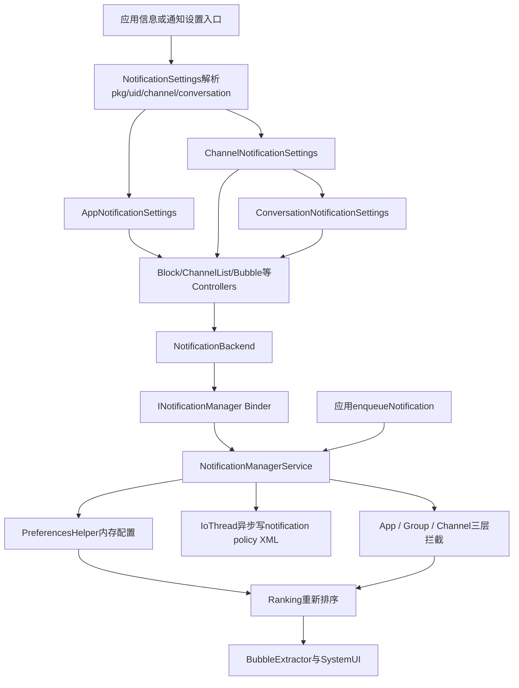
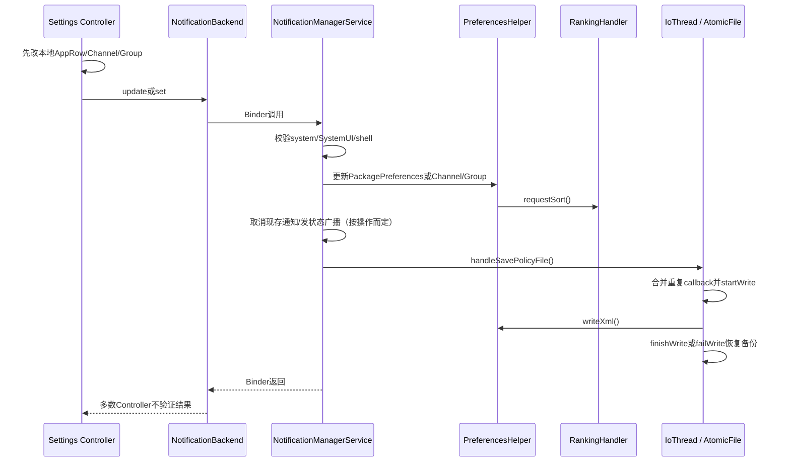
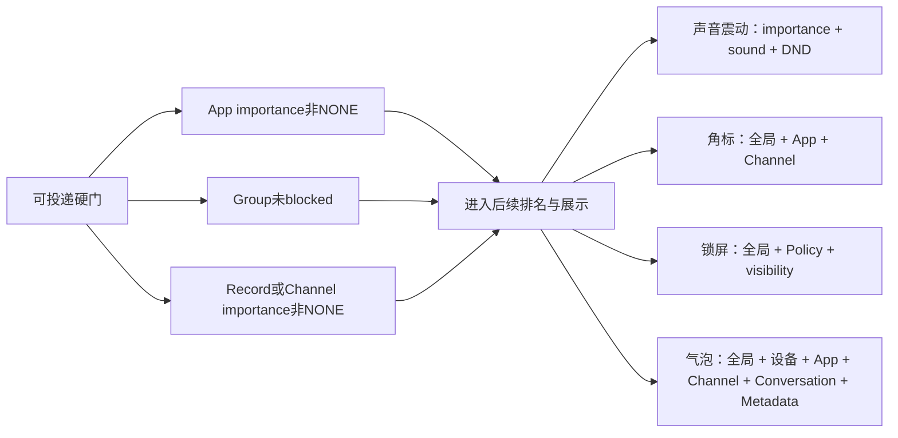

# 第533章 Android通知设置完整链：NotificationBackend、应用总开关、Channel/Group、重要性、声音、Conversation/Bubble与NMS持久化投递

> 源码基线：Android 11 / API 30 / `android-11.0.0_r48`。本章直接阅读 `packages/apps/Settings/src/com/android/settings/notification`、`frameworks/base/services/core/java/com/android/server/notification`、`frameworks/base/core/java/android/app/NotificationChannel.java`，并少量对照 SystemUI 的气泡入口。核心文件是 `NotificationSettings.java`、`AppNotificationSettings.java`、`ChannelNotificationSettings.java`、`ConversationNotificationSettings.java`、`NotificationBackend.java`、各 PreferenceController、`NotificationManagerService.java`、`PreferencesHelper.java` 与 `BubbleExtractor.java`。本章只读源码，不在 macOS 上编译。

## 1. 本章解决什么问题

应用通知页上的“允许通知”、分类开关、声音、震动、重要对话与气泡，分别改了哪一层状态？为什么界面开着，通知仍可能不出现？为什么一次点击后页面看似成功，却不一定表示 system_server 已保存？本章从 Settings 页面取参开始，追到 NMS 权限校验、内存配置、策略文件落盘和通知入队拦截。

## 2. 一句话定位

Settings 不是通知投递者，而是通知策略的系统级编辑器：它把目标 `package + uid + channel/group/conversation` 变成页面模型，经 `INotificationManager` 修改 NMS 的 `PreferencesHelper`；真正发通知时，NMS 再用包级、组级、渠道级事实决定是否接纳，并让 Ranking、Zen、BubbleExtractor 与 SystemUI继续处理表现形式。

## 3. 先分七本账

阅读时至少分开：页面参数账、`AppRow`摘要账、包级通知许可账、Group账、Channel账、Conversation派生Channel账、全局设备设置账。除此之外还有“Settings本地对象已变”“Binder调用成功”“NMS内存已变”“XML已落盘”“正在显示的通知已取消”五个完成阶段，不能用一个开关状态概括。

## 4. 三个页面承担不同粒度

`AppNotificationSettings`展示整个应用；`ChannelNotificationSettings`展示一个普通Channel；当该Channel带有效conversationId且未被demote时，后者会转去`ConversationNotificationSettings`。应用页可以动态列出Group、Channel和Conversation，Channel页才编辑声音、震动、重要性等细粒度字段。

## 5. 页面到投递的总图



## 6. 进程与线程边界

Settings Fragment和Controller通常在Settings进程主线程；动态Channel/Conversation列表的`AsyncTask.doInBackground()`在线程池执行，结果回主线程。`NotificationBackend`通过Binder进入system_server的NMS；`PreferencesHelper`以内存对象为权威工作态，策略文件由`IoThread`异步写。SystemUI收到排名和通知后在另一个进程决定具体视图。

## 7. 标准入口的四个身份量

页面至少需要`packageName`和`uid`，可选`channelId`与`conversationId`。`uid`不仅找包，还编码userId；同包在个人与工作资料中的uid不同，因此`packageName`不能独立标识通知配置。Conversation不是脱离Channel的新实体，而是挂在parent Channel下的一条派生Channel。

## 8. 参数优先级是arguments优先

`onAttach()`先从Fragment arguments取`AppInfoBase.ARG_PACKAGE_NAME/UID`；缺失才读Activity Intent的`Settings.EXTRA_APP_PACKAGE/UID`。uid小于0时再调用当前Context用户下的`PackageManager.getPackageUid(pkg, 0)`补齐。这解释了列表入口与外部Settings Action都可复用同一页。

## 9. `findPackageInfo()`同时做配对校验

它先取`getPackagesForUid(uid)`，只有目标包确实属于该uid才调用`getPackageInfo(GET_SIGNATURES)`。所以不是拿到任意合法pkg和任意合法uid就能拼成页面；共享uid仍允许其中实际属于该uid的包。失败返回null，`onCreate()`会toast并结束。

## 10. userId来自uid而不是额外参数

`mUserId = UserHandle.getUserId(mUid)`，后续检查应用是否因管理员而suspended、取shortcut和广播目标都依赖它。上一章从工作资料启动目标用户的Settings实例仍然重要，因为PackageManager Context与Secure设置也带用户语义。

## 11. `onAttach()`先装事实再喂Controller

找到包后依次加载Channel、AppRow、Group、应用自带的通知设置Activity，并把Header加入Lifecycle。随后对`mControllers`调用一次`onResume(...)`，注入同一组`AppRow/Channel/Group/admin`事实。Controller不是自己任意找目标包，而由基类集中喂数据。

## 12. `onResume()`只重载事实，不自动完成所有UI传播

基类恢复时重新加载AppRow、Channel、Conversation、Group与config Activity，但没有在末尾重新逐个调用Controller。具体子类的`onResume()`还会再对Controller执行`onResume()`、`displayPreference()`和`updatePreferenceStates()`。所以读基类时不能误以为重查后所有行已同步。

## 13. Channel ID有两条Intent来源

`loadChannel()`先读Activity Intent的`Settings.EXTRA_CHANNEL_ID`，再读Intent中的`EXTRA_SHOW_FRAGMENT_ARGUMENTS` Bundle。它不直接读`mArgs`里的channelId；`SubSettingLauncher`会把arguments封装进宿主Intent，所以标准入口仍能工作，但手工只set Fragment arguments的非标准宿主可能加载不到Channel。

## 14. Conversation ID的来源更窄

conversationId只从Activity Intent直接extra读取，不从`EXTRA_SHOW_FRAGMENT_ARGUMENTS`读取。应用页创建Conversation行时既`.setArguments(channelArgs)`又`.setExtras(channelArgs)`，正是为了让parent channel与conversationId都可被`loadChannel()`拿到。删掉setExtras会让页面退化成parent Channel。

## 15. NMS查询Conversation Channel允许回退parent

`NotificationBackend.getChannel()`最终调用`getNotificationChannelForPackage(..., conversationId, true)`，最后一个`true`表示找不到conversation专属Channel时可返回parent。页面因此必须查看返回对象自身的`getConversationId()`，不能仅因请求携带conversationId就断言拿到的是对话Channel。

## 16. Legacy默认Channel是兼容层

`onlyHasDefaultChannel()`或当前Channel id为`DEFAULT_CHANNEL_ID`时，页面设置`mShowLegacyChannelConfig=true`并强制重新取默认Channel。这主要服务未采用现代多Channel模型的应用，把一部分“应用级”体验映射到默认Channel，避免出现一个多余的分类层。

## 17. Legacy页面会重排高级项

应用页`onCreate()`发现legacy模式后移除`app_advanced`分类，再把badge和应用内设置链接移到顶层。它只是Preference树重排，不改变NMS存储模型。声音开关等Controller仍可能在默认Channel上工作。

## 18. `loadChannelGroup()`可能保留旧Group

只有当前Channel有非空group且后端成功返回Group时，代码才覆盖`mChannelGroup`；重载前没有先置null。若同一页面存活期间Channel改为无组或查询失败，旧Group可能继续被Controller读取。这个r48边界说明页面快照不总是与服务事实严格同步。

## 19. `loadConversation()`也可能保留旧头像

Channel为空、没有conversationId或已demote时方法直接return，没有清空`mConversationInfo/mConversationDrawable`。同一个Fragment经历demote或shortcut消失后，旧Conversation头部数据可能残留。正确理解是“当前刷新没有新值”，不是“旧值必然被清”。

## 20. AppRow是摘要快照，不是唯一真相

`NotificationBackend.loadAppRow()`聚合label、icon、banned、showBadge、bubblePreference、Channel数量、Blocked数量和近7天使用事件。它适合一次页面刷新，却不是持续监听对象；用户点击时Controller常先修改本地AppRow，再发Binder。

## 21. AppRow的系统应用判定还叠加Role

带`RoleManager/PackageInfo`的加载路径调用`Utils.isSystemPackage()`，并把默认Dialer与Emergency角色视为系统关键应用。资源`config_nonBlockableNotificationPackages`还能按包或`包:channel`限制阻止关闭。系统应用不等于所有开关都不可用，后面还会允许“已经关闭的项重新打开”。

## 22. 后端读取失败常返回“安全显示默认值”

Binder异常时，`getNotificationsBanned()`返回false、badge返回false、bubble返回-1、Channel/Group返回null、列表返回空、计数返回0。对UI而言这可能表现为“通知允许、某些行消失或为空”，而不是显式错误页。读取失败与真实业务值必须分开。

## 23. 近7天统计不是所有notify调用次数

Backend查询UsageStats的7天`UsageEvents`，只统计`NOTIFICATION_INTERRUPTION`，按app和channel聚合。日均用`round(count/7)`；总数少于7才设置weekly。它是“被记录的通知打扰事件摘要”，不能当作应用调用`notify()`的精确审计日志。

## 24. Config Activity只取第一个解析结果

Settings查询目标包响应`Notification.INTENT_CATEGORY_NOTIFICATION_PREFERENCES`的Activity；首个结果变成显式Intent，后续全部忽略。查询flags传0，尽管旁边注释写`MATCH_DEFAULT_ONLY`。Channel/Group id会附加给应用自己的设置页，但该页如何解释完全由目标应用决定。

## 25. 应用被移除会立即关闭页面

基类注册`ACTION_PACKAGE_REMOVED`，包名匹配就`finishAndRemoveTask()`；没有检查`EXTRA_REPLACING`。应用更新过程中若系统发removed且带replacing，页面也可能被关掉。这与AppInfo详情上一章的同类边界一致。

## 26. 应用页XML只是静态骨架

`app_notification_settings.xml`声明Header、总开关、Conversation分类、invalid message、bubble链接、channels容器和advanced分类。Channel与Conversation行由Controller运行时添加；某些静态Preference会因`isAvailable()`被移除。最终页面不是XML的逐行照搬。

## 27. Controller集合是页面真正的功能清单

应用页创建Header、Block、Badge、AllowSound、三种Importance、Sound、Lights、Vibration、Visibility、DND、AppLink、Description、NotificationsOff、DeletedChannels、ChannelList、ConversationList、InvalidConversation与BubbleSummary等Controller。很多Controller因粒度不匹配而隐藏，但共用一套类也让App/Channel/Conversation页面保持行为一致。

## 28. Controller的基础可用性先检查上层阻断

`NotificationPreferenceController.isAvailable()`通常在app banned、group blocked或channel importance为NONE时返回false。Block Controller与“通知已关闭”提示会覆盖这个规则，让用户仍能看到恢复入口。于是“子项消失”常表示被父层挡住，不表示该字段已从Channel删除。

## 29. App、Group、Channel的可关闭规则不同

普通应用一般可关闭；系统/关键应用受lock限制。Channel若OEM锁定或关键功能锁定，只有已经是NONE时仍允许操作，从而保留重新开启能力；Group对系统应用也采用类似逻辑：已blocked可unblock，未blocked不一定允许block。这里保护的是“不能新增阻断”，不是永久禁用控件。

## 30. 总开关Controller先改本地对象

点击时`BlockPreferenceController`会直接改`mAppRow.banned`、`mChannel.importance`或`mChannelGroup.blocked`，再调用Backend。Dependent listener随后根据这些本地对象重画页面。若Binder失败，本轮UI仍可能看起来成功，直到下一次重新加载才回滚。

## 31. 应用总开关的服务调用

```java
public boolean setNotificationsEnabledForPackage(String pkg, int uid, boolean enabled) {
    try {
        if (onlyHasDefaultChannel(pkg, uid)) {
            NotificationChannel c = getChannel(
                    pkg, uid, NotificationChannel.DEFAULT_CHANNEL_ID, null);
            c.setImportance(enabled ? IMPORTANCE_UNSPECIFIED : IMPORTANCE_NONE);
            updateChannel(pkg, uid, c);
        }
        sINM.setNotificationsEnabledForPackage(pkg, uid, enabled);
        return true;
    } catch (Exception e) {
        return false;
    }
}
```

Legacy应用先同步默认Channel，再调用包级接口；两个Binder动作不是一个事务。更隐蔽的是：第一步更新默认Channel时，PreferencesHelper会把importance复制到包级，于是第二步进入NMS后常因“包级状态已经等于目标值”而幂等return，AppOps和包级状态广播便不会在这次调用中执行。Controller既不检查返回boolean，也不会揭示这种分步语义。

## 32. 包级开关在NMS中要求系统身份

`setNotificationsEnabledForPackage()`执行`enforceSystemOrSystemUI`，普通应用不能替其他包切换。Settings作为系统应用通过该门。读取`areNotificationsEnabledForPackage()`允许system/SystemUI/同包，但跨user还要求`INTERACT_ACROSS_USERS`。

## 33. NMS先做幂等短路

NMS在`mNotificationLock`内比较`PreferencesHelper.getImportance(pkg,uid) != NONE`与目标enabled；相同就直接return。这个return发生在AppOps、广播与策略保存之前，所以重复点击不会重复发状态变化广播。

## 34. 关闭应用会同步四类后果

当包级接口自己判断到真实变化时，PreferencesHelper把包级importance改为NONE；NMS取消该包当前所有通知；把`OP_POST_NOTIFICATION`设为IGNORED；向目标包发`ACTION_APP_BLOCK_STATE_CHANGED`；最后调度保存策略文件。上一节legacy路径可能已由默认Channel同步包级值并触发幂等return，因此不能断言每次UI关闭都完整执行这四步。

## 35. 打开应用把包级importance恢复为默认

`PreferencesHelper.setEnabled()`用`DEFAULT_IMPORTANCE`恢复，而不是记住某个历史包级数值。现代Channel自己的importance仍保留；因此打开应用只是移除包级总闸，某个被单独设为NONE的Channel仍然不投递。

## 36. AppOps与PreferencesHelper为何要双写

PreferencesHelper是通知服务的配置与排名事实；AppOps提供统一操作权限视角。NMS投递路径直接看PreferencesHelper importance，其他系统组件可能看AppOps。两者由NMS顺序更新但不是跨服务事务，理解故障边界时不能假设绝对原子。

## 37. 默认Channel会把设置回写包级兼容字段

`PreferencesHelper.updateNotificationChannel()`发现`onlyHasDefaultChannel()`时，会把Channel importance、bypassDnd、visibility与showBadge复制到PackagePreferences。这样旧应用将来迁移到新Channel时能继承用户意见。默认Channel不是普通列表中的一条孤立记录。

## 38. Channel列表按Group组织

`ChannelListPreferenceController`后台取所有Group，每个Group变成PreferenceCategory；无Group的Channel归到“其他”。Group可有总开关，内部每个普通Channel用`MasterSwitchPreference`显示名称、近7天摘要和alerting图标。

## 39. 排序使用id而非展示名称

Group比较器按id排序，null组放最后；Channel把deleted放后、默认Channel放后，其余按id比较。用户看到的name可能与顺序无关。应用改显示名称不会自然触发字母顺序重排，因为稳定键是id。

## 40. Blocked Group会隐藏其Channel行

构建组内容时，若`group.isBlocked()`就把channels视为空列表，只保留Group开关。Channel对象没有删除，也没有逐个改成NONE；解开Group后原Channel及importance重新出现。Group阻断是独立上层闸门。

## 41. Conversation Channel从普通列表分流

非空conversationId且未demote的Channel在普通Channel循环中被跳过，交给Conversation分类。demoted后它重新可出现在普通Channel区域。这里的demote表示“不再按对话待遇展示”，不是删除或必然阻止通知。

## 42. Channel行关闭与恢复

关闭把importance设为NONE；打开把importance设为`getOriginalImportance()`，然后锁`USER_LOCKED_IMPORTANCE`并更新NMS。若历史originalImportance本身是NONE或异常值，恢复可能仍不响；代码没有额外兜底成DEFAULT。

## 43. `originalImportance`在创建Channel时写入

新Channel进入PreferencesHelper时会`setOriginalImportance(channel.getImportance())`。应用再次创建同id Channel时，如果原值仍UNSPECIFIED才补写；一般不会让应用覆盖用户修改后的重要性。Channel行恢复依赖这份创建期基线，而不是最近一次开启前的值。

## 44. Group开关更新的是Group对象

Settings执行`group.setBlocked(!allow)`后调用`updateNotificationChannelGroupForPackage()`。NMS走`createNotificationChannelGroup(..., fromApp=false)`复用更新逻辑，变化时锁`USER_LOCKED_BLOCKED_STATE`并重算可绕过DND的Channel集合。

## 45. Group更新的一个空值边界

NMS的`maybeNotifyChannelGroupOwner()`直接访问`preUpdate.isBlocked()`，没有null判断。Settings只更新已存在Group，所以标准路径preUpdate非空；若具系统权限的调用者用update接口传全新Group，可能在通知owner时触发NPE。不能把“update方法”当成安全创建接口。

## 46. Channel更新首先处理正在显示的通知

NMS收到Channel importance NONE时，先按package、channelId与user取消现存通知；若目标uid是system/phone，还遍历当前profiles取消对应Channel。然后才取得preUpdate、更新PreferencesHelper、通知owner/listener并保存。

## 47. Channel更新不是任意覆盖

PreferencesHelper确认Channel存在且未删除；把PUBLIC锁屏可见性归一为NO_OVERRIDE；fromUser时保留已有锁并比较新旧字段追加user-locked bits。OEM锁或关键设备功能锁可强行保留旧importance。Settings本地对象的值不一定就是最终存入值。

## 48. 用户锁字段是一组bit而非单一布尔值

importance、priority、visibility、sound、vibration、lights、badge、bubble等可分别锁。用户改某项后，应用后续重新创建同id Channel不能随意覆盖用户意见。阅读`lockFields()`要问“锁了哪个bit”，不能笼统说整个Channel被冻结。

## 49. Settings的Backend更新方法吞异常

`updateChannel()`与`updateChannelGroup()`catch所有Exception，只写日志且返回void。多数Controller没有失败提示、重查或还原本地对象。因此一次点击的立即UI最多证明回调执行过，不能证明Binder、服务内存与磁盘都成功。

## 50. Channel详情页会识别Conversation

`ChannelNotificationSettings.onResume()`在基类重载后，如果Channel含conversationId且未demote，会用`SubSettingLauncher`进入Conversation页面并finish自己。普通Channel页面只是过渡；这避免同一Conversation同时出现普通Channel UI和对话专属优先级UI。

## 51. 外部入口可默认展开高级项

Channel页读取`ARG_FROM_SETTINGS`；若不是从Settings内部列表进入，就把PreferenceScreen的`initialExpandedChildrenCount`设为最大值，让外部深链直接看到全部设置。它只改变展开状态，不放宽Controller可用性或Binder权限。

## 52. “允许声音”其实映射importance档位

Legacy/default Channel使用`AllowSoundPreferenceController`。当前importance大于等于DEFAULT或为UNSPECIFIED时显示开启；关闭写LOW，开启写UNSPECIFIED，并锁importance。它不是单独的mute位，实际通过重要性门控制是否成为alerting通知。

## 53. 普通Channel使用更细的重要性控件

`ImportancePreference`与Min/High开关根据当前importance呈现静默、默认、低打扰或高打扰层级。不同页面不会同时展示所有控件；Controller用Channel类型和当前importance决定可用性。XML中存在不等于屏幕上都显示。

## 54. 从静默提升时会补默认声音

Importance Controller把Channel从低于DEFAULT提升时，若sound为空或Uri无效，会写`Settings.System.DEFAULT_NOTIFICATION_URI`并锁sound字段，避免“看起来允许声音但没有可播放Uri”。这是importance变化带来的跨字段修正。

## 55. Sound Controller不显式锁USER_LOCKED_SOUND

铃声选择返回Uri后修改Channel sound并`saveChannel()`，但该Controller没有像importance等处那样直接调用`lockFields(USER_LOCKED_SOUND)`。服务端fromUser的`lockFieldsForUpdateLocked()`会通过新旧字段差异锁定它，因此最终仍可能被标记；不要把客户端没调用lock等同于服务端不锁。

## 56. 声音选择器类型来自AudioAttributes

Controller根据Channel AudioAttributes usage选择通知、铃声或闹钟类型，传入当前Uri并允许silent/default。返回结果是Channel字段更新，不是直接让AudioService播放或改变系统音量。

## 57. 震动开关有三道可见条件

它要求非默认Channel、importance至少DEFAULT且设备存在Vibrator；然后读取/写入Channel vibration enabled并保存。低重要性下行消失不等于vibration字段被清零，只是当前importance不允许使用这一表现。

## 58. 呼吸灯同时依赖硬件资源与全局设置

Lights Controller要求Channel importance至少DEFAULT、资源`config_intrusiveNotificationLed`为true，并且全局`NOTIFICATION_LIGHT_PULSE=1`。Channel可enableLights但全局脉冲关闭时行可能不可用或效果不出现。字段许可与设备总能力仍需分账。

## 59. 角标有全局、应用和Channel三层

全局Secure `NOTIFICATION_BADGING`先决定系统是否使用角标；PackagePreferences有showBadge；每个Channel也有showBadge。应用页改变包级值，Channel页改变Channel值。最终能否显示需要这些层共同允许，而不是看任意一个开关。

## 60. 锁屏可见性是override模型

Channel保存PUBLIC/PRIVATE/SECRET或`VISIBILITY_NO_OVERRIDE`。Controller先依据设备安全锁、全局锁屏设置和DevicePolicy构造可选项；若用户选择与全局一致，则写NO_OVERRIDE。NO_OVERRIDE表示跟随全局，不是“永远公开”。

## 61. 工作资料锁屏读取有不对称

受管资料的“是否显示通知”可能读取profile parent设置，而“是否允许私密内容”仍通过当前Context的Secure设置判断。阅读该Controller要逐个看`getIntForUser`目标，不能把整个锁屏策略简单归到owner或profile一边。

## 62. 绕过勿扰会联动全局Zen策略状态

DND Controller写Channel bypass并锁`USER_LOCKED_PRIORITY`。PreferencesHelper扫描目标用户所有未被包/组/Channel阻断的Channel，决定`STATE_CHANNELS_BYPASSING_DND`。一个Channel切换可能导致全局通知策略state变化，但不等于直接退出当前勿扰模式。

## 63. 静默状态栏图标是全局设置

Importance Controller通过Backend调用`shouldHideSilentStatusIcons(callingPkg)`；参数传Settings自身包名是有意满足“同包/系统/Listener”校验，不是目标应用包。最终读的是PreferencesHelper的全局行为，不能误讲成每个应用独立设置。

## 64. DependentFieldListener只基于本地快照重画

字段变化后，它更新Conversation头像important标记，重新`displayPreference()`并`updatePreferenceStates()`。它没有先从NMS重载Channel/AppRow/Group。Binder失败、服务端因OEM锁修正值时，立即重画仍可能沿用客户端期望值。

## 65. Channel列表异步任务没有请求代际

每次`updateState()`可启动新的AsyncTask；旧请求不取消，也不比较generation。这里调用的是`execute()`，Android 11默认走`SERIAL_EXECUTOR`，所以同进程任务通常按队列先后回调，不应夸大成天然乱序；真实问题是重复查询会积压、旧结果可短暂上屏，并可能在页面销毁后继续回调。`onPostExecute()`检查`mContext == null`也没有实际生命周期保护，因为Controller构造时Context为final且不会被置空。

## 66. Group列表复用Preference但会整组重排

Controller先按key在预期位置查找，不在则扫描复用或创建；若发生插入/删除，再removeAll并按最终顺序重新add。它不是RecyclerView Diff，也不会保留所有瞬时交互状态；优势是常见“结构不变”时少创建对象。

## 67. Channel开关失败时图标也可能先改变

监听器先改Channel importance、锁字段并立即根据importance换alerting icon，再调用Backend。服务失败不回滚icon或checked。复读UI时应把“控件提交了新值”描述为本地乐观更新，而非持久成功证明。

## 68. Conversation列表的显示资格

应用未被总闸关闭，且Backend报告曾发送有效消息，或处于“发过无效消息且从未发有效消息”的状态，分类才可用。默认Channel/legacy上下文会隐藏Conversation分类。资格来自NMS历史事实，不只是当前Channel是否有conversationId。

## 69. Conversation排序先重要后id

列表中`isImportantConversation=true`的项优先；同组按派生Channel id排序。标题优先Shortcut label，没有Shortcut才用Channel name；摘要由parent Channel label和Group label组成。Shortcut丢失不必然让配置消失，只会退化显示。

## 70. Conversation路由必须同时带parent与conversation

行的channelId放`getParentChannelId()`，conversationId放对话id；NMS据此查专属派生Channel。若误把派生Channel自身id当parent id，查询语义会不同。Settings同时setArguments和setExtras是这一链的关键细节。

## 71. Conversation列表空结果可能留旧行

`populateList()`只在`mConversations`非空时removeAll并重建；新请求返回空列表时不清旧children。最后一个Conversation被删除后，页面可能仍显示旧行。若结果只含demoted项，则列表非空，会先清空、再因循环skip而留下空分类，两种空态行为还不同。

## 72. Conversation专页不是普通Channel页换标题

它有Conversation Header、三态priority选择、Conversation气泡开关、跳应用气泡设置、demote和一组高级Channel表现项。普通Channel的应用内设置、DND等并不原样复制。页面模型体现“对话身份”在Android 11是通知系统的一等分类信号。

## 73. 重要对话同时改两个字段

`ConversationPriorityPreferenceController`接收`Pair<importance, important>`，同时设置Channel importance与`importantConversation`。选为重要对话还强制`allowBubbles=true`；若从重要降级，则把allowBubbles=false。它不是只加一颗星，也可能改变声音/打扰和气泡资格。

## 74. 重要性受OEM锁时控件不可配置

Controller在有admin或`isImportanceLockedByOEM()`时disable，并将`setConfigurable(false)`传给自定义Preference。它没有单独检查critical-device-function锁；最终NMS更新仍会把关键功能Channel的NONE改回旧importance，形成服务端第二道保护。

## 75. Demote的准确含义

Demote Controller把`mChannel.setDemoted(true)`、保存并关闭页面。通知Channel仍存在、importance也未被设为NONE；下一次它从Conversation专属区域退出，可能回到普通Channel列表。Demote是在分类语义上撤销对话待遇，不是“屏蔽这个人”。

## 76. Promote是从普通Channel视图恢复对话身份

Channel已带conversationId且demoted时，普通Channel页显示promote入口。点击清demoted，同时把bypassDnd设false并保存，然后结束页面。恢复为Conversation不自动恢复原绕过勿扰状态，避免promote暗中保留特殊打扰权。

## 77. 无效消息状态如何产生

PreferencesHelper分别记录`hasSentInvalidMessage`和`hasSentValidMessage`。只有“发过invalid且从未发valid”才是invalid state；一旦有有效消息，`isInInvalidMsgState()`为false。它评估的是应用是否正确使用MessagingStyle/Shortcut等Conversation约定，不是内容真假审核。

## 78. 用户可把无效消息应用降级

invalid switch显示checked = `!hasUserDemotedInvalidMsgApp`；用户关闭时写`userDemotedMsgApp=true`。Setter只改内存字段，NMS调用后安排保存策略。Backend异常被吞，开关同样没有失败回滚。

## 79. App气泡是三态，不是布尔值

包级偏好有`NONE`、`SELECTED`、`ALL`。NONE禁止全部；SELECTED要求具体Channel允许；ALL允许所有符合条件且Channel未显式OFF的对话。Channel的`allowBubbles`和包级三态组合后才产生record.canBubble。

## 80. 全局气泡开关还有设备能力门

Settings读取Global `NOTIFICATION_BUBBLES`，并要求`!ActivityManager.isLowRamDevice()`。低内存设备即便应用/Channel都允许，UI与BubbleExtractor仍会拒绝。全局开关由SettingsProvider保存，不在Notification policy XML的PackagePreferences里。

## 81. App与Conversation使用同一个Bubble Controller

App page显示三态`BubblePreference`；Channel/Conversation page显示RestrictedSwitch。前者写包级Preference，后者写Channel allowBubbles。Controller通过`mIsAppPage`和`mChannel != null`选择路径，阅读时要先确认构造参数。

## 82. 全局关闭时开启App气泡需要确认

若全局为off且当前选择为NONE，用户选择其他状态不会立即提交，而弹`BubbleWarningDialogFragment`。确认路径同时写应用偏好与全局Global开关；取消/回退路径把应用偏好恢复NONE并保持全局off。一个对话框跨越两套存储。

## 83. BubbleSummary与实际Controller默认值不一致

`BubblePreferenceController.isGloballyEnabled()`读取Global缺失时默认OFF；`BubbleSummaryPreferenceController`读取同一key缺失时默认ON。系统正常初始化通常会写明确值，但在设置项尚不存在或测试环境中，摘要可能说已开而实际控制器认为关闭。这是r48源码级边界。

## 84. Bubble服务接口限制调用者

`setBubblesAllowed()`只允许system、SystemUI或shell，更新PackagePreferences的bubblePreference并锁`USER_LOCKED_BUBBLE`，触发ranking sort后安排保存。普通应用可以读取自己的偏好，却不能把自己提升到ALL绕过用户选择。

## 85. Channel `canBubble()`不是最终气泡许可

Channel字段只表达该Channel层是否允许。BubbleExtractor还要求全局气泡开启、包级偏好非NONE、非low-RAM、通知是Conversation、有有效Shortcut、不是前台服务通知，并且BubbleMetadata能解析到合法Shortcut或可调整大小Activity。

## 86. BubbleExtractor的完整判定

```java
boolean canPresentAsBubble = canPresentAsBubble(record)
        && !mActivityManager.isLowRamDevice()
        && record.isConversation()
        && record.getShortcutInfo() != null
        && (record.getNotification().flags & FLAG_FOREGROUND_SERVICE) == 0;

if (!mConfig.bubblesEnabled()
        || bubblePreference == BUBBLE_PREFERENCE_NONE
        || !canPresentAsBubble) {
    record.setAllowBubble(false);
} else if (bubblePreference == BUBBLE_PREFERENCE_ALL) {
    record.setAllowBubble(recordChannel.getAllowBubbles() != ALLOW_BUBBLE_OFF);
} else if (bubblePreference == BUBBLE_PREFERENCE_SELECTED) {
    record.setAllowBubble(recordChannel.canBubble());
}
```

这段代码说明“设置里允许气泡”只是必要条件，不是通知必然变成悬浮气泡。

## 87. 无效BubbleMetadata会被主动清除

若不能present as bubble，Extractor不仅设allow=false，还清`Notification.BubbleMetadata`。Shortcut id需有效并与通知Shortcut匹配，或PendingIntent必须解析到可resize Activity。开发者配置错误与用户关闭气泡是两类不同失败原因。

## 88. FLAG_BUBBLE是排名后的派生结果

Extractor根据`record.canBubble()`与`isFlagBubbleRemoved()`设置或清除`FLAG_BUBBLE`。应用提交Notification时带metadata，不等于最终flag一定保留；NMS排名阶段拥有最终校正权，SystemUI消费的是校正后的Ranking/Notification。

## 89. NMS更新流程与保存流程



## 90. `updateConfig()`不负责落盘

PreferencesHelper的`updateConfig()`只有`mRankingHandler.requestSort()`。真正写policy由NMS各Binder入口显式调用`handleSavePolicyFile()`。看到内存值变化和排序请求时，不能自动推断文件保存已经调度；必须继续检查调用者。

## 91. 保存任务会合并重复请求

`handleSavePolicyFile()`检查IoThread Handler是否已有同一Runnable，没有才post。连续多个设置可能合并为一次最终快照写入。这不是每次点击一个独立文件事务，也不保证Binder返回前磁盘已完成。

## 92. AtomicFile提供失败回退

Runnable在`mPolicyFile`锁内`startWrite()`，成功则`finishWrite()`，IOException则`failWrite()`恢复备份。它提升单文件更新可靠性，但若进程在Binder返回与异步保存之间异常终止，最新内存更改仍可能尚未落盘。

## 93. Policy XML不仅存Channel

NMS根节点同时写Zen、Preferences、Listeners、Assistants、Snooze、ConditionProviders和安全通知策略。PreferencesHelper在每个package条目中写PackagePreferences、Group和Channel。所谓“通知设置文件”是多个通知子系统的联合策略快照。

## 94. Package键是`pkg|uid`

PreferencesHelper内存Map用包名与uid组合键，因此同包不同用户拥有独立PackagePreferences。XML可保存uid；backup/restore还需按用户与包安装状态做映射。只按package搜索配置会混淆个人与工作资料。

## 95. Channel对象被整体替换

Settings从Binder取到Parcelable副本，本地修改后整对象传回；PreferencesHelper校验与加锁后执行`r.channels.put(id, updatedChannel)`。这不是对单字段的数据库UPDATE。并发修改若基于旧快照，服务端字段保护只能覆盖部分用户锁/OEM规则，仍存在最后提交覆盖其他未保护字段的思考空间。

## 96. 应用重新创建Channel受严格约束

目标应用再次`createNotificationChannel()`时只能更新name、description、blockable、首次group等少数字段；在没有任何userLocked字段时可降低importance，不能提高；用户锁存在后连降低也不允许。Settings的system更新路径才按用户意图改更多字段。

## 97. 删除Channel与设为NONE不同

删除会标记deleted、取消对应通知并通知listeners；设importance NONE保留Channel记录和配置，只是阻断并可重新开启。Channel列表可统计deleted数量，普通行通常不展示deleted项。不要把“关闭分类”描述成删除分类。

## 98. 通知入队先解析真实posting uid

`enqueueNotificationInternal()`先处理incoming user，通过`resolveNotificationUid(opPkg,pkg,callingUid,userId)`验证调用者能否代表目标包发通知。非法代理直接SecurityException。设置页面允许该包不代表任意进程可以冒用它投递。

## 99. NMS必须找到Channel

它用Notification channelId和shortcutId查conversation Channel，允许找不到专属项时回退parent。返回null就记录“No Channel found”并return；若包级通知没有关闭，还可能显示开发者警告toast。没有Channel不是用户阻断，而是开发者配置/兼容链失败。

## 100. NotificationRecord把Channel快照带入排名

找到Channel后创建`NotificationRecord(context, sbn, channel)`，重要性、声音、震动、badge、bubble等派生计算围绕这份Channel展开。后续Settings更新会requestSort，排队/已显示通知也可能被重新评估；入队不是只查一个enabled boolean。

## 101. 三层硬阻断在`isBlocked()`汇合

```java
private boolean isBlocked(NotificationRecord r) {
    final String pkg = r.getSbn().getPackageName();
    final int uid = r.getSbn().getUid();
    return mPreferencesHelper.isGroupBlocked(pkg, uid, r.getChannel().getGroup())
            || mPreferencesHelper.getImportance(pkg, uid) == IMPORTANCE_NONE
            || r.getImportance() == IMPORTANCE_NONE;
}
```

Group、App、Channel/Record任一层为阻断，通知都不进入正常发布。开一个下层开关无法穿透上层关闭。

## 102. 拦截发生不止一次

`checkDisqualifyingFeatures()`在入队时检查blocked；`PostNotificationRunnable`真正发布前又调用`isBlocked()`。两次之间用户可能刚关闭应用或Channel，因此第二次防止旧请求穿过。设置变化与通知异步流水线并发时，这个复查很关键。

## 103. 被阻断与被隐藏是不同结局

Package suspended或distracting restriction可让Record标记hidden，通知可能仍存在于NMS列表但不展示；`isBlocked()`则直接return，不发布。勿扰也多是抑制声音/视觉效果，不等于Channel importance NONE。排查“没看到”要区分未入队、已入队被阻断、已发布但hidden、已显示但silent。

## 104. 关闭Channel会主动取消旧通知

NMS更新Channel为NONE时在写配置前调用`cancelAllNotificationsInt()`；因此不仅未来通知过不来，当前该Channel通知也被移除。包级接口在真实变化时也显式cancel全部；但本章读到的Group更新入口没有同样的显式按组cancel，主要更新Group事实、DND派生状态、Listener与持久化，未来入队会由`isGroupBlocked()`拒绝。三层关闭的即时效果不能想当然地写成完全相同。

## 105. 前台服务Channel有特殊最低重要性处理

入队前台服务通知时，若Channel为MIN/NONE，并满足“importance未被用户锁，或者该Channel尚未展示过FGS”之一，NMS可提升到LOW并记录`fgServiceShown`。这个`OR`很关键：首次FGS即便已有用户锁，只要`fgServiceShown=false`仍可进入提升分支。前台服务的系统生存要求使importance边界比普通通知更复杂。

## 106. 首次FGS提升还会改锁字段

对非默认Channel，首次进入提升分支时会把Channel importance设LOW、给Record设置system importance LOW；若此前未展示FGS，还会解锁`USER_LOCKED_IMPORTANCE`并置`fgServiceShown=true`。之后再次发FGS时，已展示标志不再提供OR通路，用户锁才更直接地影响是否提升。这里不能简化成“用户锁住NONE就一定不抬升”。

## 107. `setNotificationsEnabledForPackage()`的广播不是提交确认

NMS向目标包发blocked state广播，SecurityException只记录警告，不回滚配置。应用收到广播可调整自身行为，但它不参与事务确认。Settings页面也不会等待目标应用ack。

## 108. Listener通知与应用owner广播是两套事件

Channel更新可向NotificationListeners报告added/updated/deleted，同时在blocked状态跨NONE时向Channel owner发`ACTION_NOTIFICATION_CHANNEL_BLOCK_STATE_CHANGED`。Listener看到配置变化，不代表目标应用已处理广播；两类接收者和权限边界不同。

## 109. 读源码时的“开关真值表”

应用允许、Group允许、Channel importance非NONE只是可投递的硬门；是否alert还看importance/sound/vibration/DND；是否显示角标看全局+app+channel；是否bubble看全局+设备+app三态+channel+conversation+shortcut+metadata；是否锁屏显示还看全局、DevicePolicy与visibility override。UI中的“开”从来不是唯一真值。



## 110. 一个具体例子：应用开着但没有声音

假设包级importance默认、Group未blocked、Channel importance LOW。通知能通过`isBlocked()`，却按低重要性静默；Sound行因importance条件可能隐藏，旧sound Uri仍保存在Channel。把应用总开关反复开关不会把该Channel恢复为DEFAULT，必须改Channel重要性。

## 111. r48关键边界集中复盘

Channel id不直接读Fragment mArgs、conversationId只读Intent extra；Group/Conversation重载不清旧对象；Backend读取失败偏默认、写入失败被吞；legacy双Binder非事务；Channel/Conversation异步无generation且Context检查无效；空Conversation不清旧行；Bubble全局默认值两Controller不一致；本地对象先变；保存异步；投递以App/Group/Record三层再次判定。

## 112. macOS只读练习一：画页面装配与参数表

```bash
sed -n '55,285p' packages/apps/Settings/src/com/android/settings/notification/app/NotificationSettings.java
sed -n '70,170p' packages/apps/Settings/src/com/android/settings/notification/app/AppNotificationSettings.java
rg -n 'EXTRA_CHANNEL_ID|EXTRA_CONVERSATION_ID|setArguments|setExtras' packages/apps/Settings/src/com/android/settings/notification/app
```

列出pkg、uid、channelId、conversationId的每个来源，标出arguments、Activity direct extras与show-fragment arguments的差异；再解释Conversation行为何要同时setArguments和setExtras。

## 113. macOS只读练习二：手算三层阻断

```bash
sed -n '3060,3150p' frameworks/base/services/core/java/com/android/server/notification/NotificationManagerService.java
sed -n '6100,6190p' frameworks/base/services/core/java/com/android/server/notification/NotificationManagerService.java
sed -n '1660,1718p' frameworks/base/services/core/java/com/android/server/notification/PreferencesHelper.java
```

自行构造四组状态：App关、Group关、Channel为NONE、三者全开但importance LOW。分别判断是否通过`isBlocked()`、是否会发声，以及重新打开应用后哪个Channel状态会保持。

## 114. macOS只读练习三：验证Channel更新与持久化时序

```bash
sed -n '2420,2470p' frameworks/base/services/core/java/com/android/server/notification/NotificationManagerService.java
sed -n '950,1030p' frameworks/base/services/core/java/com/android/server/notification/PreferencesHelper.java
sed -n '800,850p' frameworks/base/services/core/java/com/android/server/notification/NotificationManagerService.java
```

按顺序标出：取消旧通知、读取preUpdate、PreferencesHelper替换对象、Ranking sort、Listener通知、post保存、AtomicFile finish。回答Binder返回时哪些步骤一定发生，哪些仍可能排队。

## 115. macOS只读练习四：做气泡必要条件清单

```bash
sed -n '45,135p' frameworks/base/services/core/java/com/android/server/notification/BubbleExtractor.java
sed -n '170,235p' packages/apps/Settings/src/com/android/settings/notification/app/BubblePreferenceController.java
sed -n '600,635p' frameworks/base/services/core/java/com/android/server/notification/PreferencesHelper.java
```

把全局、设备、App、Channel、Conversation、Shortcut、BubbleMetadata、FGS八类条件逐项列成AND/分支表达式，并说明`BUBBLE_PREFERENCE_ALL`与`SELECTED`对Channel字段的判断差异。

## 116. 推荐的调试观测顺序

先确认入口pkg/uid/user和Channel id；再看App/Group/Channel三层硬门；然后看importance、sound、DND、visibility等表现字段；气泡再追加全局与metadata条件；最后查看NMS日志中的No Channel、blocked、Bubble developer error。由粗到细能避免在铃声Uri上排查一个其实已被App总闸拦截的问题。

## 117. 推荐的源码断点链

Settings侧从`BlockPreferenceController.onPreferenceChange()`或具体Controller开始，经`NotificationBackend`；system_server侧断`INotificationManager.Stub`对应方法、`PreferencesHelper.updateNotificationChannel()`、`handleSavePolicyFile()`；投递侧断`enqueueNotificationInternal()`、`checkDisqualifyingFeatures()`、`isBlocked()`和`BubbleExtractor.process()`。

## 118. 本章容易说错的五句话

“允许通知等于所有Channel打开”错；“Channel开着就一定发声”错；“重要对话只是排序靠前”错；“允许气泡就必然弹泡”错；“Settings开关回调true表示磁盘已保存”也错。更准确的说法要明确层级、当前快照、服务提交与最终表现。

## 119. 本章知识闭环

入口用pkg+uid确定用户与包，基类加载AppRow/Channel/Group/Conversation；Controller把不同粒度字段映射到UI并乐观更新本地对象；Backend跨Binder进入NMS；PreferencesHelper保护用户锁与系统锁、更新内存并触发排序；IoThread稍后持久化；每条通知在入队和发布前重新通过包、组、Channel门，之后才谈声音、角标、锁屏、勿扰与气泡。

## 120. 下一章预告

第534章继续追“通知真正怎样排队与展示”：从`enqueueNotificationInternal()`、`NotificationRecord`、RankingHelper/Extractors、Notification Assistant与Zen拦截，到Listener RankingUpdate和SystemUI通知集合。重点区分importance计算、ranking排序、视觉打扰、heads-up和最终视图生命周期。
