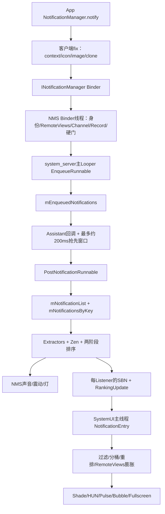
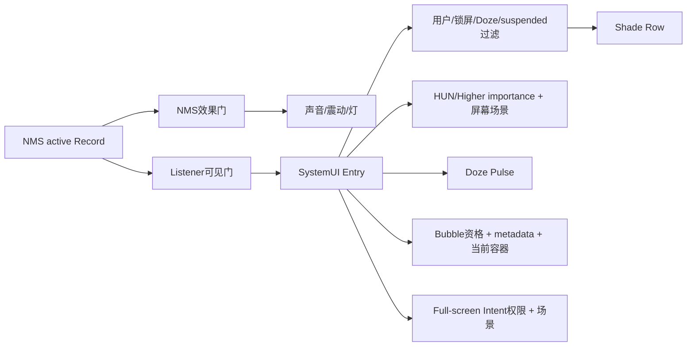
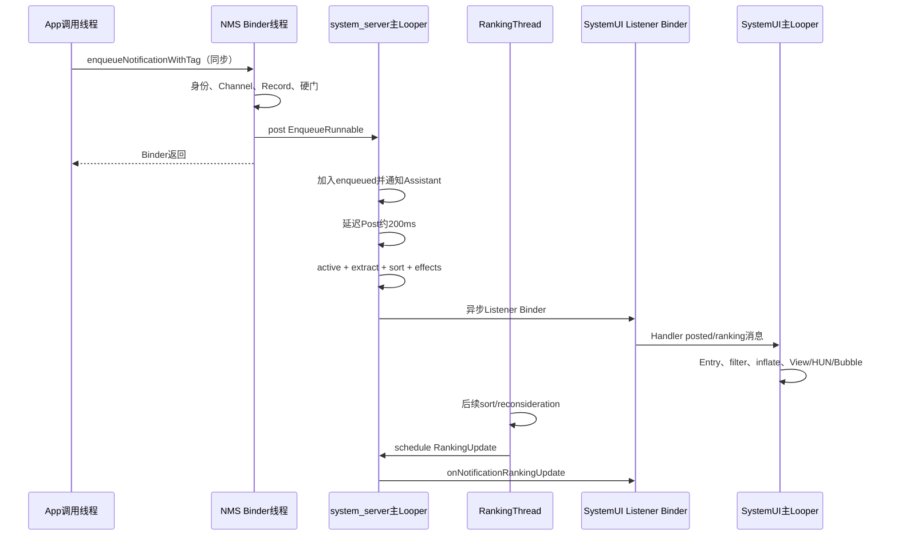

# 第534章 Android通知投递完整链：NotificationManagerService入队、NotificationRecord、Ranking、Assistant、Zen、Listener与SystemUI展示

> 源码基线：Android 11 / API 30 / `android-11.0.0_r48`。本章直接阅读`frameworks/base/core/java/android/app/NotificationManager.java`、`android/service/notification/NotificationListenerService.java`、`frameworks/base/services/core/java/com/android/server/notification`与`frameworks/base/packages/SystemUI/src/com/android/systemui/statusbar`。核心文件包括`NotificationManagerService.java`、`NotificationRecord.java`、`RankingHelper.java`、各`NotificationSignalExtractor`、`NotificationAssistantService.java`、`NotificationListener.java`、`NotificationEntryManager.java`、`NotificationRankingManager.kt`与`NotificationViewHierarchyManager.java`。只读源码，不在macOS上编译。

## 1. 本章解决什么问题

应用调用`notify()`后，返回时通知是否已经显示？Channel怎样变成声音、震动、重要性和排序事实？Assistant与Zen能改哪些结果？NMS说“已posted”为什么仍不等于通知栏有一行？本章从应用进程一路追到SystemUI的Entry、RemoteViews、排序、过滤、Heads-up与最终View层级。

## 2. 一句话定位

通知投递不是一次Binder调用，而是一条带多次重新裁决的异步管线：客户端先规范化Notification，NMS验证发布身份并构造Record，主Looper排队、给Assistant一个短窗口、重新提取Ranking信号并存入活动集合，再把每个Listener可见的SBN与RankingMap异步送出；SystemUI还会自行过滤、分桶、膨胀视图并决定通知栏、HUN、AOD pulse、Bubble或全屏Intent。

## 3. 先分九本账

至少分清：应用提交的`Notification`、跨进程`StatusBarNotification`身份壳、NMS的`NotificationRecord`运行事实、`mEnqueuedNotifications`等待账、`mNotificationList/mNotificationsByKey`活动账、Ranking排序账、Listener可见快照账、SystemUI `NotificationEntry`账、真实View与打扰形态账。相同key贯穿多本账，但对象并非同一个实例。

## 4. “投递成功”有六个阶段

Binder请求被接受、Record通过硬门、进入enqueued、写入active list、Listener收到posted、SystemUI完成行膨胀，是六个不同完成点。`NotificationManager.notify()`无异常返回通常只证明同步前半段未抛错，不能证明Assistant、Post、Listener或View已经完成。

## 5. 端到端总图



## 6. 四类线程边界

应用调用线程同步执行客户端fix并等待普通AIDL Binder返回；NMS Binder线程做相当多的预处理；`mHandler`是`onStart()`当前Looper创建的WorkerHandler，在system_server主线程执行Enqueue/Post；`mRankingThread`是独立线程，处理sort与reconsideration。Listener Binder线程再经`NotificationListenerService.MyHandler`切到SystemUI主Looper。

## 7. 客户端入口只有一个核心方法

`notify(id,n)`转`notify(null,id,n)`，再到`notifyAsUser()`；普通应用用Context package作pkg、opPackageName作opPkg。`notifyAsPackage()`则把targetPackage作为归属包、调用方package作为sender，要求目标包事先授权delegate。tag与id只在package/user范围内组合成更新身份。

## 8. 相同tag/id是更新而非追加

`StatusBarNotification.getKey()`综合user、package、id、tag等身份。Post阶段在`mNotificationsByKey`找到旧Record就替换列表同一位置，而不是创建第二行。更新仍会重新计算可视差异、Ranking、声音资格和SystemUI RemoteViews。

## 9. 客户端先补Context字段

`Notification.addFieldsFromContext()`补应用信息与targetSdk相关字段；sound Uri canonicalize，并按StrictMode检查`file://`暴露；旧`icon` int可转成resource Icon。targetSdk大于L MR1而没有smallIcon会在应用进程直接抛`IllegalArgumentException`。

## 10. 大图会在应用进程先缩减

`reduceImageSizes()`限制largeIcon、big picture等图像尺寸；`Builder.maybeCloneStrippedForDelivery()`可能移除可重建的RemoteViews重资源后再跨Binder。NMS收到的不一定与应用Builder内存对象逐字段相同，但语义应可恢复。

## 11. AIDL不是oneway

`INotificationManager.aidl`中的`enqueueNotificationWithTag()`是普通void方法，没有`oneway`。应用会等NMS Binder方法返回；但NMS在预处理后只`mHandler.post(EnqueueNotificationRunnable)`，主投递继续异步。因此“同步Binder”与“同步显示”不是一回事。

## 12. Incoming user先经过AMS规则

NMS调用`ActivityManager.handleIncomingUser()`规范userId，处理跨用户权限与`USER_ALL`等特殊值。随后`resolveNotificationUid()`决定通知真正归属uid。这里的callingUid、opPkg、pkg和notificationUid可能不同，尤其是delegate或system代发。

## 13. 同包发布与代理发布两条身份路

同包路径要求targetPkg属于callingUid，callingPkg也与target一致或属于同uid；代理路径先查targetUid，再只允许android或PreferencesHelper登记的delegate。失败直接`SecurityException`，不会创建Record。显示的归属包是targetPkg，审计代理则看opPkg。

## 14. 受限category在Record前检查

汽车emergency/warning、call等特殊类别可能需要系统权限；NMS先`checkRestrictedCategories()`，避免普通应用仅凭category获得关键排序或行为。category是应用声明的语义输入，不是无条件可信事实。

## 15. 服务端还会再次fix

NMS按目标user取得ApplicationInfo再补Context字段；有`USE_COLORIZED_NOTIFICATIONS`才保留`FLAG_CAN_COLORIZE`；target Q及以上使用fullScreenIntent却无`USE_FULL_SCREEN_INTENT`时，NMS清掉该Intent并记录警告，而不是让它进入SystemUI。

## 16. 过大的RemoteViews可被逐个剥离

NMS估算content、big、heads-up及publicVersion三套RemoteViews内存；超过warn阈值只日志，达到strip阈值就把对应字段置null并记usage。一个大heads-up被删不必然让整个Notification失败，SystemUI可能退回模板内容。

## 17. SBN是身份壳，不负责排名

`StatusBarNotification`封装pkg、opPkg、id、tag、uid、pid、Notification、user与postTime，并生成key/groupKey。importance、DND截断、badge、contact affinity等不在SBN自身决定，而由随后的`NotificationRecord`和Ranking构建。

## 18. Channel查询也尝试Conversation派生项

NMS以Notification channelId与shortcutId调用`getConversationNotificationChannel(..., parentOk=true)`。存在专属Conversation Channel就用它，否则允许回退parent。电视设备还可由`TvExtender`提供另一个channelId。

## 19. 找不到Channel就提前结束

Channel为null时记录包含pkg/channel/id/tag/uid的错误；若包级通知没关闭，在可调试配置下可能弹developer warning toast，然后return。它不会进入enqueued，也不会通知SystemUI。缺Channel与importance NONE是两个不同失败点。

## 20. Record构造立即固化多项派生事实

```java
public NotificationRecord(Context context, StatusBarNotification sbn,
        NotificationChannel channel) {
    this.sbn = sbn;
    mTargetSdkVersion = LocalServices.getService(PackageManagerInternal.class)
            .getPackageTargetSdkVersion(sbn.getPackageName());
    mChannel = channel;
    mPreChannelsNotification = isPreChannelsNotification();
    mSound = calculateSound();
    mVibration = calculateVibration();
    mAttributes = calculateAttributes();
    mImportance = calculateInitialImportance();
    mLight = calculateLights();
    calculateUserSentiment();
    calculateGrantableUris();
}
```

这发生在NMS Binder线程，且URI校验可能抛异常；Record不是主线程Post时才建立的空壳。

## 21. Pre-channel只指特定兼容组合

只有Channel id是默认Channel且目标targetSdk低于O，`mPreChannelsNotification`才为true。此时若相应字段没有被用户锁，Record可从旧Notification的sound/defaults/vibrate/priority/light覆盖Channel兼容值。现代Channel应用主要服从Channel。

## 22. sound、vibration与audio attributes分别计算

现代通知取Channel sound、vibrationPattern和AudioAttributes；电视直接令sound为空。旧应用可从Notification字段回退；无自定义pattern时使用资源默认震动。它们在Record中成为播放候选，但仍要过importance、DND、ringer、group alert等门。

## 23. 初始importance先看Channel

现代通知以Channel importance为自然值，并记录“app设置”或“user设置”的解释。旧应用把Notification priority映射成MIN/LOW/DEFAULT/HIGH，再用是否noisy与fullScreenIntent校正。priority对现代Channel不再是最终importance的主权威。

## 24. Assistant与system importance有明确优先级

`calculateImportance()`先算自然值；Channel未由用户设置、未被OEM/关键功能锁时才接受Assistant importance；system importance最后覆盖Assistant。因而Assistant不能降级一个用户已明确设置importance的Channel，FGS等系统覆盖又高于Assistant。

## 25. Content URI在入队前做可授权性验证

Record遍历Notification所有Uri和Channel sound content Uri，调用UriGrantsManager检查posting uid是否能授予读取权限。target P及以上的非用户覆盖Uri无权时抛SecurityException；旧target只警告忽略。用户选的Channel sound无权时不会按应用Uri同样抛出。

## 26. Conversation是Record实时判定

Channel或应用被demote、Assistant设`KEY_NOT_CONVERSATION`都会返回false；R及以上MessagingStyle还要求有效Shortcut。旧target可对资源白名单包以message category暂时进入Conversation。Conversation不是仅看style或channelId的一位静态标记。

## 27. FGS在硬门前有importance兼容修正

上一章已确认：首次前台服务Notification若Record为MIN/NONE，只要importance未锁或`fgServiceShown=false`，NMS可提升到LOW；非默认Channel还可能解开旧importance锁并标记已展示FGS。随后才进入disqualifying检查。

## 28. Shortcut验证失败不会直接丢普通通知

NMS尝试取得有效Shortcut，失败只日志并让`mShortcutInfo=null`；普通通知仍可继续，Conversation与Bubble资格则可能丢失。有效Shortcut会被同步cache，避免应用发布后立即unpublish导致对话配置失联。

## 29. Disqualifying门不只检查用户开关

它还处理instant app不能新建、更新速率过高、单包非FGS活动数量上限、snooze与App/Group/Channel blocked。返回false意味着Record连EnqueueRunnable都不会post。不要把所有“notify无显示”都归因于Channel。

## 30. Rate limit主要针对频繁更新

同key已有活动Record、不是已完成progress且非autogroup时，若应用enqueue rate超过上限就丢该更新。新通知另受最大数量限制。系统包与注册Listener有豁免，避免系统级组件被普通应用防DOS规则阻断。

## 31. 最大数量不把FGS算进同一拒绝条件

非前台服务Notification才检查`MAX_PACKAGE_NOTIFICATIONS`；计数同时看已发布列表和enqueued列表，并排除本次相同id/tag的已发布项。大量尚未Post的请求也会占额度，不能只数通知栏可见行。

## 32. Snooze在两个阶段出现

硬门检查已发布/已snooze key；EnqueueRunnable还查“尚未发布通知”的未来snooze time或context，命中就直接交SnoozeRunnable。重新notify相同key不一定能绕过用户snooze。

## 33. blocked在Post前会再检查一次

初次`checkDisqualifyingFeatures()`检查App、Group与Record importance；Assistant窗口或用户设置可能在之后改变importance，因此`PostNotificationRunnable`开头再`isBlocked(r)`。日志写“blocked by assistant request”只是泛化文本，真实原因也可能是用户刚关闭Group/App。

## 34. PendingIntent获得短期后台启动通路

NMS遍历`notification.allPendingIntents`，按DeviceIdle提供的通知白名单时长设置临时whitelist，并允许Activity/Broadcast/Service sender的后台启动。它是对PendingIntent target token的临时能力，不等于整个posting app永久退出后台限制。

## 35. app foreground快照只服务气泡flags

NMS清调用身份后查询package importance是否FOREGROUND，再把boolean传入EnqueueRunnable。后台应用的BubbleMetadata会被清`AUTO_EXPAND`与`SUPPRESS_NOTIFICATION`，但metadata本体未必删除。这个前台状态是查询时快照，不是全流程监听。

## 36. Binder返回前后的明确分界

身份、服务端fix、Channel、Record、URI、硬门、PendingIntent白名单和foreground查询都在Binder方法里；最后`mHandler.post()`后返回应用。Enqueue list、Assistant、active list、Ranking、声音与Listener全部在返回之后。因此notify调用慢也可能卡在Binder预处理，并非只做一次轻量排队。

## 37. EnqueueRunnable在NMS主Looper串行执行

`WorkerHandler(Looper.myLooper())`由SystemService `onStart()`创建，通常是system_server主Looper。Runnable持`mNotificationLock`检查未发布snooze、加入enqueued、安排timeout、继承旧Ranking信息、修气泡flags、维护Group，再安排Post。

## 38. enqueued与active集合有意重叠不同阶段

`mEnqueuedNotifications.add(r)`后，旧活动Record仍可能在`mNotificationsByKey`中；更新尚未Post时两代Record同时存在。取消逻辑因此会查两张表，并可把cancel延迟挂到特定enqueued Record，避免更新稍后复活。

## 39. timeout在真正Post前就安排

Notification设置`timeoutAfter>0`时，Enqueue阶段用精确allow-while-idle Alarm，触发时间是当前elapsedRealtime加duration，PendingIntent data带Record key。Assistant的200ms和其他队列等待会消耗这段寿命，不是从SystemUI显示完成才计时。

## 40. 更新会继承有限Ranking状态

旧Record存在时复制contact affinity、recently intrusive、package priority、visibility、Zen intercept、hidden、creation/visible time及某些override group；importance与global sort key明确不复制，后面重算。更新保持排序时间稳定，但不是把旧Record整体复用。

## 41. 开发者when不能写未来来抢排序

`calculateRankingTimeMs()`仅接受非0且不晚于postTime的Notification.when；否则更新继承旧rankingTime，新通知用postTime。反复更新同key不会因每次postTime自动跳到最前，除非其他排序信号变化。

## 42. Group维护在信号提取前完成

旧summary更新成非summary或换group时，NMS从`mSummaryByGroupKey`移除旧项并取消旧组children；新summary写入Map。没有app group却带summary flag时先清该flag，避免autogroup产生无归属summary。

## 43. Assistant启用时固定延迟200ms

```java
if (mAssistants.isEnabled()) {
    mAssistants.onNotificationEnqueuedLocked(r);
    mHandler.postDelayed(postRunnable, DELAY_FOR_ASSISTANT_TIME); // 200 ms
} else {
    mHandler.post(postRunnable);
}
```

这是给Assistant“抢先调整”的时间窗，不是等待Assistant确认的Future、Condition或事务屏障。Assistant接口文档要求约100ms返回，但NMS代码延迟常量是200ms。

## 44. Assistant自身也切主线程

system_server向Assistant的Listener Binder发`onNotificationEnqueuedWithChannel`；`NotificationAssistantServiceWrapper`取得SBN后发到服务主Looper，调用应用实现的`onNotificationEnqueued()`。返回Adjustment再通过Binder送回NMS，跨了两次进程与至少一次消息队列。

## 45. 允许的Adjustment键会被过滤

NMS把signals Bundle设为defusable，遍历key并删除不在`mAllowedAdjustments`集合的项，再把Adjustment挂到Record。r48默认只允许contextual actions和text replies；系统设置可额外allow importance等类型。Assistant返回一个Bundle不代表每个键都会生效。

## 46. Enqueued Adjustment会立即重算importance

若key/user/token匹配等待Record，NMS先应用allowed signals、`r.applyAdjustments()`，再显式`r.calculateImportance()`，因为Post开头的blocked检查发生在完整Extractor之前。Assistant把importance调成NONE时可在第二道门挡住发布。

## 47. Assistant迟到会转入已发布路径

找不到enqueued key时，接口回退`applyAdjustmentFromAssistant()`查`mNotificationsByKey`。已发布Record若调成NONE会走Listener取消；其他变化requestSort。固定延迟过期不等于Adjustment作废，只是无法保证在首次Post前生效。

## 48. Assistant importance受用户与系统覆盖约束

signals中的importance先clamp到UNSPECIFIED—HIGH；Channel已user-set、OEM锁或关键功能锁时Assistant值不接管；system importance始终最后覆盖。Assistant ranking score仍可在相同高/低importance bucket内排序，不跨越第一层bucket。

## 49. PostRunnable先按key找等待Record

它在`mEnqueuedNotifications`线性查第一个相同key，找不到只日志并return。若相同key极快多次enqueue，队列中可能有多代同key，Runnable只凭key而非Record对象识别；finally也按key移除第一项，这是阅读竞态时的重要边界。

## 50. Post阶段再次决定hidden而非blocked

Package distracting restriction或suspended会设置`r.hidden=true`并继续加入活动列表；blocked则直接return。P及以上Listener通过Ranking的hidden看到状态，旧Listener用removed/posted兼容事件。还有一个多用户边界：`isPackagePausedOrSuspended()`查询distracting restriction时使用`Binder.getCallingUserHandle()`，但它运行在NMS主Looper而非原应用Binder线程，调用身份通常是system_server/user 0；随后suspended查询才使用Record uid。工作资料的前一项可能因此查错用户。

## 51. InstanceId在更新时保持

新key从环形序列分配InstanceId；同key更新沿用旧InstanceId，方便statsd把多次update视为一次通知生命周期。key稳定与InstanceId稳定相关，但cancel后重新发布可获得新实例。

## 52. 新增与更新的活动账动作不同

新Record加入`mNotificationList`并记posted；更新替换原index并记updated，同时保留旧Notification的FGS flag，防止应用用普通update偷偷卸掉前台服务语义。两者都写`mNotificationsByKey`并在后面重跑Extractors。

## 53. FGS最终再强制ONGOING与NO_CLEAR

Post确认`FLAG_FOREGROUND_SERVICE`后追加`FLAG_ONGOING_EVENT|FLAG_NO_CLEAR`。这发生在活动Map写入之后、Listener之前。应用传入的clearable外观不能绕过NMS最终标志收口。

## 54. Extractor顺序来自资源配置

默认依次是Channel、Adjustment、Bubble、People、Priority、Zen、Importance、Intrusiveness、Visibility、Badge、Critical。注释明确多项依赖前项，例如Zen依赖Priority、Badge依赖Zen。它不是无序插件集合，OEM改数组顺序可能改变结果。

## 55. 单个Extractor崩溃不会中断整条管线

`RankingHelper.extractSignals()`逐个try/catch `Throwable`，失败只警告，继续下一个。容错避免一条坏people Uri或OEM Extractor击穿所有通知，但Record会带着部分旧值/默认值继续，结果可能内部不完全一致。

## 56. ChannelExtractor会刷新Record Channel

它按当前pkg/uid、已有Channel id和SBN shortcutId重新问RankingConfig，并`record.updateNotificationChannel(updatedChannel)`，后者重新计算importance与user sentiment。Settings刚修改Channel后requestSort，现存Record因此能吸收新Channel事实。

## 57. AdjustmentExtractor消费后清空队列

它调用`record.applyAdjustments()`，处理people、snooze criteria、override group、user sentiment、smart actions/replies、importance、score与not-conversation等信号；记录issuer后清`mAdjustments`。同一个Adjustment不会每轮重复apply，但派生字段保留在Record。

## 58. BubbleExtractor只决定资格与FLAG

上一章的全局、设备、App、Channel、Conversation、Shortcut和metadata门在这里汇合。Extractor可清无效metadata、设置`record.canBubble`并增删`FLAG_BUBBLE`；实际是否创建浮窗仍由SystemUI BubbleController和当前界面状态决定。

## 59. People验证可能产生RankingReconsideration

缓存未命中的联系人Uri不能在主排序路径阻塞查询，`ValidateNotificationPeople`返回延迟任务；work在RankingThread执行，完成后持锁apply contactAffinity，再重排。缓存命中可同步得到0、0.5或1等亲密度，联系人变化Observer会清整个200项LRU。

## 60. Priority与Zen是两个层次

PriorityExtractor把Channel bypassDnd转成packagePriority；ZenModeExtractor调用`ZenModeHelper.shouldIntercept(record)`，若拦截则写consolidated policy的suppressedVisualEffects。bypass是Zen判断输入之一，不是Extractor直接把intercept设false。

## 61. ImportanceExtractor重新执行优先级合并

它调用`record.calculateImportance()`，让刚应用的Assistant值与最新Channel/system override合并。初始构造已算一次并不多余：Post前blocked需要早期值，完整Extractor阶段则需要纳入Adjustment和刷新后的Channel。

## 62. Intrusiveness只是10秒排序信号

新鲜度小于10秒且importance至少DEFAULT，存在sound、vibration或fullScreenIntent就标recentlyIntrusive，并安排10秒Reconsideration。到期仅当距最后intrusive至少10秒才清；每次再alert会延长实际顶部停留。

## 63. Visibility、Badge与Critical各自收口

Visibility把Channel锁屏visibility写到Record；Badge综合全局、App、Channel、Zen抑制、Bubble suppress与可选media过滤；Critical只在Automotive设备按受限汽车category写0/1/2。它们影响不同消费者，不能合成一个importance数。

## 64. Preliminary Comparator先做大类排序

```java
if (leftHighImportance != rightHighImportance) return highFirst;
if (left.getRankingScore() != right.getRankingScore()) return scoreHighFirst;
// colorized、important ongoing、messaging、people/contact、精确importance、DND priority...
if (left.isInterruptive() != right.isInterruptive()) return interruptiveFirst;
return newestRankingTimeFirst;
```

Assistant score只在高/低大bucket相同后比较；随后还有颜色、通话/媒体/FGS、联系人、应用priority和时间等规则。

## 65. 排序要做两遍

第一遍Preliminary为每条Record生成authoritativeRank，并为每个group选最靠前成员作proxy；再构造globalSortKey，第二遍用字符串比较。这样组内children跟随group整体位置，而不是散落在全局列表各处。

## 66. globalSortKey把多个维度编码成定长字符串

顺序包括criticality、recently intrusive、group proxy rank、summary优先、开发者sortKey与单条rank。sortKey中空字符串、非空字符串、null分别加`esk/gsk/nsk`前缀以保证确定次序。十六进制定宽让字典序可表达数值序。

## 67. Group proxy不一定是summary

第一遍遇到groupKey的首个Record就成为proxy；它通常是组内 preliminary 最强项，不是代码强制找summary。global key随后通过`gsmry=0`让summary在同组排children之前。组位置与组内首行是两套逻辑。

## 68. RankingThread与NMS主Looper分工

`requestSort()`在RankingHandlerWorker中remove旧SORT消息再发一个，实现未执行请求合并；但extractor/reconsideration本身运行RankingThread。真正Listener RankingUpdate通过`mHandler.scheduleSendRankingUpdate()`回system_server主Looper再发送。

## 69. handleRankingSort会重跑所有活动Record

它先按当前list index保存key、visibility、badge、bubble、Channel、group、people、smart actions、importance等快照；逐条extract，再sort；任一顺序或字段变化便调度RankingUpdate并return。配置注释要求新增Extractor字段时同步扩展这份比较表，否则变化可能不通知Listener。

## 70. Reconsideration的重活在锁外、应用在锁内

`handleRankingReconsideration()`先`recon.run()`执行work，再进入`mNotificationLock`按key找当前Record并apply。若通知已取消就丢结果；若同key已经更新，新Reconsideration仍可能apply到当前代Record，类实现必须只应用兼容结果。

## 71. Zen解除可能触发迟到提醒

Reconsideration前后若intercept从true变false，且Record仍`isNewEnoughForAlerting()`，NMS调用`buzzBeepBlinkLocked()`。MAX_SOUND_DELAY限制陈旧通知突然出声。Ranking变化不仅重排，也可能产生实际音效。

## 72. Post把Record写入活动账后再extract/sort

新/更新Record先进入list与Map，再执行全部Extractors并排序；因此Extractor或排序异常被内部容错后，活动账可能已经包含它。随后position用于stats记录，Listener收到的是提取后的快照。

## 73. NMS负责声音、震动与灯，不由SystemUI播放

`buzzBeepBlinkLocked()`要求importance达到阈值且属于当前用户，检查sound/vibration、AudioManager、来电、ringer、DND、silent update、listener hints与group alert行为，调用RingtonePlayer/Vibrator/Lights。SystemUI的Heads-up是另一条视觉打扰判定。

## 74. “有sound Uri”不等于beep成功

Uri非null只是`hasValidSound`，`playSound()`还可能因静音、音量、AudioFocus/服务异常返回false；Record最后`setAudiblyAlerted(buzz||beep)`只记录真实buzz/beep，不把blink算audible。更新移除sound/vibration还会停止当前持续效果。

## 75. Accessibility通知也有独立门

非update、importance大于MIN且状态栏视觉未被DND抑制时发送`TYPE_NOTIFICATION_STATE_CHANGED`；锁屏且非PUBLIC时使用publicVersion。即使没有真实声震，也可能发Accessibility event；它不是buzzBeepBlink bit的一部分。

## 76. 灯要求屏灭且不在通话

除了硬件、全局pulse、Record light、importance和DND外，更新的ONLY_ALERT_ONCE、group suppression、in-call或screenOn都会阻止light。mLights保存候选key并由`updateLightsLocked()`选择，Notification并非各自独占LED硬件。

## 77. 缺smallIcon的服务端兼容边界

现代普通应用已在客户端被拒绝；若某条路径仍让null icon到Post，r48会记录“不发布给Listener”，旧Record存在时发removed，但新Record此前已经写入活动list/map并尝试sound/light，后面也没有在此分支移出活动账。注释明确未来版本才计划彻底bail。不能笼统说null icon在所有路径无副作用或完全没有NMS记录。

## 78. Post finally一定尝试清enqueued

无论blocked、异常还是正常完成，finally按key移除一条enqueued Record；若取消请求曾挂到该对象，就立即执行delayed cancellation。这保证等待账尽量收口，但按key找第一项使同key并发代际仍值得谨慎。

## 79. Listener拿到的是按自身裁剪的视图

NMS遍历已注册ManagedServiceInfo，先判断user/profile可见性；每个Listener单独生成RankingUpdate。通知从旧可见变新不可见时发removed；hidden对target P前后用不同兼容事件。没有一份全局RankingMap原样广播给所有Listener。

## 80. RankingUpdate包含的不只是rank

`Ranking.populate()`写key、rank、是否匹配interruption filter、visibility、suppressed effects、importance与解释、overrideGroup、Channel、people/snooze、badge、sentiment、hidden、last audible、smart actions/replies、bubble、interruptive、conversation、Shortcut等。SystemUI无需再次向NMS逐字段查询。

## 81. URI权限先授权再回调

对将收到posted的Listener，NMS先按目标Listener包与user授予Record验证过的Uri读取权限，再把回调post到Handler；removed时先排队通知各Listener，随后再排队统一revoke。队列先后意图让Listener处理回调时仍能读资源。

## 82. Listener可请求light trim

NMS的`TrimCache`按Listener选择完整SBN或`cloneLight()`，降低跨进程大对象成本。Removed一律用light clone，Assistant才可额外收到NotificationStats。所谓Listener收到Notification，不保证所有RemoteViews/largeIcon重资源都在。

## 83. NMS异步发Listener Binder

`notifyPostedLocked()`在锁内构造Ranking快照和SBN裁剪，但实际`listener.onNotificationPosted()`通过`mHandler.post()`执行，避免在持`mNotificationLock`时直接阻塞第三方Listener Binder。快照创建时刻早于真正远端接收时刻。

## 84. NotificationListenerService再切主Looper

Binder Wrapper先取`sbnHolder.get()`、兼容旧icon/RemoteViews/people，持自身mLock应用RankingUpdate，再发`MSG_ON_NOTIFICATION_POSTED`。`MyHandler`绑定服务mainLooper，最终调用子类`onNotificationPosted()`。SystemUI收到回调时已不在Binder线程。

## 85. Listener首次连接存在双查询竞态

SystemUI连接后分别调用`getActiveNotifications()`和`getCurrentRanking()`，两次之间列表可变化。源码明确为缺Ranking的active SBN造temporary stand-in，避免下游崩溃。这个占位rank不是NMS真实裁决，后续RankingUpdate会纠正。

## 86. SystemUI还允许Plugin先消费或改Ranking

`NotificationListener`先调用`onPluginNotificationPosted/Removed/RankingUpdate`；posted若Plugin返回已处理就不分发普通handlers，Ranking也可被Plugin替换。AOSP默认路径通常继续，但插件化设备不能把Listener回调等同于EntryManager一定收到。

## 87. SystemUI主线程再分发给多个Handler

NotificationListener维护`mNotificationHandlers`，禁止重复注册；posted先`processForRemoteInput()`，再逐个回调。Android 11处于旧`NotificationEntryManager`与新NotifPipeline迁移期，多个collection组件可能同时监听，是否负责render由FeatureFlag决定。

## 88. 旧管线以active/pending两张表承接

EntryManager先看key是否在`mActiveNotifications`：已完成膨胀走update，否则走add。新增先创建或复用pending `NotificationEntry`，绑定SBN/Ranking并启动异步RemoteViews inflation；完成后才从pending移到active。

## 89. Entry早于Row完成存在

`mAllNotifications`与pending可已有Entry，但ExpandableNotificationRow尚未inflate；因此“SystemUI已收到posted”和“通知栏已有View”仍隔着异步步骤。膨胀异常会调用remove/cancel路径，而不是把半成品直接加入层级。

## 90. 膨胀完成会防止取消后复活

callback先从pending删除，再检查`entry.isRowRemoved()`；移除期间仍在跑的旧异步任务完成后不会重新add active。更新还会`abortExistingInflation(key)`，降低旧RemoteViews覆盖新SBN的风险。

## 91. Ranking更新可能触发重新膨胀

EntryManager保存旧`NotificationUiAdjustment`与importance，应用新Ranking后对比conversation、smart actions/replies、redaction等UI相关差异，交RowBinder决定是否reinflate。Ranking不是只调用Collections.sort，内容视图也可能因系统建议改变。

## 92. SystemUI不会机械照抄NMS顺序

`NotificationRankingManager`先写每个Entry的新Ranking，再按本地Comparator排序。Heads-up优先，其次colorized FGS、People、当前media、system max、高优先级，然后才使用NMS rank，最后按Notification.when破平。NMS rank是重要输入，不是SystemUI最终View index的唯一权威。

## 93. SystemUI还给Entry分四个bucket

可能分Foreground Service、People、Alerting、Silent；条件受People sections Feature与HighPriorityProvider影响。bucket决定通知栏section和header，不等于NMS importance原值。一个DEFAULT Conversation可进People区，一个HIGH普通通知进Alerting区。

## 94. Filter决定Entry是否进入visible列表

它检查设备provisioned、当前profiles、锁屏SECRET/用户隐藏、Doze ambient抑制、非Doze list抑制、suspended、FGS disclosure是否需要、system alert warning及媒体迁移Feature。被filter的Entry仍可保留在collection，初始化时间会reset。

## 95. RankingMap缺key时保留旧Entry ranking

`updateRankingForEntries()`新建Ranking并调用`getRanking(key)`，失败就continue，不把Entry清成默认。首次连接另有stand-in，平时不完整Ranking则可能短暂沿用旧值。SystemUI对跨进程快照缺口采用可用性优先策略。

## 96. ViewHierarchyManager才把Row放进容器

它读取visible entries，跳过dismissed、removed、被Bubble从shade抑制或转入FGS专栏的项；按Group建立parent/children，添加/移除container view，再尝试匹配排序顺序。Entry active不等于一定是顶层shade row。

## 97. 锁屏隐私可只替换内容而非过滤整条

如果通知允许出现在锁屏但需要redaction，HierarchyManager把Entry标sensitive、Row标needsRedaction并使用public layout；SECRET或策略完全隐藏则更早由Filter排除。隐藏整行与显示公开版本是两条不同路径。

## 98. VisualStability会延迟真实View重排

用户正看/操作通知栏时，逻辑列表虽已新顺序，`canReorderNotification()`可能拒绝移动Row，并注册稍后callback。日志中的Ranking rank与屏幕瞬时位置不一致不必然是排序bug，可能是交互稳定策略。

## 99. Group变化也受稳定策略约束

新逻辑判断child/summary后，若当前不允许group change，可能临时保留旧parent关系；折叠组等条件可放宽。最终`addNotificationChildrenAndSort()`和DynamicChildBind只绑定需要的children内容，组结构不是NMS Map的直接View投影。

## 100. Heads-up由SystemUI独立判断

NMS importance HIGH只是必要输入；`NotificationInterruptStateProvider`还检查全局HUN开关、Filter、group suppression、DND suppressPeek、屏幕正在使用、非dream、package未snooze、各Suppressor和最近full-screen。通过后HeadsUpController异步绑定heads-up view并交HeadsUpManager显示。

## 101. HUN更新遵守ONLY_ALERT_ONCE

已有Entry update时，`alertAgain()`要求从未interrupted，或新Notification没有`FLAG_ONLY_ALERT_ONCE`。原来正在HUN且不再满足条件会remove；原来不在HUN且应提醒并允许again才重新bind。NMS发声一次与SystemUI抬头一次有各自状态机。

## 102. Dozing时同一接口改判AOD pulse

`shouldHeadsUp()`在dozing分支检查Ambient pulse设置、电池AOD省电、公共alert门、DND ambient抑制与importance至少DEFAULT，不要求屏幕on。名字仍叫HeadsUp，但返回结果用于ambient pulse语义，阅读调用者时要结合状态。

## 103. Bubble会抑制某些HUN与Shade行

Entry是bubble且处于解锁shade时，不再HUN；BubbleMetadata还可请求suppress notification，HierarchyManager也会跳过BubbleController判定为从shade抑制的Entry。NMS活动Record仍存在，SystemUI只是选择另一个呈现容器。

## 104. Full-screen Intent也由SystemUI最后触发

Interrupt provider要求Notification含fullScreenIntent，并在不适合HUN或当前KEYGUARD时建议启动。NMS已在服务端校验Q+权限并可能清Intent；所以它同时需要应用权限、NMS保留和SystemUI场景判定，不是设置HIGH就必开Activity。

## 105. 声音、HUN、Bubble、Shade是四条结果线

一条通知可有shade无声音、声音无HUN、Bubble无shade、HUN后仍有shade，甚至active但因suspended/filter无任何当前View。它们共享Record/Ranking输入，却由不同模块执行。调试时必须分别问“NMS是否active、是否alert、Listener是否收到、SystemUI选了何种形态”。



## 106. Android 11存在新旧通知管线并存

旧管线由EntryManager膨胀并让Presenter更新Hierarchy；开启new rendering后EntryManager部分inflate调用被跳过，新`NotifCollection/NotifPipeline`负责render。源码同时存在不表示同一设备把两套View管线都完整执行，应先查看FeatureFlags。

## 107. Ranking更新与posted回调可连续到达

NMS每次posted携带当时完整RankingUpdate，后续Extractor配置、Zen、Assistant晚到、Channel修改又可单独发RankingUpdate。SystemUI主Handler保证自身消息串行，却无法让外部状态冻结；同key Entry要支持多次增量更新。

## 108. 系统锁的范围很大

Enqueue、Post、活动list、Group、Listener快照等大量工作持`mNotificationLock`，但远程Listener调用被post出锁；Ranking reconsideration重活也先在锁外。设计目标是保护多张账一致，同时避免联系人查询或第三方Binder长期占锁。

## 109. 一条通知的线程时序



## 110. 三种“排序”不要混在一起

NMS Preliminary/Global sort决定RankingMap的rank；SystemUI RankingManager按HUN/FGS/People/media等再次排序Entry；ViewHierarchy又可能因VisualStability暂不移动真实Row。一次抓屏只证明第三层瞬时位置，不能反推前两层一定相同。

## 111. r48关键边界集中复盘

notify是同步Binder但异步Post；Record构造和Uri检查仍在Binder线程；timeout从Enqueue算；Assistant仅固定200ms窗口、迟到仍可改已发布项；same-key Post只按key找等待Record；Extractor异常留下部分结果；新增字段若漏进handleRankingSort快照可能不发更新；工作资料distracting restriction可能查user 0；缺smallIcon仍可能留active记录并先alert；首次Listener Ranking可造stub；SystemUI会再排序/过滤，View还可延迟重排。

## 112. macOS只读练习一：标出Binder返回前后边界

```bash
sed -n '500,615p' frameworks/base/core/java/android/app/NotificationManager.java
sed -n '5709,5865p' frameworks/base/services/core/java/com/android/server/notification/NotificationManagerService.java
sed -n '6406,6510p' frameworks/base/services/core/java/com/android/server/notification/NotificationManagerService.java
```

把客户端fix、Binder身份、Channel、Record、URI、hard gate、PendingIntent、foreground查询、Enqueue/Post分成“notify返回前/后”两列，并解释普通void AIDL为什么仍不能表示UI已显示。

## 113. macOS只读练习二：手算importance与排序

```bash
sed -n '330,430p' frameworks/base/services/core/java/com/android/server/notification/NotificationRecord.java
sed -n '740,815p' frameworks/base/services/core/java/com/android/server/notification/NotificationRecord.java
sed -n '35,150p' frameworks/base/services/core/java/com/android/server/notification/NotificationComparator.java
sed -n '80,155p' frameworks/base/services/core/java/com/android/server/notification/RankingHelper.java
```

构造用户锁HIGH、Assistant NONE、system LOW三例，判断最终importance；再给两组四条通知手算preliminary rank、group proxy和summary/child global顺序。

## 114. macOS只读练习三：验证Assistant与Reconsideration

```bash
sed -n '6400,6665p' frameworks/base/services/core/java/com/android/server/notification/NotificationManagerService.java
sed -n '4885,4970p' frameworks/base/services/core/java/com/android/server/notification/NotificationManagerService.java
sed -n '7390,7535p' frameworks/base/services/core/java/com/android/server/notification/NotificationManagerService.java
```

画出Adjustment在50ms、250ms与通知已取消后三种到达时序；说明何时挡在Post前、何时只requestSort、何时按key找不到而丢弃，以及People reconsideration为何不会阻塞NMS主Looper。

## 115. macOS只读练习四：追到SystemUI真实Row

```bash
sed -n '70,175p' frameworks/base/packages/SystemUI/src/com/android/systemui/statusbar/NotificationListener.java
sed -n '550,735p' frameworks/base/packages/SystemUI/src/com/android/systemui/statusbar/notification/NotificationEntryManager.java
sed -n '55,165p' frameworks/base/packages/SystemUI/src/com/android/systemui/statusbar/notification/collection/NotificationRankingManager.kt
sed -n '145,325p' frameworks/base/packages/SystemUI/src/com/android/systemui/statusbar/NotificationViewHierarchyManager.java
```

按SBN→RankingMap→pending Entry→inflate→active Entry→visible list→Row container画状态图；找出NMS rank、SystemUI comparator和VisualStability分别在哪一层改变或延迟顺序。

## 116. 推荐的只读排障顺序

先查应用是否在客户端抛smallIcon/file Uri；再看NMS No Channel、rate/count/snooze/blocked；用`dumpsys notification --noredact`核对active/enqueued、Channel、importance、intercept；再看Listener与SystemUI Entry日志、Filter原因、inflation exception；最后分别检查HUN、Bubble、privacy与VisualStability。

## 117. 推荐断点链

应用侧断`NotificationManager.notifyAsUser/fixNotification`；system_server断`enqueueNotificationInternal`、Record构造、`checkDisqualifyingFeatures`、两个Runnable、`extractSignals`、`buzzBeepBlinkLocked`、`notifyPostedLocked`；SystemUI断Listener posted、EntryManager add/update、RowBinder inflation、RankingManager filter/sort、HierarchyManager与InterruptStateProvider。

## 118. 本章容易说错的六句话

“notify返回就是显示成功”错；“importance就是应用priority”错；“Assistant总能在发布前决定”错；“NMS rank就是屏幕index”错；“DND拦截等于删除通知”错；“SystemUI收到posted就已有Row”也错。准确表述必须带阶段、线程、账本和呈现形态。

## 119. 本章知识闭环

应用把可跨进程的Notification交给NMS；NMS在Binder线程建立可信身份、Channel与Record，在主Looper完成等待、Assistant窗口、活动集合和效果，在RankingThread持续重算；Listener获得按自己可见范围裁剪的SBN与完整Ranking；SystemUI主线程把它变成Entry，经过本地过滤、分桶、异步膨胀与稳定性策略，最终选择shade、HUN、pulse、bubble或full-screen。

## 120. 下一章预告

第535章继续追通知的反向生命周期：用户滑动、点击、Action/RemoteInput、Listener取消、应用cancel、Group child、FGS保护、snooze、timeout、历史记录与URI权限回收。重点回答“一行从屏幕消失”怎样回到NMS，并区分移除原因、延迟移除和真正销毁。
