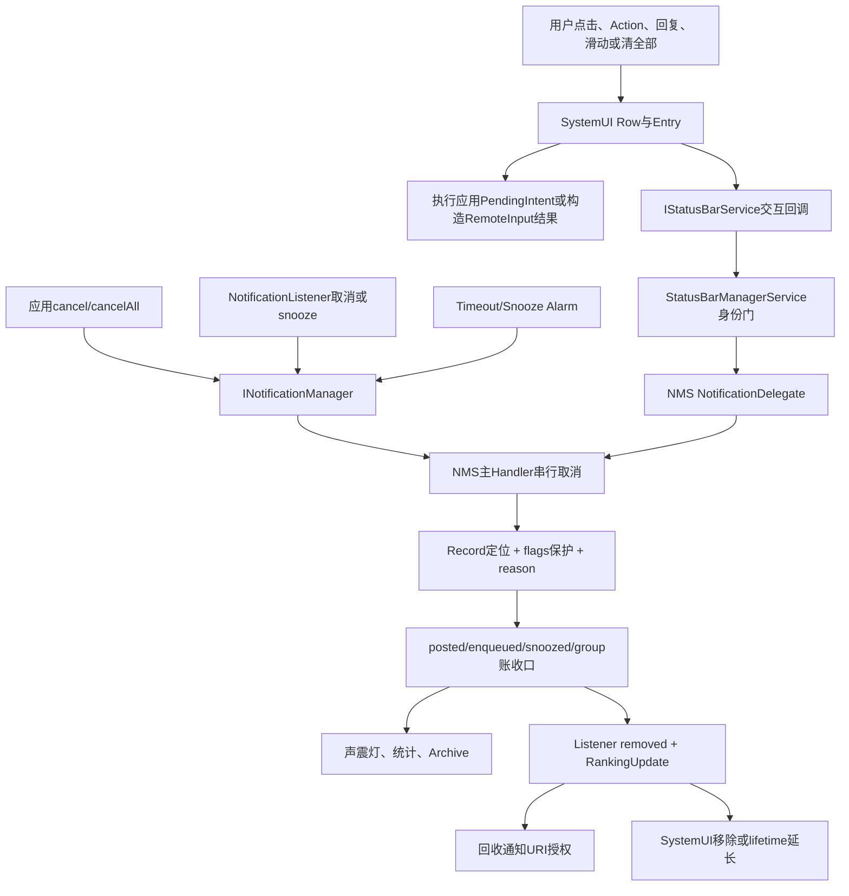
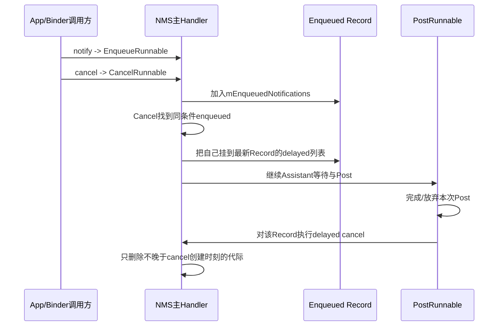
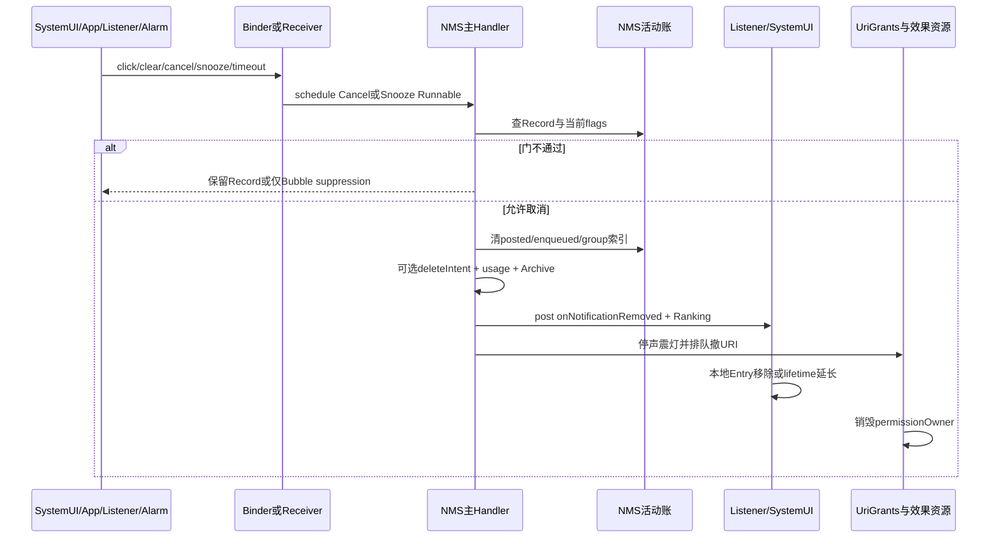

# 第535章 Android通知反向生命周期：点击、滑动、Action/RemoteInput、取消、FGS保护、Snooze、Timeout、历史与资源回收

> 源码基线：Android 11 / API 30 / `android-11.0.0_r48`。本章直接阅读`frameworks/base/packages/SystemUI/src/com/android/systemui/statusbar`、`frameworks/base/services/core/java/com/android/server/statusbar/StatusBarManagerService.java`、`frameworks/base/services/core/java/com/android/server/notification/NotificationManagerService.java`、`SnoozeHelper.java`、`NotificationHistoryManager.java`、`NotificationHistoryDatabase.java`以及`frameworks/base/core/java/android/service/notification/NotificationListenerService.java`。只读源码，不在macOS上编译。

## 1. 本章解决什么问题

通知栏的一行消失，可能是点击后的自动取消、手势滑走、清除全部、应用主动`cancel()`、Listener取消、Channel/App被关闭、前台服务结束、snooze或timeout。它们表面相同，权限、保护flags、`deleteIntent`、reason、Group子项、历史、声音和URI回收却不同。本章从SystemUI交互反向追到NMS最终收口。

## 2. 一句话定位

通知移除不是“删掉一个View”：SystemUI先执行或记录用户交互，经`StatusBarManagerService`把可信事件交给NMS；NMS把取消串行化到主Handler，核对key/id、user和flags，协调posted/enqueued/snoozed三张账，再异步通知Listener、回收URI授权、停止效果、归档原因；SystemUI收到removed后还可因RemoteInput、动画或Bubble临时保留本地Entry。

## 3. 先区分五种“消失”

第一种只是HUN收回，通知仍在shade；第二种只是Bubble通知从shade被suppressed，NMS仍保留活动Record；第三种SystemUI把Entry本地标记dismissed，等待服务端removed；第四种NMS已从活动集合移除，但SystemUI lifetime extender暂存Row；第五种NMS、SystemUI和资源授权都收口。抓屏只能证明第一层视觉事实，不能证明服务端已取消。

## 4. 反向链中的六个角色

应用拥有内容`PendingIntent/deleteIntent`并可发起cancel；SystemUI拥有Row、手势、keyguard和本地Entry；`IStatusBarService/StatusBarManagerService`认证状态栏调用；NMS维护权威Record与reason；NotificationListener/Assistant接收removed；Alarm、SnoozeHelper、History与UriGrantsManager分别承担未来触发、暂存、审计和资源能力回收。

## 5. 端到端总图



## 6. key、tag/id与Record代际

SystemUI交互通常携带`StatusBarNotification.getKey()`，应用API主要携带pkg/tag/id/user。NMS最终会定位`NotificationRecord`。同一个key可经历多次更新，因此key能确认“逻辑通知”，却不能天然确认“第几代Record”。取消与更新并发时，源码还要借Handler顺序、enqueued附着和时间戳减少误删。

## 7. reason不是装饰性日志

Android 11定义1—19号取消原因：click、单条/全部用户取消、error、package变化、user停止、package屏蔽、app单条/全部、listener单条/全部、group summary、group优化、package suspended、profile关闭、unautobundle、channel屏蔽、snoozed、timeout。它会进入Listener回调、usage统计、Archive和Metrics，诊断时应先看reason再猜来源。

## 8. 常见入口对照表

| 入口 | 典型reason | `sendDelete` | 关键保护 |
|---|---:|---:|---|
| 点击普通行 | CLICK | false | 必须有AUTO_CANCEL；FGS/Bubble不能删 |
| 用户滑动 | CANCEL | true | Ongoing/FGS不能删，UI通常也挡NO_CLEAR |
| 清除全部 | CANCEL_ALL | true | Ongoing/NO_CLEAR/Bubble保留 |
| App `cancel()` | APP_CANCEL | false | 非system不能删FGS/AutoGroup Summary |
| App `cancelAll()` | APP_CANCEL_ALL | false | FGS保留 |
| Listener单条 | LISTENER_CANCEL | true | Ongoing/FGS保留；Bubble改为suppressed |
| Snooze | SNOOZED | false | 移入SnoozeHelper，允许未来repost |
| Timeout | TIMEOUT | true | FGS保留 |

## 9. 普通Row点击的第一站

`NotificationClicker.onClick()`只接受`ExpandableNotificationRow`。它先唤醒doze设备、取得Entry并记录日志，再把真正工作交给`NotificationActivityStarter`。这个类本身既不执行应用Intent，也不直接调用NMS取消。

## 10. 不是Row上任何一点都打开应用

菜单已展开时点击只把Row滑回原位；父Group菜单展开、Summary子项已展开、Guts设置面板暴露时也会return。展开箭头、App Ops图标等区域各有自己的监听器。源码先排除这些UI语义，才把剩余点击理解成“打开通知”。

## 11. Row何时安装点击监听器

通知存在`contentIntent`、`fullScreenIntent`或Entry是Bubble时才注册Clicker。注意fullScreenIntent不仅用于投递时全屏打断：若没有contentIntent，普通行点击也可退到它；Bubble可以没有这两个Intent，由BubbleController负责展开。

## 12. 正在输入时点击Row只收起输入框

如果该Entry的RemoteInput正active且编辑框有文字，ActivityStarter认为本次点击可能是误触，只调用`closeRemoteInputs()`并return。此时不发PendingIntent、不上报普通click，也不触发AUTO_CANCEL。

## 13. contentIntent、fullScreenIntent和Bubble三分路

优先使用contentIntent，否则取fullScreenIntent；Bubble不走普通PendingIntent启动，而是展开并选中Bubble。非Bubble且两个Intent都为空属于防御性异常路径，记录non-clickable后结束。Bubble点击也会上报交互，但NMS的CLICK取消门明确排除FLAG_BUBBLE。

## 14. Keyguard不是简单先解锁再启动

SystemUI判断Intent是否会进入Resolver、能否显示在锁屏之上、当前Keyguard是否occluded。可直接over-lockscreen时先折叠shade再执行；其他情况交给`dismissKeyguardThenExecute()`。返回值还影响解锁动画是否等待panel折叠。

## 15. 工作资料有独立challenge

Activity PendingIntent的creator user若启用separate profile challenge且仍锁定，SystemUI先启动工作资料解锁页，并把IntentSender和notification key交给挑战流程。挑战成功前既不执行原PendingIntent，也不移除通知；不能把主用户已解锁当成工作资料一定可启动。

## 16. 真正启动应用发生在SystemUI

```java
int launchResult = intent.sendAndReturnResult(
        mContext, 0, fillInIntent, null, null, null, getActivityOptions(adapter));

mClickNotifier.onNotificationClick(notificationKey, nv);

// system_server中的NMS回调是另一条链
cancelNotification(callingUid, callingPid, sbn.getPackageName(), sbn.getTag(),
        sbn.getId(), Notification.FLAG_AUTO_CANCEL,
        FLAG_FOREGROUND_SERVICE | FLAG_BUBBLE, false, r.getUserId(),
        REASON_CLICK, nv.rank, nv.count, null);
```

第一段执行应用能力，第二段向状态栏服务报告交互，第三段才是NMS按条件取消。三者不是一次跨进程事务。

## 17. 点击可带未发送的RemoteInput草稿

Entry若保存了`remoteInputText`且当前不在spinning，SystemUI构造fill-in Intent并放入`Notification.EXTRA_REMOTE_INPUT_DRAFT`。这是“把草稿告诉被打开的应用”，不是`RemoteInput.addResultsToIntent()`的正式回复结果。

## 18. PendingIntent失败仍可能上报click

`startNotificationIntent()`捕获RemoteException或CanceledException只记录失败，调用者随后仍计算rank/count、调用ClickNotifier并执行本地AUTO_CANCEL判断。因此“目标Activity没打开”不保证通知继续存在，这是r48非常反直觉的控制流。

## 19. 点击回调先经过StatusBarManagerService身份门

`NotificationClickNotifier`调用`IStatusBarService.onNotificationClick()`；服务端先`enforceStatusBarService()`，保存calling uid/pid，清除Binder身份后转交NMS注册的`NotificationDelegate`。普通应用不能伪造状态栏滑动或点击来取消别人的通知。

## 20. NMS先记交互，再尝试AUTO_CANCEL

NMS按key找活动Record，记录Metrics、NotificationRecordLogger和EventLog，然后调用cancel。CancelRunnable真正找到Record时才`registerClickedByUser()`；即使flags门阻止删除，用户交互仍已由前半段上报给Assistant和日志。

## 21. 点击取消要求FLAG_AUTO_CANCEL

NMS把`FLAG_AUTO_CANCEL`作为`mustHaveFlags`。没有该flag的通知即使应用Intent成功启动，也不会因CLICK被NMS移除。SystemUI的`shouldAutoCancel()`与服务端必须条件构成两侧一致性保护，但权威判断仍在服务端Runnable执行时使用当前Record flags。

## 22. 点击不会取消FGS和Bubble

CLICK的`mustNotHaveFlags`含`FLAG_FOREGROUND_SERVICE | FLAG_BUBBLE`。FGS即使应用误设AUTO_CANCEL也不会因点击结束；Bubble点击要展开浮窗而不是杀掉承载Bubble的通知。两者可能收掉HUN或shade表现，不等于Record被取消。

## 23. SystemUI会先移除HUN表现

真正启动前`removeHUN()`会立即release heads-up。源码注释明确说AUTO_CANCEL通常很快由NoMan完成，但不能假定，因此HUN先独立收回。看到顶部横幅消失而shade仍有条目，是这条本地表现链，而非取消失败。

## 24. SystemUI还会请求本地移除

点击完成后，非Bubble且应AUTO_CANCEL，或Entry正为RemoteInput历史保留时，ActivityStarter调用本地`removeNotification(entry)`。服务端CLICK回调也会取消同一逻辑通知；旧/新pipeline用状态和reason去重。短时间内“两边都在移除”是协议设计，不是必然重复回调。

## 25. 唯一子项会顺带处理Summary

若被点击通知是Group唯一child、child和summary都应auto-cancel，SystemUI先记住parent并在点击后移除它。NMS取消summary还可能级联child。新pipeline可用group pruning减少这段显式补丁，阅读r48必须区分旧EntryManager和新NotifPipeline开关。

## 26. Action点击不等于Row点击

Action由RemoteViews的`OnClickHandler`接管。它可能打开RemoteInput编辑框，也可能直接发送Action PendingIntent；同时上报`onNotificationActionClick()`。NMS Action回调只做统计、用户交互与Assistant通知，不调用cancel，因此Action自身不会因`FLAG_AUTO_CANCEL`自动删除整条通知。

## 27. Action先校验它仍属于当前Notification

SystemUI从View tag取得原始action index，重新读取当前SBN actions，检查数组范围，并验证当前Action的`actionIntent`仍等于被点击PendingIntent。通知可能刚更新，校验能避免旧View的按钮被记到新Action上；自定义RemoteViews没有标准tag时只执行而不记标准Action日志。

## 28. Action的buttonIndex与actionIndex不是同一数

`actionIndex`来自Notification.actions数组，用来取Action；`buttonIndex`是默认模板action容器中的可见位置，用来上报。过滤、上下文Action或模板布局可能使两者不能简单互换。NMS日志接收的是后者及完整Action对象。

## 29. Action PendingIntent仍由SystemUI执行

非RemoteInput Action先`resumeAppSwitches()`，再通过Callback处理Keyguard、Activity启动与panel折叠，最终通常由`RemoteViews.startPendingIntent()`发送。NMS只收到事后交互报告，不代理执行应用业务Intent。

## 30. Action回调会通知Assistant

NMS记录位置、rank/count、是否contextual、是否由Assistant生成，然后`reportUserInteraction(r)`并调用`notifyAssistantActionClicked()`。这给Assistant学习和调整提供反馈，但不保证应用的PendingIntent成功，也不改变通知是否活动。

## 31. Smart Action与Smart Reply要分开

Smart Action仍是Notification.Action PendingIntent，`generatedByAssistant`参与日志；Smart Reply把候选文本塞进RemoteInput结果。两者都可调用Action统计，但回复还会有direct replied、suggestion index、是否编辑过等额外回调。

## 32. RemoteInput按钮先尝试“激活输入”

OnClickHandler先调用`handleRemoteInput()`；若Action包含允许free-form或choice的RemoteInput，就寻找当前Row中attached的`RemoteInputView`、展开Row并做圆形reveal。成功时return true，不立刻发送Action PendingIntent。

## 33. 锁屏RemoteInput有主用户和工作资料两条门

当锁屏不允许直接回复，SystemUI分别判断当前用户public mode、Keyguard状态、managed profile是否锁定及父用户是否锁定，转给`onLockedRemoteInput()`或`onLockedWorkRemoteInput()`。只有通过对应认证后才重新定位输入View。

## 34. 文本回复的fill-in Intent怎样形成

`RemoteInput.addResultsToIntent()`把resultKey→文本Bundle封入Intent，并标记结果来源是free-form还是choice。Entry同步保存remoteInputText，供spinner、草稿或历史重建使用。这个fill-in Intent随后作为第二参数发送原Action PendingIntent。

## 35. 图片回复还要临时URI能力

data RemoteInput先用`grantInlineReplyUriPermission()`让目标能读附件URI，再用`RemoteInput.addDataResultToIntent()`写mime→Uri。Entry保存mime与Uri，以便历史延长时重建展示。它与通知内容URI授权是两套生命周期，排障时不能只看NMS的notification permissionOwner。

## 36. 点击发送按钮的精确顺序

```java
mEditText.setEnabled(false);
mProgressBar.setVisibility(VISIBLE);
mEntry.lastRemoteInputSent = SystemClock.elapsedRealtime();
mController.addSpinning(mEntry.getKey(), mToken);
mController.removeRemoteInput(mEntry, mToken);
mController.remoteInputSent(mEntry);
mEntry.setHasSentReply();
mPendingIntent.send(mContext, 0, intent);
```

RemoteInputView先禁用输入、显示progress，记录发送时间并把key加入spinning；随后从active input集合移除、通知controller“已发送”、标记hasSentReply，最后才发送应用PendingIntent。因此UI可先进入发送态，再遇到CanceledException。

## 37. direct reply统计也早于业务成功确认

`RemoteInputController.remoteInputSent()`触发Manager callback，后者调用状态栏服务的`onNotificationDirectReplied()`，必要时还上报SmartReply信息。这一时刻应用PendingIntent在源码顺序上尚未send；统计表达“用户按了发送”，不表达接收方已处理。

## 38. RemoteInput需要三种lifetime extender

RemoteInputHistoryExtender保存已发送内容；SmartReplyHistoryExtender保存智能回复状态；RemoteInputActiveExtender在用户仍输入时保留已被服务端取消的Entry。NMS权威Record可能已不存在，但SystemUI仍能用原Entry的轻量重建SBN短暂显示。

## 39. “回复历史”是SystemUI本地合成

HistoryExtender调用`rebuildNotificationWithRemoteInput()`，把用户回复和spinner等字段合成新SBN，再直接`mEntryManager.updateNotification()`。这不是应用重新notify，也不会把合成Record写回NMS活动列表；应用后续真实更新到来才重新统一两边状态。

## 40. Active延长结束有200ms宽限

如果通知从应用视角已取消但用户当时仍在输入，发送后SystemUI等待200ms；若应用期间post更新，就可自然接棒，否则回调safe-to-remove。这里的200ms与上一章Assistant发布窗口恰好同数值，但完全是不同进程、不同目的和不同计时器。

## 41. RemoteInput不自动等价于NMS cancel

回复Action是否让通知消失由应用接收后是否cancel/update，以及服务端是否已因别的原因removed决定。SystemUI的延长器只改变本地Entry回收时机，不能替应用调用NMS取消，也不能恢复已撤销的权威Record。

## 42. 手势滑动从可dismiss判断开始

`SwipeHelper`先问Stack回调`canChildBeDismissed()`；Row又委托`NotificationEntry.isClearable()`并叠加锁屏敏感内容限制。经典`StatusBarNotification.isClearable()`要求既无ONGOING_EVENT也无NO_CLEAR，因而多数受保护通知根本不会进入正常滑走回调。

## 43. Android 11同时保留两套SystemUI collection

旧链由NotificationLogger的clear callback直接调用barService，新NotifPipeline由`NotifCollection.dismissNotifications()`发送同一`onNotificationClear()`并立即把Entry加入本地dismissed集合。Feature flag决定运行路径，读到两份实现不能误认为一次滑动必定发送两次Binder。

## 44. dismissalSurface描述“从哪里消失”

SystemUI按状态填SHADE、PEEK或AOD，并携带neutral sentiment、rank、count、location。NMS把surface/sentiment先记入Record stats，再发起REASON_CANCEL。Assistant可获得stats，普通Listener移除回调不会获得这份完整统计。

## 45. 本地dismiss与服务端cancel存在窗口

新NotifCollection先发送Binder，再`locallyDismissNotifications()`并重建列表；Binder异常也不阻止本地dismiss。反过来服务端可能因flags保护不删除Record，后续ranking/posted更新会让条目回到UI或转入其他表现。瞬时消失不能证明NMS接受了取消。

## 46. NMS用户clear的flags门

NMS传`mustHave=0`、`mustNotHave=ONGOING_EVENT|FOREGROUND_SERVICE`、`sendDelete=true`。它没有在这一层显式列NO_CLEAR，因为正常SystemUI已用isClearable拦截；安全边界仍依赖只有通过STATUS_BAR_SERVICE权限的调用方能到此。

## 47. deleteIntent只在“像用户删除”的路径发送

滑动、clear all、Listener取消、timeout会以`sendDelete=true`进入中心取消；CLICK和应用主动cancel传false，snooze也传false。`deleteIntent`因此更接近“用户清除了通知”的回调，不能当成“通知无论任何原因结束”的统一析构函数。

## 48. 发送deleteIntent前撤掉后台启动白名单

NMS调用ActivityManagerInternal清除这个PendingIntent基于通知获得的background activity start allowlist，再执行`deleteIntent.send()`。这避免删除回调沿用通知交互白名单偷偷拉起Activity；CanceledException仅日志，不阻塞其余资源回收。

## 49. FGS dismissal实验开关造成两层语义差

r48的`notifications_allow_fgs_dismissal`默认false；开启时SystemUI的Entry可把FGS判为可dismiss，但NMS `onNotificationClear()`仍把FOREGROUND_SERVICE列入mustNotHave。结果可以是shade本地隐藏/FGS区另行承载，而权威通知与前台服务未被取消。不要仅凭滑走断言服务已停止。

## 50. “清除全部”比逐条滑动多保护Bubble

NMS `cancelAllLocked()`排除ONGOING_EVENT、NO_CLEAR；当reason是用户或Listener的cancel-all时还排除BUBBLE。新NotifCollection本地clear-all也检查Entry clearable并排除Bubble。普通单条listener cancel Bubble则走特殊suppression，不是同一策略。

## 51. App单条cancel先校验归属与delegate

`cancelNotificationInternal()`经`handleIncomingUser()`规范用户，用`resolveNotificationUid()`验证pkg/opPkg/callingUid。delegate替目标包取消时还要确认当前Record确实由该opPkg发布；找不到Record不会据此放宽跨包权限。

## 52. App cancel不发送deleteIntent

应用自己已经知道发起了取消，所以`sendDelete=false`，reason为APP_CANCEL。中心仍会通知Listener、停止声震灯、记Archive和日志、撤URI；只是不会再回调应用的deleteIntent，也不会计为“用户dismiss”。

## 53. 普通App不能单条取消FGS与AutoGroup Summary

非system调用的`mustNotHaveFlags`包含FOREGROUND_SERVICE和AUTOGROUP_SUMMARY。后者是NMS/GroupHelper生成的内部摘要，不应被应用按碰巧相同id/tag删除；前者要等ActivityManager结束或移除前台服务标记后再取消。

## 54. App cancelAll同样保留FGS

`cancelAllNotifications()`传`mustNotHave=FLAG_FOREGROUND_SERVICE`，遍历posted和enqueued，同包其他通知都可移除。它随后把该包snoozed Record标为canceled，避免闹钟到期后复活；但标记并不立即从所有SnoozeHelper映射删除。

## 55. system调用可越过普通App保护

单条cancel的调用uid为system时`mustNotHaveFlags=0`；App/Channel被系统禁用、包卸载、用户停止等内部路径也能用自己的reason与flags checker清理FGS。保护的含义是“普通来源不能破坏ActivityManager的前台服务契约”，不是Record永不可移除。

## 56. Listener按key取消仍受profile可见范围限制

NMS用listener token查`ManagedServiceInfo`，每个key取Record并校验目标user等于listener user、USER_ALL或当前profile。越界直接SecurityException；keys为null才表示模拟clear-all，并按Listener是否supportsProfiles决定是否覆盖当前资料。

## 57. Listener单条取消也保护ONGOING与FGS

`cancelNotificationFromListenerLocked()`传`mustNotHave=ONGOING_EVENT|FOREGROUND_SERVICE`、`sendDelete=true`和REASON_LISTENER_CANCEL。因此通知监听器不是任意通知管理员；即便它能看到Record，也不表示能结束前台服务或ongoing事件。

## 58. Listener取消Bubble会改suppression而非删除

CancelRunnable在通用flags检查之前发现reason是LISTENER_CANCEL且Record带BUBBLE，就调用`onBubbleNotificationSuppressionChanged(key,true)`后return。它甚至不会继续中心cancel。Bubble仍在NMS活动账，只是不再按普通shade通知显示。

## 59. Listener旧版pkg/tag/id接口可能被忽略

支持profiles的Listener若调用deprecated `cancelNotification(pkg,tag,id)`，NMS只写错误日志并要求改用key；不支持profiles时才按listener自己的user继续。key把user等身份纳入，能避免旧接口在多资料场景歧义。

## 60. 所有普通单条取消都排入同一个主Handler

NMS的`cancelNotification()`不立即持锁删除，而是`mHandler.scheduleCancelNotification(new CancelNotificationRunnable(...))`。原因是notify入队也在这个Handler上：同一队列可维持“先notify、后cancel”的调用顺序，避免Binder线程竞争导致cancel先查不到、随后通知反而出现。

## 61. cancel追上尚未Post的通知



取消不是简单丢弃尚未发布对象，而是附着到最后一个匹配enqueued Record，待Post收尾点执行，保证相关账和回调顺序一致。

## 62. `mWhen`试图保护cancel之后的新更新

CancelRunnable构造时记录当前wall time。最终`removePreviousFromNotificationListsLocked(r,mWhen)`只打算移除更新时间不晚于cancel的enqueued Record，让cancel后重新notify的更新存活。posted列表同key项则直接移除，因为权威活动账按key只有当前项。

## 63. r48的enqueued移除实现有可疑列表写错

该方法遍历`mEnqueuedNotifications`匹配项后，条件命中却调用`mNotificationList.remove(record)`，而不是`mEnqueuedNotifications.remove(record)`。这是直接源码事实，可能让并发同key等待项残留；分析异常重现时应先检查后续Post与delayed cancel是否掩盖它，不应擅自把意图当成实际实现。

## 64. delayed cancel绑定Record，但最终查找仍回到逻辑身份

map以enqueued `NotificationRecord`对象为key，Post完成后能取回正确cancel列表；然而`doNotificationCancelLocked()`最终按pkg/tag/id/user查posted Record。`mWhen`和Handler顺序共同降低误删新代际，仍不是完整generation token协议。

## 65. flags是在取消真正执行时检查

`mustHave/mustNotHave`针对最终查到的当前Record flags，而不是调用入口看到的旧flags。若通知在排队期间更新为FGS、去掉AUTO_CANCEL或变Bubble，旧cancel可能被保护门挡住；这正是服务端再次验证而非信任SystemUI本地状态的价值。

## 66. flags门可以写成两个布尔条件

只有`(flags & mustHave) == mustHave`且`(flags & mustNotHave) == 0`才允许删除。CLICK用“必须AUTO_CANCEL且不得FGS/Bubble”；用户clear用“不得Ongoing/FGS”；App cancel用“不得FGS/AutoSummary”。同一个flags值在不同reason下可能得到完全不同结果。

## 67. 中心删除同时清posted和旧enqueued

`removeFromNotificationListsLocked()`按key从`mNotificationList`移一项，并循环清全部同key enqueued；返回`wasPosted`表示它是否真正到过活动列表。Snooze路径用它，普通CancelRunnable则使用带时间约束的previous版本。

## 68. 中心取消的核心收口

```java
if (sendDelete && r.getNotification().deleteIntent != null) {
    clearPendingIntentAllowBgActivityStarts(deleteIntent.getTarget(), WHITELIST_TOKEN);
    deleteIntent.send();
}
if (wasPosted && r.getNotification().getSmallIcon() != null) {
    if (reason != REASON_SNOOZED) r.isCanceled = true;
    mListeners.notifyRemovedLocked(r, reason, r.getStats());
}
mArchive.record(r.getSbn(), reason);
```

这段展示三条独立条件：是否回调应用、是否真的发布且有smallIcon、是否允许未来repost。Archive记录又不依赖`wasPosted`条件。

## 69. `wasPosted=false`不会伪造Listener removed

尚在enqueued就被取消的Record没有真正向Listener posted，因此中心不会发送removed、也不会停止它从未拥有的声震灯。它仍可进入Archive/metrics，诊断历史时不能简单把每条取消记录理解成用户曾在屏幕看到。

## 70. null smallIcon边界延续到移除链

上一章确认r48某条Post异常路径可能让null-smallIcon Record留在活动账。中心取消即使`wasPosted=true`，也因smallIcon为空跳过`notifyRemovedLocked()`和`r.isCanceled=true`，但仍做后续统计、group map与Archive。Listener和NMS账可能出现不对称边界。

## 71. Snooze刻意不把Record标成永久canceled

中心看到REASON_SNOOZED时不设`r.isCanceled=true`，因为SnoozeHelper未来要用原Record重新入队。App cancel、cancelAll等随后可以把snoozed Record设为canceled，使到期repost检测后不再复活。

## 72. Listener removed是异步扇出

NMS持`mNotificationLock`构造light clone和每个Listener的RankingUpdate，再把远程调用post到Handler。它不会持锁同步等待SystemUI或第三方Listener完成，避免外部Binder拖住通知总锁。因此NMS活动账已删除与SystemUI Row真正回收之间天然有延迟。

## 73. 只有Assistant能收到NotificationStats

`notifyRemovedLocked()`判断服务token是否属于Assistants；普通Listener的stats参数为null。所有可见Listener仍得到reason与RankingUpdate，但dismissal surface/sentiment只给Assistant，限制更细的用户行为数据扩散。

## 74. URI授权在removed任务之后排队回收

NMS先为所有Listener排入removed回调，再post `updateUriPermissions(null,r,null,USER_SYSTEM)`。同一Handler FIFO意味着Listener通知任务先运行，随后销毁notification permissionOwner并撤销所有内容URI读取能力；这给回调解包一个有序窗口，却不是无限期授权。

## 75. 单个Listener解绑只撤自己的URI能力

活动通知仍存在而某Listener失去访问权时，NMS用`onlyRevokeCurrentTarget=true`按target package/user撤销，不能销毁共享owner，否则其他Listener也会突然失去访问。整条通知移除才可传target=null销毁owner并广泛回收。

## 76. 声音、震动、灯按owner key清理

只有取消key等于当前sound/vibrate owner才停止播放器或Vibrator；灯列表总是移除该key，之后`updateLightsLocked()`寻找下一个有效owner。取消一条静默通知不应误停另一条正在响的通知。

## 77. usage统计只认部分reason类别

用户单条/全部与Listener单条/全部进入`registerDismissedByUser()`；App单条/全部进入`registerRemovedByApp()`；CLICK另在CancelRunnable记`registerClickedByUser()`。Timeout、Channel banned、Snooze等不强行归到“用户dismiss”或“应用remove”。

## 78. Group与AutoBundle索引也要收口

若被取消Record正是`mSummaryByGroupKey`里的summary，就删除映射；若是该user/pkg的autobundled summary，也删除`mAutobundledSummaries`记录。只删主list不清索引，会让下一次分组误以为旧summary仍存在。

## 79. `mArchive`是有界内存最近删除账

Archive按资源配置容量保存`StatusBarNotification.cloneLight()`和reason，达到容量移除最旧项；仅对启用history的normalized user记录。`getHistoricalNotifications()`读取它并可选择排除SNOOZED。它不等于磁盘上“过去24小时”的新NotificationHistory系统。

## 80. 持久NotificationHistory在“打扰被确认”时写

NMS的`maybeRecordInterruptionLocked()`只对`r.isInterruptive()`且尚未记录的通知构造HistoricalNotification，保存package、uid、user、channel、当前时间、标题、文本和smallIcon。它可能在可见/seen路径被触发，和最终cancel reason没有直接一一对应。

## 81. 不是所有posted或removed通知都进24小时历史

FGS更新会被`isVisuallyInterruptive()`特意排除视觉打扰；静默且未被判定interruptive的通知也不会由这条方法写History。设置页文案“通知历史”不表示完整审计所有notify调用，更不保证每次更新都一条记录。

## 82. 磁盘History默认保留24小时

`NotificationHistoryDatabase`把retention定义为1天，内存buffer默认延迟20分钟写盘，system_server准备关机时触发force write。读API可以合并当前用户profiles；时间窗口、写缓冲和用户状态决定能否立即在设置页看到。

## 83. History位于用户CE目录

每用户数据库目录是`Environment.getDataSystemCeDirectory(userId)/notification_history`，只有用户解锁且secure setting启用时初始化。工作资料随profile读取和锁定状态独立可用；设备刚启动未解锁时不能把“数据库暂不可读”误判成历史丢失。

## 84. 关闭历史会清数据而非只停写

SettingsObserver监听`NOTIFICATION_HISTORY_ENABLED`并把父用户选择应用到profiles。关闭时`disableHistory()`调用数据库清理、把enabled设false并释放user state；用户锁定期间则记pending disable，解锁后执行。

## 85. 两套历史回答不同问题

Archive回答“最近哪些SBN以什么reason离开活动账”，内容轻量、有界、在内存；NotificationHistory回答“过去约24小时哪些通知被认定为interruptive”，内容进一步裁剪、落CE磁盘。排障时一个能看到而另一个看不到，可能完全符合设计。

## 86. 取消Group Summary会级联child

中心取消summary后遍历posted与enqueued，匹配groupKey的非summary child以REASON_GROUP_SUMMARY_CANCELED取消。它用固定child reason而非继承parent原reason，因此Listener能区分“child自己被清”与“因summary一起消失”。

## 87. FGS child永远跳过Summary级联

`cancelGroupChildrenByListLocked()`明确要求child没有FLAG_FOREGROUND_SERVICE。Group summary被滑掉、点击auto-cancel或应用取消时，正在承载前台服务的child都不能因视觉分组关系被带走。

## 88. 重要Conversation有一个用户滑动特例

当parent reason正是REASON_CANCEL时，important conversation child不会因summary取消而级联；其他reason仍可按规则处理。这让用户手动清summary时保留被提升的重要对话，不应概括成“所有Group child必然随summary消失”。

## 89. Bubble child在三种手动原因下保留

当reason是CANCEL、CLICK或CANCEL_ALL，CancelRunnable给child checker排除FLAG_BUBBLE。Bubble可能继续存在于浮窗栈，即使承载它的shade summary被手动处理。这个规则与Listener单条Bubble的suppression分支相互补充。

## 90. Snooze入口只接受正时长或criterion

Listener可按duration或Assistant criterion snooze；duration<=0且criterion为空、或key为空会直接return。调用先校验Listener token，再把SnoozeRunnable post到主Handler，以便找到尚未完全入队或已在SnoozeHelper中的Record。

## 91. Snooze Group有对称性修正

snooze summary会一起snooze全部children；snooze某child时，如果group恰好只有summary+该child，也把summary一起snooze，避免留下空summary。多个children时只snooze目标child与必要项，不把整个group一刀切。

## 92. Snooze先走removed，再进入暂存账

SnoozeRunnable先从posted/enqueued移除，调用中心cancel(reason=SNOOZED,sendDelete=false)，更新灯，再通知Assistant criterion，最后把Record存进SnoozeHelper并记recordSnoozed。Listener看到的是removed/SNOOZED，未来repost又会看到posted。

## 93. SnoozeHelper保存三类映射

内存`mSnoozedNotifications`持完整NotificationRecord；持久time map保存key→墙钟触发时间；持久context map保存key→Assistant criterion id；另有key→package和key→user辅助索引。完整Record本身没有序列化到policy XML。

## 94. “Snooze跨重启”不是恢复完整通知对象

XML只写version、key、pkg、user以及time或context。system_server重启后没有旧NotificationRecord可直接repost；当应用重新发布相同key时，EnqueueRunnable查持久time/context并再次把新Record snooze，直到期限或Assistant解除。

## 95. 时间Snooze同时使用两套时钟

持久activateAt用`System.currentTimeMillis()`并以AlarmManager `RTC_WAKEUP`调度，适合跨重启保存绝对时间；普通通知timeout则用`elapsedRealtime()`。手动改系统时间会影响snooze墙钟语义，却不会按相同方式改变本次启动内的timeout倒计时。

## 96. Snooze alarm用key放进Intent data

PendingIntent requestCode固定，但data是`repost:/<key>`，使不同通知获得不同identity；调度前先cancel同一PI再`setExactAndAllowWhileIdle()`。到期广播调用`repost(key,user,false)`，清持久映射并取消闹钟。

## 97. Repost会静默重新进入完整投递链

SnoozeHelper callback调用`enqueueNotificationInternal(...,postSilently=true)`，而不是直接把旧Record塞回`mNotificationList`。Channel、blocked、ranking、Assistant与Listener全部重新裁决；“muteOnReturn”参数在这个r48 callback中没有直接传递，实际固定用postSilently实现静默返回。

## 98. canceled的Snooze Record不会复活

App cancel/cancelAll找不到posted时会把匹配snoozed Record的`isCanceled`置true；repost先从映射取出Record，只有`record != null && !record.isCanceled`才回调NMS。标记取消和物理删除映射是不同动作，闹钟到期才可能完成清理。

## 99. System Listener与Assistant的unsnooze权限不同

Assistant可`unsnoozeNotificationFromAssistant()`；普通System Listener只有`info.isSystem`才允许deadline前unsnooze，否则SecurityException。`muteOnReturn`可由system listener传true，但如上一节所述，r48 NMS callback没有使用该形参而统一postSilently。

## 100. Timeout从EnqueueRunnable开始计时

Record加入`mEnqueuedNotifications`后立即`scheduleTimeoutLocked()`，Assistant最多约200ms等待和SystemUI膨胀时间都包含在timeout窗口内。`getTimeoutAfter()`不是“用户第一次看见后计时”，极短timeout可能在Row出现前就到期。

## 101. Timeout Alarm使用elapsed realtime

NMS以`ELAPSED_REALTIME_WAKEUP`在当前elapsed+timeoutAfter设置exact allow-while-idle alarm，Intent data包含notification key。它不受墙钟修改影响，设备休眠时也可唤醒；重启后elapsed归零且该非持久Alarm不会像Snooze XML那样恢复。

## 102. Timeout广播仍要重新找当前Record

Receiver从EXTRA_KEY查posted/enqueued当前Record，找到才按它此刻的pkg/tag/id/user调用cancel，reason=TIMEOUT、sendDelete=true、mustNotHave=FGS。旧Alarm不是持有原Record对象的定时任务。

## 103. 更新相同key会替换Timeout PendingIntent

timeout PI的identity由action/package/data key决定，`FLAG_UPDATE_CURRENT`更新extra；再次设置正timeout会把同identity alarm改到新的触发时间。tag/id相同的逻辑通知因此通常只有一个当前timeout alarm。

## 104. r48没有显式取消旧Timeout Alarm

源码只在`timeoutAfter>0`时schedule，没有在通知更新为0、正常取消或移除时调用AlarmManager.cancel。普通移除后旧广播到来只会查不到Record；但同key已重新发布时，旧Alarm可能命中新代Record并提前取消，这是key无generation的真实边界。

## 105. Timeout也不能结束FGS通知

广播路径将FOREGROUND_SERVICE作为mustNotHave。即使应用给FGS Notification配置timeoutAfter，到时NMS也会被flags门挡住。结束前台服务仍需ActivityManager/应用走正确stopForeground语义。

## 106. 从取消入口到资源回收的完整时序



## 107. 线程与锁边界

SystemUI点击/手势多在主线程，PendingIntent启动可切后台Handler；StatusBarManagerService在Binder线程认证后清身份；NMS取消工作统一回主Handler并持`mNotificationLock`维护多张账；Listener远程回调、GroupHelper和URI回收再次post出锁。看堆栈必须标出“入口线程”和“真正变更线程”。

## 108. 推荐源码阅读顺序

先从NotificationClicker/ActivityStarter看点击，再看NotificationRemoteInputManager和RemoteInputView；滑动从Stack、NotificationLogger或NotifCollection追barService；进入StatusBarManagerService认证，再读NMS NotificationDelegate、CancelRunnable、cancelNotificationLocked；最后读SnoozeHelper、HistoryManager、notifyRemovedLocked和URI回收。

## 109. 原因码排障清单

CLICK先查AUTO_CANCEL/FGS/Bubble；CANCEL先查surface与Ongoing；APP_CANCEL查pkg/opPkg和FGS/AutoSummary；LISTENER_CANCEL查profile与Bubble suppression；GROUP_SUMMARY查parent reason和child flags；SNOOZED查内存Record与XML元数据；TIMEOUT查Alarm旧代际；CHANNEL/PACKAGE_BANNED查Settings写入后的cancel-all。

## 110. r48关键边界集中复盘

PendingIntent失败后仍会上报click；Action只统计不自动取消；direct-reply统计早于PI发送；RemoteInput本地Entry可晚于NMS Record；clear Binder失败仍可本地dismiss；FGS dismissal feature与NMS保护分层；delayed cancel无generation且previous移除疑似写错list；null icon跳过removed；Snooze只持久化元数据；muteOnReturn未被callback使用；timeout从Enqueue计时且旧alarm不显式cancel。

## 111. 复读后的理解校正

第一次阅读最容易把“UI主动remove”和“NMS权威cancel”合并，也容易把Archive与24小时History合并。本章复读后应坚持四问：谁执行应用PendingIntent、谁改变权威Record、哪个reason和flags允许改变、SystemUI为何还能临时保留Entry。只要四问分别回答，点击、回复、滑动和Snooze就不会串账。

## 112. macOS只读练习一：拆开点击与Action

```bash
sed -n '35,125p' frameworks/base/packages/SystemUI/src/com/android/systemui/statusbar/notification/NotificationClicker.java
sed -n '230,445p' frameworks/base/packages/SystemUI/src/com/android/systemui/statusbar/phone/StatusBarNotificationActivityStarter.java
sed -n '120,225p' frameworks/base/packages/SystemUI/src/com/android/systemui/statusbar/NotificationRemoteInputManager.java
sed -n '900,975p' frameworks/base/services/core/java/com/android/server/notification/NotificationManagerService.java
```

画两列：Row click与Action click分别由谁send PendingIntent、何时上报barService、NMS是否调用cancel、AUTO_CANCEL是否参与。再解释PendingIntent异常为何不一定保住Row。

## 113. macOS只读练习二：手算取消flags矩阵

```bash
sed -n '5672,5710p' frameworks/base/services/core/java/com/android/server/notification/NotificationManagerService.java
sed -n '6268,6405p' frameworks/base/services/core/java/com/android/server/notification/NotificationManagerService.java
sed -n '8020,8290p' frameworks/base/services/core/java/com/android/server/notification/NotificationManagerService.java
sed -n '170,245p' frameworks/base/core/java/android/service/notification/NotificationListenerService.java
```

给AUTO_CANCEL、FGS、ONGOING、NO_CLEAR、BUBBLE、AUTOGROUP六个flags造五组组合，分别计算CLICK、用户滑动、App cancel、Listener cancel、clear-all能否删除，并标出Bubble suppression与Group child特例。

## 114. macOS只读练习三：验证Snooze与Timeout代际

```bash
sed -n '6187,6265p' frameworks/base/services/core/java/com/android/server/notification/NotificationManagerService.java
sed -n '180,455p' frameworks/base/services/core/java/com/android/server/notification/SnoozeHelper.java
sed -n '480,690p' frameworks/base/services/core/java/com/android/server/notification/SnoozeHelper.java
sed -n '6885,6910p' frameworks/base/services/core/java/com/android/server/notification/NotificationManagerService.java
```

画出snooze→removed→内存Record→XML元数据→alarm→repost链；再构造“timeout=10秒，5秒时同key更新为timeout=0”的时序，说明r48旧Alarm为何可能命中新代Record。

## 115. macOS只读练习四：追removed到URI与本地延长

```bash
sed -n '7750,8020p' frameworks/base/services/core/java/com/android/server/notification/NotificationManagerService.java
sed -n '9545,9610p' frameworks/base/services/core/java/com/android/server/notification/NotificationManagerService.java
sed -n '630,780p' frameworks/base/packages/SystemUI/src/com/android/systemui/statusbar/NotificationRemoteInputManager.java
sed -n '175,285p' frameworks/base/services/core/java/com/android/server/notification/NotificationHistoryDatabase.java
```

按“权威list删除、Listener任务、URI任务、SystemUI lifetime extender、History/Archive”排序；说明为什么removed callback到达、URI仍短暂可读和Row仍短暂存在可以同时成立。

## 116. 推荐的只读排障顺序

先确认只是HUN/Bubble/shade消失还是NMS active也消失；再查reason与flags；CLICK核对PI异常、AUTO_CANCEL，滑动核对isClearable和surface；应用/Listener取消核对身份与profile；Snooze/Timeout核对Alarm和同key更新；最后比对Archive、24小时History、Listener removed、URI permission owner与SystemUI retained entries。

## 117. 推荐断点链

SystemUI断`NotificationClicker.onClick`、ActivityStarter两个after方法、RemoteViews OnClickHandler、RemoteInputView.sendRemoteInput、NotifCollection.dismissNotifications；system_server断StatusBarManagerService三个交互回调、NMS NotificationDelegate、CancelRunnable.run/doNotificationCancelLocked、cancelNotificationLocked、notifyRemovedLocked、SnoozeRunnable与timeout receiver。

## 118. 本章容易说错的八句话

“点击Intent由NMS启动”错；“Action带AUTO_CANCEL就会删通知”错；“回复发送成功统计等于应用已收到”错；“Row消失等于Record删除”错；“deleteIntent是通用析构”错；“Listener能取消任何可见通知”错；“Snooze跨重启保存完整Record”错；“更新timeout为0一定撤掉旧闹钟”也错。

## 119. 本章知识闭环

正向投递把App Notification变成NMS Record和SystemUI Entry；反向生命周期从UI或其他授权入口产生带reason的请求，NMS主Handler对当前Record重新核权，用flags和Group规则决定是否删除，再把Listener、效果、Archive、History相关事实与URI能力分别收口。Snooze和RemoteInput是两个“看似删除、其实保留未来状态”的例外，但一个在NMS，一个在SystemUI。

## 120. 下一章预告

第536章进入PermissionController运行时权限主链：Manifest声明怎样变成PermissionInfo/PermissionGroup，应用请求如何穿过Activity、PackageManager与PermissionManagerService，PermissionController怎样生成授权UI、处理一次性授权、自动重置、角色与AppOps，并把结果回送应用。
