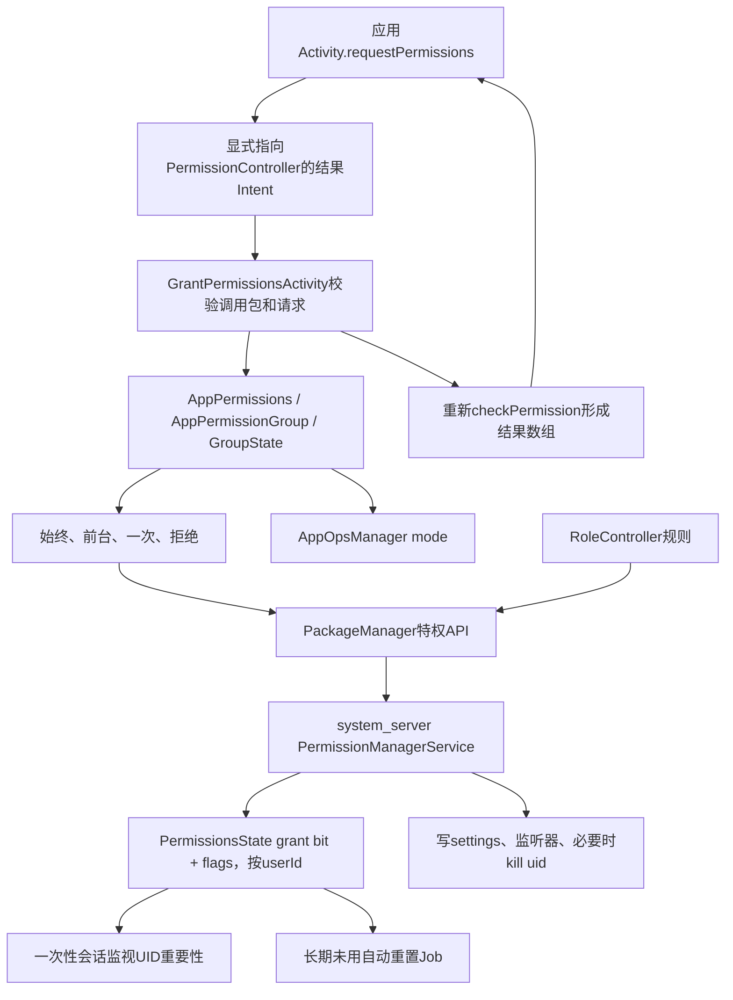
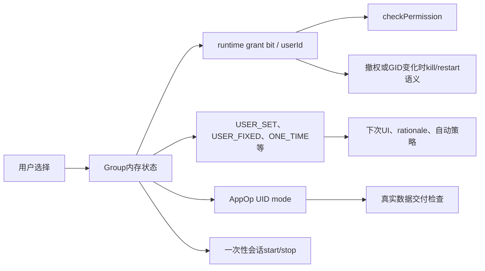
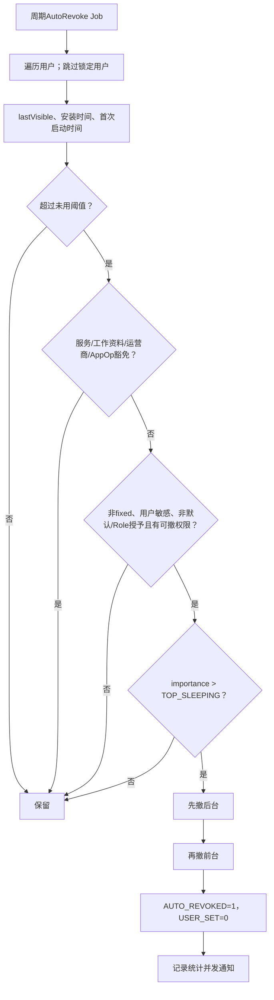

# 第536章 Android PermissionController运行时权限完整链：请求、授权UI、一次性授权、自动重置、Role与AppOps

> 源码基线：Android 11 / API 30 / `android-11.0.0_r48`。本章直接阅读`frameworks/base/core/java/android/app/Activity.java`、`android/content/pm/PackageManager.java`、`android/content/PermissionChecker.java`，`frameworks/base/services/core/java/com/android/server/pm/permission`，以及`packages/apps/PermissionController`中的授权UI、权限模型、一次性权限回收、自动重置和Role实现。只读源码，不在macOS上编译。

## 1. 本章解决什么问题

应用调用`requestPermissions()`后，为什么会跳出一个不属于应用的系统界面？“仅在使用中”“仅限这一次”“始终允许”“拒绝且不再询问”分别改变了哪几本账？权限明明显示已授权，为什么AppOps仍可能挡住实际访问？长期未使用自动重置、Role默认授权和设备策略又如何参与？本章把这些看似独立的功能串成一条可追踪链。

## 2. 一句话定位

运行时权限不是一个布尔值：应用Activity只发起请求并接收最终快照；可更新的特权`PermissionController`负责验证请求、组织权限组UI和解释用户选择；system_server中的`PermissionManagerService`才有权修改按用户保存的`PermissionsState`；与敏感数据交付相关的访问还要经过AppOps。一次性权限和自动重置则是两条不同的后续撤权链。

## 3. 先拆开六本账

第一本是Manifest声明的`uses-permission`；第二本是PMS解析出的`BasePermission/PermissionInfo`定义；第三本是某包、某用户的grant bit；第四本是`USER_SET/USER_FIXED/ONE_TIME/AUTO_REVOKED/GRANTED_BY_ROLE`等来源与策略flags；第五本是按UID或包记录的AppOp mode；第六本是PermissionController当前对话框的`GroupState`。只看其中一本，常会得出错误结论。

## 4. 进程和职责边界

请求方应用进程运行`Activity.requestPermissions()`；ActivityTaskManager负责跨Activity结果协议；PermissionController应用进程运行`GrantPermissionsActivity`及模型代码；system_server运行`PermissionManagerService`、`OneTimePermissionUserManager`、RoleManagerService和AppOpsService。RoleController又回到PermissionController进程解释角色规则。每次越过这条边界，调用身份和授权能力都要重新核对。

## 5. 端到端总图



## 6. 建议先记住的源码地图

入口看`Activity.java`和`PackageManager.buildRequestPermissionsIntent()`；UI看`GrantPermissionsActivity.java`；权限组状态看`AppPermissions.java`、`AppPermissionGroup.java`和`Permission.java`；权威grant/revoke看`PermissionManagerService.java`；一次性会话看`OneTimePermissionUserManager.java`与`PermissionControllerServiceImpl.java`；自动重置看`AutoRevokePermissions.kt`；Role看`RoleManagerService.java`、`RoleControllerServiceImpl.java`、`Role.java`和`Permissions.java`。

## 7. Manifest声明只是候选资格

应用的`<uses-permission>`表示“这个包声明自己可能使用该能力”，不是“系统已经给了它能力”。PMS在包扫描和恢复权限状态时，会把声明与已注册权限定义相交。应用没有声明的危险权限，后续特权grant入口也会被`enforceDeclaredUsedAndRuntimeOrDevelopment()`挡住。

## 8. protectionLevel决定初始授予模型

`normal`权限通常安装时授予；`signature`要比较声明方与请求方签名，并可能叠加privileged等flags；`dangerous/runtime`才进入Android 6.0以后面向用户的运行时授权模型。保护级别属于权限定义，不是请求方可以在运行时选择的参数。

## 9. Permission Group主要服务于用户语义

危险权限常归入Location、Camera、Microphone等Group，PermissionController以Group组织文案和按钮，但最终回调数组仍逐个permission给结果。Group不是数据库里一个不可分割的grant bit；Android版本和targetSdk兼容规则会决定一次选择影响组内哪些permission。

## 10. 运行时状态按用户保存

同一APK在用户0可以拥有相机权限，在工作资料用户10可以被拒绝。PMS用`package + permission + userId`读取runtime grant和flags；跨用户grant/revoke还要通过`INTERACT_ACROSS_USERS_FULL`等门。调试时只写包名不写userId，结论通常不完整。

## 11. shared UID让“包权限”出现UID联动

Android 11仍支持旧式shared UID。恢复权限状态时，PMS会合并同一shared user所有包的requested permissions，并取较低targetSdk处理兼容性；AppOps很多mode又落在UID维度。因此一个包名的UI选择可能影响共享UID内实际访问表现，不能假定所有账都严格按单包隔离。

## 12. 安装或升级时先restorePermissionState

`restorePermissionState()`明确区分install permission和runtime permission。正常、签名权限属于安装态；危险权限对targetSdk小于M的旧应用仍按兼容方式表示，带`REVIEW_REQUIRED/REVOKED_COMPAT`等flags。升级targetSdk、权限拆分或定义变化时，PMS还会迁移与撤回状态，而不是简单保留旧布尔值。

## 13. targetSdk M是运行时请求硬分界

`GrantPermissionsActivity`对targetSdk小于M的调用方直接返回空数组，注释称其为cancellation。旧应用的危险权限由兼容模型管理，不能通过现代授权对话框任意grant。API存在于设备上，不代表所有targetSdk都能使用同一语义。

## 14. requestPermissions其实启动一个结果Activity

`Activity.requestPermissions()`不是直接Binder调用PMS。它检查requestCode后，向PackageManager要一个请求Intent，再用特殊`who`前缀调用`startActivityForResult()`。所以请求期间原Activity可能pause/resume，文档也明确提醒应用栈甚至可能因权限变化被重建。

## 15. 同一Activity一次只允许一组请求

`mHasCurrentPermissionsRequest`为true时，第二次调用不会排队，也不会再弹UI，而是立即用空permissions和空results回调第二个requestCode。空数组表达“请求交互被取消/无法完成”，不能把它当成“数组里的每项都DENIED”。

## 16. 请求Intent被显式锁到PermissionController

```java
public final void requestPermissions(String[] permissions, int requestCode) {
    if (mHasCurrentPermissionsRequest) {
        onRequestPermissionsResult(requestCode, new String[0], new int[0]);
        return;
    }
    Intent intent = getPackageManager().buildRequestPermissionsIntent(permissions);
    startActivityForResult(REQUEST_PERMISSIONS_WHO_PREFIX, intent, requestCode, null);
    mHasCurrentPermissionsRequest = true;
}

public Intent buildRequestPermissionsIntent(String[] permissions) {
    Intent intent = new Intent(ACTION_REQUEST_PERMISSIONS);
    intent.putExtra(EXTRA_REQUEST_PERMISSIONS_NAMES, permissions);
    intent.setPackage(getPermissionControllerPackageName());
    return intent;
}
```

关键不是隐式action本身，而是`setPackage()`：平台解析出的PermissionController包被钉死，普通应用不能注册同名action劫持授权对话框。

## 17. 空请求在客户端就被拒绝

`buildRequestPermissionsIntent()`对null或空数组抛`IllegalArgumentException`；requestCode为负也在Activity侧抛异常。至于数组中某个名字是否有效、是否属于调用包，则由PermissionController继续逐项核验。不要把“Intent成功启动”误当成参数都合法。

## 18. GrantPermissionsActivity如何确认调用方

它在`onCreate()`立刻缓存`getCallingPackage()`，再按该包读取`PackageInfo.GET_PERMISSIONS`和UID。这个调用关系来自结果Activity启动协议，不信任Intent里由应用随意填写的“目标包名”。后续文案、权限状态与结果检查都绑定这个calling package。

## 19. 请求数组还要和Manifest相交

Activity先确认调用包存在且确实声明过权限；每个请求名通过`AppPermissions.getGroupForPermission()`映射，未知、未声明或不可管理的项会被忽略并记录统计。最终回调仍只针对最初请求数组重新check，UI内部的兼容扩展不会擅自改回调顺序。

## 20. 授权窗口主动抵御悬浮层诱骗

Manifest主题使用`FilterTouches`，窗口又添加`SYSTEM_FLAG_HIDE_NON_SYSTEM_OVERLAY_WINDOWS`，Activity还禁止点外部关闭。PermissionController自身是`coreApp`、`updatable: true`、`privileged: true`且平台签名，但真正的安全性仍由窗口防覆盖、调用身份和PMS Binder权限共同构成，不能只依赖“这是系统UI”。

## 21. PermissionController是可更新的特权应用

本树`packages/apps/PermissionController/Android.bp`把它声明为`updatable`和`privileged`，Manifest持有grant/revoke、管理AppOps、一次性会话等特权。将交互规则放在这个组件中，使权限UI与部分策略可独立于整个framework更新；权威状态仍由system_server守门。

## 22. 手机、电视、手表和车机只有View Handler不同

`GrantPermissionsActivity`根据设备类型选择handheld、television、wear或auto的ViewHandler。权限组计算、选择结果到grant/revoke的核心模型仍共用。看到不同设备对话框样式不同，不应推断它们调用了不同PMS权限数据库。

## 23. GroupState是一次对话框流程的临时账

每个前台/后台权限组对应`GroupState`，状态从UNKNOWN走到ALLOWED、DENIED或SKIPPED。它只是当前Activity流程的控制状态；旋转时保存恢复，完成后不作为系统权威持久化。权威事实要重新看PackageManager/PMS。

## 24. split permission会扩展实际受影响集合

`computeAffectedPermissions()`读取`PermissionManager.getSplitPermissions()`：若应用targetSdk早于拆分版本，请求旧权限时会加入新拆出的permission。例如平台演进不能让旧应用因不知道新名字而突然失去原语义。这个扩展影响内部处理，但结果数组仍保持原请求形状。

## 25. targetSdk不高于N MR1还有整组兼容扩展

对targetSdk小于等于25的应用，源码进一步把受影响permission扩展为相关Group中的全部项。这是旧版本“一次授权整组”语义的兼容，不是现代应用的普遍规则。分析日志时必须同时记录设备API和应用targetSdk。

## 26. 固定、限制和策略先于用户按钮

system fixed、policy fixed、user fixed、hard/soft restricted、受限白名单等状态会让Group自动跳过、自动允许、自动拒绝或隐藏某些选择。UI不是所有时候都让用户自由覆盖既有策略；按钮消失可能是上游状态决定，不一定是布局bug。

## 27. DevicePolicy可自动grant或deny

设备管理员可设置permission policy。PermissionController查询策略后，可能在无交互时应用grant/deny；`POLICY_FIXED`又能阻止普通用户改变。PMS的grant/revoke入口仍会核验调用方是否持有`ADJUST_RUNTIME_PERMISSIONS_POLICY`，UI判断不是最终安全边界。

## 28. USER_FIXED不是“系统永不再变化”

它主要表达用户侧“不再询问”状态，普通授权流程不应反复弹窗；系统固定和策略固定是另外两类更强来源。设置页、系统迁移、管理员或有相应能力的组件可能按规则清理或覆盖某些flags。变量名不能代替权限矩阵。

## 29. 前台权限和后台权限是两组状态

Android 11把位置等能力拆成前台组与后台组。前台permission grant配合AppOp的`MODE_FOREGROUND`表达“仅在使用中”；后台permission获批后，相关前台AppOp可升为`MODE_ALLOWED`。因此“后台位置”不是把前台grant bit改成另一种数值。

## 30. targetSdk R请求后台权限必须单独进行

对targetSdk 30及以上，若一次数组同时带多个permission且含后台组，源码记录错误并结束流程。后台权限要在前台权限已经具备后单独请求。这个约束是PermissionController的请求编排规则，不应在应用侧通过重复快速调用绕过。

## 31. 后台授权必须建立在前台授权之上

若对应前台permission既未获批也不在本次合法请求中，后台`GroupState`被标为SKIPPED。PMS和Role授权代码也有类似前置检查：没有任何对应前台能力时，不授予后台项。多层重复验证减少模型出现“只有后台、没有前台”的非法状态。

## 32. Android 11部分后台请求会跳设置页

R目标应用请求后台位置时，GrantPermissionsActivity可能通过`sendToSettings()`进入应用权限设置，再从结果Intent读取用户实际操作。这个路径不是原弹窗里直接出现“始终允许”。应用最终仍只应依据回调/重新check，而不是依据它猜测用户看到了哪个页面。

## 33. PermissionController会优先展示支持一次性的组

源码按`supportsOneTimeGrant()`倒序排序GroupState，使Location、Camera、Microphone优先。排序只是UI顺序，不代表这些permission在PMS中拥有更高优先级，也不改变原始回调数组顺序。

## 34. Android 11一次性授权只覆盖三类Group

`Utils.ONE_TIME_PERMISSION_GROUPS`明确只有LOCATION、CAMERA、MICROPHONE。`AppPermissionGroup.setOneTime()`只给非background permission写ONE_TIME标志。联系人、存储等权限没有“仅限这一次”按钮，不能通过手写flag获得同等受支持语义。

## 35. “仅在使用中”由能力和目标版本共同决定

Camera/Microphone、带后台模式的Location，以及应用是否可能具备前台能力，会改变ALLOW、ALLOW_FOREGROUND、ALLOW_ALWAYS和ONE_TIME按钮组合。源码还为紧急应用提供特殊分支。不要把一台设备的一组按钮截图当作Android 11唯一固定布局。

## 36. 第二次拒绝才可能出现“不再询问”

Group已带`USER_SET`时，常规DENY按钮会替换为DENY_AND_DONT_ASK_AGAIN。第一次拒绝通常写USER_SET但不写USER_FIXED；后者表达更强的用户决定。厂商文案可能不同，诊断要读flags而不是只记按钮文字。

## 37. 已经grant的项可能自动跳过

PermissionController在构造请求时会识别已授予、固定或无需询问的permission，直接统计AUTO_GRANTED、AUTO_DENIED或IGNORED并进入下一个Group。一次request不保证每个名字都出现一页UI；最终结果才是逐项事实。

## 38. 用户选择映射为五类核心结果

ALWAYS授予前台和后台；FOREGROUND_ONLY授予前台、撤销后台；ONE_TIME授予前台并设一次性、撤销后台；DENIED撤销且通常仍可再问；DENIED_DO_NOT_ASK_AGAIN撤销并设user fixed。CANCELED不代表对每个Group执行一次revoke，它提前结束并返回当前状态快照。

## 39. 每组处理完才展示下一组

`onPermissionGrantResult()`先把当前前台/后台Group分别应用，再调用`showNextPermissionGroupGrantRequest()`。所以多组请求不是一个原子数据库事务：用户允许第一组、在第二组按返回，第一组已生效，最终结果数组会准确反映这种部分完成。

## 40. 结果码和结果数据要分开看

`finish()`会用`RESULT_CANCELED`补结果，但`setResultIfNeeded()`仍把原请求名及当前`pm.checkPermission()`结果装进Intent；正常全部完成用`RESULT_OK`。Activity框架的权限专用分发最终不把resultCode传给应用，只给permissions/results数组。因此应用不应自行依赖内部Activity resultCode。

## 41. 回调结果是结束时重新查询的快照

GrantPermissionsActivity不是把“用户点击的按钮”直接翻译成结果数组，而是遍历最初请求名调用`pm.checkPermission()`。在请求期间若设备策略、设置页或权限监听器改变状态，回调会反映结束时事实。这也是为什么内部扩展permission不改变公开数组。

## 42. Activity怎样把结果送回应用

Activity框架识别`REQUEST_PERMISSIONS_WHO_PREFIX`，清除`mHasCurrentPermissionsRequest`，从Intent取两个数组并调用`onRequestPermissionsResult()`。如果PermissionController进程崩溃或没有data，则构造两个空数组做best effort。空数组是取消/中断，不是一个普通拒绝结果。

## 43. noHistory Activity不适合作为请求方

框架文档明确指出，设置`noHistory=true`的Activity无法可靠接收包括权限在内的结果回调。请求API能被调用不代表生命周期协议成立。真实应用应把授权流程放在可恢复、可处理pause/resume和进程重建的界面。

## 44. shouldShowRequestPermissionRationale不是“是否能请求”

PMS先确认调用UID确实属于所问包、权限当前未授予，并检查SYSTEM_FIXED、POLICY_FIXED、USER_FIXED；这些固定态返回false。一般情况下只有USER_SET为真才返回true；targetSdk R后的后台位置兼容change会特殊地每次建议解释。false既可能是第一次请求，也可能是永不再弹，必须结合check与flags理解。

## 45. USER_SET和USER_FIXED构成简化状态机

初次未问通常二者皆0；第一次拒绝常为USER_SET=1、USER_FIXED=0，于是rationale为true；选择“不再询问”后USER_FIXED=1，rationale为false；重新允许会按UI逻辑清理相应拒绝flags。自动重置还会把USER_SET清掉并写AUTO_REVOKED，形成另一种来源状态。

## 46. “不再询问”不是应用可检测的独立公开枚举

公开回调只有GRANTED或DENIED，应用常用“DENIED且rationale=false”推断，但第一次请求前也可能是同样组合。应用必须结合自己是否曾请求过的业务状态；平台内部flags更丰富，却不等于普通应用都有权读取或修改。

## 47. AppPermissionGroup是UI模型，不是PMS数据库对象

它把PackageInfo、PermissionInfo、前后台关系、grant状态、flags与AppOp投影成适合UI修改的`Permission`对象。`delayChanges=true`时，多个字段先在模型内变化，最后由`persistChanges()`逐permission下发。对象看起来“已允许”不等于Binder写入已经完成。

## 48. 用户选择先改Group模型，再持久化

```java
if (granted) {
    if (isOneTime) {
        groupState.mGroup.setOneTime(true);
    } else {
        groupState.mGroup.setOneTime(false);
    }
    groupState.mGroup.grantRuntimePermissions(
            true, doNotAskAgain, groupState.affectedPermissions);
    groupState.mState = GroupState.STATE_ALLOWED;
} else {
    groupState.mGroup.revokeRuntimePermissions(
            doNotAskAgain, groupState.affectedPermissions);
    groupState.mGroup.setOneTime(false);
    groupState.mState = GroupState.STATE_DENIED;
}
```

这里的`doNotAskAgain`在grant分支仍作为参数传入，是因为模型需要统一处理旧flags；真正安全边界仍在后续PackageManager/PMS和AppOps调用。

## 49. grantRuntimePermissions还会处理旧应用兼容

支持运行时权限的应用调用PackageManager grant；旧target应用更多通过AppOp开关模拟用户可控访问，并可能需要kill进程让变化生效。阅读`AppPermissionGroup`时要先看`mAppSupportsRuntimePermissions`，不能把所有分支都理解成同一个PMS grant bit。

## 50. persistChanges的下发顺序不是单一事务

它逐项执行grant或revoke，再更新USER_SET、USER_FIXED、REVOKED_COMPAT、POLICY_FIXED、REVIEW_REQUIRED、ONE_TIME等flags，并清`AUTO_REVOKED`，然后调整相关AppOp；必要时kill应用，最后启动或停止一次性会话。中间是多次跨进程调用，不是一个可回滚的原子提交。

## 51. 普通交互会清除AUTO_REVOKED来源标记

`updatePermissionFlags()`的mask总含`FLAG_PERMISSION_AUTO_REVOKED`，而写入值不含它，所以用户在对话框或设置页明确操作后，旧的“因长期未用而撤销”标志被清理。grant bit与撤权原因是两层信息；仅看到DENIED不能知道是用户拒绝还是自动重置。

## 52. AppOp会在grant bit之外再做一层门控

对映射到AppOp的permission，AppPermissionGroup同步修改UID mode。普通敏感权限允许时常为MODE_ALLOWED；有后台配对的前台权限在后台未授予时设MODE_FOREGROUND；撤销前台时设MODE_IGNORED或恢复默认。grant bit回答“拥有资格”，AppOp回答“当前使用方式是否允许并记账”。

## 53. 后台grant改变的是前台op模式

后台permission本身常通过关联前台permission的AppOp表达：grant后台时，把对应前台op设MODE_ALLOWED；revoke后台时，把前台op退回MODE_FOREGROUND，而不是必然撤掉前台grant bit。这正是“仅在使用中”和“始终允许”能共享前台permission的原因。

## 54. 一次选择实际改动的多本账



一条“允许”记录至少要问grant、flags和AppOp是否一致；若是一次性还要问session是否存在。UI文本不是第七本权威账。

## 55. PMS grant入口先核调用权限和用户

`grantRuntimePermissionInternal()`要求调用方持有`GRANT_RUNTIME_PERMISSIONS`，再执行cross-user检查。普通请求应用本身没有这项特权，它只能启动PermissionController；PermissionController以自己的受信身份调用PackageManager，PMS才接受变更。

## 56. 包可见性也参与防越权

PMS取AndroidPackage与PackageSetting后，还调用`filterAppAccess()`。对调用方不可见的包表现为unknown，减少利用特权接口探测隐藏包。随后才查BasePermission和声明关系。

## 57. grant不是遇到危险权限就直接置位

PMS依次核对permission是否存在、调用包是否声明、是否runtime/development、targetSdk、system/policy fixed、hard/soft restriction白名单、instant app兼容等。任何一层失败都可能return或抛异常。PermissionController UI的前置判断提升体验，PMS验证才是安全底线。

## 58. hard restricted和soft restricted含义不同

hard restricted权限没有任一restriction exempt flag时不能grant；soft restricted则交给`SoftRestrictedPermissionPolicy`结合应用、用户和permission决定。白名单本身也分installer、system、upgrade等来源。看到“危险权限”仍无法授予，下一步应查restriction而不是反复点击。

## 59. instant app只能获得声明为instant兼容的权限

若PackageSetting表明当前用户下是instant app，而BasePermission没有instant能力，PMS抛SecurityException。PermissionController Activity虽然可对instant app可见，仍不意味着instant app能请求全部普通安装应用权限。

## 60. PermissionsState才保存实际grant和flags

`PackageSetting.getPermissionsState()`是PMS侧权威容器；runtime grant按userId，install grant跨用户语义不同。`grantRuntimePermission()`返回状态还可能表示GID变化。PermissionController的`Permission`对象只是从这里读出的投影和待提交值。

## 61. grant成功后的写盘是非关键异步策略

默认callback通知permission change listener并调用`writeSettings(true)`；源码注释认为grant丢失最多让应用再次请求，因此可异步写。若权限带GID变化，还会把kill UID任务投到Handler。Binder方法返回和所有后续进程影响完全收口并非同一时刻。

## 62. revoke采用更强的持久化与进程收口

撤权后callback通知监听器，调用`writeSettings(false)`做关键写入，并在Handler上kill对应UID，reason可来自一次性权限或其他撤权源。原因是旧进程可能已经持有不应继续使用的状态。调用revoke返回，不代表目标进程已经在同一指令内同步死亡。

## 63. 撤权同样尊重固定状态

非system UID不能撤SYSTEM_FIXED；没有overridePolicy能力不能撤POLICY_FIXED；未grant时直接return。Role或自动重置也不能把这些门当作不存在。不同来源的撤权最终都要面对PMS的同一安全矩阵。

## 64. checkPermission只看权限层，不等于真实操作必然成功

`PackageManager.checkPermission()`主要反映grant；摄像头、麦克风、位置等数据交付通常还通过AppOps和调用场景判断。于是回调可能是GRANTED，但后台使用因MODE_FOREGROUND而被软拒绝。这不是回调造假，而是两阶段授权模型。

## 65. PermissionChecker把runtime permission与AppOp合并

`PermissionChecker.checkRuntimePermission()`先做`context.checkPermission()`，硬拒绝就结束；有permission→op映射时再note或raw-check AppOp。对runtime permission，既非`MODE_ALLOWED`也非`MODE_FOREGROUND`的结果会成为`PERMISSION_SOFT_DENIED`。调用者可据此区分“完全没权限”和“权限有，但操作层被软拒绝”；至于`MODE_FOREGROUND`此刻是否能交付数据，还要结合下一节的调用类型与AppOps动态判定理解。

## 66. preflight和data delivery不能混用

preflight只预判，不应记一次真实访问，raw `MODE_FOREGROUND`可被视作“具备前台条件时可用”；data delivery会使用`noteProxyOpNoThrow()`，由AppOps结合当前UID状态产生有效结果并形成访问记录。服务仅在真正交付敏感数据时才应走delivery版本。用preflight替代note会丢失使用审计，也可能把“有条件可用”误说成这次交付已经获准。

## 67. MODE_FOREGROUND依赖UID进程状态

AppPermissionGroup写入的是raw mode；AppOps服务在真正note数据交付时结合UID重要性计算有效mode。它不是一个永久“半授权”布尔值。应用转后台后同一个grant bit仍在，但数据交付可能变为soft denied；回到前台又可恢复。单独调用raw preflight看到`MODE_FOREGROUND`，只能说明存在前台条件，不能证明刚才的数据已交付。

## 68. AppOp多为UID级，包名仍用于归属与核验

代码常调用`setUidMode(op, uid, mode)`，PermissionChecker又携带packageName、uid和attributionTag。shared UID下多个包共享某些mode，包名用于验证UID归属和记录来源。排障应同时dump package permission与appops UID状态。

## 69. 选择ONE_TIME先写grant，再标记未来撤回

“仅限这一次”当下仍是真正grant前台runtime permission，并把非后台项标为`FLAG_PERMISSION_ONE_TIME`；后台组被撤销。它不是每次API调用临时签发一枚token。会话超时后由另一条异步链重新revoke。

## 70. 一次性会话以UID重要性为时钟

```java
if (importance > IMPORTANCE_CACHED) {
    mHandler.postDelayed(() -> {
        int imp = mActivityManager.getUidImportance(mUid);
        if (imp > IMPORTANCE_CACHED) onPackageInactiveLocked();
    }, mToken, getKilledDelayMillis());
    return;
}
if (importance > mImportanceToResetTimer) {
    if (mTimerStart == TIMER_INACTIVE) {
        mTimerStart = System.currentTimeMillis();
    }
} else {
    mTimerStart = TIMER_INACTIVE;
}
if (importance > mImportanceToKeepSessionAlive) setAlarmLocked();
else cancelAlarmLocked();
```

这里两个threshold不同：开始/重置计时看FOREGROUND，是否允许Alarm真正到期看FOREGROUND_SERVICE；进程彻底gone则走默认5秒宽限的快速路径。

## 71. 一次性默认超时是一分钟但可配置

`Utils.ONE_TIME_PERMISSIONS_TIMEOUT_MILLIS`为60秒，实际值来自DeviceConfig的permissions namespace。文档中的一分钟是r48默认值，不是兼容性承诺。厂商或实验配置可能调整，源码排障要把DeviceConfig一并记录。

## 72. persistChanges负责启动或停止会话

当Group是one-time且仍有runtime grant时，PermissionController通过`PermissionManager.startOneTimePermissionSession()`启动；若整个包已无任何有效one-time permission，则stop。PMS要求`MANAGE_ONE_TIME_PERMISSION_SESSIONS`，并按当前user创建`OneTimePermissionUserManager`。

## 73. 每个用户管理自己的UID会话表

PMS的one-time manager按userId分开，manager内部以UID映射`PackageInactivityListener`。同一个appId在不同用户会形成不同完整UID和独立权限状态。不能用主用户进程活跃度替工作资料保住权限。

## 74. 监听器同时观察三个重要性阈值

构造会话时注册“开始计时”“仍可保活”“UID gone”三个`OnUidImportanceListener`。任何回调都先移除同token的延迟任务，再根据最新importance重新计算。它不是每秒轮询，也不是Activity生命周期回调。

## 75. 前台重新活跃会重置计时起点

importance小于等于FOREGROUND时，`mTimerStart`回到INACTIVE；再次离开前台才用当前wall clock重启一分钟。频繁前后台切换不是累计凑够一分钟，而是每次回前台清零当前不活跃周期。

## 76. 前台服务可延后真正过期

当UID离开前台但仍处于FOREGROUND_SERVICE区间，计时起点可以已经记录，Alarm却会取消。若之后变得更不重要，Alarm按原`timerStart + timeout`计算；若期限早已过去，会立即回调。前台服务保活不是重置计时，只是推迟撤回点。

## 77. 进程彻底消失有默认5秒重启宽限

importance大于CACHED被视为gone，manager先post delay；5秒后再读UID importance，仍gone才到期，否则回到正常状态机。这个分支不等待完整一分钟，目的是避免应用短暂重启就立刻丢权限，同时仍让进程结束快速收口。

## 78. 到期先回调PermissionController而非PMS直接遍历权限

OneTimePermissionUserManager调用`PermissionControllerManager.notifyOneTimePermissionSessionTimeout(packageName)`。PermissionControllerServiceImpl重新读取该包requested permissions，聚合仍带ONE_TIME的Group，再撤销grant、清USER_SET并以专用reason持久化。system_server负责判断时机，PermissionController负责解释哪些组要撤。

## 79. 一次性到期会触发PMS revoke的kill语义

Group最终调用PackageManager revoke；PMS做关键写盘并异步kill UID。PermissionController同时记录`AUTO_ONE_TIME_PERMISSION_REVOKED`统计。会话结束日志、grant bit改变、AppOp改变、进程死亡可能在相邻但不同的调用栈和时间点出现。

## 80. 重复start不会延长既有会话

源码注释明确：若UID已有listener，新的start既不创建，也不更新timeout和阈值。再次把同组设为one-time不等于刷新倒计时。若业务期望“每次使用都续期”，实际续期来自UID重新进入前台导致timer reset，而非重复start调用本身。

## 81. stop会话不会触发撤权回调

`stopPackageOneTimeSession()`移除listener并cancel Alarm，但不调用session timeout。它通常发生在用户改为长期授权或包内已无one-time grant时。停止计时和撤销权限是两件不同操作，不能把stop当成revoke。

## 82. shared UID是一次性权限的难点

listener按UID存，却记一个packageName；shared UID中任一进程的importance会影响整个UID是否活跃。Android 11的legacy shared UID因此让单包“一次性”边界不够纯粹。新设计应避免sharedUserId，排障则必须列出UID下所有包和进程。

## 83. ONE_TIME和FOREGROUND_ONLY也不是同义词

两者当前都可能让AppOp为MODE_FOREGROUND；FOREGROUND_ONLY可长期保留grant，ONE_TIME额外写flag并启动不活跃撤权会话。一次性授权在会话有效期内也受前后台AppOp限制，不能理解为“一分钟内后台随便使用”。

## 84. 不能用Activity onStop推断一次性权限已撤

计时依据UID importance，可能还有其他Activity、前台服务或同UID组件；而且默认一分钟及gone宽限都存在。应用应在每次敏感操作前处理权限结果，不应靠自己的单个Activity生命周期缓存“肯定还有权限”。

## 85. 自动重置是另一条长期治理链

Auto Revoke针对长期未使用应用，默认90天无可见使用后撤销部分用户敏感runtime permission。它与one-time manager没有共享timer，也不要求ONE_TIME flag。前者是周期Job+UsageStats策略，后者是实时UID重要性会话。

## 86. BootReceiver只为主用户调度周期Job

车机特性上源码直接不调度；若当前用户是profile，也不单独调度，源码注释称由primary user统一处理profile范围。Job默认每15天周期运行，参数同样可由DeviceConfig调整。注意“统一扫描”不等于“必然撤权”：后续永久豁免判断会跳过work profile。

## 87. 调度后的第一次Job会被进程内标志跳过

BootReceiver把静态`SKIP_NEXT_RUN=true`；AutoRevokeService首次执行会清它并结束。这个标志只是PermissionController进程内状态，不是持久化数据库代际。理解它可以解释“Job看似触发却没有扫描”，但进程重启会改变观察条件。

## 88. 未使用时间取lastTimeVisible并设置下界

源码以UsageStats的`lastTimeVisible`为核心，并与firstInstallTime、PermissionController记录的firstBootTime取最大值，避免刚安装或首次启用功能就被旧/空统计误伤。判定是`now - lastVisible > threshold`，不是简单看最后一次后台服务活动。

## 89. shared UID与跨资料应用取更保守的最近时间

同UID多个包先取这些包中最大的lastTimeVisible；若包具备cross-profile能力，又在其他用户统计中取最大值。只要关联方最近仍可见，就不把目标包判为长期未用。它偏向少撤权，代价是共享关系可能延长保留时间。

## 90. 自动重置决策图



这张图说明“90天”只是第一道筛选，绝不是所有权限一刀切。

## 91. 锁定用户处于direct boot态时跳过

扫描前用UserManager检查`isUserUnlocked(user)`；锁定用户不读完整CE相关事实，也不撤其权限。下一周期再处理。工作资料本身又属于永久豁免分支，由主用户扫描不代表一定会撤工作资料权限。

## 92. 永久豁免覆盖关键系统角色服务

`ExemptServicesLiveData`收集输入法、NotificationListener、Accessibility、Wallpaper、Voice Interaction、Attention、TextClassifier、Print、Dream、Network Recommendation、Autofill、Device Admin等特殊服务；carrier privileged、disabled user或work profile也豁免。源码判断的是包在当前用户中的实际角色/组件，不是包名白名单常量。

## 93. 用户或安装器豁免通过专用AppOp表达

`OPSTR_AUTO_REVOKE_PERMISSIONS_IF_UNUSED`作为可覆盖开关：MODE_ALLOWED表示允许自动重置；其他显式mode表示豁免。PMS设置白名单时还检查调用者是installer of record或持有特权，并防止安装器覆盖用户已经设置的管理状态。

## 94. targetSdk Q及更低默认豁免

当专用AppOp仍为MODE_DEFAULT时，targetSdk不高于29的包默认豁免，除非teamfood实验对pre-R应用启用。Android 11“自动重置”默认面向target R应用更积极；不能拿R目标应用的行为直接套在老应用上。

## 95. 权限组本身还要过五个条件

Group不能fixed；至少有一个包含AppOp在内仍grant且不属于豁免permission；不能是default granted；不能是Role granted；必须被标为user sensitive。`ACTIVITY_RECOGNITION`还在r48的单独EXEMPT_PERMISSIONS列表中。包被判未用也可能一个Group都不撤。

## 96. 真正撤权前再次检查应用是否活跃

扫描可能耗时，源码在每个Group即将操作时重新取package importance，只有数值大于`IMPORTANCE_TOP_SLEEPING`才撤。TOP、前台可见或睡眠顶部附近的应用会跳过本轮，减少UsageStats判定与当前运行态之间的竞态伤害。

## 97. 自动重置先撤后台再撤前台

源码先调用`revokeBackgroundRuntimePermissions()`，再调用foreground版本，维护前后台依赖不变量。每组完成后为相关permission写`AUTO_REVOKED=true`与`USER_SET=false`。这与Role revoke同样遵循“先解除更强后台能力”的排序思想。

## 98. 自动重置会通知用户但通知不是权威状态

有任何包被撤权后，服务记录列表并发布提示通知；设置页还可预加载自动撤权包。通知丢失或被用户清除不恢复grant；权威状态仍是PMS grant/flags和AppOps。排障应查`dumpsys package`与`appops`，不是只找通知。

## 99. 一次性撤权与自动重置对照

| 维度 | 一次性权限 | 长期未用自动重置 |
|---|---|---|
| 触发 | 用户选择“仅限这一次” | 周期Job判定长期未用 |
| 时钟 | UID importance，默认1分钟/5秒gone宽限 | UsageStats，默认90天/15天巡检 |
| 范围 | Location/Camera/Microphone前台项 | 满足条件的用户敏感runtime Group |
| 标志 | ONE_TIME，超时后清USER_SET | AUTO_REVOKED=1并清USER_SET |
| 豁免 | 前台/前台服务活跃会保活 | Role/default/fixed/特殊服务/AppOp等 |
| 执行 | system_server判断时机，PC解释并撤 | PermissionController Job扫描并撤 |

共同点只是最后都经过PackageManager/PMS撤权；中间机制不要合并。

## 100. Role不是一个普通permission group

Dialer、SMS、Browser、Assistant、Home等Role表示“某应用承担系统职责”。Role可以同时配置runtime permissions、AppOp permissions、独立AppOps、preferred activities和行为回调。成为Role holder可能批量获得能力，但仍要先满足组件和资格规则。

## 101. RoleManagerService与RoleController分工

system_server的RoleManagerService保存每用户可用Role与holder，处理公开API、包变化、用户启动和回调；PermissionController中的RoleControllerServiceImpl读取角色定义、验证候选、执行grant/revoke并通过controller-only接口回写holder。记录所有者与规则执行者不是同一个类。

## 102. 默认Role会在包组件状态变化后重算

RoleManagerService计算已安装包名、版本、enabled/disabled components和签名的hash；hash变化时迁移旧默认项并调用`grantDefaultRoles()`。PermissionController重新检查现有holder资格、不合格则移除，空Role再尝试default或fallback。它不是每次开机无条件重授全部。

## 103. exclusive Role会先移除其他holder

`onAddRoleHolder()`对exclusive Role遍历当前holder，保留目标包，先移除其他包，再grant新包并更新RoleManager。清空后某些Role又会自动加入fallback holder。UI里的“默认应用切换”背后可能是一组撤权、授权和首选Activity重配置。

## 104. Role grant同时修改permission和AppOp

`Role.grant()`调用`Permissions.grant(... setGrantedByRole=true ...)`，再处理AppOpPermissions、独立AppOps、PreferredActivity与RoleBehavior。对前后台permission也维持前台先决条件和MODE_FOREGROUND/ALLOWED关系。Role授予不是绕过权限系统，而是受信策略批量调用它。

## 105. GRANTED_BY_ROLE记录能力来源

源码先用`isPermissionAndAppOpGranted()`判断“grant bit、review flag和AppOp组合后的有效授权”。只有此前并非有效授权且本次由Role补齐时，才加`FLAG_PERMISSION_GRANTED_BY_ROLE`，并按需清USER_SET/USER_FIXED。若用户原先已拥有完整有效授权，Role不会把来源强行改写成Role；但若grant bit在而AppOp被挡，Role修复为有效授权时仍可能写Role来源。这个细节决定Role移除和自动重置能否安全撤回。

## 106. Role revoke要避开其他Role仍需要的能力

撤某Role前，`Role.revoke()`取得该包还持有的其他Role，从待撤permission、AppOpPermission和AppOp列表中减去其他Role共同需要的项。随后只对确实带GRANTED_BY_ROLE的permission撤回。否则从“电话”切换默认应用可能误伤同包仍作为“短信”角色所需能力。

## 107. 自动重置为什么避开Role grant

AutoRevoke要求`!group.isGrantedByRole`。这些权限不是普通“用户很久没用App”的选择，而是系统角色履职所需；任意撤回可能破坏来电、短信或默认处理流程。Role flag因此既是审计来源，也是后续策略的保护条件。

## 108. default granted与Role granted不要混为一谈

默认权限策略使用`GRANTED_BY_DEFAULT`，Role使用`GRANTED_BY_ROLE`；二者都可影响自动重置与撤权，但grant/revoke API参数和flags不同。SYSTEM_FIXED还可能叠加在默认授予上并具有粘性。排查“为什么撤不掉”要逐位看来源。

## 109. 多用户下UI、Role和自动重置都要重新定位

PermissionController进程运行在具体user环境，Role state按user保存，runtime grant按user保存，AppOps UID包含userId，一次性manager也按user建立。主用户默认Dialer、工作资料允许位置、访客用户自动重置是三套状态；包名相同不能合并结论。

## 110. r48关键边界集中复盘

requestPermissions是结果Activity而非直接grant；一次只能一组，第二组立即空数组；UI多Group不是原子事务；结果数组来自结束时check快照；rationale false含多种状态；grant与AppOp可不一致；一次性重复start不续期、stop不撤权；gone默认5秒而非1分钟；Auto Revoke首个Job进程内跳过、Q及以下默认豁免；Role撤权会保留其他Role共同需要的能力。

## 111. 复读后的理解校正

第一次阅读最容易把PermissionController称为“真正权限服务”，也容易把ONE_TIME理解成Activity token、把AUTO_REVOKED理解成ONE_TIME的长周期版本。复读后应坚持四问：谁展示并解释选择、谁改变grant bit、AppOp是否允许当前访问、哪个来源flag决定未来策略。四问分别落到代码，权限现象才不会串账。

## 112. macOS只读练习一：从应用请求追到结果回调

```bash
sed -n '5185,5265p' frameworks/base/core/java/android/app/Activity.java
sed -n '4755,4782p' frameworks/base/core/java/android/content/pm/PackageManager.java
sed -n '300,455p' packages/apps/PermissionController/src/com/android/permissioncontroller/permission/ui/GrantPermissionsActivity.java
sed -n '1140,1185p' packages/apps/PermissionController/src/com/android/permissioncontroller/permission/ui/GrantPermissionsActivity.java
sed -n '8445,8470p' frameworks/base/core/java/android/app/Activity.java
```

画出两个进程和一次Activity结果边界；分别写出空请求、并发第二次请求、targetSdk小于M、PermissionController崩溃和用户正常拒绝时，应用最终收到的数组形状。

## 113. macOS只读练习二：手算前台、后台与AppOp

```bash
sed -n '1020,1145p' packages/apps/PermissionController/src/com/android/permissioncontroller/permission/ui/GrantPermissionsActivity.java
sed -n '1385,1495p' packages/apps/PermissionController/src/com/android/permissioncontroller/permission/model/AppPermissionGroup.java
sed -n '250,385p' packages/apps/PermissionController/src/com/android/permissioncontroller/role/model/Permissions.java
sed -n '408,490p' frameworks/base/core/java/android/content/PermissionChecker.java
```

为Location构造未授权、仅前台、前后台、一次性前台、grant仍在但AppOp ignored五组状态，逐项写`checkPermission`、raw AppOp mode和数据交付结果；说明为什么只看回调会漏掉软拒绝。

## 114. macOS只读练习三：验证一次性计时状态机

```bash
sed -n '80,145p' packages/apps/PermissionController/src/com/android/permissioncontroller/permission/model/AppPermissionGroup.java
sed -n '1385,1495p' packages/apps/PermissionController/src/com/android/permissioncontroller/permission/model/AppPermissionGroup.java
sed -n '130,390p' frameworks/base/services/core/java/com/android/server/pm/permission/OneTimePermissionUserManager.java
sed -n '600,650p' packages/apps/PermissionController/src/com/android/permissioncontroller/permission/service/PermissionControllerServiceImpl.java
```

画四条时序：前台→后台一分钟、前台→前台服务两分钟→cached、进程gone后3秒重启、进程gone后6秒不回。标出timer start、Alarm是否存在、何时回调以及是否kill UID。

## 115. macOS只读练习四：比较Auto Revoke与Role保护

```bash
sed -n '185,240p' packages/apps/PermissionController/src/com/android/permissioncontroller/permission/service/AutoRevokePermissions.kt
sed -n '280,440p' packages/apps/PermissionController/src/com/android/permissioncontroller/permission/service/AutoRevokePermissions.kt
sed -n '455,520p' packages/apps/PermissionController/src/com/android/permissioncontroller/permission/service/AutoRevokePermissions.kt
sed -n '300,385p' packages/apps/PermissionController/src/com/android/permissioncontroller/role/service/RoleControllerServiceImpl.java
sed -n '680,785p' packages/apps/PermissionController/src/com/android/permissioncontroller/role/model/Role.java
```

为targetSdk 29普通包、targetSdk 30普通包、默认Dialer、work profile包、carrier privileged包各造一行决策表；写出90天未使用后是否进入Group撤权、被哪道豁免拦住，以及Role移除后哪些能力才可能撤回。

## 116. 推荐的只读排障顺序

先确认包、完整UID、userId、targetSdk和Manifest声明；再看`dumpsys package`中的grant与flags；接着看AppOps raw mode和当前UID importance；请求不弹时查fixed/restricted/已有grant/并发请求与R后台规则；一次性异常查ONE_TIME、session日志和DeviceConfig；长期撤权查UsageStats、Auto Revoke AppOp和豁免；默认应用异常最后追Role holder与GRANTED_BY_ROLE。

## 117. 推荐断点链

应用侧断`Activity.requestPermissions/dispatchRequestPermissionsResult`；PermissionController断`GrantPermissionsActivity.onCreate/showNextPermissionGroupGrantRequest/onPermissionGrantResultSingleState`、`AppPermissionGroup.persistChanges`；system_server断PMS grant/revoke/updateFlags、PermissionChecker或AppOps note；一次性断`onImportanceChanged/onPackageInactiveLocked`；自动重置断`revokePermissionsOnUnusedApps`；Role断两侧add/remove holder与`Role.grant/revoke`。

## 118. 本章容易说错的十句话

“requestPermissions直接调用PMS”错；“PermissionController持有权威权限数据库”错；“回调GRANTED就一定能后台访问”错；“权限组只有一个grant bit”错；“rationale=false就是不再询问”错；“一次性在Activity关闭时撤”错；“重复start会续一分钟”错；“自动重置会撤所有危险权限”错；“Role grant等于用户grant”错；“同包不同用户共享权限”也错。

## 119. 本章知识闭环

Manifest和权限定义给出候选能力；Activity把请求交给显式PermissionController结果界面；Controller按target、Group、前后台、策略与flags组织选择，再以特权调用PMS和AppOps；PMS保存按用户grant与来源flags、写盘并在撤权时收口进程；实际数据访问再合并AppOp与运行态。ONE_TIME、AUTO_REVOKED和GRANTED_BY_ROLE让这套状态在未来按不同政策继续演化。

## 120. 下一章预告

第537章继续读PermissionController的权限管理设置与隐私可见性链：ManagePermissionsActivity如何路由应用/权限组页面，PermissionUsage怎样汇总AppOps访问记录，后台位置提醒、权限使用仪表盘和用户敏感标志如何联动，并区分“已授权”“最近使用”和“正在使用”。
