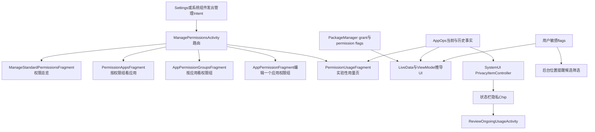
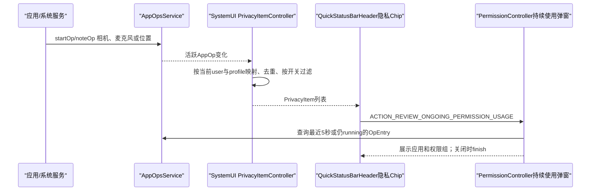
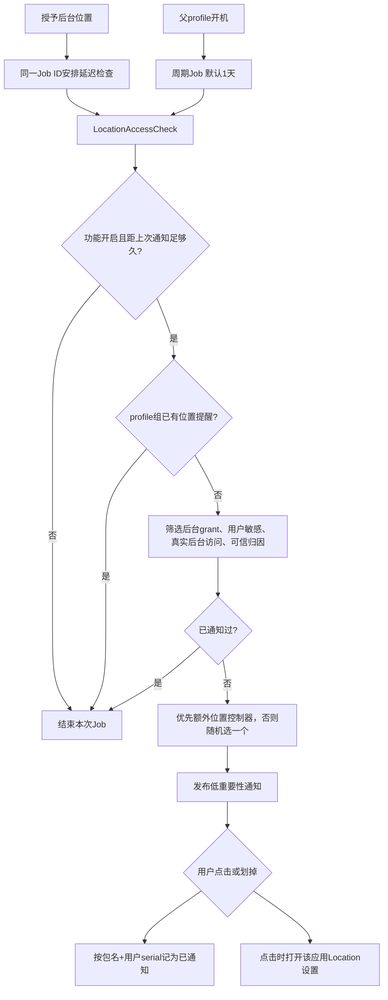

# 第537章 Android PermissionController权限管理与隐私可见性链：设置页、实验性Permission Hub、实时指示、后台位置提醒与用户敏感标志

> 源码基线：Android 11 / API 30 / `android-11.0.0_r48`。本章直接阅读`packages/apps/PermissionController`中的权限设置页、用量调试页、持续使用弹窗、后台位置提醒和用户敏感标志实现，同时追到SystemUI的隐私指示器、system_server的`HistoricalRegistry`与`PermissionPolicyService`。只读源码，不在macOS上编译。

## 1. 本章解决什么问题

系统设置里的“权限管理器”为什么既能按权限看应用，又能按应用看权限？“允许、仅在使用中、每次询问、拒绝”怎样由真实grant与flags推导？Android 11源码里的Permission Hub究竟是不是后来成熟的隐私信息中心？状态栏隐私提示、最近访问记录、后台位置提醒和“系统应用”过滤又分别依据什么事实？本章把这些入口、模型和策略串成一条完整链。

## 2. 一句话定位

权限设置页不是权限数据库，而是PermissionController对PackageManager、权限flags、AppOps和应用资料的投影视图；实验性Permission Hub把AppOps“最近一次”和历史聚合转成调试页面；SystemUI隐私指示器监听的是当前活跃AppOp；后台位置提醒是一个有资格筛选、限流和持久化去重的Job；`USER_SENSITIVE`两位flags则决定普通用户界面应不应该突出某个应用权限组。

## 3. 先区分五个容易混在一起的事实

“已授权”回答应用是否拥有某个运行时permission；“AppOp允许”回答某类敏感操作在当前模式下能否交付；“最近使用”来自AppOps最后访问时间；“正在使用”来自活跃AppOp或运行中的`OpEntry`；“用户敏感”是PermissionController维护的展示策略flags。五者相关但不等价，任何一个页面都只是选取其中几项组合呈现。

## 4. 本章的四条主线

第一条是设置Intent到具体Fragment的路由；第二条是权限组与应用列表如何由LiveData推导分类；第三条是AppOps事实如何进入历史用量页和实时隐私提示；第四条是用户敏感标志怎样同时影响列表隐藏、后台位置提醒和自动重置。读源码时要沿数据流走，不要只沿类名走。

## 5. 组件总图



## 6. 建议先记住的源码地图

入口路由看`permission/ui/ManagePermissionsActivity.java`；手机端页面看`ui/handheld/ManageStandardPermissionsFragment.java`、`PermissionAppsFragment.java`、`AppPermissionGroupsFragment.java`和`AppPermissionFragment.java`；数据看`ui/model`与`permission/data`；实验用量看`permission/debug/PermissionUsageFragment.java`、`PermissionUsages.java`和`model/AppPermissionUsage.java`；实时提示看SystemUI的`PrivacyItemController.kt`与PermissionController的`ReviewOngoingUsageFragment.java`；后台提醒看`LocationAccessCheck.java`；用户敏感策略看`UserSensitivityLiveData.kt`和`PermissionPolicyService.java`。

## 7. ManagePermissionsActivity是设置页总路由器

同一个Activity接收多个平台Intent action，然后选择不同起始Fragment。手机端大多使用AndroidX Navigation，并动态改`nav_graph`的start destination；电视、车机和手表走各自Fragment，部分路径还代理到legacy Activity。它的核心价值是统一受保护入口、参数与会话统计，而不是自己绘制每一行权限。

## 8. Manifest先保护真正的管理入口

`ManagePermissionsActivity`声明`android.permission.GRANT_RUNTIME_PERMISSIONS`，普通三方应用不能仅凭一个隐式Intent打开特权编辑界面。主题使用`Settings.FilterTouches`，Activity又添加`SYSTEM_FLAG_HIDE_NON_SYSTEM_OVERLAY_WINDOWS`，共同降低覆盖诱导点击风险。能看到一个exported intent-filter，不代表调用方能绕过组件权限。

## 9. 每次打开生成sessionId

Activity优先读取`EXTRA_SESSION_ID`；若是`INVALID_SESSION_ID`，就不断生成随机long直到有效。这个值贯穿页面跳转和统计日志，用来关联一次用户操作会话，但它不是鉴权令牌。设置页安全边界仍是Manifest权限、真实包状态和下游PackageManager特权检查。

## 10. 手机端为何动态设置起始目的地

正常“权限管理器”从nav graph默认页进入；按某应用、某权限组或自动重置通知进入时，源码inflate同一图，再用`graph.setStartDestination()`直接落到目标页。这样后续页面间跳转仍复用统一导航关系，同时避免为每个深链入口复制Activity。

## 11. 六类action对应六种阅读问题

`ACTION_MANAGE_PERMISSIONS`看全局权限组；`ACTION_MANAGE_PERMISSION_APPS`看一个权限组下的应用；`ACTION_MANAGE_APP_PERMISSIONS`看一个应用申请的权限组；`ACTION_MANAGE_APP_PERMISSION`编辑一个应用的一个permission或group；`ACTION_REVIEW_PERMISSION_USAGE`看实验用量；私有`ACTION_MANAGE_AUTO_REVOKE`看被自动重置的应用。看到action先翻译成“按哪个维度查询”，阅读会清楚很多。

## 12. 路由源码的关键骨架

```java
switch (action) {
    case Intent.ACTION_MANAGE_PERMISSIONS:
        Navigation.findNavController(this, R.id.nav_host_fragment)
                .setGraph(R.navigation.nav_graph, arguments);
        return;
    case Intent.ACTION_REVIEW_PERMISSION_USAGE:
        if (!UtilsKt.shouldShowPermissionsDashboard()) {
            finish();
            return;
        }
        androidXFragment = PermissionUsageFragment.newInstance(groupName, Long.MAX_VALUE);
        break;
    case Intent.ACTION_MANAGE_APP_PERMISSIONS:
        setNavGraph(AppPermissionGroupsFragment.createArgs(
                packageName, userHandle, sessionId, true), R.id.app_permission_groups);
        return;
    case Intent.ACTION_MANAGE_PERMISSION_APPS:
        setNavGraph(PermissionAppsFragment.createArgs(permissionGroupName, sessionId),
                R.id.permission_apps);
        return;
}
```

代码真正说明的是“一个受保护Activity，多种查询视角”；它没有说明每个设备形态的UI完全相同，也没有说明用量页默认可用。

## 13. ACTION_MANAGE_PERMISSIONS进入权限总览

手机端直接设置`nav_graph`，默认起点是`ManageStandardPermissionsFragment`。车机使用`AutoManageStandardPermissionsFragment`，电视使用television版本。配置变化时，非手机设备会复用已恢复Fragment，避免重复创建；手机端交给Navigation与FragmentManager恢复。

## 14. ACTION_MANAGE_APP_PERMISSIONS必须带包名

包名缺失时Activity记录日志并结束；user缺失则默认当前用户。页面先尝试读取应用UID用于统计，包不存在只是不记日志，后续LiveData会把应用消失作为空状态处理。参数校验与“应用在打开后刚好被卸载”是两类时序，UI还要能应对后者。

## 15. ACTION_MANAGE_APP_PERMISSION更精确

这个action可携带单个permission名、group名、包名、user和caller，最终构造`AppPermissionFragment`参数。手机端直接进入单组编辑页；Auto、TV、Wear则启动兼容`AppPermissionActivity`并转发结果。第536章里后台位置从请求对话框跳设置，正是利用这一类精确入口。

## 16. ACTION_MANAGE_PERMISSION_APPS支持permission或group

调用方若只给permission名，Activity先用`PermissionInfo`解析所属group；permission不存在会记录日志。permission和group都为空才直接finish。页面最终按group聚合，因此一个permission深链可能被规范化为它所在的权限组视角。

## 17. ACTION_REVIEW_PERMISSION_USAGE不是无条件入口

Activity先检查`shouldShowPermissionsDashboard()`；r48中它只返回DeviceConfig的`privacy.permissions_hub_2_enabled`，默认值是false。开关未开时Activity立即finish。这已经说明本源码基线里的用量页不是默认面向所有Android 11用户的稳定功能。

## 18. ACTION_MANAGE_AUTO_REVOKE来自通知

自动重置通知点击后进入`AutoRevokeFragment`，并记录通知点击与sessionId。该页展示被自动撤销且仍可归为“未使用”的应用，不等同于某个应用详情页中的“移除未使用应用的权限”开关。一个是结果列表，一个是单应用策略开关。

## 19. ManageStandardPermissionsFragment展示什么

它按平台“现代权限组”生成主列表，例如位置、相机、麦克风，并为每组显示非系统应用中已允许数量与请求总数。自定义权限组不与平台组混排，而是收进“其他权限”；只有至少一个包实际使用时才出现入口。页面不是遍历Manifest文本，而是消费模型清洗后的可展示数据。

## 20. 权限组排序要尊重本地语言

列表使用当前locale的`Collator`比较本地化label，而不是直接比较group常量。英文源码名排序和中文UI排序可能不同，这是正常现象。复现列表顺序时必须使用设备语言、真实资源label和相同Collator，不能用shell的字典序代替。

## 21. 自动重置结果入口是条件行

`UnusedAutoRevokedPackagesLiveData`给出数量，非零时总览页增加自动重置结果Preference；变回零时移除。这个LiveData还结合UsageStats判断“仍未使用”，所以它不是简单统计带`AUTO_REVOKED` flag的所有包。看不到入口不等于自动重置功能全局关闭。

## 22. PermissionAppsFragment是“一个组看所有应用”

例如点“位置”后，页面列出申请位置组的应用，并按允许、仅在使用中、每次询问、拒绝分类。旧Preference会按`user + packageName`作为key复用，减少刷新闪烁；200ms加载延迟避免数据很快返回时短暂显示spinner。UI细节背后仍由LiveData重算真实状态。

## 23. show system切换不是ApplicationInfo的简单筛选

页面默认不显示所谓“系统应用”，但模型里的`isSystem`实际定义为`!isUserSensitive(permissionState)`。一个预装应用如果其权限被判定对用户敏感，仍可出现在普通列表；普通应用通常会被标敏感。变量名有历史语义，不能机械翻译成`FLAG_SYSTEM`。

## 24. 哪些应用权限组有资格显示

应用必须enabled，组必须可授予；instant app和targetSdk低于M且没有pre-runtime permission等情形会被过滤；由Android系统声明但已非现代管理范围的legacy platform group也会隐藏。自定义或非现代权限组反而按敏感处理，避免因为缺少平台策略位而默认隐身。

## 25. 列表分类不是读取一个枚举字段

`AppPermGroupUiInfoLiveData`遍历组内requested permissions，结合grant、background permission、`USER_FIXED`、`ONE_TIME`、特殊位置provider状态和应用是否可能有前台能力，推导`PermGrantState`。这个枚举是UI派生结果，不是PMS持久化的一本新数据库。

## 26. “允许”至少有三种形态

不含后台语义的组可为`PERMS_ALLOWED`；前后台组若后台也获批为`PERMS_ALLOWED_ALWAYS`；只有前台能力为`PERMS_ALLOWED_FOREGROUND_ONLY`。应用列表可分别显示“始终允许”和“仅在使用中”，而应用详情页把后者并入允许区并增加subtitle。相同底层状态在不同视角的排版可以不同。

## 27. 一次性权限为什么归入ASK

只要组内存在`FLAG_PERMISSION_ONE_TIME`，不论当前grant是否仍在，模型都优先把它归为`PERMS_ASK`。活跃一次性授权仍可能实际可用，但设置页把它表达成“每次询问”；会话到期后grant撤掉而ONE_TIME语义仍可表示下次询问。ASK是未来交互策略，不等于当前所有permission都必然DENIED。

## 28. USER_FIXED才稳定落到普通拒绝

当没有任何permission获批且发现`USER_FIXED`时，模型返回`PERMS_DENIED`；若没有USER_FIXED但带ONE_TIME，则返回ASK；其他未获批情形也返回DENIED。仅看分类无法反推出完整flags，排障仍要回到`dumpsys package`或PackageManager API。

## 29. 特殊位置provider有自己的真值

若目标包是Location Provider，模型可能用系统位置总开关替代普通grant组合来推导状态；点击时还可能先出现拦截对话框。位置控制器额外包也可跳自己的设置。平台服务角色不能总用三方应用的grant公式解释。

## 30. 存储组在Android 11还有额外subtitle

应用详情页结合FullStorage状态区分`ALL_FILES`与`MEDIA_ONLY`，再把它显示为“所有文件”或“仅媒体”等摘要。运行时STORAGE组和`MANAGE_EXTERNAL_STORAGE`特殊访问并非同一权限，但设置页为了让用户理解，会把两类状态合并成一个更接近产品语义的展示。

## 31. AppPermissionGroupsFragment是“一个应用看所有组”

它将组按`ALLOWED`、`ALLOWED_FOREGROUND`、`ASK`、`DENIED`分类。前台允许类别本身被隐藏，其项目加入允许类别并显示“仅在使用中”；非标准组则收进“其他权限”。页面顶部用带工作资料badge的应用图标、label和应用详情入口标明当前对象。

## 32. AppPermissionFragment才执行单组修改

允许、始终允许、仅在使用中、每次询问和拒绝等radio选项由该页根据组能力动态生成。点击会形成前台、后台或两者的`ChangeRequest`，再调用模型修改grant、flags与AppOps。系统固定、策略固定或管理员控制时，选项会被禁用或跳管理员说明页。

## 33. 设置页里的“每次询问”如何落账

源码对“Ask every time”走`setOneTime=true`并撤销前后台grant，同时清掉USER_SET、设置ONE_TIME。相反，普通拒绝会设置USER_SET并清ONE_TIME；“拒绝且不再询问”的交互还会涉及USER_FIXED。文字相似的拒绝，未来是否再弹权限请求完全不同。

## 34. 活跃“一次性允许”在设置页只读呈现

若当前组是一次性grant，页面会显示“仅限这一次”处于选中状态，但该radio点击本身不执行新动作；设置页允许用户改成长期允许、每次询问或拒绝，一次性授权的创建仍主要发生在请求对话框。这样避免设置页伪造一次临时会话却没有正确启动会话监控。

## 35. 改权限仍要跨到权威服务

ViewModel和`KotlinUtils`只是PermissionController中的特权客户端。真正grant/revoke与flags更新仍由PackageManager/Binder进入system_server；AppOp mode也由AppOpsService保存。LiveData收到包、权限或AppOps变化后再刷新UI，局部返回的新模型对象不是永久权威。

## 36. 自动重置开关是一项AppOp策略

单应用页的开关写`OPSTR_AUTO_REVOKE_PERMISSIONS_IF_UNUSED`的UID mode：开启写`MODE_ALLOWED`，关闭写`MODE_IGNORED`。它不在点击瞬间撤销或恢复任何运行时权限，而是告诉将来的Auto Revoke Job该包是否参与。操作放在`GlobalScope.launch(IPC)`中，UI等待LiveData通过AppOps监听回填。

## 37. 自动重置开关并非所有包都显示

全局功能必须启用，包不能永久豁免，而且至少有一个可撤组。含`GRANTED_BY_DEFAULT`或`GRANTED_BY_ROLE` permission的组不列入可撤组；永久豁免包使列表为空。摘要会列出当前页面可找到的可撤权限组label，空时使用通用说明。

## 38. AutoRevokeState三个字段要分别读

`isEnabledGlobal`是全局开关；`isEnabledForApp`名称虽像直接读取开关，实际由`!isPackageAutoRevokeExempt()`推导，综合Auto Revoke AppOp与Android Q及以下应用的默认豁免规则；永久豁免则在另一道判断中让`revocableGroupNames`保持为空。`shouldShowSwitch`只看第三者是否非空。把三者压成一个boolean会漏掉“功能开但该包永久不可撤”等状态。

## 39. r48自动重置监听有一个可读性缺陷

`AutoRevokeStateLiveData.onOpChanged(op, packageName)`中写了`packageName == packageName`，参数遮蔽成员后该比较恒真。由于`startWatchingMode()`本来就传了目标包名，实际回调通常已被范围约束，影响较小；但正确意图显然应比较成员字段。应把它记录为r48源码瑕疵，而不是据此声称任意包能修改目标状态。

## 40. Settings搜索为什么需要跳板Activity

搜索索引Provider需要输出每个权限组的可点击raw row，但真正`ManagePermissionsActivity`受`GRANT_RUNTIME_PERMISSIONS`保护。于是公开的NoDisplay trampoline先验证来自设置搜索的key，再把group转成受保护action并用`FLAG_ACTIVITY_FORWARD_RESULT`转发。它是“受限索引结果到特权页面”的桥。

## 41. 搜索raw key内嵌随机password

`BaseSearchIndexablesProvider`在device-protected SharedPreferences保存UUID，raw key结构是`password + PermissionController包名 + ',' + 原group key`。只有持有`READ_SEARCH_INDEXABLES`的索引方能从Provider得到完整key；trampoline比较前36字符后再取逗号后的原key。

## 42. password不是通用认证系统

它主要防止任意Intent伪造设置搜索结果参数。真正管理Activity的组件权限可阻止外部直接启动；但经trampoline转发时，启动者已变成PermissionController自身，目标Activity不会重新识别最初外部调用者，所以这条间接路径确实依赖password校验。UUID存在设备保护存储中是为了Direct Boot阶段也可生成一致索引，不代表它能授权其他PermissionController API。

## 43. r48搜索校验对畸形Intent不健壮

`isIntentValid()`先取extra，紧接着调用`key.substring(0, 36)`，没有null和长度检查。exported trampoline若收到缺失或过短key，会在返回false前抛异常，造成Activity/进程崩溃式拒绝服务。password仍阻止攻击者构造任意有效group，因而不能把这个崩溃缺陷夸大为运行时权限提升。

## 44. 搜索Manifest还暴露了一个未实现action边界

trampoline的intent-filter同时列出自定义`MANAGE_PERMISSION_APPS`和`REVIEW_PERMISSION_USAGE`，但Java只处理前者，其他action会finish。Manifest“可解析”不等于业务代码实现了对应跳转。阅读组件能力时，intent-filter与switch必须一起核对。

## 45. 从设置页进入用量页有两层开关

总览页和按权限组应用页只有`shouldShowPermissionsDashboard()`为true才增加用量菜单；即使外部发`ACTION_REVIEW_PERMISSION_USAGE`，Activity还会再次检查。两层都使用`permissions_hub_2_enabled`。这是展示与深链的重复防护，不是历史数据采集本身的总开关。

## 46. Android 11 r48的Permission Hub应怎样称呼

最准确的称呼是“默认关闭的实验性/内部权限用量调试页”。源码页面顶部用醒目红黄Preference写着`INTERNAL ONLY - For debugging`，还明确说访问次数不代表读取了多少私密数据、数据可能不准确。把它直接称为后续Android版本成熟的“隐私信息中心/隐私仪表盘”会制造版本错觉。

## 47. 调试警告甚至拼接账户名

页面遍历所有profile，通过AccountManager读取账号并把account name拼入警告文字。这进一步说明它面向内部调试而非经过隐私产品化的普通页面，也提醒我们不要在真实设备截图或日志中泄露该Preference。源码学习笔记只描述行为，不记录实际账号。

## 48. PermissionUsages负责从权限模型映射到AppOps

Loader先加载平台权限组及每个组的应用，过滤非OS声明组和不可展示组，再为`(uid, packageName)`建立Builder。它从每个permission取对应AppOp字符串，形成一次查询需要的op集合。权限组提供用户语义，AppOps提供使用事实，两者在这里合流。

## 49. 为什么key同时包含UID和包名

AppOps的PackageOps同时带UID与packageName；shared UID下多个包不能只按UID合并，跨用户同包也不能只按包名合并。`Pair<Integer, String>`把两维都保留。后续Builder还带具体`PermissionApp`，用于取label、icon、user和权限组。

## 50. 只收平台权限组是主动产品边界

Loader遇到declaring package不是`android`的组会跳过。三方自定义危险权限即使有AppOp映射，也不进入这张实验仪表盘。设置页“其他权限”与用量页数据范围不同，不能用后者证明某个自定义权限从未使用。

## 51. r48 Loader会把group又加回原列表

循环开始先保存`groupCount = groups.size()`，随后对每个OS group执行`groups.add(group)`。固定上界避免当前循环无限，但列表无谓增长并留下重复引用。这看起来是残留代码或缺陷；因为后续主要使用Builder，它不一定造成重复UI，却不应被解释为有意的两阶段聚合。

## 52. 最近一次与历史数据来自不同API

`USAGE_FLAG_LAST`走`getOpsForPackage()`或`getPackagesForOps()`，得到每个OpEntry的最后时间、duration和running；`USAGE_FLAG_HISTORICAL`构造时间范围请求并调用`getHistoricalOps()`，得到前后台access count与duration聚合。页面同时依赖两者：没有历史count，即使有last time也会被过滤。

## 53. 历史查询只统计trusted flags

请求和读取均使用`OP_FLAGS_ALL_TRUSTED`。代理访问是否归因、前后台如何分桶，由AppOps记录时的attribution flags决定；页面不是对所有Binder调用做取证。AppOps没被note/start，或记录不在可信flag集合，页面就可能没有条目。

## 54. PermissionUsages的核心聚合代码

```java
HistoricalOpsRequest request = new HistoricalOpsRequest.Builder(begin, end)
        .setUid(filterUid)
        .setPackageName(filterPackageName)
        .setOpNames(new ArrayList<>(opNames))
        .setFlags(AppOpsManager.OP_FLAGS_ALL_TRUSTED)
        .build();
appOpsManager.getHistoricalOps(request, Runnable::run, ops -> {
    historicalOpsRef.set(ops);
    latch.countDown();
});
latch.await(5, TimeUnit.DAYS);

// GroupUsage中：最近时间取组内各op最大值，历史次数取各op之和。
aggregate = Math.max(aggregate, extractor.apply(opEntry));
aggregate += extractor.apply(historicalOp);
```

“最大最后时间”和“历史次数求和”是两种不同聚合，不能拿前者推导后者，也不能把access count当成读取数据量。

## 55. 五天await是明显的健壮性风险

异步回调后Loader用`latch.await(5, TimeUnit.DAYS)`等待，不是5秒。如果AppOps回调因异常永远不到，后台Loader理论上能阻塞极长时间；正常禁用历史API时服务仍应回空结果并回调，所以不代表每台设备都会卡五天。它揭示的是内部实验实现对回调失败缺少合理超时。

## 56. 历史AppOps还有旧版开关

system_server的`HistoricalRegistry.isApiEnabled()`允许system_server自身调用，或要求`privacy.permissions_hub_enabled=true`。PermissionController是另一个特权应用进程，不满足“calling UID等于system_server UID”。因此只开启页面使用的`permissions_hub_2_enabled`而未开启旧`permissions_hub_enabled`时，页面可出现但历史结果可能为空。

## 57. 两个hub开关不能混为一个常量

SystemUI常量名仍叫`PROPERTY_PERMISSIONS_HUB_ENABLED`，实际字符串却是`permissions_hub_2_enabled`；HistoricalRegistry使用`permissions_hub_enabled`；PermissionController另一个旧Utils也留有旧字符串。分析配置时必须记录“Java常量名”和“DeviceConfig真实key”，否则很容易误以为所有组件读同一个开关。

## 58. 开关错配更像版本整合边界

r48可能依赖服务端 rollout 同时配置两个key，不能只凭源码断言正式设备一定坏。但对本地AOSP默认值，两者都是false；手动只开hub2不足以保证历史数据可用。严谨结论是“页面展示与历史API开放由不同key控制，需要协同”，而不是简单称为权限漏洞。

## 59. GroupUsage的last time取最大值

一个权限组可映射多个permission和多个AppOp，`lastAccessAggregate()`逐一匹配op字符串并取最大值。因此组的“最近使用”代表组内任一op最后发生的最晚时刻。它不能告诉你具体是粗略位置还是精确位置，也不能证明同组所有能力都在那一刻被访问。

## 60. 历史次数与时长按组内op相加

`extractAggregate()`对组内每个permission对应的HistoricalOp求和。若多个permission共享或映射到相同op，阅读时要警惕重复累计；即使没有重复，count也只是AppOps记录的访问事件数，不是照片张数、录音字节数或定位次数的业务含义。

## 61. running来自任一匹配OpEntry

`GroupUsage.isRunning()`遍历组内permission及PackageOps条目，只要匹配op且`op.isRunning()`就返回true。它是组级“至少一个正在运行”。对瞬时`noteOp`，isRunning可能很快变false，但last time仍保留；持续`startOp/finishOp`更适合实时指示。

## 62. 麦克风还有客户端静音修正

Loader按recording client UID收集`AudioRecordingConfiguration`。若该UID任一录音配置`isClientSilenced()`，`AppPermissionUsage`会整个跳过MICROPHONE组，源码注释直接标为`HACK HACK HACK`。这是为后台录音被系统静音的情形做产品修正，却也可能把同UID其他非静音麦克风事实一并隐藏。

## 63. 用量页的时间过滤档位

页面提供任意时间、7天、24小时、1小时、15分钟和1分钟。外部传入duration时，选择“大于等于该duration的最小档”；例如2分钟会落到15分钟，而不是精确查询2分钟。`Long.MAX_VALUE`会选“任意时间”，开始时间再夹到Unix epoch之后。

## 64. 页面不是持续实时刷新

`reloadData()`启动Loader，手动刷新菜单会重新加载；数据构建完成后页面调用`stopLoader()`。它不像SystemUI监听活跃AppOps那样不断更新。把页面停留十分钟不操作，不能假定列表每秒反映最新访问。

## 65. 页面先按历史count过滤

每个GroupUsage必须`accessCount > 0`，last time非零且落入选择窗口，才进入后续列表。若历史API被旧开关挡住，count为零，即使last API有最新时间也会消失。这个条件正好解释“AppOps里看得到最近访问，实验页面仍空”的常见错觉。

## 66. “系统应用”仍按用户敏感判断

用量页以`!Utils.isGroupOrBgGroupUserSensitive(group)`判为system，并默认隐藏。源码虽然创建show/hide system菜单，却在`updateMenu()`中把两项都`setVisible(false)`，注释写“Do not show system apps for now”。因此这些条目在正常UI里没有切换入口。

## 67. 顶部柱状图统计的是应用—组条目数

页面按权限组统计有多少个应用组用量条目，最多显示四根柱；同一应用使用位置和相机会贡献两个组计数。并列时优先位置、麦克风、相机，再按组名。柱高不是访问count总和，更不是敏感数据量。

## 68. 两种排序语义不同

按时间排序时，每个应用—组条目按组最近访问排序；按应用排序时，先以应用整体最近时间聚合，再把同应用的组放在一起。带单组filter时会调整排序分支。页面标题“最近”需要结合当前菜单理解，不能只看视觉位置。

## 69. hashCode差值只是勉强的tie-breaker

几个比较器在时间相同时返回`x.hashCode() - y.hashCode()`以避免把不同项当相等。减法可能整数溢出，identity hash也不提供稳定顺序，理论上还可能破坏比较器契约。它更像内部调试页的粗糙实现，不能用于复现确定性审计排序。

## 70. 空数据路径有加载态缺口

`onPermissionUsagesChanged()`遇到空usages直接return，`updateUI()`也对空列表提前return；而`setLoading(false)`、隐藏progress和`stopLoader()`位于后续AppDataLoader回调中。于是完全空数据时页面可能没有正常收尾。它是UI健壮性问题，不代表AppOps查询本身必然失败。

## 71. 有数据但过滤后为空会清屏

初始usage非空，若时间、group或system过滤后`usages.isEmpty()`，源码`screen.removeAll()`，但仍启动AppDataLoader并在回调结束加载态。这个路径与“Loader一开始就返回空”不同。排障时要区分原始数据空、历史count为零、UI过滤为空。

## 72. 点列表最终回到权限管理页

应用父项展开显示每个权限组、最近访问文字和次数；点击相关入口可进入对应应用权限设置。用量事实不会自动撤权，用户仍通过受保护的管理页改变grant/flags/AppOps。审计信息与权限决策是两步操作。

## 73. 实验页面不能回答“读取了什么内容”

AppOps知道某UID/包对某op的访问时间、持续时长和聚合次数，却不知道联系人哪一行、相册哪张图、定位返回了什么坐标。源码警告“count不反映私密数据量”正是在划定数据模型边界。要审计业务内容必须看具体服务、调用链和应用日志。

## 74. 历史压缩还会影响精度

`HistoricalRegistry`默认以15分钟快照、压缩倍率等参数维护历史，并将内存与磁盘数据合并。时间越久，聚合粒度可能越粗；查询窗口边界也可能落在压缩桶内。Permission Hub展示的是统计视图，不是逐次不可抵赖的安全日志。

## 75. 多用户与profile必须保留UID语义

权限用量Builder的UID已包含userId，应用资料也来自对应用户；警告Preference还遍历全部profile账户。System应用隐藏与user-sensitive flags同样按用户保存。主用户与工作资料里的同包不能合并成一个“应用最近使用”结论。

## 76. 实时隐私指示器走另一条链

SystemUI的`PrivacyItemController`不加载历史count，而是订阅`AppOpsController`的活跃AppOps。它把相机、麦克风、电话通话相机/麦克风以及位置op映射为`PrivacyItem(type, package, uid)`，去重后通知状态栏组件。实时指示与实验用量页共享AppOps事实，但查询方式、生命周期和开关都不同。

## 77. SystemUI监听哪些Op

麦克风/相机集合包括`OP_CAMERA`、`OP_PHONE_CALL_CAMERA`、`OP_RECORD_AUDIO`、`OP_PHONE_CALL_MICROPHONE`；位置集合包括粗略和精确位置。只要有UI callback且对应功能开关开启，Controller便注册监听。没有消费者时会停止监听并清空privacyList，避免无意义常驻工作。

## 78. 两个实时开关的范围不同

`privacy.permissions_hub_2_enabled`开启全部指标，包括位置；`privacy.camera_mic_icons_enabled`只开启相机与麦克风。若仅后者为true，Controller仍监听全集以简化逻辑，但`toPrivacyItem()`会过滤LOCATION。开关名“camera_mic_icons”与页面Permission Hub不是同一范围。

## 79. 实时指示链图



## 80. current users包含当前用户及其profiles

Controller维护`currentUserIds`，响应用户切换、工作资料可用与不可用广播。更新列表时只查询这些用户的活跃AppOps。工作资料暂停后，其隐私项应随profile状态刷新，而不是永远留在主用户Chip中。

## 81. callback使用WeakReference

SystemUI将消费者callback包装为弱引用，并在remove时顺便清理已被GC的引用。这降低状态栏生命周期变化造成泄漏的风险。弱引用也意味着Controller不能假定所有注册者永远存在，通知循环每次都先`get()`判空。

## 82. 隐私Chip还替代旧状态栏图标槽

当任一新Chip开关启用时，QuickStatusBar会忽略旧camera、microphone图标槽；只有完整hub2开启时才同时忽略旧location槽，避免同一事实双重显示。若只观察旧icon消失而没看两个DeviceConfig key和Chip状态，容易误判隐私提示功能被关闭。

## 83. 点击Chip发出受保护action

Chip先确认builder里至少有一个应用—类型，再发`ACTION_REVIEW_ONGOING_PERMISSION_USAGE`并收起面板。目标`ReviewOngoingUsageActivity`在Manifest中受`GRANT_RUNTIME_PERMISSIONS`保护，主题是系统对话框且singleInstance。普通应用不能借相同action伪造系统持续使用清单。

## 84. 持续使用弹窗默认只回看5秒

Activity未收到`EXTRA_DURATION_MILLIS`时使用5000ms。Fragment加载相机和麦克风；只有完整hub2开启时才加位置。它还单独通过`OpUsageLiveData`加载电话通话麦克风/相机op，以便把电话/视频通话能力纳入说明。

## 85. Activity只检查相机麦克风总开关

`shouldShowCameraMicIndicators()`为camera/mic开关或hub2任一开启即true；两者都关时Activity直接finish。因此仅开启camera/mic时弹窗仍可用，只是不查位置。这个判断与实验历史页面只接受hub2不同。

## 86. 弹窗使用LAST而非HISTORICAL

`PermissionUsages.load()`只传`USAGE_FLAG_LAST`，不要求旧`permissions_hub_enabled`开放历史API。它根据running、最后时间及duration与5秒窗口是否相交来筛选。于是历史仪表盘空，不代表状态栏持续使用弹窗也一定空。

## 87. duration与last time可能来自不同op

组内last time和last duration都分别取多个op的最大值，源码TODO承认二者不保证属于同一permission。用`lastTime + duration`判断窗口相交时可能得到不准确结果。相机、麦克风这类单一主要op风险小些，多permission组需谨慎解释。

## 88. 弹窗只显示用户敏感组

普通应用条目只有`isGroupOrBgGroupUserSensitive()`为true才加入；位置provider等非敏感系统包若正在使用相机/麦克风，则记入特殊system usage说明。再次说明“系统应用”不是只看安装分区，而是UI策略与具体组共同决定。

## 89. 麦克风静音变化会触发重建

Fragment注册`ACTION_MICROPHONE_MUTE_CHANGED`，收到后用已加载数据重建对话框；大多数普通应用与电话文案路径会在全局麦克风mute时跳过MICROPHONE，`AppPermissionUsage`初次构造时还会按UID过滤client-silenced录音。不过`mSystemUsage`最终又无条件把其组名加入标题集合，源码并非所有分支都过滤一致；再加上同UID过滤和缓存数据，既可能过度隐藏，也可能留下不够准确的标题。

## 90. OpUsageLiveData并不真正监听更新

源码顶部有`TODO: listen for updates`，它只在active时异步查询一次；Fragment得到非stale值后立即移除observer。弹窗停留期间新的电话AppOp不会持续推送，麦克风mute广播也主要复用现有结果。不要把该对话框理解成逐毫秒实时监控台。

## 91. 没有任何条目时弹窗自动结束

若普通PermissionUsages、电话AppOp和system usage三者全空，Activity直接finish。若有条目，先异步加载应用label/icon，再构造AlertDialog；点击应用可跳对应user的`ACTION_MANAGE_APP_PERMISSIONS`。用户从“谁正在用”回到“要不要继续允许”，但修改仍是独立动作。

## 92. 用户敏感flags是什么

PackageManager提供`FLAG_PERMISSION_USER_SENSITIVE_WHEN_GRANTED`和`...WHEN_DENIED`两位。前者表示该permission在已授权状态应对用户可见；后者表示在拒绝状态仍应可见。UI依据当前grant挑对应位，而不是把两位简单OR后永久展示。

## 93. 这两位不是安全授权位

清掉用户敏感flag不会grant permission，也不会让AppOps允许；设置它也不会阻止访问。它影响PermissionController怎样隐藏/归类应用权限组，还被后台位置提醒和自动重置等策略用作“是否值得提示用户”的输入。它是产品策略元数据，不是访问控制本身。

## 94. UserSensitivity算法的基本规则

算法只处理平台runtime permissions。带Launcher入口的包或非系统预装包，permission无论grant/deny都设置两位敏感；无Launcher的系统包若该permission默认授予，则两位都清；若不是默认授予，只设置WHEN_GRANTED。直觉是：后台系统组件在拒绝状态不打扰用户，一旦自行持有敏感能力则应显示。

## 95. 用户敏感推导的核心源码

```kotlin
var flags = if (pkgIsSystemApp && !pkgHasLauncherIcon) {
    val grantedByDefault = pm.getPermissionFlags(perm, pkg.packageName, user) and
        PackageManager.FLAG_PERMISSION_GRANTED_BY_DEFAULT != 0
    if (grantedByDefault) 0
    else PackageManager.FLAG_PERMISSION_USER_SENSITIVE_WHEN_GRANTED
} else {
    Utils.FLAGS_ALWAYS_USER_SENSITIVE
}

flags = if (pkg.uid < Process.FIRST_APPLICATION_UID) {
    flags and previousFlags   // well-known UID倾向隐藏
} else {
    flags or previousFlags    // 普通shared UID倾向显示
}
```

这里使用真实`ApplicationInfo.FLAG_SYSTEM`推导基础规则；后续UI再把“不敏感”命名为`isSystem`，两层概念不要倒置。

## 96. shared UID要合并每个包的意见

well-known UID小于`FIRST_APPLICATION_UID`时，对共享UID内同permission的flags做AND，任何包认为不敏感就倾向隐藏；普通应用UID做OR，任何包认为敏感就倾向显示。前者减少核心系统组件噪声，后者优先保护用户可见性。共享UID使单包的Launcher与系统属性影响同UID其他包的展示。

## 97. flags最终逐包逐permission写回

`UserSensitiveFlagsUtils`取得UID级推导结果，再遍历该UID每个包申请的permission；只在两位mask与旧值不同时调用`updatePermissionFlags()`。未知permission会被忽略，其他异常记日志。批量更新使用IPC协程，callback表示遍历写回结束。

## 98. 谁触发用户敏感重算

system_server的`PermissionPolicyService`监听包added/changed，为对应user创建`PermissionControllerManager`并调用`updateUserSensitiveForApp(uid)`；系统启动后还延迟60秒对当前用户做全量更新；某用户发生runtime permission升级时也会全量更新。flags不是每次打开页面临时计算，而是由策略服务维护。

## 99. 用户尚未完成设置时先排队

广播接收器检查`Settings.Secure.USER_SETUP_COMPLETE`。尚未完成初始设置时把UID存入去重列表；后续收到包事件且setup完成，再倒序处理积压UID并清空。这样Setup Wizard期间大量包变化不会过早把用户可见策略写成半初始化状态。

## 100. PermissionControllerService的retry边界

`onUpdateUserSensitivePermissionFlags()`用try/catch包装启动更新，并在同步异常时延迟重试；但真正工作由`GlobalScope.launch(IPC)`异步执行。协程内部稍后抛出的异常未必回到外层try/catch，因此“有重试函数”不等于所有异步失败都能重试。这是实现健壮性边界，不改变调用方需等待callback的协议。

## 101. 用户敏感与权限—AppOps同步相邻但不同

`PermissionPolicyService`还监听runtime permission和AppOps变化，调用`PermissionToOpSynchroniser`维护grant与switch op mode的一致性；包改变时也清理不再请求的AppOp权限。这与user-sensitive flags更新在同一服务中协调，却是两项不同任务：前者影响实际访问模式，后者影响展示策略。

## 102. 后台位置提醒解决的是“事后再确认”

用户授予精确后台位置后，应用可能长期在后台取位置。`LocationAccessCheck`不会立即弹第二次权限对话框，而是在延迟或周期Job中确认应用真的发生过后台fine location访问，再发通知让用户复查。它提醒，不直接撤权。

## 103. 默认调度与限流数字

周期默认1天，flex为周期的10%；授予后one-shot检查默认也延迟1天。两次通知最小间隔为`interval - 2.1 * flex`，默认约0.79天。数值来自Secure Settings可调参数，不应硬编码成所有产品永久固定策略。

## 104. 由父profile统一处理

开机Receiver只在当前用户是profile parent时安排周期Job，父profile负责其子profiles。候选筛选只接受当前profile group中的user；活跃通知检查也遍历这些profiles，并确保整个profile group一次最多一个位置提醒。工作资料包仍用自己的UserHandle和通知上下文。

## 105. 后台位置候选要过多道门

必须不是OS包或Location Provider；仍请求后台位置且当前后台grant有效；该组用户敏感；前台和后台不能同时都是默认授予；AppOps中确有feature启用后的后台fine location访问；可信代理只能是OS或Location Provider；还不能已被记录为通知过。任何一道失败都不会提醒。

## 106. proxy过滤只修正错误归因的一部分

源码说明它防的是持有`UPDATE_APP_OPS_STATS`的OEM组件用`noteProxyOp`错误甩锅：非OS、非provider代理被忽略。但直接`noteOp`造成的坏归因不在此缓解范围。看到过滤代码不能推断AppOps attribution具备完整防伪能力。

## 107. 后台位置提醒状态机图



## 108. 候选选择不是按访问次数排名

若启用额外Location Controller包且它在候选中，优先它；否则从候选随机选一个。一次Job只通知一个包。通知不是“后台访问最多排行榜”，也不保证所有候选按确定顺序轮到；限流和已通知集合会影响未来机会。

## 109. 何时才记为“已经通知过”

发布通知时只更新“上次展示时间”，并未立刻把包写入already-notified文件；用户点击或划掉时，BroadcastReceiver才调用`markAsNotified()`。如果通知因其他路径消失、进程或设备异常，没有触发这两个PendingIntent，该包以后可能再次成为候选。应说“可能”，不能断言必然重复。

## 110. 已通知文件按user serial保存

文件每行是`packageName userSerial`，使用普通私有文件整体重写，不是AtomicFile。serial而非数值userId避免用户删除后ID复用把旧状态套给新用户。任一格式异常会进入catch并返回空集合，损坏文件可能让多个包重新获得提醒资格。

## 111. 复读后的关键校正

第一次阅读最容易把Permission Hub说成Android 11正式隐私仪表盘，把`isSystem`说成预装应用，把ASK说成当前必然拒绝，把状态栏Chip说成历史审计，把位置通知说成自动撤权。复读后应坚持五问：页面入口由哪个action和开关控制、UI类别由哪些底层位推导、数据是LAST还是HISTORICAL、是否按当前user/profile过滤、动作是提醒还是改变权威权限。

## 112. macOS只读练习一：画出五种设置入口

```bash
sed -n '95,330p' packages/apps/PermissionController/src/com/android/permissioncontroller/permission/ui/ManagePermissionsActivity.java
sed -n '112,180p' packages/apps/PermissionController/AndroidManifest.xml
sed -n '100,210p' packages/apps/PermissionController/src/com/android/permissioncontroller/permission/ui/handheld/ManageStandardPermissionsFragment.java
sed -n '130,300p' packages/apps/PermissionController/src/com/android/permissioncontroller/permission/ui/handheld/PermissionAppsFragment.java
```

为全局总览、按权限看应用、按应用看权限、单应用单组编辑和实验用量各写一行：action、必需extra、手机起始Fragment、组件权限、缺参结果。再说明TV/Auto/Wear为何不能直接套用手机导航结论。

## 113. macOS只读练习二：手算UI分类与自动重置开关

```bash
sed -n '95,275p' packages/apps/PermissionController/src/com/android/permissioncontroller/permission/data/AppPermGroupUiInfoLiveData.kt
sed -n '120,215p' packages/apps/PermissionController/src/com/android/permissioncontroller/permission/ui/model/AppPermissionGroupsViewModel.kt
sed -n '35,115p' packages/apps/PermissionController/src/com/android/permissioncontroller/permission/data/AutoRevokeStateLiveData.kt
sed -n '316,385p' packages/apps/PermissionController/src/com/android/permissioncontroller/permission/ui/handheld/AppPermissionGroupsFragment.java
```

构造长期允许、仅前台、活跃一次性、已到期每次询问、USER_FIXED拒绝五组状态，分别算`PermGrantState`。再给每组叠加默认授予、Role授予和Auto Revoke AppOp豁免，判断开关是否显示、是否选中、可撤组摘要包含什么。

## 114. macOS只读练习三：比较历史页与实时Chip

```bash
sed -n '205,380p' packages/apps/PermissionController/src/com/android/permissioncontroller/permission/debug/PermissionUsages.java
sed -n '330,560p' packages/apps/PermissionController/src/com/android/permissioncontroller/permission/debug/PermissionUsageFragment.java
sed -n '120,275p' packages/apps/PermissionController/src/com/android/permissioncontroller/permission/model/AppPermissionUsage.java
sed -n '45,285p' frameworks/base/packages/SystemUI/src/com/android/systemui/privacy/PrivacyItemController.kt
sed -n '90,235p' packages/apps/PermissionController/src/com/android/permissioncontroller/permission/ui/handheld/ReviewOngoingUsageFragment.java
```

列出“刚刚一次noteOp”“持续startOp”“历史count存在但last超窗”“hub2开而旧hub关”“只有camera_mic开”五种情形，判断实验页、SystemUI Chip和持续使用弹窗各自是否可能出现，并写明不确定项还需观察哪个值。

## 115. macOS只读练习四：手推用户敏感与后台位置候选

```bash
sed -n '70,175p' packages/apps/PermissionController/src/com/android/permissioncontroller/permission/data/UserSensitivityLiveData.kt
sed -n '25,120p' packages/apps/PermissionController/src/com/android/permissioncontroller/permission/utils/UserSensitiveFlagsUtils.kt
sed -n '225,295p' frameworks/base/services/core/java/com/android/server/policy/PermissionPolicyService.java
sed -n '420,525p' packages/apps/PermissionController/src/com/android/permissioncontroller/permission/service/LocationAccessCheck.java
sed -n '570,725p' packages/apps/PermissionController/src/com/android/permissioncontroller/permission/service/LocationAccessCheck.java
```

为带Launcher普通包、无Launcher系统包默认授予、无Launcher系统包非默认授予、well-known shared UID、普通shared UID各算两位敏感flags；再加入后台位置grant、访问时间、proxy、已通知文件与profile条件，判断是否成为提醒候选。

## 116. 推荐的只读排障顺序

先记录Android基线、userId、完整UID、包名和目标页面action；再看Manifest组件权限与DeviceConfig真实key；设置分类异常时查组内grant/background/ONE_TIME/USER_FIXED和两位USER_SENSITIVE；历史页异常分别查last、historical、两个hub key与过滤；Chip异常查active AppOp、当前profile和camera/mic开关；后台位置提醒最后查Job、限流、feature enabled time、proxy与already-notified文件。

## 117. 推荐断点链

设置入口断`ManagePermissionsActivity.onCreate/setNavGraph`；分类断`AppPermGroupUiInfoLiveData.getGrantedIncludingBackground/isUserSensitive`和各ViewModel更新；修改断`AppPermissionViewModel.requestChange`、`KotlinUtils`与PMS/AppOps；历史页断`PermissionUsages.Loader.loadInBackground`、`HistoricalRegistry.getHistoricalOps/isApiEnabled`；实时链断`PrivacyItemController.toPrivacyItem/updatePrivacyList`和`ReviewOngoingUsageFragment.onPermissionUsagesLoaded`；位置提醒断候选筛选与通知handler。

## 118. 本章容易说错的十二句话

“权限管理器只有一个Fragment”错；“isSystem就是FLAG_SYSTEM”错；“ASK表示当前一定没权限”错；“自动重置开关直接撤权限”错；“r48 Permission Hub默认开启”错；“hub2和历史API读同一个key”错；“访问次数等于读取数据量”错；“柱状图统计访问总次数”错；“状态栏Chip读取历史库”错；“持续使用弹窗会持续监听所有变化”错；“用户敏感flag是访问控制位”错；“后台位置提醒会自动撤权”也错。

## 119. 本章知识闭环

受保护的ManagePermissionsActivity把系统深链路由到不同查询视角；LiveData从按用户grant、flags、AppOps和应用资料推导易懂分类；实验Permission Hub把AppOps LAST与HISTORICAL聚合成默认关闭的内部页面；SystemUI只监听活跃AppOps并通过受保护弹窗解释当前使用；PermissionPolicyService维护用户敏感flags；LocationAccessCheck再以这些flags、真实后台访问、限流和去重决定是否提醒。展示、审计、实时提示和撤权策略由同一批底层事实组成，却不能互相替代。

## 120. 下一章预告

第538章继续读`PermissionPolicyService`的权限—AppOps同步与运行时权限升级链：包安装/更新、用户启动、runtime grant变化和AppOp变化如何触发同步，default mode、foreground mode、ignored mode怎样收敛，系统默认授权与版本升级又如何保证每个用户进入一致状态。
