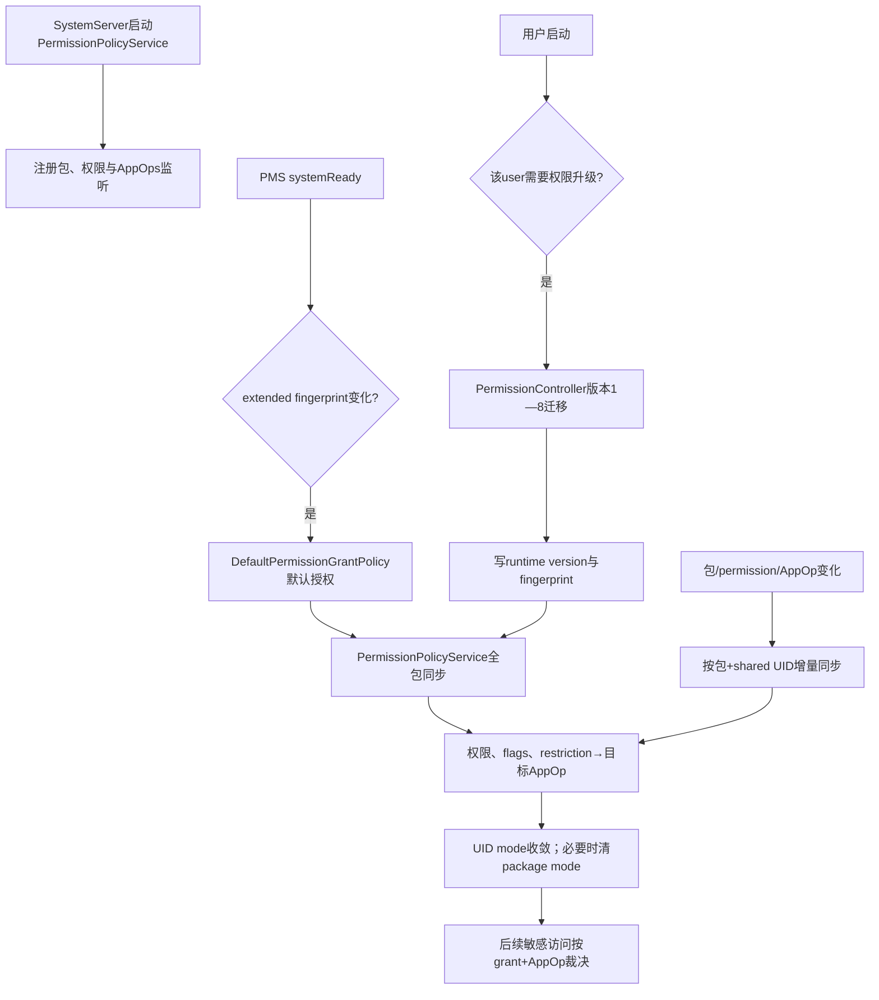
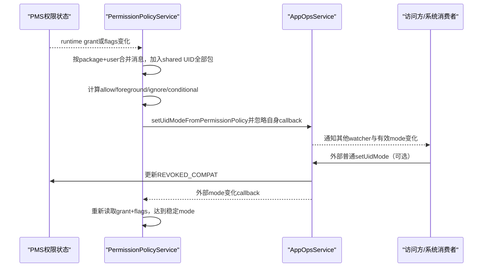
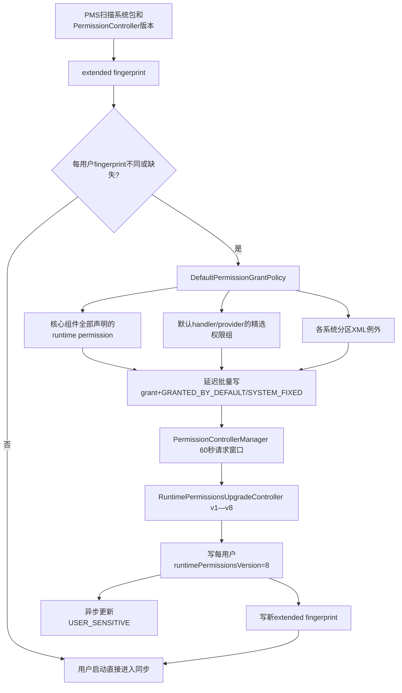

# 第538章 Android PermissionPolicyService权限—AppOps同步完整链：事件收敛、默认授权、数据库升级与Fingerprint

> 源码基线：Android 11 / API 30 / `android-11.0.0_r48`。本章直接阅读`frameworks/base/services/core/java/com/android/server/policy/PermissionPolicyService.java`、`SoftRestrictedPermissionPolicy.java`，PMS中的`DefaultPermissionGrantPolicy.java`与运行时权限持久化，再跨进程阅读`PermissionControllerManager`、`PermissionControllerServiceImpl`和`RuntimePermissionsUpgradeController.kt`。只读源码，不在macOS上编译。

## 1. 本章解决什么问题

运行时permission grant与AppOp mode为什么不会长期互相矛盾？包安装、权限改变、AppOp改变和用户启动分别触发怎样的重算？系统首次开机为何能让电话、联系人、Provider等默认组件直接工作？OTA或PermissionController更新后，受限权限、后台位置和媒体位置怎样迁移？本章把“持续同步”“默认授权”“数据库版本升级”三条常被混写的链拆开再闭环。

## 2. 一句话定位

`PermissionPolicyService`是system_server里的收敛协调者：它监听包、runtime permission与AppOps变化，按共享UID整体把权限事实投影成UID AppOp；PMS中的`DefaultPermissionGrantPolicy`负责开箱即用的默认grant；PermissionController中的`RuntimePermissionsUpgradeController`负责版本化迁移；PMS用“系统Build fingerprint + PermissionController versionCode”判断这些一次性政策何时需要重跑。

## 3. 先拆开五本权威账

第一本是每用户runtime grant与flags；第二本是AppOps的UID mode和package mode；第三本是运行时权限数据库`version`；第四本是每用户已处理的extended fingerprint；第五本是包解析出的声明、targetSdk、系统身份和shared UID关系。同步只改变前两本，升级会改变第一与第三本，完成标记写第四本；不能用任何一本替代其他四本。

## 4. “同步”不是两个boolean互相复制

同一个危险权限可能对应switch AppOp；前台permission与后台permission共同决定`MODE_FOREGROUND/ALLOWED`；`REVOKED_COMPAT`、hard/soft restriction和豁免flags会让“grant仍为true”但AppOp应为ignored；多个permission还可能共享一个op。因此同步是一张有优先级的决策表，不是`granted ? allowed : ignored`。

## 5. 三条链的总图



## 6. 建议先记住的源码地图

持续同步主体看`PermissionPolicyService.java`内部的`PermissionToOpSynchroniser`；soft restriction看`SoftRestrictedPermissionPolicy.java`；AppOps写入的自回调抑制看`AppOpsService.setUidMode(...callbackToIgnore)`；默认授权看`DefaultPermissionGrantPolicy.java`；触发点与runtime权限持久化看`PermissionManagerService.java`、`PackageManagerService.java`和`Settings.RuntimePermissionPersistence`；跨进程升级看`PermissionControllerManager.java`、`PermissionControllerServiceImpl.java`、`RuntimePermissionsUpgradeController.kt`。

## 7. PermissionPolicyService运行在哪里

它由SystemServer启动，运行在system_server进程，作为`SystemService`接收用户生命周期；内部工作主要投到`FgThread`。它通过LocalServices调用PMS/AppOps内部接口，不经过普通应用权限门；跨到可更新PermissionController时才使用受权限保护的remote service。

## 8. 服务启动早于PMS systemReady

SystemServer先`startService(PermissionPolicyService.class)`，随后才调用`PackageManagerService.systemReady()`。构造器立刻发布`PermissionPolicyInternal`，`onStart()`注册各类监听。这样PMS进入ready阶段时能拿到策略LocalService，并在用户策略初始化完成后注册回调重算权限限制。

## 9. 它不是PermissionManagerService的替代品

PMS仍定义权限、验证grant/revoke调用者、保存`PermissionsState`并持久化；PermissionPolicyService读取这些事实，决定相关AppOp应该收敛到什么mode。若同步代码算错，访问表现可能错，但权威grant bit仍在PMS；修复也应改策略而不是另造权限数据库。

## 10. onStart注册三类主触发源

包列表Observer负责added/changed/removed；`OnRuntimePermissionStateChangedListener`负责grant、revoke或flags变化；`IAppOpsCallback`负责关注的mode变化。三者可能由同一用户动作连锁触发，服务用待处理集合去重，最终每次都重新读取当前状态，而不是应用旧事件携带的快照。

## 11. 包added和changed怎样处理

用户已started时，added直接同步该包；changed同步该包并检查UID是否仍请求所有APPOP型permission。changed可能来自APK更新、组件或声明变化，不只是权限变化。若事件发生在用户初始化之前，主同步路径先跳过，稍后用户启动会做全量同步。

## 12. 包removed为何只做AppOp声明清理

目标包已经不存在，无法再建立它的权限→AppOp投影；代码只调用`resetAppOpPermissionsIfNotRequestedForUid(uid)`，处理shared UID仍有其他包但某项APPOP permission已无人声明的情况。若这是UID最后一个包，`getPackagesForUid()`为空就返回，包卸载的AppOps主体清理由AppOps/PMS其他生命周期完成。

## 13. runtime permission变化走异步去重

监听器拿到`packageName + changedUserId`后，只在user已started时把Pair加入`mIsPackageSyncsScheduled`；首次加入才向FgThread发消息。快速连续改变同包多个permission会合并成一次当前状态重算，降低反馈风暴。

## 14. 去重不是丢掉运行中的后续变化

同步函数一开始就从集合移除Pair。如果同步执行期间又收到变化，新事件可以再次入集合并排下一轮。因此它实现“队列等待期合并”，不是“直到本轮结束都忽略”。没有显式generation，但每轮查询最新PMS状态，旧消息不会套用旧grant快照。

## 15. AppOps watcher监听switch op

每个runtime dangerous permission先通过`permissionToOpCode()`映射，再用`opToSwitch()`归一化。例如粗略与精确位置共享控制op时，只监听switch可避免为同一有效mode重复建链。没有AppOp映射时返回`OP_NONE`，注册没有实际意义，后续同步也会跳过。

## 16. soft restricted permission还监听extra op

`SoftRestrictedPermissionPolicy`可给READ_EXTERNAL_STORAGE返回`OP_LEGACY_STORAGE`。它不是该permission的普通switch op，而是决定旧式外部存储挂载/访问范围的附加政策位。服务既监听permission op，也监听extra op，任一变化都可能要求重新收敛。

## 17. APPOP protection flag是另一类列表

服务还收集带`PROTECTION_FLAG_APPOP`的permission，用于“UID已无人请求时恢复默认mode”。这些不一定是runtime dangerous permission，所以不进入主grant→op矩阵。相同词语“permission对应AppOp”在源码中至少有runtime联动与APPOP声明清理两种语义。

## 18. 三个APPOP permission被有意排除

`ACCESS_NOTIFICATIONS`与`MANAGE_IPSEC_TUNNELS`不进入通用清理；`REQUEST_INSTALL_PACKAGES`也排除，因为Settings允许用户在它不再被请求时仍控制非default AppOp。排除表示交给专用产品语义，不代表这些能力没有AppOps或没有安全检查。

## 19. 用户敏感flags更新是并行子职责

同一服务还监听PACKAGE_ADDED/CHANGED，通过`PermissionControllerManager.updateUserSensitiveForApp(uid)`维护第537章的两位USER_SENSITIVE。它与权限—AppOps同步使用不同接收器和异步链。包改变可能同时触发两者，但完成顺序没有事务保证。

## 20. Setup未完成时敏感更新先积压

若`USER_SETUP_COMPLETE`仍为0，接收器把UID加入去重List；以后某次包事件发现setup完成，再倒序处理全部积压项。主AppOps同步没有使用这张列表。不要把“敏感flags延后”误写成“实际permission/AppOp也等Setup完成才同步”。

## 21. 服务启动后60秒还有一次全量敏感更新

`onStart()`为当前进程用户创建PermissionControllerManager，并在FgThread延迟60秒调用`updateUserSensitive()`。这是展示策略的兜底刷新，不是权限数据库版本升级，也不阻塞PermissionPolicyService被标记initialized。

## 22. PHASE_ACTIVITY_MANAGER_READY补收运行中用户

有些用户可能收不到常规`onStartUser()`回调，boot phase到Activity Manager Ready时，服务遍历UserManager中的userIds，对已经running者主动调用。`onStartUser()`自身先检查`mIsStarted`，所以正常回调和补收不会重复初始化同一started会话。

## 23. onStopUser只清started标志

停止用户时删除`mIsStarted[userId]`；全局AppOps watcher与包Observer并未按用户注销，但其回调会因`isStarted()`为false不排同步。用户再次启动时重新执行升级判断和全量同步。这是“监听常驻、工作按用户门控”的结构。

## 24. 用户启动顺序非常关键

源码先完成必要的默认授权/数据库升级；然后才把user记为started；随后全包同步permission到AppOps；最后通知`OnInitializedCallback`。PMS的回调会再`updateAllPermissions()`，使hard/soft restriction在策略已initialized后重新评估；这些变化又可触发增量同步，最终达到稳定状态。

## 25. 用户启动关键源码

```java
public void onStartUser(int userId) {
    if (isStarted(userId)) {
        return;
    }

    grantOrUpgradeDefaultRuntimePermissionsIfNeeded(userId);

    final OnInitializedCallback callback;
    synchronized (mLock) {
        mIsStarted.put(userId, true);
        callback = mOnInitializedCallback;
    }

    // Force synchronization as permissions might have changed
    synchronizePermissionsAndAppOpsForUser(userId);

    // Tell observers we are initialized for this user.
    if (callback != null) {
        callback.onInitialized(userId);
    }
}
```

这里保留了r48源码的关键顺序。callback在锁内抓取到局部变量，调用发生在锁外；PMS注册的callback随后再执行`updateAllPermissions()`，若restriction flags改变，runtime permission listener会再排包级同步。它表达的是一个可收敛序列，不是所有权限、AppOps、磁盘写和UI flags的单一原子事务。

## 26. 为什么第一次同步后还要PMS再算一次

PMS恢复runtime permission时，如果PermissionPolicy尚未initialized，会暂缓对restricted permission应用某些限制，因为默认/升级过程可能先加白名单。服务初始化后，PMS再评估`APPLY_RESTRICTION`、必要的hard revoke和legacy review flags；随后第二轮同步把新flags投影到AppOps。

## 27. 全量同步怎样遍历包

`PackageManagerInternal.forEachPackage()`逐包调用Synchroniser的`addPackage()`，只收集待改项，不在包锁持有期间调用AppOps。遍历结束后才`syncPackages()`写mode。把“读取PMS”和“写AppOps”分两阶段，是避免包锁与AppOps锁互相嵌套的重要设计。

## 28. 单包同步必须扩展到shared UID

目标包加入后，代码取`getSharedUserPackagesForPackage()`并把同shared UID的包全部加入。注释明确要求始终一起同步；因为runtime grant和UID AppOp都可能在UID层共享，只算一个包会让另一个包的permission或target政策被覆盖。

## 29. shared UID集合可能产生重复候选

若API返回列表包含目标包，代码会再次`addPackage()`；同一permission/op也可能被多个包加入多个待改List。最终`syncPackages()`按`uid + op`去重优先级，重复写通常幂等。它没有在收集阶段追求最小列表，而在应用阶段解决冲突。

## 30. ROOT_UID和SYSTEM_UID为何跳过

这两个UID通常会通过权限检查，强行把其AppOps按普通包permission模型收敛可能破坏兼容性。`addPackage()`直接return。这里的豁免只针对该同步器，不等于root/system所有AppOp永远无约束。

## 31. 只处理包实际请求的permission

`PackageInfo.GET_PERMISSIONS`给出`requestedPermissions`，Synchroniser逐项查平台dangerous PermissionInfo。未声明、未知或非危险permission不会进入主列表。权限定义的background关系和soft restriction信息则来自平台PermissionInfo，不信任应用自行描述。

## 32. REVIEW_REQUIRED会暂停普通投影

若permission flags带`FLAG_PERMISSION_REVIEW_REQUIRED`，`addPermissionAppOp()`直接return，保留兼容审查模式已有AppOp状态。旧target应用常在“grant兼容存在但用户尚未review”的模型中；此时粗暴写allowed/ignored会绕过专门ReviewPermissions流程。

## 33. permission没有AppOp时不参与

后台permission通常自身没有关联AppOp，它通过前台PermissionInfo的`backgroundPermission`关系影响前台switch op mode。`getSwitchOp()`返回`OP_NONE`便跳过。这解释了为什么后台位置grant会让位置op从FOREGROUND升到ALLOWED，而不是另写一个“后台位置op”。

## 34. shouldGrantAppOp先看真实grant

`PackageManager.checkPermission()`不为GRANTED就false。即使AppOp当前allowed，也会被目标矩阵排为ignored；实际访问不能仅靠留下的AppOp绕过runtime permission。对shared UID，check结果要按共享权限状态理解。

## 35. REVOKED_COMPAT是“grant与AppOp软分离”标记

permission仍grant但带`FLAG_PERMISSION_REVOKED_COMPAT`时，Synchroniser返回false并保持AppOp ignored。它主要承载兼容应用或管理员直接调整AppOps后的“软撤销”语义。清掉该flag后，下一轮才会依据grant重新允许。

## 36. hard restricted permission怎样处理

若带`FLAG_PERMISSION_APPLY_RESTRICTION`，hard restricted permission即便grant存在，`shouldGrantAppOp()`也返回false；PMS在策略initialized后通常还会撤掉无豁免grant。若存在SYSTEM/INSTALLER/UPGRADE exemption而不应用restriction，则可继续按普通grant计算。

## 37. soft restricted permission为何更复杂

soft restriction允许permission本身保持grant，但访问范围被政策缩小。Synchroniser调用具体`SoftRestrictedPermissionPolicy.mayGrantPermission()`；READ/WRITE_EXTERNAL_STORAGE会综合豁免、共享UID最小targetSdk、legacy请求、强制scoped storage名单和特殊存储能力。

## 38. 前后台permission决定三态mode

前台permission未获有效grant，目标为IGNORED；前台有效且没有background关系，目标ALLOWED；前台有效且定义了background permission时，再检查后台permission：后台也有效则ALLOWED，否则FOREGROUND。`MODE_FOREGROUND`表示访问还要结合UID当前前台状态。

## 39. AppOps目标矩阵核心源码

```java
int appOpMode;
boolean shouldGrantAppOp = shouldGrantAppOp(packageInfo, pkg, permissionInfo);
if (shouldGrantAppOp) {
    if (permissionInfo.backgroundPermission != null) {
        PermissionInfo backgroundPermissionInfo = mRuntimePermissionInfos.get(
                permissionInfo.backgroundPermission);
        boolean shouldGrantBackgroundAppOp = backgroundPermissionInfo != null
                && shouldGrantAppOp(packageInfo, pkg, backgroundPermissionInfo);
        appOpMode = shouldGrantBackgroundAppOp ? MODE_ALLOWED : MODE_FOREGROUND;
    } else {
        appOpMode = MODE_ALLOWED;
    }
} else {
    appOpMode = MODE_IGNORED;
}
```

这段是r48对单项permission的真实三态决策；收集完成后，应用阶段再按`ALLOWED → FOREGROUND → IGNORED → 条件IGNORED`处理。“最宽松优先”是shared UID和共享switch op的冲突解决规则，不表示策略忽略拒绝；只要同UID另一个合法来源需要更宽mode，UID级能力就不能按更窄包单独隔离。

## 40. 四张待改列表各自含义

`mOpsToAllow`、`mOpsToForeground`、`mOpsToIgnore`是普通三态；`mOpsToIgnoreIfNotAllowed`用于soft restriction附加op，在当前已ALLOWED时可能保留。收集阶段不立即读写AppOps，直到所有shared UID包都加入完毕。

## 41. alreadySetAppOps的key不含包名

应用阶段用`IntPair.of(uid, opCode)`放进`LongSparseLongArray`。先处理ALLOWED；同key之后的FOREGROUND与IGNORED被跳过；再处理条件ignored。因为写的是UID mode，包名只用于查询有效raw mode和清理包级覆盖，冲突权威确实应在UID+op维度。

## 42. 条件IGNORED为何可能保留ALLOWED

READ_EXTERNAL_STORAGE对应的`OP_LEGACY_STORAGE`在部分R迁移场景要避免应用突然丢失旧存储文件可见性。`setUidModeIgnoredIfNotAllowed()`发现当前mode是ALLOWED便不降级；否则收敛为IGNORED。它是带历史状态的保护规则，不是普通三态的第四种固定目标。

## 43. soft storage政策使用共享UID最小targetSdk

同UID多个包若target不同，策略取最小值，避免一个新target包把另一个旧包强行切进不兼容的存储模型。legacy storage申请、已有挂载状态和WRITE_MEDIA_STORAGE也按UID检查。shared UID让最旧兼容需求可能支配整个UID。

## 44. forced scoped storage名单何时读取

名单来自`storage_native_boot` DeviceConfig，但类加载时初始化为静态HashSet，源码未注册属性监听。运行中修改key未必立即影响已加载进程，常需进程/设备生命周期重新加载。它不是每次同步动态查询的实时名单。

## 45. UID mode为何是主写入点

runtime permission本身按UID生效，shared UID又要求统一，因此策略通过`AppOpsManagerInternal.setUidModeFromPermissionPolicy()`写UID mode。若只写某package mode，同UID其他包可能绕开或冲突，也无法稳定表示前台/后台统一能力。

## 46. 写入接口特意忽略自己的callback

AppOpsService在通知watchers前移除PermissionPolicyService传入的`mAppOpsCallback`，防止“策略写mode→自己收到变化→再同步”的自激循环。其他AppOps监听者仍会收到变化，`StorageManagerInternal.onAppOpsChanged()`等同步通知也照常执行。

## 47. 策略写入不更新REVOKED_COMPAT

`setUidModeFromPermissionPolicy()`给AppOpsService传非null callback，后者跳过`updatePermissionRevokedCompat()`。因为这里是从permission flags推导AppOp，若反过来再改flags就可能制造循环。外部普通`setUidMode()`才会按mode更新兼容撤销flags。

## 48. 外部UID mode改变形成反向链

普通AppOps调用把mode改为ignored时，AppOpsService对相关已grant runtime permission设置REVOKED_COMPAT；PermissionPolicy watcher随后重算，看到该flag便认可ignored。改回允许会按前后台规则清flag。对target>=M，源码还警告直接把AppOp设成与grant不一致并不推荐，应改runtime permission。

## 49. package mode的反向语义较弱

r48公开`setMode(package)`路径本身不调用`updatePermissionRevokedCompat()`，但会触发Policy watcher；下一轮通常按permission事实设置UID mode，并在必要时清package mode。因此不要假定任意package级AppOp修改都能像UID mode一样持久表达runtime软撤销。

## 50. 为什么设置UID mode后还复查raw mode

策略写完UID mode，再用目标包查询`unsafeCheckOpRaw()`。若结果仍不是目标值，说明旧package mode等覆盖妨碍了有效结果，代码把该package mode恢复成op默认值。它只在检测到冲突时清理，不是无条件删除所有包级历史。

## 51. 目标mode等于默认值也要小心

AppOpsService把UID mode设为该op默认值时会删除UID override，此时潜藏的package override重新显现。复查正是为了捕获这种情况。仅看`dumpsys appops`某一层记录被删，不能断言最终raw mode已经等于默认。

## 52. 主同步是最终一致而非原子事务

待改op逐项写入，每项都可能通知其他系统消费者并异步落盘；中途异常不会自动回滚前面已写项。后续permission/AppOp事件或用户全量同步可以再次收敛。设计目标是稳定不动点，不是跨PMS与AppOps的ACID提交。

## 53. 同一op多次写入通常怎样收敛

ALLOWED列表内部的同key重复仍会逐项调用，但首次之后raw mode已相同，后续不再真正写；alreadySet只阻止后续较窄列表，不去重同一列表。性能上可能有重复查询，语义上保持最宽目标。

## 54. 包级同步的消失时序

排队后包若被卸载，函数先移除scheduled标记，再查PackageInfo；null便return。若包被替换，则读取新版本声明和flags。消息绑定的是“需要重新评估这个名字”，不是绑定旧PackageInfo对象，降低更新竞态。

## 55. 权限flags改变也必须触发同步

grant bit不变但清/设REVOKED_COMPAT、APPLY_RESTRICTION、restriction exemptions，目标AppOp都可能改变。PMS的runtime permission state listener覆盖这类状态变化，因此排障“grant没动但AppOp突然变了”时要检查flags事件。

## 56. APPOP permission清理为什么按UID并集

`resetAppOpPermissionsIfNotRequestedForUid()`读取UID全部包的requested permissions并求并集。只有某APPOP permission在shared UID所有包都不再声明时才清相关op；一个包移除声明但兄弟包仍请求，必须保留UID能力。

## 57. 清理同时复位UID mode和package mode

若raw mode不等于该op默认值，代码对UID写默认，再对每个包写默认。这样移除旧UID override，也移除某包残留override。使用PermissionPolicy内部接口会忽略自身callback，避免清理动作再次排自己。

## 58. 清理不是遍历所有AppOps

范围仅是启动时收集的`mAppOpPermissions`，且有三个排除项。Camera、Location这类runtime permission的op由主Synchroniser处理；没有PermissionInfo映射的自定义或专用op不在这里自动重置。

## 59. 事件收敛链图



## 60. 遇到震荡先找“谁在写”

Policy内部写不会回调自己；若日志仍反复切mode，通常还有Settings、DevicePolicy、shell、存储策略或OEM服务在外部写UID/package mode，进而修改REVOKED_COMPAT或触发重算。应同时记录调用路径、UID mode、package mode和permission flags，而不是只抓最后一次AppOps日志。

## 61. PermissionPolicyInternal还有Activity兼容门

ATMS启动Activity时调用`checkStartActivity()`。targetSdk>=Q的应用若发旧的`ACTION_CHANGE_DEFAULT_DIALER`或`ACTION_CHANGE_DEFAULT`短信action，会被静默阻止，要求改用RoleManager；旧target允许时额外写入calling package供RequestRoleActivity识别。这是同一PolicyService的兼容职责，但不属于AppOps同步。

## 62. initialized对PMS意味着什么

`isInitialized(userId)`只返回`mIsStarted`。它表示该用户已完成必要升级并进入同步阶段，允许PMS应用restricted permission政策；不代表所有异步磁盘写、USER_SENSITIVE更新或下游AppOps通知都完成。

## 63. OnInitializedCallback只有一个槽

`mOnInitializedCallback`不是列表，后设置会覆盖前者。r48主要由PMS注册，因此正常只有一个权威消费者。扩展系统若多个组件都调用set，应意识到它不是多订阅API。

## 64. full sync完成也不是磁盘fence

`syncPackages()`返回时逐项AppOps内存mode已处理，但AppOpsService通常schedule write；runtime permission升级中的PMS写也可能异步。断电一致性由各自持久化机制负责，没有一个跨两文件的共同fsync点。

## 65. 默认授权链从哪里开始

PMS扫描包后取得PermissionController的versionCode，构造`Build.FINGERPRINT + "?pc_version=" + version`。到`PermissionManagerService.systemReady()`时，为每个`isPermissionUpgradeNeeded(user)`为true的用户先运行`DefaultPermissionGrantPolicy.grantDefaultPermissions()`。这一步发生在PermissionPolicyService用户启动调用PermissionController升级之前。

## 66. extended fingerprint为何包含Controller版本

权限策略部分位于可更新PermissionController；即使系统Build没变，Controller更新也可能要求迁移。反之OTA改变Build也需重跑。两者拼接为每用户fingerprint，任一不同就标记upgrade needed；它是政策代际标识，不是APK签名或安全认证hash。

## 67. 新用户如何获得默认权限

新用户创建时，PMS内部`onNewUserCreated()`直接调用DefaultPermissionGrantPolicy，再更新全部权限；该用户没有已保存fingerprint，upgrade-needed默认true，启动时还会走PermissionController版本迁移。默认grant与数据库迁移因此仍是两步。

## 68. 默认授权分三大批

第一批是sys component和persistent、platform-signed privileged app；第二批是默认系统处理器与Provider，例如Installer、Verifier、Setup Wizard、相机、电话、短信、联系人、日历、位置等；第三批是各只读系统分区`etc/default-permissions/*.xml`声明的例外。最后统一应用延迟状态。

## 69. 系统核心组件可拿全部runtime permissions

appId低于`FIRST_APPLICATION_UID`，或persistent、privileged且platform-signed的组件，若targetSdk支持runtime且声明了permission，会获得其所有runtime permissions并标SYSTEM_FIXED。范围大是为了系统开箱工作，因此筛选签名、privileged、persistent和系统身份都很严格。

## 70. “系统应用”仍不是一个统一集合

Policy的`isSystemPackage()`特意排除上述核心组件，表示普通系统镜像包；默认handler grant多数只允许这种包。已更新系统应用还要同时参考factory版本声明。看到`isSystemPackage`返回false，可能是包太核心，而不是它来自data分区的三方应用。

## 71. 默认handler从多种来源解析

有些来自PMS known package；有些解析Activity action/category或Provider authority；电话、短信、位置、Voice Interaction、Sync Adapter等可由更高层Provider回调给包名。Provider尚未准备时源码可能用默认Intent解析回退。默认授权策略因此知道很多上层子系统，类注释也承认抽象层级不理想。

## 72. 普通默认grant与SYSTEM_FIXED区别

两者都设置`GRANTED_BY_DEFAULT`；关键基础设施还叠加`SYSTEM_FIXED`，普通用户无法轻易撤回。非fixed默认权限可在设置中撤，但会弹默认授权警告。flags记录来源与政策强度，不只是“为什么第一次已经允许”的注释。

## 73. policy fixed与用户选择优先

默认grant遇到USER_SET、USER_FIXED、POLICY_FIXED或SYSTEM_FIXED通常不覆盖；`POLICY_FIXED`永远不应被默认策略破坏。若调用是system-fixed对已有system-fixed状态做修复，或显式`ignoreSystemPackage`的特殊默认角色流程，允许覆盖部分用户态，但仍不会覆盖policy fixed。

## 74. ignoreSystemPackage命名很容易误解

它不只是“忽略factory包”，还允许对非系统的选定包grant，并绕过部分用户选择保护，用于例如动态默认Open Wi-Fi应用。该路径表达用户/系统明确选择了功能承担者，需要能力才能工作；不能把它用于普通预装包批量授权。

## 75. restricted permission要先加exemption再grant

若默认策略允许whitelist，先设置`RESTRICTION_SYSTEM_EXEMPT`，再grant，最后添加GRANTED_BY_DEFAULT/SYSTEM_FIXED。否则hard restricted permission可能在grant入口被拒。已有其他restriction exemption也应保留。

## 76. split permission也会扩展默认grant

若应用targetSdk早于split版本，且目标集合包含旧permission，Policy把新拆出的permission加入待grant集合。这和应用运行时请求的split兼容目标一致：平台演进不应让旧默认组件突然失去原有能力。

## 77. updated system app要做factory/current交集

数据分区更新版若删除某个`uses-permission`，不能仅因factory APK还声明就授予；代码先把factory requested与当前requested相交。某些用户明确选择的default phone/SMS类路径可使用ignore规则，以当前选择所需能力为准。排障必须同时看system image和更新APK。

## 78. 注释想让前台permission先于后台

源码构造`sortedRequestedPermissions`，把拥有backgroundPermission的前台项放前面，其他项从后面填，以满足“先有前台再grant后台”。但随后for循环实际读取的是原`requestedPermissions[index]`，没有使用排序数组。r48中Manifest原顺序仍可能决定尝试顺序，这是明确的实现缺口。

## 79. 延迟PackageManager缓存不是数据库事务

`DelayingPackageManagerCache`以`uid→permission→PermissionState`缓存预期grant与flags，全部政策计算完再`apply()`；它减少反复Binder/缓存失效，并用`corkPackageInfoCache()`延后通知。但每个permission仍逐项真实写入，失败只捕获部分异常，没有跨permission回滚。

## 80. apply的安全顺序

真实应用时先移除阻碍grant的flags，再添加restriction exemption，再grant/revoke，最后添加其他flags。这个顺序避免SYSTEM_FIXED或restriction先挡住状态改变。PackageInfo cache cork只控制观察者刷新节奏，不把PMS持久化与AppOps同步合成原子提交。

## 81. 动态撤销只撤自己的默认来源

电话数据服务或LUI等组件失去资格时，Policy只处理包确实请求、带GRANTED_BY_DEFAULT且非POLICY_FIXED的permission；非systemFixed调用不会撤SYSTEM_FIXED。撤grant后只清GRANTED_BY_DEFAULT，注释明确SYSTEM_FIXED一旦设置可能保持sticky，因为没有多来源引用计数。

## 82. 多个默认角色共同需要同一permission

grant逻辑发现某permission已同时是default+systemFixed，而当前新来源只需较弱non-fixed时，会尝试清SYSTEM_FIXED，让较弱形式占最终状态。源码注释称“默认handler A和B同时授予时取较弱形式”。这不是引用计数，只是基于现有flags的折中。

## 83. XML例外从哪些目录读取

依次扫描system、vendor、odm、product、system_ext的`etc/default-permissions`；embedded设备还扫描oem。只读`.xml`文件；包必须存在于system image、属于系统包且targetSdk支持runtime。分区本身是信任边界，普通应用不能在运行时写这些配置。

## 84. XML每项仍要验证危险权限

`<permission name=... fixed=... whitelisted=...>`最终只对dangerous permission处理；`fixed`决定是否要求SYSTEM_FIXED。这里尤其不能只凭字段名猜含义：r48把`permissionGrant.whitelisted`传给`grantRuntimePermissions()`的`ignoreSystemPackage`参数，所以它控制的是是否绕过通常的“只处理系统包/尊重部分用户状态”门槛；真正的`whitelistRestrictedPermissions`参数在XML例外路径里固定为`true`。也就是说，只要该例外继续进入grant流程，受限permission豁免并不取决于XML的`whitelisted`值。解析结果首次读取后缓存，供每个用户复用；没有升级用户时，PMS会提前异步预读，避免新用户创建时才碰磁盘。

## 85. 默认授权与升级链图



## 86. 跨进程升级为何由user context发起

PermissionPolicyService为目标user创建context和`PermissionControllerManager`，manager按`userId + Handler线程`复用ServiceConnector，显式绑定该用户的PermissionController service。迁移读取/写入的PackageManager、PermissionManager与LiveData因此天然定位目标user。

## 87. remote request有60秒窗口

ServiceConnector的request timeout为60秒，空闲10秒后解绑。PermissionPolicyService主线程调用后用AndroidFuture阻塞等待，而远程请求与callback调度在FgThread，避免主线程自锁。失败回调会使future异常，服务将其视为系统权限状态未定义并抛异常。

## 88. PermissionController里的默认grant方法是空的

`PermissionControllerServiceImpl.onGrantOrUpgradeDefaultRuntimePermissions()`先调用`performDefaultPermissionGrants()`，但r48实现只有TODO；随后才运行UpgradeController。真正默认授权仍在前面PMS的`DefaultPermissionGrantPolicy`。接口注释面向未来架构，不能据方法名反推r48实现已经迁完。

## 89. 运行时权限数据库最新版本是8

PermissionController从`PermissionManager.runtimePermissionsVersion`读取当前值，按顺序执行每个缺失步骤；成功后写8。版本是每用户的政策迁移代际，不是Android API level。Build fingerprint变化可重跑升级入口，但如果version已8，版本步骤不会重复grant。

## 90. -1、0和1以上含义不同

持久化文件没有version被视为-1，表示从P升级；0表示刚创建的新用户；1—7表示已经完成部分迁移。-1先归零但保留`sdkUpgradedFromP=true`；恰好0才标`isNewUser=true`。这两个boolean决定是否扩展后台位置和媒体位置。

## 91. 升级先加载一次一致快照

它加载全部当前用户包、预装包、所有平台runtime PermissionInfo，以及迁移真正需要的Location/Storage `LightAppPermGroup`。注释明确数据只加载一次、后续不更新。所有whitelist与grant先在内存规划，再顺序写平台；并发包变化不在同一事务内。

## 92. 即使version已8仍可能做预装白名单

每次入口都会计算预装包请求的restricted platform permissions，并加入upgrade whitelist。预装包通过OTA更新不会走普通安装器白名单流程，这个步骤为它们补齐exemption。因此“版本8无任何工作”并不完全正确，只是没有1—8的增量步骤。

## 93. 版本0迁移SMS和Call Log

取所有hard/soft restricted权限与SMS、CALL_LOG组的交集，对所有请求它们的包添加UPGRADE whitelist，随后version到1。它保护旧状态进入受限权限模型时不被突然阻断。白名单不等于grant；原先未授权的permission不会因此自动获得能力。

## 94. 版本1、2和4是保留的空步

源码把旧逻辑移动到更晚步骤以修复早期dogfood/beta状态，因此这些version只递增，不直接变更平台。不能删除或跳号，因为设备可能正停在这些历史version；顺序迁移协议要求每一步都可继续。

## 95. 版本3迁移后台位置白名单

所有请求`ACCESS_BACKGROUND_LOCATION`的包获得UPGRADE whitelist；若已加载P升级Location组，代码还在内存快照中模拟这个flag，供后面是否grant后台位置的判断使用。因为真实白名单稍后才统一apply，若不模拟，旧快照会误判restriction状态。

## 96. 版本5迁移Storage受限权限

restricted permissions与STORAGE组取交集，对请求包加UPGRADE whitelist。注释希望防止安装器日后改变这批迁移白名单。它处理受限资格，实际READ/WRITE_EXTERNAL_STORAGE是否grant仍保留原用户状态与后续步骤条件。

## 97. 版本6只为从P升级者扩展后台位置

必须前台Location已grant、组确有background、后台项没有USER_SET、USER_FIXED、SYSTEM_FIXED、POLICY_FIXED。符合才调用`grantBackgroundRuntimePermissions()`。新用户或不是P升级路径不会因这个步骤凭空得到“始终允许”。

## 98. 版本7扩展ACCESS_MEDIA_LOCATION

仅非新用户考虑；包必须请求ACCESS_MEDIA_LOCATION且READ_EXTERNAL_STORAGE原来已grant，目标permission未USER_SET、未SYSTEM_FIXED、未POLICY_FIXED且当前未有效grant。随后只grant该permission的前台能力，version到8。它是旧存储语义向新媒体位置元数据能力的兼容扩展。

## 99. 升级核心源码

```kotlin
if (currentVersion == 6) {
    if (sdkUpgradedFromP) {
        Log.i(LOG_TAG, "Expanding location permissions")
        for (appPermGroup in bgAppsWithWhitelisting.values) {
            if (appPermGroup.foreground.isGranted &&
                appPermGroup.hasBackgroundGroup &&
                !appPermGroup.background.isUserSet &&
                !appPermGroup.background.isSystemFixed &&
                !appPermGroup.background.isPolicyFixed &&
                !appPermGroup.background.isUserFixed) {
                grants.add(Grant(true, appPermGroup))
            }
        }
    } else {
        Log.i(LOG_TAG, "Not expanding location permissions as this is not an upgrade " +
            "from Android P")
    }

    currentVersion = 7
}
```

这是版本6步骤的真实源码摘录；版本7的媒体位置扩展条件在上一节列出。每步是条件化、可重入方向的迁移，不是“升级后把所有新权限默认打开”。

## 100. whitelist必须先于grant顺序执行

UpgradeController先遍历预装与版本迁移whitelist，再执行grants；注释称实测并行更慢。更重要的是受限permission若未先豁免，grant可能失败。各列表内部仍逐项调用平台，没有整体回滚。

## 101. Grant日志不等于再次核验成功

Grant helper调用KotlinUtils得到新Group后，对目标permission写`RUNTIME_PERMISSIONS_UPGRADE_RESULT`，但日志函数没有显式检查每个permission最终`isGranted`。正常条件下helper应成功；遇到竞态或下游拒绝时，统计日志不能替代重新读取PMS事实。

## 102. version写入发生在所有计划动作之后

`onUpgradeLocked()`返回8后才设置`runtimePermissionsVersion=8`，随后调用onComplete。若返回不是8会WTF并抛异常，不写版本、不回调；下次触发仍可重试。版本大于8的降级场景也会被视为不匹配，说明旧Controller无法安全处理更高代际数据库。

## 103. fingerprint写入晚于远程升级、早于敏感flags完成

PermissionPolicyService等待grant/upgrade成功，随后调用`permissionControllerManager.updateUserSensitive()`，但该方法fire-and-forget；紧接着就写新extended fingerprint。因此fingerprint证明默认/版本迁移完成，不证明USER_SENSITIVE异步刷新已结束。

## 104. fingerprint更新没有立刻清内存needed位

r48的`updateRuntimePermissionsFingerprintLPr()`只更新fingerprint并安排写盘，不把`mPermissionUpgradeNeeded[user]`设false；该SparseBooleanArray只在启动时`setPermissionControllerVersion()`比较旧fingerprint时填充。若同一开机周期stop再start用户，可能再次进入升级入口；version8步骤大体幂等，下一次系统启动比较相等后才明确false。

## 105. 默认授权批处理的清flag缺口

`DelayingPackageManagerCache.updatePermissionFlags()`实现为`newFlags |= flagValues & flagMask`，没有先清`flagMask`。因此策略想暂时移除SYSTEM_FIXED、把强grant降为弱grant等“写0清位”操作无法在该延迟模型中表达；直接使用`NO_PM_CACHE`的动态撤权不受此实现影响。应按r48缺陷记录，而不是把“flags只能增加”说成设计原则。

## 106. sortedRequestedPermissions构造后未被消费

源码费力生成前台在前、后台在后的数组，实际循环仍读取原`requestedPermissions`。若APK声明顺序把后台放前，后台grant可能先因缺前台而失败，后面前台成功但本轮不重试后台。具体PMS版本是否拒绝及后续同步能否补救要结合日志验证，不能只依据注释断言顺序正确。

## 107. newFlags变量可能跨permission带入豁免位

`newFlags`在整个grant调用外层初始化一次，循环每个permission时又OR当前permission已有restriction exemptions，却未逐项重置。某个permission已有豁免位，理论上可能把该位作为mask/value带给后续permission。延迟wrapper只增不减又放大这一边界；实际影响需结合一组内flags与restricted定义验证。

## 108. PackageInfo数组被原地置null

为做factory/current交集，代码先让局部`requestedPermissions`直接引用`pkg.requestedPermissions`，再把当前版本不再声明的项设null，随后才filter成新数组。这会修改本次策略缓存中的PackageInfo数组。它通常是批处理私有快照，不等于破坏PMS权威解析对象，但后续复用该PackageInfo时可能看到null槽。

## 109. XML tag判断使用String.contains

`parsePermission()`写的是`TAG_PERMISSION.contains(parser.getName())`，而不是equals。于是名称恰好为`permission`子串的畸形tag也可能被当作permission项解析。配置来自受信任只读分区，主要是校验健壮性问题，不是普通应用可注入的XML漏洞。

## 110. cork与异步失败边界

批处理`apply()`调用`corkPackageInfoCache()`后逐项应用，只捕获`IllegalArgumentException`，最后直接uncork，没有`finally`包围整个循环；其他RuntimeException理论上可能让cache保持cork。PermissionController升级又用GlobalScope协程，异常若未完成callback会等到remote request失败。权限升级故意采用强失败语义，因为半迁移状态比启动失败更难恢复。

## 111. 复读后的关键校正

第一次阅读容易把PermissionPolicyService说成权限权威，把默认grant说成PermissionController完成，把fingerprint说成数据库version，把USER_SENSITIVE完成混入初始化fence，把AppOps ignored说成一定撤了grant。复读后应分别回答：PMS保存了什么、Synchroniser目标mode是什么、DefaultPolicy授予来源是什么、UpgradeController当前version是什么、extended fingerprint标记了哪次政策代际。

## 112. macOS只读练习一：推演用户启动与二次收敛

```bash
sed -n '120,440p' frameworks/base/services/core/java/com/android/server/policy/PermissionPolicyService.java
sed -n '21555,21590p' frameworks/base/services/core/java/com/android/server/pm/PackageManagerService.java
sed -n '2860,3060p' frameworks/base/services/core/java/com/android/server/pm/permission/PermissionManagerService.java
sed -n '5400,5460p' frameworks/base/services/core/java/com/android/server/pm/Settings.java
```

画出“默认grant/升级→started=true→第一次全量AppOps同步→initialized callback→PMS重算restriction→第二次包级同步”。分别标出哪些步骤阻塞用户初始化、哪些只排异步工作、哪些只更新内存、哪些安排异步写盘。

## 113. macOS只读练习二：手算shared UID AppOps矩阵

```bash
sed -n '565,905p' frameworks/base/services/core/java/com/android/server/policy/PermissionPolicyService.java
sed -n '1,315p' frameworks/base/services/core/java/com/android/server/policy/SoftRestrictedPermissionPolicy.java
sed -n '2190,2440p' frameworks/base/services/core/java/com/android/server/appop/AppOpsService.java
```

为同UID两个包构造：前台位置grant/后台deny、另包前后台都grant、一个REVOKED_COMPAT、一个hard restricted、READ_EXTERNAL_STORAGE legacy op已allowed。列出四张待改表，按uid+op优先级算最终mode，并说明策略内部写与外部普通setUidMode对REVOKED_COMPAT的不同影响。

## 114. macOS只读练习三：核对默认授权来源与flags

```bash
sed -n '350,850p' frameworks/base/services/core/java/com/android/server/pm/permission/DefaultPermissionGrantPolicy.java
sed -n '1060,1360p' frameworks/base/services/core/java/com/android/server/pm/permission/DefaultPermissionGrantPolicy.java
sed -n '1360,1760p' frameworks/base/services/core/java/com/android/server/pm/permission/DefaultPermissionGrantPolicy.java
sed -n '4695,4735p' frameworks/base/services/core/java/com/android/server/pm/permission/PermissionManagerService.java
```

为平台核心组件、普通系统默认相机、updated system Dialer、XML fixed例外、非系统Open-Wi-Fi承担者各写：包资格、permission声明交集、GRANTED_BY_DEFAULT、SYSTEM_FIXED、restriction exemption、用户选择能否覆盖。特别沿着第1345行实参位置核对XML的`whitelisted`究竟落在`ignoreSystemPackage`还是`whitelistRestrictedPermissions`，不要按属性名作答。再定位排序数组未使用、延迟清flag和跨permission `newFlags`三个边界。

## 115. macOS只读练习四：手跑版本-1到8

```bash
sed -n '35,360p' packages/apps/PermissionController/src/com/android/permissioncontroller/permission/service/RuntimePermissionsUpgradeController.kt
sed -n '360,575p' packages/apps/PermissionController/src/com/android/permissioncontroller/permission/service/RuntimePermissionsUpgradeController.kt
sed -n '620,690p' frameworks/base/core/java/android/permission/PermissionControllerManager.java
sed -n '550,590p' packages/apps/PermissionController/src/com/android/permissioncontroller/permission/service/PermissionControllerServiceImpl.java
```

分别从-1、0、3、5、7、8开始，写每一步whitelist、grant、最终version；为前台位置拒绝、后台USER_SET、新用户、READ_EXTERNAL_STORAGE已grant但ACCESS_MEDIA_LOCATION为policy-fixed四种例外判断是否扩展。最后说明Controller更新但version已8时仍可能执行什么。

## 116. 推荐的只读排障顺序

先记录userId、完整UID、shared UID所有包与targetSdk；再看permission grant及REVIEW_REQUIRED/REVOKED_COMPAT/APPLY_RESTRICTION/豁免flags；分别看UID mode、package mode和raw mode；检查用户是否initialized及是否有pending package sync；升级问题再看runtimePermissionsVersion、保存fingerprint、当前Build fingerprint和PermissionController versionCode；默认授权最后定位包资格、handler来源、factory/current声明与XML例外。

## 117. 推荐断点链

启动断`PermissionPolicyService.onStartUser/grantOrUpgradeDefaultRuntimePermissionsIfNeeded`；增量断三个listener和`synchronizePackagePermissionsAndAppOpsAsyncForUser`；矩阵断`addPermissionAppOp/shouldGrantAppOp/syncPackages/setUidMode`；反向兼容断`AppOpsService.updatePermissionRevokedCompat`；默认授权断PMS systemReady与`DefaultPermissionGrantPolicy.grantRuntimePermissions/PermissionState.apply`；升级断`RuntimePermissionsUpgradeController.onUpgradeLockedDataLoaded/Whitelisting.applyToPlatform/Grant.applyToPlatform`和fingerprint写入。

## 118. 本章容易说错的十二句话

“PermissionPolicyService保存grant bit”错；“同步就是grant映射allowed”错；“每个shared UID包可有独立UID AppOp”错；“策略写AppOps会再次改REVOKED_COMPAT”错；“package mode一定能长期覆盖runtime权限”错；“initialized代表所有异步写盘结束”错；“默认授权由PermissionController的TODO完成”错；“GRANTED_BY_DEFAULT都SYSTEM_FIXED”错；“白名单等于授予”错；“fingerprint就是runtime version”错；“version8入口完全不做事”错；“OTA会把所有新权限自动打开”也错。

## 119. 本章知识闭环

PMS先根据extended fingerprint决定是否运行DefaultPermissionGrantPolicy，让核心组件、默认handler与受信任XML例外具备开箱能力；用户启动时PermissionController按每用户version迁移restriction、后台位置和媒体位置；PermissionPolicyService随后读取当前grant、flags、restriction及共享UID包集合，按最宽合法来源把UID AppOp收敛为allowed/foreground/ignored，并清理无人声明的APPOP mode。外部AppOps变化再通过REVOKED_COMPAT回到权限flags，形成有方向控制的反馈闭环。

## 120. 下一章预告

第539章继续读Android 11受限权限与兼容审查链：hard/soft restricted、SYSTEM/INSTALLER/UPGRADE whitelist、APPLY_RESTRICTION、REVIEW_REQUIRED、REVOKED_COMPAT、旧target权限审查和Scoped Storage附加AppOp如何共同决定“grant存在但能力受限”。
