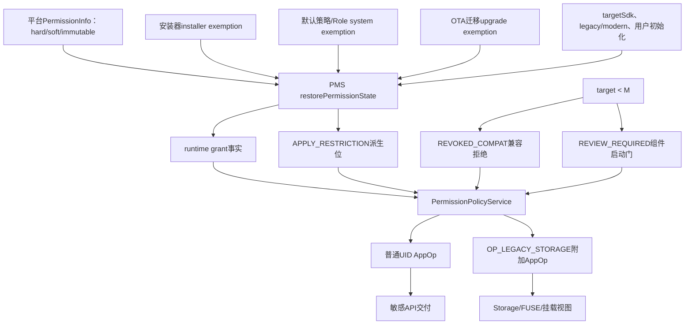
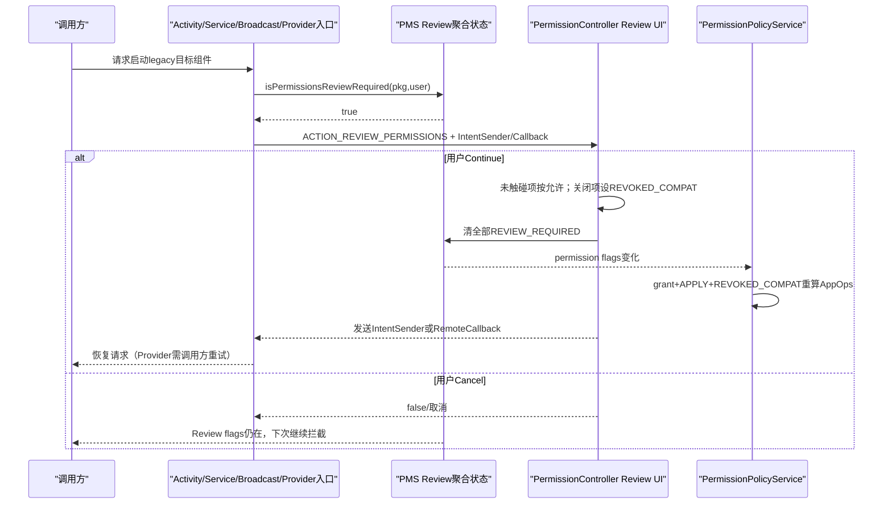
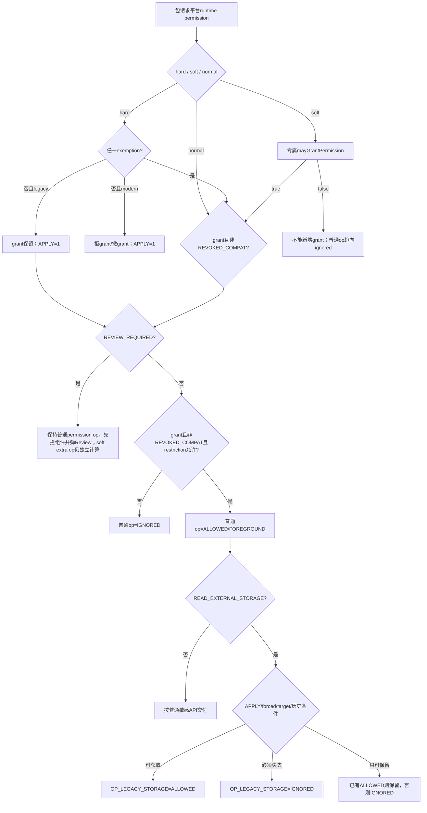

# 第539章 Android受限权限与兼容审查完整链：hard/soft、三类豁免、APPLY_RESTRICTION、REVIEW_REQUIRED、REVOKED_COMPAT与Scoped Storage

> 源码基线：Android 11 / API 30 / `android-11.0.0_r48`。本章直接阅读平台权限声明、`PermissionManagerService`、`PermissionsState`、`PermissionPolicyService`、system_server与PermissionController两份`SoftRestrictedPermissionPolicy`、旧应用权限审查UI、Activity/Service/Broadcast/Provider启动拦截、AppOpsService及StorageManagerService。只在macOS上只读源码，不进行真实编译。

## 1. 本章解决什么问题

为什么有时`checkPermission()`仍显示GRANTED，应用却只能拿到空结果？为什么同为“受限权限”，短信/后台位置与存储的表现不同？SYSTEM、INSTALLER、UPGRADE三种白名单究竟写进哪里？`APPLY_RESTRICTION`、`REVIEW_REQUIRED`与`REVOKED_COMPAT`谁负责限制、谁负责引导用户、谁负责兼容旧应用？最后还要解释READ_EXTERNAL_STORAGE为什么额外控制`OP_LEGACY_STORAGE`，以及它如何改变进程看到的共享存储视图。

## 2. 一句话定位

hard/soft是平台权限定义的政策类型；三类restriction exemption决定某包在某用户下是否免受该政策；PMS把“定义+豁免+target+用户阶段”收敛成grant和`APPLY_RESTRICTION`；旧target另由`REVIEW_REQUIRED`阻止组件直接运行、由`REVOKED_COMPAT`把“仍为grant”投影成拒绝AppOp；soft storage再用`OP_LEGACY_STORAGE`选择完整旧视图或受限媒体视图。

## 3. 先拆开七本账

第一本是`PermissionInfo.flags`中的HARD/SOFT/IMMUTABLY定义；第二本是每包、每用户permission grant；第三本是SYSTEM/INSTALLER/UPGRADE三个exemption flags；第四本是PMS派生的`APPLY_RESTRICTION`；第五本是旧模型的`REVIEW_REQUIRED`；第六本是`REVOKED_COMPAT`；第七本是普通permission AppOp与`OP_LEGACY_STORAGE`附加AppOp。排障时把七本账压成一个“是否授权”必然误判。

## 4. 定义flags和实例flags不是一层

`FLAG_HARD_RESTRICTED`、`FLAG_SOFT_RESTRICTED`、`FLAG_IMMUTABLY_RESTRICTED`来自平台`<permission>`声明，对所有请求者描述同一种permission；`FLAG_PERMISSION_RESTRICTION_*_EXEMPT`等位保存在具体包/用户的权限状态中。同一个READ_EXTERNAL_STORAGE定义是soft restricted，但A包可INSTALLER_EXEMPT，B包可无豁免，C包可UPGRADE_EXEMPT。

## 5. 总体状态流



## 6. 受限属性只能由平台runtime permission声明

`PackageParser.parsePermission()`发现permission不是runtime，或声明包不是`android`，就清掉HARD与SOFT位。普通APK不能声明一个自定义dangerous permission，再借hardRestricted让系统替它建立受信任安装器政策。限制模型当前只承认平台runtime permission。

## 7. hard与soft不能同时存在

平台permission若同时声明两个位，解析直接抛`IllegalStateException`。hard表示“不满足政策便不可持有完整permission”，soft表示“仍可存在较弱形式”；两种降级语义冲突，源码不允许用两个boolean拼出第三种状态。

## 8. immutable是第三个正交修饰位

`IMMUTABLY_RESTRICTED`说明白名单初始状态原则上在首次安装确定，之后普通安装器不能通过PackageManager增删。它不等于hard：r48中READ/WRITE_EXTERNAL_STORAGE是`softRestricted|immutablyRestricted`。平台持有专用高权限的系统调用者仍能修改，因此“immutable”是对普通安装器生命周期的政策边界，不是存储位永远不可写。

## 9. r48实际有哪些hard restricted权限

平台Manifest列出SEND/RECEIVE/READ_SMS、RECEIVE_WAP_PUSH、RECEIVE_MMS、READ_CELL_BROADCASTS、ACCESS_BACKGROUND_LOCATION、READ/WRITE_CALL_LOG与PROCESS_OUTGOING_CALLS。它们围绕默认短信/电话角色、后台位置和受控广播数据；不是“所有dangerous权限都hard restricted”。

## 10. r48实际有哪些soft restricted权限

只有READ_EXTERNAL_STORAGE与WRITE_EXTERNAL_STORAGE带soft+immutable。soft策略类的switch也只为这两项给出具体行为，未知soft permission落入DUMMY_POLICY并默认可grant。新增soft permission若忘记补策略，会形成“定义受限但运行政策默认放行”的扩展风险。

## 11. hard restricted准确含义

对target>=M应用，无任何exemption时，PMS公开grant入口拒绝grant；PermissionPolicy初始化后的状态恢复还会撤掉历史grant并设置`APPLY_RESTRICTION`。对legacy应用，为兼容“不理解runtime revoke”的旧代码，grant通常保留，但restriction位和AppOp把能力变成no-op；所以“hard一定让grant bit为false”只对现代模型才接近事实。

## 12. soft restricted准确含义

soft允许弱形式存在。PMS是否能写grant要问该permission的`mayGrantPermission()`；即使grant存在，普通AppOp和附加AppOp仍可把交付范围缩小。存储场景中，“可以读媒体集合”与“拥有旧式宽视图”是两层能力，不能把soft理解成“以一半概率授权”。

## 13. exemption不是grant

SYSTEM/INSTALLER/UPGRADE任一位只让permission具备持有完整形态的资格，不自动满足Manifest声明、用户同意、前后台关系、fixed flags与普通AppOp。安装器白名单后台位置后，应用仍需走运行时请求；白名单READ_EXTERNAL_STORAGE也不等于用户已经点了允许。

## 14. 三个exemption的来源

SYSTEM由DefaultPermissionGrantPolicy、Role等系统权限政策添加；INSTALLER来自PackageInstaller会话或安装器在记录身份下管理；UPGRADE由系统从旧Android迁移到新限制模型时添加，PermissionController第538章的版本-1—8升级使用它。三者来源不同，但PMS判断`restrictionExempt`时只看三位OR是否非零。

## 15. whitelist flag与permission state flag别混名

API输入使用`FLAG_PERMISSION_WHITELIST_SYSTEM/INSTALLER/UPGRADE`，PMS分别映射为状态中的`FLAG_PERMISSION_RESTRICTION_SYSTEM/INSTALLER/UPGRADE_EXEMPT`。前者是“这次查询或修改哪张来源表”，后者才随permission状态持久化。日志只打印EXEMPT位时，不能反推出调用API时传了哪个组合之外的参数。

## 16. exemption是每用户状态

查询与修改API都带userId，运行时权限XML也按用户保存。主用户的短信应用可SYSTEM_EXEMPT，工作资料中同包仍可能没有；分析企业设备不能只看packageName或appId，要把完整UID中的userId拆出来。

## 17. shared UID又把结果拉回UID层

permission flags按包设置接口访问，但shared UID的PermissionsState和最终UID AppOp会合流。SoftRestrictedPolicy还取同UID所有包最小targetSdk。一个包的豁免、另一个包的旧target和共同UID op可能共同决定有效能力，逐包截图不能完整解释结果。

## 18. PackageInstaller怎样接收白名单

`SessionParams.setWhitelistedRestrictedPermissions(set)`保存候选集合；若传内部哨兵`RESTRICTED_PERMISSIONS_ALL`，则设置`INSTALL_ALL_WHITELIST_RESTRICTED_PERMISSIONS`并在安装完成后展开为目标包全部requested permissions。普通集合先在创建session时过滤，非hard/soft名称会被移除。

## 19. 安装器白名单先于安装时grant应用

`handlePackagePostInstall()`先调用`setWhitelistedRestrictedPermissions(...INSTALLER)`，随后才处理安装器请求的runtime grants。顺序不能反：hard restricted若先grant会被PMS拒绝；soft old-target也可能因`mayGrantPermission()`为false而失败。

## 20. adb install的默认策略要单独记

r48 `pm install`命令构造参数时默认加“白名单全部受限permission”；`--restrict-permissions`才清掉该flag。这个shell默认不等于任意第三方安装器默认，也不等于系统安全模型自动放行；测试adb安装得到的行为可能与商店安装策略不同。

## 21. SessionParams注释中的“initially all”不是无条件平台动作

`SessionParams`普通构造器没有自动设置ALL flag；具体安装客户端必须选择。shell显式设置，而产品安装器可提交集合。阅读API注释时应继续追`installFlags`与post-install实参，否则会把调用方默认误写成PMS固定默认。

## 22. r48空集合的更新边界

post-install代码只有列表“非null且非空”才调用set；显式空集合在这条路径不会清理已有INSTALLER_EXEMPT。首次安装时原本没有该位，结果看似正确；覆盖安装想用空集合撤销旧豁免时可能保留历史状态，需要安装器随后调用remove API或结合产品补丁验证。这是实现路径边界，不应据API意图假定替换已发生。

## 23. system exemption从默认授权而来

DefaultPermissionGrantPolicy为受信任系统组件授予受限permission时，先加SYSTEM_EXEMPT；Role权限模型为短信、Call Log角色授予相关能力时也会补SYSTEM whitelist。系统来源的强度不是“永不撤销”，但普通安装器没有权限修改这张表。

## 24. upgrade exemption是兼容祖父条款

设备从旧模型升级时，原本能工作的应用不应因permission新加restricted属性突然失效。PMS为缺失的旧权限状态补UPGRADE_EXEMPT，RuntimePermissionsUpgradeController也对白名单短信、Call Log、后台位置、Storage及OTA预装包补位。它保存兼容资格，不代表新安装应用自动继承。

## 25. 任一exemption都能阻止restriction应用

PMS使用`FLAGS_PERMISSION_RESTRICTION_ANY_EXEMPT`做OR。移除INSTALLER_EXEMPT后若SYSTEM_EXEMPT仍在，`isWhitelisted`仍true，`APPLY_RESTRICTION`不会生效，hard grant也无需撤。排障“remove返回true但能力没变”时必须一次查看三位。

## 26. set只替换被指定的来源

内部set方法对传入whitelist flag逐位建立mask，只清/设对应EXEMPT，不覆盖其他两种来源。公开add/remove先读取指定来源集合，再以新集合调用内部set。三张表能独立演进，不能把一次installer更新解释成“重置全部受限政策”。

## 27. 查询权限也有身份门

SYSTEM表要求`WHITELIST_RESTRICTED_PERMISSIONS`；UPGRADE与INSTALLER允许该高权限持有者或目标包的installer-of-record。跨用户还要`INTERACT_ACROSS_USERS`，包可见性过滤失败则返回null。白名单不是普通应用可枚举的全局隐私数据库。

## 28. installer对upgrade表只能做减法

installer-of-record可以查询UPGRADE表，也可以移除既有项，但新增UPGRADE项要求专用高权限。否则安装器可伪造“从旧系统迁移”的祖父资格。INSTALLER表则本来就由installer管理；SYSTEM表始终要求高权限。

## 29. immutable权限的API保护点

公开add/remove先查BasePermission；若是hard/soft且immutable，调用者没有`WHITELIST_RESTRICTED_PERMISSIONS`便抛SecurityException。这个检查发生在修改集合之前。系统内部的安装/升级路径以system身份调用，仍可按政策调整，所以不要把它类比为写进只读硬件熔丝。

## 30. 通用updatePermissionFlags不能随便伪造豁免

非system UID即使持有GRANT/REVOKE权限，PMS也会从`flagValues`清除SYSTEM/INSTALLER/UPGRADE_EXEMPT、APPLY_RESTRICTION、SYSTEM_FIXED、GRANTED_BY_DEFAULT等系统位，因而不能把1写进去；mask仍可用于清某些位，这使PermissionController能清REVIEW_REQUIRED。正常来源管理应使用专用whitelist API。

## 31. whitelist变化不是只改三个bit

PMS先记录旧grant集合，更新来源位，再调用`restorePermissionState()`重算grant和`APPLY_RESTRICTION`；若hard permission因此丢失，最终通过callback触发权限撤销处理和进程终止。它是一条政策重算链，不是轻量标签更新。

## 32. POLICY_FIXED也不能凌驾于不可grant

若permission当前POLICY_FIXED且granted，但移除最后一个exemption后变成不可持有，PMS先清POLICY_FIXED，再让restore撤grant。源码注释明确“whitelisting trumps policy”：设备管理策略不能固定授予平台判断为不可grant的受限permission。

## 33. grant入口的hard/soft双门源码

```java
if (bp.isHardRestricted()
        && (flags & PackageManager.FLAGS_PERMISSION_RESTRICTION_ANY_EXEMPT) == 0) {
    Log.e(TAG, "Cannot grant hard restricted non-exempt permission "
            + permName + " for package " + packageName);
    return;
}

if (bp.isSoftRestricted() && !SoftRestrictedPermissionPolicy.forPermission(mContext,
        pkg.toAppInfoWithoutState(), pkg, UserHandle.of(userId), permName)
        .mayGrantPermission()) {
    Log.e(TAG, "Cannot grant soft restricted permission " + permName + " for package "
            + packageName);
    return;
}
```

这是`grantRuntimePermissionInternal()`中的真实顺序。hard只问任一exemption；soft把最终资格交给permission专属policy，因此soft并不保证无豁免时都可grant。

## 34. APPLY_RESTRICTION是派生执行位

PMS在`restorePermissionState()`里综合permission定义、是否有任一exemption、PermissionPolicy是否initialized后设置或清除。它不是第四种来源，也不说明谁决定了限制；来源要看三个EXEMPT，定义要看PermissionInfo。

## 35. 为什么Policy初始化前暂不应用restriction

默认授权和PermissionController升级可能还要补SYSTEM/UPGRADE exemption。PMS若扫描包时立即撤hard grant，会先破坏旧状态，再被升级流程补回。于是未initialized时暂缓restricted重算，PermissionPolicyService启动用户并完成必要升级后，PMS callback再`updateAllPermissions()`收敛。

## 36. modern hard的恢复矩阵

target>=M、Policy已初始化、hard且无任一exemption：若grant存在就撤销，并确保`APPLY_RESTRICTION=1`。hard且有exemption：允许保留/恢复原grant，并在先前restrictionApplied时清该位。用户是否最终获得grant仍取决于旧状态或之后请求。

## 37. modern soft的恢复矩阵

target>=M、soft且无exemption：PMS不因soft本身撤grant，而是设置`APPLY_RESTRICTION`；PermissionPolicyService再用soft policy决定普通op与extra op。若有exemption，PMS清APPLY，完整形态是否出现还要看grant与存储条件。

## 38. unrestricted permission也会清陈旧APPLY

平台更新可能移除restricted属性。Policy initialized后，只要permission已不hard/soft，restore便清掉历史`APPLY_RESTRICTION`。因此这个位是可重算缓存，不能只追加不删除。

## 39. modern应用不需要Review Permissions

restore看到target>=M会清`REVIEW_REQUIRED`与`REVOKED_COMPAT`的旧兼容标记，再使用真实runtime grant模型。现代应用自己接收请求结果并处理拒绝；把旧组件启动审查继续套在它身上会重复甚至冲突。

## 40. legacy应用为什么仍保持runtime grant

target<M不知道运行时permission可在运行中撤销。PMS把其dangerous permission按用户保存成始终granted的runtime状态，以便同时保存每用户review flags；用户拒绝则借AppOps/no-op语义而不是把grant bit直接改false，减少旧应用崩溃。

## 41. legacy hard与soft也会设置APPLY

Policy initialized且无exemption时，无论hard还是soft，legacy分支都保持grant并设置`APPLY_RESTRICTION`。PermissionPolicyService看到hard+APPLY就把普通op算ignored；soft则进入专属政策。这正是“grant存在但能力受限”的典型来源。

## 42. 直接grant/revoke legacy runtime permission为何像没反应

PMS的公开grant与revoke入口对target<M的runtime permission提前return，因为权威模型要求grant保持。PermissionController改变旧应用权限时，真正写的是`REVOKED_COMPAT`和UID AppOp，并在AppOp变化后kill旧进程，让不懂重试的应用重新启动。

## 43. REVIEW_REQUIRED与REVOKED_COMPAT不是同义词

REVIEW_REQUIRED是“任何组件运行前先让用户审查”的启动门；REVOKED_COMPAT是“permission形式仍grant，但有效访问按撤销处理”的数据交付门。初始旧应用常同时拥有二者；用户取消审查时两者都可保留，用户确认后Review清掉，而被拒的组仍可保留CompatRevoked。

## 44. 旧应用何时获得这两个初始位

PMS为新出现的平台runtime permission或缺失的legacy权限状态设置`REVIEW_REQUIRED | REVOKED_COMPAT`并grant。resetRuntimePermissions也把target<M恢复成这对flags。这样首次组件启动必须先审查，默认又不会在未审查前把敏感AppOp当作用户已同意。

## 45. PermissionsState维护用户级快速索引

每次permission flags从无Review变成有Review，就把`mPermissionReviewRequired[userId]=true`；清一项时扫描同用户所有permission，只有再无Review项才删除索引。`isPermissionsReviewRequired(pkg,user)`先要求target<M，再查这个聚合状态，避免每次组件启动都完整扫描。

## 46. Review不是只拦Activity

ActivityStarter、ActiveServices、BroadcastQueue和ActivityManagerService Provider获取都调用PMS内部检查。框架意图是“任何目标组件第一次运行前审查”，但四类组件因恢复原请求的方式不同，前后台与显式条件也不同。

## 47. Activity怎样恢复原始请求

ActivityStarter把原Intent封进one-shot、cancel-current的IntentSender，改为启动`ACTION_REVIEW_PERMISSIONS`；若原调用需要result，还传`EXTRA_RESULT_NEEDED`。确认后Review Activity启动IntentSender，并可使用`FLAG_ACTIVITY_FORWARD_RESULT`把结果链继续给原调用者。

## 48. startService只允许前台调用者拉起审查

若目标需Review且caller不在前台，startService直接返回失败并记警告；前台caller则生成service类型one-shot IntentSender，异步启动Review UI。确认后才发送原service Intent。后台调用不能突然弹系统UI，这是组件审查与后台启动政策的交点。

## 49. bindService使用RemoteCallback续接

绑定先留下pending ServiceRecord，不启动目标进程；Review UI完成后回调system_server，再次检查review是否真的清除。清除才`bringUpServiceLocked()`，否则主动unbind。它不信任一个`success=true`布尔值代替PMS事实。

## 50. Broadcast只为显式且前台来源弹审查

目标包需Review时，只有caller foreground且Intent指定Component才创建broadcast IntentSender并弹UI；隐式或后台来源只记警告并不交付。确认后发送one-shot原广播。这样避免任意后台广播借旧应用Review制造界面打扰。

## 51. Provider没有原请求Intent可重放

获取Provider时若目标需Review，前台caller会触发Review Activity，但函数当前返回失败；UI没有封装原ContentResolver操作，调用方需在审查完成后自行重试。后台caller连UI也不弹。Activity/Service的“自动续接”不能套到Provider。

## 52. Review UI只面向target<M

PMS检查对target>=M直接false；PermissionController页面虽然可由Intent显式打开，也会读取包信息和Review flags，但系统组件门只为legacy模型触发。正常现代应用权限请求走GrantPermissionsActivity，不走这张“组件运行前总审查”页面。

## 53. restricted permission可能根本不出现在Review组里

PermissionController的数据模型通常过滤`isRestricted`项。Review Fragment若发现没有任何可审查group，会认为全部group都受限，直接执行confirm并继续；随后仍手工遍历包requestedPermissions清Review flag。受限项是否可用继续由REVOKED_COMPAT、APPLY与exemption决定。

## 54. 未触碰的可见项默认按grant确认

Review preference把尚未修改的ReviewRequired组显示为checked；用户点继续时，对未触碰项调用`grantRuntimePermissions()`。legacy分支保持grant、允许对应AppOp、清REVOKED_COMPAT和Review。它实现旧Android升级时“展示并继续已有能力”，不是所有开关初始关闭。

## 55. 用户在Review中关闭一组

legacy revoke不会清grant bit；PermissionController设置REVOKED_COMPAT、把对应AppOp设为ignored，并可能kill UID。persist时清Review，使组件之后可启动，但敏感访问得到拒绝/no-op。UI上“拒绝”与PMS grant dump同时出现并不矛盾。

## 56. Continue和Cancel的差别

Continue确认各组、持久化并清全部Review flags，然后执行原IntentSender或RemoteCallback；Cancel不清flags，返回RESULT_CANCELED/false并结束。下次目标组件仍会触发Review。取消不是“拒绝所有permission并永久不再询问”。

## 57. Review确认还会清隐藏项的Review位

组循环只能处理可显示平台group；Fragment最后对`pkg.requestedPermissions`逐项调用`updatePermissionFlags(...REVIEW_REQUIRED, 0)`，并捕获无效permission异常：

```java
PackageManager pm = getContext().getPackageManager();
PackageInfo pkg = mAppPermissions.getPackageInfo();
UserHandle user = UserHandle.getUserHandleForUid(pkg.applicationInfo.uid);

for (String perm : pkg.requestedPermissions) {
    try {
        pm.updatePermissionFlags(perm, pkg.packageName, FLAG_PERMISSION_REVIEW_REQUIRED,
                0, user);
    } catch (IllegalArgumentException e) {
        Log.e(LOG_TAG, "Cannot unmark " + perm + " requested by " + pkg.packageName
                + " as review required", e);
    }
}
```

否则一个restricted/无group项会让用户看不到开关却永远卡在组件启动门。注意这里只清Review位；隐藏项的Compat、APPLY、exemption和grant仍由各自链路决定。

## 58. “新权限”和“当前权限”只是页面分类

若包存在任一不再ReviewRequired的group，页面视为updated package，把仍需审查的group放New Permissions，其余放Current Permissions。这个判断按group状态推断，不读取APK版本历史；分类不改变PMS授权规则。

## 59. Review组件续接图



## 60. REVIEW_REQUIRED只让普通permission AppOp暂停投影

`PermissionToOpSynchroniser.addPermissionAppOp()`发现Review位便return，不把普通permission switch op加入allowed/ignored列表。旧应用尚未完成审查时，组件启动门负责阻断；保留已有普通op避免Policy提前替用户作决定。容易漏掉的例外是`addAppOps()`随后仍会调用`addExtraAppOp()`，该方法不检查Review，所以soft READ_EXTERNAL_STORAGE的`OP_LEGACY_STORAGE`仍按restriction与存储历史收敛。清Review触发flags listener后，下一轮普通op才按REVOKED_COMPAT与restriction收敛。

## 61. REVOKED_COMPAT怎样进入最终AppOp

Review已清或原本不需要Review时，Synchroniser先确认grant，再看REVOKED_COMPAT；有该位立即返回false，普通permission op目标为ignored。它不要求grant bit先撤，正是compat“形式授权、实际no-op”的实现。

## 62. 外部setUidMode会反向维护Compat位

普通AppOpsService `setUidMode()`没有Policy callback时调用`updatePermissionRevokedCompat()`。对已grant runtime permission，ignored/errored等不兼容mode会设置REVOKED_COMPAT；恢复allowed会清。PermissionPolicy内部写传callback跳过这一步，防止由flags推op又由op反写flags形成自激。

## 63. 前后台permission的Compat映射

有background关系时，MODE_ALLOWED表示前后台都不compat-revoked；MODE_FOREGROUND允许前台并给已grant后台permission设置REVOKED_COMPAT；更窄mode连前台也CompatRevoked。一个switch op因此要分别更新前台permission与backgroundPermission flags。

## 64. package mode没有同等反向保证

r48公开`setMode(package)`路径不调用`updatePermissionRevokedCompat()`。它虽通知Policy watcher，但下一轮可能按permission事实重设UID mode、清冲突package override。不能用一次package级AppOp修改代替稳定的runtime revoke或compat flag协议。

## 65. AppOps反向链用shared UID第一个包名

`updatePermissionRevokedCompat()`取`getPackagesForUid(uid)[0]`做permission查询和flag更新。grant本身按共享UID生效，但flag接口以这个包名进入；数组首项假设与shared权限状态配合可代表UID。OEM改动shared UID/包可见性时，这个隐含选择值得断点验证。

## 66. modern应用直接改runtime AppOp会告警

target>=M且grant与新UID mode不一致时，AppOpsService打印“应撤runtime permission而不是setUidMode”的警告，但仍更新Compat位。这条兼容桥可工作，却不是现代权限UI的首选控制面。

## 67. 包更新时Compat位可能被清

modern分支的`restorePermissionState()`主动移除REVOKED_COMPAT；legacy到modern升级也转入真实grant模型。因而外部工具只改AppOp形成的“软拒绝”不是所有包升级路径上的永久用户选择，正式策略应写正确的permission状态。

## 68. UI的grantedIncludingAppOp其实主要看Compat位

`PermStateLiveData`用requested permission granted bit且REVOKED_COMPAT为0计算`granted`，并不逐次查询所有raw package AppOp。因此遗留package override若没有同步成Compat，UI可能显示允许而底层raw mode仍拒绝；PermissionPolicy最终收敛负责尽量消除这种偏差。

## 69. hard restriction最终矩阵

modern+无exemption：grant入口拒绝、restore撤历史grant、APPLY=1、op ignored；modern+任一exemption：APPLY=0，可由用户/默认策略grant；legacy+无exemption：grant可保持、APPLY=1，Review之后普通op仍ignored；legacy+exemption：APPLY=0，但是否REVOKED_COMPAT取决于用户Review决定。

## 70. soft restriction最终矩阵

先问专属policy能否grant，再问普通op是否允许，最后问extra op是否允许。READ/WRITE target<Q且无exemption时`mayGrantPermission=false`；target>=Q可保持基本permission；READ还根据APPLY、forced scoped、legacy请求、已有视图、WRITE_MEDIA_STORAGE和target R决定`OP_LEGACY_STORAGE`。

## 71. PermissionController如何隐藏restricted项

LightPermission对hard在“无任一exemption”时标restricted；对soft调用UI侧SoftRestrictedPermissionPolicy。LightAppPermGroup的`permissions`从`allPermissions`过滤restricted项，GrantPermissionsActivity发现Manifest确实请求但模型中无Permission时，记录IGNORED_RESTRICTED_PERMISSION并不展示对话框。

## 72. UI侧soft policy与system_server是双生实现

PermissionController版本只回答“是否应显示”，READ/WRITE规则为有exemption或包target>=Q；system_server版本还决定grant与`OP_LEGACY_STORAGE`。注释称二者为twin，但它们代码不共享，修改一边忘记另一边会出现UI和实际能力分叉。

## 73. shared UID target计算存在两侧差异

system_server用同UID所有包的最小targetSdk，避免包之间争夺UID storage模式；PermissionController UI侧按当前PackageInfo自己的targetSdk判断显示。一个Q目标包与同UID P目标包组合时，页面可见性与服务端grant资格可能不同，最终PMS仍是写入权威。

## 74. READ_EXTERNAL_STORAGE基本grant条件

`mayGrantPermission()`返回“任一exemption存在，或共享UID最小target>=Q”。所以旧target无豁免时连基本grant都不能新增；Q/R目标即使无exemption，也可拥有面向媒体集合的较弱形态。完整旧视图由extra op另算。

## 75. WRITE_EXTERNAL_STORAGE基本grant条件

条件同样是exemption或最小target>=Q，但它没有extra op策略。Android R的scoped storage语义使WRITE_EXTERNAL_STORAGE对新target不再等价于任意共享存储写；grant bit存在不应被解释成传统全盘写权限。

## 76. APPLY_RESTRICTION对READ的特殊作用

READ的普通`mayGrantPermission()`不直接看APPLY；APPLY进入`mayAllowExtraAppOp()`与R目标的丢失判定。无exemption时PMS设置APPLY，它会阻止获取或保留`OP_LEGACY_STORAGE`，把应用限制在scoped/媒体集合形态。

## 77. OP_LEGACY_STORAGE不是Manifest permission

AppOps表中该op没有对应permission，普通permission→op映射不会自动产生它。PermissionPolicyService只因READ_EXTERNAL_STORAGE被标soft restricted，显式调用`getExtraAppOpCode()`才把它加入第二张候选表。

## 78. soft storage策略关键源码

```java
@Override
public boolean mayGrantPermission() {
    return isWhiteListed || targetSDK >= Build.VERSION_CODES.Q;
}
@Override
public int getExtraAppOpCode() {
    return OP_LEGACY_STORAGE;
}
@Override
public boolean mayAllowExtraAppOp() {
    if (shouldApplyRestriction) {
        return false;
    }
    if (isForcedScopedStorage) {
        return false;
    }
    return hasWriteMediaStorageGrantedForUid
            || ((hasLegacyExternalStorage || hasRequestedLegacyExternalStorage)
                && targetSDK < Build.VERSION_CODES.R);
}
```

这段是READ策略的真实核心。白名单负责基本grant资格，`APPLY_RESTRICTION`、forced scoped和旧视图条件另行决定extra op；不能把三个判断折成同一个“whitelisted”。

## 79. 单包候选何时会提出允许LEGACY_STORAGE

对当前包计算候选时，必须APPLY为false、包名不在forced scoped名单，并满足两条之一：UID有WRITE_MEDIA_STORAGE；或UID已有legacy外部存储/任一包请求legacy，且共享UID最小target<R。普通R目标只凭`requestLegacyExternalStorage=true`不能提出新allow；最终UID mode还要合并shared UID全部包的候选。

## 80. WRITE_MEDIA_STORAGE为何是强通道

它是平台级特殊能力，满足时不要求target<R、已有legacy或requestLegacy，仍受APPLY与forced scoped阻挡。后续StorageManager取mount mode时还同时要求WRITE_EXTERNAL_STORAGE，体现“强身份permission + 运行时存储许可”的双门。

## 81. target<R何时会主动失去legacy op

`mayDenyExtraAppOpIfGranted()`对target<R直接返回`!mayAllowExtraAppOp()`：一旦APPLY开启、进入forced名单、既无WRITE_MEDIA_STORAGE又无已有/请求legacy，就可把当前allowed降成ignored。旧target保留资格与获得资格使用同一条件。

## 82. target R为何采用“只在明确条件下失去”

R目标通常不能新获得legacy；但从旧版本升级且已有allowed时，若未APPLY、未forced scoped，并持有WRITE_MEDIA_STORAGE或声明`preserveLegacyExternalStorage`，允许保留。否则可降级。它把“新获取”和“历史保留”拆成两个方法。

## 83. 条件IGNORED防止误删历史文件视图

若策略认为不能allow extra op、但`mayDenyExtraAppOpIfGranted=false`，Synchroniser把候选放`mOpsToIgnoreIfNotAllowed`。应用阶段发现当前已经ALLOWED便保留；当前不是ALLOWED才写IGNORED。这不是永久豁免，而是对R迁移历史状态的单向保护。

## 84. forced scoped storage whitelist名字容易误读

集合名带whitelist，但含义是“被强制进入scoped storage的包名单”，命中包会产生拒绝legacy op的候选。它来自`storage_native_boot` DeviceConfig，类加载时转成静态HashSet且无listener，运行中改配置未必即时生效；shared UID最终仍按全部包候选合并。

## 85. requestLegacyExternalStorage按UID任一包聚合

helper遍历`getPackagesForUid()`，任一包ApplicationInfo声明requestLegacy即true；`hasLegacyExternalStorage`也按UID缓存。shared UID中一个旧包可以为全UID提供兼容信号，这正是策略采用最小target的原因。

## 86. preserveLegacyExternalStorage只看当前pkg对象

策略直接读取传入`AndroidPackage.hasPreserveLegacyExternalStorage()`，不像requestLegacy那样遍历UID全部包。同步shared UID时会分别add每个包，同一UID+op最终按候选优先级合并：任一ALLOWED候选先占位并压过后续IGNORED；若没有allow，普通IGNORED又先于conditional ignored。不同包声明可能产生三类竞争，必须看完整收集结果。

## 87. StorageManager怎样消费LEGACY_STORAGE

`StorageManagerService.getMountMode()`先检查普通READ/WRITE permission+AppOp，再看LEGACY_STORAGE：legacy+write得到`MOUNT_EXTERNAL_WRITE`，legacy+read得到READ，否则DEFAULT；`getExternalStorageMountMode()`在isolated-storage路径直接采用这套计算。FUSE路径还缓存哪些UID有legacy并在op变化时更新视图。extra op不是装饰性统计位，而会影响进程能看到的文件命名空间。

## 88. 普通READ/WRITE op仍是第一道门

即使LEGACY_STORAGE allowed，没有READ/WRITE runtime permission及其AppOp也不能凭空获得挂载访问。StorageManager代码明确组合检查；“legacy op allowed=全盘访问”少算了普通权限、mount policy、MediaProvider与SELinux/FUSE等后续层。

## 89. FUSE与旧挂载实现的响应方式不同

FUSE启用时StorageManagerInternal收到OP_LEGACY_STORAGE变化，更新`mUidsWithLegacyExternalStorage`；其他op变化可能kill进程以重新获取视图。非FUSE路径还注册AppOps watcher并通过remount改变UID挂载。排障要先确认`mIsFuseEnabled`，不能只套一种重挂载时序。

## 90. READ/WRITE grant与revoke的存储刷新路径不对称

PMS成功grant READ/WRITE后，若用户已initialized，会直接调用`onExternalStoragePolicyChanged(uid, package)`；用户尚未初始化则无需昂贵remount。revoke函数本身没有对称的直接StorageManager调用，它通过permission listener、PermissionPolicy改AppOp、AppOps同步Storage回调及撤权kill继续收敛。包replace且请求legacy storage时，PMS还把所有userId标为updated，迫使PermissionPolicy重新评估legacy op。

## 91. AppOpsService有同步Storage回调

每次有效UID mode改变后，AppOpsService调用`StorageManagerInternal.onAppOpsChanged(code,uid,package,mode,previousMode)`；即便Policy忽略自身异步watcher，这个同步消费者仍收到。防自激只排除Policy callback，不会阻断存储视图更新。

## 92. exemption变化的完整时序

来源API更新某个EXEMPT位→PMS restorePermissionState重算grant/APPLY/Review→权限listener排PermissionPolicy包级同步→Policy读grant、REVOKED_COMPAT和soft policy→写普通op与LEGACY_STORAGE→AppOps同步通知StorageManager→必要时remount、更新FUSE缓存或kill UID。任一步日志都只是链中间态。

## 93. hard移除最后exemption的结果

modern应用若原grant，restore会清可能阻挡撤销的POLICY_FIXED、撤hard grant、设置APPLY，并通过callback通知/kill；Policy把op收敛ignored。legacy保持grant但APPLY让op ignored，若Review重新出现还先挡组件启动。

## 94. soft移除最后exemption的结果

modern grant可继续存在，PMS设置APPLY；READ extra op随后不能allow，是否立即从allowed降级还看target与`mayDenyExtraAppOpIfGranted()`。对target<Q，基本`mayGrantPermission`也false，后续grant请求被拒，Policy普通op可ignored。不能统一写成“撤白名单就撤权限”。

## 95. whitelist legacy应用为何重新要求Review

从完全无exemption变为任一exemption时，若target<M，PMS额外设置REVIEW_REQUIRED。能力从受限形态升级为可能完整形态属于新的用户可见决定，不能静默放开；Review完成后才清。

## 96. 清APPLY也可能给legacy重新加Review

restore发现permission变为unrestricted或获得exemption并清除既有APPLY时，对legacy设置REVIEW_REQUIRED。它覆盖的不只是专用whitelist setter那一个方向，也处理平台定义改变或其他恢复路径。

## 97. 缺失permission状态为何自动UPGRADE_EXEMPT

PMS发现某user的PermissionsState标记missing时，对平台、未removed、runtime且hard/soft（或immutable）的请求项设置UPGRADE_EXEMPT；legacy还加Review+Compat并grant。它保护旧系统状态导入，不能当作新安装器的INSTALLER政策。

## 98. exemption持久化与重算不是事务

flags写、grant撤销、permission callback、AppOps同步和Storage更新跨多个服务/线程；中途观察可看到新EXEMPT但旧op，或grant已撤而进程尚未kill。稳定结论应等待事件收敛并重新读取七本账，而不是要求单条Binder调用具备ACID语义。

## 99. shared UID让“杀哪个包”变成杀整个UID

AppPermissionGroup因AppOp改变调用`killUid`，PMS权限撤销callback也按uid/user处理。共享UID兄弟包即使没有打开Review页面，也会一起重启或失去UID级op；这是共享安全身份的必然后果。

## 100. whitelist API返回值不证明最终能力

add返回true只表示目标名称不在刚查询的来源集合中、随后setter接受了请求；内部只遍历目标包实际requested的hard/soft permission，所以包未请求该项时甚至可能没有持久化bit。即便bit写入，hard仍可能因用户未grant而不可用，soft可能只有基本媒体能力，fixed flag或前后台关系也可限制。remove返回true也可能因其他exemption仍在而完全无外观变化。

## 101. XML默认权限的whitelisted字段不要带入本章API

第538章已核准：DefaultPermissionGrantPolicy XML的`whitelisted`布尔在r48实参位置传给`ignoreSystemPackage`，而restricted whitelist参数固定true。它和PackageManager的三类`FLAG_PERMISSION_WHITELIST_*`命名相似但不是同一个控制位，必须沿调用参数位置判断。

## 102. 最终能力决策图



## 103. 复读校正一：restricted不等于用户拒绝

restricted是平台政策资格；用户拒绝通常表现为grant false或REVOKED_COMPAT。一个无exemption hard permission与一个用户点拒绝的普通permission都可能最终op ignored，但恢复途径完全不同：前者要合法来源豁免，后者要用户重新授权。

## 104. 复读校正二：APPLY不等于AppOp mode

APPLY是permission flag，Policy用它参与hard/soft判断；最终op还受grant、Compat、前后台与shared UID其他包影响。看到APPLY=1不能直接断言所有相关op都ignored，尤其READ的普通op与LEGACY_STORAGE是两张表。

## 105. 复读校正三：Review完成不等于全部允许

Continue会把未触碰可见项按允许处理，但用户关闭项继续CompatRevoked；隐藏restricted项只清Review，可能仍APPLY或Compat；Policy收敛与Storage视图更新还在后续。Review完成只解除组件启动门。

## 106. 复读校正四：whiteList不等于legacy storage

exemption可让旧target READ具备grant资格，也会使PMS清APPLY；LEGACY_STORAGE仍要满足不forced、target/历史/声明或WRITE_MEDIA_STORAGE条件。一个被whitelist的R目标普通应用未必获得旧式宽视图。

## 107. r48实现边界一：空安装集合不清旧位

Session post-install以`non-null && !empty`作为调用条件，导致空集合不是“用空集合替换”而是“不调用”。这是最容易被高层API语义遮蔽的实现缺口之一，覆盖安装测试要显式读取INSTALLER_EXEMPT确认。

## 108. r48实现边界二：双生soft policy可能漂移

UI侧使用单包target判断是否显示，system_server侧用shared UID最小target并维护extra op；两份代码靠人工同步。新增permission、target分界或DeviceConfig规则时，必须同时审计两边及测试。

## 109. r48实现边界三：Storage legacy UID缓存有shared UID TODO

用户启动时的快照与PackageMonitor维护`mUidsWithLegacyExternalStorage`；包移除直接按uid删除，源码TODO承认应先检查同UID其他包是否仍有legacy。共享UID卸载一个兄弟包可能短暂/错误清缓存，需结合后续snapshot或op变化观察。

## 110. r48实现边界四：Review页面自动通过全restricted场景

没有可显示group时Fragment直接confirm并执行原请求；它会清Review但不会神奇授予restricted项。若调用方只看“原Activity终于启动”可能误以为权限获准，实际敏感API仍可能no-op。

## 111. 复读后的排障口令

先问“定义是什么”，再问“三个来源谁在豁免”，再看“grant/APPLY/Review/Compat四位状态”，再算“普通op与extra op”，最后确认“组件是否被Review挡住、Storage是否已刷新视图”。按这个顺序能避免在UI、PMS与AppOps三处来回猜。

## 112. macOS只读练习一：列出定义与PMS恢复矩阵

```bash
sed -n '740,1120p' frameworks/base/core/res/AndroidManifest.xml
sed -n '3158,3190p' frameworks/base/core/java/android/content/pm/PackageParser.java
sed -n '2830,3140p' frameworks/base/services/core/java/com/android/server/pm/permission/PermissionManagerService.java
sed -n '3300,3510p' frameworks/base/core/java/android/content/pm/PackageManager.java
```

列出r48全部hard/soft/immutable permission。为modern/legacy × hard/soft × 有/无任一exemption画八格表，分别填写grant、APPLY、Review、Compat和下一轮普通AppOp；注明Policy尚未initialized时哪些动作暂缓。

## 113. macOS只读练习二：追三类exemption来源与撤销

```bash
sed -n '1100,1345p' frameworks/base/services/core/java/com/android/server/pm/permission/PermissionManagerService.java
sed -n '3928,4055p' frameworks/base/services/core/java/com/android/server/pm/permission/PermissionManagerService.java
sed -n '1680,1760p' frameworks/base/core/java/android/content/pm/PackageInstaller.java
sed -n '2085,2140p' frameworks/base/services/core/java/com/android/server/pm/PackageManagerService.java
```

构造同一permission同时SYSTEM+INSTALLER_EXEMPT：先remove installer、再remove system，说明每步`isWhitelisted`、POLICY_FIXED、grant、APPLY与kill是否变化；再核对installer为何能删但不能新增UPGRADE项，并验证post-install空集合是否调用内部set。

## 114. macOS只读练习三：推演旧应用组件审查

```bash
sed -n '3820,3865p' frameworks/base/services/core/java/com/android/server/pm/permission/PermissionManagerService.java
sed -n '1045,1115p' frameworks/base/services/core/java/com/android/server/wm/ActivityStarter.java
sed -n '720,785p' frameworks/base/services/core/java/com/android/server/am/ActiveServices.java
sed -n '80,270p' packages/apps/PermissionController/src/com/android/permissioncontroller/permission/ui/handheld/ReviewPermissionsFragment.java
```

分别推演Activity、后台startService、前台bindService、显式前台Broadcast与Provider：谁会弹UI、原请求怎样续接、Cancel后怎样、Continue但关闭某组后grant/Compat/AppOp怎样。再解释“全部group受限”为什么自动继续却不放开数据。

## 115. macOS只读练习四：手算Scoped Storage附加op

```bash
sed -n '100,245p' frameworks/base/services/core/java/com/android/server/policy/SoftRestrictedPermissionPolicy.java
sed -n '635,825p' frameworks/base/services/core/java/com/android/server/policy/PermissionPolicyService.java
sed -n '4310,4365p' frameworks/base/services/core/java/com/android/server/StorageManagerService.java
sed -n '4640,4810p' frameworks/base/services/core/java/com/android/server/StorageManagerService.java
```

为P/Q/R三个target分别组合EXEMPT、APPLY、requestLegacy、preserveLegacy、已有legacy、WRITE_MEDIA_STORAGE和forced scoped，计算基本READ grant、普通READ op、LEGACY_STORAGE候选表及mount mode。最后加入一个shared UID不同target包，比较UI侧单包判断与system_server最小target判断。

## 116. 推荐的只读排障顺序

先从平台Manifest和PermissionInfo确认hard/soft/immutable；用完整userId查询目标包requested、grant和三个EXEMPT；再看APPLY、REVIEW、REVOKED_COMPAT；列出shared UID所有包与最小target；分别读取UID mode、package mode、raw mode及LEGACY_STORAGE；检查PermissionPolicy started/pending sync；最后看StorageManager FUSE开关、legacy UID缓存、mount mode和进程是否在op改变前已启动。

## 117. 推荐断点链

安装来源断`PackageInstallerService.createSessionInternal/handlePackagePostInstall`；豁免断`setWhitelistedRestrictedPermissionsInternal/setWhitelistedRestrictedPermissionsForUsers`；PMS矩阵断`restorePermissionState/grantRuntimePermissionInternal`；审查断`isPermissionsReviewRequired`和四类组件的`request*ReviewIfNeeded`；UI断`ReviewPermissionsFragment.confirmPermissionsReview/AppPermissionGroup.persistChanges`；投影断`PermissionToOpSynchroniser.shouldGrantAppOp/addExtraAppOp`；存储断`StorageManagerInternalImpl.onAppOpsChanged/getMountMode`。

## 118. 本章容易说错的十二句话

“hard/soft是每包flags”错；“whitelist就是grant”错；“APPLY是第四张白名单”错；“移除一个exemption一定立即受限”错；“hard对legacy也一定清grant”错；“REVIEW_REQUIRED等于REVOKED_COMPAT”错；“Review只拦Activity”错；“Continue等于全部permission允许”错；“soft等于普通op降一级”错；“LEGACY_STORAGE由READ permission自动映射”错；“R应用声明requestLegacy就能新获旧视图”错；“AppOps变化只影响日志不影响文件视图”也错。

## 119. 本章知识闭环

平台先用PermissionInfo定义哪些能力需要特殊资格；安装器、系统默认/Role和OTA升级把三类exemption写进每用户状态；PMS在PermissionPolicy初始化边界上把这些事实收敛成modern真实grant或legacy兼容grant及APPLY；旧应用启动前通过Review让用户作决定，拒绝由REVOKED_COMPAT与AppOps表达；PermissionPolicy再计算普通op与soft storage extra op，AppOps同步通知StorageManager更新挂载/FUSE视图。于是“grant=true但拿不到完整数据”不是异常，而是多层兼容政策的设计结果。

## 120. 下一章预告

第540章继续深入Android 11 Scoped Storage完整数据面：`requestLegacyExternalStorage`、`preserveLegacyExternalStorage`、FUSE/直通挂载、MediaProvider、StorageManager mount mode、READ/WRITE与MANAGE_EXTERNAL_STORAGE AppOps，以及应用路径为何在target与升级场景下呈现不同视图。
