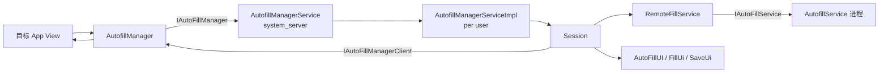
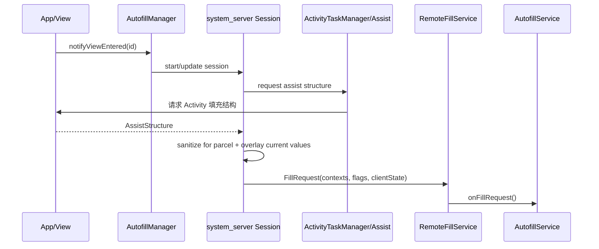
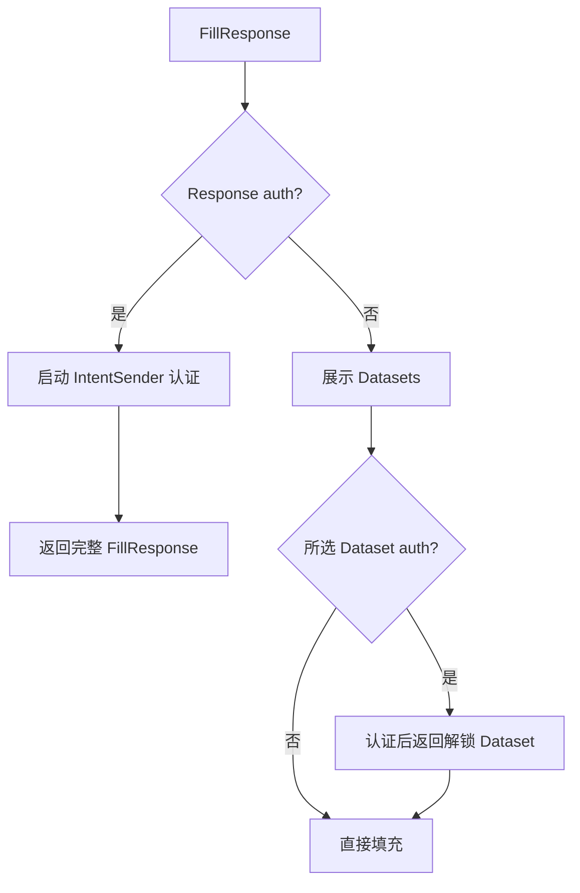
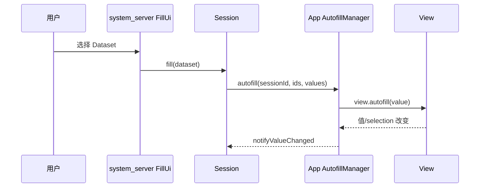
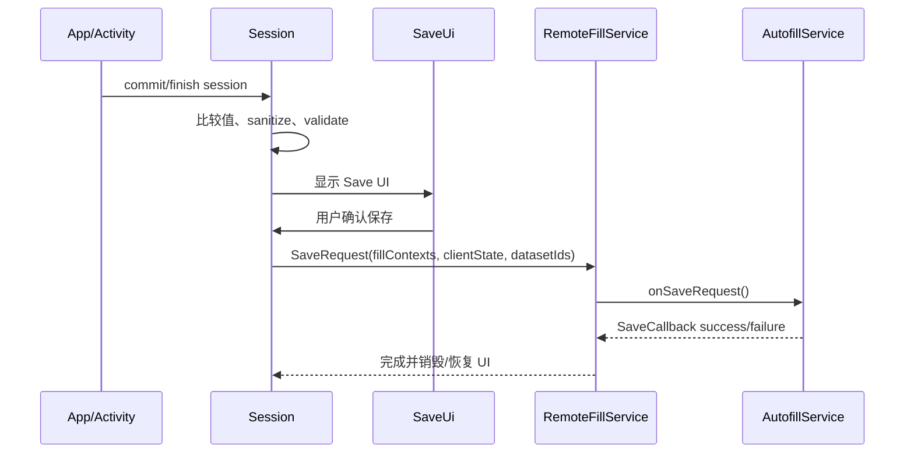

# 54 AutofillManagerService、AutofillSession 与自动填充数据链路

> 源码版本：Android 11 / API 30 / `android-11.0.0_r48`  
> 学习方式：macOS 只读源码，不要求编译。  
> 本章目标：理解输入框进入自动填充后，系统如何采集页面语义结构、请求 AutofillService、展示 Dataset、执行认证、把值写回 View，并在提交时决定是否发起保存。

---

## 1. 一句话理解 Autofill

Android Autofill 不是输入法直接读取 View 文本，而是系统建立一个受控 Session，把页面语义快照交给用户选择的 AutofillService，再将服务返回的字段值映射回当前页面。

```text
View 获得焦点/请求 autofill
→ App AutofillManager 通知 system_server
→ Session 请求 AssistStructure
→ AutofillService 收到 FillRequest
→ 返回 FillResponse + Datasets
→ system_server 展示建议
→ 用户选择 Dataset/完成认证
→ App 按 AutofillId 将 AutofillValue 写入对应 View
→ 页面提交/Activity 结束
→ 若满足 SaveInfo，服务收到 SaveRequest
```

---

## 2. 整体架构



核心分工：

- App：提供 `AutofillId`、`AutofillValue` 和结构；
- system_server：会话、安全、请求、响应、UI、认证和保存协调；
- AutofillService：识别字段、匹配账户/地址/卡片数据并生成 Dataset；
- 用户：选择数据集并决定是否保存。

---

## 3. 核心源码入口

### 客户端

```text
frameworks/base/core/java/android/view/autofill/AutofillManager.java
frameworks/base/core/java/android/view/autofill/AutofillId.java
frameworks/base/core/java/android/view/autofill/AutofillValue.java
frameworks/base/core/java/android/view/autofill/IAutoFillManagerClient.aidl
```

### system_server

```text
frameworks/base/services/autofill/java/com/android/server/autofill/AutofillManagerService.java
frameworks/base/services/autofill/java/com/android/server/autofill/AutofillManagerServiceImpl.java
frameworks/base/services/autofill/java/com/android/server/autofill/Session.java
frameworks/base/services/autofill/java/com/android/server/autofill/ViewState.java
frameworks/base/services/autofill/java/com/android/server/autofill/RemoteFillService.java
frameworks/base/services/autofill/java/com/android/server/autofill/ui/
```

### 服务 API

```text
frameworks/base/core/java/android/service/autofill/AutofillService.java
frameworks/base/core/java/android/service/autofill/FillRequest.java
frameworks/base/core/java/android/service/autofill/FillResponse.java
frameworks/base/core/java/android/service/autofill/Dataset.java
frameworks/base/core/java/android/service/autofill/SaveInfo.java
frameworks/base/core/java/android/service/autofill/SaveRequest.java
```

---

## 4. 四个层次先分清

| 层次 | 对象 | 含义 |
|---|---|---|
| 字段身份 | `AutofillId` | 当前窗口/结构中的语义字段标识 |
| 页面快照 | `AssistStructure` | 某次请求时的窗口和 ViewNode 树 |
| 服务建议 | `FillResponse` / `Dataset` | 服务建议哪些字段填什么值 |
| 实际写入 | `AutofillManager.autofill()` / `View.autofill()` | App 当前 View 真正接收值 |

服务拿到的是结构快照，不是 App View 引用；Dataset 也只是建议，用户选择后才真正写入。

---

## 5. AutofillService 如何声明

```xml
<service
    android:name=".MyAutofillService"
    android:permission="android.permission.BIND_AUTOFILL_SERVICE"
    android:exported="true">
    <intent-filter>
        <action android:name="android.service.autofill.AutofillService" />
    </intent-filter>
    <meta-data
        android:name="android.autofill"
        android:resource="@xml/autofill_service" />
</service>
```

只有系统通过 signature 级 `BIND_AUTOFILL_SERVICE` 绑定。每个用户选择自己的 AutofillService；安装、启用、当前选中和已经绑定是不同状态。

---

## 6. AutofillId 是什么

`AutofillId` 标识可填充节点。普通 View 的 id 与 ViewRoot/window session 组合后形成标识；虚拟结构还包含 virtual child id。

它不是简单的 `R.id.username`：

- 不同 Activity/window 中同一资源 ID 不能混淆；
- 虚拟控件可能没有真实 View；
- Session 可为 id 增加 session 语境；
- 页面重建后旧 id/旧 ViewState 可能失效。

服务必须从当前 `FillContext` 的 AssistStructure 查找字段，不应跨会话长期缓存并盲目复用 AutofillId。

---

## 7. AutofillValue 是什么

它是可跨进程传输的类型化值：

```text
forText(CharSequence)
forToggle(boolean)
forList(int)
forDate(long)
```

不同 View 通过：

```text
getAutofillType()
getAutofillValue()
autofill(AutofillValue)
```

参与协议。值类型必须与字段支持类型匹配；把 text value 填进 toggle 字段应被拒绝或忽略。

---

## 8. autofillHints 的作用

应用可声明：

```xml
android:autofillHints="username,emailAddress,password"
```

或动态设置 hints。它告诉服务字段语义，减少依赖 View id、hint 文本和启发式猜测。

常见 hints：

- username；
- password；
- emailAddress；
- phone；
- postalAddress；
- creditCardNumber；
- creditCardExpirationDate。

Hint 是语义提示，不是让任意服务绕过用户选择读取字段的权限。

---

## 9. `importantForAutofill`

View 可声明是否参与结构：

```text
AUTO
YES
NO
YES_EXCLUDE_DESCENDANTS
NO_EXCLUDE_DESCENDANTS
```

登录、地址等字段应正确暴露；一次性验证码、搜索框或敏感但不应保存的字段可按业务设置。

`importantForAutofill=NO` 主要影响 Autofill 结构和行为，不等于该 View 在无障碍、截图或输入法等其他系统中不可见。

---

## 10. Autofill 与无障碍节点树不同

上一章的 AccessibilityNodeInfo 是按需查询的可访问语义节点。Autofill 使用 AssistStructure/ViewNode：

- 由 ActivityTaskManager/应用 assist 数据采集链生成；
- 可包含窗口、层级、AutofillId、hints、当前值、HTML 属性等；
- 作为 FillContext 快照交给选中的 AutofillService；
- 不提供通用的节点动作接口。

两者都描述 UI，但用途、接口和安全模型不同。

---

## 11. Session 从哪里开始

可填充 View 进入/获得焦点时，ViewRoot/AutofillManager 调用类似：

```text
notifyViewEntered(view)
→ updateSessionLocked(... ACTION_START_SESSION / VIEW_ENTERED)
→ IAutoFillManager.startSession(...)
```

system_server 的 per-user `AutofillManagerServiceImpl` 校验：

- calling UID 与 package/component；
- activity token；
- 当前用户和启用服务；
- session 数量和黑名单/禁用状态；
- compat mode 与 flags。

通过后创建唯一 sessionId 和 `Session`。

---

## 12. Session 管什么

`Session` 是一次表单交互的核心状态机，维护：

- session id、userId、task/activity token；
- client Binder；
- 当前 focused AutofillId；
- `AutofillId → ViewState`；
- 多个 FillContext；
- requestId → FillResponse；
- clientState；
- selected/ignored dataset IDs；
- SaveInfo 和保存 UI；
- authentication 请求；
- RemoteFillService；
- augmented/inline 状态；
- 生命周期和销毁原因。

一个 Activity 内焦点在多个字段间切换，通常仍属于同一 Session，而不是每个字段创建一个 Session。

---

## 13. ViewState 是什么

每个 AutofillId 对应一个 `ViewState`，记录：

- 当前 value；
- autofilled value；
- dataset id；
- focused/changed/autofilled 等状态 flags；
- 当前 response；
- virtual bounds；
- fill-ready listener。

它回答“这个字段在当前 Session 发生了什么”，不是目标 View 本身。

例如字段被 Dataset 填入后又被用户修改，会从 autofilled 演变为 changed，这直接影响保存判断和 FillEventHistory。

---

## 14. 为什么需要 AssistStructure

服务只知道当前焦点 id 不足以判断这是用户名还是密码，也无法同时构造包含多个字段的 Dataset。

Session 通过 assist 数据请求取得：

```text
Activity/Window
→ View 层级
→ 每个 ViewNode 的 AutofillId、class、hint、value、inputType、HTML attributes
```

然后生成 `FillContext`。同一 Session 后续可能累积多个 context，用于页面分步表单或结构变化。

---

## 15. AssistStructure 采集主链



结构采集涉及 App 主线程和 Binder 数据量，过深 View 树或放入大文本会影响性能。

---

## 16. AssistStructure 为什么是快照

结构创建后 UI 仍可能变化：

- 用户继续输入；
- RecyclerView 复用节点；
- Activity 重建；
- Web 页面导航；
- 焦点切换；
- virtual node id 改变。

Session 用 AutofillOverlay/ViewState 把当前值和焦点状态覆盖到结构，并在必要时请求新 FillResponse。服务不应假定第一份结构永远代表屏幕现状。

---

## 17. FillRequest 包含什么

典型字段：

- requestId；
- `List<FillContext>`；
- 前一响应留下的 clientState；
- flags：manual、password、compat、view-not-focused 等；
- inline suggestions request。

服务回调：

```java
onFillRequest(FillRequest request,
        CancellationSignal cancellationSignal,
        FillCallback callback)
```

服务必须在限定时间内调用 success/failure，并响应取消信号，避免网络请求在页面消失后继续占用资源。

---

## 18. RemoteFillService 的职责

它是 system_server 对远程 AutofillService 的连接包装：

- bind/unbind service；
- 发起 fill/save 请求；
- 设置超时；
- 取消旧请求；
- Binder death 处理；
- 将 callback 切回 Session；
- 防止迟到响应影响已销毁会话。

服务端 `onFillRequest()` 是 Binder 驱动回调，但服务可自行异步查数据库/网络；最终必须通过 FillCallback 返回。

---

## 19. FillResponse 是什么

服务返回的整体策略，可包含：

- 多个 Dataset；
- response 级 authentication；
- SaveInfo；
- clientState；
- ignored IDs；
- field classification IDs；
- header/footer；
- disable duration；
- user data 等。

一个 FillResponse 不等于一个账户。多个账户/地址通常表现为多个 Dataset。

---

## 20. Dataset 是什么

Dataset 是一组字段和值：

```text
AutofillId(username) → AutofillValue("alice")
AutofillId(password) → AutofillValue("secret")
presentation → “Alice 工作账号”
datasetId → service 自己的统计标识
optional authentication
optional per-field filter
```

用户选择一次 Dataset，可同时填多个字段。Dataset presentation 用于 UI 展示，真实 value 可以与展示文字不同。

---

## 21. FillResponse 与 Dataset 认证

### Response authentication

初始响应不暴露具体 Datasets，用户点“解锁密码库”后，认证 Activity 返回完整 FillResponse。

### Dataset authentication

可以先展示遮罩后的某个 Dataset，选中后只解锁/替换该 Dataset。



认证 UI 由 AutofillService 提供，但由 system_server 受控启动并通过 authenticationId 配对结果。

---

## 22. 为什么认证前可隐藏真实值

密码库可能锁定，服务不应在用户认证前把密码值放入普通 Dataset 传给 system_server/UI。

认证 Dataset 可只包含：

- AutofillIds；
- 遮罩 presentation；
- IntentSender；
- 暂不包含或不暴露真实值。

认证成功后再返回含真实值的 Dataset。这样减少敏感数据在认证前跨进程驻留。

---

## 23. 填充 UI 在哪里

Android 11 支持多种表现：

- 下拉 `FillUi`，锚定 focused View；
- IME inline suggestions；
- response/dataset authentication UI；
- augmented autofill 的 FillWindow。

system_server 的 `AutoFillUI` 协调展示，RemoteViews 由 AutofillService 提供但在受控环境渲染。服务不直接在目标 App 窗口随意添加 View。

---

## 24. Dataset 过滤

用户在字段中输入部分文字时，UI 可过滤 Datasets：

- 无认证 Dataset 可按字段当前 value 进行默认匹配；
- Dataset 可提供正则 filter；
- filter 为 null/特殊设置可禁止匹配；
- 认证 Dataset 为避免泄漏，过滤行为更受限制。

过滤发生在系统 UI/Session 语境，不代表系统把用户每次键入都发送到 AutofillService 网络端。

---

## 25. 用户选择 Dataset 后怎样填充

Session 找到 Dataset 的 ids/values，调用 app client：

```text
IAutoFillManagerClient.autofill(sessionId, ids, values)
```

App `AutofillManager` 校验 sessionId，再将每个 id 映射到当前 View/virtual child，并调用：

```text
view.autofill(value)
```



---

## 26. 为什么 App 仍控制最终写入

AutofillService 无法直接引用目标 View；system_server 也不应跨线程直接改 App UI。App 侧 AutofillManager 在自己的 UI 线程找到 View，并调用其公开 autofill 契约。

自定义 View 必须正确实现：

- `getAutofillType()`；
- `getAutofillValue()`；
- `autofill(value)`；
- virtual structure 时的 virtual child 填充。

否则 Dataset 正确也可能填不进去。

---

## 27. Autofill 与普通代码赋值不同

TextView 收到 `autofill(value)` 后会更新文本，并标记值来自 autofill。AutofillManager/ViewState 记录 autofilled value，用于判断：

- 用户是否修改；
- 是否需要保存；
- Dataset 是否仍匹配；
- FillEventHistory 中 changed fields。

如果应用填充后立即用业务代码覆盖值，系统会看到 changed，而不是仍认为是原 Dataset 值。

---

## 28. SaveInfo 是什么

服务在 FillResponse 中声明未来何时希望保存：

- save type：password、address、credit card、username 等；
- required AutofillIds；
- optional IDs；
- validator；
- sanitizer；
- negative/positive action style；
- description/custom description；
- flags 和 trigger id。

SaveInfo 是保存策略，不包含最终用户填写值。最终值从当前 Session/AssistStructure 收集。

---

## 29. 何时显示保存 UI

Activity finish、提交、session commit 等时机，Session 计算是否应保存：

1. 有 SaveInfo；
2. required 字段均有有效值；
3. 值相对初始/已填值发生有意义变化；
4. 没有与现有 Dataset 完全相同；
5. sanitizer 成功；
6. validator 通过；
7. session/client/activity 状态仍有效；
8. 未被某些 flags/导航条件抑制。

因此设置了 SaveInfo 不代表每次离开页面都会弹保存框。

---

## 30. SaveRequest 主链



服务接到的是结构和值快照，应自行安全存储；系统不会替密码管理器加密其数据库。

---

## 31. Sanitizer 与 Validator

### Sanitizer

在保存比较前规范化值，例如：

- 日期格式转换；
- 正则替换；
- 去除展示格式。

Sanitizer 返回 null 可使值无效。

### Validator

决定整组字段是否满足保存条件，例如：

- 密码与确认密码一致；
- 信用卡通过 Luhn；
- 正则匹配；
- Required/Optional/Negation 组合。

两者在 system_server 对 Session 当前值执行，不应包含任意服务代码；具体实现是受控 Parcelable 类型。

---

## 32. clientState

AutofillService 可在 FillResponse 放 Bundle `clientState`。后续同 Session 的 FillRequest 和 SaveRequest 会带回，便于服务关联：

- 服务器查询 token；
- 页面识别结果；
- 账户/表单上下文；
- 多步表单状态。

它不是 App client 自己的数据，而是 AutofillService 与自己后续请求之间经 system_server 携带的状态。不要放过大或不必要的秘密。

---

## 33. FillContext 为什么可能有多个

多步注册页面可能：

```text
第一步：用户名/邮箱
第二步：密码
第三步：地址
```

同一 Session 每次请求可追加 AssistStructure，FillRequest 提供 contexts 历史。服务可综合前后页面构造建议和保存记录。

每个 context 是不同时间快照；读取值时要考虑最新 context 和 ViewState overlay，不能只看第一份。

---

## 34. RequestId 与迟到响应

每次 fill 请求有 requestId。焦点/结构变化触发新请求时，旧请求会取消或标记过期。

响应到达后 Session 检查：

- requestId 是否仍在等待；
- session 是否已销毁；
- service 是否仍是当前组件；
- Activity/client 是否仍匹配；
- response 是否结构合法。

迟到的网络响应不能覆盖新页面建议。这和 IME bind sequence、无障碍 interactionId 是同类异步防竞态设计。

---

## 35. CancellationSignal

RemoteFillService 取消旧请求时，AutofillService 收到的 `CancellationSignal` 会触发取消。服务应：

- 停止网络/数据库查询；
- 不再调用旧 callback；
- 释放解析结构占用；
- 避免把旧页面结果缓存成当前响应。

忽略取消不一定让旧数据真正填入，因为 Session 仍会拒绝，但会浪费资源并增加隐私驻留时间。

---

## 36. 密码字段的特殊处理

FillRequest flags 可标记 password input type。AutofillService 是用户主动选择的高信任组件，可能接收登录表单结构和值。

系统仍采取：

- 用户明确选择默认服务；
- service bind permission；
- 每用户隔离；
- 认证 Dataset/Response；
- AssistStructure sanitization；
- 敏感值日志脱敏；
- 保存前确认 UI；
- App 可排除字段或整个 Activity。

但用户仍需信任服务本身，因为密码管理器的核心职责就是处理凭据。

---

## 37. AssistStructure 中的值是否都暴露

应用填充 `ViewStructure` 时可标记敏感性。系统在向服务传递结构前会根据 autofill overlay 和 sanitization 处理节点值。

一般原则：

- 服务需要足够语义识别字段；
- 不应无条件暴露所有无关 UI 文本和值；
- 当前值是否包含取决于请求阶段、字段敏感标记和 Framework 规则；
- 日志/dump 默认应隐藏敏感数据，调试 flags 也应谨慎。

不能把 AssistStructure 简化成“完整内存 View 树副本”。

---

## 38. Authentication Result 如何返回

system_server 启动 service 提供的 IntentSender，并带 request/session/authentication 标识。认证 Activity 完成后通过 result extras 返回：

- 新 `FillResponse`；或
- 解锁后的 `Dataset`；或
- 取消/无结果。

Session 用 authenticationId 还原原 requestId/dataset index，校验结果类型，再替换响应或执行填充。

认证 Activity 不能随意向其他 Session 注入 Dataset，因为标识、client 和 session 都由系统配对。

---

## 39. Inline Autofill 与 IME

Android 11 支持把 Dataset presentation 作为 inline suggestions 显示在键盘候选区域：

```text
IME 提供 InlineSuggestionsRequest
→ FillRequest 带给 AutofillService
→ Dataset 提供 InlinePresentation
→ system_server/renderer 创建 Surface package
→ IME 候选区展示
→ 点击仍回到 Autofill Session 填充
```

IME 负责承载 UI，不代表它获得 Dataset 的所有明文值；真实填充仍由 Autofill 框架控制。

---

## 40. Augmented Autofill

标准 AutofillService 没有响应或某些场景下，系统可调用受信的 AugmentedAutofillService：

- 使用更轻量的 focused field/周边信息；
- 展示 `FillWindow`；
- 常用于系统/厂商增强；
- 权限与配置比普通第三方服务更严格；
- Session 会防止重复请求循环。

它不是普通 App 可任意注册的第二默认密码管理器。

---

## 41. Compatibility Mode

旧 App 未原生接入 Autofill 时，系统可通过 `AutofillCompatAccessibilityService` 借助无障碍事件/节点建立兼容体验。

兼容请求带 `FLAG_COMPATIBILITY_MODE_REQUEST`，结构和 URL bar 识别逻辑不同，可靠性/隐私边界也更复杂。

它说明 Autofill 与 Accessibility 可在兼容层协作，但标准原生 Autofill 并不依赖第三方无障碍服务。

---

## 42. Virtual View 与 WebView

自定义渲染控件可通过 `onProvideAutofillVirtualStructure()` 暴露虚拟 children：

- 每个 child 有 virtual AutofillId；
- 提供 bounds、hints、type、value；
- 填充时收到 `SparseArray<AutofillValue>`；
- virtual id 必须在当前结构/会话中稳定。

WebView 可把 HTML input 的 name/type/autocomplete 等属性放入 ViewNode htmlInfo，服务据此识别网页字段。

---

## 43. 多用户和工作资料

AutofillManagerService 是 master service，每用户有 `AutofillManagerServiceImpl`：

- 每用户选择独立服务；
- Session 按 userId 隔离；
- 服务包在对应用户中解析/绑定；
- 用户切换/停止时销毁或清理 sessions；
- DevicePolicy/用户限制可禁用工作资料中的 autofill；
- 跨 profile 不会自动共享密码库数据。

同一个 AutofillService 包安装在两个用户，也以不同 UID、数据目录和服务实例运行。

---

## 44. Binder 死亡与清理

### App client 死亡

Session 移除，隐藏 Fill/Save UI，取消远程请求。

### AutofillService 死亡

RemoteFillService 断开，pending request 失败；按策略重连，新请求可重试。

### Activity/token 失效

拒绝迟到 response/auth result，销毁 Session。

### 用户切换/服务改变

销毁旧服务相关 sessions，清 UI/cache，再绑定新选中服务。

Save UI 可能让 Session 暂时处于 pending 状态，Activity 离开后仍等待用户确认，但必须有严格 token/lifecycle 管理。

---

## 45. 为什么自动填充不出现

| 现象 | 优先检查 |
|---|---|
| 服务已安装但不工作 | 是否为当前 user 选中、BIND 权限、服务绑定 |
| 输入框无建议 | importantForAutofill、hints、AutofillId、session 是否启动 |
| FillRequest 没到服务 | AssistStructure、service timeout/disable、session/request 状态 |
| 服务返回但 UI 不显示 | Dataset 是否含 focused id、presentation/filter、response validation |
| 选择后不填 | id 已 stale、值类型不匹配、自定义 View 未实现 autofill |
| 只填一个字段 | Dataset ids/values 不全、另一个 View 不在当前结构 |
| 不弹保存 | SaveInfo required/changed/sanitizer/validator/dataset match |
| 认证后无填充 | authenticationId/result extra 类型、session/request 已失效 |
| WebView 识别差 | HTML autocomplete/virtual structure/compat mode |

---

## 46. 分层排障路线

### 第一层：App 字段

```text
AutofillId / importantForAutofill / hints / type / current value / virtual structure
```

### 第二层：客户端 Session

```text
notifyViewEntered → sessionId → current focused id → value/visibility updates
```

### 第三层：结构

```text
AssistStructure 是否包含目标 ViewNode、id、hint、value、HTML info
```

### 第四层：远程请求

```text
requestId → RemoteFillService bind → onFillRequest → cancellation/timeout
```

### 第五层：响应和 UI

```text
FillResponse → Dataset contains focused id → presentation/filter/auth → FillUi/inline
```

### 第六层：填充和保存

```text
client.autofill → View.autofill → ViewState changed → SaveInfo → SaveRequest
```

---

## 47. 推荐源码阅读顺序

1. `AutofillId` 与 `AutofillValue`；
2. `AutofillManager.notifyViewEntered/autofill`；
3. `IAutoFillManager.aidl`；
4. `AutofillManagerServiceImpl.startSessionLocked()`；
5. `Session` 构造与 `ViewState`；
6. AssistStructure callback 与 `FillRequest` 创建；
7. `RemoteFillService.onFillRequest()`；
8. `AutofillService.onFillRequest()`；
9. `FillResponse` / `Dataset`；
10. Session response processing / FillUi；
11. client `autofill()`；
12. `SaveInfo` 判断与 SaveRequest。

---

## 48. 八组只读练习

### 练习一：画字段身份

区分 R.id、AutofillId、virtual child id 和 sessionId。

### 练习二：追登录页请求

从 username View entered 追到 AssistStructure 和服务 `onFillRequest()`。

### 练习三：读 AssistStructure

找 username/password ViewNode，记录 hint、inputType、value 和 focused。

### 练习四：构造 Dataset

画出两个账户 Dataset，各自包含 username/password id、value 和 presentation。

### 练习五：追实际填充

从 Dataset 点击追到 `IAutoFillManagerClient.autofill()` 和 View.autofill。

### 练习六：追认证

分别追 response-level 与 dataset-level authentication 的结果替换。

### 练习七：追保存

从字段修改、Activity commit 追到 SaveInfo 判断、SaveUi 和 onSaveRequest。

### 练习八：追迟到响应

快速切换页面，找 requestId/cancellation/session destroy 如何拒绝旧 FillResponse。

---

## 49. 初学者最容易误解的十二点

1. AutofillService 拿到的是 AssistStructure 快照，不是 View 引用。
2. AutofillId 不是简单的资源 R.id。
3. FillResponse 是整体响应，Dataset 是一组可选择字段值。
4. Dataset 返回不等于值已经写入 App。
5. 用户选择后仍由 App UI 线程调用 View.autofill。
6. 一个 Session 可包含多个字段和多个 FillContext。
7. FillRequest 的 contexts 是不同时间快照。
8. response authentication 与 dataset authentication 粒度不同。
9. Inline suggestion 显示在 IME，不代表 IME 获得所有密码明文。
10. SaveInfo 只是保存条件，不包含最终值。
11. 设置 SaveInfo 不保证一定显示 Save UI。
12. 兼容模式使用无障碍基础设施，但原生 Autofill 并不等于无障碍服务。

---

## 50. 本章心智模型

把 Autofill 记成三个阶段、四种对象：

```text
识别阶段：AutofillId + AssistStructure
建议阶段：FillRequest → FillResponse + Dataset
执行阶段：用户选择 → View.autofill → SaveInfo/SaveRequest
```

排查异步竞态时再写出：

```text
userId
sessionId
requestId
authenticationId
current AutofillId
activity/client token
```

---

## 51. 本章总结

Android 11 Autofill 是一套系统中介的表单语义交换协议。App 暴露字段身份、类型和值；system_server 采集结构、维护 Session 并控制 UI；用户选择的服务分析结构并返回数据集；最终写入仍在 App 自己的 View 中完成。

完整主链可以概括为：

```text
View entered → App AutofillManager 启动 Session
→ system_server 校验 activity/uid/user/service
→ 请求 AssistStructure，生成 FillContext
→ RemoteFillService 调用 AutofillService.onFillRequest
→ 服务返回 FillResponse/Datasets/SaveInfo
→ system_server 按 focused AutofillId 展示 dropdown 或 inline suggestions
→ 用户选择或认证后，client 按 id/value 调用 View.autofill
→ ViewState 跟踪 autofilled/changed 状态
→ commit 时校验 required fields、变化、sanitizer、validator
→ 用户确认后发送 SaveRequest
```

真正应该记住的是：**AssistStructure 描述页面，Dataset 只是服务建议，用户选择后由系统协调 App 真正写入；保存则是另一条需要用户确认和条件判断的链路。**

---

## 52. 下一章预告

下一章进入文本智能服务：

> **第 55 章：TextClassifierService、TextLinks、智能选择与文本操作**

它会解释 TextView 如何请求文本分类、系统如何选择本地/默认分类服务、智能选区和链接怎样返回，以及电话、地址、URL 等 Action 如何与 Intent、权限和隐私边界衔接。
