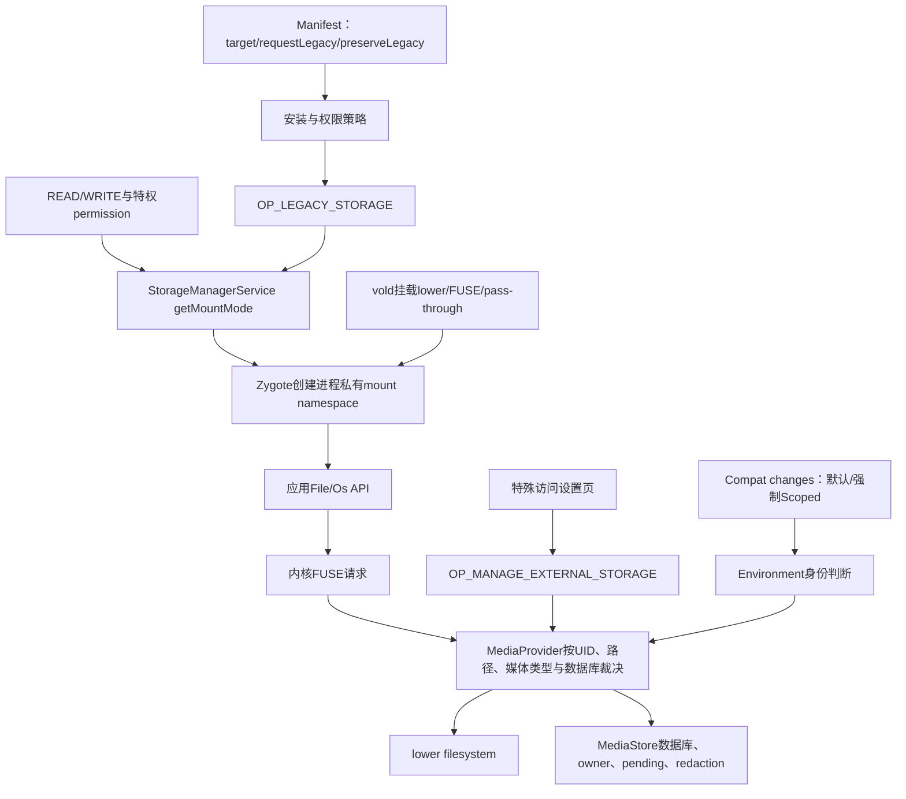
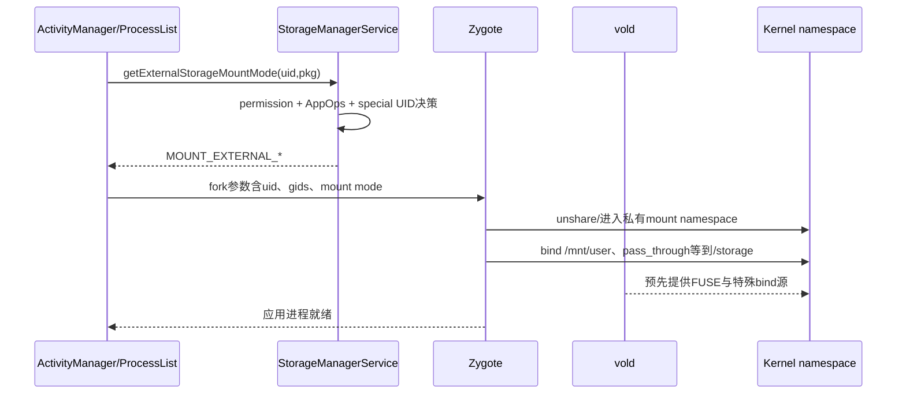
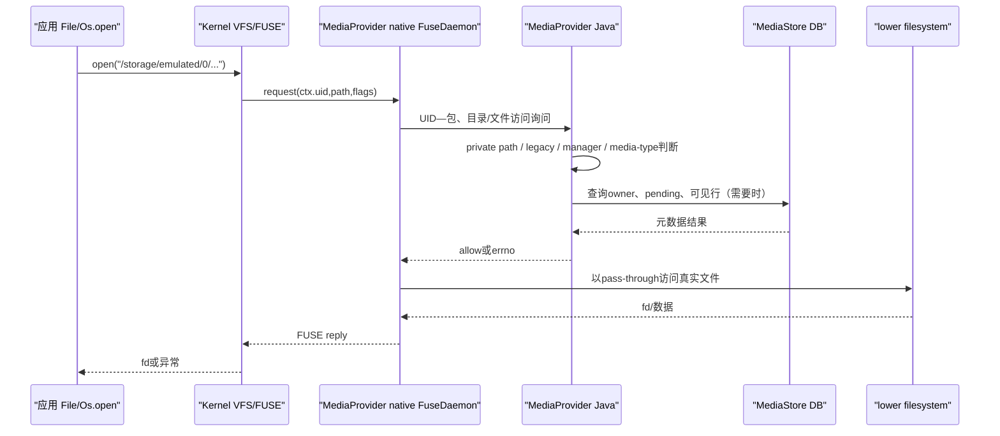

# 第540章 Android Scoped Storage完整数据面：Manifest兼容、挂载命名空间、FUSE、MediaProvider与All Files Access

> 源码基线：Android 11 / API 30 / `android-11.0.0_r48`。本章直接阅读framework、system_server、vold、Zygote、MediaProvider及Settings源码，只在macOS上做只读检索，不进行真实编译。第539章已经解释受限权限如何派生`OP_LEGACY_STORAGE`；本章从这个AppOp继续向下，追到应用最终看到和能够操作的共享存储视图。

## 1. 本章解决什么问题

为什么两个应用都访问`/storage/emulated/0`，看到的文件却不相同？`requestLegacyExternalStorage`、`preserveLegacyExternalStorage`、`READ_EXTERNAL_STORAGE`与`MANAGE_EXTERNAL_STORAGE`分别控制什么？进程启动时的mount mode、vold建立的FUSE文件系统、MediaProvider数据库与每次文件操作的权限判断又怎样接起来？本章要把“声明、状态、视图、请求”四层连成一条完整数据面。

## 2. 一句话定位

Android 11的Scoped Storage不是简单地把某个目录`chmod`掉，而是先根据target、兼容开关、permission和AppOp确定身份，再为进程建立专属mount namespace；普通文件API进入FUSE后，MediaProvider还会结合路径归属、媒体类型、数据库行、legacy与manager身份逐次裁决，因此“能看见路径”“能列目录”“能打开文件”“能通过MediaStore修改行”是四个不同结论。

## 3. 先拆开八本账

第一本是manifest中的`requestLegacyExternalStorage`和`preserveLegacyExternalStorage`；第二本是compat change；第三本是runtime permission；第四本是`OP_LEGACY_STORAGE`与`OP_MANAGE_EXTERNAL_STORAGE`；第五本是StorageManagerService算出的mount mode；第六本是进程私有mount namespace；第七本是MediaProvider数据库中的文件元数据与owner；第八本是FUSE对当前路径、当前UID和当前操作的实时判断。排障时只看其中一本都会得出过强结论。

## 4. 全链总图



## 5. `requestLegacyExternalStorage`只是请求

这个manifest属性表示应用“希望”按旧模型运行。属性文档明确提醒它可能因政策或兼容原因不被尊重；所以不能看到`android:requestLegacyExternalStorage="true"`就断言设备一定给旧视图。最终结果还要经过target、安装历史、compat change和`OP_LEGACY_STORAGE`。

## 6. 它的默认值由target决定

`ParsingPackageUtils.parseBaseAppBasicFlags()`使用`targetSdk < Q`作为默认值：target 28及以下未写属性时默认true；target 29及以上默认false。这里是“解析后的请求值”，并不是运行时有效legacy状态。target 29显式true才表达Android 10过渡期的opt-out。

## 7. `preserveLegacyExternalStorage`只面向更新

该属性默认false，首次安装没有作用。它表达的是：应用升级target后，希望保留设备上以前已经形成的legacy行为。它不是“比requestLegacy更强的开关”，更不能让一个首次安装、target 30的应用凭空获得旧模型。

## 8. 先记住首次安装与覆盖安装不是同一输入

首次安装只有新APK声明与新target；覆盖安装还带上一版本在本设备形成的状态。`preserveLegacyExternalStorage=true`的价值正来自后者。源码注释把“previously installed version”写得很明确，测试时删除后重装会丢掉要验证的升级上下文。

## 9. 三个典型target组合

target 28默认请求legacy；target 29可以用`requestLegacyExternalStorage=true`过渡；target 30的新安装不会因requestLegacy而退回旧模型。target 30覆盖升级能否保留，需看旧状态、preserve标志和兼容政策。这个矩阵是理解规则的起点，不是绕过AppOp和设备策略的终点。

## 10. compat change又加了两道总闸

`DEFAULT_SCOPED_STORAGE=149924527`默认启用；`FORCE_ENABLE_SCOPED_STORAGE=132649864`默认禁用。两者都启用表示强制Scoped，忽略target与两个manifest标志；两者都禁用表示强制关闭Scoped；一开一关时才继续以`OP_LEGACY_STORAGE`判断有效legacy状态。

## 11. `Environment.isExternalStorageLegacy()`真实判断

```java
boolean defaultScopedStorage = Compatibility.isChangeEnabled(DEFAULT_SCOPED_STORAGE);
boolean forceEnableScopedStorage = Compatibility.isChangeEnabled(
        FORCE_ENABLE_SCOPED_STORAGE);
if (isScopedStorageEnforced(defaultScopedStorage, forceEnableScopedStorage)) {
    return false;
}
if (isScopedStorageDisabled(defaultScopedStorage, forceEnableScopedStorage)) {
    return true;
}
return appOps.checkOpNoThrow(AppOpsManager.OP_LEGACY_STORAGE,
        uid, context.getOpPackageName()) == AppOpsManager.MODE_ALLOWED;
```

这段代码证明manifest值没有在查询末端直接出现：安装/权限政策已经把它们折算进compat与AppOp。应用查询到的是“此刻有效状态”，不是“APK当初请求了什么”。

## 12. `isExternalStorageLegacy()`返回false才是Scoped

方法名很容易让人读反：true表示旧式宽视图，false表示Scoped。源码中isolated process和instant app都直接返回false。附近注释写成“never allowed to be in scoped storage”，与返回值和后续挂载逻辑相反；应以代码与StorageManagerService中两类UID返回`MOUNT_EXTERNAL_NONE`为准，把这句视作r48注释措辞错误。

## 13. `OP_LEGACY_STORAGE`是派生兼容能力

它没有可直接请求的manifest permission。第539章看到，READ_EXTERNAL_STORAGE的soft restricted policy把target、request/preserve、豁免、强制Scoped列表和现有状态折算为这个附加AppOp。应用不能像普通runtime permission那样弹框直接索取它。

## 14. legacy也不等于“无需READ/WRITE权限”

StorageManagerService只有在`hasLegacy`并且`hasWrite`时返回WRITE视图，在`hasLegacy`并且`hasRead`时返回READ视图；没有对应运行时权限仍落DEFAULT。MediaProvider也把legacy granted、legacy read、legacy write拆成三位，后两位还要组合READ/WRITE permission的数据交付检查。

## 15. shared UID会影响legacy政策

system_server的soft policy会查看同UID全部包，使用最小target并汇总requestLegacy；最后`OP_LEGACY_STORAGE`又是UID层候选收敛。可是在MediaProvider建立`LocalCallingIdentity`时，target和包名仍可能取当前或首个包。shared UID让“政策计算”和“请求归因”并不完全同粒度，调试时必须列出UID下全部包。

## 16. `MANAGE_EXTERNAL_STORAGE`是另一条能力线

它不是legacy的同义词。legacy是旧应用兼容视图；manager是少数文件管理、备份等应用由用户授予的特殊访问。一个target 30应用可以保持Scoped身份，同时通过manager在共享集合中获得更宽文件访问。

## 17. 声明permission仍不等于已获授权

平台把`MANAGE_EXTERNAL_STORAGE`声明为`signature|appop|preinstalled`，并明确说明它只适合少数代表用户管理文件的应用。普通应用声明后只是具备出现在“所有文件访问”特殊设置列表中的资格，Settings开关最终写的是AppOp。

## 18. Settings怎样切换All Files Access

`ManageExternalStorageDetails`先确认应用声明过permission，开关开启时调用`setUidMode(OP_MANAGE_EXTERNAL_STORAGE, uid, MODE_ALLOWED)`，关闭时写`MODE_ERRORED`。这是UID mode，不是某包独享的普通package mode；shared UID应用因此共享实际能力边界。

## 19. 默认AppOp为什么要回退permission

`Environment.isExternalStorageManager()`发现mode为`MODE_DEFAULT`时，才回退检查manifest permission是否已由系统授予；ALLOWED直接true，ERRORED或IGNORED直接false。也就是说显式用户/系统AppOp决定优先级高于permission默认值。

## 20. MediaProvider还保留`NO_ISOLATED_STORAGE`兼容后门

`PermissionUtils.checkPermissionManager()`先做`MANAGE_EXTERNAL_STORAGE`数据交付检查，失败后再检查隐藏的`OPSTR_NO_ISOLATED_STORAGE`。这是平台内部兼容路径，不是普通SDK应用应依赖的公开替代方案。Environment公开API并没有这个fallback，所以两个“是否manager”查询在特殊内部配置下可能不同。

## 21. 两个属性开关不要混为一个

`persist.sys.fuse`决定是否使用MediaProvider托管的FUSE数据面；`persist.sys.isolated_storage`由`StorageManager.hasIsolatedStorage()`读取，决定是否按内建算法隔离挂载。一个控制“文件系统实现/代理”，另一个控制“是否采用隔离政策”；名称都含storage，但不是同一个boolean。

## 22. StorageManagerService是mount mode决策中心

进程启动前，ActivityManager通过`StorageManagerInternal.getExternalStorageMountMode(uid, packageName)`询问StorageManagerService。启用isolated storage时走内建`getMountMode()`；关闭时可能组合注册的ExternalStorageMountPolicy，取最严格结果。它返回的是Zygote整数枚举，不是Linux权限位。

## 23. isolated process与instant app看不到共享存储

`getMountModeInternal()`首先对isolated UID返回`MOUNT_EXTERNAL_NONE`，对instant app同样返回NONE。此处与第12节Environment返回false互相印证：false并不是授予Scoped目录，而只是“不具备legacy”；真正可见性还要由mount mode决定。

## 24. MediaProvider进程为什么拿PASS_THROUGH

FUSE daemon本身运行在MediaProvider包中。如果它再从FUSE上层读取文件，会递归回到自己。StorageManagerService识别ExternalStorageService所属UID，给`MOUNT_EXTERNAL_PASS_THROUGH`，让`/storage`直接绑定lower/pass-through视图，FUSE代理才能安全操作底层文件。

## 25. DownloadsProvider与ExternalStorageProvider是特殊代理

启用FUSE时，这两个authority的appId得到`MOUNT_EXTERNAL_ANDROID_WRITABLE`。源码注释说明DownloadManager要代表应用写app-private目录，DocumentsUI背后的ExternalStorageProvider要在受管理模式访问`Android/{data,obb}`。这不是任意应用持有READ/WRITE就能得到的级别。

## 26. MTP还有签名约束

持有`ACCESS_MTP`且使用平台签名的进程也可得到ANDROID_WRITABLE。StorageManagerService不仅检查permission，还查`ApplicationInfo.isSignedWithPlatformKey()`；只仿造permission名不能把普通应用变成系统MTP代理。

## 27. 普通应用mount mode的真实分支

```java
final boolean hasRead = StorageManager.checkPermissionAndCheckOp(
        mContext, false, 0, uid, packageName,
        READ_EXTERNAL_STORAGE, OP_READ_EXTERNAL_STORAGE);
final boolean hasWrite = StorageManager.checkPermissionAndCheckOp(
        mContext, false, 0, uid, packageName,
        WRITE_EXTERNAL_STORAGE, OP_WRITE_EXTERNAL_STORAGE);

if (hasFull && hasWrite) return Zygote.MOUNT_EXTERNAL_FULL;
if ((hasInstall || hasInstallOp) && hasWrite) {
    return Zygote.MOUNT_EXTERNAL_INSTALLER;
}
boolean hasLegacy = mIAppOpsService.checkOperation(
        OP_LEGACY_STORAGE, uid, packageName) == MODE_ALLOWED;
if (hasLegacy && hasWrite) return Zygote.MOUNT_EXTERNAL_WRITE;
if (hasLegacy && hasRead) return Zygote.MOUNT_EXTERNAL_READ;
return Zygote.MOUNT_EXTERNAL_DEFAULT;
```

注意`MANAGE_EXTERNAL_STORAGE`不在这个普通分支里把应用改成FULL；manager主要由FUSE/MediaProvider实时放宽。FULL保留给同时持有特权`WRITE_MEDIA_STORAGE`与write能力的进程。

## 28. installer mode也要求write能力

持有`INSTALL_PACKAGES`，或同UID任一包的`OP_REQUEST_INSTALL_PACKAGES`为ALLOWED，只是第一半条件；还必须通过WRITE_EXTERNAL_STORAGE permission+AppOp。源码注释把这个组合称为CDD硬要求，不能只开“安装未知应用”就推导出宽存储写权限。

## 29. 为什么REQUEST_INSTALL检查同UID全部包

该AppOp按包授予，但vold无法只为同UID中的一个包更新mount point。于是StorageManagerService遍历`packagesForUid`，任一个ALLOWED就让整个UID达到installer候选。这是底层隔离粒度迫使上层把包级状态提升到UID级的典型例子。

## 30. 九种mount mode不是九棵完全不同目录

Zygote定义NONE、DEFAULT、READ、WRITE、LEGACY、INSTALLER、FULL、PASS_THROUGH、ANDROID_WRITABLE。非FUSE模式下READ指向`/mnt/runtime/read`，WRITE/LEGACY/INSTALLER都指向`/mnt/runtime/write`，FULL等指向`/mnt/runtime/full`；即使根路径相同，附加GID、Android子目录bind mount与用途仍可不同。

## 31. mount mode是进程创建输入

Zygote fork应用时收到整数mode，随后在子进程中建立私有mount namespace并绑定合适的`/storage`来源。两个进程路径字符串都叫`/storage/emulated/0`，但名字解析发生在各自namespace，最终可以落到不同上层视图。

## 32. mount namespace是理解“同路径不同世界”的钥匙

Linux mount namespace隔离的是“路径到挂载对象的映射”，不是复制文件。应用A与B看到同样的路径文本，不代表它们从同一个mount root出发；系统可在不改应用代码和真实lower目录布局的前提下，给不同UID不同可见性。

## 33. FUSE开启时Zygote多数应用绑定`/mnt/user/<user>`

PASS_THROUGH改绑`/mnt/pass_through/<user>`，INSTALLER改绑`/mnt/installer/<user>`，启用app-data isolation时ANDROID_WRITABLE改绑`/mnt/androidwritable/<user>`；其余mode通常把`/mnt/user/<user>`绑定到`/storage`。权限差异随后更多由FUSE按UID动态判断，而非单靠四棵runtime目录。

## 34. 非FUSE时隔离更依赖静态视图

Zygote直接从`ExternalStorageViews[mount_mode]`选择`/mnt/runtime/default|read|write|full`绑定到`/storage`，并把user-specific helper绑到`/storage/self`。所以阅读Android 11代码时必须先问设备是否开启FUSE，否则用一套路径解释两种实现会产生冲突。

## 35. ProcessList还会为特殊mode添加GID

PASS_THROUGH与ANDROID_WRITABLE加入`SDCARD_RW`、`EXT_DATA_RW`、`EXT_OBB_RW`；INSTALLER加入`EXT_OBB_RW`；PASS_THROUGH另加`MEDIA_RW`以访问lower filesystem。mount root与supplementary groups共同决定底层可达性，不能只打印mode名字。

## 36. 运行中变更AppOp为什么有时杀进程

mount namespace在进程创建时确定，某些能力不能靠修改一个Java字段即时替换。FUSE开启时，REQUEST_INSTALL_PACKAGES在ALLOWED与非ALLOWED间切换会kill UID；MANAGE_EXTERNAL_STORAGE被拒绝时也kill UID，注释说明授予后的GID可在自然重启时生效。这里的重启是视图收敛手段，不是惩罚。

## 37. 非FUSE设备走remount路径

当READ/WRITE/REQUEST_INSTALL等AppOp变化且用户已初始化，StorageManagerService可重新计算mode并调用vold remount活动UID。第539章还看到permission grant会直接通知storage更新，revoke更多依赖AppOps变化间接收敛；调试瞬时状态要考虑两条路径时序不同。

## 38. legacy UID缓存又是另一份快照

StorageManagerService监听`OP_LEGACY_STORAGE`并维护`mUidsWithLegacyExternalStorage`，供内部`hasLegacyExternalStorage(uid)`查询。包移除时源码直接按UID删除，并留有shared UID TODO；若同UID仍有包存在，这个缓存边界值得在产品分支验证。

## 39. 进程视图生成时序图



## 40. volume挂载由vold先开场

`StorageManagerService.mount(vol)`调用`mVold.mount()`并提供`IVoldMountCallback`。vold把volume path、internal path和`/dev/fuse`文件描述符回调回来；system_server只有在`StorageSessionController.onVolumeMount()`成功后才回复ready。

## 41. vold为什么仍挂sdcardfs

`EmulatedVolume::doMount()`注释明确：即使启用FUSE，也可能需要sdcardfs作为某些bind mount的来源，因此会按配置先建立`/mnt/runtime/default/read/write/full`。这说明“Android 11用了FUSE，所以sdcardfs相关代码全部无效”是过度简化。

## 42. FUSE只在visible emulated volume上进入该分支

条件是`persist.sys.fuse`为true且volume带visible mount flag。vold先准备`Android/`相关目录，再调用`MountUserFuse(userId, internalPath, label, &fd)`。失败会撤销前面建立的资源并让挂载失败，而不是留下一个可用但不受控的共享目录。

## 43. upper与lower分别是什么

upper是应用经`/storage/...`看到、由FUSE提供的路径空间；lower是实际承载文件的底层目录。FUSE daemon接受请求后，可查询MediaProvider再读写lower。MediaProvider进程持有PASS_THROUGH，确保它自己的`/storage`解析到底层而不是再次进入upper。

## 44. `/dev/fuse` fd是一条内核—用户态会话

vold打开`/dev/fuse`，把它挂载到`/mnt/user/<user>/<label>`，再经Binder把fd交给ExternalStorageService。内核文件请求通过这个fd被MediaProvider进程中的native daemon读取并回复；fd不是普通媒体文件，而是整场FUSE会话的通信端点。

## 45. 为什么挂载选项省略`default_permissions`

`MountUserFuse()`注释说明，不希望内核在把请求路由给FUSE daemon之前先按lower filesystem权限拒绝。真正的按UID、包归属、媒体类型和数据库状态判断需要MediaProvider完成；内核仍负责mount层与请求携带的调用UID。

## 46. pass-through路径绕开上层代理

`/mnt/pass_through/<user>/<label>`绑定sdcardfs full或absolute lower path。MediaProvider的ExternalStorageService进程通过该视图操作真实文件，避免FUSE自递归；PASS_THROUGH因此是基础设施身份，不代表普通manager应用也得到同样mount mode。

## 47. FUSE ready之前不能做最终bind mounts

vold先调用callback让system_server启动用户态daemon；只有callback返回ready，才执行`mountFuseBindMounts()`。源码注释说必须确信daemon能解析路径后再bind，否则应用可能看到一个已挂载却无人回复请求的文件系统。

## 48. read-ahead与dirty ratio是性能而非授权

vold把FUSE read-ahead设为256KB，并把可信平台FUSE的max dirty ratio调整到40%，避免极端内存压力下写回被1%默认比例严重限速。这些参数影响吞吐和缓存，不会授予某UID额外目录能力。

## 49. StorageSessionController只在FUSE开启时工作

`shouldHandle()`以`mIsFuseEnabled`为核心门。非FUSE设备不会绑定ExternalStorageService，也不会有MediaProvider FUSE session；这时分析崩溃日志若死盯`ExternalStorageServiceImpl`会找错数据面。

## 50. ExternalStorageService组件怎样被信任

主用户解锁时，controller解析MediaStore authority，只接受system-only provider，再在同一包中查找`ExternalStorageService.SERVICE_INTERFACE`，并验证service要求`BIND_EXTERNAL_STORAGE_SERVICE`。这是“找到MediaProvider包”与“找到受系统保护服务”两道校验。

## 51. 为什么只在user 0初始化组件名

组件定义来自系统MediaProvider包，先在主用户解锁时解析一次；具体session连接仍按volume/user创建`StorageUserConnection`并以目标user绑定服务。不能把“组件在user 0解析”误写成“只有主用户有FUSE”。

## 52. 每用户connection、每volume session

controller为每个user保存一个`StorageUserConnection`；connection内部再按volume id保存多个Session，记录upper/lower path。这样服务进程死亡可以按用户重置全部会话，而插拔一个volume只需结束对应session。

## 53. start session是阻塞式握手

system_server把`FLAG_SESSION_TYPE_FUSE | FLAG_SESSION_ATTRIBUTE_INDEXABLE`、fd、upper和lower传给远端服务，然后等待RemoteCallback。默认远端超时20秒；超时或异常会让volume mount callback返回false，并安排StorageManagerService reset。

## 54. Binder回调之外还有后台线程

`ExternalStorageService`框架包装层把`onStartSession()`、`onEndSession()`和volume状态通知投递到`BackgroundThread`，捕获任意Throwable后通过RemoteCallback返回`ParcelableException`。因此system_server的同步等待并不等于业务代码跑在Binder线程。

## 55. MediaProvider怎样启动native daemon

`ExternalStorageServiceImpl`用session id查静态`sFuseDaemons`；新session构造`FuseDaemon`，把fd detach为native拥有，再调用`start()`。重复session只记录warning并返回成功语义，不会重启已有daemon。

## 56. `FuseDaemon.start()`不是普通Thread.start

override先启动线程，再最多轮询5次、每次1秒，等待native pointer非零且`native_is_started()`。超时抛异常，但线程可能仍存活；因此启动失败路径不能简单理解为“所有native资源必然已经停止”。

## 57. daemon线程为何长期阻塞

`run()`中的`native_start(ptr, fd, path)`一直阻塞到FUSE卸载。返回后才native_delete、清pointer并从service map移除session。线程寿命就是文件系统会话寿命，而不是为每次文件open创建一个Java线程。

## 58. FUSE请求先做包私有路径硬边界

```cpp
static bool is_app_accessible_path(MediaProviderWrapper* mp,
        const string& path, uid_t uid) {
    if (uid < AID_APP_START) return true;
    if (path == "/storage/emulated") return false;
    std::smatch match;
    if (std::regex_match(path, match, PATTERN_OWNED_PATH)) {
        const std::string& pkg = match[1];
        if (pkg == ".nomedia") return true;
        if (!mp->IsUidForPackage(pkg, uid)) return false;
    }
    return true;
}
```

native层在lookup阶段就识别`Android/data/<pkg>`、`Android/obb/<pkg>`等owned path，并回问MediaProvider当前UID是否属于该包。manager身份并未出现在这个先行判断里，所以“所有文件访问”不等于访问其他应用私有外部目录。

## 59. FUSE请求自带真实调用UID

native代码使用`req->ctx.uid`，不是相信应用传进来的packageName。MediaProvider再用AppOps `checkPackage`或PackageManager验证UID—包关系；路径里把目录名伪造成自己包名之外的值不能改变内核提供的UID。

## 60. 跨用户路径也在native层拦截

lookup从`/storage/emulated/<number>`提取user id，与FUSE daemon自身UID所属user比较，不一致返回EPERM。仅有文件路径字符串并不能跨越Android多用户边界。

## 61. list目录不是直接把lower的`readdir`全返回

Java方法`getFilesInDirectoryForFuse(path, uid)`可返回三类哨兵：`["/"]`表示绕过数据库、从lower取列表；`[""]`表示无访问；普通数组则是MediaProvider数据库筛出的可见文件名。目录名仍可能来自lower，这是一种数据库过滤与文件系统枚举混合模型。

## 62. `Android/data`与`Android/obb`根目录不能普通列举

MediaProvider在manager/legacy bypass判断之前先对`isDataOrObbPath(path)`返回拒绝；注释说明installer与ANDROID_WRITABLE进程因特殊lowerfs bind mount不经过这层。普通manager应用因此不能把这两个根目录当成任意文件清单入口。

## 63. 其他应用私有目录先于manager被拒绝

`isPrivatePackagePathNotOwnedByCaller()`位于`shouldBypassFuseRestrictions()`之前。它把`Android/media`排除在私有定义外，但对`Android/data`和`Android/obb`按包归属限制。顺序决定了manager也不能靠后面的true覆盖前面的拒绝。

## 64. 自己的app-specific目录无需共享存储权限

若路径owner属于调用UID下任一shared package，`shouldBypassFuseRestrictions()`直接true。应用访问自身`Android/data/<pkg>`与`Android/obb/<pkg>`依赖包归属，而不是READ_EXTERNAL_STORAGE；这也是卸载时可按包清理的私有外部空间。

## 65. `Android/media/<pkg>`不是private-package path

源码明确把它视为会被扫描并与其他应用共享的媒体位置。因此目录名虽含包名，也不能据此断言其内容永远只对owner可见；读取仍走媒体权限、MediaStore可见性与FUSE规则。

## 66. manager能绕过哪些限制

通过前置私有路径与data/obb根检查后，`isCallingPackageManager()`使`shouldBypassFuseRestrictions()`返回true，可绕过普通数据库可见性与默认目录限制。它适用于共享存储的广泛文件管理，但边界仍包含其他应用private目录、多用户、SELinux及更高层业务API。

## 67. legacy read与legacy write要按操作分开

读路径要求`PERMISSION_IS_LEGACY_READ`，写路径要求`PERMISSION_IS_LEGACY_WRITE`。二者都先要求legacy granted，再分别做READ或WRITE的数据交付检查。只看到`OP_LEGACY_STORAGE=allow`而忽略普通storage permission，会误判实际文件操作。

## 68. system gallery是按媒体类型放宽

具有写图片或写视频AppOp的系统图库，在目标路径文件类型匹配时可绕过部分FUSE限制；代码通过扩展名/MIME解析区分image与video。它不是所有文件类型的manager，audio与任意文档不会自动继承图片能力。

## 69. 非legacy普通应用可以做什么

它能使用自己的app-specific目录；能通过MediaStore创建和访问自己拥有的媒体；获得相应读取授权后可发现共享媒体；还可经SAF让用户选择文档。Scoped不是“只能访问一个空目录”，而是把宽路径遍历替换为按集合、owner、类型和用户选择的授权模型。

## 70. 非默认顶层目录有额外写限制

MediaProvider对目录创建/打开写模式检查relative path。非legacy、非manager应用在顶层只能创建系统认可的默认目录，如Pictures、Movies、Music、Download等；任意造一个新的顶层目录会返回EACCES或EPERM。

## 71. errno也表达不同拒绝语义

访问其他包私有目录常返回ENOENT，让调用者像“路径不存在”一样看不到它；操作data/obb根返回EACCES；非法顶层操作可能是EPERM。应用日志只打印“open failed”会丢掉这一层诊断信息，应同时记录errno与具体操作。

## 72. `MANAGE_EXTERNAL_STORAGE`不自动改MediaStore owner

manager可在更广路径创建或插入，但数据库仍保存owner package、pending、trashed等列。宽文件访问是一种调用能力，不会把其他应用创建的每一行改成manager所有；后续权限、卸载和用户确认逻辑仍可能依赖owner。

## 73. MediaStore是Scoped模型的主要共享接口

应用通过collection URI查询共享媒体，通过insert取得新行URI，再用ContentResolver打开描述符。Provider能在URI层知道调用包、目标volume、媒体类型、行owner和请求操作，比裸`File`路径更容易做细粒度授权。

## 74. `RELATIVE_PATH`替代任意绝对路径注入

对现代非manager调用者，MediaProvider忽略或拒绝直接修改`DATA`等原始路径列，并根据`RELATIVE_PATH`与`DISPLAY_NAME`构造受控位置。manager和legacy write有更宽mutation路径，但仍需经过合法volume和目录检查。

## 75. insert时为什么检查primary directory

Provider按目标collection给出允许的顶层目录，并验证MIME主类型与相关URI位置。普通应用不能把一张图片借Images URI写进任意业务目录；system gallery与manager有明确的额外分支。

## 76. owner package从调用身份派生

正常插入会把owner与通过AppOps验证的calling package关联。shared UID身份缓存会保存同UID包集合，用于判断路径owner是否属于调用身份。不要让应用随意传`OWNER_PACKAGE_NAME`来冒充另一包。

## 77. `IS_PENDING`是发布状态而非文件锁

应用创建媒体时可先标pending，写入未完成前普通其他应用查询通常看不到；完成后清零发布。owner、拥有显式URI授权或特殊身份可见范围更大。FUSE目录列表还特意为来自FUSE的pending文件增加匹配条件，避免创建过程与目录操作互相打架。

## 78. pending不保证底层没有文件

数据库行不可见与lower文件是否已经创建是两件事。FUSE和MediaProvider要协调数据库、文件描述符及扫描状态；调试时看到磁盘文件存在，不能据此断言MediaStore查询也应该返回。

## 79. 更新与删除通常受owner保护

现代应用修改不属于自己的媒体时会触发安全检查；Android 11可通过MediaStore创建用户确认请求，让系统UI授权批量写、删或收藏。用户确认产生的是特定操作/URI能力，不是把应用永久升级成manager。

## 80. URI grant是第三条授权通道

除了owner与宽permission/AppOp，应用还可能持有某个content URI的临时或持久授权。它只覆盖被授权对象及声明的读写mode，不应拿一条URI授权推导整个目录可遍历。

## 81. SAF与All Files Access不是一回事

Storage Access Framework由DocumentsProvider和系统picker让用户选文档或目录，授权以URI为中心；All Files Access是AppOp级广泛文件管理能力。前者适合少量用户选定内容，后者只适合核心功能确实需要全局文件管理的少数应用。

## 82. DownloadManager为何是委托者

它代表调用应用写下载文件，并在完成后可把owner移交给原始请求包。MediaProvider的`PERMISSION_IS_DELEGATOR`由BACKUP或UPDATE_DEVICE_STATS等特权判定；普通应用不能调用隐藏列伪造这种所有权转交。

## 83. scan负责让文件进入数据库世界

直接写lower或FUSE路径得到文件，不一定立刻有完整MediaStore行。扫描器解析路径、MIME、媒体元数据并更新数据库。ExternalStorageService收到volume mounted状态时先attach volume并更新volume集合，系统要求扫描完成与广播时序协调，避免应用在mounted广播后看到陈旧DB。

## 84. volume状态通知也有20秒远端边界

StorageUserConnection对start、end和notifyVolumeStateChanged都通过同一`waitForAsync()`等待RemoteCallback，默认20秒。一次扫描或attach流程若阻塞过久，会从“媒体慢”升级为external storage service异常，最终触发session reset。

## 85. MediaProvider数据库不是文件系统唯一真相

lower filesystem保存字节和目录；MediaProvider DB保存索引、owner、MIME、pending、trashed等政策元数据；FUSE在两者之间调解。数据库丢行时目录列表可能回退lower，文件丢失时DB行也可能暂时陈旧，因此代码内有扫描、删除同步与缓存失效逻辑。

## 86. FUSE VFS缓存需要主动失效

MediaProvider从ContentProvider路径增删或改名文件后，会调用daemon invalidation，让内核dentry cache别长期保留旧名字。native端还根据package-owned path与should-invalidate结果把attr timeout设为0；性能缓存与授权正确性需要权衡。

## 87. 为什么某些fd要重新经FUSE打开

`FuseDaemon.shouldOpenWithFuse()`通过native锁与状态判断，防止同一文件经pass-through和FUSE两条路径打开时产生页缓存不一致。返回true关注的是一致性与锁，不是再次授予权限；授权检查仍在外层完成。

## 88. 一次普通文件open的数据路径



## 89. identity缓存为什么重要

FUSE高频请求只带UID，没有每次Binder调用天然携带的packageName。MediaProvider按UID构造并缓存`LocalCallingIdentity`，验证UID对应包并保存shared packages，再懒计算permission bits。包安装、AppOp变化时必须清或更新缓存，否则热路径会继续使用旧裁决。

## 90. manager AppOp变化会触发MediaProvider监听

Provider在初始化时监听`OPSTR_MANAGE_EXTERNAL_STORAGE`。这使权限变化能影响identity与FUSE判断；StorageManagerService在拒绝manager时还可能kill UID，以让进程GID和namespace一并收敛。动态授权不是只有一个监听器负责。

## 91. permission bit采用懒解析

`LocalCallingIdentity`用`hasPermissionResolved`记录哪些bit已算过，用`hasPermission`记录true结果。第一次问manager、legacy read或redaction时才调用PermissionUtils，之后同identity复用。性能收益的代价是状态变更必须使identity失效。

## 92. `ACCESS_MEDIA_LOCATION`控制原始位置元数据

读取图片并不自动等于读取其EXIF GPS。MediaProvider把没有`ACCESS_MEDIA_LOCATION`或对应AppOp的身份标为`PERMISSION_IS_REDACTION_NEEDED`，可能提供被重写/代理的文件描述符，隐藏GPS相关tag。

## 93. redaction与READ_EXTERNAL_STORAGE正交

一个应用可以有权读取图片像素，却无权读取原始地理位置；manager也不应自动被解释为位置permission。排障“文件能打开但EXIF GPS消失”应查ACCESS_MEDIA_LOCATION及ALLOW_MEDIA_LOCATION AppOp，而不是先怀疑FUSE损坏。

## 94. SELF与SHELL有专门身份分支

MediaProvider自身、root/shell等系统身份走不同permission判断；shell还受`DISALLOW_USB_FILE_TRANSFER`用户限制约束。adb shell测试成功不能代表三方应用成功，尤其是目录遍历、跨路径和redaction行为。

## 95. SELinux仍在这条链外继续生效

mount namespace、FUSE和AppOps通过不代表SELinux一定允许进程触达某设备节点或系统路径。Scoped Storage主要处理共享/外部存储数据面；把结果推广到`/data`、设备节点或其他domain会越过模型边界。

## 96. file permission与data-delivery检查不同

MediaProvider的PermissionUtils对runtime permission和app-op permission使用PermissionChecker数据交付路径，可能记录AppOp访问并考虑前后台语义。`PackageManager.checkPermission()==GRANTED`只是静态grant事实，不是最终交付结论。

## 97. `MODE_DEFAULT`不能一律当拒绝

对MANAGE_EXTERNAL_STORAGE，Environment在DEFAULT时回退permission；对不同AppOp，默认表和对应permission映射不同。调试命令输出`default`后必须回到具体调用点看switch，不能套用“default=deny”或“default=allow”的统一规则。

## 98. manager关闭为何写ERRORED而不是DEFAULT

Settings要表达用户明确拒绝，写ERRORED可以压过可能由签名/预装permission带来的默认grant。若只恢复DEFAULT，系统预装文件管理器可能又通过permission fallback得到true。显式状态与默认状态的优先级正是AppOps的价值。

## 99. FUSE服务死亡怎样恢复

StorageUserConnection的ServiceConnection断开后关闭连接、取消正在等待的future，并调用`resetUserSessions()`。StorageManagerInternal随后重置该用户volume/session。普通应用得到的I/O错误可能只是表象，根因日志在system_server和MediaProvider进程死亡链。

## 100. reset是跨组件的收口动作

StorageSessionController遍历连接，让vold卸载session并结束远端daemon；若等待退出失败，可把杀死ExternalStorageService进程作为最后手段。它追求的是内核mount、system_server session表与MediaProvider daemon map重新一致。

## 101. end session为什么要等卸载

FUSE daemon不能从自身安全结束它正在服务的mount；`onEndSession()`先从map移除，再`join`最多约5秒等待native_start因卸载返回。若线程仍活着便抛异常，交由上层reset处理。

## 102. start失败有一个值得警惕的窗口

`ExternalStorageServiceImpl`先调用`daemon.start()`，成功返回后才放入`sFuseDaemons`；而`start()`超时可能留下仍在运行的thread。此时map没有session但native线程可能稍后启动，这是r48错误路径的资源跟踪边界，不宜把异常返回等同于“绝无残留”。

## 103. 重复start又是另一种幂等边界

若map已有session id，service只记录warning，不校验新fd、upper/lower是否与旧session一致，也不重启daemon。正常controller保证session唯一；若恢复流程失序，日志中的“already started”值得与vold当前mount核对。

## 104. unmount先杀占用进程是为了错误语义

vold对FUSE volume先杀仍引用该用户路径的进程，再卸载。注释解释若先卸载，大量文件操作会收到罕见`ENOTCONN`并导致应用异常行为。这里杀进程是为了把存储移除收敛成更可预期的生命周期。

## 105. 调试第一步：确认基线与开关

先确认源码tag确为r48，再查产品默认的`persist.sys.fuse`、`persist.sys.isolated_storage`和vold app-data isolation配置。不同厂商分支可能回移植新实现；不确认开关就拿静态runtime view或FUSE规则解释现象，方向可能完全相反。

## 106. 调试第二步：列出应用身份账

记录完整UID、userId、同UID全部包、targetSdk、首次安装/覆盖升级、requestLegacy、preserveLegacy、instant/isolated状态。然后分别查READ/WRITE grant与AppOp、LEGACY_STORAGE、MANAGE_EXTERNAL_STORAGE，避免只抄一条`dumpsys package`。

## 107. 调试第三步：区分四种操作

分别测试：路径是否能lookup、目录能否readdir、文件能否open、MediaStore行能否query/update/delete。每种操作走的Java方法、数据库条件与errno不同；“文件管理器里没显示”不能直接翻译成“内核禁止open”。

## 108. 调试第四步：找进程与线程边界

决策跨应用进程、Zygote、system_server、vold native进程、MediaProvider Java与native FUSE thread。session握手由system_server等待20秒，业务回调在ExternalStorageService后台线程，native daemon长期阻塞。ANR或超时时必须按进程时序拼日志。

## 109. 调试第五步：检查数据库与lower是否分叉

如果MediaStore查不到而`adb shell`看到文件，检查owner、pending、relative path、扫描状态与调用者身份；如果DB有行但open失败，检查lower文件、私有路径、URI grant和redaction代理。不要先手工删数据库或改目录权限破坏证据。

## 110. 一张实用能力矩阵

| 身份 | 自己app-specific | 共享媒体 | 任意共享文档 | 其他包`Android/data` | `Android/data`根列表 |
|---|---|---|---|---|---|
| 普通Scoped应用 | 可 | owner/媒体权限/URI授权 | SAF或特定授权 | 不可 | 不可 |
| 有效legacy+READ/WRITE | 可 | 按读写权限较宽 | 旧模型范围内较宽 | 仍受包私有边界 | 根列表被专门限制 |
| All Files Access manager | 可 | 宽 | 宽 | 不可 | 不可 |
| MediaProvider pass-through | 基础设施能力 | lower+DB代理 | lower+DB代理 | 由系统服务职责约束 | 不走普通应用FUSE分支 |

矩阵描述r48主路径，不能代替具体设备SELinux、厂商修改与URI授权检查。

## 111. 阅读源码时固定追问

看到任一storage判断，都问：它是在解析“请求”，保存“权威状态”，选择“进程视图”，还是裁决“一次操作”？再问粒度是package、UID、user、volume、database row还是path。最后问结果会在当前进程即时生效，还是需要remount/kill/restart。

## 112. macOS只读练习一：核对manifest兼容入口

```bash
cd /Users/ninebot/androidSource && rg -n "requestLegacyExternalStorage|preserveLegacyExternalStorage|DEFAULT_SCOPED_STORAGE|FORCE_ENABLE_SCOPED_STORAGE" frameworks/base/core/res/res/values/attrs_manifest.xml frameworks/base/core/java/android/content/pm/parsing/ParsingPackageUtils.java frameworks/base/core/java/android/os/Environment.java
```

先用attrs注释区分首次与更新，再在parser看target默认值，最后在Environment看运行时为什么落到compat change和AppOp。练习目标不是背行号，而是亲手证明“请求值≠有效状态”。

## 113. macOS只读练习二：手算mount mode

```bash
cd /Users/ninebot/androidSource && sed -n '4250,4360p' frameworks/base/services/core/java/com/android/server/StorageManagerService.java && rg -n "MOUNT_EXTERNAL_(NONE|DEFAULT|READ|WRITE|INSTALLER|FULL|PASS_THROUGH|ANDROID_WRITABLE)" frameworks/base/core/java/com/android/internal/os/Zygote.java frameworks/base/core/jni/com_android_internal_os_Zygote.cpp
```

任选三组输入手算：legacy+read、installer-op+write、manager但无legacy。重点验证manager不会在该方法普通分支直接变FULL，再到Zygote看整数mode怎样成为绑定来源。

## 114. macOS只读练习三：追volume到FUSE daemon

```bash
cd /Users/ninebot/androidSource && rg -n "onVolumeChecking|onVolumeMount|startSession|onStartSession|native_start|waitForExit" frameworks/base/services/core/java/com/android/server/StorageManagerService.java frameworks/base/services/core/java/com/android/server/storage packages/providers/MediaProvider/src/com/android/providers/media/fuse system/vold/model/EmulatedVolume.cpp
```

按“vold callback→controller→user connection→ExternalStorageService→FuseDaemon”画出调用箭头，并标出20秒远端等待与约5秒daemon轮询/退出等待，练习区分Binder同步观感和真正执行线程。

## 115. macOS只读练习四：证明manager不是无边界root

```bash
cd /Users/ninebot/androidSource && rg -n "isPrivatePackagePathNotOwnedByCaller|isDataOrObbPath|shouldBypassFuseRestrictions|isCallingPackageManager|is_app_accessible_path" packages/providers/MediaProvider/src/com/android/providers/media/MediaProvider.java packages/providers/MediaProvider/jni/FuseDaemon.cpp
```

记录这些判断在方法中的先后顺序：其他包private与data/obb根拒绝发生在manager bypass之前；native lookup也先校验owned path的UID—package关系。顺序就是能力边界，不能只摘最后一个manager返回true。

## 116. 四个练习应得到的结论

练习一应得到“manifest是意图、AppOp是有效legacy投影”；练习二应得到“mount mode主要决定进程入口视图，manager由FUSE动态放宽”；练习三应得到“volume ready依赖用户态daemon握手”；练习四应得到“All Files Access覆盖广泛共享文件，但不覆盖其他应用private external目录和data/obb根遍历”。若结论不同，应回看是否混用了新Android版本源码。

## 117. 十个常见误解速查

`requestLegacy=true`不保证legacy；`preserveLegacy=true`不影响首次安装；READ_EXTERNAL_STORAGE不自动产生legacy；legacy不等于manager；manager不等于FULL mount；同一路径不等于同一mount；FUSE不等于只靠数据库保存文件；能open不等于能list；能读图片不等于能读EXIF GPS；adb shell成功不代表普通应用成功。

## 118. 推荐继续阅读的源码地图

声明与公开判断看`attrs_manifest.xml`、`ParsingPackageUtils`、`Environment`；权限到AppOp看第539章两份`SoftRestrictedPermissionPolicy`；mount决策看`StorageManagerService`、`ProcessList`、Zygote JNI；挂载实现看vold `EmulatedVolume.cpp`与`Utils.cpp`；会话看`StorageSessionController`、`StorageUserConnection`和`ExternalStorageServiceImpl`；逐请求裁决看`FuseDaemon.cpp`、`MediaProvider.java`、`LocalCallingIdentity`及`PermissionUtils`。

## 119. 复读后专门修正的易错表述

第一，Environment中isolated/instant附近注释与返回false冲突，本章不照抄其字面，而用mount NONE交叉验证；第二，`persist.sys.fuse`与`persist.sys.isolated_storage`分开；第三，FUSE模式下多数普通mode绑定同一`/mnt/user`，差异不能全归因于静态root；第四，manager不在`getMountMode()`普通分支变FULL；第五，manager bypass晚于private/data/obb前置拒绝；第六，MediaProvider进程PASS_THROUGH是为防自递归，不是普通文件管理器待遇；第七，start超时可能留下native线程窗口，不能写成完全回滚。

## 120. 本章小结与下一章入口

Scoped Storage是一条从兼容政策到数据请求的分层链：manifest与target提出意图，compat和AppOps形成有效身份，StorageManagerService与Zygote选择进程视图，vold建立FUSE/lower/pass-through结构，MediaProvider再对每次UID、路径、媒体类型与数据库行做裁决。理解这条链后，下一章将进入MediaStore数据库、volume挂载扫描、文件索引、owner/pending/trashed、查询与变更通知的完整数据生命周期。
