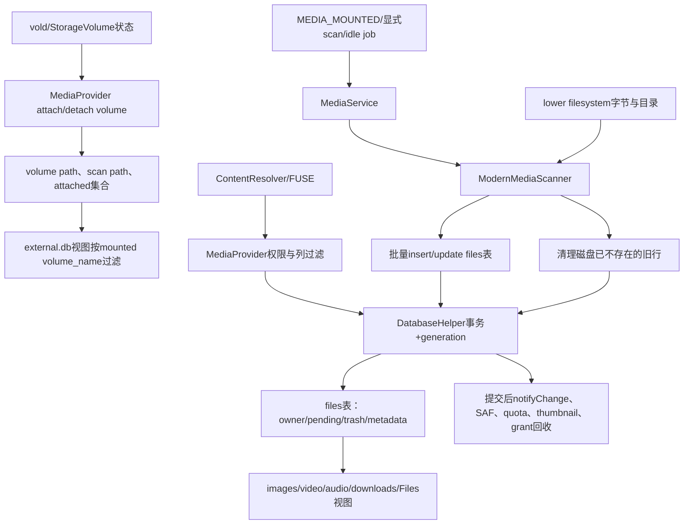
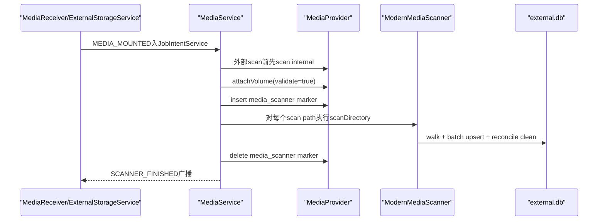
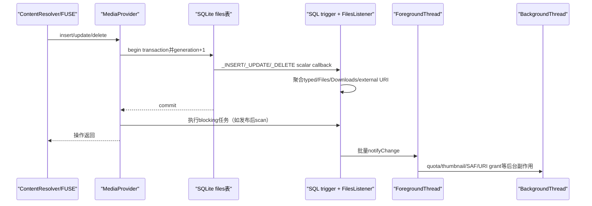

# 第541章 Android MediaStore数据库完整链：Volume挂载、扫描对账、Owner、Pending、Trash、Generation与变更通知

> 源码基线：Android 11 / API 30 / `android-11.0.0_r48`。本章直接阅读MediaProvider APEX公开API、`MediaProvider`、`DatabaseHelper`、`ModernMediaScanner`、`MediaService`、`IdleService`与`FileUtils`。只在macOS上做只读源码分析，不进行真实编译。第540章解释文件请求怎样进入FUSE；本章继续研究FUSE与ContentResolver背后的数据库怎样和真实文件保持一致。

## 1. 本章解决什么问题

MediaStore数据库是一张“文件清单”还是文件系统真相？U盘/SD卡拔出后为什么旧元数据没有立即删除，却又不能被普通查询看到？系统怎样扫描新文件、更新变化、清掉已消失行？`OWNER_PACKAGE_NAME`、`IS_PENDING`、`IS_TRASHED`、`GENERATION_*`和ContentObserver通知各自解决什么问题？这一章把volume、文件、行、身份、同步游标和通知六类生命周期串起来。

## 2. 一句话定位

Android 11的MediaStore以lower filesystem保存字节、以`files`表保存索引与政策元数据；volume attach决定哪些分区当前可查询，ModernMediaScanner把磁盘树与数据库双向对账，Provider事务给行写generation并在提交后扩散通知，而owner、pending、trash与URI grant决定每个调用者能否看见或修改行，所以“磁盘存在”“数据库有行”“查询可见”“URI可写”是四种状态。

## 3. 先拆开九本账

第一本是StorageVolume与MediaStore volume name；第二本是attached volume集合；第三本是`internal.db`/`external.db`物理数据库；第四本是统一`files`表；第五本是audio/video/images/downloads等SQL view；第六本是lower文件；第七本是owner、pending、trash、favorite；第八本是generation与数据库version；第九本是ContentObserver/URI grant/FUSE缓存副作用。不要把content URI当成文件路径的别名。

## 4. 总体数据生命周期



## 5. MediaStore不是媒体文件仓库

真实图片、视频、音频仍在lower filesystem；MediaStore保存路径、大小、时间、MIME、媒体元数据、owner和发布状态等索引。删除数据库不会自动等于安全删除所有字节，直接写文件也不保证数据库立刻有行。两边靠Provider操作、FUSE回调、扫描和空闲维护收敛。

## 6. `VOLUME_INTERNAL`不要理解为用户“内部存储”

MediaStore的internal volume主要索引系统只读媒体，如平台铃声；用户常说的手机共享存储属于`external_primary`，进入external数据库。名称来自历史API，不能拿“internal/external”直接对应`/data`与SD卡物理位置。

## 7. r48只有两个主DatabaseHelper

MediaProvider进程创建`internal.db`和`external.db`两个helper。所有外部volume并没有各自新建一个helper；`external.db`用每行`volume_name`区分primary、SD卡、USB等。旧文件名`external-*.db`仍被升级器识别，但不是当前主查询模型。

## 8. DatabaseHelper类注释带有历史味道

类注释说一个helper关联一张external card，但r48 `MediaProvider.onCreate()`只构造单个`mExternalDatabase`，`getDatabaseForUri()`对所有非internal volume都返回它。阅读注释必须用构造点与路由方法交叉验证。

## 9. `external`还是一个合成volume

`MediaStore.VOLUME_EXTERNAL`表示当前挂载外部volume的聚合视图，不是一块真实盘。URI中写`external`时，Provider把查询范围扩展到`getExternalVolumeNames()`；需要稳定定位某块介质时，应使用具体volume name。

## 10. Provider启动先建哪些对象

它取得StorageManager、AppOpsManager、PackageManager，计算缩略图尺寸，创建ModernMediaScanner与两个DatabaseHelper，注册包变化和volume状态监听，然后刷新volume cache、attach internal和当前所有external volume，最后注册多类AppOp监听。

## 11. 两个数据库的真实初始化

```java
mMediaScanner = new ModernMediaScanner(context);

mInternalDatabase = new DatabaseHelper(context, INTERNAL_DATABASE_NAME,
        true, false, false, Column.class,
        Metrics::logSchemaChange, mFilesListener, MIGRATION_LISTENER, mIdGenerator);
mExternalDatabase = new DatabaseHelper(context, EXTERNAL_DATABASE_NAME,
        false, false, false, Column.class,
        Metrics::logSchemaChange, mFilesListener, MIGRATION_LISTENER, mIdGenerator);

updateVolumes();
attachVolume(MediaStore.VOLUME_INTERNAL, false);
for (String volumeName : getExternalVolumeNames()) {
    attachVolume(volumeName, false);
}
```

这证明scanner与数据库是同一MediaProvider进程内对象，扫描时通过local ContentProviderClient仍复用正式Provider权限、URI路由、事务和通知代码，而不是绕过Provider直接随意写SQLite。

## 12. DatabaseHelper启用WAL

构造器调用`setWriteAheadLoggingEnabled(true)`，允许读写并发更顺畅；但schema变化另有`ReentrantReadWriteLock`，普通操作拿读锁，升级/重建view拿写锁，避免SQLite在关闭其他连接时形成死锁。

## 13. 禁止直接调用getReadable/WritableDatabase

两个公开方法被override后直接抛`UnsupportedOperationException`，要求所有操作走`runWithTransaction()`或`runWithoutTransaction()`。这是为了统一schema锁、generation、通知聚合和嵌套事务策略，不只是代码风格。

## 14. volume cache保存什么

`updateVolumes()`刷新当前external volume names、volume根路径、扫描路径集合，以及根路径到StorageVolume id的映射。路径到volume name的判断、扫描入口和URI路由都依赖这份进程内快照。

## 15. mounted过滤不是删除历史数据

刷新volume后，Provider在ForegroundThread异步调用`mExternalDatabase.setFilterVolumeNames()`，重建SQL views，把聚合artist/album等结果限制为当前mounted volume。物理`files`行仍可能保留，便于介质重新插入后恢复索引。

## 16. 过滤更新有短暂异步窗口

`updateVolumes()`先更新Java cache，再投递view重建。两步之间，URI路由和SQL view可能短暂处于不同快照；通常后续attach/detach与通知促使查询刷新，但排查插拔瞬间不能假设所有层原子切换。

## 17. attach首先做身份与名字检查

只有MediaProvider自身进程PID可以开关volume；外部Binder调用会抛SecurityException。随后`MediaStore.checkArgumentVolumeName()`拒绝异常名字；`validate=true`时还必须能解析实际volume path。

## 18. validate参数为何有两种

Provider启动和ExternalStorageService收到可信volume状态时用false，避免重复或时序敏感验证；MediaService开始正式扫描时用true，确保目标介质当下确实可用。false不是跳过全部安全边界，它仍要求self PID和合法volume name。

## 19. attach并不创建一份新external数据库

它把name加入`mAttachedVolumeNames`并发volume与合成external URI通知；随后ForegroundThread在同一个external helper事务里确保默认目录、校验thumbnail UUID，最后通知MediaDocumentsProvider“MediaStore已可用”。

## 20. attach返回早于异步整理完成

volume name加入attached集合和基础notify发生在投递ForegroundThread之前。普通MediaStore路由已经可能接受查询，而默认目录创建、thumbnail校验及DocumentsProvider ready稍后完成。不能把attach返回值理解为“全部扫描和维护都已完成”。

## 21. attach也不等于scan

attach只让Provider承认volume并准备基础状态；真正遍历目录由MediaService/ModernMediaScanner完成。ExternalStorageService的mounted回调只attach/updateVolumes，本身没有在这段实现里同步遍历整盘。

## 22. detach先取消扫描

`detachVolume()`先调用`mMediaScanner.onDetachVolume(volume)`取消该volume共享的CancellationSignal，再从attached集合移除，最后通知具体volume和合成external URI。正在扫描的线程会在下一个检查点抛OperationCanceledException并退出。

## 23. internal volume禁止detach

对`VOLUME_INTERNAL`调用detach会抛`UnsupportedOperationException`。系统资源索引不是可热插拔介质，不应因一条伪volume事件被移除。

## 24. detached行为什么仍留在external.db

热插拔介质可能稍后重新出现，立刻删掉全部元数据会浪费扫描成本，并破坏稳定ID与用户编辑信息。Provider先用attached检查和mounted volume过滤隐藏它们；空闲维护只对“不再属于recent volume集合”的真正陈旧volume做遗忘。

## 25. URI路由先检查attached集合

`getDatabaseForUri()`解析具体volume name，若不在`mAttachedVolumeNames`便抛`VolumeNotFoundException`；internal返回internal helper，其他全部返回external helper。数据库文件仍含旧行，不代表拔盘URI还能继续查询。

## 26. 新target与旧target的volume错误表现不同

VolumeNotFoundException继承FallbackException，并以Q为抛错门槛：现代target更倾向收到IllegalArgumentException，旧target可能得到null或0兼容结果。测试同一URI时要记录targetSdk，不能只比较应用现象。

## 27. default folders只保证一次

Provider用SharedPreferences为primary或具体volume记录`created_default_folders*`，首次attach时创建DCIM、Pictures等默认目录并插入directory行。用户后来手动删除目录，不会每次挂载都强行恢复，源码注释明确避免打扰用户。

## 28. thumbnail UUID防止错配

数据库UUID同时写到介质缩略图目录的`.database_uuid`。若磁盘值与当前数据库UUID不同，Provider删除旧缩略图并写新值，避免把旧数据库产生的thumbnail误配给同ID的新媒体。

## 29. 数据库version其实是“schema版本:UUID”

`MediaStore.getVersion()`最终返回`db.getVersion() + ":" + DatabaseHelper.getOrCreateUuid(db)`。UUID保存在数据库文件xattr `user.uuid`，数据库被删除或重建为新文件时通常变化。API把它定义为opaque string，客户端不应拆字段依赖实现。

## 30. schema升级可在PRE_BOOT提前做

`MediaUpgradeReceiver`比较SharedPreferences中的版本与当前目标版本，遍历媒体数据库文件，用临时DatabaseHelper强制打开升级。它运行在PRE_BOOT_COMPLETED阶段，尽量在普通应用启动前完成耗时schema变更。

## 31. 升级器识别历史数据库名

`isMediaDatabaseName()`接受internal.db、external.db及`external-*.db`。这是为旧版本遗留文件升级或迁移保留的兼容范围，不能反推运行期还为每块外置盘新建external-UUID helper。

## 32. 新建schema先撤销旧URI grant

`createLatestSchema()`在ID从头编号前，对MediaProvider各authority调用`revokeUriPermission`。否则旧URI的数字ID可能指向新文件，原持有人会越权访问完全不同内容。这是“稳定URI依赖数据库身份”的安全边界。

## 33. `files`是一张宽统一表

它包含`_data`唯一路径、size/format/parent/time/MIME、图片视频音频元数据、owner、pending、trash、favorite、download、relative path、volume name、generation等。目录也有行，但MIME为null；`getItemCount()`只统计MIME非null的真实媒体项。

## 34. typed collections主要是view

`audio`、`video`、`images`、`downloads`由`files`按`media_type`或`is_download`投影；artist、album、genre再从audio聚合。向Images URI插入最终仍写files表，只是URI matcher、projection map和权限约束限定了类型。

## 35. view会随mounted volume集合重建

artist/album/genre聚合SQL带`volume_name IN (...)`。`setFilterVolumeNames()`改变集合后，在schema写锁内事务性drop/recreate views。基础files表不丢行，但面向用户的聚合不会混入已弹出介质。

## 36. volume挂载到扫描的时序



## 37. MEDIA_MOUNTED先进入JobIntentService

MediaReceiver除BOOT_COMPLETED外，把locale、package removed/data cleared、scan file和media mounted等较重工作定向给MediaService并enqueue。JobIntentService为广播处理提供更长执行窗口，也使常规挂载任务串行化。

## 38. 外部volume扫描前先扫internal

MediaService显式先扫描`VOLUME_INTERNAL`并调用`RingtoneManager.ensureDefaultRingtones()`，再处理外部volume。原因是外部盘扫描可能很久，系统铃声不能因此迟迟不可用。

## 39. 广播URI在扫描前固定

服务先根据volume root构造`broadcastUri`，再attach和扫描。即使介质中途弹出，finally仍能用预先保存的URI发送SCANNER_FINISHED；这保证started/finished事件能成对收口。

## 40. media_scanner URI只是状态标记

插入`content://media/.../media_scanner`把`mMediaScannerVolume`设为当前名字并记录scanStartTime，删除时清空并记stopTime。真正文件遍历并不由这个特殊表触发，而是MediaService随后直接调用scanner。

## 41. marker是单字段而非每volume map

`mMediaScannerVolume`只有一个String，也没有显式锁。常规JobIntentService路径串行降低冲突，但Provider还暴露内部scan call且ModernMediaScanner支持并行请求；若产品让两个整卷scan真正并行，这个marker只能表达最后写入者，不是完整并发账本。

## 42. 四种scan reason主要用于统计

UNKNOWN、MOUNTED、DEMAND、IDLE传入scanner与Metrics。核心遍历算法没有按reason授予不同权限；reason表达触发来源和性能统计，不能把DEMAND误解成“调用应用可以扫描任何路径”。路径仍由FileUtils和Provider身份控制。

## 43. ModernMediaScanner为何仍用ContentResolver

它取得MediaProvider的local ContentProviderClient，再通过ContentResolver包装进行query/applyBatch/delete。这样URI匹配、owner、pending、generation、SQLite trigger和通知都走同一实现；直接拿SQLiteDatabase写会绕过大量副作用。

## 44. 每个Scan保存一个起始generation

构造时解析root所属volume和Files URI，取得该volume当前generation，判断是单文件还是目录，并拿到该volume共享CancellationSignal。起始generation不是扫描次数，而是后面清理旧行时的并发栅栏。

## 45. 同volume扫描共享取消信号

`mSignals`按volume保存CancellationSignal；detach时remove并cancel，于是该volume所有持有旧signal的扫描都会停止。下次请求可新建signal，但attached/路径校验仍可能拒绝已拔出的介质。

## 46. 目录锁只防扫描互相踩踏

scanner为每个Path维护引用计数与ReentrantLock，进入目录时获取、退出时释放，避免两个scan同时对同一目录对账。它不阻止普通应用在磁盘或数据库中并发创建文件，因此仍需要generation栅栏和唯一约束。

## 47. Scan的四个主阶段

```java
public void run() {
    walkFileTree();

    if (mSingleFile && mScannedIds.size() == 1) {
        // 单文件已确认时可跳过清理
    } else {
        reconcileAndClean();
    }

    resolvePlaylists();
    if (!mSingleFile) {
        Metrics.logScan(mVolumeName, mReason, mFileCount, durationMillis,
                mInsertCount, mUpdateCount, mDeleteCount);
    }
}
```

实际是“遍历并记录ID→对账清理→解析playlist→统计”，不是单向把磁盘文件全部insert。

## 48. 遍历前会检查所有父目录

`shouldScanPathAndIsPathHidden()`从root父路径一路向上，确认没有不可扫描目录，同时累计hidden状态。单文件scan也不能因为直接指定文件就绕过父目录的Android/data/obb与隐藏政策。

## 49. `.nomedia`的准确作用

一般目录有`.nomedia`时仍可能被遍历并建普通file行，但其中媒体被标为`MEDIA_TYPE_NONE`，不会进入图片/视频/音频collection；Android/data、Android/obb与thumbnail目录则由PATTERN_INVISIBLE直接SKIP_SUBTREE。把`.nomedia`写成“数据库完全没有任何行”不准确。

## 50. 某些目录会无视并删除`.nomedia`

volume根、系统认可的默认顶层目录以及DCIM/Camera必须可见，FileUtils可能删除非标准`.nomedia`。这防止用户核心媒体目录因一个隐藏文件整体从图库消失。

## 51. scanner不把`.nomedia`本身建行

`scanItem()`遇到文件名`.nomedia`返回null；但它会影响父/子目录hidden判断。应用通过Provider插入或修改`.nomedia`时还会触发对父目录的demand scan，以重算已有媒体类型。

## 52. 目录本身也会被visit

`preVisitDirectory()`拿锁后调用`visitFile(dir, attrs)`，让files表建立目录行和parent关系。目录MIME/media type为空，但这些行帮助MTP、递归删除和父子关系，不应计入真实媒体数量。

## 53. MIME先从扩展名推断

普通文件先由MimeUtils解析扩展名；DRM类型再问DrmManagerClient原始MIME。随后根据hidden状态和album-art命名规则调整media type，隐藏媒体会降为NONE。

## 54. 元数据采用逐层覆盖

scanner先写文件属性的通用值，再让MediaMetadataRetriever、ExifInterface、XmpInterface等更可信来源覆盖有效字段。XMP refined MIME只有顶层类型一致时才接受，另有video/mp4文件声明audio/mp4的窄兼容例外。

## 55. 扫描会主动清旧元数据

`withGenericValues()`先把dateTaken、尺寸、方向、artist、album、duration等大量字段置null，再由真实解析结果补回。这样文件删除某个tag后，数据库不会永远保留上次扫描的旧值。

## 56. unchanged判断看四项

已有行同时满足lastModified、size、MIME、mediaType一致且不是FUSE pending，便跳过昂贵解析；目录也直接跳过更新。时间相同但大小变化仍会重扫，反之亦然。

## 57. 只读系统分区的modified time特殊处理

不在`Environment.getStorageDirectory()`下的只读媒体用`Build.TIME/1000`作为lastModified，而不是逐文件mtime，避免构建产物时间戳不稳定导致反复扫描。internal与external扫描不能套同一mtime直觉。

## 58. FUSE pending强制重扫并发布

FUSE创建文件时数据库可先写`IS_PENDING=1`，但文件名不一定带`.pending-时间-`前缀。scanner据“行pending且文件名不匹配过期前缀”识别这种情况，不走unchanged短路，更新后由非FUSE数据计算把pending清零。

## 59. 新行与旧行用同一个upsert builder入口

existingId=-1建立insert；已有ID建立带expectedCount=1的update。两者都`withExceptionAllowed(true)`，因此批次中某个文件失败可作为ContentProviderResult.exception返回，不必让其余文件全部回滚。

## 60. BATCH_SIZE不是一次整盘事务

scanner把操作累积在`mPending`，数量大于32时applyBatch，目录退出和遍历结束也会flush。大volume由许多小事务组成；中途取消或崩溃可能留下已提交前半段，下次scan再继续收敛。

## 61. per-item失败如何记录

applyBatch返回后逐项检查`result.exception`并记warning；insert成功的result URI提供新ID，加入scannedIds。失败insert没有新ID可记，失败update对应的existing ID则早在变更检查阶段已加入scannedIds；清理仍只考虑generation栅栏前的旧行，不会把本轮并发新行误当成功结果。

## 62. 插入冲突不是无条件覆盖

`_data`有NOCASE UNIQUE约束。应用先通过文件路径创建FUSE行、随后又MediaStore insert时，Provider只有在冲突行owner属于允许包时才把insert当upsert；否则重抛SQLiteConstraintException，防止抢占他人路径行。

## 63. target R对冲突更严格

顶层insert捕获SQLiteConstraintException后，target>=R继续抛，旧target兼容返回null。update发生path冲突时，只有旧target才尝试删除自己拥有的冲突行再replace；现代应用必须维持清晰的单行生命周期。

## 64. parent ID通过目录行补齐

insertAllowingUpsert若values没有parent，会由path查询/建立父目录并写parent ID。目录cache加速重复插入；idle maintenance和递归删除会清cache，避免路径结构变化后继续使用旧父ID。

## 65. 扫描清理不是按“没扫到就删”这么简单

它先排序本轮scannedIds，再查询root范围内、非abstract playlist、非pending、`generation_added <= startGeneration`的数据库行。只有不在scannedIds中的旧行才进入unknownIds。

## 66. generation栅栏保护并发新行

扫描开始后应用新插入的行，其generation_added大于startGeneration，不会被本轮“磁盘尚未看到”清理。这个栅栏保护新增行；它不是对任意并发update的全事务快照，普通应用操作仍可能与scan交错。

## 67. 清理缺失行不再删除磁盘

scanner为unknown ID构造带`PARAM_DELETE_DATA=false`的delete URI，因为判定前提就是lower遍历中没看到文件。它只清数据库与关联副作用，避免对竞态路径再执行一次物理删除。

## 68. 单文件scan也可能进入reconcile

只有`mSingleFile && mScannedIds.size()==1`才跳过。若目标不可扫描、已消失或没有形成唯一ID，仍会对该root范围查旧行并清理。`scanFile()`既能“添加/更新”，也能“确认删除”。

## 69. playlist解析在清理之后

scanner只处理`generation_modified > startGeneration`的playlist，然后重新解析磁盘文件映射成员。缺失音频项保留play-order空洞以避免用户数据丢失；playlist不是纯数据库列表，文件仍是可恢复事实来源。

## 70. schema transaction怎样写generation

```java
private void beginTransactionInternal() {
    mTransactionState.set(new TransactionState());
    final SQLiteDatabase db = super.getWritableDatabase();
    mSchemaLock.readLock().lock();
    db.beginTransaction();
    db.execSQL("UPDATE local_metadata SET generation=generation+1;");
}

// INSERT会强制generation_added与generation_modified取当前generation；
// UPDATE会强制generation_modified取当前generation，并保留generation_added。
```

调用者传入的两个generation列会被SQLiteQueryBuilder移除，不能伪造同步游标。

## 71. generation是事务级而非行级连续编号

一次事务先把local_metadata加1，批量多行共享同一generation。成功但没有改行的事务也可能消耗编号；失败事务中的递增随回滚撤销。因此客户端只能比较大小，不能用差值推算“发生了多少次修改”。

## 72. insert的两个generation相同

新行把GENERATION_ADDED与GENERATION_MODIFIED都写为当前值；以后update只改modified。这样客户端用added找新增，用modified找新增后的变化，但同一新行也自然满足“modified较新”。

## 73. delete没有generation tombstone

行被删后两个字段一起消失，无法通过`GENERATION_MODIFIED > old`查询出“哪个ID被删除”。客户端若要完整增量同步，需要ContentObserver删除通知、维护已知ID集合并周期对账；数据库version变化时必须全量同步。

## 74. getGeneration在r48外部volume间共享计数器

API参数看似按volume，但所有具体external name最终路由同一个external helper，读取同一`local_metadata`。某SD卡的事务可推进primary查询到的generation；客户端仍需在行查询中限制volume_name，不能把generation差值当单盘操作数。

## 75. version先于generation判断

公开文档要求先比较opaque version；变化说明数据库发生根本重建或版本切换，generation可能重置，必须全量同步。version相同才可安全用generation做算术大小比较。

## 76. version和generation解决不同问题

version代表“这还是不是同一代数据库”；generation代表“同一代数据库里事务推进到哪里”。ContentObserver则代表“此刻有变化，请重新查询”。三者互补，不能用一个永久替代另外两个。

## 77. owner默认取真实calling package

普通远端insert即使提供OWNER_PACKAGE_NAME也会被移除，Provider强制使用已验证calling package。scanner/self或shell在未提供owner时可根据`Android/data|obb|media/<pkg>`路径猜测；delegator可代表下载/恢复流程指定owner。

## 78. owner不是文件的Linux uid

它是MediaStore行的package归属，用于查询、写入和pending可见性。共享存储lower文件通常不以每文件传统UID表达同样语义；FUSE拿请求UID，再用数据库owner与包集合判定。

## 79. shared UID按包集合匹配owner

Provider生成`OWNER_PACKAGE_NAME IN (shared packages...)`条件；同UID包可把彼此owner视作当前identity集合内。owner列仍保存一个packageName，但有效身份粒度可扩展为共享UID全部包。

## 80. scanner传owner只影响新insert

ModernMediaScanner在operation为insert、目标非目录且`mOwnerPackage != null`时补owner；对已有行的update不会因此转移owner。扫描元数据不应顺便夺走已建立的行归属。

## 81. 包卸载不是删除共享媒体

PACKAGE_FULLY_REMOVED或PACKAGE_DATA_CLEARED进入MediaService，`onPackageOrphaned()`把该包所有行owner置null。文件和行继续存在，用户照片不会因拍摄应用卸载而丢失；ownerless内容可由后续受信任delegator接管。

## 82. ownership transfer有三档

self/shell可任意改；delegator只有在当前owner为空或属于delegator同UID包集合时可转移；普通应用传owner修改会被移除。manager的宽文件访问也没有在这段update分支自动获得任意owner转移权。

## 83. `IS_PENDING`是创作中的发布门

普通MediaStore insert可先置1，owner写完内容和元数据后update为0。默认查询排除pending，owner/FUSE有特定可见例外；发布时Provider强制清dateModified/size触发重扫，确保最终元数据来自真实文件。

## 84. MediaStore pending会改隐藏文件名

非FUSE路径把`DISPLAY_NAME`变成`.pending-<expires>-<name>`写入DATA，默认7天过期；清pending时重新计算正常路径并rename。应用面对公开API仍使用原DISPLAY_NAME，不应依赖隐藏物理前缀。

## 85. FUSE pending为何不使用同一前缀

直接路径创建已由调用者确定真实文件名，`computeDataFromValues(...isForFuse=true)`不会为pending重写文件名。scanner因此通过“pending行+无expires前缀”识别它并强制扫描、清pending。这是同一列的两种落盘形态。

## 86. `IS_TRASHED`是可恢复隐藏状态

置1默认计算30天DATE_EXPIRES，并把物理名字改为`.trashed-<expires>-<displayName>`；普通查询默认排除。置0会恢复名字。它不是立即delete，也不是只在数据库加一个UI标签。

## 87. DATE_EXPIRES不能由外部应用任意指定

insert/update开头的`computeDateExpires()`先移除调用者传值，再根据本次pending/trash变更计算。pending false或trash false会清空；true分别用7天或30天默认值。

## 88. pending与trash不应同时设为true

r48没有在`computeDateExpires()`里建立显式互斥错误：它先处理pending、再处理trash，而非FUSE路径计算又优先pending文件名前缀。两位同时提交可能形成“expiry来自后者、文件名来自前者”的难懂组合；调用方应按状态机串行发布/入垃圾箱，不要构造双true。

## 89. 过期内容不是到点立即消失

IdleService每天周期运行，要求充电和device idle；维护时只删除DATE_EXPIRES落在“当前到过去一周”窗口的行，源码说明防范系统时钟剧烈变化。任务没获得条件或过期早于窗口，都不保证恰好在deadline删除。

## 90. Job被停止后r48不请求重试

IdleService在onStopJob取消signal并返回false。周期job以后仍会再来，但本次不会因停止立即reschedule。pending/trash保留时间因此是政策默认与维护机会的组合，不是实时定时器SLA。

## 91. 一次insert后的提交与通知



## 92. SQL trigger把底层变化变成Java事件

files表有AFTER INSERT/UPDATE/DELETE trigger，拼接volume、ID、mediaType、download、owner和oldPath，调用DatabaseHelper注册的`_INSERT/_UPDATE/_DELETE`自定义scalar function，再进入mFilesListener。直接SQL更新仍能经过这层，只要不是schema写锁阶段。

## 93. schema变化时故意抑制FilesListener

scalar function发现当前线程持有schema write lock便不调用listener。升级/重建表可能触发大量内部变化，不应向应用发成千上万普通媒体通知；schema完成后version变化要求客户端全量同步。

## 94. 通知只在事务成功后发送

listener在事务内把URI按NOTIFY_INSERT/UPDATE/DELETE收进ThreadLocal TransactionState；`endTransaction()`只有successful才在ForegroundThread分发。回滚不会向observer谎报已提交变化。

## 95. 一行会扩展成多个URI通知

图片通知Images item和Files item；音频还通知genres、playlists、artists、albums聚合；download再通知Downloads；具体外部volume还递归扩展到synthetic external。Observer只监听单一collection可能错过其依赖的聚合变化。

## 96. notifyChange发生在调用返回之后

事务提交后，blockingTasks先在当前线程执行；notifyChanges随后投递ForegroundThread。ContentResolver写操作已经返回时，observer callback可能尚未到达。这是异步失效信号，不是写入完成的同步ack。

## 97. background副作用更晚

通知分发完成后，BackgroundThread再更新filesystem quota type、告知MediaDocumentsProvider、清thumbnail等。Provider刻意把应用关键路径与维护工作分相位，短时间内“行已可查询但thumbnail/SAF摘要未更新”是允许的过渡。

## 98. delete还会撤销URI授权

files行删除后，后台任务对扩展出的各URI调用`revokeUriPermission(~0)`，防止旧ID授权泄漏给未来同ID内容；同时清thumbnail并通知SAF。物理文件和数据库行删除只是安全析构的一部分。

## 99. FUSE删除—重建尝试保留row ID

FUSE线程删除时把path→old ID保存在当前LocalCallingIdentity；同路径随后insert时SQLiteQueryBuilder可通过`_GET_ID`显式恢复ID，并在插入trigger后移除缓存。这样rename/replace过程减少URI抖动，同时旧owner cache会被失效。

## 100. 保留ID不等于保留旧授权

delete listener仍安排撤销URI grant，owner改变也会清旧identity cache。即使新文件复用同一数字ID，也不能让旧包自动继承访问。ID稳定与授权稳定是两本账。

## 101. 普通delete先删字节再删行

Provider查询目标行，调用`deleteIfAllowed()`删除物理文件，再执行数据库delete；scanner cleanup才用`delete_data=false`跳过字节删除。若字节删除成功后数据库操作异常，可能短暂留下孤行，下次scan/维护再对账。

## 102. 递归删除尊重parent引用

Provider追加`ID_NOT_PARENT_CLAUSE`，只删除当前没有子行引用的ID，并重复delete直到稳定。这样先叶子后父目录，避免数据库parent指向已删行。

## 103. 批量delete不是所有入口都单一原子事务

scanner的applyBatch由Provider为相关helper建立外层事务，exceptionAllowed操作可在其中复用；普通delete内部可能按行删除并嵌套多个transaction调用。不能笼统承诺“删除集合要么全成要么全败”。

## 104. 发布pending会做阻塞scan

update包含IS_PENDING时，Provider标记triggerScan，清DATE_MODIFIED与SIZE避免unchanged短路；事务提交后通过postBlocking扫描文件，再返回调用者。公开语义因此可以在发布完成时提供更新后的元数据，但扫描异常会记录warning并不一定回滚已经提交的状态。

## 105. 路径移动是数据库与rename组合事务之外的动作

更新RELATIVE_PATH/DISPLAY_NAME/pending/trash会混合当前placement列、验证volume与owner不变、选择唯一目标，再先`Os.rename()`和FUSE dentry失效，随后更新DB。文件系统rename无法被SQLite rollback，失败恢复依赖严格前置验证和后续扫描。

## 106. query默认怎样处理pending/trash/favorite

普通Binder查询默认排除pending与trash、包含favorite；FUSE读使用“按文件路径可见”的特殊匹配，允许owner或可写身份看到相关行。访问item URI时某些分支强制include，以便完成明确对象的授权检查。

## 107. owner过滤与collection permission叠加

没有全局能力或相应媒体读写permission时，query builder追加`owner_package_name IN sharedPackages`；有read通常可读collection但写仍限owner；URI grant或manager可走global fast path。查询结果本身就是权限判断产物，不是先返回全表再让应用过滤。

## 108. strict query保护SQL入口

普通外部调用设置targetSdk、strict columns和strict grammar，只允许公开projection map与安全语法；MediaProvider self可访问内部列。旧应用compat与现代应用抛错行为可能不同，不能把SQLite任意表达式当稳定SDK能力。

## 109. 增量同步的正确模板

保存`version + generation + 已知ID集合`；同步前先比version，变化则全量；未变可查询`generation_modified > oldGeneration`并限制具体volume，再用`generation_added > oldGeneration`区分新行与旧行修改；同时用ContentObserver触发尽快重查，并通过集合对账发现delete。最后在成功落入自己的缓存后保存新的generation。

## 110. 一张“事实来源”矩阵

| 问题 | 主要事实来源 | 不能单独替代它的东西 |
|---|---|---|
| 字节是否存在 | lower filesystem | MediaStore行 |
| 当前volume是否可服务 | attached集合/StorageVolume | external.db历史行 |
| 媒体类型与元数据 | scanner生成的files列 | 文件扩展名一项 |
| 谁能直接写 | owner/permission/AppOp/URI grant | Linux路径可见 |
| 是否已发布 | IS_PENDING与查询过滤 | 文件名可见 |
| 是否进垃圾箱 | IS_TRASHED/DATE_EXPIRES | 文件是否立即删除 |
| 增量变化 | version+generation+observer+对账 | 单一时间戳 |

## 111. 阅读本链固定四问

遇到一段代码先问：操作的是lower字节还是SQLite行？目标是具体volume还是synthetic external？当前在事务内、提交后的ForegroundThread，还是更晚的BackgroundThread？这次变化能用generation查询出来，还是删除后只能靠通知/对账发现？

## 112. macOS只读练习一：证明external volume共享数据库

```bash
cd /Users/ninebot/androidSource && rg -n "mInternalDatabase =|mExternalDatabase =|getDatabaseForUri|setFilterVolumeNames|VOLUME_EXTERNAL" packages/providers/MediaProvider/src/com/android/providers/media/MediaProvider.java packages/providers/MediaProvider/src/com/android/providers/media/DatabaseHelper.java
```

从构造点数helper，再看所有非internal URI路由到哪个helper，最后找view的volume filter。练习结论应是“一份external.db，多volume_name分区，mounted集合控制可见view”。

## 113. macOS只读练习二：追一次整卷扫描

```bash
cd /Users/ninebot/androidSource && rg -n "onScanVolume|scanDirectory|walkFileTree|reconcileAndClean|resolvePlaylists|PARAM_DELETE_DATA" packages/providers/MediaProvider/src/com/android/providers/media/MediaService.java packages/providers/MediaProvider/src/com/android/providers/media/scan/ModernMediaScanner.java
```

按attach、scanner marker、遍历、批量upsert、generation栅栏清理、playlist解析、finished广播排序，并确认cleanup为什么显式不删除data。

## 114. macOS只读练习三：手算pending与trash路径

```bash
cd /Users/ninebot/androidSource && sed -n '1048,1165p' packages/providers/MediaProvider/src/com/android/providers/media/util/FileUtils.java && rg -n "IS_PENDING|IS_TRASHED|triggerScan|postBlocking" packages/providers/MediaProvider/src/com/android/providers/media/MediaProvider.java | head -n 120
```

分别推演MediaStore pending、FUSE pending、trash与恢复四种状态，写出DATA文件名、DATE_EXPIRES、默认查询可见性和发布时是否阻塞scan。

## 115. macOS只读练习四：验证generation与通知不是一回事

```bash
cd /Users/ninebot/androidSource && sed -n '470,645p' packages/providers/MediaProvider/src/com/android/providers/media/DatabaseHelper.java && sed -n '850,970p' packages/providers/MediaProvider/src/com/android/providers/media/util/SQLiteQueryBuilder.java
```

找出事务generation+1、insert/update列注入、提交后notify聚合；再回答delete为何没有generation tombstone，以及成功no-op事务为何可能产生编号空洞。

## 116. 四个练习应得到的答案

练习一应看到external helper唯一；练习二应画出双向对账而非单向insert；练习三应区分带隐藏前缀的Provider pending和不改名的FUSE pending；练习四应得出generation只描述现存行的添加/修改，observer与ID集合仍负责删除同步。若不同，先确认没有混读Android 12以后实现。

## 117. 十个常见误解速查

MediaStore不是文件系统；internal不是手机共享主存储；每个external volume不是独立helper；attach不是scan；detach不是立刻删行；`.nomedia`不保证完全无files行；scanner不是每次重解析全部文件；pending不是文件锁；trash不是立即delete；generation差值不是修改次数且查不出已删ID。

## 118. 推荐源码阅读地图

公开契约看APEX中的`android/provider/MediaStore.java`；volume与CRUD权限看`MediaProvider.java`；schema、事务、trigger、generation和notify看`DatabaseHelper.java`与自定义`SQLiteQueryBuilder.java`；挂载/广播入口看`MediaReceiver`和`MediaService`；扫描对账看`ModernMediaScanner`；路径状态编码看`FileUtils`；周期收敛看`IdleService`与`onIdleMaintenance()`。

## 119. 复读后专门修正的难点

第一，修正“一个外置盘一份数据库”为共享external.db；第二，限定volume filter重建是ForegroundThread异步，不写成attach原子完成；第三，`.nomedia`一般降mediaType而非一律SKIP，只有特定不可见目录直接跳树；第四，generation按事务递增、所有external共享且delete无tombstone；第五，scanner cleanup使用delete_data=false；第六，pending发布提交后阻塞scan但scan失败未必回滚；第七，文件rename与SQLite事务不能共同回滚；第八，双true pending/trash在r48没有清晰互斥，应避免构造。

## 120. 本章小结与下一章入口

MediaStore的可靠性来自分层收敛：attached集合与view过滤管理可用volume，统一files表保存跨collection元数据，ModernMediaScanner用磁盘遍历、批量upsert和generation栅栏清理双向对账，owner/pending/trash管理内容生命周期，DatabaseHelper在事务提交后扩散observer、SAF、quota、thumbnail和grant副作用。下一章将从应用侧ContentResolver进入MediaProvider CRUD，详解URI matcher、projection/selection安全、读写权限、RecoverableSecurityException与用户确认请求。
