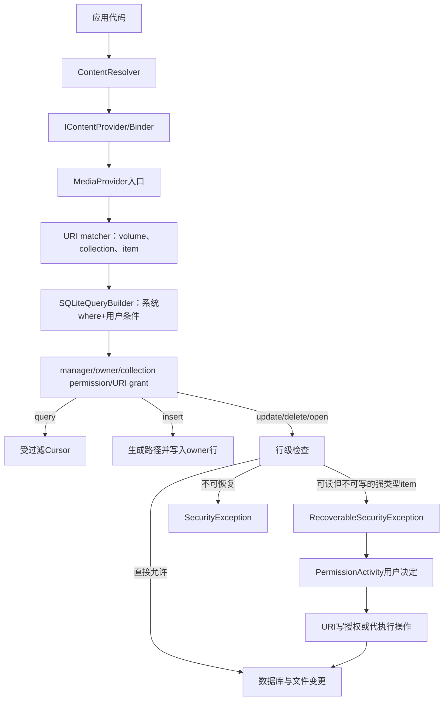
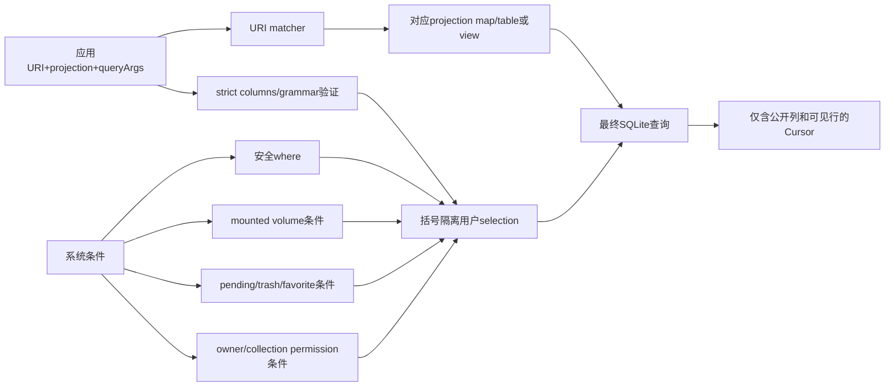
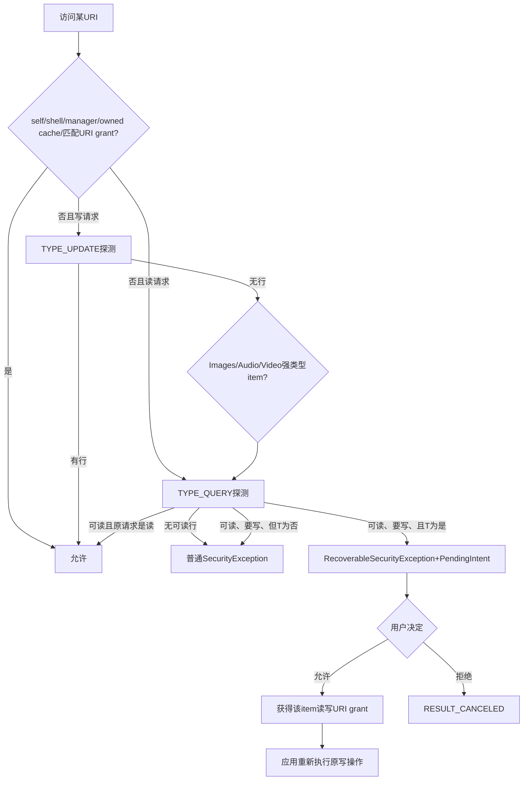

# 第542章 Android MediaStore应用侧CRUD完整链：ContentResolver、URI安全、Owner权限、RecoverableSecurityException与用户确认

> 源码基线：Android 11 / API 30 / `android-11.0.0_r48`。本章直接阅读`ContentResolver`、MediaProvider APEX中的`MediaStore`、`MediaProvider`、`PermissionActivity`、框架`SQLiteQueryBuilder`和文件打开路径。只在macOS上做只读源码分析，不进行真实编译。第541章解释数据库、扫描与媒体状态；本章站到普通应用一侧，追踪一条CRUD请求如何穿过Binder、URI路由、SQL安全、行级权限与用户确认。

## 1. 本章解决什么问题

应用拿到`content://media/external/images/media/123`以后，为什么有时能查、能读，却不能改？为什么同一个`update()`可能直接成功、抛`RecoverableSecurityException`，也可能只抛普通`SecurityException`？`createWriteRequest()`、`createTrashRequest()`、`createDeleteRequest()`有什么本质差别？这一章把“调用API、定位行、过滤结果、判断权限、处理用户决定、修改数据库和文件”串成一条完整链。

## 2. 一句话定位

Android 11的MediaStore不是“授予存储权限后任意CRUD”的数据库：`ContentResolver`负责跨进程调用和资源生命周期，MediaProvider用URI matcher选择集合与表，用严格query builder把应用条件包在系统条件之内，再用collection permission、owner、URI grant和管理能力决定可见/可写行；普通应用对别人的强类型媒体item写入失败时，才能通过`RecoverableSecurityException`或四种`MediaStore.create*Request()`把决定交给用户。

## 3. 先分清五种对象

第一种是collection URI，例如Images集合；第二种是item URI，例如Images下的具体ID；第三种是数据库行；第四种是lower filesystem上的字节文件；第五种是临时URI授权。它们彼此关联，却不是同一个对象。能查询集合不等于能写全部行，行存在不等于默认查询可见，拿到item URI不等于已经拿到权限，删除行还可能同时删除真实文件。

## 4. 应用侧CRUD总图



## 5. `ContentResolver`不是数据库对象

应用调用`resolver.query()`时并没有直接打开`external.db`。ContentResolver根据URI authority找到ContentProvider，通过`IContentProvider`传递调用包名、attribution tag、URI、projection、Bundle参数和取消信号。MediaProvider进程才把这些信息转成SQLite查询。跨进程边界解释了为什么Cursor、文件描述符和provider引用都必须有明确生命周期。

## 6. authority先决定请求交给谁

MediaStore公开authority是`media`，URI形如`content://media/<volume>/<collection>/...`。ContentResolver只用scheme和authority定位provider；`external_primary`、`images/media`、数字ID等剩余路径由MediaProvider自己的LocalUriMatcher解释。不要把每个volume误解成不同provider。

## 7. ContentResolver同时携带调用者身份

Resolver保存调用包名和attribution tag，Binder还保留UID/PID。MediaProvider把这些信息整理为LocalCallingIdentity，进一步计算targetSdk、共享UID包、AppOp、legacy状态、manager/system gallery等能力。应用传入的`OWNER_PACKAGE_NAME`不能冒充身份，普通远程插入时该列会被强制改成真实调用包。

## 8. query为什么先拿unstable provider

查询可能很慢，而且Provider进程可能死亡。ContentResolver先取得unstable引用；如果调用抛`DeadObjectException`，它通知系统该unstable provider已死，再取得stable provider重试一次。普通`RemoteException`则返回null。这里的重试只解决进程死亡，不保证业务条件或数据库异常自动重试。

## 9. query会主动调用`getCount()`

拿到远程Cursor后，ContentResolver立即调用`qCursor.getCount()`强制执行查询，使潜在运行时异常在provider引用仍受控时暴露。随后它用`CursorWrapperInner`包装Cursor并持有stable provider，直到应用关闭Cursor才释放。忘记`close()`不仅泄漏Cursor，也可能延长provider引用生命周期。

## 10. ContentResolver查询源码骨架

```java
IContentProvider unstableProvider = acquireUnstableProvider(uri);
try {
    qCursor = unstableProvider.query(mPackageName, mAttributionTag, uri,
            projection, queryArgs, remoteCancellationSignal);
} catch (DeadObjectException e) {
    unstableProviderDied(unstableProvider);
    stableProvider = acquireProvider(uri);
    qCursor = stableProvider.query(mPackageName, mAttributionTag, uri,
            projection, queryArgs, remoteCancellationSignal);
}
qCursor.getCount();
final IContentProvider provider = (stableProvider != null)
        ? stableProvider : acquireProvider(uri);
return new CursorWrapperInner(qCursor, provider);
```

这段代码同时说明三件事：查询能针对provider死亡重试一次；实际执行可能延迟到Cursor被访问；成功返回的Cursor承担释放stable provider的责任。它没有替应用自动重放insert/update/delete，因为写操作重放可能产生重复副作用。

## 11. 写操作为什么直接用stable provider

`insert()`、`update()`、`delete()`通过`acquireProvider()`取得stable provider，并在finally释放。稳定引用使执行期间provider不容易被系统回收；但如果跨进程仍发生`RemoteException`，Android 11的ContentResolver兼容返回值并不统一：insert为null，update/delete通常为-1，而wrapped resolver分支可能返回0。业务代码不应把所有非异常返回都当成成功。

## 12. 返回0、null和异常分别意味着什么

正常`update/delete`返回0通常表示权限过滤或selection最终没有匹配行，也可能是目标已经被FUSE路径操作删除后的兼容分支；null insert可能是旧target的约束兼容或provider崩溃。`SecurityException`表示权限边界，`IllegalArgumentException`常表示URI、列、MIME、目录或Bundle参数非法，`SQLiteConstraintException`对target R及以上通常直接暴露。必须按具体API和targetSdk解释。

## 13. 旧式selection最终也会进入Bundle

五参数`query(uri, projection, selection, selectionArgs, sortOrder)`通过`DatabaseUtils.createSqlQueryBundle()`转成统一Bundle；update/delete旧重载也类似。Provider侧真正读取的是`QUERY_ARG_SQL_SELECTION`、`QUERY_ARG_SQL_SELECTION_ARGS`等键。Bundle不是绕过SQL校验的后门，只是标准化表达方式。

## 14. 应优先绑定selectionArgs

把用户值放在`selectionArgs`中，用`column=?`占位，既减少字符串拼接错误，也让SQLite复用结构相同的语句。绑定参数只保护“值”，不能把列名、排序表达式或SQL关键字当参数绑定；动态列名必须来自应用自己的白名单，而不是未经验证的外部输入。

## 15. query入口先清掉内部专用参数

MediaProvider收到queryArgs后首先删除`INCLUDED_DEFAULT_DIRECTORIES`，防止普通应用伪造仅供Provider内部使用的行为；随后`DatabaseUtils.resolveQueryArgs()`规范化排序、limit等参数，并记录实际honor的键。Provider最后把这些键放进Cursor extras的`EXTRA_HONORED_ARGS`。

## 16. `EXTRA_HONORED_ARGS`不是查询结果

它告诉调用者Provider接受了哪些标准查询参数，而不是返回行数、权限状态或执行计划。例如应用请求排序和limit，Provider可能只honor其中一部分。读取该数组适合做兼容判断，不能用它判断某行是否因owner或pending过滤而消失。

## 17. URI matcher负责选择语义

`images/media`匹配图片集合，`images/media/#`匹配图片item；audio、video、downloads、file也有对应规则。强类型item不仅限定ID，还限定媒体类型，这正是用户可恢复授权只接受Images/Audio/Video item URI的基础。Files item虽然也有ID，却不属于允许用户授权的强类型集合。

## 18. synthetic `external`查询与插入不同

查询`VOLUME_EXTERNAL`可以聚合当前挂载的外部volume；插入时`resolveVolumeName()`把`external`解析成`external_primary`。因此用合成volume插入不会“自动挑一张SD卡”，而是落到primary共享存储。需要写可移除介质时必须构造那个介质的具体volume URI。

## 19. URI先做uncanonicalize

query、update、delete和open等入口会调用`safeUncanonicalize()`，把可能的canonical URI解析回当前数据库可高效处理的URI。canonical形式用于跨环境稳定标识，但最终权限和CRUD仍落到当前实际行。持有canonical URI也没有绕过权限的效果。

## 20. getDatabaseForUri还会检查volume是否attached

URI语法合法不代表对应介质在线。MediaProvider解析volume后查询attached集合；未挂载volume抛VolumeNotFoundException，再按targetSdk翻译成现代异常或旧兼容结果。因此“Cursor为空”和“volume不存在”在不同target上可能表现不同，调试时要记录URI和targetSdk。

## 21. 外部调用默认启用三类SQL保护

Provider为非自身调用设置targetSdk、strict columns、strict grammar，并让所有query builder必须配置projection map。strict columns拒绝未公开列，strict grammar限制selection/group/order/limit语法，strict parentheses再把系统where与调用者where隔离。三者共同作用，不能只靠selectionArgs理解安全边界。

## 22. projection map是列级API表面

images、video、audio、files等URI拥有各自projection map。查询或更新不是看到SQLite有一列就能使用它；只有URI对应map公开的列才是可用表面。Provider最后显式断言所有查询都必须有projection map，避免某个新分支忘记列限制后暴露内部字段。

## 23. Android 9及以前target有projection灰名单

当调用者targetSdk低于Q，Provider允许一组历史上虽不规范却被旧应用依赖的projection表达式。灰名单是兼容补丁，不是现代应用可依赖的SQL扩展。阅读源码看到复杂正则时，应先看target门槛，不要把它总结成“MediaStore允许任意SQL函数”。

## 24. 旧应用还有SQL滥用恢复

target低于R时，Provider尝试把ORDER BY或URI参数中偷塞的LIMIT恢复成标准query arg；target低于Q时还恢复selection中的GROUP BY以及projection开头的DISTINCT。现代target不会获得这些宽容，非法表达式应尽早修正为标准Bundle参数。

## 25. strict wrapping为什么重要

系统必须追加“只看已发布、未删除、当前volume、调用者有权访问”的where。如果直接把应用selection与系统selection字符串拼接，恶意括号可能改变优先级。严格builder先验证不受信任SQL，再把它包入独立括号，使应用只能在系统允许的候选行内继续过滤。

## 26. 系统过滤不是查询后的Java过滤

owner、volume、pending、trash、媒体类型和item ID等条件直接被append进SQLiteQueryBuilder。数据库只返回最终可见行，而不是Provider读出全表再逐行删除。这样既减少敏感数据进入Cursor，又使同一query builder能被权限探测复用。

## 27. 查询安全与权限合流图



## 28. 默认状态过滤

普通应用查询默认排除`IS_PENDING=1`与`IS_TRASHED=1`，favorite默认包含。item URI和内部FUSE路径在部分分支会改变match参数，以便owner、明确对象或路径访问完成授权检查。不要仅凭“普通集合查不到”断定行已被删除。

## 29. owner过滤怎样进入查询

当调用者没有该collection的广泛读能力，query builder追加`owner_package_name IN (...)`，其中包含调用身份的shared package names。于是应用仍能看到自己创建的行。owner是一项行级政策元数据，不等于Linux文件UID，也不是应用可以随意更新的标签。

## 30. shared UID为什么影响owner匹配

同一UID可能对应多个共享身份包，Provider用shared package集合构造owner匹配。这样旧式sharedUserId场景不会因当前包名不同而错误丢失访问。但owned-ID缓存和包集合都只是当前调用身份推导结果，不是URI里携带的可信字段。

## 31. collection permission解决“能看一类媒体”

Images、Video、Audio分别检查相应读写能力和AppOp；有读能力时可看到集合中更多他人媒体，但写权限在Scoped Storage下不能简单理解为“任意改所有行”。TYPE_QUERY和TYPE_UPDATE构造的builder不同，后者仍会把owner等写边界压入where。

## 32. manager是全局快速通道

具有MANAGE_EXTERNAL_STORAGE对应管理身份的应用在`checkCallingPermissionGlobal()`中可操作所有文件；MediaProvider自身和shell也走全局允许。这个能力非常宽，不应作为普通相册编辑流程的首选，更不代表它能访问其他应用所有私有目录；第540章已解释All Files Access的边界。

## 33. owned-ID缓存只是优化

插入成功后，Provider在当前CallingIdentity缓存该row ID为owned，后续对Images/Video/Audio/Files/Downloads item URI可快速放行。删除时会清除缓存。真正事实仍是数据库的owner列；进程、身份或缓存变化后，query builder会重新按行验证。

## 34. 显式URI grant也是全局检查分支

若Context对当前UID/PID检查到该URI的read或write grant，`checkCallingPermissionGlobal()`直接允许相应操作。读grant不能替代写grant；item grant也不是collection prefix grant。授权对象、模式和生命周期必须同时匹配。

## 35. collection URI grant为何几乎不增加能力

MediaProvider override `checkUriPermission()`：若URI不带有效item ID且没有请求prefix grant，可以允许“只对这个collection URI本身”的授权，因为它不会自动授权表中任何行；一旦请求prefix grant则拒绝，避免一个集合URI扩张成所有子item权限。

## 36. item URI grant要先验证行可访问

对带ID URI，Provider用TYPE_QUERY或TYPE_UPDATE的query builder查询`_id`，只有恰好一行时才返回PERMISSION_GRANTED。URI grant系统的形式许可与Provider的行级政策相互配合，不是只要字符串末尾有数字就能把任意行授给别人。

## 37. query可以被权限过滤成空Cursor

集合查询没有权限时往往不是立即抛异常，而是只返回owner行；item查询若目标不在可见集合，结果可能为0行。这降低通过批量查询枚举别人媒体的机会。对调用者而言，“不存在”与“存在但不可见”有意变得难以区分。

## 38. insert为什么通常对collection URI调用

插入是在集合中创建新行，所以使用`Images.Media.getContentUri(volume)`、Video/Audio/Downloads等collection URI。传item URI没有“覆盖这条记录”的语义，通常不会匹配受支持insert分支。成功返回值才是带新row ID的item URI，应保存它用于后续写字节和发布。

## 39. insert先删除应用提供的`_id`

MediaProvider明确移除`MediaColumns._ID`，因为ID由数据库分配且“IDs are forever”。允许外部调用者指定ID会破坏URI稳定性、grant指向和跨表关系。恢复业务自己的标识应使用应用数据库映射，而不是控制MediaStore `_id`。

## 40. 普通应用不能决定OWNER_PACKAGE_NAME

远程普通调用者的owner值会被移除，再强制使用真实calling package；scanner/shell可依据路径推断或指定，DownloadProvider类delegator有受控代理规则。这个覆盖发生在真正insert前，所以伪造ContentValues不会成为别人的owner。

## 41. Android 11创建文件应提供哪些列

现代应用通常提供`DISPLAY_NAME`、`MIME_TYPE`、`RELATIVE_PATH`，并在分阶段写入时设置`IS_PENDING=1`。不要依赖写`DATA`绝对路径：Android 11公开注释明确建议创建或更新媒体时使用显示名与相对路径，再用返回URI打开文件描述符写入。

## 42. insert对原始DATA的处理有身份差异

MediaProvider自身、legacy writer和manager插入时可保留raw data列；普通应用提交的data相关列会被移除。注意update的规则更严格：manager并没有与insert相同的DATA例外，非self且非legacy writer的raw path修改会被忽略。不能把All Files Access概括为所有CRUD列都放开。

## 43. 缺少MIME和名字时有默认值

Provider按目标collection选择默认MIME和默认目录，例如Images默认image/jpeg与Pictures，Video默认video/mp4与Movies，Audio默认audio/mpeg与Music。target R及以上还会尝试从DISPLAY_NAME扩展名推断MIME；无法支持的MIME对现代target可抛IllegalArgumentException。

## 44. 强类型collection会校验MIME大类

向Images URI插入audio MIME会失败；Video和Audio同理。Files URI更通用，可根据MIME识别playlist、subtitle等特殊类型。collection URI不仅决定查询视图，也参与“这个内容应该是什么媒体类型、允许放在哪些顶层目录”的约束。

## 45. RELATIVE_PATH不是任意相对路径

Images通常允许DCIM/Pictures，Video允许DCIM/Movies/Pictures，Audio允许Music、Ringtones、Podcasts等，Downloads限定Downloads。Provider用MIME与collection计算允许的primary目录；manager、系统图库和应用自己的Android/media目录有额外规则。

## 46. Provider会生成唯一实际文件名

当应用没有DATA时，Provider把volume根、RELATIVE_PATH、DISPLAY_NAME组合成候选路径，sanitize后调用`buildUniqueFile()`避免覆盖现有文件。数据库里返回的DISPLAY_NAME可能因冲突而调整；应用应查询返回URI，而不要假定磁盘名永远等于输入字符串。

## 47. 插入时会创建父目录

路径校验通过后，Provider调用`mkdirs()`并确认目录存在，再把绝对路径写回内部ContentValues。也就是说插入不只是SQLite加一行，它可能先改变文件系统目录结构；但媒体文件字节通常仍由应用随后通过返回URI写入。

## 48. `external`插入落到primary

`resolveVolumeName()`对合成`external`返回`external_primary`，用其根路径生成DATA。返回URI仍可能保留原始volume名的形式，但实际行带具体volume。设计应用数据模型时最好保存Provider返回的URI，并在需要时调用`MediaStore.getVolumeName()`核实。

## 49. insert并不一定覆盖同名文件

正常路径使用唯一命名。若数据库唯一约束冲突，`insertAllowingUpsert()`仅在发现相同路径的现有行由当前包、shared package或允许的delegated owner拥有时，才把double insert当成upsert；否则重新抛约束异常。它不是全局“INSERT OR REPLACE”。

## 50. target R改变constraint兼容

`insert()`捕获SQLiteConstraintException后，target R及以上重新抛出；旧target返回null兼容。看到同一错误在旧应用“静默失败”、新应用崩溃，并不代表数据库版本不同，而可能只是targetSdk门槛改变了错误表面。

## 51. pending创建的推荐顺序

先以`IS_PENDING=1`插入并取得URI，再用`openFileDescriptor(uri, "w")`写完整字节与关闭fd，必要时更新仍处于pending时允许的初始元数据，最后把`IS_PENDING`改为0发布。发布会触发阻塞扫描，以磁盘内容重建scanner控制的元数据。

## 52. pending期间列写入较宽松

普通应用更新已发布项时，只能修改`sMutableColumns`内的列；scanner派生的宽高、duration等列会被忽略并触发重新扫描。若单个目标仍pending，Provider暂时放宽列过滤，因为发布扫描将覆盖这些值。放宽不是让伪元数据永久可信。

## 53. insert返回URI以后还没有自动写入业务字节

`insertFile()`创建行、计算路径和基础列，但不会替应用把图片内容写进去。空文件、部分写入或写失败都可能留下pending行。应用必须把插入、fd写入、关闭、发布当作显式状态机，并在失败时删除自己创建的URI或保留pending以便恢复。

## 54. `openFileDescriptor()`最终仍进入MediaProvider

content URI的fd不是从DATA字符串直接`FileInputStream`打开。ContentResolver对读模式可能走typed asset file，对写模式走provider的openAssetFile；MediaProvider查询真实路径、执行行级权限与路径安全检查，再决定从lower路径还是FUSE upper路径打开，并可能套上redaction或close listener。

## 55. open模式不是一个布尔值

`r`、`w`、`wa`、`rw`、`rwt`由ParcelFileDescriptor解析成不同位；Provider对写模式可能内部升级为rw以便加锁。应用应选择最窄模式，明确是否truncate或append。独占读写返回的fd不一定总可seek，ContentResolver文档也提醒管道型provider可能只支持顺序流。

## 56. open先查行再查路径

MediaProvider先用内部身份查询DATA、OWNER、IS_PENDING等列，但在真正`checkAccess()`前恢复外部调用身份。随后先执行URI行级权限，再确认路径位于storage根或满足world-readable路径规则。内部查询不是绕过调用者权限，而是Provider为了做判断读取自己的元数据。

## 57. requireOriginal与位置脱敏

非owner且缺少媒体位置权限时，图片可能通过redacted fd隐藏敏感位置数据；调用者显式要求original却不具备权限时，会抛UnsupportedOperationException。拿到读取URI不一定表示获得文件中所有位置元数据，这是内容层授权与元数据隐私的又一层边界。

## 58. 为什么有时重新经FUSE打开

当不需要redaction时，Provider可先打开lower fd，再询问daemon是否应通过FUSE打开，以维护页缓存与路径访问的一致性；需要时关闭lower fd并经upper路径重开。Content URI读写和直接File路径访问因此会汇合到相同FUSE政策，但入口和授权判断仍不相同。

## 59. 关闭已发布媒体的写fd会触发什么

对非pending项目的写入，Provider给ParcelFileDescriptor挂BackgroundThread close listener；关闭后使缩略图与FUSE dentry失效，并安排扫描，以便把真实字节变化反映到数据库。监听器即使收到close error也仍做收敛工作，因此“关闭报错”与“绝对没有任何后续扫描”不能画等号。

## 60. pending写fd为什么不立刻扫描

pending对象尚未对普通查询发布，应用可能多次写入。Provider不在每次pending fd关闭时触发同样扫描；最终把IS_PENDING改为0时，update路径清空用于跳过no-op scan的时间/大小列，并执行阻塞扫描。这把“内容完成”边界交给发布动作。

## 61. update先从URI决定可更新范围

Provider对URI构造TYPE_UPDATE query builder。collection URI会把调用者selection与系统owner/permission条件叠加，可能更新多条自己有权写的行；item URI还会追加确定ID，并对Images/Audio/Video item显式调用`enforceCallingPermission()`，给单对象写入提供用户升级机会。

## 62. item update与collection update的错误表面不同

强类型item更新别人媒体时，Provider能明确知道“用户可能授权哪一个对象”，所以可能抛RecoverableSecurityException。collection更新无法让用户一次隐式确认未知范围，通常只是query builder过滤成0行，或在其他路径抛SecurityException。不要依赖一次collection update触发系统授权框。

## 63. update同样拒绝修改`_id`

Provider先移除`_id`，再计算DATE_EXPIRES和过滤列。item URI仍指向原ID；把`_id`放进ContentValues不会移动行或更换URI。若应用要把业务内容替换成新对象，应创建新行、迁移关系、再在获得权限后删除旧行。

## 64. 可公开修改列不是所有公开查询列

Android 11的`sMutableColumns`包含DATA、RELATIVE_PATH、DISPLAY_NAME、IS_PENDING、IS_TRASHED、IS_FAVORITE、OWNER_PACKAGE_NAME及少量播放列表、下载和书签等列，但身份规则会进一步限制DATA与OWNER。其他scanner控制列即便可query，也不一定可由已发布项直接update。

## 65. ignored mutation为何还可能触发scan

普通应用试图修改scanner控制的元数据时，Provider移除该键并把`triggerScan`设为true。设计意图是：应用可能已经改了磁盘字节，只是错误地同时提交派生列；Provider忽略不可信值，再扫描真实文件取得权威元数据。最终update count可能为0，但扫描仍可能发生。

## 66. 发布pending是特殊update

当ContentValues包含IS_PENDING时，Provider强制`triggerScan=true`并把DATE_MODIFIED、SIZE设null，防止扫描器误判文件未变而跳过。数据库update完成后，它用快照ID查DATA并在postBlocking中执行scanFile。返回前通常等这次扫描收口，但扫描异常会被记录，不应推导为SQLite更新自动回滚。

## 67. 改DISPLAY_NAME或RELATIVE_PATH会移动文件

这些列属于placement columns。Provider先查询当前placement信息并补齐未提供值，重新计算候选路径，再确认volume和path owner不变、目标唯一，随后调用`Os.rename()`、失效旧新FUSE dentry，最后更新数据库DATA并触发扫描。

## 68. 文件rename与SQLite不是一个事务域

`Os.rename()`发生在数据库update之前；SQLite失败不能自动撤销文件系统rename。源码依靠权限检查、目录/MIME规则、volume/owner不变和唯一目标等前置验证减少失败窗口，再靠扫描收敛。不能把ContentResolver update的“原子”文档泛化为文件与数据库跨资源的二阶段提交。

## 69. movement只支持明确定义的item集合

Audio、playlist、Video、Images、Downloads与Files的item URI可进入移动分支；对不明确collection批量改变placement会抛IllegalArgumentException。用户确认Activity在trash/favorite更新时显式设置`QUERY_ARG_ALLOW_MOVEMENT=true`，因为trash状态可能编码进内部文件名或位置。

## 70. 更新不能跨volume

Provider比较beforeVolume与probeVolume，不相等就拒绝。RELATIVE_PATH只能在同一volume内重定位；从primary复制到SD卡应创建目标volume新item、复制字节、确认成功，再删除源对象，而不是对原item改volume字段。

## 71. 更新不能借路径改变owner

Provider还比较路径推断的beforeOwner与probeOwner，拒绝把文件移动进另一个应用的Android/media目录。数据库OWNER_PACKAGE_NAME也只有self、shell或受控delegator能转移；普通应用即使拥有当前行写权限，也不能把owner列送给任意包。

## 72. selection仍然会限制item操作

即使URI已经带ID，调用者Bundle中的selection仍会附加。例如item URI正确但selection要求不同DISPLAY_NAME，最终匹配0行。权限检查和实际mutation都使用query builder，但文件移动前还有内部快照查询；应用不应给单item CRUD附加无必要、可能过期的selection。

## 73. delete不是只删SQLite行

对files表行，Provider先query媒体类型、DATA、ID、download标记和MIME，清除owned缓存，调用`deleteIfAllowed()`删除真实路径，再按ID删除数据库行；audio还会修复引用它的playlist，download还异步通知DownloadManager。删除是一组跨系统副作用。

## 74. 为什么先删文件再删行

如果先删行，Provider会失去权威DATA路径，磁盘字节可能成为孤儿。先删文件可在路径权限失败时保留数据库行。但随后数据库删除失败仍可能留下“字节已无、行还在”的中间态，因此扫描与维护仍负责最终收敛。

## 75. `PARAM_DELETE_DATA=false`是内部维护工具

scanner清理旧索引时可要求只删数据库行、不删真实字节；普通应用的删除语义不应依赖该内部参数绕过文件处理。第541章的扫描对账使用它，是因为scanner已确认索引与磁盘关系，和用户请求永久删除文件是不同场景。

## 76. 目录删除为何递归到稳定

Provider追加“该ID不能仍被其他项作为parent引用”的条件，然后反复执行相同delete，直到一轮删除0行。这样先删叶子再删父目录，避免悬挂parent导致数据库损坏。返回count是累计删除行数，不一定等于最初selection直接命中的目录数。

## 77. FUSE已删后的第二次delete兼容

应用有时先按File路径删除，FUSE路径已让Provider清掉数据库行，随后又对原URI调用delete。Provider从CallingIdentity的recent deleted row缓存发现该ID后直接返回0，避免旧应用因目标消失再遭SecurityException。0在这里表示“无需再次删”，不是权限授予。

## 78. batch API的通用契约没有保证全部provider都原子

ContentResolver文档说applyBatch失败后究竟多少操作已执行是实现相关。MediaProvider实现会为operations涉及的每个DatabaseHelper开启事务，调用super.applyBatch后全部标记成功，finally结束事务；但多个helper是多个SQLite事务，且文件rename/delete等外部副作用仍不属于同一原子边界。

## 79. exceptionAllowed会改变batch失败传播

ContentProviderOperation设置`withExceptionAllowed(true)`后，单项异常可包装进对应ContentProviderResult，后续操作继续。MediaProvider还允许这类operation搭载到已活动事务中，因为调用者已接受局部失败。用户确认Activity对trash/favorite/delete正是这样构造每个item操作。

## 80. MediaProvider batch事务源码骨架

```java
for (ContentProviderOperation op : operations) {
    final DatabaseHelper helper = getDatabaseForUri(op.getUri());
    if (!helper.isTransactionActive()) {
        helper.beginTransaction();
        transactions.add(helper);
    } else if (!op.isExceptionAllowed()) {
        throw new IllegalStateException("Nested transactions not supported");
    }
}
final ContentProviderResult[] result = super.applyBatch(operations);
for (DatabaseHelper helper : transactions) {
    helper.setTransactionSuccessful();
}
return result;
```

源码只把每个helper的数据库operation组织在事务里。它没有把文件系统、缩略图、DownloadManager通知或多个helper绑成全局事务；而exceptionAllowed结果需要调用者逐项检查，不能只因applyBatch正常返回就认为全部成功。

## 81. 行级写权限的第一步是global fast path

`enforceCallingPermissionInternal()`先检查MediaProvider self、shell、manager、owned-ID缓存与匹配模式的URI grant。任一成立就返回。这里叫global不是说授权覆盖所有URI，而是相对于后续SQLite探测，它无需再为当前URI构造行查询。

## 82. 第二步用TYPE_UPDATE探测直接写

若请求写入，Provider构造TYPE_UPDATE builder并query空projection；只要有一行可移动到first，就说明系统写条件、ID和应用selection共同匹配，直接放行。这让owner或已有写能力的应用无需用户交互。

## 83. 第三步判断URI能否由用户授权

只有`IMAGES_MEDIA_ID`、`AUDIO_MEDIA_ID`、`VIDEO_MEDIA_ID`把`allowUserGrant`设true。Images集合、Files item、Downloads item、playlist和thumbnail都不在列表。限制到强类型单item可以让系统UI准确展示用户正在授权的对象。

## 84. 第四步用TYPE_QUERY探测直接读

Provider再构造TYPE_QUERY builder。若目标行可读，读请求直接成功；若这是写请求、行可读且allowUserGrant为true，才创建单URI write PendingIntent并抛RecoverableSecurityException。若读探测也无行，则落到普通SecurityException。

## 85. 权限决策树



## 86. RecoverableSecurityException不是自动重试

它携带原SecurityException、面向用户的说明和RemoteAction。应用启动其中action的IntentSender，等待RESULT_OK后，仍需自行重新调用原来的update/delete/open写操作。第一次失败的操作不会被系统在后台自动补做。

## 87. 为什么必须先“可读”才能弹可恢复写授权

系统需要避免向无权知道对象存在的应用泄露缩略图、描述和身份。如果TYPE_QUERY也看不到行，Provider直接抛普通SecurityException。可恢复异常表示“你已经能识别这个媒体，但需要用户额外授权写”，不是通用权限申请机制。

## 88. Files item为何不会得到RecoverableSecurityException

Files URI可能指向任意媒体、文档、目录或特殊行，系统难以用统一媒体UI安全表达；因此隐式升级只限强类型图片、音频、视频item。即使Files item指向的底层行恰好是图片，使用Files URI失败也不会自动变成图片授权；应使用对应强类型MediaStore URI。

## 89. Downloads item也不是隐式可恢复对象

Downloads URI在CRUD中有item路由，但不在allowUserGrant列表。普通应用对别人下载项写失败时不能指望RecoverableSecurityException。四种显式create*Request同样只接受Images/Audio/Video具体ID，Provider会拒绝Downloads URI。

## 90. 捕获异常时应区分三层

先捕获RecoverableSecurityException并启动其userAction；普通SecurityException说明该URI/身份不能走此升级，应停止或换合法工作流；IllegalArgumentException多半是URI、MIME、目录、列或参数错误，应修正请求。把三者统一成“再申请存储权限”会制造循环与错误提示。

## 91. 显式`createWriteRequest()`解决多item授权

它接受一组强类型item URI，生成PendingIntent；用户允许后PermissionActivity逐个对calling package授予read+write URI permission。与单次RecoverableSecurityException相比，它让应用在操作前集中请求多个已知对象，避免每改一条弹一次。

## 92. write request授予能力，不代执行任意业务update

用户允许createWriteRequest后，系统只授予各URI通用读写权限；应用收到RESULT_OK再自行更新favorite、trash、metadata或delete。授权受Activity生命周期约束，不支持persistable或prefix grant。需要跨组件短期传递时，应按公开文档用ClipData及相应grant flags。

## 93. `createTrashRequest()`直接代执行状态修改

它构造只含`IS_TRASHED=1/0`的ContentValues。用户允许后PermissionActivity为每个URI建立update operation，设置allow movement与exceptionAllowed，再applyBatch。应用不需要在结果后重做同一个trash update；操作按API契约在activity result之前已经结束。

## 94. `createFavoriteRequest()`在r48有特殊实现

API形式与trash相同，只能设置IS_FAVORITE。PermissionActivity在Android 11 r48中对favorite/unfavorite自动调用positive action，不真正展示确认对话框；注释说明仍要求开发者走该流程，以便未来政策可以开始提示。不能把这一版本行为写成永久平台保证。

## 95. `createDeleteRequest()`直接代执行永久删除

用户允许后PermissionActivity为每个URI创建delete operation并applyBatch。它不是授予以后无限次删除的通用权限；这次确认对应这组具体item和这次代执行。若应用需要先编辑再删除，应根据产品流程选择write request或分开请求。

## 96. 四种请求的差异表

| API | 用户允许后系统做什么 | 应用是否重做原操作 | 主要生命周期 |
|---|---|---|---|
| RecoverableSecurityException action | 给单个item授予读写URI权限 | 是 | 与请求Activity相关 |
| createWriteRequest | 给多个item授予读写URI权限 | 是 | 与请求Activity相关 |
| createTrashRequest | 直接更新IS_TRASHED | 否 | 本次请求完成即结束 |
| createFavoriteRequest | 直接更新IS_FAVORITE；r48自动同意流程 | 否 | 本次请求完成即结束 |
| createDeleteRequest | 直接逐项delete | 否 | 本次请求完成即结束 |

## 97. 请求集合不能为空

`MediaStore.createRequest()`先取得iterator，再直接调用`it.next()`创建第一项ClipData，没有显式空集合检查。空集合会在客户端侧抛NoSuchElementException，而不是生成一个“什么也不做”的PendingIntent。应用应在调用前去重并确认至少一个URI。

## 98. 每个URI都必须是强类型具体ID

Provider遍历ClipData，仅接受Images/Audio/Video的`.../media/#`匹配；collection、Files、Downloads、thumbnail或缺ID URI都会抛IllegalArgumentException。这里验证的是URI形状和类型，并没有在createRequest阶段保证每行仍存在、可见或同一volume。

## 99. Provider限制请求能改哪些列

favorite request仅允许IS_FAVORITE，trash request仅允许IS_TRASHED，write/delete请求不允许随附任意ContentValues。若extras里出现不允许的键，createRequest立即抛IllegalArgumentException，防止不可信应用借系统身份修改scanner元数据或owner。

## 100. PendingIntent的flags有真实影响

Provider以固定request code 42创建Activity PendingIntent，并使用ONE_SHOT、CANCEL_CURRENT、IMMUTABLE。每种请求method成为不同Intent action；同action与匹配Intent的新请求可能取消尚未启动的旧请求。应用不要提前缓存大量同类PendingIntent，最好创建后及时启动并处理CanceledException。

## 101. PermissionActivity先防界面覆盖攻击

窗口设置隐藏非系统overlay，禁止点外部关闭，对话框不可cancel，并吞掉Back键。它从PendingIntent启动者解析calling package和应用label，再异步加载媒体描述/缩略图。安全确认不是普通可随意嵌入的应用Dialog。

## 102. 用户允许后的源码骨架

```java
case MediaStore.CREATE_WRITE_REQUEST_CALL:
    for (Uri uri : uris) {
        grantUriPermission(getCallingPackage(), uri,
                Intent.FLAG_GRANT_READ_URI_PERMISSION
                        | Intent.FLAG_GRANT_WRITE_URI_PERMISSION);
    }
    break;
case MediaStore.CREATE_TRASH_REQUEST_CALL:
case MediaStore.CREATE_FAVORITE_REQUEST_CALL:
    for (Uri uri : uris) {
        ops.add(ContentProviderOperation.newUpdate(uri)
                .withValues(values).withExceptionAllowed(true).build());
    }
    getContentResolver().applyBatch(MediaStore.AUTHORITY, ops);
    break;
```

真实源码还为trash/favorite附加allow movement；delete分支建立exceptionAllowed delete operations。关键区别是write分支发grant，另外三类请求由系统身份直接执行具体动作。

## 103. `RESULT_OK`不严格证明每一项都成功

PermissionActivity的后台任务catch所有Exception只写日志，`onPostExecute()`仍无条件设置RESULT_OK；各operation又用了exceptionAllowed，单项失败可能只出现在ContentProviderResult中，而Activity并未逐项检查。因而r48的RESULT_OK可靠表示“用户同意且任务已结束”，不能严格推导为“每个URI均变更成功”。

## 104. 应用收到结果后怎样验证

write request后用`checkUriPermission()`或直接重试目标操作；trash/favorite后重新query包含相应状态的URI或做增量同步；delete后query/打开目标并更新本地ID集合。验证要容忍对象在对话期间被移动、删除、volume弹出或权限变化。

## 105. 用户拒绝时发生什么

negative action记录metrics，返回RESULT_CANCELED并finish，不授grant也不代执行mutation。应用应保留可理解的取消状态，不应立即循环再弹。同样，Activity初始化失败会直接finish，调用方也不能把“没有RESULT_OK”模糊地当成平台已删除内容。

## 106. 多URI请求存在竞态

createRequest主要验证URI类型；从创建PendingIntent到用户点击之间，行可能消失、volume可能卸载、owner或grant可能变化。因此操作阶段必须重新走MediaProvider的URI、数据库与权限判断。确认UI看到的是一个快照，不是锁住所有目标直到用户决定。

## 107. URI权限不支持persistable与prefix

createWriteRequest公开文档明确不支持`FLAG_GRANT_PERSISTABLE_URI_PERMISSION`或`FLAG_GRANT_PREFIX_URI_PERMISSION`。不能调用takePersistableUriPermission把MediaStore写授权永久保存，也不能通过一个collection URI覆盖所有后代。这与SAF文档URI的长期授权模型不同，下一章会专门比较。

## 108. 同一个文件的三种访问结果可能不同

按MediaStore item URI访问要经过row policy；按直接File路径访问要经过FUSE路径策略；从SAF拿Document URI则经过DocumentsProvider与其grant。它们最终可能指向同一lower文件，却拥有不同authority、授权对象、持久化能力与错误类型。不要把一种入口成功当成另外两种必然成功。

## 109. 一个可靠的应用写入模板

创建自己的新媒体：collection insert pending → URI fd写入 → close → item update发布。修改自己创建的item：直接update/open写。修改别人媒体：先用强类型item URI尝试；捕获RecoverableSecurityException做单项授权，或预先聚合createWriteRequest；RESULT_OK后重试并验证。批量trash/favorite/delete使用对应显式请求并在返回后重新query核对。

## 110. 错误处理矩阵

| 表现 | 常见原因 | 正确方向 |
|---|---|---|
| query空Cursor | selection、owner、状态、volume过滤或确实无行 | 检查URI、query args和状态匹配，不枚举越权数据 |
| RecoverableSecurityException | 强类型item可读不可写 | 启动userAction，允许后重试 |
| SecurityException | 无读可见性或URI类型不可恢复 | 停止该路径，换合法URI/工作流 |
| IllegalArgumentException | URI、MIME、目录、列、Bundle或volume错误 | 修正输入，不重复申请权限 |
| update/delete返回0 | 无匹配行、已被兼容删除或条件过期 | 重新query并对账 |
| RESULT_OK但状态未全变 | r48逐项exceptionAllowed或后台异常 | 对每个URI验证最终状态 |

## 111. 阅读本链固定六问

看到一次MediaStore操作，依次问：这是collection还是item URI？是Images/Audio/Video强类型还是Files/Downloads？目标volume是否attached？query builder为TYPE_QUERY还是TYPE_UPDATE追加了哪些系统条件？调用者靠manager、owner、collection permission还是URI grant通过？最终动作是“授予能力”还是“系统代执行一次”，结果是否又被重新验证？

## 112. macOS只读练习一：追ContentResolver查询生命周期

```bash
cd /Users/ninebot/androidSource && sed -n '1060,1235p' frameworks/base/core/java/android/content/ContentResolver.java && rg -n "queryInternal|resolveQueryArgs|EXTRA_HONORED_ARGS|setNotificationUri" packages/providers/MediaProvider/src/com/android/providers/media/MediaProvider.java
```

按unstable provider、远程取消信号、DeadObject重试、getCount强制执行、CursorWrapper持有stable provider、Provider strict query与notification URI排序，解释为什么应用必须关闭Cursor。

## 113. macOS只读练习二：手算三种权限结果

```bash
cd /Users/ninebot/androidSource && sed -n '7040,7215p' packages/providers/MediaProvider/src/com/android/providers/media/MediaProvider.java && sed -n '2080,2165p' packages/providers/MediaProvider/src/com/android/providers/media/MediaProvider.java
```

分别代入“自己创建的Images item”“可读的别人Images item”“别人Files item”，画出global、TYPE_UPDATE、TYPE_QUERY与allowUserGrant分支，预测直接允许、RecoverableSecurityException或普通SecurityException。

## 114. macOS只读练习三：比较四种用户请求

```bash
cd /Users/ninebot/androidSource && sed -n '790,1010p' packages/providers/MediaProvider/apex/framework/java/android/provider/MediaStore.java && sed -n '4660,4720p' packages/providers/MediaProvider/src/com/android/providers/media/MediaProvider.java && sed -n '120,310p' packages/providers/MediaProvider/src/com/android/providers/media/PermissionActivity.java
```

找出空集合、URI类型、ContentValues列、PendingIntent flags、favorite自动允许、grant与代执行、exceptionAllowed以及无条件RESULT_OK；最后写出每个API收到结果后是否需要重做原操作。

## 115. macOS只读练习四：追一次创建、写入和发布

```bash
cd /Users/ninebot/androidSource && rg -n "resolveVolumeName|ensureFileColumns|buildUniqueFile|OWNER_PACKAGE_NAME|IS_PENDING|triggerScan|openFileAndEnforcePathPermissionsHelper" packages/providers/MediaProvider/src/com/android/providers/media/MediaProvider.java | head -n 180
```

从Images collection insert开始，记录volume解析、MIME/目录规则、owner强制、唯一路径、返回item URI、fd权限、pending close与发布scan；同时指出文件系统和SQLite分别在哪一步改变。

## 116. 四个练习应得到的答案

练习一应看到query只对provider死亡重试一次且Cursor持有provider；练习二应证明只有可读但不可写的强类型item可恢复；练习三应区分write grant与trash/favorite/delete代执行，并发现RESULT_OK的逐项成功漏洞；练习四应得到“插入行、写字节、发布扫描”三阶段，而不是一次insert完成全部工作。

## 117. 十二个常见误解速查

ContentResolver不是SQLite连接；有集合读权限不等于能写所有行；owner不是Linux UID；URI字符串不是授权；Files item不触发RecoverableSecurityException；Downloads item也不触发；异常中的PendingIntent不会自动重试；createWriteRequest不代执行业务更新；trash/delete请求不是永久grant；favorite在r48自动同意不代表永远无UI；RESULT_OK不严格证明每项成功；MediaStore URI grant不能持久化或做prefix。

## 118. 推荐源码阅读地图

框架跨进程与资源生命周期看`frameworks/base/core/java/android/content/ContentResolver.java`；公开请求契约看`packages/providers/MediaProvider/apex/framework/java/android/provider/MediaStore.java`；URI、query builder、CRUD、路径与权限看`MediaProvider.java`；SQL strict语义看框架与MediaProvider各自的`SQLiteQueryBuilder`；确认UI和真实执行看`PermissionActivity.java`。

## 119. 复读后专门修正的难点

第一，修正“有读权限即可弹写授权”为必须是强类型单item且TYPE_QUERY可见；第二，限定Files/Downloads即使带ID也不可走implicit或explicit用户请求；第三，区分RecoverableSecurityException/createWriteRequest授予能力与trash/favorite/delete代执行；第四，修正RESULT_OK为用户已同意且任务结束，不保证r48每项成功；第五，补充空URI集合会在客户端iterator.next失败；第六，指出PendingIntent同action请求可能互相cancel；第七，限定manager插入DATA例外不能外推到update；第八，强调rename/delete文件副作用不在SQLite事务回滚域；第九，说明collection无prefix grant不会授予子行；第十，明确publish scan异常不会神奇回滚已提交状态。

## 120. 本章小结与下一章入口

应用侧MediaStore CRUD的主线是：ContentResolver安全持有远程provider资源，URI matcher确定volume、collection和item，strict query builder把用户条件限制在公开列与系统where内，owner、collection permission、manager与URI grant共同决定可见和可写行；创建媒体走pending三阶段，修改别人媒体只有强类型item能交给用户恢复；显式四种请求又分为“授予通用写能力”和“系统代执行一次动作”。下一章将进入Storage Access Framework与DocumentsUI，比较Document URI、tree URI、persistable grant、DocumentsProvider和MediaStore URI授权的根本差异。
