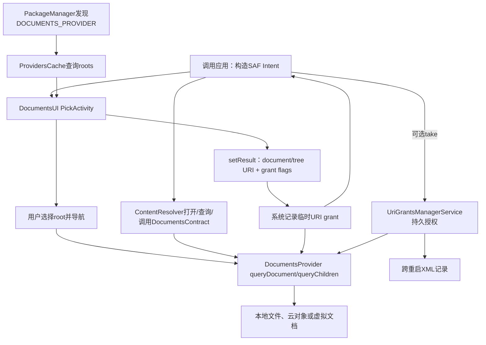
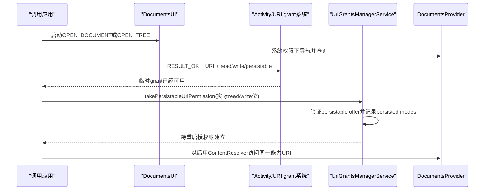
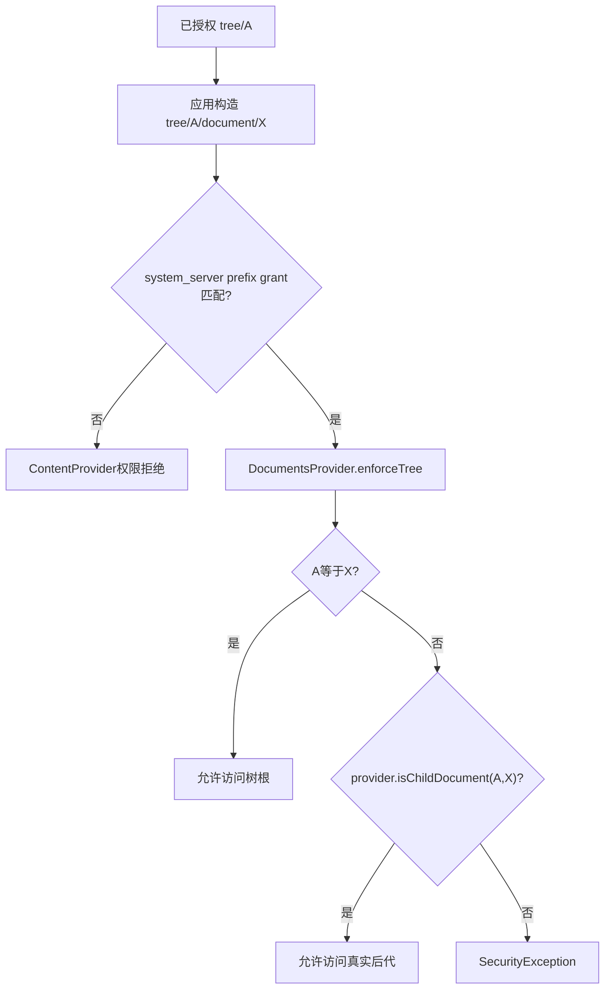

# 第543章 Android Storage Access Framework完整链：DocumentsUI、DocumentsProvider、Document URI、Tree URI与持久化授权

> 源码基线：Android 11 / API 30 / `android-11.0.0_r48`。本章直接阅读`Intent`、`DocumentsContract`、`DocumentsProvider`、`ContentProvider`、`ContentResolver`、`UriGrantsManagerService`、DocumentsUI的`PickActivity`/`ActionHandler`/`ProvidersCache`，以及`ExternalStorageProvider`与`FileSystemProvider`。只在macOS上做只读源码分析，不进行真实编译。第542章研究MediaStore的媒体行授权；本章转向用户主动挑选任意文档或目录的SAF授权模型。

## 1. 本章解决什么问题

`ACTION_GET_CONTENT`、`ACTION_OPEN_DOCUMENT`、`ACTION_CREATE_DOCUMENT`和`ACTION_OPEN_DOCUMENT_TREE`到底应该怎样选？为什么Activity结果里已有grant flags，还必须调用`takePersistableUriPermission()`？普通document URI与tree URI有什么差别？应用能否把document ID当文件路径？DocumentsUI、DocumentsProvider与system_server中的URI grant各保存哪本账？这一章从Intent发出一直追到重启后的持久授权恢复。

## 2. 一句话定位

SAF把“存储后端发现、用户导航选择、文档能力声明、字节读写和授权持久化”拆开：DocumentsUI持有系统级`MANAGE_DOCUMENTS`发现各DocumentsProvider的root并让用户选择，provider用opaque durable document ID提供查询/打开/变更能力，Activity结果只向调用应用签发窄URI grant；单文档grant只覆盖对象本身，tree grant以prefix覆盖用户选中子树但仍由provider用`isChildDocument()`验证真实后代，而跨重启访问还要由应用显式take。

## 3. 先拆开七个角色

调用应用发Intent并消费URI；DocumentsUI是系统选择器；PackageManager发现provider；DocumentsProvider代表本地盘或云盘；ContentResolver负责跨进程访问；Activity/URI grant系统发放临时能力；UriGrantsManagerService持久化已take的能力。ExternalStorageProvider只是其中一个本地后端，不等于整个SAF。

## 4. SAF总体链路



## 5. SAF不是一个文件管理器API

SAF是平台契约，DocumentsUI只是AOSP提供的交互入口；后端可能映射普通文件、云端对象、MTP设备、下载项或虚拟格式。应用得到的是`content://`能力URI，不是统一绝对路径。即使本地后端内部恰好使用File，也不能把该实现推广到云provider。

## 6. SAF也不是“申请整个存储权限”

用户每次选择具体文档或目录，系统把对应URI grant交给目标应用。应用不需要用READ/WRITE_EXTERNAL_STORAGE去读取云文档，也不会因一次选择就获得provider所有内容。tree选择范围比单文档大，但仍以用户选中的子树为边界。

## 7. 三个进程边界要记住

调用应用与DocumentsUI通常是两个进程，DocumentsUI与每个DocumentsProvider又通过ContentResolver/Binder交互，持久化grant则进入system_server的UriGrantsManagerService。选择器显示成功不等于后端操作成功；UI状态、provider状态和系统授权状态可能在不同时间变化。

## 8. 四种公开Intent先总览

GET_CONTENT偏向“拿一份内容导入当前任务”；OPEN_DOCUMENT偏向“长期引用已有文档”；CREATE_DOCUMENT让用户确定位置和名字并返回可写文档；OPEN_DOCUMENT_TREE让用户授予目录子树管理能力。它们可能使用同一DocumentsUI界面，但结果flags和允许的对象不同。

## 9. `ACTION_GET_CONTENT`适合一次性导入

DocumentsUI对该action只在结果上添加READ_URI_PERMISSION，不提供persistable或write；侧边栏还能包含声明GET_CONTENT的其他应用入口，不限DocumentsProvider root。调用者通常立即读取并复制进自己的存储。把它用于数据库中长期保存URI，进程/Activity结束后可能失去访问。

## 10. `ACTION_OPEN_DOCUMENT`适合长期引用

系统展示DocumentsProvider内容，结果提供read、write和persistable能力标志；应用若需要跨重启继续访问，必须从结果flags中取实际read/write位并调用take。没有take时，URI字符串可以保存，但临时能力不会因保存字符串而自动永久化。

## 11. `ACTION_CREATE_DOCUMENT`创建或选择输出对象

调用者必须设置具体MIME，可用`EXTRA_TITLE`建议初始名字，用户仍可修改。DocumentsUI在后台调用provider的createDocument并返回结果URI；公开Intent注释允许结果是新建空文档，也可能是符合请求类型的已有文档，因此应用应按“返回一个可写目标”理解，而不是假定全局唯一新inode。

## 12. `ACTION_OPEN_DOCUMENT_TREE`选择目录能力

结果是tree URI，并带read、write、persistable和prefix flags。应用不是直接把tree URI当children查询地址，而是用`buildDocumentUriUsingTree()`构造子文档URI、用`buildChildDocumentsUriUsingTree()`构造目录children URI。目标必须确属这棵树的后代。

## 13. 四种action对照表

| Action | 选择对象 | DocumentsUI r48结果flags | 典型用途 |
|---|---|---|---|
| GET_CONTENT | 一个/多个内容，可转交其他应用选择 | read | 立即导入副本 |
| OPEN_DOCUMENT | 一个/多个文档 | read + write + persistable | 长期引用已有文档 |
| CREATE_DOCUMENT | 一个输出文档 | read + write + persistable | 保存/导出 |
| OPEN_DOCUMENT_TREE | 一个目录子树 | read + write + persistable + prefix | 管理用户选中的目录树 |

flags表示系统愿意授予的URI模式，不保证后端当下实际支持每一种写操作；document capability flags和provider实现仍是事实来源。

## 14. `CATEGORY_OPENABLE`解决什么问题

OPEN_DOCUMENT和CREATE_DOCUMENT的公开契约要求调用者带CATEGORY_OPENABLE，以保证返回对象可用`openFileDescriptor()`打开。DocumentsUI把该category解析为`state.openableOnly`；虚拟文档会被禁选。没有它时，选择器可能允许只能通过typed stream转换读取的虚拟文档。

## 15. virtual document没有原生字节表示

`FLAG_VIRTUAL_DOCUMENT`表示文档在声明MIME下没有普通byte stream，provider必须至少提供一种`openTypedDocument()`可流化格式。调用者应先`getStreamTypes()`再用`openTypedAssetFileDescriptor()`请求支持格式。不能对virtual URI无条件调用普通FileDescriptor并假设可seek。

## 16. MIME过滤先过滤root再过滤document

调用者通过`setType()`和可选`EXTRA_MIME_TYPES`表达接受类型。DocumentsUI先按root声明的MIME重叠过滤根，再按Document MIME过滤条目。多个离散类型应把主type设为`*/*`并在extra传数组；不能把逗号拼接字符串当合法MIME集合。

## 17. 多选只适用于打开类action

PickActivity仅在OPEN_DOCUMENT或GET_CONTENT读取`EXTRA_ALLOW_MULTIPLE`。单选结果通常在Intent data，多选结果在ClipData；源码也允许ClipData恰好只有一项。消费结果时应统一先检查ClipData，再回退data，并逐项读取URI与flags。

## 18. `EXTRA_LOCAL_ONLY`过滤云root

BaseActivity把该extra写进State，ProvidersAccess排除没有`Root.FLAG_LOCAL_ONLY`的后端。它表达“不要依赖网络”的选择偏好，不保证文件永远离线可用：本地介质仍可能弹出，provider也可能动态失效。

## 19. `EXTRA_INITIAL_URI`只是best effort

DocumentsUI识别root URI或document/tree URI，尝试跳到该root、目录或目标父目录；找不到authority、document、父路径或权限不合适时会回退默认位置。应用不能把初始URI当作强制限定用户只能在某目录选择。

## 20. 不同action的默认落点不同

r48的picker在没有可恢复last stack或initial URI时：CREATE加载Home，OPEN_TREE加载设备root，OPEN/GET_CONTENT加载Recents。last accessed stack还按调用包保存，所以两款应用进入选择器时可能看到不同上次位置。

## 21. PickActivity把Intent解析成State

它把四个Intent action映射成ACTION_OPEN、CREATE、GET_CONTENT、OPEN_TREE，读取acceptMimes、allowMultiple和openableOnly，并在Android R打开跨profile支持。后续root过滤、条目是否可选、底部按钮和结果flags都读取同一State。

## 22. State不是授权本身

State保存action、MIME、当前DocumentStack、localOnly、openableOnly、restrictScopeStorage和多选等UI会话信息，旋转时Parcelable恢复。它不在system_server中，也不等于UriPermission；选择器进程被杀后，真正已经发出的grant仍由系统授权账管理。

## 23. DocumentsProvider怎样被发现

ProvidersCache对每个可交互user调用PackageManager的`queryIntentContentProviders()`，action为`android.content.action.DOCUMENTS_PROVIDER`。然后按authority取得ProviderInfo并查询`content://authority/root`。普通应用不会自己枚举这些root来绕过用户UI。

## 24. provider manifest必须满足三项安全条件

provider必须exported、`grantUriPermissions=true`，且read/write permission都为signature级`MANAGE_DOCUMENTS`。DocumentsProvider.attachInfo和DocumentsUI ProvidersCache都会交叉检查。这样只有系统选择器能浏览全部root，普通应用只能凭系统后来发出的窄URI grant访问选中对象。

## 25. root不是顶层目录路径

Root可以代表一块物理盘、一个云账号或任意导航入口，至少包含rootId、title、代表顶层目录的documentId和flags。rootId与documentId可不同，二者都由provider解释；应用不能从root title或ID推导磁盘挂载路径。

## 26. root flags是后端能力摘要

SUPPORTS_CREATE决定是否适合作为创建目的地，LOCAL_ONLY用于本地过滤，SUPPORTS_RECENTS/SEARCH/IS_CHILD决定可选查询能力，EMPTY可在打开场景隐藏，REMOVABLE与EJECT描述介质。它们用于UI与预期，不是替代每次调用的真实错误处理。

## 27. ProvidersCache不是每次打开都同步扫所有云盘

DocumentsApplication启动后异步更新roots；ProvidersCache会先查ContentResolver放在长生命周期系统进程中的cache，未命中才用unstable ContentProviderClient查询provider。成功结果写回system cache，包或URI变化由系统负责失效。

r48还有一个只在启用Java assert时明显的源码错位：合成Recents root实际包含`LOCAL_ONLY | SUPPORTS_IS_CHILD | SUPPORTS_SEARCH`，而`updateAsync()`里的assert漏写SUPPORTS_SEARCH。release通常不执行assert，运行时root仍带search；不能根据这条过期断言反推Recents不支持搜索。

## 28. root变化通过observer收敛

Cache为每个authority的roots URI注册ContentObserver。provider账号登录、介质挂载或root flags变化时应notify roots URI，DocumentsUI只刷新对应authority。包添加、改变、删除、清数据、locale与managed profile变化也触发不同范围重载。

## 29. root加载有两个不同超时

DocumentsApplication给provider client设置20秒not-responding检测；ProvidersCache等待第一次全量load最多15秒，超时只记录警告。它们分别针对单provider ANR与UI等待全局cache，不应混成“SAF统一15秒操作超时”。普通openDocument的网络超时还由具体provider负责。

## 30. root还要按当前请求二次过滤

OPEN_TREE排除Recents以及不支持children的root；OPEN/GET_CONTENT排除EMPTY；LOCAL_ONLY排除云root；MIME无交集的root被排除；跨profile能力不足的root被排除；调用包自己的authority也可排除，避免选择器递归展示自身后端。

## 31. DocumentsUI结果flags的真实源码

```java
if (mState.action == ACTION_GET_CONTENT) {
    intent.addFlags(Intent.FLAG_GRANT_READ_URI_PERMISSION);
} else if (mState.action == ACTION_OPEN_TREE) {
    intent.addFlags(Intent.FLAG_GRANT_READ_URI_PERMISSION
            | Intent.FLAG_GRANT_WRITE_URI_PERMISSION
            | Intent.FLAG_GRANT_PERSISTABLE_URI_PERMISSION
            | Intent.FLAG_GRANT_PREFIX_URI_PERMISSION);
} else {
    intent.addFlags(Intent.FLAG_GRANT_READ_URI_PERMISSION
            | Intent.FLAG_GRANT_WRITE_URI_PERMISSION
            | Intent.FLAG_GRANT_PERSISTABLE_URI_PERMISSION);
}
mActivity.setResult(Activity.RESULT_OK, intent, 0);
```

内部copy destination有独立分支，不向外延长权限。对公开action，系统在Activity result投递时读取data/ClipData与这些flags，把对应临时grant发给原调用应用；不是DocumentsUI把一个permission字符串写进URI。

## 32. grant flags与document flags是两本账

Intent的READ/WRITE/PERSISTABLE/PREFIX描述URI授权模式；Document的SUPPORTS_WRITE/DELETE/RENAME等描述后端能力。例如OPEN_DOCUMENT结果可能携带write grant，但文档的SUPPORTS_WRITE为0，调用`openOutputStream()`仍不应期待成功。先看授权能否调用，再看对象能否执行该动作。

## 33. GET_CONTENT为何能展示其他应用

RootsFragment在GET_CONTENT时`includeApps=true`，侧边栏可加入响应GET_CONTENT的普通Activity，例如照片应用。选择这些入口时DocumentsUI把原Intent转发给目标Activity。OPEN_DOCUMENT只走DocumentsProvider模型，才能提供统一durable ID与persistable grant契约。

## 34. 转发到其他GET_CONTENT应用前会清grant flags

DocumentsUI复制原Intent后移除read、write、persistable和prefix flags，再添加FORWARD_RESULT与PREVIOUS_IS_TOP。目标应用应基于自己返回的content URI授予适当访问，不能继承调用者企图塞给DocumentsUI的宽授权标志。

## 35. 单选和多选结果的承载不同

`onPickFinished()`在一项时设置Intent data，多项时创建ClipData并逐项加入URI；随后统一添加flags。调用者只读`data`会漏掉真正多选；只读ClipData又会漏掉常规单选。结果码非RESULT_OK时两者都不应使用。

## 36. `setResult()`本身不等于provider创建了长期账户

Activity结果发送时系统创建临时URI grant，通常与接收组件/任务生命周期关联；Provider数据库并不会因此新增“应用可访问”列。对DocumentsProvider而言，后续ContentProvider权限检查把URI grant作为MANAGE_DOCUMENTS之外的最后通道。

## 37. 临时grant保存URI模式而不是文件句柄

关闭当前ParcelFileDescriptor不一定撤销URI grant，保存URI字符串也不会延长它。grant让未来某段生命周期内的新ContentResolver调用通过；fd则是一次已打开I/O通道。即使grant仍在，介质弹出或云对象删除也可令再次open失败。

## 38. persistable只是“可被take”的邀请

OPEN_DOCUMENT/CREATE/TREE结果带PERSISTABLE，表示系统允许接收者把实际read/write模式升级为持久账。若应用从不调用take，临时grant照常使用但不跨重启保证。GET_CONTENT结果没有这个位，事后调用take会因没有persistable offer而抛SecurityException。



## 39. `takePersistableUriPermission()`源码入口

```java
public void takePersistableUriPermission(Uri uri, int modeFlags) {
    Objects.requireNonNull(uri, "uri");
    try {
        UriGrantsManager.getService().takePersistableUriPermission(
                ContentProvider.getUriWithoutUserId(uri), modeFlags,
                null, resolveUserId(uri));
    } catch (RemoteException e) {
        throw e.rethrowFromSystemServer();
    }
}
```

ContentResolver移除URI中嵌入的userId并单独解析源user，真正校验与落盘在system_server。调用应用只能为自己take；指定其他包的隐藏重载需要`FORCE_PERSISTABLE_URI_PERMISSIONS`。

## 40. take时只传结果真正给出的read/write位

推荐取`resultIntent.getFlags() & (READ_URI_PERMISSION | WRITE_URI_PERMISSION)`，再调用take。modeFlags只允许read/write；把PERSISTABLE或PREFIX自身传进去会被flags参数校验拒绝。不要无条件请求write，因为未来选择器或其他合法来源可能只提供read。

## 41. system_server会验证“确实有人offer过”

UriGrantsManagerService同时找exact与prefix grant，要求请求的每一位都包含在其`persistableModeFlags`中；两者都不满足便抛SecurityException。调用take不能把临时read凭空升级成持久write，也不能把普通非persistable content URI变永久。

## 42. read与write可以独立take和release

UriPermission把read/write作为bit保存。应用可只take read，稍后在仍有offer时take write；release也可只释放write而保留read。`releasePersistableUriPermission()`只撤persisted部分，当前仍存在的non-persistent owner/global grant不会被它顺带删除。

## 43. `getPersistedUriPermissions()`只列入站持久授权

它返回“授予给当前应用且已经take”的列表，每项包含URI、read/write状态与persistedTime；临时grant不在其中。`getOutgoingPersistedUriPermissions()`列当前包作为source provider发出的持久授权，两者方向不能混用。

## 44. release是应用主动清理长期能力

用户在应用里移除已链接文件、退出云同步或不再需要目录树时，应按保存的mode释放并删除业务记录。若URI从未take或已经完全不存在，普通调用者release会抛SecurityException；因此可以先枚举persisted列表或维护严谨的本地授权账。

## 45. “跨重启”不等于“对象永远存在”

持久grant只让授权记录在系统重启后恢复。源provider可能卸载、换authority、删除对象、退出账号、弹出SD卡，用户也可在系统设置或provider侧撤销。每次访问仍需处理SecurityException、FileNotFoundException和RemoteException等实际失败。

## 46. UriPermission内部有四类模式账

`ownedModeFlags`绑定Activity/服务等permission owner，`globalModeFlags`是非owner临时grant，`persistableModeFlags`表示被允许持久化的最大范围，`persistedModeFlags`表示应用实际take的范围；最终`modeFlags`是前三类有效访问来源的并集。PERSISTABLE本身不是read/write权限。

## 47. Android 11每个UID最多保留512个持久grant

UriGrantsManagerService的上限常量为512。新take后若超限，系统按persistedCreateTime排序，释放最旧项直到回到上限。大量逐文件长期引用可能导致旧grant被自动裁剪；能合理使用一个tree grant时，不必为每个后代再take一个narrow URI。

## 48. 重复take会“touch”，但r48落盘有细节

公开注释说重复take会刷新persistedTime；`takePersistableModes()`确实每次写当前时间，但返回值只在mode bits变化时为true，service也只在“变化或裁剪”时安排XML写入。因此同一位重复take会更新本次开机内存时间，却可能不单独触发持久化，重启后仍看到旧时间。这是r48实现边界，不应把时间当绝对LRU审计日志。

## 49. 持久grant怎样跨重启恢复

system_server异步用AtomicFile写每条source user/package、target user/package、URI、prefix、mode与createdTime；启动读取时重新确认authority仍属于原source package、目标包仍能解析，才恢复UriPermission。缺失文件被视为没有grant，损坏读取会记录严重日志。

## 50. 包和用户生命周期仍能清理授权

source或target包卸载/清数据、user移除、provider主动revoke或文档删除都会让相关grant被移除或不可用。XML不是应用私有备份文件，也不随应用数据任意迁移；重新安装同包名不应假定自动继承旧文档能力。

## 51. SAF常见URI有四种语法

root URI形如`content://authority/root/rootId`；narrow document URI形如`content://authority/document/docId`；children URI形如`.../document/parentId/children`；tree访问形如`content://authority/tree/treeId/document/docId`及其`children`。路径片段是协议结构，不是磁盘层级。

## 52. root URI主要供系统选择器发现

DocumentsUI凭MANAGE_DOCUMENTS查询roots与recent/search；普通应用通常不持有该signature权限。用户选中文档后返回document/tree URI，而不是把root URI授权给应用让它任意遍历账号。

## 53. narrow document URI只引用一个对象

查询它应返回Document列的一行，打开它只处理该documentId。即使对象是目录，拥有目录的narrow URI也不自动等于所有后代prefix grant；列出children URI还需要相应访问政策。需要管理子树应让用户走OPEN_DOCUMENT_TREE。

## 54. children URI表示一次目录枚举

`buildChildDocumentsUri(authority, parentId)`调用provider的queryChildDocuments，只应返回直接孩子，不递归返回所有后代。云provider可先返回本地缓存，并在Cursor extras设EXTRA_LOADING，再notify触发UI重新查询完整数据。

## 55. tree URI同时携带“授权根”和“当前对象”

`tree/<treeId>/document/<documentId>`中treeId是用户批准的根，documentId是本次操作目标。访问树根时两者相同；进入孩子后只改变documentId，保留treeId。不要用字符串替换自行拼URI，应调用DocumentsContract builder正确编码opaque ID。

## 56. builder不会替你证明后代关系

`buildDocumentUriUsingTree(treeUri, arbitraryId)`只组装URI，不向provider查询。真正请求到达DocumentsProvider时，`enforceTree()`比较treeId和documentId；不同则调用provider的`isChildDocument()`。应用能构造字符串，不代表能通过语义授权。

## 57. prefix grant与`isChildDocument()`是双保险

system_server的prefix grant让同一tree URI前缀的后续请求通过ContentProvider基础URI权限检查；DocumentsProvider再检查目标ID是否真是后代。前者保护调用链入口，后者防止攻击者在相同URI外壳里塞入同provider的另一个无关documentId。



## 58. DocumentsProvider的tree校验源码

```java
private void enforceTree(Uri documentUri) {
    if (documentUri != null && isTreeUri(documentUri)) {
        final String parent = getTreeDocumentId(documentUri);
        final String child = getDocumentId(documentUri);
        if (Objects.equals(parent, child)) return;
        if (!isChildDocument(parent, child)) {
            throw new SecurityException(
                    "Document " + child + " is not a descendant of " + parent);
        }
    }
}
```

query、getType、open、typed open以及平台call中的URI都会进入此检查。只检查URI前缀而不实现真实后代判断，会破坏tree隔离。

## 59. `isChildDocument()`默认返回false

自定义DocumentsProvider若要支持tree后代访问必须正确override，并尽量避免网络请求保持快速。根对象自身因parent等于child直接通过；任何真正子孙在默认实现下都会失败。root的SUPPORTS_IS_CHILD flag也应与真实实现一致。

## 60. document ID必须opaque、唯一、耐久

ID由provider生成和解释，在同一provider内唯一，返回后必须尽量稳定，因为长期URI grant以它定位对象。一个对象可同时出现在多个目录，所以ID不是必然等于单一路径。客户端应保存完整URI，不能解析冒号、斜杠或云端主键格式。

## 61. durable不等于永不变化

重命名或移动时，某些provider无法保持原ID。DocumentsProvider允许rename/move返回newDocumentId，框架据此返回新URI并迁移narrow grant；应用必须用返回URI替换旧值。provider若能保持ID则返回null，DocumentsContract.renameDocument会继续返回原URI。

## 62. Document必需列构成最小元数据

document_id、mime_type、display_name、last_modified、flags和size构成核心列，其中时间与size可因未知而null。所有列对普通client都是只读；修改名字、删除或移动要走DocumentsContract平台call，而不是ContentResolver.update()写列。

## 63. capability flags是“预期成功提示”

SUPPORTS_WRITE、DELETE、RENAME、COPY、MOVE、REMOVE、THUMBNAIL、METADATA、WEB_LINKABLE、PARTIAL和VIRTUAL等让DocumentsUI隐藏或启用动作。后端状态可在查询后变化，最终调用仍可能失败；应用不能只缓存flags永远不重新查询。

## 64. write URI grant不等于`FLAG_SUPPORTS_WRITE`

前者回答“调用身份能否向provider发写请求”，后者回答“这个对象的字节是否预计可写”。OPEN_DOCUMENT按契约授read+write grant，但只读云对象仍可返回SUPPORTS_WRITE=0；ContentProvider权限通过后，provider的openDocument仍可抛UnsupportedOperationException或FileNotFoundException。

## 65. 目录创建能力是另一枚flag

只有目录且设置`FLAG_DIR_SUPPORTS_CREATE`时，客户端才应调用createDocument；Root.SUPPORTS_CREATE只说明这个root内至少某处可创建，不保证根目录本身或每个子目录可创建。选择器会结合两层flag决定是否展示保存位置和新建目录按钮。

## 66. `FLAG_DIR_BLOCKS_OPEN_DOCUMENT_TREE`只阻止这一目录

契约明确：该flag本身不自动阻止父目录或孩子被选。若provider必须保证某敏感目录永远不被tree间接覆盖，需要让它及所有祖先都受阻，或不把敏感节点暴露在可授权树中。它是UI选择限制，不替代`isChildDocument()`与底层访问控制。

## 67. DocumentsProvider.attachInfo先审计声明

基类注册authority和root/document/tree URI matcher，然后验证exported、grantUriPermissions及双向MANAGE_DOCUMENTS。声明错误直接抛SecurityException，避免一个看似SAF provider实际以普通exported ContentProvider形式暴露全库。

## 68. 普通应用直接query roots为何失败

ContentProvider基础检查先要求MANAGE_DOCUMENTS；普通第三方拿不到signature权限，也尚无roots URI grant，于是抛SecurityException，并提示应通过OPEN_DOCUMENT等API取得访问。DocumentsUI拥有系统权限，才能代表用户发现和导航全部后端。

## 69. 用户选择后的URI grant是最后通道

ContentProvider的read/write enforcement先检查同UID、manifest permission与path permission，最后调用Context.checkUriPermission。普通应用没有MANAGE_DOCUMENTS，但精确或prefix grant命中时仍可访问对应URI。SAF因此无需把系统signature权限授给每个应用。

## 70. DocumentsProvider将通用query路由到专用方法

roots、recent、search、document和children URI分别调用`queryRoots()`、`queryRecentDocuments()`、`querySearchDocuments()`、`queryDocument()`与`queryChildDocuments()`。子类实现文档语义，不应把它当普通SQLite ContentProvider去override insert/update/delete。

## 71. 旧式raw query入口在基类中直接拒绝

两个pre-Android-O selection/sortOrder形式抛UnsupportedOperationException，主传输是Bundle query overload。现代ContentResolver会把旧五参数API转换成Bundle后跨进程调用，因此应用API仍可工作；provider作者应实现DocumentsProvider列出的专用query，而不是依赖传统selection。

## 72. query中的FileNotFoundException被翻成null Cursor

基类主query路由捕获FileNotFoundException、记录警告并返回null。调用者必须同时处理null与空Cursor：null可能是目标消失或provider问题，空Cursor是合法无结果。不能无条件`cursor.moveToFirst()`。

## 73. 云provider可渐进返回目录

queryChildDocuments可以先返回缓存项，并在Cursor extras中设置`EXTRA_LOADING=true`；数据到达后对notification URI发notify。DocumentsUI的Model读取loading状态并注册observer重载。一次Cursor不是永远完整快照，尤其不能以“暂时0行”马上删除云端同步关系。

## 74. search参数由root声明能力

Root.COLUMN_QUERY_ARGS可声明display name、MIME、大小、修改时间和exclude media等参数；provider应在Cursor extras回报EXTRA_HONORED_ARGS。没有声明或没有honor的筛选不能假定已经在服务器端完成，DocumentsUI还可能在本地包装Cursor排序过滤。

## 75. openDocument必须至少支持只读

provider抽象方法接收documentId、`r/w/rw`等mode和CancellationSignal。只读或只写可以返回pipe/socket，`rw`意味着可seek的正常文件语义。调用者若要随机访问必须明确需要rw并处理UnsupportedOperationException，不能把所有ParcelFileDescriptor都当磁盘fd。

## 76. CancellationSignal需要provider主动配合

云端下载若阻塞，provider应定期检查signal取消。跨进程取消只是通知机制，不会强制杀死provider线程；实现忽略signal时，调用者取消UI也可能留下后台I/O。DocumentsUI对provider设置ANR检测也不等于每个网络请求会被自动中断。

## 77. 认证过期可抛`AuthenticationRequiredException`

云账号需要重新登录时，query/open等方法可以携带IntentSender要求用户认证，但注释明确客户端未必正确处理。应用既要处理这个专用异常，也要对普通SecurityException和FileNotFoundException提供重新选择或重新登录入口。

## 78. typed open是虚拟文档的出口

基类先处理thumbnail size hint；请求`*/*`或原始MIME已匹配时回退普通read open，否则调用子类`openTypedDocument()`做格式转换。虚拟文档必须声明至少一个stream type，CATEGORY_OPENABLE场景则在picker中直接禁选它。

## 79. thumbnail与metadata也是能力调用

只有SUPPORTS_THUMBNAIL或SUPPORTS_METADATA时才应调用相应API。thumbnail返回AssetFileDescriptor，可能包含EXIF旋转extra；metadata是Bundle，可含EXIF或目录tree count/size。它们不是Document查询必需列，provider可以不实现。

## 80. create/rename/delete为何不用普通CRUD

DocumentsProvider把insert/update/delete final化并拒绝，DocumentsContract helpers通过`content.call()`发送标准`android:` method与URI extras。基类统一做authority、tree和read/write permission检查，再调用provider语义方法。这样rename可返回新ID，move可同时表达源父与目标父。

## 81. create需要父目录write权限

METHOD_CREATE_DOCUMENT先对parent document URI执行write enforcement，再传parentId、MIME和displayName给provider；结果用`buildDocumentUriMaybeUsingTree()`返回。tree调用者已有prefix grant，因此新孩子自然继续落在授权树形URI中，不必为每个新文件另发narrow grant。

## 82. rename若更换ID会处理narrow grant

基类对原URI检查write；provider返回新ID时，若结果不是tree URI，框架读取调用者在旧URI上的read/write/persistable模式，向同包授新narrow URI，再revoke旧documentId的grant。应用仍必须保存返回URI，不能继续使用旧ID。

## 83. delete会主动撤销文档grant

provider成功delete后，基类调用`revokeDocumentPermission(documentId)`，同时撤销narrow document URI与以该ID为tree根的URI授权。持久记录也会随revoke失效；仅从应用本地列表移除URI而不release，不影响provider执行删除时的全局撤销。

## 84. copy与move需要不同权限组合

copy要求源read、目标目录write；move要求源对象write、源父read、目标父write。它们都限定在同一DocumentsProvider method call authority，跨provider复制通常由DocumentsUI服务打开源stream并在目标create/write，而不是调用一个provider的copyDocument跨authority。

## 85. remove与delete的区别来自多父目录

一个document可出现在多个目录。removeDocument只把它从指定parent解除，要求parent read和document write；对象可能仍存在于其他parent，所以基类不自动revoke grant，把是否撤销交给provider。deleteDocument则让对象整体失效并自动清grant。

## 86. DocumentsContract helper会做兼容错误翻译

create/rename/delete/copy/move等helper捕获异常、记录日志，再通过`rethrowIfNecessary()`决定是否抛出；target O及以上会重新抛Parcelable中的FileNotFound、Remote runtime或RuntimeException，旧target可能得到null/false。相同provider故障在不同target应用上可能表现不同。

## 87. ExternalStorageProvider只是文件型示例

它把已挂载emulated、public与stub volume建成roots，primary rootId为`primary`，可移除盘通常用fsUuid；docId格式在r48实现中是`root:path/to/file`。这是该provider私有格式，客户端仍必须把ID视为opaque，不能用它构造任意本地路径。

## 88. 本地provider维护internal path与visible path

RootInfo同时保存系统内部路径`path`和应用可见路径`visiblePath`，但r48的`buildFile(root, docId, visible, ...)`实际上没有使用`visible`参数：只要`visiblePath`非null便总选它，否则回退`path`。因此名为`beforeVisibleFile`的调用结果可能与普通`getFileForDocId()`完全相同，不能仅凭参数名断言发生了internal→visible双路径切换；某些volume的visiblePath为null时才统一落到internal path。

## 89. 文件型`isChildDocument()`先canonicalize

FileSystemProvider把parent和target都解析为File并取canonicalFile，再用FileUtils.contains判断。canonical化避免`..`和符号链接式路径混淆直接逃出树。自定义云provider没有File可用，也必须在自己的对象图中提供同等可靠的后代判断。

## 90. Android 11给OPEN_TREE增加compat限制

DocumentsUI定义change ID 141600225，`@EnabledAfter(Q)`，也就是target R及以上默认开启`restrictScopeStorage`；旧target或compat override可保持旧选择行为。限制由“调用包target/compat”决定，不是简单读取设备Android版本后对所有应用完全相同。

## 91. 限制是provider标flag、DocumentsUI执行

ExternalStorageProvider的FileSystemProvider在目录行上设置`FLAG_DIR_BLOCKS_OPEN_DOCUMENT_TREE`，PickFragment只有在OPEN_TREE且restrictScopeStorage为true时禁用确认按钮并覆盖提示。provider能力数据与调用者compat状态共同决定最终UI。

## 92. r48具体阻止哪些本地目录

ExternalStorageProvider把存储root、Download目录和Android目录标为blocked。由于Android父目录不可被选作tree根，普通target R应用也不能通过它间接获得Android所有孩子。限制针对目录树选择，不妨碍用户在合适action中选择允许公开的单个文件。

## 93. USB root是源码中的明确例外

`shouldBlockFromTree()`先检查Root.FLAG_REMOVABLE_USB，命中便返回false，包括USB根目录。SD卡root不享受这条特例，仍会因path为空被blocked。教程若只写“Android 11任何存储根都不可选”会与r48源码不符。

## 94. `Android/data`、`obb`和`sandbox`还会被隐藏

FileSystemProvider的正则识别每个storage根下这三个直接目录，普通`queryChildDocuments()`用`shouldShow()`过滤，不把它们加入Cursor；managed mode另有show-all入口，仅供系统文件管理语境。普通第三方picker看不到这些敏感目录条目。

## 95. 隐藏与block是两种不同机制

block目录仍可显示和进入，只是不能按OPEN_TREE确认它；hide目录连普通children枚举都不返回。Android父目录被block，data/obb/sandbox子项被hide，两层共同收紧UI。它们仍不是普通应用获得MANAGE_DOCUMENTS的替代权限。

## 96. 不要把UI过滤表述成所有历史URI立即失效

这段源码主要控制新选择和普通枚举；已有持久grant还受到system_server记录、provider tree校验、对象存在性、进程mount视图与后续revoke共同约束。分析升级问题时必须实际检查`getPersistedUriPermissions()`并尝试访问，不能只看按钮禁用就断言所有旧grant已清零。

## 97. 本地create会同步触发MediaStore扫描

FileSystemProvider sanitize名字、创建唯一文件或目录、取得新docId并调用`MediaStore.scanFile()`。这说明一个SAF文档可以同时进入MediaStore索引，但Document URI与MediaStore URI仍是两套authority和grant；扫描成功不会把SAF tree grant变成MediaStore写权限。

## 98. 本地写fd关闭后再扫描

只读或没有visible path时直接open；可见本地文件以写模式打开时挂OnCloseListener，关闭后通知docId变化并广播扫描visible file。数据库元数据更新发生在字节写完之后，close之前查询MediaStore可能仍看到旧size或MIME。

## 99. rename/move要让MediaStore两端收敛

FileSystemProvider重命名或移动真实文件，计算新docId并通知旧新ID；随后对old visible与new visible分别scan，使旧索引消失、新索引出现。文件rename与两次扫描不在统一事务内，短暂双行或空窗需要调用者容忍。

## 100. delete还要清MediaStore行

目录先递归删内容，目标文件删除后通知docId失效；对有visible path的对象，Provider清Binder身份，查询MediaStore Files中目标路径及目录后代，并删除对应索引。SAF删除是文件事实，MediaStore只是随后同步的索引事实。

## 101. SAF与MediaStore不能互相替代

MediaStore按媒体collection、owner与媒体状态提供结构化索引；SAF按用户选中的任意document/tree发能力URI。前者适合媒体库浏览和pending发布，后者适合用户明确选文件/目录及云provider。即使两条URI指向同一个JPEG，授权、列、持久化和删除副作用都不同。

## 102. tree grant不是“目录路径白名单”

它绑定authority、source/target user、target package、URI前缀和read/write模式，并由provider检查document图后代。目录被移动、ID改变、账号切换或authority替换时，原grant可能不再定位同一内容。业务数据库应保存URI与权限模式，并为失效设计重新选择流程。

## 103. 使用Document URI前先做最小查询

查询document MIME、display name、flags、size与last modified，验证对象仍存在且能力满足；不要尝试查询DATA绝对路径。随后按需要open read/write或调用DocumentsContract helper。对云对象尤其要处理null Cursor、loading、认证、取消和非seek fd。

## 104. GET_CONTENT的可靠应用流程

构造MIME与CATEGORY_OPENABLE，需要时允许多选；RESULT_OK后逐项在当前授权生命周期内打开InputStream并复制到应用自有存储；复制完成关闭stream。若产品需要未来重新打开原文档，改用OPEN_DOCUMENT而不是试图take一个未被offer的GET_CONTENT URI。

## 105. OPEN_DOCUMENT的可靠持久流程

收到结果后取实际read/write flags，立刻take需要的位，再把完整URI与实际mode存入本地数据库；启动或同步时用persisted列表对账，query元数据并打开；用户解除关联时release。take失败时不要只保存字符串，应提示重新选择或降级为本次会话读取。

## 106. OPEN_TREE的可靠管理流程

take tree结果的实际模式，保存原tree URI；查询根document时用`buildDocumentUriUsingTree(treeUri, getTreeDocumentId(treeUri))`，列孩子用children builder；递归时只使用provider返回的documentId继续构造，绝不猜ID。每次mutation检查Document flags与错误结果。

## 107. CREATE_DOCUMENT的可靠写入流程

设置具体MIME、CATEGORY_OPENABLE和建议title；拿到URI后按结果flags take（若需要长期访问），用`openFileDescriptor(uri,"w")`完整写入并可靠关闭，再query确认size/name。用户可能选择已有目标，产品需要明确覆盖提示和truncate/append模式。

## 108. 常见失败矩阵

| 表现 | 更可能的层 | 处理方向 |
|---|---|---|
| 选择器找不到root | provider discovery/cache/root flags/MIME/localOnly | 刷新账号、介质、过滤条件 |
| RESULT_CANCELED | 用户取消或选择器未完成 | 不访问空data |
| take抛SecurityException | 未offer persistable或请求了多余mode | 使用结果flags、换OPEN_DOCUMENT |
| query为null | document消失/FileNotFound/provider异常 | 重新选择或重试后端 |
| SecurityException | grant缺失、tree越界或已撤销 | 不猜URI，检查persisted grant |
| open不支持 | virtual、只读、mode不支持 | 看flags/stream types，选择正确模式 |

## 109. 文档删除和授权撤销有竞态

应用可能在query flags后、open前遇到远端删除；provider也可能rename并返回新ID，旧grant随后revoke。把“先检查权限”与“真正I/O”视为同一原子操作是TOCTOU误区。最终open/call的异常才决定此次操作是否成功。

## 110. 并发和provider死亡不会由SAF自动业务重试

ContentResolver可管理provider引用和部分DeadObject恢复，但create/delete/move等有副作用操作不应盲目重放；云provider也可能已在远端成功后本地Binder断开。应用需要幂等业务ID、重新query和用户可理解的冲突处理，而不是收到RemoteException就无限重试。

## 111. 阅读本链固定七问

看到一个SAF URI时问：来自哪个action？是root、narrow document还是tree？结果实际给了哪些mode？是否已经take？provider声明什么flags？treeId与documentId是否相同或真实后代？目标是本地文件、云对象还是virtual stream？这次失败来自UI过滤、URI grant、provider能力还是对象生命周期？

## 112. macOS只读练习一：比较四种picker结果

```bash
cd /Users/ninebot/androidSource && sed -n '3820,3945p' frameworks/base/core/java/android/content/Intent.java && sed -n '230,275p' packages/apps/DocumentsUI/src/com/android/documentsui/picker/PickActivity.java && sed -n '404,452p' packages/apps/DocumentsUI/src/com/android/documentsui/picker/ActionHandler.java
```

列出每个action的对象、MIME、多选、openableOnly和返回flags；解释GET_CONTENT为何只有read，而OPEN_TREE为何多出prefix。

## 113. macOS只读练习二：验证tree不是字符串前缀就够

```bash
cd /Users/ninebot/androidSource && sed -n '190,245p' frameworks/base/core/java/android/provider/DocumentsProvider.java && sed -n '930,1070p' frameworks/base/core/java/android/provider/DocumentsContract.java && sed -n '120,155p' frameworks/base/core/java/com/android/internal/content/FileSystemProvider.java
```

构造tree root、root document、children和孙级document四类URI，指出builder做什么、ContentProvider grant做什么、`enforceTree/isChildDocument`又做什么。

## 114. macOS只读练习三：追持久grant落盘

```bash
cd /Users/ninebot/androidSource && sed -n '2835,2935p' frameworks/base/core/java/android/content/ContentResolver.java && sed -n '340,445p' frameworks/base/services/core/java/com/android/server/uri/UriGrantsManagerService.java && sed -n '100,195p' frameworks/base/services/core/java/com/android/server/uri/UriPermission.java
```

手算临时read、persistable read/write offer、只take read、再release read四个状态；找到512上限和重复take时间更新为何不一定单独触发XML写入。

## 115. macOS只读练习四：核对Android 11目录限制

```bash
cd /Users/ninebot/androidSource && sed -n '145,190p' packages/apps/DocumentsUI/src/com/android/documentsui/base/Shared.java && sed -n '285,338p' frameworks/base/packages/ExternalStorageProvider/src/com/android/externalstorage/ExternalStorageProvider.java && sed -n '580,675p' frameworks/base/core/java/com/android/internal/content/FileSystemProvider.java
```

分别记录target门槛、root/Download/Android的block、USB例外、data/obb/sandbox的hide，并解释block与hide为何不能互换。

## 116. 四个练习应得到的答案

练习一应得出GET_CONTENT是临时导入而OPEN/CREATE/TREE可offer持久化；练习二应看到prefix URI授权后仍需provider真实后代验证；练习三应把persistableMode与persistedMode拆开并发现512项裁剪；练习四应写出“target R compat + 目录flag + UI禁选”和“provider枚举隐藏”两套机制，以及USB root的r48例外。

## 117. 十四个常见误解速查

SAF不是文件路径API；DocumentsUI不是storage backend；root URI不是用户最终文件URI；documentId不是绝对路径；directory narrow grant不是tree grant；tree builder不证明后代；prefix不替代isChildDocument；PERSISTABLE不等于已take；GET_CONTENT不能事后强行持久化；write grant不保证SUPPORTS_WRITE；跨重启不保证对象存在；512上限不是无限；block不等于hide；SAF URI与MediaStore URI不是同一授权。

## 118. 推荐源码阅读地图

公开action看`frameworks/base/core/java/android/content/Intent.java`；URI、列、flags和helper看`DocumentsContract.java`；provider安全与tree/call路由看`DocumentsProvider.java`和`ContentProvider.java`；picker看DocumentsUI的`PickActivity`、picker `ActionHandler`、`ProvidersCache`；持久授权看`ContentResolver`、`UriGrantsManagerService`与服务端`UriPermission`；本地盘实例看`ExternalStorageProvider`和`FileSystemProvider`。

## 119. 复读后专门修正的难点

第一，修正“结果带PERSISTABLE就已经永久”为必须显式take；第二，区分persistable offer与实际persisted bits；第三，补出GET_CONTENT只返回read且可转发普通应用，不能当OPEN_DOCUMENT替代；第四，修正“tree URI字符串前缀足够”为还需isChildDocument；第五，限定document ID durable但rename/move可返回新ID；第六，区分write grant与SUPPORTS_WRITE；第七，修正“所有storage root都禁止”为USB root例外；第八，区分root/Download/Android的block与data/obb/sandbox的hide；第九，不把新选择UI限制写成所有历史grant必然已撤；第十，记录重复take时间在r48可能只更新内存、不单独安排XML写入；第十一，说明FileNotFound query可返回null；第十二，确认Recents实际带SUPPORTS_SEARCH而邻近assert漏项；第十三，纠正`buildFile()`的visible参数在r48未被使用，不能按变量名虚构双路径切换；第十四，强调本地文件操作与MediaStore扫描不是共同事务。

## 120. 本章小结与下一章入口

SAF的安全来自三段收窄：DocumentsUI凭MANAGE_DOCUMENTS浏览所有合法root，让用户决定对象；Activity result只给目标应用精确document或prefix tree grant；DocumentsProvider再用opaque durable ID、capability flags和`isChildDocument()`执行真实对象边界。需要跨重启时，应用必须take实际read/write位并维护授权账，同时容忍provider、介质和对象失效。下一章将继续深入`ExternalStorageProvider`与`FileSystemProvider`，详解docId到本地路径映射、目录观察、文件CRUD、Downloads/MediaStore同步与多volume边界。
