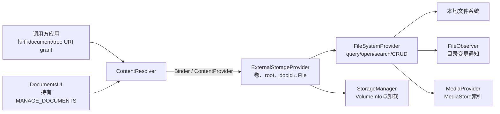
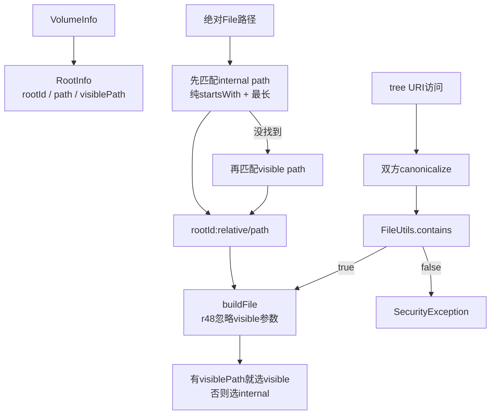
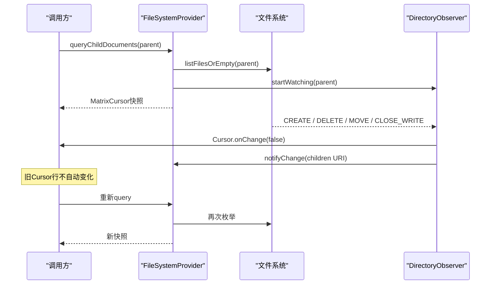

# 第544章 Android ExternalStorageProvider与FileSystemProvider完整链：多卷Root、docId路径映射、目录观察、文件CRUD与MediaStore同步

> 源码版本：Android 11 / API 30 / `android-11.0.0_r48`  
> 本章定位：承接第543章SAF通用契约，进入“本机存储”这个具体DocumentsProvider实现。  
> 阅读目标：不编译系统，只靠源码把StorageManager卷、SAF root/document、真实文件、Cursor通知和MediaStore索引串成一条可验证的链。

## 1. 本章先回答什么

当系统文件选择器显示“内部存储”“SD卡”“USB盘”时，谁把它们转换成SAF root？一个`primary:Download/a.pdf`如何落到真实文件？新建、改名、移动、删除后，为什么还要通知MediaStore？目录发生变化后，旧Cursor会不会自己长出一行？本章逐一回答这些问题。

## 2. 先限定版本，避免把新代码倒灌进来

全文只描述本地树中的Android 11 r48实现。后续Android版本可能修复路径选择、搜索上限、授权撤销或MediaStore同步细节，因此这里出现的“源码边界”不是DocumentsProvider永恒契约，更不是建议照抄的最佳实现。

## 3. 两个类的职责不要混成一个

`ExternalStorageProvider`认识`StorageManager`、`VolumeInfo`、rootId和外部存储路径；抽象父类`FileSystemProvider`认识普通`File`，负责query、搜索、缩略图、元数据、打开和CRUD。前者完成“卷与docId适配”，后者复用“本地文件语义”。

## 4. 建议同时维护五本账

第一本是卷账：哪些volume当前挂载且属于本用户；第二本是标识账：rootId与docId；第三本是路径账：internal path、visible path和真实`File`；第四本是能力账：root/document flags；第五本是副作用账：文件系统、URI grant、目录通知和MediaStore索引。只盯其中一本很容易得出错误结论。

## 5. 这一实现运行在哪个进程

Manifest没有给provider声明独立`android:process`，所以它运行在`com.android.externalstorage`应用默认进程，而不是DocumentsUI进程，也不是调用方应用进程。DocumentsUI或持有URI grant的应用通过ContentProvider/Binder跨进程调用它。

## 6. Binder线程与Handler线程要分开看

query、open和CRUD入口通常在provider Binder线程处理；`FileSystemProvider.onCreate(defaultProjection)`用`new Handler()`绑定provider创建时线程的Looper。带写模式的`ParcelFileDescriptor`关闭回调由这个Handler调度，不能把它误写成仍在原始Binder调用线程执行。

## 7. URI只是句柄，不是文件路径

典型URI可能包含`content://com.android.externalstorage.documents/document/primary%3ADownload%2Fa.pdf`。百分号编码后的`primary:Download/a.pdf`是provider的document ID；普通应用不应解码后拼`/storage/emulated/0`，而应继续用`ContentResolver`操作URI。

## 8. 第一次阅读应走两条线

纵向先读Manifest、`ExternalStorageProvider.onCreate()`、`updateVolumesLocked()`、`getFileForDocId()`，看请求怎样落到文件；横向再读`FileSystemProvider`的query/open/CRUD、observer与MediaStore副作用。纵横交叉后，才容易判断某个检查位于哪一层。

## 9. 总体调用图



## 10. 四个边界在本章同时出现

应用到provider跨Binder；provider到`StorageManager`跨系统服务边界；文件CRUD进入内核文件系统；MediaStore扫描或删除又进入MediaProvider。一次“改名成功”不能只凭一个Java方法返回判断所有下游状态都已原子完成。

## 11. Manifest为什么是安全入口

provider authority是`com.android.externalstorage.documents`，`exported=true`、`grantUriPermissions=true`，并以signature级`MANAGE_DOCUMENTS`保护。普通应用不能凭exported枚举整盘，只能凭系统授予的精确document URI或prefix tree URI进入。

## 12. path-permission不是给普通文件URI开后门

Manifest额外给`/media_internal`配置`WRITE_MEDIA_STORAGE`，注释说明这是MediaProvider来电的stub。它不是让拥有普通存储权限的应用绕过SAF，也不能把整个authority理解为由`WRITE_EXTERNAL_STORAGE`直接放行。

## 13. provider自身为何声明多项高权限

它声明读写外部存储、`WRITE_MEDIA_STORAGE`、`MANAGE_EXTERNAL_STORAGE`和卸载文件系统权限，是因为自己要看多卷路径、同步媒体索引和弹出介质。这描述provider进程能力，不等价于把这些能力转授给拿到某个SAF URI的调用者。

## 14. onCreate先初始化可复用文件层

`ExternalStorageProvider.onCreate()`先调用`super.onCreate(DEFAULT_DOCUMENT_PROJECTION)`，让父类记录默认列并创建关闭回调Handler，然后获取`StorageManager`和`UserManager`。若子类漏掉父类初始化，目录Cursor或写关闭回调会失去必要状态。

## 15. 首次启动立即建立root快照

随后调用`updateVolumes()`，把此刻满足条件的volume重建为`mRoots`。它不是永久静态表；插拔SD卡、USB或挂载状态变化都可能让同一个rootId出现、消失或换状态。

## 16. StorageEventListener只按状态变化刷新

注册的`StorageEventListener.onVolumeStateChanged()`再次调用`updateVolumes()`。Manifest中的`MountReceiver`也监听`VOLUME_STATE_CHANGED`，获取同进程provider client后直接调用刷新。这里采取“整表清空后重建”的简单策略，而不是逐条增量修改，读者应把`mRoots`理解为受锁保护的当前快照；重复刷新是可接受的收敛方式。

## 17. mRootsLock保护什么

`updateVolumes()`、多数查root与queryRoots都同步在`mRootsLock`上。锁保护Java容器的一致性，却不能冻结真实介质：方法刚取出`RootInfo`，USB仍可能被拔掉，所以后续文件操作仍须处理`FileNotFoundException`或I/O失败。

## 18. 哪些volume会进入SAF

循环首先要求`volume.isMountedReadable()`，并且`volume.getMountUserId()`等于当前用户。未挂载、只属于其他用户或不支持的volume直接跳过；因此“系统知道某块盘”不代表DocumentsUI一定能看到对应root。

## 19. 支持的类型不是所有VolumeInfo

r48接受`TYPE_EMULATED`、`TYPE_PUBLIC`和`TYPE_STUB`。其他类型走`continue`。这一步是provider产品策略，不是`StorageManager`没有其他卷类型。

## 20. emulated卷的rootId固定为primary

代码注释假定每用户同时只支持一个emulated volume，并把rootId设为`primary`。所以`primary:`中的primary是provider稳定标签，不是Linux目录名，也不是MediaStore volume name的通用替代。

## 21. 主emulated卷标题可能是设备名

若`isPrimaryEmulatedForUser(userId)`为真，标题优先取全局`DEVICE_NAME`，空时回退本地化“Internal Storage”；storage UUID使用`UUID_DEFAULT`。UI标题会变，rootId不应跟标题绑定。

## 22. 非主emulated分支依赖对应private卷

代码用`findPrivateForEmulated()`找承载它的private volume，再取最佳描述并转换fsUuid。它想覆盖采纳存储等场景；这也说明UI看到的逻辑卷与底层承载卷不是同一个概念。

## 23. public与stub卷用fsUuid当rootId

这两类volume把`getFsUuid()`作为rootId，标题来自`getBestVolumeDescription()`，storageUuid则设为null。fsUuid为空会跳过，重复UUID也会跳过并记录日志，避免`mRoots`键发生覆盖。

## 24. root默认声明哪些能力

每个root起步都带`FLAG_LOCAL_ONLY`、`FLAG_SUPPORTS_SEARCH`和`FLAG_SUPPORTS_IS_CHILD`。LOCAL_ONLY说明它不是云后端；SEARCH表示可调用搜索；IS_CHILD要求provider实现可靠的后代判断，三者含义彼此独立。

## 25. SD与USB能力来自DiskInfo

若`DiskInfo.isSd()`则加`FLAG_REMOVABLE_SD`，否则若`isUsb()`则加`FLAG_REMOVABLE_USB`。使用`else if`意味着这里只标一种；这些标志还影响后面的tree选择策略，例如USB目录得到特殊放宽。

## 26. 非emulated卷声明可弹出

只要volume类型不是emulated，就加`FLAG_SUPPORTS_EJECT`。实际`ejectRoot()`还有两个r48边界：它未持`mRootsLock`便读root；并且先`clearCallingIdentity()`，却只在root非null的分支中restore。不存在或刚消失的root会让本方法内身份清理不成对；方法此后虽无更多操作，也不应把这段当成规范写法。capability flag只表示实现提供入口，不承诺介质点击时一定能卸载。

## 27. ADVANCED、CREATE和SETTINGS分别判断

primary volume加`FLAG_ADVANCED`；当前可写才加`FLAG_SUPPORTS_CREATE`；仅`TYPE_PUBLIC`加`FLAG_HAS_SETTINGS`。不能用“可移除”“可写”“有设置页”中的一个推导另外两个。

## 28. visiblePath与path来自不同StorageManager API

当volume对本用户`isVisibleForRead()`时，`visiblePath=getPathForUser(userId)`，否则为null；`path`始终取`getInternalPathForUser(userId)`。字段名表达两个视角，但最终如何选必须继续看`buildFile()`，不能只按名字脑补。

## 29. root.docId从internal path反向映射

构造`RootInfo`后，代码调用`getDocIdForFile(root.path)`生成root document ID。对于根路径，相对部分为空，因此常见结果是`primary:`或`XXXX-XXXX:`。rootId和root document ID不是同一列，后者多了冒号与相对路径语法。

## 30. available bytes为何总是-1

`RootInfo.reportAvailableBytes`默认false，本类没有把它改成true。于是queryRoots虽保留`StorageStatsManager.getFreeBytes()`和`getUsableSpace()`分支，r48实际通常写入`-1`；不能看到那段死分支就声称UI会收到精确剩余空间。

## 31. root更新采用authority级宽通知

重建完成后，对只有scheme与authority的`BASE_URI`调用`notifyChange()`。注释明确它要同时覆盖root和children URI；这只是让观察者重新查询的信号，不携带“哪个volume新增了”的结构化diff。

## 32. shell还有单独的用户限制

读写权限检查前都会调用`enforceShellRestrictions()`。当调用appId是shell且用户设置了`DISALLOW_USB_FILE_TRANSFER`时直接抛`SecurityException`；因此ADB shell拥有某些高权限，也不能无条件越过用户策略。

## 33. queryRoots输出的是能力快照

它逐root填充rootId、flags、title、root document ID、supported query args和available bytes。查询完成后介质仍可能变化，客户端必须观察通知并允许旧URI失效，而不是把Cursor缓存成永久硬件清单。

## 34. SUPPORTED_QUERY_ARGS不是查询结果保证

字符串列列出display name、size over、last modified after和MIME types，表示搜索实现认识这些参数。它不保证排序、不保证返回全部匹配项，更不保证搜索期间介质不变化。

## 35. root选择策略小结

看到一个文件前先问：volume是否挂载可读且属于本用户；类型是否被支持；rootId如何选；当前是否可写；visiblePath是否存在。只有这些条件都落定，document层的标识和能力才有上下文。

## 36. 第一段关键源码：卷变成root

源码：`frameworks/base/packages/ExternalStorageProvider/src/com/android/externalstorage/ExternalStorageProvider.java`

```java
for (VolumeInfo volume : volumes) {
    if (!volume.isMountedReadable() || volume.getMountUserId() != userId) continue;

    final String rootId;
    if (volume.getType() == VolumeInfo.TYPE_EMULATED) {
        rootId = ROOT_ID_PRIMARY_EMULATED;
        // title/storageUuid分支省略
    } else if (volume.getType() == VolumeInfo.TYPE_PUBLIC
            || volume.getType() == VolumeInfo.TYPE_STUB) {
        rootId = volume.getFsUuid();
        // title/storageUuid赋值省略
    } else {
        continue;
    }

    final RootInfo root = new RootInfo();
    mRoots.put(rootId, root);
    root.rootId = rootId;
    root.flags = Root.FLAG_LOCAL_ONLY
            | Root.FLAG_SUPPORTS_SEARCH
            | Root.FLAG_SUPPORTS_IS_CHILD;
    if (volume.isMountedWritable()) {
        root.flags |= Root.FLAG_SUPPORTS_CREATE;
    }
    if (volume.isVisibleForRead(userId)) {
        root.visiblePath = volume.getPathForUser(userId);
    } else {
        root.visiblePath = null;
    }
    root.path = volume.getInternalPathForUser(userId);
    root.docId = getDocIdForFile(root.path);
}
```

这段应读成“先过滤卷，再给能力，最后建立两种路径和root文档标识”，而不是简单的“枚举`/storage`目录”。

## 37. docId的私有语法

本实现注释写明`root:path/to/file`。冒号前是rootId，冒号后是相对root的路径；根自身的相对路径为空。该格式只属于ExternalStorageProvider，别的DocumentsProvider可能用数据库主键、云对象ID或完全不同的opaque token。

## 38. 客户端为何仍要把docId当opaque

即使源码公开了格式，普通应用手工构造ID仍绕不开URI grant、tree后代校验、文件存在性与卷状态。更重要的是实现可随系统版本变化；正确API边界是保存系统返回的URI，而非依赖冒号与斜杠。

## 39. File转docId先找internal root

`getDocIdForFileMaybeCreate()`先拿绝对路径，在`mRoots`中查internal path；只有没有匹配才查visible path。MediaProvider常以visible path来电，所以第二轮不是冗余逻辑。

## 40. “most specific”按字符串长度选择

多个root路径都满足时，代码选择字符串更长者，意图让更深的挂载点优先。但判定条件是`path.startsWith(rootPath)`，没有调用canonical file，也没有检查分隔符边界。

## 41. startsWith存在什么边界

若root是`/mnt/AB`而输入是`/mnt/ABCD/x`，纯字符串前缀会误命中。真实调用通常传已知volume内路径，且更具体root会优先，风险受上下文限制；但源码层不能把它描述成严格的“目录包含检查”。

## 42. 相对路径如何截取

输入正好等于root path时相对路径变空；root以斜杠结尾时从root长度处截；否则多跳过一个字符。最终返回`rootId + ':' + path`，不会在这里验证每一级路径组件。

## 43. 隐藏call可以顺手mkdir

`createNewDir=true`只用于自定义`getDocIdForFileCreateNewDir` call：目标不存在时调用一次`file.mkdir()`，不是`mkdirs()`。更细的边界是：mkdir失败只记日志，方法仍可能返回docId，所以“拿到DOC_ID”不证明目录创建成功。

## 44. getRootFromDocId怎样切冒号

它从下标1开始找第一个冒号，再取前半段查`mRoots`。root不存在抛`FileNotFoundException`；若输入根本没有冒号，`substring(0, -1)`会先触发运行时边界错误，而不是优雅转换成FileNotFoundException。

## 45. getPathFromDocId只去掉一个尾斜杠

冒号后的字符串为空则直接返回；最后一个字符是`/`时仅裁掉这一枚。测试只覆盖普通路径、一个尾斜杠和空路径，不能据此声称所有畸形docId都已被充分验证。

## 46. buildFile在r48忽略visible参数

这是本章最容易按变量名误读的地方。方法签名接收`visible`，实现却始终写`root.visiblePath != null ? root.visiblePath : root.path`；只要visiblePath存在，不论传true还是false都选择visiblePath。

## 47. internal/visible双路径不能按调用名推导

父类变量`beforeVisibleFile`、`visibleFileBefore`看似与普通file不同，在本版本ExternalStorageProvider中却可能指向同一路径。只有visiblePath为null时二者又都回退internal path；`onDocIdChanged()`所谓“touch visible path”也会受同一行为影响，它只是对解析结果做`Os.access(F_OK)`并忽略异常。必须把字段、参数名和实际表达式分三层阅读。

## 48. 根目录缺失时会尝试mkdirs

`buildFile()`发现选中的root target不存在便调用`target.mkdirs()`，但不检查返回值；随后再拼相对path。若`mustExist=true`且最终文件不存在才抛FileNotFoundException，所以根创建失败的首个信号可能被延后。

## 49. mustExist只检查最终exists

`mustExist=false`允许返回一个尚不存在的File，供回调触碰缓存等用途。它不表示父目录可写、创建一定成功或路径位于canonical root内，只表示这一层暂不因不存在而抛异常。

## 50. buildFile本身没有canonical containment

它直接`new File(target, path)`，没有在此处canonicalize后检查仍位于root下。安全不能归功于这个方法本身，而来自上游URI grant、DocumentsProvider的tree enforcement以及`isChildDocument()`等组合。

## 51. tree URI进入provider时还有第二道门

`DocumentsProvider.enforceTree()`先比较tree root ID和目标document ID；不同则调用子类`isChildDocument()`。因此仅仅让编码后的目标URI字符串以tree URI开头还不够，provider仍会做对象级后代判断。

## 52. isChildDocument先canonicalize再contains

`FileSystemProvider`把parent与doc解析成File，再分别`getCanonicalFile()`，最后调用`FileUtils.contains()`。canonicalization用于折叠`..`并解析符号链接，contains再按相等或目录分隔边界判断。

## 53. FileUtils.contains包含“自身”

若两个绝对路径完全相等返回true，否则给目录补`/`后检查前缀。因此这里的“child”是语义后代，包含parent自身；这符合tree root本身也可访问的SAF语义，不等于Java集合中严格的direct child。

## 54. 符号链接越界为何会被挡

假设tree内某symlink指向root外，canonical doc会解析到外部位置，contains通常返回false。反过来，`getDocIdForFile()`本身只看absolute path，所以真正的tree安全判断不能省略canonical这一步。

## 55. 精确document grant与tree grant不同

精确URI只授权一个document，不需要用字符串拼孩子；tree grant才依赖prefix能力与provider的后代验证。把“我能打开父文件夹URI”直接推导成“我能访问任意拼出来的兄弟路径”是错误的。

## 56. findDocumentPath返回标识路径而非磁盘路径

ExternalStorageProvider先解析child，根文件优先visiblePath，否则path；parent为空时从root开始，否则从给定parent开始。父类逐级走`getParentFile()`，把每一级转换成docId，最终返回`DocumentsContract.Path`。

## 57. findDocumentPath的contains没有自行canonicalize

父类辅助方法直接对传入File调用`FileUtils.contains()`，而该工具注释要求调用者事先canonicalize；这里没有显式做到。正常映射通常给出规则绝对路径，但不能把这条查路径链描述成与`isChildDocument()`同等级的symlink防护。

## 58. getDocumentUri是MediaProvider桥接逻辑

隐藏call拿到文件路径和调用方已有`UriPermission`列表后，先把文件路径映射成docId，再寻找能够覆盖它的document或tree grant。公开`MediaStore.getDocumentUri()`实际传入的是调用方`getPersistedUriPermissions()`，所以只持临时SAF grant并不满足这条转换链。反向`getMediaUri()`先由MediaProvider检查document URI读授权，再让本provider映射成file URI并回查MediaStore；两者都不是权限提升API。

## 59. 授权选择有明确优先级

同时存在时优先读写齐全的tree URI，其次读写齐全的精确document URI，再其次部分tree，最后部分document。tree返回值用原tree URI构造目标document URI，保留tree授权语境。循环会覆盖同类partial候选，若有多个部分授权，其最终选择还受列表顺序影响。

## 60. 第二段关键源码：映射与visible参数真相

源码：`frameworks/base/packages/ExternalStorageProvider/src/com/android/externalstorage/ExternalStorageProvider.java`

```java
private RootInfo getMostSpecificRootForPath(String path, boolean visible) {
    RootInfo mostSpecificRoot = null;
    String mostSpecificPath = null;
    synchronized (mRootsLock) {
        for (int i = 0; i < mRoots.size(); i++) {
            final RootInfo root = mRoots.valueAt(i);
            final File rootFile = visible ? root.visiblePath : root.path;
            if (rootFile != null) {
                final String rootPath = rootFile.getAbsolutePath();
                if (path.startsWith(rootPath) && (mostSpecificPath == null
                        || rootPath.length() > mostSpecificPath.length())) {
                    mostSpecificRoot = root;
                    mostSpecificPath = rootPath;
                }
            }
        }
    }
    return mostSpecificRoot;
}

private File buildFile(RootInfo root, String docId, boolean visible, boolean mustExist)
        throws FileNotFoundException {
    final int splitIndex = docId.indexOf(':', 1);
    final String path = docId.substring(splitIndex + 1);
    File target = root.visiblePath != null ? root.visiblePath : root.path;
    if (target == null) return null;
    if (!target.exists()) target.mkdirs();
    target = new File(target, path);
    if (mustExist && !target.exists()) {
        throw new FileNotFoundException("Missing file for " + docId + " at " + target);
    }
    return target;
}
```

这里最值得练习的是“注释、参数名与实现不一致时，以当前版本执行表达式为准，同时记录版本限定”，而不是替源码补一个不存在的设计意图。

## 61. 路径与安全关系图



## 62. queryDocument只返回一行

父类创建`MatrixCursor`，调用`includeFile(result, documentId, null)`填一行。解析不到文件会抛FileNotFoundException，而更外层DocumentsProvider的query包装在该异常下可能记录日志并返回null；调用方要同时处理空Cursor与null。

## 63. includeFile可从两个方向工作

传docId时先映射成File；传File时先反向求docId。之后统一计算MIME、flags、display name、last modified和size。这个集中填行方法保证query document、children和search共享基本列语义。

## 64. 目录MIME固定为vnd.android.document/directory

若`file.isDirectory()`，不看扩展名，直接返回`Document.MIME_TYPE_DIR`。普通文件从document ID最后一个点后取扩展名，查`MimeTypeMap`，未知则回退`application/octet-stream`。

## 65. MIME推断存在locale细节

`getDocumentType()`对扩展名调用无参数`toLowerCase()`，使用默认Locale，而不是`Locale.ROOT`。大多数扩展名不受影响，但这是源码级语言环境边界，不应把映射描述为绝对locale无关。

## 66. document flags来自实时File能力

仅当`file.canWrite()`为真，目录才声明create/delete/rename/move，文件才声明write/delete/rename/move。能力列是查询时快照；介质稍后只读、卸载或权限变化，真正操作仍可能失败。

## 67. 本实现不声明copy与remove

虽然通用DocumentsContract有copy/remove操作，`FileSystemProvider`这里没有实现它们，也没有设置对应flags。UI不应展示能力，调用方也不应越过flags猜测“本地文件肯定能复制”。

## 68. tree阻断只加在可写目录分支

`FLAG_DIR_BLOCKS_OPEN_DOCUMENT_TREE`位于`file.canWrite()`且目录的分支中。ExternalStorageProvider对非USB的storage root、精确Download和精确Android目录返回true；`Android/data`、`obb`、`sandbox`则是另外的“隐藏”策略。

## 69. 缩略图与元数据能力分开

MIME以`image/`开头就加thumbnail；`MetadataReader`支持的文件类型以及目录加metadata。支持flag只说明可以请求，实际文件损坏、不可读或解析异常仍可能得到null或异常。

## 70. display name直接来自File.getName

对于普通孩子这通常就是最后路径段；root路径的`getName()`取决于实际挂载路径。UI展示标题时root行还有独立title，不能混用root title和document display name。

## 71. last modified过滤掉不合理早期值

只有时间戳大于`31536000000L`，约1971年后，才填`COLUMN_LAST_MODIFIED`；否则该列保持null。null不一定表示文件系统没有时间字段，也可能是provider主动不发布过早值。

## 72. size不是目录递归大小

`COLUMN_SIZE`直接填`file.length()`。对目录它可能是文件系统目录项大小，不是孩子总字节数；需要递归统计时应走metadata的tree size，并接受其成本与误差边界。

## 73. queryChildDocuments只枚举直接孩子

父类解析parent，创建`DirectoryCursor`，若是目录便遍历`FileUtils.listFilesOrEmpty(parent)`。它不会递归；不是目录时只记warning并返回空Cursor，而不是一定抛异常。

## 74. sortOrder参数在实现中被忽略

公开签名接收sortOrder，私有实现没有使用它，行顺序取决于`listFilesOrEmpty()`返回。DocumentsProvider文档本就把排序视为hint，但在这里不能声称provider按名称、时间或大小完成了排序。

## 75. 普通查询隐藏三个精确敏感目录

正则不区分大小写，只匹配`/storage/<卷>/[可选用户号]/Android/data|obb|sandbox`的精确路径。父目录Android仍可出现；进入其children时这三个目录被过滤。正则不是“任何名叫data的目录都隐藏”。

## 76. 管理模式可以走show all

`queryChildDocumentsForManage()`调用`queryChildDocumentsShowAll()`，predicate恒为true。它服务受限管理场景，不能由此推导普通获得tree grant的应用也能看到`Android/data`。

## 77. 第三段关键源码：DirectoryCursor只负责通知失效

源码：`frameworks/base/core/java/com/android/internal/content/FileSystemProvider.java`

```java
private static class DirectoryObserver extends FileObserver {
    private static final int NOTIFY_EVENTS = ATTRIB | CLOSE_WRITE | MOVED_FROM | MOVED_TO
            | CREATE | DELETE | DELETE_SELF | MOVE_SELF;

    @Override
    public void onEvent(int event, String path) {
        if ((event & NOTIFY_EVENTS) != 0) {
            for (DirectoryCursor cursor : mCursors) {
                cursor.notifyChanged();
            }
            mResolver.notifyChange(mNotifyUri, null, false);
        }
    }
}

private class DirectoryCursor extends MatrixCursor {
    public DirectoryCursor(String[] columnNames, String docId, File file) {
        super(columnNames);
        final Uri notifyUri = buildNotificationUri(docId);
        boolean registerSelfObserver = false;
        setNotificationUris(getContext().getContentResolver(), Arrays.asList(notifyUri),
                getContext().getContentResolver().getUserId(), registerSelfObserver);
        mFile = file;
        startObserving(mFile, notifyUri, this);
    }

    public void notifyChanged() {
        onChange(false);
    }

    @Override
    public void close() {
        super.close();
        stopObserving(mFile, this);
    }
}
```

事件只让Cursor和URI观察者知道“数据已变”，并没有修改`MatrixCursor`中已经装好的行。

## 78. DirectoryCursor本质仍是快照

查询时先把当时孩子复制成MatrixCursor行；稍后新建文件，旧Cursor的`getCount()`不会因此自动增加。正确消费者收到change后重新query，或者让Loader/观察机制触发重载。

## 79. 同一路径共享一个DirectoryObserver

`mObservers`以File为键，一个observer保存`CopyOnWriteArrayList<DirectoryCursor>`。多个查询同一路径时复用内核watch，分别通知所有活跃Cursor；File键是路径对象相等语义，并未统一canonical化。

## 80. FileObserver关注哪些事件

它监听ATTRIB、CLOSE_WRITE、MOVED_FROM、MOVED_TO、CREATE、DELETE、DELETE_SELF和MOVE_SELF。没有递归标志，所以观察当前目录项变化；更深子目录内部变化要靠对那个子目录建立自己的查询与observer。

## 81. 两种通知同时发出

事件到来后先对每个Cursor调用`onChange(false)`，再对children notification URI调用`ContentResolver.notifyChange()`。前者服务已有Cursor观察者，后者服务注册在URI上的其他消费者；两者都只是失效信号。

## 82. registerSelfObserver明确为false

DirectoryCursor设置notification URI时不注册自观察，因为FileObserver已经看到相关文件事件。这样避免自身resolver通知又被当作额外文件变化循环处理。

## 83. close决定observer能否释放

Cursor关闭时从observer引用列表移除；最后一个Cursor离开后才`stopWatching()`并从map删除。客户端泄漏Cursor会让目录watch继续存活，既是资源问题，也会让调试时看到“为何还在收事件”。

## 84. querySearchDocuments采用广度优先

队列先放搜索folder本身，每次取队首；若是目录，把直接孩子追加到队尾，再判断当前file是否匹配。因此搜索顺序大体按目录层级展开，但同层顺序仍受文件系统list结果影响。ExternalStorageProvider取root时没有判null，不存在或刚消失的rootId还可能在解引用`root.visiblePath`时触发NullPointerException，而不是规范化为FileNotFoundException。

## 85. 搜索root自身也可能成为结果

因为folder先入队且每个取出的file都会参加匹配，根目录名称满足display-name或MIME条件时可能被返回。不要默认“search只返回root下的孩子”。

## 86. 实际上限是24，不是注释的23

Javadoc写“at most 23 items”，循环条件却是`result.getCount() < 24`，第24个匹配加入后才停。阅读结论应采用可执行条件，并把注释错位记录下来，而不是为了迁就注释改写事实。

## 87. 隐藏目录会连子树一起剪枝

循环取到file后先`shouldHide(file)`并`continue`，发生在把孩子入队之前。所以精确命中`Android/data`等隐藏目录时，不仅目录本身不返回，它的整棵子树也不会被遍历。

## 88. exclusion只比较精确绝对路径

结果排除条件是`exclusion.contains(file.getAbsolutePath())`；它不会自动排除该目录后代。不过ExternalStorageProvider调用搜索时传的是空集合，当前实现主要保留这个父类扩展点。

## 89. 无扩展名普通文件永远不匹配

`matchSearchQueryArguments()`发现非目录文件名没有点便直接返回false，即使查询只按display name、大小或时间过滤。目录不受此限制；这是r48实现边界，不是DocumentsContract对搜索的通用要求。

## 90. 未知扩展名只在MIME过滤时落空

有扩展名却查不到MIME时，`fileMimeType`为null；`matchSearchQueryArguments()`在没有MIME条件时仍可按名称、时间和大小通过，有MIME filters时`MimeTypeFilter.matches(null, filter)`返回false。不要把“未知MIME”写成所有搜索都失败。

## 91. honored args还存在一个过度声明边界

结果extras调用`DocumentsContract.getHandledQueryArguments()`。该helper只看Bundle是否含已知key，其中包括`QUERY_ARG_EXCLUDE_MEDIA`；但FileSystemProvider搜索逻辑并未读取EXCLUDE_MEDIA。因此恶意或非常规调用方塞入该key时，Cursor可能声称honored却没有执行对应过滤。

## 92. 搜索与目录观察关系图



## 93. openDocument读模式走最短路径

解析docId得到file与所谓visibleFile，再用`ParcelFileDescriptor.parseMode()`转换模式。若恰为`MODE_READ_ONLY`或visibleFile为null，直接`ParcelFileDescriptor.open(file, pfdMode)`，没有关闭后的媒体扫描回调。null分支服务通用父类；在本provider中`root.path`正常总会设置，且`buildFile()`会回退它，所以visibleFile通常并不为null。

## 94. 写模式在关闭时触发扫描广播

非只读且visibleFile非null时，使用带Handler与OnCloseListener的open重载。关闭后先`onDocIdChanged(documentId)`，再发送`ACTION_MEDIA_SCANNER_SCAN_FILE`广播；扫描发生在“写句柄关闭”而不是每次write系统调用后。

## 95. CancellationSignal没有传入底层I/O

方法签名接收`CancellationSignal signal`，实现未使用它。取消上层请求不等价于已打开文件描述符自动关闭，也不能承诺阻止已经发生的文件写入。

## 96. OnCloseListener忽略IOException参数

lambda接收`IOException e`却不检查，仍执行cache touch与扫描广播。所以收到扫描请求只证明描述符走到关闭回调，不证明所有写入都无错误、内容完整或fsync成功。

## 97. 两类扫描路径同步程度不同

create/rename/move调用隐藏`MediaStore.scanFile()`，它通过ContentResolver call执行阻塞扫描；写关闭回调用广播，MediaService再处理，具有异步窗口。都不是与文件系统操作共享事务的数据库提交。

## 98. openDocumentThumbnail直接读本地文件

父类调用`DocumentsContract.openImageThumbnail(file)`，由本地图片解析支持方向等处理。sizeHint传进方法却没有再传给helper；它不是provider预先生成并缓存各种尺寸缩略图的证明。

## 99. 普通文件metadata有三道前置判断

必须是regular file、可读，并且MIME受`MetadataReader`支持，否则记录warning并返回null。支持后打开FileInputStream读取元数据；I/O异常同样返回null，因此“flag支持metadata”和“此次成功解析”要分开。

## 100. 目录metadata会递归遍历整树

`Files.walkFileTree()`统计visitFile次数与文件字节数，不把目录自身计入count/size；单个visit失败选择CONTINUE。它可能昂贵，方法没有CancellationSignal，而且失败节点会让结果低估而非必然整体失败。

## 101. createDocument先净化FAT文件名

空名、`.`、`..`变成`(invalid)`，非法字符替换为下划线，并按UTF-8字节把名字裁到255以内。父document不是目录时抛IllegalArgumentException；这一步发生在真实创建前。

## 102. buildUniqueFile可能改扩展名和追加序号

创建文件时结合请求MIME与display name决定扩展名；冲突则尝试`(1)`到`(32)`，再冲突抛FileNotFoundException。创建目录也走同一unique file计算，只是最终调用`mkdir()`。

## 103. create的文件与索引不是一个事务

目录用`mkdir()`，文件用`createNewFile()`；成功后求childId、执行`onDocIdChanged()`，再阻塞`MediaStore.scanFile()`。若文件已创建而扫描抛异常，磁盘对象不会自动回滚，调用方可能看到失败但稍后重查发现文件存在。

## 104. rename通常会生成新docId

先净化名字并在原父目录选择唯一目标，再用`File.renameTo()`。成功后对旧ID changed、deleted，对新ID changed，扫描旧/新路径；由于docId包含相对路径，ExternalStorageProvider改名通常返回新ID。

## 105. move没有验证sourceParentDocumentId是真父亲

DocumentsProvider入口检查调用者对source document可写、对传入source parent可读、对target parent可写；但FileSystemProvider的`moveDocument()`完全未使用`sourceParentDocumentId`，也没验证source确实位于该parent下。这是r48实现语义缺口，不能写成“框架已核实来源父子关系”。

## 106. move依赖File.renameTo且不能覆盖

目标固定为“target parent + 原文件名”；若已存在立刻失败，否则调用`renameTo()`。跨文件系统移动通常会失败，它没有copy+delete降级，也没有自动生成唯一名字；成功后返回按新路径计算的docId。

## 107. delete递归错误可能延后暴露

目录先调用`FileUtils.deleteContents(file)`，但忽略其boolean返回；随后若根仍存在且`file.delete()`失败才抛IllegalStateException。某个孩子删失败通常会让根非空并最终失败，但“逐项失败细节”已经丢失，也不存在回滚已删除孩子的机制。

## 108. 不存在的pending文件允许删除通过

注释考虑尚无实体内容的pending media：只有`file.exists()`且`file.delete()`失败才抛。也就是说映射时通常要求存在，但一旦进入删除代码的竞态窗口，文件先消失不一定被当作错误。

## 109. 删除后的授权撤销有两层且并不完全对称

ExternalStorageProvider的`onDocIdDeleted()`只对旧document URI调用`revokeUriPermission()`；通用DocumentsProvider在标准rename/delete成功后又调用`revokeDocumentPermission()`，同时撤document与tree URI。move路径没有这次通用撤销，只依赖子类回调，因此旧tree URI的清理语义不像rename/delete那样完整。

## 110. MediaStore清理显式包含pending却未包含trashed

delete完成后，以经过LIKE转义的“`DATA LIKE 目标路径`或`DATA LIKE 目标/%`”删除external Files行，先`clearCallingIdentity()`，并把`QUERY_ARG_MATCH_PENDING`设为INCLUDE。它没有设置MATCH_TRASHED；r48 MediaProvider普通非FUSE调用的默认是EXCLUDE，因此不能保证已trashed行被这次清理覆盖。

## 111. CRUD、URI grant与媒体库为什么不能画成一次提交

文件`renameTo/delete/mkdir`已经生效后，回调、grant撤销、阻塞scan或MediaStore delete才依次发生；任何后半段异常都不会把前面的磁盘变化撤销。反方向也存在异步扫描尚未完成的窗口。可靠客户端应在失败后重新query URI/目录，而不是盲目重复创建或删除。

## 112. macOS只读练习一：定位类边界和Manifest

在源码根目录执行，只读取文件。目标是亲手确认provider没有独立process、authority与保护权限，并找到父子类声明。

```bash
cd /Users/ninebot/androidSource
rg -n 'provider|authorities|grantUriPermissions|exported|permission|android:process' \
  frameworks/base/packages/ExternalStorageProvider/AndroidManifest.xml
rg -n 'class ExternalStorageProvider|extends FileSystemProvider|class FileSystemProvider|extends DocumentsProvider' \
  frameworks/base/packages/ExternalStorageProvider/src/com/android/externalstorage/ExternalStorageProvider.java \
  frameworks/base/core/java/com/android/internal/content/FileSystemProvider.java
```

预期看到Manifest无`android:process`，以及清晰的`ExternalStorageProvider → FileSystemProvider → DocumentsProvider`继承链。

## 113. macOS只读练习二：验证docId与visible参数

目标是不要相信参数名，直接对照文件转ID和ID转文件的执行表达式。

```bash
cd /Users/ninebot/androidSource
rg -n -C 8 'getDocIdForFileMaybeCreate|getMostSpecificRootForPath|buildFile\(' \
  frameworks/base/packages/ExternalStorageProvider/src/com/android/externalstorage/ExternalStorageProvider.java
rg -n 'visiblePath != null \? root.visiblePath : root.path|path.startsWith\(rootPath\)' \
  frameworks/base/packages/ExternalStorageProvider/src/com/android/externalstorage/ExternalStorageProvider.java
```

阅读后应能回答：File转ID为什么先internal后visible；ID转File为什么在r48并未服从visible参数。

## 114. macOS只读练习三：验证24条和Cursor快照

目标是找到“注释23、代码24”的直接证据，并追目录Cursor从创建到close的observer生命周期。

```bash
cd /Users/ninebot/androidSource
rg -n -C 6 'at most 23|result.getCount\(\) < 24|pending.add\(folder\)' \
  frameworks/base/core/java/com/android/internal/content/FileSystemProvider.java
rg -n -C 5 'class DirectoryObserver|class DirectoryCursor|startObserving|stopObserving|notifyChanged' \
  frameworks/base/core/java/com/android/internal/content/FileSystemProvider.java
```

预期结论是：MatrixCursor行在查询时填好，事件只通知失效，close才可能释放最后一个watch。

## 115. macOS只读练习四：追CRUD到MediaStore

目标是验证source parent未使用、两类扫描路径，以及pending/trashed过滤的不对称。

```bash
cd /Users/ninebot/androidSource
rg -n -C 10 'createDocument|renameDocument|moveDocument|deleteDocument|sourceParentDocumentId|removeFromMediaStore' \
  frameworks/base/core/java/com/android/internal/content/FileSystemProvider.java
rg -n -C 5 'QUERY_ARG_MATCH_PENDING|QUERY_ARG_MATCH_TRASHED|defaultMatchForPendingAndTrashed' \
  packages/providers/MediaProvider/src/com/android/providers/media/MediaProvider.java
rg -n -C 4 'scanFile\(@NonNull ContentResolver|ACTION_MEDIA_SCANNER_SCAN_FILE' \
  packages/providers/MediaProvider/apex/framework/java/android/provider/MediaStore.java \
  frameworks/base/core/java/com/android/internal/content/FileSystemProvider.java
```

只做源码对照即可，不需要在macOS编译Android，也不要对真实设备目录执行创建或删除。

## 116. 常见现象定位矩阵

| 现象 | 优先检查 | 不要先下的结论 |
|---|---|---|
| 文件选择器没有某块盘 | mounted/readable、mountUserId、volume type、fsUuid | “DocumentsUI缓存坏了” |
| URI突然FileNotFound | volume刷新、文件是否被移动/改名、docId是否旧 | “URI字符串编码错了” |
| 目录收到change但行数没变 | 是否重新query、Cursor是否正确close | “FileObserver漏掉事件” |
| 搜索只到24条 | r48硬上限 | “磁盘只有24个匹配文件” |
| rename报错但文件已变化 | MediaStore scan等后半段是否异常 | “文件操作肯定回滚了” |
| 删除后图库仍短暂或长期有行 | 扫描/数据库副作用、trashed过滤、通知 | “deleteDocument只删了数据库” |

## 117. 最容易形成的八个误解

一，visible参数决定visible path——r48并没有；二，docId格式公开就能随意构造——仍受grant和后代检查；三，root flags是永久事实——只是卷快照；四，sortOrder会排序——实现忽略；五，DirectoryCursor自动更新行——只通知重查；六，搜索最多23条——代码实际24；七，move已核实source parent——父类只验权限，子类没验关系；八，文件CRUD和MediaStore是一个事务——它们是依次发生的两套状态。

## 118. 本章源码导航

入口与卷映射看`frameworks/base/packages/ExternalStorageProvider/src/com/android/externalstorage/ExternalStorageProvider.java`；声明看同目录上层`AndroidManifest.xml`；本地文件通用实现看`frameworks/base/core/java/com/android/internal/content/FileSystemProvider.java`；tree call与授权收尾看`frameworks/base/core/java/android/provider/DocumentsProvider.java`；contains、文件名和递归删除看`frameworks/base/core/java/android/os/FileUtils.java`；扫描call和MediaStore过滤看MediaProvider的`MediaStore.java`与`MediaProvider.java`。

## 119. 生成后复读修正记录

复读时专门反向核了这些易错点：第一，不再写“visible=true才走visiblePath”，而明确`buildFile()`忽略参数；第二，把most-specific root限定为纯字符串startsWith而非canonical contains；第三，把搜索上限由注释23修正为执行代码24；第四，说明无扩展名文件连名称查询也不会命中，未知扩展名则只在MIME过滤时失败；第五，区分MatrixCursor快照与change通知；第六，确认sortOrder未用、CancellationSignal未用；第七，确认move未使用sourceParentDocumentId；第八，区分阻塞`MediaStore.scanFile()`与关闭后的扫描广播；第九，补出删除只显式include pending、默认exclude trashed；第十，区分standard rename/delete的双URI撤销与move只走子类document撤销；第十一，不把目录metadata count误写成包含目录；第十二，补出搜索无效root空指针、eject无锁读取与root缺失分支身份恢复不成对；第十三，确认公开MediaStore桥接只带persisted URI permissions；第十四，强调mkdir/scan/grant/数据库失败不会组成共同回滚。

## 120. 本章小结与下一章入口

ExternalStorageProvider先把当前用户可读volume投影成SAF roots，再用私有`root:relative/path`在URI标识与File间转换；FileSystemProvider复用本地query、搜索、observer、open和CRUD。真正的安全来自URI grant、tree enforcement与canonical后代判断的组合，而一致性则要接受文件系统、授权、Cursor通知和MediaStore索引不在同一事务中的现实。下一章将进入`DownloadProvider`、`DownloadManager`与下载文档桥接，追一个下载任务如何从数据库状态走到文件、通知、可分享URI和DocumentsUI中的Downloads视图。
