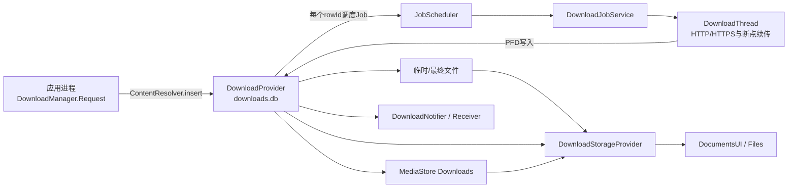
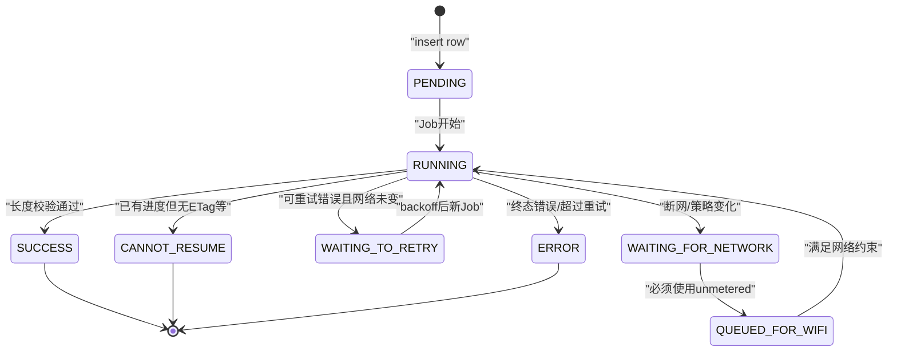
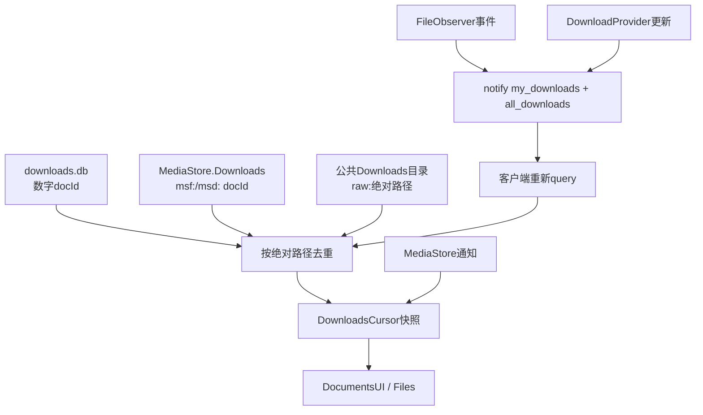

# 第545章 Android DownloadManager完整链：DownloadProvider、JobScheduler、DownloadThread、通知、分享URI与Downloads文档桥接

> 源码版本：Android 11 / API 30 / `android-11.0.0_r48`  
> 本章定位：承接第544章文件型DocumentsProvider，研究一个下载任务如何从应用请求变成数据库状态、Job、网络字节、真实文件、通知、MediaStore行和SAF文档。  
> 阅读方式：macOS只读源码，不实际下载、不编译系统。

## 1. 本章要建立的一条主线

应用调用`DownloadManager.enqueue()`时并没有同步下载文件，它只插入一条任务；DownloadProvider验证并保存；JobScheduler按约束唤醒DownloadJobService；DownloadThread使用请求方网络策略拉取字节；完成状态再驱动MediaStore、通知、广播和Downloads文档视图。本章的核心是把这些阶段拆开。

## 2. 先限定版本

全文只对应Android 11 r48。后续版本可能改用不同网络库、MediaStore写法、存储策略或调度结构；文中的实现缺口是当前源码事实，不应推广成DownloadManager永恒契约。

## 3. 下载不是一个对象，而是六份状态

至少要区分Request参数、`downloads.db`任务行、JobScheduler任务、临时/最终文件、通知/广播状态、MediaStore与SAF投影。它们依次收敛但不是共同事务，因此任一时刻都可能短暂不一致。

## 4. 关键组件各自负责什么

`DownloadManager`是应用API包装；`DownloadProvider`是任务数据库与文件打开边界；`Helpers`把行翻译成Job约束；`DownloadJobService`托管线程；`DownloadThread`做HTTP与文件传输；`DownloadNotifier/Receiver`做人机交互；`DownloadStorageProvider`把Downloads汇入SAF。

## 5. 进程归属先看Manifest

下载provider、JobService、Receiver和Downloads文档provider所在application声明`android:process="android.process.media"`，并使用`android.media` shared UID。应用侧`DownloadManager`在调用方进程，数据库、网络执行和系统通知主要位于media进程。

## 6. 线程也不是同一条

ContentProvider入口由Binder线程处理；每个执行中的下载创建一个`DownloadThread`；通知observer与部分收尾工作使用全局后台HandlerThread；Idle与MediaScan Job又将任务投递到该异步Handler。不要把“media进程”误写成“全在主线程”。

## 7. 总体架构图



## 8. DownloadProvider与DownloadStorageProvider不要混淆

authority `downloads`管理任务行和`all_downloads`文件URI；authority `com.android.providers.downloads.documents`实现SAF root/document。一个数字任务ID能同时出现在两种URI里，但权限模型、路径结构与调用方法不同。

## 9. Manifest的my_downloads是公共API入口

`/my_downloads` path-permission要求普通`INTERNET`权限，provider内部再按调用UID过滤行。INTERNET是normal权限，因此公共DownloadManager不要求第三方获得signature级`ACCESS_DOWNLOAD_MANAGER`。

## 10. all_downloads默认是系统能力

`/all_downloads`要求signature级`ACCESS_ALL_DOWNLOADS`，用于media进程和系统组件查看全部任务。不过单项URI可以被动态grant给具体包；所以“没有ACCESS_ALL就永远打不开任何all_downloads URI”也不准确。

## 11. advanced权限只扩大控制面

`ACCESS_DOWNLOAD_MANAGER_ADVANCED`允许内部调用者设置更多destination、other UID等字段。它不是普通应用开始下载所必需，也不代表持有者自动拥有所有下载文件的任意磁盘路径访问。

## 12. provider启动会恢复单项动态授权

`onCreate()`打开DB，遍历`_id`与owner UID，为仍有包名的每一行对第一个包调用`grantAllDownloadsPermission()`。平台按UID跟踪grant，所以shared UID下只取第一个包已足够覆盖同UID包；无包名的陈旧行留待挂载/清理链处理。

## 13. 单项grant为何同时含读写

插入成功时provider给请求包的`all_downloads/<id>`授予READ与WRITE，重启时重建，删除时撤销。`getUriForDownloadedFile()`返回all_downloads URI之所以能被owner打开，依赖这份精确动态grant，而非owner持有ACCESS_ALL_DOWNLOADS。

## 14. downloads.db保存的是状态机

r48数据库版本114，主表`downloads`另有`request_headers`表。主行记录源URI、目标、状态、当前/总字节、ETag、重试计数、owner UID、通知包、可见性、文件路径及两类MediaStore URI；它不是文件内容数据库。

## 15. 内部状态码借用了HTTP家族

190—199表示pending/running/paused/waiting等信息态，200表示成功，400—599表示HTTP或人工错误。公共`DownloadManager`再把它们压缩成PENDING、RUNNING、PAUSED、SUCCESSFUL、FAILED五类，并通过REASON暴露更具体原因。

## 16. 公共状态与内部状态不能直接比较

例如内部`STATUS_WAITING_FOR_NETWORK=195`会翻译成公共`STATUS_PAUSED`，reason才是`PAUSED_WAITING_FOR_NETWORK`。应用查询到公共值后，不应拿它与`Downloads.Impl`内部数值做等号判断。

## 17. Request只接受HTTP与HTTPS

公开构造器拒绝null和非http/https scheme。包内字符串构造器不做同样验证，供`addCompletedDownload()`创建“非DownloadManager下载”占位源；这不是向第三方开放任意scheme下载。

## 18. 默认destination不是公共Downloads路径

Request未指定目标时写`DESTINATION_CACHE_PARTITION_PURGEABLE`，由download provider管理、可在空间压力下清理。只有调用`setDestinationUri()`或外部目录helper，才会记录`DESTINATION_FILE_URI`及file URI hint。

## 19. 外部应用私有目录helper先创建父目录

`setDestinationInExternalFilesDir()`取调用包external files dir，验证/创建目录后用`Uri.withAppendedPath()`拼subPath。真正enqueue时provider仍会canonicalize并验证路径属于调用包，helper不是最终安全检查。

## 20. Q后的公共目录由provider代建

target Q及以上或非legacy模式下，`setDestinationInExternalPublicDir()`通过DownloadProvider自定义call创建标准公共目录。call只接受`Environment.STANDARD_DIRECTORIES`成员；目录已存在但不是目录或mkdirs失败都会报错。

## 21. subPath不是content URI

destination最终仍是`file://`，DownloadThread源码还留有“TODO: add support for saving to content://”。因此不要把DownloadManager目的地API与SAF任意document URI写入混为一谈。

## 22. 请求头被编码进ContentValues再拆表

`addRequestHeader()`禁止header名含冒号，null value变空串；`toContentValues()`用`http_header_0...`伪列编码。provider插入主行后再解析这些键写入request_headers表，执行线程通过DownloadInfo.Reader读取。

## 23. 通知可见性有权限限制

默认仅运行时可见；隐藏通知要求normal权限`DOWNLOAD_WITHOUT_NOTIFICATION`。provider的`checkInsertPermissions()`会复验visibility允许值，不能靠手写ContentValues绕过Request API限制。

## 24. 网络、漫游、充电和idle只是约束输入

Request把allowed network types、allow roaming、allow metered及requires charging/device idle写进任务行。enqueue返回ID不表示这些条件已经满足，更不表示Job立刻开始。

## 25. 第一段关键源码：Request只插入任务

源码：`frameworks/base/core/java/android/app/DownloadManager.java`

```java
ContentValues toContentValues(String packageName) {
    ContentValues values = new ContentValues();
    values.put(Downloads.Impl.COLUMN_URI, mUri.toString());
    values.put(Downloads.Impl.COLUMN_IS_PUBLIC_API, true);
    values.put(Downloads.Impl.COLUMN_NOTIFICATION_PACKAGE, packageName);

    if (mDestinationUri != null) {
        values.put(Downloads.Impl.COLUMN_DESTINATION,
                Downloads.Impl.DESTINATION_FILE_URI);
        values.put(Downloads.Impl.COLUMN_FILE_NAME_HINT,
                mDestinationUri.toString());
    } else {
        values.put(Downloads.Impl.COLUMN_DESTINATION,
                Downloads.Impl.DESTINATION_CACHE_PARTITION_PURGEABLE);
    }
    values.put(Downloads.Impl.COLUMN_VISIBILITY, mNotificationVisibility);
    values.put(Downloads.Impl.COLUMN_ALLOWED_NETWORK_TYPES, mAllowedNetworkTypes);
    values.put(Downloads.Impl.COLUMN_ALLOW_ROAMING, mRoamingAllowed);
    values.put(Downloads.Impl.COLUMN_ALLOW_METERED, mMeteredAllowed);
    values.put(Downloads.Impl.COLUMN_FLAGS, mFlags);
    return values;
}

public long enqueue(Request request) {
    ContentValues values = request.toContentValues(mPackageName);
    Uri downloadUri = mResolver.insert(Downloads.Impl.CONTENT_URI, values);
    return Long.parseLong(downloadUri.getLastPathSegment());
}
```

这段没有网络连接；返回的是数据库row ID。

## 26. checkInsertPermissions为何复制一份values

无内部ACCESS权限时先要求INTERNET，再复制ContentValues逐项移除允许字段；剩余任何额外列都触发SecurityException。这个“白名单减法”阻止公共调用者直接写uid、ETag、失败次数等内部状态。

## 27. public API只能选择三类destination

普通调用允许purgeable cache、FILE_URI和NON_DOWNLOADMANAGER_DOWNLOAD；内部cache/nonroaming等需要advanced权限。`addCompletedDownload()`的特殊destination允许带既有path、total bytes与success状态，但provider会另行核验文件。

## 28. file URI先拒绝显式../再canonicalize

`checkFileUriDestination()`要求file scheme与非空path，先做简单`/../`检查，再`getCanonicalFile()`并把规范file URI写回。之后按调用包私有目录、已知公共目录、legacy外部存储或安装器OBB例外判定。

## 29. scoped storage判断不只看targetSdk

代码读取`OP_LEGACY_STORAGE`决定runningLegacyMode；包私有external目录和已知公共目录无需WRITE_EXTERNAL_STORAGE，legacy其他外部路径则同时检查权限与AppOp。targetSdk变量在该方法中取得却没有参与后续表达式，是r48遗留细节。

## 30. addCompletedDownload也要验证真实文件

provider canonicalize `_data`，要求文件存在，并限制在调用包目录、公共Downloads或legacy允许的external范围。同进程调用可绕过这组外部caller限制，这是media进程内部信任边界。

## 31. ensureDefaultColumns会重算可见与可扫描

destination存在时，provider按路径重写`COLUMN_MEDIA_SCANNED`和`COLUMN_IS_VISIBLE_IN_DOWNLOADS_UI`：Android应用私有目录不扫描且不显示，公共Downloads扫描且显示，其他外部路径扫描但未必显示。Request中两个旧setter在Q后被忽略，根源就在服务端重算。

## 32. 插入的新任务先统一为PENDING

普通下载不信任调用方状态，强制status PENDING、total -1、current 0、last modification为当前时间。只有NON_DOWNLOADMANAGER_DOWNLOAD按完成项处理，状态直接SUCCESS并保存已知路径与长度。

## 33. owner UID由Binder身份决定

provider把`Constants.UID`写成`Binder.getCallingUid()`；仅root调用可覆盖。notification package还要属于该UID，否则被过滤。数据库中的包名负责通知归属，UID负责数据访问与网络计费，两者不是同一列。

## 34. addCompletedDownload有两处易误读

它已deprecated，建议直接写MediaStore.Downloads；实现会用文件扩展名重新解析MIME并覆盖调用参数。邻近注释声称“同路径已有条目则返回其ID”，但方法没有做重复查询，仍直接insert，不能按注释宣称天然去重。

## 35. 插入并非完整数据库事务

主行先insert，随后写headers、查calling package、grant URI、notify并schedule job。若主行成功后包名意外取不到，方法返回null，但已插入行不会在这里回滚；各阶段失败应按实际持久状态重新查询。

## 36. my_downloads的核心是UID where

SQLiteQueryBuilder对MY URI追加`uid=callingUid OR other_uid=callingUid`；有ACCESS_ALL才不加。ALL URI不加owner条件，但外层Manifest权限或单项URI grant必须先让调用到达provider。

## 37. strict query约束列与SQL语法

query builder设置strict、strictColumns和strictGrammar，并用projection map限制列名。它仍把大量内部列加入map供DownloadInfo.Reader使用，所以“严格”主要防SQL注入与未知列，不等于所有内部字段都从owner查询结果隐藏。

## 38. DownloadManager.Query再拼应用过滤

ID、title LIKE、公共状态组合、Downloads UI visible和`deleted != 1`被拼成selection；默认按last modification DESC。status参数是公共bit flags，传0会形成空status子表达式的边界，正常调用应使用定义的状态组合。

## 39. CursorTranslator负责公共语义

底层内部状态在`getLong(COLUMN_STATUS)`时翻译，reason按错误/暂停细分；LOCAL_URI依据destination生成file URI或all_downloads content URI。它不是数据库view，而是客户端CursorWrapper计算层。

## 40. COLUMN_LOCAL_FILENAME为何对新应用抛错

DownloadManager构造时默认仅对target低于N开放裸路径；否则读取该列抛SecurityException，提示使用ContentResolver打开文件。DownloadStorageProvider作为系统内部调用显式`setAccessFilename(true)`才能聚合真实路径。

## 41. openDownloadedFile仍走provider

它对`all_downloads/<id>`调用`openFileDescriptor(...,"r")`。DownloadProvider先以原调用身份query确保行可访问，再clear identity读内部列，canonicalize路径并用`Helpers.isFilenameValid()`验证确属下载管理范围。

## 42. 写打开会在close后回写长度

非纯只读模式返回带OnCloseListener的PFD；关闭时用真实`file.length()`更新total bytes和last modification，成功且需扫描的外部文件再发媒体扫描广播。回调忽略传入IOException，关闭发生不等于内容写入完全成功。

## 43. remove不是先标deleted再慢慢回收

公共`remove()`直接调用provider delete。provider取消Job、撤all_downloads与SAF document grant、验证并删除文件、扫描旧路径、必要时发送完成广播、删headers，最后删主行并刷新通知；文件`delete()`返回值被忽略，数据库行仍可能被删除。

## 44. notifyContentChanged同时覆盖两种URI

insert/update/delete都会对my_downloads和all_downloads通知；若是单项操作则通知对应ID URI。Cursor观察者收到的是“需要重查”，不是状态对象的增量补丁。

## 45. 插入后每个下载单独调度一个Job

`Helpers.scheduleJob(context,rowId)`重查DownloadInfo，先取消同ID旧Job，再根据当前行决定是否重建。Job ID是`(int) long downloadId`，理论上极大自增ID发生截断后可能碰撞，这是实现尺度边界。

## 46. 哪些状态仍可被调度

control PAUSED直接拒绝；0、PENDING、RUNNING、WAITING_FOR_NETWORK、WAITING_TO_RETRY、QUEUED_FOR_WIFI可调度；设备未找到错误只有源URI是file且介质重新mounted才可调度；成功和大多数终态错误不再排Job。

## 47. retry latency来自失败次数或Retry-After

WAITING_TO_RETRY若有服务端retryAfter便以它为基准，否则从30秒按失败次数指数增长，并加入1—1.5倍随机抖动；最终取“不早于现在”的minimum latency。JobScheduler决定实际运行时间，minimum不是精确定时器。

## 48. required network type逐层收窄

禁metered、仅WIFI、超过移动硬限制或未绕过推荐大小限制都要求UNMETERED；禁roaming则要求NOT_ROAMING；否则ANY。开始前未知总大小时先按-1判断，解析响应长度后DownloadThread再次检查网络策略。

## 49. 可见任务得到较高Job优先级

运行时会显示通知的任务设置`PRIORITY_FOREGROUND_SERVICE`与`FLAG_WILL_BE_FOREGROUND`，还可要求充电/idle，并提供剩余或总网络字节估算。它仍是JobScheduler job，不等于代码创建了一个传统startForegroundService。

## 50. JobService按ID创建DownloadThread

`onStartJob()`用jobId查DownloadInfo，同ID已在`mActiveThreads`则拒绝重复；否则创建线程并返回true表示异步工作。线程完成后必须调用`jobFinishedInternal()`从active map移除并决定是否重排。

## 51. “已成功”竞态分支漏掉jobFinished

DownloadThread.run最前面若重查状态已经SUCCESS便直接return，位于try/finally与`jobFinishedInternal()`之前。源码注释承认这是重复启动竞态，却没有完成JobService收尾；该Job最终需依赖系统stop/超时等收敛，不能写成线程所有出口都显式finish。

## 52. onStopJob采取“请求停机+自行重排”

Job停止时从active map移除，设置线程volatile shutdown flag，并立即按最新行调用scheduleJob；方法返回false，因为服务已自己重排。线程只能在传输循环检查flag后优雅退出，不能保证瞬间停止阻塞中的网络read。

## 53. DownloadInfoDelta避免并发读写同一个Info

线程把可能变化字段复制到Delta，下载期间只改本地副本；落库使用all_downloads URI。强校验写带`status!=CANCELED AND deleted=0 AND control!=PAUSED`，更新0行时再区分paused与deleted，转成StopRequestException。

## 54. 第二段关键源码：约束调度与进度持久化

源码：`packages/providers/DownloadProvider/src/com/android/providers/downloads/Helpers.java`与`DownloadThread.java`

```java
final int jobId = (int) info.mId;
scheduler.cancel(jobId);
if (!info.isReadyToSchedule()) return false;

final JobInfo.Builder builder = new JobInfo.Builder(jobId,
        new ComponentName(context, DownloadJobService.class));
builder.setRequiredNetworkType(info.getRequiredNetworkType(info.mTotalBytes));
if ((info.mFlags & FLAG_REQUIRES_CHARGING) != 0) {
    builder.setRequiresCharging(true);
}
scheduler.scheduleAsPackage(builder.build(), packageName, UserHandle.myUserId(), TAG);

// DownloadThread.updateProgress()
if (bytesDelta > Constants.MIN_PROGRESS_STEP
        && timeDelta > Constants.MIN_PROGRESS_TIME) {
    outFd.sync();
    mInfoDelta.writeToDatabaseOrThrow();
    mLastUpdateBytes = currentBytes;
    mLastUpdateTime = now;
}
```

先`fsync`再写current bytes，是为了让断点续传的数据库进度不领先磁盘。

## 55. 线程一开始写RUNNING

注册NetworkPolicy监听后，Delta状态改RUNNING并落库；可见任务令`mIgnoreBlocked=true`，意味着前台可见下载不受请求方被blocked状态影响，但其他网络约束仍会检查。

## 56. 实际网络来自JobParameters

`RealSystemFacade.getNetwork(params)`返回JobScheduler分配的Network；空则WAITING_FOR_NETWORK。连接、NetworkInfo和NetworkCapabilities都围绕这张网判断，避免随便使用media进程的默认网络替请求方越权。

## 57. 流量计入请求方UID

线程设置系统下载tag，并把TrafficStats UID设为`mInfo.mUid`，完成后清除。下载虽然由media进程发包，统计、策略和配额仍应归因发起应用。

## 58. HTTPS信任配置也尽量模拟请求包

RealSystemFacade读取请求包Network Security Config构造SSLContext；包不存在则回退系统默认SSLContext。cleartext许可按请求包与初始host计算，HTTP被禁时在连接前失败。

## 59. 重定向存在host策略复用边界

cleartext boolean在进入redirect循环前按初始host只计算一次；3xx更新`url`却不重新查询新host。由源码可推断，跨host重定向可能继续沿用初始域名的domain-specific cleartext判断，这是r48实现边界。

## 60. 请求主动关闭复用并禁透明gzip

线程添加自定义headers；未提供User-Agent才补默认值；设置`Accept-Encoding: identity`便于Range续传，设置`Connection: close`避免取消后服务器仍在复用连接持续发送大内容。

## 61. HTTP 200与206必须符合是否续传

新下载期待200，已下载部分期待206；resume却收到200或fresh却收到206都转CANNOT_RESUME，避免把完整响应追加到半文件或把部分响应当完整文件。

## 62. 下载状态图



## 63. 永久重定向会更新源URI

301把解析后的新URL写回Delta；302、303、307只用于本次继续。最多重定向计数由`MAX_REDIRECTS=5`控制，超出变TOO_MANY_REDIRECTS。

## 64. 文件名有一套优先级

未显式FILE_URI时依次尝试应用hint、Content-Disposition attachment filename、Content-Location、最终URL路径，仍无结果用`downloadfile`；之后以FAT规则净化，并按MIME补或替换扩展名。

## 65. 显式FILE_URI不擅自改扩展名

FILE_URI直接取目标文件父目录与名称，缺扩展就保持空；其他destination才按MIME选择`.html`、`.txt`、`.bin`等。用户指定绝对目标和系统生成名字是两套策略。

## 66. legacy外部目录创建条件写反了

`Helpers.getDestinationDirectory(DESTINATION_EXTERNAL)`写成`if (!target.isDirectory() && target.mkdirs()) throw IOException`。目录不存在且mkdirs成功反而抛错；下一次因目录已存在才通过。这是r48可执行逻辑，不应按错误消息脑补为“创建失败才抛”。

## 67. 文件名占位并非跨进程原子

进程内用`sUniqueLock`选择未占用名字，并调用`createNewFile()`占位；源码注释明确“not paranoid enough to use O_EXCL”。锁只能协调本进程线程，外部进程竞态不能当作被完全消除。

## 68. 首个200响应决定MIME、长度与ETag

若尚无文件名则生成；请求未指定MIME时从Content-Type规范化；无Transfer-Encoding时读Content-Length，否则total=-1；保存ETag后强校验落库，再用已知总大小重新检查metered/roaming限制。

## 69. 不知道何时结束会拒绝传输

只有已知长度、响应声明Connection close或Transfer-Encoding chunked之一成立，线程才认为能判断结束；三者都没有就CANNOT_RESUME。TCP暂时没字节不是可靠完成信号。

## 70. 真正写文件仍通过DownloadProvider PFD

线程以自身all_downloads单项URI打开`rw`，取得fd后seek到current bytes；DRM类型套DrmOutputStream，否则用AutoCloseOutputStream。网络线程不直接信任DB路径后随意`new FileOutputStream(path)`。

## 71. 已知总大小时先尝试预分配

若StorageManager声明fd支持allocation，调用`allocateBytes(totalBytes)`；失败映射INSUFFICIENT_SPACE。它按总大小而非“剩余大小”传参，底层针对当前文件分配最终容量。

## 72. 传输缓冲区为8192字节

循环read到buffer再write，更新current bytes与madeProgress。每次循环还检查NetworkPolicy dirty与shutdown flag；策略通知只设dirty，真正判断在下载线程，避免监听回调直接操作流。

## 73. 进度落库要求两个阈值同时超过

bytesDelta必须大于65536且timeDelta大于2000ms，才sync并更新数据库；任一不足就继续积累。通知速度约每500ms采样，但数据库进度频率更低，两套节奏不要混为一谈。

## 74. 最终还会核对Content-Length

EOF后若total已知且current不等于total，转HTTP_DATA_ERROR。服务器提前断开不能仅因InputStream返回-1就标SUCCESS。

## 75. 断点续传由三个条件共同支撑

数据库current bytes告诉seek/Range起点，磁盘内容已sync保证前缀存在，ETag通过If-Match验证远端对象没变。已有进度却无ETag时遇到可重试错误，线程最终改为CANNOT_RESUME而非盲目拼接。

## 76. 可重试错误并非只有网络错误

`isStatusRetryable()`包括HTTP_DATA_ERROR、503、500以及FILE_ERROR。类注释却说本地磁盘错误立即失败、不重试；执行switch与注释不一致，应以switch为准，同时注意有进度无ETag会把它收敛成不能续传。

## 77. MAX_RETRIES并非每次都简单加一

若本轮有forward progress，失败计数重置为1；没有进度才累加。小于5且网络类型未变、仍连接则WAITING_TO_RETRY，否则WAITING_FOR_NETWORK。逻辑奖励取得进展的重试，而非固定总请求次数。

## 78. Retry-After被限制在30秒到24小时

503响应解析整数秒并constrain，再转换毫秒；后续minimum latency还会加随机抖动。无效header先得到-1，再被constrain到最小值，因此该路径并不保留“未提供”的特殊状态。

## 79. error终态会清掉部分文件

finalizeDestination先尝试将fd截断为0，再delete本地文件并把Delta filename置null；异常和delete false被忽略。数据库最终错误状态可能保存成功，而磁盘残留清理并无强保证。

## 80. waiting状态保留部分文件

WAITING_TO_RETRY、WAITING_FOR_NETWORK和QUEUED_FOR_WIFI既不是error也不是success，finalizeDestination不删文件，让下一Job用current bytes与ETag继续。

## 81. cache下载成功后可能移动目录

cache类destination运行时在`filesDir`，成功目标在`cacheDir`；线程尝试rename并在成功时更新路径。IOException或rename false被忽略，状态仍可SUCCESS，文件可能留在running目录，这是非原子收尾边界。

## 82. completion update驱动后续副作用

finally中Delta落库，DownloadProvider同进程update识别终态后对外部可见文件更新/扫描MediaStore，并调用`sendIntentIfRequested()`；随后JobService做最终通知刷新和jobFinished。

## 83. MediaStore只在完成后正式同步

update路径明确说明：以DATA列插入pending不会被MediaProvider尊重，因此未完成下载不插/更新MediaStore；终态时先以size 0迫使扫描，再保存`mediastore_uri`与兼容`mediaprovider_uri`并标记scanned。

## 84. DownloadProvider与MediaStore不是共同事务

文件完成、downloads.db更新、MediaStore insert/update/scan依次发生。扫描失败时下载仍可能SUCCESS，后台MediaScanTriggerJob和idle过程负责后续收敛；数据库字段是线索，不是跨provider原子提交证明。

## 85. 完成广播只定向请求包

public API发送`ACTION_DOWNLOAD_COMPLETE`，显式setPackage并附单个download ID；legacy分支发显式组件并只使用content URI作为data，注释强调避免恶意应用伪造裸文件结果。

## 86. 通知有active、waiting、complete三类channel

active与queued按notification package聚类，一个包的多任务可折叠；complete按download ID单独通知。active ongoing，完成自动取消；旧tag若本轮不再生成会被NotificationManager cancel。

## 87. 通知按钮最终回到DownloadReceiver

active/waiting内容点击发LIST并通知owner包；Cancel携ID数组调用DownloadManager.remove；成功complete点击发OPEN，Receiver通过OpenHelper启动查看器，再把completion visibility改为VISIBLE以免通知重建。

## 88. OpenHelper分享的是SAF document URI

数字ID被构造成`content://com.android.providers.downloads.documents/document/<id>`，ACTION_VIEW同时授予read与write。查看器不是拿到裸`_data`；下载文档provider再根据numeric ID转回all_downloads PFD。

## 89. APK还携带来源链

MIME为APK时，intent加入originating URI、Referer和originating UID，供PackageInstaller判断来源。数字任务从headers表找Referer，MediaStore下载从DownloadColumns取；查不到UID则用UNKNOWN，而非伪造media进程UID。

## 90. Idle Job每12小时在充电且idle时运行

cleanStale删除一周未触碰、不可见且status>=200的行；cleanOrphans按设备号+inode对账DB与download provider内部files/cache/download cache。它不递归清公共Downloads目录中的所有“陌生文件”。

## 91. MediaScanTriggerJob有停止状态残留边界

onStopJob把`mJobStopped=true`并要求重排，但onStartJob没有重置false；同一Service实例再次运行时循环可能立即return，而且该return位于`jobFinished()`之前。r48这段不能描述成所有重排都能可靠继续扫描。

## 92. Downloads SAF root是单一逻辑root

rootId与root document ID都是`downloads`，flags含LOCAL_ONLY、RECENTS、CREATE、SEARCH。queryRoots会尝试`mkdirs()`公共Downloads但不检查返回值；拿到root行不证明目录一定创建成功。

## 93. 文档视图实际合并三套来源

第一套是DownloadManager任务，docId为十进制任务ID；第二套是MediaStore.Downloads，文件为`msf:<id>`、目录为`msd:<id>`；第三套是公共Downloads目录直接枚举的raw文件，docId为`raw:<absolute path>`。

## 94. 三种docId不能互相按格式替换

数字ID通过DownloadManager查询路径；msf/msd通过MediaStore.Downloads查DATA/RELATIVE_PATH；raw直接取绝对路径。它们最终可能指向同一文件，所以聚合时还需按filePaths去重。

## 95. 普通Files与manage看到的任务状态不同

root children普通查询只取visible且SUCCESSFUL的DownloadManager任务；manage查询只要求visible，可显示pending/running/failed。MediaStore pending也仅在manage=true时include；raw顶层文件仍作为补充来源。

## 96. recent默认上限12并支持QUERY_ARG_LIMIT

负limit回退12且不声称honor，非负值写入EXTRA_HONORED_ARGS。先加入成功DownloadManager项，再用剩余额度补MediaStore；CancellationSignal参数没有用于这两套查询。

## 97. recent主动避免与其他媒体root重复

已关联MediaStore的image/video/document DownloadManager项被跳过，audio因MediaDocumentsProvider的audio root不支持recent而保留；MIME为null的任务也直接跳过。再查询MediaStore时设置EXCLUDE_MEDIA，形成跨provider UI去重策略。

## 98. search同时查DB、MediaStore与真实目录

DownloadManager按title LIKE；MediaStore按display name、时间、大小、MIME与Downloads relative path；最后复用FileSystemProvider递归搜索公共Downloads目录。三路结果再按绝对路径排重。

## 99. raw搜索继承24条父类上限

只有最后的真实目录搜索走第544章的`result.getCount()<24`，而前面的DownloadManager/MediaStore结果没有统一总上限；raw结果随后还可能因EXCLUDE_MEDIA再次过滤，过滤掉后不会继续补到24。因此“Downloads搜索总共最多24条”是错的，24只约束过滤前raw子查询。

## 100. raw目录注释与实现不一致

`includeFileFromSharedStorage()`注释说directories不应加入，却没有`file.isDirectory()`过滤，直接调用父类includeFile；顶层目录实际可成为raw document并声明目录能力。应按实现而不是注释理解。

## 101. DownloadManager行用PARTIAL表达非成功态

初始extraFlags为PARTIAL，只有SUCCESSFUL改成SUPPORTS_RENAME并验证文件确实存在；成功但文件被外部删除的行直接不展示。null MIME用`vnd.android.document/file`占位以便打开。

## 102. lastModified的pending判断过窄

`includeDownload()`只有传入`isPending=true`才不填时间，但调用方对DownloadManager仅在status RUNNING时传true；PENDING、PAUSED、FAILED虽可能带PARTIAL，却仍填lastModified。源码注释“incomplete downloads都为空时间”范围大于实际执行。

## 103. 文档flags始终给WRITE与DELETE

数字、MediaStore行都先加SUPPORTS_DELETE与SUPPORTS_WRITE，成功或非pending再加RENAME，图片/可解析类型再加thumbnail/metadata。这里没有读取DownloadManager的COLUMN_ALLOW_WRITE；Files获得write grant后可通过document provider写入。

## 104. root下新建文件会转成数字ID

先由FileSystemProvider真实创建；若非目录且父ID既不是raw也不是MediaStore，立即`addCompletedDownload(...allowWrite=true)`并用新任务数字ID替换raw ID。新建目录、raw子目录内文件或MediaStore目录内文件则保持文件型ID路径。

## 105. 删除按ID类型走不同后端

raw或MediaStore doc委托FileSystemProvider删文件并扫描；数字ID调用`mDm.remove()`，继而取消Job、撤权、删文件与DB。两条路径副作用不同，不能只看最终文件消失就判断经过哪个数据库。

## 106. 改名可能保持ID也可能换命名空间

数字ID调用DownloadManager.rename，成功返回null表示稳定ID不变；raw返回新raw路径ID；MediaStore文件扫描后返回新msf/msd ID；MediaStore目录却走父类rename并按File反算成raw ID。调用方必须采用provider返回URI。

## 107. openDocument再次路由到真实provider

raw交给FileSystemProvider；msf/msd转MediaStore URI；数字ID转DownloadManager all_downloads URI，再由ContentResolver打开。外层先clear calling identity，因为SAF已经完成URI权限检查，内层需要media进程系统能力访问对应后端。

## 108. 第三段关键源码：Downloads是三源聚合

源码：`packages/providers/DownloadProvider/src/com/android/providers/downloads/DownloadStorageProvider.java`

```java
if (manage) {
    cursor = mDm.query(new DownloadManager.Query()
            .setOnlyIncludeVisibleInDownloadsUi(true));
} else {
    cursor = mDm.query(new DownloadManager.Query()
            .setOnlyIncludeVisibleInDownloadsUi(true)
            .setFilterByStatus(DownloadManager.STATUS_SUCCESSFUL));
}
final Set<String> filePaths = new HashSet<>();
while (cursor.moveToNext()) {
    includeDownloadFromCursor(result, cursor, filePaths, null);
}
includeDownloadsFromMediaStore(result, null, filePaths, notificationUris,
        null, NO_LIMIT, manage);
includeFilesFromSharedStorage(result, filePaths, null);
```

同一根中“任务、媒体行、裸文件”并存，filePaths只负责本轮结果去重，不会永久合并三套数据库身份。

## 109. DownloadsCursor观察公共目录变化

第一个DownloadsCursor启动一个ContentChangedRelay，最后一个close后停止；FileObserver看到属性、关闭写、移动、创建、删除等事件，就同时notify my/all downloads URI。它仍是MatrixCursor快照，调用方收到change后要重查。

## 110. 双重close会破坏静态计数

DownloadsCursor.close没有“是否已关闭”保护，每调用一次都递减静态`mOpenCursorCount`；有多个Cursor时，某个对象重复close还可能过早把共享watcher停掉，之后计数可继续减成负数。Cursor通常应可安全重复close，这里是r48资源生命周期缺口。

## 111. 三源汇聚与反馈图



## 112. macOS只读练习一：确认进程、authority和权限

```bash
cd /Users/ninebot/androidSource
rg -n 'sharedUserId|android:process|provider|authorities|path-permission|grant-uri-permission|service|receiver' \
  packages/providers/DownloadProvider/AndroidManifest.xml
rg -n 'class DownloadManager|class DownloadProvider|class DownloadStorageProvider|class DownloadThread' \
  frameworks/base/core/java/android/app/DownloadManager.java \
  packages/providers/DownloadProvider/src/com/android/providers/downloads/{DownloadProvider,DownloadStorageProvider,DownloadThread}.java
```

目标是说清应用API与media进程组件的边界，并区分`downloads`和documents两个authority。

## 113. macOS只读练习二：从enqueue追到Job

```bash
cd /Users/ninebot/androidSource
rg -n -C 7 'toContentValues|long enqueue|checkInsertPermissions|long rowID|scheduleJob' \
  frameworks/base/core/java/android/app/DownloadManager.java \
  packages/providers/DownloadProvider/src/com/android/providers/downloads/{DownloadProvider,Helpers}.java
rg -n -C 6 'onStartJob|new DownloadThread|thread.start|onStopJob|jobFinishedInternal' \
  packages/providers/DownloadProvider/src/com/android/providers/downloads/DownloadJobService.java
```

预期看到insert与真正下载分离，以及每个row ID对应Job/Thread。

## 114. macOS只读练习三：验证断点续传与落盘顺序

```bash
cd /Users/ninebot/androidSource
rg -n -C 7 'Range|If-Match|HTTP_PARTIAL|mCurrentBytes|outFd.sync|writeToDatabaseOrThrow|Content length mismatch' \
  packages/providers/DownloadProvider/src/com/android/providers/downloads/DownloadThread.java
rg -n 'BUFFER_SIZE|MIN_PROGRESS_STEP|MIN_PROGRESS_TIME|MAX_RETRIES|MAX_REDIRECTS|RETRY_FIRST_DELAY' \
  packages/providers/DownloadProvider/src/com/android/providers/downloads/Constants.java
```

重点回答为何resume不只是加一个Range header，以及数据库current bytes为何不能先于fsync。

## 115. macOS只读练习四：验证SAF三源聚合

```bash
cd /Users/ninebot/androidSource
rg -n -C 6 'queryChildDocuments|includeDownloadsFromMediaStore|includeFilesFromSharedStorage|includeDownloadFromCursor|DownloadsCursor' \
  packages/providers/DownloadProvider/src/com/android/providers/downloads/DownloadStorageProvider.java
rg -n 'RAW_PREFIX|MEDIASTORE_DOWNLOAD_FILE_PREFIX|MEDIASTORE_DOWNLOAD_DIR_PREFIX|getDocIdFor' \
  packages/providers/DownloadProvider/src/com/android/providers/downloads/{RawDocumentsHelper,MediaStoreDownloadsHelper}.java
rg -n -C 5 'buildViewIntent|buildDocumentUri|FLAG_GRANT_READ_URI_PERMISSION|EXTRA_ORIGINATING' \
  packages/providers/DownloadProvider/src/com/android/providers/downloads/OpenHelper.java
```

全程只读，不启动下载；完成后应能分别解释数字、msf/msd与raw docId。

## 116. 常见故障定位矩阵

| 现象 | 优先检查 | 不要直接下的结论 |
|---|---|---|
| enqueue返回ID但没流量 | Job约束、网络类型、charging/idle、control/status | “insert失败” |
| 一直PAUSED | 公共reason对应retry/network/WIFI哪一种 | “用户主动暂停” |
| 重试后CANNOT_RESUME | 是否已有进度、ETag是否为空、服务器是否返回206 | “Range语法一定错” |
| SUCCESS但图库暂时没有 | MediaStore scan/trigger job字段与通知 | “文件没下载完” |
| Files中同一对象重复 | 三源path去重、MediaStore URI、路径是否canonical一致 | “只有DownloadManager一份数据” |
| 通知点击打不开 | document URI grant、MIME、目标Activity、文件是否仍存在 | “需要暴露_file路径” |

## 117. 最容易出现的十个误解

一，enqueue同步开始网络；二，INTERNET能查全系统下载；三，返回ID就是文件ID；四，公共状态等于内部状态码；五，断点续传只靠current bytes；六，所有本地错误都不重试；七，SUCCESS保证MediaStore已同步；八，Downloads SAF只读downloads.db；九，所有非成功document都不发布lastModified；十，Cursor change会自动修改MatrixCursor行。源码逐一否定这些简化。

## 118. 本章源码导航

应用API看`frameworks/base/core/java/android/app/DownloadManager.java`与`android/provider/Downloads.java`；数据库权限和文件打开看`DownloadProvider.java`；调度看`Helpers.java`、`DownloadInfo.java`、`DownloadJobService.java`；传输看`DownloadThread.java`；通知看`DownloadNotifier.java`、`DownloadReceiver.java`与`OpenHelper.java`；SAF聚合看`DownloadStorageProvider.java`、`RawDocumentsHelper.java`、`MediaStoreDownloadsHelper.java`；后台对账看`DownloadIdleService.java`和`MediaScanTriggerJob.java`。

## 119. 生成后复读修正记录

复读时重点修正：第一，enqueue只插行而非开始下载；第二，owner靠动态all_downloads单项grant而非ACCESS_ALL；第三，服务端会重算scannable/visible；第四，addCompletedDownload覆盖传入MIME且没有注释所称路径去重；第五，Job ID会从long截成int；第六，已SUCCESS竞态直接return漏显式jobFinished；第七，跨host redirect未重算cleartext许可；第八，DESTINATION_EXTERNAL的mkdir成功条件反而抛错；第九，FILE_ERROR实际列入retryable，与类注释不符；第十，cache成功rename失败仍可SUCCESS；第十一，MediaScanTriggerJob停止flag未重置；第十二，raw目录注释与实现不符；第十三，PARTIAL与“是否隐藏lastModified”的判断并不一致；第十四，DownloadsCursor重复close可破坏静态计数；第十五，文件、downloads.db、MediaStore、通知与grant均无共同事务。

## 120. 本章小结与下一章入口

DownloadManager是一套“数据库驱动的受约束后台状态机”：Request被白名单验证后落成PENDING行，JobScheduler按网络/电源条件选择Network，DownloadThread以请求UID计费并用ETag+Range+fsync维持可恢复性，终态再推动文件收尾、MediaStore、广播和通知。Downloads文档provider又把任务、MediaStore与裸文件合并成一个SAF root。下一章将顺着下载APK后的用户动作进入PackageInstaller Session完整链，研究stage、写入、commit、校验、安装事务与结果回调。
