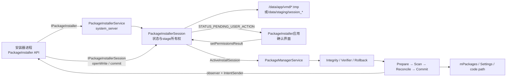
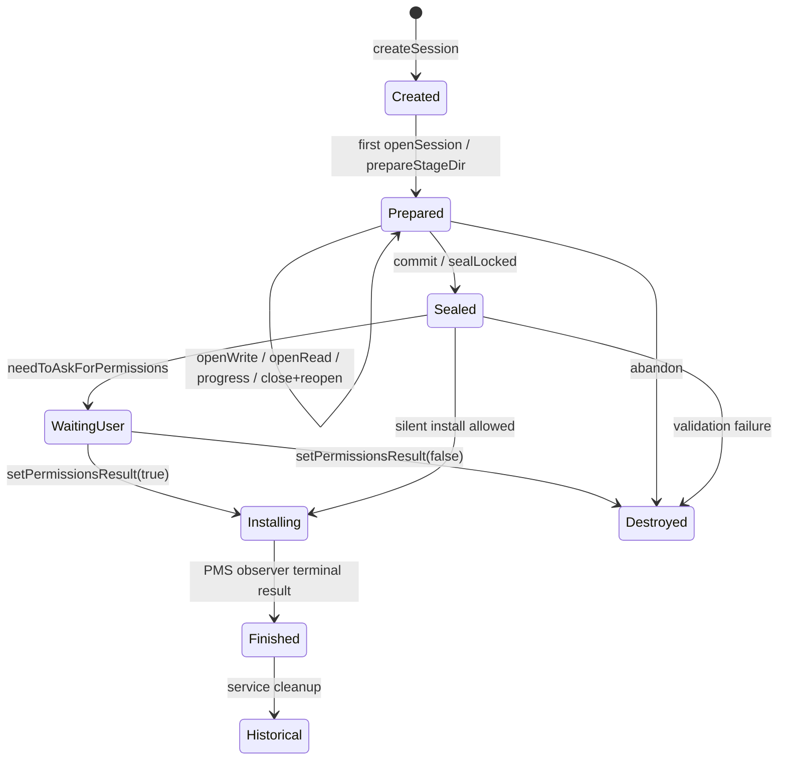
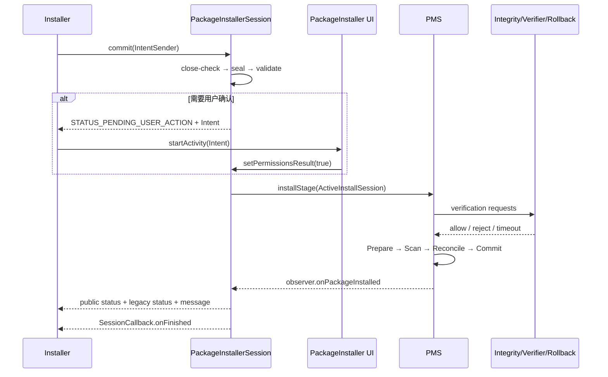

# 第546章 Android PackageInstaller完整链：Session写入、commit、校验、安装事务与结果回调

> 源码版本：Android 11 / API 30 / `android-11.0.0_r48`  
> 本章定位：承接第545章“下载完成以后得到一个APK”的结尾，继续回答APK怎样进入受保护的stage、怎样被封印与校验、何时询问用户、PMS怎样原子处理单包/多包，以及结果怎样回到安装器。  
> 阅读方式：macOS只读源码，不实际安装、不编译系统。

## 1. 本章要建立的一条主线

安装器先用`SessionParams`描述意图，`PackageInstallerService`创建持久化会话；安装器打开会话，把base APK、split APK等文件写入stage；`commit()`先检查写端、封印会话并解析校验文件；必要时通过状态回调要求用户确认；确认后会话把`ActiveInstallSession`交给PMS；PMS依次做完整性/安装包验证、Prepare、Scan、Reconcile、Commit和post-install，最后把终态通过`IntentSender`与`SessionCallback`送回。

## 2. 先限定版本

全文只对应Android 11 r48。Android 12以后包解析类拆分、增量安装、安装来源、归档与约束API都继续演化；这里出现的字段、锁、XML遗漏和边界只能作为r48源码结论，不能直接套到当前Android版本。

## 3. “安装APK”至少有七份状态

要分开看：调用方的`SessionParams`、system_server中的`PackageInstallerSession`、stage目录里的字节、`install_sessions.xml`元数据、PMS的`InstallParams/InstallArgs`、`Settings`与`mPackages`中的已安装状态、调用方收到的公开状态。它们沿流水线收敛，却不是一份对象。

## 4. 两个commit不是同一个概念

`PackageInstaller.Session.commit()`是安装器说“文件交完了，请开始处理”，它使会话不可再改；`PackageManagerService.commitPackagesLocked()`才是将已解析、扫描、协调后的包写入系统包状态。前者发生得早，后者接近真正安装的不可逆点。

## 5. 四个主要代码角色

`PackageInstaller`是应用API代理；`PackageInstallerService`管理所有会话、访问控制和持久化；`PackageInstallerSession`管理单个会话的文件、状态机、用户确认与交接；`PackageManagerService`做包验证、扫描、签名/共享库协调和系统状态提交。PackageInstaller应用只负责系统确认UI与传统URI安装体验，不是PMS本身。

## 6. 进程与线程边界

客户端API运行在安装器进程，经`IPackageInstaller`/`IPackageInstallerSession` Binder进入system_server。Service创建专用`HandlerThread("PackageInstaller")`，Session的seal后校验、安装消息和终态回调都在该Looper串行处理；PMS又把`INIT_COPY`交给自己的Handler，并在`mInstallLock`下跑核心安装。

## 7. 总体架构图



## 8. 最小客户端调用顺序

典型调用是：构造`SessionParams(MODE_FULL_INSTALL)`，设置包名与总大小，`createSession()`得到正整数ID，`openSession()`，`openWrite("base.apk", 0, size)`写入，`fsync()`并关闭所有输出流，最后`commit(statusReceiver)`。Session对象本身关闭不等于提交，提交也不要求客户端一直存活。

## 9. Session ID不是数据库自增ID

Service用`SecureRandom`在`1..Integer.MAX_VALUE-1`中随机挑选，检查`mAllocatedSessions`，最多尝试33次左右后失败。ID在一次开机期间不复用，并写入XML，因此它既是Binder操作句柄，也是重启恢复和回调关联键。

## 10. MODE_FULL_INSTALL的含义

完整安装必须在本次stage中含base APK；可以同时有若干split。若只交split而没有base，`validateApkInstallLocked()`会报`INSTALL_FAILED_INVALID_APK`。它不是“删掉旧包数据再全新安装”，升级时仍可保留应用数据。

## 11. MODE_INHERIT_EXISTING的含义

继承模式用于只更新部分split：未被新文件覆盖、也未通过`.removed`标记删除的base/split、dex metadata、部分oat和native库可从现有安装继承。前提是目标包已经存在，而且现有与新增内容的包名、版本号、签名完全一致。

## 12. SessionParams里的size只是提示

`setSize()`帮助选择卷、预留空间和计算进度，但API明确说它不必等于实际大小。真正写文件时若`openWrite()`给出正的`lengthBytes`，StorageManager会针对目标FD分配空间；最终APK是否合法仍以解析结果为准。

## 13. appPackageName不是信任声明

安装器提前设置包名便于UI和观察者展示，但校验会从APK重新解析包名，并与该参数比较。写一个“看起来可信”的包名不能把另一包伪装成它；不一致直接按无效APK失败。

## 14. installSource不是一个字符串

r48用`InstallSource`区分initiating、originating和installer package：谁发起、内容最初来自谁、最终记为安装器可能不同。Service会校验调用UID与安装器包名的归属，普通调用者不能随意替别人写installer-of-record。

## 15. originating URI与referrer主要是信号

来源URI、referrer和originating UID会进入verification intent，供反恶意软件与安装来源判断使用。它们不是读取stage文件的权限令牌，也不是证明来源可信的签名；非owner查询SessionInfo时来源URI与referrer会被清洗。

## 16. 普通应用创建会话也受到用户限制

`createSessionInternal()`先做跨用户权限检查，再检查`DISALLOW_INSTALL_APPS`。所以能取得`PackageInstaller`对象不代表用户策略允许安装；受限用户会在创建阶段收到`SecurityException`，无需等到commit。

## 17. 普通调用者的flags会被重写

非shell/root调用会清掉`INSTALL_FROM_ADB`、`INSTALL_ALL_USERS`和`INSTALL_ALLOW_TEST`，强制加`INSTALL_REPLACE_EXISTING`；`INSTALL_VIRTUAL_PRELOAD`也只对验证器保留。SessionParams不是“调用者写什么，系统照单全收”。

## 18. downgrade许可也由系统重算

debuggable构建或system/shell/root会获得`INSTALL_ALLOW_DOWNGRADE`；普通调用在user构建会被清除ALLOW/REQUEST_DOWNGRADE。稍后PMS仍结合现有包版本和debuggable属性做降级策略判断，参数只是条件之一。

## 19. staged和APEX门槛更高

staged或APEX会话要求`INSTALL_PACKAGES`。APEX还要求设备支持APEX并强制使用staged session。普通第三方通过公开API做APK安装，不等于能安排重启生效的系统组件升级。

## 20. DataLoader模式是另一条供数路径

设置DataLoader参数要求`USE_INSTALLER_V2`，Session会拒绝普通`openWrite/openRead`。Streaming或Incremental由DataLoader准备镜像，未就绪时commit可以返回pending并允许以后重试；本章主线以普通文件写入为主，只在状态机处标出分岔。

## 21. 会话数量有UID级上限

持有`INSTALL_PACKAGES`的UID最多1024个active session，无该权限最多50个；历史会话计数上限1048576。这里的active count是Service中尚保存的会话数量，不等于`SessionInfo.isActive()`的打开引用计数。

## 22. 创建会话时先确定stage位置

普通内部安装使用`/data/app/vmdl<id>.tmp`风格目录；staged安装使用`/data/staging/session_<id>`；旧外部ASEC路径使用`smdl<id>.tmp` CID。多包parent不放APK，所以`stageDir`与`stageCid`都可以为空。

## 23. createSession尚未创建stage目录

Service只建立Session对象、放入`mSessions`、异步写XML并发出created callback。真正第一次`openSession()`时，Session的`open()`才调用`prepareStageDir()`，设置`mPrepared=true`并发prepared回调。理解这个惰性步骤能解释“有session ID但目录尚不存在”。

## 24. stage目录由system_server创建

`prepareStageDir()`拒绝已存在目录，以0775创建、再次chmod，并执行SELinux `restorecon`。客户端只拿到受控FD或FileBridge socket，不直接获得stage路径的任意文件系统写权限。

## 25. Service的会话表与Session自己的锁

`mSessions`保护全局ID到Session的映射；每个Session的`mLock`保护prepared、sealed、committed、文件FD、进度与解析结果。代码多处主动在取child或持久化前释放一层锁，是为了避免Service锁、Session锁与PMS锁倒置。

## 26. openSession增加活动引用

每次`open()`令`mActiveCount`加一，0→1时通知active=true；`close()`减一，降到0通知false。它允许同一会话跨网络变化、甚至跨重启多次打开，但要求调用者成对关闭，代码并未把负计数自动夹到0。

## 27. 活跃不等于正在安装

只要安装器持有打开的Session，`SessionInfo.isActive()`就可能为true；commit也额外增加一个引用，让内部校验安装阶段保持active。等待用户确认时该额外引用会被释放，因此sealed会话可以是inactive。

## 28. 进度被拆成80%与20%

客户端staging进度被限制到总进度0—0.8，系统内部进度占0—0.2。只有首次移动或相对上次报告变化至少0.01才发callback；所以`setStagingProgress(1)`不等于UI必然已经显示100%。

## 29. openWrite先占一个“未关闭写端”名额

在做磁盘分配前，Session先把`RevocableFileDescriptor`或`FileBridge`放进集合。这样即使重操作在锁外进行，commit也能看到仍有传输打开并拒绝封印，避免校验一边读、客户端一边改。

## 30. 文件名必须是安全的外部文件名

`FileUtils.isValidExtFilename(name)`拒绝路径穿越和非法名；目标固定为`new File(stageDir, name)`。安装器可以随意选择会话内名字，但稍后校验会依据APK内部split name统一改成`base.apk`或`split_<name>.apk`。

## 31. openWrite不会自动截断旧文件

底层flags是`O_CREAT | O_WRONLY`，没有`O_TRUNC`。offset>0时显式`lseek`，适合断点续写；若用同名文件从offset 0重写更短内容，旧尾部可能仍在，最终解析/签名校验通常会发现问题。可靠安装器应管理好长度与重写策略。

## 32. 第一段关键源码：受控写入与预分配

```java
private ParcelFileDescriptor doWriteInternal(String name, long offsetBytes, long lengthBytes,
        ParcelFileDescriptor incomingFd) throws IOException {
    if (!FileUtils.isValidExtFilename(name)) {
        throw new IllegalArgumentException("Invalid name: " + name);
    }
    final File target = new File(stageDir, name);
    ParcelFileDescriptor targetPfd = openTargetInternal(target.getAbsolutePath(),
            O_CREAT | O_WRONLY, 0644);
    if (stageDir != null && lengthBytes > 0) {
        mContext.getSystemService(StorageManager.class).allocateBytes(
                targetPfd.getFileDescriptor(), lengthBytes,
                PackageHelper.translateAllocateFlags(params.installFlags));
    }
    if (offsetBytes > 0) {
        Os.lseek(targetPfd.getFileDescriptor(), offsetBytes, OsConstants.SEEK_SET);
    }
    // 后续返回可撤销FD，或启动FileBridge把客户端socket接到这个目标FD。
}
```

摘录来自`PackageInstallerSession.doWriteInternal()`，省略异常清理和reverse mode。重点是：系统打开真实stage文件，客户端拿到的是受控传输端；正长度用于预分配，并不是写入完成证明。

## 33. Revocable FD与FileBridge是兼容分支

`PackageInstaller.ENABLE_REVOCABLE_FD`为true时返回可撤销PFD，销毁会话可主动revoke；否则以FileBridge在socket和目标FD之间转发。客户端`PackageInstaller.Session.openWrite()`会据此包装成不同OutputStream，但API层用法一致。

## 34. reverse mode只允许shell或system

隐藏`write(name, offset, length, incomingFd)`让system_server主动从来向FD复制，避免把敏感stage FD交出去；非空incoming FD会触发`assertShellOrSystemCalling()`。复制完成后它自行关闭两端并移除占位bridge。

## 35. fsync只接受本Session产生的流类型

API根据分支只识别`AutoCloseOutputStream`或`FileBridgeOutputStream`，其他OutputStream会抛`IllegalArgumentException`。fsync保证已写字节向存储层提交，但不负责关闭流，也不做APK解析、签名或安装事务。

## 36. commit前必须关闭所有写端

`assertNoWriteFileTransfersOpenLocked()`遍历可撤销FD和bridge，发现未revoke/未closed便抛`SecurityException("Files still open")`。这不是“系统替你flush后继续”；安装器必须显式关闭输出流，再commit。

## 37. openRead用于提交前自检

owner/root可在未commit、未destroy时读取同名stage文件，例如自己计算摘要。它同样验证文件名，但直接对目标路径`O_RDONLY`打开；DataLoader session不允许这条普通文件读取路径。

## 38. removeSplit写的是零权限标记文件

继承安装移除split时不立即改现有安装目录，而是在stage创建`<split>.removed`，并chmod为0。validate阶段收集这些marker，验证split确实存在，再在构造最终安装集合时排除它。

## 39. 写入阶段的正确心智模型

stage不是最终`/data/app/<package>-<random>`目录，而是安装事务输入区。名称可暂时任意、内容尚不可信、进度由客户端报告；只有封印后的解析校验才把它规范化为可供PMS消费的包集合。

## 40. 写入与封印状态图



## 41. commit首先禁止直接提交child

有parent ID的child session不能单独commit；必须commit multi-package parent。这样一组child只从一个协调点进入校验与PMS批处理，避免某个child提前安装、另一个后来失败。

## 42. markAsSealed每次都会更新状态接收器

`commit(statusReceiver)`可在重启或DataLoader暂时失败后重试。即使会话已sealed，方法仍先替换`mRemoteStatusReceiver`，再跳过重复seal；因此最终结果可以送到最新的接收器，而不是永远绑定第一次对象。

## 43. commit先验证调用所有权与状态

调用者必须是当前installer UID或root；会话必须prepared且未destroy；所有写端必须关闭。Secure FRP开启时，还会限制系统PackageInstaller等不适合绕过FRP的调用者，只允许满足源码条件的`INSTALL_PACKAGES`主体。

## 44. transfer后的提交入口不同

普通`commit()`要求当前installer UID仍等于original installer UID；转移后的会话必须由新owner调用隐藏的`commitTransferred()`且持有`INSTALL_PACKAGES`。这阻止原创建者在转移所有权后再偷偷提交。

## 45. seal是不可逆的输入冻结

`sealLocked()`先再查写端和状态，随后设置`mSealed=true`并检查多包一致性。注释明确说即使封印过程中失败，也会保持sealed；失败链随后destroy并回调，不能把它退回可写状态修补。

## 46. sealed必须同步持久化

成功seal后，Session在锁外调用`onSessionSealedBlocking()`；Service持有`mSessions`锁，用AtomicFile同步写`install_sessions.xml`。这里故意阻塞，因为重启后若忘记sealed，原有stage硬链接或文件可能再次被修改，破坏已校验输入假设。

## 47. commit不是在Binder线程内完成安装

完成封印后只向Session Handler发送`MSG_STREAM_VALIDATE_AND_COMMIT`。真正DataLoader准备、APK解析、用户确认和PMS交接都在后续消息中运行；API返回只表示请求已接受，不表示成功或失败终态。

## 48. 第二段关键源码：seal、validate、commit分层

```java
private boolean streamValidateAndCommit() throws PackageManagerException {
    synchronized (mLock) {
        if (mCommitted) return true;
        if (!streamAndValidateLocked()) return false;

        mClientProgress = 1f;
        computeProgressLocked(true);
        mActiveCount.incrementAndGet();
        mCommitted = true;
    }
    return true;
}

private boolean streamAndValidateLocked() throws PackageManagerException {
    if (!params.isMultiPackage) {
        if (!prepareDataLoaderLocked()) return false;
        if (isApexInstallation()) validateApexInstallLocked();
        else validateApkInstallLocked();
    }
    if (params.isStaged) {
        mStagingManager.checkNonOverlappingWithStagedSessions(this);
    }
    return true;
}
```

这段最能说明顺序：sealed发生在前，文件准备/解析通过后才设置`mCommitted=true`；DataLoader未就绪返回false不是终态失败，Handler不会发`MSG_INSTALL`。

## 49. multi-package会把所有child都走一遍

parent先seal自己，再为每个child调用`markAsSealed()`；validate阶段使用`allSessionsReady &= child.streamValidateAndCommit()`，位运算赋值不会像`&&`短路，所以前一个false也不妨碍后续child接受处理。出现不可恢复错误时会销毁parent和未先失败的child。

## 50. 多包一致性此处只检查两类属性

r48的`assertConsistencyWithLocked()`明确比较`isStaged`和`getEnableRollback()`。这不代表其他所有参数完全相同；每个child仍有自己的包名、stage、权限政策与rollback data policy，后续PMS会基于整组包做协调。

## 51. validate先清空上次解析缓存

普通APK校验开始会把package name、version、signing details、resolved base/staged/inherited列表重置，再按stage重新构建。这样重复commit或恢复后的验证不会直接相信旧内存结果。

## 52. addedFiles不只是扩展名猜测

Session先用`sAddedApkFilter`筛出非目录且以`.apk`结尾的新增文件，再用`ApkLiteParseUtils.parseApkLite(...PARSE_COLLECT_CERTIFICATES)`读取包名、split名、version和SigningDetails；`.dm`在每个APK解析后的相邻文件步骤单独发现和处理。文件名由安装器提供，但包身份来自内容解析。

## 53. 所有APK必须四项一致

`assertApkConsistentLocked()`比较package name、可选的params.appPackageName、long version code和`signaturesMatchExactly()`。同一会话中混入别的包、不同版本或不同签名split都会在交给PMS前失败。

## 54. split重复会被提前拒绝

`stagedSplits`是`ArraySet<String>`，base用null作为split名。相同split name出现两次立即报无效APK；因此不能依赖“后写的同名split覆盖先写的”来决定最终包。

## 55. 文件会按内部split名改名

base统一为`base.apk`，split统一为`split_<splitName>.apk`，并再次经过合法文件名校验。`resolveAndStageFile()`用`renameTo()`规范化；rename失败就是`INSTALL_FAILED_INTERNAL_ERROR`，不会悄悄继续用旧名字。

## 56. Dex Metadata跟随APK改名

若找到相邻`.dm`文件，Session会根据规范后的APK目标名计算对应dex metadata路径，一起resolve与stage。之后PMS还会调用`validatePackageDexMetadata()`，所以“`.dm`存在就必然被接受”不成立。

## 57. fs-verity要求全有或全无

若继承模式的现有base已有fs-verity，或第一个staged文件发现`.fsv_sig`，`mVerityFound`变为true；后续对应文件缺签名会报`INSTALL_FAILED_BAD_SIGNATURE`。它避免一组APK只保护其中一部分。

## 58. full install必须包含base

校验最后检查`stagedSplits.contains(null)`。即使params.appPackageName正确、split签名一致，只交配置split也不能构成完整安装；这与inherit模式可复用旧base形成鲜明区别。

## 59. inherit模式先确认现有base

若目标包不存在或没有ApplicationInfo，立即报“Missing existing base package”。随后解析现有PackageLite与base ApkLite，并用同一套包名、版本、签名规则对比，不能拿新版本的一个split去拼旧版本base。

## 60. 未覆盖的文件如何继承

新增集合没有某split且remove marker也没点名时，将现有split加入`mResolvedInheritedFiles`；base同理。相同底层设备优先经installd创建硬链接，不同设备则复制到临时文件、chmod 0644后rename，减少重复I/O又保留跨卷兼容。

## 61. native库在用户确认之后提取

`makeSessionActiveLocked()`先判断是否需要确认；用户已允许或可静默时，才继承旧文件、把internal progress推进到0.5并调用`extractNativeLibraries()`。因此看到用户确认页时，session已解析APK，但还没进入PMS核心提交。

## 62. useEmbeddedDex有额外布局要求

base声明`useEmbeddedDex`时，所有staged APK中的dex必须未压缩且对齐，否则按无效APK失败。普通签名通过不能替代这种运行时布局约束。

## 63. isSplitRequired会检查至少一个split

若base声明必须有split，而`stagedSplits.size() <= 1`，源码报`INSTALL_FAILED_MISSING_SPLIT`。这里的集合只登记本次新增APK，base以null计一个；它没有把`mResolvedInheritedFiles`中的旧split补进计数。因此在inherit场景，即使最终打算继承旧split，本次新增集合过小仍可能触发该r48判断，不能把它改述成“最终文件集合没有split”。

## 64. Session校验不是PMS最终兼容性校验

Session阶段主要保证同一输入集合内部一致；升级签名能力、sharedUser、权限重定义、SDK/ABI、共享库、版本降级和现有系统状态冲突仍由PMS Prepare/Scan/Reconcile再判断。两层校验不是重复浪费，而是不同信任边界。

## 65. 校验失败会销毁并报告终态

任何`PackageManagerException`或被包装的Throwable进入`onSessionVerificationFailure()`：非staged stage被删除，Session final status/message更新，IntentSender与SessionCallback收到失败；staged目录还显式额外清理。sealed失败会话不能再打开补文件。

## 66. committed表示“验证已通过并准备继续”

`mCommitted=true`设置在stream+validate成功后、`MSG_INSTALL`之前。它不是“Settings已经写盘”；此时还可能等待用户、等待verifier、被签名升级规则拒绝或在PMS提交时失败。

## 67. 谁可以静默安装

若installer UID有`INSTALL_PACKAGES`，或是更新已安装包且有`INSTALL_PACKAGE_UPDATES`，或安装自己的更新且有`INSTALL_SELF_UPDATES`，又或者是root/system、设备所有者/关联profile owner，可跳过一般用户确认。`INSTALL_FORCE_PERMISSION_PROMPT`可强制重新询问。

## 68. “未知来源允许”与“安装确认”不是同一检查

PackageInstaller应用的`InstallStart`会对target O及以上的来源UID检查是否声明`REQUEST_INSTALL_PACKAGES`，后续还结合AppOp/用户策略；Session服务的`needToAskForPermissionsLocked()`决定本次是否需要用户按安装按钮。一个解决来源资格，一个决定会话授权，不能互相替代。

## 69. pending user action是中间状态

需要确认时，Session构造显式指向系统PackageInstaller包的`ACTION_CONFIRM_INSTALL` Intent，通过调用方给的IntentSender发送`STATUS_PENDING_USER_ACTION`和`Intent.EXTRA_INTENT`。安装器应该在合适时机启动这个Intent，而不是把-1当失败。

## 70. PackageInstallerActivity只接受可展示的sealed会话

确认Activity重新读取`SessionInfo`，要求info非null、`sealed=true`且`resolvedBaseCodePath`非null，然后从已解析base展示应用信息。它不信任调用Intent直接塞来的文件路径。

## 71. overlay在确认页被系统隐藏

Activity给窗口加`SYSTEM_FLAG_HIDE_NON_SYSTEM_OVERLAY_WINDOWS`，onPause时禁用OK按钮，再在onResume重新检查。它减少点击劫持窗口，但不能被解释成安装包已经安全；APK本身仍要过验证器和PMS规则。

## 72. 用户点击安装不会再次commit

Session确认路径调用`PackageInstaller.setPermissionsResult(sessionId, true)`；Service要求调用者持有`INSTALL_PACKAGES`，Session设置`mPermissionsManuallyAccepted=true`并投递`MSG_INSTALL`。它继续第一次commit暂停的位置，不重新开放stage。

## 73. 用户拒绝是明确的abort终态

点击取消、返回键都会`setPermissionsResult(false)`，Session销毁stage并以`INSTALL_FAILED_ABORTED`结束。公开回调经映射得到`STATUS_FAILURE_ABORTED`，不是generic failure。

## 74. 传统content URI安装会多一层自建Session

用户从文件管理器打开APK时，`InstallStart`先把content复制到自身可控临时文件，`PackageInstallerActivity`先展示确认；随后`InstallInstalling`创建自己的full session、写入APK并commit。它与“第三方安装器已经创建Session，系统只来确认”的路径不能混写。

## 75. makeSessionActive是交接点

确认通过后，Session确保resolved base、SigningDetails等非null；处理inherit文件与native库；创建PMS的observer；设置目标UserHandle；最后`mRelinquished=true`并返回`ActiveInstallSession`。从这一刻开始，Session不能再被普通abandon抢回控制。

## 76. mRelinquished是point of no return标志

注释写“reached point of no return”；PMS observer无论成功失败都会`destroyInternal()`并分发终态。之后调用abandon只记录“Ignoring abandon after commit relinquished control”，不会试图删除PMS正在使用的输入。

## 77. installStage只是给PMS排队

单包`mPm.installStage(activeSession)`构造`InstallParams`和`INIT_COPY` Message，发送到PMS Handler；多包构造`MultiPackageInstallParams`。所以Session handler调用installStage返回时，包状态仍未提交。

## 78. ActiveInstallSession是一次性交接快照

它携带packageName、stageDir、observer、sessionId、SessionParams、installerUid、InstallSource、user和SigningDetails。PMS将其翻译成OriginInfo、VerificationInfo、InstallArgs等内部对象，不再通过公开PackageInstaller API反查关键输入。

## 79. staged session的“成功”语义不同

`params.isStaged`时`handleInstall()`交给StagingManager，调用`destroyInternal()`释放FD/DataLoader等运行资源，再报告`INSTALL_SUCCEEDED, "Session staged"`。但对尚未进入staged终态的会话，`destroyInternal()`不会设置`mDestroyed=true`，也不会删除stage目录。这次“成功”只表示已接受为重启阶段任务，不表示APEX/APK已经应用；还要观察ready、applied、failed三种staged状态。

## 80. APEX只能走staged分支

如果非staged流程发现APEX，会返回内部错误；createSession阶段本来已拒绝APEX非staged组合。这种双重防线说明参数入口检查与执行前不变量检查都存在。

## 81. PMS第一关仍会重新读minimal package info

`InstallParams.handleStartCopy()`对stage路径调用`getMinimalPackageInfo()`，检查推荐位置、存储、版本降级、required installed version等。即使Session已解析ApkLite，PMS也不会省略安装策略层。

## 82. 已staged输入会被强制看作internal

OriginInfo标记`staged=true`且file非null时，PMS给installFlags加`INSTALL_INTERNAL`；否则视为非法stage。此前已经选定的stage位置不会在此重新按manifest偏好漂移。

## 83. 包完整性验证与Package Verifier并行栅栏

PMS建立`PackageVerificationState`，分别发`ACTION_PACKAGE_NEEDS_INTEGRITY_VERIFICATION`与`ACTION_PACKAGE_NEEDS_VERIFICATION`，还可能等待enable rollback广播。`mVerificationCompleted`、`mIntegrityVerificationCompleted`、`mEnableRollbackCompleted`全部为true后才进入copy/install。

## 84. verifier能看到安装来源信号

verification Intent包含package name、version、install flags、initiating installer、originating/referrer URI、originating UID与installer UID。它们帮助风险判断，但目标仍通过受grant的stage file URI读取，不能凭来源字段替代内容验证。

## 85. Incremental加V4签名有特殊优化

r48对Incremental且SigningDetails显示V4签名的安装，有意跳过常规前置package verifier；安装成功并确认包有效后，再广播带root hash的verified通知。Integrity verification仍是独立路径，不能笼统说“增量安装不验证”。

## 86. verifier与rollback都有超时路径

有序广播结束后PMS才安排verification timeout；enable rollback也从DeviceConfig读取超时，负值回退默认。超时、拒绝或准备失败会设置mRet，栅栏齐备后统一走失败收尾，而不是永久占着Session。

## 87. dry-run不会提交包状态

`INSTALL_DRY_RUN`在所有验证栅栏完成后解析包名，直接调用observer返回“Dry run”，不执行`copyApk()`和`installPackagesLI()`；Service也抑制大部分Session callback/broadcast。它是特权测试机制，不是普通应用预览API。

## 88. copyApk在stage会话中通常很轻

OriginInfo已经是staged file，downstream不必把不可信外部URI再防御性复制；但FileInstallArgs仍会完成最终code path准备、rename/权限等安装前操作。不要把方法名`copyApk()`理解为每次必有一次完整字节复制。

## 89. MultiPackage先收齐所有child状态

每个child的`processPendingInstall()`把InstallArgs与当前状态交给parent；只有数量等于child数且没有`INSTALL_UNKNOWN`才继续。如果任一child失败，整组使用该失败状态创建InstallRequest，并跳过真正安装。

## 90. PMS核心有四个明确阶段

源码注释给出Prepare、Scan、Reconcile、Commit：Prepare解析和做局部检查；Scan构建PackageSetting候选；Reconcile把所有候选与现有系统、共享库、签名等一起检查；Commit才修改系统状态。多包原子语义主要建立在“所有可预测错误尽量在Commit前发现”。

## 91. Prepare会再次做深层规则检查

它解析完整manifest与dex metadata，检查testOnly、instant app最低SDK与签名方案、静态共享库位置、runtime permission model downgrade、persistent app非staged更新限制、已有包签名/升级keyset、重复权限等。Session内部一致不等于Prepare可过。

## 92. Scan不是简单把APK放进Map

`scanPackageTracedLI()`根据parse/scan flags建立新的PackageSetting、组件与共享库信息，可能分配appId。多包中若两个结果得到同一package name，会报`INSTALL_FAILED_DUPLICATE_PACKAGE`并整体退出。

## 93. Reconcile需要同时看新旧世界

它把incoming packages覆盖进existing packages的临时组合视图，检查共享库冲突、替换是否允许删除旧包、升级签名与证书轮换、sharedUser签名、依赖解析等。所有包在同一视图里协调，是多包互相依赖仍能一致判断的关键。

## 94. Commit才允许修改系统状态

`commitPackagesLocked()`在`mLock`下处理旧包替换、提交scan结果、更新Settings、用户安装状态、sequence number和instant installer。源码要求所有可预测错误在此前排除，但注释也承认Commit仍可能因不可避免的I/O等失败。

## 95. 第三段关键源码：四阶段安装事务

```java
private void installPackagesLI(List<InstallRequest> requests) {
    // 1. Prepare every request
    prepareResult = preparePackageLI(request.args, request.installResult);

    // 2. Scan every prepared package into candidate settings
    ScanResult result = scanPackageTracedLI(...);

    synchronized (mLock) {
        // 3. Reconcile the whole set with current system state
        Map<String, ReconciledPackage> reconciledPackages =
                reconcilePackagesLocked(reconcileRequest, mSettings.mKeySetManagerService);

        // 4. Only here mutate package state
        commitPackagesLocked(new CommitRequest(reconciledPackages,
                mUserManager.getUserIds()));
    }
}
```

摘录按原方法压缩，只保留阶段骨架。单包也使用同一列表管线；“atomic”是整组在Commit前共同验证、共同提交的系统语义，不应误写成一条SQLite事务或断电下绝无中间状态。

## 96. 失败清理会撤销乐观分配

若Prepare/Scan/Reconcile未成功，finally会清理由scan阶段乐观注册的新appId；未明确失败的其他request会改为`INSTALL_UNKNOWN`，避免被当成成功。FileInstallArgs的post-install再清理临时code path。

## 97. post-install不只发一个回调

成功后还要处理dex优化后续、权限、Settings落盘、旧代码清理、package added/replaced广播、备份恢复等；`restoreAndPostInstall()`为这些工作分配token。observer终态位于完整PMS后处理链，而非刚commitPackagesLocked返回就必然已经全部广播完成。

## 98. Session observer负责把PMS结果翻回会话

Session创建的`IPackageInstallObserver2`不接受新的user action；`onPackageInstalled()`无论返回码如何都destroy stage并调用`dispatchSessionFinished()`。用户确认只能发生在交给PMS之前，若PMS竟再次请求用户会直接抛IllegalStateException。

## 99. IntentSender终态同时包含两套状态码

`sendOnPackageInstalled()`放入公开`EXTRA_STATUS`、可读message和内部`EXTRA_LEGACY_STATUS`；冲突时还可能给`EXTRA_OTHER_PACKAGE_NAME`。公开状态把大量内部错误压缩成INVALID、CONFLICT、STORAGE、INCOMPATIBLE等类别，诊断时应同时记录legacy status。

## 100. SessionCallback与IntentSender用途不同

`SessionCallback`观察created、badging、active、progress、finished等生命周期，Service按user filter广播；commit的IntentSender承载本次pending-user-action与最终详细结果。只注册SessionCallback拿不到确认Intent，只监听IntentSender也看不到连续进度。

## 101. 结果回调被移到Session Handler

`dispatchSessionFinished()`不直接在PMS observer栈中调用外部IntentSender，而是封装`SomeArgs`发`MSG_ON_PACKAGE_INSTALLED`。这样system_server内部调用者无需在持锁或Binder回调栈上承受第三方接收器重入。

## 102. 新安装成功还可能通知默认Launcher

success且不是replace、允许广播、也不是dry-run时，PMS发送scrubbed Session commit broadcast给默认Launcher。它用于“新应用已安装”体验，不是面向所有应用的无权限全量安装广播。

## 103. 设备所有者的成功通知是额外行为

静默安装由设备所有者/关联profile owner发起时，成功结果链可构建系统通知，展示应用label/icon。通知是否出现不参与安装成功判定；构建PackageInfo失败时只记录warning并跳过通知。

## 104. 非staged终态会从active表移除

InternalCallback把finished事件投递到install thread；普通session无论成败都会从`mSessions`移除，写入历史dump并删图标文件。之后`getSessionInfo(id)`返回null是正常收尾，不表示安装结果从未发生。

## 105. staged成功会继续留在会话表

staged成功不会立刻remove，因为还需跨重启跟踪ready/applied/failed；失败则移除或由StagingManager abort。终态staged session超过更新阈值后，启动读取阶段才会转入历史。

## 106. install_sessions.xml只保存会话元数据

Service用AtomicFile写`/data/system/install_sessions.xml`，大图标放`/data/system/install_sessions/app_icon.<id>.png`；APK字节仍在stage目录。XML记录ID、owner、路径、prepared/committed/sealed、params、children与DataLoader文件描述，不是APK备份。

## 107. 普通未完成会话按创建时间清理

启动读取时，非staged session的age达到3天会作废；源码API注释说“typically on the order of a day”只是概括，r48常量实际是3天。Service TODO还说明没有实现周期性清理，主要在重启时执行。

## 108. staged终态按更新时间清理但r48有恢复缺口

逻辑希望staged terminal session在最后更新后7天失效；XML确实读取`updatedMillis`到局部变量，但构造器只接收`createdMillis`并把`this.updatedMillis=createdMillis`，该局部值未回填。重启后“距更新多久”实际可能退化为“距创建多久”，这是r48源码边界。

## 109. XML没有持久化所有SessionParams字段

r48的Session写/读覆盖许多params，但检索不到`requiredInstalledVersionCode`、`forceQueryableOverride`和`rollbackDataPolicy`的对应属性；Parcel层却包含它们。普通会话重启后这些字段会回默认值，不能笼统说SessionParams逐字段无损恢复。

## 110. transfer的hidden-options判断存在可疑反向组合

`transfer()`写成`if (!params.areHiddenOptionsSet()) throw "Can only transfer sessions that use public options"`；而`areHiddenOptionsSet()`返回`(installFlags & hiddenMask) != installFlags || abiOverride != null || volumeUuid != null`。只要flags还含默认的非mask位，该表达式通常为true，甚至混入某些hidden flag仍可能放行；反而“flags恰好全落在mask中”会得到false并被拒。方法名、异常文案和实际布尔方向明显不协调；能确定的是r48并未按直觉实现“发现任何隐藏选项就拒绝”。

## 111. 从回调到最终状态的时序图



## 112. macOS只读练习一：从公开API追到Binder入口

```bash
cd /Users/ninebot/androidSource
rg -n "createSession\(|openSession\(|public void commit\(" \
  frameworks/base/core/java/android/content/pm/PackageInstaller.java
rg -n "interface IPackageInstaller|createSession|openSession" \
  frameworks/base/core/java/android/content/pm/IPackageInstaller.aidl
rg -n "createSessionInternal|openSessionInternal" \
  frameworks/base/services/core/java/com/android/server/pm/PackageInstallerService.java
```

预期：先看到Java包装把请求交给`mInstaller/mSession`，再看到AIDL方法，最后落到Service；这能证明客户端没有直接触碰PMS内部对象。

## 113. macOS只读练习二：验证stage写入与封印栅栏

```bash
cd /Users/ninebot/androidSource
rg -n "doWriteInternal|O_CREAT \| O_WRONLY|allocateBytes|assertNoWriteFileTransfersOpenLocked" \
  frameworks/base/services/core/java/com/android/server/pm/PackageInstallerSession.java
sed -n '1120,1185p' \
  frameworks/base/services/core/java/com/android/server/pm/PackageInstallerSession.java
rg -n "onSessionSealedBlocking|writeSessionsLocked" \
  frameworks/base/services/core/java/com/android/server/pm/PackageInstallerService.java
```

预期：确认openWrite无`O_TRUNC`、正长度触发预分配、未关闭writer阻止commit，以及sealed状态同步写XML。

## 114. macOS只读练习三：验证两层校验和四阶段事务

```bash
cd /Users/ninebot/androidSource
rg -n "validateApkInstallLocked|assertApkConsistentLocked|Full install must include" \
  frameworks/base/services/core/java/com/android/server/pm/PackageInstallerSession.java
rg -n "void installStage|handleStartCopy|sendIntegrityVerificationRequest|sendPackageVerificationRequest" \
  frameworks/base/services/core/java/com/android/server/pm/PackageManagerService.java
rg -n "preparePackageLI|scanPackageTracedLI|reconcilePackagesLocked|commitPackagesLocked" \
  frameworks/base/services/core/java/com/android/server/pm/PackageManagerService.java | tail -n 30
```

预期：Session先验证同一组APK内部一致，PMS再验证它与整个系统的兼容性；最终状态修改只在Commit阶段。

## 115. macOS只读练习四：验证用户确认、结果和恢复边界

```bash
cd /Users/ninebot/androidSource
rg -n "STATUS_PENDING_USER_ACTION|ACTION_CONFIRM_INSTALL|setPermissionsResult" \
  frameworks/base/services/core/java/com/android/server/pm/PackageInstallerSession.java \
  frameworks/base/packages/PackageInstaller/src/com/android/packageinstaller/PackageInstallerActivity.java
rg -n "sendOnPackageInstalled|EXTRA_LEGACY_STATUS|onSessionFinished" \
  frameworks/base/services/core/java/com/android/server/pm/PackageInstallerSession.java
rg -n "updatedMillis =|requiredInstalledVersionCode|forceQueryableOverride|rollbackDataPolicy" \
  frameworks/base/services/core/java/com/android/server/pm/PackageInstallerSession.java
```

预期：确认pending只是中间回调、UI用特权API续跑、终态同时含公开/legacy状态；最后一组检索可直接观察r48的`updatedMillis`未回填与部分params未写XML。

## 116. 常见故障定位矩阵

创建即失败先看user restriction、cross-user、AppOps包名归属、flags权限、会话数与空间；openWrite失败看stage是否prepared/sealed、文件名、长度预分配与DataLoader模式；commit抛异常看未关闭FD、owner/transfer、FRP；回调pending看确认UI和unknown sources；invalid看Session解析一致性；conflict/incompatible看PMS Prepare/Reconcile、签名/共享库/权限/SDK；长时间无终态看verifier、integrity、rollback或DataLoader栅栏。

## 117. 最容易出现的十二个误解

一，createSession就创建了目录；二，close等于commit；三，commit返回即安装成功；四，sealed等于PMS已写Settings；五，size是强校验；六，安装器给的包名可信；七，fsync会校验签名；八，用户允许后重新开放stage；九，Session校验已覆盖系统兼容性；十，multi-package是一条SQLite事务；十一，公开status保留所有内部错误；十二，XML能无损恢复全部参数。r48源码逐项否定这些说法。

## 118. 本章源码导航

客户端API看`frameworks/base/core/java/android/content/pm/PackageInstaller.java`与两个AIDL；会话服务看`PackageInstallerService.java`；单会话核心看`PackageInstallerSession.java`；PMS事务看`PackageManagerService.installStage()`、`InstallParams`与`installPackagesLI()`；确认UI看`frameworks/base/packages/PackageInstaller/`下`InstallStart`、`PackageInstallerActivity`、`InstallInstalling`和`EventResultPersister`。

## 119. 生成后复读修正记录

第二遍按源码重新核对后，已把容易误讲的“commit立即安装”“create即建stage”“openWrite会截断”“用户确认发生在APK解析前”“staged success代表已应用”“multi-package等于磁盘数据库事务”“重启逐字段恢复params”全部改正。还补出`.dm`并非addedApk解析项、active session两种含义、确认等待时主动减活动引用、inherit时`isSplitRequired`只数本次staged集合、Incremental+V4仅跳过一类前置验证、非staged三天清理只在启动读取、`updatedMillis`读取未使用、部分params未持久化，以及transfer隐藏参数判断的r48反向组合；四组只读命令已实际执行验证。

## 120. 本章小结与下一章入口

现在应能把“准备输入”和“改变包状态”拆开：Session用受控stage与seal建立不可变输入，用户确认只是授权栅栏，PMS再用verification与Prepare/Scan/Reconcile/Commit把候选包纳入系统，结果最后映射回安装器。下一章继续深入这条链最安全敏感的一段：APK签名校验、SigningDetails、证书轮换、升级兼容、V2/V3/V4与fs-verity之间的职责边界。
