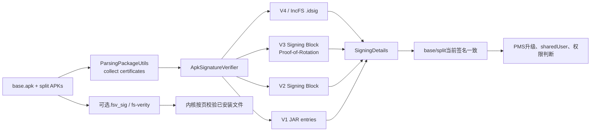
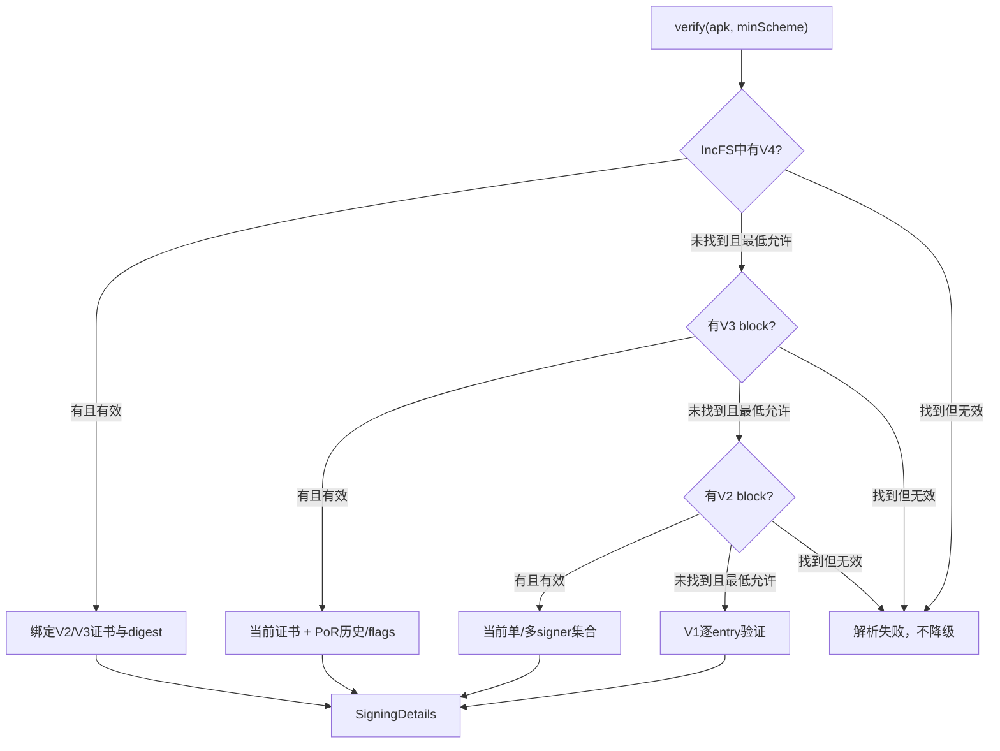
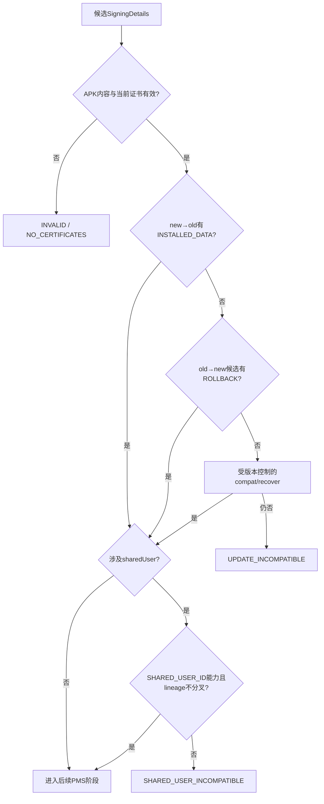

# 第547章 Android APK签名完整链：V1/V2/V3/V4、SigningDetails、证书轮换、升级兼容与fs-verity

> 源码版本：Android 11 / API 30 / `android-11.0.0_r48`  
> 本章定位：承接第546章PackageInstaller校验与PMS事务，专门拆解“APK内容有没有被改”“当前是谁签的”“旧签名能否升级”“轮换后还保留哪些能力”“落盘后是否继续受保护”五类问题。  
> 阅读方式：macOS只读源码，不生成密钥、不签名APK、不实际安装或编译系统。

## 1. 本章要建立的一条主线

包解析器要求收集证书时，`ApkSignatureVerifier`按V4→V3→V2→V1尝试；具体scheme验证签名记录、证书公钥与内容摘要，生成`SigningDetails`；base与所有split当前签名者必须一致；PMS再把新SigningDetails与已安装包、sharedUser和权限定义者比较，决定升级/回滚/权限能力；安装时还可能为文件启用fs-verity，防止安装后的inode内容被悄悄篡改。

## 2. 先限定版本

全文只对应Android 11 r48。后续平台增加V3.1、SourceStamp、APK/APEX验证实现和更完善的V4支持；本章关于最低scheme、轮换历史、API空指针、V4摘要比较与fs-verity启用条件的结论都必须带版本前提。

## 3. 五个问题不能都叫“签名校验”

第一，APK文件内容是否匹配签名摘要；第二，当前签名证书是谁；第三，新包是否有权继承旧包数据；第四，旧证书在轮换后是否仍获shared UID、signature permission等能力；第五，安装后的文件页是否被内核保护。V1—V4、SigningDetails/PMS与fs-verity分别回答不同问题。

## 4. 包名不是安全身份

manifest里的package name只是声明，同名APK可以由任意人构造。系统只有在新包的签名集合与已安装记录满足精确匹配、合法证书轮换或受控rollback关系时，才允许它接管同包名的数据和UID。

## 5. APK签名不是内容加密

APK仍是可读取的ZIP，签名不会隐藏classes.dex、resources.arsc或manifest。签名提供完整性与签名私钥持有证明；任何人都能读取公开证书和内容，但没有私钥就不能为改动后的摘要生成可验证签名。

## 6. Android不依赖公共CA证明“公司身份”

源码把APK携带的X.509证书解码为`Signature`，用证书公钥验签并比较证书原始编码/摘要；它没有为普通应用建立浏览器式PKIX信任链。平台信任的是同一签名身份的连续性、系统镜像预置信任和显式能力关系，不是证书上的组织名称。

## 7. 关键代码角色

`ApkSignatureVerifier`选择scheme并统一输出；V2/V3 verifier解析APK Signing Block；V4 verifier读取IncFS旁路签名；`StrictJarFile/StrictJarVerifier`处理V1；`SigningDetails`表达当前签名者、历史和能力；`PackageManagerServiceUtils.verifySignatures()`做升级/sharedUser决策；`VerityUtils`连接fs-verity内核能力。

## 8. 总体架构图



## 9. 证书收集由解析flags触发

轻量解析只有带`PARSE_COLLECT_CERTIFICATES`才调用签名收集；完整`ParsingPackageUtils.getSigningDetails()`也可在解析后单独执行。PackageInstallerSession验证stage APK时明确带该flag，所以它不是只读manifest字段而忽略内容签名。

## 10. base先建立SigningDetails

包级收集先验证base，若当前为`UNKNOWN`就保存结果；随后逐个split验证，并用`Signature.areExactMatch()`比较当前signatures。split自己的scheme版本可以在解析结果层不同，但当前签名者集合不一致会报`INSTALL_PARSE_FAILED_INCONSISTENT_CERTIFICATES`。

## 11. child package继承父包签名

旧PackageParser模型完成父包收集后，把同一`mSigningDetails`赋给child packages。它们不是各自从容器里重新选择一个独立签名身份；一个APK容器里的child与父包共享签名安全边界。

## 12. targetSdk决定最低签名版本

r48的`getMinimumSignatureSchemeVersionForTargetSdk()`规定target R及以上至少V2，低于R可接受V1。静态共享库无论target如何至少V2。最低版本是拒绝降级的门槛，不表示系统只尝试这一版。

## 13. façade总是先试更高版本

即使最低只要求V1，验证器仍先尝试V4、V3、V2，最后才V1。成功结果的`signatureSchemeVersion`记录实际采用的版本；最低版本只决定“找不到高版后还可不可以继续向下”。

## 14. 第一段关键源码：高版本优先且只在未找到时降级

```java
private static PackageParser.SigningDetails verifySignatures(String apkPath,
        int minSignatureSchemeVersion, boolean verifyFull)
        throws PackageParserException {
    try {
        return verifyV4Signature(apkPath, minSignatureSchemeVersion, verifyFull);
    } catch (SignatureNotFoundException e) {
        if (minSignatureSchemeVersion >= SignatureSchemeVersion.SIGNING_BLOCK_V4) {
            throw new PackageParserException(INSTALL_PARSE_FAILED_NO_CERTIFICATES,
                    "No APK Signature Scheme v4 signature in package " + apkPath, e);
        }
    }
    return verifyV3AndBelowSignatures(apkPath, minSignatureSchemeVersion, verifyFull);
}
```

V3、V2也使用同样结构。关键不是try/catch本身，而是只捕获`SignatureNotFoundException`来降级；发现高版block但内容无效会被包装成解析失败，不会回退到攻击者保留下来的低版签名。

## 15. “高版本签名坏了”不等于“没有高版本签名”

scheme finder找不到对应block才抛`SignatureNotFoundException`；block存在但签名、摘要、证书、公钥或结构错误会成为SecurityException/PackageParserException。这个区分是抗签名剥离与降级攻击的基础。

## 16. unsafeGetCertsWithoutVerification名字要按实现理解

它把`verifyFull=false`传入，不计算/比对完整APK内容摘要；但V2/V3仍验证签名记录对signedData的密码学签名、证书与公钥一致性，V1至少读取manifest条目以取得证书。它不是“任意字节当证书返回”，只是没有证明全部内容与摘要一致。

## 17. unsafe路径只适合已受其他边界信任的文件

ParsingPackageUtils对`PARSE_IS_SYSTEM_DIR`的系统镜像APK可走unsafe以节省启动时间，并把最低scheme降到V1以兼容被剥去V2+块的系统文件。注释明确称该API危险；普通下载APK不应为了性能照搬。

## 18. V1签名放在ZIP条目体系里

JAR签名通过`META-INF/MANIFEST.MF`、`.SF`和签名块描述各entry摘要与签名者。Android用`StrictJarFile`读取entry到EOF才取得并验证证书链，因此“只列ZIP目录就完成V1验证”不正确。

## 19. V1 full验证从AndroidManifest开始

验证器先查必须存在的`AndroidManifest.xml`，读取整个entry并取证书；无manifest或无证书失败。它把这里的签名者集合当基准，减少先扫描全部entry才能知道包身份的成本。

## 20. V1随后验证所有普通文件entry

`verifyFull=true`时遍历非目录、非`META-INF/`且非manifest的entry，逐一读完，要求有证书并与manifest的签名集合精确一致。漏签classes.dex或某资源、不同entry由不同人签都会失败。

## 21. V1保护的粒度不是整个ZIP原始布局

它保护各entry解压内容及JAR元数据声明，不像V2/V3直接对ZIP整体关键区域做内容摘要。某些ZIP级元数据变化不改变entry内容时，V1的覆盖面较弱，这也是新target要求至少V2的原因之一。

## 22. V1也有高版本剥离提示

`StrictJarVerifier`读取`X-Android-APK-Signed`属性；full验证开启rollback protection时，如果声明本应有V2/V3却未找到，会报“Signature stripped?”。unsafe的V1构造把该保护参数设为false，因此不能把unsafe结果当抗剥离证明。

## 23. V2把签名放在APK Signing Block

Signing Block位于ZIP Central Directory之前，内部通过block ID找到V2 signer。每个signer含signedData、摘要记录、证书、公钥和签名记录；验证器不是简单从`META-INF`搬一张证书。

## 24. V2先选平台支持的最佳算法

一个signer可以提供多个算法；代码忽略不支持者，并通过`compareSignatureAlgorithm()`挑最佳支持算法。随后用证书公钥验证该算法对应signature，且要求signedData中的digest算法列表与外层signature算法列表完全相同。

## 25. V2验证证书公钥与signer公钥一致

签名记录单独携带public key，证书也含public key；验证器对编码字节做`Arrays.equals()`。攻击者不能让“签名用A公钥、返回身份却是B证书”蒙混过去。

## 26. V2支持多个当前signer

V2循环解析所有signer，每个都要通过；相同digest算法由多个signer给出的内容摘要必须一致。输出的`Signature[]`表示集合身份，升级比较要求整组匹配；不是“任一签名者相同就算同一个应用”。

## 27. V2内容摘要覆盖三个逻辑区段

`ApkSigningBlockUtils`摘要：Signing Block之前内容、Central Directory、修正了central-directory offset的EOCD。Signing Block本身不递归纳入自己的内容摘要，但其中的signedData签住预期摘要与证书信息。

## 28. 一兆分块摘要如何组合

每个区段按1MiB切块；块摘要输入是`0xa5 + uint32长度 + 块内容`；最终摘要输入是`0x5a + 块数 + 顺序拼接的块摘要`。长度前缀和域分隔字节避免简单拼接歧义，大APK也无需一次读入内存。

## 29. ZIP指针为什么要临时改写

真实EOCD指向Central Directory，而摘要逻辑跳过Signing Block。验证时复制EOCD，把该offset临时改成Signing Block起点再计算，重建签名规范定义的“仿佛没有Signing Block”的ZIP视图。

## 30. 摘要比较使用MessageDigest.isEqual

每种期望摘要与实际摘要用`MessageDigest.isEqual()`比较；不匹配立刻SecurityException。验过signer对摘要的签名而不重算内容摘要，只能证明“签名者承诺了某摘要”，不能证明磁盘文件就是那份内容。

## 31. V2也检查V3剥离属性

V2 additional attribute若声明V3 scheme ID，却没有成功找到V3，会抛“V3 ... none was found. Signature stripped?”。因此攻击者不能简单删掉V3块并让验证器满意地接受仍在的V2块。

## 32. V3沿用整体内容摘要框架

V3同样位于APK Signing Block、选择最佳签名算法、验证signedData与内容摘要；主要新增的是按平台SDK范围选择signer，以及proof-of-rotation。不要把V3描述成“只验证证书轮换，不验证APK内容”。

## 33. V3 signer带minSdk与maxSdk

外层signer记录声明适用平台范围，不覆盖当前SDK的signer会被忽略；signedData内还重复保存min/max，验证器要求内外相等。这样攻击者不能只改未签名的选择范围，让设备换用另一身份。

## 34. r48的V3只允许一个适用signer

解析完后`signerCount`必须为1，多于1直接报“V3 only supports one signer”。这不同于V2多signer集合；证书轮换也只支持单签名者包。

## 35. Proof-of-Rotation是一条逐代授权链

PoR从最老证书到当前证书排列；每一层由前一层证书公钥验证后一层的signedData，签名算法ID也前后匹配。它证明旧私钥曾授权下一个证书，不是开发者在manifest里随便列一串历史证书。

## 36. PoR会拒绝重复证书

验证器用HashSet记录每层X509Certificate，重复即失败；最终证书还必须与当前APK signer证书相同。链条不能循环，也不能在末尾悄悄换成与APK实际签名者不同的证书。

## 37. 每个历史证书带能力flags

PoR level里的flags最终写到对应`Signature`对象，表示当前/后代签名者愿意让该历史证书继续承担哪些关系。它不是证书X.509 extension，而是Android签名轮换记录的一部分。

## 38. 五种能力分别回答不同方向

`INSTALLED_DATA`允许新证书继承旧包数据；`SHARED_USER_ID`保留shared UID关系；`PERMISSION`允许旧证书继续获得signature permission；`ROLLBACK`允许回到该历史证书；`AUTH`供AccountManager等认证关系延续。不能用一个“签名匹配”替代这些方向性能力。

## 39. r48的IntDef漏列AUTH

`AUTH=16`确实定义并被AccountManagerService调用，但`@IntDef`的value列表只列前四项。Java运行时位运算仍可用AUTH；这是注解/静态检查元数据遗漏，不等于AUTH实现不存在。

## 40. 轮换与多签名是互斥模型

`SigningDetails`发现旧对象有多个current signatures时，`hasAncestorOrSelf()`与`checkCapability()`退回current集合精确匹配。`hasCertificateInternal()`也要求单签名才查历史；多signer包不能通过“删掉其中一个，再声称轮换”改变身份集合。

## 41. V3验证结果怎样进入SigningDetails

façade把当前cert chain转换为`signatures`；若有PoR，则按顺序为每个历史/当前证书创建Signature并写flags，放入`pastSigningCertificates`。数组最后一个是当前signer，前面的才是过去世代。

## 42. SigningDetails的四份核心数据

它保存当前`Signature[]`、采用的scheme version、从当前签名证书派生的`PublicKey`集合，以及可空的past certificates。`UNKNOWN`是共享哨兵，不应拿null到处代表“尚未解析”。

## 43. Signature对象代表证书编码而非私钥

`Signature`可以由证书DER或证书链构造，能取公钥、字节、SHA摘要和compat chain；它不含签名私钥，也不能替应用生成新APK签名。PMS持久化的是公开身份材料。

## 44. 第二段关键源码：能力检查是有方向的

```java
public boolean checkCapability(SigningDetails oldDetails, int flags) {
    if (this == UNKNOWN || oldDetails == UNKNOWN) return false;
    if (oldDetails.signatures.length > 1) {
        return signaturesMatchExactly(oldDetails);
    } else {
        return hasCertificate(oldDetails.signatures[0], flags);
    }
}

private boolean hasCertificateInternal(Signature signature, int flags) {
    if (hasPastSigningCertificates()) {
        for (int i = 0; i < pastSigningCertificates.length - 1; i++) {
            if (pastSigningCertificates[i].equals(signature)) {
                if (flags == PAST_CERT_EXISTS
                        || (flags & pastSigningCertificates[i].getFlags()) == flags) {
                    return true;
                }
            }
        }
    }
    return signatures.length == 1 && signatures[0].equals(signature);
}
```

应读成“this这个较新/当前身份是否在历史中找到old，并授予所请求的全部flags”。当前signer不查历史flags，天然拥有全部能力；参数左右交换会改变语义。

## 45. hasAncestorOrSelf只问血缘不问能力

单签名时它调用`hasCertificate(old current signer)`，使用特殊flags 0，只要求证书存在于历史或等于当前；多签名则精确匹配。它适合判断“是不是同一条授权链”，不适合判断旧证书能否继续拿某项权限。

## 46. hasAncestor排除当前相同者

它只遍历`pastSigningCertificates`到倒数第二项，找到old current cert才true。用于判断this严格更新，不会把“同一当前证书”误报成发生过轮换。

## 47. hasCommonAncestor还拒绝分叉lineage

两条链即便包含某个相同老证书，若在共同点之后分叉为不同后代，`getDescendantOrSelf()`会返回null。sharedUser不能靠一个久远共同祖先容纳两条已经分叉的签名世系。

## 48. mergeLineage取更长链与更严格能力

可合并的祖先/后代链按世代拼合；共同证书的flags用按位AND。两份Settings信息一个允许PERMISSION、另一个撤销时，合并结果选择撤销，避免通过较宽松副本重新放大能力。

## 49. 分叉链merge会保留调用者实例

若无法确认祖先关系或发现分叉，`mergeLineageWith()`不会创造“共同祖先后的虚构合并链”，而是返回this。调用方必须另外用`hasCommonAncestor()`等规则决定是否拒绝，不能把merge返回非null当兼容证明。

## 50. checkCapabilityRecover是兼容补救路径

旧系统曾把X.509链重编码，原始字节可能不同但语义证书相同；recover用`Signature.areEffectiveMatch()`重新编码比较。它只在版本迁移兼容开关允许时使用，不是日常放宽签名校验。

## 51. recover对历史flags使用完全相等

r48写的是`pastSigningCertificates[i].getFlags() == flags`，而正常`hasCertificate`使用`(flags & storedFlags) == flags`包含判断。若存储flags同时含多项、调用只问其中一项，normal可通过而recover可能失败，这是必须按源码记录的差异。

## 52. V4不是V3的下一版内嵌Signing Block

V4签名数据由IncFS保存，常见载体是独立`.idsig`；`ApkSignatureSchemeV4Verifier`通过`IncrementalManager.unsafeGetFileSignature(apkPath)`取字节。普通文件没有IncFS签名时视为V4未找到，再尝试V3/V2/V1。

## 53. V4服务于按块流式安装

HashingInfo限定SHA-256、4KiB块和raw root hash，内核可在缺页到达时按Merkle树验证数据，不必等整个APK下载完才使用。SigningInfo把file size、hashing info、APK digest、证书和additional data一起签住。

## 54. V4 verifier仍检查证书公钥

它验证SigningInfo signature，解码X.509证书，并要求显式publicKey字节等于证书public key。只有一张当前cert被返回；V4本身不携带V3 PoR的完整表达。

## 55. full V4还要绑定V2或V3

V4是add-on，`verifyFull=true`时必须从同一APK取得V3或V2证书与content digest；V4当前证书数量、每张证书和apkDigest都要与non-streaming scheme对应。没有V2/V3支撑会作为V4验证失败，而不是单独信任`.idsig`。

## 56. V4此处不会重新全量哈希APK

取V3时调用`unsafeGetCertsWithoutVerification()`，取V2时调用`verify(apk,false)`，得到已签住的digest但不扫描全部内容；实际按页内容保护依赖IncFS hashing tree。这里“verifyFull”主要表示V4与V2/V3身份/摘要绑定，不是再顺序读取完整文件。

## 57. r48 V4结果丢失底层V3轮换历史

代码取得`v3Signer.por`所在的VerifiedSigner只为证书/digest比对，最终却构造`new SigningDetails(signerSigs, SIGNING_BLOCK_V4)`，没有传`pastSignerSigs`。因此这条调用返回的SigningDetails不暴露底层V3 PoR，不能假设“V4自动继承V3全部历史字段”。

## 58. r48 V4摘要比较是前缀比较

源码调用`ArrayUtils.equals(v4Digest, nonstreamingDigest, v4Digest.length)`；该helper只比较指定长度，并仅要求两数组至少这么长，没有先要求长度相等。正常工具生成的匹配摘要应有规范长度；阅读实现时仍要准确称“按V4摘要长度比较前缀”，不改写成`Arrays.equals()`。

## 59. V4身份不能替代升级关系检查

V4验过只能输出当前cert与scheme version；PMS仍要与已安装SigningDetails比较。若r48 V4结果无历史而更新实际依赖PoR，升级能力判断可能无法利用那份V3历史，这属于V4路径的实现限制，而不是“密码学验证通过却自动允许升级”。

## 60. scheme选择与内容保护图



## 61. PMS更新不只调用compareSignatures

常规升级入口使用`PackageManagerServiceUtils.verifySignatures()`，先判断新SigningDetails能否继承旧installed data，或旧SigningDetails是否授权回滚到候选签名；失败才按配置尝试compat/recover和系统分区特殊策略。

## 62. forward update看新链授予INSTALLED_DATA

`parsedSignatures.checkCapability(existing, INSTALLED_DATA)`表示新包的PoR包含旧当前证书，并保留“接管已安装数据”能力。轮换链存在但撤销INSTALLED_DATA时，新证书不能直接覆盖旧包数据。

## 63. rollback看现有新链授予历史证书ROLLBACK

安装旧签名候选时，`existing.checkCapability(parsed, ROLLBACK)`从当前已安装新证书的历史中找候选旧证书。只有PoR给它ROLLBACK能力才允许方向反转；“旧证书以前签过这个包”本身不够。

## 64. 第三段关键源码：升级与回滚是两个方向

```java
boolean match = parsedSignatures.checkCapability(
        pkgSetting.signatures.mSigningDetails,
        SigningDetails.CertCapabilities.INSTALLED_DATA)
        || pkgSetting.signatures.mSigningDetails.checkCapability(
                parsedSignatures,
                SigningDetails.CertCapabilities.ROLLBACK);
if (!match && compareCompat) {
    match = matchSignaturesCompat(packageName, pkgSetting.signatures, parsedSignatures);
}
if (!match && compareRecover) {
    match = matchSignaturesRecover(packageName,
            pkgSetting.signatures.mSigningDetails, parsedSignatures,
            SigningDetails.CertCapabilities.INSTALLED_DATA)
            || matchSignaturesRecover(packageName, parsedSignatures,
                    pkgSetting.signatures.mSigningDetails,
                    SigningDetails.CertCapabilities.ROLLBACK);
}
if (!match) throw new PackageManagerException(INSTALL_FAILED_UPDATE_INCOMPATIBLE, ...);
```

第一项是正常前进，第二项是受授权回退；compat/recover是旧数据格式迁移补救。左右对象和能力flag不能交换后仍解释成同一件事。

## 65. compat处理旧版扁平证书链

旧Settings可能把证书chain拆成多个Signature保存；compat展开新签名的chain，若集合与旧集合相等，就迁移Settings到新SigningDetails。若新包已经PoR轮换而旧记录只有扁平chain，源码承认信息不足并拒绝猜测授权关系。

## 66. recover只修复有效编码差异

它通过证书解析后重新编码判断effective match，并记录critical log；不能让不同公钥或不同证书主体凭相似字段匹配。启用与否由数据库版本兼容判断控制，不是安装器传入的flag。

## 67. updated system app还要对/system身份

系统分区原包是更强的信任锚；`matchSignatureInSystem()`允许/data更新包继承/system签名数据，或按ROLLBACK关系反向匹配。注释特别指出/data里的PackageSetting可被篡改风险更高，不能只信那份记录。

## 68. upgrade keyset是另一条显式授权机制

若PackageSetting配置upgrade-key-set，PMS优先让KeySetManager检查候选签名公钥是否属于允许集合；失败直接更新不兼容。它和V3 PoR都是“允许换key”的机制，但数据来源、配置方式与能力粒度不同。

## 69. sharedUser先做双向能力匹配

新包对sharedUser当前SigningDetails授予`SHARED_USER_ID`，或sharedUser当前details对新包授予同能力，任一可过初始关系。单包是该sharedUser唯一成员时还有特例，允许它更新lineage并撤销自己旧key的共享能力。

## 70. sharedUser还逐包检查撤销影响

新包有历史时，PMS遍历sharedUser内其他包：若某包当前key是新包祖先，新包必须仍授予它SHARED_USER_ID。不能只更新sharedUser总签名，然后让仍用旧key的同UID成员处于未授权状态。

## 71. sharedUser最后拒绝lineage分叉

即使初始能力比较偶然通过，`hasCommonAncestor()`仍要求包lineage与sharedUser lineage不分叉。共享UID意味着进程与数据安全边界高度耦合，因此签名世系一致性比普通包间关系更严格。

## 72. signature permission也有两个方向

请求者是权限定义者签名的后代时，`requester.hasAncestorOrSelf(source)`可获权限；定义者已轮换而请求者还用旧key时，必须由`source.checkCapability(requester, PERMISSION)`继续授权。新证书继承旧权限与旧证书继续拿新定义者权限不是同一方向。

## 73. platform签名关系也接受受控轮换

`isPlatformSigned()`不是只比较当前证书数组，而是包为platform signer后代，或platform SigningDetails仍给包的签名PERMISSION能力。于是平台证书轮换可保持必要系统关系，同时允许按能力撤销旧key。

## 74. AccountManager使用AUTH能力

账户认证关系需要确认调用包是否仍在认证器签名lineage并获AUTH。它说明PoR能力不只服务安装事务，也会被上层系统服务作为长期授权边界消费。

## 75. SigningDetails会持久化到packages.xml

`PackageSignatures.writeXml()`写当前cert count、schemeVersion和共享cert index；若有历史则写`pastSigs`，每项附flags。重启后PMS不是重新相信应用自报的历史，而是读取Settings并在扫描时与APK验证结果协调。

## 76. cert index用于去重不是信任序号

Settings在全局`writtenSignatures`列表中复用相同证书的index，首次出现才写hex key。index压缩XML大小；真正相等仍以Signature内容为准，不能把“两个包index相同”当独立的安全检查API。

## 77. pastSigs count或flags坏了会记设置问题

读取器检查count、index边界、key格式与flags数值，异常时报告Settings问题，并可能构建部分信息或UNKNOWN。它没有把格式损坏静默解释成“所有能力允许”。

## 78. merge lineage可修正重启/多包观察差异

当sharedUser或多个扫描来源看到同一世系的不同长度/能力视图时，PMS用merge选择更完整且更严格的表示。结果仍应经过分叉与能力检查，持久化只是后续启动的快照。

## 79. 公开SigningInfo区分多signer与历史

`hasMultipleSigners()`看当前signatures数量；`hasPastSigningCertificates()`看PoR历史。多signer不是“轮换过很多次”，历史数组也不是“当前有很多人联合签名”。

## 80. getApkContentsSigners只返回当前签名者

它适合多signer包做完整集合比较，也适合需要精确知道当前APK由谁签名的场景；它不会把旧证书混入当前集合。

## 81. getSigningCertificateHistory只适合单signer

多signer时直接返回null；单signer无历史返回当前数组，有PoR返回含历史和当前的`pastSigningCertificates`。调用者必须先看`hasMultipleSigners()`，否则把null当“未签名”会误判。

## 82. GET_SIGNATURES是过时视图

现代调用应请求`GET_SIGNING_CERTIFICATES`并读取SigningInfo。旧API只面向简单当前签名数组，难以表达PoR能力与多signer/历史区别；安全判断更应使用`hasSigningCertificate()`或系统能力API。

## 83. checkSignatures为兼容会比较最老祖先

PMS先比较两个包当前signatures；若不相同且任一有lineage，它各自取历史数组index 0的最老signer再比较。此旧API行为不检查PERMISSION等flags，是为旧客户端保持“轮换前仍匹配”的兼容语义。

## 84. checkSignatures不适合能力敏感授权

因为它可能用共同最老祖先返回MATCH，即使具体旧能力已撤销；需要signature permission、数据恢复或账户认证时，系统内部改用`checkCapability()`的对应flag。应用自己的高价值授权也不应只凭旧API一个整数。

## 85. hasSigningCertificate查询整个单签名历史

输入可以是原始X.509或该证书的SHA-256摘要；单signer时`hasCertificate/hasSha256Certificate`同时看历史与当前，不要求能力flag。多signer查询不会把其中任意一张证书单独视为整包身份，因此这两个内部helper最终要求`signatures.length == 1`，公开查询对单张成员证书返回false。

## 86. 包可见性会把不可见目标伪装成不存在

`checkSignatures()`对被查询方先跑`shouldFilterApplicationLocked()`，不可见时返回`SIGNATURE_UNKNOWN_PACKAGE`；`hasSigningCertificate()`也应返回false。签名查询不能绕过Android 11 package visibility发现任意已安装包。

## 87. r48 hasSigningCertificate有空值顺序缺口

方法先`p = mPackages.get(packageName)`，紧接着执行`getPackageSetting(p.getPackageName())`，之后才判断`p == null`。未知包会在预期false分支前解引用null，存在空指针路径；文档和调用方不应假设r48这里对任意包名都平滑返回false。

## 88. hasUidSigningCertificate对shared UID取聚合签名

UID先映射appId；若Settings对象是SharedUserSetting，就用sharedUser的SigningDetails，而不是任挑一个成员包。instant app调用者查询sharedUser会得到不可见结果，仍受可见性/隔离限制。

## 89. 证书SHA-256比toCharsString更适合外部配置

`PackageUtils.computeSha256DigestBytes()`对证书原始编码求摘要；`SigningDetails.checkCapability(String, flags)`另有规范化多signer组合摘要逻辑，但公开`hasSigningCertificate(...CERT_INPUT_SHA256)`走的是`hasSha256Certificate()`，并不消费该组合摘要。外部配置存短摘要虽方便，仍必须先确认所调用API究竟接受“单证书摘要”还是“signer集合摘要”。

## 90. 内容验签成功也可能升级失败

一个APK可以完全由某张有效证书签好、所有摘要都正确，却不是已安装同包名的合法后代；这时scheme verifier成功，PMS返回`INSTALL_FAILED_UPDATE_INCOMPATIBLE`。密码学有效和系统身份兼容是两层判断。

## 91. 升级兼容与能力决策图



## 92. fs-verity不是第五种APK签名scheme

V1—V4在安装/解析时回答包内容和签名身份；fs-verity是文件系统特性，内核在读取已启用文件的页时按Merkle树验证。它不能单独告诉PMS包名、版本、组件或轮换能力。

## 93. 标准fs-verity使用独立PKCS#7签名

`foo.apk.fsv_sig`对应foo.apk，VerityUtils最多读取8192字节，调用native enable并把PKCS#7 detached signature交给内核。公钥必须已在`.fs-verity` kernel keyring，否则启用失败。

## 94. Android 11新出厂设备默认开启标准模式判断

`isApkVerityEnabled()`在`FIRST_SDK_INT >= R`时为true，或属性`ro.apk_verity.mode=2`；升级到R但first API较低的设备不因当前版本是R自动满足第一项。这里看的是首次出厂API，不是`SDK_INT`。

## 95. 标准模式目前仍是“有sidecar才启用”

PMS收集base、split和存在的`.dm`；只有对应`.fsv_sig`存在且文件尚未启用fs-verity才调用`setUpFsverity()`。源码注释写“optional for now”，所以没有sidecar并不自动让所有普通APK安装失败。

## 96. PackageInstallerSession要求sidecar成组一致

若inherit旧base已启用fs-verity，或本次某个staged文件首先发现`.fsv_sig`，Session要求后续相关staged文件都有对应sidecar；一部分有、一部分没有会报`INSTALL_FAILED_BAD_SIGNATURE`。继承文件存在sidecar也会一起继承。

## 97. fs-verity在最终rename前按inode启用

PMS的`preparePackageLI()`先调用`args.doRename()`，把stage目录移到最终`/data/app/...`并重写ParsedPackage路径，随后才调用`setUpFsVerityIfPossible(parsedPackage)`。因此标准路径直接对最终code path启用fs-verity；不是先保护旧路径，再复制一份可能未受保护的文件。

## 98. legacy APK verity是另一套兼容实现

属性mode=1时仅面向privileged APK，平台从V2/V3签名摘要取signed verity root，生成Merkle数据交给installd，并核对kernel observed root。源码标记deprecated，新设备不应把它与标准PKCS#7 fs-verity混为一谈。

## 99. 有fs-verity时仍要单独核对signer

`canSkipForcedApkVerification()`注释明确：文件的verity setup/root hash匹配最多让全量内容验证可跳过，signer certificate仍必须与trusted source匹配。Merkle树证明“没变”，不证明“最初来自谁”。

## 100. r48强制priv-app APK验证开关实际关闭

`PackageManagerServiceUtils.isApkVerificationForced()`带TODO并直接返回false。相关canSkip方法仍存在，legacy/standard verity安装也仍运行；不要仅看到完整代码路径就声称r48当前一定对privileged APK启用了强制二次验证。

## 101. `.fsv_sig`与`.idsig`不是同一种sidecar

`.fsv_sig`是标准fs-verity PKCS#7签名，供内核长期保护普通文件；`.idsig`承载V4的hashing/signing info与Merkle tree，供IncFS流式交付。扩展名、格式、生命周期和消费方都不同。

## 102. V2/V3 verity digest也不等于标准sidecar

Signing Block可以携带verity content digest/root hash，legacy模式用它生成树；标准模式却显式寻找外部`.fsv_sig`。同样叫verity，不代表一份数据能直接替换另一份机制。

## 103. 安装失败码会压缩密码学细节

scheme block错误常被包装成`INSTALL_PARSE_FAILED_NO_CERTIFICATES`，split不一致是`INCONSISTENT_CERTIFICATES`，升级关系失败是`INSTALL_FAILED_UPDATE_INCOMPATIBLE`。标准fs-verity的native-enable `IOException`在内层转成`INSTALL_FAILED_BAD_SIGNATURE`；其他Installer/I/O/摘要异常在外层可能转`INSTALL_FAILED_INTERNAL_ERROR`，过大sidecar抛的SecurityException又不在该catch列表内。定位必须结合异常cause与log，不能只看公开PackageInstaller状态。

## 104. 验签性能主要花在内容读取

V2/V3 1MiB mmap分块避免一次装入大APK，V1必须逐entry解压/读取；unsafe省掉完整内容摘要正是为什么系统分区启动扫描会用它。性能优化成立的前提是文件已由只读分区、dm-verity/fs-verity等更外层边界保护。

## 105. 验证期间文件必须保持不可变

第546章的Session seal、未关闭writer检查和同步持久化正是签名验证的前置条件。若一边验证一边允许改stage，可能出现检查的是旧页、安装的是新页；安全链从不可变输入开始，而不是从某个加密函数开始。

## 106. 签名校验不负责反恶意软件策略

恶意开发者也能用自己的真实私钥签一个完全有效的恶意APK。Integrity component、Package Verifier、用户确认、安装来源/AppOps和Play Protect类机制回答“是否允许这个有效签名包”；scheme verifier只回答完整性与身份。

## 107. 签名校验也不负责运行时沙箱

签名决定更新连续性、shared UID和signature权限，但进程UID、SELinux域、运行时权限与AppOps仍由其他子系统执行。相同签名可以建立某些信任关系，不会自动让两个普通包读取彼此私有目录。

## 108. 密钥轮换不能补救已泄露私钥

PoR需要旧私钥授权新证书；若旧私钥已被攻击者掌握，攻击者也可能签自己的轮换链。安全运维还需要密钥保护、撤销/升级发布控制和生态分发策略；源码能力flags只是平台消费的细粒度迁移信号。

## 109. 调试时先分清哪一层失败

“no certificates/digest did not verify”查scheme和APK字节；“mismatched certificates”查base/split；“update incompatible”查新旧lineage的INSTALLED_DATA/ROLLBACK；“shared user incompatible”查所有成员与分叉；signature permission未授予查PERMISSION方向；fs-verity失败查sidecar大小、kernel keyring和文件是否已启用。

## 110. 四类常用比较不要互换

`areExactMatch`比较当前signer集合；`hasAncestorOrSelf`只看血缘；`checkCapability`看有方向的血缘加flag；`areEffectiveMatch`只为历史编码兼容恢复。把其中任何一个统一叫“签名相同”，都会在轮换、多signer或权限撤销场景得出错误结论。

## 111. 本章从生成到系统信任的检查表

先确认签名工具产生的V1/V2/V3/V4组合与target最低要求；再确认base/split current signers精确一致；轮换时审查每个past cert flags；升级时按new→old INSTALLED_DATA与old→candidate ROLLBACK画方向；sharedUser逐成员查能力与分叉；最后把`.idsig`、Signing Block verity digest和`.fsv_sig`分别交给正确消费方。

## 112. macOS只读练习一：验证scheme选择和最低版本

```bash
cd /Users/ninebot/androidSource
sed -n '90,170p' frameworks/base/core/java/android/util/apk/ApkSignatureVerifier.java
sed -n '450,468p' frameworks/base/core/java/android/util/apk/ApkSignatureVerifier.java
rg -n "PARSE_COLLECT_CERTIFICATES|getSigningDetails\(|unsafeGetCertsWithoutVerification" \
  frameworks/base/core/java/android/content/pm/parsing/ParsingPackageUtils.java | tail -n 30
```

预期：看到V4→V3→V2→V1只在not-found时回退，target R至少V2，以及system-dir才选择skipVerify分支。

## 113. macOS只读练习二：验证V2/V3内容与轮换

```bash
cd /Users/ninebot/androidSource
rg -n "verifyIntegrityFor1MbChunkBasedAlgorithm|0xa5|0x5a|parseVerityDigest" \
  frameworks/base/core/java/android/util/apk/ApkSigningBlockUtils.java
rg -n "PROOF_OF_ROTATION_ATTR_ID|verifyProofOfRotationStruct|flagsList|only supports one signer" \
  frameworks/base/core/java/android/util/apk/ApkSignatureSchemeV3Verifier.java
rg -n "STRIPPING_PROTECTION_ATTR_ID|Signature stripped" \
  frameworks/base/core/java/android/util/apk/ApkSignatureSchemeV2Verifier.java
```

预期：确认内容摘要不是只哈希证书，PoR逐层验签并保存flags，V2还会拒绝声明存在但被剥离的V3。

## 114. macOS只读练习三：验证升级、sharedUser和权限能力

```bash
cd /Users/ninebot/androidSource
sed -n '6215,6320p' frameworks/base/core/java/android/content/pm/PackageParser.java
sed -n '600,735p' frameworks/base/services/core/java/com/android/server/pm/PackageManagerServiceUtils.java
rg -n "CertCapabilities.PERMISSION|hasAncestorOrSelf" \
  frameworks/base/services/core/java/com/android/server/pm/permission/PermissionManagerService.java | tail -n 20
```

预期：把new→old的INSTALLED_DATA、old→candidate的ROLLBACK、sharedUser双向能力和signature permission方向逐项对应，而不是只找一个equals。

## 115. macOS只读练习四：验证V4与fs-verity职责边界

```bash
cd /Users/ninebot/androidSource
rg -n "unsafeGetFileSignature|does not match V2/V3|ArrayUtils.equals|SIGNING_BLOCK_V4" \
  frameworks/base/core/java/android/util/apk/ApkSignatureSchemeV4Verifier.java \
  frameworks/base/core/java/android/util/apk/ApkSignatureVerifier.java
rg -n "MAX_SIGNATURE_FILE_SIZE_BYTES|setUpFsverity|hasFsverity" \
  frameworks/base/services/core/java/com/android/server/security/VerityUtils.java
rg -n "setUpFsVerityIfPossible|optional for now|isApkVerificationForced" \
  frameworks/base/services/core/java/com/android/server/pm/PackageManagerService.java \
  frameworks/base/services/core/java/com/android/server/pm/PackageManagerServiceUtils.java
```

预期：确认V4从IncFS取旁路签名并绑定V2/V3，而标准fs-verity消费`.fsv_sig`、受8192字节上限与kernel keyring约束，且r48强制priv-app验证开关返回false。

## 116. 常见故障定位矩阵

V4未找到但V3成功属于正常降级；高版block存在却失败查结构/摘要/证书，不应删除错误后盲目降级；target R的V1-only查最低scheme；split失败比较所有current signer集合；升级失败打印新旧SigningDetails和flags方向；shared UID失败遍历每个成员；signature permission失败检查定义者/请求者谁是后代；fs-verity失败检查`.fsv_sig`、大小、keyring、FIRST_SDK_INT与mode。

## 117. 最容易出现的十四个误解

一，签名会加密APK；二，证书必须由公共CA签发；三，包名相同就能升级；四，验证高版失败会自动退到低版；五，unsafe完全不验任何密码学结构；六，V1覆盖整个ZIP布局；七，V2只支持一个signer；八，V3轮换等于多signer；九，共同祖先永远足够；十，所有旧能力随轮换自动保留；十一，checkSignatures尊重能力撤销；十二，V4自带完整V3历史；十三，`.idsig`就是`.fsv_sig`；十四，fs-verity能判断开发者是否可信。

## 118. 本章源码导航

scheme façade看`frameworks/base/core/java/android/util/apk/ApkSignatureVerifier.java`；V2/V3/V4与摘要看同目录各Verifier、`ApkSigningBlockUtils.java`和`VerityBuilder.java`；SigningDetails看`PackageParser.java`；现代解析入口看`parsing/ParsingPackageUtils.java`；升级/sharedUser看`PackageManagerServiceUtils.java`；signature permission看`permission/PermissionManagerService.java`；持久化看`PackageSignatures.java`；fs-verity看`com/android/server/security/VerityUtils.java`和PMS的`setUpFsVerityIfPossible()`。

## 119. 生成后复读修正记录

第二遍逐源码复核后，已把“V4是APK内嵌下一版”“unsafe不做任何验证”“V3支持多当前signer”“PoR历史不含当前证书”“相同祖先即可共享UID”“公开hasSigningCertificate接受多signer组合摘要”“fs-verity先在stage启用再rename”“fs-verity所有异常都映射BAD_SIGNATURE”等说法改正。补出只在SignatureNotFound时降级、target R最低V2、V1 rollback protection随verifyFull开关、V4绑定但不全量读V2/V3、V4结果未带PoR与摘要前缀比较、recover flags完全相等、AUTH漏出IntDef、checkSignatures取最老祖先忽略能力、未知包hasSigningCertificate先解引用、标准verity可选sidecar及强制priv-app验证函数固定false等r48边界；四组命令已实际跑通。

## 120. 本章小结与下一章入口

现在应能沿五层证据推理：scheme先证明APK内容与当前signer，SigningDetails再表达单/多signer和轮换世系，PMS用有方向的capability决定数据、回滚、shared UID与权限，Settings保存长期身份，fs-verity保护安装后文件不变。下一章将继续追APK解析本体：PackageParser2、ParsingPackage、AndroidManifest各类组件、属性合并与PackageSetting候选如何被构建。
