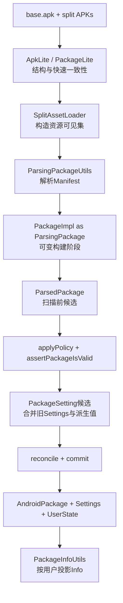
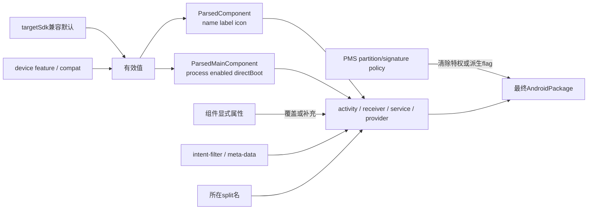
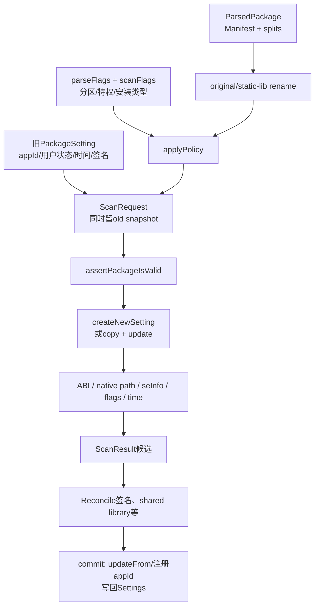

# 第548章 Android Manifest解析完整链：PackageParser2、ParsingPackage、组件属性合并与PackageSetting候选构建

> 源码基线：Android 11 / API 30 / `android-11.0.0_r48`。本章只在macOS上阅读和推演源码，不实际编译。建议先读第546章的Session安装事务和第547章的APK签名链；本章接住“stage里的APK已经不可变”之后，解释Manifest怎样变成PMS能使用的包模型。

## 1. 本章不是教你背Manifest标签

目标是建立一条可追溯的证据链：磁盘上的base/split APK，经ApkLite解析、AssetManager资源解析、`ParsingPackage`构建、PMS政策修正和Settings候选构建，最终才成为已安装包状态。你要能回答一个字段是从Manifest来的，还是PMS后加的。

## 2. 先记住三个绝对不能混的对象

`ParsedPackage`表示“这批APK声明了什么，并经扫描政策补了哪些派生字段”；`PackageSetting`表示“这个包在设备上的长期身份、appId、路径、签名、安装时间和每用户状态”；`ApplicationInfo/ActivityInfo`是查询时把前两者叠加后投影给调用者的快照。

## 3. 最好用“编译器前端”理解解析器

APK像源文件，二进制AndroidManifest像语法树输入，`ParsingPackage`像可变AST builder，组件对象像子节点，`ParseResult`像带错误上下文的返回值。PMS后续的policy/scan/reconcile则更像语义分析与链接，不是XML parser的一部分。

## 4. 六本账的心智模型

第一本是ApkLite结构账；第二本是base/split资源可见性账；第三本是Manifest声明账；第四本是组件继承与兼容默认账；第五本是PMS扫描政策账；第六本是`PackageSetting`长期设备状态账。问题出现时先定位哪本账，比全局搜某个flag更有效。

## 5. 第一幅图：从APK到已安装包的总链



## 6. system_server的主入口是PackageParser2

Android 11仍保留巨大的旧`android.content.pm.PackageParser`，但PMS新扫描链使用`com.android.server.pm.parsing.PackageParser2`。它本身是轻量外壳：管cache、线程局部`ParseInput`和server专用`PackageImpl`工厂，真正XML逻辑在`ParsingPackageUtils`。

## 7. PackageParser2为什么在services目录

核心解析工具在`frameworks/base/core`，不应直接依赖PMS内部状态；server外壳通过Callback接入真实设备feature和PlatformCompat，并把builder实现换成带system_server字段的`PackageImpl`。这是依赖倒置，不是两套重复parser。

## 8. Callback把环境问题留给PMS

`hasFeature()`询问设备是否有watch等feature，会影响条件权限和旧应用尺寸默认；`isChangeEnabled()`询问某个兼容性ChangeId是否对该package/targetSdk生效。纯文件默认parser则把hasFeature全当false，所以两个调用环境的结果不必完全一样。

## 9. ThreadLocal让一个parser服务四个并行线程

`ParallelPackageParser` 最多用4个foreground-priority worker，共享一个`PackageParser2`。`mSharedResult` 和临时`ApplicationInfo`是ThreadLocal，每线程重用自己的对象；`close()`只remove调用close那个线程的值，源码注释假定worker释放后其ThreadLocal也不再需要显式清理。

## 10. cache保存的是Parcelable PackageImpl

`PackageCacher` 把`ParsedPackage.writeToParcel()`的字节写到`/data/system/package_cache/<build-digest>/`，命中后用`new PackageImpl(Parcel)`恢复。它避免每次开机都重走XML与TypedArray，但不是`packages.xml`：cache可丢，Settings则承载安装身份。

## 11. cache命中条件比想象中窄

key只是`packageFile.getName() + '-' + flags`，新旧性只比较packageFile与cache文件mtime；不比内容hash。对cluster目录，直接原地改子APK内容未必更新目录mtime。build fingerprint和两个isolated-storage属性用来分cache目录，userdebug `eng.*`还用system目录mtime做启发式清理。

## 12. 解析是Lite与Full两阶段

Lite只快速取package/split/version/coreApp、ABI开关、SDK、overlay和部分application属性，为组包与加载资源做准备；Full再用Resources/TypedArray解决资源引用，建立所有组件与过滤器。Lite不是可以直接注册的简化PackageInfo。

## 13. 单APK与cluster从文件类型分流

`packageFile.isDirectory()`走cluster，普通文件走monolithic。cluster目录若只有一个子目录会再递归一层；遍历时只处理`.apk`文件。所以“目录里所有文件都是split”不成立。

## 14. 第一段关键源码：PackageParser2只做边界组装

```java
public ParsedPackage parsePackage(File packageFile, int flags, boolean useCaches)
        throws PackageParserException {
    if (useCaches && mCacher != null) {
        ParsedPackage parsed = mCacher.getCachedResult(packageFile, flags);
        if (parsed != null) return parsed;
    }

    ParseInput input = mSharedResult.get().reset();
    ParseResult<ParsingPackage> result =
            parsingUtils.parsePackage(input, packageFile, flags);
    if (result.isError()) {
        throw new PackageParserException(result.getErrorCode(),
                result.getErrorMessage(), result.getException());
    }
    ParsedPackage parsed = (ParsedPackage) result.getResult().hideAsParsed();
    if (mCacher != null) mCacher.cacheResult(packageFile, flags, parsed);
    return parsed;
}
```

这段可以用来定边界：内层用`ParseResult`传错，server边界才翻译成`PackageParserException`；返回类型从可变`ParsingPackage`窄化为PMS可后处理的`ParsedPackage`。

## 15. ApkLite先验package与split名

`parsePackageSplitNames()`要求第一个start tag必须是`<manifest>`，从无namespace的`package`与`split`属性取名。除`android`包特例外，package名必须是合法并含分隔点；split名不必含点，空split当null。

## 16. cluster一致性只先检两个核心字段

遇到第一个APK后记住packageName和32位versionCode，后续APK不一致就BAD_MANIFEST；splitName作为ArrayMap key，重复也失败；最后必须有splitName为null的base。此处没比versionCodeMajor，也没在Lite聚合处验完整签名关系。

## 17. split顺序不依赖文件系统遍历

Lite把剩余splitName数组用`sSplitNameComparator`排序，再按该顺序对齐`isFeatureSplits/usesSplitNames/configForSplits/codePaths/revisionCodes`。之后所有splitIndex都是这个对齐坐标，不是原始`listFiles()`位置。

## 18. PackageLite是一张组包清单

它记录baseCodePath、split arrays、feature/config依赖、isolatedSplits、ABI开关等，为`SplitAssetLoader`提供输入。组件列表、permission、intent-filter还没有读；把PackageLite打印出来不能证明Manifest已经通过全部语义检查。

## 19. DefaultSplitAssetLoader让所有APK共享一个资源视图

非isolated模式把base加全部split的`ApkAssets[]`一次塞给单个AssetManager，`getSplitAssetManager()`也返回同一对象。因此解某个split Manifest的resource reference时，可见的资源范围是整个包集。

## 20. isolated split用依赖树缩小资源视图

`SplitAssetDependencyLoader` 把base插在内部index 0，对某feature split只装入父链、它自己和指向它的config splits。对外splitIndex要`+1`才进内部树。这不仅影响运行时ClassLoader，在解Manifest资源引用时就已经生效。

## 21. Full parse读的是编译后二进制XML

AssetManager用`findCookieForPath()`找APK在资源集中的cookie，再打开`AndroidManifest.xml`；Resources与TypedArray负责解决resource ID、字符串、布尔和配置约束。它不是用普通文本XML库直接读源工程的Manifest。

## 22. cookie为0是资源装载失败

base和split入口都把cookie 0转成`INSTALL_PARSE_FAILED_BAD_MANIFEST`。打开parser后用try-with-resources关闭XML parser，外层finally关闭SplitAssetLoader。所以“XML语法没错就不会BAD_MANIFEST”不对，资源路径组装失败也能到这里。

## 23. base Manifest不允许自己带split名

Full base parse再调一次`parsePackageSplitNames()`，若读到非空splitName就报“Expected base APK”。Lite检查是组包层，Full检查是正在解的文件身份层；重复检查是为了保护后续对象不被错位输入污染。

## 24. PackageImpl构造时只先吃manifest根属性

Callback调`PackageImpl.forParsing(packageName, baseCodePath, codePath, manifestArray, coreApp)`。父类构造器从`<manifest>` TypedArray填versionCode/versionCodeMajor/revisionCode/versionName/compileSdk与isolatedSplits；其他字段由后续tag parser逐步setter填入。

## 25. ParsingPackage是写接口，ParsingPackageRead是读接口

`ParsingPackage` 继承`ParsingPackageRead`，添加大量`addXxx/setXxx`链式方法；`ParsingPackageRead`暴露components、permission、split、sdk、flags等getter。这是用Java类型约束记录阶段，不代表内存中已经有两份对象。

## 26. PackageImpl同时扮演三种视图

它继承`ParsingPackageImpl`，同时implements `ParsedPackage` 与`AndroidPackage`。`hideAsParsed()`和`hideAsFinal()`都返回`this`，只是把调用者手中可见的方法集缩小。不要画成“builder copy成parsed，再copy成final”。

## 27. hideAsFinal在r48并没真的不可变

方法内还有`TODO: Lock as immutable`，且服务端会在scan/commit前后继续调`ParsedPackage` setters。“Final”表达API使用意图，不是强制冻结；如果持有具体`PackageImpl`引用，技术上仍能改。

## 28. ParseInput与ParseResult其实是同一对象

`ParseTypeImpl implements ParseInput, ParseResult<Object>`，方法间传的泛型结果只是同一个线程局部状态容器的类型视图。一旦`error()`设了errorCode，父层必须继续return/bubble；这也是源码反复检`isError()`的原因。

## 29. deferred error把“新SDK才严格”收敛在一处

解`<uses-sdk>`前不知targetSdk的错误先按ChangeId存在map；target算出后`enableDeferredError()`通过PlatformCompat判定是继续还是失败。r48列出缺application/instrumentation、空intent action/category和压缩或未4字节对齐resources.arsc三类。

## 30. uses-sdk不是简单读两个int

min/target可以是数字或开发代号；target缺失时继承min。`computeTargetSdkVersion()`与`computeMinSdkVersion()`会对当前平台SDK/codenames做兼容检查，随后还能解`<extension-sdk>`的最小扩展版本map。

## 31. targetSdk是后续默认值的总开关

它决定默认硬件加速、cleartext traffic、requestLegacyExternalStorage、audio playback capture、resizeable activity、provider exported、屏幕支持、签名最低scheme与deferred errors。因此`parseBaseApplication()`开头就把targetSdk缓存到局部变量，源码注释还特别提醒避免setter/getter顺序耦合。

## 32. 兼容性不只是`if targetSdk < X`

有的规则直接按target分支，有的走`ParseInput.DeferredError`再查PlatformCompat。后者允许开发环境对单包启停change，所以两个targetSdk相同的测试包也可能在特定compat配置下得到不同的deferred-error结果。

## 33. base Manifest顶层tag是一个明确分发表

`parseBaseApkTag()`处理overlay、key-sets、attribution、permission/group/tree、uses-permission/sdk/configuration/feature、instrumentation、original/adopt permission、restrict-update与Android 11的queries。`<application>`因有唯一性和大量子tag，被外层特别处理。

## 34. 未知tag在r48默认是警告并跳过

`PackageParser.RIGID_PARSER` 是false，`ParsingUtils.unknownTag()`打warning、`XmlUtils.skipCurrentTag()`后返回成功null。所以Manifest有拼错的新属性子tag可能不会拒绝安装，而是被整段忽略；读log是发现这类问题的关键。

## 35. application不是对所有target都必需

base没`<application>`且也没instrumentation时走`MISSING_APP_TAG`延迟错误。该change是Q之后启用，旧target可兼容通过；`ParsingPackageImpl.enabled`还特意初始化true，就是防止旧包无application时未走赋值逻辑而被错误禁用。

## 36. uses-permission列表是“有效请求集”

名字不读可随配置改变的resource；`maxSdkVersion`低于当前RESOURCES_SDK时忽略；`requiredFeature`在设备没feature时忽略，`requiredNotFeature`则在设备有feature时忽略。重复声明只warning，列表不重复添加。

## 37. 文件默认parser会改变条件权限结果

`forParsingFileWithDefaults()`的Callback把所有feature当false，注释明确说：它会保留所有`requiredNotFeature`权限，排除所有`requiredFeature`权限。PMS正式扫描则调`hasSystemFeature()`，不要拿离线parser的请求权限集当设备真实结果。

## 38. parser还会隐式增加权限

`convertNewPermissions()`为目标版本早于某权限引入版本的老应用补权限；`convertSplitPermissions()`从PermissionManager取分裂规则，旧target请了老权限时补新权限。新增项同时进requested与implicit列表，因此最终数组可以不等于XML逐字列表。

## 39. queries是Android 11包可见性的输入

`<queries>`能记录package name、provider authorities或限制形状的Intent。Intent至少有action或data，action/type/scheme/host各最多一个；MIME类型没`/`时补`/*`，只给type时会构造`content://*/*`形状。这是查询能力声明，不是intent-filter注册。

## 40. queries provider把分号字符串拆成Set

provider authorities用`StringTokenizer(authorities, ";")`逐个加入`queriesProviders`集合，重复自然去重。r48的package分支获取TypedArray后没有像provider分支一样在finally调`recycle()`，是一个局部资源回收不对称边界。

## 41. application属性先填包级默认

`parseBaseApplication()`先解应用类名、label、大批boolean/int/resource/string，再解backup、persistent、resizeable、taskAffinity、factory、process和classLoader。之后才遍历activity/receiver/service/provider/alias与其他子tag，让组件能读到包级默认。

## 42. 第二段关键源码：默认值是明确的兼容政策

```java
pkg
    .setAllowBackup(bool(true,
            R.styleable.AndroidManifestApplication_allowBackup, sa))
    .setHasCode(bool(true,
            R.styleable.AndroidManifestApplication_hasCode, sa))
    .setDebuggable(bool(false,
            R.styleable.AndroidManifestApplication_debuggable, sa))
    .setAllowAudioPlaybackCapture(bool(targetSdk >= Build.VERSION_CODES.Q,
            R.styleable.AndroidManifestApplication_allowAudioPlaybackCapture, sa))
    .setBaseHardwareAccelerated(bool(targetSdk >= Build.VERSION_CODES.ICE_CREAM_SANDWICH,
            R.styleable.AndroidManifestApplication_hardwareAccelerated, sa))
    .setRequestLegacyExternalStorage(bool(targetSdk < Build.VERSION_CODES.Q,
            R.styleable.AndroidManifestApplication_requestLegacyExternalStorage, sa))
    .setUsesCleartextTraffic(bool(targetSdk < Build.VERSION_CODES.P,
            R.styleable.AndroidManifestApplication_usesCleartextTraffic, sa));
```

“Manifest没写”不等于Java默认false。parser会根据targetSdk和历史行为主动选值，然后把有效值写入包模型。

## 43. 局部变量是为了防止解析顺序偶合

方法注释要求：对本方法刚设的字段尽量使用局部变量，不要立刻用getter反读。原因是移动赋值顺序可能改变默认计算。这提醒我们：parser不是一组可任意重排的setter。

## 44. application级属性并不全都会被信任

XML先记`persistent/defaultToDeviceProtectedStorage/directBootAware/coreApp/protectedBroadcast/permission priority`等声明，但后面`applyPolicy()`会对非系统包清除或降级。解析成功只证明语法与初步语义成功，不证明应用获得了这项特权。

## 45. 类名有三种写法

`ParsingUtils.buildClassName(pkg, name)`对`.MainActivity`前加package，对不含点的`MainActivity`加`package + '.'`，已含点的完整名原样保留。空名返回null；平台保留的App Details activity类名不允许应用自己声明。

## 46. process名是“组合名”而不是类名

`:remote`被展开为`package:remote`，全局进程名要满足package式名字，`system`是特例。`PARSE_IGNORE_PROCESSES`会把除system以外的自定义进程收敛到默认进程；`debug.separate_processes`又能在调试时将指定名强制收回package进程。

## 47. taskAffinity的空字符串有特别含义

attribute不存在时继承默认，显式写空字符串时返回null，`:name`按package展开。因此“缺失”与“显式空”在Manifest合并中不等价，这类三态还出现在resizeable与屏幕支持字段。

## 48. application permission是大多数组件的后备值

Activity非alias、receiver和service在自己permission缺失时用`pkg.getPermission()`；provider的read/write先继承provider通用permission，再继承application permission。这是解析时将默认实体化，后续通常直接读组件最终permission。

## 49. label和icon也要区分resource与字面量

TypedValue是resource ID时填`labelRes`，否则保留`nonLocalizedLabel`；启用圆形图标配置且roundIcon非0时优先roundIcon，否则用icon。运行时用户自定义label/icon还会通过PackageSetting状态在Info投影阶段再覆盖。

## 50. backup子属性只在allowBackup为true时解

backupAgent、killAfterRestore、restoreAnyVersion、fullBackupOnly、backupInForeground只在允许backup的分支里填。`fullBackupContent=false`被编成-1，true是0，resource则保留资源ID。不能把这个int只当普通boolean。

## 51. persistentWhenFeatureAvailable是设备依赖的属性合并

Manifest先必须`persistent=true`；若又指定required feature，只有PMS Callback确认设备具备才设persistent。即使这一步为true，非系统包也会在`applyPolicy()`被清回false。

## 52. debuggable会推导profileableByShell

basic flags先读debuggable，随后`setProfileableByShell(old || debuggable)`；`<profileable shell="true">`也用OR合并，不会把已由debuggable得到的true改回false。Lite parser也做同样推导，但Full结果才是后续权威包模型。

## 53. resizeable是三层选择

application显式属性保存为可空Boolean；未写时，target N+设`resizeableActivityViaSdkVersion`；activity自己若显式写则最优先，否则用application显式值、SDK推导，最后再按屏幕方向选force-resizable兼容模式。

## 54. 组件对象不直接就是ActivityInfo

parser建`ParsedActivity/ParsedService/ParsedProvider/ParsedInstrumentation`等内部模型。Activity和receiver共用`ParsedActivity`，因为大量属性相同；接口注释也承认这容易混淆。公开`ActivityInfo`要等查询时再生成。

## 55. ParsedComponentUtils先处理所有组件的共性

它要求android:name，展开类名，写packageName，解round/icon、logo、banner、description与label。只有属性显式提供且资源ID非0时才写组件icon；它不在此处复制application的icon。

## 56. ParsedMainComponentUtils再加可运行组件共性

它在common component上增directBootAware、enabled、process和splitName。任一组件directBootAware会把包的`partiallyDirectBootAware`置true；进程缺失时继承application process。splitName只记“启动时要加载哪个split”，不代表组件独立进程。

## 57. 第二幅图：属性的继承与覆盖



## 58. activity与receiver共享入口，但并非行为相同

parser用当前tag是否`receiver`分支。Activity解theme、launchMode、configChanges、orientation、resize、PiP、window layout等；receiver强制LAUNCH_MULTIPLE、configChanges 0，只增SINGLE_USER等适用flag。`cantSaveState`应用不允许receiver留在主进程。

## 59. activity/receiver/service未写exported时看intent-filter

它们先记录attribute是否真的存在，遍历子tag后，若未显式设exported，则`intents.size() > 0`就导exported true。没action的activity filter会warning并以成功null返回，不会进intents，因而不会为默认exported“充数”。

## 60. 不要把Android 12的exported强制规则倒灌到r48

Android 11 r48这段没有“target 31+且有filter必须显式android:exported”的安装拒绝，仍使用历史默认。学习新文档时要把平台版本分开，否则会在r48源码中搜不到你以为必然存在的检查。

## 61. intent-filter是结构化匹配器

parser读priority/order/label/icon/autoVerify，再读action、category和data的MIME/scheme/SSP/host/port/path。非法MIME直接错误；是否允许glob、autoVerify、无action filter与隐式instant visibility，由不同组件入口传参决定。

## 62. 空action/category与缺失name不是同一错误

name属性缺失一直是硬错；name存在但字符串为空，parser仍先把空值加入filter，再登记`EMPTY_INTENT_ACTION_CATEGORY`延迟错误。对target R通常失败，老target可保留历史行为。

## 63. instant-app可见性同时有显式与隐式

组件`visibleToInstantApps=true`会给filter标explicit visibility并把包级visible置true；Activity的BROWSABLE或SEND/SENDTO/SEND_MULTIPLE还可以得到implicit visibility。Service/provider调filter parser时禁用隐式暴露，不能把一套规则套在全部组件上。

## 64. activity-alias必须在目标Activity之后声明

parser在当前已添加的activities列表中线性找`targetActivity`，找不到就失败。这意味着XML顺序有语义；alias不是等整棵Manifest读完后再做全局链接。

## 65. alias会复制目标，但permission故意不继承

`ParsedActivity.makeAlias()`以目标为基础，再解alias可覆盖的name/label/icon/enabled/exported等。但alias permission直接设为自己attribute，缺失就是null，不继承目标或application permission；注释明说，若需相同保护必须重新声明。

## 66. service的特有字段在common之后解

它读foregroundServiceType、STOP_WITH_TASK、ISOLATED_PROCESS、EXTERNAL_SERVICE、USE_APP_ZYGOTE和SINGLE_USER。有filter会取最大order；filter无action在service入口`failOnNoActions=false`，仍可被添加，这与activity返回null的行为不同。

## 67. provider有一个不可缺的authority身份

common字段后读authorities、syncable、read/write permission、grant/force URI permission、multiprocess、initOrder和SINGLE_USER。authority为null或空字符串都是硬错；与`<queries><provider>`不同，这里保存的是provider自己发布名。

## 68. provider的exported兼容默认不看filter

`sa.getBoolean(exported, targetSdk < JELLY_BEAN_MR1)`：API 16及以下目标默认true，更新target默认false。它不走activity/service的“有filter就默认exported”逻辑，因为ContentProvider的访问面主要由authority与URI permission表达。

## 69. provider permission的继承是两步后备

readPermission缺失时用provider通用permission，还是null则用application permission；writePermission同理。显式空值是否被TypedArray读为null要看属性类型，读源码时不要简化成一个Elvis表达式就忽略层次。

## 70. grant-uri-permission与path-permission是两类数组

grant pattern优先级是pattern→prefix→literal，添加后还强制`grantUriPermissions=true`；path permission先确认至少有read/write permission，path优先级是advanced glob→simple glob→prefix→literal。这些只建立访问规则，不在parse时发放任何URI grant。

## 71. instrumentation在application之外

`<instrumentation>`是Manifest顶层tag，不是application子组件。它解targetPackage、targetProcesses、handleProfiling、functionalTest与meta-data；因此一个没application但有instrumentation的包可通过“至少一种入口”检查。

## 72. meta-data是按name写Bundle

`android:resource`非0时保留resource ID；否则`android:value`支持string、boolean、int/color和float。缺name或同时缺resource/value是错误。应用级和组件级分别持有Bundle，不是所有meta-data混成一张全局表。

## 73. 同一Bundle里的重名meta-data以后解的为准

parser复用现有Bundle并调`putXxx(name, value)`，不做重名拒绝。base application之后解split application的meta-data，所以split中同name可覆写先前应用级值；组件自己的Bundle则与application Bundle分开。

## 74. order会影响部分组件列表顺序

每个activity/receiver/service取所属filter的最大order；base application发现任一非0 order才对对应列表降序sort，避免普通包的额外排序开销。Provider也记order，但`ParsingPackageImpl`没提供`sortProviders()`。

## 75. parser会为普通应用人工增加隐藏Activity

Full解完application后，若不是static shared library，调`generateAppDetailsHiddenActivity()`加一个转到应用详情页的内部Activity。它不在开发者Manifest中，却存在`pkg.getActivities()`；用组件数反推XML声明数时要减去这个平台生成项。

## 76. aspect ratio是解完全部Activity后的post-pass

Activity显式属性最优先；否则max用activity meta-data、application属性/meta-data与pre-O默认，min用application属性或pre-Q默认，watch又有自己默认。这就是为什么必须等所有meta-data读完再补。

## 77. hasDomainUrls也是派生包字段

parser遍历activities的filters，源码先查`hasAction(Intent.ACTION_VIEW)`，又查`hasAction(Intent.ACTION_DEFAULT)`，再要求HTTP/HTTPS scheme。关键是`Intent.ACTION_DEFAULT`在r48定义为`ACTION_VIEW`别名，因此这里实际重复检查VIEW，并没有检查`CATEGORY_DEFAULT`。方法上方“DEFAULT / VIEW”注释容易让人读错，应以常量定义和实际调用为准。

## 78. direct boot有包级与组件级两层

application directBootAware写包级flag，组件各自属性写component flag并可推导partiallyDirectBootAware。对system app，`applyPolicy()`若看到包级directBootAware，会后处理为“所有组件directBootAware”；非system app则会清包级该特权。

## 79. split Manifest只能补application的有限子集

split顶层只认`<application>`，其他Manifest直接子tag当unknown；application属性只读`hasCode`和`classLoader`，然后允许新增四大组件、alias、meta-data、uses-library/static-library与uses-package。split不能重新定义base的targetSdk或包级permission。

## 80. split hasCode是每split一个bit

`asSplit()`先按split数量建`splitFlags[]`和`splitClassLoaderNames[]`；解每个split application时，`setSplitHasCode(index, bool(default true))`单独翻`ApplicationInfo.FLAG_HAS_CODE`。后面`assertCodePolicy()`可以用该bit检查声称有代码的split是否真有`classes.dex`。

## 81. split内组件默认继承所在splitName

组件自己未显式写splitName时，解完后填`pkg.getSplitNames()[splitIndex]`。这个字段让运行时启动组件前知道应加载哪个代码split；如果组件显式写了别的splitName，这一步不覆盖。

## 82. base排序之后追加split组件，没再全局sort

`parseBaseApplication()`在base结束时sort activities/receivers/services；`parseClusterPackage()`随后才逐split parse并append组件，`parseSplitApplication()`不维护hasOrder也不重排。因此r48最终列表不是必然的全包order降序，split组件可能就按split解析顺序追在后面。

## 83. split application meta-data与base合并同一Bundle

split child parser把`pkg.getMetaData()`传回`parseMetaData()`再set回，所以是增量合并，不是每split一个Bundle。同name后写覆盖，且split解析顺序来自排序后splitNames；这使同名冲突有确定但容易忽略的顺序语义。

## 84. uses-library的required声明会升级optional

必需library会加入required列表并从optional移除；optional声明只在required里没同名时添加。所以base先写optional、split后写required时最终是required；反向声明也不会抅required降级。

## 85. static shared library在parse与scan各有约束

parse要求name/version合法，不允许sharedUserId或一包声明多个static library，且不为它生成隐藏App Details Activity。PMS随后把packageName改成含library version的synthetic name，并在assert阶段禁activity/service/provider/receiver/permission等大量声明。

## 86. overlay条件不满足会返回SKIPPED错误

Full parser若required system property不匹配，调`input.skip(message)`，本质是errorCode `INSTALL_PARSE_FAILED_SKIPPED`，不是成功包上标一个disabled。Lite parser却是把targetPackage清null后成功返回；最终Full边界才决定不纳入扫描。

## 87. 验签与Manifest解析是显式分层

`ParsingPackageUtils` 注释明确说cluster/monolithic parse本身不负责验签；只在parse flags含`PARSE_COLLECT_CERTIFICATES`时才于Full base入口收集。r48 cluster入口把0而不是原flags传给Lite，且Full base收集时还未`asSplit()`，所以不能把这条可选parse flag路径当成split签名一致性的完整保证。PMS默认`mDefParseFlags`通常是0，后面`addForInitLI()`再用`getSigningDetails(parsedPackage, ...)`遍历base与全部splits，根据Settings mtime、system partition和fs-verity情况收集或复用签名。

## 88. cache中的SigningDetails通常是UNKNOWN

开机并行parser的parseFlags通常不含COLLECT_CERTIFICATES，Full parse会显式`setSigningDetails(UNKNOWN)`然后入cache。命中cache不代表跳过签名安全判定；后续`collectCertificatesLI()`仍要把Settings旧签名或新验证结果写回ParsedPackage。

## 89. parser不分配UID，也不决定安装用户

`PackageImpl.uid`初始是-1，`PackageParser2`的compat临时ApplicationInfo.uid也是-1。解析阶段不知新appId、每用户installed/stopped/enabled状态、installer来源和签名连续性；这些必须与Settings和安装请求合并。

## 90. 第三幅图：ParsedPackage与PackageSetting怎样合流



## 91. 扫描前可能先改packageName

static shared library用`name + "_" + version`类似的synthetic name进PMS索引；original-package迁移若命中旧Settings，`ensurePackageRenamed()`又可把ParsedPackage改为旧名。`PackageImpl.setPackageName()`会逐个改permission/group/components/instrumentation的packageName，但`manifestPackageName`保留Manifest原名。

## 92. ScanRequest同时携带新包、旧包和多份Settings

它有parsedPackage、oldPkg、pkgSetting、oldPkgSetting copy、disabled system setting、original setting、sharedUser、realName、parse/scan flags、user和ABI override。这是候选计算的输入快照，还不是已提交的系统事实。

## 93. applyPolicy把“文件在哪里”变成包特权

`SCAN_AS_SYSTEM/PRIVILEGED/OEM/VENDOR/PRODUCT/SYSTEM_EXT/ODM`来自扫描目录与安装上下文，不来自普通Manifest自报。applyPolicy把它们写入ParsedPackage，因而同一APK放在受信system分区与/data扫描时可得到不同有效特权。

## 94. system directBootAware会扩散到所有组件

如果包被标system且application directBootAware为true，policy调`setAllComponentsDirectBootAware(true)`改所有activity/receiver/provider/service。这是Manifest解析后的批量变换，所以某组件最终true不一定是它的XML tag亲自写了attribute。

## 95. 非系统包会被清理特权声明

policy清protected broadcasts、coreApp、persistent、default-to-device-protected和application directBootAware，permission group priority归零；随后还清originalPackages/realPackage/adoptPermissions。非privileged包的SINGLE_USER receiver/service/provider被强制not exported。

## 96. signedWithPlatformKey是扫描派生字段

package名是`android`直接true，否则将platform package当前签名与候选包当前签名做exact comparison。它不是Manifest boolean，也不在第547章的PoR capability中直接推导；这里按r48源码是当前signatures精确比较。

## 97. backward compatibility还会改uses-library列表

`PackageBackwardCompatibility.modifySharedLibraries(parsedPackage, isUpdatedSystemApp)`根据target、系统库规则和是否更新system app添删uses-library。所以最终依赖列表也可不等于Manifest原文；这与permission split一样是“有效模型”思维。

## 98. assertPackageIsValid是无副作用语义检查层

当parse flags含`PARSE_ENFORCE_CODE`时，它才检查声称hasCode的base/split是否真有classes.dex；无条件或按scan场景还检查code path、APEX重名、keyset、android包唯一、重复package、static library约束、known path、provider authority冲突、显式process列表、privileged sharedUser与overlay政策等。“XML能解”远不是“包可安装”。

## 99. `<processes>`是白名单而非自动创建进程

parser读每个`<process android:process>`及GWP-ASan和INTERNET deny/allow集，同名process重复失败。若map非空，assert要求application和所有四大组件使用的processName都在map中；列出process只是规则声明，不会在安装时启动Linux进程。

## 100. provider authority冲突要等组件索引环境才能判

parser只知当前包的authority是否缺失；PMS `mComponentResolver.assertProvidersNotDefined(pkg)`才能和已安装全局provider索引比较。该检查只在`SCAN_NEW_INSTALL`做，避免因历史已安装状态而破坏升级/开机重扫。

## 101. PackageSetting候选把“文件声明”与“设备记忆”合并

包名、version、有效flags、code/resource path、ABI与static library声明主要由新ParsedPackage输入；appId、每用户installed/stopped/enabled/hidden/suspended、安装来源、时间、旧签名和权限状态需从Settings延续或新建。

## 102. 第三段关键源码：新建与更新候选分流

```java
final boolean createNewPackage = (pkgSetting == null);
if (createNewPackage) {
    pkgSetting = Settings.createNewSetting(
            parsedPackage.getPackageName(), originalPkgSetting,
            disabledPkgSetting, realPkgName, sharedUserSetting,
            destCodeFile, destResourceFile,
            parsedPackage.getNativeLibraryRootDir(),
            AndroidPackageUtils.getRawPrimaryCpuAbi(parsedPackage),
            AndroidPackageUtils.getRawSecondaryCpuAbi(parsedPackage),
            parsedPackage.getVersionCode(), pkgFlags, pkgPrivateFlags, user,
            true, instantApp, virtualPreload, UserManagerService.getInstance(),
            usesStaticLibraries, parsedPackage.getUsesStaticLibrariesVersions(),
            parsedPackage.getMimeGroups());
} else {
    pkgSetting = new PackageSetting(pkgSetting);
    pkgSetting.pkg = parsedPackage;
    Settings.updatePackageSetting(pkgSetting, disabledPkgSetting, sharedUserSetting,
            destCodeFile, destResourceFile, parsedPackage.getNativeLibraryDir(),
            AndroidPackageUtils.getPrimaryCpuAbi(parsedPackage, pkgSetting),
            AndroidPackageUtils.getSecondaryCpuAbi(parsedPackage, pkgSetting),
            PackageInfoUtils.appInfoFlags(parsedPackage, pkgSetting),
            PackageInfoUtils.appInfoPrivateFlags(parsedPackage, pkgSetting),
            UserManagerService.getInstance(), usesStaticLibraries,
            parsedPackage.getUsesStaticLibrariesVersions(), parsedPackage.getMimeGroups());
}
```

分流产生的是ScanResult候选；新appId还要乐观注册，签名还要reconcile，真正替换全局Settings要等commit。

## 103. 全新非system包的用户默认是stopped且notLaunched

`createNewSetting()`遍历用户，根据installUser/USER_ALL和ADB限制决定installed，然后stopped=true、notLaunched=true，enabled state为DEFAULT，hidden/suspended为false，并写instant/virtualPreload。这是设备安装状态，Manifest里的application enabled只是另一层输入。

## 104. original/disabled/sharedUser会改变新Setting的身份来源

original package迁移会copy旧Setting、更换路径和新建signatures容器；disabled system package可继承appId、signatures、permission state与用户component override；sharedUser则直接使用shared userId。所以“新APK”不必对应“新UID”。

## 105. “deep copy”注释与实现有重要差距

`scanPackageOnlyLI()`注释说对旧Setting做deep copy，但`PackageSettingBase` copy构造器自述是one-level/shallow：`signatures/keySetData/verificationInfo`等保留引用，每用户`PackageUserState`也只把原value放入新SparseArray；PackageSetting额外深拷mime group sets，却继续共享旧`pkg`与sharedUser。候选隔离并非完全。

## 106. updatePackageSetting只更新它负责的那些字段

sharedUser发生变化直接报`INSTALL_FAILED_SHARED_USER_INCOMPATIBLE`；code/resource path变化时更新并根据system身份处理installed状态；system/privileged/partition bits先清再写；ABI、static libraries和mime group declarations同步。它不在此处重置所有用户状态。

## 107. ABI、native path与seInfo都不是纯Manifest值

scan会根据包内native libs、开机/升级状态、旧Settings、ABI override、sharedUser与平台zygote派生ABI和native library paths；SELinux MMAC用签名、包政策和sharedUser派生seInfo。这些最后同时回写ParsedPackage与PackageSetting候选。

## 108. 时间戳也是扫描规则而非文件属性照搬

有currentTime时，首次安装设firstInstall/lastUpdate，更新flag下改lastUpdate；currentTime为0且首次时用扫描文件mtime；system dir重扫如mtime变了也可当update time。然后Setting timestamp统一记`getLastModifiedTime(parsedPackage)`。

## 109. commit前ParsedPackage还会继续变

scan会写system/privileged、ABI/native paths、seInfo、factoryTest、最终packageName等；commit对`android`包还覆盖version为平台SDK，在appId就绪后才`parsedPackage.setUid(pkgSetting.appId)`，然后`hideAsFinal()`。这进一步证明ParsedPackage是扫描候选，不是parse返回瞬间就冻结。

## 110. 查询时还要把PackageUserState叠上去

`PackageInfoUtils.generateApplicationInfo()`先按user state与query flags判断installed/hidden/known package可见性，再从AndroidPackage生成无状态Info，叠加updated-system、shared library files、ABI、seInfo等Setting字段。组件Info还会应用用户的enabled/disabled component和自定义label/icon。

## 111. 从一个异常字段反向定位的检查表

包/split/version错先查ApkLite；resource reference错查AssetLoader/cookie/TypedArray；组件name/process/permission/exported查component parser与继承层；权限或library多出项查compat conversion；system/privileged/directBoot不符查applyPolicy；UID、用户installed/enabled、时间和签名查PackageSetting/reconcile；对外Info不符再查PackageInfoUtils投影。

## 112. macOS只读练习一：追PackageParser2与Lite/Full分层

```bash
cd /Users/ninebot/androidSource
sed -n '120,185p' frameworks/base/services/core/java/com/android/server/pm/parsing/PackageParser2.java
sed -n '228,390p' frameworks/base/core/java/android/content/pm/parsing/ParsingPackageUtils.java
sed -n '85,205p' frameworks/base/core/java/android/content/pm/parsing/ApkLiteParseUtils.java
```

预期：看到cache→ThreadLocal ParseInput→ParsingPackageUtils→hideAsParsed，并能区分cluster的Lite一致性检查和Full Manifest组件解析。

## 113. macOS只读练习二：验证属性继承和组件默认

```bash
cd /Users/ninebot/androidSource
sed -n '1611,1990p' frameworks/base/core/java/android/content/pm/parsing/ParsingPackageUtils.java
sed -n '35,135p' frameworks/base/core/java/android/content/pm/parsing/component/ParsedMainComponentUtils.java
sed -n '287,375p' frameworks/base/core/java/android/content/pm/parsing/component/ParsedActivityUtils.java
```

预期：对照targetSdk默认、application包级值、main component继承与activity显式覆盖，确认未写exported的历史推导发生在读完filter之后。

## 114. macOS只读练习三：验证split合并与后处理

```bash
cd /Users/ninebot/androidSource
sed -n '510,710p' frameworks/base/core/java/android/content/pm/parsing/ParsingPackageUtils.java
sed -n '770,815p' frameworks/base/core/java/android/content/pm/parsing/ParsingPackageImpl.java
rg -n "generateAppDetailsHiddenActivity|setMaxAspectRatio|hasDomainURLs|convertSplitPermissions" \
  frameworks/base/core/java/android/content/pm/parsing/ParsingPackageUtils.java
```

预期：看到split只读有限application子集、组件继承所在splitName，并确认base的sort/post-pass与split append之间的真实顺序。

## 115. macOS只读练习四：验证Policy与PackageSetting候选

```bash
cd /Users/ninebot/androidSource
sed -n '11795,11865p' frameworks/base/services/core/java/com/android/server/pm/PackageManagerService.java
sed -n '11414,11750p' frameworks/base/services/core/java/com/android/server/pm/PackageManagerService.java
sed -n '610,850p' frameworks/base/services/core/java/com/android/server/pm/Settings.java
sed -n '90,220p' frameworks/base/services/core/java/com/android/server/pm/PackageSettingBase.java
```

预期：把Manifest声明、scanFlags政策、旧Setting长期状态和ABI/seInfo/time派生值分开，并亲自看到copy构造器的shallow-copy说明。

## 116. 常见故障定位矩阵

BAD_PACKAGE_NAME查manifest package/split命名；BAD_MANIFEST查base身份、cookie、组件必填字段和子tag语义；SKIPPED查overlay required property；MISSING_APP查target/compat change；PROCESS_NOT_DEFINED查`<processes>`白名单；DUPLICATE_PACKAGE/provider查PMS全局索引；SHARED_USER_INCOMPATIBLE查旧Setting而不是XML parser；Info查询不到还要查用户state与flags。

## 117. 最容易出现的十六个误解

一，PackageParser2包含所有XML逻辑；二，Lite结果就能注册组件；三，parse默认完成验签；四，cache是packages.xml；五，没写boolean就是false；六，ParsedPackage就是PackageSetting；七，hideAsFinal已冻结对象；八，activity和receiver用完全不同模型；九，所有组件的exported默认都一样；十，alias自动继承目标permission；十一，split能覆盖所有base属性；十二，组件order必然全包排序；十三，requestedPermissions等于XML原文；十四，system/privileged来自Manifest；十五，扫描候选已提交Settings；十六，新APK一定获得新UID。

## 118. 本章源码导航

server外壳看`frameworks/base/services/core/java/com/android/server/pm/parsing/PackageParser2.java`和`PackageCacher.java`；Lite/Full主链看`frameworks/base/core/java/android/content/pm/parsing/ApkLiteParseUtils.java`、`ParsingPackageUtils.java`与`split/*AssetLoader.java`；数据模型看`ParsingPackage*.java`、`component/Parsed*Utils.java`和server端`parsing/pkg/PackageImpl.java`；政策与候选看PMS的`applyPolicy()`、`assertPackageIsValid()`、`scanPackageOnlyLI()`，以及`Settings.java`、`PackageSetting*.java`；对外投影看`parsing/PackageInfoUtils.java`。

## 119. 生成后复读修正记录

第二遍按调用顺序复核后，已避免把PackageParser2写成XML实现本体、把Lite写成完整包模型、把cache命中写成跳过验签、把`hideAsFinal()`写成真冻结、把scan候选写成已commit。又补出cluster Lite只比32位versionCode、COLLECT_CERTIFICATES在cluster parse中不完整覆盖splits、cache key/mtime窄边界、queries package TypedArray未recycle、`ACTION_DEFAULT == ACTION_VIEW`导致domain URL重复检VIEW而没检DEFAULT category、base sort后split append不重排，以及PackageSetting“deep copy”注释与shallow-copy实现差异等r48边界。四组macOS只读命令已在本机实际跑通。

## 120. 本章小结与下一章入口

现在应能把一个包字段沿六层追回去：ApkLite确认组包结构，AssetLoader决定资源可见性，ParsingPackage累积Manifest与兼容默认，component parser实体化继承值，PMS policy按信任边界修正，PackageSetting候选再合并设备长期状态。下一章将继续追组件怎样进入PMS索引：ComponentResolver、ActivityIntentResolver、Provider authority、IntentFilter匹配、包可见性与查询结果生成链。
