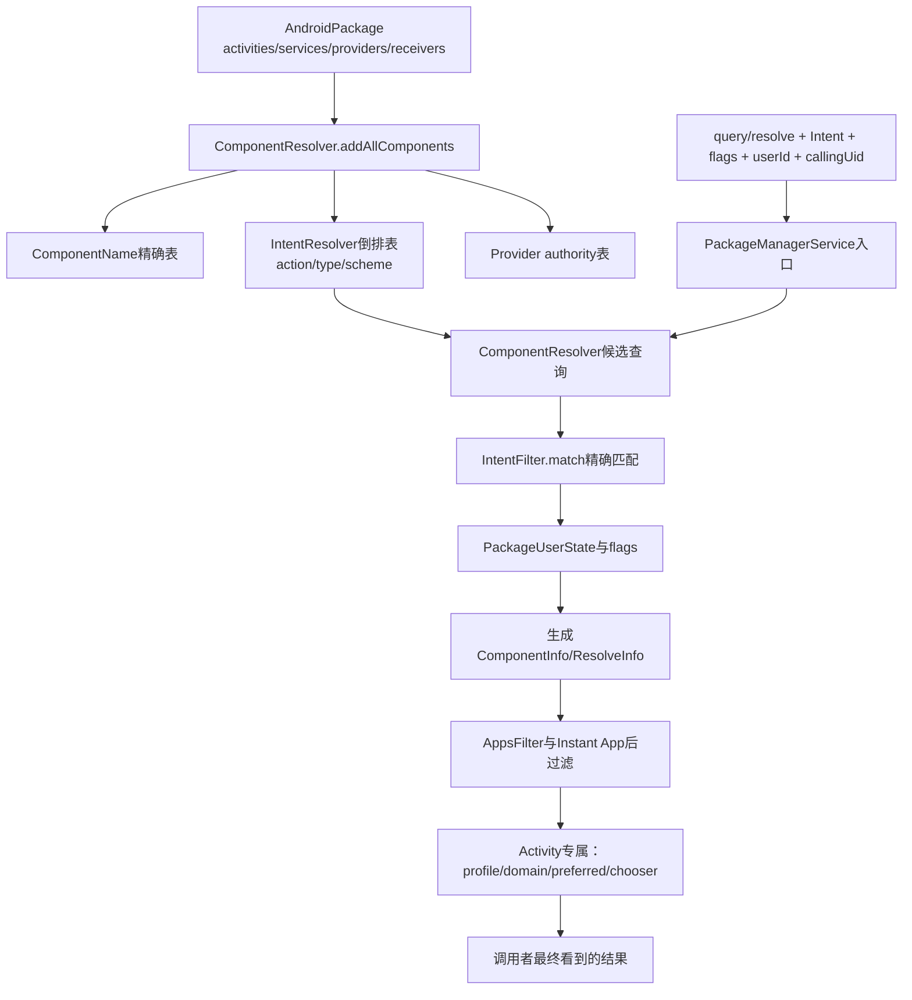
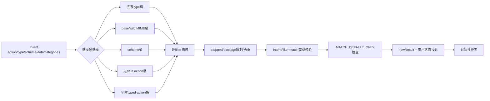
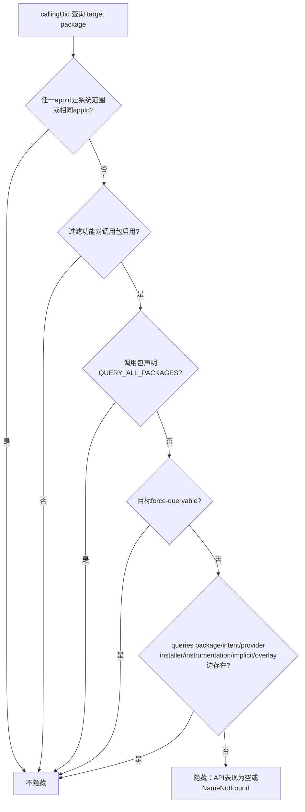

# 第549章 Android 组件查询完整链：ComponentResolver、IntentResolver、Provider Authority、包可见性与ResolveInfo

> 源码基线：Android 11 / API 30 / `android-11.0.0_r48`。本章只在macOS上阅读和推演源码，不实际编译。建议先读第548章：上一章把Manifest变成`AndroidPackage`与`PackageSetting`候选，本章接着回答“包安装完成后，系统怎样把组件放进索引，又怎样从一个Intent得到调用者最终可见的结果”。

## 1. 本章要解决的不是一个`match()`函数

一次组件查询至少跨过四道门：组件是否已经注册、IntentFilter是否匹配、组件对目标用户是否可用、目标包对调用UID是否可见。活动查询还可能叠加跨profile、域名优选、即时应用和ResolverActivity选择。只看`IntentFilter.match()`，最多解释“语法候选”，解释不了最终返回值。

## 2. 先建立七本账

第一本是Manifest解析后的组件声明账；第二本是`ComponentName -> ParsedComponent`精确索引；第三本是action/type/scheme等Intent倒排索引；第四本是`authority -> ParsedProvider`索引；第五本是每用户installed/enabled/stopped/direct-boot状态；第六本是调用者到目标包的可见性关系；第七本才是本次查询产生的`ResolveInfo`快照。七本账不能互相替代。

## 3. 查询“存在”与查询“可启动”不是同一个问题

`PackageManager.queryIntentActivities()`的职责是返回当前查询语义下的候选；真正启动时，ATMS/ActivityStarter还要检查`exported`、组件权限、AppOp、后台启动限制等。反过来，一个组件在全局索引中存在，也可能因用户未安装、被禁用、包可见性或即时应用规则而不出现在查询结果中。

## 4. 代码运行在哪里

应用侧`ApplicationPackageManager`通过`IPackageManager` Binder进入`system_server`里的`PackageManagerService`。`ComponentResolver`、`IntentResolver`和`AppsFilter`都在`system_server`进程内运行；普通查询主要在PMS Binder线程上同步完成。`AppsFilter`的全量可见性cache可由专用`appsFilter` HandlerThread后台构建，但真正读规则仍受其锁和PMS状态约束。

## 5. 本章的三个核心类型

`ComponentResolver`是PMS的组件目录和四类resolver总管；`IntentResolver<F,R>`是通用倒排索引与精确匹配算法；`AppsFilter`是Android 11包可见性策略。前两者回答“哪些组件匹配”，后者回答“这个调用者能否获知这些包”。`ResolveInfo`只是把结果投影出去的容器，不是长期数据库记录。

## 6. 第一幅图：从安装提交到查询结果



## 7. 组件何时进入索引

安装扫描完成并把包加入PMS内部状态时，`PackageManagerService.addPackage()`附近调用`mComponentResolver.addAllComponents(pkg, chatty)`，随后调用`mAppsFilter.addPackage(pkgSetting, isReplace)`。所以组件索引和包可见性关系是两套相邻但独立维护的结构；不能因为Intent索引里有目标就认定任何应用都可枚举它。

## 8. `addAllComponents()`一次注册四类组件

方法在同一个`mLock`临界区内依次执行`addActivitiesLocked()`、`addReceiversLocked()`、`addProvidersLocked()`和`addServicesLocked()`。锁外再处理新activity filter的优先级，因为那一步会回调`PackageManagerInternal`查询Setup Wizard和被替换的system package，源码刻意缩小共享锁内的跨层调用。

## 9. 为什么ComponentResolver共享PMS主锁

r48源码的大段注释承认包管理锁层级仍复杂：resolver在生成结果时要反查Settings，而Settings又由PMS主锁保护。构造器因此接收同一个`mLock`，而不是悄悄再建一把锁。读源码时看到`synchronized (mLock)`，应理解为PMS一致性快照的一部分，而不只是某个小集合的线程安全。

## 10. 四类resolver并不是四套完全不同算法

activity和receiver都用`ActivityIntentResolver`，receiver只覆写`getResolveList()`使其从`pkg.getReceivers()`取数据；service和provider各自有薄薄的结果生成差异。三者都继承`MimeGroupsAwareIntentResolver`，再继承通用`IntentResolver`。共享的是候选裁剪与filter匹配，不同的是组件表、用户投影和`ResolveInfo`中的Info字段。

## 11. 每类组件都有ComponentName精确表

activity/receiver各有`ArrayMap<ComponentName, ParsedActivity>`，service有`ArrayMap<ComponentName, ParsedService>`，provider有`ArrayMap<ComponentName, ParsedProvider>`。显式Intent或`getActivityInfo()`不必扫所有filter，可按`package/class`直接找组件。`componentExists()`则按activity、receiver、service、provider顺序查四张表。

## 12. activity注册时一个组件会展开成多个filter项

`addActivity()`先把activity放进ComponentName表，再遍历它的`getIntents()`；每个filter都包装为`Pair<ParsedActivity, ParsedIntentInfo>`交给`addFilter()`。所以resolver索引单位不是“一个Activity”，而是“组件与其中一个filter的配对”。一个Activity有三个filter，就会进入底层`mFilters`三次。

## 13. 为什么Pair里既要组件又要filter

通用`IntentResolver`只需要拿到`IntentFilter`做索引和匹配，但生成结果时又需要所属组件、包名、用户状态和label/icon。Pair把“匹配规则”和“结果归属”一起带过通用层；`getIntentFilter(pair)`返回`pair.second`，`newResult()`则同时使用`pair.first`和`pair.second`。

## 14. receiver复用activity模型不等于两者语义相同

解析模型里二者都是`ParsedActivity`，Intent匹配算法也相同；但它们位于不同ComponentName表，PMS入口、即时应用可见规则、广播投递与权限检查都不同。复用resolver只是代码结构复用，不能据此推导“查到receiver就能像Activity一样启动”。

## 15. service注册链更直接

`ServiceIntentResolver.addService()`把服务写入`mServices`，再逐filter注册。查询结果生成时使用`PackageInfoUtils.generateServiceInfo()`，将包模型与指定用户的`PackageUserState`叠成`ServiceInfo`。与activity不同，service没有`handleAllWebDataURI`、用户选择器和domain preferred处理。

## 16. provider有两条完全不同的查找路径

provider既可能像其他组件一样用IntentFilter查询，也可能通过`content://authority/...`按authority直接查找。前者走`ProviderIntentResolver`的action/type/scheme索引，后者走`mProvidersByAuthority`。`resolveContentProvider("x.y")`不是把authority伪装成Intent action再匹配。

## 17. authority不是ComponentName

ComponentName由包名和类名唯一标识代码组件；authority是ContentProvider对URI命名空间的声明，可以一个provider声明多个以分号分隔的名字。于是同一provider在ComponentName表通常只有一项，在authority表可能有多项。冲突规则也不同：不同包不能占用同一authority。

## 18. 多authority与syncable复制的真实实现

`addProvidersLocked()`先保存provider组件，再把authority按`;`拆开。若provider是syncable，第一项仍指向原对象；处理第二项时复制一个`ParsedProvider`并把`syncable`清为false，第二项及后续项指向这个副本。设计意图是只有第一个authority能参与同步，不是把多个authority拆成多个Java组件。

## 19. authority冲突有“安装前拒绝”和“注册时跳过”两层

`assertProvidersNotDefinedLocked()`发现authority已被其他包占用时抛`INSTALL_FAILED_CONFLICTING_PROVIDER`；`addProvidersLocked()`仍有防御性`containsKey()`检查，冲突项只打印warning并跳过。前者是正常安装事务的强校验，后者保护索引不被覆盖，不能只看到“Skipping provider name”就认为安装一定允许冲突。

## 20. r48多authority移除有值得警惕的不对称

对syncable provider，注册第二个authority后局部变量已换成副本，而包内原provider通常只保留第一个authority；`removeAllComponentsLocked()`却从包内原对象的authority拆名并按对象身份删除。因此阅读r48这段代码时应注意“第二及后续authority副本的移除覆盖”并不直观。这里记录的是源码可见的不对称，不把它扩大解释成所有版本、所有卸载路径必然残留。

## 21. remove必须同时清精确表和倒排表

`removeActivity/removeService/removeProvider`先从ComponentName表移除组件，再对每个filter调用`removeFilter()`；authority还要从独立表移除。只清组件表会让隐式查询留下悬空候选，只清filter会让显式组件查询还能命中，所以安装替换和卸载必须维护所有索引。

## 22. filter优先级不是Manifest写多少就保留多少

非privileged应用的正优先级会被压到0；受保护action包括VIEW、SEND、SENDTO和SEND_MULTIPLE，system镜像扫描期间还要延迟到Setup Wizard身份可知后再修正。privileged应用的更新版若新增filter，也不能超过system镜像中等价filter的最高优先级。这是防止更新包借priority劫持核心Intent。

## 23. “等价filter”在优先级修正中是子集筛选

`adjustPriority()`先找同名system activity，再依次用新filter的action、category、scheme和authority去筛system filter副本，最后取剩余项的最大priority作为上限。它不是调用`IntentFilter.filterEquals()`做所有字段全等，也没有在这段子集筛选中比较path和MIME type；读安全边界时要按实际比较字段理解。

## 24. IntentResolver的本质是倒排索引

若没有索引，每次隐式查询都要遍历所有包、所有组件、所有filter。`IntentResolver`在注册时把filter按MIME type、base type、wild type、scheme和action放进多个`ArrayMap<String,F[]>`，查询时先选少数候选数组，再对候选执行完整`IntentFilter.match()`。索引只加速，不改变匹配真值。

## 25. 六张核心倒排表

`mTypeToFilter`按完整MIME如`image/jpeg`；`mBaseTypeToFilter`按完整类型的主类型如`image`；`mWildTypeToFilter`按filter中的`image/*`或`*/*`；`mSchemeToFilter`按URI scheme；`mActionToFilter`只收没有type和scheme的filter；`mTypedActionToFilter`收带MIME type的filter action。另有`mFilters`保存所有注册项。

## 26. 为什么action要拆成两张表

无data查询可以直接从`mActionToFilter[action]`开始；`*/*`查询若扫描全部MIME表过大，就先从`mTypedActionToFilter[action]`裁一刀。带scheme但不带type的filter主要由scheme表召回，不会因为也有action就重复放进普通action表。最终action仍要由`match()`再验。

## 27. 索引数组用null作结尾

每个key对应`F[]`，首次长度为2；满了按约1.5倍扩容，未用槽为null。查询循环条件是“未到数组长度且当前元素非null”。移除时把后部向前搬并在稀疏到一半以下时缩容。它不是线程安全容器，外层依赖PMS共享锁保护。

## 28. 第一段关键源码：注册filter怎样选择索引

```java
public void addFilter(F f) {
    IntentFilter intentFilter = getIntentFilter(f);
    mFilters.add(f);
    int numS = register_intent_filter(f, intentFilter.schemesIterator(),
            mSchemeToFilter, "      Scheme: ");
    int numT = register_mime_types(f, "      Type: ");
    if (numS == 0 && numT == 0) {
        register_intent_filter(f, intentFilter.actionsIterator(),
                mActionToFilter, "      Action: ");
    }
    if (numT != 0) {
        register_intent_filter(f, intentFilter.actionsIterator(),
                mTypedActionToFilter, "      TypedAction: ");
    }
}
```

注意条件：普通action表只接收既无scheme又无type的filter；typed-action只要求存在type。带scheme但无type的filter不进这两张action表，但会进scheme表。

## 29. MIME注册时“有斜杠”和“无斜杠”含义不同

解析后完整`image/jpeg`进入`mTypeToFilter[image/jpeg]`并进入`mBaseTypeToFilter[image]`；内部以无斜杠形式保存的wildcard主类型会先补成`image/*`进入type表，并在`mWildTypeToFilter[image]`登记。`*/*`最终通过wild表的`*`键被召回。

## 30. MIME group会动态重建相关filter

Android 11支持Manifest filter引用MIME group。`MimeGroupsAwareIntentResolver`在add前把包当前group成员作为dynamic data types加入filter，并另建`mMimeGroupToFilter`；group变化时，对本包相关filter执行remove→重新apply→add，令六张倒排表同步变化。它不是查询时临时展开group。

## 31. 第二幅图：候选裁剪与精确匹配



## 32. query有全局索引和指定包两条路径

无`Intent.setPackage()`时走`queryIntent()`，从全局倒排表取候选；指定package后PMS取该包的组件列表，resolver把每个组件的filters组为`listCut`并走`queryIntentFromList()`。指定包缩小搜索范围，但仍执行完整filter匹配、用户状态和后续可见性判断。

## 33. 显式Component是第三条路径

Intent带`ComponentName`时PMS直接调用`getActivityInfo/getServiceInfo/getReceiverInfo/getProviderInfo`，不会要求该组件有IntentFilter，也不会调用`IntentFilter.match()`。因此显式Intent可命中没有filter的组件；但用户状态、instant-app规则和普通包可见性仍可能把结果挡掉，真正执行还要过exported与权限门。

## 34. resolvedType不是永远等于`intent.getType()`

客户端通常用`Intent.resolveTypeIfNeeded(ContentResolver)`得到类型，再通过Binder单独传给PMS；content URI可能由provider返回MIME type。resolver以方法参数`resolvedType`做匹配，而不是在system_server里一律重新调用目标provider。所以追错MIME查询时，要同时看Intent本身和Binder参数。

## 35. 精确MIME查询会取三组候选

例如查询`image/jpeg`：第一组是`mTypeToFilter[image/jpeg]`，第二组是`mWildTypeToFilter[image]`，第三组是`mWildTypeToFilter[*]`。第一组召回完全声明，后两组召回`image/*`与`*/*`。同一filter可能从多个桶被遇到，所以还要用`allowFilterResult()`按目标组件去重。

## 36. 查询`image/*`的候选不同

第一组改为`mBaseTypeToFilter[image]`，也就是所有完整`image/xxx`声明；第二、三组仍是`image/*`和`*/*`filter。候选集合比精确subtype更大，最终`findMimeType()`再次验证。倒排表命中不能单独证明MIME匹配成功。

## 37. 查询`*/*`先按action收窄

当base type本身为`*`且Intent有action时，源码使用`mTypedActionToFilter[action]`作为第一刀，避免把所有typed filter全部扫描。若action为空，r48这里没有构造这个候选cut，可能得到空结果；通配查询仍应携带有意义的action，不能把`*/*`理解为无条件枚举所有filter。

## 38. scheme候选会与type候选都扫描

Intent有scheme时还从`mSchemeToFilter[scheme]`取一组。若同时有type，某filter可能同时出现在type cut和scheme cut；`allowFilterResult()`在目标组件已产生结果后阻止重复。去重单位是组件，不是filter，因此同一组件多个匹配filter最终通常只留下先遇到并成功生成的一个结果。

## 39. 无type且无scheme才走普通action桶

源码条件是`resolvedType == null && scheme == null && action != null`。只要URI带scheme，就不会再从普通action表取候选，而由scheme表召回。这解释了为什么给原本纯action Intent意外加一个自定义data URI，可能从“能匹配”变成“完全没有候选”。

## 40. data URI不等于一定存在scheme

`intent.getScheme()`从data提取scheme；相对URI可能data非null但scheme为null。索引层此时可能走普通action桶，可精确`matchData()`在filter既无type又无scheme时要求`data == null`，仍会返回`NO_MATCH_DATA`。候选召回和最终匹配必须分两步看。

## 41. `queryIntentFromList()`不会使用全局索引

指定package时，它把该包每个有filter的组件转换为一个Pair数组，逐数组调用`buildResolveList()`。复杂度与该包filter数相关，随后同样执行`filterResults()`和排序。没有filter的组件在隐式/指定包Intent查询中不会出现，但用显式Component仍可查。

## 42. buildResolveList先做便宜检查

循环先处理exclude-stopped、Intent指定package、autoVerify调试输出和组件去重，再调用昂贵的完整match。这些检查有的影响结果，有的仅影响日志；例如autoVerify在这里没有决定普通查询是否成功，只打印验证状态，web domain优选稍后由PMS处理。

## 43. stopped只在Intent要求排除时生效

`intent.isExcludingStopped()`为true才调用`isFilterStopped()`；系统包永不被这一步视为stopped，普通包读取`PackageSetting.getStopped(userId)`。默认Intent构造/广播路径可能自动带exclude stopped语义，不能把“包stopped”写成resolver无条件删除。

## 44. Intent的package限制发生在filter层

`packageName != null && !isPackageForFilter(packageName, filter)`就跳过候选。这里仅比较所属包名，不代表调用者已经被允许看该包；PMS指定包分支还会在进入resolver前查`PackageSetting`和AppsFilter。package restriction是搜索范围，不是权限凭据。

## 45. autoVerify不是`match()`的额外布尔门

`getAutoVerify()`为true时，`buildResolveList()`只在debug日志里输出`isFilterVerified()`及host；随后仍调用普通`IntentFilter.match()`。活动web Intent的验证状态会在PMS的domain preferred候选过滤和首选选择阶段发挥作用，而不是让未验证filter在通用resolver里直接返回负值。

## 46. 去重发生在精确match之前

`allowFilterResult()`在`match()`前执行，但它检查的是目标组件是否已经存在于`dest`。只有先前某filter已经成功生成并加入结果后，后续同组件filter才被跳过；先前filter若不match或`newResult()`返回null，目标还没进入dest，后续filter仍可尝试。

## 47. `MATCH_DEFAULT_ONLY`不是Intent category匹配本身

普通category规则只要求Intent携带的每个category都存在于filter；调用方传`MATCH_DEFAULT_ONLY`后，resolver在match成功之外再要求filter含`CATEGORY_DEFAULT`。因此Intent本身没有添加DEFAULT，也可能因查询flag而只返回带DEFAULT的filter；两者不是同一个条件。

## 48. 第二段关键源码：候选怎样变成结果

```java
if (excludingStopped && isFilterStopped(filter, userId)) continue;
if (packageName != null && !isPackageForFilter(packageName, filter)) continue;
if (!allowFilterResult(filter, dest)) continue;

match = intentFilter.match(action, resolvedType, scheme, data, categories, TAG);
if (match >= 0) {
    if (!defaultOnly || intentFilter.hasCategory(Intent.CATEGORY_DEFAULT)) {
        final R oneResult = newResult(filter, match, userId);
        if (oneResult != null) {
            dest.add(oneResult);
        }
    } else {
        hasNonDefaults = true;
    }
}
```

这段最重要的阅读结论是：match成功仍可能因DEFAULT、用户状态或结果投影失败而消失，进入dest后还会被PMS做包可见性等后过滤。

## 49. IntentFilter.match的检查顺序

r48顺序是action→data(type/scheme/authority/path/ssp)→categories。失败分别返回`NO_MATCH_ACTION=-3`、`NO_MATCH_DATA=-2`、`NO_MATCH_TYPE=-1`、`NO_MATCH_CATEGORY=-4`；成功返回“最具体的数据匹配类别 + adjustment”。负值是失败原因，不是优先级。

## 50. action规则是Intent向filter提要求

Intent action非null时，filter必须包含它；Intent action为null时这一步不会因filter拥有额外action而失败。通常隐式Intent应有action，因为索引也依赖action召回无data filter。filter声明多个action表示任一可匹配，不要求Intent同时包含全部。

## 51. category方向经常被写反

`matchCategories()`遍历的是Intent的categories，要求每个都存在于filter；filter多声明category不会妨碍一个categories较少的Intent。可记成“Intent提出能力要求，filter必须覆盖”。`CATEGORY_DEFAULT`的额外筛选来自查询flag，`CATEGORY_BROWSABLE`则通常真的在Intent中。

## 52. filter完全无type和scheme时很严格

只有Intent的type为null且data为null才返回`MATCH_CATEGORY_EMPTY + MATCH_ADJUSTMENT_NORMAL`。即便filter错误地带了authority/path但没有scheme/type，那些字段也被视为无效数据约束；带data的Intent不会因authority碰巧相同而匹配。

## 53. filter声明scheme后先验scheme

scheme匹配后基础类别为SCHEME；若声明scheme-specific-part且命中，类别提升为SSP，并跳过authority/path分支。若SSP未命中，代码还可以继续尝试authority；只有两路都不成立才`NO_MATCH_DATA`。不要把SSP和authority写成必须同时满足。

## 54. authority与path有层级依赖

只有scheme已匹配才检查authority；只有authority已匹配且filter声明path时才检查path。authority匹配可区分host与port，path支持literal、prefix和simple glob等PatternMatcher类型。最终match类别越具体，数值高位越高，可参与结果排序中的`match`比较。

## 55. 没声明scheme时有content/file便利规则

若filter只声明MIME type而没scheme，Intent可以无scheme，也可带`content:`或`file:`；其他如`http:`会`NO_MATCH_DATA`。这是为了常见的ContentProvider数据共享，不等于“只要MIME对，任意URI scheme都行”。

## 56. MIME与URI约束是共同满足关系

filter声明type时Intent type必须被`findMimeType()`接受；filter无type时Intent也必须无type。若同时声明scheme与type，两者都要匹配。源码注释还明确指出framework中的MIME、scheme和host匹配区分大小写，输入与Manifest应规范化为小写，不能照RFC的大小写宽松性想当然。

## 57. match返回值编码“最具体命中”，不是权限等级

`MATCH_CATEGORY_EMPTY/SCHEME/HOST/PORT/PATH/SSP/TYPE`加`MATCH_ADJUSTMENT_NORMAL`形成正数。`ResolveInfo.match`保存该值，排序器在priority/default等相同后偏向更高match。它不表达组件exported、调用者权限、domain verified或包可见性。

## 58. ActivityIntentResolver怎样生成ActivityInfo

`newResult()`先确认user存在、包仍在PMS、`isEnabledAndMatches()`通过、PackageSetting存在；然后读取该user的`PackageUserState`，调用`PackageInfoUtils.generateActivityInfo()`。这把无用户状态的ParsedActivity与installed/hidden/enabled、用户UID、label/icon覆盖等状态合并成对外快照。

## 59. `isEnabledAndMatches()`包含哪些门

`PackageUserState.isMatch()`会检查该用户是否available、包/组件enabled状态、`MATCH_SYSTEM_ONLY`、direct-boot aware/unaware flags；`MATCH_DISABLED_COMPONENTS`、`MATCH_KNOWN_PACKAGES`等flag可改变判断。它不在这里检查组件permission，也不负责Android 11调用者到目标包的可见性。

## 60. direct boot flags通常由PMS补齐

`PackageUserState.isMatch()`期望至少有`MATCH_DIRECT_BOOT_AWARE`或`MATCH_DIRECT_BOOT_UNAWARE`。PMS的`updateFlags()`会结合用户unlock状态和调用flags补齐适当组合，所以不要直接拿一个裸flags调用内部resolver再把空结果归因于IntentFilter。

## 61. `ResolveInfo.filter`默认并不返回

只有flags包含`GET_RESOLVED_FILTER`时，结果才把命中的`ParsedIntentInfo`放进`ResolveInfo.filter`。否则仍会填priority、match、isDefault、label、icon等摘要。应用拿到`filter == null`不能推导“这个结果没有filter”。

## 62. Activity结果的几个易混字段

`priority`来自命中filter且可能已被安全策略压低；`isDefault`来自filter是否含DEFAULT；`handleAllWebDataURI`表示是否可处理通用web URI；`system`来自ApplicationInfo；`isInstantAppAvailable`反映该用户state。`preferredOrder`在r48这里注释掉未写，通常保持默认0。

## 63. 同组件多个filter最终保留哪个

去重按packageName+activity name，而不是挑所有filter中match值最高者后再生成。候选桶和注册顺序决定哪个成功filter先进入dest；随后全局排序只对已形成的组件级结果排序。因此请求`GET_RESOLVED_FILTER`时，不应假定返回的一定是该组件所有可匹配filter中“理论最优”的那一个。

## 64. 结果排序的真实顺序

`RESOLVE_PRIORITY_SORTER`依次比较priority、preferredOrder、isDefault、match、system，全部相同后按所属packageName字典序。每项高者在前，布尔true在前。activity/service/provider列表各自同构，所以最后的包名比较分支按当前Info类型选择。

## 65. priority最高不等于一定被自动启动

`resolveIntentInternal()`取得排序列表后，`chooseBestActivity()`比较前两项；若priority/preferredOrder/isDefault有差异可直接选首项，若相同则查持久首选/用户首选，处理instant和browser，最后可能返回系统ResolverActivity让用户选择。单看排序第一项不能完整预测启动目标。

## 66. match和system只是较后的tie-breaker

排序器会比较match和system，但`chooseBestActivity()`判断是否可直接选首项时只看priority、preferredOrder与isDefault；前两项这三者相同，就进入首选与chooser逻辑，即使它们match值不同。resolver排序和最终最佳activity选择不是同一个比较函数。

## 67. Provider Intent结果也要用户投影

ProviderIntentResolver先生成ApplicationInfo，再生成ProviderInfo；其`ResolveInfo.providerInfo`携带authority、read/write permission、grantUriPermissions等。这里查询的是provider的intent-filter能力；直接按authority查询则从`mProvidersByAuthority`取对象并生成ProviderInfo，不产生`ResolveInfo.match`。

## 68. authority解析成功仍不代表URI访问成功

`resolveContentProvider()`找到ProviderInfo之后，AMS获取provider时还会检查exported、read/write permission、path permission、URI grant、用户与进程状态。authority索引只解决“这个名字属于谁”，不是访问控制表。把authority能解析写成数据已经授权，是严重的层次错误。

## 69. 查询入口先验证user与跨用户权限

activity、receiver、service、provider入口首先确认user存在，并分别调用跨user或profile权限检查。`userId`决定目标包的installed/enabled/instant状态和最终UID；Binder callingUid决定包可见性与跨用户能力。这两个身份参数不能互换。

## 70. flags会在PMS中被重写

`updateFlagsForResolve()`在安全模式或受限制的隐式相机Intent中加入`MATCH_SYSTEM_ONLY`；根据调用者是否instant app，加入/清理`MATCH_VISIBLE_TO_INSTANT_APP_ONLY`、`MATCH_EXPLICITLY_VISIBLE_ONLY`和`MATCH_INSTANT`；最后再补用户/direct-boot相关flags。日志里只看应用传入flags会漏掉服务端政策。

## 71. 显式Activity查询不执行filter匹配

有ComponentName时PMS构造至多一个结果；普通full app查询仍调用`shouldFilterApplicationLocked()`，instant caller则检查目标是否同一instant app或显式暴露。若是“为真正启动而解析”的内部路径，普通包可见性可能被放宽，但这不跳过后续Activity启动权限检查。

## 72. `Intent.setPackage()`仍然不是显式组件

指定package只把候选限制到该包的activities/services/providers/receivers，仍要求至少一个filter完整匹配。指定Component才完全绕过IntentFilter。很多“setPackage后为什么找不到”的问题，本质是目标组件无匹配filter或用户状态不符合，而不是包名没生效。

## 73. selector在组件判定中会接管Intent

若外层Intent没有component但有selector，PMS把局部Intent换为selector再查component；公开入口通常还会先经过`updateIntentForResolve()`。调试复杂Intent时应打印selector后的action/data/type/package，而不是只看外壳。ClipData和extras不参与IntentFilter匹配。

## 74. activity无package时会合并profile候选

PMS先查跨profile filter中要求跳过当前profile的规则；否则查当前user的ComponentResolver，再可能加入指向其他profile的`IntentForwarderActivity`。只有用户存在、目标user启用且cross-profile policy允许时才会出现。这个forwarder是合成ResolveInfo，不是目标应用Manifest里的真实activity。

## 75. web Intent还有domain preferred过滤

当前profile结果、parent profile候选、domain verification status和通用browser会共同参与`filterCandidatesWithDomainPreferredActivitiesLPr()`。因此同一VIEW https Intent即使底层IntentFilter匹配集合相同，用户的域名验证/选择状态与profile配置不同，最终列表也会不同。

## 76. instant app installer也是合成候选

本地没有合适结果、web或MATCH_EXTERNAL等条件满足时，PMS可查询即时应用解析器并把安装器`ResolveInfo`加入列表；缺失dynamic split时也可能把原结果替换为安装器结果。它的filter、match、label/icon可能是PMS现场构造或从被替换结果复制，不应反向去某个第三方Manifest寻找。

## 77. activity查询有统一post filter

`applyPostResolutionFilter()`倒序扫描结果，处理web instant禁用、缺失dynamic split、full-app包可见性、instant caller只能看自身或显式暴露组件等。只有走`resolveForStart`的内部启动解析才会对普通full-app跳过AppsFilter；普通`queryIntentActivities()`与一般`resolveActivity()`仍按可见性裁剪。

## 78. 为什么“能启动”可能仍“查不到”

Android 11把包枚举能力与实际交互分开。启动流程传`resolveForStart=true`时，为了不破坏合法Intent启动，可以不以包可见性隐藏候选；普通查询用于枚举时则过滤。应用不应先用`getInstalledPackages()`判断存在再决定能否发Intent，应直接执行受支持的交互并处理结果。

## 79. receiver也复用activity post filter

`queryIntentReceiversInternal()`对隐式结果调用同一个`applyPostResolutionFilter()`，因为ResolveInfo同样放在`activityInfo`字段；但`resolveForStart`传false，且通常不允许dynamic split。真正广播投递还要由BroadcastQueue/AMS检查exported、permission、registered-only、后台执行等规则。

## 80. service有自己的post filter

full app调用者先用AppsFilter过滤；instant app只能保留自身instant service或显式标记visible的full-app service，并处理未安装split。service结果没有activity的domain/cross-profile/chooser链。源码中的跨用户错误消息仍写着“query intent receivers”，这是r48文案残留，不应误判它调用了receiver resolver。

## 81. content provider Intent查询也有自己的post filter

`queryIntentContentProvidersInternal()`按Component或provider filter查询，随后以`providerInfo`字段执行普通包可见性和instant可见性过滤。它不同于`resolveContentProvider(authority)`；后者还有专门的authority入口和PMS可见性检查。两种API返回类型与用途不同。

## 82. ComponentResolver阶段不会检查exported或组件权限

`newResult()`主要检查用户状态、instant flags并生成Info，没有通用“如果非exported就删除”的代码，也不验证调用者是否持有组件permission。包可见性只决定能否枚举目标包。真正start/bind/send/acquire provider路径必须再做安全检查，不能把query结果当作授权票据。

## 83. Android 11包可见性的准确问题方向

`shouldFilterApplication(callingUid, callingSetting, targetPkgSetting, userId)`返回true表示“从调用者视角隐藏目标”，不是“目标不能查询调用者”。底层集合大多保存`callingAppId -> targetAppId`可见边。方向写反，会把隐式交互授权、installer关系和queries全部解释错。

## 84. 第三幅图：AppsFilter的有向可见性判定



## 85. 包可见性对哪些应用默认启用

ChangeId `FILTER_APPLICATION_QUERY = 135549675`标注`@EnabledAfter(targetSdkVersion = Q)`，也就是targetSdk 30及以上默认启用；全局DeviceConfig键还可控制功能。`FeatureConfig`为每包缓存compat结果，因此不能简单说“Android 11设备上所有旧应用一律被过滤”。

## 86. 系统UID和同appId先豁免

调用appId或目标appId低于`FIRST_APPLICATION_UID`、二者appId相同，都直接不隐藏。相同appId覆盖shared UID成员以及同应用跨user计算前的appId身份；后续规则只处理普通应用之间的枚举关系。isolated caller先在PMS层映射回owner UID。

## 87. 目标包可以是force-queryable

`mForceQueryable`包含配置指定包、满足配置的system包、Manifest `forceQueryable`的system包、ADB override、与framework完全同签名的system包等。这里是“任何调用包可看目标”，所以集合只存目标appId，不存方向pair。并非所有system app在所有设备上都自动可见，取决于`config_forceSystemPackagesQueryable`。

## 88. `<queries><package>`建立最直接的边

解析得到`querying.getQueriesPackages()`，添加包时若包含目标packageName，就向`mQueriesViaPackage`加入`queryingAppId -> targetAppId`。包名声明不要求目标有exported组件；它只使包信息查询可见，不自动授予目标组件权限。

## 89. `<queries><intent>`不是运行一次全局PackageManager查询

`AppsFilter.canQueryViaComponents()`直接遍历潜在目标的services、activities、receivers、providers，只考虑exported组件，再用`IntentFilter.match(..., supportWildcards=true, protectedBroadcasts)`比对。它是在包添加/重算阶段预计算appId边，不是在每次API调用时重新走ComponentResolver排序和用户状态投影。

## 90. 第三段关键源码：可见性白名单的主要短路

```java
if (callingAppId == targetAppId) return false;
if (requestsQueryAllPackages(callingPkg)) return false;
if (mForceQueryable.contains(targetAppId)) return false;
if (mQueriesViaPackage.contains(callingAppId, targetAppId)) return false;
if (mQueriesViaComponent.contains(callingAppId, targetAppId)) return false;
if (mImplicitlyQueryable.contains(callingUid, targetUid)) return false;
if (mOverlayReferenceMapper.isValidActor(targetName, callingPackageName)) return false;
return true;
```

真实代码还处理shared UID中任一成员、feature开关、null状态、static shared library和日志；这段只保留主干，`false`的语义始终是“不应过滤”。

## 91. `<queries><provider>`按authority建立边

查询包的authority集合与目标包每个exported provider的分号分隔authority相交，就允许查询目标包。它用的是解析模型里的provider声明，不依赖`mProvidersByAuthority`当前冲突映射；非exported provider不建立可见性边。可见后访问URI仍要独立权限。

## 92. protected broadcast为何影响queries-intent

receiver匹配时把系统收集的protected broadcast action作为`ignoreActions`传给支持wildcard的match，避免应用仅凭查询受保护广播就枚举声明receiver的目标。新增或移除protected broadcast会让既有component可见性关系可能失效，所以`mQueriesViaComponentRequireRecompute`被置为true并在真正检查时惰性全量重算。

## 93. exported是预计算可见性的门，不是resolver的统一门

AppsFilter匹配queries intent/provider时明确跳过非exported组件；通用ComponentResolver生成查询结果时却没有相同的通用exported判断。这不矛盾：前者决定某个Manifest查询声明能否扩大“看包”范围，后者在已经具备可见性的上下文中返回匹配Info，执行安全仍由组件调用链负责。

## 94. installer关系也能建立包名边

包可以看到自己的`installerPackageName`；若initiating package尚未卸载，也可以看到`initiatingPackageName`。注意方向是“被安装的包看到安装来源相关包”，而不是installer自动看到它安装的所有目标。安装器通常还可能因权限或角色获得其他可见性，不能把所有能力都归到这条边。

## 95. instrumentation关系是双向可见

若任一包的instrumentation目标是另一包，AppsFilter把两个appId方向都加入`mQueriesViaPackage`。这是测试运行需要；它仍不把两包变成同UID，也不绕过signature permission、组件exported或SELinux。

## 96. shared UID取成员能力并集

`callingSetting`可能是带sharedUser的PackageSetting，也可能直接是SharedUserSetting。可见性判定会遍历同shared UID成员：任一成员关闭compat过滤或声明QUERY_ALL_PACKAGES，就可能使该UID查询不被过滤；添加/移除一个成员时还要重建兄弟包的边和cache。权限边界在UID粒度，不能只看发起API的那一个Manifest。

## 97. 隐式可见性授权的方向最反直觉

当A显式与B交互时，系统常授予“B以后可以看到A”，因为B需要识别刚刚调用它的对端。`grantImplicitAccess(recipientUid, visibleUid)`保存`recipient -> visible`；例如A启动B的service，recipient通常是B、visible是A。它不是自动让A看B；A能完成显式交互本身已有目标信息或走启动解析例外。

## 98. implicit边按完整UID区分用户

`mQueriesViaPackage`和component表主要以appId表示跨用户共同的Manifest关系；`mImplicitlyQueryable`以UID保存，包含userId，因此只在发生交互的用户组合生效。`targetUid = UserHandle.getUid(targetUserId, targetAppId)`后再查边，避免一次个人资料交互无条件泄露工作资料中的同appId。

## 99. URI grant也可能间接授予可见性

UriGrantsManager、Activity/Service交互等会通过`PackageManagerInternal.grantImplicitAccess()`进入AppsFilter；但对instant app，间接URI grant路径可能被拒绝，只有direct交互才交给InstantAppRegistry。包可见性边与URI读写grant仍是两种能力：前者能枚举包，后者能访问某个URI mode。

## 100. overlay actor还有一条例外

`OverlayReferenceMapper.isValidActor(targetName, callingPackageName)`成立时，actor可以看到其所管理overlay目标相关包；shared UID会遍历成员。这个规则来自overlay治理关系，不是queries Manifest边，也不是所有overlay包互相可见。

## 101. shouldFilter cache存的是“是否隐藏”

系统ready后，后台构建`sparse callingUid -> targetUid -> boolean`矩阵，值true代表过滤。新包、删除包、用户变化、compat change或隐式授权会局部或全量更新。cache缺少调用UID或目标pair时源码采用保守true并打wtf/warning，不会因cache破洞默认泄露包。

## 102. 后台建cache要防状态过期

异步线程先在PMS锁下复制Settings引用、用户数组和不可变AndroidPackage引用，锁外计算，再重新拿状态比较包数量及对象引用；若期间世界变化，就在锁保护下重新构建。它不是无条件把旧快照覆盖新世界，这是一种“乐观计算、提交前验证”的模式。

## 103. 包替换先remove再add

`AppsFilter.addPackage(newSetting, isReplace=true)`先删除旧包相关隐式边、package/component边、force-queryable与cache，再用新Manifest重算。若包声明protected broadcast变动，component边可能延迟全量重算。只增量追加会留下旧queries能力，所以replace必须先清旧规则。

## 104. 同一查询结果有两次可见性机会

显式组件分支常在`getXxxInfo()`或紧邻处检查`shouldFilterApplicationLocked()`；隐式分支先由ComponentResolver产生较宽列表，再在activity/service/provider post filter里逐项调用AppsFilter。两条代码路径形态不同，但目标相同：API不能通过显式或隐式形式绕过包枚举限制。

## 105. “IntentFilter匹配成功”离最终结果还有多远

成功后仍可能败在：defaultOnly、用户不存在、包从PMS消失、未安装/hidden/disabled、direct-boot状态、instant可见性、包可见性、system-user-only、cross-profile policy、domain preferred过滤或dynamic split替换。调试时应沿顺序记录在哪一层从候选集中被删，而不是不断修改Manifest filter碰运气。

## 106. 被过滤时API通常伪装成“不存在”

包可见性的设计目标是减少枚举，因此`getPackageInfo/getActivityInfo`常返回null或抛NameNotFound，query API返回空/少量列表，而不是抛“你无权看这个包”的SecurityException。跨user权限等独立安全检查仍可能抛SecurityException。空结果具有多义性。

## 107. 查询结果不是TOCTOU安全凭据

应用查询后到实际start/bind/open之间，包可能升级、用户状态变化、组件被禁用、权限被撤销；system_server执行入口会重新解析与检查。正确代码直接处理实际调用异常，不应把早先ResolveInfo长期缓存为“永远可访问”的授权证明。

## 108. resolve与query也不是同一个返回语义

query返回所有最终可见候选；resolve在候选上调用`chooseBestActivity()`，可能返回唯一目标、首选目标、instant结果、系统ResolverActivity或null。看到resolve返回系统ResolverActivity，不代表Manifest里存在名为ResolverActivity的普通目标包组件。

## 109. 调试Intent匹配最有效的日志开关

给Intent加入`FLAG_DEBUG_LOG_RESOLUTION`会使`IntentResolver`打印type、scheme、候选cut、逐filter匹配结果和失败原因；`dumpsys package`可查看Activity/Receiver/Service/Provider Resolver Table与authority映射。源码阅读时也可从`NO_MATCH_*`和post filter逐层缩小，而不是只grep action字符串。

## 110. 手算一个查询的固定十步

一，确定调用API和callingUid/userId；二，解析selector/component/package；三，算resolvedType；四，算服务端更新后的flags；五，选择精确表、指定包list或倒排桶；六，手算match；七，检查DEFAULT和去重；八，叠用户状态生成Info；九，应用instant与AppsFilter；十，activity再看profile/domain/preferred/chooser。按此顺序基本不会串层。

## 111. 一个具体例子

A(target 30)查询ACTION_VIEW、`image/jpeg`、`content://photos/7`。B有exported activity，filter含VIEW、DEFAULT、`image/*`且未声明scheme：索引会从wild MIME桶召回；`matchData()`允许content scheme并命中TYPE；用户state通过后生成ResolveInfo。但若A的`<queries><intent>`不能匹配B、又无其他可见性边，普通query的post filter仍删掉B。若系统正在为真实start解析，`resolveForStart`可能保留B，随后ActivityStarter再查exported/permission。

## 112. macOS只读练习一：验证组件注册与authority双索引

```bash
cd /Users/ninebot/androidSource
sed -n '470,510p' frameworks/base/services/core/java/com/android/server/pm/ComponentResolver.java
sed -n '653,785p' frameworks/base/services/core/java/com/android/server/pm/ComponentResolver.java
sed -n '1057,1110p' frameworks/base/services/core/java/com/android/server/pm/ComponentResolver.java
```

预期：能画出四类组件注册顺序，区分ComponentName表、IntentFilter表与authority表，并指出syncable多authority为什么在第二项复制provider。

## 113. macOS只读练习二：手算倒排候选与match

```bash
cd /Users/ninebot/androidSource
sed -n '45,90p' frameworks/base/services/core/java/com/android/server/IntentResolver.java
sed -n '401,492p' frameworks/base/services/core/java/com/android/server/IntentResolver.java
sed -n '726,815p' frameworks/base/services/core/java/com/android/server/IntentResolver.java
sed -n '1579,1668p' frameworks/base/core/java/android/content/IntentFilter.java
```

预期：分别写出`image/jpeg`、`image/*`、`*/*`和无data action会访问哪些桶，并确认候选命中后仍按action/data/categories做完整校验。

## 114. macOS只读练习三：追Activity查询的前后两层过滤

```bash
cd /Users/ninebot/androidSource
sed -n '1282,1435p' frameworks/base/services/core/java/com/android/server/pm/ComponentResolver.java
sed -n '7170,7355p' frameworks/base/services/core/java/com/android/server/pm/PackageManagerService.java
sed -n '7562,7645p' frameworks/base/services/core/java/com/android/server/pm/PackageManagerService.java
sed -n '6646,6740p' frameworks/base/services/core/java/com/android/server/pm/PackageManagerService.java
```

预期：能区分resolver内用户状态过滤、PMS post-resolution包可见性过滤，以及query列表与chooseBestActivity返回单个结果的差别。

## 115. macOS只读练习四：验证Android 11包可见性的有向边

```bash
cd /Users/ninebot/androidSource
sed -n '350,505p' frameworks/base/services/core/java/com/android/server/pm/AppsFilter.java
sed -n '535,630p' frameworks/base/services/core/java/com/android/server/pm/AppsFilter.java
sed -n '969,1208p' frameworks/base/services/core/java/com/android/server/pm/AppsFilter.java
sed -n '3710,3725p' frameworks/base/core/java/android/content/pm/PackageManager.java
```

预期：亲自确认queries package/intent/provider、installer、instrumentation、implicit access与force-queryable的方向，并把`shouldFilterApplication()==true`翻译成“调用者应看不见目标”。

## 116. 常见故障定位矩阵

显式Component查不到：先查ComponentName表、user state、direct boot、instant与AppsFilter；指定package的隐式Intent查不到：再查目标filter完整match；MIME查询漏项：查resolvedType及type/base/wild桶；URI匹配失败：按scheme→SSP或authority→path手算；provider authority冲突：查安装前assert与authority表；普通query看不到但直接start成功：查targetSdk 30包可见性与resolveForStart；结果顺序异常：分开查priority修正、sorter、domain/preferred和chooser。

## 117. 最容易出现的十八个误解

一，ComponentResolver就是遍历所有组件；二，倒排桶命中等于filter匹配；三，显式Component仍需filter；四，setPackage等于setComponent；五，filter的每个category都必须出现在Intent；六，DEFAULT由普通match自动要求；七，只要MIME匹配任意scheme都行；八，authority和provider Intent查询是一条路；九，ResolveInfo就是长期包状态；十，query结果已通过组件权限；十一，exported由resolver统一过滤；十二，priority第一必然直接启动；十三，autoVerify在IntentResolver里直接拒绝未验证项；十四，系统包一定全部可见；十五，queries授予组件访问权限；十六，隐式交互让发起方看到接收方；十七，包可见性会阻止一切合法start；十八，空查询结果只可能是Manifest写错。

## 118. 本章源码导航

组件索引看`frameworks/base/services/core/java/com/android/server/pm/ComponentResolver.java`；通用倒排与匹配循环看`frameworks/base/services/core/java/com/android/server/IntentResolver.java`；精确data/category规则看`frameworks/base/core/java/android/content/IntentFilter.java`；查询入口、profile/domain/instant/post filter与chooser看`PackageManagerService.java`；包可见性看`AppsFilter.java`；用户可用性看`PackageUserState.java`；Info投影看`services/core/java/com/android/server/pm/parsing/PackageInfoUtils.java`。

## 119. 生成后复读修正记录

第二遍按“注册→候选→精确match→用户投影→PMS后过滤→最佳项”重读后，已避免把`IntentResolver`写成权限裁决器、把setPackage写成显式组件、把autoVerify写成通用match硬门、把queries写成组件授权。又补出普通action表的严格进入条件、`*/*`依赖typed-action裁剪、category方向、DEFAULT额外门、同组件先成功filter去重、sorter与chooseBest比较字段不同、service跨用户日志文案残留、syncable多authority复制/移除不对称、protected broadcast触发component边惰性重算、shared UID能力并集及`resolveForStart`与普通枚举过滤的关键分叉。

## 120. 本章结论与下一步

组件查询不是“拿Intent扫Manifest”，而是安装时建立精确表和倒排表，查询时先裁候选、再做`IntentFilter.match()`，再叠每用户状态生成Info，最后按调用UID执行instant与包可见性政策；Activity还会经过profile、domain、preferred与chooser。下一章继续第550章，进入`resolveIntent`之后的首选Activity、PersistentPreferredActivity、Domain Verification、ResolverActivity与ChooserActivity决策链，把“有多个候选时系统最终选谁”单独拆开。
