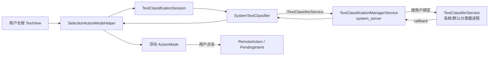
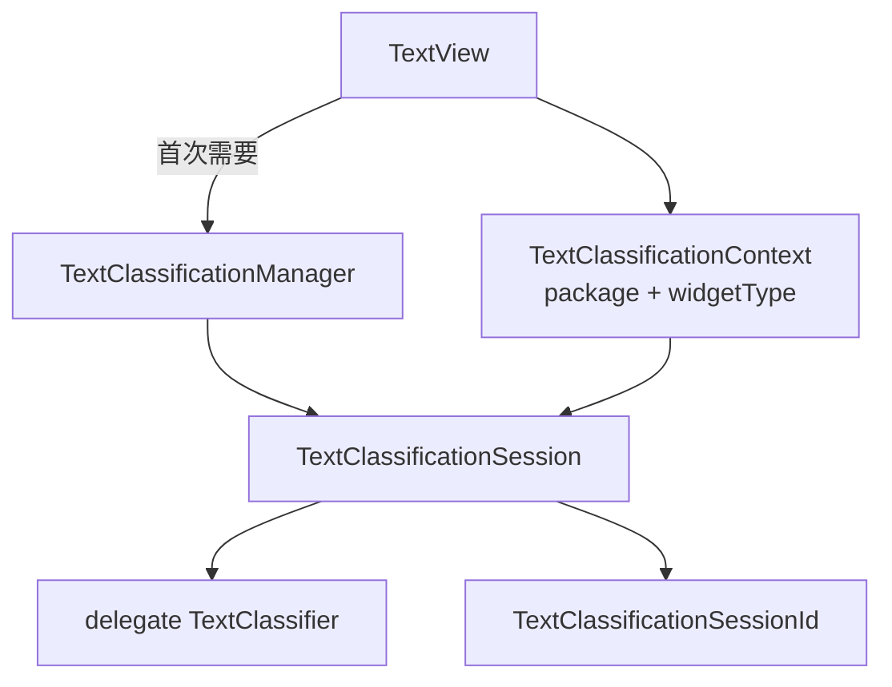
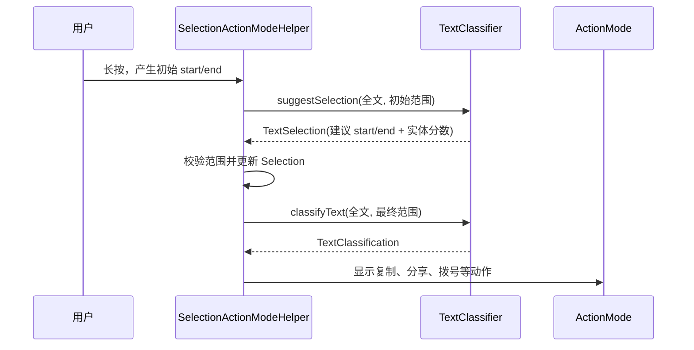

# 55 TextClassifierService、TextLinks、智能选择与文本操作

> 源码版本：Android 11 / API 30 / `android-11.0.0_r48`  
> 学习方式：macOS 只读源码，不要求编译。  
> 本章目标：理解长按文本之后，Android 如何扩展选区、判断实体类型、生成可点击链接和“拨号/地图/打开网页”等候选操作，并看懂客户端、`system_server` 与文本分类服务之间的边界。

---

## 1. 先用一个场景建立直觉

一段文本是：

```text
会议地点是北京市海淀区中关村，联系电话 13800138000，详情见 https://example.com。
```

用户长按电话号码中的几个数字时，系统可能完成：

1. 把只覆盖几个字符的初始选区扩展为完整电话号码；
2. 判断它较大概率是 `phone`，而不是普通文本；
3. 给浮动工具栏增加“拨号”或“发送短信”；
4. 记录用户是否接受了智能选区、是否点击动作。

若应用要求给整段文字加链接，系统还可能找出地址、电话号码和 URL，返回多个区间。注意，这是几种不同能力，不是一个结果对象包办全部工作。

```text
调整选区边界：TextSelection
判断当前片段是什么：TextClassification
找出全文所有实体区间：TextLinks
真正执行拨号/打开网页：用户点击 RemoteAction 后发送 PendingIntent
```

一句话概括：**TextClassifier 负责“理解并建议”，TextView/应用负责“展示”，用户操作才触发真正行为。**

---

## 2. 本章最重要的四组概念

| 能力 | 输入重点 | 输出 | 典型问题 |
|---|---|---|---|
| 智能选区 | 全文、初始 start/end | `TextSelection` | “应不应该扩到完整电话号码？” |
| 文本分类 | 全文、确定后的 start/end | `TextClassification` | “选中的内容是什么，可以做什么？” |
| 链接生成 | 一整段文本、实体配置 | `TextLinks` | “全文哪些区间可变成链接？” |
| 动作执行 | 用户选中的 `RemoteAction` | `PendingIntent.send()` | “现在是否真的打开拨号器？” |

必须分清：

- `TextSelection` 主要回答边界，也可以附带实体置信度；
- `TextClassification` 主要回答实体和候选动作；
- `TextLinks` 是多个不重叠或待冲突处理的区间，不等于单次长按；
- 分类服务不能替用户点击按钮。

---

## 3. 整体架构



三层职责：

- App/UI 层：决定请求时机、异步执行、选区更新、菜单展示和用户交互；
- `system_server`：校验调用者、按用户选择和绑定服务、排队、转发、过滤结果；
- 分类器服务：运行规则或模型，产生选区、实体、置信度、链接和候选动作。

这里的 `TextClassificationManagerService` 不是模型本身，更像安全代理、服务路由器和生命周期协调者。

---

## 4. 核心源码地图

### 4.1 TextView 与选择工具栏

```text
frameworks/base/core/java/android/widget/TextView.java
frameworks/base/core/java/android/widget/Editor.java
frameworks/base/core/java/android/widget/SelectionActionModeHelper.java
```

重点入口：

```text
TextView.getTextClassificationSession()
SelectionActionModeHelper.startSelectionActionModeAsync()
SelectionActionModeHelper.invalidateActionModeAsync()
SelectionActionModeHelper.TextClassificationHelper.suggestSelection()
SelectionActionModeHelper.TextClassificationHelper.classifyText()
```

### 4.2 客户端 API 与数据对象

```text
frameworks/base/core/java/android/view/textclassifier/TextClassificationManager.java
frameworks/base/core/java/android/view/textclassifier/TextClassificationSession.java
frameworks/base/core/java/android/view/textclassifier/SystemTextClassifier.java
frameworks/base/core/java/android/view/textclassifier/TextClassifier.java
frameworks/base/core/java/android/view/textclassifier/TextSelection.java
frameworks/base/core/java/android/view/textclassifier/TextClassification.java
frameworks/base/core/java/android/view/textclassifier/TextLinks.java
frameworks/base/core/java/android/view/textclassifier/TextLinksParams.java
frameworks/base/core/java/android/view/textclassifier/TextClassificationContext.java
frameworks/base/core/java/android/view/textclassifier/TextClassifierEvent.java
```

### 4.3 system_server

```text
frameworks/base/services/core/java/com/android/server/textclassifier/
    TextClassificationManagerService.java
```

### 4.4 服务接口

```text
frameworks/base/core/java/android/service/textclassifier/TextClassifierService.java
frameworks/base/core/java/android/service/textclassifier/ITextClassifierService.aidl
frameworks/base/core/java/android/service/textclassifier/ITextClassifierCallback.aidl
```

具体模型实现可以由设备厂商或系统组件提供，不要把 Framework 接口与某个特定模型实现绑定成同一个概念。

---

## 5. TextClassifier 接口为何看似简单

`TextClassifier` 暴露的核心方法大致是：

```java
TextSelection suggestSelection(TextSelection.Request request);
TextClassification classifyText(TextClassification.Request request);
TextLinks generateLinks(TextLinks.Request request);
```

调用者看到的是普通 Java 返回值，但 `SystemTextClassifier` 背后会跨进程。以分类为例，源码结构可简化为：

```java
request.setSystemTextClassifierMetadata(mSystemTcMetadata);
BlockingCallback<TextClassification> callback =
        new BlockingCallback<>("textclassification");
mManagerService.onClassifyText(mSessionId, request, callback);
TextClassification result = callback.get();
return result != null ? result : mFallback.classifyText(request);
```

因此“Java 方法同步返回”不代表“工作在当前进程立即完成”：

1. 请求通过 Binder 发到 `system_server`；
2. `system_server` 可能先绑定分类服务；
3. 分类服务异步回调；
4. 客户端用 `BlockingCallback` 等待结果；
5. 失败或空结果时走 fallback。

`SystemTextClassifier` 的方法带 `@WorkerThread`，并会检查主线程。UI 层必须把耗时分类放到后台任务，再把结果送回主线程更新选择菜单。

---

## 6. TextView 如何创建分类会话

`TextView.getTextClassificationSession()` 不是每次分类都新建对象。它会在需要时取得 `TextClassificationManager`，构造描述当前控件场景的 `TextClassificationContext`，再创建 session。

Context 关心的不是具体文字内容，而是调用场景，例如：

- 调用包名；
- widget 类型；
- widget 版本等附加信息。

简化关系：



Session 的价值主要有两个：

1. 将一轮用户选择行为关联起来；
2. 给事件补充相同 session id/context，便于服务理解“开始选中、调整边界、显示菜单、点击动作、结束”属于同一轮交互。

它不是缓存某个分类结果的永久数据库。控件离开、选择结束或 session 销毁后，不应继续使用已销毁 session。

---

## 7. 智能选区的真实顺序

用户只选中 `1380` 时，UI 不宜直接拿它当最终电话号码分类。典型顺序是：



### 7.1 Request 不只是被选中的子串

请求通常包含：

- 完整或截取后的上下文文本；
- 原始选择起止位置；
- 默认语言区域 `LocaleList`；
- reference time；
- extras；
- Framework 注入的系统分类器 metadata。

模型需要上下文。例如“May”可能是人名、月份或普通单词，只传孤立子串会损失语义。

### 7.2 返回范围必须被验证

一个合理的智能选区结果应该：

- 起点不小于 0；
- 终点不超过文本长度；
- `start < end`；
- 通常包含原始选区，而不是把用户选择跳到无关位置。

UI 不能因为结果来自系统服务就完全不做边界检查。文本还可能在异步请求期间被编辑，旧结果必须避免套到新内容上。

### 7.3 智能选区不等于强制改选区

建议可能因配置、密码字段、可编辑状态、文本变化、超时或结果非法而不被采用。用户也可以手动拖动手柄纠正。

---

## 8. TextSelection 里有什么

核心数据可以抽象为：

```text
startIndex
endIndex
entityType -> confidenceScore
id
extras
```

实体置信度不是“唯一类型枚举”。同一片段可以有多个候选：

```text
phone = 0.91
other = 0.08
```

常见实体类型常量包括：

- `TYPE_URL`；
- `TYPE_EMAIL`；
- `TYPE_PHONE`；
- `TYPE_ADDRESS`；
- `TYPE_DATE` / `TYPE_DATE_TIME`；
- `TYPE_FLIGHT_NUMBER`；
- `TYPE_OTHER`。

置信度用于排序和策略判断，不是法律意义上的确定事实。服务和 UI 仍需保守处理高风险动作。

---

## 9. 文本分类：从实体到候选操作

`TextClassification` 通常包含：

```text
被分类文本
实体类型与置信度
List<RemoteAction>
id
extras
```

以电话号码为例，候选操作可能是拨号、添加联系人或发送短信；URL 可能对应浏览器打开；地址可能对应地图搜索。

关键边界：

```text
TextClassification = “建议哪些动作”
RemoteAction = “动作如何显示、点击后送哪个 PendingIntent”
用户点击 = “授权本次实际执行”
```

分类完成本身不会调用 `startActivity()`。只有菜单展示动作并收到用户点击后，才会触发关联的 `PendingIntent`。

### 9.1 为什么用 RemoteAction

`RemoteAction` 能跨进程携带：

- 图标；
- 标题与内容描述；
- 是否启用；
- `PendingIntent`。

服务不应把自己的普通 `OnClickListener` 跨 Binder 传给 TextView。`PendingIntent` 是由创建者预先封装、之后由系统代为发送的能力对象，适合跨进程动作。

### 9.2 system_server 还会整理动作

Android 11 的 `TextClassificationManagerService` 对分类回调使用 `wrap(callback)`，其中会处理返回动作，例如检查并重建图标相关信息。原因是远端资源图标可能对接收进程不可安全、稳定地解析。

所以响应路径也不是简单透传：服务结果还要经过系统边界的规范化处理。

---

## 10. TextLinks：一次找出全文中的实体

`generateLinks()` 与长按单个选区不同。它输入一段文本，返回多个 `TextLink`：

```text
TextLinks
 ├─ fullText
 ├─ TextLink(start=5, end=16, phone=0.95)
 ├─ TextLink(start=22, end=41, url=0.98)
 └─ TextLink(start=..., end=..., address=...)
```

`TextLink` 主要描述区间和实体置信度，不直接等同于已经安装到 `Spannable` 上的 `ClickableSpan`。

### 10.1 生成与应用是两步


源码中的 `TextLinks.apply(...)` 会委托给 `TextLinksParams.Builder(...).build().apply(text, this)`。这说明：

- 模型输出链接，与修改 UI 文本是两件事；
- 调用者可选择冲突处理策略；
- 原文本不匹配时不能盲目按旧下标加 span。

### 10.2 apply strategy

文本上可能已有 `ClickableSpan`，新结果也可能与旧 span 重叠。策略通常要回答：

- 忽略新链接，保留已有 span；
- 用新链接替换冲突 span。

返回状态也要区分“成功”“没有链接”“文本不同”“没有应用任何链接”。不要把 `generateLinks()` 成功误判为每一个 span 都已安装成功。

### 10.3 为什么要保存原始文本

链接下标是相对于请求文本计算的。若后台分类期间用户插入一个字符，所有后续区间可能整体偏移。因此应用阶段需要比较文本，避免把电话号码链接加到别的字符上。

---

## 11. 智能链接与旧 Linkify 的关系

Android 早期的 `Linkify` 主要基于正则规则发现 URL、邮箱和电话。智能 `TextLinks` 可使用上下文与模型识别更多实体。

`SystemTextClassifier.generateLinks()` 中可以看到两个重要分支：

```java
if (!checkTextLength(request.getText(), getMaxGenerateLinksTextLength())) {
    return mFallback.generateLinks(request);
}
if (!mSettings.isSmartLinkifyEnabled() && request.isLegacyFallback()) {
    return Utils.generateLegacyLinks(request);
}
```

所以它不是“永远调用机器学习服务”：

- 文本过长时会拒绝昂贵请求并 fallback；
- 智能 Linkify 关闭且请求允许 legacy fallback 时走传统链接规则；
- Binder/服务失败或空结果也会 fallback。

在本版本中 `SystemTextClassifier` 的 fallback 是 `TextClassifier.NO_OP`，但特定分支可明确调用 legacy link 生成。阅读时要看具体方法，不能笼统说“失败总会得到正则结果”。

---

## 12. 请求如何穿过 system_server

以 `onClassifyText()` 为例，`TextClassificationManagerService` 做的事情可概括为：

```java
Objects.requireNonNull(request);
Objects.requireNonNull(request.getSystemTextClassifierMetadata());
handleRequest(
        request.getSystemTextClassifierMetadata(),
        true,   // verifyCallingPackage
        true,   // attemptToBind
        service -> service.onClassifyText(sessionId, request, wrap(callback)),
        "onClassifyText",
        callback);
```

注意 metadata 是 `SystemTextClassifier` 在跨 Binder 前注入的，包含调用包、user id、是否使用 default classifier 等路由信息。它不是让 App 自由伪造并越权访问其他用户。

主路径：

```text
SystemTextClassifier
→ TextClassificationManagerService.handleRequest()
→ 验证 calling package / user
→ 找到该用户对应的 ServiceState
→ 已连接：直接转发
→ 未连接：尝试 bind，并把请求放入 pending queue
→ TextClassifierService 回调
→ callback 返回客户端
```

---

## 13. 默认分类器与系统分类器不是一句话能替换

`TextClassificationManager` 支持不同 classifier 类型：

- 应用显式设置的自定义 `TextClassifier`；
- 系统默认选择的分类器；
- 系统分类器。

当应用通过 `setTextClassifier()` 提供自定义实现时，`getTextClassifier()` 可以返回它；否则通常取得系统端实现。`SystemTextClassifier` 构造时的 `useDefault` 会写入 metadata，供 manager service 选择目标服务状态。

`TextClassificationManagerService` 内部保存：

```text
mDefaultTextClassifierPackage
mSystemTextClassifierPackage
```

不要把它们理解成必定不同的两个进程；设备配置可能让包名相同，也可能没有可用组件。真正绑定前还要用 `TextClassifierService.getServiceComponentName()` 解析组件。

---

## 14. 按用户绑定与请求排队

文本分类服务是多用户敏感服务。`ServiceState` 包含：

```text
userId
packageName
TextClassifierServiceConnection
pendingRequests
ITextClassifierService
binding/boundComponentName/boundServiceUid
isTrusted
```

Android 11 中待处理队列最大值是 20：

```java
private static final int MAX_PENDING_REQUESTS = 20;
```

服务尚未连上时，请求进入固定长度队列；队列满时旧请求会被丢弃并通知失败。这样可以避免分类器进程迟迟不连接时，任意应用不断提交文本导致 system_server 无限制积压。

绑定使用：

```text
BIND_AUTO_CREATE
BIND_FOREGROUND_SERVICE
非默认分类器额外 BIND_RESTRICT_ASSOCIATIONS
bindServiceAsUser(..., UserHandle.of(userId))
```

`onServiceConnected()` 后才把 Binder 放入 `ServiceState` 并处理 pending requests；断连、binding died、null binding 都会清理连接状态。

---

## 15. 信任边界：为什么非默认服务只能看同 UID 文本

源码中有一个非常关键的检查：

```java
if (mIsTrusted || requestUid == mBoundServiceUid) {
    return true;
}
```

日志解释得更直接：非默认 `TextClassifierService` 只能看到来自相同 UID 的文本。

这解决了一个重要风险：如果任意第三方分类服务都能成为全局文本代理，它可能收到其他 App 用户刚刚选中的聊天、验证码、地址等敏感内容。

安全边界可以分为：

1. 调用包校验：Binder calling UID 必须与声称的包匹配；
2. 用户隔离：为目标 user 选择、绑定服务；
3. 服务信任：系统认可的可信服务可以处理跨 App 文本；非可信服务受 same-UID 限制；
4. 服务声明权限：系统通过规定的 service interface/权限绑定；
5. UI 决策：密码、敏感字段或不适用场景可以不发起分类。

“在设备本地运行”不等于“没有隐私边界”，文本仍然跨越 App 进程进入另一个服务进程。

---

## 16. 回调、等待、失败与竞态

### 16.1 为什么远端接口用 callback

模型推理和按需绑定不可假设瞬时完成，所以 AIDL 服务接口采用回调。客户端为了兼容 `TextClassifier` 同步 Java API，才在工作线程阻塞等待。

```text
AIDL 层：异步 callback
SystemTextClassifier 层：BlockingCallback 转成同步返回值
TextView 层：后台任务调用，再切回 UI
```

### 16.2 失败并不只有 RemoteException

可能出现：

- 找不到服务组件；
- 用户存储尚未解锁，组件不可解析；
- bind 返回 false；
- binding died；
- pending queue 满；
- 请求调用者校验失败；
- 服务返回失败或 null；
- 文本过长；
- UI 已经结束这一轮 selection；
- 原文本、选区或 TextView 状态已经改变。

### 16.3 迟到结果为何危险

假设用户先选中 A，马上又选中 B。A 的分类结果晚于 B 返回，如果没有任务世代、文本快照或取消检查，旧结果会覆盖新菜单。

UI 侧需要守住：

```text
结果对应当前文本吗？
start/end 仍然有效吗？
当前 ActionMode 仍存在吗？
当前任务是否已被新任务替代？
```

这类检查与模型准确率无关，是异步 UI 的基本正确性。

---

## 17. SelectionActionModeHelper 做什么

它位于 `android.widget`，是连接文本选择 UI 与分类框架的关键桥梁，主要负责：

- 根据配置决定智能选区还是只分类；
- 准备文本快照和选择范围；
- 在后台执行 `suggestSelection()` / `classifyText()`；
- 收到结果后更新 Selection；
- 启动或刷新浮动 `ActionMode`；
- 缓存本轮 `TextClassification` 供菜单使用；
- 记录 selection 事件；
- 在取消、超时或状态变化时避免采用旧结果。

`Editor` 才是 TextView 编辑与选择的大管家，最终通过 `startActionMode()` 显示工具栏。不要把 `TextClassifier` 当作直接绘制菜单的对象。

```text
TextClassifier：提供语义结果
SelectionActionModeHelper：协调异步结果与选择状态
Editor：维护选择/编辑 ActionMode
ActionMode Callback：建立和处理菜单
```

---

## 18. 事件上报不是业务请求结果

`TextClassificationSession` 还会接收 `SelectionEvent`、`TextClassifierEvent`。事件可能表达：

- 选择开始；
- 智能选区被展示；
- 用户手动扩大或缩小；
- 复制、分享、选择全部；
- 点击某个智能动作；
- 放弃或结束会话。

事件的作用是让分类器理解交互效果和进行质量统计，不是让事件回调反过来决定本次选区。

Session 会给事件补充 session id 和 context，从而把相对选区位置、动作和页面类型串起来。应用和服务仍应遵守数据最小化原则，不应把事件接口当作任意遥测通道。

---

## 19. 一次“长按电话号码”的逐层追踪

### 阶段 A：建立初始选择

1. TextView/Editor 根据触摸位置得到初始字符范围；
2. 判断文本是否可选择、ActionMode 是否允许；
3. `SelectionActionModeHelper` 保存文本与范围快照。

### 阶段 B：智能扩展

1. 后台任务创建 `TextSelection.Request`；
2. session 委托给 `SystemTextClassifier`；
3. 后者补 metadata，通过 Binder 请求 manager service；
4. manager service 校验包、用户和服务状态；
5. 服务未绑定则绑定并排队；
6. 分类器识别完整号码边界并回调；
7. UI 校验结果仍适用于当前文本；
8. 合法时更新选择手柄。

### 阶段 C：实体分类

1. 以最终范围创建 `TextClassification.Request`；
2. 再次经过同一服务路由；
3. 分类器返回 `phone` 分数和 `RemoteAction` 列表；
4. system_server 规范化动作后送回客户端。

### 阶段 D：展示与执行

1. `SelectionActionModeHelper` 让 Editor 启动/刷新 ActionMode；
2. 菜单保留复制、粘贴、分享等标准操作，并加入智能动作；
3. 用户点击“拨号”；
4. UI 才发送动作携带的 `PendingIntent`；
5. session 上报本次动作事件。

真正的“完成点”至少有四个：范围返回、分类返回、菜单显示、用户点击。排错时必须说明卡在哪一个。

---

## 20. 一次 TextLinks 的逐层追踪

```text
应用准备 Spannable 文本
→ TextLinks.Request.Builder(text)
→ 可配置 EntityConfig / locales / legacyFallback
→ TextClassifier.generateLinks()
→ 长度与 smart-linkify 配置检查
→ TCMS 校验并转发
→ 服务返回 TextLinks(TextLink...)
→ 客户端确认原文未变化
→ TextLinksParams.apply()
→ 根据冲突策略安装 TextLinkSpan
→ 用户点击 span
→ 默认或自定义 TextLinkSpanFactory 处理
```

`EntityConfig` 可控制包含、排除或指定哪些实体类型。这里的配置影响“模型应返回什么”，`TextLinksParams` 则影响“结果如何应用到 Spannable”，两者不要混淆。

---

## 21. 与 Intent、PackageManager 的关系

识别出实体后，服务通常需要构造某种 Intent 语义：

```text
phone   → ACTION_DIAL tel:
url     → ACTION_VIEW https:
email   → ACTION_SENDTO mailto:
address → 地图 geo:/搜索 Intent
```

但能否安全展示动作，还取决于：

- 是否存在可解析 Activity；
- `PendingIntent` 创建者身份；
- Intent 数据是否正确编码；
- 目标组件导出和权限；
- 用户/工作资料边界；
- 系统对动作、图标和来源的过滤。

因此分类系统给出的不是绕过 Android 组件安全模型的“超级跳转”。动作最后仍进入普通 PendingIntent/Activity 解析与权限链。

---

## 22. 性能设计

文本分类处在长按交互路径上，延迟会直接影响浮动菜单出现速度。

主要控制手段：

- 不在主线程做同步分类；
- 限制生成链接的最大文本长度；
- session/服务连接复用，避免每次重新初始化；
- 服务未连接时只保留有限 pending requests；
- UI 可先走超时/普通 ActionMode，晚到结果再谨慎刷新；
- 在文本变化或新任务开始时取消/废弃旧结果；
- 模型按语言和版本选择，避免无意义推理。

不要为了“更准确”把整篇超长文档无限制发给分类器。上下文越多不一定越好，还会增加 Binder 数据、推理时间和隐私暴露面。

---

## 23. 常见误解纠正

### 误解 1：TextClassifier 就是正则表达式

不准确。实现可使用规则、模型或两者组合；Framework 定义的是请求/结果和服务边界。legacy Linkify 才明显偏向规则匹配。

### 误解 2：suggestSelection 已经完成分类

它可以附带实体置信度，但 UI 仍通常对最终区间调用 `classifyText()`，以得到完整分类与动作。

### 误解 3：返回 phone 就会自动拨号

不会。它只是候选实体和 `RemoteAction`；用户点击后才发送 PendingIntent。

### 误解 4：TextLinks 返回后文本已经可点击

不会。还要通过 `TextLinksParams.apply()` 把 span 应用到匹配的 `Spannable`。

### 误解 5：同步 Java API 可以直接在主线程调用

不可以这样推断。`SystemTextClassifier` 背后跨 Binder 并阻塞等待回调，源码明确按 worker thread 设计。

### 误解 6：所有分类请求必然到同一个系统组件

不一定。存在应用自定义 classifier、default/system 类型、设备配置、per-user 解析与 fallback。

### 误解 7：分类服务只收到被选中的几个字符

通常还会收到上下文文本与下标，因为消歧和边界扩展需要上下文。这正是隐私控制重要的原因。

### 误解 8：分类准确就代表 UI 一定正确

不一定。文本编辑、迟到结果、范围越界、span 冲突和已结束 ActionMode 都可能造成 UI 错误。

---

## 24. 只读源码练习

### 练习 1：找到 TextView 会话创建点

阅读：

```text
TextView.getTextClassificationSession()
TextClassificationManager.createTextClassificationSession()
TextClassificationSession 构造函数
```

回答：context、session id、delegate 分别由谁创建？session 销毁如何传到远端？

### 练习 2：追踪一次 suggestSelection

按顺序阅读：

```text
SelectionActionModeHelper.TextClassificationHelper.suggestSelection()
TextClassificationSession.suggestSelection()
SystemTextClassifier.suggestSelection()
TextClassificationManagerService.onSuggestSelection()
```

画出线程、Binder 和 callback 边界。

### 练习 3：对比三个 Request

对比：

```text
TextSelection.Request
TextClassification.Request
TextLinks.Request
```

记录共同字段和特有字段，特别关注 start/end、text、locales、reference time、entity config、legacy fallback。

### 练习 4：验证“动作不会自动执行”

阅读 `TextClassification.getActions()`、`createIntentOnClickListener()` 以及 Selection ActionMode 菜单处理。找到真正调用 `PendingIntent.send()` 的位置或封装层。

### 练习 5：追踪 TextLinks 应用结果

阅读：

```text
TextLinks.apply()
TextLinksParams.apply()
APPLY_STRATEGY_IGNORE
APPLY_STRATEGY_REPLACE
STATUS_DIFFERENT_TEXT
```

解释旧文本与新文本不相同时为何必须失败。

### 练习 6：看懂服务绑定

阅读 `TextClassificationManagerService.ServiceState`：

```text
bindLocked()
handlePendingRequestsLocked()
TextClassifierServiceConnection
MAX_PENDING_REQUESTS
```

回答：服务未连接时请求去哪？队列满会怎样？断连后哪些字段被清理？

### 练习 7：理解隐私限制

找到 `checkRequestAcceptedLocked()`，解释 `mIsTrusted`、`requestUid`、`mBoundServiceUid` 的关系，以及为何非默认服务只接受 same-UID 文本。

### 练习 8：分析一个迟到结果

在 `SelectionActionModeHelper` 中找异步任务、取消和结果应用逻辑。假设用户在推理期间修改文本，列出应用旧结果前至少要验证的三项状态。

---

## 25. 排错路线

### 症状 A：长按只有复制，没有智能动作

依次检查：

1. 当前字段是否允许文本分类；
2. TextView 使用的是 `NO_OP`、自定义还是 `SystemTextClassifier`；
3. 请求是否在工作线程真正执行；
4. manager service 是否解析到目标组件；
5. 服务是否绑定成功；
6. 分类结果是否有实体和 actions；
7. 结果返回时 ActionMode 是否已经结束；
8. 菜单是否因目标 Activity、策略或动作校验被过滤。

### 症状 B：智能选区偶尔跳错

检查：

- 建议 start/end 是否包含原始范围；
- 文本是否在请求后发生改变；
- UTF-16 下标是否被错误当作 Unicode code point 下标；
- 旧任务是否覆盖新任务；
- 模型语言与文本语言是否匹配；
- UI 是否错误套用了别的 session 结果。

### 症状 C：TextLinks 生成了但不可点击

检查：

- 是否只生成而没有调用 apply；
- 目标是否为可修改的 `Spannable`；
- apply 返回的状态；
- 原文是否变化；
- 是否与已有 span 冲突且策略选择 ignore；
- TextView 是否配置了合适的 movement method/点击处理。

### 症状 D：调用卡顿

优先确认是否从主线程进入同步 `SystemTextClassifier`；再看文本长度、服务首次绑定、模型首次加载、Binder 等待和 UI 超时路径。

---

## 26. 本章自检问题

1. `TextSelection`、`TextClassification`、`TextLinks` 各回答什么问题？
2. 为什么 `SystemTextClassifier.classifyText()` 看似同步却不能放主线程？
3. `TextClassificationManagerService` 为什么不是模型执行器？
4. `TextClassificationSessionId` 如何把一轮选择行为串起来？
5. 为什么 classification 返回后还不会自动拨号？
6. `TextLinks` 为什么必须保存并比较原始文本？
7. 服务未绑定时，请求如何排队，为什么队列有上限？
8. default classifier 和 system classifier 为什么不能简单视为永远不同的两个包？
9. 非可信分类服务为何只能看到 same-UID 请求？
10. 用户快速改变选区时，迟到结果为何可能污染 UI？

如果能不看文档完整回答，并画出下一节主链，本章就达到了“能读源码”的目标。

---

## 27. 最终主链

```text
用户长按 TextView
→ Editor 建立初始选择
→ SelectionActionModeHelper 在后台发起智能选择
→ TextClassificationSession 补充会话语境
→ SystemTextClassifier 注入 package/user/default metadata
→ ITextClassifierService Binder
→ TextClassificationManagerService 校验调用包与用户
→ 选择 per-user default/system ServiceState
→ 已绑定则转发；未绑定则有限排队并 bindServiceAsUser
→ TextClassifierService 运行模型/规则
→ callback 返回 TextSelection
→ UI 校验文本、范围、任务时效并更新选区
→ 对最终选区再次 classifyText
→ 返回实体置信度与 RemoteAction
→ system_server 规范化结果
→ SelectionActionModeHelper / Editor 刷新浮动菜单
→ 用户点击动作
→ PendingIntent 才被发送
→ session 上报选择/动作事件并最终销毁
```

而全文链接链路是：

```text
文本
→ TextLinks.Request
→ generateLinks
→ TextLinks(TextLink 区间 + 实体分数)
→ 比较原文
→ TextLinksParams 按冲突策略 apply
→ Spannable 中安装 TextLinkSpan
→ 用户点击后处理对应实体
```

掌握这两条链后，再看到“智能选区不生效”“链接结果错位”“长按菜单卡顿”，就能先判断问题属于请求语义、服务路由、模型返回、异步竞态、结果应用还是最终动作，而不是把所有问题都归结为“AI 识别不准”。
