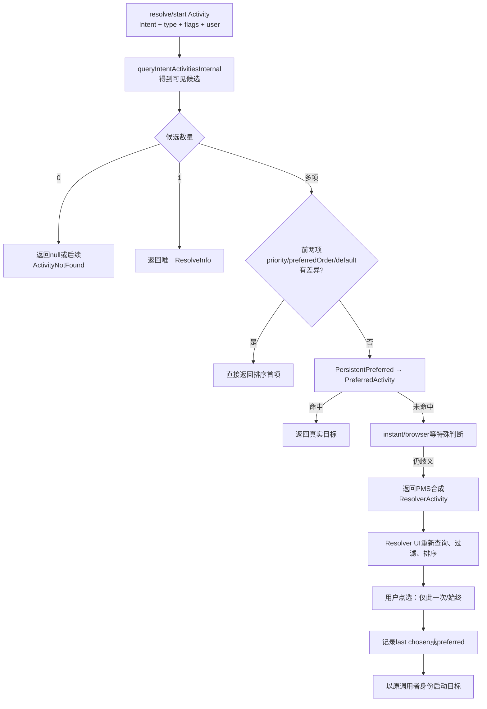
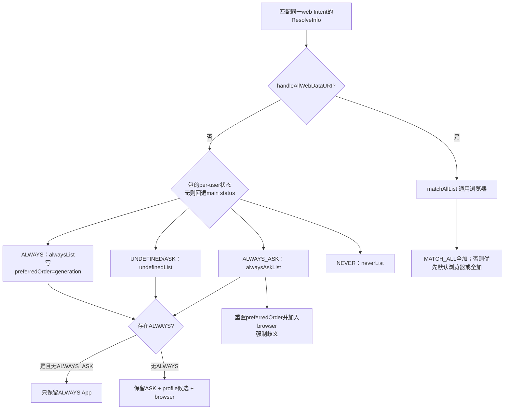
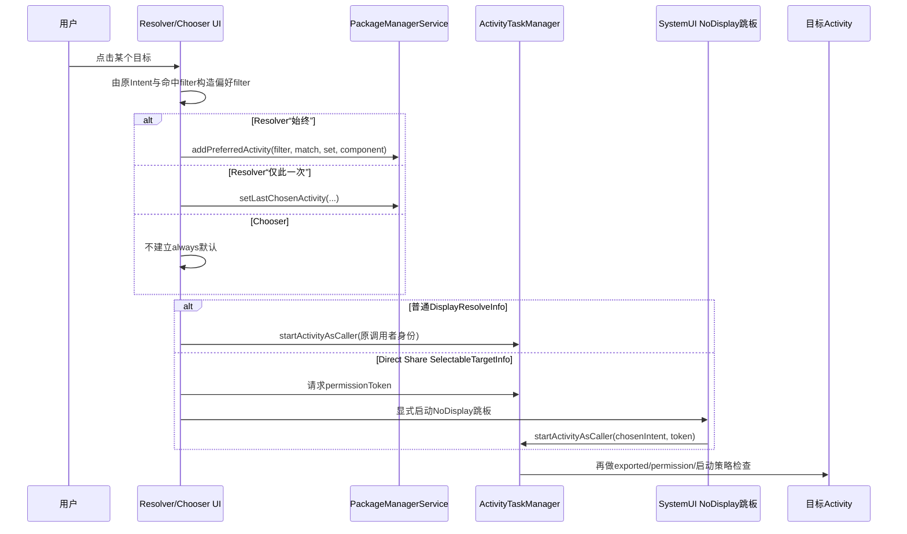

# 第550章 Android Intent最终决策链：resolveIntent、PreferredActivity、Domain Verification、ResolverActivity与ChooserActivity

> 源码基线：Android 11 / API 30 / `android-11.0.0_r48`。本章只在macOS上阅读和推演源码，不实际编译。建议先读第549章：上一章得到“调用者最终可见的Activity候选列表”，本章继续回答候选为0、1或多个时系统到底返回谁、何时展示“仅此一次/始终”、网页链接为什么直达App，以及显式Chooser为何又走另一套交互。

## 1. 本章研究的是“候选之后”

`IntentFilter.match()`只产生候选；真正的最终决策还要处理排序首项、持久首选、用户首选、候选集合变化、网页域名状态、默认浏览器、跨profile、即时应用与系统ResolverActivity。若系统弹出选择界面，界面自己还会重新查询、过滤权限、按使用行为排序并记录用户选择。

## 2. 先区分两个“选择”

PMS的`chooseBestActivity()`决定`resolveIntent()`返回哪个`ResolveInfo`，可能是真实Activity，也可能是系统ResolverActivity；ResolverActivity/ChooserActivity则是一个真的Activity UI，负责把多个目标呈现给用户并启动被点中的目标。前者是服务端决策，后者是交互进程，不能把UI排序代码当成PMS解析排序。

## 3. 八本账的心智模型

第一本是本次可见候选列表；第二本是filter匹配质量与priority；第三本是per-user普通PreferredActivity；第四本是system/DPM持久首选；第五本是每包域名验证主状态；第六本是每用户域名策略与generation；第七本是Resolver UI临时候选、排名与last-chosen；第八本是Chooser的App目标、Direct Share目标和回调。问题出现时先找是哪本账。

## 4. 涉及的进程与线程

PMS查询、preferred/domain账读取运行在`system_server` Binder线程或PMS Handler上；默认ResolverActivity由PMS合成`ActivityInfo`，默认processName写成`system:ui`；框架`com.android.internal.app.ChooserActivity`在core Manifest声明`:ui`；r48还通过显式组件使用SystemUI的NoDisplay chooser跳板。UI重建在主线程，候选排序和Shortcut查询有后台AsyncTask/预测服务Binder边界。

## 5. 第一幅图：从resolve到真实目标启动



## 6. `queryIntentActivities()`与`resolveActivity()`返回语义不同

query API返回列表；resolve API先取得同类列表，再经`chooseBestActivity()`返回一个结果。多候选并不意味着resolve随便取第一个，它可能返回代表选择界面的合成ResolveInfo。应用拿`resolveActivity()`的组件名时，应考虑它可能是系统ResolverActivity而非业务目标。

## 7. public resolve与“为启动而resolve”也不同

公开`IPackageManager.resolveIntent()`把`resolveForStart=false`传入；ATMS内部为实际启动解析时可传true。后者让普通包可见性不阻断合法启动，并放宽instant候选发现。`queryMayBeFiltered()`也把`queryForStart`纳入判断，影响是否允许修改首选集合，避免用一个被隐藏过的候选子集破坏全局偏好。

## 8. resolve入口仍会重写flags

`resolveIntentInternal()`先检查user、调用`updateFlagsForResolve()`，执行跨用户权限，再查询候选。安全模式、隐式相机Intent、instant caller、direct boot与用户状态都可能改变flags。最终的`privateResolveFlags`还能要求非browser或非Resolver结果，属于system内部策略，不是普通应用随便传的公开flags。

## 9. 候选列表在chooseBest前已经很“重”

它已经经过ComponentResolver精确match、用户installed/enabled/direct-boot、instant可见性、Android 11包可见性、system-user-only、跨profile与网页domain候选过滤。`chooseBestActivity()`不是从所有Manifest组件开始，而是在当前调用上下文已裁好的列表上决定。

## 10. 候选为0时没有兜底选择器

`query == null`或size为0直接返回null；系统不会为了展示一个空对话框而合成ResolverActivity。实际`startActivity`上层会把无法解析翻译为`ActivityNotFoundException`或启动错误。ChooserActivity若包装的target不合法，也会finish，而不是虚构目标。

## 11. 候选为1时直接返回

size为1时`chooseBestActivity()`立即返回`query.get(0)`，不再查PreferredActivity，因为没有歧义需要消解。旧preferred指向别的、当前不可用组件不会在此时强行覆盖唯一可用目标；清理旧账通常要等相关查询路径或包变更处理。

## 12. 多候选先看排序后的前两项

列表已按`RESOLVE_PRIORITY_SORTER`排列。若前两项的priority、preferredOrder或isDefault任一不同，直接返回首项。注意这里只比较这三个字段，不比较`ResolveInfo.match`和system；虽然后两者参与列表排序，却不足以让`chooseBestActivity()`无对话框直选。

## 13. 为什么只比较前两项就够

列表是降序排列，若第一与第二在可自动决胜的字段上已有严格差异，第一已压过所有后续项。若两者相同，则至少存在一个同等级竞争者，系统必须继续查首选或交给用户。前两项比较依赖排序不变量，而不是遗漏后续候选。

## 14. 第一段关键源码：多候选的总开关

```java
if (N == 1) {
    return query.get(0);
} else if (N > 1) {
    ResolveInfo r0 = query.get(0);
    ResolveInfo r1 = query.get(1);
    if (r0.priority != r1.priority
            || r0.preferredOrder != r1.preferredOrder
            || r0.isDefault != r1.isDefault) {
        return query.get(0);
    }
    ResolveInfo ri = findPreferredActivityNotLocked(
            intent, resolvedType, flags, query, r0.priority,
            true, false, debug, userId, queryMayBeFiltered);
    if (ri != null) return ri;
    // 后续处理 instant/browser，最后可能合成 ResolverActivity
}
```

这里传入的`priority`参数在r48的`findPreferredActivityNotLocked()`实现中没有被实际读取，是保留下来的接口形状；真正校验的是候选最大match类别、always标记和候选集合。

## 15. 首选查询的优先级是persistent在前

`findPreferredActivityNotLocked()`进入锁后先调用`findPersistentPreferredActivityLP()`；命中即返回，不再查看普通PreferredActivity。persistent通常由system/DPM建立，设计上要压过用户普通“始终”记录。两类都使用IntentResolver索引匹配filter，但携带的数据和维护规则不同。

## 16. PersistentPreferredActivity保存什么

它继承`IntentFilter`，额外只保存目标`ComponentName`和`mIsSetByDpm`。没有普通preferred的候选集合、match质量和always/last-chosen二态。XML包含目标名、set-by-dpm和filter。它表达管理策略的稳定路由，不是用户在Resolver UI点“始终”的记录。

## 17. persistent API只允许system UID

`addPersistentPreferredActivity()`和清理接口直接要求`callingUid == SYSTEM_UID`，没有“持有普通SET_PREFERRED_APPLICATIONS权限也可以”的分支。DevicePolicyManagerService通过system_server内的IPackageManager调用建立DPM规则，并按用户存储。

## 18. persistent命中仍要求目标在当前query里

代码先用`getActivityInfo(component, flags | MATCH_DISABLED_COMPONENTS)`确认目标仍被识别，再遍历当前query按包名和类名找相同项；只有目标当前确实能处理Intent才返回。`MATCH_DISABLED_COMPONENTS`只让存在性查询更宽，不能让一个不在真实候选列表中的禁用目标被强行启动。

## 19. persistent悬空项不会自动删除

若`getActivityInfo()`返回null，源码注释明确“ignore it and do NOT remove it”。这与普通preferred会在安全条件下清理dangling entry不同。管理策略可能等待应用稍后重新安装，系统不应把暂时缺失当成管理员永久撤销。

## 20. 普通PreferredActivity由两部分组成

外层`PreferredActivity extends IntentFilter`描述“什么Intent”；内层`PreferredComponent`保存match类别、目标ComponentName、建立偏好时的完整候选组件集合和`mAlways`。因此“始终”不是简单的action→包名map，而是“在当时这组竞争者和匹配质量下，选择这个组件”。

## 21. 为什么必须记录候选集合

若用户在A、B之间选A为始终，后来安装了C，系统不应假定用户也在A、B、C之间选过A；否则新应用永远没有竞争机会。`sameSet()`和`isSuperset()`就是检测候选世界是否仍与用户决策上下文兼容。

## 22. match只保留category高位

`PreferredComponent`构造器执行`match & IntentFilter.MATCH_CATEGORY_MASK`，丢掉adjustment低位。查找时先求当前query中最大的`ri.match`，再同样mask后与`mPref.mMatch`比较。偏好关注TYPE/PATH/HOST等匹配类别，不要求完整match整数逐位相等。

## 23. `always=true`与“上次选过”是两种记录

ResolverActivity点“始终”创建`mAlways=true`并保存候选集合；点“仅此一次”调用`setLastChosenActivity()`，创建`mAlways=false`且set为null。PMS在自动决策时以`always=true`查询，会跳过last-chosen；UI可用`getLastChosenActivity()`把上次选择突出显示。仅此一次不是短时默认应用。

## 24. findPreferred的两个布尔参数不要混

`always`表示调用者是否只接受永久首选；`removeMatches`表示本次调用是为了删除匹配旧项。正常resolve传`always=true, removeMatches=false`；getLastChosen传false/false；setLastChosen先传false/true清旧匹配，再新增一个`mAlways=false`项。

## 25. 当前最大match如何计算

源码遍历所有query，取最大的`ri.match`后mask。调试日志却在更新`match`之前打印聚合变量，因此每行日志显示的可能是前一轮最大值，不一定是该`ri`自己的match；读r48日志不要被“Match for X”文案误导，真比较仍用最终最大值。

## 26. 目标Info查询故意加入双direct-boot flag

普通preferred查目标时用`MATCH_DISABLED_COMPONENTS | MATCH_DIRECT_BOOT_AWARE | MATCH_DIRECT_BOOT_UNAWARE`，避免仅因当前默认direct-boot flags缺一边就把已记录目标当悬空。之后它仍必须出现在query中，所以最终可用性由当前原始查询语义约束。

## 27. sameSet是集合相等，不关心顺序

它对query每个Activity在保存数组中找同包同类项并计数，最后要求命中数等于保存集合大小。候选排序、label和match值变化不影响集合相等。若Setup Wizard home临时项被要求排除，则会跳过该包。

## 28. 候选只减少时可以继续复用always

若`sameSet()`失败但旧保存集合是当前query的superset，说明只是某些非首选组件消失；在允许修改账本时，PMS用`discardObsoleteComponents()`生成新集合，remove旧PreferredActivity再add新项，仍返回原首选。用户无需因竞争者减少而重选。

## 29. 出现新候选时必须重新询问

若旧集合不是当前query的superset，通常代表新增了用户从未比较过的组件。PMS删除always项，并把同一目标重新加成`mAlways=false`的last-chosen，然后返回null；`chooseBestActivity()`因此合成ResolverActivity。旧选择可作为界面提示，但不再自动压过新应用。

## 30. 为什么降级成last-chosen而不是全忘掉

系统尊重用户曾使用过该目标，让Resolver界面可突出它；同时又不给它“始终”的自动路由权。这个设计把“历史偏好”与“当前候选集合授权”分开，比简单删除所有痕迹更符合用户预期。

## 31. 包可见性会禁止首选集合自我修复

`allowSetMutation = !setupWizardHomeException && !queryMayBeFiltered`。若调用者的query可能因Android 11包可见性缺少某些候选，PMS不会据此删除dangling项、裁剪集合或降级always，否则一个受限应用查询就能污染该用户全局默认路由。它仍可读取命中的首选，但不拿不完整视角改账。

## 32. Setup Wizard期间也禁止Home集合变更

当Intent是MAIN+HOME+DEFAULT且设备尚未provisioned，`excludeSetupWizardHomeActivity`为true并令`allowSetMutation=false`。Setup Wizard可能临时声明Home能力，系统不应因它暂存或目标launcher尚未装好就改写长期默认桌面。

## 33. r48的Setup Wizard对象初始化有细边界

`PreferredComponent`从XML读取时才通过`PackageManagerInternal`填`mSetupWizardPackageName`；程序中新建对象的构造器把它设为null。于是新建内存项在重启落盘前对“排除Setup Wizard包”的比较不如XML恢复对象直观。正文把它作为实现细节记录，不把意图上的保护说成所有对象生命周期都完全对称。

## 34. 为什么findPreferred不能持有PMS锁进入

方法开头用`Thread.holdsLock(mLock)`打wtf，因为它要先读Settings Provider的`DEVICE_PROVISIONED`，向上跨服务调用可能死锁。读完外部状态后再进入PMS锁操作resolver与Settings。这是典型的“外部Binder/Provider调用放锁外，内部一致性修改放锁内”。

## 35. PreferredActivity保存在哪里

每用户`PreferredIntentResolver`和`PersistentPreferredIntentResolver`写入`/data/system/users/<userId>/package-restrictions.xml`的`preferred-activities`与`persistent-preferred-activities`节点。普通包级全局Settings不是它们的唯一归宿；选择不同用户可得到不同默认目标。

## 36. 写入不是每次立即同步fsync

新增/更新后PMS调用`scheduleWritePackageRestrictionsLocked(userId)`，由Handler合并写任务；内存状态先变，随后异步持久化。进程正常运行时查询看到新内存值，但若写入前异常掉电，持久状态与刚点选可能短暂不一致。

## 37. addPreferredActivity权限边界

接口先检查跨用户full权限，再要求`SET_PREFERRED_APPLICATIONS`；targetSdk低于Froyo的旧调用者在缺权限时可能只warning并忽略，新调用者抛SecurityException。filter必须至少有一个action。现代普通三方应用不能任意把自己设成系统级preferred。

## 38. `replacePreferredActivity()`限制更窄

它只接受一个action、无authority/path/type且至多一个scheme；先找完全相同filter，若当前always、目标、match和候选集合都相同就直接返回，否则移除旧filter再add新项。这个接口适合受控默认处理器替换，不是任意复杂IntentFilter批量覆盖工具。

## 39. setLastChosen会先清同类旧项

它清掉Intent的显式component，重新query当前候选，调用findPreferred的removeMatches模式，再新增`always=false`项。instant app调用者直接返回不记录。由于set为null，`sameSet()`不用于它；getLastChosen只需目标仍在当前query且match类别相符。

## 40. 默认Home还要同步到PermissionManager/Role状态

preferred变化会调用`updateDefaultHomeNotLocked()`：重新查询HOME候选、找always preferred、取包名，与PermissionManager当前default home比较，再异步`setDefaultHome()`。若调用来自Required PermissionController，源码避免反向重复设置。Home preferred与Role/默认应用账需要最终一致，不是一张map就结束。

## 41. Resolver点浏览器“始终”还有额外动作

`onTargetSelected()`添加PreferredActivity后，若选中`ResolveInfo.handleAllWebDataURI`且当前default browser为空，会把该包设为default browser。它不会在已有默认浏览器时无条件覆盖。浏览器默认账又通过PermissionManager读取，和普通preferred filter相关但不等价。

## 42. 域名验证解决的是web候选优先，不是TLS信任

Manifest中BROWSABLE http/https host的`autoVerify`触发系统验证，结果影响VIEW web Intent路由。它不校验每次HTTPS连接证书、不授予网络权限，也不证明页面内容安全。验证的是“某包是否被网站声明为可处理这些链接”的路由关系。

## 43. r48的域名验证还是旧聚合模型

`IntentFilterVerificationInfo`保存packageName、一组domains和一个main status；per-user `PackageUserState`再保存一个domainVerificationStatus与appLinkGeneration。它不是后续Android版本按单个domain维护完整DomainVerificationStateMap的架构。一个verification token聚合一个包的多filters/hosts。

## 44. 什么filter会进入验证

`hasValidDomains()`要求BROWSABLE，并含http或https scheme；真正网络验证还依赖filter `needsVerification()`，也就是autoVerify等条件。扫描更新时若任何filter需验证，会收集该包所有能处理web URI的相关host，避免只验证触发点那一个filter。

## 45. verifier请求携带什么

PMS构造显式`ACTION_INTENT_FILTER_NEEDS_VERIFICATION`广播，带verification id、默认scheme `https`、空格分隔hosts和packageName，目标是系统选出的验证代理；同时给代理临时电源白名单。验证在PMS Handler驱动，不阻塞普通查询Binder线程等待网络。

## 46. verifier响应只接受指定UID

代理调用`verifyIntentFilter(id, code, failedDomains)`需`INTENT_FILTER_VERIFICATION_AGENT`权限；`IntentFilterVerificationState.setVerifierResponse()`还核对callerUid必须等于该token的required verifier UID。只有成功/失败code映射为完成状态，伪造UID不能结束这次验证。

## 47. `failedDomains`在r48主要用于日志

Response保存failedDomains，Handler在失败且debug时把它们拼接打印；后续`receiveVerificationResponse()`只读取整个state的`isVerified()`，统一把相关filter verified设为同一布尔，并更新包级状态。源码没有把failedDomains拆成逐host持久策略，这是旧模型的重要限制。

## 48. 主状态与用户状态必须分开

验证成功把全局`IntentFilterVerificationInfo.status`设ALWAYS，失败设ASK；针对具体user，还会按旧状态决定是否升级、降级或保留用户选择。sysconfig `<app-link>`可让system app的per-user状态预置ALWAYS，而全局main status仍保持UNDEFINED。

## 49. 五个per-user状态的语义

UNDEFINED与ASK都进入普通询问候选；ALWAYS表示优先直达；NEVER表示用户不希望该App处理；ALWAYS_ASK表示即使另有ALWAYS也必须保留歧义并展示选择。数值0、1、2、3、4不能按普通大小直接解释好坏，尤其NEVER是特殊最差项。

## 50. 第二幅图：web候选怎样按domain状态分组



## 51. packed long的高低32位

`getDomainVerificationStatusForUser()`把高32位放status，低32位放appLinkGeneration；`getDomainVerificationStatusLPr()`若用户status为UNDEFINED且存在全局info，就用`globalStatus << 32`替代，因此回退全局时generation为0。读dump或手算时要用有符号移位与mask区分两部分。

## 52. generation只给ALWAYS做相对新旧排序

每次用户状态更新为ALWAYS，Settings取下一个generation写入；domain filter将它放进`ResolveInfo.preferredOrder`，较新enable的ALWAYS排在前。改成其他状态时generation参数传0但setter只在ALWAYS时更新字段，旧低位可能留着；非ALWAYS分支不使用它决定优先。

## 53. 有ALWAYS时通常排除浏览器与ASK App

`alwaysList`非空先直接加入result，不加入undefined和cross-profile ask候选，`includeBrowser`保持false。这样已验证/用户确认的App Link可直接打开目标App，而不是每次都弹浏览器选择。

## 54. 无ALWAYS时保留可询问App

系统把UNDEFINED/ASK App加入result，可加入父profile转发候选，并令`includeBrowser=true`。这形成“App与浏览器共同参与”的歧义集合，后续`chooseBestActivity()`或ResolverActivity完成选择。

## 55. ALWAYS_ASK会打破已有ALWAYS直达

只要存在alwaysAsk候选，代码把当前result中所有项的preferredOrder重置为0，再加入alwaysAsk并包含browser。这样ALWAYS候选不能凭generation直接胜出，用户会再次看到选择。它不是比ALWAYS更强的自动默认，而是更强的“总要问”。

## 56. NEVER正常不会进入结果

候选先放入neverList但不会加入普通result。只有includeBrowser后结果仍为空，代码才从原candidates回填再removeAll(neverList)，确保仍有合法兜底但不把NEVER App复活。NEVER不等于卸载或禁用该App，只影响web路由候选。

## 57. 通用browser由handleAllWebDataURI识别

这类候选单独进入matchAllList，不按App Link status分组。带`MATCH_ALL`时全部浏览器加入；否则找PermissionManager记录的default browser，并要求其priority至少达到browser候选最大priority，才只加入它，否则加入所有browser。

## 58. 默认浏览器不能压过更高priority browser

代码同时追`maxMatchPrio`和default browser在列表中的最高priority；默认项priority较低就不独占结果。这保留系统/策略高priority handler的机会。这里比较的是filter priority，不是Resolver UI的usage ranking。

## 59. domain过滤发生在chooseBest之前

`queryIntentActivitiesInternal()`遇到web URI且候选需要进一步处理时先调用`filterCandidatesWithDomainPreferredActivitiesLPr()`，然后排序；`chooseBestActivity()`看到的已是domain裁剪后的集合。所以Resolver UI无法显示已被NEVER或ALWAYS规则提前排除的原始候选。

## 60. cross-profile web link也有domain状态

PMS可查询parent profile候选，计算其中非通用browser App的最佳verification status，并合成IntentForwarder ResolveInfo。NEVER不会跨profile加入；当前profile无ALWAYS时可把forwarder加入歧义集合。它代表“转发到另一用户”，不是把另一个user的真实ActivityInfo直接当本user组件启动。

## 61. 第二段关键源码：domain列表的关键决策

```java
if (alwaysList.size() > 0) {
    result.addAll(alwaysList);
} else {
    result.addAll(undefinedList);
    if (xpDomainInfo != null
            && xpDomainInfo.bestDomainVerificationStatus != STATUS_NEVER) {
        result.add(xpDomainInfo.resolveInfo);
    }
    includeBrowser = true;
}
if (alwaysAskList.size() > 0) {
    for (ResolveInfo i : result) i.preferredOrder = 0;
    result.addAll(alwaysAskList);
    includeBrowser = true;
}
```

这解释了ALWAYS_ASK为何不是“最优先自动打开”：它主动抹平ALWAYS generation并把浏览器带回竞争。

## 62. 验证成功也可能被用户策略覆盖

网络验证成功会把UNDEFINED/ASK提升为ALWAYS，但不会在default分支覆盖NEVER或ALWAYS_ASK；验证失败会把非sysconfig的旧ALWAYS降为UNDEFINED，却保留显式ASK等路径的语义。自动验证和用户选择不是简单“最后写入者覆盖一切”。

## 63. 包更新时不一定重新联网验证

若host集合没有扩张且当前策略已ALWAYS，仍请求autoVerify的更新可保留状态并仅更新domains；若不再请求autoVerify，会清历史，并仅在host未扩张且当前ALWAYS时保留用户策略。新增host需要重新验证，避免旧成功被错误外推到新域名。

## 64. sysconfig linked app是设备政策例外

`primeDomainVerificationsLPw()`只接受配置中的system app，收集有效web hosts，把全局info维持UNDEFINED、per-user设ALWAYS。验证失败时，若包仍在SystemConfig linkedApps中，不把其ALWAYS降级。这是设备预装政策，不是三方App仅靠Manifest可获得。

## 65. 多个ALWAYS候选仍可能需要继续决策

domain过滤可保留多个ALWAYS App，并用generation写preferredOrder。重新排序后第一项可能因较新generation与第二项不同而被`chooseBestActivity()`直接选中；ALWAYS_ASK则把preferredOrder清零，重新制造同等级竞争。

## 66. 即时应用在chooseBest还有一条快速返回

若普通preferred未命中，循环候选时遇到instant app，会查domain status；只要不是ALWAYS_ASK就返回该instant候选。这个分支在browserCount统计循环中，属于r48即时应用路由政策，不应推广成“所有instant app永远胜过full app”。

## 67. 最终ResolverActivity是PMS现场合成的Info

若仍歧义且未要求`RESOLVE_NON_RESOLVER_ONLY`，PMS复制`mResolveInfo`。它不是通过普通Manifest IntentFilter查询出来：framework包扫描时PMS手工填`mResolveActivity`的包名、类名、process、theme、exported、configChanges，并在`getActivityInfo()`里特殊识别这个ComponentName。

## 68. 为什么源码树里找不到ResolverActivity的Manifest声明

默认`com.android.internal.app.ResolverActivity`没有像普通应用Activity那样依赖一条Manifest intent-filter参与所有业务Intent；PMS把它作为歧义结果注入。设备还可通过`config_customResolverActivity`替换合成Info指向的组件。源码阅读必须同时查构造代码和资源overlay。

## 69. 合成ResolveInfo会按Intent改label

PMS为副本设置`ResolverActivity.getLabelRes(intent.getAction())`；若Intent显式指定package且所有候选都来自该包，还会把该包的label/icon放到ResolveInfo上。若所有候选都是通用browser，合成项的`handleAllWebDataURI`也置true，供上层non-browser-only判断。

## 70. 非0用户要重写合成应用UID

PMS复制`ActivityInfo`与`ApplicationInfo`后，把appId与目标userId组合成用户对应UID，并加入dock-home metadata。共享的`mResolveInfo`本身是非用户特定模板，不能直接返回同一个可变对象给所有user。

## 71. ResolverActivity启动后会剥掉自己的显式component

`makeMyIntent()`复制启动Intent、`setComponent(null)`，并清`FLAG_ACTIVITY_EXCLUDE_FROM_RECENTS`，得到原始业务Intent用于重查候选。否则它会再次解析到自己，形成递归。extras保留，但IntentFilter查询仍只看action/type/data/categories等。

## 72. Resolver会验证真正的launching UID

它从ActivityTaskManager按token取得`mLaunchedFromUid`；若小于0或为isolated UID就直接finish。权限过滤和最终as-caller启动都以原始调用者身份为依据，而不是用Resolver UI自身的高权限身份替用户扩大能力。

## 73. UI为何必须带GET_RESOLVED_FILTER重查

`ResolverListController`用MATCH_DEFAULT、双direct-boot以及`GET_RESOLVED_FILTER`查询；用户点选时要根据真正命中的filter重建一个合适的PreferredActivity filter，包括scheme、匹配authority/path/SSP。若只有ResolveInfo摘要而无`ri.filter`，无法安全构造细粒度“始终”规则。

## 74. 多个payload Intent先按组件去重

ResolverListController可查询主Intent及alternate intents，把同一个ComponentName的多个`ResolveInfo`合并成`ResolvedComponentInfo`，保留多组source intent。列表的一行代表组件，内部可能有多个可启动Intent；Chooser的stacked app和alternate选择建立在这里。

## 75. UI层终于检查exported和permission

`filterIneligibleActivities()`调用`ActivityManager.checkComponentPermission(ai.permission, launchedFromUid, ownerUid, ai.exported)`，权限不足或Chooser显式exclude组件就从展示列表删除。这正是第549章所说“PMS通用Intent匹配不等于获准启动”的后续一层。

## 76. UI先砍掉低priority尾部

候选已由PMS基础排序，`filterLowPriority()`只保留与第一项priority和isDefault都相同的前缀，其余全部移除。它不比较match、system或usage score。排序展示模型只在这个同等级集合中工作，不会让常用低priority应用越过高priority安全/Manifest规则。

## 77. Resolver UI排序不是RESOLVE_PRIORITY_SORTER

默认`ResolverRankerServiceResolverComparator`看过去一周UsageStats，构造12小时recency、前台时长、launch count、按action/type/annotation的chooser count特征，算默认概率，并可让ResolverRankerService在约200ms连接窗口内修正概率；并列再按本地化label排序。

## 78. 排序在AsyncTask中完成

候选多于1时Adapter先放placeholder并启动后台排序，回到主线程`processSortedList()`、刷新UI；只有0或1项可同步完成。包变化由PackageMonitor触发重建，异步结果与Activity生命周期都要防止过时更新。不能把UI首次骨架顺序当成最终模型排名。

## 79. last-chosen怎样出现在界面

没有other-profile forwarder时Adapter调用`getLastChosen()`，在构建DisplayList时按包名/类名找位置。`filterLastUsed`仅在支持“始终”、非voice、且不显示双profile tabs时开启；于是Resolver可把last chosen作为默认突出项，而Chooser通常关闭这套过滤。

## 80. Resolver可能自动启动唯一项

一个profile且只有1个非suspended目标、没有other-profile候选时，`maybeAutolaunchIfSingleTarget()`直接`safeStartActivity()`并finish；双profile还有“另一tab无App”或同一跨profile App具备通信能力的专门自动启动条件。看到ResolverActivity被启动不代表用户一定看得到对话框。

## 81. “始终/仅此一次”的filter是现场缩出来的

ResolverActivity从原Intent复制action和categories，并主动加DEFAULT；按`ri.match`类别决定是否加入MIME type；若data scheme需要保存，再从命中的`ri.filter`中挑真正匹配的SSP、authority和path各一项。它不是原封不动复制目标Manifest的整个IntentFilter，避免偏好范围过宽。

## 82. content/file与MIME的特殊规则在这里再次体现

若match类别为TYPE且scheme是file/content，构建preferred filter时可以不加scheme，因为IntentFilter的MIME-only便利规则本就允许这两种scheme；其他scheme或非TYPE match则加入scheme，并进一步复制命中的data细节。这和第549章`matchData()`语义必须一致。

## 83. “始终”还保存当时所有竞争组件

UI从unfiltered resolve list构建`ComponentName[] set`，取最大match；若存在other-profile转发项，还特意把它加回set并纳入bestMatch，避免下次查询集合看似变化而错误撤销preferred。这里的unfiltered是UI过滤低priority前保留的副本，但已做不可启动权限过滤时处理方式需结合Adapter重建路径看。

## 84. 第三幅图：用户点选后如何记录并安全启动



## 85. 选择“始终”与启动不是一个事务

ResolverActivity先调用PMS写preferred，再调用`safelyStartActivity()`；两步跨不同服务且无共同回滚。若preferred成功而目标随后因状态变化启动失败，偏好仍可能留下；反之持久化尚未落盘时启动已成功。不要把UI点击想成数据库事务。

## 86. 选择“仅此一次”也会留下历史

它写的是`mAlways=false`的last-chosen，用于下次Resolver界面突出/默认布局，但PMS自动resolve传`always=true`不会直接采用。因此“仅此一次”表示不自动路由，不表示系统完全不记得这次选择。

## 87. safelyStartActivity为什么恢复StrictMode

Resolver可能替legacy应用转发带`file://`的Intent，临时`disableDeathOnFileUriExposure()`，finally恢复；这只防止Resolver自身因严格模式死亡，不会自动授予目标文件访问。URI permission flags、FileProvider与目标权限仍必须正确。

## 88. safe forwarding使用原调用者身份

默认Resolver和Chooser都启用safe forwarding。普通`DisplayResolveInfo`在r48因`ENABLE_CHOOSER_DELEGATE=false`直接调用`startActivityAsCaller()`；这样目标看到/被检查的是最初调用者能力，而不是framework UI进程的system能力。启动失败会在ATMS安全检查处暴露。

## 89. SystemUI chooser组件不是分享面板UI主体

资源`config_chooserActivity`指向`com.android.systemui/.chooser.ChooserActivity`，它的Manifest是NoDisplay，`onCreate()`只由ChooserHelper解包Intent、permission token和options，调用`startActivityAsCaller()`后finish。实际丰富分享面板逻辑仍在框架`com.android.internal.app.ChooserActivity`。名称相同最容易导致源码追错目录。

## 90. r48普通App目标通常不走SystemUI跳板

`DisplayResolveInfo.startAsCaller()`的常量`ENABLE_CHOOSER_DELEGATE=false`，直接调framework Activity的`startActivityAsCaller()`；`SelectableTargetInfo`的Direct Share路径才固定调用`startAsCallerImpl()`，后者请求ATMS permission token并显式启动SystemUI NoDisplay组件。不能画成所有Chooser点击都经过SystemUI。

## 91. `Intent.createChooser()`只是构造ACTION_CHOOSER壳

它把真实target放`EXTRA_INTENT`，可放title和chosen-component IntentSender，并把目标Intent的URI grant flags与ClipData迁到外壳。它不在客户端查询分享目标，也不保证UI一定展示；唯一目标时Chooser默认仍可能自动启动。

## 92. ACTION_CHOOSER由谁接收

core AndroidManifest中的framework ChooserActivity声明ACTION_CHOOSER+DEFAULT，正常`createChooser()`可解析到它；SystemUI NoDisplay组件的filter是CHOOSER+VOICE，但Direct Share启动它时使用显式Component，不依赖普通DEFAULT匹配。两个同名类承担UI和安全跳板两种职责。

## 93. Chooser onCreate先严格解包

`EXTRA_INTENT`不是Intent时记录warning、finish并调用`super.onCreate(null)`完成Activity初始化清理；URI形式尝试按Intent URI解析。alternate/initial/chooser targets数组逐项验证类型，坏元素可终止或让该数组失效，防止任意Parcelable被当作启动目标。

## 94. 分享action会修改目标flags

对ACTION_SEND/SEND_MULTIPLE，`modifyTargetIntent()`加入NEW_DOCUMENT与MULTIPLE_TASK；分享时还忽略chooser外壳的自定义title，改用默认文案/内容预览语义。Chooser展示和最终启动的target可能因此与调用者初建Intent flags不同。

## 95. Chooser明确不提供“始终”

它调用父类`onCreate(... supportsAlwaysUseOption=false)`，因此不显示普通Resolver的always/once默认选择逻辑，也不启用filterLastUsed。Chooser的目的就是本次明确选择目标，不能通过分享面板把某分享App设成所有同类Intent的永久处理器。

## 96. 但Chooser仍可能自动启动唯一目标

Chooser覆写`shouldAutoLaunchSingleChoice()`，默认读取`EXTRA_AUTO_LAUNCH_SINGLE_CHOICE`，缺省为true，并要求目标非suspended。于是“我用了createChooser就一定看到列表”在r48不成立；只有一个有效目标时可能直接转发。可用隐藏/系统extra控制的场景也不是普通公共API契约的全部保证。

## 97. Chooser主App列表仍来自PackageManager

它复用ResolverListController查询ACTION_SEND等target，做包可见性、启动权限、低priority过滤，再用ResolverRanker或AppPrediction comparator排序。Direct Share联系人/会话是附着在某App目标之上的第二层，不取代底层activity必须能处理分享Intent这一前提。

## 98. initial、alternate与exclude三类输入

initial intents最多取`MAX_EXTRA_INITIAL_INTENTS`并放在排序列表顶部；alternate intents让同组件携带多种source Intent；exclude components由ChooserListController在`isComponentFiltered()`删除，附近分享chip存在时还会把Nearby组件加入排除列表防重复。它们是UI输入，不会修改目标包Manifest。

## 99. Direct Share首选AppPrediction，失败回退ShortcutManager

若AppPredictionService可用且设备条件允许，Chooser请求预测更新；结果为空等条件下可改查ShortcutManager。没有predictor则按由分享Intent构造的IntentFilter调用`ShortcutManager.getShareTargets()`。工作profile未运行、未解锁或quiet mode时不会查询其Shortcuts。

## 100. legacy ChooserTargetService仍是补充来源

r48还可根据Activity metadata找到`ChooserTargetService`并绑定，要求服务声明正确的BIND_CHOOSER_TARGET_SERVICE权限。它与ShortcutManager/AppPredictor、调用者传入ChooserTargets共同进入Direct Share结果，并有连接列表与watchdog timeout，不是同步阻塞主列表查询。

## 101. Shortcut排名怎样变成ChooserTarget score

来自AppPrediction的结果按原列表index映射`1.0 - 0.01*index`；来自ShortcutManager则按不同shortcut rank的排序位置映射同类score，再降序排列。这个score是Direct Share行内排序输入，不等于PMS ResolveInfo.priority，也不等于普通App行UsageStats概率。

## 102. Direct Share可以指向非exported组件的严格条件

`SelectableTargetInfo`仅当ChooserTarget来自某source App，并且目标package与source组件package相同，才令`ignoreTargetSecurity=true`；这样App自己的ChooserTargetService可暴露内部/权限保护目标给系统选择器。调用者直接塞入的ChooserTarget没有sourceInfo，仍服从普通安全检查，不能借Chooser提权。

## 103. 第三段关键源码：Direct Share安全例外

```java
final boolean ignoreTargetSecurity = mSourceInfo != null
        && mSourceInfo.getResolvedComponentName().getPackageName()
        .equals(mChooserTarget.getComponentName().getPackageName());
return activity.startAsCallerImpl(
        intent, options, ignoreTargetSecurity, userId);
```

安全边界是“提供者包与目标包相同”，不是“ChooserTarget看起来可信”或“用户点了就放行”。最终permission token还把跳板能启动的能力绑定到原Chooser会话。

## 104. refinement允许调用方在选中后再补Intent

若有`EXTRA_CHOOSER_REFINEMENT_INTENT_SENDER`，Chooser把目标的source intents和ResultReceiver发给调用方，暂不启动；回调返回的matchingIntent必须通过`checkTargetSourceIntent()`，然后clone/fill目标再走父类选择。refinement失败或取消不能任意换到无关目标。

## 105. chosen-component回调不是启动成功回执

`EXTRA_CHOSEN_COMPONENT_INTENT_SENDER`收到用户所选ComponentName，用于调用者学习选择；它表达“选择了谁”，不保证目标Activity已完成业务、更不携带对方返回结果。启动和回调是相邻副作用，不应把该IntentSender当事务确认。

## 106. pin与预测属于Chooser UI偏好，不是PMS preferred

Chooser用SharedPreferences按flattened ComponentName保存pinned状态，排序/布局可提升它；点击还更新ResolverRanker/UsageStats chooser counts，并向AppPredictor通知click/impression。这些数据不使`resolveIntent()`下次自动返回该App，也不写PreferredActivity always。

## 107. 双profile UI有独立Adapter

Resolver/Chooser为personal和work user分别用`queryIntentActivitiesAsUser()`建列表，显示tabs、quiet mode/未解锁empty state，并把跨profile转发候选特殊抽出。last-chosen在有other profile时被忽略，filterLastUsed在tabs模式关闭，避免把一个profile的默认展示误用于另一个。

## 108. Home选择有额外受管profile检查

Resolver检测MAIN+HOME，若设备有managed profile且目标launcher不声明支持managed profiles，会Toast并拒绝选择启动。Home默认不仅是普通Intent偏好，还关系工作资料入口展示，因此UI增加能力门。

## 109. 音频采集设备场景会限制Always按钮

若Resolver处理音频capture device标记，而候选App没有RECORD_AUDIO权限，always按钮会被禁用。这是UI防止把不具备长期能力的App设为默认；单次是否可选还要结合具体enable逻辑，不能只从PreferredActivity API权限推导。

## 110. 最容易漏掉的三次排序

第一次是ComponentResolver的priority/default/match/system排序；第二次是web domain过滤后按generation等重新排序；第三次是Resolver UI在同priority/default前缀内按UsageStats/预测/label排序。每次排序输入和目的不同，屏幕第一行不一定等于PMS原始query第一项。

## 111. 用一个web例子串起来

浏览器B、已验证App A、ALWAYS_ASK App C都匹配同一https链接。domain阶段先把A放always，C触发把A的preferredOrder清0，再加入C并带回浏览器B；chooseBest无法凭generation直选A，普通preferred若无有效记录就返回合成ResolverActivity；UI再过滤启动权限、在同等级集合内排序，用户本次选择可写preferred，但C的domain ALWAYS_ASK仍可能在以后web候选阶段继续制造歧义。

## 112. macOS只读练习一：验证PMS最终选项与首选集合修复

```bash
cd /Users/ninebot/androidSource
sed -n '6430,6500p' frameworks/base/services/core/java/com/android/server/pm/PackageManagerService.java
sed -n '6646,6745p' frameworks/base/services/core/java/com/android/server/pm/PackageManagerService.java
sed -n '6791,7070p' frameworks/base/services/core/java/com/android/server/pm/PackageManagerService.java
sed -n '40,330p' frameworks/base/services/core/java/com/android/server/pm/PreferredComponent.java
```

预期：区分候选为1、首项严格胜出、persistent、always preferred与ResolverActivity五种出口，并手算候选减少和新增时preferred如何修复或降级。

## 113. macOS只读练习二：验证旧式Domain Verification分组

```bash
cd /Users/ninebot/androidSource
sed -n '1246,1435p' frameworks/base/services/core/java/com/android/server/pm/PackageManagerService.java
sed -n '17939,18125p' frameworks/base/services/core/java/com/android/server/pm/PackageManagerService.java
sed -n '7685,7860p' frameworks/base/services/core/java/com/android/server/pm/PackageManagerService.java
sed -n '631,665p' frameworks/base/services/core/java/com/android/server/pm/PackageSettingBase.java
```

预期：看到多host verification token、global与per-user状态、packed generation，并能解释ALWAYS、ALWAYS_ASK、NEVER与default browser怎样改变候选。

## 114. macOS只读练习三：追Resolver UI与“始终/仅此一次”

```bash
cd /Users/ninebot/androidSource
sed -n '312,465p' frameworks/base/core/java/com/android/internal/app/ResolverActivity.java
sed -n '991,1285p' frameworks/base/core/java/com/android/internal/app/ResolverActivity.java
sed -n '90,330p' frameworks/base/core/java/com/android/internal/app/ResolverListController.java
sed -n '180,350p' frameworks/base/core/java/com/android/internal/app/ResolverListAdapter.java
```

预期：确认原调用UID、GET_RESOLVED_FILTER、permission/exported过滤、低priority裁剪、异步排名，以及两种按钮分别写always preferred和last-chosen。

## 115. macOS只读练习四：追Chooser、Direct Share与SystemUI跳板

```bash
cd /Users/ninebot/androidSource
sed -n '987,1055p' frameworks/base/core/java/android/content/Intent.java
sed -n '593,805p' frameworks/base/core/java/com/android/internal/app/ChooserActivity.java
sed -n '1635,1728p' frameworks/base/core/java/com/android/internal/app/ChooserActivity.java
sed -n '200,265p' frameworks/base/core/java/com/android/internal/app/chooser/SelectableTargetInfo.java
sed -n '1,90p' frameworks/base/packages/SystemUI/src/com/android/systemui/chooser/ChooserHelper.java
```

预期：确认Chooser壳、supportsAlways=false、唯一目标自动启动、Direct Share同包安全例外、permission token与NoDisplay跳板，并区分它和真正分享面板UI。

## 116. 常见故障定位矩阵

resolve返回null：查候选与non-browser/private flags；总是直达某App：查前两项priority/default、persistent、always preferred、domain ALWAYS；新装App后又弹框：查PreferredComponent候选集合变化；网页总进浏览器：查filter BROWSABLE/http(s)/host、autoVerify结果、per-user状态和default browser；“仅此一次”下次仍突出：这是last-chosen而非always；Chooser没显示：查唯一目标auto-launch；目标出现在query却不在UI：查launched UID的exported/permission与exclude；Direct Share打不开：查source/target同包、token、profile与Shortcut状态。

## 117. 最容易出现的二十个误解

一，resolve就是query第一项；二，match最高即可自动启动；三，ResolverActivity是普通Manifest filter候选；四，persistent与用户“始终”相同；五，“仅此一次”完全不留记录；六，preferred只存目标包名；七，候选新增仍沿用always；八，受包可见性过滤的query可清全局偏好；九，域名验证等于TLS验证；十，r48按每个domain独立持久；十一，ALWAYS_ASK比ALWAYS更自动；十二，NEVER等于禁用App；十三，默认浏览器能压过任意priority；十四，UI排序就是PMS排序；十五，query已检查目标启动权限；十六，createChooser保证一定出现面板；十七，Chooser可设置永久默认；十八，SystemUI Chooser类就是分享面板主体；十九，所有Chooser点击都走SystemUI跳板；二十，chosen-component回调等于目标执行成功。

## 118. 本章源码导航

PMS总决策看`PackageManagerService.resolveIntentInternal()`、`chooseBestActivity()`和`findPreferredActivityNotLocked()`；首选模型看`PreferredActivity.java`、`PreferredComponent.java`、`PersistentPreferredActivity.java`及两个IntentResolver；domain看PMS的`IntentVerifierProxy`、`verifyIntentFiltersIfNeeded()`、`filterCandidatesWithDomainPreferredActivitiesLPr()`、`IntentFilterVerificationState/Info`与`PackageSettingBase`；UI看`ResolverActivity`、`ResolverListController/Adapter`、`ChooserActivity`和`internal/app/chooser/*`；跳板看`frameworks/base/packages/SystemUI/.../chooser`。

## 119. 生成后复读修正记录

第二遍按“PMS候选→domain裁剪→chooseBest→preferred集合验证→合成Resolver→UI重查→as-caller启动”复核后，已避免把Resolver UI排名写成服务端resolve规则、把last-chosen写成临时always、把Domain Verification写成逐host新架构、把SystemUI NoDisplay类写成分享面板本体。又补出findPreferred的priority形参未消费、逐候选debug match日志错位、包可见性视角禁止集合突变、新建PreferredComponent的SetupWizard包名为null、persistent悬空不清、failedDomains只日志、非ALWAYS generation残留无效、Chooser唯一目标默认可自动启动、普通Display目标不走delegate而Direct Share走token跳板等r48边界。

## 120. 本章结论与下一步

Intent最终决策是一条分层链：PMS先以稳定规则裁候选，domain与管理/用户首选决定能否无交互直达；仍歧义时才注入Resolver UI，UI在原调用者安全边界内再次过滤与排名，记录“始终”或last-chosen后启动。显式Chooser则刻意不建立永久默认，并叠加Direct Share、预测、Shortcut与安全跳板。下一章第551章继续RoleManager、默认应用角色、RoleController、DefaultPermissionGrantPolicy与Home/Browser/SMS/Dialer等默认处理器如何共同收敛。
