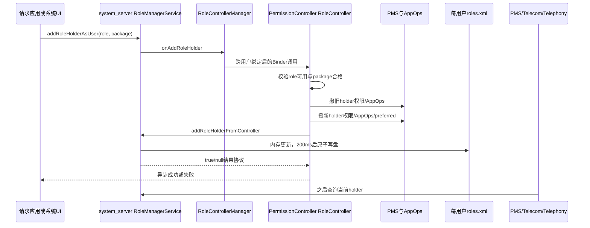
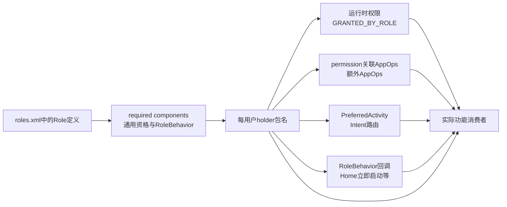
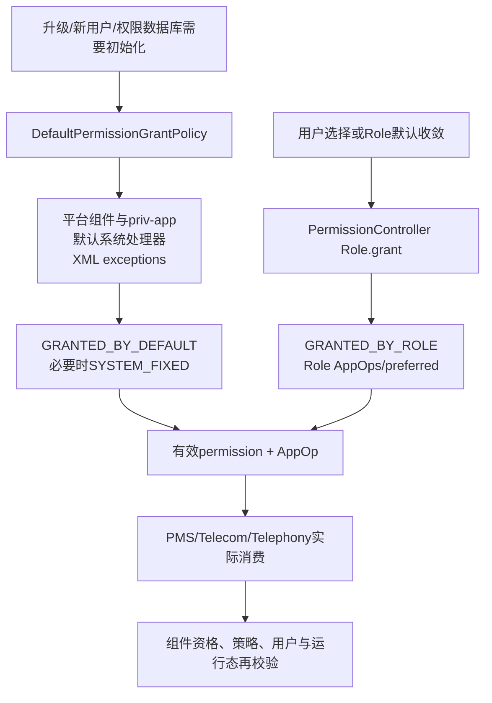

# 第551章 Android 默认应用收敛链：RoleManager、RoleController、DefaultPermissionGrantPolicy与Home/Browser/SMS/Dialer

> 源码基线：Android 11 / API 30 / `android-11.0.0_r48`。本章继续沿用macOS只读学习方式，不实际编译。建议先读第550章：上一章解释了PMS如何在多个Intent候选中作最终决策，本章继续回答“默认浏览器、默认桌面、默认电话和默认短信应用究竟由谁保存、谁授予能力、谁真正消费”。

## 1. “默认应用”不是一个字段

Android 11把“默认”拆成多个层次：RoleManager保存某用户的角色持有包；PermissionController判断包是否合格并增减权限、AppOps和PreferredActivity；PMS、Telecom或Telephony读取角色决定实际路由；DefaultPermissionGrantPolicy还会在首启、升级和新用户阶段给系统处理器做默认权限授权。只查其中一层，很容易得到“设置里已经选中，但功能仍不对”的半截结论。

## 2. 本章先统一五个词

`available`表示这个用户上存在该角色；`qualified`表示某包满足角色的组件和通用条件；`visible`表示该角色或候选应出现在UI；`holder`表示包名已写进角色记录；`privileges`是成为holder后配置的运行时权限、AppOps和PreferredActivity。一个包qualified不代表已持有，holder也不等于每份派生能力已经永远一致。

## 3. 七本账的心智模型

第一本是PermissionController资源`roles.xml`里的角色定义；第二本是每用户`roles.xml`中的holder集合；第三本是PMS运行时权限与flags；第四本是AppOps mode；第五本是PMS PreferredActivity；第六本是旧版本遗留的Secure Settings或旧默认浏览器记录；第七本是Telecom、Telephony、PMS等消费者的缓存与二次校验。Role变更的本质是让七本账逐步收敛。

## 4. 进程与线程边界

`RoleManagerService`运行在`system_server`；角色策略实现`RoleControllerServiceImpl`运行在每用户的PermissionController进程。system_server通过`RoleControllerManager`绑定远端服务，远端Binder入口再把工作投到专用`HandlerThread`。角色请求和默认应用设置界面也在PermissionController；角色状态写盘则由system_server的BackgroundThread延迟执行。

## 5. 第一幅图：一次角色变更经过谁



## 6. RoleManager是公开门面，不是策略实现

应用通过`Context.getSystemService(RoleManager.class)`获得门面。普通应用能调用`createRequestRoleIntent()`、`isRoleAvailable()`和`isRoleHeld()`；直接读取或修改其他包的holder需要`MANAGE_ROLE_HOLDERS`，观察变化需要`OBSERVE_ROLE_HOLDERS`。真正的资格和能力策略不在这个Java门面，而在PermissionController。

## 7. `createRequestRoleIntent()`把目标锁到PermissionController

它创建`android.app.role.action.REQUEST_ROLE`，显式`setPackage(getPermissionControllerPackageName())`并放入`EXTRA_ROLE_NAME`。请求包名没有作为一个任意extra交给调用者填写，PermissionController之后通过`getCallingPackage()`取得实际发起者，避免普通应用冒充另一个包申请角色。

## 8. `isRoleHeld()`只能检查调用应用自己

RoleManager把当前Context包名传给system_server；服务端用`AppOpsManager.checkPackage(callingUid, packageName)`核对UID归属，再查当前调用用户的holder集合。它不是无需权限的任意包角色探测API。系统级`getRoleHoldersAsUser()`才允许在持有权限后读取指定用户。

## 9. exclusive、requestable、visible互不等价

exclusive表示最多一个holder；requestable表示普通应用可以弹授权UI自荐；visible表示角色应在默认应用设置等UI出现。`RoleParser`默认`exclusive=true`，默认`visible=true`，而`requestable`默认跟随visible。ASSISTANT显式`requestable=false`，SYSTEM_GALLERY显式`visible=false`，说明系统内部角色不一定对普通请求开放。

## 10. `roles.xml`才是Android 11角色策略总表

`packages/apps/PermissionController/res/xml/roles.xml`定义角色名、默认holder资源、是否exclusive/fallback/system-only、必须实现的组件、要授予的权限、AppOps以及要配置的PreferredActivity。Java `RoleBehavior`只承载XML难以表达的特殊规则，例如浏览器`handleAllWebDataURI`、桌面fallback、设备是否支持语音或短信。

## 11. RoleParser把资源变成可执行模型

`RoleParser`解析permission-set复用组，再反射实例化`BrowserRoleBehavior`等行为类。缺失必须属性、重复角色或非法组合会记录错误；生产构造默认不开严格validation，解析失败的元素可能被跳过。`Roles.get()`在PermissionController进程内静态缓存结果，并不是每次查询都重新读XML。

## 12. system_server启动RoleManagerService

SystemServer在“Grants default permissions and defines roles”步骤构造`RoleManagerService(systemContext, LegacyRoleResolutionPolicy)`。构造器先确定PermissionController里的远端RoleController组件，注册`RoleManagerInternal`，并向PermissionManagerService安装默认browser、dialer和home provider桥接器。

## 13. RoleController是受信策略边界

`RoleControllerService`的增、删、清和默认角色授予Binder入口只接受`SYSTEM_UID`。PermissionController自己持有签名级`MANAGE_ROLES_FROM_CONTROLLER`，才可调用RoleManager的内部记录修改API。也就是说，system_server负责权威记录和权限门，PermissionController负责高层策略，两边都不是普通第三方可替换的插件点。

## 14. 远端服务按用户绑定

RoleManagerService为目标用户创建package context，再由RoleControllerManager以该userId绑定同一个PermissionController组件。`sRemoteServices`是按userId的静态表，因此每个用户的角色策略在对应用户上下文执行，`Process.myUserHandle()`在远端代码中也就指向目标用户。

## 15. 远端调用有15秒超时

RoleControllerManager把每个操作包装成`AndroidFuture<Bundle>`，15秒后超时；非null Bundle代表成功，null代表失败。服务端策略是单个HandlerThread串行执行，但RoleManager Binder API本身是异步回调，不会把调用者线程一直锁在整段权限和AppOps变更上。

## 16. 用户启动时同步等待默认角色收敛

`onStartUser()`调用`maybeGrantDefaultRolesSync()`，最多等待30秒；其中远端单次操作自身最多15秒。这样用户进入运行态前会尽量完成角色定义、迁移与能力补齐，但超时只会记错误，不意味着设备启动永久阻塞。

## 17. 包变化会节流重跑

RoleManagerService监听PACKAGE_CHANGED、ADDED、REMOVED；升级的REMOVED阶段被跳过，等紧随其后的ADDED。普通包变化按用户触发1秒`ThrottledRunnable`，避免安装过程的一串广播让全角色资格重复扫描多次。

## 18. RequestRoleActivity先做静默检查

界面出现前会检查role name、calling package、角色定义、available、visible、requestable、exclusive、应用存在、是否已经holder以及是否qualified。已经holder会直接`RESULT_OK`；未知、不合格或被永久拒绝的请求直接finish，减少误导性对话框和点击劫持面。

## 19. 请求窗口主动隐藏非系统overlay

Activity和Dialog都加入`SYSTEM_FLAG_HIDE_NON_SYSTEM_OVERLAY_WINDOWS`。这不能替代所有输入安全措施，但能阻止普通悬浮窗盖住“设为默认”对话框，降低角色授权被诱导点击的风险。

## 20. 用户可以拒绝，也可能选择另一候选

RequestRoleFragment展示qualified应用列表，不强制只显示发起者。用户若选另一个包，请求者得到取消语义并记一次拒绝；若选“None”，会记录none选择并清空holder。角色必须允许showNone且没有强制fallback，None才能长期保持。

## 21. 第二次拒绝可变成“不要再问”

第一次取消写`deniedOnce`；再次请求时才显示dont-ask-again复选框。勾选后按正按钮并不是授予，而是写`deniedAlways`并结束。包数据清理或完全卸载由`ClearUserDeniedReceiver`清理这份请求UI记忆，它不属于RoleManager holder状态。

## 22. 自己被授予时使用DONT_KILL_APP

若用户选择发起请求的应用，UI传`MANAGE_HOLDERS_FLAG_DONT_KILL_APP`，让角色层不要因为本次能力变化显式杀掉正在等待Activity result的应用；若用户选择另一个候选则flags为0。这个flag只约束Role层的显式kill，并不是跨PMS、AppOps所有副作用的全局“不杀进程”承诺。

## 23. 5秒包装器可能早于15秒真实超时

`DefaultDialerManager`、旧SmsApplication适配器和同步default-browser provider只等5秒，而RoleControllerManager底层操作窗口是15秒。外层可能先报告超时，远端任务随后仍完成；超时不是可靠回滚信号，诊断时应继续检查holder、permission flags与preferred最终状态。

## 24. RoleUserState按用户保存holder

内存结构是`ArrayMap<roleName, ArraySet<packageName>>`，另存schema version和上次默认角色扫描的packagesHash。角色“可用”的服务端含义只是map中存在这个role key；空集合也表示角色可用但当前没有holder。

## 25. Android 11主存储位于permission APEX的DE目录

`RolesPersistenceImpl`用`ApexEnvironment.getApexEnvironment("com.android.permission").getDeviceProtectedDataDirForUser(user)`定位`roles.xml`。它可在用户解锁前读取。旧`/data/system/users/<id>/roles.xml`仅作为迁移读取源；新格式成功读取后走APEX数据目录。

## 26. 写盘延迟200毫秒并使用AtomicFile

holder或hash变化先更新内存，BackgroundThread在200ms后取深拷贝写盘，连续变化合并成一次写。Binder成功回调可以早于磁盘落盘；正常崩溃由AtomicFile备份恢复，但突然断电窗口内的最新内存状态仍可能需要下次默认角色重算修复。

## 27. holder变化通知也是分步的

RoleUserState只在集合真正变化时回调RoleManagerService；服务再经FgThread通知本用户和USER_ALL监听器。exclusive角色切换通常先remove旧包、再add新包，因此监听者可能收到两个事件，中间短暂观察到空集合，不能假定一次回调同时携带完整旧→新事务。

## 28. SMS还保留遗留广播

每次SMS holder变化都会调用`SmsApplication.broadcastSmsAppChange(removedHolder, addedHolder)`。因为exclusive切换是分两次写，旧短信应用和新短信应用的通知也可能分别发生，而不是天然合并成单个不可分割广播。

## 29. 首次迁移只在role key不存在时执行

`maybeMigrateRole()`看到角色尚不可用，才向`LegacyRoleResolutionPolicy`询问旧holder并先写入role key和包名。只要角色key已经存在——即使集合为空——以后就不会再次从旧Secure Settings或旧PMS字段迁移，防止用户清空后又被旧记录复活。

## 30. 各角色的遗留来源不同

BROWSER从PMS旧default-browser字段读取并移除；DIALER与SMS读取各自Secure Settings，升级且设置为空时回退config默认包；HOME仅设备升级时解析当前HOME并排除Settings fallback；ASSISTANT把Secure Setting中的组件压成包名；EMERGENCY读取旧设置。迁移只是候选输入，远端控制器随后仍要重新校验资格和补能力。

## 31. “有迁移记录”不等于跳过校验

Controller遍历当前holder：仍qualified就重做grant，但不覆盖用户已设置/固定的权限；不再qualified就撤销并删除。这样旧版本曾合法的短信包在新版本缺少必要receiver时不会只凭遗留包名继续占据角色。

## 32. packagesHash是重跑默认角色的缓存键

system_server遍历已安装包，把包名、longVersionCode、应用enabled state、显式enabled/disabled组件和当前签名写进字节流，再做SHA-256。新hash等于持久化旧hash时直接跳过默认角色扫描；只有controller报告成功才保存新hash。

## 33. hash不是安全证明，也不是完整Manifest摘要

r48的字节流没有长度分隔所有字符串，也没有写disabled组件数量，`ByteArrayOutputStream.write(int)`对某些整数只保留低8位；它也不直接纳入IntentFilter和requestedPermissions内容。通常版本号变化足以触发，但相同版本/签名的异常替换或理论碰撞可能漏掉策略变化，所以它只能是性能缓存键。

## 34. 第一段关键源码：默认角色重算入口

```java
String oldPackagesHash = userState.getPackagesHash();
String newPackagesHash = computeComponentStateHash(userId);
if (Objects.equals(oldPackagesHash, newPackagesHash)) {
    return AndroidFuture.completedFuture(null);
}

maybeMigrateRole(RoleManager.ROLE_BROWSER, userId);
maybeMigrateRole(RoleManager.ROLE_DIALER, userId);
maybeMigrateRole(RoleManager.ROLE_SMS, userId);
maybeMigrateRole(RoleManager.ROLE_HOME, userId);

getOrCreateController(userId).grantDefaultRoles(FgThread.getExecutor(), successful -> {
    if (successful) {
        userState.setPackagesHash(newPackagesHash);
        future.complete(null);
    } else {
        future.completeExceptionally(new RuntimeException());
    }
});
```

它说明迁移、资格重查与能力补齐都在hash变化后发生；hash只在远端总体返回成功时推进。

## 35. Controller先公布available角色集合

`onGrantDefaultRoles()`从`Roles.get()`取定义，只保留当前用户available的角色，再调用`setRoleNamesFromController()`。对于不再available的角色，RoleUserState会直接删除key；源码有TODO提醒应先清理holder，当前实现可能在删除记录前没有逐项撤销旧权限/AppOps。

## 36. 新角色的default holder只在首次加入时考虑

控制器记录哪些role name是本轮新加入的。若校验后仍无holder，新角色先尝试`getDefaultHolders()`；已有角色不再反复强塞配置默认，而是走fallback。默认holder资源还必须指向system app，随后仍要满足该角色完整资格。

## 37. 第二幅图：holder背后会派生哪些能力



## 38. default holder与fallback holder不是一回事

default holder用于角色第一次出现；fallback用于当前holder为空时维持基础功能。Dialer的`fallBackToDefaultHolder=true`会回到config默认电话；Browser只有恰好一个合格浏览器时才fallback；Home由行为类选唯一最高priority非Settings桌面；SMS先用config默认，否则甚至可能取首个第三方qualified包。

## 39. exclusive异常多holder时只保留第一项

重算看到exclusive角色有多个holder，会记录警告并从索引1开始撤掉多余项。源码承认没有可靠办法判断谁才应留下，因此集合顺序影响结果；这是一种损坏恢复策略，不应当被解释成用户明确选择了“第一项”。

## 40. 默认角色重算的success粒度偏粗

`RoleControllerServiceImpl.onGrantDefaultRoles()`内部多处对add/remove失败只记录日志或忽略返回值，方法末尾仍固定`return true`。因此system_server可能更新packagesHash，即使个别角色能力没有完全补齐；后续若包状态不再变化，就要靠显式角色操作、其他修复路径或人工清hash条件再次触发。

## 41. 新holder的建立不是数据库事务

exclusive切换时控制器先对每个旧holder执行`role.revoke()`并从RoleManager记录移除，再对新包`role.grant()`，最后才写新holder记录。权限、AppOps、PreferredActivity和holder文件分属不同服务与持久化系统；中途失败可能留下旧包已撤、新包部分授予或preferred已换但holder尚未写的状态。

## 42. 第二段关键源码：exclusive角色切换顺序

```java
boolean added = false;
if (role.isExclusive()) {
    List<String> currentPackageNames = mRoleManager.getRoleHolders(roleName);
    int currentPackageNamesSize = currentPackageNames.size();
    for (int i = 0; i < currentPackageNamesSize; i++) {
        String currentPackageName = currentPackageNames.get(i);
        if (Objects.equals(currentPackageName, packageName)) {
            added = true;
            continue;
        }
        boolean removed = removeRoleHolderInternal(role, currentPackageName, false);
        if (!removed) return false;
    }
}

boolean dontKillApp = hasFlag(flags, RoleManager.MANAGE_HOLDERS_FLAG_DONT_KILL_APP);
added = addRoleHolderInternal(role, packageName, dontKillApp, true, added);
if (!added) return false;
```

顺序有意让新holder建立前先清旧holder，但没有跨服务回滚日志；排障必须分别观察每层。

## 43. Role.grant会同时处理四类能力

它调用`Permissions.grant()`授运行时权限和关联AppOp；遍历`app-op-permissions`只放开某特殊权限对应的AppOp；遍历额外`app-ops`设置指定mode；再配置所有PreferredActivity，最后执行RoleBehavior的自定义grant钩子。holder包名只是这些能力的根，不是能力本身。

## 44. 明确用户选择使用GRANTED_BY_ROLE

PermissionController把新授予的权限标为`FLAG_PERMISSION_GRANTED_BY_ROLE`，区别于首启默认授权的`GRANTED_BY_DEFAULT`。如果权限原本已经由用户或默认策略有效授予，代码通常不再补`GRANTED_BY_ROLE`位；失去角色时也只自动撤销确实带role来源标志的权限，避免拿走用户独立授予的能力。

## 45. 显式角色选择可以覆盖用户拒绝，但不能压过设备策略

onAdd路径把`overrideUserSetAndFixedPermissions=true`传入，能清理新授权限的USER_SET/USER_FIXED，符合“用户现在明确选择默认电话/短信应用”的新意图；`POLICY_FIXED`始终阻止覆盖，`SYSTEM_FIXED`默认也不被角色层越过。企业策略仍高于普通默认应用选择。

## 46. 前后台权限按依赖顺序处理

Role Permissions先授前台权限，再根据前台是否有效授后台权限；撤销时反过来先撤后台，再决定前台AppOp降为foreground或default。它同时检查权限grant与AppOp mode，因此“PMS显示granted”不必然等于角色认为能力已完整生效。

## 47. updated system app按当前声明而不是只信工厂APK

角色grant先与当前包的requestedPermissions求交；配置`overrideDisabledSystemPackage=true`时允许用户明确选择的Phone/SMS更新包使用当前声明，不受工厂包旧声明过度限制。DefaultPermissionGrantPolicy的普通首启授权则通常更保守，会把更新包与disabled factory版本再次相交。

## 48. 受限SMS与Call Log权限会补system exemption

Role Permissions在授予SMS或Call Log组时，把对应权限加入restricted permission的system whitelist。它解决的是hard/soft restricted白名单资格，不取代运行时grant与AppOps；撤角色时仅在权限也不再由默认授权支撑时尝试移除system whitelist。

## 49. 撤角色时会保留其他角色共同需要的能力

`Role.revoke()`先取得该包仍持有的其他role names，从待撤权限、app-op-permissions和AppOps列表中减掉它们仍需要的条目。这个手工“角色引用集合”避免同一包兼任SMS和Dialer时，失去其中一个角色就把另一个角色依赖一并清掉。

## 50. GRANTED_BY_ROLE本身没有记录“来自哪个角色”

权限flag只是一个布尔来源位，所以撤销前必须用当前holder集合重新计算其他角色的需求。若holder记录已经漂移、角色定义删除却没撤能力，单看flag无法还原历史授予者；这也是Role状态与permission flags必须一起核对的原因。

## 51. AppOps有UID级与package级两种写法

普通权限关联op和多数额外op使用`setUidMode()`，会影响shared UID内所有包；SYSTEM_ALERT_WINDOW、WRITE_SETTINGS、REQUEST_INSTALL_PACKAGES等特定app-op-permission走`setMode(uid, package)`。角色资格按包，执行能力却可能落到UID，shared UID是天然的粒度不对称点。

## 52. PreferredActivity由角色现场重建候选集合

`PreferredActivity.configure()`先在目标包中找最优合格Activity，再按每个IntentFilterData查询当前全部候选，加入DEFAULT category，构造ComponentName集合并调用`replacePreferredActivity()`。它不是只把包名写进一张“默认”表，而是复用第550章的候选集合授权语义。

## 53. Role.revoke故意不清PreferredActivity

源码TODO明确写着尚未撤preferred。多数使用preferred的角色有新holder或fallback，新grant会立即replace；同时避免在exclusive换人时先清空导致系统监听者收到错误的中间路由通知。但若清空角色后没有fallback，旧preferred可能残留，形成holder与实际Intent路由不一致。

## 54. Role层的kill逻辑也不是绝对可靠

撤销能力变化且未传DONT_KILL时，Role会`ActivityManager.killUid()`；grant只对不支持runtime permission的旧target应用在能力变化时显式kill。r48的`grantPermissionAndAppOp()`遇到没有关联AppOp的权限时，即便permission刚改变也可能返回false，使上层“是否变化”漏记，影响这个额外kill判断，但不影响已经执行的grant本身。

## 55. Browser角色没有普通PreferredActivity

roles.xml明确把BROWSER的required-components和preferred配置交给`BrowserRoleBehavior`/PMS特殊逻辑。浏览器是网页domain决策链的一部分，不能用一条普通VIEW preferred覆盖所有已验证App。Role holder由PMS的default-browser provider读取，再参与第550章的web候选分组。

## 56. 浏览器资格要求“通用处理所有网页”

行为类用VIEW+BROWSABLE+`http:`查询，并显式加入MATCH_ALL及双direct-boot flags，再只保留`ResolveInfo.handleAllWebDataURI=true`的包。只声明某几个host的深链App不算浏览器，即使它能打开当前这个URL。

## 57. 为什么浏览器查询必须加MATCH_ALL

普通PackageManager网页查询可能被当前default browser和domain策略裁剪。资格枚举要看所有通用browser，所以先MATCH_ALL，再手工检查`handleAllWebDataURI`。源码还特别提醒MATCH_ALL本身不包含direct-boot flags，两个维度必须分别补上。

## 58. Browser fallback非常克制

没有holder时，只有全用户恰好一个qualified browser才自动补为fallback；两个或更多浏览器时保持空，让用户选择。配置`config_defaultBrowser`仅在角色首次加入时作为system default holder尝试，资格不合格时不会强行写入。

## 59. 新装浏览器会主动清默认浏览器

PMS的`clearRolesAndRestorePermissionsForNewUserInstall()`发现新安装包是browser，若不是设备恢复安装，会异步把default browser设null。目的正是让新竞争者获得选择机会；随后RoleManager又因包广播重做资格扫描。两条路径并存，不能把“装浏览器后默认消失”误判为随机丢配置。

## 60. 浏览器Role和domain verification分工不同

Role回答“没有verified App胜出时，哪个通用browser是默认”；Domain Verification回答“某个网页是否应优先进入专用App”。已验证App的ALWAYS通常先排除browser，ALWAYS_ASK会把browser带回候选。default browser不是所有https链接的最高全局优先级。

## 61. 旧PackageManager浏览器API已桥接到Role

`ApplicationPackageManager.getDefaultBrowserPackageNameAsUser()`转到PermissionManager provider，最终读取BROWSER holder；setter经SET_PREFERRED_APPLICATIONS与跨用户权限检查后调用RoleController add或clear。备份恢复也先解析旧default-app XML，再以`doGrant=false`写回新Role体系。

## 62. Resolver里第一次点浏览器“始终”会建立Role

第550章看到：当目标是通用browser且当前default browser为空，ResolverActivity调用旧PackageManager setter。由于setter已桥接Role，用户看似在Intent选择器里点“始终”，实际会进入BROWSER holder变更，而不只是添加普通PreferredActivity。

## 63. 浏览器角色自身不授运行时权限

roles.xml的BROWSER没有permissions、AppOps或preferred。旧`setDefaultBrowserInternal(..., doGrant=true)`会调用DefaultPermissionGrantPolicy，且只给system browser前台位置权限；普通第三方默认浏览器不会因为角色自动获得位置权限，仍应按常规运行时请求。

## 64. HOME角色同时依赖Role记录和PreferredActivity

HOME要求MAIN+HOME Activity，并配置同类preferred。PMS的`getHomeActivitiesAsUser()`先读HOME holder包名，再在当前HOME候选中找该包的Activity；角色grant又用`replacePreferredActivity()`保证普通HOME Intent解析向它收敛。这是两份相互校正的状态。

## 65. 工作资料上HOME角色不可用

`HomeRoleBehavior.isAvailableAsUser()`对work profile返回false。工作资料的应用图标和任务仍由父用户Launcher承载，不建立独立默认桌面。默认应用UI也会隐藏相应角色，不能拿主用户holder直接当工作资料自己的holder记录。

## 66. Home fallback排除Settings的应急桌面

Settings可能提供只用于无正常Launcher时救援的HOME Activity。HomeRoleBehavior遍历候选时跳过Settings包，再选唯一最高priority包；若最高priority并列则返回null。这样不会把不可在UI长期选择的应急页面固化成HOME角色。

## 67. 同包多个同priority HOME组件也可能造成fallback为空

fallback代码比较ResolveInfo priority，不判断并列项是否来自同一个包。两个相同最高priority Activity即使属于同一Launcher包，也会把`packageName`重置为null。这是r48实现边界，不能把“只有一个Launcher APK”直接等价为“有唯一fallback”。

## 68. PermissionController调用preferred时有防递归闸门

HOME角色grant先replace preferred，此时Role holder可能还没写新值。PMS的`updateDefaultHomeNotLocked()`若发现调用包是required PermissionController，会拒绝再反向设置Role，避免“RoleController改preferred→PMS又改Role→再次改preferred”的循环。

## 69. 旧`setHomeActivity()`反向桥接Role

其他有权限的旧路径调用PMS `setHomeActivity()`时，PMS先验证组件属于HOME候选并replace preferred；随后`updateDefaultHomeNotLocked()`比较首选包与HOME holder，不一致就通过PermissionManager的DefaultHomeProvider异步调用RoleController。旧组件级API因此最终投影为新包级Role。

## 70. HOME holder只存包名，不存具体Activity

PMS读holder后遍历当前HOME ResolveInfo，返回该包遇到的第一个Activity；Role的PreferredActivity配置则先选RequiredActivity查询中的第一项。若同包有多个HOME Activity且排序变化，两条“第一项”可能漂移，角色模型本身不能表达用户锁定其中某个具体类。

## 71. Home选择成功后UI主动启动HOME

`HomeRoleBehavior.onHolderSelectedAsUser()`发送MAIN+HOME+NEW_TASK，让新桌面立即可见，不用等用户再按Home键。这个钩子只在UI选择成功后调用；system API添加holder的Controller只触发`onHolderAdded`和`onHolderChanged`，不会天然模拟所有UI-only行为。

## 72. 有工作资料时旧target Launcher会在UI被禁用

Home候选若targetSdk低于LOLLIPOP且当前设备存在work profile，PermissionController把Preference禁用并显示“不支持工作资料”。资格的底层required component仍可能匹配，因此“qualified”和“用户界面允许选择”在这里有进一步可见性/交互差异。

## 73. DIALER要求两种DIAL能力

候选包必须同时有能处理无data的ACTION_DIAL Activity和能处理`tel:`的ACTION_DIAL Activity。RequiredComponent对每条要求最多取每包一个最佳组件，再做交集；只有其中一个filter不够成为完整默认电话应用。

## 74. Dialer角色提供一组大权限和后台AppOps

它包含phone、contacts、sms、microphone、camera权限组，并放开`run_any_in_background`；targetSdk≤25还放开旧`run_in_background`。这些能力支持来电UI、拨号、通话记录、语音和视频，但实际敏感操作仍可能有Telecom身份、AppOps与系统dialer的额外检查。

## 75. Dialer会配置两个PreferredActivity

Role分别对空scheme DIAL和`tel:` DIAL调用replacePreferredActivity，使普通拨号Intent默认进入holder中的匹配Activity。实际“接听来电/紧急呼叫”并不是靠这两个IntentFilter决定，而由Telecom读取DIALER holder和系统dialer配置执行。

## 76. default dialer与system dialer必须分开

default dialer是用户角色holder；system dialer是设备预装的可信电话实现。`DefaultDialerManager.isDefaultOrSystemDialer()`对两者都认可某些特权，系统dialer不会因为用户换了默认电话就失去所有平台职责。设置页也会给system dialer显示“系统默认”说明。

## 77. Dialer角色仅在voice-capable设备可用

`DialerRoleBehavior`询问`TelephonyManager.isVoiceCapable()`。平板即使装了声明DIAL的应用，也可能没有DIALER role；反过来，角色available仍不意味着蜂窝通话栈、SIM或电话账户此刻可用。

## 78. 旧DefaultDialerManager只是Role适配层

setter清Binder identity后调用`addRoleHolderAsUser(ROLE_DIALER)`并最多等5秒；getter取holder集合第一项。源码注释里“用户选择→系统dialer→null”的旧描述已不完全由getter实现，fallback主要由RoleController提前维持，读代码应以当前调用链而不是陈旧Javadoc为准。

## 79. SMS资格比“能发短信”严格得多

包必须同时具备：受`BROADCAST_SMS`保护的SMS_DELIVER Receiver、受`BROADCAST_WAP_PUSH`保护且MMS MIME匹配的WAP Receiver、受`SEND_RESPOND_VIA_MESSAGE`保护的`smsto:` Service，以及能处理`smsto:` SENDTO的Activity。缺一个就不是默认短信候选。

## 80. SMS角色授予权限、AppOps和SENDTO preferred

它授phone、contacts、sms、storage、microphone、camera权限，放开`write_sms`、后台运行和`read_device_identifiers` AppOps，并把sms/smsto/mms/mmsto四种SENDTO scheme都指向holder的发送Activity。接收入站短信仍由Telephony定向投递，不靠SENDTO preferred。

## 81. SMS角色在部分用户上不可用

work profile和restricted profile直接返回不可用；普通用户还要求设备SMS-capable。车载例外是：即使`isSmsCapable=false`，只要资源配置了默认holder仍保留角色。角色定义考虑的是产品形态，不是单看Manifest候选。

## 82. SMS fallback保留了一个有风险的旧行为

先尝试`config_defaultSms`中的system app；没有配置时，行为类取qualified列表第一项。源码TODO明确承认这可能让任意第三方在无系统默认短信App时突然成为fallback并获得权限。它是兼容旧行为的折中，不应宣传成普遍安全选择原则。

## 83. 第三幅图：DefaultPermissionGrantPolicy与Role授权的交叉



## 84. DefaultPermissionGrantPolicy仍然不可替代

Android 11已有Role，但首启授权策略还要覆盖installer、verifier、providers、sync adapter、位置组件、系统Home等大量非Role处理器。其主流程分三段：系统组件与平台签名persistent priv-app、默认system handlers、default-permissions XML exceptions，最后由DelayingPackageManagerCache批量apply。

## 85. 默认权限策略只授请求过的runtime permission

它先读取PackageInfo请求列表，处理split permission，再按system/updated-system规则求交。多数默认handler必须是system package且targetSdk支持runtime permission；`systemFixed`只用于不能轻易撤销的关键组件。默认处理器身份不会凭空授一个Manifest完全没声明的权限。

## 86. handler provider让高层服务告诉权限策略“默认是谁”

DefaultPermissionGrantPolicy可接收SMS、Dialer、SIM call manager等PackagesProvider。TelecomLoaderService安装这些回调；执行默认授权时优先询问provider，provider为空或返回null时才用Intent解析找到系统handler。这样权限层无需直接依赖Telecom内部实现。

## 87. 第三段关键源码：Dialer与SMS默认权限来源

```java
if (dialerAppPackageNames == null) {
    String dialerPackage = getDefaultSystemHandlerActivityPackage(
            pm, Intent.ACTION_DIAL, userId);
    grantDefaultPermissionsToDefaultSystemDialerApp(pm, dialerPackage, userId);
} else {
    for (String packageName : dialerAppPackageNames) {
        grantDefaultPermissionsToDefaultSystemDialerApp(pm, packageName, userId);
    }
}

if (smsAppPackageNames == null) {
    String smsPackage = getDefaultSystemHandlerActivityPackageForCategory(
            pm, Intent.CATEGORY_APP_MESSAGING, userId);
    grantDefaultPermissionsToDefaultSystemSmsApp(pm, smsPackage, userId);
}
```

这里的函数名含`System`很关键：首启默认策略与用户选择任意第三方角色holder不是同一授权路径。

## 88. 系统默认Dialer/SMS与用户选择的第三方分流

DefaultPermissionGrantPolicy的`grantDefaultPermissionsToDefaultSystem*`会先要求system package；用户后来选择第三方Dialer/SMS，由Role Permissions直接授`GRANTED_BY_ROLE`能力。前者保护出厂可用性，后者表达用户显式授权，两条路径的来源flag和撤销语义不同。

## 89. 同一权限可能先被default policy授予

若system Dialer/SMS已带`GRANTED_BY_DEFAULT`且AppOp有效，Role重做grant通常不会再加`GRANTED_BY_ROLE`。之后失去角色时，Role只撤role来源的权限，因此旧system默认应用可能继续保留默认策略授予的能力；这不是Role“撤销失败”，而是另一个合法授予来源仍存在。

## 90. DefaultPermissionGrantPolicy尊重用户和策略flags

普通默认授权遇到USER_SET、USER_FIXED、POLICY_FIXED、SYSTEM_FIXED通常不覆盖；Phone/SMS等明确默认选择的特殊路径可通过ignoreSystemPackage语义越过用户flags，但仍不压POLICY_FIXED。撤默认授权也只处理`GRANTED_BY_DEFAULT`，不做来源引用计数，并明确让SYSTEM_FIXED位保持sticky。

## 91. Home的默认位置权限来自旧策略而非HOME Role

roles.xml里的HOME没有permissions；DefaultPermissionGrantPolicy却解析MAIN+HOME+LAUNCHER_APP的system handler并授ALWAYS_LOCATION权限。于是“默认桌面为何有后台位置”应查默认系统handler授权，不应在HOME Role权限列表里硬找。

## 92. Browser的前台位置权限也只给system package

策略先取known browser，缺失时解析CATEGORY_APP_BROWSER并再次确认system package，随后授fine/coarse前台位置。公开default-browser setter触发的补授同样走`grantPermissionsToSystemPackage()`；第三方默认browser仍需自己请求位置。

## 93. Watch上的Dialer phone权限可能SYSTEM_FIXED

`grantDefaultPermissionsToDefaultSystemDialerApp()`在FEATURE_WATCH设备把PHONE权限组作为system-fixed，其他设备通常是非fixed默认授权；contacts、SMS、microphone、camera仍按普通system handler授权。这说明同一Role名称在不同产品形态上也可能有不同固定性。

## 94. r48的Telecom provider没有完整转发userId

TelecomLoaderService的SMS和Dialer provider lambda虽接收`userId`，却调用无user参数的`SmsApplication.getDefaultSmsApplication(mContext, true)`和`DefaultDialerManager.getDefaultDialerApplication(mContext)`。在system service context中，这可能按服务Context/调用身份取默认包，而不是明确按请求用户；多用户默认权限初始化时要留意这个r48边界。

## 95. 短信消费者会再次验证组件与exclusive AppOps

`SmsApplication.getApplication()`先从RoleManager取SMS holder，再从四组件交集结果中找该包；若需要修复，还检查WRITE_SMS等exclusive AppOps，不正确时由特权调用者补回，否则不返回有效默认SMS组件。holder记录不是定向投递的唯一安全条件。

## 96. SMS角色变化还要照顾系统协作者

`defaultSmsAppChanged()`会给Phone、Bluetooth、MmsService、TelephonyProvider和CellBroadcastReceiver等可信系统包配置exclusive SMS AppOps，并允许PHONE_UID。默认短信App是数据写入中心，但电话栈的系统协作者仍需合法代理能力。

## 97. 旧SmsApplication setter在改Role前先重置旧AppOps

兼容路径会把旧SMS包的exclusive AppOps设回default，再异步添加新ROLE_SMS holder并最多等5秒。若Role添加失败，旧AppOps已经先被重置，方法只记日志返回；这再次证明兼容包装器不是可回滚事务。

## 98. Role切换后的“成功”只代表策略方法返回true

RemoteCallback非null会一路翻译为Boolean true；磁盘写仍可能延迟，preferred/permission内部API大多没有聚合式事务回执，消费服务也可能尚未刷新缓存。可靠验证应读取Role holder、权限flags、AppOps、PMS preferred和具体服务状态，而非只信Activity result。

## 99. 默认应用设置页已经由PermissionController承载

PermissionController Manifest以更高priority声明`MANAGE_DEFAULT_APPS_SETTINGS`、`MANAGE_DEFAULT_APP`和HOME_SETTINGS入口。`DefaultAppListActivity/DefaultAppActivity`读取Role定义与qualified应用，再通过ManageRoleHolderStateLiveData调用RoleManager；Settings工程中的旧picker引用更多是历史与兼容背景。

## 100. 设置页的资格列表与请求页目的不同

默认应用设置页由系统入口管理任一候选；RequestRoleActivity代表某应用主动请求，必须验证calling package，还维护denied-once/always与请求结果统计。两者最终都走同一RoleController，但授权意图、UI和结果语义不能混为一个页面。

## 101. system-only、enabled、instant与shared library是通用资格门

`Role.isPackageMinimallyQualifiedAsUser()`排除`android`包、找不到或disabled应用、instant app、声明shared library的包；system-only角色还要求FLAG_SYSTEM。之后才检查required components和行为类特殊规则。一个Intent能解析到组件，不代表它一定通过Role通用资格。

## 102. RequiredComponent只取每包一个最佳组件

每条requirement按用户查询组件，验证组件声明permission，再用包名去重并保留排序第一项。Role求多个required components的包交集；它验证“每项至少一个”，不会要求所有能力由同一个Activity/Service实现，这正适合SMS由多个组件共同组成的模型。

## 103. PermissionController具有QUERY_ALL_PACKAGES但仍按目标用户查询

它是force-queryable的系统核心App并声明QUERY_ALL_PACKAGES，资格枚举不会像普通第三方那样只看狭窄包可见子集；RequiredComponent和BrowserBehavior又用目标用户Context与direct-boot flags。可见性放宽不等于跳过installed/enabled/role-specific校验。

## 104. 多用户状态彼此独立，组件代码却是同一份

每用户有独立holder文件、PermissionController进程上下文、permission/AppOps状态和preferred。包的Manifest和签名通常跨用户共享，但enabled state、installed、profile类型和holder不同；故同一个APK可以是user0默认浏览器、不是user10默认浏览器。

## 105. user removal清理了RoleManager实例状态

收到USER_REMOVED后，服务移除节流任务、listener、controller和RoleUserState，并删除新roles持久文件。r48的RoleControllerManager另有静态` sRemoteServices`按user缓存，源码未见同步remove/unbind入口；长生命周期system_server中可能保留已删除用户的connector对象，是资源清理边界而非holder继续有效。

## 106. listener移除路径有一个明显空对象检查失误

RoleManagerService先`Objects.requireNonNull(listener)`，随后取得可能为null的listeners表，却写成`if (listener == null) return`，最后直接`listeners.unregister(listener)`。从未注册过该user列表时可能NPE；客户端RoleManager通常先检查自己的本地map，系统级异常调用仍应注意r48实现缺口。

## 107. resetApplicationPreferences没有完整重置所有Role

PMS清preferred、domain状态、runtime permissions和default browser后，源码TODO明确说尚未重置默认SMS和Phone。HOME通过preferred变化可能反向更新Role，但DIALER/SMS holder可能继续存在；“重置应用偏好”不等于清空所有现代默认应用角色。

## 108. 诊断默认应用要按四步回读

先`dumpsys role`确认目标用户holder；再查包是否仍满足required components；然后查`dumpsys package`权限flags和`appops get`；最后查PMS preferred/default browser或Telecom/Telephony消费者。若第一步正确、最后一步错误，重点找桥接、缓存、AppOps或非原子中途失败。

## 109. 无设备也能从文件推导预期

在macOS源码树里先从`roles.xml`找到角色定义，再到对应RoleBehavior看availability/fallback，接着追RoleControllerServiceImpl的grant/revoke，最后看消费者。这个方向比从“默认短信”全文搜索所有旧Secure Setting更容易区分现行链和迁移兼容链。

## 110. 用一次SMS换默认串起全链

请求应用启动Role Intent；PermissionController从calling package和四组件资格建立列表；用户确认后，Controller先撤旧holder独占能力，再给新包grant-by-role权限、WRITE_SMS/后台AppOps及四种SENDTO preferred，写holder并通知；Telephony收到变化后定向广播和修复系统协作者AppOps。任何一步失败都可能表现为“UI选中了但收不到/发不出”。

## 111. 用一次HOME换默认串起双向桥

PermissionController给新Launcher配置HOME preferred，PMS因调用者是PermissionController而不反向递归，随后RoleManager写HOME holder；UI成功后立即启动HOME。若旧system API先改HOME preferred，则PMS识别首选包变化，再异步调用DefaultHomeProvider写Role，实现旧组件级入口向新包级角色收敛。

## 112. macOS只读练习一：追RoleManager服务、hash与持久化

在源码根目录执行：

```bash
sed -n '155,333p' frameworks/base/services/core/java/com/android/server/role/RoleManagerService.java
sed -n '490,570p' frameworks/base/services/core/java/com/android/server/role/RoleManagerService.java
sed -n '55,390p' frameworks/base/services/core/java/com/android/server/role/RoleUserState.java
sed -n '45,190p' frameworks/base/apex/permission/service/java/com/android/role/persistence/RolesPersistenceImpl.java
```

预期：看到用户启动/包变化重算、迁移与packagesHash、controller内部写记录，以及200ms快照写和permission APEX的DE AtomicFile。

## 113. macOS只读练习二：追资格、授予、撤销与preferred

```bash
sed -n '43,390p' packages/apps/PermissionController/src/com/android/permissioncontroller/role/service/RoleControllerServiceImpl.java
sed -n '520,790p' packages/apps/PermissionController/src/com/android/permissioncontroller/role/model/Role.java
sed -n '150,540p' packages/apps/PermissionController/src/com/android/permissioncontroller/role/model/Permissions.java
sed -n '1,150p' packages/apps/PermissionController/src/com/android/permissioncontroller/role/model/PreferredActivity.java
```

预期：能按“资格→撤旧→grant能力→写holder→回调”复述切换，并解释共享角色能力为何不会被盲目撤销，以及preferred为何不是holder文件的一部分。

## 114. macOS只读练习三：对比Browser、Home、Dialer与SMS

```bash
sed -n '110,430p' packages/apps/PermissionController/res/xml/roles.xml
sed -n '1,180p' packages/apps/PermissionController/src/com/android/permissioncontroller/role/model/BrowserRoleBehavior.java
sed -n '1,260p' packages/apps/PermissionController/src/com/android/permissioncontroller/role/model/HomeRoleBehavior.java
sed -n '1,180p' packages/apps/PermissionController/src/com/android/permissioncontroller/role/model/SmsRoleBehavior.java
sed -n '1,160p' packages/apps/PermissionController/src/com/android/permissioncontroller/role/model/DialerRoleBehavior.java
```

预期：说清browser为什么不用普通preferred、home为什么排除Settings与work profile、dialer为何要两种DIAL，以及SMS为何需要四类组件。

## 115. macOS只读练习四：验证旧默认授权与桥接消费者

```bash
sed -n '80,165p' frameworks/base/services/core/java/com/android/server/policy/role/LegacyRoleResolutionPolicy.java
sed -n '480,705p' frameworks/base/services/core/java/com/android/server/pm/permission/DefaultPermissionGrantPolicy.java
sed -n '864,1000p' frameworks/base/services/core/java/com/android/server/pm/permission/DefaultPermissionGrantPolicy.java
sed -n '20491,20643p' frameworks/base/services/core/java/com/android/server/pm/PackageManagerService.java
sed -n '463,530p' frameworks/base/telephony/common/com/android/internal/telephony/SmsApplication.java
```

预期：区分迁移输入、granted-by-default、granted-by-role、HOME双向桥和Telephony对SMS holder的二次组件/AppOps验证。

## 116. 常见故障定位矩阵

角色请求不弹：查requestable/visible/available、calling package、qualified和deniedAlways；列表无某App：查required components声明permission、enabled/instant/shared-library与用户；holder变了但Intent还进旧App：查preferred残留和Role revoke不清preferred；浏览器未直达：查domain状态而非只查BROWSER Role；SMS收不到：查四组件、exclusive AppOps和定向投递；电话被杀或能力不足：查DONT_KILL、permission flags、system/default dialer分工；重启回退：查200ms写盘、roles.xml与packagesHash。

## 117. 最容易出现的二十个误解

一，默认应用只存在Secure Settings；二，qualified就是holder；三，holder写入等于所有能力原子成功；四，RoleController运行在system_server；五，普通应用能直接给别的包加Role；六，exclusive切换只有一个不可分割通知；七，BROWSER用普通VIEW preferred；八，默认browser压过verified App；九，HOME只靠PreferredActivity；十，HOME holder保存具体Activity；十一，system dialer就是用户default dialer；十二，会DIAL一次就能当Dialer；十三，能SENDTO就能当SMS；十四，失去Role会撤掉用户自己授的同名权限；十五，GRANTED_BY_ROLE记录了具体角色名；十六，DefaultPermissionGrantPolicy已被Role完全取代；十七，第三方browser会自动拿位置；十八，reset preferences清空全部Role；十九，回调success等于已经fsync所有账；二十，5秒超时保证远端操作不会晚到成功。

## 118. 本章源码导航

服务与状态看`RoleManagerService`、`RoleUserState`、permission APEX的`RolesPersistenceImpl`；跨进程看`RoleManager`、`RoleControllerManager/Service`；策略看PermissionController的`RoleControllerServiceImpl`、`Role`、`Permissions`、`AppOp*`、`PreferredActivity`、`roles.xml`和四个RoleBehavior；兼容看`LegacyRoleResolutionPolicy`、`DefaultDialerManager`、`SmsApplication`；旧默认授权看`DefaultPermissionGrantPolicy`与`TelecomLoaderService`；HOME/Browser桥看PMS和PermissionManagerService。

## 119. 生成后复读修正记录

第二遍按“定义→资格→holder→权限/AppOps/preferred→消费者”复核，已避免把Role记录写成单一真相、把default grant与role grant混成同一种flag、把浏览器Role写成普通PreferredActivity、把system dialer写成用户holder。又补出r48的packagesHash缺disabled计数与非完整Manifest摘要、default重算始终返回true的粗粒度、角色定义移除未先撤holder能力、PreferredActivity不在revoke中清理、同包多HOME Activity可让fallback为空、holder只存包名、5秒包装器晚到成功、Telecom provider未明确转发userId、Role listener空表检查对象写错和静态per-user connector未清理等实现边界。

## 120. 本章结论与下一步

Android 11的默认应用是一套跨进程收敛协议：RoleManager保存按用户角色事实，PermissionController定义资格并派生权限/AppOps/preferred，DefaultPermissionGrantPolicy保障系统首启能力，PMS/Telecom/Telephony再按各自安全规则消费。它有明确来源flag与修复路径，却不是跨服务事务。下一章第552章继续PMS `Settings`持久化：`packages.xml`、per-user `package-restrictions.xml`、PackageSetting提交、写回调度、开机恢复与损坏边界，把第546—551章产生的包状态统一落到账本。
